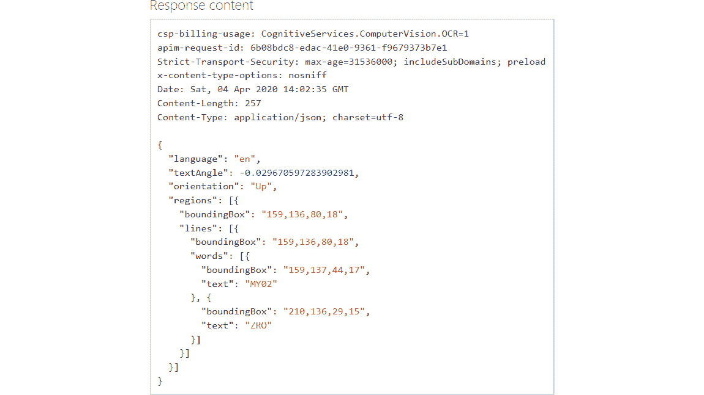

# 19. 架构智能解决方案

云技术改变了许多事情，包括以灵活、可扩展、按需付费的方式创建智能应用程序。云技术兴起之前的应用程序通常没有内嵌智能，主要是因为：

+   它既耗时又容易出错。

+   持续编写、测试和实验算法是困难的。

+   缺乏足够的数据。

+   这非常昂贵。

在过去的十年里，有两件事发生了变化，导致了比以往更加智能的应用程序的诞生。这两件事是云计算的按需无限可扩展性以及数据在体积、种类和速度上的可用性。

在本章中，我们将探讨能够帮助在 Azure 上构建智能应用程序的架构。本章涵盖的一些主题包括：

+   AI 的演变

+   Azure AI 流程

+   Azure 认知服务

+   构建光学字符识别服务

+   使用 Cognitive Search .NET SDK 构建视觉特征服务

## AI 的演变

AI 并不是一个新兴的知识领域。实际上，这项技术是几十年的创新和研究的结果。然而，过去几十年的实施面临以下挑战：

1.  **成本**：AI 实验本质上非常昂贵，而且当时没有云技术。所有基础设施要么是购买的，要么是从第三方租赁的。实验的设置也非常耗时，并且需要大量技能才能入门。大量的存储和计算能力也被要求，而这些在整个社区中通常缺乏，只掌握在少数几个人手中。

1.  **数据不足**：几乎没有智能手持设备和传感器生成数据。数据本质上是有限的，并且需要采购，这再次使得 AI 应用程序成本高昂。数据的可靠性也较差，普遍缺乏对数据本身的信任。

1.  **难度**：AI 算法的文档化程度不足，主要存在于数学家和统计学家的领域。它们难以创建并在应用程序中使用。试想 15 年前创建一个**光学字符识别**（**OCR**）系统，当时几乎没有任何库、数据、处理能力或开发 OCR 应用程序所需的技能。

尽管随着时间的推移数据的流入不断增加，但仍缺乏能够以有助于商业价值的方式理解数据的工具。此外，优秀的 AI 模型基于足够准确的数据，并通过算法进行训练，以便解决现实生活中的问题。云技术以及大量的传感器和手持设备重新定义了这一格局。

借助云技术，能够为基于 AI 的应用程序提供按需存储和计算资源。云基础设施提供大量的数据迁移、存储、处理和计算资源，同时生成洞察，并最终提供报告和仪表盘。所有这些都以最低的成本和更快的速度完成，因为没有涉及任何物理设备。让我们深入了解构建基于 AI 的应用程序背后的过程。

## Azure AI 处理

每个基于 AI 的项目都需要经过一定的步骤，才能投入使用。让我们来了解这七个阶段：

### 数据摄取

在这个阶段，数据从多个来源采集并存储，以便在下一阶段使用。数据在存储之前会进行清洗，并且任何偏离常规的数据都会被忽略。这是数据准备的一部分。数据可以具有不同的速度、种类和规模。它可以像关系型数据库一样是结构化的，像 JSON 文档一样是半结构化的，或像图片、Word 文档等一样是非结构化的。

### 数据转化

所摄取的数据会被转化成另一种格式，因为它可能无法以当前格式使用。数据转化通常包括清洗和过滤数据，去除数据偏差，通过与其他数据集结合来增强数据，基于现有数据创建额外数据等。这也是数据准备的一部分。

### 分析

最后一阶段的数据会被重新用于分析。分析阶段包括在数据中寻找模式、进行探索性数据分析，并从中生成进一步的洞察。这些洞察与现有数据一起存储，以便在下一阶段使用。这是模型包装过程的一部分。

### 数据建模

一旦数据被增强和清洗，适当且必要的数据会提供给 AI 算法，以生成有助于实现整体目标的模型。这是一个迭代过程，称为通过使用不同数据组合（特征工程）进行实验，以确保数据模型的健壮性。这也是模型包装过程的一部分。

数据被输入到学习算法中，以识别模式。这个过程称为训练模型。随后，使用测试数据验证模型的有效性和效率。

### 验证模型

一旦模型创建完成，就会使用一组测试数据来检验其有效性。如果从测试数据中得到的分析结果反映了现实情况，那么该模型是健全且可用的。测试是 AI 过程中的一个重要环节。

### 部署

模型被部署到生产环境，以便实时数据能够输入模型并获得预测输出。然后，这些输出可以在应用程序中使用。

### 监控

部署到生产环境中的模型会持续进行监控，用于对所有进入的数据进行未来分析，并重新训练和提升模型的效果。

AI 的各个阶段和过程本质上是耗时且迭代的。因此，基于它们的应用程序具有固有的风险，可能会长时间运行、处于实验阶段、资源密集，并且可能出现成本超支和延期，成功的几率较低。

记住这些要点后，应该有现成的基于 AI 的解决方案，供开发人员在其应用程序中使用，使它们变得更加智能。这些 AI 解决方案应该易于从应用程序中消费，并具备以下特性：

+   **跨平台**：使用任何平台的开发者都应该能够消费这些服务。它们应该能够在 Linux、Windows 或 Mac 平台上进行部署和使用，而不会出现兼容性问题。

+   **跨语言**：开发者应该能够使用任何语言来消费这些解决方案。这样，开发者不仅能遇到较短的学习曲线，而且也不需要更改自己偏好的编程语言来使用这些解决方案。

这些解决方案应该作为服务进行部署，使用行业标准和协议。通常，这些服务作为 HTTP REST 端点提供，可以使用任何编程语言和平台进行调用。

有许多此类服务可以被建模并部署以供开发者使用。以下是一些示例：

+   **语言翻译**：在此类服务中，用户提供一种语言的文本，并获得该文本对应的另一种语言的输出。

+   **字符识别**：这些服务接受图像并返回其中的文本内容。

+   **语音转文本转换**：这些服务可以将输入的语音转换为文本。

现在我们已经详细了解了构建基于 AI/ML 的项目，让我们深入探讨一下 Azure 提供的各种认知服务的应用。

## Azure 认知服务

Azure 提供了一个名为 Azure 认知服务的总服务。Azure 认知服务是一组服务，开发者可以在他们的应用程序中使用这些服务，将应用程序转变为智能应用程序。


###### 表 19.1：Azure 认知服务

根据服务的性质，这些服务已被分为五大类。这五大类如下：

### 视觉

这个 API 提供了图像分类的算法，并通过提供有意义的信息来帮助图像处理。计算机视觉可以从图像中提供关于不同物体、人物、字符、情感等的多种信息。

### 搜索

这些 API 有助于与搜索相关的应用程序。它们可以基于文本、图像、视频进行搜索，并提供自定义搜索选项。

### 语言

这些 API 基于自然语言处理，帮助提取用户提交文本的意图信息及实体检测。它们还帮助进行文本分析和翻译成不同语言。

### 语音

这些 API 有助于将语音转换为文本、将文本转换为语音以及语音翻译。它们可以用于接收音频文件并基于内容为用户执行操作。Cortana 是一个使用类似服务，根据语音为用户执行操作的例子。

### 决策

这些 API 有助于异常检测和内容审核。它们可以检查图像、视频和文本中的内容，并找出需要突出显示的模式。此类应用的一个例子是显示有关成人内容的警告。

现在你已经理解了认知服务的核心内容，接下来我们将详细讨论它们的工作原理。

## 理解认知服务

Azure 认知服务由接受请求并将响应发送回调用者的 HTTP 端点组成。几乎所有的请求都是 HTTP POST 请求，包含请求头和请求体。

认知服务的配置会生成两个重要的产物，帮助调用者成功调用端点。它生成一个端点 URL 和一个唯一的密钥。

URL 的格式是 `https://{azure location}.api.cognitive.microsoft.com/{cognitive type}/{version}/{sub type of service}?{query parameters}`。一个示例 URL 如下：

`https://eastus.api.cognitive.microsoft.com/vision/v2.0/ocr?language=en&detectOrientation=true`

认知服务在美国东部 Azure 区域配置。服务类型为计算机视觉，使用版本 2，子类型为 OCR。每个顶级类别通常有几个子类型。最后，还有一些查询字符串参数，如 `language` 和 `detectOrientation`。这些查询参数对于每个服务类别和子类别都是不同的。

无论是请求头还是查询参数，都应该提供密钥值，以确保端点调用成功。

密钥值应该与请求一起分配给 `Ocp-Apim-Subscription-Key` 请求头。

请求体的内容可以是简单字符串、二进制数据或两者的组合。根据值的不同，应该在请求中设置适当的 content-type 头。

可能的头部值包括：

+   `Application/octet-stream`

+   `multipart/form-data`

+   `application/json`

当发送二进制数据时，请使用 `octet-stream`，发送字符串值时使用 `json`。`form-data` 可用于发送二进制和文本的多种组合值。

密钥是一个唯一的字符串，用于验证调用者是否被授权调用 URL。这个密钥必须受到保护，确保不应有权限调用端点的人员无法访问它。稍后你将在本章中看到如何保护这些密钥的方法。

### 使用认知服务

有两种方式可以使用认知服务：

+   **直接使用 HTTP 端点**：在这种情况下，直接通过构造适当值的标头和请求体来调用端点。然后解析返回值并提取数据。认知服务中的所有 AI 服务都是 REST API。它们接受 JSON 格式的 HTTP 请求及其他格式，并以 JSON 格式回复。

+   **使用 SDK**：Azure 提供了多个**软件开发工具包**（**SDKs**）。.NET、Python、Node.js、Java 和 Go 语言都有可用的 SDK。

在接下来的章节中，我们将探讨如何通过两种方式使用认知服务之一。我们将通过构建一些 AI 服务并使用 HTTP 端点来探索这一点。

## 构建 OCR 服务

在本节中，我们将使用 C# 和 PowerShell 展示如何使用 HTTP 端点直接调用一些 AI 服务。下一节将重点介绍使用 .NET SDK 完成相同的操作。

在构建使用认知服务的项目之前，第一步是配置 API 本身。

光学字符识别作为视觉 API 提供，并可以通过 Azure 门户进行配置，如下所示。通过导航到**认知服务 > 计算视觉 > 创建**来创建视觉 API，如*图 19.1*所示：


###### 图 19.1：创建视觉 API

一旦 API 配置完成，概述页面会提供所有用于使用该 API 的详细信息。它提供基础 URL 和密钥信息。请记下该密钥，后续会用到：


###### 图 19.2：概述页面

它还提供了一个 API 控制台，方便快速测试 API。点击它会打开一个新窗口，显示所有与该服务相关的端点。点击 `POST` 方法后，URL 会指向位于东美国 Azure 区域的端点。它还与视觉 API 组版本 2 和 OCR 端点相关。

订阅密钥会通过名为`ocp-apim-subscription-key`的标头传递。标头还包含 `application/json` 作为值的 content-type 密钥。这是因为请求体包含 JSON 字符串。请求体是 JSON 格式，包含需要提取文本的图像 URL：


###### 图 19.3：请求 URL

可以通过点击**发送**按钮将请求发送到端点。如果一切正常，将返回 HTTP 响应 200 OK，如下所示。如果请求值有错误，响应将是一个错误的 HTTP 代码：



###### 图 19.4：HTTP 响应 200 OK

响应包含与计费使用相关的详细信息、由端点生成的内部请求 ID、内容长度、响应内容类型（为 JSON）以及响应的日期和时间。响应的内容是一个 JSON 负载，包含文本的坐标和实际文本。

### 使用 PowerShell

相同的请求可以通过 PowerShell 创建。以下 PowerShell 代码可以通过 PowerShell ISE 执行。

代码使用 `Invoke-WebRequest` cmdlet 通过 `POST` 方法传递 URL 到 `Uri` 参数来调用认知服务端点，并添加上一节中讨论的适当头信息，最后是包含 JSON 格式数据的请求体。数据使用 `ConvertTo-Json` cmdlet 转换为 JSON 格式：

```
$ret = Invoke-WebRequest -Uri "https://eastus.api.cognitive.microsoft.com/vision/v2.0/ocr?language=en&detectOrientation=true"  -Method Post -Headers @{"Ocp-Apim-Subscription-Key"="ff0cd61f27d8452bbadad36942570c48"; "Content-type"="application/json"} -Body $(ConvertTo-Json -InputObject  @{"url"="https://ichef.bbci.co.uk/news/320/cpsprodpb/F944/production/_109321836_oomzonlz.jpg"}) 
$val = Convertfrom-Json $ret.content
foreach ($region in $val.regions) {
    foreach($line in $region.lines) {
        foreach($word in $line.words) {
            $word.text
        }
    }
} 
```

来自 cmdlet 的响应被保存在一个变量中，该变量也包含 JSON 格式的数据。使用 `Convertfrom-Json` cmdlet 将数据转换为 PowerShell 对象，并循环遍历以查找文本中的单词。

### 使用 C#

在本节中，我们将构建一个服务，该服务应接受用户请求，提取图像的 URL，构建 HTTP 请求并将其发送到认知服务端点。认知服务端点返回一个 JSON 响应。响应中提取适当的文本内容并返回给用户。

**架构与设计**

智能应用程序是一个 ASP.NET Core MVC 应用程序。MVC 应用程序由开发人员在开发机上构建，通过持续集成和交付管道，生成 Docker 镜像，并将 Docker 镜像上传到 Azure 容器注册表。在这里，解释了应用程序的主要组件及其使用方法：


###### 图 19.5：智能应用程序的工作流程

**Docker**

Docker 是容器技术中的重要组成部分，并且支持跨平台，包括 Linux、Windows 和 Mac。以容器化为思路开发应用程序和服务，提供了跨云和不同位置以及本地部署的灵活性。它还消除了对宿主平台的依赖，这样就减少了对平台即服务的依赖。Docker 有助于创建自定义镜像，容器可以从这些镜像中创建。这些镜像包含使应用程序或服务能够运行的所有依赖项、二进制文件和框架，并且它们是完全自给自足的。这使得它们成为微服务等服务的优秀部署目标。

**Azure 容器注册表**

Azure 容器注册表是一个类似于 Docker Hub 的注册表，用于存储容器镜像。可以创建多个存储库并上传多个镜像。每个镜像都有一个名称和版本号，合起来形成一个完整的名称，用于在 Kubernetes Pod 定义中引用它们。这些镜像可以被任何 Kubernetes 生态系统访问和下载。前提是已经为拉取镜像创建了适当的密钥。容器注册表不需要与 Kubernetes 节点在同一网络中，实际上，创建和使用 Azure 容器注册表时无需网络。

**Azure Kubernetes Service**

接受图像 URL 并提取其中文本的智能应用程序可以托管在普通虚拟机上，甚至可以在 Azure App Service 中运行。然而，在 Azure Kubernetes Service 中部署提供了许多优势，这些内容在*第八章，Azure Kubernetes 解决方案架构*中有详细介绍。目前，重要的是要知道，这些应用程序天生具有自愈能力，Kubernetes 主节点会自动维护最小数量的实例，并提供多种方式来更新它们，包括蓝绿部署和金丝雀更新。

**Pods、副本集和部署**

开发人员还创建了一个与 Kubernetes 部署相关的 YAML 文件，该文件引用了 Pod 规范中的镜像，并提供了副本集的规范。它还提供了与更新策略相关的自定义规范。

**运行时设计**

架构和设计与前一部分相同；然而，当应用程序或服务已经上线并运行时，它已经从 Azure 容器注册表下载了镜像，并在其中创建了运行容器的 Pod。当用户提供一个图像 URL 以解码其中的文本时，Pod 中的应用程序调用 Azure Cognitive Services 计算机视觉 API，并将 URL 传递给它，等待服务响应：


###### 图 19.6 智能应用的工作流

一旦收到服务返回的 JSON 响应，它就可以提取信息并返回给用户。

### 开发过程

开发环境可以是 Windows 或 Linux。它可以在 Windows 10 和 Windows 2016/19 服务器上运行。在使用 Windows 时，部署 Docker for Windows 非常有用，这样它会创建 Linux 和 Windows 两种 Docker 环境。

使用 Visual Studio 2019 创建 ASP.NET Core Web 应用程序项目时，`Dockerfile`的主要区别是基础镜像名称。它使用不同的镜像来支持 Linux 和 Windows。

安装 Docker for Windows 时，它还会安装一个 Linux 虚拟机，因此启用 Hyper-V 虚拟化程序非常重要。

在此示例中，图像被下载而不是将数据作为 JSON 字符串发送，并且二进制数据被发送到认知服务终结点。

它具有一个接受字符串输入的功能，用于 URL 值。然后，它调用认知服务，并使用适当的头部值和包含 URL 的请求体。头部值应包含认知服务在配置服务时提供的密钥。请求体中的值可以包含以 JSON 形式表示的普通字符串值，也可以包含二进制图像数据。content-type 头部属性应相应设置。

代码声明了与认知服务相关的 URL 和密钥。这里只是为了演示 purposes，URL 和密钥应放在配置文件中。

使用 `HttpClient` 对象，下载用户提供的 URL 对应的图像并将其存储在 `responseMessage` 变量中。然后实例化另一个 `HttpClient` 对象，并用 `Ocp-Apim-Subscription-Key` 和 `content-type` 密钥填充其头部。由于传递的是二进制数据，因此 content-type 头部的值应设置为 `application/octet-stream`。

提取 `responseMessage` 变量中的内容后，发出一个 POST 请求，并将其作为请求体传递给认知服务终结点。

控制器操作的代码如下所示：

```
        [HttpPost]
        public async Task<string> Post([FromBody] string value)
        {
            string myurl = " https://eastus.api.cognitive.microsoft.com/vision/v2.0/ocr?language=en&detectOrientation=true
            string token = "…………………………";
            using (HttpClient httpClient = new HttpClient())
            {
                var responseMessage = await httpClient.GetAsync(value);
                 using (var httpClient1 = new HttpClient())
                {
                     httpClient1.BaseAddress = new Uri(myurl);
                   httpClient1.DefaultRequestHeaders.Add("Ocp-Apim-Subscription-Key", token);
                    HttpContent content = responseMessage.Content;
                    content.Headers.ContentType = new MediaTypeWithQualityHeaderValue("application/octet-stream");
                    var response = await httpClient1.PostAsync(myurl, content);
                    var responseContent = await response.Content.ReadAsByteArrayAsync();
                    string ret = Encoding.ASCII.GetString(responseContent, 0, responseContent.Length);
                    dynamic image = JsonConvert.DeserializeObject<object>(ret);
                    string temp = "";
                    foreach (var regs in image.regions)
                    {
                        foreach (var lns in regs.lines)
                        {
                            foreach (var wds in lns.words)
                            {
                                temp += wds.text + " ";
                            }
                        }
                    }
                    return temp;
                }
            }
        }
```

在终结点完成处理后，它返回一个带有 JSON 有效负载的响应。上下文被提取并反序列化为 .NET 对象。编写了多个循环来从响应中提取文本。

在本节中，我们创建了一个简单的应用程序，利用认知服务通过 OCR API 提供从特征中提取单词的功能，并将其部署到 Kubernetes Pods 中。此过程和架构可以用于任何想要调用认知服务 API 的应用程序。接下来，我们将了解另一个认知服务 API，称为视觉特征。

## 使用 Cognitive Search .NET SDK 构建视觉特征服务

上一节介绍了创建一个使用 OCR 认知终结点返回图像中文本的服务。在本节中，将创建一个新的服务，该服务返回图像中的视觉特征，例如描述、标签和对象。

### 使用 PowerShell

PowerShell 中的代码与之前的 OCR 示例类似，因此在此不再重复。URL 与之前的代码示例不同：


###### 图 19.7：请求 URL

请求使用 `POST` 方法，并且 URL 指向东部美国 Azure 区域的终结点。它还使用版本 2，并调用视觉 API。

认知服务访问密钥是 HTTP 头部的一部分，名为 `ocp-apim-subscription-key`。该头部还包含名为 `content-type` 的头信息，值为 `application/json`。这是因为请求的正文包含 JSON 格式的数据。正文中包含提取文本所需的图像 URL。

响应将以 JSON 格式返回，包含图像内容和描述。

### 使用 .NET

这个示例再次是一个 ASP.NET Core MVC 应用程序，已安装 `Microsoft.Azure.CognitiveServices.Vision.ComputerVision` NuGet 包：


###### 图 19.8：带有 Microsoft.Azure.CognitiveServices.Vision.ComputerVision NuGet 包的 ASP.NET Core MVC 应用程序

控制器操作的代码如下所示。在这段代码中，声明了认知服务和密钥，还声明了 `ComputerVisionClient` 和 `VisionType` 对象的变量。它创建了一个 `ComputerVisionClient` 类型的实例，提供了 URL 和密钥。

`VisionTypes` 列表包含了从图像中提取的多种数据类型——标签、描述和对象等。只有这些参数会从图像中提取。

创建一个 `HttpClient` 对象，通过用户提供的 URL 下载图像，并使用 `ComputerVisionClient` 类型的 `AnalyzeImageInStreamAsync` 函数将这些二进制数据发送到认知服务端点：

```
[HttpPost]
        public string Post([FromBody] string value)
        {
        private string visionapiurl = " https://eastus.api.cognitive.microsoft.com/vision/v2.0/analyze?visualFeaure=tags,description,objects&language=en";
        private string apikey = "e55d36ac228f4d718d365f1fcddc0851";
        private ComputerVisionClient client;
        private List<VisualFeatureTypes> visionType =  new List<VisualFeatureTypes>();
client = new ComputerVisionClient(new ApiKeyServiceClientCredentials(apikey)) { 
                Endpoint = visionapiurl
            };
            visionType.Add(VisualFeatureTypes.Description);
            visionType.Add(VisualFeatureTypes.Tags);
            visionType.Add(VisualFeatureTypes.Objects);

            string tags = "";
            string descrip   = "";
            string objprop = "";
            using (HttpClient hc = new HttpClient()) {
                var responseMessage =  hc.GetAsync(value).GetAwaiter().GetResult();
                Stream streamData = responseMessage.Content.ReadAsStreamAsync().GetAwaiter().GetResult();
                var result = client.AnalyzeImageInStreamAsync(streamData, visionType).GetAwaiter().GetResult();
                foreach (var tag in result.Tags) {
                    tags += tag.Name + " ";
                }
                foreach (var caption in result.Description.Captions)
                {
                    descrip += caption.Text + " ";
                }
                foreach (var obj in result.Objects)
                {
                    objprop += obj.ObjectProperty + " ";
                }
            }
	return tags;
	// return descrip or objprop

        }
```

对结果进行循环处理并将标签返回给用户。同样，描述和对象属性也可以返回给用户。现在让我们来看一下如何保护服务密钥的暴露。

## 保护认知服务密钥

有多种方法可以保护密钥不被其他方暴露。可以通过 Azure 中的 API 管理资源来实现，也可以通过 Azure Functions 代理来实现。

### 使用 Azure Functions 代理

Azure Functions 代理可以引用任何 URL，无论是内部还是外部。当请求到达 Azure Functions 代理时，它会使用认知服务的 URL 和密钥来调用认知服务端点，并会覆盖请求参数，将传入的图像 URL 作为 POST 数据附加到认知端点 URL 上。当服务返回响应时，它会覆盖响应，移除头信息，并将 JSON 数据传递回用户。

## 使用认知服务

使用认知服务遵循一致的模式。每个认知服务都可以通过 REST API 提供，每个 API 需要不同的参数集。调用这些 URL 的客户端应查阅相关文档以获取参数，并为它们提供相应的值。直接使用 URL 调用是使用认知服务的一种相对原始的方法。Azure 为每项服务提供了 SDK，并支持多种编程语言。客户端可以使用这些 SDK 来与认知服务进行交互。

`https://{luis resource name}-authoring.cognitiveservices.azure.com/` 和生产 API 可在此访问

`https://{azure region}.api.cognitive.microsoft.com/luis/prediction/v3.0/apps/{application id}/slots/production/predict?subscription-key={cognitive key} &verbose=true&show-all-intents=true&log=true&query=YOUR_QUERY_HERE`。

同样，Face API 可在 `https://{endpoint}/face/v1.0/detect[?returnFaceId][&returnFaceLandmarks][&returnFaceAttributes][&recognitionModel][&returnRecognitionModel][&detectionModel]` 访问。

有许多认知服务 API，每个 API 在 URL 方面有不同的版本，了解这些 URL 的最佳方式是使用 Azure 文档。

## 概述

在本章中，您了解了在 Azure 中创建智能应用程序的部署架构和应用程序架构。Azure 提供了大量的认知服务端点——每个端点负责执行与 AI 相关的算法并提供输出。几乎所有的认知服务端点在处理 HTTP 请求和响应方面工作方式相似。这些端点也可以通过 Azure 提供的不同语言 SDK 进行调用，您已看到使用这些 SDK 获取视觉特征的示例。Azure 提供了超过 50 个不同的端点，建议您通过 Azure 提供的 API 控制台功能来了解端点的性质。
