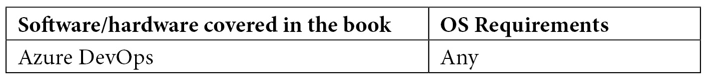

# 前言

DevOps 在近年来已经成为一个热门词汇。DevOps 是一种结合了文化理念、实践和工具的模式，能够提高组织以高速度和高质量交付应用程序和服务的能力。Azure DevOps 是微软提供的**软件即服务**（**SaaS**）平台，提供一整套工具，用于通过应用 DevOps 技术开发和部署软件。本书首先概述了 Azure DevOps 平台，然后深入探讨了各种工具和功能，如项目管理的看板、源代码管理的代码库、构建和发布管道、测试计划、工件等。

阅读本书后，您将对 Azure DevOps 能够为您提供的提升开发生命周期的工具和功能有一个完整清晰的认识。

# 本书适合谁阅读

本书面向希望将 DevOps 技术应用到项目中，并使用 Azure DevOps 来管理整个应用开发过程的解决方案开发人员/架构师和项目经理。

# 本书涵盖的内容

*第一章*，*Azure DevOps 概述*，为您提供了 Azure DevOps 的完整概述，包括看板、代码库、管道、测试计划和工件等工具集。

*第二章*，*使用 Azure DevOps 看板管理项目*，详细解释了 Azure DevOps 的项目管理功能，并展示了如何使用看板和工作项、如何创建冲刺、如何管理待办事项以及如何跟踪所有活动。

*第三章*，*使用 Azure DevOps 进行源代码管理*，解释了如何使用 Azure DevOps Repos 功能和 Git 进行源代码控制。它展示了如何创建代码库、如何处理提交、推送和拉取、如何处理分支等内容。

*第四章*，*理解 Azure DevOps 管道*，展示了如何为代码创建构建管道，并使用 Azure Pipelines 最佳地处理持续集成。

*第五章*，*在构建管道中运行质量测试*，解释了如何在构建管道中创建和执行代码质量测试。

*第六章*，*托管您自己的 Azure 管道代理*，展示了如何创建自己的构建代理并将其用于构建管道中。

*第七章*，*在 Azure DevOps 中使用工件*，解释了如何使用工件（软件包源）创建和共享软件包，并将完全集成的软件包管理功能添加到您的持续集成/持续交付管道中。

*第八章*，*使用 Azure DevOps 部署应用程序*，解释了如何使用发布管道处理代码的持续部署，并展示如何在将代码发布到生产环境之前使用阶段和审批。

*第九章*，*将 Azure DevOps 与 GitHub 集成*，向你展示如何将 Azure DevOps 工具与 GitHub 集成，并在你的持续集成/持续交付过程中使用这两个应用程序。

*第十章*，*在 Azure DevOps 中使用测试计划*，展示了如何在 Azure DevOps 中使用测试计划管理项目的测试生命周期。

*第十一章*，*使用 Azure DevOps 的真实世界 CI/CD 场景*，向你展示了如何使用 Azure DevOps 处理真实世界中的持续集成/持续交付场景。

# 为了充分利用本书

要跟随本书中描述的主题，你需要拥有有效的 Azure DevOps 订阅。你可以通过以下链接激活免费账户：

[`azure.microsoft.com/en-us/services/devops/`](https://azure.microsoft.com/en-us/services/devops/)



**如果你正在使用本书的数字版，我们建议你亲自输入代码或通过 GitHub 仓库访问代码（链接将在下一节提供）。这样做可以帮助你避免复制粘贴代码时可能出现的错误**。

# 下载示例代码文件

你可以从 GitHub 下载本书的示例代码文件：[`github.com/PacktPublishing/`](https://github.com/PacktPublishing/)Learning-Azure-DevOps---B16392。如果代码有更新，将会在现有的 GitHub 仓库中更新。

我们还提供了来自我们丰富书籍和视频目录的其他代码包，您可以在[`github.com/PacktPublishing/`](https://github.com/PacktPublishing/)查看！  

# 下载彩色图片

我们还提供了一个 PDF 文件，其中包含本书中使用的截图/图表的彩色图片。你可以在这里下载：`www.packtpub.com/sites/default/files/downloads/9781800563513_ColorImages.pdf`。

# 使用的约定

本书中使用了多种文本约定。

`文本中的代码`：表示文本中的代码词汇、数据库表名、文件夹名、文件名、文件扩展名、路径名、虚拟 URL、用户输入和 Twitter 用户名。比如：“你可以下载名为`node-v6.12.3-x64.msi`的文件，并使用交互式安装程序安装它。”

一段代码块设置如下：

```
using System;
```

```
using PartsUnlimited.Models;
```

```
namespace AzureArtifacts
```

```
{
```

```
    class Program
```

```
    {
```

```
        static void Main(string[] args)
```

```
        {
```

```
            Console.WriteLine('Hello World!');
```

```
            CartItem caritem = new CartItem()
```

当我们希望引起你对某个代码块中特定部分的注意时，相关的行或项目会用粗体显示：

```
[Net.ServicePointManager]::SecurityProtocol = [Net.SecurityProtocolType]::Tls12
```

```
Install-Module AzureRM -AllowClobber
```

任何命令行输入或输出均按以下格式编写：

```
docker run \
```

```
  -e VSTS_ACCOUNT=<name> \
```

```
  -e VSTS_TOKEN=<pat> \
```

```
  -it mcr.microsoft.com/azure-pipelines/vsts-agent
```

**粗体**：表示新术语、重要词汇或你在屏幕上看到的词汇。例如，菜单或对话框中的词汇会以这种方式显示。这里有个例子：‘使用你的微软账户登录，在左侧菜单中选择**Artifacts**’。

提示或重要说明

如此显示。

# 联系我们

我们欢迎读者的反馈。

**一般反馈**：如果你对本书的任何部分有疑问，请在邮件主题中注明书名，并通过 customercare@packtpub.com 与我们联系。

**勘误**：虽然我们已尽力确保内容的准确性，但错误仍有可能发生。如果你在本书中发现错误，我们将非常感激你向我们报告。请访问 [www.packtpub.com/support/errata](http://www.packtpub.com/support/errata)，选择你的书籍，点击“勘误提交表单”链接并填写相关信息。

**盗版**：如果你在互联网上发现任何非法复制我们的作品的形式，我们将非常感激你提供相关地址或网站名称。请通过 copyright@packt.com 与我们联系，并附上该材料的链接。

**如果你有兴趣成为作者**：如果你在某个领域拥有专业知识并且有兴趣写作或为书籍做贡献，请访问 [authors.packtpub.com](http://authors.packtpub.com)。

# 评价

请留下评价。阅读并使用本书后，为什么不在购买网站上留下评价呢？潜在读者可以参考你的公正意见来做购买决定，我们在 Packt 可以了解你对我们产品的看法，作者也可以看到你对他们书籍的反馈。谢谢！

欲了解更多关于 Packt 的信息，请访问 [packt.com](http://packt.com)。
