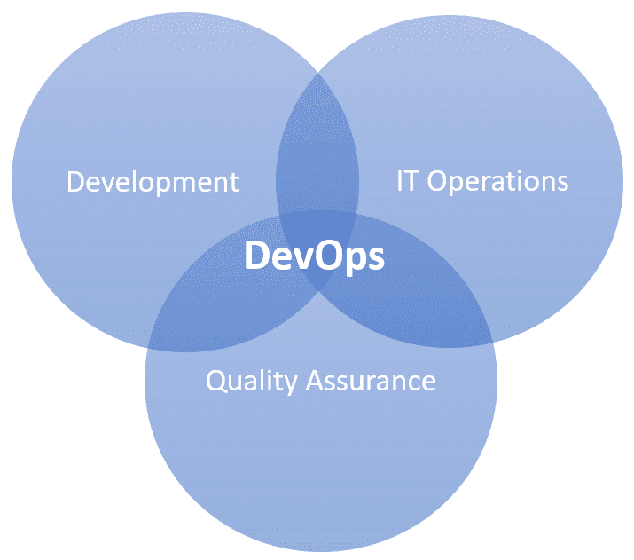
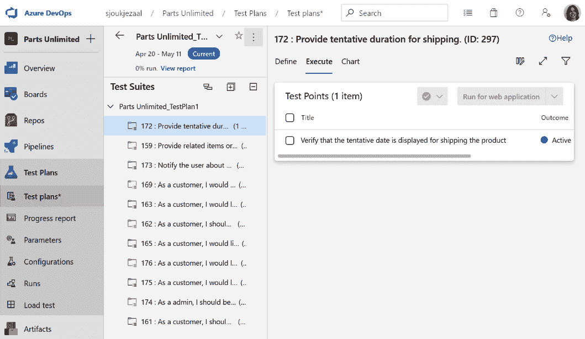

# 第一章：Azure DevOps 概述

本章介绍了本书的第一个主题：**DevOps**原则和**Azure DevOps**项目管理。在本章中，我们将从介绍 DevOps 开始，并概述不同的 DevOps 原则。接下来，我们将介绍 Azure DevOps 的关键概念及其提供的不同服务。最后，我们将介绍本书将使用的场景。

本章将覆盖以下主题：

+   介绍 DevOps

+   理解 DevOps 原则

+   介绍 Azure DevOps 关键概念

+   探索 Azure DevOps 服务

+   介绍场景

让我们开始吧！

# 介绍 DevOps

长时间以来，开发和运维一直被分割成相互独立的模块，双方各自有着不同的关注点和责任。开发人员编写代码并确保其在开发系统上正常运行，而系统管理员则负责在组织的 IT 基础设施中进行实际的部署和集成。

由于这两个独立模块之间的沟通有限，两支团队大多是分开工作的。然而，他们又非常依赖对方，因为不同团队之间缺乏跨平台的知识。

这一方法与大多数项目中使用的瀑布模型非常契合。瀑布模型基于**软件开发生命周期**（**SDLC**），它有明确的流程来创建软件。瀑布模型将项目交付物分解为线性顺序的阶段，每个阶段依赖于前一个阶段的交付物。这个事件序列可能如下所示：

图 1.1 – 瀑布模型

瀑布模型非常适合以下情况下的项目：

+   在开发生命周期的早期，客户和开发人员就要达成一致，确定交付内容，并在项目开发过程中尽量避免修改。

+   对于与外部系统的集成，通常需要多个软件组件并行设计。在这种情况下，尽早完成设计文档是理想的做法。

+   各个团队成员通常也会同时参与其他项目。例如，业务分析师可以收集需求并创建设计，而开发人员则在处理另一个项目。

+   当无法将需求阶段分解时，客户无法充分参与到较小的交付物中。

然而，客户在看到可工作的软件之前，可能并不完全知道他们的需求。这可能导致需求的变更，从而引发重新设计、重新实现和重新验证。这会显著增加项目的成本。

因此，敏捷和 DevOps 于 2009 年被引入，并慢慢地在软件开发界占据主导地位。它们取代了大多数项目中使用的瀑布模型。DevOps 是敏捷和持续交付方法的自然延伸，代表了开发和运维。它是一种将开发、IT 运维和质量保证融合为一个连续过程的实践。

以下图表展示了 DevOps 的不同组成部分：

图 1.2 – DevOps 方法论

这是一种基于团队的迭代式开发方法，所有利益相关者，如开发人员、管理员、测试人员以及客户代表，都属于同一个团队。应用程序以功能组件的形式交付，而不是在项目开始时创建时间表和任务，项目被划分为较小的阶段，称为冲刺。每个冲刺的持续时间在前期定义，并在每个冲刺开始时规划好交付物的清单。所有这些交付物都是与客户一起定义的，并由客户按照业务价值进行优先级排序。在每个冲刺结束时，完成的工作将通过日常构建和冲刺结束时的演示进行团队评审和评估。

这带来了以下优势：

+   通过在整个项目过程中与项目团队直接合作，客户将体验到更强的归属感。

+   客户有机会在项目的早期阶段查看交付的工作，并可以对此做出适当的决策和调整。

+   开发更加注重业务和价值。这是与客户更紧密合作并更好地理解其需求的结果。

+   敏捷工作方式使我们能够迅速创建产品的基础版本，并在后续迭代中进行构建。

在简要介绍完 DevOps 后，我们将探讨不同的 DevOps 原则。

# 理解 DevOps 原则

关于 DevOps 有很多不同的定义。它们大多数擅长解释在交付软件和 IT 项目中寻找合适流程的不同方面。在接下来的章节中，我们将重点介绍我们认为在采用 DevOps 工作方式时至关重要的六个 DevOps 原则。

## 原则 1 – 以客户为中心的行动

如今，软件开发项目需要具有短周期和反馈循环，并将最终用户和真实客户融入团队。为了充分满足客户的需求，所有与构建软件和产品相关的活动必须涉及这些客户。DevOps 团队和组织必须持续投资于产品和服务，以便让客户获得最大的成果，同时保持尽可能精简，以便在策略不再有效时持续创新并进行调整。

## 原则 2 – 以终为始

组织需要更像产品公司一样运作。他们应该更多地关注构建可以销售给真实客户的可用产品。这种工程思维需要被所有员工共享，才能实现这些产品。这意味着他们应该放弃那种每个部门只关注特定角色并承担独立责任的做法。

## 原则 3 – 端到端责任

在大多数传统软件开发项目中，开发的软件和服务会交给运维部门，由他们在初始开发过程后进行部署和维护。通过采用 DevOps 工作方式，DevOps 团队将对他们交付的项目承担完全的责任和义务。这意味着，一旦产品由团队交付并需要维护，它仍然由团队负责。团队还将为该产品提供支持，直到它达到生命周期的终点。这大大增加了团队的责任感，并提高了开发产品的质量。

## 原则 4 – 跨职能自治团队

与垂直和完全负责的团队合作的组织，需要让这些团队在整个生命周期中完全独立工作。为了使这些团队能够完全独立工作，需要具备广泛且均衡的技能组合。团队成员需要具备 T 型技能，而不是只擅长自己角色的老派 IT 专家。每个团队成员应该具备的技能包括开发、需求分析、测试和管理技能等。

## 原则 5 – 持续改进

端到端责任的另一个部分是，对于组织来说，持续适应变化非常重要。可能会有许多变化的情况，比如发布了新技术、客户需求变化等。持续改进是 DevOps 中的一个重要关注点，旨在优化速度和成本，减少浪费，简化交付，并持续改进构建和发布的软件和服务。一个重要的活动是将实验融入这些循环中，这将使团队能够从失败中学习，这对于持续改进至关重要。

## 原则 6 – 自动化一切

要完全采纳并在组织内部嵌入持续改进文化，大多数组织需要消除大量浪费和技术债务。为了实现高循环率并尽早处理来自客户和最终用户的即时反馈，自动化一切变得至关重要。这意味着，不仅软件开发过程应使用持续交付自动化（包括持续开发和集成），而且整个基础设施环境也需要自动化。基础设施还需要为新的工作方式做好准备。从这个角度来看，自动化就是推动团队更新向客户交付服务方式的同义词。

在本节中，我们介绍了采纳或迁移到 DevOps 工作方式时非常重要的六个原则。在接下来的几个章节中，我们将讨论 Azure DevOps 作为支持团队以 DevOps 方式工作的工具所提供的功能。

# 引入 Azure DevOps 关键概念

Azure DevOps 为 DevOps 团队提供了多种服务，使他们能够规划、工作、协作开发代码，并构建和部署软件和服务。大多数 DevOps 团队依赖于多种工具，并为应用生命周期的每个阶段构建自定义工具链。

以下图表展示了定义在应用生命周期中的各个阶段：

图 1.3 – 应用生命周期阶段

在接下来的章节中，我们将详细解释这些阶段以及相应的 Microsoft 工具和产品。

## 规划

在规划阶段，团队可以使用看板和待办事项列表在 Azure Boards 中定义、跟踪并安排需要完成的工作。他们也可以使用 GitHub 进行此操作。在 GitHub 中，可以通过建议一个新想法或表示需要追踪一个 bug 来创建一个 issue。这些问题可以进行组织并分配给团队。

## 开发

开发阶段由 Visual Studio Code 和 Visual Studio 支持。Visual Studio Code 是一个跨平台编辑器，而 Visual Studio 是仅限 Windows 和 Mac 的 IDE。你可以使用 Azure DevOps 进行自动化测试，并使用 Azure Pipelines 创建自动构建来编译源代码。代码可以通过 Azure DevOps 或 GitHub 在团队之间共享。

## 交付

交付阶段是关于将应用程序和服务部署到目标环境的过程。你可以使用 Azure Pipelines 自动将代码部署到任何 Azure 服务或本地环境。你可以使用 Azure Resource Manager 模板或 Terraform 来为你的应用程序或基础设施组件创建环境。你还可以将 Jenkins 和 Spinnaker 集成到 Azure DevOps Pipelines 中。

## 运维

在这一阶段，你会为监控你的应用程序和服务实现全栈监控。你还可以使用不同的自动化工具来管理你的云环境，如 Azure Automation、Chef 等。保持你的应用程序和服务的安全也是这一阶段的一部分。因此，你可以使用诸如 Azure 策略和 Azure 安全中心等功能和服务。

为了支持分析、设计、构建、部署和维护软件及基础设施产品和服务的完整生命周期，Azure DevOps 提供了集成的功能，可以通过任何网络浏览器访问。

Azure DevOps 提供了一套解决方案和工具的组合，可用于在每个应用程序生命周期阶段创建独特且定制的工作流。这些解决方案将在接下来的章节中描述。

## 持续集成和持续交付（CI/CD）

你可以通过 CI/CD（以及持续部署）在 Azure DevOps 中自动化每个 DevOps 流程。CI 用于项目的开发阶段，指的是以完全自动化的方式构建和测试代码。每当你提交更改到主分支时，变更将会被验证，并自动打包成构建工件。使用 CD 时，交付阶段也会自动化。每当构建工件可用时，工件会自动部署到所需的环境中。当开发团队同时使用持续集成和持续部署时，代码始终可以随时准备好进行生产部署。团队部署一个可工作的应用程序到生产环境中所需做的唯一事情，就是触发从开发到部署的过渡。这将使自动化构建工件变得可用进行部署。这一触发过程可以简单到按下一个按钮。

使用 Azure DevOps，你还可以实现持续部署。将其添加到你的开发生命周期中意味着你可以自动化整个过程，从代码提交到生产部署。开发和交付阶段之间的触发过程是完全自动化的。因此，当代码更改经过验证并通过开发阶段进行的所有测试后，变更将自动发布到生产环境。这意味着客户会在新版本和相应的改进一经发布时就能立刻收到。

## 敏捷开发支持

Azure DevOps 支持采用敏捷开发方法的团队，提供计划、跟踪和报告功能。这将导致更短的发布周期和软件开发过程的完全可见性。你可以使用 Azure Boards（将在本章的下一部分详细介绍）来管理待办事项并定义、分配和跟踪工作项。你还可以使用高级分析和报告功能，创建自定义仪表板来跟踪进度。

## 版本控制

版本控制系统，也称为源代码控制系统，是多开发者项目的基本工具。它允许开发者在代码上进行协作并跟踪更改。所有代码文件的历史也会保存在版本控制系统中。这使得在出现错误或 bug 时，能够轻松回退到代码文件的其他版本。

Azure DevOps 支持两种不同类型的源代码管理：Git（分布式）和**团队基础版本控制**（**TFVS**）。使用 Git 时，每个开发者在其开发机器上都有一份源代码库的副本。所有的分支和历史信息都包含在源代码库中。每个开发者直接与自己本地的代码库副本进行工作，所有的更改通过一个单独的步骤在本地和源代码库之间共享。可以在本地文件系统上提交更改，并且可以在没有网络连接的情况下执行版本控制操作。开发者可以在开发机器上轻松创建分支，之后可以将其合并、发布或单独处理。使用 TFVC 时，开发者的本地开发机器上只有每个文件的一个版本。所有其他的文件以及历史数据都仅保存在服务器上。分支也在服务器上创建。

## 基础设施即代码

团队还可以在 Azure DevOps 中管理基础设施。项目中使用的基础设施组件，如网络、虚拟机和负载均衡器，可以使用与源代码相同的版本控制功能和能力进行管理。

与持续交付一起使用时，**基础设施即代码**（**IaC**）模型每次部署时都会生成相同的环境。如果没有 IaC，团队需要手动配置和维护所有单独部署环境的设置，这是一项耗时且容易出错的任务。最可能的结果是，随着时间推移，每个环境都会成为一个*独一无二的配置*，这种配置不再能被自动重现。环境之间的不一致性将在部署阶段导致问题。

## 配置管理

配置管理指的是与项目相关的所有项和工件，以及它们之间的关系。这些项会被存储、检索、唯一标识并修改。这包括源代码、文件和二进制文件等项。配置管理系统是唯一真正的配置项来源。

使用 Azure DevOps，团队可以管理整个系统中的资源配置，推出配置更新、强制执行所需的状态，并自动解决意外的变更和问题。Azure 提供了多种 DevOps 工具和功能来进行配置管理，例如 Chef、Puppet、Ansible 和 Azure Automation。

## 监控

你可以使用 Azure Monitor 来进行全栈持续监控。你的基础设施和应用程序的健康状况可以集成到 Grafana、Kibana 和 Azure 门户中的现有仪表盘中。你还可以监控应用程序的可用性、性能和使用情况，无论它们是托管在本地还是在 Azure 中。Azure Monitor 支持大多数流行的编程语言和框架，如 .NET、Java 和 Node.js，并与 Azure DevOps 中的 DevOps 流程和工具集成。

# 探索 Azure DevOps 服务

在本节中，我们将介绍 Azure DevOps 提供的不同服务。这些服务可以在整个生命周期中支持团队实现客户的业务价值。

## Azure Boards

Azure Boards 可以用于使用可用的敏捷规划工具计划、跟踪和讨论跨团队的工作。通过 Azure Boards，团队可以管理他们的软件项目。它还提供了一套独特的功能，包括对 Scrum 和 Kanban 的原生支持。你还可以创建可定制的仪表盘，并提供集成的报告和与 Microsoft Teams 和 Slack 的集成。

你可以使用 Azure Boards 创建并跟踪与项目相关的用户故事、待办事项、任务、特性和缺陷。

以下屏幕截图展示了一个 Azure Board 的示例：

图 1.4 – Azure Boards

## Azure Repos

Azure Repos 提供对私有 Git 仓库托管和**团队基础服务器控制**（**TFSC**）的支持。它提供了一套版本控制工具，可以用于管理每个开发项目的源代码，无论项目大小。当你编辑代码时，你要求源代码管理系统创建文件的快照。这个快照会被永久保存，以便以后在需要时可以调用。

如今，Git 是开发人员中使用最广泛的版本控制系统。Azure Repos 提供标准的 Git，使得开发人员可以使用他们选择的工具和客户端，例如 Git for Windows、Mac、第三方 Git 服务，以及像 Visual Studio 和 Visual Studio Code 这样的工具。

以下屏幕截图展示了你可以推送到 Azure 仓库的提交示例：

图 1.5 – Azure Repos

## Azure Pipelines

你可以使用 Azure Pipelines 自动构建、测试和部署代码，使其可以供其他用户使用，并将其部署到不同的目标，如**开发、测试、验收和生产**（**DTAP**）环境。它结合了 CI/CD，自动构建和部署你的代码。

在您可以使用 Azure Pipelines 之前，应该将代码放入版本控制系统中，例如 Azure Repos。Azure Pipelines 可以与多种版本控制系统集成，如 Azure Repos、Git、TFVS、GitHub、GitHub Enterprise、Subversion 和 Bitbucket Cloud。您还可以将 Pipelines 与大多数应用程序类型一起使用，如 Java、JavaScript、Node.js、Python、.NET、C++、Go、PHP 和 XCode。应用程序可以部署到多个目标环境，包括容器注册表、虚拟机、Azure 服务或任何本地或云端目标。

以下截图展示了一个 Azure Pipeline 运行的示例：

图 1.6 – Azure Pipelines

## Azure 测试计划

使用 Azure 测试计划，团队可以通过 Azure DevOps 中的计划测试和探索性测试服务提高代码质量。Azure 测试计划提供了计划手动测试、探索性测试、用户验收测试和收集利益相关者反馈的功能。通过手动测试，测试人员和测试主管将测试组织到测试计划和测试套件中。团队可以直接从看板或工作中心开始测试。通过用户验收测试，可以验证为满足客户需求所交付的价值。通常由指定的测试人员执行。探索性测试包括由整个开发团队执行的测试，开发人员、产品负责人和测试人员都会参与。软件测试通过探索软件系统进行，而不使用测试计划或测试套件。利益相关者反馈收集通常由市场或销售团队在开发团队外部完成。开发人员可以从 Azure DevOps 请求对其用户故事和功能的反馈，利益相关者可以直接回复反馈项。

以下截图展示了一个 Azure 测试计划的示例：

图 1.7 – Azure 测试计划

## Azure Artifacts

使用 Azure Artifacts，您可以从私有和公共源与 Azure DevOps 中的团队创建和共享 NuGet、npm、Python 和 Maven 包。这些包可以在源代码中使用，并可以在 CI/CD 管道中使用。通过 Azure Artifacts，您可以创建多个源，使用它们来组织和控制对包的访问。

以下截图展示了 Azure Artifacts 中一个源的示例：

图 1.8 – Azure Artifacts

## 扩展市场

您可以从 Visual Studio Marketplace 下载 Azure DevOps 的扩展。这些扩展是简单的插件，可以用来定制和扩展您团队在 Azure DevOps 中的使用体验。它们可以通过扩展工作项的规划和跟踪、代码测试和跟踪、管道构建和发布流程，以及团队成员之间的协作来提供帮助。这些扩展由微软和社区创建。

以下截图展示了可以从市场下载的一些扩展：

图 1.9 – 扩展市场

我们在前面章节中介绍的服务将在本书接下来的章节中得到更深入的讲解。在下一节中，我们将介绍本书将使用的场景。

# 介绍场景

本书中，我们将使用两种不同的场景进行演示。我们将使用可以通过 DevOps 生成器在您的 Azure DevOps 环境中生成和安装的示例项目。对于本书，我们将安装 Tailwind Traders 和 Parts Unlimited。Tailwind Traders 是一个示例零售公司，展示了智能应用体验的未来，而 Parts Unlimited 是一个示例电子商务网站。

## 创建启动项目

为了创建场景项目，我们将使用 Azure DevOps 演示生成器，它将为我们生成示例项目。这些项目可以免费使用。在生成项目之前，您需要从市场安装两个不同的 Azure DevOps 扩展，它们都被 Tailwind Traders 项目所使用。以下是这些扩展：

+   **ARM 输出**：此扩展读取 ARM 部署的输出值并将其设置为 Azure Pipelines 变量。您可以从[`marketplace.visualstudio.com/items?itemName=keesschollaart.arm-outputs`](https://marketplace.visualstudio.com/items?itemName=keesschollaart.arm-outputs)下载并安装此扩展。

+   **团队项目健康**：此扩展使用户能够可视化构建的整体健康状况，从而提供类似于 Codify Build Light 的视觉提示。您可以从[`marketplace.visualstudio.com/items?itemName=ms-devlabs.TeamProjectHealth`](https://marketplace.visualstudio.com/items?itemName=ms-devlabs.TeamProjectHealth)下载此扩展。

安装完成后，您可以在 Azure DevOps 组织中生成示例项目：

1.  首先，访问以下网站：[`azuredevopsdemogenerator.azurewebsites.net/`](https://azuredevopsdemogenerator.azurewebsites.net/)。

1.  点击**登录**按钮。如果您还没有 Azure 账户，可以点击**免费开始**按钮注册试用账户：

    图 1.10 – Azure DevOps 演示生成器

1.  将项目命名为`Tailwind Traders`，选择一个组织，并通过点击**选择模板**按钮来选择一个模板。从列表中选择**Tailwind Traders**并点击**选择模板**。

1.  填写完这些信息后，页面应如下所示：

    图 1.11 – 创建新项目

1.  点击**创建项目**按钮。

1.  创建项目后，导航到[`dev.azure.com/`](https://dev.azure.com/)。

1.  使用您的凭据登录，并选择您创建项目的组织。选择**Tailwind Traders**项目查看是否有任何内容生成。

1.  重复这些步骤，在您的 DevOps 环境中创建**Parts Unlimited**项目。

    小贴士

    有关 Tailwind Traders 示例项目的更多信息，请参阅以下网站：[`github.com/Microsoft/TailwindTraders`](https://github.com/Microsoft/TailwindTraders)。有关 Parts Unlimited 示例的更多信息，请参阅[`microsoft.github.io/PartsUnlimited/`](https://microsoft.github.io/PartsUnlimited/)。

# 小结

本章中，我们介绍了 DevOps 的一些基础知识，并涵盖了六个不同的 DevOps 原则。接着，我们介绍了 Azure DevOps 的关键概念，以及 Azure DevOps 提供的不同解决方案，以支持团队在应用生命周期的各个阶段。之后，我们查看了 Azure DevOps 提供的不同功能，并介绍并创建了将在本书接下来的章节中使用的两个场景。

在下一章中，我们将介绍如何使用 Azure Boards 管理项目。

# 深入阅读

请查看以下链接，了解更多本章涵盖的主题：

+   扩展市场：[`marketplace.visualstudio.com/azuredevops`](https://marketplace.visualstudio.com/azuredevops)

+   Azure 自动化文档：[`docs.microsoft.com/en-us/azure/automation/`](https://docs.microsoft.com/en-us/azure/automation/)

+   Azure DevOps 演示生成器：[`docs.microsoft.com/en-us/azure/devops/demo-gen/use-demo-generator-v2?view=azure-devops&viewFallbackFrom=vsts`](https://docs.microsoft.com/en-us/azure/devops/demo-gen/use-demo-generator-v2?view=azure-devops&viewFallbackFrom=vsts)

+   Azure 的 Tailwind Traders 参考应用概述：[`www.youtube.com/watch?v=EP-PME-1tq0`](https://www.youtube.com/watch?v=EP-PME-1tq0)
