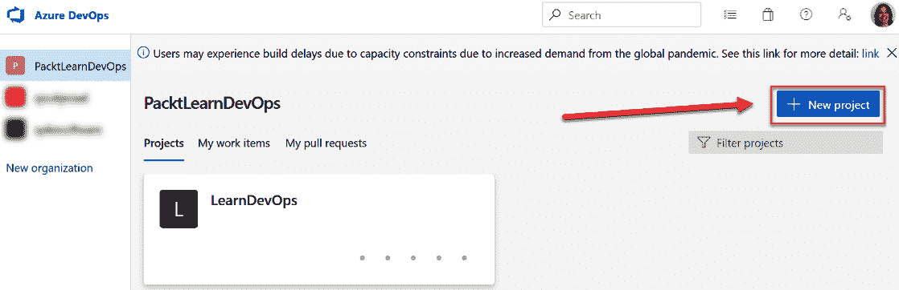

第二章：

# 第二章：使用 Azure DevOps Boards 管理项目

在上一章中，我们介绍了 DevOps，并讲解了六个原则。我们还简要介绍了 Azure DevOps 的关键概念和不同的服务。最后，我们介绍了本书将贯穿使用的场景。

在本章中，我们将更详细地讲解**Azure Boards**。我们将从 Azure DevOps 中可用的不同流程和过程模板开始。接着，我们将在 Azure DevOps 中创建一个新组织。我们在上一章中导入了一个名为 Tailwind Traders 的示例项目和组织。我们将在本章其余部分中使用这个示例。我们将使用 Tailwind Traders 项目创建一个新项目，并学习如何使用 Azure Boards 创建和管理不同的项目活动。

本章将涵盖以下内容：

+   理解过程和过程模板

+   创建一个组织

+   创建一个项目

+   创建和管理项目活动

# 技术要求

要跟随本章内容，你需要有一个有效的 Azure DevOps 组织。本章中我们将使用的组织是在*第一章*中创建的，名为**Azure DevOps 概述**。

# 理解过程和过程模板

使用 Azure Boards，你可以管理软件项目的工作。团队需要支持他们的工具，这些工具必须具有可扩展性和灵活性。这包括对 Scrum 和看板（Kanban）的原生支持，以及可定制的仪表板、集成报告能力和工具。

在项目开始时，团队必须决定使用哪种过程和过程模板来支持所采用的项目模型。过程和模板定义了 Azure Boards 中使用的工作项跟踪系统的基本构件。

Azure DevOps 支持以下流程：

+   **基本**：这是团队可以选择的最简单的模型。它使用**史诗**、**问题**和**任务**来跟踪工作。创建新基础项目时，这些工件会被创建，具体如下：

图 2.1 – 基本过程

+   **敏捷**：当你的团队使用敏捷计划过程时，选择敏捷。你可以跟踪不同类型的工作项，例如**特性**、**用户故事**和**任务**。这些工件是在使用敏捷流程创建新项目时生成的。开发和测试活动在这里是分开追踪的，敏捷使用看板（Kanban）来跟踪用户故事和缺陷。你也可以在任务看板上跟踪它们：

图 2.2 – 敏捷过程

+   **Scrum**：当你的团队实践 Scrum 方法论时，选择 Scrum 流程。这将创建**产品待办项**（**PBIs**）、**任务**、**缺陷**以及更多的工件供团队使用。你可以使用看板跟踪工件，或者将 PBIs 和缺陷拆解为任务，在任务板上进行管理。Scrum 流程如下面的图所示：

图 2.3 – Scrum 流程

+   **CMMI**：当你的团队遵循一个更正式的项目方法，需要一个框架来进行过程改进，并且需要可审计的决策记录时，**能力成熟度模型集成**（**CMMI**）流程更为适用。使用此流程模板，你可以跟踪需求、变更请求、风险和审查：

图 2.4 – CMMI 流程

现在我们已经介绍了有关 Azure DevOps 中不同流程和流程模板的一些基本信息，接下来将讲解如何创建一个新组织。

# 创建组织

在 Azure DevOps 中，组织用于连接相关项目组。你可以在这里规划和跟踪工作，并在开发应用时与他人协作。从组织级别，你还可以与其他服务集成，根据权限设置相应的权限，并设置持续集成和部署。

在上一章中，我们介绍了本书中使用的场景。Tailwind Traders 是一个示范零售公司，展示了智能应用体验的未来。通过使用 DevOps 生成器创建项目，组织和项目被自动创建。

然而，也有一些情况你可能需要手动创建组织，例如当你第一次在一个组织中使用 Azure DevOps 时，或者当基于权限要求创建一个独立的组织时。因此，我们也将涵盖这个步骤。请按以下步骤操作：

1.  打开一个网页浏览器，访问[`dev.azure.com/`](https://dev.azure.com/)。

1.  使用你的 Microsoft 账户登录，然后从左侧菜单点击**新建组织**：

    图 2.5 – 创建新组织

1.  在向导中，给组织命名，例如`PacktLearnDevOps`，并选择你希望托管项目的位置：

    图 2.6 – 命名项目

1.  点击**继续**。

到此，组织已创建。在下一节中，我们将学习如何将新项目添加到该组织。

# 创建项目

创建新组织后，Azure DevOps 会自动为你提供创建新项目的功能。请按以下步骤操作：

1.  一旦您创建了新组织，创建项目的向导将自动显示。在这里，您可以指定项目的名称。在我的例子中，我将其命名为 `LearnDevOps`。

1.  您还可以选择将您的项目设置为**公开**，让互联网的所有人都能查看，或者**私密**。如果选择后者，您需要手动授予用户访问权限。我们将在本演示中选择**私密**：

    图 2.7 – 创建新项目

1.  点击 **+ 创建项目** 来创建新项目。它将被添加到我们在前一步创建的组织中。

1.  还有另一种创建新项目的方法。您也可以在不创建组织的情况下单独创建项目。在很多情况下，您可能希望向现有组织中添加一个新项目。为此，请点击左侧菜单中的组织名称。您将被重定向到组织的概览页面。在那里，点击右上角的 **+ 新建项目**：

    图 2.8 – 向现有组织添加新项目

1.  从这里开始，将显示用于创建新项目的相同向导。

我们已经介绍了如何创建一个新的组织并向其中添加项目。在本章的其余部分，我们将保持这个组织和项目不变，并使用我们在*第一章**、Azure DevOps 概述*中导入的 Tailwind Traders 项目。

在接下来的章节中，我们将介绍如何创建和管理不同的项目活动。

# 创建和管理项目活动

Azure DevOps 提供了不同的项目功能，团队可以利用这些功能来管理他们的软件开发项目，例如工作项、待办事项、冲刺、看板和查询。以下章节将介绍这些功能。

## 工作项

团队使用工作项来跟踪团队的所有工作。在这里，您将描述软件开发项目所需的内容。您可以跟踪功能和需求、代码缺陷或错误，以及其他所有项。可用的工作项取决于在创建项目时选择的流程。

工作项有三种不同的状态：**新建**、**激活**和**关闭**。在开发过程中，团队可以相应地更新这些项，以便每个人都能完整了解与项目相关的工作。

现在，让我们创建一个新的工作项。

### 创建新的工作项

从现在开始，我们将使用在前一章中生成的**Tailwind Traders**示例项目。我们将在这个项目中创建一个新的工作项。为此，请执行以下步骤：

1.  打开一个网页浏览器并导航至 [`dev.azure.com/`](https://dev.azure.com/)。

1.  使用您的凭据登录。

1.  导航到创建了 **Tailwind Traders** 项目的组织，并选择该项目，如下图所示：

    图 2.9 – 在 Azure DevOps 中选择 Tailwind Traders 项目

1.  接下来，从左侧菜单选择 **看板**，然后选择 **工作项**：

    图 2.10 – 导航到工作项

1.  在下一个屏幕上，你将看到所有在创建 Tailwind Traders 项目时自动生成的工作项概览：

    图 2.11 – 所有示例工作项的概览

1.  要创建一个新的工作项，请从顶部菜单点击 **+ 新建工作项**。在那里，你将看到根据项目类型选择的不同工作项类型。对于 Tailwind Traders，使用的是敏捷类型（有关更多细节，请参见本章开头的 *理解流程和流程模板* 部分）：

图 2.12 – 工作项类型

现在，让我们创建一个新的用户故事。为此，从列表中点击 **用户故事**。然后，按照以下步骤操作：

1.  一个新窗口将打开，你可以在其中为用户故事指定相关的值。请添加以下内容：

    a) **标题**：作为用户，我想编辑我的用户资料。

    b) **分配**：在这里，你可以将工作项分配给特定的人员。

    c) **添加标签**：你还可以向这个工作项添加标签。以后可以用这些标签进行搜索。我添加了一个名为 **Profile Improvements** 的标签。

    d) **状态**：因为这是一个新创建的项目，状态自动设置为 **新建**。

    e) **迭代**：在这里，你可以指定将此用户故事添加到哪个冲刺中。你也可以稍后从待办事项中进行此操作。我已将其添加到第 **2** 次迭代。

    f) **描述**：作为用户，我想编辑我的用户资料。这是一个富文本编辑器，你也可以根据需要格式化描述。

    g) **讨论**：在这里，你可以添加与此工作项相关的附加评论。你可以使用 *"#"* 后接“工作项名称”来链接到另一个工作项，使用 *"!"* 后接“拉取请求名称”来链接特定的拉取请求，或者使用 *"@"* 后接“人员名称”来提及某个人。

    h) **优先级**：在这里，你可以为你的用户故事设置优先级。这里的优先级仅是一个数字，用来表示工作项的重要性，而不是它的处理优先级。你可以通过拖动用户故事上下调整优先级。

    i) **分类**：你也可以对这个项目进行分类。生成器为 **Tailwind Traders** 项目创建了两个不同的类别。在这里，你可以选择 **业务** 或 **架构**。在这种情况下，该项目更偏向业务相关。

    j) **开发**：在这里，你可以将项目与特定的分支、构建、拉取请求等关联。

    k) **故事点**：使用故事点，你可以估算完成一个用户故事所需的工作量，可以使用任何数字单位进行度量。此字段中的值基于团队的工作速度：

    

    ](img/Figure_2.13_B16392.jpg)

    图 2.13 – 将项目与特定的开发流程关联

1.  **相关工作**：你还可以将项目与其他项目或 GitHub 问题关联，如父子关系、**已测试**、**重复项**等：

    ](img/Figure_2.14_B16392.jpg)

    图 2.14 – 将项目与相关工作关联

1.  填写完这些字段后，点击屏幕右上角的**保存**按钮：

图 2.15 – 保存你的工作项

我们现在已经成功创建了一个新的工作项。我强烈建议你创建一些不同的工作项，比如缺陷、功能、任务等。这样，你将熟悉每种工作项表单的不同类型。

重要提示

有关如何创建不同工作项的更多信息，请参见以下网站：[`docs.microsoft.com/en-us/azure/devops/boards/work-items/about-work-items?view=azure-devops&tabs=agile-process`](https://docs.microsoft.com/en-us/azure/devops/boards/work-items/about-work-items?view=azure-devops&tabs=agile-process)。有关工作项表单中使用的不同字段的更多信息，请参阅此网站：[`docs.microsoft.com/en-us/azure/devops/boards/work-items/guidance/work-item-field?view=azure-devops`](https://docs.microsoft.com/en-us/azure/devops/boards/work-items/guidance/work-item-field?view=azure-devops)。

在接下来的章节中，我们将更详细地了解待办事项和迭代。

## 待办事项

产品待办事项是团队计划交付内容的路线图。通过将用户故事、需求或待办事项添加到其中，你可以概览需要为项目开发的所有功能。

从待办事项中，工作项可以轻松地重新排序、优先级排序并添加到迭代中。

让我们来看一下待办事项是如何工作的：

1.  在 Azure DevOps 中，再次打开**Tailwind Traders**项目。

1.  接下来，从左侧菜单选择**看板**，然后选择**待办事项**。接着，选择**Tailwind Traders 团队待办事项**：

    ](img/Figure_2.16_B16392.jpg)

    图 2.16 – 导航至项目的待办事项

1.  在这里，你将看到该项目的所有不同用户故事，包括我们在前一个演示中创建的那个。从右上角，你可以选择与项目模板一起提供的不同类型的工作项：

    ](img/Figure_2.17_B16392.jpg)

    图 2.17 – 不同类型的工作项

1.  目前，我们将继续使用用户故事视图。你也可以在这里重新排序和优先排序工作项。让我们通过将新创建的用户故事在列表中的第 2 和第 3 项之间拖动来重新优先排序它：

1.  从待办事项中，你还可以将工作项添加到不同的迭代中。在创建工作项时，我们将这个用户故事添加到迭代 2 中。从这里，如果我们想的话，也可以将此项拖动到其他迭代中：

    图 2.19 – 将用户故事拖到另一个迭代

1.  你还可以更改视图，查看与这些用户故事相关的更多工作项。通过点击屏幕左侧显示的视图选项，你可以启用不同的视图。启用**父项**，该视图显示史诗和特性：

    图 2.20 – 显示父项

1.  通过拖动不同类型的工作项，你还可以轻松创建不同类型的父子关系。例如，你可以将新创建的用户故事拖动到**会员注册**特性上，并在它们之间创建关系：

图 2.21 – 创建父子关系

在本节中，我们介绍了待办事项和如何优先排序用户故事，以及如何将它们添加到迭代中。你还可以根据不同的工作项创建具有父子关系的视图。

在下一节中，我们将更详细地了解看板。

## 看板

查看不同工作项的另一种方式是使用看板。每个项目都带有一个预配置的看板，可以用来管理和可视化工作的流动。

这个看板有不同的列，代表不同的工作阶段。在这里，你可以全面了解所有需要完成的工作以及工作项的当前状态。

让我们更详细地了解 Azure DevOps 中的看板：

1.  在左侧菜单中，选择**看板**，然后选择**看板**。在这里，你将看到不同工作项的概览，这些工作项已被添加到看板上的卡片中，如下图所示：

    图 2.22 – Tailwind Traders 看板概览

    工作项根据项的状态进行显示。在**新建**列中，显示团队尚未承诺的项目。接下来，是当前正在由团队进行处理的项目，这些项目显示在**进行中**列。

    还有一些工作项处于**解决中**状态，这意味着开发部分已经完成，但仍需进行测试。通过测试并符合*完成定义*的项目会被移到**已关闭**列。

1.  在这里，你还可以将项目拖动到不同的列中，查看待办事项中的项目，并通过点击项目右上角的三个点（**…**）来对其进行更改，具体如下：

图 2.23 – 与看板互动

到这里，我们已经提供了一个关于看板的概述。在接下来的部分，我们将更详细地讨论迭代。

## 迭代

根据所选的项目模板，迭代的名称可能不同。在我们的 Tailwind Traders 项目中，使用的是敏捷项目模板。这将名称更改为**迭代**。然而，Azure DevOps 将这些视为与**迭代**相同的内容。

迭代或**迭代**用于将工作分割成特定数量的（通常是）周。这是基于团队可以处理的速度，也就是团队完成用户故事的速率。

让我们更详细地看一下 Azure DevOps 中的迭代视图：

1.  从左侧菜单中，在**看板**下选择**迭代**。默认情况下，会显示待办事项视图。在这里，你将再次看到**用户故事**的概览，只不过这次是当前迭代的，具体如下图所示：

    图 2.24 – 当前迭代的概览

    你还可以将用户故事拖动到另一个迭代中，并在需要时重新排序它们。

1.  通过点击顶部菜单中的**任务板**，你将看到与看板中工作项相似的不同视图。此时，当前迭代中的项目以待办任务级别显示：

    图 2.25 – 看板中的迭代

1.  在这里，你可以将项目拖动到不同的列中，必要时创建新的工作项，并筛选不同的迭代：

图 2.26 – 与迭代中的工作项互动

迭代看板主要在团队日常站会上使用。项目会根据团队的进展拖动到不同的列中。团队还会简要讨论这些项目，并在需要时请求帮助执行或创建它们。在迭代结束时，大多数项目将被移至**已关闭**列。

在这个演示中，我们查看了如何在 Azure 看板中管理和创建项目活动。在本章的最后一节中，我们将讨论 Azure DevOps 中的查询。

## 查询

你可以根据 Azure DevOps 中提供的筛选条件来过滤工作项。这样，你可以轻松查看所有处于特定类型、状态或具有特定标签的工作项。这可以在项目内部进行，也可以跨不同的项目进行。

要创建不同的查询并搜索工作项，请执行以下步骤：

1.  从左侧菜单中，在**Boards**下选择**Queries**。然后，从顶部菜单中选择**+ 新建查询**：

    图 2.27 – 创建新查询

1.  接下来，让我们创建一个查询，搜索具有**Profile Improvements**标签的用户故事。在查询屏幕上，选择下图所示的选项：

    图 2.28 – 创建查询

1.  然后，点击**运行查询**。结果将显示我们在本节第一步中创建的工作项：

图 2.29 – 搜索结果

重要提示

这是一个可以创建的搜索查询的基本示例。如需更深入的信息，您可以参考[`docs.microsoft.com/en-us/azure/devops/project/search/overview?view=azure-devops`](https://docs.microsoft.com/en-us/azure/devops/project/search/overview?view=azure-devops)。

这样，我们已经涵盖了如何运行查询以筛选工作项的基础知识。本章到此结束。

# 总结

在本章中，我们深入探讨了 Azure Boards。我们首先查看了根据组织采用的方法论可以选择的不同项目模板。根据该项目模板，创建了不同的工作项，这些工作项可用于项目规划。这些工作项可以添加到待办事项列表中，并可以创建关联关系，以便从逻辑上查看项目项。它们也可以添加到冲刺中。

在下一章中，我们将重点讲解 Azure DevOps 中的源代码管理。

# 进一步阅读

查看以下链接，获取有关本章所涵盖主题的更多信息：

+   什么是 Azure Boards？：[`docs.microsoft.com/en-us/azure/devops/boards/get-started/what-is-azure-boards?view=azure-devops&tabs=agile-process`](https://docs.microsoft.com/en-us/azure/devops/boards/get-started/what-is-azure-boards?view=azure-devops&tabs=agile-process)

+   选择一个流程：[`docs.microsoft.com/en-us/azure/devops/boards/work-items/guidance/choose-process`](https://docs.microsoft.com/en-us/azure/devops/boards/work-items/guidance/choose-process)

+   使用用户故事、问题、错误、功能和史诗跟踪工作：[`docs.microsoft.com/en-us/azure/devops/boards/work-items/about-work-items?view=azure-devops&tabs=agile-process`](https://docs.microsoft.com/en-us/azure/devops/boards/work-items/about-work-items?view=azure-devops&tabs=agile-process)

+   创建您的产品待办事项列表：[`docs.microsoft.com/en-us/azure/devops/boards/backlogs/create-your-backlog?view=azure-devops&tabs=agile-process`](https://docs.microsoft.com/en-us/azure/devops/boards/backlogs/create-your-backlog?view=azure-devops&tabs=agile-process)

+   工作流状态和状态类别如何在待办事项和看板中使用： [`docs.microsoft.com/en-us/azure/devops/boards/work-items/workflow-and-state-categories?view=azure-devops&tabs=agile-process`](https://docs.microsoft.com/en-us/azure/devops/boards/work-items/workflow-and-state-categories?view=azure-devops&tabs=agile-process)
