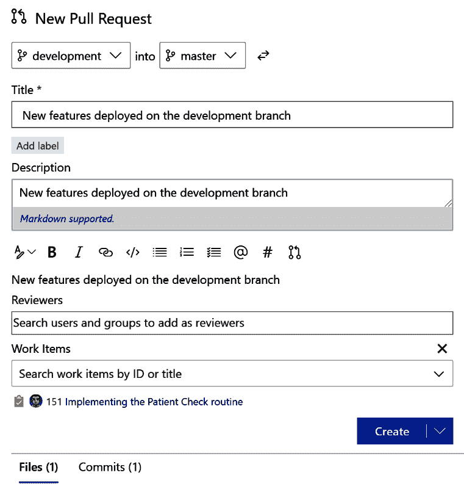

第三章：

# 第三章：使用 Azure DevOps 进行源代码管理

**源代码管理** **(SCM)** 是每个专业从事软件开发的公司以及每个想要安全存储和管理代码的开发者不可或缺的一部分。

在团队合作时，绝对有必要拥有一个安全的中央仓库来存储所有代码。同时，还必须有一个系统来保证代码在开发者之间的安全共享，并且每一次修改都能够经过检查并合并，不会产生冲突。

在本章中，我们将学习 Azure DevOps 如何帮助你专业且安全地管理源代码。本章将涵盖以下内容：

+   理解源代码管理

+   分支策略概述

+   使用 Azure DevOps 和 Repos 处理源代码管理

+   如何处理提交、推送和分支

+   使用拉取请求

+   处理拉取请求

+   如何标记特定的代码发布

到本章结束时，你将了解所有可以应用 SCM 技术到你团队的概念，并且使用 Azure DevOps。

# 技术要求

要跟随本章内容，你需要在开发机器上安装一个有效的 Azure DevOps 组织和 Visual Studio 或 Visual Studio Code。

# 理解 SCM

源代码管理（或版本控制）是一种用于跟踪和管理源代码变化的软件实践。这是一个极为重要的实践，因为它可以确保不同开发人员之间维护同一份代码源，并有助于在单一软件项目中进行协作（即不同开发者在同一代码库上工作）。

**SCM** 是任何 DevOps 流程中的核心实践。要采用源代码管理策略，你应该做以下操作：

+   选择一个源代码管理系统来采用（例如，在服务器上安装 Git 或使用基于云的 SCM，如 Azure DevOps Repos 或 GitHub）

+   将你的代码库存储在由源代码管理系统管理的仓库中

+   通过获取中央仓库中存储的最新代码版本（拉取），将仓库克隆到本地进行开发

+   提交并推送你发布的代码到中央仓库

+   使用不同的仓库副本进行并行开发（分支）

以下是一个 SCM 流程的示意图：


图 3.1 – 源代码管理流程

Git 无疑是市场上最受欢迎的 SCM 系统之一。Git 由 Linus Torvalds 于 2005 年创建，用于帮助 Linux 内核的开发。Git 是免费的、开源的，并且完全基于文件，因此除了 Git 引擎本身，不需要额外的软件来处理 SCM。

Git 的工作流程可以总结如下（并可以使用之前的图示表示）：

1.  你在 Git 托管系统中为你的项目创建一个仓库。

1.  将仓库复制（或克隆）到你的本地开发机器上。

1.  你在本地仓库中创建一个新文件，然后将更改保存在本地（暂存并提交）。

1.  你将更改推送到远程仓库（push）。

1.  你从远程仓库拉取更改到本地仓库（以便将代码与远程仓库同步，如果其他开发者做了修改的话）。

1.  你将更改与本地仓库合并。

在使用 Git 作为 SCM 系统时，你需要记住一些关键概念：

+   **快照**是 Git 用来跟踪代码历史的方式。快照本质上记录了在某一时刻所有文件的样子。你决定何时以及对哪些文件进行快照。

+   **提交**是创建快照的行为。在一个项目中，你会创建不同的提交。一个提交包含三组信息：

    -- 详细描述文件如何从之前的版本发生变化

    -- 指向父提交的引用（之前发生的提交）

    -- 一个哈希代码名称

+   **仓库**是所有必要文件及其历史记录的集合。仓库可以位于本地计算机或远程服务器上。

+   **克隆**是从远程服务器复制仓库的操作。

+   **拉取**是从远程仓库下载本地没有的提交的过程。

+   **推送**是将本地更改添加到远程仓库的过程。

+   `master`。

Git 流程由以下操作组成：


图 3.2 – Git 流程

让我们来看一下 Git 中如何发生提交流。要在 Git 上创建一个提交，你需要对文件进行一些更改，然后使用 `git add` 命令将这些文件放入暂存环境。之后，使用 `git commit` 命令创建一个新的提交。这个流程可以表示如下：


图 3.3 – Git 提交

作为示例，这里是一些你可以使用的 Git 命令来激活前述 SCM 流程：

1.  克隆远程仓库到本地：

    ```
    git clone https://github.com/user/yourRemoteRepo.git
    ```

1.  继续进行项目开发。

1.  将工作保存在本地：

    ```
    git add .
    git commit -m "my commit message"
    ```

1.  检查远程服务器是否有更新：

    ```
    git pull
    ```

1.  将工作保存到远程服务器：

    ```
    git push
    ```

使用分支时，请遵循以下步骤：

1.  创建一个新分支并切换到该分支：

    ```
    git checkout -b "branch1"
    ```

1.  开发新功能。

1.  将工作保存在本地：

    ```
    git add .
    git commit -m "update from branch1"
    ```

1.  将工作保存到远程服务器：

    ```
    git push
    ```

1.  切换到你想要合并工作的分支：

    ```
    git checkout master
    ```

1.  将 `branch1` 合并到 `master` 分支并将其保存到远程服务器：

    ```
    git merge branch1
    git push
    ```

一旦你掌握了这些命令，你就可以开始使用 Git。在接下来的部分中，我们将概述分支和你可以使用的分支策略。

# 探索分支策略

分支是存储在 SCM 系统中的代码版本。在使用 Git 的 SCM 系统时，选择最适合你团队的分支策略至关重要，因为它有助于你保持可靠的代码库和快速交付。

在使用 SCM 时，如果你没有使用分支管理，你将始终只有一个版本的代码（`master`分支），并且你总是向这个分支提交代码：


图 3.4 – 单一工作流

这种“单一工作流”方式不推荐使用，因为它无法保证`master`分支的稳定性，特别是当多个开发人员在同一代码上工作时。

有许多不同的分支工作流（策略），你可以为团队选择采用，通常我建议从简单的策略开始。在 Git 中，你可以采用三种主要的分支策略：

+   GitHub 流

+   GitLab Flow

+   Git Flow

在接下来的章节中，我们将探讨这些策略的每一个。

## GitHub 流

**GitHub Flow** 是最广泛使用的分支策略之一，并且相对容易采用。

根据此工作流程，你从`master`分支开始（该分支始终包含可部署的代码）。当你开始开发新功能时，你会创建一个新的分支，并定期向此分支提交代码。当开发工作完成时，你会创建一个 pull 请求，将该子分支与`master`分支合并：


图 3.5 – GitHub Flow

这个工作流简单易于采用，适用于你需要在生产环境中维护单一版本的代码。唯一的缺点是你需要仔细检查提交到`master`分支的内容。如果你需要在生产环境中维护多个版本的应用程序，通常不推荐使用这种方式。

## GitLab 流

**GitLab Flow** 是另一种流行的分支策略，广泛应用，尤其是在你需要支持多个环境（例如生产、预发布、开发等）时，特别适用于 SCM 流程。以下图示表示该工作流：


图 3.6 – GitLab Flow

根据此工作流程，你应该至少有三个分支：

+   **主分支**：这是每个人的本地版本代码。

+   **预发布**：这是用于测试目的的分支，*master*分支会被分叉到这里。

+   **生产**：这是已发布的生产代码（*预发布*已经合并到这里）。

如果你想保持稳定的生产发布，并分别在新功能上工作（这些功能可以移至测试环境进行测试），然后在测试完成后将该环境合并到生产发布中，这种工作流非常有用。

## Git Flow

**Git Flow** 是一种用于有定期发布周期的工作流。以下图示表示该工作流：


图 3.7 – Git Flow

根据此工作流程，你有一个**master**分支和一个**develop**分支，它们始终处于活动状态，另外一些分支并非总是处于活动状态（可以删除）。**master**分支包含已发布的代码，而**develop**分支包含你正在开发的代码。

每次向你的代码库添加新功能时，你会从**develop**分支创建一个**feature**分支，然后当实现完成时，将**feature**分支合并到**develop**。在这里，你永远不会合并到**master**分支。

当你需要发布一组功能时，你会从**develop**分支创建一个发布分支。**release**分支中的代码必须经过测试（可能包含合并的 bug 修复），当你准备好发布代码时，你将**release**分支合并到**master**分支，然后再合并到**develop**分支。

如果在生产中出现严重 bug，此流程建议你可以从**master**分支创建一个**fix**分支，修复 bug，然后直接将此分支合并回**master**。如果存在**release**分支，你也可以将其合并到**release**分支，否则合并到**develop**分支。如果你将代码合并到**release**分支，当你将**release**分支合并回**develop**分支时，**develop**分支将包含修复。

# 处理 Azure DevOps 中的源代码控制

**Azure DevOps** 支持以下源代码管理类型：

+   **Git**：这是一个分布式版本控制系统，在创建新项目时是 Azure DevOps 的默认版本控制提供程序。

+   **Team Foundation Version Control (TFVC)**：这是一个集中式版本控制系统，在这里开发者本地只有一个文件版本，数据存储在服务器上，并且分支是在服务器上创建的（基于路径）。

使用 Azure DevOps 的第一步是在你的组织内创建一个新项目。当你使用 Azure DevOps 创建新项目时，系统会提示你选择要使用的版本控制系统（如下截图中的红框所示）：


图 3.8 – 创建新项目

点击**确定**按钮，新项目将在你的 Azure DevOps 组织中创建。

项目创建完成后，你可以通过进入 Azure DevOps 左侧导航栏中的**仓库**中心来管理你的存储库（见下面的截图）。这里是你的文件存储位置，你可以开始创建存储库并管理分支、拉取请求等等：


图 3.9 – 仓库

从**仓库**开始，每个开发者都可以在本地克隆存储库，并直接从 Visual Studio 或 Visual Studio Code 进行工作，同时连接到 Azure DevOps，以便推送代码修改、拉取和创建分支、进行提交，并发起拉取请求。

当你从头开始启动一个新项目时，Azure DevOps 会为你创建一个空的存储库。你可以手动将代码加载到这个存储库中（通过上传），或者你可以从远程存储库（例如 GitHub）克隆到 Azure DevOps。

在一个项目中，你可以创建不同的仓库，每个仓库都有自己的权限、分支和提交记录。要创建新仓库，只需选择 **Repos** 中心并点击 **New repository**，如下一张截图所示：


图 3.10 – 新仓库

仓库可以从 Azure DevOps 中轻松重命名或删除。

在本节中，我们学习了如何在 Azure DevOps 中创建新项目以及如何为你的项目创建代码仓库。

在接下来的章节中，我们将学习如何使用 Azure DevOps 管理完整的源代码管理流程，从克隆远程仓库到提交代码。

## 克隆远程仓库

为了展示如何在 Azure DevOps 中使用代码仓库，我将从一个包含我 Web 应用源代码的 Git 仓库项目开始。下图显示了托管在 **master** 分支上的远程代码：


图 3.11 – 主分支

每个必须使用此代码的开发人员都需要在本地克隆该仓库。你可以点击 **Clone** 按钮，如下图所示：


图 3.12 – 克隆仓库

从这里，你将看到一个显示克隆仓库 URL 的窗口。你可以使用 `git clone <Repository URL>` 命令来克隆这个仓库，或者通过在 Visual Studio 或 Visual Studio Code 中选择下方截图中显示的选项来直接克隆：


图 3.13 – 克隆选项

在这里，我正在将项目克隆到 Visual Studio Code。Azure DevOps 会提示我选择一个文件夹来保存该项目（开发机器上的本地文件夹），然后打开 Visual Studio Code 并开始克隆远程仓库：


图 3.14 – 在 Visual Studio Code 中克隆

在 Visual Studio Code 中，你也可以通过打开命令面板（*Ctrl* + *Shift* + *P*），选择 `Git:Clone` 命令，然后将仓库 URL 粘贴到提示窗口中来克隆仓库：


图 3.15 – Git:Clone 命令

一旦克隆过程完成，你将会在选定的文件夹中拥有远程仓库 `master` 分支的本地副本：


图 3.16 – 远程仓库的本地副本

为了更高效地使用 Visual Studio Code 与 Azure DevOps 上的远程仓库工作，我建议你安装一个名为 **Azure Repos** 的扩展（来自 Visual Studio Code 市场）：


图 3.17 – Azure Repos 扩展

一旦 Azure Repos 安装完成，如果你进入命令面板并搜索 `teams`，你将看到一组新的可用命令来与 Azure DevOps 进行交互，如下所示：


图 3.18 – Azure Repos 命令

在本章的后续部分，我们将使用其中的一些命令。

在下一节中，我们将学习如何将 GitHub 仓库导入到 Azure DevOps。

## 将 GitHub 仓库导入到 Azure DevOps

使用 Azure DevOps，你还可以在 **Repos** 中导入 GitHub 仓库。如果你选择了一个在 Azure DevOps 项目中创建的空仓库，你将可以看到导入仓库的选项，如以下截图所示：


图 1.19 – 导入一个仓库

在这里，你可以选择要导入的 GitHub 仓库（通过输入源类型和 GitHub 仓库的克隆 URL）：


图 1.20 – 导入 Git 仓库

当你点击 **导入** 按钮时，远程 GitHub 仓库的导入过程将开始，你将看到显示进度的图像：


图 3.21 – 正在处理导入仓库请求

一旦导入过程完成，你将在 Azure Repos 中获得代码。请记住，当从 GitHub 导入仓库时，历史记录和修订信息也会被导入到 Azure DevOps 中，以实现完整的可追溯性：


图 3.22 – 导入的仓库历史

## 使用提交、推送和分支

一旦你将远程仓库克隆到本地 Git 仓库，你就可以开始编码（创建新文件或修改现有文件）。

每次你创建或修改一个文件时，Git 会记录本地仓库中的更改。你会看到 Visual Studio Code 的源代码控制图标开始提示文件已被修改。例如，在下面的截图中，我向项目中的一个文件添加了评论。保存文件后，Git 引擎会提示我有一个未提交的文件：


图 3.23 – 未提交文件警告

如果你点击左侧栏中的 **源代码控制** 图标，你将看到未提交的文件。在这里，你可以选择你想提交的更改并将其暂存。每次提交都是在本地进行的。你可以通过点击 **+** 图标来暂存修改，然后通过点击顶部工具栏中的 **提交** 按钮来提交所有暂存的文件。每次提交都必须有一条信息，解释这次提交的原因：


图 3.24 – 提交信息

现在，文件已经本地提交到你的本地 `master` 分支（虽然不推荐这样做，稍后会解释）。要将这些修改同步到 Azure DevOps 中的线上仓库，你可以点击 Visual Studio Code 底部栏上的 **Synchronize Changes** 按钮（这会以红色高亮显示，表明你有需要推送到线上的修改），如下图所示：


图 3.25 – 需要推送到线上修改

另外，你可以从命令栏选择 `Git` `:` `push` 命令，如下所示：


图 3.26 – Git:Push 命令

现在，所有代码修改都已经推送到 `master` 分支。如果你进入 Azure DevOps 的 **Repos** 中心并选择 **Commits** 菜单，你将看到所选分支的每一次提交历史：


图 3.27 – 提交历史

这样，我们直接在 `master` 分支上工作。这不是实际开发团队中常用的工作方式，因为如果每个开发者都直接提交到 `master` 分支，就无法保证该分支始终稳定。最好的做法是使用之前提到的 GitHub Flow。因此，你应该创建一个新分支，在这个新分支上工作，只有在工作完成后，才创建一个 `pull` 请求将分支合并到 `master` 分支。

你可以在 Azure DevOps 中或直接在 Visual Studio Code 中创建新分支。创建新分支的步骤如下：

1.  从 Azure DevOps 中选择 **Branches**，然后点击 **New branch**：

    图 3.28 – 新分支

1.  然后，提供一个分支名称。你需要选择新分支将从哪个分支创建，如下图所示：

    图 3.29 – 创建分支

    要直接从 Visual Studio Code 创建新分支，只需点击底部栏上的分支名称，然后选择 **Create new branch…**：

    

    图 3.30 – 在 Visual Studio Code 中创建新分支…选项

1.  现在，选择新分支的名称（这里称为 `development`）：

    图 1.31 – 分配分支名称

    这样，分支将被创建在本地仓库中，Visual Studio Code 将自动开始在该分支上工作：

    

    图 3.32 – 在新分支上工作

1.  现在，您可以在此新分支上继续进行代码开发（可能是为了开发一组新的功能），并进行提交，而不会影响 `master` 分支（它将继续保持代码库的实际发布版本）。

    例如，在这里，我已向 `MedicineController.cs` 文件添加了一个新的修改。我可以在本地对 `development` 分支进行暂存和提交此修改：

    

    图 3.33 – 暂存更改

1.  然后，我可以将这些修改推送到 Azure DevOps 上的远程仓库。当在线推送时，如果这是第一次创建 **development** 分支，您将收到如下消息：

    图 3.34 – 自动分支创建和发布

1.  完成后，**development** 分支将在远程仓库中创建，并且您的代码将被推送到线上：

    图 3.35 – 在远程仓库上创建的分支

1.  如果您在 Azure DevOps 中的 **Repos** 中进入 **Commits** 部分，您将看到提交历史记录。通过选择特定的提交，您可以查看所做的文件更改（通过将之前的版本与该提交后的当前版本进行比较）：


图 3.36 – 提交的详细信息

这个操作也可以通过 Visual Studio Code 中的 `Team:View History` 命令直接完成：


图 3.37 – 来自 Visual Studio Code 的 Team:View History 命令

分支可以被删除（手动删除或在拉取请求后自动删除）、从意外删除中恢复，还可以被锁定（使其进入只读状态，或防止此分支上的新提交影响当前合并）。要锁定特定分支，只需在 Azure DevOps 中选择该分支，然后从菜单中选择 **Lock** 选项：


图 3.38 – 锁定分支

要解锁已锁定的分支，只需选择 **Unlock** 操作。需要注意的是，锁定分支并不妨碍克隆或拉取此分支到本地。

## 通过策略保护分支

在与不同的开发人员协作并使用分支时，保护仓库中关键的分支（例如 `master` 分支）非常重要，可以通过规则确保这些分支始终保持健康状态。

对于这个范围，Azure DevOps 允许您为关键分支指定一组策略。

Azure DevOps 中的分支策略允许您执行以下操作：

+   限制特定分支的贡献者

+   指定谁可以创建分支

+   为分支指定一组命名约定

+   自动为分支中的每个代码更改包括代码审阅者

+   强制使用拉取请求

+   在提交代码到分支之前启动构建管道

要为特定分支指定分支策略，请转到 Azure DevOps 中的**分支**部分，选择您的分支，然后选择**分支策略**菜单：


图 3.39 – 分支策略

在这里，您可以设置一组选项来控制所选分支。我们将在以下部分详细查看这些选项。

### 要求最少审阅者数量

该选项允许您指定可以批准代码修改的审阅者数量。如果任何审阅者拒绝代码更改，则修改不会被批准，且代码更改会被丢弃。如果选择**允许即使一些审阅者选择等待或拒绝也可以完成**，那么拉取请求可以完成。**请求者可以批准自己的更改**选项允许拉取请求的创建者批准自己的代码更改：


图 3.40 – 要求最少审阅者数量选项

### 检查关联的工作项

该选项允许您要求将工作项与特定拉取请求关联，以便实现活动和任务的完整可追溯性。如果您使用的是项目规划功能（如本书中的*第二章*《使用 Azure DevOps Boards 管理项目》所示），这将非常有用：


图 3.41 – 检查关联的工作项选项

### 检查评论解决情况

该选项允许您指定一条规则，要求所有评论必须解决，才能执行拉取请求：


图 3.42 – 检查评论解决选项

### 限制合并类型

该选项允许您在完成拉取请求时强制执行分支策略。可用的选项如下：

+   **基本合并（无快速转发）**：此选项合并源分支的提交历史，并在目标分支中创建一个合并提交。开发过程中发生的完整非线性提交历史将被保留。

+   **Squash 合并**：通过压缩源分支的提交（线性历史），在目标分支中创建一个单一提交。

+   `master` 分支。拉取请求中的每个提交都将单独合并到目标分支中（线性历史）。

+   **使用合并提交的变基**：通过将源分支的提交替换为目标分支中的提交，然后创建合并提交，从而创建半线性历史。

所有这些选项可以在以下屏幕截图中查看：


图 3.43 – 限制合并类型选项

### 构建验证

本节允许您为构建代码指定一组规则，在拉取请求完成之前（有助于及早发现问题）。点击 **添加构建策略** 后，将出现一个新面板：


图 3.44 – 添加构建策略

在这里，您可以指定要应用的构建管道定义，以及它是否必须在分支更新时自动触发，或者手动触发。我们将在 *第四章**，理解 Azure DevOps Pipelines* 中详细讨论构建管道。

### 需要额外服务的批准

该选项允许您连接外部服务（通过 Azure DevOps 拉取请求 API），以便参与拉取请求流程：


图 3.45 – 添加状态策略

### 自动包含代码审查者

此策略允许您将特定用户或组包含在代码审查过程中：


图 3.46 – 添加自动审查者

## 跨仓库策略

不必为每个您手动创建的分支定义一个策略，Azure DevOps 允许您定义跨仓库策略（这些策略将自动应用于您为项目创建的所有分支）。

要定义一个适用于您将创建的每个仓库的策略，您需要进入 **项目设置**，然后选择 **跨仓库策略**，如下面的截图所示：


图 3.47 – 跨仓库策略

在这里，您可以添加一个分支保护策略并选择以下选项之一：

+   `master` 分支的每个仓库）。

+   **保护当前和未来匹配指定模式的分支**。在这里，您可以定义一个过滤分支的模式，策略将应用于所有符合该模式的分支。

举个例子，如果您想定义一个策略，该策略将自动应用于您为项目创建的所有分支，请按以下步骤操作：


图 3.48 – 添加分支保护

如您所见，在这里，我们选择了 *** key 作为模式来识别我们项目中的所有分支。

# 使用拉取请求

**拉取请求** 允许您通知团队成员，表明一个新实现已完成并必须与指定的分支合并。通过使用拉取请求，团队成员可以审查您的代码（逐步查看文件并查看特定提交所做的修改），对小问题提供审查评论，并批准或拒绝这些修改。这是使用 Azure DevOps 进行源代码管理时推荐的做法。

你可以通过选择 **Repos** 中心的 **拉取请求** 菜单，查看 Azure DevOps 中特定仓库的所有传入拉取请求，如下图所示：


图 3.49 – 拉取请求视图

你还可以筛选此列表，仅查看你的拉取请求，或仅查看 **Active**、**Completed** 或 **Abandoned** 状态的拉取请求。

拉取请求可以通过以下几种方式创建：

+   手动从 Azure DevOps 拉取请求页面创建

+   从与分支关联的工作项（**开发**标签）

+   当你向功能分支推送更新时

+   从 Visual Studio Code 或 Visual Studio 直接启动

+   从 Azure DevOps Services CLI 启动

在接下来的章节中，我们将学习如何在这些情况下启动拉取请求。

## 从 Azure DevOps 拉取请求页面创建拉取请求

你可以直接从 Azure DevOps **拉取请求**菜单（位于 **Repos** 中心）创建一个新的拉取请求。在这里，只需点击 **新建拉取请求** 按钮：


图 3.50 – 新建拉取请求

你现在可以输入关于你希望创建的拉取请求的详细信息（我们将在本章后面讨论这一部分）。

## 从工作项创建拉取请求

在你团队的工作项 **待办事项** 视图中，你可以选择一个与分支关联的工作项（一个与分支提交关联的工作项），进入所选工作项的 **开发** 区域，并创建一个 **创建拉取请求** 操作：


图 3.51 – 从工作项创建拉取请求

## 在推送分支后创建拉取请求

当你将代码提交到 Azure DevOps 的 `development`（次级）分支时，系统会自动提示你创建一个拉取请求（你可以通过转到 **文件** 或 **拉取请求** 菜单，在 **Repos** 中心查看此提示）。如你所知，我之前将新代码提交到了名为 **development** 的分支。现在，如果我们进入 **文件** | **历史记录** 部分，我们会看到创建新拉取请求的提示：


图 3.52 – 在分支上提交后创建拉取请求

## 从 Visual Studio Code 或 Visual Studio 创建拉取请求

你可以直接从 Visual Studio Code 或 Visual Studio 启动拉取请求，只要你的项目已经加载。

要从 Visual Studio Code 启动拉取请求，请从命令面板中启动 `Team:Create pull request` 命令（*Ctrl* + *Shift* + *P*）：


图 3.53 – 从 Visual Studio Code 创建拉取请求

这将提示你打开 Azure DevOps。确认后，拉取请求窗口将会打开。

在 Visual Studio 中，选择 **Team Explorer** 面板。从这里，你可以点击 **Pull Requests** 来开始一个拉取请求：


图 3.54 – 从 Visual Studio 创建拉取请求

# 处理拉取请求

我们描述的处理拉取请求的所有不同方法汇聚到一个唯一的点：在 Azure DevOps 中，**Pull requests** 窗口会打开，你需要填写你的拉取请求活动的详细信息。举个例子，这是我们在 **development** 分支上进行上次提交后开始的拉取请求：



图 3.55 – 新建拉取请求窗口

在这里，你可以立即看到拉取请求将一个分支合并到另一个分支（在我的例子中，**development** 将被合并到 **master**）。你需要提供这个拉取请求的标题和描述（清晰地描述你在合并过程中所做的更改和实现），并附上链接以及添加将负责审查此拉取请求的团队成员（用户或组）。你还可以包括工作项（如果你之前已完成与工作项相关的提交，系统会自动包含这个选项）。

在 **Files** 部分，你可以看到此拉取请求将在目标分支中做什么（每个文件）。举个例子，这就是我的拉取请求展示的内容：


图 3.56 – 拉取请求中的代码修改视图

在左边，你可以看到在 `master` 分支中提交的文件，而在右边，你可以看到合并阶段后的同一文件（显示了每个修改的详细信息）。

如果你指定了一些审阅者，他们将看到代码修改的详细信息，这意味着他们可以添加评论并与开发人员进行互动。

要创建拉取请求流程，只需点击 **Create** 按钮。

一旦拉取请求创建完成，你可以通过点击拉取请求窗口右上角的 **Complete** 按钮来完成拉取请求（你可以在可选的批准阶段之后以及通过分支规则后进行此操作）：


图 3.57 – 完成拉取请求

在这里，你可以执行以下操作：

+   **完成** 拉取请求。

+   **标记为草稿**：这就像是“进行中的工作”。如果拉取请求被标记为草稿，所需的审阅者不会自动添加，投票也不被允许，如果启用了构建策略，它们不会自动执行。

+   **放弃**：拉取请求将被关闭，你的代码不会被合并。

当你点击 **Complete** 时，你会被提示填写 **Complete pull request** 窗口，内容如下：


图 3.58 – 完成拉取请求

在这里，你可以插入合并操作的标题和描述，选择应用的合并类型，并选择完成后操作（如果关联的工作项应该在合并后标记为已完成，以及合并操作后是否必须删除源分支）。

关于要应用的合并操作类型，你可以从以下选项中选择：

+   **合并（无快进）**：保留所有提交的非线性历史

+   **Squash 提交**：仅在目标上保留一个提交的线性历史

+   **变基和快进**：将源提交变基到目标，并进行快进合并

+   **半线性合并**：将源提交变基到目标，并创建一个双父合并

Azure DevOps 为你提供了一个漂亮的动画图表，以显示合并的最终结果。要完成拉取请求，点击**完成合并**。如果发生任何合并冲突，你需要先解决它们。这样，合并阶段就开始了：


图 3.59 – 完成拉取请求。

如果目标分支（这里是`master`分支）上有自动构建策略，构建管道会被执行，然后完成合并操作：


图 3.60 – 拉取请求已完成

在下一部分中，我们将学习如何在分支上使用标签，以便立即识别代码库中的代码状态。

# 标记发布

**Git 标签**是指向 **Git** 历史中特定点的引用。**标签**在 Azure DevOps 中用于标记特定的发布（或分支），并用一个标识符共享给团队内部，以便识别，例如，你的代码库的“版本”。

作为例子，在前面的章节中，我们使用 `master` 分支将 `development` 分支合并到 `master` 分支，`master` 分支包含我们最新的代码发布，现在我们准备好在内部共享它。

要在分支上使用标签，在 Azure DevOps 中的**Repos**中心，进入**标签**菜单：


图 3.61 – 标签

从这里，你可以通过进入**标签**并点击**新建标签**来为此次发布创建标签。

在这里，你将被提示插入一个标签名称（一个不能包含空格的标识符），为此标签提供描述，并选择标签将应用于的分支：


图 3.62 – 创建标签

当你点击**创建**时，标签将应用到你的分支上：


图 3.63 – 标签应用于分支

# 总结

在本章中，我们学习了如何使用 Azure DevOps 处理源代码管理，以及在团队开发代码时它为何如此重要。

我们了解了源代码管理和 Git 的基本概念，合并代码时可能应用的策略，如何使用 Azure DevOps 来应用 SCM，以及如何通过 Azure DevOps 和开发工具（如 Visual Studio Code 和 Visual Studio）来处理仓库、提交、分支和拉取请求。我们还学习了如何应用更好的策略来控制源代码发布，以便改进 SCM 生命周期，如何保护分支，以及如何为分支使用标签。

在下一章，我们将学习如何使用 Azure DevOps 创建构建管道，以实施 CI/CD 实践。
