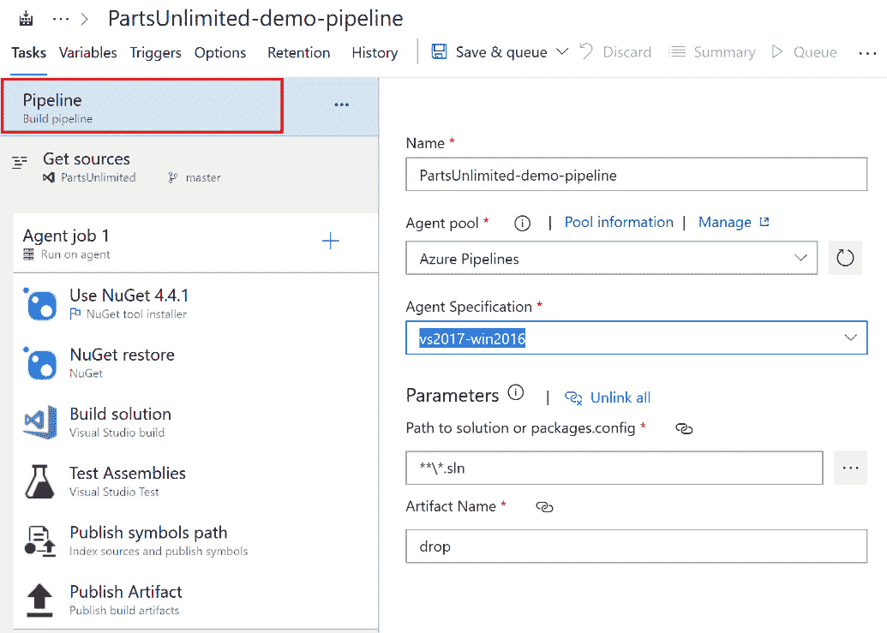
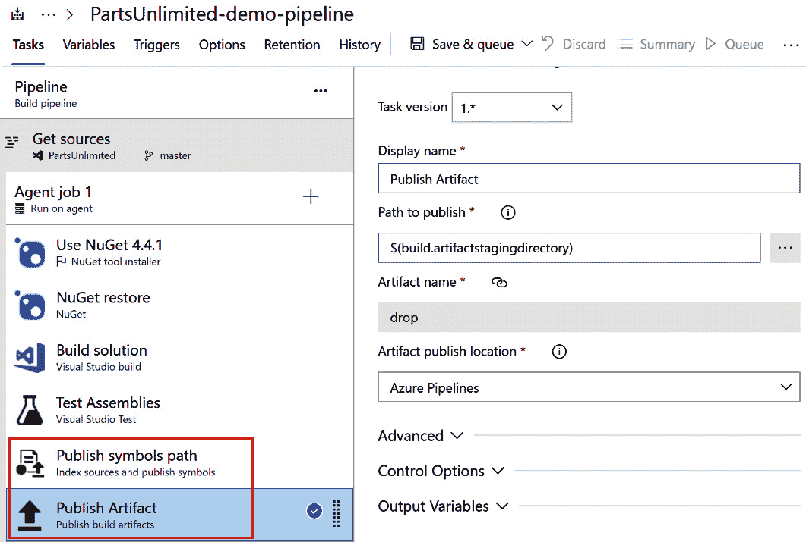

第四章：

# 了解 Azure DevOps Pipelines

在组织中采用 **Azure DevOps** 时，您必须做出的一个主要决策是如何定义您的开发过程的 **流水线**。流水线是一个公司定义的模型，描述了从构建到最终发布阶段代码库必须支持的步骤和操作。它是任何 DevOps 架构的关键部分。

在本章中，我们将学习如何定义和使用 Azure DevOps 管道来构建代码。

我们将涵盖以下主题：

+   实现 CI/CD 流程

+   Azure Pipelines 概述

+   创建和使用构建代理

+   YAML 格式概述

+   在 Azure DevOps 中创建 CI/CD 流水线

+   构建的保持

+   多阶段管道

+   使用 GitHub 仓库构建管道

+   在 Azure Pipelines 中使用容器作业

+   开始吧！

# 技术要求

要跟随本章，您需要具备以下内容：

+   Azure DevOps 中的有效组织

+   一个 Azure 订阅，您可以在这些环境中的一个上创建 Azure 虚拟机或本地机器，以便安装构建代理软件

+   Visual Studio 或 Visual Studio Code 作为您的开发环境

+   访问以下 GitHub 仓库以克隆项目：[`github.com/Microsoft/PartsUnlimited`](https://github.com/Microsoft/PartsUnlimited)

# 实现 CI/CD 流程

在公司采用 DevOps 时，实现正确的 DevOps 工具和 DevOps 流程至关重要。DevOps 实现中的一个基本流程是 **持续集成**（**CI**）和 **持续交付**（**CD**）过程，它可以帮助开发人员以更快速、结构化和安全的方式构建、测试和分发代码库。

**CI** 是一种软件工程实践，开发团队中的开发人员每天会多次将代码修改集成到中央代码库中。当代码修改被集成到特定分支时（通常通过拉取请求，正如前一章所述），会触发一个新的构建，以便快速检查代码并发现集成错误。此外，在此阶段还会执行自动化测试（如果可用），以检查是否存在故障。

**CD** 是在 CI 过程之后的一个过程。在此过程中，CI 阶段的输出被打包并交付到生产阶段，无错误。这对于确保我们始终拥有经过测试、一致且准备好部署的主分支非常有帮助。

在 DevOps 中，您还可以实现 **持续部署** 过程，在此过程中，您可以自动将代码修改部署到最终的生产环境中，而无需手动干预。

典型的 DevOps CI/CD 循环在以下著名的“循环”图中表示：


图 4.1 – DevOps CI/CD 循环

一个典型的 CI/CD 流水线实现包含以下阶段：

+   **提交阶段**：在此阶段，新代码修改会被集成到代码库中，并执行一系列单元测试，以检查代码的完整性和质量。

+   **构建阶段**：在此阶段，代码会自动构建，然后将构建过程的最终结果（构建产物）推送到最终的注册表。

+   **测试阶段**：构建的代码将部署到预生产环境，在那里执行最终的测试，然后进入生产部署阶段。在这里，代码通过采用 Alpha 和 Beta 部署进行测试。Alpha 部署阶段是开发人员检查新构建的性能和构建之间的交互的地方。在 Beta 部署阶段，开发人员执行手动测试，以再次检查应用程序是否正常工作。

+   **生产部署阶段**：这是最终应用程序在成功通过所有测试要求后，推送到生产阶段的地方。

在您的组织中实现 CI/CD 流程有很多好处。主要好处如下：

+   **提高代码质量和早期发现漏洞**：通过采用自动化测试，您可以在早期发现漏洞和问题，并进行修复。

+   **完整的可追溯性**：整个构建、测试和部署过程都被跟踪，并且可以稍后进行分析。这确保您可以检查特定构建中的哪些更改被包含，并了解这些更改对最终测试或发布的影响。

+   **更快的测试和发布阶段**：自动化每次新提交（或发布前）的代码库构建和测试。

在下一节中，我们将概述 Azure 平台提供的用于实现 CI/CD 的服务：Azure Pipelines。

# Azure Pipelines 概述

**Azure Pipelines** 是 Azure 平台提供的云服务，可以自动化您的开发生命周期中的构建、测试和发布阶段（CI/CD）。Azure Pipelines 可以与任何语言或平台一起使用，集成在 Azure DevOps 中，您可以在 Windows、Linux 或 macOS 机器上构建代码。

Azure Pipelines 对于公共项目是免费的，而对于私有项目，每月提供最多 1,800 分钟（30 小时）的免费管道使用时间。有关定价的更多信息，请访问这里：

[`azure.microsoft.com/en-us/pricing/details/devops/azure-devops-services/`](https://azure.microsoft.com/en-us/pricing/details/devops/azure-devops-services/)

Azure Pipelines 的一些重要特性可以总结如下：

+   它是平台和语言独立的，这意味着您可以在任何平台上使用所需的代码库构建代码。

+   它可以与不同类型的代码库（Azure Repos、GitHub、GitHub Enterprise、BitBucket 等）集成。

+   有许多扩展（标准和社区驱动）可供构建代码和处理自定义任务。

+   允许将代码部署到不同的云供应商。

+   您可以使用容器化应用程序，如 Docker、Azure Container Registry 或 Kubernetes。

要使用 Azure Pipelines，您需要以下内容：

+   在 Azure DevOps 中的组织，您可以创建公开或私有项目

+   存储在版本控制系统中的源代码（如 Azure DevOps Repos 或 GitHub）

Azure Pipelines 使用以下架构：


图 4.2 – Azure Pipelines 架构

当您的代码提交到仓库中的特定分支时，**构建管道**引擎启动，构建和测试任务执行，如果一切顺利完成，您的应用程序将被构建，您将得到最终输出（工件）。您还可以创建一个**发布管道**，将构建的输出发布到目标环境（预发布或生产）。

要开始使用 Azure Pipelines，您需要创建一个**管道**。Azure DevOps 中的管道可以通过以下两种方式创建：

+   **使用经典界面**：这允许您从可能的任务列表中可视化选择一些任务，您只需填写这些任务的参数。

+   **使用名为 YAML 的脚本语言**：可以通过在仓库中创建一个 YAML 文件，定义所有需要的步骤来定义管道。

使用经典界面初始阶段可能更简单，但请记住，许多功能仅在 YAML 管道中可用。YAML 管道定义是一个文件，这个文件可以像仓库中的其他文件一样进行版本控制和管理。您可以轻松地在项目之间迁移管道定义（这在经典界面中是不可能的）。

Azure Pipelines 可以表示为如下所示（感谢 Microsoft 提供）：


图 4.3 – Azure Pipelines 的表示

一个管道从**触发器**开始（手动触发、仓库中的推送、拉取请求或计划任务）。管道通常由一个或多个**阶段**组成（管道中的逻辑分离，例如构建、测试、部署等；它们可以并行运行），每个阶段包含一个或多个**作业**（一组步骤，这些步骤也可以并行运行）。每个管道至少包含一个阶段，除非您明确创建了多个阶段。每个作业在**代理**上运行（执行作业的服务或软件）。每个步骤由**任务**组成，任务对代码执行某些操作（按顺序执行）。管道的最终输出是一个**工件**（构建发布的文件或包的集合）。

创建管道时，您需要定义一组作业和任务，以自动化您的构建（或多阶段构建）。您可以获得对测试集成、发布门、自动报告等的原生支持。

当在管道中定义多个作业时，这些作业是并行执行的。包含多个作业的管道被称为**扇出**场景：


图 4.4 – 扩展管道

一个包含多个任务的单阶段管道可以表示如下：

```
pool:
```

```
  vmImage: 'ubuntu-latest'
```

```
jobs:
```

```
- job: job1
```

```
  steps:
```

```
  - bash: echo "Hello!"
```

```
  - bash: echo "I'm job 1"
```

```
- job: job2
```

```
  steps:
```

```
  - bash: echo "Hello again…"
```

```
  - bash: echo "I'm job 2"
```

如果你在定义管道时使用阶段，那么这就是所谓的扩展/合并场景：


图 4.5 – 扩展管道

在这里，每个阶段都是一个合并操作，阶段中的所有任务（这些任务可以是按顺序运行的多个任务）必须完成后，下一个阶段才能触发（每次只能有一个阶段在执行）。我们将在本章后面讨论多阶段管道。

# 理解构建代理

要使用 Azure Pipelines 构建和部署代码，你至少需要一个代理。代理是运行你管道中定义的任务的服务。这些任务的执行可以直接在代理的主机机器上，或在容器中进行。

在为管道定义代理时，你基本上有两种代理类型可选：

+   **Microsoft 托管代理**：这是一个完全由 Microsoft 管理的服务，每次执行管道时都会清除（每次管道执行时，你都会获得一个全新的环境）。

+   **自托管代理**：这是一个需要你自己设置和管理的服务。它可以是 Azure 上的自定义虚拟机，或者是你基础设施内的自定义本地机器。在自托管代理中，你可以安装所有需要的构建软件，并且这些软件会在每次管道执行时得到保留。自托管代理可以运行在 Windows、Linux、macOS 或 Docker 容器中。

## Microsoft 托管代理

Microsoft 托管代理是定义管道代理的最简单方法。Azure Pipelines 默认提供一个名为 **Azure Pipelines** 的 Microsoft 托管代理池：


图 4.6 – Azure Pipelines 默认代理池

通过选择此代理池，你可以为执行管道创建不同的虚拟机类型。在撰写本文时，提供的标准代理类型如下：


表 1.1

这些图像中的每一张都有自己的软件自动安装。你可以通过在管道定义中使用预定义的工具安装器任务来安装额外的工具。更多信息请见这里：

https://docs.microsoft.com/en-us/azure/devops/pipelines/tasks/?view=azure-devops#tool。

当你使用 Microsoft 托管代理创建管道时，只需要指定要用于代理的虚拟机镜像名称，如前表所示。举例来说，这是一个使用 Windows Server 2019 和 Visual Studio 2019 镜像的托管代理定义：

```
- job: Windows
```

```
  pool:
```

```
    vmImage: 'windows-latest'
```

使用 Microsoft 托管代理时，需要记住以下几点：

+   你无法在代理机器上登录。

+   该代理运行在标准 DS2v2 Azure 虚拟机上，并且无法增加其容量。

+   它在 Windows 平台上以管理员用户身份运行，在 Linux 平台上以*无密码的 sudo* 用户身份运行。

+   对于公共项目，你可以获得 10 个免费的 Microsoft 托管并行作业，每个作业最多运行 360 分钟，且每月没有整体时间限制。

+   对于私有项目，你可以获得一个免费的并行作业，每次运行最多 60 分钟，每月的最大时长为 1,800 分钟（30 小时）。如果需要更多容量，你可以支付额外费用来增加并行作业数量。这样，你可以让每个作业运行最多 360 分钟。

+   Microsoft 托管代理在与 Azure DevOps 组织相同的 Azure 地理区域内运行，但不保证它也会在相同的区域运行（一个 Azure 地理区域包含一个或多个区域）。

## 自托管代理

虽然 Microsoft 托管代理是一个 SaaS 服务，但自托管代理是你可以根据需要配置的私有代理，使用 Azure 虚拟机或直接使用你自己的本地基础设施。你负责提供执行管道所需的所有软件和工具，并且你负责维护和升级代理。

自托管代理可以安装在以下平台上：

+   Windows

+   Linux

+   macOS

+   Docker

创建自托管代理包括完成以下活动：

+   准备环境

+   在 Azure DevOps 上准备权限

+   下载并配置代理

+   启动代理

这些步骤在所有环境中都类似。接下来，我们将学习如何创建一个自托管的 Windows 代理。

### 创建自托管 Windows 代理

自托管 Windows 代理用于构建和部署基于 Microsoft 平台（如 .NET 应用、Azure 云应用等）构建的应用程序，也适用于其他平台类型，如 Java 和 Android 应用。

创建代理时的第一步是将代理注册到你的 Azure DevOps 组织中。为此，你需要以管理员身份登录到你的 DevOps 组织，并从**用户设置**菜单中点击**个人访问令牌**：


图 4.7 – 个人访问令牌

在这里，你可以为你的组织创建一个新的个人访问令牌，设置过期日期，并选择完全访问或自定义访问级别（如果选择自定义访问范围，则需要为每个范围选择所需的权限）。要查看可用范围的完整列表，请点击此窗口底部的**显示所有范围**链接：


图 4.8 – 创建新的个人访问令牌

请检查是否已启用**代理池**范围的**读取和管理**权限。

完成后，点击**创建**，然后在关闭窗口之前复制生成的令牌（它只会显示一次）。

重要提示

你将用于代理程序的用户必须是具有注册代理程序权限的用户。你可以通过进入**组织设置** | **代理池**，选择**默认**池，然后点击**安全性**来检查这一点。

现在，你需要下载代理软件并进行配置。从**组织设置** | **代理池**，选择**默认**池，在**代理**选项卡中点击**新代理**：


图 4.9 – 创建新代理

**获取代理**窗口将打开。选择**Windows**作为目标平台，选择**x64**或**x86**作为目标代理平台（机器），然后点击**下载**按钮：


图 4.10 – 代理软件下载页面

该过程会下载一个包（通常名为`vsts-agent-win-x64-2.166.4.zip`）。你需要在代理机器上运行这个包（`config.cmd`）（可以是 Azure 虚拟机或你的本地服务器，它将作为你构建的代理程序）：


图 4.11 – 代理软件包

安装程序会询问你以下内容：

+   你的 Azure DevOps 组织的 URL ([`dev.azure.com/`](https://dev.azure.com/){your-organization})

+   要使用的个人访问令牌（之前创建的）

在运行代理程序时（无论是交互式还是作为服务），如果你希望自动化构建，推荐以服务的方式运行它。

在插入这些参数后，安装程序会注册代理程序：


图 4.12 – 代理注册

要注册代理程序，你需要插入代理池、代理名称和工作文件夹（你可以保持默认值不变）。

最后，你需要决定你的代理程序是必须以*交互式*方式执行，还是*作为服务*运行。正如我们之前提到的，推荐以服务的方式运行代理程序，但在很多情况下，交互式选项会很有帮助，因为它可以为你提供一个控制台，你可以在其中查看状态和运行中的 UI 测试。

在这两种情况下，请注意你为运行代理程序选择的用户帐户。默认帐户是内建的网络服务用户，但这个用户通常没有本地文件夹所需的所有权限。使用管理员帐户可以帮助你解决很多问题。

如果安装成功，你应该能在代理机器上看到一个正在运行的服务，并且在 Azure DevOps 的代理池中弹出一个新代理：


4.13 – 新代理已创建

如果你选择了代理程序，然后进入**功能**部分，你将能够看到它的所有功能（操作系统版本、操作系统架构、计算机名称、安装的软件等）：


图 4.14 – 代理功能

代理的能力可以由代理软件自动发现，也可以通过你（用户自定义的能力）添加，如果你点击**添加新能力**操作。能力用于管道引擎，根据管道所需的能力（需求）将特定的构建重定向到正确的代理。

当代理在线时，它已准备好接受你的代码构建，该构建应该排队等待。

请记住，你也可以在同一台机器上安装多个代理（例如，如果你希望执行核心管道或并行处理作业），但仅在代理不会共享资源的情况下推荐这种方案。

## 何时使用 Microsoft 托管代理或自托管代理

当你有一个标准的代码库并且不需要特定的软件或环境配置来构建代码时，Microsoft 托管的代理通常很有用。如果你处于这种情况，推荐使用 Microsoft 托管的代理，因为你不必担心创建环境。例如，如果你需要构建一个 Azure Function 项目，通常情况下，你不需要在构建代理上安装自定义软件，Microsoft 托管的代理可以完美工作。

当你需要特定的环境配置，或者需要在代理上安装特定的软件或工具，或者需要更多的构建计算能力时，自托管代理是最佳选择。自托管代理也是当你需要在每次构建运行之间保持环境一致时的首选。当你需要更好地控制代理或希望将构建部署到本地环境（外部无法访问）时，自托管代理通常是正确的选择。它也通常能帮你节省成本。

现在我们已经讨论了可以用于构建管道的可能构建代理，在接下来的部分中，我们将概述 YAML，这是一种允许你定义管道的脚本语言。

# YAML 语言概述

**YAML**，即**YAML 不只是标记语言**，是一种人类可读的脚本语言，用于数据序列化，通常用于处理应用程序的配置定义。它可以视为 JSON 的超集。

YAML 使用缩进来处理对象定义的结构，并且对引号和大括号不敏感。它只是一个数据表示语言，不用于执行命令。

在 Azure DevOps 中，YAML 极为重要，因为它允许你使用脚本定义来定义管道，而不是使用图形界面（图形界面无法在项目之间移植）。

官方 YAML 网站可以在这里找到：

[`yaml.org/`](http://yaml.org/)

YAML 结构基于键值元素：

`Key: Value # 这是一个注释`

在接下来的部分中，我们将学习如何在 YAML 中定义对象。

## 标量

作为示例，以下是 YAML 中已定义的标量变量：

```
Number: 1975 quotedText: "some text description"notQuotedtext: strings can be also without quotes boolean: true nullKeyValue: null
```

你还可以通过使用`?`后跟一个空格来定义多行键，如下所示：

```
? |
```

```
  This is a key
```

```
  that has multiple lines
```

```
: and this is its value
```

## 集合和列表

这是一个集合对象的 YAML 定义：

```
Cars:
```

```
   - Fiat
```

```
   - Mercedes
```

```
   - BMW
```

你还可以定义嵌套集合：

```
- Drivers:
```

```
      name: Stefano Demiliani
```

```
      age: 45
```

```
      Driving license type:
```

```
          - type: full car license
```

```
            license id: ABC12345
```

```
            expiry date: 2025-12-31
```

## 字典

你可以通过以下方式使用 YAML 定义一个`Dictionary`对象：

```
CarDetails:
```

```
     make: Mercedes
```

```
     model: GLC220
```

```
     fuel: Gasoline
```

## 文档结构

YAML 使用三个短横线`---`来分隔指令与文档内容，并标识文档的开始。作为示例，以下 YAML 定义了一个文件中的两个文档：

```
---# Products purchased
```

```
- item    : Surface Book 2
```

```
  quantity: 1
```

```
- item    : Surface Pro 7
```

```
  quantity: 3
```

```
- item    : Arc Mouse
```

```
  quantity: 1
```

```
# Product out of stock
```

```
---
```

```
- item    : Surface 4
```

```
- item    : Microsoft Trackball
```

## 复杂对象定义

作为如何在 YAML 中定义复杂对象的示例，以下是用于表示`Invoice`对象的方式：

```
--- 
```

```
invoice: 20-198754
```

```
date   : 2020-05-27
```

```
bill-to: C002456
```

```
    Name  : Stefano Demiliani
```

```
    address:
```

```
        lines: 
```

```
            Viale Pasubio, 21
```

```
            c/o Microsoft House
```

```
        city    : Milan
```

```
        state   : MI
```

```
        postal  : 20154
```

```
ship-to: C002456
```

```
product:
```

```
    - itemNo      : ITEM001
```

```
      quantity    : 1
```

```
      description : Surface Book 2
```

```
      price       : 1850.00
```

```
    - sku         : ITEM002
```

```
      quantity    : 2
```

```
      description : Arc Mouse
```

```
      price       : 65.00
```

```
tax  : 80.50
```

```
total: 1995.50
```

```
comments:
```

```
    Please deliver on office hours.
```

```
    Leave on the reception.
```

现在我们已经提供了 YAML 语法的快速概述，在下一部分，我们将学习如何使用 Azure DevOps 创建构建管道。

# 使用 Azure DevOps 创建构建管道

如果你想为代码实现持续集成（每次提交时自动构建和测试代码），那么设置构建管道是一个基本步骤。

使用 Azure DevOps 创建构建管道的先决条件显然是需要将代码存储在一个代码库中。

要使用 Azure DevOps 创建构建管道，你需要进入**管道**中心并选择**管道**操作：


图 4.15 – 构建管道创建

从这里，你可以通过选择**新建管道**按钮来创建一个新的构建管道。点击后，你将看到以下屏幕，要求你提供一个代码库：


图 4.16 – 选择一个代码库

这个屏幕非常重要。从这里，你可以通过两种可能的方式开始创建构建管道（如前所述）：

1.  使用 YAML 文件创建管道定义。这就是当你在此窗口中选择代码库时发生的情况。

1.  使用经典编辑器（图形用户界面）。当你点击页面底部的**使用经典编辑器**链接时，就会发生这种情况。

在下一部分，我们将学习如何使用这两种方法创建构建管道。

## 使用经典编辑器定义管道

经典编辑器允许你通过选择预定义的操作，图形化地定义项目的构建管道。如前所述，以这种方式创建的管道定义不受源代码控制。

当你点击**使用经典编辑器**链接时，你需要选择存放代码的代码库（**Azure Repos Git**、**GitHub**、**GitHub 企业服务器**、**Subversion**、**TFVC**、**Bitbucket Cloud** 或 **其他 Git**）以及构建管道将连接的分支：


图 4.17 – 经典编辑器管道定义

然后，您需要选择正在构建的应用程序类型的模板。您有一组预定义的模板可供选择（稍后可以自定义），但您也可以从空模板开始：


图 4.18 – 管道模板选择

如果预定义的模板符合您的需求，您可以开始使用它们；否则，建议通过选择您需要的操作来创建自定义管道。

在这里，我的应用程序存储在 Azure DevOps 项目存储库中，是一个 ASP.NET Web 应用程序（名为`PartsUnlimited`的电子商务网站项目；您可以在以下 URL 找到公共存储库：[`github.com/Microsoft/PartsUnlimited`](https://github.com/Microsoft/PartsUnlimited)），因此我选择了 ASP.NET 模板。

当选择时，这是将自动为您创建的管道模板：


图 4.19 – 从模板创建的管道

让我们详细检查管道的每个部分。

管道（这里称为`PartsUnlimited-demo-pipeline`）在 Microsoft 托管的代理（Azure 管道代理池）上运行，基于**vs2017-win2016**模板（Windows Server 2016 与 Visual Studio 2017），如下截图所示：



图 4.20 – 管道上的代理规范

代理作业从安装 NuGet 软件包管理器开始，并恢复所选存储库中构建项目所需的软件包。对于这些操作，管道定义包含您可以在以下截图中看到的任务：


图 4.21 – NuGet 任务

然后，有一个构建解决方案的任务：


图 4.22 – 构建解决方案任务

还有一个任务是测试解决方案并发布测试结果：


图 4.23 – 测试组件任务

最后几步是将构建过程的源发布为工件（构建的输出）：



图 4.24 – 发布任务

如果选择**变量**选项卡，您将看到在构建过程中使用的一些参数。在这里，如果需要，您可以创建自己的变量以在管道内部使用：


图 4.25 – 管道变量

接下来的部分称为**触发器**。在这里，您可以定义触发器何时启动您的管道。默认情况下，最初没有触发器发布，但在这里，您可以启用 CI 以在所选分支上的每次提交时自动启动您的管道：


图 4.26 – 管道触发器

重要提示

启用 CI 是一种推荐做法，如果你希望每次在某个分支上提交的代码（例如在 **master** 分支上）都经过测试并得到安全控制。这样，你可以确保代码始终按预期工作。

在 **选项** 选项卡中，你可以设置一些与构建定义相关的选项。例如，在这里，你可以创建与所有工作项的链接，使它们在构建成功完成时与相关更改关联，构建失败时创建工作项，设置管道的状态徽章，指定超时时间等：


图 4.27 – 管道选项

**保留** 选项卡用于配置这个特定管道的保留策略（例如，保留工件多少天，保留运行和拉取请求多少天等）。这样做将覆盖一般的保留设置。我们将在后面的 *构建保留* 部分讨论这些设置。

一旦完成定义管道，你可以点击 **保存并排队** 来保存你的定义。通过点击 **保存并运行**，管道将被放入队列并等待代理：


图 4.28 – 运行管道

当找到代理时，管道将被执行，且你的代码会被构建：


图 4.29 – 管道执行开始

你可以跟踪管道每个步骤的执行，并查看相关的日志。如果管道成功结束，你可以查看其执行摘要：


图 4.30 – 管道 – 最终结果

你还可以选择 **测试** 选项卡，查看测试执行状态：


图 4.31 – 管道测试结果

在下一节中，我们将学习如何为这个应用程序创建一个 YAML 管道。

## YAML 管道定义

如前所述，当你开始使用 Azure DevOps 创建构建管道时，向导默认会创建一个基于 YAML 的管道。

要开始创建 YAML 管道，进入 Azure DevOps 的 **管道** 部分并点击 **新建管道**。

在这里，不要选择经典编辑器（正如我们在前一节中所做的），只需选择你的代码所在的仓库类型（**Azure Repos Git**，**GitHub**，**BitBucket**等）：


图 4.32 – YAML 管道定义

然后，从可用的仓库列表中选择你的仓库：


图 4.33 – YAML 管道 – 仓库选择

系统现在会分析你的代码库，并根据库中存储的代码建议一组可用的模板。你可以从一个空白的 YAML 模板开始，或者选择一个模板。这里，我选择了 ASP.NET 模板：


图 4.34 – YAML 管道 – 模板选择

系统会创建一个 YAML 文件（名为 `azure-pipelines.yml`），如以下截图所示：


图 4.35 – YAML 管道定义

生成的 YAML 定义包含了一组任务，就像前面的示例一样，但这些任务在它们的 YAML 定义中。完整的生成文件如下：

```
# ASP.NET
```

```
# Build and test ASP.NET projects.
```

```
# Add steps that publish symbols, save build artifacts, deploy, and more:
```

```
# https://docs.microsoft.com/azure/devops/pipelines/apps/aspnet/build-aspnet-4
```

```
trigger:
```

```
- master
```

```
pool:
```

```
  vmImage: 'windows-latest'
```

```
variables:
```

```
  solution: '**/*.sln'
```

```
  buildPlatform: 'Any CPU'
```

```
  buildConfiguration: 'Release'
```

```
steps:
```

```
- task: NuGetToolInstaller@1
```

```
- task: NuGetCommand@2
```

```
  inputs:
```

```
    restoreSolution: '$(solution)'
```

```
- task: VSBuild@1
```

```
  inputs:
```

```
    solution: '$(solution)'
```

```
    msbuildArgs: '/p:DeployOnBuild=true /p:WebPublishMethod=Package /p:PackageAsSingleFile=true /p:SkipInvalidConfigurations=true /p:PackageLocation="$(build.artifactStagingDirectory)"'
```

```
    platform: '$(buildPlatform)'
```

```
    configuration: '$(buildConfiguration)'
```

```
- task: VSTest@2
```

```
  inputs:
```

```
    platform: '$(buildPlatform)'
```

```
    configuration: '$(buildConfiguration)'
```

```
Here I add two more tasks for publishing the symbols and the final artifacts of the pipeline:
```

```
task: PublishSymbols@2
```

```
  displayName: 'Publish symbols path'
```

```
  inputs:
```

```
    SearchPattern: '**\bin\**\*.pdb'
```

```
    PublishSymbols: false
```

```
  continueOnError: true
```

```
- task: PublishBuildArtifacts@1
```

```
  displayName: 'Publish Artifact'
```

```
  inputs:
```

```
    PathtoPublish: '$(build.artifactstagingdirectory)'
```

```
    ArtifactName: '$(Parameters.ArtifactName)'
```

```
  condition: succeededOrFailed()
```

如你所见，YAML 文件包含了启动管道的触发器（这里是主分支上的提交）、使用的代理池、管道变量，以及每个任务执行的顺序（以及它的具体参数）。

点击保存并运行，如前面截图所示，这将排队执行管道。以下截图显示了执行后的 YAML 管道。


图 4.36 – 执行的 YAML 管道

若要添加新任务，使用编辑器框右侧的助手工具非常有用。它允许你查看**任务**列表，你可以在其中搜索任务，填写必要的参数，然后生成最终的 YAML 定义：


图 4.37 – YAML 管道任务选择

当你选择使用 YAML 创建管道时，Azure DevOps 会在与你的代码存储在同一代码库中创建一个文件：


图 4.38 – 创建的 YAML 管道文件

这个文件在源控制下，并且每次修改时都会版本控制。

要了解管道的完整 YAML 模式，建议点击以下链接：

[`docs.microsoft.com/zh-cn/azure/devops/pipelines/yaml-schema?view=azure-devops&tabs=schema%2Cparameter-schema`](https://docs.microsoft.com/zh-cn/azure/devops/pipelines/yaml-schema?view=azure-devops&tabs=schema%2Cparameter-schema.)

# 构建保留

当你运行管道时，Azure DevOps 会记录每个步骤的执行情况，并存储每次运行的最终工件和测试结果。

Azure DevOps 对管道执行有一个默认的保留策略，保留时间为 30 天。你可以通过进入**项目设置** | **管道** | **设置**来更改这些默认值：


图 4.39 – 管道保留策略

你还可以使用**复制文件**任务，将构建和工件数据存储到外部存储中，这样你就可以将它们保存得比保留策略中指定的时间更长：


图 4.40 – 复制文件任务

此任务的 YAML 定义如下：

```
- task: CopyFiles@2
```

```
  displayName: 'Copy files to shared network'
```

```
  inputs:
```

```
    SourceFolder: '$(Build.SourcesDirectory)'
```

```
    Contents: '**'
```

```
    TargetFolder: '\\networkserver\storage\$(Build.BuildNumber)'
```

重要提示

请记住，任何通过**发布构建构件**任务保存为构件的数据都会定期删除。

关于**复制文件**任务的更多信息，请参见此处：

[`docs.microsoft.com/en-us/azure/devops/pipelines/tasks/utility/copy-files?view=azure-devops&tabs=yaml`](https://docs.microsoft.com/en-us/azure/devops/pipelines/tasks/utility/copy-files?view=azure-devops&tabs=yaml)。

# 多阶段流水线

正如我们之前所解释的，您可以将流水线中的工作划分为`stages`。`Stages`是在流水线流程中的逻辑边界（可以分配给代理的工作单元），它们允许您隔离工作、暂停流水线并执行检查或其他操作。默认情况下，每个流水线由一个阶段组成，但您可以创建多个阶段，并将这些阶段安排成依赖图。

多阶段流水线的基本 YAML 定义如下：

```
stages:  
```

```
	- stage: Build  
```

```
	  jobs:  
```

```
	  - job: BuildJob  
```

```
	    steps:  
```

```
	    - script: echo Build!  
```

```
	- stage: Test  
```

```
	  jobs:  
```

```
	  - job: TestOne  
```

```
	    steps:  
```

```
	    - script: echo Test 1  
```

```
	  - job: TestTwo 
```

```
	    steps:  
```

```
	    - script: echo Test 2  
```

```
	- stage: Deploy  
```

```
	  jobs:  
```

```
	  - job: Deploy  
```

```
	    steps:  
```

```
	    - script: echo Deployment
```

作为创建多阶段流水线的示例，假设我们有一个流水线，它使用 .NET Core SDK 在您的仓库中构建代码，并将构件发布为 NuGet 包。流水线定义如下。该流水线使用`stages`关键字来标识这是一个多阶段流水线。

在第一阶段定义（`Build`）中，我们有用于构建代码的任务：

```
trigger:
```

```
	- master
```

```
	stages:
```

```
	- stage: 'Build'
```

```
	  variables:
```

```
	    buildConfiguration: 'Release'
```

```
	  jobs:
```

```
	  - job:
```

```
	    pool:
```

```
	      vmImage: 'ubuntu-latest'
```

```
	    workspace:
```

```
	      clean: all
```

```
	    steps:
```

```
	    - task: UseDotNet@2
```

```
	      displayName: 'Use .NET Core SDK'
```

```
	      inputs:
```

```
	        packageType: sdk
```

```
	        version: 2.2.x
```

```
	        installationPath: $(Agent.ToolsDirectory)/dotnet
```

```
	    - task: DotNetCoreCLI@2
```

```
	      displayName: "NuGet Restore"
```

```
	      inputs:
```

```
	        command: restore
```

```
	        projects: '**/*.csproj'
```

```
	    - task: DotNetCoreCLI@2
```

```
	      displayName: "Build Solution"
```

```
	      inputs:
```

```
	        command: build
```

```
	        projects: '**/*.csproj'
```

```
	        arguments: '--configuration (buildConfiguration)'
```

在这里，我们使用 Azure DevOps 中可用的**UseDotnet**标准任务模板安装了 .NET Core SDK（更多信息请参见：[`docs.microsoft.com/en-us/azure/devops/pipelines/tasks/tool/dotnet-core-tool-installer?view=azure-devops)`](https://docs.microsoft.com/en-us/azure/devops/pipelines/tasks/tool/dotnet-core-tool-installer?view=azure-devops)）。之后，我们还原了所需的 NuGet 包并构建了解决方案。

现在，我们需要创建 NuGet 包的发布版本。此包保存在构件暂存目录的 packages/release 文件夹中。在这里，我们将使用`nobuild = true`，因为在此任务中，我们不需要再次构建解决方案（不再进行编译）：

```
    - task: DotNetCoreCLI@2
```

```
      displayName: 'Create NuGet Package - Release Version'
```

```
      inputs:
```

```
        command: pack
```

```
        packDirectory: '$(Build.ArtifactStagingDirectory)/packages/releases'
```

```
        arguments: '--configuration $(buildConfiguration)'
```

```
        nobuild: true
```

接下来的步骤是创建 NuGet 包的预发布版本。在此任务中，我们使用`buildProperties`选项将构建号添加到包版本中（例如，如果包版本为 2.0.0.0，构建号为 20200521.1，则包版本将为 2.0.0.0.20200521.1）。在这里，必须构建包（用于获取构建 ID）：

```
    - task: DotNetCoreCLI@2
```

```
      displayName: 'Create NuGet Package - Prerelease Version'
```

```
      inputs:
```

```
        command: pack
```

```
        buildProperties: 'VersionSuffix="$(Build.BuildNumber)"'
```

```
        packDirectory: '$(Build.ArtifactStagingDirectory)/packages/prereleases'
```

```
        arguments: '--configuration $(buildConfiguration)'
```

下一任务将包发布为构件：

```
    - publish: '$(Build.ArtifactStagingDirectory)/packages'
```

```
      artifact: 'packages'
```

接下来，我们需要定义第二阶段，称为`PublishPrereleaseNuGetPackage`。在这里，我们跳过仓库的检出步骤，下载步骤将下载我们在前一个构建阶段发布的`packages`构件。然后，`NuGetCommand`任务将预发布包发布到 Azure DevOps 中的内部源，称为`Test`：

```
- stage: 'PublishPrereleaseNuGetPackage'
```

```
  displayName: 'Publish Prerelease NuGet Package'
```

```
  dependsOn: 'Build'
```

```
  condition: succeeded()
```

```
  jobs:
```

```
  - job:
```

```
    pool:
```

```
      vmImage: 'ubuntu-latest'
```

```
    steps:
```

```
    - checkout: none
```

```
    - download: current
```

```
      artifact: 'packages'
```

```
    - task: NuGetCommand@2
```

```
      displayName: 'Push NuGet Package'
```

```
      inputs:
```

```
        command: 'push'
```

```
        packagesToPush: '$(Pipeline.Workspace)/packages/prereleases/*.nupkg'
```

```
        nuGetFeedType: 'internal'
```

```
        publishVstsFeed: 'Test'
```

现在，我们需要定义第三个阶段，称为`PublishReleaseNuGetPackage`，该阶段用于为 NuGet 创建我们的包的发布版本：

```
- stage: 'PublishReleaseNuGetPackage'
```

```
  displayName: 'Publish Release NuGet Package'
```

```
  dependsOn: 'PublishPrereleaseNuGetPackage'
```

```
  condition: succeeded()
```

```
  jobs:
```

```
  - deployment:
```

```
    pool:
```

```
      vmImage: 'ubuntu-latest'
```

```
    environment: 'nuget-org'
```

```
    strategy:
```

```
     runOnce:
```

```
       deploy:
```

```
         steps:
```

```
         - task: NuGetCommand@2
```

```
           displayName: 'Push NuGet Package'
```

```
           inputs:
```

```
             command: 'push'
```

```
             packagesToPush: '$(Pipeline.Workspace)/packages/releases/*.nupkg'
```

```
             nuGetFeedType: 'external'
```

```
             publishFeedCredentials: 'NuGet'
```

这个阶段使用部署作业将包发布到配置的环境（在这里，称为`nuget-org`）。环境是管道内资源的集合。

在 `NuGetCommand` 任务中，我们指定了要推送的包，并且指定了我们推送包的源是外部的（`nuGetFeedType`）。通过使用`publishFeedCredentials`属性来获取该源，该属性设置为我们创建的服务连接名称。

对于这个阶段，我们创建了一个新的环境：


图 4.41 – 创建一个新环境

一旦环境创建完成，为了将其发布到 NuGet，您需要通过以下路径创建一个新的服务连接：**项目设置** | **服务连接** | **创建服务连接**，从可用服务连接类型的列表中选择**NuGet**，然后根据您的 NuGet 账户配置连接：


图 4.42 – 新的 NuGet 服务连接

至此，我们已经创建了一个多阶段构建管道。当管道执行并且所有阶段都成功终止时，您将看到如下所示的结果图：


图 4.43 – 执行的多阶段构建管道

现在我们已经理解了什么是多阶段管道，接下来我们将在下一部分中使用 GitHub 仓库创建一些管道。

# 使用 GitHub 仓库构建管道

GitHub 是最流行的源代码管理平台之一，通常情况下，会有许多场景，其中代码存储在 GitHub 仓库中，而您希望使用 Azure DevOps 来管理 CI/CD。

通过使用 Azure DevOps 和 Azure Pipeline 服务，您还可以为存储在 GitHub 上的仓库创建管道，从而在 GitHub 仓库的每次提交时触发构建管道。我们将通过以下步骤来实现：

1.  要使用 Azure Pipelines 构建您的 GitHub 仓库，您需要添加`Azure Pipelines`。选择**Azure Pipelines**扩展并点击**设置计划**，如以下截图所示：

    图 4.44 – GitHub 上的 Azure Pipelines – 设置

1.  选择**免费**计划，点击**免费安装**按钮，然后点击**完成订单并开始安装**。

1.  现在，Azure Pipelines 安装程序会询问您该应用程序是否应该对所有仓库可用，还是仅对选定的仓库可用。选择所需的选项，然后点击**安装**：

    图 4.45 – GitHub 上的 Azure Pipelines – 安装

1.  您现在将被重定向到 Azure DevOps，在那里您可以创建一个新项目（或选择现有项目）来处理构建过程。在这里，我将创建一个新项目：

    图 4.46 – 设置您的 Azure Pipelines 项目

1.  现在，您需要授权 Azure Pipelines 以访问您的 GitHub 账户：

    图 4.47 – 授权 Azure Pipelines 访问 GitHub

    给定必要的授权后，将为您在 Azure DevOps 上创建项目，并启动管道创建过程。您将立即被提示从账户中的可用 GitHub 存储库列表中选择一个用于构建的 GitHub 存储库：

    

    图 4.48 – 选择 GitHub 存储库

1.  在这里，我正在选择一个我有 Azure 函数项目的存储库。正如您所见，Azure Pipelines 已识别出我的项目，并为管道提供了一组可用模板（但您也可以从空白模板或存储库任何分支中的 YAML 文件开始）。在这里，我将选择`azure-pipelines.yml`) 在您的 GitHub 存储库内：

    图 4.50 – 多阶段 YAML 管道定义

    此管道在主分支上的每次提交时触发。

1.  单击**保存并运行**按钮。在这里，管道将排队等待一个代理，然后执行。

    每次在您的 GitHub 存储库中提交代码时，Azure DevOps 上的构建管道将自动触发。

    如果您在 GitHub 上构建一个公共存储库，展示这个存储库中的代码已经通过构建管道检查和测试是非常有用的。然后，您可以展示构建的结果。您可以通过在存储库中放置一个徽章来实现这一点。

    徽章是一个动态生成的图像，反映了构建的状态（从未构建、成功或失败），并且它托管在 Azure DevOps 上。

1.  为此，请在 Azure DevOps 中选择您的管道，在右侧点击三个点，然后选择**状态徽章**：

    图 4.51 – 状态徽章定义

1.  从这里，您可以复制`Readme.md`文件到您的 GitHub 存储库中：


图 4.52 – 构建状态徽章 markdown

每当用户访问您的存储库时，他们将能够通过图形徽章看到最新构建的状态：


图 4.53 – 构建管道状态徽章

接下来，让我们看看如何并行执行作业。

## 在 Azure Pipeline 中并行执行作业

在 Azure 流水线中，你还可以并行执行任务。每个任务可以独立于其他任务执行，也可以在不同的代理上执行。这将帮助你加速构建时间并提高流水线的性能。

作为如何在流水线中处理并行任务的示例，考虑一个简单的流水线，其中你需要执行三个 PowerShell 脚本，分别叫做**任务 1**、**任务 2**和**最终任务**。**任务 1**和**任务 2**可以并行执行，而**最终任务**只能在前两个任务完成后执行。

当你开始创建一个新的流水线时（为了简单起见，我这里使用经典编辑器），Azure DevOps 会创建一个代理任务（这里称为**代理任务 1**）。你可以将任务添加到此代理上。通过选择代理任务，你可以指定该任务运行的代理池。在这里，我希望这个任务在 Microsoft 托管的代理池上执行：


图 4.54 – 代理规格

然后，为了将新的代理池添加到你的流水线中（用于独立执行其他任务），点击流水线旁边的三个点并选择**添加代理任务**：


图 4.55 – 添加代理任务

现在，我们将添加第二个代理任务（这里称为**代理任务 2**），它运行在自托管代理上。这个任务将执行**任务 2**的 PowerShell 脚本：


图 4.56 – 代理选择

最后，我们将添加一个新的代理任务（这里称为**代理任务 3**），来执行将在 Microsoft 托管代理上运行的**最终任务**。然而，这个任务依赖于**代理任务 1**和**代理任务 2**：


图 4.57 – 代理任务依赖关系

这样，前两个任务将并行启动，最终任务将在前两个任务执行完毕后开始执行。

关于 Azure 流水线中的并行任务，建议你查看以下页面以获取更多信息：

[`docs.microsoft.com/en-us/azure/devops/pipelines/process/phases?view=azure-devops&tabs=yaml`](https://docs.microsoft.com/en-us/azure/devops/pipelines/process/phases?view=azure-devops&tabs=yaml)

## 运行在 Azure 容器实例上的代理

如果标准的 Microsoft 托管代理无法满足你的需求（例如要求、性能等），你还可以为 Azure DevOps 创建一个自托管代理，该代理在**Azure 容器实例**（**ACI**）服务中的 Docker 容器内运行。

你可以通过使用自定义镜像或重新使用 Microsoft 提供的镜像来创建一个运行在 Azure 容器实例上的构建代理。

要创建一个运行在 ACI 上的构建代理，你需要为你的 Azure DevOps 组织创建一个**个人访问令牌**。为此，请从你的 Azure DevOps 组织主页，打开用户设置（右上角），然后选择**个人访问令牌**。

当您拥有代理的个人访问令牌时，您可以通过执行以下命令从 Azure CLI 创建 ACI 上的代理（连接到 Azure 订阅后）：

```
az container create -g RESOURCE_GROUP_NAME -n CONTAINER_NAME --image mcr.microsoft.com/azure-pipelines/vsts-agent --cpu 1 --memory 7 --environment-variables VSTS_ACCOUNT=AZURE_DEVOPS_ACCOUNT_NAME VSTS_TOKEN=PERSONAL_ACCESS_TOKEN VSTS_AGENT=AGENT_NAME VSTS_POOL=Default
```

这里我们有以下内容：

+   `RESOURCE_GROUP_NAME` 是您在 Azure 中创建此资源时所用的资源组名称。

+   `CONTAINER_NAME` 是 ACI 容器的名称。

+   `AZURE_DEVOPS_ACCOUNT_NAME` 是您的 Azure DevOps 账户名称。

+   `PERSONAL_ACCESS_TOKEN` 是您之前创建的个人访问令牌。

+   `AGENT_NAME` 是您要创建的构建代理的名称。它将显示在 Azure DevOps 上。

在此命令中，还有另外两个重要参数：

+   `--image` 用于选择用于创建代理的 Azure Pipelines 镜像名称，具体描述请参见此处：[`hub.docker.com/_/microsoft-azure-pipelines-vsts-agent`](https://hub.docker.com/_/microsoft-azure-pipelines-vsts-agent)。

+   `VSTS_POOL` 用于选择构建代理的代理池。

请记住，您可以通过使用 `az container stop` 和 `az container start` 命令来启动和停止 ACI 实例。这可以帮助您节省开支。

# 在 Azure Pipelines 中使用容器作业

在本章中，我们看到，当您创建管道时，您会定义作业，并且当管道执行时，这些作业将在安装代理的主机上运行。

如果您使用的是 Windows 或 Linux 代理，您还可以在容器中运行作业（与主机隔离）。要在容器中运行作业，您需要在代理上安装 Docker，并且您的管道必须具有访问 Docker 守护程序的权限。如果您使用的是 Microsoft 托管的代理，实际上在 `windows-2019` 和 `ubuntu-16.04` 池镜像中支持在容器中运行作业。

例如，这是一个在 Windows 管道中使用容器作业的 YAML 定义：

```
pool:
```

```
  vmImage: 'windows-2019'
```

```
container: mcr.microsoft.com/windows/servercore:ltsc2019
```

```
steps:
```

```
- script: date /t
```

```
  displayName: Gets the current date
```

```
- script: dir  
```

```
  workingDirectory: $(Agent.BuildiDirectory)
```

```
  displayName: list the content of a folder
```

正如我们之前提到的，要在 Windows 容器中运行作业，您需要使用 `windows-2019` 镜像池。要求主机和容器的内核版本匹配，因此在这里，我们使用 `ltsc2019` 标签来获取容器的镜像。

对于基于 Linux 的管道，您需要使用 `ubuntu-16.04` 镜像：

```
pool:
```

```
  vmImage: 'ubuntu-16.04'
```

```
container: ubuntu:16.04
```

```
steps:
```

```
- script: printenv
```

如您所见，管道根据所选镜像创建一个容器，并在该容器内运行命令（步骤）。

# 摘要

在本章中，我们概述了 Azure Pipelines 服务，并展示了如何使用 Azure DevOps 实现 CI/CD 流程。我们还展示了如何通过图形界面和 YAML 创建托管在仓库中的代码流水线，以及如何使用和创建构建代理。接着，我们了解了如何使用经典编辑器和 YAML 定义创建构建流水线。我们还展示了一个多阶段流水线的示例，以及如何使用 Azure DevOps 流水线在 GitHub 仓库中构建代码，随后学习了如何在构建流水线中使用并行任务来提高构建性能。最后，我们学习了如何在 Azure 容器实例中创建构建代理，并如何使用容器的作业。

在下一章，我们将学习如何在构建流水线中执行代码库的质量测试。
