第四章：

# 第五章：了解 Azure DevOps Pipelines

在您的组织中采用**Azure DevOps**时，必须做出的一个重要决定是如何定义您开发流程的**流水线**。流水线是公司定义的模型，描述了代码库必须支持的步骤和操作，从构建到最终发布阶段。它是任何 DevOps 架构中的关键部分。

在本章中，我们将学习如何使用 Azure DevOps 定义和使用流水线来构建代码。

我们将涵盖以下主题：

+   实现 CI/CD 流程

+   Azure Pipelines 概述

+   创建和使用构建代理

+   YAML 格式概述

+   使用 Azure DevOps 创建 CI/CD 流水线

+   保留构建记录

+   多阶段流水线

+   使用 GitHub 仓库构建流水线

+   在 Azure Pipelines 中使用容器作业

+   让我们开始吧！

# 技术要求

要学习本章内容，您需要具备以下条件：

+   在 Azure DevOps 中的有效组织

+   一个 Azure 订阅，您可以在其中创建 Azure 虚拟机或在这些环境中的本地计算机上安装构建代理软件

+   使用 Visual Studio 或 Visual Studio Code 作为开发环境

+   访问以下 GitHub 仓库以克隆项目：[`github.com/Microsoft/PartsUnlimited`](https://github.com/Microsoft/PartsUnlimited)

# 实现 CI/CD 流程

在公司中采用 DevOps 时，实施正确的 DevOps 工具与正确的 DevOps 流程至关重要。DevOps 实施中的一个基本流程是**持续集成**（**CI**）和**持续交付**（**CD**）过程，这可以帮助开发者以更快、更结构化、更安全的方式构建、测试和分发代码库。

**CI** 是一种软件工程实践，开发团队中的开发者在中央仓库中每天多次集成代码修改。当代码修改集成到特定分支（通常通过拉取请求，如上一章所述）时，会触发新的构建，以便快速检查代码并检测集成错误。此外，在此阶段会执行自动化测试（如果有的话）以检查是否存在故障。

**CD** 是紧随 CI 流程之后的过程。在此过程中，CI 阶段的输出会被打包并无错误地交付到生产阶段。这非常有帮助，因为我们始终拥有一个经过测试、一致且准备部署的主分支。

在 DevOps 中，您还可以实施**持续部署**流程，在此流程中，您可以自动化将代码修改部署到最终生产环境，而无需人工干预。

典型的 DevOps CI/CD 循环在以下著名的“循环”图中表示：

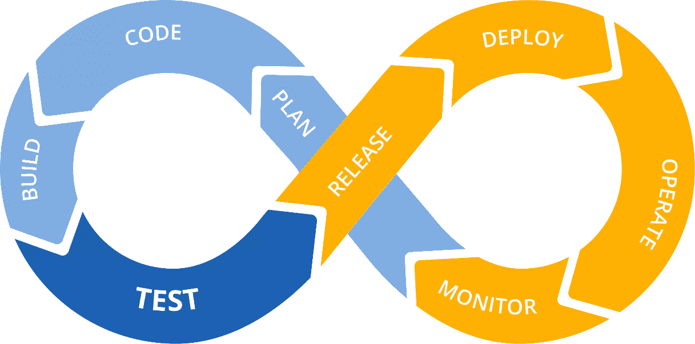

图 4.1 – DevOps CI/CD 循环

一个典型的 CI/CD 流水线实现包含以下阶段：

+   **提交阶段**：在这里，新的代码修改被集成到代码库中，并执行一组单元测试，以检查代码的完整性和质量。

+   **构建阶段**：在这里，代码会自动构建，然后将构建过程的最终结果（构建产物）推送到最终的注册表。

+   **测试阶段**：构建的代码将部署到预生产环境，在那里进行最终测试，然后再进行生产部署。在这里，代码会通过采用 Alpha 和 Beta 部署进行测试。Alpha 部署阶段是开发人员检查新构建的性能以及不同构建之间的交互。在 Beta 部署阶段，开发人员执行手动测试，以再次检查应用程序是否正常工作。

+   **生产部署阶段**：这是最终应用程序在成功通过所有测试要求后，正式发布到生产环境的阶段。

在你的组织中实施 CI/CD 流程有很多好处，主要的好处如下：

+   **提高代码质量和早期发现 bug**：通过采用自动化测试，你可以在早期发现 bug 和问题，并及时修复。

+   **完整的可追溯性**：整个构建、测试和部署过程都被追踪，可以在之后进行分析。这确保了你可以检查特定构建中包含的哪些更改，以及这些更改对最终测试或发布的影响。

+   **更快的测试和发布阶段**：自动化地在每次提交（或发布前）对代码库进行构建和测试。

在接下来的部分，我们将概述 Azure 平台提供的用于实现 CI/CD 的服务：Azure Pipelines。

# Azure Pipelines 概述

**Azure Pipelines** 是 Azure 平台提供的一项云服务，允许你自动化开发生命周期的构建、测试和发布阶段（CI/CD）。Azure Pipelines 支持任何语言或平台，它集成在 Azure DevOps 中，你可以在 Windows、Linux 或 macOS 机器上构建你的代码。

Azure Pipelines 对于公共项目是免费的，而对于私有项目，每月提供最多 1,800 分钟（30 小时）的管道使用时间。有关定价的更多信息，请参见这里：

[`azure.microsoft.com/en-us/pricing/details/devops/azure-devops-services/`](https://azure.microsoft.com/en-us/pricing/details/devops/azure-devops-services/)

Azure Pipelines 的一些重要特性总结如下：

+   它是平台和语言独立的，这意味着你可以在任何平台上使用你想要的代码库构建代码。

+   它可以与不同类型的代码库集成（Azure Repos、GitHub、GitHub Enterprise、BitBucket 等）。

+   有很多扩展（标准和社区驱动）可用于构建你的代码和处理自定义任务。

+   允许你将代码部署到不同的云服务商。

+   你可以处理容器化应用程序，如 Docker、Azure 容器注册表或 Kubernetes。

要使用 Azure Pipelines，你需要具备以下条件：

+   一个 Azure DevOps 组织，你可以在其中创建公共或私有项目

+   存储在版本控制系统中的源代码（如 Azure DevOps Repos 或 GitHub）

Azure Pipelines 按如下架构工作：


图 4.2 – Azure Pipelines 架构

当你的代码提交到某个仓库中的特定分支时，**构建管道**引擎启动，构建和测试任务会执行，如果所有任务都成功完成，你的应用程序就会构建完成，并且你会得到最终的输出（工件）。你还可以创建一个**发布管道**，将构建的输出发布到目标环境（预发布或生产环境）。

要开始使用 Azure Pipelines，你需要创建一个**管道**。Azure DevOps 中的管道可以通过以下两种方式创建：

+   **使用经典界面**：这允许你从可能的任务列表中以视觉方式选择一些任务。你只需要填写这些任务的参数。

+   **使用一种名为 YAML 的脚本语言**：通过在你的仓库中创建一个 YAML 文件，并在其中定义所有需要的步骤来定义管道。

使用经典界面最初可能更为简单，但请记住，许多功能仅在 YAML 管道中可用。YAML 管道定义是一个文件，并且可以像仓库中的其他文件一样进行版本控制和管理。你可以轻松地在项目之间移动管道定义（经典界面无法实现此操作）。

一个 Azure Pipeline 可以如下表示（感谢 Microsoft）：

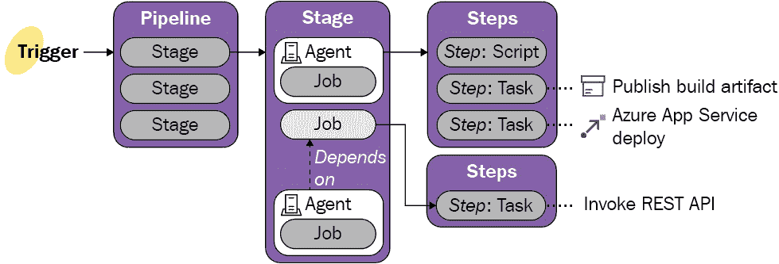

图 4.3 – Azure Pipeline 表示

一个管道从**触发器**（手动触发、仓库中的推送、拉取请求或计划任务）开始。管道通常由一个或多个**阶段**（管道中的逻辑分离，如构建、测试、部署等；它们可以并行运行）组成，每个阶段包含一个或多个**作业**（一组也可以并行运行的步骤）。每个管道至少包含一个阶段，如果你没有显式创建，它会自动创建。每个作业都在一个**代理**（执行作业的服务或软件）上运行。每个步骤由一个**任务**组成，该任务对你的代码执行某些操作（按顺序执行）。管道的最终输出是一个**工件**（构建过程中发布的文件或包的集合）。

在创建管道时，你需要定义一组任务和作业，用于自动化构建（或多阶段构建）。你可以原生支持集成测试、发布门、自动报告等功能。

在管道中定义多个作业时，这些作业会并行执行。包含多个作业的管道被称为**扇出**场景：

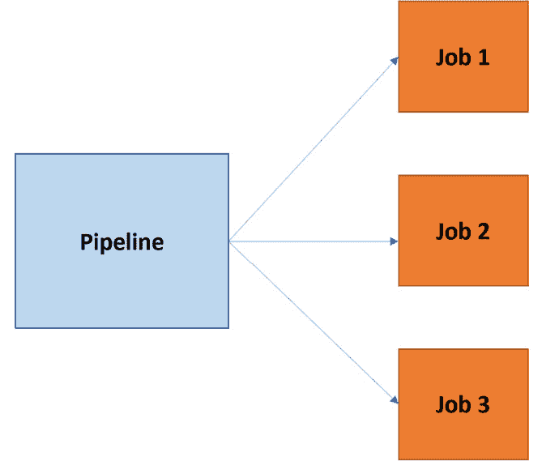

图 4.4 – 扩展管道

一个包含多个作业的单个阶段管道可以表示如下：

```
pool:
```

```
  vmImage: 'ubuntu-latest'
```

```
jobs:
```

```
- job: job1
```

```
  steps:
```

```
  - bash: echo "Hello!"
```

```
  - bash: echo "I'm job 1"
```

```
- job: job2
```

```
  steps:
```

```
  - bash: echo "Hello again…"
```

```
  - bash: echo "I'm job 2"
```

如果在定义管道时使用阶段，这就属于所谓的扩展/汇集场景：


图 4.5 – 扩展管道

在这里，每个阶段都是一个汇集操作，阶段中的所有作业（可以由多个顺序执行的任务组成）必须完成，才能触发下一个阶段（每次只能执行一个阶段）。我们将在本章后面讨论多阶段管道。

# 了解构建代理

要使用 Azure Pipelines 构建和部署代码，您至少需要一个代理。代理是一个运行管道中定义作业的服务。这些作业的执行可以直接发生在代理的主机机器上，也可以在容器中进行。

在为您的管道定义代理时，您基本上有两种类型的代理：

+   **Microsoft 托管代理**：这是一个完全由 Microsoft 管理的服务，在每次管道执行时都会清除（每次管道执行时，您都会获得一个全新的环境）。

+   **自托管代理**：这是一个需要您自己设置和管理的服务。它可以是 Azure 上的自定义虚拟机，也可以是您基础设施内的自定义本地机器。在自托管代理中，您可以安装构建所需的所有软件，并且这些软件会在每次管道执行时保留下来。自托管代理可以运行在 Windows、Linux、macOS 或 Docker 容器中。

## Microsoft 托管代理

Microsoft 托管代理是为您的管道定义代理的最简单方式。Azure Pipelines 默认提供一个名为**Azure Pipelines**的 Microsoft 托管代理池：


图 4.6 – Azure Pipelines 默认代理池

通过选择这个代理池，您可以为执行管道创建不同类型的虚拟机。截止到本文写作时，可用的标准代理类型如下：

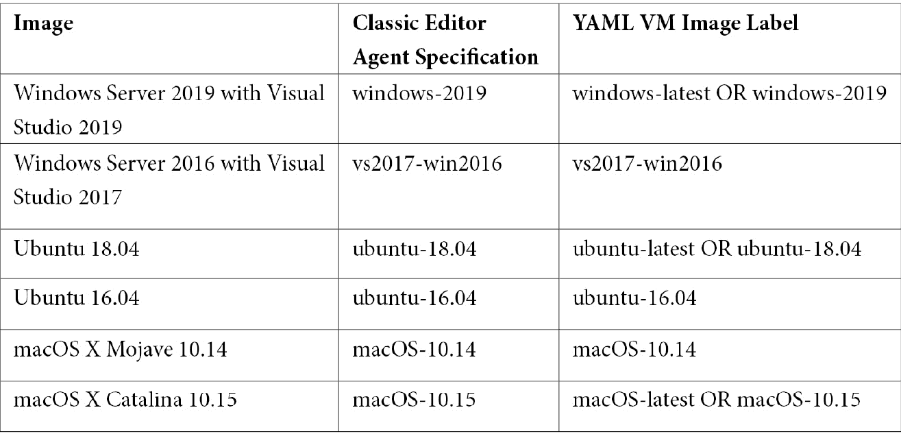

表 1.1

每个镜像都具有一套自动安装的软件。您可以通过在管道定义中使用预定义的工具安装程序任务来安装额外的工具。更多信息请参阅：

https://docs.microsoft.com/en-us/azure/devops/pipelines/tasks/?view=azure-devops#tool.

当使用 Microsoft 托管代理创建管道时，您只需要从前面的表格中指定要为代理使用的虚拟机镜像的名称。例如，这是使用 Windows Server 2019 和 Visual Studio 2019 镜像的托管代理定义：

```
- job: Windows
```

```
  pool:
```

```
    vmImage: 'windows-latest'
```

使用 Microsoft 托管代理时，您需要记住以下几点：

+   您不能在代理机器上登录。

+   该代理运行在标准 DS2v2 Azure 虚拟机上，且无法增加该容量。

+   它以管理员用户身份在 Windows 平台上运行，并以 *无密码 sudo* 用户身份在 Linux 平台上运行。

+   对于公共项目，您有 10 个免费的 Microsoft 托管并行作业，每个作业最多可运行 360 分钟，每月没有总体时间限制。

+   对于私人项目，您有一个免费的并行作业，每个作业最多可运行 60 分钟，每月最多为 1,800 分钟（30 小时）。如果您需要更多的容量，可以支付额外的并行作业费用。这样，每个作业的运行时间最多为 360 分钟。

+   Microsoft 托管代理运行在与您的 Azure DevOps 组织相同的 Azure 地理区域内，但不能保证它也会在相同的区域内运行（一个 Azure 地理区域包含一个或多个区域）。

## 自托管代理

虽然 Microsoft 托管代理是一个 SaaS 服务，但自托管代理是私有代理，您可以通过使用 Azure 虚拟机或直接使用本地基础设施来根据您的需求进行配置。您负责提供执行管道所需的所有软件和工具，并负责维护和升级代理。

自托管代理可以安装在以下平台上：

+   Windows

+   Linux

+   macOS

+   Docker

创建自托管代理包括完成以下活动：

+   准备环境

+   在 Azure DevOps 上准备权限

+   下载并配置代理

+   启动代理

这些步骤在所有环境中是相似的。接下来，我们将学习如何创建自托管 Windows 代理。

### 创建自托管 Windows 代理

自托管 Windows 代理用于构建和部署基于 Microsoft 平台（如 .NET 应用程序、Azure 云应用程序等）构建的应用程序，也可用于其他平台类型，如 Java 和 Android 应用程序。

创建代理时执行的第一步是将代理注册到您的 Azure DevOps 组织中。为此，您需要以管理员身份登录到您的 DevOps 组织，并从 **用户设置** 菜单中点击 **个人访问令牌**：

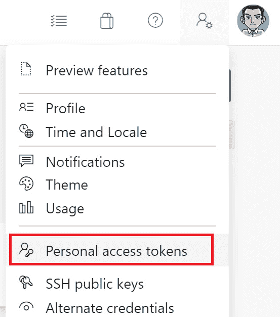

图 4.7 – 个人访问令牌

在这里，您可以为您的组织创建一个新的个人访问令牌，设置过期日期，并选择完全访问或自定义定义的访问级别（如果选择自定义定义范围，您需要为每个范围选择所需的权限）。要查看可用范围的完整列表，请点击窗口底部的 **显示所有范围** 链接：

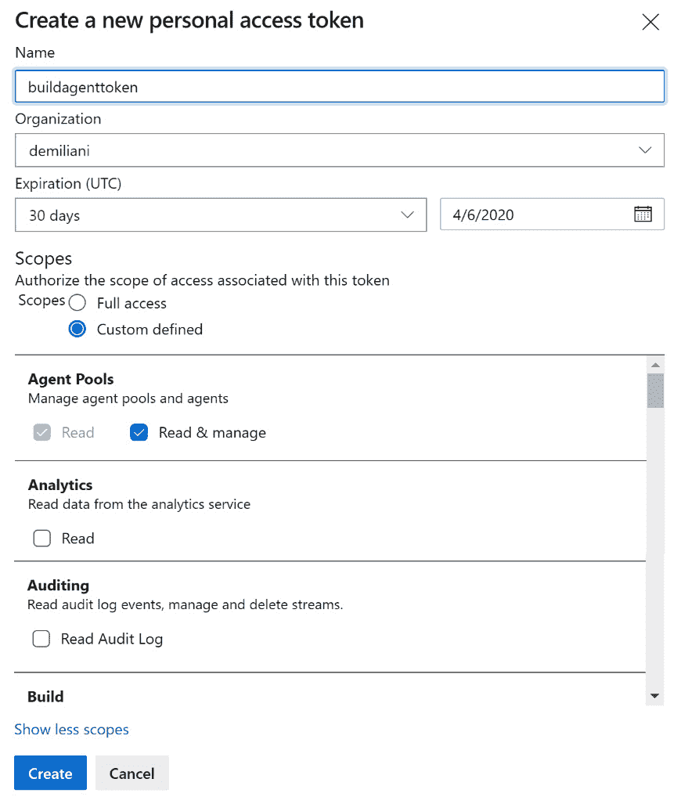

图 4.8 – 创建一个新的个人访问令牌

请确保 **代理池** 范围内启用了 **读取和管理** 权限。

完成后，点击 **创建**，然后在关闭窗口之前复制生成的令牌（它只会显示一次）。

重要提示

用于代理的用户必须具备注册代理的权限。你可以通过进入**组织设置** | **代理池**，选择**默认**池并点击**安全**来检查此权限。

现在，你需要下载代理软件并进行配置。从**组织设置** | **代理池**，选择**默认**池，在**代理**选项卡中点击**新建代理**：


图 4.9 – 创建新代理

**获取代理**窗口将打开。选择**Windows**作为目标平台，根据你的目标代理平台（机器），选择**x64**或**x86**，然后点击**下载**按钮：


图 4.10 – 代理软件下载页面

这个过程将下载一个包（通常名为`vsts-agent-win-x64-2.166.4.zip`）。你需要在代理机器（一个 Azure 虚拟机或本地服务器，它将作为你的构建代理）上运行这个包（`config.cmd`）：


图 4.11 – 代理软件包

设置将要求你输入以下内容：

+   你的 Azure DevOps 组织的 URL（[`dev.azure.com/`](https://dev.azure.com/){your-organization}）

+   使用的个人访问令牌（之前创建的）

运行代理时（无论是交互式运行还是作为服务运行），如果你想自动化构建，建议将其作为服务运行。

输入这些参数后，设置将注册代理：


图 4.12 – 代理注册

要注册代理，你需要插入代理池、代理名称和工作文件夹（你可以保持默认值不变）。

最后，你需要决定是否让代理以*交互式*或*作为服务*的方式运行。正如我们之前提到的，建议将代理作为服务运行，但在很多情况下，交互式选项也很有帮助，因为它会给你一个控制台，便于查看状态并运行 UI 测试。

在这两种情况下，请注意你为运行代理所选择的用户帐户。默认帐户是内置的网络服务用户，但该用户通常没有本地文件夹的所有必需权限。使用管理员帐户可以帮助解决很多问题。

如果设置成功，你应该能看到在代理机器上运行的服务，并且在 Azure DevOps 中的代理池中弹出一个新代理：


4.13 – 新代理创建

如果你选择代理后进入**功能**部分，你将能够看到它的所有功能（操作系统版本、操作系统架构、计算机名称、已安装的软件等）：


图 4.14 – 代理功能

代理的能力可以通过代理软件自动发现，或者如果你点击**添加新能力**操作，你也可以由用户定义能力。能力被流水线引擎用于根据流水线所需的能力（需求）将特定构建重定向到正确的代理。

当代理在线时，它准备好接受你的代码构建，这些构建应该排队等待。

记住，你还可以在同一台机器上安装多个代理（例如，如果你希望能够执行核心流水线或并行处理任务），但这种情况仅建议在代理不共享资源时使用。

## 何时使用微软托管代理或自托管代理

微软托管代理通常在你有一个标准的代码库，且不需要特定软件或环境配置来构建代码时非常有用。如果你处于这种情况，建议使用微软托管代理，因为你不必担心创建环境。例如，如果你需要构建一个 Azure Function 项目，通常你不需要在构建代理上安装自定义软件，微软托管代理可以完美工作。

自托管代理是在需要特定环境配置时的最佳选择，尤其是当你需要在代理上安装特定的软件或工具，或者需要更强大的构建能力时。自托管代理也是在你需要在每次构建运行之间保持环境一致性时的理想选择。通常，当你需要更好地控制代理，或者希望将构建部署到本地环境（外部不可访问）时，自托管代理是正确的选择。它通常还可以帮助你节省成本。

现在我们已经讨论了可以用于构建流水线的可能代理，在接下来的部分中，我们将概述 YAML，这种脚本语言允许你定义流水线。

# YAML 语言概述

**YAML**，即**YAML 不是标记语言**，是一种可读性强的脚本语言，通常用于数据序列化和处理应用程序配置定义。它可以视为 JSON 的超集。

YAML 使用缩进来处理对象定义的结构，并且对引号和大括号不敏感。它仅仅是一种数据表示语言，不能用于执行命令。

在 Azure DevOps 中，YAML 至关重要，因为它允许你通过使用脚本定义来定义流水线，而不是使用图形界面（图形界面无法在项目之间迁移）。

官方 YAML 网站可以在这里找到：

[`yaml.org/`](http://yaml.org/)

YAML 结构是基于键值元素的：

`Key: Value # 这是一个注释`

在接下来的部分中，我们将学习如何在 YAML 中定义对象。

## 标量

例如，以下是已在 YAML 中定义的标量变量：

```
Number: 1975 quotedText: "some text description"notQuotedtext: strings can be also without quotes boolean: true nullKeyValue: null
```

你也可以通过使用 `?`，后跟一个空格来定义多行键，如下所示：

```
? |
```

```
  This is a key
```

```
  that has multiple lines
```

```
: and this is its value
```

## 集合和列表

这是一个用于集合对象的 YAML 定义：

```
Cars:
```

```
   - Fiat
```

```
   - Mercedes
```

```
   - BMW
```

你还可以定义嵌套的集合：

```
- Drivers:
```

```
      name: Stefano Demiliani
```

```
      age: 45
```

```
      Driving license type:
```

```
          - type: full car license
```

```
            license id: ABC12345
```

```
            expiry date: 2025-12-31
```

## 字典

你可以通过以下方式使用 YAML 定义一个 `Dictionary` 对象：

```
CarDetails:
```

```
     make: Mercedes
```

```
     model: GLC220
```

```
     fuel: Gasoline
```

## 文档结构

YAML 使用三个破折号 `---` 来分隔指令和文档内容，并标识文档的开始。例如，以下 YAML 定义了一个文件中的两个文档：

```
---# Products purchased
```

```
- item    : Surface Book 2
```

```
  quantity: 1
```

```
- item    : Surface Pro 7
```

```
  quantity: 3
```

```
- item    : Arc Mouse
```

```
  quantity: 1
```

```
# Product out of stock
```

```
---
```

```
- item    : Surface 4
```

```
- item    : Microsoft Trackball
```

## 复杂对象定义

作为定义复杂对象的示例，以下是 `Invoice` 对象使用的表示方式：

```
--- 
```

```
invoice: 20-198754
```

```
date   : 2020-05-27
```

```
bill-to: C002456
```

```
    Name  : Stefano Demiliani
```

```
    address:
```

```
        lines: 
```

```
            Viale Pasubio, 21
```

```
            c/o Microsoft House
```

```
        city    : Milan
```

```
        state   : MI
```

```
        postal  : 20154
```

```
ship-to: C002456
```

```
product:
```

```
    - itemNo      : ITEM001
```

```
      quantity    : 1
```

```
      description : Surface Book 2
```

```
      price       : 1850.00
```

```
    - sku         : ITEM002
```

```
      quantity    : 2
```

```
      description : Arc Mouse
```

```
      price       : 65.00
```

```
tax  : 80.50
```

```
total: 1995.50
```

```
comments:
```

```
    Please deliver on office hours.
```

```
    Leave on the reception.
```

现在我们已经简要概述了 YAML 语法，接下来的章节中，我们将学习如何使用 Azure DevOps 创建构建管道。

# 使用 Azure DevOps 创建构建管道

如果你想为代码实现持续集成（在每次提交时自动构建和测试代码），那么拥有一个构建管道是基础步骤。

使用 Azure DevOps 创建构建管道的前提条件显然是代码已经存储在一个仓库中。

要使用 Azure DevOps 创建构建管道，你需要进入 **管道** 中心并选择 **管道** 操作：


图 4.15 – 构建管道创建

在这里，你可以通过选择 **新建管道** 按钮来创建一个新的构建管道。当点击此按钮时，你将看到以下界面，它会询问你代码仓库的信息：


图 4.16 – 选择一个仓库

这个屏幕非常重要。通过这个界面，你可以以两种可能的方式开始创建构建管道（如前所述）：

1.  使用 YAML 文件来创建你的管道定义。这是在此窗口中选择仓库时发生的事情。

1.  使用经典编辑器（图形用户界面）。这是当你点击页面底部的 **使用经典编辑器** 链接时发生的事情。

在接下来的章节中，我们将学习如何通过这两种方法创建构建管道。

## 使用经典编辑器定义管道

经典编辑器允许你通过选择预定义的操作图形化地定义项目的构建管道。如前所述，使用这种方式创建的管道定义不在源代码管理之下。

当你点击 **使用经典编辑器** 链接时，你需要选择存储代码的仓库（**Azure Repos Git**、**GitHub**、**GitHub Enterprise Server**、**Subversion**、**TFVC**、**Bitbucket Cloud** 或 **其他 Git**）以及构建管道将连接的分支：


图 4.17 – 经典编辑器管道定义

然后，您需要选择一个适合您正在构建的应用程序类型的模板。您可以选择一组预定义的模板（稍后可以自定义），也可以从空模板开始：


图 4.18 – 管道模板选择

如果预定义模板满足您的需求，您可以直接使用它们；否则，建议通过选择所需的操作创建自定义管道。

在这里，我的应用程序存储在 Azure DevOps 项目仓库中，是一个 ASP.NET Web 应用程序（一个名为 `PartsUnlimited` 的电子商务网站项目；您可以在以下网址找到公共仓库：[`github.com/Microsoft/PartsUnlimited`](https://github.com/Microsoft/PartsUnlimited)），因此我选择了 ASP.NET 模板。

选择后，这是将自动为您创建的管道模板：

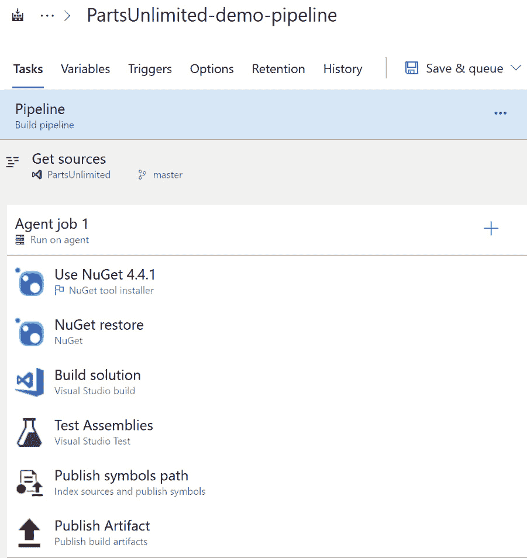

图 4.19 – 从模板创建的管道

让我们详细查看管道的每个部分。

该管道（在这里叫做 `PartsUnlimited-demo-pipeline`）基于**vs2017-win2016**模板（Windows Server 2016 和 Visual Studio 2017），在 Microsoft 托管的代理（Azure Pipelines 代理池）上运行，如下截图所示：


图 4.20 – 管道中的代理规格

代理作业首先安装 NuGet 包管理器，并还原所需的包，以便在所选仓库中构建项目。对于这些操作，管道定义包含了您在以下截图中看到的任务：

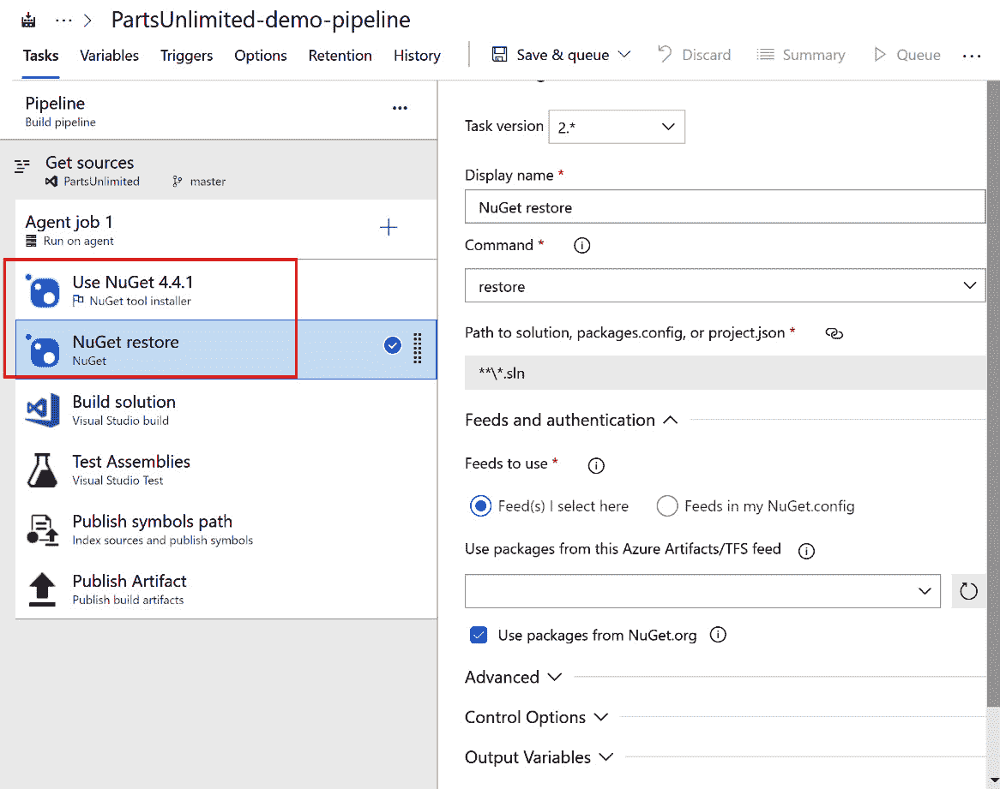

图 4.21 – NuGet 任务

然后，有一个用于构建解决方案的任务：

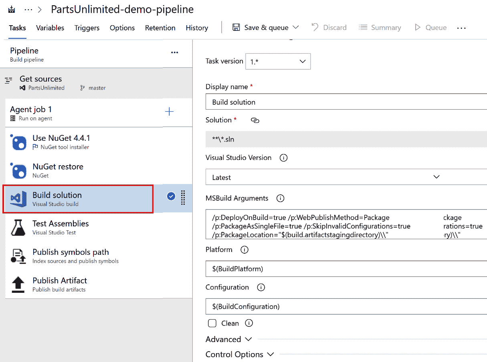

图 4.22 – 构建解决方案任务

还有一个用于测试解决方案并发布测试结果的任务：

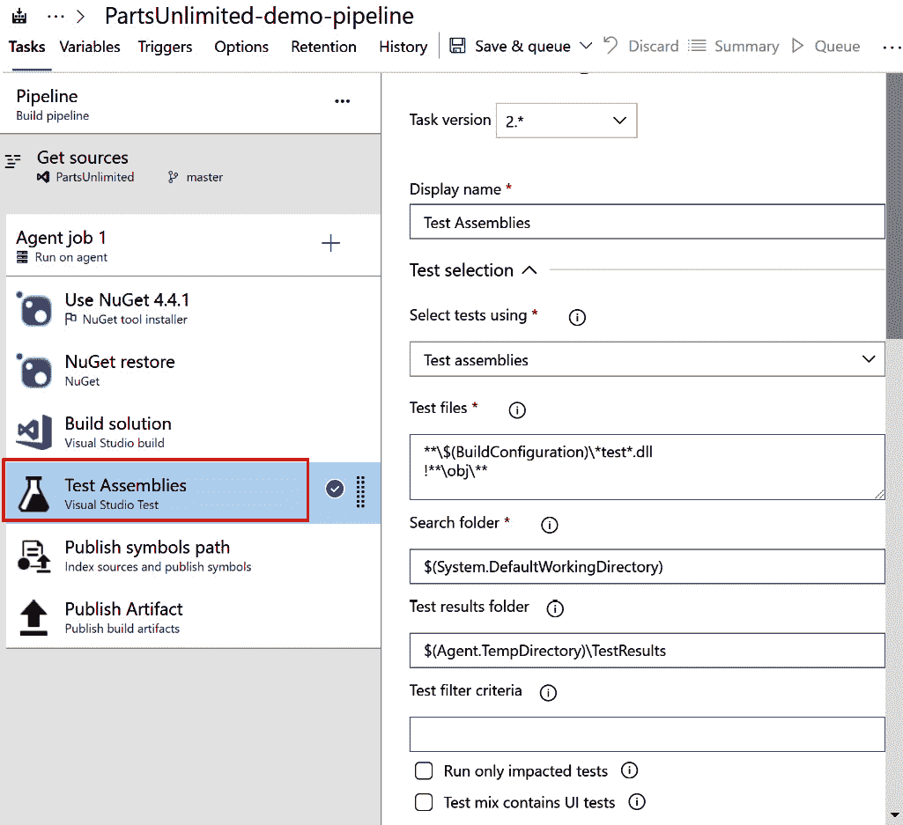

图 4.23 – 测试程序集任务

最后的步骤是将构建过程的源代码作为构件（构建输出）发布：


图 4.24 – 发布任务

如果选择**变量**选项卡，您将看到在构建过程中使用的一些参数。在这里，您可以创建自己的变量，在需要时在管道中使用：

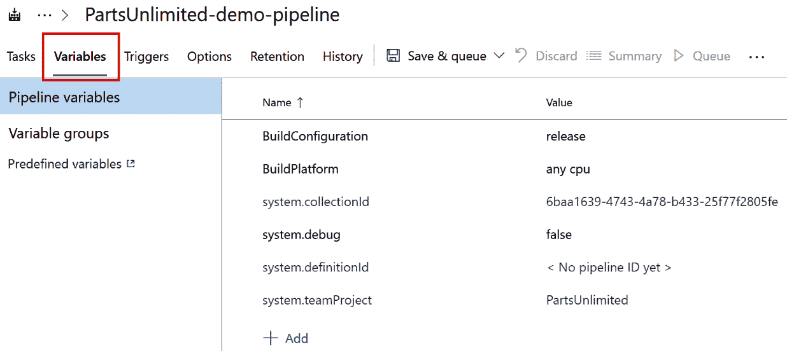

图 4.25 – 管道变量

下一部分叫做**触发器**。在这里，您可以定义启动管道的触发条件。默认情况下，初始时没有发布任何触发器，但在这里，您可以启用 CI，以便在所选分支的每次提交时自动启动管道：

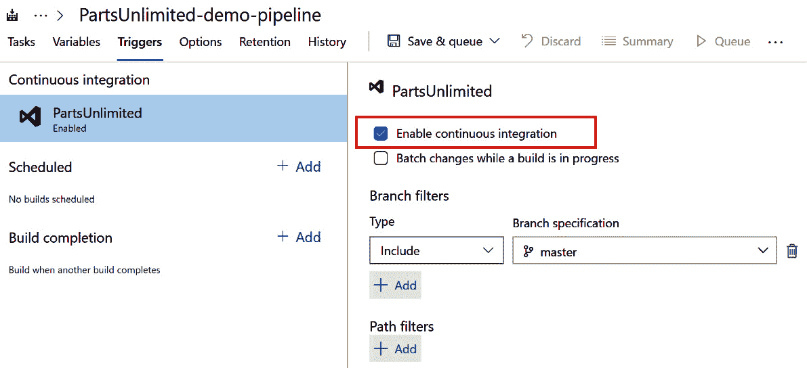

图 4.26 – 管道触发器

重要说明

启用 CI 是推荐的做法，如果您希望每次在分支（例如，**master** 分支）上提交的代码都能得到测试并安全控制。在这种方式下，您可以确保代码始终按预期工作。

在**选项**选项卡中，您可以设置与构建定义相关的一些选项。例如，在这里，您可以创建指向所有工作项的链接，以便在构建成功完成时，它们与相关的更改进行关联，构建失败时创建工作项，设置管道的状态徽章，指定超时等：

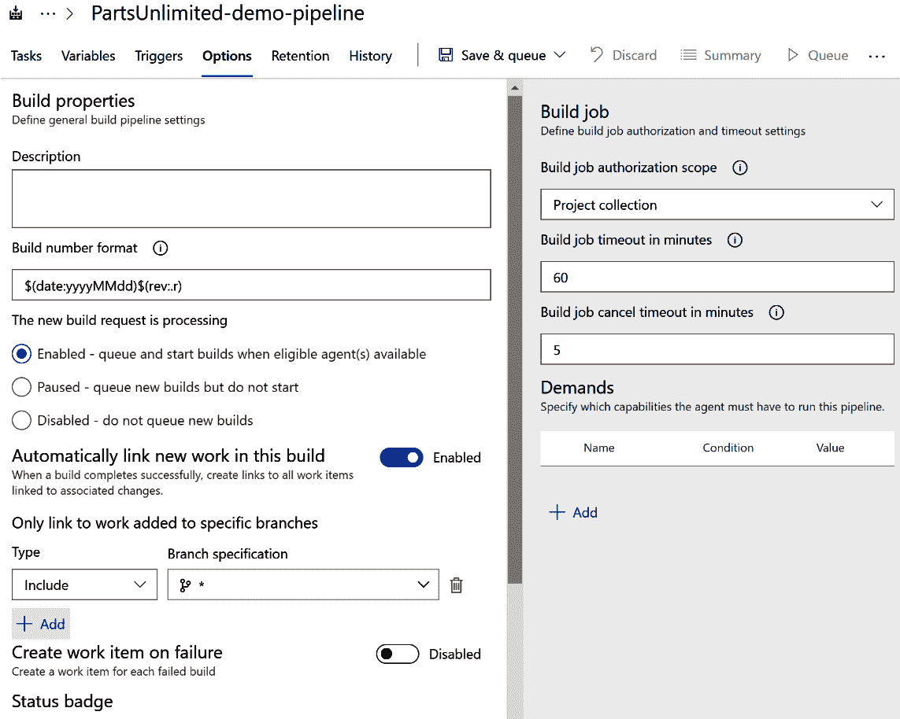

图 4.27 – 管道选项

**保留**选项卡则用于配置该特定管道的保留策略（例如，保持工件多少天，保持运行和拉取请求多少天等）。这样做会覆盖一般的保留设置。我们将在后面的*构建的保留*部分讨论这些内容。

完成管道定义后，您可以点击**保存并排队**以保存定义。点击**保存并运行**时，管道将被放入队列并等待代理：


图 4.28 – 运行管道

当找到代理时，管道会被执行，您的代码将被构建：

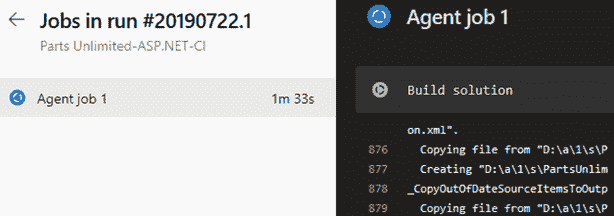

图 4.29 – 管道执行开始

您可以跟踪管道每个步骤的执行，并查看相关日志。如果管道成功结束，您可以查看其执行摘要：


图 4.30 – 管道 – 最终结果

您还可以选择**测试**选项卡以查看测试执行状态：


图 4.31 – 管道测试结果

在下一部分，我们将学习如何为这个应用创建一个 YAML 管道。

## YAML 管道定义

如前所述，当您开始使用 Azure DevOps 创建构建管道时，向导默认会创建一个基于 YAML 的管道。

要开始创建 YAML 管道，请转到 Azure DevOps 中的**管道**部分，并点击**新建管道**。

在这里，您可以选择仓库类型，而不是像我们在上一部分中那样选择经典编辑器（**Azure Repos Git**、**GitHub**、**BitBucket**等）：


图 4.32 – YAML 管道定义

然后，从可用的仓库列表中选择您的仓库：


图 4.33 – YAML 管道 – 仓库选择

系统现在分析您的代码库，并根据代码库中存储的代码推荐一组可用的模板。您可以从一个空白的 YAML 模板开始，也可以选择一个模板。在这里，我选择了 ASP.NET 模板：


图 4.34 – YAML 管道 – 模板选择

系统创建了一个 YAML 文件（称为 `azure-pipelines.yml`），如以下截图所示：

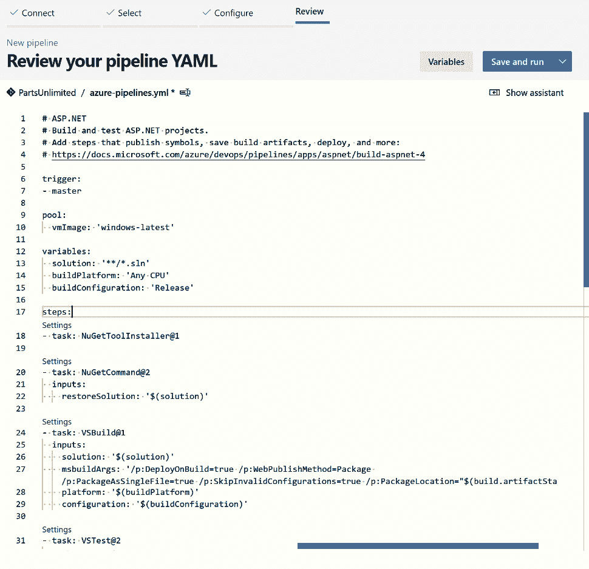

图 4.35 – YAML 管道定义

生成的 YAML 定义包含了一组任务，就像前面的例子一样，但在这里，这些任务在它们的 YAML 定义中。完整的生成文件如下所示：

```
# ASP.NET
```

```
# Build and test ASP.NET projects.
```

```
# Add steps that publish symbols, save build artifacts, deploy, and more:
```

```
# https://docs.microsoft.com/azure/devops/pipelines/apps/aspnet/build-aspnet-4
```

```
trigger:
```

```
- master
```

```
pool:
```

```
  vmImage: 'windows-latest'
```

```
variables:
```

```
  solution: '**/*.sln'
```

```
  buildPlatform: 'Any CPU'
```

```
  buildConfiguration: 'Release'
```

```
steps:
```

```
- task: NuGetToolInstaller@1
```

```
- task: NuGetCommand@2
```

```
  inputs:
```

```
    restoreSolution: '$(solution)'
```

```
- task: VSBuild@1
```

```
  inputs:
```

```
    solution: '$(solution)'
```

```
    msbuildArgs: '/p:DeployOnBuild=true /p:WebPublishMethod=Package /p:PackageAsSingleFile=true /p:SkipInvalidConfigurations=true /p:PackageLocation="$(build.artifactStagingDirectory)"'
```

```
    platform: '$(buildPlatform)'
```

```
    configuration: '$(buildConfiguration)'
```

```
- task: VSTest@2
```

```
  inputs:
```

```
    platform: '$(buildPlatform)'
```

```
    configuration: '$(buildConfiguration)'
```

```
Here I add two more tasks for publishing the symbols and the final artifacts of the pipeline:
```

```
task: PublishSymbols@2
```

```
  displayName: 'Publish symbols path'
```

```
  inputs:
```

```
    SearchPattern: '**\bin\**\*.pdb'
```

```
    PublishSymbols: false
```

```
  continueOnError: true
```

```
- task: PublishBuildArtifacts@1
```

```
  displayName: 'Publish Artifact'
```

```
  inputs:
```

```
    PathtoPublish: '$(build.artifactstagingdirectory)'
```

```
    ArtifactName: '$(Parameters.ArtifactName)'
```

```
  condition: succeededOrFailed()
```

如您所见，YAML 文件包含了触发器，它启动管道（在这里是主分支上的提交），使用的代理池，管道变量，以及每个任务执行的顺序（带有其特定参数）。

如前所示，点击“保存并运行”以排队执行管道。以下截图显示了已执行的 YAML 管道。


图 4.36 – 已执行的 YAML 管道

若要添加新任务，可以使用编辑框右侧的助手工具。它允许您拥有一个**任务**列表，您可以在其中搜索任务，填写必要的参数，然后获得最终的 YAML 定义：

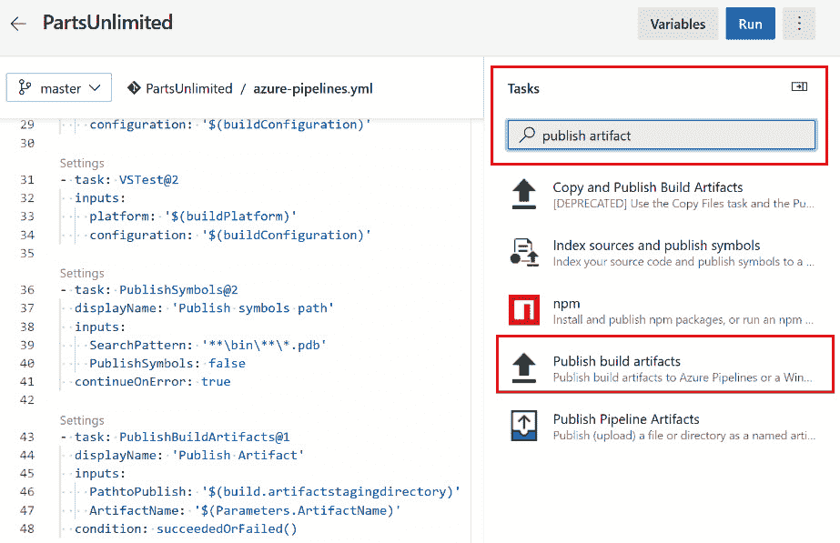

图 4.37 – YAML 管道任务选择

当您选择使用 YAML 创建管道时，Azure DevOps 会创建一个文件，并将其存储在与您的代码相同的代码库中：

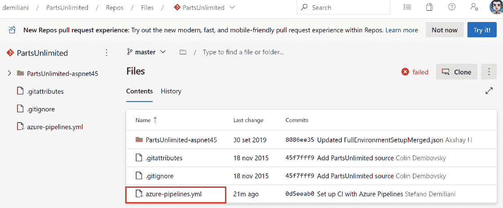

图 4.38 – 创建的 YAML 管道文件

此文件在源代码管理中，并在每次修改时版本化。

有关管道 YAML 模式的完整参考，我建议访问以下链接：

[`docs.microsoft.com/en-us/azure/devops/pipelines/yaml-schema?view=azure-devops&tabs=schema%2Cparameter-schema`](https://docs.microsoft.com/en-us/azure/devops/pipelines/yaml-schema?view=azure-devops&tabs=schema%2Cparameter-schema.)

# 构建保留

当您运行管道时，Azure DevOps 会记录每个步骤的执行，并存储每次运行的最终工件和测试。

Azure DevOps 对管道执行的默认保留策略为 30 天。您可以通过进入**项目设置** | **管道** | **设置**来更改这些默认值：


图 4.39 – 管道保留策略

您还可以使用**复制文件**任务将构建和工件数据存储到外部存储中，以便您可以将它们保存比保留策略中指定的时间更长：

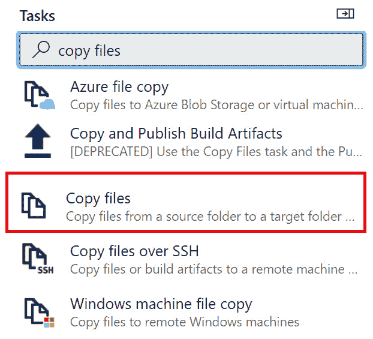

图 4.40 – 复制文件任务

该任务的 YAML 定义如下：

```
- task: CopyFiles@2
```

```
  displayName: 'Copy files to shared network'
```

```
  inputs:
```

```
    SourceFolder: '$(Build.SourcesDirectory)'
```

```
    Contents: '**'
```

```
    TargetFolder: '\\networkserver\storage\$(Build.BuildNumber)'
```

重要说明

请记住，任何通过**发布构建工件**任务保存的数据都会定期删除。

更多关于**复制文件**任务的信息可以在这里找到：

[`docs.microsoft.com/zh-cn/azure/devops/pipelines/tasks/utility/copy-files?view=azure-devops&tabs=yaml`](https://docs.microsoft.com/zh-cn/azure/devops/pipelines/tasks/utility/copy-files?view=azure-devops&tabs=yaml)。

# 多阶段流水线

正如我们之前解释的，你可以将流水线中的工作组织成 `stages`。`Stages` 是流水线流中的逻辑边界（可以分配给代理的工作单元），它们允许你隔离工作、暂停流水线并执行检查或其他操作。默认情况下，每个流水线由一个阶段组成，但你可以创建多个阶段并将这些阶段安排成依赖关系图。

多阶段流水线的基本 YAML 定义如下：

```
stages:  
```

```
	- stage: Build  
```

```
	  jobs:  
```

```
	  - job: BuildJob  
```

```
	    steps:  
```

```
	    - script: echo Build!  
```

```
	- stage: Test  
```

```
	  jobs:  
```

```
	  - job: TestOne  
```

```
	    steps:  
```

```
	    - script: echo Test 1  
```

```
	  - job: TestTwo 
```

```
	    steps:  
```

```
	    - script: echo Test 2  
```

```
	- stage: Deploy  
```

```
	  jobs:  
```

```
	  - job: Deploy  
```

```
	    steps:  
```

```
	    - script: echo Deployment
```

作为如何使用 YAML 创建多阶段流水线的示例，让我们来看一个在你的代码库中构建代码（使用 .NET Core SDK）并将工件发布为 NuGet 包的流水线。流水线定义如下。该流水线使用 `stages` 关键字来标识这是一个多阶段流水线。

在第一个阶段定义（`Build`）中，我们有构建代码的任务：

```
trigger:
```

```
	- master
```

```
	stages:
```

```
	- stage: 'Build'
```

```
	  variables:
```

```
	    buildConfiguration: 'Release'
```

```
	  jobs:
```

```
	  - job:
```

```
	    pool:
```

```
	      vmImage: 'ubuntu-latest'
```

```
	    workspace:
```

```
	      clean: all
```

```
	    steps:
```

```
	    - task: UseDotNet@2
```

```
	      displayName: 'Use .NET Core SDK'
```

```
	      inputs:
```

```
	        packageType: sdk
```

```
	        version: 2.2.x
```

```
	        installationPath: $(Agent.ToolsDirectory)/dotnet
```

```
	    - task: DotNetCoreCLI@2
```

```
	      displayName: "NuGet Restore"
```

```
	      inputs:
```

```
	        command: restore
```

```
	        projects: '**/*.csproj'
```

```
	    - task: DotNetCoreCLI@2
```

```
	      displayName: "Build Solution"
```

```
	      inputs:
```

```
	        command: build
```

```
	        projects: '**/*.csproj'
```

```
	        arguments: '--configuration (buildConfiguration)'
```

在这里，我们使用了 Azure DevOps 中提供的**UseDotnet**标准任务模板安装了 .NET Core SDK（更多信息请参见：[`docs.microsoft.com/zh-cn/azure/devops/pipelines/tasks/tool/dotnet-core-tool-installer?view=azure-devops)`](https://docs.microsoft.com/zh-cn/azure/devops/pipelines/tasks/tool/dotnet-core-tool-installer?view=azure-devops)）。之后，我们恢复了所需的 NuGet 包并构建了解决方案。

现在，我们有创建 NuGet 包发布版本的任务。该包保存在工件暂存目录的 `packages/release` 文件夹中。在此任务中，我们将使用 `nobuild = true`，因为在此任务中，我们无需重新构建解决方案（无需再进行编译）：

```
    - task: DotNetCoreCLI@2
```

```
      displayName: 'Create NuGet Package - Release Version'
```

```
      inputs:
```

```
        command: pack
```

```
        packDirectory: '$(Build.ArtifactStagingDirectory)/packages/releases'
```

```
        arguments: '--configuration $(buildConfiguration)'
```

```
        nobuild: true
```

下一步，我们需要创建 NuGet 包的预发布版本。在此任务中，我们使用 `buildProperties` 选项将构建号添加到包版本中（例如，如果包版本是 2.0.0.0，构建号是 20200521.1，则包版本为 2.0.0.0.20200521.1）。在这里，构建包是强制性的（用于获取构建 ID）：

```
    - task: DotNetCoreCLI@2
```

```
      displayName: 'Create NuGet Package - Prerelease Version'
```

```
      inputs:
```

```
        command: pack
```

```
        buildProperties: 'VersionSuffix="$(Build.BuildNumber)"'
```

```
        packDirectory: '$(Build.ArtifactStagingDirectory)/packages/prereleases'
```

```
        arguments: '--configuration $(buildConfiguration)'
```

下一个任务将包作为工件发布：

```
    - publish: '$(Build.ArtifactStagingDirectory)/packages'
```

```
      artifact: 'packages'
```

接下来，我们需要定义第二个阶段，称为 `PublishPrereleaseNuGetPackage`。在这里，我们跳过了代码库的检出步骤，下载步骤下载了我们在先前构建阶段发布的 `packages` 工件。然后，`NuGetCommand` 任务将预发布包发布到 Azure DevOps 中的一个名为 `Test` 的内部源：

```
- stage: 'PublishPrereleaseNuGetPackage'
```

```
  displayName: 'Publish Prerelease NuGet Package'
```

```
  dependsOn: 'Build'
```

```
  condition: succeeded()
```

```
  jobs:
```

```
  - job:
```

```
    pool:
```

```
      vmImage: 'ubuntu-latest'
```

```
    steps:
```

```
    - checkout: none
```

```
    - download: current
```

```
      artifact: 'packages'
```

```
    - task: NuGetCommand@2
```

```
      displayName: 'Push NuGet Package'
```

```
      inputs:
```

```
        command: 'push'
```

```
        packagesToPush: '$(Pipeline.Workspace)/packages/prereleases/*.nupkg'
```

```
        nuGetFeedType: 'internal'
```

```
        publishVstsFeed: 'Test'
```

现在，我们必须定义第三个阶段，叫做 `PublishReleaseNuGetPackage`，它用于为 NuGet 创建我们的包的发布版本：

```
- stage: 'PublishReleaseNuGetPackage'
```

```
  displayName: 'Publish Release NuGet Package'
```

```
  dependsOn: 'PublishPrereleaseNuGetPackage'
```

```
  condition: succeeded()
```

```
  jobs:
```

```
  - deployment:
```

```
    pool:
```

```
      vmImage: 'ubuntu-latest'
```

```
    environment: 'nuget-org'
```

```
    strategy:
```

```
     runOnce:
```

```
       deploy:
```

```
         steps:
```

```
         - task: NuGetCommand@2
```

```
           displayName: 'Push NuGet Package'
```

```
           inputs:
```

```
             command: 'push'
```

```
             packagesToPush: '$(Pipeline.Workspace)/packages/releases/*.nupkg'
```

```
             nuGetFeedType: 'external'
```

```
             publishFeedCredentials: 'NuGet'
```

这个阶段使用一个部署任务将包发布到配置好的环境中（在此，我们称之为 `nuget-org`）。环境是管道内的一组资源。

在 `NuGetCommand` 任务中，我们指定要推送的包，并且我们推送包的源是外部的（`nuGetFeedType`）。该源通过使用 `publishFeedCredentials` 属性检索，该属性设置为我们创建的服务连接的名称。

对于这个阶段，我们已经创建了一个新的环境：


图 4.41 – 创建新的环境

一旦创建了环境，为了将其发布到 NuGet，您需要通过以下步骤创建一个新的服务连接：进入 **项目设置** | **服务连接** | **创建服务连接**，从可用的服务连接类型列表中选择 **NuGet**，然后根据您的 NuGet 帐户配置连接：

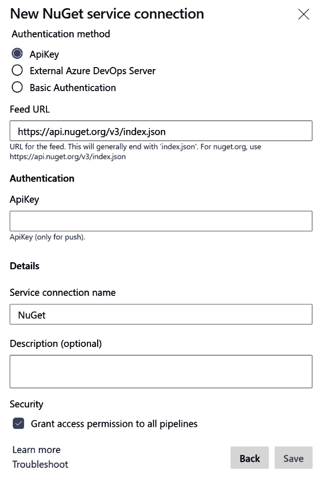

图 4.42 – 新的 NuGet 服务连接

通过这一方式，我们创建了一个多阶段构建管道。当管道执行并且所有阶段成功完成时，您将看到一个如下所示的结果图：


图 4.43 – 多阶段构建管道执行情况

现在我们已经理解了什么是多阶段管道，我们将在下一节创建一些与 GitHub 仓库相关的管道。

# 使用 GitHub 仓库构建管道

GitHub 是最流行的源代码管理平台之一，通常，我们会遇到将代码存储在 GitHub 仓库中，并且希望使用 Azure DevOps 来管理 CI/CD 的场景。

通过使用 Azure DevOps 和 Azure Pipeline 服务，您还可以为存储在 GitHub 上的仓库创建管道，从而在 GitHub 仓库中的每次提交时触发构建管道。我们将通过以下步骤实现这一点：

1.  要使用 Azure Pipelines 构建您的 GitHub 仓库，您需要添加 `Azure Pipelines`。选择 **Azure Pipelines** 扩展，并点击 **设置计划**，如以下截图所示：

    图 4.44 – GitHub 上的 Azure Pipelines – 设置

1.  选择 **免费** 计划，点击 **免费安装** 按钮，然后点击 **完成订单并开始安装**。

1.  现在，Azure Pipelines 安装将询问您是否希望此应用程序对所有仓库可用，还是仅对选定的仓库可用。选择所需的选项并点击 **安装**：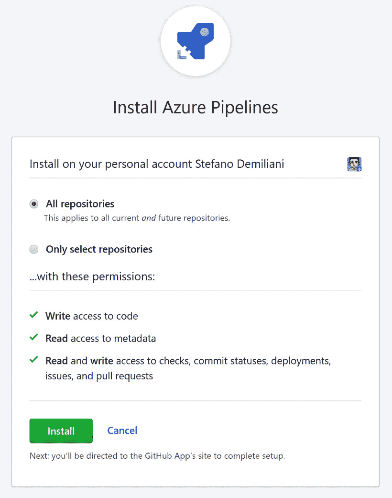

    图 4.45 – GitHub 上的 Azure Pipelines – 安装

1.  你将被重定向到 Azure DevOps，在那里你可以创建一个新项目（或选择一个现有项目）来处理构建过程。在这里，我将创建一个新项目：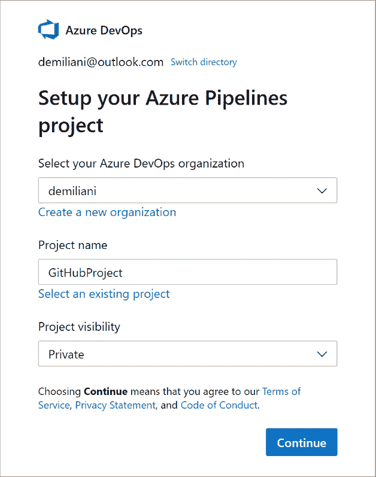

    图 4.46 – 设置 Azure Pipelines 项目

1.  现在，你需要授权 Azure Pipelines 以便它可以访问你的 GitHub 账户：

    图 4.47 – 授权 Azure Pipelines 访问 GitHub

    当获得必要的授权后，项目将在 Azure DevOps 上为你创建，管道创建过程将开始。你将立即被提示从你账户中的可用 GitHub 仓库列表中选择一个 GitHub 仓库作为构建来源：

    

    图 4.48 – 选择 GitHub 仓库

1.  在这里，我选择了一个包含 Azure Function 项目的仓库。正如你所见，Azure Pipelines 已经识别了我的项目，并为管道提供了一组可用的模板（但你也可以从空白模板开始，或者从仓库中任何分支的 YAML 文件开始）。在这里，我将选择 GitHub 仓库中的`azure-pipelines.yml`）: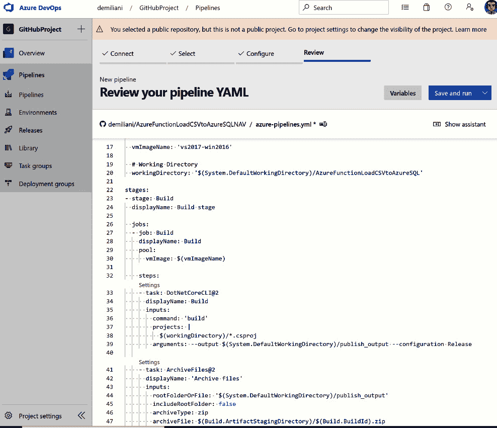

    图 4.50 – 多阶段 YAML 管道定义

    该管道会在每次提交到主分支时触发。

1.  点击**保存并运行**按钮。在这里，管道将被排队并等待代理，然后执行。

    每次你在 GitHub 仓库中提交代码时，Azure DevOps 上的构建管道将会自动触发。

    如果你正在构建一个公共 GitHub 仓库，展示所有用户该仓库中的代码已经通过构建管道检查和测试是非常有用的。然后，你可以展示构建结果。你可以通过在仓库中放置一个徽章来做到这一点。

    徽章是一个动态生成的图像，反映构建的状态（未构建、成功或失败），并托管在 Azure DevOps 上。

1.  为此，选择 Azure DevOps 中的管道，点击右侧的三个点，并选择**状态徽章**：

    图 4.51 – 状态徽章定义

1.  从这里，你可以复制 GitHub 仓库中的`Readme.md`文件：


图 4.52 – 构建状态徽章的 Markdown

每当用户访问你的仓库时，他们将能够通过图形徽章查看最新构建的状态：

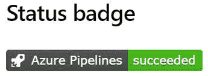

图 4.53 – 构建管道状态徽章

接下来，让我们看看如何并行执行作业。

## 在 Azure Pipelines 中并行执行作业

在 Azure 管道中，您还可以并行执行作业。每个作业可以独立于其他作业运行，也可以在不同的代理上执行。这将帮助您加速构建时间并提升管道的性能。

作为如何在管道中处理并行作业的示例，考虑一个简单的管道，您需要执行三个 PowerShell 脚本，分别叫做 **任务 1**、**任务 2** 和 **最终任务**。**任务 1** 和 **任务 2** 可以并行执行，而 **最终任务** 只有在前两个任务完成后才能执行。

当您开始创建一个新的管道时（这里为了简便，我使用经典编辑器），Azure DevOps 会创建一个代理作业（这里称为 **代理作业 1**）。您可以将任务添加到此代理中。通过选择代理作业，您可以指定运行该任务的代理池。在这里，我希望此任务在 Microsoft 托管的代理池中执行：

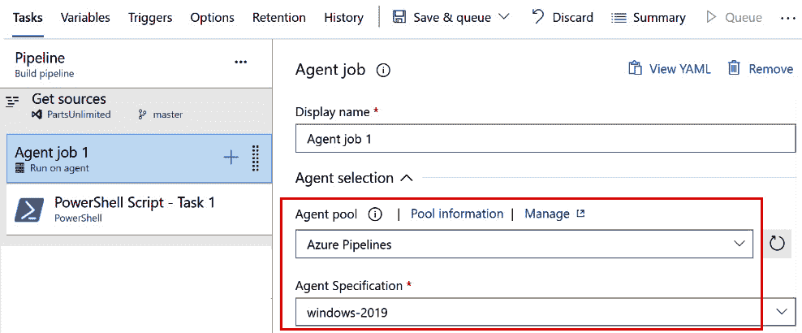

图 4.54 – 代理规格

然后，要将新的代理池添加到管道中（用于独立执行其他任务），请点击管道旁边的三个点，选择 **添加代理作业**：

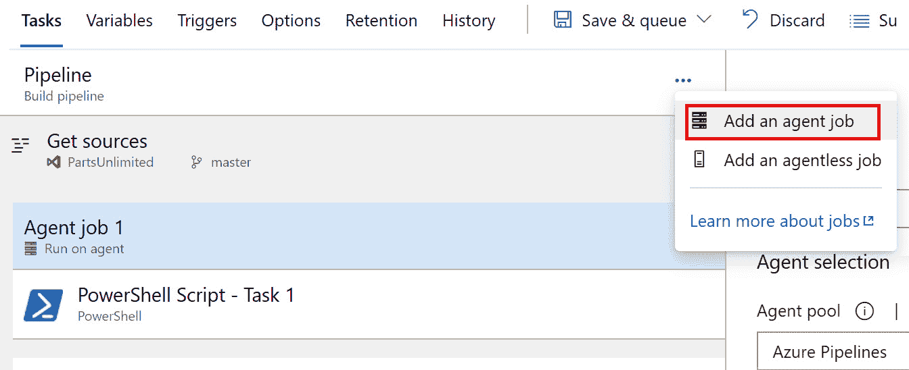

图 4.55 – 添加代理作业

现在，我们将添加一个第二个代理作业（这里称为 **代理作业 2**），它运行在自托管代理上。此作业将执行 **任务 2** PowerShell 脚本：

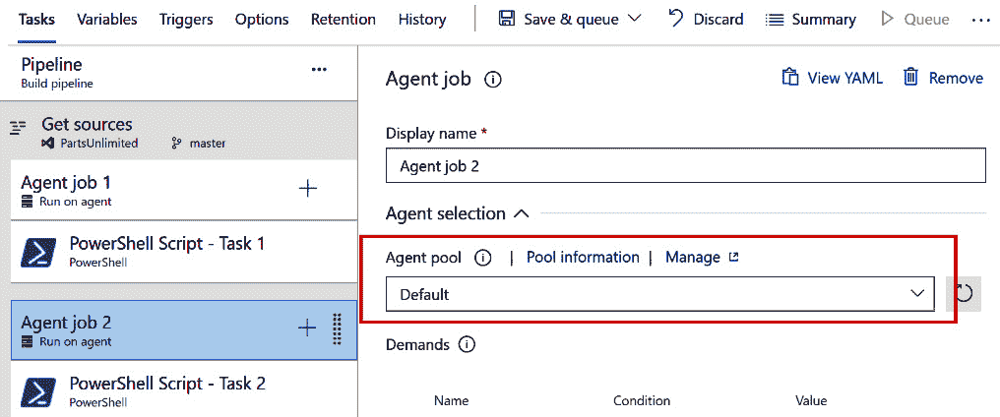

图 4.56 – 代理选择

最后，我们将添加一个新的代理作业（这里称为 **代理作业 3**），用于执行 **最终任务**，该任务将运行在 Microsoft 托管的代理上。然而，此作业有来自 **代理作业 1** 和 **代理作业 2** 的依赖：


图 4.57 – 代理作业依赖关系

通过这种方式，前两个任务将并行启动，最终作业将在前两个任务执行完成后再运行。

若要了解有关 Azure 管道中并行作业的更多信息，我建议查看以下页面：

[`docs.microsoft.com/en-us/azure/devops/pipelines/process/phases?view=azure-devops&tabs=yaml`](https://docs.microsoft.com/en-us/azure/devops/pipelines/process/phases?view=azure-devops&tabs=yaml)

## 运行在 Azure 容器实例上的代理

如果标准的 Microsoft 托管代理无法满足您的需求（如要求、性能等），您还可以为 Azure DevOps 创建一个自托管代理，运行在 **Azure 容器实例** (**ACI**) 服务的 Docker 容器内。

您可以通过使用自定义镜像或重用 Microsoft 提供的镜像来创建一个运行在 Azure 容器实例上的构建代理。

要创建一个运行在 ACI 上的构建代理，您需要为您的 Azure DevOps 组织创建一个 **个人访问令牌**。为此，您需要从 Azure DevOps 组织的首页打开用户设置（右上角），并选择 **个人访问令牌**。

当您拥有代理的个人访问令牌时，您可以通过执行以下 Azure CLI 命令（在连接到您的 Azure 订阅后）在 ACI 上创建代理：

```
az container create -g RESOURCE_GROUP_NAME -n CONTAINER_NAME --image mcr.microsoft.com/azure-pipelines/vsts-agent --cpu 1 --memory 7 --environment-variables VSTS_ACCOUNT=AZURE_DEVOPS_ACCOUNT_NAME VSTS_TOKEN=PERSONAL_ACCESS_TOKEN VSTS_AGENT=AGENT_NAME VSTS_POOL=Default
```

这里，我们有如下内容：

+   `RESOURCE_GROUP_NAME` 是您在 Azure 中用于创建此资源的资源组名称。

+   `CONTAINER_NAME` 是 ACI 容器的名称。

+   `AZURE_DEVOPS_ACCOUNT_NAME` 是您的 Azure DevOps 账户名称。

+   `PERSONAL_ACCESS_TOKEN` 是您之前创建的个人访问令牌。

+   `AGENT_NAME` 是您要创建的构建代理的名称。该名称将在 Azure DevOps 中显示。

在此命令中，还有另外两个重要的参数：

+   `--image` 用于选择用于创建代理的 Azure Pipelines 镜像的名称，具体说明请见：[`hub.docker.com/_/microsoft-azure-pipelines-vsts-agent`](https://hub.docker.com/_/microsoft-azure-pipelines-vsts-agent)。

+   `VSTS_POOL` 用于选择您的构建代理的代理池。

请记住，您可以通过使用 `az container stop` 和 `az container start` 命令来启动和停止 ACI 实例。这可以帮助您节省费用。

# 在 Azure Pipelines 中使用容器作业

在本章中，我们看到，当您创建流水线时，您定义了作业，而当流水线执行时，这些作业会在安装了代理的主机上运行。

如果您使用的是 Windows 或 Linux 代理，您也可以在容器中运行作业（与主机隔离）。要在容器中运行作业，您需要在代理上安装 Docker，并且流水线必须有权限访问 Docker 守护进程。如果您使用的是 Microsoft 托管的代理，实际上支持在 `windows-2019` 和 `ubuntu-16.04` 池镜像上运行容器中的作业。

作为示例，这是在 Windows 流水线中使用容器作业的 YAML 定义：

```
pool:
```

```
  vmImage: 'windows-2019'
```

```
container: mcr.microsoft.com/windows/servercore:ltsc2019
```

```
steps:
```

```
- script: date /t
```

```
  displayName: Gets the current date
```

```
- script: dir  
```

```
  workingDirectory: $(Agent.BuildiDirectory)
```

```
  displayName: list the content of a folder
```

如前所述，要在 Windows 容器中运行作业，您需要使用 `windows-2019` 镜像池。要求主机和容器的内核版本匹配，因此这里我们使用 `ltsc2019` 标签来获取容器的镜像。

对于基于 Linux 的流水线，您需要使用 `ubuntu-16.04` 镜像：

```
pool:
```

```
  vmImage: 'ubuntu-16.04'
```

```
container: ubuntu:16.04
```

```
steps:
```

```
- script: printenv
```

如您所见，流水线基于选定的镜像创建一个容器，并在该容器内运行命令（步骤）。

# 摘要

在本章中，我们提供了 Azure Pipelines 服务的概述，并展示了如何通过使用 Azure DevOps 实现 CI/CD 流程。我们还演示了如何通过图形界面和 YAML 创建一个针对托管在仓库中的代码的流水线，以及如何使用和创建构建代理。接着，我们介绍了如何使用经典编辑器和 YAML 定义创建构建流水线。我们还展示了一个多阶段流水线的示例，以及如何使用 Azure DevOps 流水线在 GitHub 仓库中构建代码，然后讲解了如何在构建流水线中使用并行任务来提高构建性能。最后，我们学习了如何在 Azure 容器实例上创建构建代理，并如何使用容器的作业。

在下一章中，我们将学习如何在构建流水线中执行代码库的质量测试。
