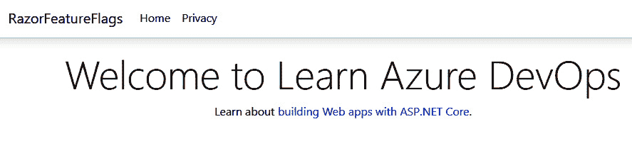

第五章：

# 在构建管道中运行质量测试

在上一章中，我们介绍了 Azure Pipelines，并学习了如何使用 Azure DevOps、GitHub 和容器实现 CI/CD 流程。

在本章中，我们将讲解如何在构建管道中运行质量测试。我们将首先解释自动化测试的好处。接着，我们将探讨如何在构建管道中运行单元测试，如何进行代码覆盖测试，以及如何查看测试结果。最后，我们将介绍如何使用特性标志在生产环境中测试代码。

本章将涵盖以下主题：

+   自动化测试的好处

+   单元测试介绍

+   在构建管道中运行单元测试

+   代码覆盖测试介绍

+   执行代码覆盖测试

+   将测试结果分配给工作项

+   特性标志介绍

+   使用特性标志在生产环境中测试

# 技术要求

要跟随本章内容，您需要有一个活跃的 Azure DevOps 组织。本章将使用的组织名为 Parts Unlimited 组织，它是在*第一章**，Azure DevOps 概述*中创建的。您还需要安装 Visual Studio 2019，可以从[`visualstudio.microsoft.com/downloads/`](https://visualstudio.microsoft.com/downloads/)下载。为了获得最新的演示，您需要安装 Visual Studio Code 并配置 C#扩展，以及安装.NET Core SDK 版本 3.1 或更高版本。

我们的示例应用程序的源代码可以从以下链接下载：

[`github.com/PacktPublishing/Learning-Azure-DevOps---B16392/tree/master/Chapter%205/RazorFeatureFlags`](https://github.com/PacktPublishing/Learning-Azure-DevOps---B16392/tree/master/Chapter%205/RazorFeatureFlags)

# 自动化测试的好处

在为应用程序添加新功能后，您希望知道它是否能够在所有可能的交互情况下正确运行。您还希望确保这个新功能不会破坏其他功能，并希望知道代码是否容易理解且可维护。

所有这些都可以手动测试。但是随着项目和代码库的不断增长，手动测试所有这些功能可能会变得重复且容易出错。这时，自动化测试就显得至关重要。

关于自动化测试一直存在许多争议。很多人认为测试创建和维护成本过高。的确，当测试创建不当时，这种观点是成立的。但如果自动化测试得当，它将大大降低与频繁手动测试或发布低质量软件相比的时间和成本。通过使用自动化测试，您的项目将能够更频繁地发布软件。它可以重复使用并反复运行，为团队提供更快的结果和反馈。问题越早被发现，修复的成本就越低。

与 CI 配合使用时，代码会自动推送到生产环境，自动测试将帮助团队避免在软件中发布漏洞。然而，这也有权衡。开发人员需要投入更多时间来编写和维护测试代码。然而，通过投入这额外的时间，最终的结果将是更高质量的代码，并且这些代码已经经过验证，能够完全按预期运行。

你可以执行不同类型的自动化测试；例如，你可以运行回归测试、验收测试和安全性测试。在本章中，我们将重点介绍**开发测试**，这也是 CI 中使用的，可以直接从构建流水线中完成。

Visual Studio 和 Azure DevOps 都提供了测试功能。它们与测试框架无关，因此你可以插入自己的框架并引入第三方工具。你可以轻松地添加测试适配器以便运行测试并查看结果。这可以使测试成为你日常软件构建过程的一部分。

在接下来的章节中，我们将介绍单元测试和代码覆盖率测试，这些都是开发测试的一部分。首先，我们将描述如何从构建流水线中运行自动单元测试，然后介绍如何从构建流水线中进行代码覆盖率测试和 UI 测试。

# 单元测试简介

使用单元测试，你将代码拆分成小块，称为单元，这些单元可以独立地进行测试。这些单元可以是类、方法或单行代码。这里越小越好。这样可以让你更好地了解代码的表现，并且测试可以快速运行。

在大多数情况下，单元测试是由编写代码的开发人员来编写的。编写单元测试有两种不同的方式：在编写实际的生产代码之前，或者之后。大多数程序员是在事后编写的，这是一种传统的做法，但如果你使用的是**测试驱动开发**（**TDD**），你通常会在之前编写单元测试。单元测试还可以使代码文档变得更容易。它鼓励更好的编码实践，你可以在代码中留下描述代码功能的部分。这里，你将更多地关注更新检查系统。

在接下来的部分中，我们将介绍如何在构建流水线中运行单元测试。

# 在构建流水线中运行单元测试

我们的**Parts Unlimited**测试项目已经创建了单元测试。因此，这是进行演示的一个好选择。首先，我们将查看应用程序和已创建的测试。因此，我们需要将仓库克隆到本地文件系统并在 Visual Studio 中打开解决方案。

## 下载源代码

我们将为 Parts Unlimited 的 Web 应用程序创建单元测试。首先，我们需要将仓库从 Azure DevOps 克隆到本地文件系统。这将允许我们使用 Visual Studio Code 添加单元测试。因此，我们必须执行以下步骤：

1.  打开网页浏览器，访问 [`dev.azure.com/`](https://dev.azure.com/)。

1.  使用您的 Microsoft 帐户登录并选择**Parts.Unlimited**项目。然后，从左侧菜单中选择**Repos**。这样您就可以导航到项目的源代码。

1.  从右上角菜单中，选择**克隆**：

    图 5.1 – 搜索结果

1.  在下一个屏幕上，确保选择了**在 Visual Studio 中克隆**，然后点击如下所示的按钮：

    图 5.2 – 克隆仓库

1.  现在，Visual Studio 将会打开。在这里，我们将简要查看已经存在于项目中的测试类。为此，请打开**解决方案资源管理器**窗口，并导航至**test** > **PartsUnlimited.UnitTests**：

    图 5.3 – 单元测试项目

1.  该项目中有不同的测试项目。花些时间熟悉一下实际测试的内容。这里使用的是 Visual Studio 的默认测试框架，即**MS Test**。

1.  在 Visual Studio 中，您可以构建并运行应用程序。为此，请按*F5*。或者，从顶部菜单中选择**调试** > **开始调试**：

    图 5.4 – 单元测试项目

1.  一旦项目构建完成，网站将如下所示：

    图 5.5 – 示例网站

1.  返回 Visual Studio 并停止调试器。

现在一切都已正常工作，我们可以开始创建构建管道，其中包括运行单元测试项目。

## 创建管道

要创建管道，我们需要回到 Azure DevOps。在那里，按照以下步骤操作：

1.  从左侧菜单中，选择**管道（Pipelines）**。

1.  在屏幕右上角，找到并点击**新建管道**：

    图 5.6 – 创建新管道

1.  创建构建管道的向导将会出现。在第一个屏幕上，选择**使用经典编辑器**，以使用设计器创建管道：

    图 5.7 – 使用经典设计器选项

1.  在下一个屏幕上，确保选择了**Azure Repos Git**。保持默认设置不变，并点击**继续**：

    图 5.8 – 管道源设置

1.  接下来，我们需要选择一个模板。从概览中选择**ASP.NET**，然后点击**应用**：

    图 5.9 – 选择 ASP.NET 模板

1.  这样，流水线就会创建完成。默认情况下，流水线会添加各种任务。我们将在这里使用这些任务。在本次演示中，我们将重点关注**测试程序集**任务。点击此任务并确保选择版本**2**。在**测试选择**下，您将看到以下设置：

    图 5.10 – 测试选择设置

1.  默认情况下，在**选择测试方式**下会选择**测试程序集**。请保持选择此项。由于我们希望自动运行单元测试，这是我们需要选择的选项。单元测试通常存储在程序集内部。

1.  此外，默认情况下，已经填充了一些程序集。如果需要，您可以更改它们。在本次演示中，我们将保持默认设置不变，因为任务会在不同的文件夹中查找包含`test`的程序集。我们的测试项目名为**PartsUnlimited.UnitTests**，所以任务会自动找到该程序集。

1.  搜索文件夹是用来搜索测试程序集的文件夹。在这种情况下，这是默认的工作目录。

1.  **测试结果**文件夹是存储测试结果的地方。测试运行之前，结果目录将始终被清空。

1.  我们现在准备运行测试。点击顶部菜单中的**保存并排队**，然后再次点击**保存并排队**子菜单项以执行构建流水线：

    图 5.11 – 执行构建流水线

1.  运行流水线的向导将打开。在这里，您可以指定一个评论，然后选择**代理池**、**代理规范**以及您希望使用的**分支/标签**：

    图 5.12 – 运行流水线的参数

1.  点击**保存并运行**以排队流水线。

    将显示作业的概览页面，在这里您可以查看执行状态：

    

    图 5.13 – 我们的作业概览

1.  几分钟后，流水线将完成。从右上角的菜单中，点击**测试与覆盖率**，您将能够看到此构建的测试通过百分比。点击此处可查看测试结果（另外，您也可以通过点击左上角的**测试**菜单来查看：

    图 5.14 – 测试概览

1.  在**测试**页面，您将看到测试数量，以及通过和失败的测试。您还可以看到运行的持续时间。

1.  在屏幕底部，您可以按特定的测试进行筛选。例如，您可以筛选出**通过**、**失败**和**中止**的测试：


图 5.15 – 更详细的测试结果

在这个演示中，我们创建了一个包含自动单元测试的构建管道，用于我们的源代码。在下一部分，我们将探讨代码覆盖率测试。

# 代码覆盖率测试简介

通过代码覆盖率测试，你可以衡量应用程序的哪些源代码将被测试。代码覆盖率测试衡量的是在运行自动化测试（如单元测试）时，执行了多少行代码、代码块和类。

测试的代码越多，团队对其代码更改的信心就越大。通过查看代码覆盖率测试的结果，团队可以识别出哪些代码没有被这些测试覆盖。这些信息非常有用，因为它有助于随着时间推移减少测试负担。

Azure DevOps 支持从构建管道执行代码覆盖率测试。**测试程序集**任务允许我们收集代码覆盖率测试结果。还有一个独立的任务，称为**发布代码覆盖率结果**，它也可以发布这些结果。该任务对流行的覆盖率结果格式（如 Cobertura 和 JaCoCo）提供开箱即用的支持。

重要提示

Cobertura 和 JaCoCo 都是计算测试访问的代码百分比的 Java 工具。有关 Cobertura 的更多信息，请参考 [`cobertura.github.io/cobertura/`](https://cobertura.github.io/cobertura/)。有关 JaCoCo 的更多信息，请参考 [`www.eclemma.org/jacoco/`](https://www.eclemma.org/jacoco/)。

在下一部分，我们将讨论如何使用 Azure DevOps 执行代码覆盖率测试。

# 执行代码覆盖率测试

为了执行代码覆盖率测试，我们需要打开在前一演示中创建的构建管道。让我们开始吧：

1.  打开构建管道后，选择右上角的**编辑**按钮：

    图 5.16 – 编辑前一演示中的管道

1.  导航到**测试程序集**任务以打开设置。

    在**执行**设置中，勾选**启用代码覆盖率**框：

    

    图 5.17 – 启用代码覆盖率测试

1.  现在，`.coverage` 文件可以下载并用于在 Visual Studio 中进行进一步分析。

1.  执行管道后，在构建概览页面上，选择`.coverage` 扩展名将被下载到你的本地文件系统。

1.  双击下载的文件，这样它会在 Visual Studio 中打开。从这里，你可以深入查看不同的类和方法，获取测试结果的概览：


图 5.18 – Visual Studio 中的代码覆盖率测试结果

在这个演示中，我们从构建管道启用了代码覆盖率测试。在下一部分，我们将把这些测试结果分配到用户故事中。

# 将测试结果分配到工作项

一旦测试自动运行并且构建过程完成，你可以将结果分配给已添加到待办事项和冲刺中的工作项。为此，你需要执行以下步骤：

1.  返回构建流水线，选择上次运行的流水线。在顶部菜单中点击**测试**。

1.  对于结果表格，确保选中了**已通过**，并且**已失败**和**已中止**已被取消选择：

    图 5.19 – 选择所有通过的测试

1.  然后，选择几个测试。完成后，在顶部菜单中点击**链接**：

    图 5.20 – 链接项目

1.  搜索`作为测试人员`并选择显示为搜索结果的工作项：

    图 5.21 – 选择工作项

1.  点击**关联**以将工作项链接到测试结果。

1.  现在，点击一个与工作项链接的测试结果。这将显示该项目的详细信息。在这里，你可以点击顶部菜单中的**工作项**，这将显示我们在前一步中链接的工作项：

    图 5.22 – 链接的工作项

1.  通过点击该工作项，你可以查看它的详细信息。

在本示范中，我们讲解了如何将测试结果链接到工作项。在接下来的部分，我们将讲解如何使用功能标志在生产环境中进行测试。

# 功能标志简介

你可以使用功能标志来打开或关闭代码中的功能，比如特定的方法或代码段。当你想在解决方案中隐藏（禁用）或公开（启用）某些功能时，这非常有帮助。尚未完成并准备发布的功能可以被隐藏或公开。这使得我们可以在生产环境中针对一部分用户进行代码测试。例如，你可以基于用户的登录名为一部分用户启用代码，并让他们在将功能发布给其他用户之前进行测试。然而，功能标志也有一个缺点：它们会增加代码的复杂性，因此最好限制应用程序中切换标志的数量。

创建功能标志时，推荐的方法是将它们保存在应用程序外部。例如，网页或应用配置文件是添加功能标志的好地方，因为你可以轻松更改它们，而无需重新部署应用程序。

在接下来的部分，我们将实现一个 .NET Core 解决方案中的功能标志（Feature Flag）。

# 使用功能标志在生产环境中进行测试

在本示范中，我们将创建一个新的 .NET Core 应用程序，在 Visual Studio Code 中进行开发。然后，我们将为此应用程序实现功能标志。

我们将添加一个非常基本的功能标志，将欢迎信息从*Welcome*更改为*Welcome to Learn Azure DevOps*。这将仅对一部分用户进行测试。因此，我们需要打开带有.NET Core 的`Razor`应用程序。我在本地文件系统中创建了一个名为`FeatureFlags`的新文件夹用于此目的。在 Visual Studio Code 中打开该文件夹。有关详细步骤，请查看下一部分。

## 创建一个新的.NET Core 应用程序

创建一个新的.NET Core 应用程序，请按照以下步骤操作：

1.  在**Visual Studio Code**打开时，从顶部菜单中点击**终端** > **新终端**。

1.  在终端中，添加以下代码行以创建一个新项目：

    ```
    dotnet new webapp -o RazorFeatureFlags
    code -r RazorFeatureFlags
    ```

1.  新创建的项目现在将打开。再次打开终端，并将以下代码行添加到终端中测试项目：

    ```
    dotnet run
    ```

    运行此代码的输出如下所示：

    

    图 5.23 – 终端中的输出

1.  通过点击终端输出中的本地主机 URL 之一，导航到.NET Core 应用程序。您将看到以下内容：

    图 5.24 – 运行新项目

1.  下一步是将`Microsoft.FeatureManagement` NuGet 包添加到项目中。因此，请将以下代码行添加到终端：

    ```
    dotnet add package Microsoft.FeatureManagement 
    ```

1.  安装完该包后，打开`Program.cs`类，并添加以下`using`语句：

    ```
    using Microsoft.FeatureManagement;
    ```

1.  现在，打开`appsettings.json`文件。我们将在此文件中创建一个`FeatureManagement`部分。将文件中的代码替换为以下内容：

    ```
      {
      'Logging': {
        'LogLevel': {
          'Default': 'Information',
          'Microsoft': 'Warning',
          'Microsoft.Hosting.Lifetime': 'Information'
        }
      },
      'FeatureManagement': {
        'ChangeBanner': false
      },  
      'AllowedHosts': '*'
    }
    ```

1.  然后，打开`Startup.cs`类。在这里，再次添加`using`语句，并将以下内容添加到`ConfigureServices`方法中：

    ```
    public void ConfigureServices(IServiceCollection services)
        {
            //...
            services.AddFeatureManagement();
        }
    ```

1.  现在，我们可以将其注入到一个控制器中。例如，打开应用程序首页背后的代码，代码可以在`Index.cshtml.cs`文件中找到，并再次添加`using`语句。然后，将`IndexModel`类替换为以下代码：

    ```
    public class IndexModel : PageModel
        {
         private readonly IFeatureManager _featureManager;
         public IndexModel(IFeatureManager featureManager)
         {
            _featureManager = featureManager;
         }
         public static string WelcomeMessage { get; set; }
         public async Task OnGetAsync() 
         {
            WelcomeMessage = await _featureManager.IsEnabledAsync('ChangeBanner') ? 'Welcome to Learn Azure DevOps' : 'Welcome';
         }
        }
    }
    ```

1.  `Index.cshtml.cs`类将如下所示：

    图 5.25 – `Index.cshtml.cs`文件概览

1.  最后，打开`Index.cshtml`文件，并用以下内容替换其中的代码：

    ```
    <div class='text-center'>
        <h1 class='display-4'>@IndexModel.WelcomeMessage</h1>
        <p>Learn about <a href='https://docs.microsoft.com/aspnet/core'>building Web apps with ASP.NET Core</a>.</p>
    </div
    ```

1.  这将把欢迎信息注入到网页中。

1.  通过打开一个新的终端窗口并将以下代码行添加到终端来构建并运行代码：

    ```
    dotnet run
    ```

1.  让应用程序在浏览器中打开，然后再次在 Visual Studio Code 中打开`appsettings.json`文件。将`ChangeBanner`功能标志更改为**true**，然后通过按*F5*重新加载浏览器中的网站。这样将会得到以下输出：



图 5.26 – 基于提供的功能标志更改的欢迎信息

在这个演示中，我们使用 Microsoft 的 `Featuremanagement` NuGet 包向我们的应用程序添加了一些功能标志（Feature Flags）。通过这些功能标志，我们更改了应用程序首页的欢迎信息。本章到此结束。

# 总结

在本章中，我们更深入地讨论了如何在构建管道中运行质量测试。通过这些，你现在可以从构建管道中运行单元测试，并从 Azure DevOps 执行覆盖率测试。最后，我们讲解了如何在应用程序中创建未来标志（Future Flags），这些标志可以在你的未来项目中使用。

在下一章中，我们将专注于如何在 Azure Pipelines 中托管构建代理。

# 进一步阅读

查看以下链接以获取更多关于本章所涵盖主题的信息：

+   单元测试基础：[`docs.microsoft.com/en-us/visualstudio/test/unit-test-basics?view=vs-2019`](https://docs.microsoft.com/en-us/visualstudio/test/unit-test-basics?view=vs-2019)

+   通过使用 Azure Pipelines 在你的构建管道中运行质量测试：[`docs.microsoft.com/en-us/learn/modules/run-quality-tests-build-pipeline/`](https://docs.microsoft.com/en-us/learn/modules/run-quality-tests-build-pipeline/)

+   探索如何为部分或所有用户逐步在生产环境中暴露你的功能：[`docs.microsoft.com/en-us/azure/devops/migrate/phase-features-with-feature-flags?view=azure-devops`](https://docs.microsoft.com/en-us/azure/devops/migrate/phase-features-with-feature-flags?view=azure-devops)
