第六章：

# 托管你自己的 Azure 管道代理

在前两章中，我们看到了如何通过 Azure Pipelines 设置持续集成，并使用 Microsoft 托管的代理。在本章中，我们将建立一个自托管代理，并更新管道以使用我们自己的代理，而不是使用 Microsoft 托管的代理。

我们将首先查看可用的管道代理类型，然后深入探讨设置代理池的技术规格。我们还将了解如何使用 VM 扩展集来支持大规模的 Azure DevOps 项目。

我们将涵盖以下主题：

+   Azure 管道代理概述

+   了解 Azure Pipelines 中代理的类型

+   规划并设置你自己的 Azure 管道代理

+   更新你的 Azure 管道以使用自托管代理

+   使用容器作为自托管代理

+   扩展规划 – 使用 Azure VM 扩展集作为自托管代理

# 技术要求

要跟随本章，你需要有一个有效的 Azure DevOps 组织和一个 Azure 订阅来创建虚拟机。

**准备项目前提条件**：本节要求你在自己的 DevOps 组织中准备好**PartsUnlimited**项目。如果你正在继续上一章内容，*第五章*，*在构建管道中运行质量测试*，你应该已经有该项目了。

如果你在 DevOps 组织中没有准备好项目，可以使用 Azure DevOps Demo Generator 导入它 – [`azuredevopsdemogenerator.azurewebsites.net/`](https://azuredevopsdemogenerator.azurewebsites.net/)：

1.  登录到**Azure DevOps Demo Generator**网站。

1.  输入项目名称并选择你的**DevOps 组织**。

1.  点击**选择模板**并找到**PartsUnlimited**。

1.  一旦准备好，点击**创建项目**：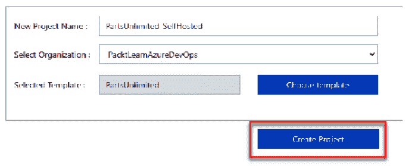

    图 6.1 – 创建示例 DevOps 项目

    项目导入需要几分钟时间，你可以使用显示的进度条来监控进度。

1.  完成后，点击**导航到项目**：

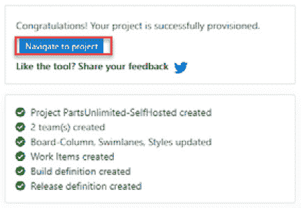

图 6.2 – 项目成功创建

我们将在本章中贯穿使用这个项目。

# Azure 管道代理概述

Azure 管道代理是负责执行管道定义中任务的组件。这个代理通常运行在虚拟机或容器中，并包含成功运行管道所需的前提条件。

在大多数情况下，你需要一个代理来运行管道。随着项目规模和开发人员数量的增加，你将需要更多的代理来支持扩展。

每次执行管道时，都会在一个代理上启动一个作业，并且每个代理一次只能运行一个作业。Azure 管道代理可以托管在云端或本地的以下计算基础设施中：

+   服务器或客户端主机（物理或虚拟）

+   容器

+   Azure VM 扩展集（预览版）

Azure 管道代理被分组为 **代理池**。你可以根据需要创建任意数量的代理池。

重要提示

Azure Pipelines 支持运行基本任务，例如调用 REST API 或 Azure Function，而无需任何代理。有关无代理执行 Azure Pipelines 的更多详情，请参考 [`docs.microsoft.com/en-us/azure/devops/pipelines/process/phases?view=azure-devops&tabs=yaml#server-jobs`](https://docs.microsoft.com/en-us/azure/devops/pipelines/process/phases?view=azure-devops&tabs=yaml#server-jobs)。

# 了解 Azure Pipelines 中代理的类型

Azure Pipelines 提供两种类型的代理：

+   Microsoft 托管代理

+   自托管代理

让我们详细看一下它们。

## Microsoft 托管代理

Microsoft 托管代理是完全托管的虚拟机，由 Microsoft 部署和管理。你可以选择使用 Microsoft 托管代理，无需任何额外的前置要求或配置。Microsoft 托管代理是最简单的，且无需额外费用。

每次执行管道时，你都会获得一个新的虚拟机来运行任务，且使用一次后就会被丢弃。

## 自托管代理

自托管代理是你拥有的服务器，运行在你拥有的任何云平台或数据中心中。由于安全性、可扩展性和性能等多种原因，自托管代理更受欢迎。

你可以配置自托管代理以预先安装所需的依赖项，这将帮助你减少管道执行的时间。

选择 Microsoft 托管代理和自托管代理取决于多种因素，以下是一些考虑因素：

+   代码库的大小

+   开发人员数量

+   构建和发布的频率

+   构建过程中所需的依赖项和包

+   安全性和合规性要求

+   性能

如果你的代码库较小且构建管道经过优化，最好使用 Microsoft 托管代理，因为下载所有依赖项所需的时间不多。然而，如果你有一个庞大的代码库和大量的依赖项，使用自托管代理会是一个更好的选择，因为你可以通过提前在自托管环境中配置它们，从而消除管道中的各种构建前期任务。如果你需要比 Microsoft 托管代理提供的更多 CPU 和内存，可以使用自托管代理并自定义大小。

推荐从 Microsoft 托管代理开始，等到 Microsoft 托管代理在你的构建和发布过程中成为瓶颈时，再转向自托管代理。

# 规划和设置你的自托管 Azure 管道代理

为了在 Azure Pipelines 中使用自托管代理，您需要设置一台机器并根据管道需求进行配置。通常，您会根据项目的框架、库和构建工具兼容性选择最适合的操作系统版本。

为了演示，我们将在 Azure 中设置一台虚拟机，并将其配置为使用自托管代理。您可以选择将代理服务器托管在任何云环境或本地环境中。

## 为代理虚拟机选择正确的操作系统/镜像

设置虚拟机时的第一个决定是选择操作系统/镜像，这取决于您的目标部署。如果您在本地环境中部署，您可以选择一个支持的操作系统版本（例如 Windows Server 2016）并安装必要的软件。对于云部署，您可以选择多种操作系统版本和预安装工具的组合镜像。

建议与开发人员共同规划代理虚拟机的规格，以确保其最适合您的项目需求。以下是一种推荐的做法：

1.  确定您的应用程序是构建为运行在 Windows、Linux 还是 macOS 上。如果是跨平台的，请选择运行效果最佳且支持您正在使用的构建工具的操作系统。

1.  列出所使用的底层框架和外部库/组件及其版本。

1.  从*步骤 1*中选择的顶层操作系统中选择最新版本的操作系统。

1.  确定它是否与**原始设备制造商**（**OEM**）支持的所有依赖项兼容，依赖项详见*步骤 2*。

1.  依次选择每个版本，直到选定一个与项目所需所有依赖项兼容的版本。

根据此过程确定的规格，您可以选择从原生操作系统开始，安装所需的框架和构建工具，或者在云中选择一个预创建的镜像。

## 安装 Azure Pipelines 代理的操作系统支持及前提条件

Azure 支持多种操作系统版本作为自托管代理使用；根据您选择的操作系统，您需要完成一组前提条件，才能在主机上安装 Azure Pipelines 代理。

### 支持的操作系统

以下是支持的操作系统列表：

+   基于 Windows：

    a) Windows 7，8.1 或 10（如果您使用的是客户端操作系统）

    b) Windows Server 2008 R2 SP1 或更高版本（Windows Server 操作系统）

+   基于 Linux：

    a) CentOS 7，6

    b) Debian 9

    c) Fedora 30，29

    d) Linux Mint 18，17

    e) openSUSE 42.3 或更高版本

    f) Oracle Linux 7

    g) Red Hat Enterprise Linux 8，7，6

    h) SUSE Enterprise Linux 12 SP2 或更高版本

    i) Ubuntu 18.04，16.04

+   ARM32：

    a) Debian 9

    b) Ubuntu 18.04

+   基于 macOS：

    a) macOS Sierra（10.12）或更高版本

### 前提软件

根据您选择的操作系统，您必须在将主机设置为 Azure Pipeline 代理之前，先安装以下前提条件：

+   基于 Windows：

    a) PowerShell 3.0 或更高版本

    b) .NET Framework 4.6.2 或更高版本

+   基于 Linux/ARM/macOS：

    a) Git 2.9.0 或更高版本。

    b) RHEL 6 和 CentOS 6 需要安装专门的 RHEL.6-x64 版本的代理。

Linux 的代理安装程序包括一个脚本，用于自动安装所需的先决条件。您可以通过运行`./bin/installdependencies.sh`来完成先决条件安装，该脚本位于下载的代理目录中。下载代理的过程将在本章的后续部分中介绍。

重要提示

请注意，上述先决条件仅用于在主机上安装 Azure Pipelines 代理；根据您的应用程序开发需求，您可能需要安装其他工具，例如 Visual Studio 构建工具、Subversion 客户端以及您的应用程序可能需要的任何其他框架。

现在我们已经了解了先决条件，我们将为我们的示例项目**PartsUnlimited**创建一个代理虚拟机。

## 为您的项目在 Azure 中创建虚拟机

**PartsUnlimited** 项目使用 .NET Framework 4.5 和 Visual Studio 作为主要的 IDE 工具进行构建。您可以通过浏览 **PartsUnlimited** 项目的 Azure DevOps 仓库来查看该信息。

看来看去，我们最好的选择是使用基于 Visual Studio 的服务器操作系统。让我们在 Azure 中查看并探索我们在这方面的选择：

1.  登录到 Azure 门户并点击**+ 创建资源**。

1.  搜索**Visual Studio**并选择**Azure 的 Visual Studio 镜像**选项: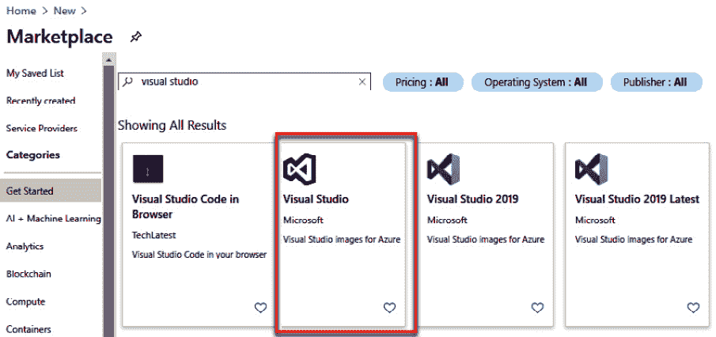

    图 6.3 – Azure 门户中的 Visual Studio

1.  现在，您将能够从各种可用组合中进行选择。我们将选择**Visual Studio Community 2017 on Windows Server 2016(x64)**: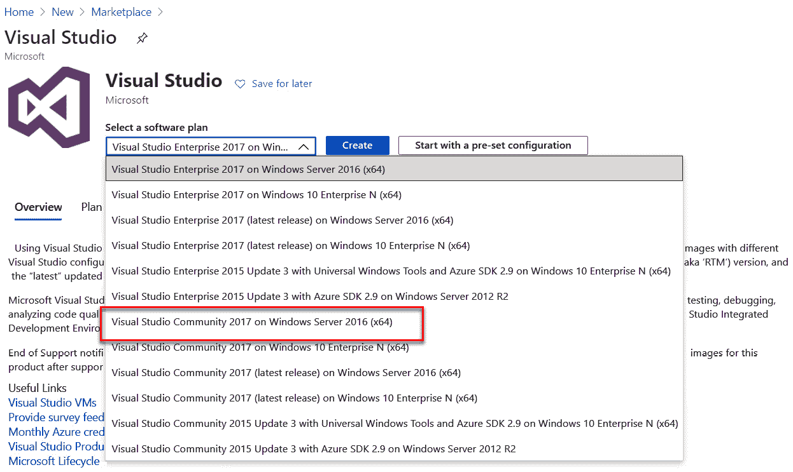

    图 6.4 – Azure 中可用的 Visual Studio 镜像

    重要提示

    基于 Visual Studio 2019 的镜像可以直接在 Azure 门户的搜索结果中找到。

1.  点击**创建**开始创建虚拟机。根据您的偏好选择所需的订阅、资源组和其他设置。

1.  在后续页面中，您可以修改设置以使用预先创建的虚拟网络，并自定义存储设置及其他管理方面的内容。请查看文档，了解更多关于在 Azure 中创建虚拟机的信息。

    重要提示

    请参考 Microsoft 文档，了解如何在 Azure 中创建虚拟机：[`docs.microsoft.com/en-us/azure/virtual-machines/windows/quick-create-portal`](https://docs.microsoft.com/en-us/azure/virtual-machines/windows/quick-create-portal)。

1.  创建虚拟机后，登录并安装所需的先决条件。

现在我们已经准备好虚拟机，我们将其设置为我们项目的 Azure Pipelines 代理。

## 设置构建代理

在本节中，我们将配置新创建的虚拟机，以将其用作自托管的管道代理。

### 在 Azure DevOps 中设置代理池

您可以在 Azure DevOps 中将您的代理组织为 **代理池**。**代理池**是您自托管代理的集合，它们帮助您在池级别组织和管理代理，而不是单独管理每个代理。

**代理池** 在组织级别进行管理，并可以同时供多个项目使用。让我们创建一个 **代理池** 来开始：

1.  登录到 Azure DevOps 并点击 **组织设置**：

    图 6.5 – Azure DevOps 组织设置

1.  在 **管道** 下点击 **代理池**：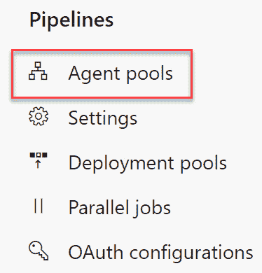

    图 6.6 – Azure DevOps 代理池

1.  您会看到已创建了两个默认的代理池。点击 **添加池** 创建一个新池：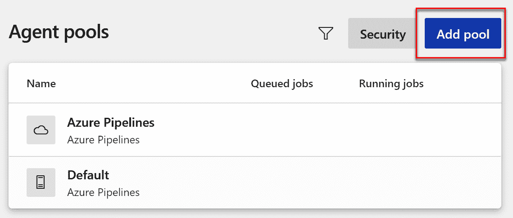

    图 6.7 – Azure DevOps – 添加代理池

1.  提供池类型、名称、描述和管道权限。在权限选项下，您可以选择让此池同时适用于所有管道和项目。准备好后点击 **创建**：

    a) --**池类型**：**自托管**

    b) --**名称** 和 **描述**：为其起个有意义的名称，以便以后可以引用：

    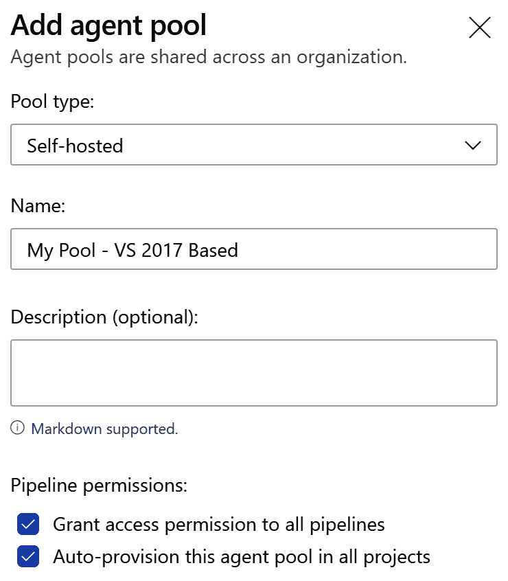

    图 6.8 – Azure DevOps – 添加代理池配置

1.  现在您的代理池应该已列在 **代理池** 下。

现在我们将为代理虚拟机设置访问令牌，以便其能够与 Azure DevOps 进行身份验证。

### 设置代理通信的访问令牌

在此任务中，您将创建一个个人访问令牌，Azure Pipelines 代理将使用它与您的 Azure DevOps 组织进行通信：

1.  使用管理员用户帐户登录您的 Azure DevOps 组织。

1.  转到您的用户个人资料并点击 **个人访问令牌**：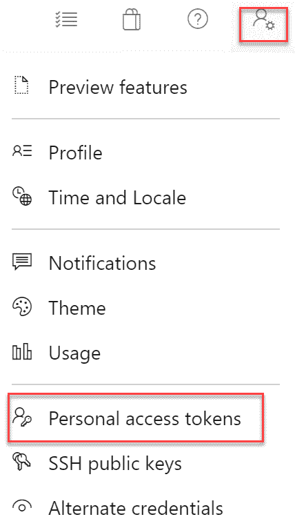

    图 6.9 – 个人访问令牌

1.  点击 **新建令牌**。

1.  按照此处提供的令牌规格进行设置：

    --**名称**：**自托管代理令牌**。

    --**组织**：您的 Azure DevOps 组织。

    --**到期时间**：您可以根据需要选择一个日期。这只是一次性设置；一旦此令牌过期，您**不需要**重新配置代理。

    --**范围**：**自定义定义**。

1.  在 **范围** 中，建议仅授予管理代理所需的权限。点击 **显示所有范围** 并选择 **读取** 和 **读取与管理** 权限：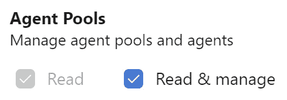

    图 6.10 – 代理池访问

1.  查看所有设置并点击 **创建**：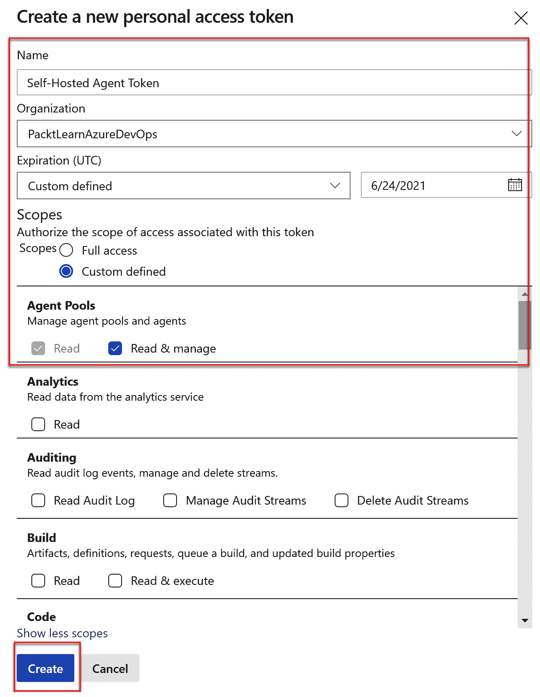

    图 6.11 – 为代理池创建个人访问令牌

1.  一旦您点击**创建**，Azure DevOps 会显示个人访问令牌。请复制该令牌并将其保存在安全位置。如果您丢失了该令牌，必须为新代理的设置创建一个新的令牌。

    我们将在设置 Azure Pipelines 代理时使用此令牌。

    重要提示

    如果您计划使用部署组，创建令牌时需要赋予额外的权限（更多信息请参考：[`docs.microsoft.com/en-us/azure/devops/pipelines/release/deployment-groups/?view=azure-devops`](https://docs.microsoft.com/en-us/azure/devops/pipelines/release/deployment-groups/?view=azure-devops)）。

现在我们已经在 Azure DevOps 中完成了代理池的设置，我们可以开始在之前创建的虚拟机上安装代理。

### 安装 Azure Pipelines 代理

现在，您可以在之前创建的虚拟机上安装 Azure Pipelines 代理。让我们下载 Azure Pipelines 代理。在开始之前，请使用**远程桌面**登录到之前创建的虚拟机：

1.  在您的 Azure DevOps 账户中，浏览到 **组织设置** > **代理池**。

1.  选择您新创建的代理池并点击**新建代理**：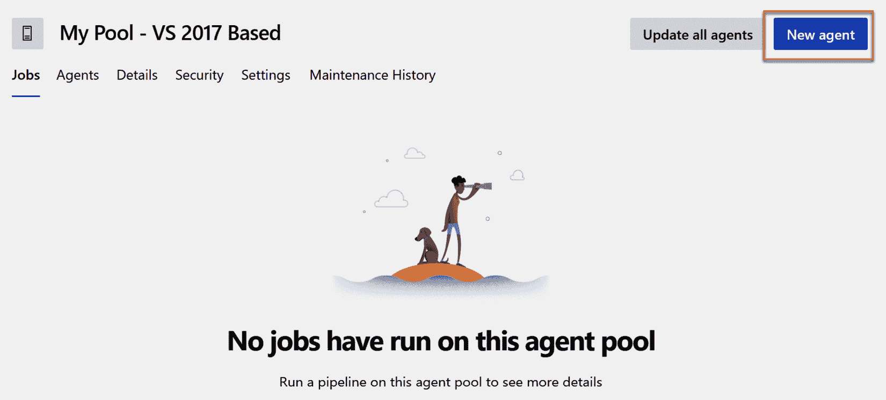

    图 6.12 – 添加代理

1.  在下一页，您可以根据操作系统和架构（x64/x32）下载代理安装程序。在我们的示例中，我们使用的是基于 Windows Server 2016 的虚拟机。我们将选择 Windows 和 x64 架构。您还可以复制下载 URL，并在您的自托管代理机器上直接下载代理。您也可以选择根据操作系统在 Azure DevOps 门户中提供的安装步骤来安装代理：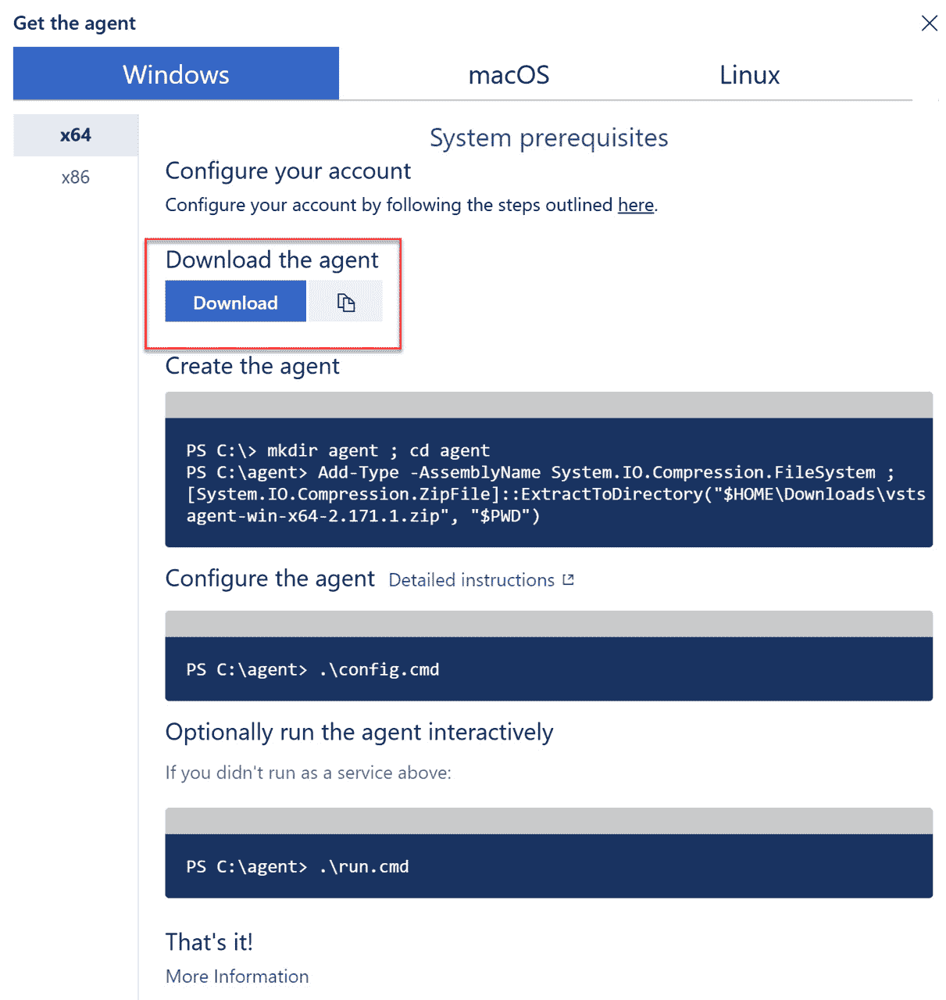

    图 6.13 – 代理命令

    提示

    如果您无法在 Visual Studio 机器上下载代理文件，您可以使用不同的浏览器（如非 Internet Explorer）或在服务器管理器中禁用**增强的 IE 安全性**配置。您可以参考 [`www.wintips.org/how-to-disable-internet-explorer-enhanced-security-configuration-in-server-2016/`](https://www.wintips.org/how-to-disable-internet-explorer-enhanced-security-configuration-in-server-2016/) 了解如何禁用 Internet Explorer 增强的安全性配置。

1.  启动一个提升权限的 PowerShell 窗口，并通过运行 `cd C:\` 命令更改到 `C:` 目录根目录：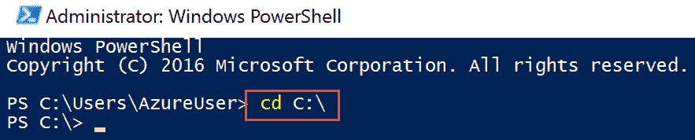

    图 6.14 – 更改目录

1.  运行以下 PowerShell 命令在 `C` 盘创建一个代理目录，并将代理文件提取到新目录中。请注意，您可能需要根据您下载的代理版本和保存下载文件的目录更改文件名/路径：

    ```
    mkdir agent ; cd agent
    Add-Type -AssemblyName System.IO.Compression.FileSystem ; [System.IO.Compression.ZipFile]::ExtractToDirectory("$HOME\Downloads\vsts-agent-win-x64-2.171.1.zip", "$PWD")
    ```

1.  提取文件将需要一分钟左右的时间。完成后，请浏览到新的目录。您应该会看到如下截图中的文件：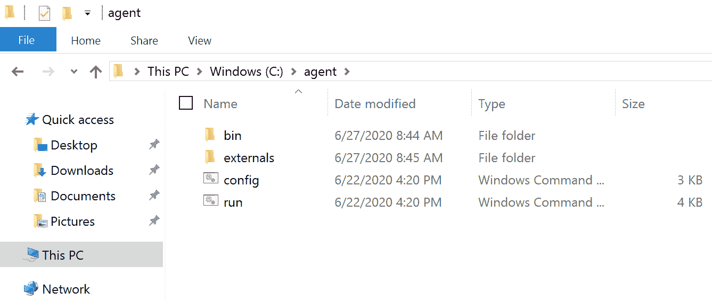

    图 6.15 – 代理文件

1.  您可以以两种模式运行 Azure 管道代理：

    --`run` 批处理文件存储在代理目录中。如果您停止交互式认证，您的代理将停止响应管道。

    --**作为服务运行**：在这个版本中，您将配置代理作为 Windows 服务运行，该服务将始终保持在线，并在重启时自动启动。这是生产环境推荐的设置。

1.  让我们配置代理为服务运行。在您的 PowerShell 窗口中，运行 `.\config.cmd`。

    这将询问有关您 Azure DevOps 组织的一系列问题。

1.  输入您的 Azure DevOps 组织作为服务器 URL。通常，这将是 [`dev.azure.com/YourOrganizationName`](https://dev.azure.com/YourOrganizationName)。

1.  按 *Enter* 键选择 **PAT**（**个人访问令牌**）作为 Azure DevOps 的认证机制。

1.  提供您之前生成的个人访问令牌。

1.  提供您之前创建的代理池名称。

1.  为此代理提供一个名称。

1.  为代理提供一个工作目录，作为默认目录。

1.  最后，按 *Y* 并按 *Enter* 键，将代理配置为作为 Windows 服务运行。

1.  您可以接受默认帐户来运行此服务。

1.  这将完成代理设置；最后，您应该看到一条消息，表示服务已成功启动：

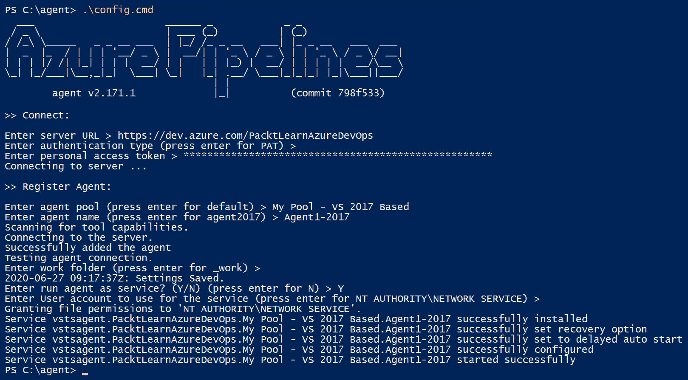

图 6.16 – 安装代理

现在，如果您在 Azure DevOps 门户中的代理池下查看，应该会看到这个代理列出：

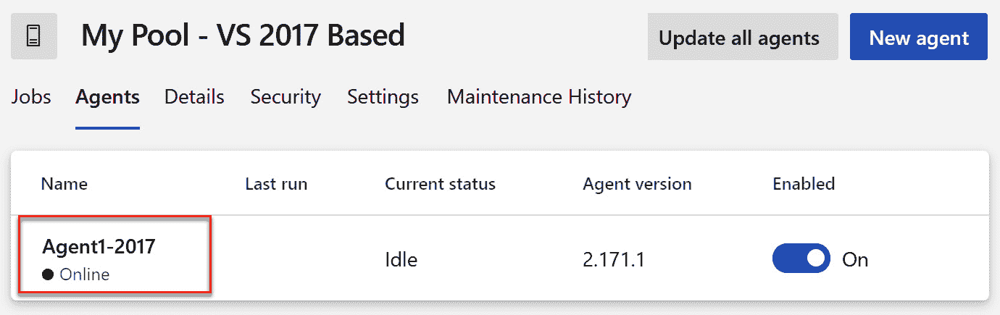

图 6.17 – Azure Pipelines 代理列出

现在，您已经拥有一个可用的自托管代理来运行您的 Azure 管道！此自托管代理可用于运行您的 Azure 管道作业，并且您可以以类似的方式添加任意数量的代理。您可以在同一个池中拥有多种类型的托管代理；根据管道要求，系统会自动选择合适的代理，或者您也可以在执行时专门选择一个代理。通常，在大型环境中，您会预先创建一个代理服务器的镜像，以便在需要时能够更快地配置额外的代理。在接下来的章节中，我们将更新我们的管道，以利用新设置的自托管代理。如果您希望使用基于 Linux 的托管代理，请参考以下文档：[`docs.microsoft.com/en-us/azure/devops/pipelines/agents/v2-linux?view=azure-devops`](https://docs.microsoft.com/en-us/azure/devops/pipelines/agents/v2-linux?view=azure-devops)。

请参考以下链接，了解基于 macOS 的代理：[`docs.microsoft.com/en-us/azure/devops/pipelines/agents/v2-osx?view=azure-devops`](https://docs.microsoft.com/en-us/azure/devops/pipelines/agents/v2-osx?view=azure-devops)。

重要提示

如果你的自托管代理机器位于网络防火墙或代理后面，在安装 Azure 管道代理时，必须定义代理地址。你可以通过在配置命令中指定代理 URL、用户名和密码来完成此操作：

`./config.cmd --proxyurl http://127.0.0.1:8888 --proxyusername "myuser" --proxypassword "mypass"`

# 更新你的 Azure 管道以使用自托管代理

在本节中，我们将修改上几章中涵盖的 Azure 管道场景（**PartsUnlimited**），以使用我们新创建的自托管代理。这将使我们能够使用自托管代理来运行管道，而不是使用 Microsoft 提供的代理。

## 准备你的自托管代理来构建**PartsUnlimited**项目

在我们开始使用自托管代理之前，我们必须准备它以支持构建我们的示例项目**PartsUnlimited**。**PartsUnlimited**项目是使用 Visual Studio 构建的，依赖于 .NET Framework、Azure 开发工具和 .NET Core、Node.js 等技术。为了使用我们的自托管代理构建解决方案，我们必须在运行管道作业之前安装所需的依赖项：

1.  登录到你的自托管代理虚拟机。

1.  通过以下链接下载 Visual Studio 构建工具：[`visualstudio.microsoft.com/thank-you-downloading-visual-studio/?sku=BuildTools&rel=16`](https://visualstudio.microsoft.com/thank-you-downloading-visual-studio/?sku=BuildTools&rel=16)。

    这将启动 Visual Studio 安装程序。

1.  选择**ASP.Net 和 Web 开发**以及**Azure 开发**。

1.  点击**修改**。这将开始安装所需的框架和工具。

1.  完成后，请下载并安装 .NET Core 2.2。你可以从这个链接下载：[`dotnet.microsoft.com/download/dotnet-core/thank-you/sdk-2.2.110-windows-x64-installer`](https://dotnet.microsoft.com/download/dotnet-core/thank-you/sdk-2.2.110-windows-x64-installer)。

    你可以在这里找到所有的 .NET 下载：[`dotnet.microsoft.com/download`](https://dotnet.microsoft.com/download)。

1.  通过在提升权限的 PowerShell 窗口中运行以下命令来安装 Azure PowerShell：

    ```
    [Net.ServicePointManager]::SecurityProtocol = [Net.SecurityProtocolType]::Tls12
    Install-Module AzureRM -AllowClobber
    ```

1.  从[`nodejs.org/download/release/v6.12.3`](https://nodejs.org/download/release/v6.12.3)下载 Node.js 版本 6.x。你可以下载名为`node-v6.12.3-x64.msi`的文件，并使用交互式安装程序进行安装。

你的主机现在已准备好构建**PartsUnlimited**解决方案。

## 运行 Azure 管道

在这个任务中，我们将运行管道作业，使用我们自己的自托管代理构建**PartsUnlimited**解决方案：

1.  登录到**Azure DevOps**门户并浏览到**PartsUnlimited**项目。

1.  浏览到**Pipelines**：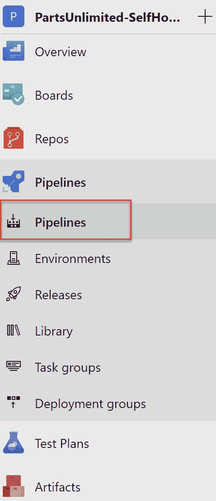

    图 6.18 – Azure Pipelines

1.  打开名为`PartsUnlimitedE2E`的预创建管道。

1.  点击**编辑管道**。

1.  在管道中，将**代理池**更改为您新创建的代理池：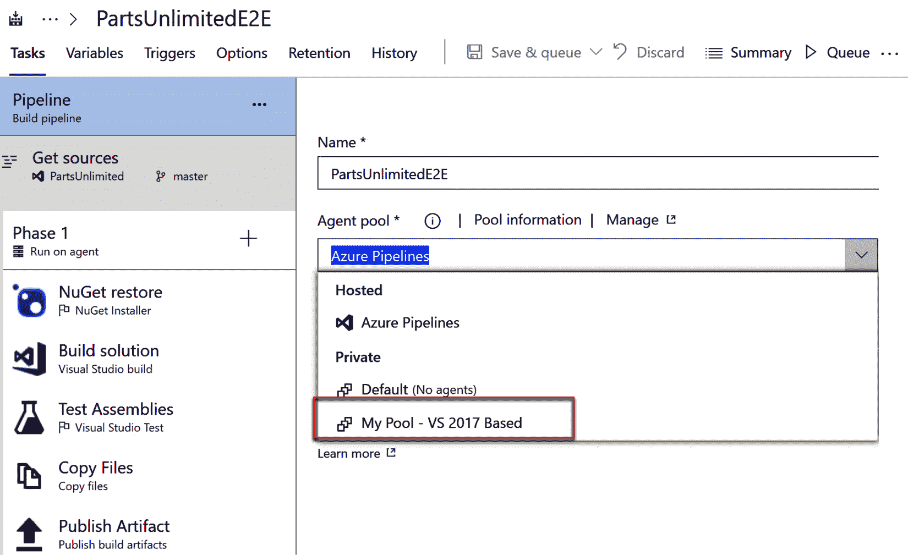

    图 6.19 – 为管道选择代理池

1.  保存管道。您还可以选择在保存后运行它，方法是选择**保存并排队**：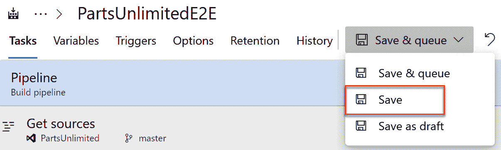

    图 6.20 – 保存管道

1.  现在，我们准备好执行管道。点击**运行管道**：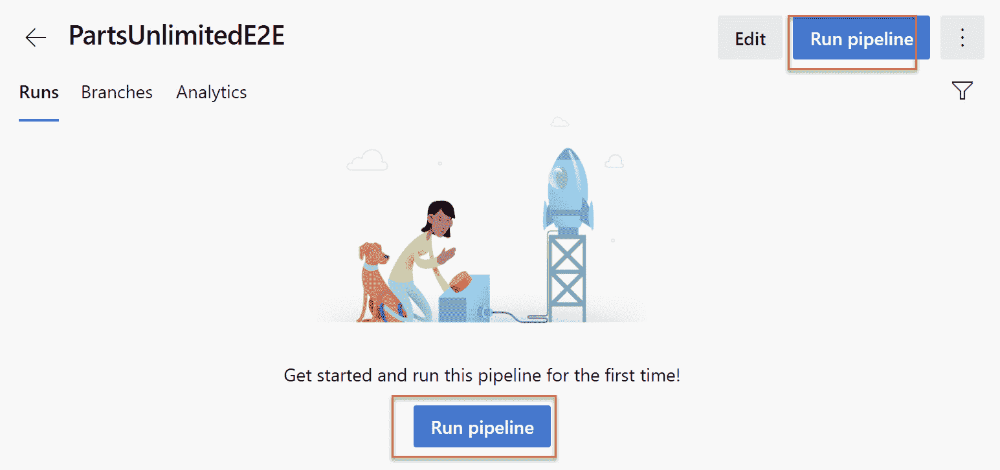

    图 6.21 – 运行管道

1.  在**代理池**下，将池名称更改为您在前一部分配置的代理池名称，然后点击**运行**：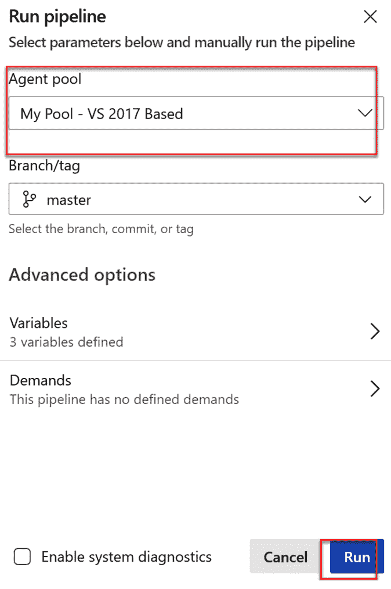

    图 6.22 – 运行管道向导

1.  这将开始在您的自托管代理上执行管道作业。完成此操作可能需要几分钟：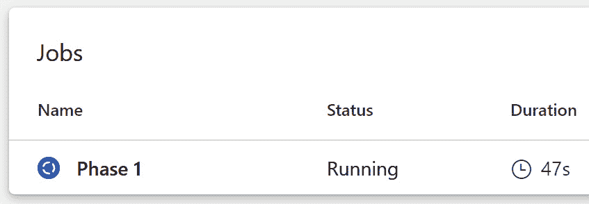

    图 6.23 – Azure 管道作业日志

1.  您可以点击作业名称以实时查看日志。

您现在已经完成了 Azure 管道的设置，该管道使用基于 VM 的自托管管道代理来运行作业。

# 使用容器作为自托管代理

Azure Pipelines 支持使用 Docker 容器作为运行管道作业的计算目标。您可以使用 Windows 容器（Windows Server Core/Nano Server）和 Linux 容器（Ubuntu）来托管您的代理。

为了将容器连接到您的 Azure DevOps 组织，您需要传递一些环境变量，例如代理池名称、个人访问令牌等。

## 设置 Windows 容器作为 Azure 管道代理

为了将 Windows 容器作为 Azure 管道代理使用，您需要先构建容器镜像，然后用 Azure DevOps 组织的环境变量运行它。让我们看看这个过程。

### 构建容器镜像

按照以下步骤构建容器镜像：

1.  启动命令提示符并运行以下命令：

    ```
    mkdir C:\dockeragent
    cd C:\dockeragent
    ```

1.  创建一个名为`Dockerfile`（无扩展名）的新文件，并用以下内容更新它。您可以使用记事本打开该文件：

    ```
    FROM mcr.microsoft.com/windows/servercore:ltsc2019
    WORKDIR /azp
    COPY start.ps1 .
    CMD powershell .\start.ps1
    ```

1.  创建一个新的 PowerShell 文件，命名为`start.ps1`，并从此处复制内容：[`github.com/PacktPublishing/Learning-Azure-DevOps---B16392/blob/master/Chapter-6/start.ps1`](https://github.com/PacktPublishing/Learning-Azure-DevOps---B16392/blob/master/Chapter-6/start.ps1)。

1.  运行以下命令以构建容器镜像：

    ```
    docker build -t dockeragent:latest.
    ```

您的容器镜像现在已准备好使用。您可以使用`dockeragent`作为镜像名称来引用此镜像。可选地，您也可以将此镜像保存在您的容器仓库中。

### 运行 Azure Pipelines 代理容器

现在，您已经准备好容器镜像，您可以通过运行该容器将其用作管道代理。

启动命令提示符窗口并运行以下命令。请确保更新 Azure DevOps 组织 URL、令牌和代理名称：

```
docker run -e AZP_URL=<Azure DevOps instance> -e AZP_TOKEN=<PAT token> -e AZP_AGENT_NAME=mydockeragent dockeragent:latest
```

现在，你的基于容器的 Azure 管道代理已经准备好使用。如果你希望每次只为一个作业使用容器并在作业执行完毕后重新创建容器，你可以使用 `–-once` 标志，**仅**使用一个容器运行一个作业，并使用容器编排工具（如 Kubernetes）在当前作业执行完毕后重新创建容器。

重要提示

请参考 Microsoft 文档 – [`docs.microsoft.com/en-us/virtualization/windowscontainers/about/`](https://docs.microsoft.com/en-us/virtualization/windowscontainers/about/) – 了解有关 Windows 容器的更多细节。

在接下来的部分中，我们将介绍如何将基于 Linux 的容器设置为 Azure Pipelines 代理。

## 设置 Linux 容器作为 Azure Pipelines 代理

为了将 Linux 容器用作 Azure 管道代理，你可以选择使用 Microsoft 在 Docker Hub 上发布的 Docker 镜像，或者自行构建 Docker 镜像。

Microsoft 的 Azure 管道代理镜像可以在此找到： [`hub.docker.com/_/microsoft-azure-pipelines-vsts-agent`](https://hub.docker.com/_/microsoft-azure-pipelines-vsts-agent)。你可以直接运行此镜像，并通过环境变量传入 Azure DevOps 组织的相关信息：

```
docker run \
```

```
  -e VSTS_ACCOUNT=<name> \
```

```
  -e VSTS_TOKEN=<pat> \
```

```
  -it mcr.microsoft.com/azure-pipelines/vsts-agent
```

或者，你也可以选择构建自己的 Docker 镜像来作为你的管道代理使用。该过程类似于为 Windows 容器构建镜像。请参考 Microsoft 文档：[`docs.microsoft.com/en-us/azure/devops/pipelines/agents/docker?view=azure-devops`](https://docs.microsoft.com/en-us/azure/devops/pipelines/agents/docker?view=azure-devops) – 获取有关入口点脚本的参考。

## 使用 Azure 容器实例作为代理

**Azure 容器实例** (**ACI**) 是一种托管服务，可以在 Azure 云中运行 Windows 和 Linux 容器。如果标准的 Microsoft 托管代理不符合你的需求（如要求、性能等），而且你没有足够的基础设施来在本地托管容器，你可以使用 ACI 来为 Azure DevOps 创建自托管代理。

你可以通过使用自定义镜像或重用 Microsoft 提供的镜像之一，在 ACI 上创建构建代理。

要在 ACI 上运行 Azure 管道代理，你需要 Azure DevOps 账户名、个人访问令牌和代理名称。获取所需的详细信息后，你可以通过在 Azure CLI 中执行以下命令来创建 ACI 上的代理（在连接到你的 Azure 订阅后）：

```
az container create -g RESOURCE_GROUP_NAME -n CONTAINER_NAME --image mcr.microsoft.com/azure-pipelines/vsts-agent --cpu 1 --memory 7 --environment-variables VSTS_ACCOUNT=AZURE_DEVOPS_ACCOUNT_NAME VSTS_TOKEN=PERSONAL_ACCESS_TOKEN VSTS_AGENT=AGENT_NAME VSTS_POOL=Default
```

在这里，我们有以下内容：

+   `RESOURCE_GROUP_NAME` 是你希望在 Azure 中创建该资源的资源组名称。

+   `CONTAINER_NAME` 是 ACI 容器的名称。

+   `AZURE_DEVOPS_ACCOUNT_NAME` 是你的 Azure DevOps 账户名。

+   `PERSONAL_ACCESS_TOKEN` 是之前创建的个人访问令牌。

+   `AGENT_NAME` 是你希望创建的构建代理名称，并将在 Azure DevOps 中显示。

在此命令中，还有其他两个重要参数：

+   `--image` 参数用于选择用于创建代理的 Azure Pipelines 镜像名称，如下所述：[`hub.docker.com/_/microsoft-azure-pipelines-vsts-agent`](https://hub.docker.com/_/microsoft-azure-pipelines-vsts-agent)。

+   VSTS_POOL 参数用于选择你的构建代理池。

请记住，你可以使用 `az container stop` 和 `az container start` 命令来启动和停止 ACI 实例，这可以帮助你节省成本。

让我们来看看你可以与 Azure 管道代理容器一起使用的一些额外环境变量。

## 环境变量

运行在容器上的 Azure DevOps 管道代理可以通过使用额外的环境变量进一步自定义。环境变量及其目的如下所述：

+   `AZP_URL`：Azure DevOps 组织的 URL

+   `AZP_TOKEN`：个人访问令牌

+   `AZP_AGENT_NAME`：你的 Azure 管道代理名称

+   `AZP_POOL`：代理池名称（默认值为 `Default`）

+   `AZP_WORK`：工作目录（默认值为 `_work`）

在这一部分，我们了解了如何使用容器作为 Azure 管道代理来执行管道作业。

规划扩展 – Azure 虚拟机规模集作为 Azure 管道代理

Azure 虚拟机规模集是 Azure 服务，允许你创建和管理数百个相同的虚拟机，具备自动或手动扩展虚拟机数量的能力。Azure 虚拟机规模集可以作为 Azure 管道代理，适用于大规模项目，在这些项目中，你需要根据 Azure 管道作业执行负载的需求来动态扩展容量。

Azure 虚拟机规模集最多支持 1,000 个虚拟机。

## 规划扩展

基于 Azure 虚拟机规模集的代理可以根据 Azure Pipelines 作业需求自动扩展。规模集代理相比专用代理有几个优势：

+   你在某个时刻需要更多的计算能力（CPU 和内存），而且这一需求会根据工作负载波动。

+   Microsoft 托管的代理无法满足你的管道需求。

+   你的作业运行时间较长或需要较长时间才能完成。

+   你希望连续使用相同的代理来执行多个作业，以便利用缓存等功能。

+   你不想一直运行专用代理，因为这样会产生成本。

+   你希望定期更新运行作业的虚拟机镜像。

Azure 虚拟机规模集可以根据 Azure Pipelines 当前的需求自动增加/减少可用的管道代理数量。这有助于节省成本，并支持你的扩展需求。

## 创建 Azure 虚拟机规模集

在本节中，我们将创建一个 Azure VM 扩展集，用作 Azure Pipeline 代理。请注意，Azure Pipelines 要求以特定配置创建扩展集，因此您可能无法使用现有的扩展集：

1.  登录 Azure 门户并点击**+ 创建资源**。

1.  搜索 `虚拟机扩展集`：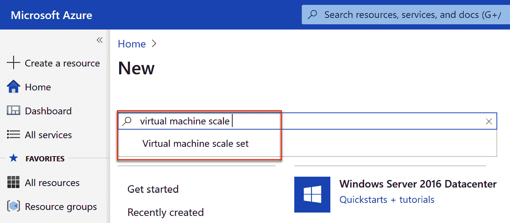

    图 6.24 – Azure 门户中的 VM 扩展集

1.  点击**创建**。

1.  按照此处描述的方式填写值：

    --**订阅**：选择您希望部署此扩展集的订阅。

    --**资源组**：选择现有的资源组或创建一个新组。

    --**虚拟机扩展集名称**：您选择的标识符。

    --**区域**：选择您选择的 Azure 区域；建议选择离您最近的区域。

    --**可用性区域**：建议选择所有三个区域以实现高可用性。

    --**镜像**：为 Azure Pipelines 代理选择一个支持的 Windows 或 Linux 镜像。

    --**Azure Spot 实例**：可以帮助降低成本。详情请参阅[`azure.microsoft.com/en-us/pricing/spot/`](https://azure.microsoft.com/en-us/pricing/spot/)。

    --**大小**：为您的代理选择虚拟机大小。

    --**身份验证**：用户名/密码或 SSH 密钥：

    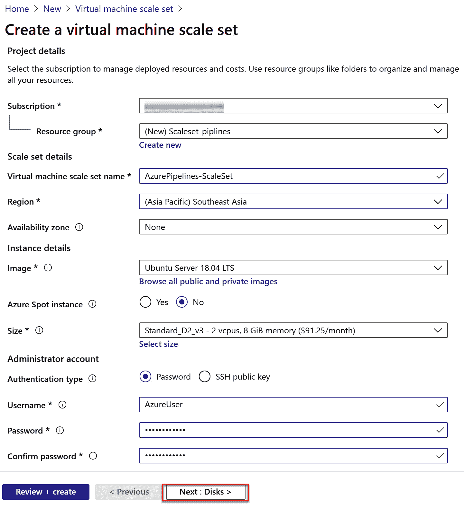

    图 6.25 – 创建 VM 扩展集

1.  点击**下一步：磁盘 >**。

1.  您可以自定义磁盘性能层和加密设置，并在需要时添加额外的磁盘。如果不确定，接受默认设置并点击**下一步**。

1.  在网络页面上，如果您的扩展集需要访问任何网络资源并确保安全连接，您可以选择将扩展集连接到现有的虚拟网络。请确保**使用负载均衡器**设置为**否**，以用于 Azure Pipelines 扩展集。配置完成后，点击**下一步**：

    图 6.26 – Azure VM 扩展集负载均衡设置

1.  在**扩展**部分，提供初始实例数量，并将**扩展策略**设置为**手动**。将其他设置保持为默认，点击**下一步**：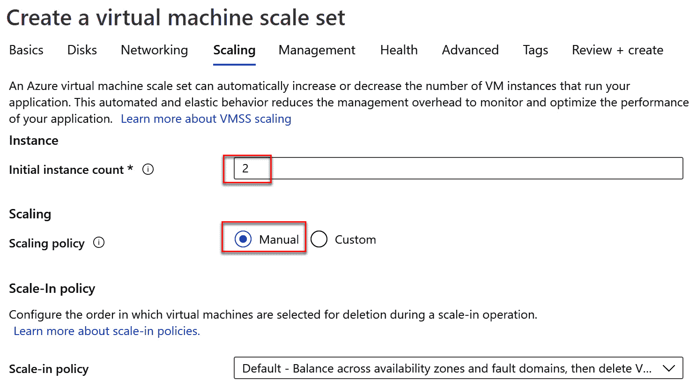

    图 6.27 – 扩展集设置

1.  在**管理**部分，确保**升级模式**设置为**手动**。将其他设置保持为默认，点击**下一步**：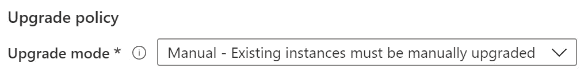

    图 6.28 – 扩展集升级策略

1.  在**健康和高级设置**页面上，您可以选择更改任何希望自定义的环境设置。准备好创建扩展集时，点击**审核并创建**。

1.  验证成功后，点击**创建**以开始部署。

部署完成可能需要几分钟的时间。请耐心等待部署完成。虚拟机扩展集准备好后，我们将设置它作为 Azure Pipelines 代理使用。

## 使用虚拟机规模集设置 Azure 管道代理

在上一节中，我们创建了一个虚拟机规模集。现在，我们将其设置为 Azure 管道代理：

1.  登录到你的 Azure DevOps 组织，进入 **项目设置** > **代理池**。

1.  点击 **添加池**。

1.  按照这里定义的值填写：

    --**池类型**：虚拟机规模集

    --**服务连接的项目**：选择你的 Azure DevOps 项目

    --**Azure 订阅**：选择你创建虚拟机规模集的 Azure 订阅：

    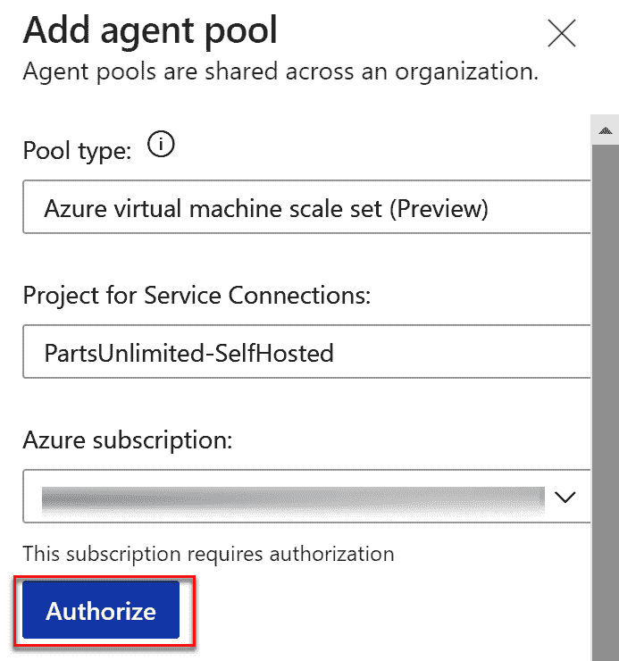

    ](img/Figure_6.29_B16392.jpg)

    图 6.29 – 为规模集添加代理池

1.  点击 **授权**，以启用对你 Azure 订阅的访问权限。你可能会被要求在此过程中登录到 Azure 帐户。

1.  验证身份后，选择一个现有的虚拟机规模集，并按照这里描述的值填写：

    --你选择的代理池的名称和描述。

    --可选地，配置规模集在每次执行后删除虚拟机。

    --虚拟机的最大数量。

    --保留备用的代理数量。虽然这有助于更快地完成任务，但可能会增加你的 Azure 成本。

1.  填写完所有值后，点击 **创建**：![图 6.30 – 创建基于规模集的代理池]

    ](img/Figure_6.29_B16392.jpg)

    图 6.30 – 创建基于规模集的代理池

1.  现在，代理池的创建将开始。请注意，代理池准备好接收任务可能需要大约 15 分钟。在完成时，你应该能看到代理池中的代理处于活动状态：

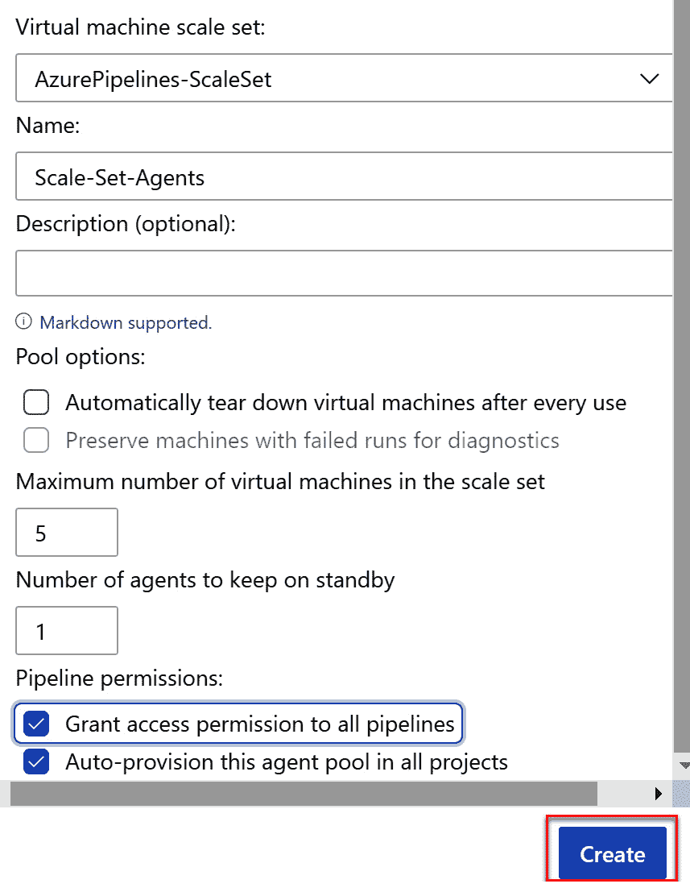

](img/Figure_6.31_B16392.jpg)

图 6.31 – 代理

一旦代理池准备就绪，你可以更新你的 Azure 管道，开始使用这个池来执行任务。

# 总结

在本章中，我们讨论了如何使用微软托管的代理和自托管代理来运行你的 Azure 管道任务。我们深入了解了设置自托管代理的过程，并更新了管道以使用自托管代理。

我们还讨论了如何使用 Docker 容器、Azure 容器实例和 Azure 虚拟机规模集作为你的 Azure 管道代理。通过本章内容，你应该能够为你的项目规划并实现适当的管道代理解决方案。

在下一章中，我们将学习 Azure DevOps 中的工件（Artifacts）。
