第七章：

# 第八章：在 Azure DevOps 中使用 Artifacts

在上一章中，我们讲解了如何在 Azure Pipelines 中托管构建代理。在本章中，我们将讲解如何在 Azure DevOps 中使用 Artifacts。我们将从解释什么是 Artifacts 开始。然后，我们将看看如何在 Azure DevOps 中创建它们，以及如何从构建管道中生成工件包。接下来，我们将讲解如何使用发布管道部署供稿。然后，我们将讲解如何设置供稿权限，以及如何在 Visual Studio 中消费包。最后，我们将讲解如何使用 WhiteSource Bolt 扫描包漏洞。

本章将涵盖以下主题：

+   介绍 Azure Artifacts

+   使用 Azure Artifacts 创建工件供稿

+   使用构建管道生成包

+   从构建管道将包发布到供稿中

+   从供稿设置中配置供稿权限

+   从 Artifacts 供稿中在 Visual Studio 中消费包

+   使用 WhiteSource Bolt 扫描包漏洞

# 技术要求

要跟随本章内容，你需要有一个活跃的 Azure DevOps 组织。我们将在本章中使用的组织是**PartsUnlimited**组织，具体内容在*第一章**，Azure DevOps 概述*中创建。你还需要安装 Visual Studio 2019，可以从[`visualstudio.microsoft.com/downloads/`](https://visualstudio.microsoft.com/downloads/)下载。

我们示例应用程序的源代码可以从[`github.com/PacktPublishing/Learning-Azure-DevOps---B16392/tree/master/Chapter%207`](https://github.com/PacktPublishing/Learning-Azure-DevOps---B16392/tree/master/Chapter%207)下载。

# 介绍 Azure Artifacts

每个开发者很可能都在代码中使用过第三方或开源包，以增加额外的功能并加快应用程序开发过程。使用社区已使用并测试过的流行的预构建组件，将帮助你更轻松地完成工作。

在你的组织中，由不同团队构建的功能、脚本和代码经常被其他团队和不同的软件开发项目重用。这些不同的工件可以被移动到一个库或包中，以便其他人也能从中受益。

有多种方式可以构建和托管这些包。例如，你可以使用 NuGet 托管和管理 Microsoft 开发平台的包，或使用 npm 托管 JavaScript 包，Maven 托管 Java 包等等。Azure Artifacts 提供了便捷的功能，使你可以轻松地共享和重用包。在 Azure Artifacts 中，包被存储在供稿中。供稿是一个容器，允许你将包进行分组，并控制谁可以访问它们。

你可以将包存储在你自己或其他团队创建的源中，但它也内置支持**上游源**。通过上游源，你可以创建一个单一源，用于存储组织生产的包以及从远程源消费的包，如 NuGet、npm、Maven、Chocolatey、RubyGems 等。

强烈建议将 Azure Artifacts 用作发布内部包和远程源的主要来源。原因在于，它能够让你全面了解组织和不同团队使用的所有包。源能够知道所有使用上游资源保存的包的来源，即使原始源宕机或包被删除，包也会被保存在源中。包是有版本管理的，通常你可以通过指定你想在应用程序中使用的包版本来引用一个包。

许多包允许无需登录即可访问。然而，也有一些包需要我们通过用户名和密码组合或访问令牌进行身份验证。对于后者，访问令牌可以设置为在指定的时间后过期。

在下一部分，我们将讨论如何在 Azure DevOps 中创建一个**工件源**。

# 使用 Azure Artifacts 创建工件源

在这个演示中，我们将创建一个 Azure Artifacts 中的工件源。包存储在源中，这些源本质上是组织结构，用于将包分组并管理其权限。每种包类型（NuGet、npm、Maven、Python 和 Universal）都可以存储在一个源中。

在本次演示中，我们将再次使用我们的**PartsUnlimited**示例项目，并向项目中添加一个新的工件源。为此，请执行以下步骤：

1.  打开一个浏览器并导航到 [`dev.azure.com/`](https://dev.azure.com/)。

1.  使用你的 Microsoft 帐户登录，并从左侧菜单选择**Artifacts**。然后，点击**+ 创建源**按钮。

1.  在**创建新源**对话框中，添加以下值（确保**上游源**被禁用；我们在本章中不会使用远程源中的包）：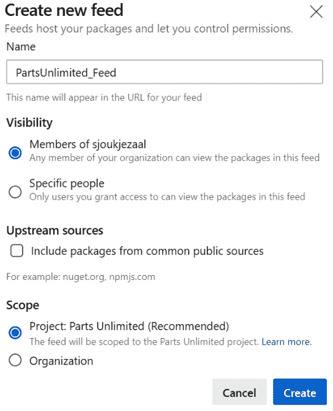

    图 7.1 – 创建一个新源

1.  点击**创建**按钮。

通过以上操作，我们已经创建了一个新的源，以便我们可以存储我们的包。在下一部分，我们将通过构建管道生成一个包。

# 通过构建管道生成包

现在我们已经创建了我们的源，接下来我们将创建一个构建流水线，在项目构建过程中自动创建一个包。在本例中，你可以使用本书 GitHub 代码库中提供的示例项目。这个示例项目包含了**PartsUnlimited**项目中的所有模型。我们将把所有模型添加到一个包中，并通过 Artifacts 进行分发。这样，你就可以在不同的项目之间轻松共享数据模型。

第一步是将 GitHub 代码库导入到 Azure DevOps 中的**PartsUnlimited**组织。

## 将示例项目添加到 PartsUnlimited 代码库

要将示例模型项目添加到 PartsUnlimited 代码库中，请执行以下步骤：

1.  导航到 Azure DevOps 中的**PartsUnlimited**项目，并转到**Repos > Files**。

1.  从**PartsUnlimited**下拉菜单中选择**导入代码库**：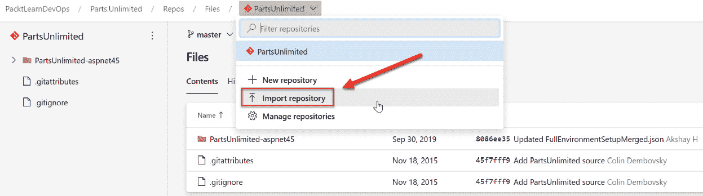

    图 7.2 – 导入代码库

1.  将源代码库的 URL 输入到**Clone URL**框中，并为你的新 GitHub 代码库添加一个名称：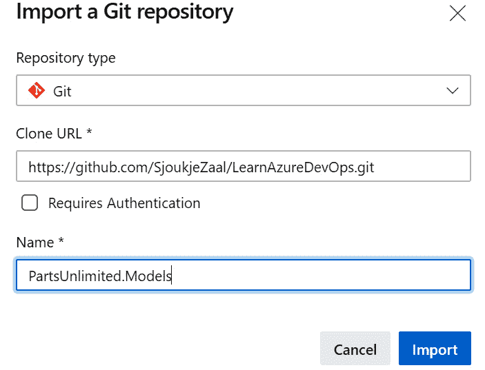

    图 7.3 – 指定代码库的 URL

1.  点击**导入**。

1.  一旦项目被导入，代码库将如下所示：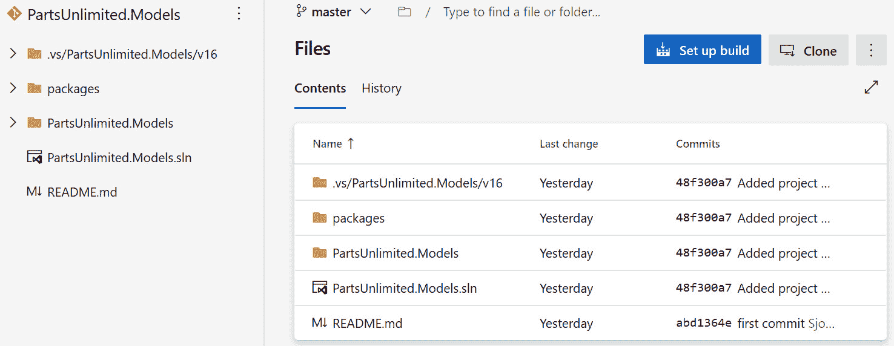

图 7.4 – Azure DevOps 中的代码库

现在我们已经将**PartsUnlimited.Models**项目导入到 Azure DevOps 代码库中，可以在构建流水线中使用它来创建 NuGet 包。

在接下来的部分中，我们将创建一个构建流水线，自动将我们的项目打包成一个 Artifact 包。

## 创建构建流水线

现在项目已经添加到代码库中，我们可以创建构建流水线。为此，请执行以下步骤：

1.  再次导航到 Azure DevOps 并打开**PartsUnlimited.Models**项目。从左侧菜单中点击**Pipelines**。

1.  从右上角菜单中点击**新建流水线**，然后在向导的第一个屏幕中选择**使用经典编辑器**。

1.  在第二个屏幕上，设置如下截图所示的属性，然后点击**继续**：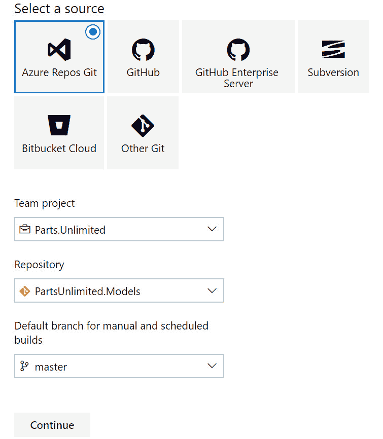

    图 7.5 – 选择源

1.  在向导的下一个屏幕中选择**ASP.NET**，然后点击**应用**。这样，构建流水线就会被创建。点击**Agent job 1**右侧的**+**号，并搜索**NuGet**。

1.  将 NuGet 任务添加到流水线：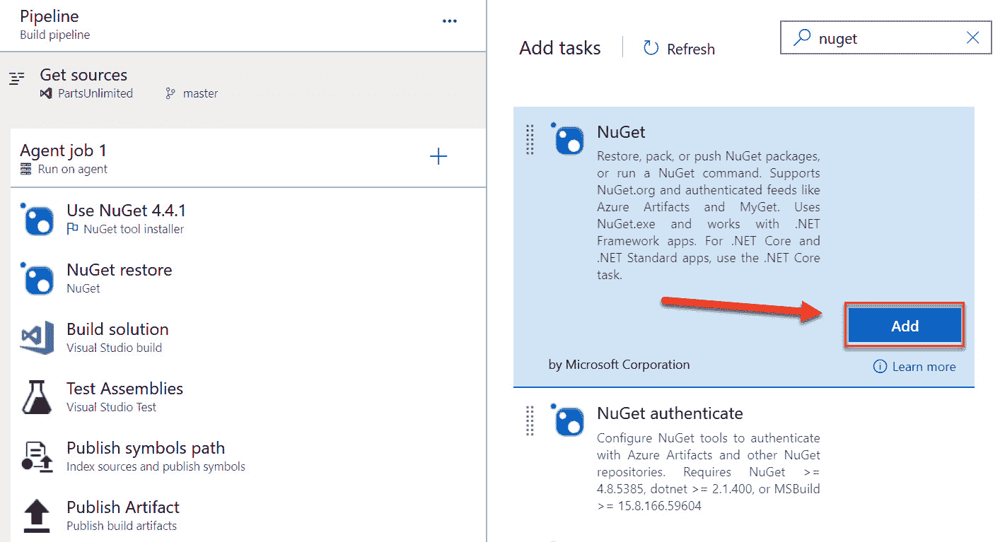

    图 7.6 – 添加 NuGet 任务

1.  重新排列任务，并将 NuGet 任务拖动到**Build Solution**任务之后。删除**Test Assemblies**方法，因为该项目中没有测试：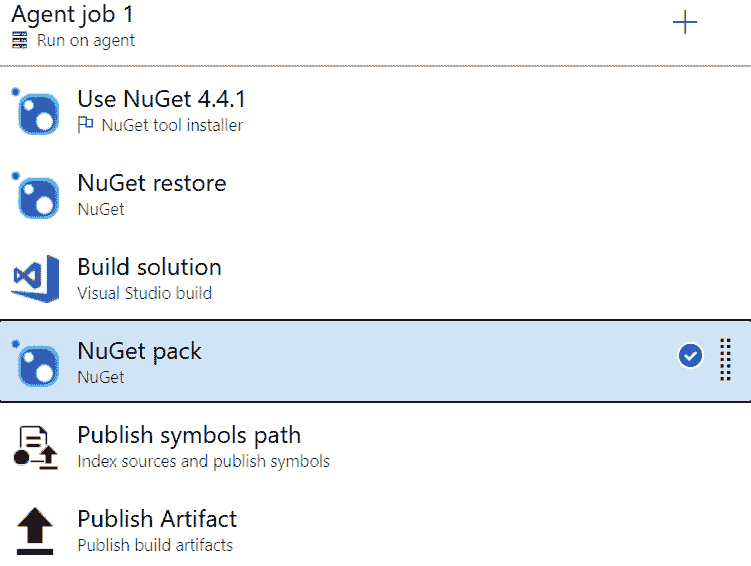

    图 7.7 – 重新排序任务

1.  对新添加的任务的设置进行以下更改：

    --`NuGet pack`

    --`pack`

    --`**/*.csproj`

1.  完成这些更改后，任务将如下所示：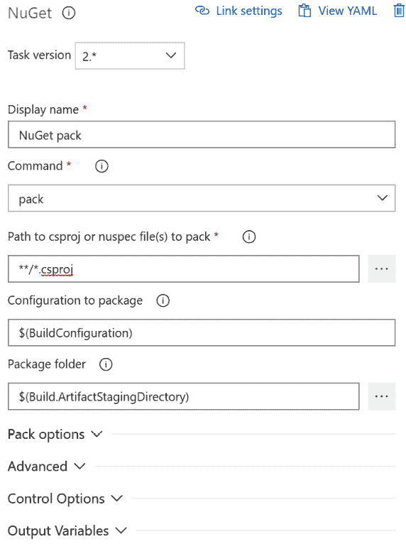

    图 7.8 – 配置任务

1.  接下来，让我们设置包的版本控制。推荐的包版本控制方法是使用 `1`

    --`0`

    --`0`

    --**时区**：**UTC**

1.  从顶部菜单中选择**Save & queue**，然后选择**Save and run**。

构建管道现在将成功运行。在下一部分，我们将把在第一个演示中创建的**PartsUnlimited.Models** NuGet 包发布到我们的 feed。

# 从构建管道将包发布到 feed

现在我们已经构建了应用程序和包，并从构建管道中生成了包，我们可以将该包发布到我们在第一个演示中创建的 feed。

为此，我们需要在 feed 上设置所需的权限。构建将以其身份运行，该身份需要在 feed 上具有**Contributor**权限。一旦设置了这些权限，我们就可以扩展我们的管道，将包推送到 feed。

## 设置 feed 上的所需权限

要设置所需的权限，我们需要进入 feed 的设置：

1.  使用您的 Microsoft 帐户登录，并从左侧菜单中选择**Artifacts**。

1.  转到 feed 的设置，通过点击右上角菜单中的**Settings**按钮：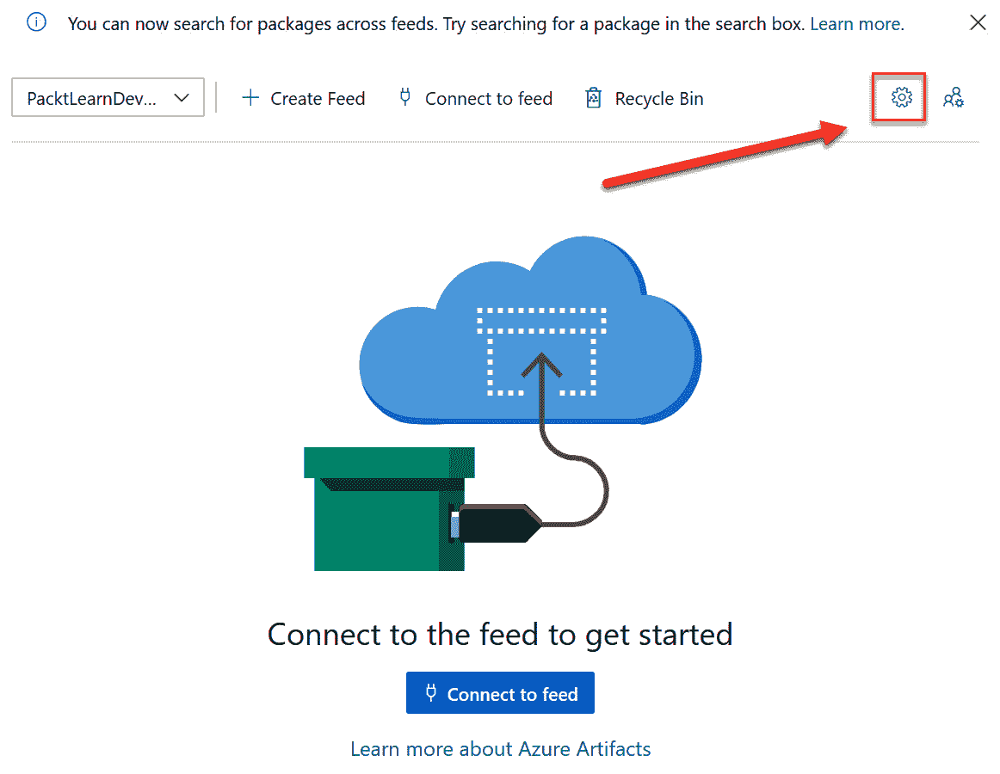

    图 7.9 – 打开 feed 设置

1.  然后，从顶部菜单中点击**Permissions**，点击**+ Add users/groups**：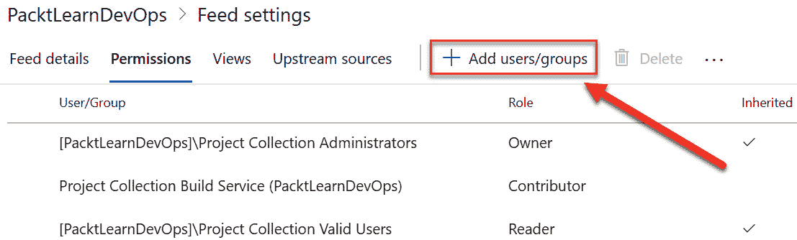

    图 7.10 – Feed 权限设置

1.  添加与项目同名的构建，在我的例子中是**Parts.Unlimited Build Service**身份：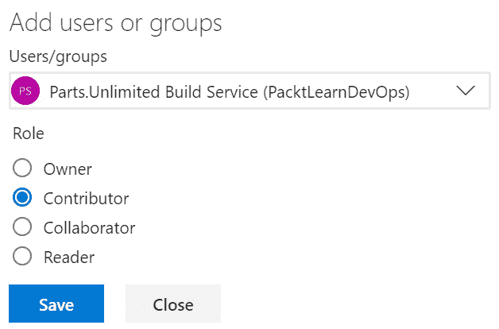

    图 7.11 – 添加构建身份

1.  点击**Save**。

现在，构建管道的身份已在 feed 上拥有所需的权限，我们可以在构建过程中将包推送到该 feed。

发布包

我们现在准备扩展构建管道，并将包从构建管道推送到 feed。为此，我们需要执行以下步骤：

1.  导航到 Azure DevOps，打开**PartsUnlimited.Models**项目。在左侧菜单中点击**Pipelines**。

1.  选择我们在上一步中创建的构建管道，然后点击右上角菜单中的**Edit**按钮。

1.  再次点击**Agent job 1**旁边的**+**按钮，搜索 NuGet，并将任务添加到管道中。

1.  将新添加的任务拖到我们在上一步中创建的 NuGet 任务下方。对任务的设置进行以下更改：

    --`NuGet push`

    --`$(Build.ArtifactStagingDirectory)/**/*.nupkg;!$(Build.ArtifactStagingDirectory)/**/*.symbols.nupkg`

    --**目标 feed 位置**：**此组织/集合**

    --**目标源**：**PacktLearnDevOps**

1.  在进行这些更改后，任务将如下所示：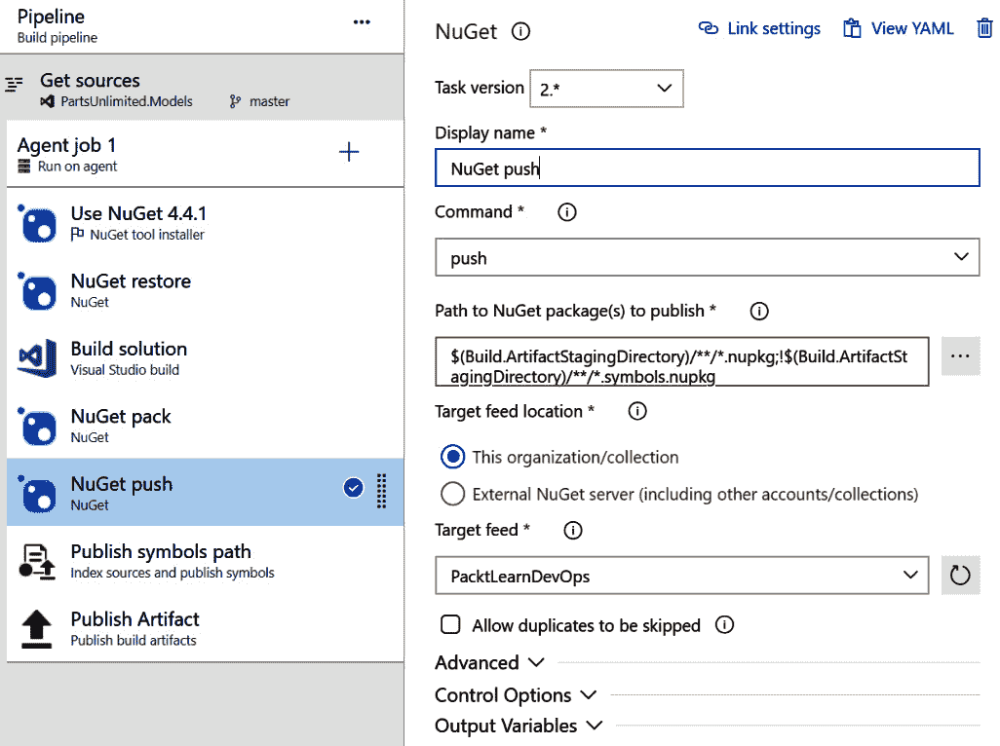

    图 7.12 – 添加 NuGet 推送任务

1.  从顶部菜单选择**保存并排队**，然后选择**保存并运行**。等待构建管道成功完成。

1.  最后，让我们检查一下包是否成功发布。点击左侧菜单中的**Artifacts**。你会看到包已成功推送到源中：


图 7.13 – 推送的包

现在我们有了一个带有模型的包，我们可以在 Visual 项目中使用它。在接下来的部分，我们将创建一个应用程序并从 Azure DevOps 的源中消费该包。

# 从 Artifacts 源中消费包

现在，我们的**PartsUnlimited.Models**包已经推送到 Artifacts 中的源，我们可以从 Visual Studio 中消费这个包。在这一部分，我们将创建一个新的控制台应用程序，并从那里连接到源。

因此，我们需要执行以下步骤：

1.  打开 Visual Studio 2019 并创建一个新的 .NET Core 控制台应用程序：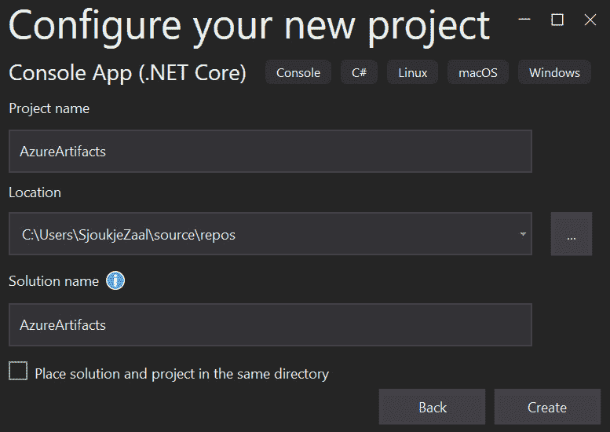

    图 7.14 – 创建新的控制台包

1.  应用程序创建完成后，导航到 Azure DevOps，从左侧菜单选择**Artifacts**。

1.  从顶部菜单选择**连接到源**：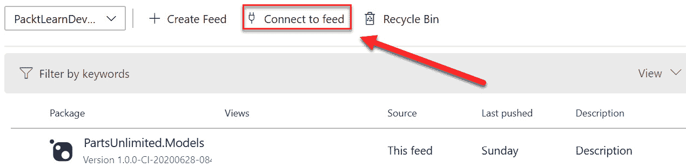

    图 7.15 – 连接到源

1.  在下一个屏幕中，从列表中选择**Visual Studio**。我们将使用这些设置在下一步中设置机器：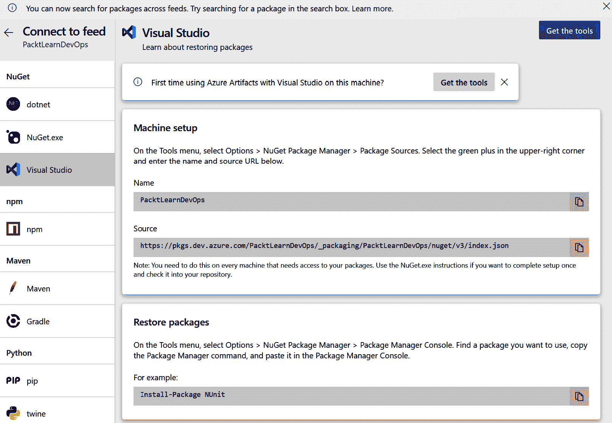

    图 7.16 – Visual Studio 机器设置

1.  返回到 Visual Studio 中的控制台应用程序。然后，从顶部菜单选择**工具** > **NuGet 包管理器** > **管理解决方案的 NuGet 包**：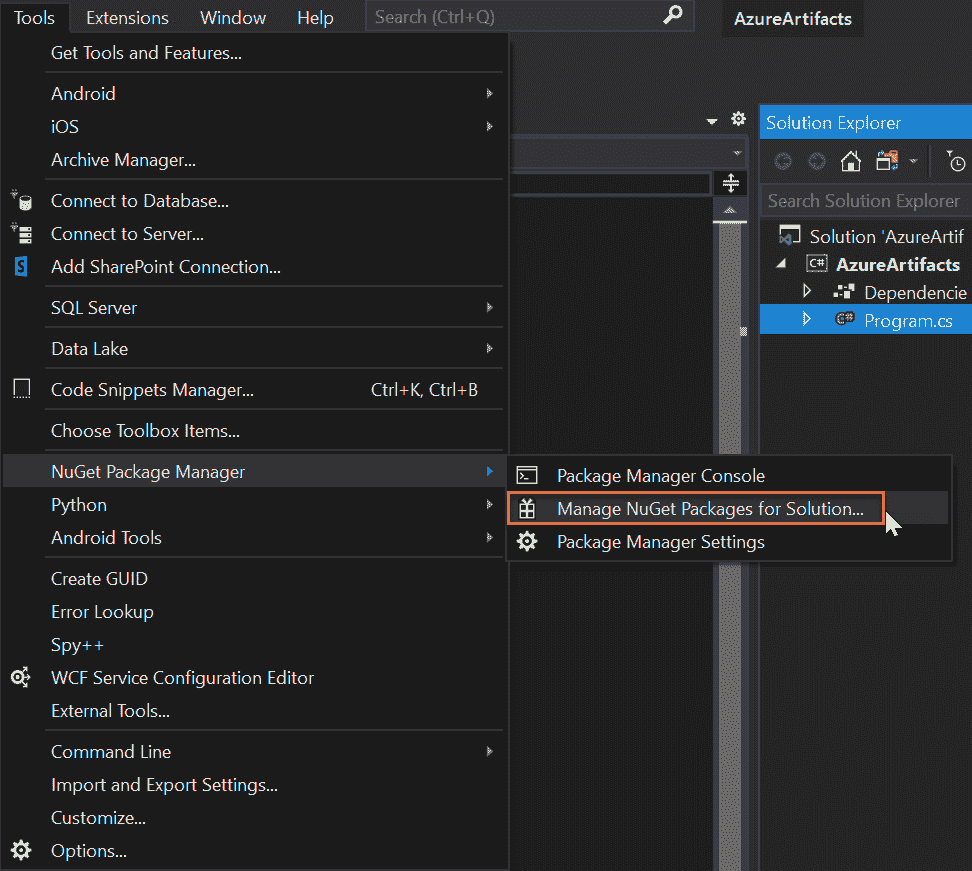

    图 7.17 – NuGet 包安装器

1.  要将源添加到项目中，点击设置图标：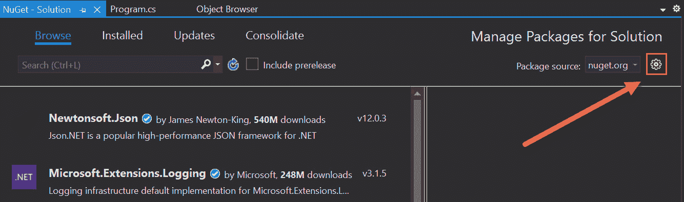

    图 7.18 – NuGet 设置

1.  点击`https://pkgs.dev.azure.com/PacktLearnDevOps/_packaging/PacktLearnDevOps/nuget/v3/index.json`。

    添加这些值后的结果如下所示：

    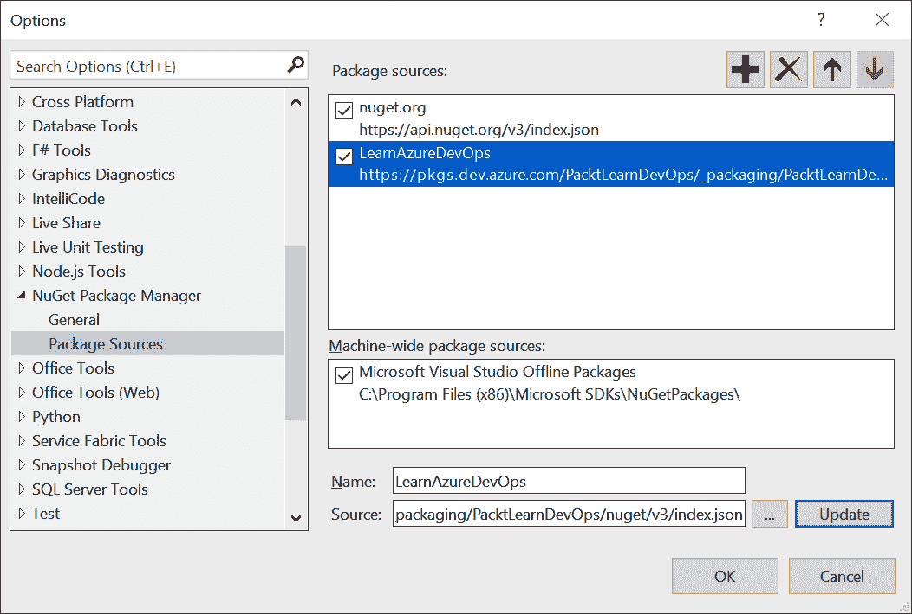

    图 7.19 – 添加源的包源

1.  点击**更新**，然后点击**确定**。

1.  现在，我们可以在应用程序中消费这个源。在 NuGet 包管理器中，选择我们刚刚添加的包源。确保勾选**包括预发布版本**，因为这个包尚未发布：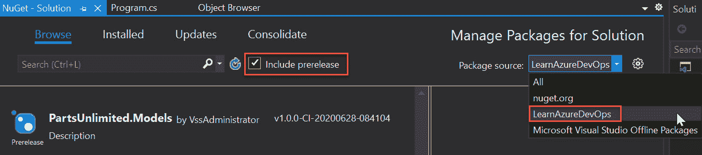

    图 7.20 – 选择包源

1.  选择包并将其安装到项目中。

1.  现在，我们可以在代码中引用该包并使用模型类。添加 `using` 语句，并通过以下代码替换 `Program.cs` 文件中的代码，创建一个新的 `CarItem`：

    ```
    using System;
    using PartsUnlimited.Models;
    namespace AzureArtifacts
    {
        class Program
        {
            static void Main(string[] args)
            {
                Console.WriteLine("Hello World!");
                CartItem caritem = new CartItem()
                {
                    CartId = "1",
                    Count = 10,
                    DateCreated = DateTime.Now,
                    Product = new Product()
                    {
                        Title = "Product1"
                    },
                    ProductId = 21
                };
            }
        }
    }
    ```

在这个演示中，我们使用的是从 feed 自动构建和发布的包。在本章的下一部分也是最后一部分中，我们将探讨如何使用 WhiteSource Bolt 扫描包中的漏洞。

# 使用 WhiteSource Bolt 扫描包中的漏洞

WhiteSource Bolt 可直接从构建管道扫描包中的漏洞。它是一个开发者工具，用于扫描应用代码以及开源应用和包中的安全漏洞。它提供了可以通过 Azure DevOps 市场和 GitHub 安装的扩展。WhiteSource Bolt 可以免费下载，但此版本每天每个仓库的扫描次数限制为五次。

重要提示

关于 WhiteSource Bolt 的更多信息，您可以参考以下网站：[`bolt.whitesourcesoftware.com/`](https://bolt.whitesourcesoftware.com/)。

在本节中，我们将安装扩展到我们的 Azure DevOps 项目中，并将其自带的任务实施到现有的构建管道中。让我们开始吧：

1.  打开浏览器并访问 [`marketplace.visualstudio.com/`](https://marketplace.visualstudio.com/)。

1.  在搜索框中搜索 WhiteSource Bolt 并选择 **WhiteSource Bolt** 扩展：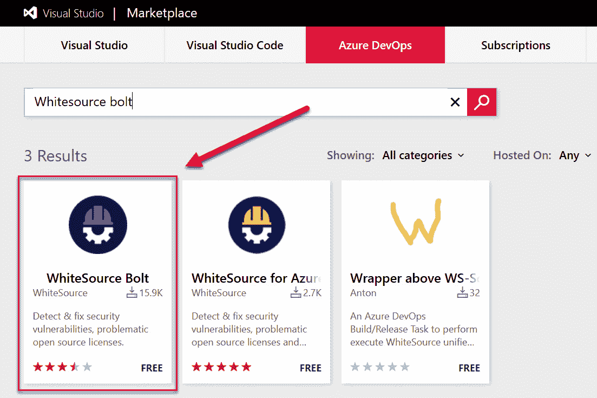

    图 7.21 – 安装 WhiteSource Bolt

1.  通过选择组织并点击 **安装** 按钮，在您的 DevOps 组织中安装扩展：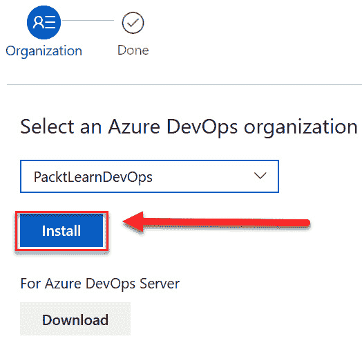

    图 7.22 – 在您的组织中安装扩展

1.  安装包后，返回到 **Azure DevOps** > **Pipelines**。您将看到 **WhiteSource Bolt** 已添加到菜单中。选择它：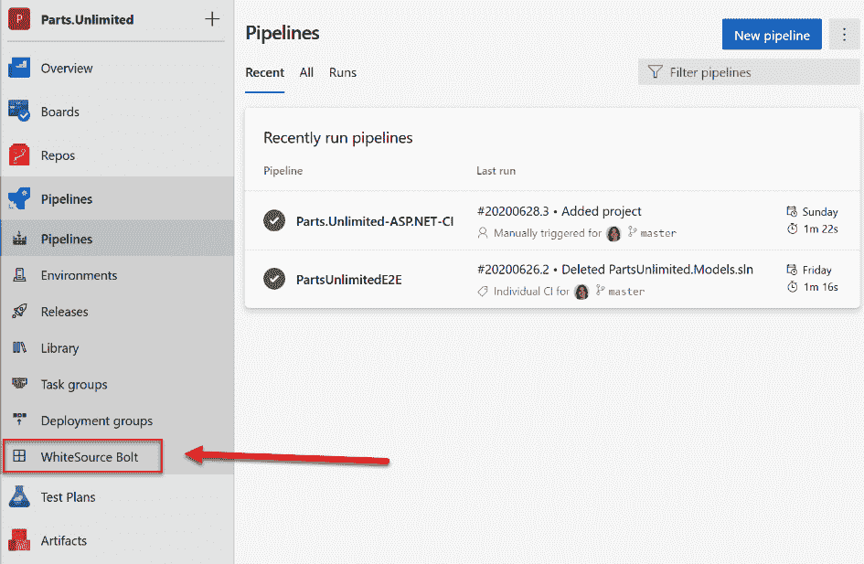

    图 7.23 – WhiteSource Bolt 菜单项

1.  在 **设置** 页面上，指定工作邮箱地址、公司名称和国家/地区。然后，点击 **开始使用** 按钮：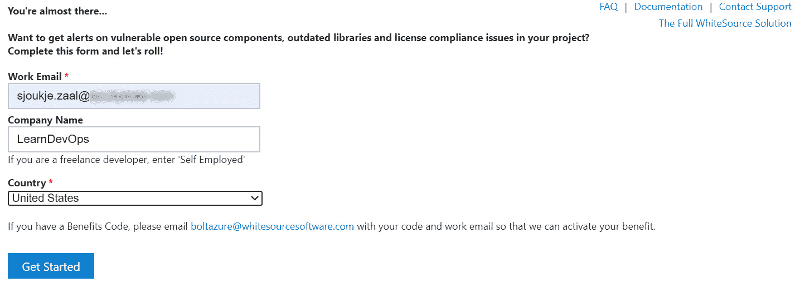

    图 7.24 – WhiteSource Bolt 设置

1.  我们现在可以在管道中使用 WhiteSource Bolt 任务了。选择我们在 *创建构建管道* 部分中创建的构建管道。现在，编辑管道。

1.  再次向管道中添加一个新任务，就像我们在 *创建构建管道* 部分中所做的那样，搜索 **WhiteSource Bolt**，并将该任务添加到管道中：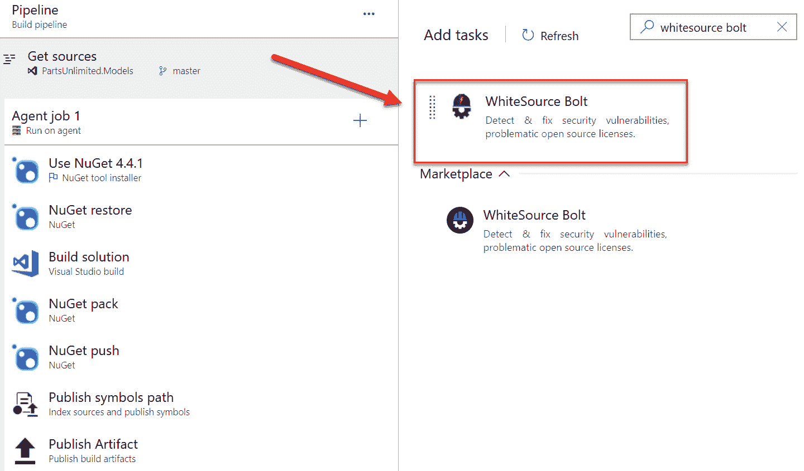

    图 7.25 – 添加 WhiteSource Bolt 任务

1.  将任务拖动到**构建解决方案**任务的下方，因为我们希望在将包打包并推送到 Artifact feed 之前扫描解决方案。效果如下图所示：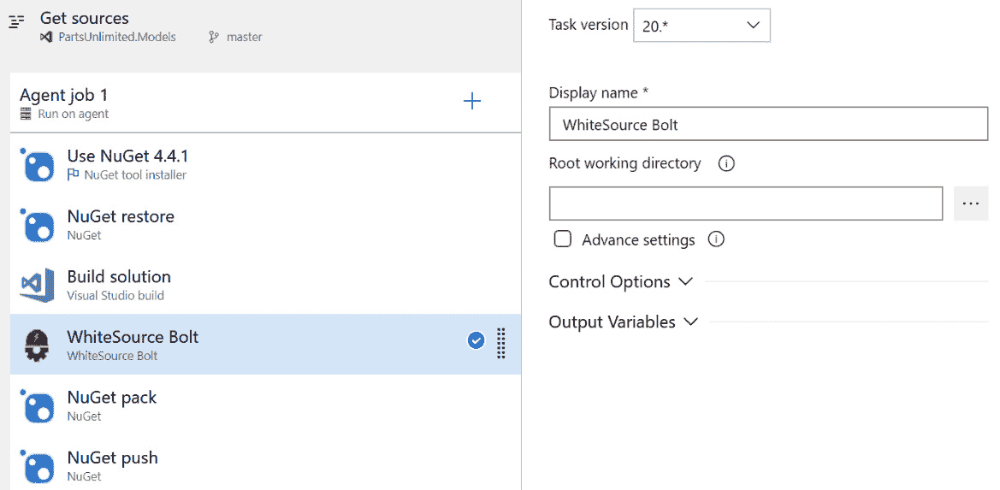

    Figure 7.26 – 构建管道概述

1.  您不必指定任何配置值；此任务将在没有它们的情况下运行。

1.  从顶部菜单中，选择**保存并排队**，然后选择**保存并运行**。等到构建管道成功完成。

1.  再次转到顶部菜单，选择**WhiteSource Bolt Build Support**。在那里，您将看到扫描的概述：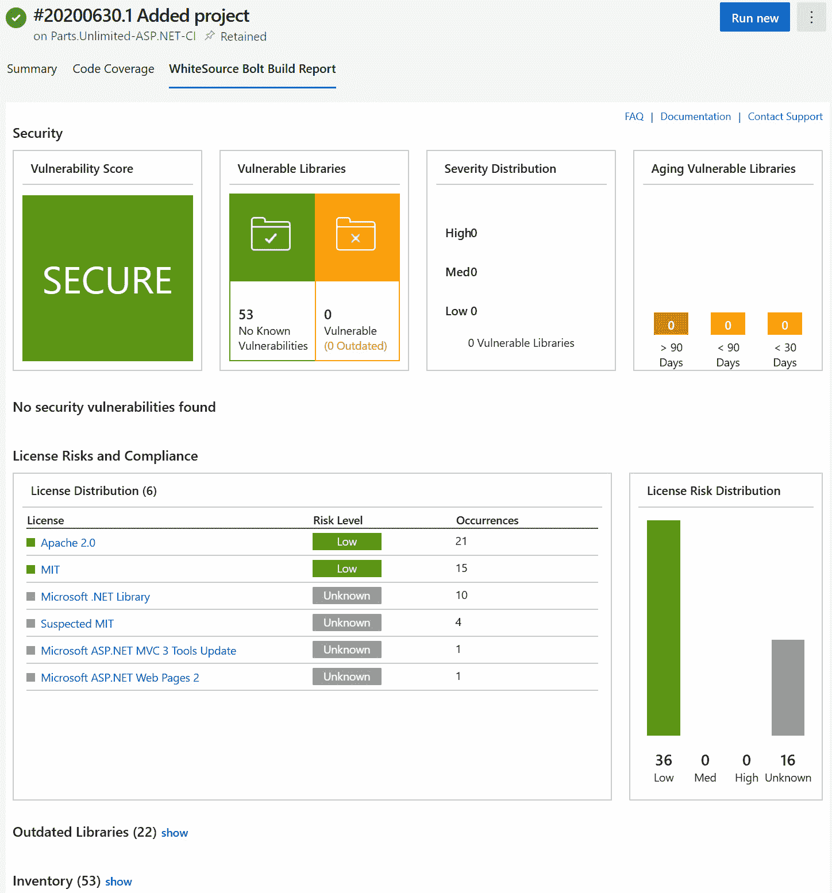

Figure 7.27 – WhiteSource Bolt 漏洞报告

通过此操作，我们已安装了 WhiteSource Bolt 扩展，并在将 NuGet 包打包并推送到 Azure Artifacts 的 feed 之前扫描了我们的解决方案中的漏洞。

这章就到这里了。

# 总结

在本章中，我们更深入地了解了 Azure Artifacts。首先，我们设置了一个 feed，并使用**PartsUnlimited**项目中的模型类创建了一个新的 NuGet 包。然后，我们创建了一个构建管道，在构建过程中自动打包并将包推送到 feed 中。最后，我们使用 Azure 市场上的 WhiteSource Bolt 扩展来扫描包中的漏洞。

在下一章中，我们将重点介绍如何使用发布管道在 Azure DevOps 中部署应用程序。

# 进一步阅读

查看以下链接以获取本章涵盖的更多信息：

+   什么是 Azure Artifacts？：[`docs.microsoft.com/zh-cn/azure/devops/artifacts/overview?view=azure-devops`](https://docs.microsoft.com/zh-cn/azure/devops/artifacts/overview?view=azure-devops)

+   在 Azure DevOps Services 和 TFS 中开始使用 NuGet 包：[`docs.microsoft.com/zh-cn/azure/devops/artifacts/get-started-nuget?view=azure-devops`](https://docs.microsoft.com/zh-cn/azure/devops/artifacts/get-started-nuget?view=azure-devops)
