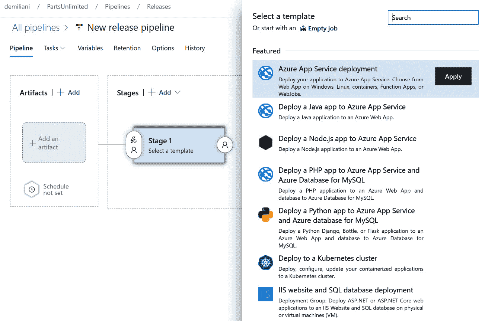
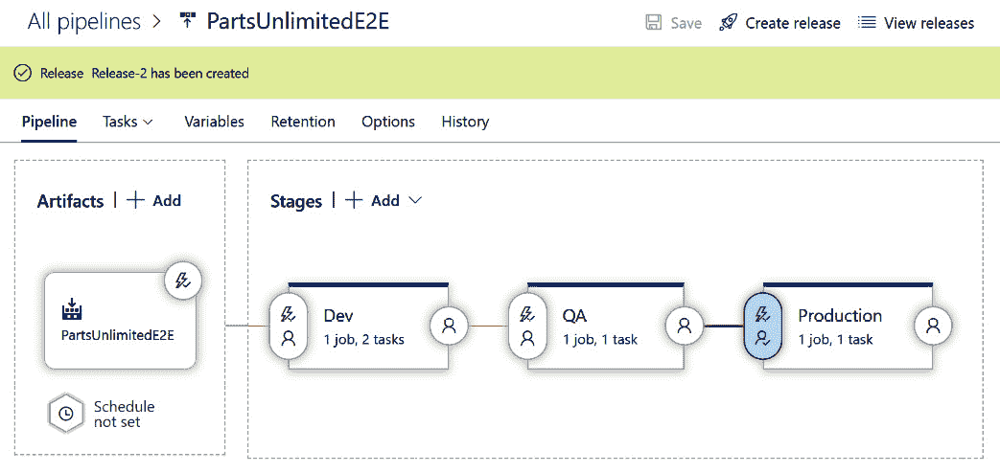
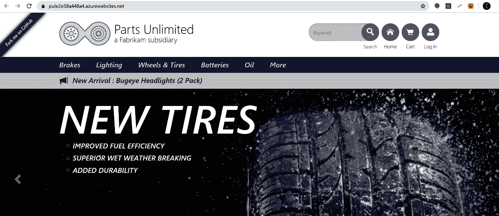

第八章：

# 使用 Azure DevOps 部署应用程序

在前几章中，我们看到如何通过使用构建流水线自动化代码的开发过程。但软件生命周期中一个重要的部分是发布阶段。在本章中，我们将介绍发布流水线的概述；我们将学习如何使用 Azure DevOps 创建发布流水线，以及如何通过使用发布审批和多阶段流水线自动化和改进解决方案的部署。

本章将涵盖以下内容：

+   发布流水线概述

+   使用 Azure DevOps 创建发布流水线

+   在发布流水线上配置持续部署

+   创建多阶段发布流水线

+   使用审批和门控控制你的发布过程

+   使用环境和部署组

+   使用基于 YAML 的流水线进行发布

# 技术要求

要跟随本章内容，你需要有一个有效的 Azure DevOps 组织。本章中使用的组织是我们在*第一章*中创建的**PartsUnlimited**组织，*Azure DevOps 概述*。

# 发布流水线概述

**发布流水线**允许你实现软件生命周期中的持续交付阶段。通过发布流水线，你可以自动化测试过程，并将你的解决方案（提交的代码）交付到最终环境或直接交付到客户现场（持续交付和持续部署）。

通过**持续交付**，你将代码交付到某个环境进行测试或质量控制，而**持续部署**则是将代码发布到最终生产环境的阶段。

发布流水线可以手动触发（你决定何时部署代码），也可以根据事件触发，如主分支上的代码提交、阶段完成后（例如，生产测试阶段），或根据计划触发。

发布流水线通常连接到**工件存储**（应用程序的可部署组件和构建的输出）。工件存储包含一组构建的工件（不同版本的工件），而发布流水线则取这些工件并提供所需的基础设施和步骤来部署这些工件。

发布流水线（正如我们在*第四章*中所看到的，*理解 Azure DevOps 流水线*，针对构建流水线定义）由不同的阶段（可以独立运行的流水线部分）组成，每个阶段由**作业**和**任务**组成。

发布流水线的架构如下：


图 8.1 – 发布流水线架构

正如你在上面的图示中看到的，发布流水线从工件（成功完成构建的输出）开始，然后在各个阶段之间移动，执行作业和任务。

在 Azure DevOps 中，发布管道按以下步骤执行：

1.  当触发部署请求时，Azure Pipelines 会检查是否需要预部署审批阶段，并最终将审批通知发送给团队中相关人员。

1.  经批准后，部署作业会排队并等待代理程序。

1.  能够运行此部署作业的代理程序将获取该作业。

1.  代理程序会下载发布管道定义中指定的工件。

1.  代理程序运行部署作业中定义的任务，并为每个步骤创建日志。

1.  当某个阶段的部署完成后，Azure Pipelines 会执行后部署审批（如果有的话）。

1.  然后部署进入下一个阶段。

在发布管道中，工件被部署到**环境**（你的最终应用将运行的地方），这些环境可以是以下几种：

+   你公司网络上的一台机器

+   云中的一台虚拟机

+   一个容器化环境，例如 Docker 或 Kubernetes

+   一种托管服务，例如 Azure 应用服务

+   无服务器环境，例如 Azure Functions

定义 Azure Pipelines 环境的一种方式是使用 YAML 文件，你可以在其中包含一个环境部分，指定你将部署工件的 Azure Pipelines 环境，或者使用经典的基于 UI 的编辑器

在接下来的部分，我们将详细了解如何使用 Azure DevOps UI 定义发布管道。

# 使用 Azure DevOps 创建发布管道

实现完整 CI/CD 流程的最终目标是自动化将软件部署到最终环境（例如，最终客户），为了实现这一目标，你需要创建一个**发布管道**。

发布管道将构建产物（构建过程的结果）部署到一个或多个最终环境。

要创建我们的第一个发布管道，我们将使用之前在 Azure DevOps 上部署的**PartsUnlimited** Web 应用项目：

1.  要在 Azure DevOps 中创建发布管道，请点击左侧菜单中的**管道**，选择**发布**，然后点击**新建发布管道**:

    图 8.2 – 创建新发布管道

1.  在右侧出现的**选择模板**列表中，你可以看到一组可用模板，用于创建适用于不同类型应用和平台的发布。对于我们的应用，选择**Azure 应用服务部署**，然后点击**应用**:

    图 8.3 – 发布管道模板选择

1.  现在，为将包含发布任务的阶段提供一个名称。在这里，我将其命名为 `Deploy to cloud`:

    图 8.4 – 阶段名称

1.  在**阶段**部分，点击**1 个任务，1 个工作**链接。在这里，你需要提供你的应用程序将要部署的 Azure Web 应用环境的设置，例如 Azure 订阅和应用服务实例（Web 应用），其中代码将被部署：


图 8.5 – 阶段设置

你现在已经定义了发布管道的阶段（单阶段）。在下一部分，我们将看到如何为发布管道指定工件。

定义发布管道的工件

**工件**是所有必须部署到最终环境中的项目（构建的输出），Azure Pipelines 可以部署来自不同工件源的工件：

1.  要选择工件，在主发布管道屏幕上，点击**添加工件**：

    图 8.6 – 向发布管道添加工件

1.  在**添加工件**面板中，**源类型**默认设置为**构建**（这意味着你正在部署构建管道的输出）。在这里，你需要选择你想作为源的构建管道（发布工件的构建管道的名称或 ID；这里我使用的是**PartsUnlimitedE2E**构建管道）和默认版本（默认版本将在创建新发布时部署。对于手动创建的发布，版本可以在发布创建时更改）：

    图 8.7 – 添加工件

1.  点击**添加**按钮保存工件配置，然后点击右上角的**保存**按钮保存你的发布管道：


图 8.8 – 保存发布管道

你的发布管道现在已经准备就绪。在下一部分，我们将看到如何创建 Azure DevOps 发布过程。

## 创建 Azure DevOps 发布

在定义了发布管道（阶段和工件）之后，我们需要创建一个**发布**。发布只是运行你的发布管道的一次执行：

1.  要创建发布，在发布管道定义页面，点击右上角的**创建发布**按钮：

    图 8.9 – 创建发布

1.  在**创建新发布**页面，接受所有默认值（你需要有一个成功完成的构建，且已创建工件），然后点击**创建**：

    图 8.10 – 创建发布

1.  一个新的发布已创建，你会看到一个绿色的进度条，表示：

    图 8.11 – 发布已创建

1.  现在，你可以点击发布名称（这里是**Release-1**），你将被重定向到发布过程的详细信息：

    图 8.12 – 发布详情

1.  如果你点击阶段，你可以看到每个步骤的详细信息：


图 8.13 – 阶段详细信息

你已经完成了第一个发布管道。在这里，我们手动触发了它。在下一部分，我们将看到如何在管道中使用变量。

### 在发布管道中使用变量

在发布管道中，你还可以使用变量和变量组来指定可以在管道任务中使用的变量参数。要为发布管道指定变量，选择**变量**选项卡并指定变量的名称和值：


图 8.14 – 发布管道变量

然后，你可以通过使用`$(VariableName)`符号在管道任务中使用这些变量，如下图所示：


图 8.15 – 在发布管道任务中使用变量

如果你的管道中有会变化的参数，建议使用变量。在下一部分，我们将看到如何为持续部署配置触发器。

## 配置持续部署的发布管道触发器

为了自动化你的应用程序的持续部署，你需要在发布管道定义中配置触发器：

1.  要做到这一点，点击管道**工件**部分的**持续部署触发器**图标：

    图 8.16 – 持续部署触发器

1.  在**持续部署触发器**面板中，启用它以在每次成功完成构建后自动创建新版本，并选择一个分支过滤器（例如，构建管道的默认分支）：

    图 8.17 – 持续部署触发器配置

1.  现在，在**阶段**部分，选择**部署前条件**图标：

    图 8.18 – 部署前条件

1.  在**部署前条件**面板中，检查此阶段的触发器是否设置为**发布后**（这意味着当从此管道创建新发布时，部署阶段将自动开始）：


图 8.19 – 部署前条件定义

在此面板中，你还可以定义其他参数，例如选择触发新部署的工件条件（仅当所有工件条件匹配时，才会将发布部署到此阶段）、设置部署的时间表、允许基于拉取请求的发布部署到此阶段、选择可以批准或拒绝部署到此阶段的用户（预部署审批）、定义部署前需要评估的门控，并定义在多个发布排队等待部署时的行为。

你现在已经创建了一个发布管道，它将你的工件通过 Azure DevOps 部署到云，并应用了持续部署触发器和预部署条件检查。

在下一节中，我们将看到如何通过使用多个阶段来改进我们的发布管道。

# 创建一个多阶段发布管道

多阶段发布管道在你想通过多个步骤（例如开发、预发布和生产）发布应用程序时非常有用。一个非常常见的实际场景是，例如，首先将应用程序部署到测试环境。当测试完成后，应用程序会移动到质量验收阶段，然后如果客户接受发布，应用程序会移动到生产环境。

在这里，我们将做相同的事情：从之前创建的单阶段管道开始，我们将创建一个新的发布管道，包含三个阶段，分别为**DEV**、**QA**和**Production**。每个阶段都是我们管道的部署目标：

1.  在之前定义的管道中，作为第一步，我将**部署到云**阶段重命名为**Production**。这将是发布管道的最终阶段。

1.  现在，点击**克隆**操作，将已定义的阶段克隆为一个新阶段：

    ](img/Figure_8.20_B16392.jpg)

    图 8.20 – 克隆一个阶段

1.  一个新的克隆阶段出现在之前创建的阶段后面。将此阶段的名称更改为`QA`：

    ](img/Figure_8.21_B16392.jpg)

    图 8.21 – 克隆的阶段（QA）

1.  现在，我们需要重新组织阶段，因为**QA**阶段必须在**Production**阶段之前执行。要重新组织这些阶段，请选择**QA**阶段并选择预部署条件。在**预部署条件**面板中，将触发器设置为**After release**（而不是**After stage**）：

    ](img/Figure_8.22_B16392.jpg)

    图 8.22 – QA 阶段的预部署条件

1.  如你所见，管道图现在发生了变化（你现在有**QA**和**Production**阶段并行执行）。现在，选择**Production**阶段的**预部署条件**属性；将触发器设置为**After stage**，并选择**QA**作为阶段：

    ](img/Figure_8.23_B16392.jpg)

    图 8.23 – Production 阶段的预部署条件

1.  现在，阶段已按我们想要的顺序排列（**QA** 发生在 **Production** 之前）。

1.  此时，我们有两个阶段将应用部署到相同的环境（**QA** 是作为 **Production** 的克隆创建的）。从 **Tasks** 下拉列表中选择 **QA** 阶段，并将 **App service name** 更改为一个新实例：

    图 8.24 – QA 阶段详情

1.  现在，我们需要重复相同的步骤来创建 **DEV** 阶段。从 **QA** 克隆它，设置其 **Pre-deployment conditions** 属性，将触发器设置为 **After Release**，并将 **QA** 的触发器更改为 **After stage**，选择 **DEV** 作为所选阶段。你的流水线现在将如下所示：


现在，你已经创建了一个包含不同阶段（**Dev**、**QA** 和 **Production**）的发布流水线，用于控制代码的部署步骤。

在下一部分，我们将看到如何在阶段之间移动时添加审批。

# 使用审批和门控来管理部署

如前所述配置，我们的发布流水线只有在前一个阶段成功完成后才会移动到下一个阶段。这对于从 **DEV** 到 **QA** 的过渡是可以的，因为在这个过渡中，我们的应用程序被部署到测试环境，但从 **QA** 到 **Production** 的过渡通常应该受到控制，因为应用程序发布到生产环境通常发生在审批之后。

## 创建审批

让我们按照以下步骤创建审批：

1.  要创建审批步骤，从我们的流水线定义中，选择 **Production** 阶段的 **Pre-deployment conditions** 属性。然后，进入 **Pre-deployment approvals** 部分并启用它。接着，在 **Approvers** 部分，选择将负责审批的用户。请同时检查 **The user requesting a release or deployment should not approve it** 选项未被勾选：

    图 8.26 – 设置审批

1.  点击 **Save** 保存你的流水线定义。

1.  现在，创建一个新的发布以启动我们的流水线，并点击已创建发布的名称（这里叫做 **Release-2**）：

    图 8.27 – 多阶段发布触发

1.  发布流水线启动。**DEV** 和 **QA** 阶段已完成，而在 **Production** 阶段，出现 **Pending approval** 状态：

    图 8.28 – 待批准

1.  发布流水线正在等待审批。你可以点击 **Pending approval** 图标，打开审批对话框。在这里，你可以插入评论，然后批准或拒绝发布：

    图 8.29 – 批准一个阶段

1.  如果需要，你还可以将该阶段推迟到特定日期，或将批准任务重新分配给其他用户。

1.  如果你点击**批准**，该阶段将被批准，发布管道完成：

    图 8.30 – 完成的多阶段管道

1.  如果你现在点击由管道部署的 Azure 应用服务实例，你可以看到最终的代码（**PartsUnlimited** 网站）已部署到云端：

1.  

图 8.31 – 从发布管道部署的 Web 应用程序

## 使用网关检查条件

在之前讲解的场景中，我们了解了如何为发布管道配置手动批准过程。有时，你需要避免手动过程，而是设定一个策略，只有在某些检查成功执行后，管道才可以继续。这就是**网关**发挥作用的地方。

在 Azure Pipelines 中，网关允许你自动检查来自 Azure DevOps 或外部服务的特定条件，然后仅在满足这些条件时才启用发布过程。你可以使用网关来检查项目的工作项和问题状态，并仅在没有开放漏洞时启用发布。你还可以查询测试结果，检查在发布前是否执行了对构件的安全扫描，监控基础设施健康状况等。

作为示例，在这里我们希望为之前创建的发布管道配置一个网关，以便检查 Azure Boards 上的开放漏洞。我们将通过以下步骤来完成此操作：

重要提示

如果有开放漏洞，发布管道无法继续执行。

1.  要检查我们项目中的开放漏洞，我们需要为工作项定义一个查询。从我们的 Azure DevOps 项目中，选择**Boards**，点击**查询**，然后选择**新查询**：

    图 8.32 – 为网关条件创建新查询

1.  在这里，我定义了如下查询：

    图 8.33 – 查询定义

    此查询检查我们项目中的活动漏洞。

1.  通过为查询命名（例如，**ActiveBugs**）并指定一个文件夹（这里我选择了**共享查询**文件夹）来保存查询：

    图 8.34 – 保存查询定义

1.  现在我们准备定义网关。从我们之前创建的多阶段发布管道中，选择**生产**阶段，点击螺栓图标，然后启用网关，如下截图所示：

    图 8.35 – 启用网关

    在这里，你还可以指定评估门控前的延迟（在添加的门控第一次被评估之前的时间。如果没有添加门控，则部署将在指定的持续时间后再继续），我们还可以指定部署门控（添加评估健康参数的门控）。这些门控会并行定期评估，如果门控成功，部署将继续；否则，部署将被拒绝。

1.  要指定我们的门控，点击**添加**，然后选择**查询工作项**（这将执行一个工作项查询并检查结果）：

    图 8.36 – 门控定义（查询工作项）

1.  现在，选择 `0`（查询中匹配的工作项的最大数量），因为我们希望发布管道仅在没有活动错误时才完成：


图 8.37 – 指定门控条件

在这里，你还可以定义评估选项，如 `0` 表示当所有门控在同一评估周期内成功时，部署将继续；**门控失败后的超时**（门控的最大评估周期；如果门控在达到超时之前未成功，部署将被拒绝）。

我们的门控现在已经定义并启用了。你还可以定义其他类型的门控，甚至可以有调用 Azure Functions 来评估发布条件的门控（如果你想将发布检查与外部系统的特定条件集成，这会非常有用）。

## 使用部署组

**部署组**是一组每台机器上都安装了部署代理的机器。每个部署组代表一个物理环境，并定义了一个并行部署的目标机器逻辑组。

你可以在 Azure DevOps 中定义一个部署组，通过进入**管道**部分并选择**部署组**：


图 8.38 – 创建部署组

在这里，你可以添加已安装构建和发布代理的服务器。

每个创建的部署组都是**部署池**的一部分，并且此池也可以跨项目共享。部署组只能用于发布管道。

你可以通过进入发布管道编辑器，选择作业，并点击三点按钮来添加部署组作业。在这里，你可以看到**添加部署组作业**选项：


图 8.39 – 添加部署组作业

在写作时，YAML 管道尚不支持部署组作业。

# YAML 发布管道与 Azure DevOps

Azure DevOps 最近新增的一个功能是通过使用 YAML 定义发布流水线的选项（之前这仅限于 CI 部分）。现在，通过使用多阶段流水线，你可以使用统一的 YAML 体验来配置 Azure DevOps 流水线，涵盖 CI、CD 和 CI/CD。

定义发布 YAML 流水线可以按照*第四章*中描述的方式进行，*理解 Azure DevOps 流水线*。然而，有一些概念需要理解，例如**环境**。

**环境**是流水线所针对的一组资源——例如，Azure Web Apps、虚拟机或 Kubernetes 集群。你可以使用环境来按范围对资源进行分组——例如，你可以创建一个名为**development**的环境，用于存放开发资源，创建一个名为**production**的环境，用于存放生产资源。可以通过进入**Pipelines**下的**Environments**部分来创建环境：


图 8.40 – 创建环境

以下是一个多阶段发布流水线的示例，用于将.NET Core 应用程序部署到 Azure Web Apps：

```
stages:
```

```
	- stage: Build_Source_# Build Source Code for Dotnet Core Web App
```

```
	  jobs:
```

```
	  - job: Build
```

```
	    pool: 'Hosted VS2017'
```

```
	    variables:
```

```
	      buildConfiguration: 'Release' 
```

```
	    continueOnError: false
```

```
	    steps:
```

```
	    - task: DotNetCoreCLI@2
```

```
	      inputs:
```

```
	        command: build
```

```
	        arguments: '--configuration $(buildConfiguration)'
```

```
	    - task: DotNetCoreCLI@2
```

```
	      inputs:
```

```
	        command: publish
```

```
	        arguments: '--configuration $(buildConfiguration) --output $(Build.ArtifactStagingDirectory)'
```

```
	        modifyOutputPath: true
```

```
	        zipAfterPublish: true
```

```
	    - task: PublishBuildArtifacts@1
```

```
	      inputs:
```

```
	        path: $(Build.ArtifactStagingDirectory)
```

```
	        artifact: drop
```

```
	- stage: Deploy_In_Dev # Deploy artifacts to the dev environment
```

```
	  jobs:
```

```
	  - deployment: azure_web_app_dev
```

```
	    pool: 'Hosted VS2017'
```

```
	    variables:
```

```
	      WebAppName: 'PartsUnlimited-dev'
```

```
	    environment: 'dev-environment'
```

```
	    strategy:
```

```
	      runOnce:
```

```
	        deploy:
```

```
	          steps:
```

```
	          - task: AzureRMWebAppDeployment@4
```

```
	            displayName: Azure App Service Deploy
```

```
	            inputs:
```

```
	              WebAppKind: webApp
```

```
	              ConnectedServiceName: 'pay-as-you-go'
```

```
	              WebAppName: $(WebAppName)
```

```
	              Package: $(System.WorkFolder)/**/*.zip
```

```
	- stage: Deploy_In_QA # Deploy artifacts to the qa environment
```

```
	  jobs:
```

```
	  - deployment: azure_web_app_qa
```

```
	    pool: 'Hosted VS2017'
```

```
	    variables:
```

```
	      WebAppName: 'PartsUnlimited-qa'
```

```
	    environment: 'qa-environment'
```

```
	    strategy:
```

```
	      runOnce:
```

```
	        deploy:
```

```
	          steps:
```

```
	          - task: AzureRMWebAppDeployment@4
```

```
	            displayName: Azure App Service Deploy
```

```
	            inputs:
```

```
	              WebAppKind: webApp
```

```
	              ConnectedServiceName: 'pay-as-you-go'
```

```
	              WebAppName: $(WebAppName)
```

```
	              Package: $(System.WorkFolder)/**/*.zip
```

```
	- stage: Deploy_In_Production # Deploy artifacts to the production environment
```

```
	  jobs:
```

```
	  - deployment: azure_web_app_prod
```

```
	    pool: 'Hosted VS2017'
```

```
	    variables:
```

```
	      WebAppName: 'PartsUnlimited'
```

```
	    environment: 'prod-environment'
```

```
	    strategy:
```

```
	      runOnce:
```

```
	        deploy:
```

```
	          steps:
```

```
	          - task: AzureRMWebAppDeployment@4
```

```
	            displayName: Azure App Service Deploy
```

```
	            inputs:
```

```
	              WebAppKind: webApp
```

```
	              ConnectedServiceName: 'pay-as-you-go'
```

```
	              WebAppName: $(WebAppName)
```

```
	              Package: $(System.WorkFolder)/**/*.zip
```

如前面的 YAML 文件所示，流水线定义了四个阶段：**Build Source**、**Deploy in Dev**、**Deploy in QA**和**Deploy in Production**。在每个阶段，应用程序都会在指定的环境中部署。

# 总结

在本章中，我们对如何在 Azure DevOps 中使用发布流水线进行了全面的概述。

我们为**PartsUnlimited**项目创建了一个基本的发布流水线，定义了工件，并通过添加持续部署条件创建了我们的第一个发布。

然后，我们通过使用多个阶段（**DEV**、**QA**和**Production**）来改进我们的流水线定义，在本章的最后，我们展示了如何定义审批和控制点，以更受控的方式管理代码的发布，并介绍了基于 YAML 的发布流水线的相关概念。

在下一章，我们将看到如何将 Azure DevOps 与 GitHub 集成。
