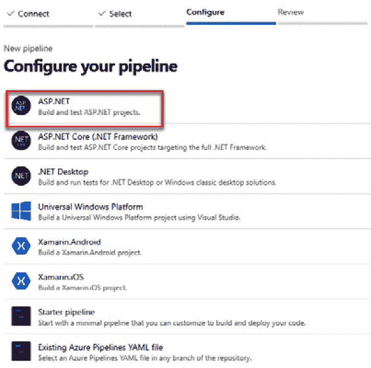
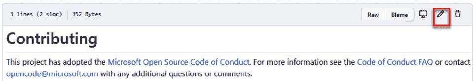
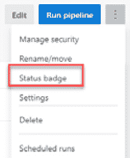
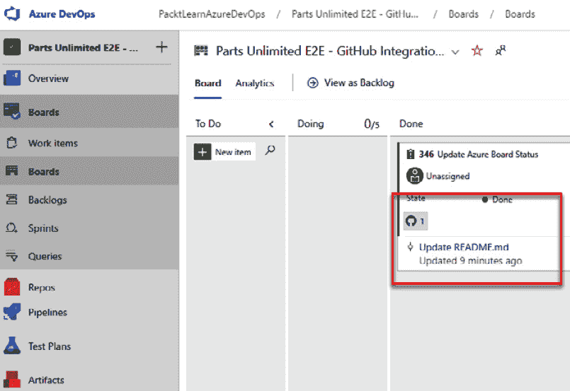

第九章：

# 第十章：将 Azure DevOps 与 GitHub 集成

GitHub 是全球最受欢迎的开发平台之一，被开源开发者和企业广泛使用来存储代码。在本章中，你将学习如何在继续使用 GitHub 作为软件开发中心的同时，利用 Azure DevOps 的能力。

我们将涵盖以下主题：

+   Azure DevOps 和 GitHub 集成概述

+   将 Azure Pipelines 与 GitHub 集成

+   将 Azure Boards 与 GitHub 集成

+   GitHub Actions 概述

# 技术要求

为了跟随本章内容，你需要拥有一个有效的 Azure DevOps 组织和一个 GitHub 账户。你可以在此注册 GitHub 账户：[`github.com/join`](https://github.com/join)。

让我们准备好本章的前提条件。本章要求你已经将**Parts Unlimited** GitHub 仓库克隆到你的 GitHub 账户中。你还需要一个 Azure DevOps 项目来跟随本章的示例。在继续到下一部分之前，请先完成以下步骤：

1.  启动浏览器实例并访问 [`github.com/microsoft/PartsUnlimitedE2E`](https://github.com/microsoft/PartsUnlimitedE2E)。

1.  点击 **Fork**，如下图所示：

    图 9.1 – GitHub 仓库：Parts Unlimited

1.  如果你尚未登录，GitHub 会提示你登录到你的账户。选择你希望将仓库克隆到的账户。

1.  完成此操作需要几分钟的时间。完成后，你应该能在你的账户中看到该仓库。

1.  本章我们将使用这个仓库来测试 GitHub 集成。

1.  现在，登录到 Azure DevOps ([`dev.azure.com`](https://dev.azure.com)) 并创建一个新的空项目：

图 9.2 – 创建新项目

现在你已经准备好尝试本章中描述的示例。

# Azure DevOps 和 GitHub 集成概述

GitHub 和 Azure DevOps 是互补的，它们为团队提供卓越的软件开发体验，使团队能够以更快的速度和更少的努力发布和交付软件。在许多场景中，GitHub 和 Azure DevOps 是竞争对手（例如，Azure Repos 与 GitHub 仓库），因此通常由你来选择适合自己需求的工具，并将它们集成在一起，构建一个完善的平台。

Azure DevOps 提供了多种 RBAC 级别、原生企业身份集成等功能，而 GitHub 则提供了跨身份的简单协作（在其企业版中包括 AD 集成）。

在持续集成/持续开发方面，Azure DevOps 相较于其竞争对手 GitHub Actions 处于领先地位，且已经成熟。因此，是否选择 Azure DevOps 和/或 GitHub 来处理你软件开发生命周期中的特定组件，取决于你的使用场景和需求。

GitHub 包含一个扩展市场，您可以在其中找到许多第三方应用程序，以将 GitHub 扩展到您使用的应用程序。Azure DevOps 集成可以通过 GitHub Marketplace 上的许多扩展来实现。让我们来看一些扩展。

GitHub 和 Azure DevOps 的集成通过 Azure Boards 和 Azure Pipelines 扩展来实现。让我们先看看在 GitHub Marketplace 中可以找到的 Azure DevOps 扩展：

1.  启动浏览器并访问[`github.com/marketplace`](https://github.com/marketplace)。

1.  在扩展市场中搜索`Azure`。您将找到许多可以将 Azure 解决方案与您的 GitHub 仓库集成的扩展。

1.  在这里，我们关心两个特定的扩展：Azure Boards 和 Azure Pipelines。稍后我们会详细讲解：

    --**Azure Boards**：这个扩展允许您将 Azure Boards 工作项与 GitHub 对象（如提交、拉取请求和问题）关联：

图 9.3 – Azure Boards 扩展

--**Azure Pipelines**：这个扩展使您可以在 GitHub 仓库中存储和维护代码的同时，使用 Azure Pipelines 构建和发布软件：

图 9.4 – Azure Pipelines 扩展

您可以从 GitHub Marketplace 安装这些扩展，并从 GitHub 本身开始配置，但在本章中，我们将从 Azure DevOps 开始集成过程。GitHub 和 Azure DevOps 的集成也支持这两个产品的本地版本（GitHub 本地和 Azure DevOps Server）。

# 将 Azure Pipelines 与 GitHub 集成

将 Azure Pipelines 与 GitHub 集成使开发人员能够继续使用 GitHub 作为首选的源代码管理平台，同时利用 Azure Pipelines 的构建和发布功能。Azure Pipelines 为开源项目提供无限制的管道作业分钟数。

我们在本书前面详细介绍了 Azure Pipelines，所以在这一部分，我们将看看如何将 Azure Pipelines 配置和源代码存储在 GitHub 中，并利用 GitHub 和 Azure DevOps 构建 CI/CD 流程。

## 设置 Azure Pipelines 和 GitHub 集成

为了在 GitHub 上使用 Azure Pipelines，您必须授权 Azure Pipelines 访问您的 GitHub 仓库。让我们来看看如何进行授权：

1.  登录您的 Azure DevOps 账户并选择我们在*技术要求*部分创建的项目。

1.  点击**Pipelines** > **创建管道**：

    ](img/Figure_9.05_B16392.jpg)

    图 9.5 – 创建管道

1.  选择**GitHub**作为您的代码源位置：

    ](img/Figure_9.06_B16392.jpg)

    图 9.6 – Azure Pipelines 的 GitHub 源

1.  您需要从 Azure Pipelines 向您的 GitHub 账户授予权限：

    ](img/Figure_9.07_B16392.jpg)

    图 9.7 – 授权 Azure Pipelines（OAuth）

1.  成功完成后，你将在 Azure DevOps 中看到你的 GitHub 仓库列表。选择新创建的**PartsUnlimitedE2E**仓库：

    图 9.8 – Parts Unlimited 仓库

1.  你现在会得到在 GitHub 帐户中安装 Azure Pipelines 应用程序的选项。你可以选择仅为特定仓库安装，或为所有仓库安装。做出选择后，点击**批准并安装**：

    图 9.9 – 安装 Azure Pipelines 扩展

1.  由于**Parts Unlimited**是一个基于 ASP.NET 的应用程序，请选择**ASP.NET**作为你的管道配置模板：

    图 9.10 – Azure Pipelines 任务配置

1.  Azure DevOps 将自动生成一个管道 YAML 文件。你可以根据需求查看并修改它。`vs2017-win2016`继续：

    图 9.11 – Azure Pipelines 任务 YAML

1.  点击**保存并运行**以保存管道。

1.  你需要向仓库提交一次更改，以存储管道 YAML 文件。你可以提交到主分支，或者创建一个新分支来进行此操作：

    图 9.12 – 运行 Azure 管道

1.  点击**保存并运行**将创建管道并开始执行。构建任务完成可能需要几分钟：

    图 9.13 – 管道任务

1.  在此过程中完成时，我们来看看你对 GitHub 仓库所做的更改。浏览到你的 GitHub 帐户并进入**PartsUnlimitedE2E**仓库。

1.  你将看到一次提交以及一个新添加的`azure-pipelines.yml`文件，它存储着管道的配置：

    图 9.14 – GitHub 中的管道 YAML

1.  如果你点击前面截图中显示的小黄色圆点，你将看到 GitHub 仓库页面上 Azure 管道的状态。在管道任务成功完成后，你应该能看到它在 GitHub 帐户上的状态更新：

图 9.15 – GitHub 中的任务日志

这样，你就已经设置好了一个带有 GitHub 的 Azure 管道。

## 测试持续集成

在本节中，我们将尝试 GitHub 和 Azure Pipelines 的 CI 功能。我们将在 GitHub 中做出代码更改并提交拉取请求，这将自动触发 Azure Pipelines 任务。

让我们开始吧：

1.  浏览到你的 GitHub 帐户并打开**PartsUnlimited E2E**仓库。

1.  点击`Readme.MD`并点击**编辑**：

    图 9.16 – Readme.MD

1.  更新文件，使其包含一些示例文本。选择创建新分支的选项并单击**提出更改**：

    图 9.17 – 提出更改

1.  单击创建拉取请求，如下图所示：

    图 9.18 – 创建拉取请求

1.  这将打开**拉取请求**页面。Azure Pipelines 作业将花费几分钟时间启动。一旦启动，您可以单击**详细信息**查看流水线作业的状态：

    图 9.19 – 拉取请求自动化检查

1.  这就完成了对 GitHub 和 Azure Pipelines 持续集成功能的测试。正如我们所看到的，Azure Pipelines 与 GitHub 集成得非常好，并提供了全新的 DevOps 体验。您可以合并拉取请求来完成此过程。

## 添加构建状态徽章

Azure Pipelines 提供了可以在 GitHub 仓库文档中使用的标记文本，以提供项目流水线作业的状态。这可以帮助开发人员随时了解流水线的状态，无需访问 Azure DevOps。

让我们学习如何设置 Azure Pipelines 状态徽章：

1.  登录 Azure DevOps 并浏览到**您的项目** > **流水线** > **PartsUnlimited E2E**。

1.  单击省略号（**...**），然后选择**状态徽章**：

    图 9.20 – 状态徽章

1.  复制**示例 markdown**文本框的值。您还可以选择获取特定分支的 markdown。请将此 markdown 保存在临时位置：

    图 9.21 – 状态徽章 URL

1.  现在，在我们可以在 GitHub 中使用它之前，我们必须允许对项目徽章的匿名访问。

1.  单击**项目设置** > **流水线** > **设置**。

1.  关闭**禁用匿名访问徽章**设置。如果您发现该选项是灰色的，请首先在组织设置中关闭此选项：

    图 9.22 – 状态徽章访问

1.  现在，您可以在 GitHub 文档中使用此 markdown。建议您将其保留在您的仓库的 README 文件中，这样任何人都会首先看到它：

    图 9.23 – 状态徽章 markdown

1.  提交更改后，您应该会看到 Azure Pipelines 徽章：

图 9.24 – 状态徽章展示

这样，您就完成了 Azure Pipelines 与 GitHub 的集成。在接下来的部分，我们将看看如何将 Azure Boards 与 GitHub 集成。

# 将 Azure Boards 与 GitHub 集成

Azure Boards 是规划和跟踪工作项的最佳平台。将 Azure Boards 与 GitHub 集成，您可以在继续使用 GitHub 作为源代码管理平台的同时，继续使用 Azure Boards 作为您的规划和管理平台。

通过将 Azure Boards 与 GitHub 集成，您可以将 Azure Boards 中的对象链接到 GitHub。以下是几个示例：

+   工作项和 Git 提交/问题/拉取请求链接意味着您可以将工作项链接到 GitHub 中相应的工作。

+   您可以直接在 GitHub 上更新工作项的状态。

+   总的来说，集成使我们可以轻松地跨两个平台跟踪和链接交付物。

现在，让我们设置 Azure Boards 集成。

## 设置 Azure Boards 和 GitHub 集成

Azure Boards 是 GitHub 市场中的另一个扩展。您可以从 Azure DevOps 和 GitHub 市场配置集成。

让我们通过以下步骤进行设置：

1.  登录到 Azure DevOps，浏览到您的 **Parts Unlimited** 项目 > **项目设置** > **Boards** > **GitHub 连接**：

    图 9.25 – 将 GitHub 连接到 Boards

1.  点击 **连接您的 GitHub 帐户**。您需要授权 Azure Boards 访问您的 GitHub 帐户。成功链接后，您需要选择要连接的 GitHub 组织。

1.  Azure DevOps 会列出您的代码库。请为本项目选择**PartsUnlimited E2E**并点击**保存**：

    图 9.26 – 选择 GitHub 代码库

1.  这将引导您回到 GitHub，安装 Azure Boards 应用程序。您可以选择为特定代码库或所有代码库安装该应用程序：

    图 9.27 – 批准 Azure Boards 扩展

1.  安装 Azure Boards 后，您应该会看到 GitHub 连接列出，并带有绿色勾选标志，表示连接成功：

图 9.28 – GitHub 连接状态

完成后，您已经成功设置了 Azure Boards 和 GitHub 集成。

## 添加 Azure Boards 状态徽章

与 Azure Pipelines 状态徽章类似，Azure Boards 也提供状态徽章，显示 GitHub 仓库中工作项的统计信息。

在本节中，我们将通过以下步骤将 Azure Boards 的状态徽章添加到我们的 GitHub 仓库：

1.  登录到 Azure DevOps，浏览到 **Boards**，并点击设置齿轮图标：

    图 9.29 – Azure Boards 工作项

1.  在设置页面中，浏览到状态徽章并设置以下选项：

    a) 勾选 **允许匿名用户访问状态徽章** 复选框。

    b) 您可以选择只显示“进行中”列，或包含所有列。

    您的屏幕应该如下所示：

    

    图 9.30 – Azure Boards 状态访问

1.  复制示例 markdown 字段并保存设置。您可以在 GitHub 文档中使用此 markdown。

1.  一旦您将 markdown 添加到 GitHub README 文件中，它应该显示 **工作项** 状态，如下截图所示：

图 9.31 – Azure Boards 状态展示

接下来，我们将看看如何将 Azure Boards 对象链接到 GitHub 对象。

## 将 Azure Boards 工作项链接到 GitHub 对象

现在我们已经将 Azure Boards 与 GitHub 集成，让我们学习如何在这两个平台之间链接和跟踪项目。让我们开始吧：

1.  在 Azure Boards 中，创建一个新的工作项。您可以使用我们之前完成的 Azure 看板状态徽章任务作为示例：

    图 9.32 – Azure Boards 工作项

1.  您将看到，在 GitHub 中刷新后，您的状态徽章图标会立即更新，其中有一个项目处于 **待办** 状态。

1.  由于此任务已完成，我们可以将其链接到相应的 GitHub 提交。打开新创建的任务并点击 **添加链接**：

    图 9.33 – 添加链接

1.  点击 **链接类型** 下拉菜单，选择 **GitHub 提交**。提供您的 GitHub 提交 URL 并点击 **确定**。请注意，您还可以选择链接到 GitHub 问题或拉取请求：

    图 9.34 – 添加链接窗口

1.  您现在会看到 GitHub 提交链接到工作项。将其 **状态** 更改为 **已完成**：

    图 9.35 – 已添加 GitHub 链接

1.  通过这样做，您可以在 Azure Boards 中查看您的 GitHub 对象，并可以直接打开相应的提交链接到 GitHub：

图 9.36 – 已添加 GitHub 链接到 Azure Boards

接下来，我们将学习如何从 GitHub 更新工作项的状态。

## 从 GitHub 更新工作项

在本节中，我们将学习如何从 GitHub 本身更改 Azure Boards 中工作项的状态。这将帮助您将 GitHub 对象链接到 Azure Boards 的工作项，实现双向链接和跟踪系统。

让我们开始吧：

1.  进入 **Azure Boards** > **Boards** > **新建项**。创建一个您选择名称的测试工作项：

    图 9.37 – 更新工作项

1.  记下工作项的 ID（在此示例中为 `347`）。

1.  现在，去您的 GitHub 仓库，对任何文件进行一些小的修改，并创建一个拉取请求。

1.  在拉取请求信息框中，你可以通过使用 `AB#347` 来引用 Azure Boards 任务，其中 `347` 是你的工作项 ID：

    图 9.38 – 拉取请求信息框

1.  一旦你完成拉取请求，你会看到提交信息现在已经超链接到 Azure Boards，并且该工作项在 Azure Boards 中的状态更新为 `AB#<Work Item ID` `>`。一旦你将工作项与 GitHub 链接，Azure Board 中的工作项也会更新，并附上指向相应 GitHub 对象的链接。

1.  除了链接目标外，在本演示中，你还通过提交信息中的简单指令更新了工作项的状态。让我们来看一些你可以使用的示例消息：

图 9.40 – 示例消息

本节内容介绍了如何与 Azure Boards 和 GitHub 集成。在本节中，我们探讨了如何通过将 Azure Boards 和 GitHub 一起使用来更好地管理任务。在接下来的章节中，我们将介绍 GitHub Actions。

# GitHub Actions 概述

GitHub Actions 是 GitHub 提供的 CI/CD 服务，用于构建和发布在 GitHub 仓库中开发的应用程序。本质上，GitHub Actions 类似于 Azure Pipelines，你可以设置构建和发布管道来自动化整个软件开发生命周期。

GitHub Actions 于 2019 年初推出，提供了一个内置于 GitHub 中的简单 DevOps 体验。GitHub Actions 包括企业级功能，如支持任何语言，并为各种操作系统和容器镜像提供内置的自托管代理。

它包含了社区构建的各种预构建工作流模板，可以帮助你更轻松地构建 DevOps 管道。

详细讨论 GitHub Actions 超出了本书的范围，但你可以参考 [`github.com/features/actions`](https://github.com/features/actions) 上的 GitHub Actions 文档来入门。

# 总结

在本章中，我们探讨了如何将 GitHub 和 Azure DevOps 一起使用，为我们的软件团队构建一个集成的软件开发平台。为此，我们学习了如何从 GitHub 设置和管理 Azure DevOps 管道，以及构建和集成 CI/CD 解决方案。

我们还了解了在 GitHub 上进行软件开发时，如何更好地规划和跟踪我们的工作。在这一点上，你应该能够将 GitHub 和 Azure DevOps 一起使用，提升整体的生产力和 DevOps 体验。你还应该能够设置这两项服务之间的集成，并在日常 DevOps 工作中使用它。

在下一章中，我们将通过 Azure DevOps 的帮助，看看一些真实世界中的 CI/CD 示例。
