第十章：

# 使用 Azure DevOps 测试计划

在上一章中，我们讨论了如何将 Azure DevOps 与 GitHub 集成。

本章将介绍如何在 Azure DevOps 中使用测试计划。全面的测试应该应用于每个软件开发项目，因为它能够为应用程序提供质量保障和出色的用户体验。我们将首先简要介绍 Azure 测试计划。接着，我们将探讨如何在 Azure DevOps 中管理测试计划、套件和用例。然后，我们将运行并分析一个测试。之后，我们将讨论探索性测试，并安装 Test & Feedback 扩展。

本章将涵盖以下主题：

+   Azure 测试计划简介

+   探索性测试

+   安装和使用 Test & Feedback 扩展

+   计划性的手动测试

+   测试计划、测试套件和测试用例

+   管理测试计划、测试套件和测试用例

+   运行和分析手动测试计划

# 技术要求

要跟随本章的内容，你需要有一个活跃的 Azure DevOps 组织。本章中使用的组织是我们在*第一章**，Azure DevOps 概览*中创建的**Parts Unlimited**组织。你还需要安装 Visual Studio 2019，可以从[`visualstudio.microsoft.com/downloads/`](https://visualstudio.microsoft.com/downloads/)下载。

用于运行和分析手动测试计划的测试计划可以从[`github.com/PacktPublishing/Learning-Azure-DevOps---B16392/tree/master/Chapter%2010`](https://github.com/PacktPublishing/Learning-Azure-DevOps---B16392/tree/master/Chapter%2010)下载。

# Azure 测试计划简介

手动测试和探索性测试可以是确保应用程序质量和用户体验的重要测试技术。在现代软件开发过程中，质量是所有团队成员的责任，包括开发人员、经理、业务分析师和产品负责人。

为了推动质量，Azure DevOps 测试计划提供了强大的工具，团队中的每个人都可以使用。通过将测试计划嵌入 Azure DevOps，测试可以贯穿整个开发生命周期。

Azure DevOps 测试计划支持计划性的手动测试、用户验收测试、探索性测试和利益相关者反馈。接下来的章节将更详细地介绍这些内容。

我们将在接下来的章节中详细介绍这些内容。在下一节中，我们将讨论探索性测试。

# 探索性测试

在探索性测试中，测试人员探索应用程序以识别和记录潜在的缺陷。它侧重于发现，并依赖于个别测试人员的指导，发现那些通过其他类型的测试难以发现的缺陷。这种测试通常被称为*临时*测试。

大多数质量测试技术采用结构化方法，通过事先创建测试用例（就像我们在之前的演示中所做的那样）。探索性测试正好与之相反，主要用于需要了解产品或应用程序的场景。测试人员可以从用户的角度审查产品的质量并快速提供反馈。这还确保您不会错过可能导致关键质量故障的情况。这些临时测试的结果随后也可以转化为测试计划。

微软发布了**测试与反馈**扩展，用于探索性测试。所有参与软件开发项目的相关人员，如开发人员、产品经理、经理、UX 或 UI 工程师、营销团队和早期采用者，都可以在浏览器中安装并使用该扩展。该扩展可用于提交缺陷或提供反馈，从而提升软件的质量。

在接下来的演示中，我们将演示如何安装**测试与反馈**扩展。

## 安装和使用**测试与反馈**扩展

**测试与反馈**扩展可以从 Visual Studio 市场安装，目前支持 Chrome 和 Firefox（版本 50.0 及更高版本）。Chrome 扩展也可以安装在 Microsoft Edge 浏览器中，该浏览器基于 Chromium。

重要说明

要查看详细的浏览器和功能支持情况，请参考以下文章：[`docs.microsoft.com/en-us/azure/devops/test/reference-qa?view=azure-devops#browser-support`](https://docs.microsoft.com/en-us/azure/devops/test/reference-qa?view=azure-devops#browser-support)。

要安装**测试与反馈**扩展，请按照以下步骤操作：

1.  访问 Visual Studio 市场：[`marketplace.visualstudio.com/`](https://marketplace.visualstudio.com/)。

1.  选择`测试与反馈`。从列表中选择**测试与反馈**扩展：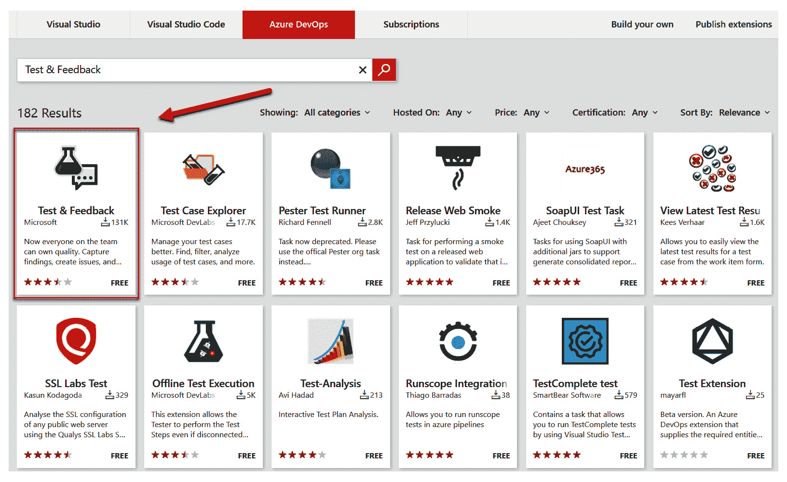

    Figure 10.1 – 选择测试与反馈扩展

1.  这将打开扩展的详细页面，您可以在这里进行安装。点击屏幕顶部的**安装**按钮：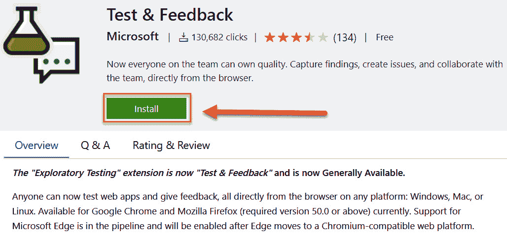

    Figure 10.2 – 安装测试与反馈扩展

1.  接下来，您将被重定向到支持安装此扩展的浏览器页面。点击您当前浏览器下方的**安装**按钮进行安装。您将被重定向到当前浏览器的扩展页面，在那里您可以进行安装。

1.  安装扩展后，图标将添加到地址栏的右侧。点击**连接**按钮：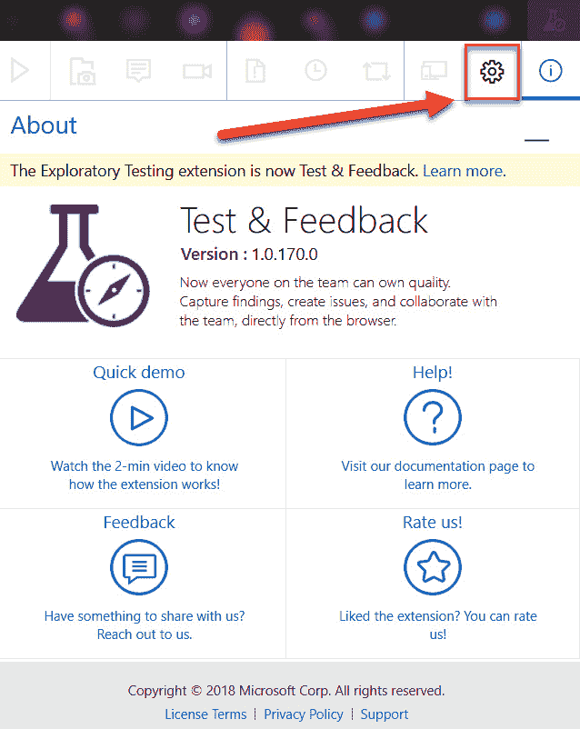

    Figure 10.3 – 测试与反馈扩展配置

1.  你需要在这里指定 Azure DevOps 服务器 URL，以连接到你的 Azure DevOps 实例。URL 以 `https://dev.azure.com/` 开头，以项目名称结尾。提供 URL 后，点击**下一步**。连接到项目后，你可以选择团队。选择**Parts.Unlimited Team**：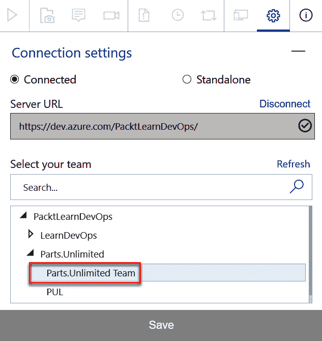

    图 10.4 – 连接到 Azure DevOps

1.  点击**保存**。

    现在扩展已经配置完成，我们可以开始使用它。你可以使用该扩展进行探索性测试或提供反馈：

1.  我们将开始进行探索性测试会话。点击**开始**按钮：

    图 10.5 – 开始探索性测试

1.  这将激活菜单。一旦你打开了一个用于测试的 Web 应用，你可以找到存在 bug 的区域，截图、做笔记，或录制操作视频：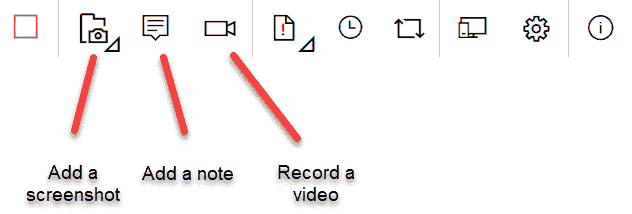

    图 10.6 – 扩展选项

1.  一旦你完成了探索、收集并注册信息，你可以创建一个 bug、任务或测试用例。点击**创建 bug**：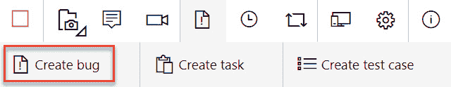

    图 10.7 – 扩展选项

1.  你可以提供一个标题，并将你发现的信息也包含其中：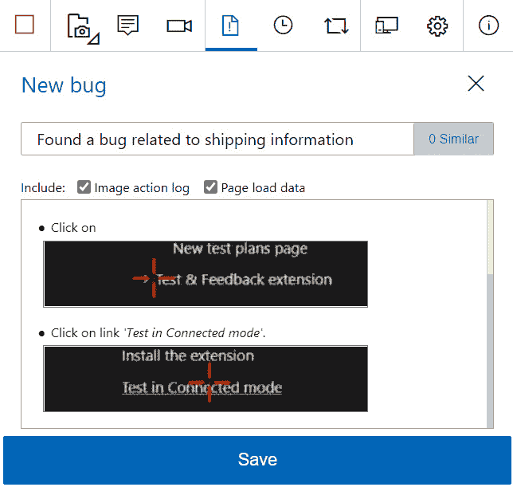

    图 10.8 – 创建 bug

1.  点击**保存**。

1.  你还可以查看来自扩展的所有活动列表。在那里，你也能看到 bug ID，这样你就可以在 Azure DevOps 中追踪它：

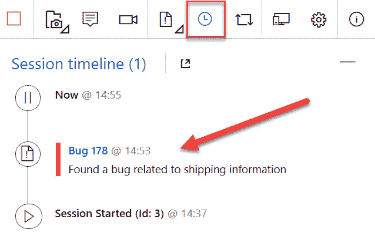

图 10.9 – 操作概览

重要说明

若要了解如何在 Azure DevOps 中创建反馈项，请参考以下网站：[`docs.microsoft.com/en-us/azure/devops/test/request-stakeholder-feedback?view=azure-devops`](https://docs.microsoft.com/en-us/azure/devops/test/request-stakeholder-feedback?view=azure-devops)。若要使用**Test & Feedback**扩展响应这些反馈项，请访问 https://docs.microsoft.com/en-us/azure/devops/test/provide-stakeholder-feedback?view=azure-devops#provide。

在本次演示中，我们从 Visual Studio Marketplace 安装了**Test & Feedback**扩展，它可以用于探索性测试。

在下一部分，我们将探讨计划的手动测试。

# 计划的手动测试

多年来，手动测试与软件开发过程一同演变，变得更加敏捷。通过 Azure DevOps，手动测试被集成到支持的不同敏捷过程中，并且可以在 Azure DevOps 中进行配置。

重要说明

在**第二章**中，更详细地介绍了在 Azure DevOps 中支持并集成的不同敏捷过程，标题为*使用 Azure DevOps Boards 管理项目*。

软件开发团队可以直接从 Azure Boards 的看板开始手动测试。从看板上，你可以直接从卡片中监控测试的状态。这样，所有团队成员可以概览与工作项和故事相关的测试。团队还可以看到不同测试的状态。

在下图中，你可以看到在看板上显示的测试及其状态：

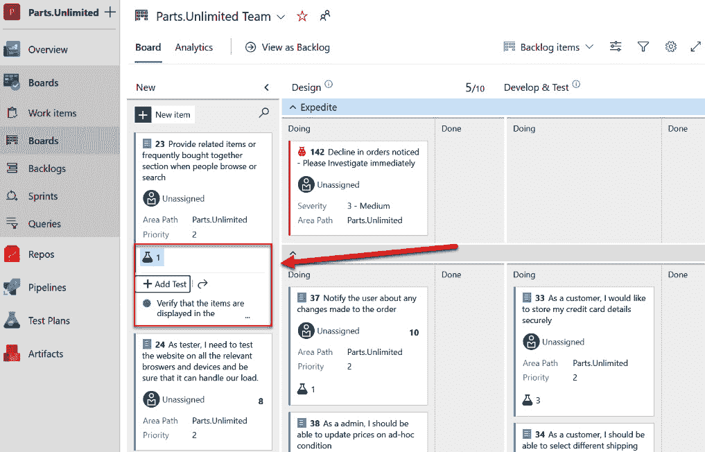

图 10.10 – 在工作中心显示的测试

如果需要更先进的测试功能，Azure 测试计划也可以满足所有测试管理需求。**测试中心**可以通过左侧菜单中的**测试计划**访问，其中提供了完整测试生命周期所需的所有功能。

在下图中，你可以看到如何通过左侧菜单访问测试中心，以及不同的菜单选项：

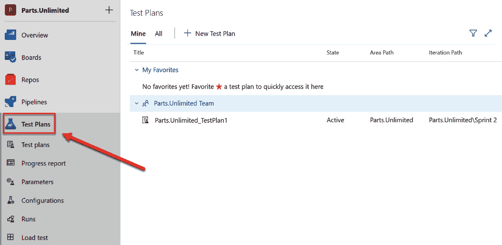

图 10.11 – Azure DevOps 中的测试中心

这些功能包括测试计划、测试套件、测试用例、测试编写、测试应用和测试跟踪。测试计划、测试套件和测试用例将在下一节中详细讲解。

# 测试计划、测试套件和测试用例

在 Azure DevOps 测试计划中，你可以为软件开发项目中定义的冲刺或里程碑创建和管理测试计划和测试套件。测试计划提供了三种主要的测试管理构件：**测试计划**、**测试套件**和**测试用例**。这些构件作为特殊类型的工作项存储在工作仓库中，并可以导出并与不同的团队成员或跨团队共享。这也支持测试构件与项目中定义的所有 DevOps 任务的集成。

这三种构件具备以下功能：

+   **测试计划**：测试计划将不同的测试套件、配置和单独的测试用例汇集在一起。通常，项目中的每个主要里程碑都应该有自己的测试计划。

+   **测试套件**：测试套件可以将不同的测试用例组织成单独的测试场景，归入单个测试计划中。这样可以更容易地查看哪些场景已完成。

+   **测试用例**：通过测试用例，你可以验证代码或应用部署的各个部分。它们可以被添加到测试计划和测试套件中。如果需要，它们也可以被添加到多个测试计划和套件中。这样，它们可以有效地重复使用，无需复制。测试用例旨在验证 Azure DevOps 中的工作项，如功能实现或错误修复。

在接下来的部分，我们将把这些理论付诸实践，看看如何在 Azure DevOps 中创建和管理测试计划。

## 管理测试计划、测试套件和测试用例

在本次演示中，我们将再次使用**Parts Unlimited**项目。该项目在 Azure DevOps 中也有一个测试计划，因此我们将首先查看它。接下来，我们需要遵循以下步骤：

1.  打开一个网页浏览器并导航到[`dev.azure.com/`](https://dev.azure.com/)。

1.  使用你的 Microsoft 账户登录，并选择**Parts.Unlimited**项目。然后，在左侧菜单中选择**测试计划**。这将让你导航到已经添加到项目中的测试计划。

1.  从列表中选择**Parts.Unlimited_TestPlan1**以打开它。测试套件已被添加到该计划中。选择**作为客户，我希望将我的信用卡信息安全地存储**。这将打开已添加到该套件中的单个测试用例列表：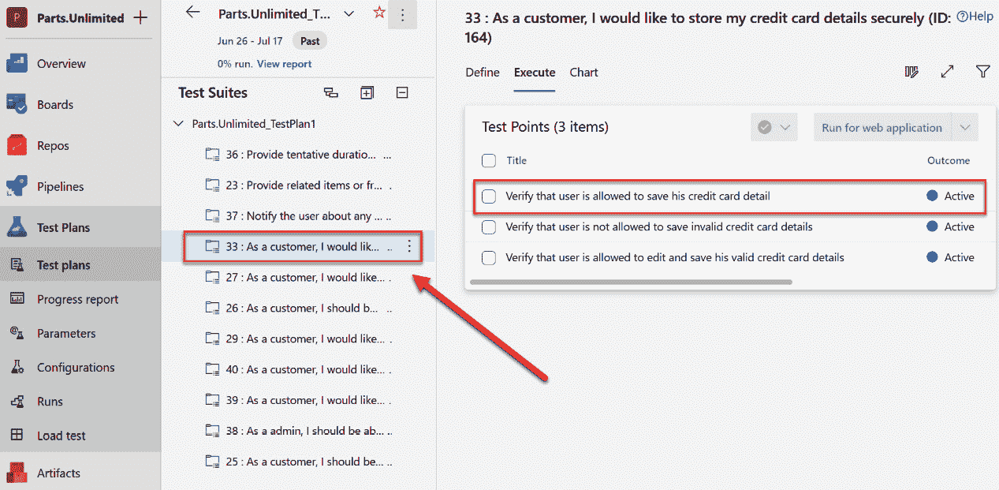

    图 10.12 – 打开测试套件项

1.  然后，右键点击列表中的第一个项：**验证用户是否被允许保存其信用卡信息**。在菜单中选择**编辑测试用例**：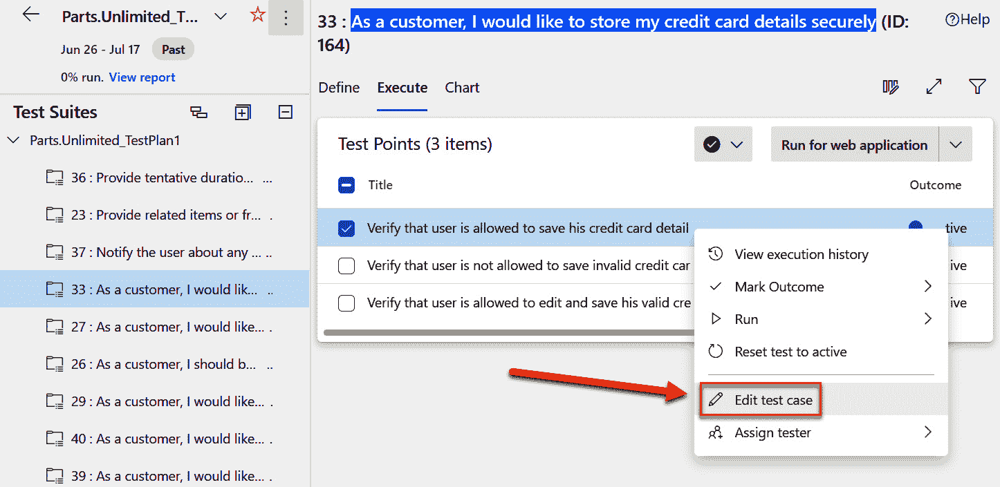

    图 10.13 – 编辑测试用例

1.  在该测试用例的编辑界面上，有四个步骤。你还可以从这里将测试用例链接到提交、拉取请求、分支或工作项。我们将把这个测试用例添加到现有的工作项中。在**相关工作**下，选择**+ 添加链接**，然后点击**现有项**：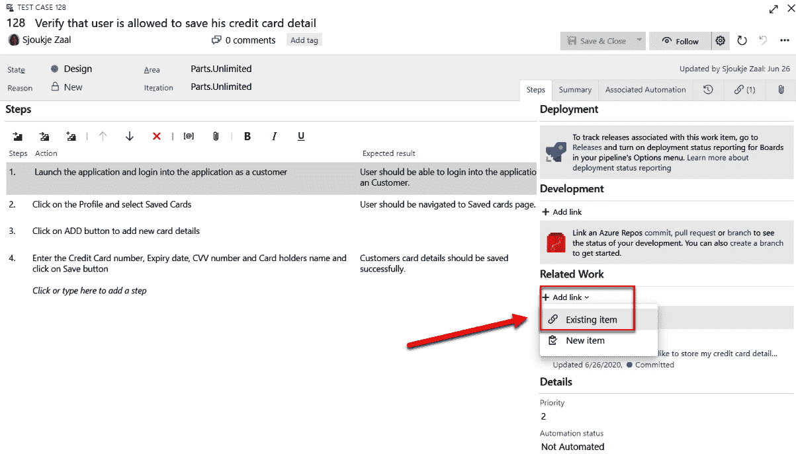

    图 10.14 – 将工作项添加到测试用例

1.  在`credit card`中。选择**信用卡购买**功能以将测试用例链接到：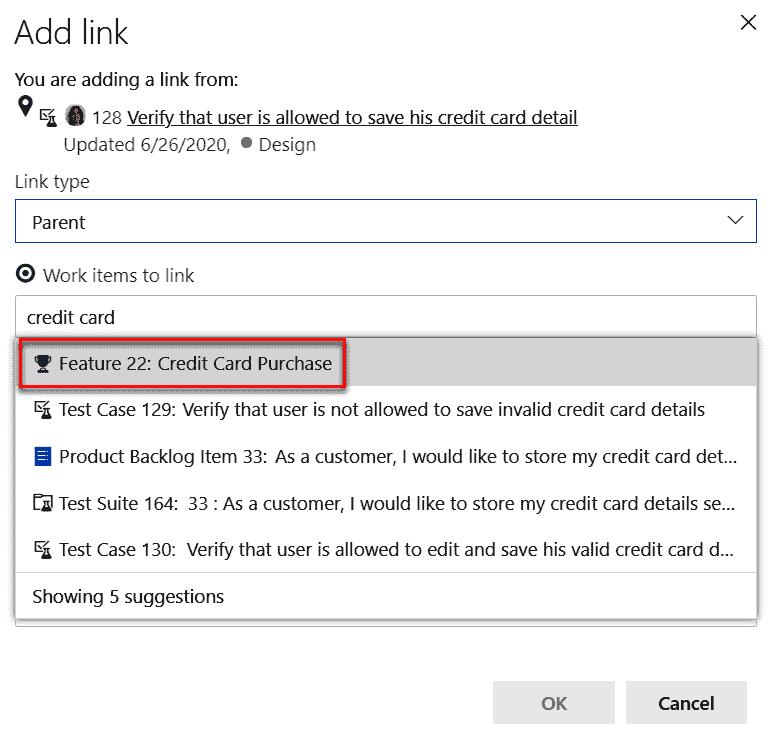

    图 10.15 – 选择工作项

1.  点击**确定**以链接工作项。现在，父特性已与测试用例和测试套件关联。任何人都可以在它们之间导航并查看其关系。

1.  在测试用例窗口中，点击**保存并关闭**。

在某些情况下，测试用例应按特定顺序运行。为此，请点击顶部菜单中的**定义**，然后选择**验证用户是否不允许保存无效的信用卡信息**测试用例。接着将该测试用例拖动到列表中第一个测试用例的上方：

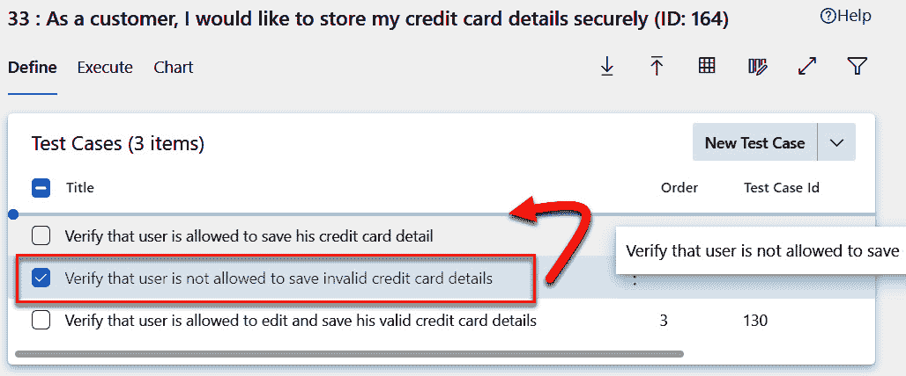

图 10.16 – 重新排序测试用例

现在你将看到测试用例的顺序已发生变化。

你还可以为每个测试用例分配不同的配置。例如，你可以为不同的环境分配配置，如不同版本的 Windows 或浏览器、移动设备等：

1.  要分配配置，请右键点击测试用例并选择**分配配置**：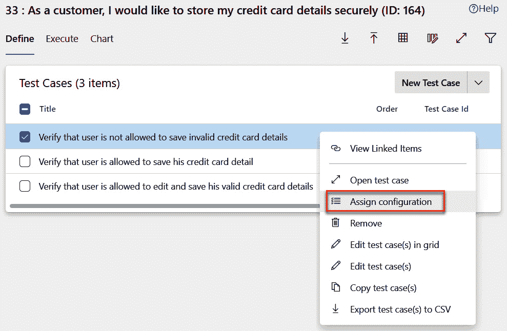

    图 10.17 – 分配配置

1.  在配置概览列表中，你会看到这个测试用例已经选择了一个配置，即 Windows 10。如果没有，选择它并点击**保存**。然后关闭列表：

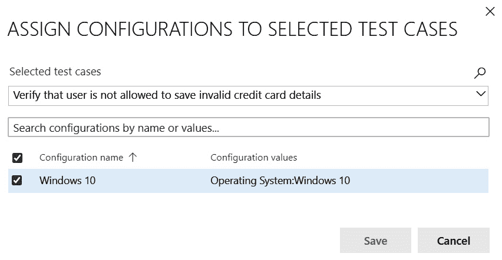

图 10.18 – 可用和已选择的配置

重要提示

添加和管理测试计划配置超出了本书的范围。不过，如果你想了解更多信息，可以参考以下文章：[`docs.microsoft.com/en-us/azure/devops/test/test-different-configurations?view=azure-devops`](https://docs.microsoft.com/en-us/azure/devops/test/test-different-configurations?view=azure-devops)。

接下来，我们将创建一个新的测试套件。你可以创建三种不同类型的测试套件：**静态**，手动分配测试用例；**基于需求**，根据共同需求创建套件；以及**基于查询**，根据查询结果自动添加测试用例：

1.  让我们添加一个新的基于需求的测试套件。为此，选择**Parts.Unlimited_TestPlan1**旁边的三个点 > **新建套件** > **基于需求的套件**：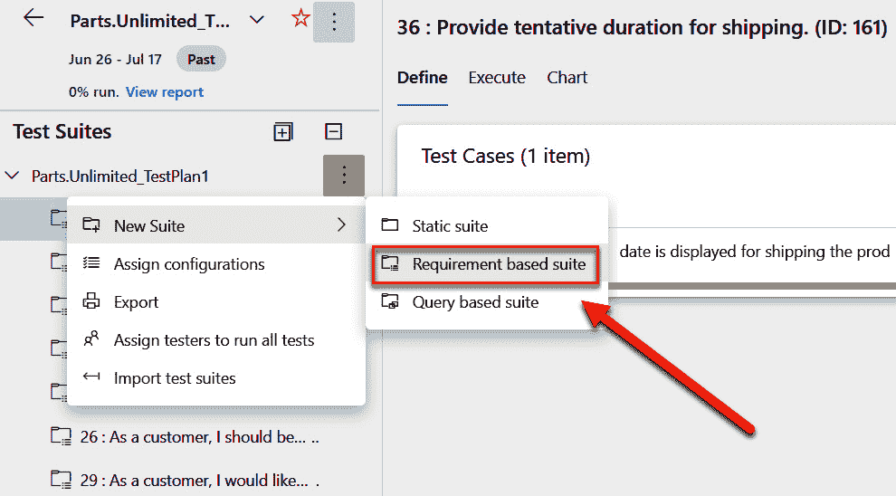

    图 10.19 – 创建基于需求的测试套件

1.  在这里，你可以根据需求创建自己的查询来检索工作项。在这个演示中，我们将使用默认设置。点击**运行查询**，然后选择与运输相关的三个项目：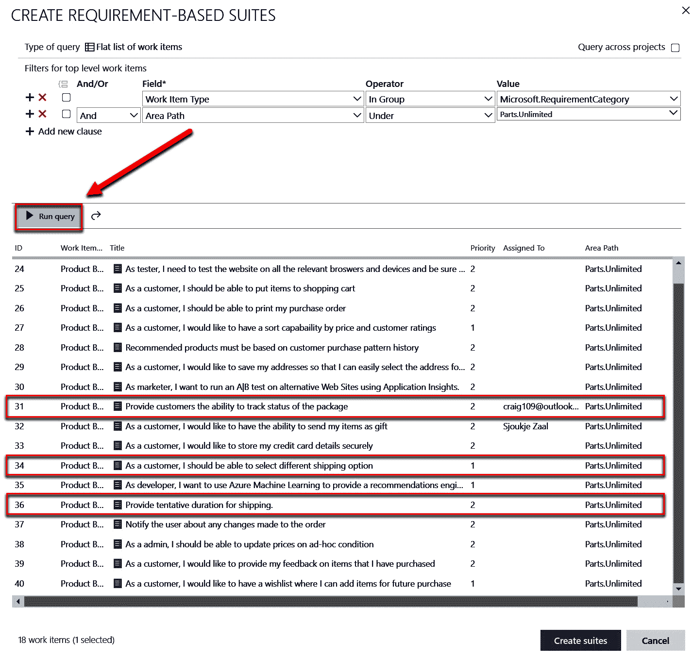

    图 10.20 – 选择与运输相关的工作项

1.  点击**创建套件**为每个项目创建一个测试套件。

1.  我们将向这个测试套件添加一些测试用例。你可以一次添加一个，也可以使用网格布局快速添加多个测试用例。我们将在这里使用网格布局。选择一个已添加的测试套件，点击**新建测试用例**按钮旁边的箭头，然后点击**使用网格添加测试用例**：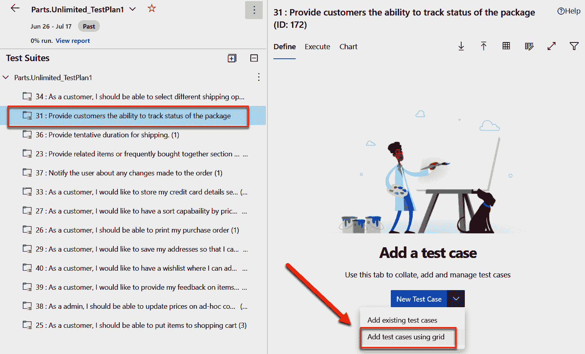

    图 10.21 – 使用网格添加测试用例

1.  将以下测试用例添加到网格：

    a) 第一个测试用例：

    i) **标题**：**订单摘要显示预期交货日期**

    ii) **步骤操作**：**访问“我的订单”**

    iii) **步骤预期结果**：**显示预期交货日期**

    b) 第二个测试用例：

    i) **标题**：**延迟订单被突出显示**

    ii) **步骤操作**：**访问延迟包裹的订单页面**

    iii) **步骤预期结果**：**延迟状态被突出显示**

    c) 第三个测试用例：

    i) **标题**：**包裹交付步骤**

    ii) **步骤操作**：**访问进行中的包裹订单页面**

    iii) **步骤预期结果**：**显示交付步骤和状态**

    这将显示如下截图：

    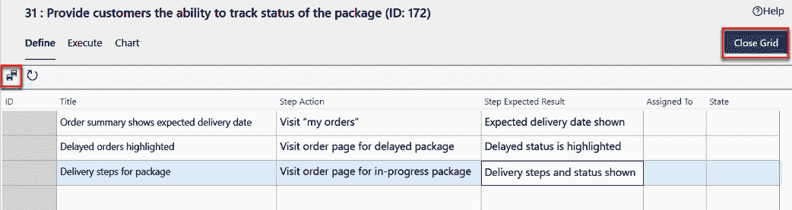

    图 10.22 – 定义测试用例

1.  点击左侧的 **保存测试用例** 按钮，然后点击屏幕右侧的 **关闭网格** 按钮。

在本演示中，我们已经管理了一些测试用例并创建了一个新的基于需求的测试套件。在接下来的部分，我们将运行并分析一个手动测试计划。

# 运行和分析手动测试计划

在本演示中，我们将运行并分析一个手动测试计划。为此，我们将再次使用已经添加到 Azure DevOps 中的 **Parts.Unlimited** 项目的测试计划并导入一个测试套件。该测试套件可以从属于本章的 GitHub 仓库中下载。你可以在章节开头的 *技术要求* 部分获取 GitHub URL：

1.  再次在 Azure DevOps 中打开 **Parts.Unlimited** 项目的测试计划。

1.  首先，我们需要添加一个新的静态测试套件。为此，选择 `端到端测试` 旁边的三个点。

1.  选择新创建的套件，并在顶部菜单中选择导入按钮以导入测试用例：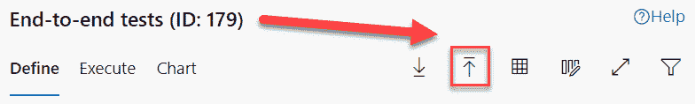

    图 10.23 – 导入测试用例

1.  导入 GitHub 源代码中 *第十章* 文件夹中的测试计划。选择 CSV 文件并点击 **导入** 按钮：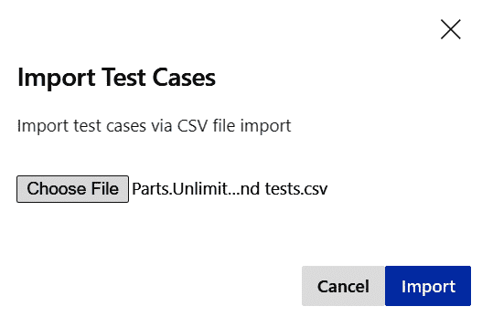

    图 10.24 – 导入 CSV 文件

1.  导入文件后，双击测试用例并导航到参数部分。然后添加一些可以用于测试的参数，类似于以下截图：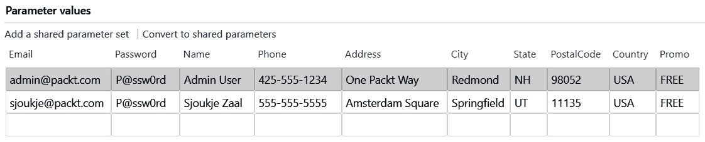

    图 10.25 – 参数值

1.  点击顶部菜单中的 **保存并关闭**。现在我们已经准备好测试套件，可以开始测试了。点击顶部菜单中的 **执行** 选项卡，然后点击 **测试用例**，接着点击 **运行**，然后点击 **使用选项运行**：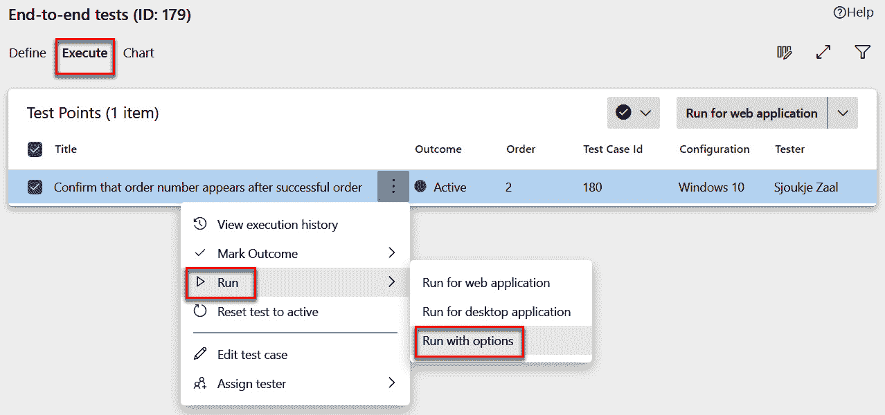

    图 10.26 – 运行测试

1.  保持 **使用选项运行** 窗口中的默认设置，然后点击 **运行**：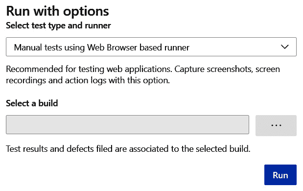

    图 10.27 – 使用选项运行

1.  测试运行器现在会显示所有步骤：

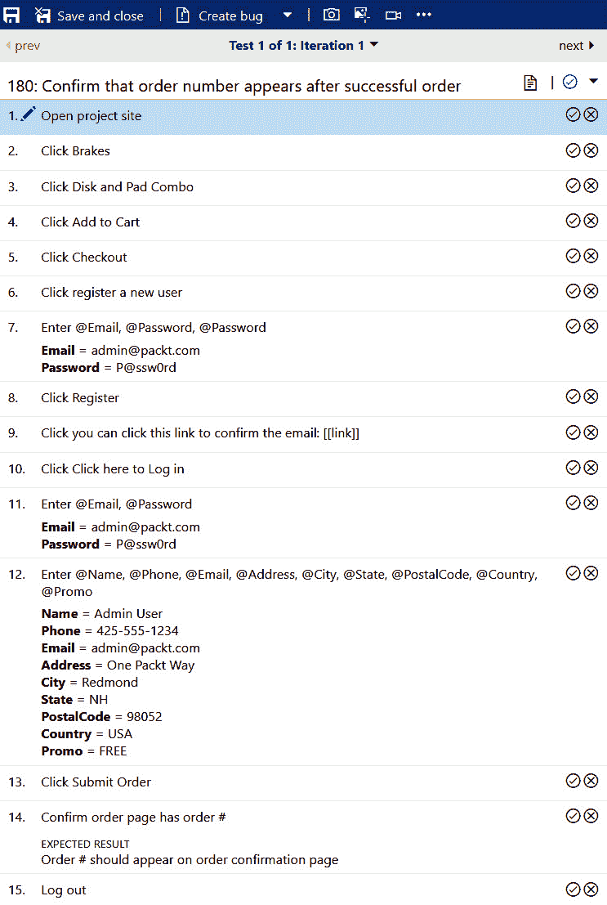

图 10.28 – 测试运行器窗口

现在我们可以开始实际的测试：

1.  在 Visual Studio 中打开 **Parts.Unlimited** 项目。我们之前已经克隆了仓库。如果需要再次克隆项目，请参考 *第五章**，在构建管道中运行质量测试*。

1.  通过按 *F5* 键运行应用程序，并等待直到 **Parts Unlimited** 网站启动。现在将浏览器窗口放到测试运行器窗口旁边，并开始测试：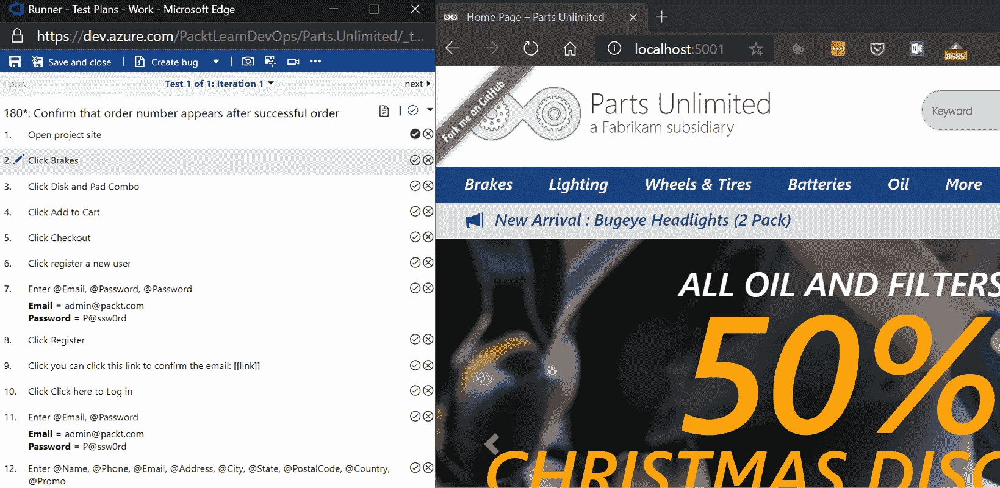

    图 10.29 – 开始测试 Web 应用程序

1.  根据测试运行器的说明操作。每完成一个步骤，点击每个步骤右侧的通过测试图标。

1.  如果你发现 Bug 或问题，可以直接在步骤上添加评论，或者在顶部创建一个单独的 Bug：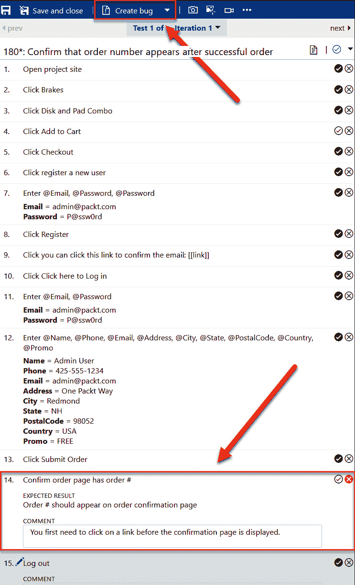

    图 10.30 – 添加评论或 Bug

1.  要完成测试，请点击测试运行器顶部菜单中的**保存并关闭**。

1.  现在返回到 Azure DevOps。在左侧菜单中，点击**测试计划** > **运行**。

1.  在最近的运行列表中，选择我们刚刚执行的运行：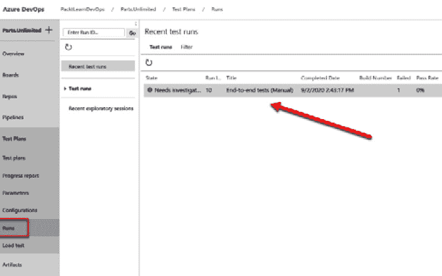

    图 10.31 – 最近的测试运行

1.  在这里，你可以查看测试的所有细节和结果：

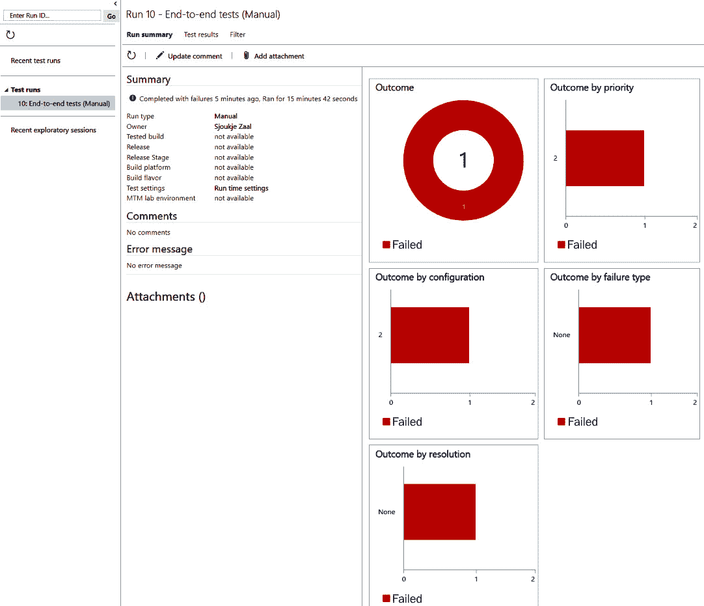

图 10.32 – 测试结果

在本次演示中，我们创建了一个测试套件并导入了一个测试用例。然后我们运行了测试并测试了 Parts Unlimited 应用程序，并查看了 Azure DevOps 中的结果。

本章到此结束。

# 总结

在本章中，我们介绍了 Azure DevOps 测试计划。我们查看了不同的功能和能力，并管理了测试计划、测试套件和测试用例。然后，我们从 CSV 文件导入了一个测试用例，并测试了**Parts Unlimited**应用程序。接着，我们详细讲解了探索性测试，并使用 Test & Feedback 扩展来报告一个 Bug。

在下一章中，我们将重点介绍使用 Azure DevOps 的实际 CI/CD 场景。

# 进一步阅读

查看以下链接，获取更多有关本章内容的信息：

+   探索性和手动测试场景及能力：[`docs.microsoft.com/en-us/azure/devops/test/overview?view=azure-devops`](https://docs.microsoft.com/en-us/azure/devops/test/overview?view=azure-devops)

+   创建手动测试用例：[`docs.microsoft.com/en-us/azure/devops/test/create-test-cases?view=azure-devops`](https://docs.microsoft.com/en-us/azure/devops/test/create-test-cases?view=azure-devops)

+   使用 Test & Feedback 扩展提供反馈：[`docs.microsoft.com/en-us/azure/devops/test/provide-stakeholder-feedback?view=azure-devops`](https://docs.microsoft.com/en-us/azure/devops/test/provide-stakeholder-feedback?view=azure-devops)

+   使用 Test & Feedback 扩展在连接模式下进行探索性测试：[`docs.microsoft.com/en-us/azure/devops/test/connected-mode-exploratory-testing?view=azure-devops`](https://docs.microsoft.com/en-us/azure/devops/test/connected-mode-exploratory-testing?view=azure-devops)
