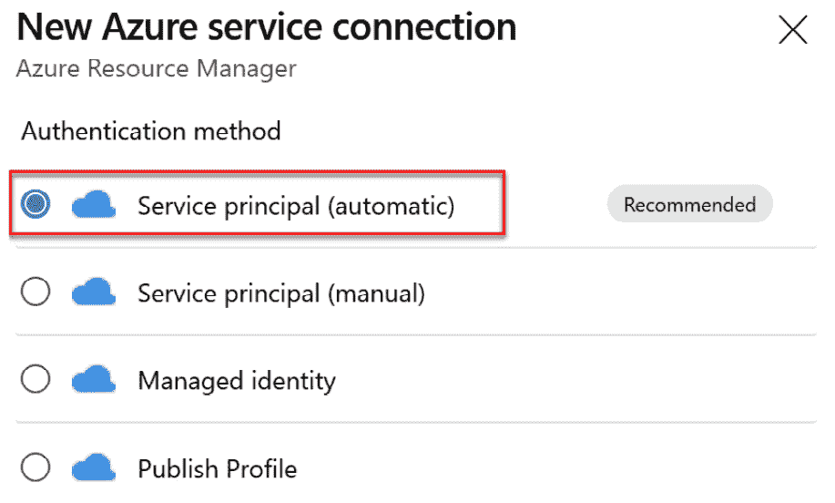
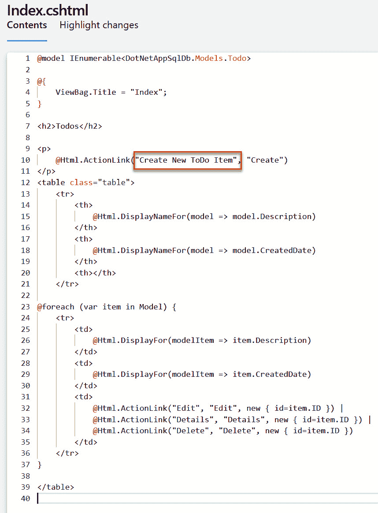
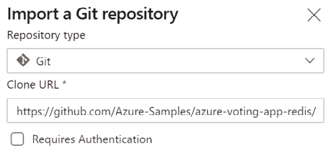
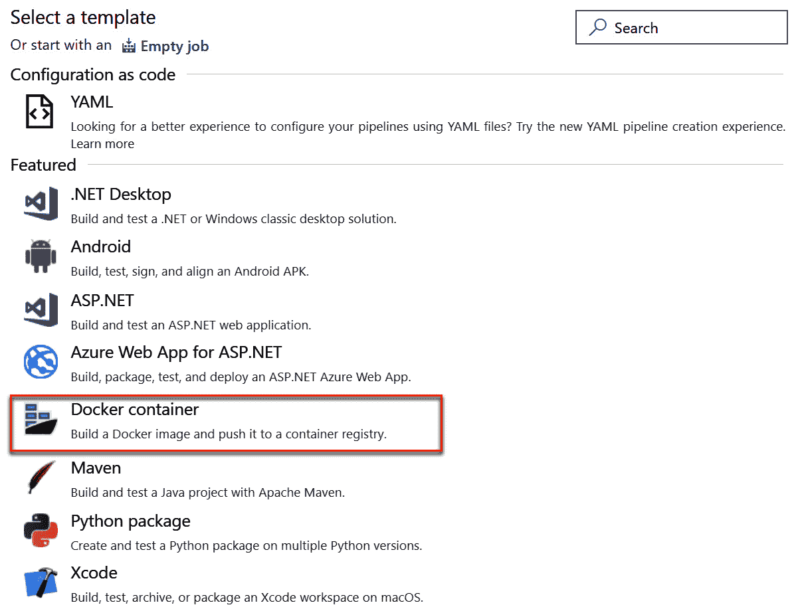

第十一章：

# 使用 Azure DevOps 进行实际的 CI/CD 场景

在本章中，我们将展示一些示例项目，其中**持续集成和持续交付**（**CI/CD**）过程通过使用 Azure DevOps 来处理。我们将以示例应用程序为基础，使用 Azure DevOps 设置 CI/CD 管道，以便管理软件开发、部署和升级生命周期。

本章将涵盖以下主题：

+   为基于.NET 的应用程序设置 CI/CD 管道

+   为基于容器的基础设施设置 CI/CD 管道

+   Azure 架构中心为 DevOps 提供支持

# 技术要求

要跟随本章学习，您需要有一个有效的 Azure DevOps 组织和一个 Azure 订阅。

您可以在[`dev.azure.com`](https://dev.azure.com)注册一个测试版 Azure DevOps 组织。如果您还没有 Azure 订阅，可以在[`azure.microsoft.com/en-in/free/`](https://azure.microsoft.com/en-in/free/)获得一个试用版。

本章的代码可以在[`github.com/PacktPublishing/Learning-Azure-DevOps---B16392/tree/master/Chapter11`](https://github.com/PacktPublishing/Learning-Azure-DevOps---B16392/tree/master/Chapter11)找到。

# 为基于.NET 的应用程序设置 CI/CD 管道

典型的基于.NET 的应用程序包括使用 Microsoft 的.NET Framework 开发的应用程序，并在后端使用 SQL 数据库。应用程序可能有多个层次，例如前端、后端（也称为中间层或 API 层）和数据层（SQL Server）。

Azure Pipelines，作为 Azure DevOps 的一部分，提供了一个全面的解决方案来构建、部署和管理基于.NET 的基础设施部署。在本节中，我们将查看为示例基于.NET 的应用程序配置 CI/CD 的步骤。

我们将为应用程序创建两个环境，分别命名为**暂存**和**生产**，并设置 CI/CD 管道。

## 示例应用程序简介

我们将使用一个简单的**ToDo**应用程序来进行这次演示。它是一个基于 Web 的应用程序，后端使用 SQL 数据库。

它是使用 Microsoft ASP.NET 构建的，针对的是.NET Framework 版本 4.62。您可以在这里访问源代码：[`github.com/Azure-Samples/dotnet-sqldb-tutorial/tree/master/DotNetAppSqlDb`](https://github.com/Azure-Samples/dotnet-sqldb-tutorial/tree/master/DotNetAppSqlDb)。

建议您在开始构建 CI/CD 管道之前，快速浏览一下应用程序代码，以便熟悉它。

## 准备所需的 Azure 基础设施

在本节中，我们将创建所需的 Azure 基础设施来托管应用程序。我们将创建以下资源：

1.  `Contoso-ToDo-Staging`

    b) `Contoso-ToDo-Production`

1.  **应用程序组件**：我们将为暂存环境和生产环境创建以下资源：

    a) 使用 Azure App Service 来托管 Web 应用程序

    b) 使用 Azure SQL 数据库来托管 SQL 数据库

### 在 Azure 中创建资源组

资源组是一个容器，用于在 Azure 云中存储资源。通常，资源组包括您希望作为一组管理的资源，或者生命周期相似的资源。我们将创建两个资源组：一个用于生产，另一个用于预发布。让我们在 Azure 中创建这些资源组：

1.  使用您的 Azure 凭证登录到 Azure 门户，[`portal.azure.com`](https://portal.azure.com)。

1.  点击 `资源组`：

    图 11.1 – Azure 门户中的资源组

1.  在资源组页面上点击 **创建**。

1.  选择您的订阅，并输入资源组名称为 `Contoso-ToDo-Staging`。

1.  选择一个离您位置较近的区域：

    图 11.2 – 资源组创建

1.  点击 **查看 + 创建**，然后点击 **创建** 以开始部署。

1.  重复步骤，为生产环境创建另一个资源组，命名为 `Contoso-ToDo-Prod`。

您现在已经创建了资源组来托管 Azure 资源。

### 创建 Azure 应用服务

Azure 应用服务是 Microsoft Azure 提供的 **平台即服务**（**PaaS**）Web 托管服务。您可以使用应用服务托管几乎任何语言构建的基于 Web 的应用程序。作为 PaaS 服务，应用服务允许您只需推送代码即可使应用程序上线，而无需担心底层的硬件、操作系统和平台组件。

在本示例中，我们将使用 Azure 应用服务来托管 **ToDo** 应用：

1.  在 Azure 门户中，点击 **+ 创建资源**，然后点击 **Web 应用**：

    图 11.3 – 门户中的 Azure Web 应用

1.  在 `contosotodostagingXX` 上，其中 `XX` 是您的首字母。

    d) **发布**：选择**代码**。

    e) **运行时堆栈**：选择 **ASP.NET V4.7**。

    f) **操作系统**：选择 **Windows**。

    g) **区域**：选择一个离您位置较近的区域：

    

    图 11.4 – 创建 Azure 应用服务

1.  在 **应用服务计划** 下，选择以下选项：

    a) **Windows 计划**：输入一个新的应用服务计划名称

    b) **SKU 和大小**：您可以选择任何 SKU；建议使用 **S0** 或 **Basic**，以避免由于测试目的而产生过高的 Azure 成本。在生产环境中，您应根据应用程序的资源需求选择适合的大小：

    

    图 11.5 – 应用服务 SKU

1.  点击 **查看 + 创建**，然后点击 **创建** 以开始部署。

    完成后，您将收到一个通知，显示状态为完成。

1.  重复此任务中的步骤，为生产环境创建另一个 Azure 应用服务。

在此任务中，我们为托管 **ToDo** Web 应用程序创建了一个 Azure 应用服务。

### 创建 Azure SQL 数据库

我们的示例 **ToDo** 应用使用 Microsoft SQL Server 存储所有的应用数据。在此任务中，我们将创建一个新的 Azure SQL 数据库，供 **ToDo** 应用存储所有持久化数据：

1.  在 Azure 门户中，点击 **+ 创建资源**，然后选择 **SQL 数据库**：

    图 11.6 – Azure 中的 SQL 数据库

1.  在 SQL 服务器 `contosotodo-staging-db` 上。

    d) `contosotodo-staging-dbserver`。

    ii) 提供你选择的用户名和密码。

    iii) **位置**：用于部署 Web 应用的 Azure 区域。

    e) **想使用 SQL 弹性池吗？**：**否**。

    f) **计算 + 存储**：将 SKU 更改为 **S0** 或 **基础** 以保持 Azure 成本在本测试项目期间较低。实际上，你需要根据应用需求选择合适的计算和存储组合：

    

    图 11.7 – 在 Azure 中创建 SQL 数据库

1.  点击 **下一步：网络 >**。

1.  对于 **网络** 配置，选择 **公共端点** 作为 **连接方式**，并选择 **是** 以允许 **Azure 服务和资源访问此服务器**。请注意，这仅用于本测试项目的部署；在生产环境中，建议仅允许来自特定应用服务器的访问。一旦选择，点击 **查看 + 创建**：

    图 11.8 – 在 Azure 中审核 SQL 数据库创建

1.  点击 **创建** 以开始部署。完成后，你将在通知菜单中收到通知。

1.  导航到新创建的 Azure SQL 数据库并复制连接字符串。这将在接下来的部分中使用。

1.  重复这些步骤为生产环境创建另一个 Azure SQL 数据库。

在这个任务中，我们已经为我们的应用创建了 Azure SQL 数据库。

## 设置 Azure DevOps 项目

现在我们的 Azure 基础设施已准备好，接下来我们将设置一个 Azure DevOps 组织来构建 CI/CD 流水线。我们将使用 Azure Repos 作为我们的源代码管理系统：

1.  使用你的 Azure DevOps 账号登录 [`dev.azure.com`](https://dev.azure.com)。

1.  在你的 DevOps 租户中创建一个名为 `Contoso ToDo` 的新项目：

    图 11.9 – 创建 DevOps 项目

1.  我们将从导入 Azure Repos 中的应用代码开始。点击 **Repos**。

1.  在 **导入仓库** 下点击 **导入**：

    图 11.10 – 导入一个仓库

1.  对于仓库 URL，输入 [`github.com/Azure-Samples/dotnet-sqldb-tutorial/`](https://github.com/Azure-Samples/dotnet-sqldb-tutorial/)，然后点击 **导入**：


图 11.11 – 从 GitHub 导入仓库

导入成功后，我们将看到项目文件现已在 Azure Repos 中可用。您可以浏览代码文件，查看 `DotNetAppSQLDb` 中包含的应用程序源文件：


图 11.12 – Azure 仓库中的文件

我们现在将为应用程序设置构建管道。

### 为应用程序设置 CI

现在我们的应用程序代码已上传至 Azure Repos，接下来我们将创建一个构建管道，该管道将构建应用程序包，以便部署到 Azure 应用服务：

1.  在 Azure DevOps 中，浏览到**管道**并点击**创建管道**：

    图 11.13 – 创建管道

1.  点击**使用经典编辑器**，通过 GUI 创建管道（这一步是可选的；如前面章节所述，您可以选择使用 YAML 文件配置管道）：

    图 11.14 – 选择经典编辑器

1.  选择您的 Azure 仓库和主分支，然后点击**继续**进入下一步：

    图 11.15 – 选择仓库

1.  选择**ASP.NET**作为管道模板：

    图 11.16 – 选择管道模板

1.  查看管道配置。对于这个项目，默认配置已经能够完成工作。检查无误后，点击**保存并排队**：

    图 11.17 – 管道构建任务

1.  在**运行管道**向导中，您可以添加评论并点击**保存并运行以开始执行**。

1.  一旦作业开始执行，您可以通过点击作业名称来查看状态：

    图 11.18 – 管道构建状态

1.  现在，让我们在管道上启用 CI，以便在提交到**主**分支时自动启动构建。编辑管道并浏览到**触发器**，启用 CI。如果您不是使用**主**分支作为主要分支，您可以选择按分支进行过滤或切换到其他分支：


图 11.19 – 启用持续集成

在这项任务中，我们创建了一个构建管道，并成功构建了我们的示例**待办事项**应用程序。在接下来的任务中，我们将执行部署。

### 为应用程序设置持续交付

现在我们的应用程序已准备好进行部署，我们将创建一个发布管道，将应用程序部署到 Azure。在这个管道中，我们将定义要将应用程序部署到哪些 Azure 资源，并添加额外的部署控制。

#### 设置服务连接

Azure DevOps 需要访问 Azure 订阅，以便能够部署和更新 Azure 资源。Azure DevOps 中的服务连接允许你将 Azure DevOps 项目连接到外部服务。让我们为 Azure Pipelines 创建一个服务连接：

1.  登录到 Azure DevOps 并浏览至 **项目设置** | **服务连接**。

1.  点击 **创建服务连接**。

1.  在连接列表中，选择 **Azure 资源管理器**：

    Figure 11.20 – ARM 服务连接

1.  对于服务连接身份验证方法，选择 **服务主体（自动）**：

    Figure 11.21 – ARM 服务连接服务主体

1.  Azure DevOps 现在将要求你进行 Azure 身份验证。请使用至少拥有订阅所有者权限和全局管理员权限的帐户登录到 Azure **Active Directory** (**AD**) 租户。你可以选择将服务连接的作用域限制为某个资源组，或者允许整个订阅。选择你的 Azure 订阅并为其命名：


Figure 11.22 – 创建服务连接服务主体

该服务连接现在可以在 Azure Pipelines 中使用。

#### 创建发布流水线

发布流水线包括所有步骤和工作流，用于将应用程序部署到不同的环境中，例如开发、暂存、质量保证和生产。我们从为 **ToDo** 应用创建一个发布流水线开始：

1.  登录到 Azure DevOps 并启动你的 `Contoso ToDo` 项目。

1.  浏览至 **Pipeline** | **Releases**。

1.  点击 **新建流水线**：

    Figure 11.23 – 新发布流水线

1.  这将打开一个页面以选择模板。由于我们计划将 **ToDo** 应用部署到 App Service，请选择 **Azure App Service 部署**：

    Figure 11.24 – Azure App Service 部署任务

1.  在 **阶段名称** 输入 `Staging Environment`。你可以选择给出任何其他有意义的名称，最好能描述你环境中的场景：

    Figure 11.25 – Staging 阶段

1.  现在你可以关闭 **阶段** 窗格。你的流水线应该如下所示：

    Figure 11.26 – 流水线快照

1.  为了部署应用程序，首先我们需要从构建流水线的输出中获取应用程序包。在 **Artifacts** 下，点击 **+ 添加**：

    Figure 11.27 – 发布流水线中的工件

1.  选择**构建**作为**源类型**，并选择在上一任务中创建的构建管道。你可以选择配置默认要部署的版本：

    图 11.28 – 发布管道中的工件源

1.  点击**持续部署触发器**按钮并启用持续部署。启用持续部署后，每当有新的构建版本可用时，都会触发发布（通常是在运行包含 CI 的构建管道之后）。如果启用**拉取请求触发器**，每次有新的构建版本时，都会创建一个发布，即使是有拉取请求的情况下。这对于纯开发管道可能是一个有用的场景：

    图 11.29 – 启用持续部署

1.  在**阶段**中，点击开发环境中的**1 个任务，1 个工作**：

    图 11.30 – 管道阶段

1.  在任务视图中，选择你之前部署的 Azure 订阅服务连接和应用服务：

    图 11.31 – 应用服务部署任务

1.  点击**部署 Azure 应用服务**并检查应用服务的部署信息。

1.  点击**+**添加另一个任务来应用**SQL 迁移脚本**以使数据库准备就绪。搜索 SQL 并选择**Azure SQL 数据库部署**。

1.  在**Azure SQL 任务**中，修改以下设置：

    a) **显示名称**：应用数据库迁移脚本。

    b) 选择你的 Azure 订阅并提供在创建 Azure SQL 数据库时捕获的数据库连接详情。

    c) **部署类型**：内联 SQL 脚本

    d) **内联 SQL 脚本**：提供以下脚本代码。这将会在 SQL 数据库中创建所需的表。请注意，这是一个用于创建所需架构的示例 SQL 脚本（也可以在[`github.com/PacktPublishing/Learning-Azure-DevOps---B16392/tree/master/Chapter11`](https://github.com/PacktPublishing/Learning-Azure-DevOps---B16392/tree/master/Chapter11)中找到）；在生产环境中，您可以选择使用 Azure Pipelines 中的 SQL Server 数据工具项目来完成此操作。请参阅此文档了解更多关于 SQL 的 Azure DevOps 的内容：[`devblogs.microsoft.com/azure-sql/devops-for-azure-sql/`](https://devblogs.microsoft.com/azure-sql/devops-for-azure-sql/)：

    ```
    /****** Object:  Table [dbo].[__MigrationHistory]    Script Date: 8/24/2020 12:35:05 PM ******/
    SET ANSI_NULLS ON
    SET QUOTED_IDENTIFIER ON
    IF NOT EXISTS
       (  SELECT [name]
          FROM sys.tables
          WHERE [name] = '__MigrationHistory'
       )
    BEGIN
        CREATE TABLE [dbo].__MigrationHistory NOT NULL,
            [ContextKey] nvarchar NOT NULL,
            [Model] varbinary NOT NULL,
            [ProductVersion] nvarchar NOT NULL,
        CONSTRAINT [PK_dbo.__MigrationHistory] PRIMARY KEY CLUSTERED 
        (
            [MigrationId] ASC,
            [ContextKey] ASC
        )WITH (STATISTICS_NORECOMPUTE = OFF, IGNORE_DUP_KEY = OFF) ON [PRIMARY]
        ) ON [PRIMARY] TEXTIMAGE_ON [PRIMARY]

    END
    /****** Object:  Table [dbo].[Todoes]    Script Date: 8/24/2020 12:35:05 PM ******/
    SET ANSI_NULLS ON
    SET QUOTED_IDENTIFIER ON
    IF NOT EXISTS
       (  SELECT [name]
          FROM sys.tables
          WHERE [name] = 'Todoes'
       )
    BEGIN
        CREATE TABLE [dbo].Todoes NOT NULL,
            [Description] nvarchar NULL,
            [CreatedDate] [datetime] NOT NULL,
        CONSTRAINT [PK_dbo.Todoes] PRIMARY KEY CLUSTERED 
        (
            [ID] ASC
        )WITH (STATISTICS_NORECOMPUTE = OFF, IGNORE_DUP_KEY = OFF) ON [PRIMARY]
        ) ON [PRIMARY] TEXTIMAGE_ON [PRIMARY]

    END
    ```

1.  点击**保存**并点击**+**添加另一个任务。现在我们需要添加另一个任务，更新 Azure 应用服务连接设置中的数据库连接字符串。

1.  在任务菜单中搜索**Azure 应用服务设置**：

    图 11.32 – Azure 应用服务设置任务

1.  在**Azure App Service 设置**任务中，选择 Azure 订阅和用于暂存环境的应用服务连接详情。

1.  在**连接设置**中，提供以下格式的数据库连接字符串。在保存之前，请更新您的数据库连接详情。由于这是一个测试实验室，我们直接在管道任务中存储了安全信息。然而，在生产环境中，请使用变量和参数来存储任何连接字符串或其他信息。请参考此文档了解如何在 Azure 管道中安全地使用变量和参数：[`docs.microsoft.com/bs-cyrl-ba/azure/devops/pipelines/security/inputs?view=azure-devops`](https://docs.microsoft.com/bs-cyrl-ba/azure/devops/pipelines/security/inputs?view=azure-devops)：

    ```
    [
      {
        'name': 'MyDbConnection',
        'value': 'Server=tcp:contosotodostagingdb.database.windows.NET,1433;Initial Catalog=ContoSoToDoStageDB;Persist Security Info=False;User ID=azadmin;Password=<YourPassword>;MultipleActiveResultSets=False;Encrypt=True;TrustServerCertificate=False;Connection Timeout=30;',
        'type': 'SQLAzure',
        'slotSetting': false
      }
    ]
    ```

1.  一旦所有任务更新完成，点击**保存**。在提示时，可以将管道保存在根文件夹中。任务的顺序应如下：

    a) **应用数据库迁移脚本**

    b) **应用 Azure App Service 设置**

    c) **部署 Azure App Service**：

    

    图 11.33 – 保存发布管道

1.  在管道中，点击**+ 添加**以添加另一个用于生产的阶段。您可以选择相同的 Azure App Service 部署，也可以克隆开发环境阶段。您可以在定位生产应用服务和 SQL 数据库实例时配置生产阶段。您的管道现在应如下所示：

    图 11.34 – 发布管道

1.  通常，您不希望自动部署到生产环境。让我们修改流程，以便在生产部署之前进行手动审批。点击**预部署条件**：

    图 11.35 – 发布管道触发控制

1.  启用**预部署审批**，并选择至少一个用户进行审批，才能在部署到生产环境之前进行批准。

1.  您可以添加一个额外的阶段，如测试用例、性能基准等，并准备好整体流程。完成检查管道后，点击**保存**。

现在，部署应用程序的 Azure 发布管道已准备就绪。让我们创建一个发布，并查看我们是否能够通过 CI/CD 管道将应用程序启动并运行。

### 创建发布

让我们通过手动创建一个发布来测试发布管道：

1.  在 Azure DevOps 中，浏览到**发布**并点击**创建发布**：

    图 11.36 – 创建发布

1.  审核发布详情并点击**创建**：

    图 11.37 – 审核发布创建

1.  点击**创建**将开始执行发布；您可以通过点击阶段上的日志来查看进度：

    Figure 11.38 – 发布状态

    一旦开发环境部署完成，你应该尝试启动应用服务，并查看**ToDo**应用程序是否正常工作：

    

    Figure 11.39 – ToDo 应用

1.  你可以尝试添加**待办事项**并测试应用程序。一旦你准备好批准生产部署，点击**批准**开始生产部署：


Figure 11.40 – 批准生产部署

你现在已经完成了发布，应用程序已经准备好使用。

### 尝试端到端 CI/CD 流程

现在你已经完成了端到端 CI/CD 流水线的设置，继续尝试以下操作，体验整个流程：

1.  在 Azure Repos 中，修改主页的视图。前往 **Repos** | **DotNetAppSQLDB** | **Views** | **Todos** | **index.cshtml**，并将标签从**Create new**修改为**Create New ToDo Item**：

    Figure 11.41 – 修改应用程序代码

1.  在新分支中提交更改，并完成拉取请求。你应该批准并完成拉取请求。

    这应该会启动自动构建流水线执行，并通过自动发布执行进行后续操作。

    最终，你应该在不需要任何手动步骤的情况下更新你的应用程序，唯一需要执行的任务是配置好的生产审批任务。

恭喜，你现在已经完成了端到端 CI/CD 流水线的设置和测试！在下一节中，我们将为 Kubernetes 基础的应用程序设置类似的流水线。

# 为基于容器的应用程序设置 CI/CD 流水线

在本例中，我们将采用一个基于容器的应用程序，并构建一个端到端的 CI/CD 流水线。为了演示，我们将使用一个基于 Python 和 Redis 的示例应用程序。

在本例中，我们将在整个解决方案架构中使用各种 Azure 资源。包括以下内容：

+   **Azure DevOps**：CI/CD 流水线

+   **Azure Kubernetes 服务**（**AKS**）：用于托管容器

+   **Azure 容器注册表**（**ACR**）：容器镜像存储和管理

## 示例应用介绍

在本节中，我们将使用一个名为**Azure 投票应用**的示例应用。它是一个标准的基于多容器的应用，使用以下组件：

+   **Azure 投票应用后端**：将在 Redis 上运行。

+   **Azure 投票应用前端**：使用 Python 构建的 Web 应用程序。

你可以在这里查看应用程序代码：[`github.com/Azure-Samples/azure-voting-app-redis`](https://github.com/Azure-Samples/azure-voting-app-redis)。

## 设置所需的基础设施

为了能够构建管道，首先需要设置所需的基础设施，包括 AKS 集群和 Azure 容器注册表。我们将为预发布和生产环境创建独立的资源作为标准最佳实践；然而，通过使用标签和 Kubernetes 命名空间的组合，也可以使用单一环境来同时处理生产和开发环境。

在本节中，我们将使用 Azure **命令行界面**（**CLI**）来执行所有基础设施部署任务。

### 创建 Azure 资源组

我们从创建一个 Azure 资源组开始，用于组织开发和生产环境的所有资源：

1.  使用你的 Azure 凭据登录 Azure Cloud Shell（[`shell.azure.com`](https://shell.azure.com)）。

1.  如果这是你第一次登录 Azure Cloud Shell，它会提示你创建一个 Azure 存储账户。选择你的订阅并点击**创建存储**。

1.  在 shell 类型选择中选择**Bash**。

1.  运行以下命令以列出所有订阅：

    ```
    az account list 
    ```

1.  如果需要为资源提供指定订阅，请运行以下命令：

    ```
    az account set --subscription 'Your Subscription Name'
    ```

1.  运行以下命令创建名为`Contoso-Voting-Stage`的资源。你可以选择上传一个自己选择区域的位置：

    ```
    az group create -l westus -n Contoso-Voting-Stage
    ```

1.  重复资源组创建命令，创建另一个名为`Contoso-Voting-Prod`的资源组，用于生产环境。

你现在已经完成了所需的资源组创建。在接下来的步骤中，你将创建一个 Azure Kubernetes 集群。

### 创建 Azure Kubernetes 服务

AKS 是微软 Azure 提供的托管 Kubernetes 服务。在 Kubernetes 集群中有两种类型的主机——主节点（也称为控制平面）和节点。在 AKS 中，终端用户并不直接使用主节点。微软会创建并管理主节点，并将其隐藏在终端用户之外。作为用户，你只需在自己的订阅中部署 AKS 节点（Kubernetes 节点），而 Kubernetes 配置和微软托管的 Kubernetes 主节点的连接则在后台进行。使用 AKS 时，你只需为节点的基础设施费用付费；主节点由微软免费提供。

我们将使用 AKS 来托管我们的容器。

我们从创建一个 AKS 集群开始：

1.  使用你的 Azure 凭据登录 Cloud Shell。

1.  运行以下命令以创建一个具有默认配置和最新版本的 AKS 集群：

    ```
    az aks create: The syntax for creating an AKS cluster.    b) `--resource-group & --name`: The resource group's name and AKS cluster name.    c) `--node-count`: The number of AKS nodes you're creating.    d) `--enable-addons`: This specifies add-ons, such as monitoring and HTTP routing.    e) `--generate-ssh-keys`: This is a flag that lets `az cli` create SSH keys to be used for agent nodes.
    ```

1.  AKS 集群可能需要最多 10 分钟才能准备好。你可以通过运行以下命令来查看状态：

    ```
    az aks list
    ```

1.  一旦你的集群准备就绪，你可以通过运行以下命令在 Cloud Shell 会话中获取 Kubernetes 认证配置：

    ```
    az aks get-credentials --resource-group Contoso-Voting-Stage --name Contoso-Stage-AKS
    ```

1.  现在你可以尝试运行`kubectl`命令与 Kubernetes 进行交互。运行以下命令以获取所有 Kubernetes 节点的列表：

    ```
    kubectl get nodes
    ```

现在您的 Azure Kubernetes 集群已经准备好；请重复该过程为生产环境创建另一个 AKS 集群。

### 创建 Azure 容器注册表

ACR 是一个由 Microsoft Azure 托管和管理的私有 Docker 容器注册表。ACR 完全兼容 Docker，并且工作方式与 Docker 相同，唯一的区别是它由微软管理、托管并提供安全保障。我们将使用 ACR 来存储我们的容器镜像。

让我们为该项目创建一个容器注册表：

1.  登录 Azure Cloud Shell 并运行以下命令来创建容器注册表：

    ```
    az acr create --resource-group Contoso-Voting-Stage --name ContosoStageACR --sku Basic 
    ```

1.  一旦您的容器注册表准备好，您可以通过运行以下命令获取其状态和详细信息：

    ```
    az acr list
    ```

### 集成 ACR 与 AKS

AKS 需要有权限访问 ACR 中的容器镜像才能运行应用。让我们启用 AKS 与 ACR 进行交互的权限。

运行以下命令将 AKS 与我们的 ACR 集成：

```
az aks update -n Contoso-Stage-AKS -g Contoso-Voting-Stage --attach-acr ContosoStageACR
```

现在我们的基础设施已经准备好，我们将开始为应用设置代码仓库。

## 设置 Azure Repos 用于投票应用

在本节中，我们将创建一个新的 Azure DevOps 项目并导入 Azure Repos 中的**投票应用**源代码：

1.  登录 Azure DevOps 并创建一个名为 `Contoso Voting App` 或您选择的其他名称的新项目。

1.  导航到 Azure Repos 并点击**导入 Git 仓库**。请从以下链接导入 Azure 投票应用仓库：[`github.com/Azure-Samples/azure-voting-app-redis`](https://github.com/Azure-Samples/azure-voting-app-redis)：



图 11.42 – 导入仓库

现在我们的仓库已经准备好，接下来让我们从构建管道开始。

## 设置 CI 管道

构建管道将负责构建容器镜像并将其推送到 ACR。让我们开始吧：

1.  登录 Azure DevOps 并打开**Contoso Voting App 项目**。

1.  导航到**管道**并点击**创建管道**。

1.  点击**使用经典编辑器**通过 UI 创建管道。

1.  选择您在上一部分中创建的源 Azure 仓库作为管道的源。

1.  对于模板，选择**Docker 容器**作为模板类型：

    图 11.43 – Docker 容器管道模板

1.  在 `root/azure-vote/Dockerfile` 仓库中。

    f) 勾选**包含最新标签**：

    

    图 11.44 – 推送镜像

1.  在**推送镜像**任务中，重新选择 Azure 订阅和 ACR，并确保任务为**推送镜像**。请确保勾选**包含最新标签**。

1.  完成后，审查两个任务并点击**保存并运行**以开始管道作业执行。

1.  审查作业日志以查看有关镜像构建和推送到 ACR 的详细信息。

1.  完成后，导航到 Azure 门户并打开您之前创建的容器注册表。

1.  导航到**仓库**；您应该能看到一个新镜像在那里被创建。让我们查看该镜像，找出我们在应用程序部署配置中需要更新的镜像名称：

    图 11.45 – ACR 中的容器镜像

1.  记下镜像拉取连接字符串。我们将在下一个练习中使用它：

    图 11.46 – ACR 中的镜像语法

1.  我们的管道现在已准备好并测试完成，所以让我们返回并在管道触发器配置中启用 CI：


图 11.47 – 启用 CI

现在我们的 CI 管道已经准备好，让我们从部署管道开始。

## 设置 CD 管道

在本节中，我们将设置部署管道，该管道将把应用程序代码部署到 AKS，并在需要时进行更新。Azure Pipelines 提供与托管在本地和云中的 Kubernetes 集群的本地集成。

### 更新 Kubernetes 部署清单文件

在 Kubernetes 的世界里，应用程序部署是通过编写 JSON 或 YAML 格式的清单文件来管理的。此示例应用程序的部署文件已经包含在 Azure 仓库中。您可以通过查看 Azure Repos 根目录中的`azure-vote-all-in-one-redis.yaml`文件来检查部署配置。

默认情况下，部署清单已配置为使用微软提供的容器镜像。我们需要更新它，开始使用我们自己的自定义镜像。让我们开始吧：

1.  导航到`azure-vote-all-in-one-redis.yaml`文件。

1.  在文件编辑器的右上角点击**编辑**。

1.  查找部署清单中的以下部分。这会将容器引擎重定向为使用微软提供的 Docker 镜像：

    ```
    image: microsoft/azure-vote-front:v1
    ```

1.  用您自己的容器注册表和镜像名称替换该值。它应该像下面给出的示例一样。您应该指定最新的标签，以确保始终使用最新的镜像：

    ```
     image: contosostageacr.azurecr.io/contosovotingapp:latest
    ```

1.  提交更改以保存部署清单文件。

现在，您的应用程序清单已经准备好进行部署。

### 设置发布管道

发布管道将在 Kubernetes 集群中应用部署清单，并执行镜像更新任务。让我们构建一个管道来自动化部署：

1.  登录到**Azure DevOps** | **管道** | **发布**。

1.  创建一个新的发布管道。选择**Deploy to a Kubernetes cluster**模板：

    图 11.48 – Deploy to a Kubernetes cluster 模板

1.  将阶段名称更新为`Development Environment`。

1.  让我们从添加工件开始。在**工件**中点击**添加**。

1.  在**Artifact**中，选择 Azure 仓库并选择我们导入的仓库。点击**添加**：

    图 11.49 – 向管道中添加工件

1.  在`Deploy to Kubernetes`中。

    b) `azure-vote-all-in-one-redis.yaml`）。浏览到您的默认目录并选择部署 YAML 文件。如果需要，我们可以定义其他选项，例如 Kubernetes 秘密和配置映射。验证所有配置有效后，点击**保存**：

    

    图 11.51 – 选择部署 YAML

    e) 查看任务配置并点击**保存**以保存到目前为止的进度：

    

    图 11.52 – 任务配置

1.  现在，我们将在管道中添加另一个步骤，以便在部署后更新 AKS 中的镜像。这将确保每次发布时，Kubernetes 都会拉取最新的镜像。点击**+**号，向管道中添加另一个**kubectl**任务。

1.  配置任务，使其使用相同的 Kubernetes 连接。在参数中使用`image deployments/azure-vote-front azure-vote-front=youracrname.azurecr.io/contosovotingapp:latest`。在生产部署中，您可能不希望在管道中使用最新标签，而是应引用使用构建管道生成的版本标签。这样可以帮助您管理特定版本的部署，并且在需要时可以轻松回滚。

1.  一旦准备就绪，保存管道并创建一个发布，以测试部署管道。

1.  查看发布日志以了解部署步骤和流程。

1.  一旦成功完成，返回编辑管道并启用持续部署：

    图 11.53 – 启用持续部署

    至此，我们的构建和发布配置已完成，具备了完整的 CI/CD 自动化。接下来查看 AKS 集群，确保我们的应用已正确部署并且可以访问（使用我们刚刚发布的版本）：

1.  使用 Azure shell 连接到您的 AKS 集群。

1.  运行`kubectl get pods`和`kubectl get services`：

    图 11.54 – kubectl 结果

1.  记下`azure-vote-front`应用的公共 IP。您可以尝试访问该公共 IP，以检查应用是否按预期运行：


图 11.55 – 投票应用已启动

接下来，我们将为这个应用模拟一次端到端的 CI/CD 体验。

## 模拟端到端的 CI/CD 体验

在前面的部分中，我们设置了 CI/CD 管道。让我们尝试操作它，体验整体流程。首先，从**Azure 投票应用**更新应用标题为**Contoso 投票应用**：

1.  浏览到**Azure Repos** | **文件** | **azure-vote** | **azure-vote** | **config_file.cfg**并点击**编辑**。

1.  将**标题**的值从**Azure 投票应用**更改为**Contoso 投票应用**：

    图 11.56 – 更新应用名称

1.  通过拉取请求流程提交更改。

1.  一旦拉取请求完成，构建流水线将会触发，构建 Docker 镜像并推送到 ACR。

1.  一旦构建流水线完成，它将触发发布流水线以启动另一个发布。最终，你应该能看到你的 Web 应用已更新标题。

本文到此结束，关于在 AKS 上托管的基于容器的基础设施的 CI/CD 流水线设置。

# DevOps 的 Azure 架构中心

Azure 架构中心是一个集中式平台，提供关于在 Azure 上使用已建立的模式和实践来构建解决方案的指导。关于 DevOps，有多个示例架构可供参考。

你可以在这里访问 Azure 架构中心：[`docs.microsoft.com/en-us/azure/architecture/`](https://docs.microsoft.com/en-us/azure/architecture/)。

请参考以下链接，了解更多关于在各种基础设施和应用场景中规划适当 DevOps 架构的内容：

+   Azure DevOps：[`docs.microsoft.com/en-us/azure/architecture/example-scenario/apps/devops-dotnet-webapp`](https://docs.microsoft.com/en-us/azure/architecture/example-scenario/apps/devops-dotnet-webapp)

+   容器的 DevOps：[`docs.microsoft.com/en-us/azure/architecture/example-scenario/apps/devops-with-aks`](https://docs.microsoft.com/en-us/azure/architecture/example-scenario/apps/devops-with-aks)

+   使用 AKS 和 Azure DevOps 构建微服务：[`docs.microsoft.com/en-us/azure/architecture/solution-ideas/articles/microservices-with-aks`](https://docs.microsoft.com/en-us/azure/architecture/solution-ideas/articles/microservices-with-aks)

+   AKS 的安全 DevOps：[`docs.microsoft.com/en-us/azure/architecture/solution-ideas/articles/secure-devops-for-kubernetes`](https://docs.microsoft.com/en-us/azure/architecture/solution-ideas/articles/secure-devops-for-kubernetes)

+   用于聊天机器人 Azure DevOps CI/CD 流水线：[`docs.microsoft.com/en-us/azure/architecture/example-scenario/apps/devops-cicd-chatbot`](https://docs.microsoft.com/en-us/azure/architecture/example-scenario/apps/devops-cicd-chatbot)

+   Azure 虚拟机的 CI/CD：[`docs.microsoft.com/en-us/azure/architecture/solution-ideas/articles/cicd-for-azure-vms`](https://docs.microsoft.com/en-us/azure/architecture/solution-ideas/articles/cicd-for-azure-vms)

+   Azure Web 应用的 CI/CD：[`docs.microsoft.com/en-us/azure/architecture/solution-ideas/articles/azure-devops-continuous-integration-and-continuous-deployment-for-azure-web-apps`](https://docs.microsoft.com/en-us/azure/architecture/solution-ideas/articles/azure-devops-continuous-integration-and-continuous-deployment-for-azure-web-apps)

+   容器的 CI/CD：[`docs.microsoft.com/en-us/azure/architecture/solution-ideas/articles/cicd-for-containers`](https://docs.microsoft.com/en-us/azure/architecture/solution-ideas/articles/cicd-for-containers)

+   在 AKS 上使用 Jenkins 和 Kubernetes 进行容器 CI/CD: [`docs.microsoft.com/en-us/azure/architecture/solution-ideas/articles/container-cicd-using-jenkins-and-kubernetes-on-azure-container-service`](https://docs.microsoft.com/en-us/azure/architecture/solution-ideas/articles/container-cicd-using-jenkins-and-kubernetes-on-azure-container-service)

+   Azure 中的 DevSecOps: [`docs.microsoft.com/en-us/azure/architecture/solution-ideas/articles/devsecops-in-azure`](https://docs.microsoft.com/en-us/azure/architecture/solution-ideas/articles/devsecops-in-azure)

+   用于测试 IaaS 解决方案的 DevTest 部署: [`docs.microsoft.com/en-us/azure/architecture/solution-ideas/articles/dev-test-iaas`](https://docs.microsoft.com/en-us/azure/architecture/solution-ideas/articles/dev-test-iaas)

+   用于测试 PaaS 解决方案的 DevTest 部署: [`docs.microsoft.com/en-us/azure/architecture/solution-ideas/articles/dev-test-paas`](https://docs.microsoft.com/en-us/azure/architecture/solution-ideas/articles/dev-test-paas)

+   用于测试微服务解决方案的 DevTest 部署: [`docs.microsoft.com/en-us/azure/architecture/solution-ideas/articles/dev-test-microservice`](https://docs.microsoft.com/en-us/azure/architecture/solution-ideas/articles/dev-test-microservice)

+   DevTest 镜像工厂: [`docs.microsoft.com/en-us/azure/architecture/solution-ideas/articles/dev-test-image-factory`](https://docs.microsoft.com/en-us/azure/architecture/solution-ideas/articles/dev-test-image-factory)

+   使用 Jenkins 和 Terraform 在 Azure 上进行不可变基础架构 CI/CD 的虚拟架构概述: [`docs.microsoft.com/en-us/azure/architecture/solution-ideas/articles/immutable-infrastructure-cicd-using-jenkins-and-terraform-on-azure-virtual-architecture-overview`](https://docs.microsoft.com/en-us/azure/architecture/solution-ideas/articles/immutable-infrastructure-cicd-using-jenkins-and-terraform-on-azure-virtual-architecture-overview)

+   在混合环境中的 DevOps: [`docs.microsoft.com/en-us/azure/architecture/solution-ideas/articles/java-cicd-using-jenkins-and-azure-web-apps`](https://docs.microsoft.com/en-us/azure/architecture/solution-ideas/articles/java-cicd-using-jenkins-and-azure-web-apps)

+   使用 Jenkins 和 Azure Web 应用进行 Java CI/CD: [`docs.microsoft.com/en-us/azure/architecture/solution-ideas/articles/java-cicd-using-jenkins-and-azure-web-apps`](https://docs.microsoft.com/en-us/azure/architecture/solution-ideas/articles/java-cicd-using-jenkins-and-azure-web-apps)

+   在 Azure 上运行 Jenkins 服务器: [`docs.microsoft.com/en-us/azure/architecture/example-scenario/apps/jenkins`](https://docs.microsoft.com/en-us/azure/architecture/example-scenario/apps/jenkins)

+   用于开发测试的 SharePoint Farm: [`docs.microsoft.com/en-us/azure/architecture/solution-ideas/articles/sharepoint-farm-devtest`](https://docs.microsoft.com/en-us/azure/architecture/solution-ideas/articles/sharepoint-farm-devtest)

+   使用低成本无服务器的 Azure 服务实时共享位置：[`docs.microsoft.com/en-us/azure/architecture/example-scenario/signalr/`](https://docs.microsoft.com/en-us/azure/architecture/example-scenario/signalr/)

# 总结

在本章中，我们分析了一个基于 .NET 和 SQL 的应用程序，并使用 Azure DevOps 为其设置了 CI/CD 管道。我们还探讨了如何通过审批工作流管理生产和预发布环境。

同样，我们还分析了一个基于容器的应用程序，并演示了如何使用 ACR 和 AKS 设置端到端的 CI/CD 管道。

最后，我们讨论了 Azure 架构中心，在规划 DevOps 架构时可以参考此资源。

这是最后一章，我们希望你喜欢阅读这本书！
