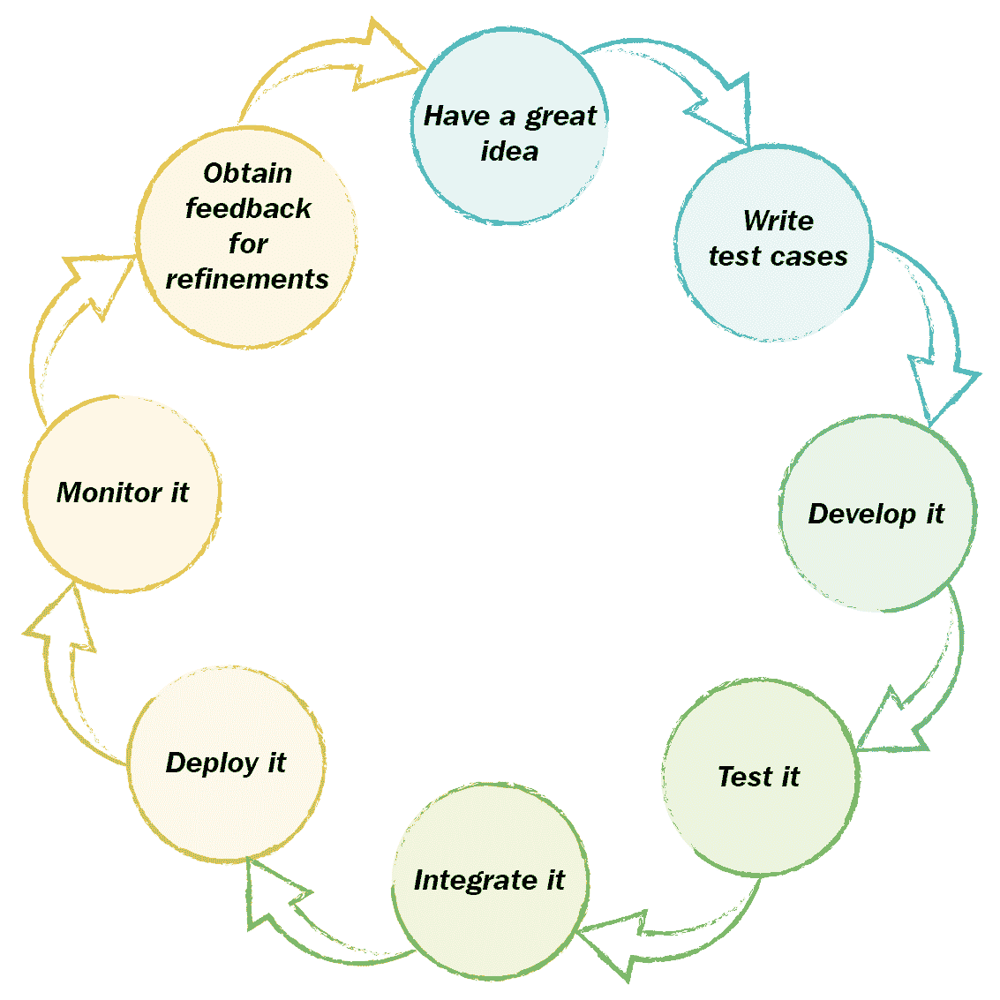

# 第一章：软件交付的演变

如前言所述，**持续交付**（**CD**）和 DevOps 是互补的工作方式。前者使任何通过软件交付客户价值的人能够迅速、一致地，并且—正如名字所示—持续地完成交付。后者则有助于协调交付和支持该软件的团队。两者都能帮助你优化、精简并改进工作方式，最终提高通过交付高质量软件来传递价值的能力。

需要指出的是，过去十年中，这些方法的真正意义已经被模糊化—无论是技术媒体的误解，还是招聘公司为了提高薪资而夸大其词，或者软件供应商和咨询公司希望通过跟风来赚取财富。

我已经总结了 CD 和 DevOps 的**定义**，但在继续之前，可能有助于我强调它们**并非**什么：

+   持续交付和持续部署并不相同——前者关注的是商业价值，而后者是交付软件的机制。

+   DevOps 工程师不是魔法师。软件工程师和 DevOps 工程师本质上是一样的——前者创建用于生成软件资产的文本文件，后者创建用于生成运行该软件所需环境和配置的文本文件。

+   DevOps 并未取代传统的系统运维活动和方法——它扩展、补充并增强了这些活动。

+   DevOps 并不消除确保软件及其运行环境高度安全的需求——尽管它可以促进 SecOps 的采纳和实施。

+   CD 和 DevOps 并不是解决所有流程和业务问题的灵丹妙药，尽管它们能帮助减少整体问题的数量。

你需要考虑的一点是，几乎所有成功的软件公司都会经历多个演变阶段。它们通常从一个小而专注的团队开始，拥有很好的创意、雄心壮志和一些投资。随着市场份额、覆盖范围和收入的增长，通常会出现一个快速增长的阶段，体现在员工和支出的增加上。随着公司成熟并且站稳脚跟，它们会进入下一阶段，要么继续大规模增长以保持竞争优势，要么成为并购的目标——这通常取决于投资者希望多快看到回报。

同时，也不可避免地，随着业务的演变，日常的业务流程会变得更加复杂，这反过来会导致软件交付的复杂性和困难。

CD（持续交付）和 DevOps 的采用可以帮助减少这种复杂性和痛苦；然而，企业可以获得的效果和好处在很大程度上取决于企业在进化阶梯上的位置。如果你偏离了目标，采用这些方法可能反而会带来更多麻烦，甚至可能使整体业务变得更糟。不仅如此，企业是奇特且独特的存在——尤其是那些以提供软件解决方案为生的企业——没有两家企业是相同的；因此，采用这些方法需要量身定制，才能切合实际。

本章我们将涵盖的主题如下：

+   对软件交付进化各个阶段的更详细解释

+   每个阶段的优点和缺点

+   如何确定你处于哪个阶段

+   CD 和 DevOps 工作方式可能带来的未曾预见的优势

为了更容易理解这些实际意义，我们现在将通过追踪一个典型的软件公司——ACME 系统的进化过程，深入探讨这些阶段。

# ACME 系统——进化阶段 1.0

ACME 起步时与全球成千上万的小型软件公司有一些共同点：它有一些不错的创意，并且看到了市场中的一个可以利用的空白，从而可以借此发财。它的资金相对较少，因此需要快速行动才能生存下去，并且必须不惜一切代价迅速吸引、招募和留住客户。它通过在客户需要之前交付他们想要的产品来实现这一目标。如果交付过早，可能会浪费资金构建客户最终决定不再需要的解决方案；如果交付过晚，别人可能已经抢走了公司的市场份额——以及收入。这里的关键词是交付。

作为一家小型初创公司，在初期，进展缓慢，工作艰难：大量的研发，拼命构建的预售原型，快速且粗糙的交付，以及不切实际的截止日期。在经历了许多漫长的日子、夜晚、周末和几个月之后，事情终于开始有了起色。客户群体开始增长，订单和收入也开始滚滚而来。过了一段时间，员工人数达到了两位数，创始人也变成了董事。

那么，这与 CD 或 DevOps 有什么关系呢？实际上，关系非常大。一个小型软件公司的文化、默认行为和工程实践，在 CD 和 DevOps 方面被视为相当不错。例如：

+   开发人员与运维团队之间几乎没有任何障碍——事实上，他们通常是同一个团队

+   开发人员可以完全访问生产环境，并能够密切监控他们的软件

+   业务的所有领域都专注于同一目标，即尽可能快速地将软件投入生产环境，从而让客户满意。

+   交付速度至关重要

+   如果出现故障，每个人都会聚集起来帮助修复问题——即使是非工作时间

+   软件快速演进，特性以增量方式添加

+   工作方式通常是非常敏捷的

+   跨业务部门的沟通和协作高效且大多数情况下有效

提出小型软件公司文化、默认行为和工程实践属于“相当好”而非“理想”的原因是，小型软件公司通常必须以某种方式运作以生存，这其中有很多缺陷：

+   为了赶上截止日期，常常会削减角落，导致软件设计、质量和优雅性受到妥协

+   应用安全最佳实践常常被忽视或根本不予考虑

+   为了赶上截止日期，工程最佳实践常常被妥协

+   技术债务的概念几乎被忽视

+   测试不会是开发人员的首要任务（即使它是，也可能没有足够的时间以测试驱动的方式进行工作）

+   源代码和版本控制系统没有严格遵守使用规则

+   由于可以无限制地访问生产环境，因此可以随意且不受控制地调整基础设施和环境设置

+   软件发布将主要是手动操作，并且大多数时候是整体系统设计后的附加考虑

+   有时，粗糙且即用的原型可能会直接成为生产代码，且没有机会进行重构

+   文档稀缺或不存在——现有的文档很可能是过时的

+   在小型软件公司工作的工程师的工作与生活平衡是不可持续的，倦怠确实会发生

让我们看看 ACME 系统的软件交付流程 1.0 版本，老实说，这不应该花太多时间。

# 软件交付流程版本 1.0

以下图表展示了 ACME 系统用于交付软件的简单流程。它简单、优雅（以一种粗犷的方式），且易于沟通和理解：

ACME 1.0 版本的软件交付流程概览

这个非常简单的流程是许多小型软件企业和初创公司会认同的。从 CD 和 DevOps 的角度来看，构建和交付软件的人员与支持它的人员之间几乎没有障碍（我们将在本章后面详细讲解这一点）。

让我们往前看几年，看看 ACME 系统的现状，并从中获得一些关于成为行业领导者的好处和陷阱的见解。

# ACME 系统进化阶段 2.0

企业的规模和营业额都在增长。客户基础已扩展到全球，ACME 软件平台每天为数百万客户提供服务。ACME 系统作为一家公司已经建立了稳固的基础，声誉良好，并被认为是该领域的前沿者。然而，增长和投资的水平已经对利润产生了影响——利润几乎是不存在的。

ACME 系统的董事会接到了一个来自更大竞争对手的收购提议。董事会和投资者认为这一提议具有良好的商业意义，且将有助于未来业务的稳定，因此同意出售。总体而言，大家都对这笔交易感到满意，大多数人视此为他们终于迎来成功的标志。

一开始，一切都很顺利——事实上，一切都非常好。ACME 系统团队现在获得了所需的支持，可以投资于业务并实现扩展，进而获得真正的全球影响力。它还可以专注于重要事项，例如构建高质量的软件、扩展软件平台、投资于新技术、工具和研发。企业中较为枯燥的一面——行政管理、项目与程序管理、销售、市场营销等等——可以交给已经拥有这些体系的新母公司来处理。

ACME 工程团队满怀期待地向前推进。投资的规模之大，以至于软件工程团队在几个月内翻了一番。现在称为研发团队的团队引入了新的开发工具和流程，以加速高质量软件的交付。敏捷方法在研发团队中得到了广泛采用，充分利用工程最佳实践的机会也得以实现。原先的 ACME 平台开始出现老化的迹象，逐渐显得力不从心，因此又获得了进一步投资，以重新设计并重写软件平台，采用最新的架构方法和技术。简而言之，研发团队觉得一切开始走向正轨，且有机会做对的事情。

与此同时，负责生产环境的 ACME 工程团队成员被吸收到母公司的全球运营组织中。从表面上看，这似乎是个非常好的主意；数据中心里充满了尖端设备，云能力、全球网络能力和可扩展的基础设施一应俱全。所有托管和运行 ACME 平台所需的资源都在这里。和研发团队一样，运营团队拥有比他们曾经梦想的更多资源。除了硬件和基本的设施，运营团队还有可用于维护质量、控制平台变更的资源，并确保平台能够稳定运行并提供 24 小时不间断的服务。

在这一切之上，母公司也拥有成熟的治理结构，以及程序和项目管理职能，用以控制和协调整体的端到端产品交付时间表和流程。

表面上看，一切似乎都很美好，团队们比以往任何时候都更加高效地工作。最初，这的确是事实，但很快，情况开始发生下滑。在表面之下，情况并非那么美好：

+   交付软件变得越来越困难——原本只需几天的工作，现在可能需要几周甚至几个月。

+   随着新的 ACME 平台快速增长，更多的功能被添加，变更不断进行，发布变得过于复杂且越来越大。

+   尽管在重新架构 ACME 平台方面取得了一些进展，但系统深处仍然存在大量有缺陷的遗留代码，它们顽固不化，拒绝消失。

+   研发团队成员现在距离生产环境如此遥远，以至于他们对自己编写的软件如何运作或表现一无所知，直到软件最终上线。

+   运维团队成员现在距离开发流程如此遥远，以至于他们对交付的内容以及其开发方式一无所知。

+   在软件变更能够接近生产服务器之前，必须通过许多公司流程和解决各种过程障碍。

+   质量开始受到影响，因为最后一分钟的更改和匆忙的错误修复被应用于适应发布周期。

+   在快速而松散的开发阶段积累的技术债务开始引发重大问题。

+   越来越多的研发资源被投入到协助发布的工作中，这影响了新功能的开发。

+   部署导致了生产停机时间的延长——包括计划内和计划外的停机。

+   截止日期被错过，利益相关者受到失望，信任正在被侵蚀。

+   曾经光辉的声誉正在被玷污。

然而，主要问题在于，这种渐进性的损耗已经缓慢发生了数月，并非每个人都注意到——他们都太忙于试图完成交付。

现在让我们重新审视软件交付的流程，看看自上次查看以来发生了什么变化——这不是一幅美丽的画面。

# 软件交付流程版本 2.0

如下图所示，ACME 团队的情况变得非常复杂。曾经简单优雅的流程变得复杂、曲折且高度低效。步骤和障碍的数量增加了，使得软件交付变得极为困难。事实上，几乎什么都做不成了。以下图表概述了 ACME 版本 2.0 的软件交付流程：

ACME 版本 2.0 软件交付流程概述。

这一远非简单的流程是许多大型软件公司都会认识到的。从持续交付和 DevOps 的角度来看，这个流程远非理想，因为现在交付软件的团队与支持它的团队之间存在许多障碍。

坦率地说，所描绘的流程实际上缺少一些关于变更管理环节的附加细节，这些细节可能会增加更多的复杂性、工作量和痛苦。让我们补充这些细节，再次审视一下：

ACME 版本 2.0 软件交付流程的更现实概述。

正如你所看到的，情况远非理想。曾经高效有效的流程现在已经变成了完全的反面。更重要的是，所有参与变更交付的人之间的对话、沟通质量和信任，充其量是支离破碎的，最糟糕的是几乎完全不存在。曾经的五分钟咖啡聊天现在变成了 20 页的邮件线程、会议和 Skype 聊天。前 ACME 工程团队成员不再像同事，更像是深陷战斗的对手。

这个过程不仅冗长，而且一个变更在没有问题地完成整个流程的机会非常渺小——大多数情况下，变更必须在循环中绕一圈又一圈，才能算作可以发布的版本；例如，过程中任何环节发现的缺陷可能会将变更推回到流程的开始。

我提到对话、沟通质量和信任是有非常特定的原因的——你在 CD 和 DevOps 相关的许多文章和讨论中会看到，它们似乎暗示一些新的工具和最佳架构方法会提供你所需要的东西。虽然这些可能有所帮助，但也可能会带来巨大的阻碍——特别是在公司经历组织变革和/或增长的同时引入这些变更时。在 ACME 的例子中，变化来得太快，大家都没能理解发生了什么，旅程将会走向何方。这不可避免地导致了人性发挥作用，人们在混乱中建立起了屏障和孤岛，以保持一些稳定。

如果你把这一切都考虑进去，从外部的角度看，ACME 系统用来交付软件的过程，现在在实际意义上已经完全失败了。

好吧，这可能有点夸张，但它突出了一个问题，那就是在那些参与变更交付的人之间——尤其是研发团队成员（负责交付急需的变更和功能）与运维团队成员（负责支持将要应用变更的生产环境）之间，存在着相对的巨大隔阂，这完全可能导致事情脱轨。

# 从内部看外部的视角

正如之前所说，并非每个人都注意到了组织中的人员流失——幸运的是，还是有一些细心的人察觉到了。少数 ACME 团队成员意识到情况并不理想，决定从外部的视角回顾问题。然后，他们开始清楚地看到了整体流程中的问题，并决心让所有人都看到这些问题。此外，他们决定解决这些问题——只是有一个小问题，如何在每个人都全力以赴地在自己的孤岛内以解决自己的问题、以任何代价交付软件的情况下做到这一点。

起初，他们投入了大量个人时间来研究和构建简单粗糙的工具，包括构建和测试自动化、**持续集成**（**CI**）、持续部署流水线和系统监控解决方案。其目的是尽可能自动化断裂流程中的各个部分，以减少痛苦。他们还在技术驱动的同侪群体中积极宣传这些想法。尽管大多数人欢迎他们的想法和建议，但没有足够的动力去采纳这些新式工具——每个人都忙于在断裂的流程中交付软件，他们需要另一种方法。

他们决定需要一些帮助，于是寻求了一位在更广泛业务中具有影响力、志同道合的经理，帮助他们获得急需的支持。在经过多次劝说、讨论和恳求后，这位经理同意帮助他们获得预算，组建一个专注于推进 CD 和 DevOps 工具的小团队。新成立的团队成员花了几个月的时间识别并拆解最紧迫和最痛苦的问题，构建、安装并实施了能够缓解一些痛苦的工具——为了便于采用，许多工具是量身定制的，以适应现有的流程。

这在一定程度上解决了断裂的流程，但现实是，这些工具并没有产生他们预期的影响。实际上，为了使工具适应现有流程，它们本身需要做出如此多的修改，以至于它们开始变得不可靠和过于复杂，甚至最初支持这种方法的人开始质疑自己决策的有效性。

最终，存在一个更大的问题是工具无法解决的——那就是组织本身的文化、其中人员的行为，以及多年来在分裂的业务孤岛之间形成的各种脱节的沟通方式。很明显，所有的工具和中国的茶都无法缓解痛苦；需要更为彻底的变革。

团队成员重新聚焦，并很快意识到，真正需要改变的不是工具去适应流程，而是流程和工作方式本身需要改变。如果这个问题得到解决，工具可以直接从货架上取下来——可以这么说——并且无需大量修改就能使用。团队成员必须大幅改变方向，减少对技术的关注，更像是业务变革的推动者。他们随后将这一显而易见的事实传递给尽可能多的组织内外人员，同时这位有影响力的经理努力争取高层领导的支持，以实施深远的业务变革。幸运的是，他们在组织内的声誉和地位使得获得支持变得容易。

我们现在进入了演变的第三阶段，事情开始重新聚集在一起，ACME 团队重新获得了在需要时交付高质量软件的能力。

# ACME 系统演进阶段 3.0

现在，CD 和 DevOps 团队得到了高层的正式支持，成员们开始解决破碎的文化和行为，制定克服和/或消除障碍的方法。他们不再仅仅是一个技术团队；他们是业务变革的催化剂。

任务明确——采取一切必要措施简化软件交付流程，并使其无缝且可重复。实质上，实施我们现在通常称之为 CD 和 DevOps 的内容。

他们首先做的就是与尽可能多的业务人员进行交谈，确保他们也意识到破碎的流程及其根本原因。简单来说，如果有人积极参与将软件从构想到消费者的决策过程，或参与支持软件上线后的工作，他们就是交谈对象。这不仅收集了有用的信息，还为团队提供了传播理念和建立志同道合网络的机会。

团队有一个愿景，一个目标，其成员热情地相信需要做的事情，并且他们有能量和动力去实现它。

在接下来的几个月里，他们将开始（包括其他事项）：

+   举办各种深入的会议，以理解并绘制端到端的产品交付流程

+   根据使用者的持续反馈，精炼和简化工具——在适用的情况下，将内部开发的解决方案替换为现成的产品

+   解决管理依赖关系和部署顺序的复杂性

+   邀请 CD 和 DevOps 领域的专家独立评估所取得的进展（或者没有进展，根据具体情况）

+   安排离线的 CD 和 DevOps 培训，并鼓励研发和运维团队成员共同参加培训（真是令人惊讶，很多 DevOps 合作都是从酒店酒吧的一次聊天开始的）

+   减少整个软件发布过程中众多的交接和决策点

+   消除障碍，使开发人员能够安全地将自己的软件部署到生产平台

+   与其他业务职能部门合作，赢得信任，并帮助他们完善和简化他们的流程

+   消除“我们和他们”态度与行为，强化基于信任的关系

+   与研发和运维团队合作，尝试不同的敏捷方法论，如看板、Scrum 和精益方法

+   公开透明地分享关于交付和进展的数据和信息，涵盖所有业务领域

+   用开发人员能够密切监控其在生产环境中运行的软件来取代复杂的性能测试需求

+   消除需要停机以发布更改的需求

+   在整个业务范围内推广，分享并推销 CD 和 DevOps 的整体愿景和价值

这绝非轻松之事，它需要决心、坚定的专注、耐心，最重要的是，需要时间来产生可量化的积极结果。然而，几个月之后，愿景和好处开始显现。如今，构建和交付软件的流程已经发生了转变，以至于代码更改可以在几分钟内构建、完全测试并部署到生产平台——而且是一天中多次进行的操作——这一切只需按下一个按钮，由进行更改的开发人员启动并监控，且完全没有停机时间，对客户几乎没有或没有影响。利益相关者拥有了一种可信赖且可靠的方式来向客户交付价值，研发团队拥有必要的工具和授权，可以按需交付价值，运维团队则拥有一个可以支持和优化的稳定可靠平台。

让我们再次回顾一下软件交付流程，看看已实现了哪些成果。

# 软件交付流程版本 3.0

从图表中可以看出，整个过程看起来更加健康。它不像版本 1.0 那样简单，但它高效、可靠且可重复。一些在版本 2.0 中非常必要的制衡机制被保留下来，并经过优化，以增强而非阻碍整体流程：

ACME 3.0 软件交付流程概览

这个更加优雅和顺畅的流程是一个成熟而现代的软件企业所能认同的。那些负责交付软件和支持软件的人之间的隔阂，旨在确保一定程度的控制和质量保证，但双方都能从中受益并且接受它们。

这个高效的流程解放了宝贵的研发和运维资源，让他们可以专注于自己最擅长的事情——开发和交付新的高质量功能，确保生产平台健康，令客户满意。

ACME 系统团队找回了自己的动力，正朝着更加自信和有动力的方向前进。现在，它拥有了两全其美的优势，前方没有任何阻碍。

# ACME 系统版本 3.0 及之后

ACME 系统团队的成员在经历了挑战后变得更加坚韧和精简，但他们的故事并未就此结束。和任何成功的企业一样，他们不会自满，而是决定扩展到新的市场和机会——即构建并交付移动优化客户端，以便与其核心的基于 Web 的产品互补并协同工作。

在整个进化过程中，他们学到了很多，他们知道已经有了一种最佳的工作方式，可以让他们在客户需要时交付客户想要的优质产品，并且知道如何快速、可靠、渐进地交付。然而，将功能交付到托管的基于 Web 的平台的复杂性与将功能交付到终端消费者的移动设备的复杂性是不同的——它们是可比的，但并不完全相同。例如，每天多次将代码交付到生产服务器的过程由 ACME 团队控制，而他们几乎无法控制如何将移动客户端交付给最终客户，也无法控制最终客户是否会在各种应用商店发布移动客户端的情况下，何时安装最新的版本。此外，移动客户端将要安装的生产平台在规格、性能和存储方面几乎是未知的。

不过，一切并未失去——远非如此。ACME 系统团队的成员们在进化过程中学到了大量的知识，并决定像以前一样应对这一新挑战。他们知道自己可以以一致的质量构建、测试和交付软件。他们知道如何以渐进的方式交付变更，且几乎不会带来任何影响。他们知道如何支持客户，并迅速响应变化。他们知道自己的文化已经成熟，整个组织能够团结一致，克服共同的挑战。

随着新业务的进展，他们还发现了另一个副作用：他们重新点燃的成功带来了流量和交易量的快速增长。因此，他们需要扩展平台，并且必须尽快完成。与其依赖自己的数据中心，他们决定将整个平台迁移到一个全球分布的云解决方案。这带来了新的挑战：基础设施完全不同，资源配置工具是新的，用于构建和交付软件的工具与现有的 ACME 工具不兼容。同样，ACME 系统团队迎难而上，凭借高度协作的工作方式、技术和方法，继续自信地前进，这些方式、技术和方法现在已经成为他们文化的一部分。

那么，ACME 系统 1.0 版的业务能否应对这些新挑战并取得成功呢？这有可能，但结果可能会是好坏参半，风险会大得多，质量也会更低。很明显，ACME 系统 2.0 版的业务将面临重大困难，到产品进入市场时，它们可能已经过时，并且与更迅速、更精简的竞争对手争夺市场份额。

让我们从一个整体的角度来看，这一切意味着什么。

# 进化简述

在本章中，我们一直在跟踪 ACME 系统的演变：它们的起步，成功带来的成长烦恼，如何发现快速增长既带来负面影响也带来正面影响，如何通过采纳 CD 和 DevOps 克服差点灭绝的困境，以及如何恢复活力和信心继续前进。所有这一切可以通过以下简单的图表来表示：

ACME 系统演变概述

他们还学到了一些东西——虽然是在进化的后期——那就是 CD 和 DevOps 的采纳与技术工具无关，完全取决于人们如何协作。如果没有对参与端到端交付过程的每个人的文化和行为进行改变，几乎不可能实现并最大化成功采纳 CD 和 DevOps 所带来的好处。可以说，如果他们从一开始就知道这一简单但常常被忽视的事实，采纳就会更早发生，企业也会更早变得更强大。希望这为你在阅读本书的剩余部分时提供一些思考。

# 我在进化阶梯上的位置在哪里？

在本章开头，我提到采用 CD 和 DevOps 的有效性在很大程度上取决于一个企业在进化阶梯上的位置。我们已经经历了 ACME 的演变及其所经历的各个阶段。请注意，ACME 是虚构的，它的故事非常简单。现实中的企业并非如此——远非简单——要确定一个企业在 CD 和 DevOps 进化阶梯上的位置是相当困难的。如果没有这些信息，很难理解企业的接受程度、反应能力以及对采纳的开放性。

话虽如此，有一些简单的方法可以让你更清楚地了解情况。例如，以下问题列表可以帮助你大致了解。看一下你的企业，问问自己以下问题：

|  | **选项 #1** | **选项 #2** | **选项 #3** |
| --- | --- | --- | --- |
| 你的业务是否更注重流程而非人员？ | 流程 | 人员 | 我们没有任何值得一提的流程。 |
| 项目计划中的不可移动的截止日期是否优先于逐步交付高质量解决方案？ | 是的，按时完成任务是唯一重要的。 | 我们在至少一个领域具有灵活性，可以进行小范围调整，并重新规划以确保质量不受影响。 | 我们会做任何必要的事情来保持客户满意。 |
| 你的项目是按照固定的时间表、固定资源和固定范围来执行，还是具有灵活性？ | 是的，所有这些都事先商定、签署并精心规划。 | 不，我们在至少一个方面具有灵活性。 | 我们会做任何必要的事情来保持客户满意。 |
|  | **选项 #1** | **选项 #2** | **选项 #3** |
| 开发人员是否可以访问生产环境？ | 不，为什么我们要信任开发人员不会搞砸事情？ | 所有开发人员都有对实时环境的安全只读访问权限，并可以通过特定工具访问所有配置。 | 是的，他们可以完全访问，并做任何需要做的事情。 |
| 失败是被鄙视还是作为学习的机会？ | 失败就是失败，没有借口——责任人会被开除。 | 我们确保失败的影响最小，并从错误中学习。 | 失败意味着公司倒闭，我们都得失业。 |
| 谁负责处理超时的生产问题？ | T1 帮助台，T2 运营支持和 T3 应用支持团队为其提供后备支持。 | 通常有一个联系人随时待命，可以联系任何他们需要的人。 | 软件工程团队中的每个成员都需要处理。 |
| 当代码准备好时，你能立即部署吗，还是需要等待预定的发布？ | 发布团队根据已达成的程序计划，通过 CAB 和过渡团队安排并同意将代码交付到生产环境。 | 我们信任工程师在确定代码准备就绪且不影响整体质量时使用我们的部署工具进行发布。 | 我们的工程师通常在代码编译完成后，直接通过 FTP 将代码上传到生产服务器。 |
| 高层领导是否理解交付软件的复杂性和挑战？ | 他们不清楚具体细节，但项目管理办公室（PMO）会编制并生成许多报告，这些报告会在项目审查会议中定期审查。 | 他们都有访问工具，可以看到各个项目及其进展的相关指标。 | 他们没有时间或兴趣去理解这些——他们只是期望事情能按时完成。 |
| 工程团队是否了解公司在商业方面的表现？ | 所有顶级财务信息由首席财务官编制并每 6-12 个月在公司内网发布。 | 他们都有访问工具，能够看到当前的 KPI 和衡量进展的指标。 | 他们不了解，但只要工资照发就足够了。 |
| 工程团队是否能访问客户反馈？ | 通常由客户服务团队收集并审核，作为缺陷或增强请求提出。 | 客户反馈通过专门的工具收集并对所有人开放。 | 是的，这通常与需要修复的缺陷和错误相关。 |

如果你将这些应用于 ACME 公司在其发展过程中的某些阶段，你会发现，1.0 版本的公司大多会回答第 3 个问题，2.0 版本的公司大多会回答第 1 个问题，而高度进化的版本的公司则大多会回答第 2 个问题。

上述内容仅仅是一个示例，旨在让你从一个非常宏观的角度了解如何评估企业的成熟度以及它在持续交付（CD）和 DevOps 发展过程中所处的位置。你无疑会有一些额外的、互补的或更相关的问题可以使用。然而，如果你遵循类似的格式，你将能够感知当前的情况，更重要的是，能够识别出哪些领域最需要关注。你应该尽可能多地扩大视野，从企业的各个部分获取反馈，这样，当你决定深入实践时，就不会遇到惊讶的情况。

# 摘要

ACME 系统的发展故事并非今天许多软件企业的典型代表。无疑，你会认出并与 ACME 旅程中描述的一些特点和挑战产生共鸣，你现在应该能够绘制出你的企业（或你客户/合作伙伴的企业）在持续交付（CD）和 DevOps 发展过程中的位置。你还全面了解了什么是 CD 和 DevOps，以及它们不是些什么。

我们现在将从讲故事的模式转变，开始更详细地探讨采纳 CD 和 DevOps 的一些实际方面，首先从如何识别那些可能（并且确实）会阻碍高质量软件交付的潜在问题开始。

在第二章《了解当前的痛点》中，我们将探讨如何识别**软件交付生命周期**（**SDLC**）中的问题和挑战，并突出一些工具、技术和方法，以便发现这些问题并加以解决。
