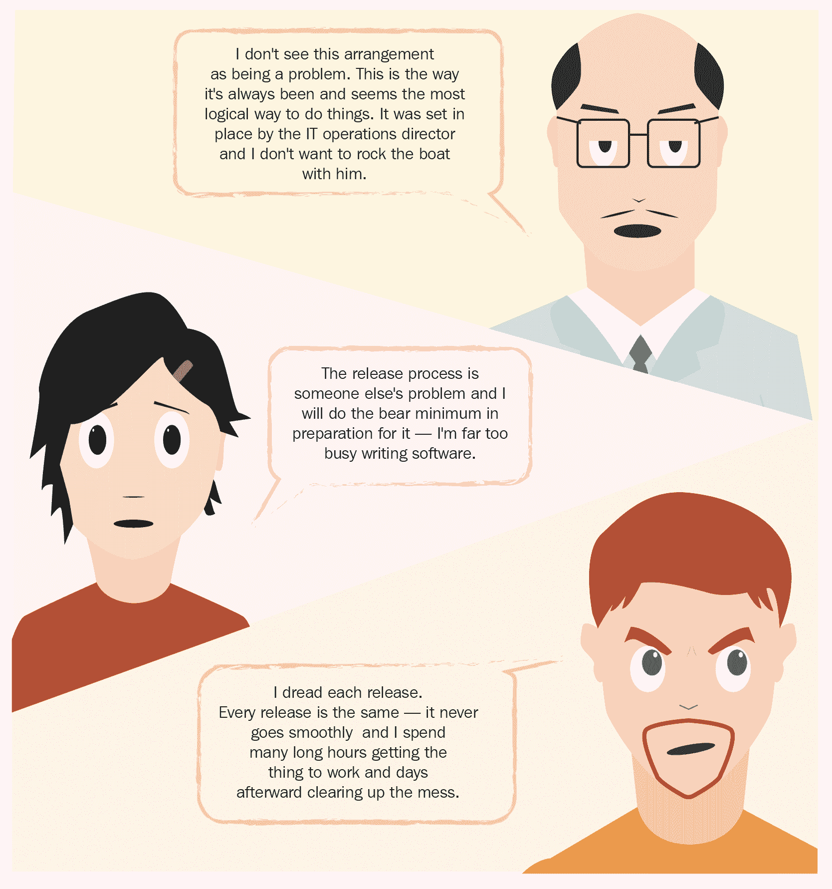
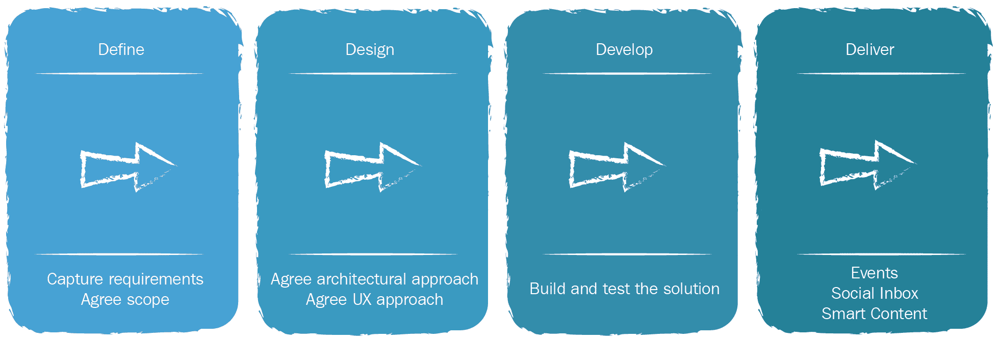
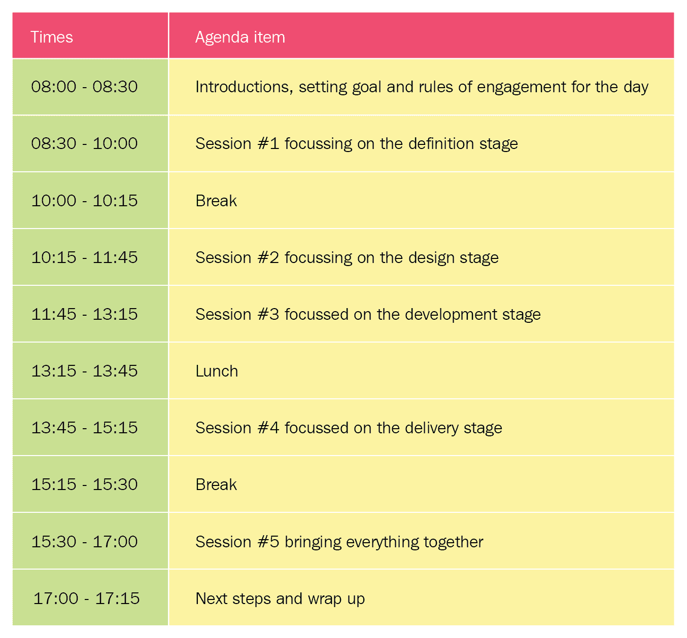
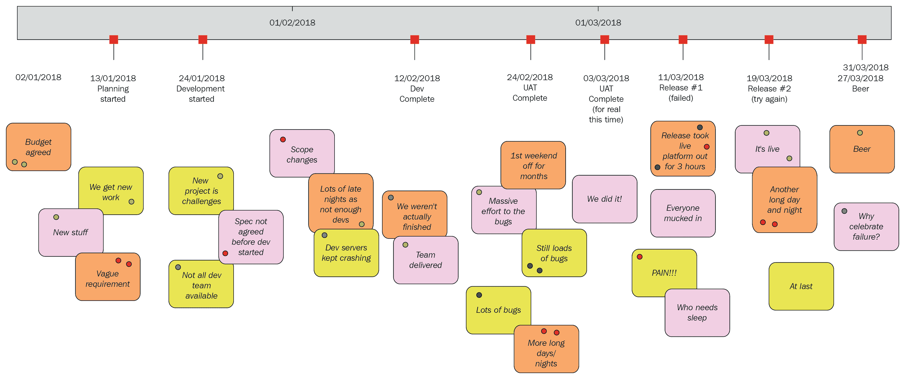
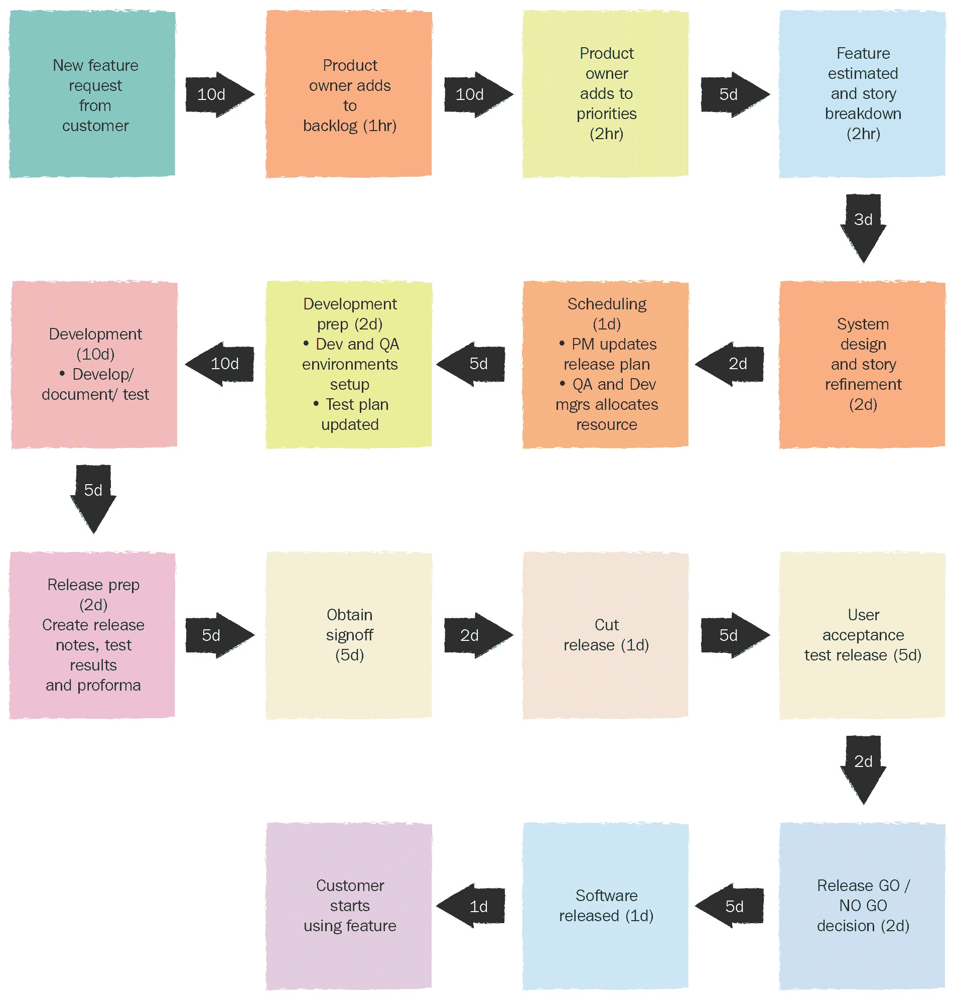
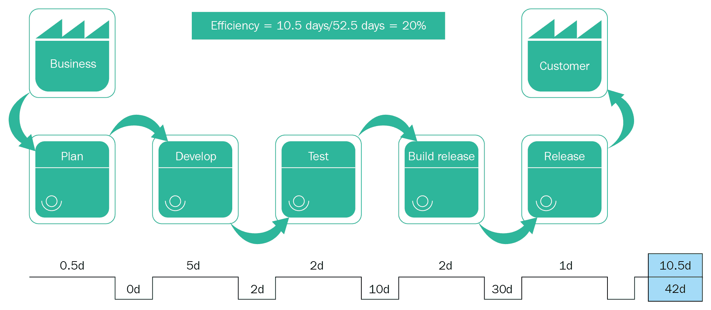

# 第二章：理解你当前的痛点

在第一章《软件交付的演变》中，你被介绍了 ACME 系统，并了解了它是如何意识到软件交付过程中存在问题（严重影响了它满足客户期望并为客户创造价值的能力），以及它是如何识别并解决这些问题，进化并在经过一番努力、决心和时间后，采用了 CD 和 DevOps 的工作方式来克服这些问题的。

这个基于虚构商业的故事相当简化和线性，以便让你作为读者更容易理解。现实生活从来不会那么简单，但在讲述过程中提出了一些关键点，实际上是适用于现实企业的。对于任何考虑—或积极推进—采用 CD 和/或 DevOps 的企业来说，最重要的一点是，必须有一个明确的理由去进行这种采纳。CD 和 DevOps，像任何解决方案一样，可以帮助你解决一个问题—或一系列问题—但你需要真正理解并量化这些问题；否则，你永远无法确定这个解决方案是否有帮助。

就像 ACME 系统所做的那样，你需要花时间并付出努力，正如那个广泛使用的敏捷术语所说，在适应之前必须先进行检查。

你对这个问题的第一反应可能是，你没有任何问题，一切都运作良好，参与你软件交付过程的每个人都非常高效、积极投入，并且富有动力。如果这确实是事实，那么以下其中一项已经发生：

+   你已经达到了软件交付的理想状态，因此此时无需再继续阅读。

+   你在自我否认

+   你还没有完全理解高效且精简的软件交付应当是什么样的

更可能的是，你有一个可行的软件交付过程，但在整个过程中某些环节—可能是某些团队或个人—让事情进展缓慢。这通常不是故意的；也许有一些必须遵守的规则和规定，也许需要一些质量门槛，也许没人曾经质疑为什么某些事情必须以特定方式进行，大家都在照常做，或者也许没有人强调发布软件究竟有多重要。

需要考虑的另一点是，组织内的不同人员对同一问题的看法可能会有所不同（或根本看不到）。让我们暂时回到 ACME，看看三个人物（经理 Stan、开发者 Devina、运维人员 Oscar）在软件发布完全由运维团队控制的情况下各自的看法：

正如你所看到的，不同的人根据他们在整体流程中扮演的角色，会有截然不同的看法。为了便于理解，本示例只列出了三种角色——实际上，会有更多的人，他们各自会有稍微不同的观点；想象一下项目经理、发布经理、技术写作人员、安全运营人员，甚至是 CEO 会如何看待这一特定场景。

假设我们确实在软件发布过程中遇到了一些问题，并且想要弄清楚问题的根本原因——或者更可能是多个根本原因——以便让整个流程更加高效、有效并简化。正如之前所说，在你**能够**进行适应之前，你**需要**进行检查——这是大多数敏捷方法的基本前提。接下来的章节将展示一些有助于解决这些问题的方法和技巧。

本章中，我们将探讨以下主题：

+   如何识别软件交付流程中的潜在问题和挑战。

+   如何在不陷入指责游戏的情况下揭示问题。

+   有时候，保持诚实和开放是很困难的，但这样做能带来最好的结果。

+   你组织中的不同人将以不同的方式看待相同的问题。

在我们开始探讨如何检查之前，我想稍微偏离一下话题，聊聊一只通常是灰色的大型哺乳动物。

# 房间里的大象

我们其中一些人有一个非常真实且令人担忧的困扰，这个困扰影响着我们的工作生活，那就是“房间里的大象盲症”——或者用它的医学名称来讲，叫做“巨兽在位视觉障碍”。那些受到影响的人意识到有一个巨大的问题或障碍挡在他们面前，妨碍了他们的进展、效率和参与的意愿，甚至削弱了他们的士气。这些可怜的灵魂通常会怎么做呢？他们通常选择要么接受这个问题，要么更糟的是忽视它——取决于问题的大小。那些不选择视而不见的人，通常会找到巧妙的方式来绕过、规避或避免这个问题，通过对自己的工作方式进行局部的改变来应对。有时候，这会以牺牲他人为代价。事实上，他们通常会投入大量的精力、时间和金钱来建立这些巧妙的解决方案，然后说服自己和他们的领导，这样做是最好的选择。

请允许我再进一步延伸这个比喻——请耐心听我讲，这有一个重点——我想转向艺术世界。艺术家班克斯（Banksy）在他 2006 年在洛杉矶举办的“几乎合法”展览中展出了一件生动的艺术品。这件生动的艺术品是一只成年印度象，站在一个临时搭建的客厅里，墙上有花卉图案。这只大象从头到脚都被*涂上*了同样的花卉图案。这件作品被命名为——运气好的话——“房间里的大象”。起初这似乎荒谬，你可以清楚地看到一个重达 12,000 磅的大象站在那里；虽然它被涂成与周围环境融为一体，但它仍然是一只大象明目张胆地站在那里。这带我来谈我的观点，软件交付过程中的问题和挑战就像是这头大象，我们简直荒谬地忽视或者不加质疑地接受它们的存在。

就像现实生活中一样，软件交付过程中房间里的大象不难发现。它通常就坐/站/潜伏在每个人都能看到的地方。你只需要愿意去看，知道如何去看，以及要寻找什么。一旦掌握了这些，揭示它的存在就会更容易。

在本章的剩余部分，我们将介绍一些方法来帮助突显房间里的大象的存在，更重要的是，如何确保尽可能多的人也能看到它，并意识到它不是可以避开、绕过或忽视的东西。

在你开始从比喻性的大象身上去掉比喻性的花卉图案之前，你还需要做一些功课。

# 定义规则

任何检查、暴露、调查或审查都会在某种程度上需要挖掘出一些“污垢”—比喻而言。这是不可避免的，不应该轻视或对待得轻浮。将会问到的问题包括以下几个：

+   为什么事情以某种方式进行？

+   最初是谁提出了这个流程？

+   是谁做出了优先决策来做一件事而不是另一件事，他们有什么权利做出这个决定？

+   决策是何时做出的？

+   谁拥有整个产品交付过程？

+   谁拥有流程中的各个步骤？

+   之前有人质疑过这个流程吗？如果有，发生了什么？

+   是否有人真正知道这个流程是如何从头到尾运作的？

+   为什么管理层看不到显而易见的问题，为什么他们不听我们的意见？

这些问题可能会让一些人感到非常不舒服，并可能揭露出一些事实，激发情绪反应或情感反应——尤其是那些曾经参与设计和/或实施你正在审视的流程的人。即使他们能够看清并理解他们曾经培育的流程是有问题的，他们可能仍然对其有情感依赖——尤其是如果他们已经参与了很长时间。你需要意识到，这些人可能是帮助替换和/或完善流程的关键人物，所以要小心行事。

为了保持纯粹的职业水平，你应该制定一些基本规则，明确调查的目的和目标。这些规则需要简洁明了，所有参与者都能理解，并且用积极的语言表述。你需要关注以下几个方面：

+   我们试图理解现有的端到端流程是如何形成的。

+   我们需要了解有哪些商业、立法或法律上的约束。

+   我们需要了解多个不同的流程是如何相互连接，形成端到端的流程的。

+   我们需要验证我们的流程是否真正有效，是否能为我们和更广泛的业务带来好处。

+   我们希望能把问题和障碍暴露出来，让每个人都能看到，并帮助解决它们。

+   我们希望改善现状。

为了进一步确保尽量减少情绪反应，你应该制定一些规则，以便让所有参与者明白什么行为是可以接受的，什么行为可能会越过界限。再次强调，保持这些规则简单明了，并用积极的语言表述，会帮助大家理解并记住它们。好的例子可能包括以下内容：

+   不进行公开指责和羞辱。

+   不进行人身攻击或“猎巫”式的行为。

+   这不是一场死后剖析。

+   没有绝对正确或错误的答案。

+   任何细节都不应被忽视。

+   坚持事实，不凭空想象。

+   摆脱自负情绪。

回顾分析可以是一个强有力的工具，帮助你更好地理解哪些方面可以改进，但如果使用不当，它可能带来比好处更多的麻烦——如果没有远见，你可能会多次“自伤其足”。在开始这类活动之前，你需要确保自己明白将面临什么。

现在让我们考虑一下你需要与哪些人合作，以及谁能提供最大价值。希望这两者是重合的，但事情往往没有那么简单或显而易见。

# 包容（几乎）所有人。

你需要的是来自那些能够积极贡献、参与其中、理想情况下愿意接受变革（或者至少希望看到事情朝更好的方向发展）并理解和同意前面提到的规则的人的信息和洞察。这些积极参与者应该来自业务的各个部门——如果他们参与产品的创建和交付，他们就应该被考虑在内。你需要广泛的信息和数据来推动工作，因此，你需要让更多的参与者参与其中。

为了确保你能识别尽可能多的人，你需要在组织中建立一个良好的网络，或者至少要有访问那些已经拥有良好网络的人的途径——尤其是当你的组织规模较大时，因为不可能识别并与每个人保持联系。你通常会发现，那些在公司工作较长时间的人，往往拥有一个成熟的、良好的内部网络，你可以利用这个网络。

从事产品支持、业务分析、产品管理、销售和市场营销，或者项目管理的人员是值得寻找的对象，因为他们大部分时间都在与组织内各方建立关系和网络。

你应该主动与这些人互动，并解释你想要做的事情——记住前面提到的积极措辞的目标和互动规则——并请求他们帮助建立你的名单。如果你还能将他们添加到参与者名单中，那么事情会更快推进，因为他们可以为你做一些宣传工作和实地调研。

正如本节标题所示，尽管你有最好的意图，希望让所有参与或受软件交付过程影响的人都参与，但这在大组织中既不现实也不实用——所以如果你能让几乎所有人参与，那就足够了。

当你开始编制参与者名单时——对于一个大组织来说，这可能是相当令人畏惧、需求巨大的，并且不是没有付出努力——你无疑会发现，随着你开始邀请人们参与，会有一定程度的自然选择；一些人可能会说他们太忙，一些人可能出于不愿透露的原因不想参与，还有一些人可能根本不关心。

# 识别关键人物

在编制参与者名单的同时，你还应该识别出流程中的关键人物。这些关键人物一开始可能并不显而易见；然而，在你建立网络时，向不同部门的不同人询问同样的简单问题，会让你更清楚这些人有多么重要。以下是一些简单问题的例子：

+   你认为我应该邀请谁来参加？

+   如果出现问题，你通常会找谁来沟通？

+   谁知道这一切是怎么运作的？

+   通常是谁会对流程进行修改？

还有一个很大的可能性是，许多关键人物会是那些说自己太忙的人。他们忙的原因可能直接与他们所在的工作流程出问题有关，但他们没有时间停下来意识到这一点。我强烈建议你花更多时间确保那些符合这一类的关键人物能够被鼓励、哄劝并说服参与进来。例如，你需要在协调他们的空闲时间方面非常灵活——这可能意味着需要在短时间内改变计划，仅仅为了能和他们挤出 15 分钟的时间；不过，我鼓励你这样做，因为那些不投入的参与者很可能会在未来成为活跃的反对者。

如果某些人是关键人物，有时让他们知道这一点会有所帮助，因为适当的满足他们的虚荣心有时能够帮助赢得他们的支持。同时，有时也可以打出“如果你不趁这个机会把事情处理好，别人可能会接手，结果可能更糟”的牌。

你无疑也会遇到一些人，他们非常（有时过于）急于参与，仅仅因为他们有私利要图，或者需要一个讲台来宣扬个人观点。这些人并不容易被直接发现，但通过几个恰当的问题，他们的意图就会变得更加明显——尤其是当他们的回答似乎带有偏见，并且包含诸如“指责”、“责任”、“他们”或“与我无关”之类的词语和/或短语时。如果这些人希望参与，那也没问题，但你需要意识到，这类人可能会使整个过程偏离轨道——这也可能正是他们想要参与的原因之一。有一点警告：不要简单地将这些人一笔勾销，因为他们可能会提出有价值的意见，忽视他们可能会导致更多的负面情绪，并使他们成为非常活跃的反对者。然而，你应该确保这些人同意成为积极的参与者，并理解你设定的基本规则。在接下来的阶段中，你无疑需要留意他们——就像班级里的调皮孩子——以确保避免干扰和负面情绪蔓延。话虽如此，你可能会对他们为过程带来的价值感到惊讶。

# 太多人指挥

当你建立起参与者名单时，你可能会遇到一个积极的问题——你有太多人想要参与。从某种程度上说，这是件好事——过度报名是一个不错的问题，因为你将能够收集到更多有价值的数据——然而这也会引发一些问题——如果你不加以管理，事情可能会迅速变得混乱和嘈杂。

如果你有过多报名者，而不是从名单中删除人，你应该考虑运行多个会话。稍后我们将更详细地介绍会话的格式，但可以说它们可以非常互动，并且有很高的积极参与度。因此，我建议你尽量保持每个会话的参与人数在可控范围内，否则你将会有太多声音和意见，造成过多噪音和讨论偏离主题。你还应确保每个会话的参与者来自业务的不同部门（例如，不要连续进行开发人员会议、运营会议和项目经理会议——要进行混合），因为你需要来自广泛领域的输入。

规则经验是，每次会议参与者应该是 20-30 人——除非你是非常有经验的促进者，否则你将难以保持秩序和集中注意力。

你也将面临一个身体上的挑战，你需要同时出现在两三个地方——除非你掌握了克隆或星体投射的艺术，否则根本不可能。因此，你应该依次运行会话，而不是同时运行，这样可以给自己一个休息和整理捕获数据的间隙。如果这不可能，那么你应考虑邀请一个或多个共同促进者，他们在揭示大象方面与你拥有相同的目标、动力和激情。在此提醒一句：你们所有人在方法上必须非常一致，否则可能会使数据偏倚。

如果你最终运行了多个会话，请确保每位参与者只参加其中一个会话——尤其是那些怀有怨恨之情的人。你希望确保每个人都有平等的发言权。

实质上，前述的等同于这样：你需要吸引并包括尽可能多参与到定义、构建、测试、交付和支持组织内软件的过程中的各种人。网越广，捕获的信息和数据就越相关，可以这么说。

调查的进行方式和参与者都非常重要，确保环境设置正确以使参与者能够开放、透明，尤其是诚实是至关重要的——这也将鼓励适当的行为表现出来。稍后我们将更详细地研究行为，但现在让我们专注于前述的三个关键领域。

# 开放性、透明性和诚实

要真正搞清楚一个问题的根本原因，你需要尽可能多地收集与此相关的信息和数据，这样你才能集体分析并达成共识，找到最好的解决方法——你需要知道大象到底有多大，才能暴露它并将其清除。大多数高级管理人员，尤其是那些受过高等 MBA 教育的高层管理人员，通常的反应是，随即聘请一家昂贵的商业变革咨询机构，进行一场封闭式的高层调查，邀请少数从中层管理中挑选出来的人参与，最终形成一份管理报告。

尽管这种老生常谈的方法可能会提供一些信息和数据，但我认为它并不能为你或公司提供所需的答案。此外，在这些类型的调查中，环境通常是这样的，参与者会感到自己受到监视和威胁，因此他们不会感到自由去诚实地披露相关信息——以防这给他们的记录和/或职业生涯带来污点。因为这个原因，基本的人类本能会开始发挥作用，重要的细节可能被遗漏，或者更糟的是，一些信息可能会被误解，甚至被断章取义。总的来说，封闭式调查是缺乏信任、不披露、不参与、眼光狭隘和秘密的温床。

# 隐藏真相的秘密

如前所述，要实际获得所需的信息和参与度，你需要创建一个开放和透明的环境，让积极的行为得以蓬勃发展。在这样的环境中，信任、诚实、披露和建设性对话是被鼓励并且司空见惯的。这并不意味着你必须在一个玻璃房里工作，所有对话都在公共场合进行，每个决策都由委员会作出。所需的是**完全没有秘密**。

让我通过一个例子来澄清我的意思：Bernie 是一家小型但成功的软件公司的 CEO。在过去的几个月里，越来越多的客户开始抱怨破坏承诺，明显匆忙发布的且充满漏洞的版本。她还听说员工们不满意，生产力下降。她考虑了以下几点：

+   勉强承认可能有一些需要解决的问题，并指示工程副总裁挑选一支他信任的团队，列出解决方案，并在一周内向董事会呈报。副总裁将被指示不得向封闭小组以外的人透露或讨论此事。

+   委托一家外部咨询公司进行高层封闭式调查。

+   邀请每位员工参加全天的研讨会，要求大家提供开放和诚实的反馈，讲述他们每天面临的问题。然后，她将召集领导团队，一起花几周时间公开讨论所有反馈。接着将安排一次后续研讨会，诚实地讨论和辩论各种提出的问题及可行的解决方案。

我认为很容易看出两者的区别，以及哪些方法会取得成果，哪些则会失败。

这一切听起来可能过于简单，但如果没有开放、诚实和透明，大家会保持戒备，你也无法获得所需的所有事实——"事实"这个词是故意使用的。你需要一个让每个人都能畅所欲言、贡献意见的环境。你还需要考虑的一点是协作。

# 地点，地点，还是地点

理想情况下，你应该计划让调查（或其他活动）在同一地点进行（让每个人都在同一个物理位置），因为这有助于更多的人际互动、建立融洽关系——这对建立信任至关重要——以及在高互动性的活动中，话题的自然而流畅。

你可能需要考虑在中立的地点举行这些会议（例如，某个本地酒店的会议室或共享办公空间），这不仅能让人放松，还能让参与者从办公室和日常的干扰中集中精力。

实际上，你可能会有需要远程参与的团队或个体。他们可能在家工作，或在其他办公室，甚至在其他国家。如果是这种情况，你需要更加创造性地处理事务，确保一切尽可能无缝对接。如前所述，理想的情况是让所有需要的人都聚集在同一个地方。根据参与人数以及他们通常的物理位置，决定采取哪种最佳方法——例如，以下所示：

+   如果大部分参与者都在同一个办公室内，那么考虑将远程团队或个别成员带到他们所在地——预算允许的情况下。

+   如果大部分参与者都在远程地点，那么考虑将本地团队或个别成员带到他们那里——同样，预算允许的情况下。

+   如果以上两种方式都不可行，那么考虑使用一个可靠且高质量的视频会议解决方案（语音会议不足以支持你们的需求），并辅以实时协作软件。

如果你被迫在两个或更多地点举行会议，那么你还需要考虑时区差异带来的挑战，并提出可行的方案（即，不要指望你的波士顿团队会在东部时间 5:00 远程参加一个研讨会，仅仅因为对英国团队来说这样更方便）。这需要一些创造性的规划。

正如你所见，在你开始面对“房间里的大象”这一挑战之前，你需要做一些前期准备工作。

在本章中，你已经接触到了一些术语，比如“调查”、“揭示大象”和“回顾”。这些术语在与你的软件交付流程相关时，几乎意味着同一件事：收集关于流程从头到尾运作的数据和信息，这样你就可以找出问题，进而解决它们。接下来，我们将讨论一些收集这些信息和数据的方法，但在此之前，我们先澄清一些事情。

# 这全是些过于乐观的管理空话——对吧？

一些技术背景的人可能在读这一章时会想，这本书的目标读者是谁，并可能会想：“这肯定是关于软技能、人际管理的自我帮助书，不太适合我。” 在某些方面，这是非常真实的；任何一位合格的经理或领导者，至少应该知道如何应对这种活动，但你必须考虑到一个非常现实的事实——一个无效的流程对其中的人产生的影响，比那些被认为是在管理它的人更大。简单来说，如果作为一名工程师，你的工作效率、士气和工作乐趣受到一个你认为存在问题并需要改变的流程的影响，那么你有同样的权利和责任去帮助改进它，正如其他任何人一样。在我的经验中，最优秀的工程师是那些能够分析、理解并解决复杂问题的人——不管这些问题是否技术性。除此之外，在尝试找出流程中的问题时，谁比那些直接参与并受其影响的人更适合加入呢？

如果你是软件工程师、运维工程师、项目经理、构建与发布工程师、QA 工程师或任何其他参与软件交付的人，并且你被困在一个拖慢你工作效率并影响你有效完成工作的流程中，那么我强烈鼓励你参与调查并帮助揭示问题（会有很多问题，有些问题可能不像你最初想的那样显而易见）。是的，这可能让人感到害怕，是的，如果你被雇佣来分析需求、设计系统、编写代码或照看基础设施，你可能会问自己，为什么要参与这类相当于商业分析的工作。其实很简单；如果你什么都不做，可能会有人替你做，而情况可能会变得更糟。

如果你是经理或领导者，我鼓励你以身作则并参与其中。更重要的是，你应积极鼓励你团队中的所有成员参与其中——即使这意味着暂时将他们从日常工作中抽离。正如前面所提到的，他们是每天都在流程中工作的人，换句话说，他们对流程非常了解——我敢说，他们比你了解得更透彻。作为领导者，有些团队成员可能需要你的帮助，有些可能需要鼓励，有些可能需要培训或辅导，有些可能需要授权，还有些可能需要所有这些。长远来看，这一切都会是值得的。

不仅要鼓励团队成员积极参与，你还应该利用你的影响力，鼓励你的同行小组也这么做。从表面上看，这似乎很容易实现，但实际上可能会是一个挑战，特别是当其他管理者开始在你面前设置障碍时。你会面临的挑战包括以下几种：

+   说服他们这是一件值得做的好事

+   让他们同意允许许多团队成员停止日常工作几个小时，以便他们可以参与

+   让他们同意倾听并且不主导议程

+   让他们在更广泛的同行小组中开放和诚实

+   确保他们允许下属在没有报复恐惧的情况下开放和诚实地表达

+   让他们信任你

如你所想，你可能需要与公司内许多人、不同角色以及各种自尊心进行许多细腻的对话。正如我之前提到的，关于说服关键人物参与其中，你应该再次考虑利用一些简单的人类心理学来吸引他们的善良本性。尽管这不会容易，但坚持下来从长远来看是值得的。

现在这个问题已经解决了，我们可以进入有趣的部分——揭露“象”。

# 伟大的“象”披露

假设此时你已经克服了将人们聚集在同一地点（无论是实体还是虚拟）的所有挑战，你已获得各个管理团队的支持，商定了休息时间，并在一个中立场所设置了安全的环境。你已经几乎准备好开始“象”披露——几乎。接下来你需要做的是将所有人聚集在一起并运行工作坊，以捕捉你所需的数据。

为了让事情不那么令人生畏，可以将整个端到端的过程视为四个不同的阶段：

一个典型端到端软件交付过程的四个不同阶段

将整个过程拆分成这些较小的阶段有助于规划出你将主持的研讨会的流程和结构。例如，如果你决定进行全天的研讨会，你可以将其分解为多个阶段，每个阶段专注于一个特定的部分，最后将所有内容整合在一起。一个示例研讨会议程可能是这样的：

从这一点可以看出，这些类型的研讨会可能变成非常漫长的一天，尤其是当参与者人数较多时。因此，确保你非常有组织，并在整个过程中保持进度是至关重要的。仅仅凭借直觉是无法得到你需要的结果的。有些人可能会考虑通过取消各种休息时间来压缩总体时间，但这些休息时间非常宝贵，因为它们能帮助建立融洽的关系、放松心情，还能让参与者的大脑消化正在披露和讨论的信息。

在多个地点和/或时区安排这样的研讨会可能会非常复杂和具有挑战性，这也是为什么倾向于进行同地研讨会更为可取的原因。

这些类型的研讨会可以分两天进行，然而我建议你不要在它们之间留出太大的间隙，否则注意力会丧失，参与者，尤其是你确定的关键人物，可能会被拖入日常问题中。如果你需要将研讨会分开，我建议你安排第一天的研讨会在当天晚些时候结束，并在第二天一大早开始第二天的部分。

为了确保事情尽可能顺利进行——考虑到你将面临让每个人保持专注并按轨道推进的挑战——我建议你保持尽可能简单和显而易见的方式，不仅是为了你自己，也为了参与者。为此，你需要准备两件事情：

+   你需要任何敏捷从业者/主持人必备的工具：一些大白纸覆盖的空白墙面、大型白板、挂图、便签纸、各种颜色的笔和贴纸、一些空间、足够的零食，以及一点耐心。

+   你需要选择一种经过验证的敏捷技巧，它为研讨会本身提供了格式。

关于第二点，这是我非常希望能够提供详细说明的地方，涉及许多经过验证的技巧和练习，它们有着美妙的名字，比如 StoStaKee、海星法和帆船法，但这会形成一本完整的书籍。

在发送研讨会邀请之前，你应该确保所有相关人员了解研讨会的格式——因为你将要求他们回忆过去的经验，他们可能希望带一些事先准备的笔记，因此提前通知将有助于加快进程。

让我们从规划阶段转到执行阶段。

# 曝露显而易见的工具和技巧

如前所述，你可以使用许多敏捷工具和技术，然而为了节省篇幅，我将在附录 A 中提到这些*有用的信息*，我们将特别关注两种多年来被证明非常有效的工具；它们是时间线和价值流图。

# 时间线

时间线回顾技术是一种敏捷工具，用于回顾特定时间段，捕捉关键数据点和信息，帮助推动积极的变革。这些数据点通常与特定的事件/挑战相关（例如项目启动、季度评审后的预算削减，或者停电导致所有生产服务器下线），也可以揭示出常见的行为模式、沟通障碍、糟糕的规划和低效的流程。

由于你将回顾一段时间，揭示发生的事件（或者没有发生的事件，视情况而定），因此最好先缩小你将要审视的范围。根据经验，你应该考虑一个特定的大型复杂项目，或者一个商业计划，或者一个具体的发布——我相信你也会有其他的一些想法。因为你试图揭示交付过程中的问题和挑战，我建议不要选择那些已经进行得非常顺利的事情作为本阶段的回顾对象，因为你可能不会学到太多东西——这可以在以后进行回顾，以确保所做的任何改变都产生了积极的影响。不论你选择什么内容，它都应该成为工作坊的重点。

时间线回顾的格式非常简单：

+   你需要定义并达成共识确定时间线（即开始日期——结束日期），并将其水平画在一面宽墙上（或者更确切地说，画在覆盖墙面的纸上）。

+   然后，你将这一过程分解成更小的时间段（即月份或周），并在时间线上标出这些关键点。

+   接下来，要求所有参与者写下他们在这一期间内记得的重要事件，并把这些便签贴到墙上的时间线上（如果有远程成员参与，要求在场的某人作为他们的代理）。便签的数量没有限制——鼓励参与者尽可能多地添加。

+   随着时间的推移，你将开始看到类似的事件便签成群出现——你应该鼓励参与者将这些便签进行归类。这些具体的事件便签可能在时间线上出现多次，表明存在普遍性问题。

+   如果没有更多的事件便签需要添加，你应该指示小组用颜色标记这些便签（可以使用贴纸或马克笔），以表示他们对该事件的感受——绿色代表高兴，蓝色代表悲伤，红色代表愤怒。

在这些过程中，你应该积极鼓励与会者进行公开且诚实的讨论——可能会挑出具体的事件记录，提出类似“是否有更多细节需要补充？”、“还有其他人注意到这个吗？”或者“这个问题发生过不止一次吗？”这样的问题。

现在，你将看到一个高度可视化的时间线，展示了在这个时间段内发生了哪些事件，以及这些事件让人们的情感如何变化。然后，你可以引导大家进行公开且诚实的讨论，集中探讨那些引发最大情绪波动的事件。在讨论过程中，可能会提出一些解决方案来缓解这些痛点——这些方案应该记录下来以便后续使用，但此时暂时不要急于制定行动计划。

以下展示的是来自一个时间线工作坊的输出示例，代表了一个相当痛苦的项目，并且应该给你一些关于你最终应该得到什么的启示：

一个示例时间线看板

另一个经过验证并且文献丰富的技巧是价值流图绘制。

# 价值流图

这种精益技巧来源于——正如许多敏捷方法和工具一样——制造业，已经存在多年了。和任何精益方法论/工具/技巧一样，价值流图围绕价值与浪费的模型展开。其实，价值流图是一种将产品交付过程拆解为一系列步骤和交接点的方式；如果需要，还可以用来帮助计算效率率。整体图可以绘制出来并进行分析，以查看在流程中哪里出现了瓶颈或延误；换句话说，就是哪些步骤没有增加价值。价值流图中使用的关键指标是前置时间（例如，从原始想法开始到为业务带来实际收入的时间）。

有很多资源和参考资料可以详细说明如何绘制价值流图，如果你需要帮助，领域内也有很多专家可以提供协助。

为了有效地创建价值流图，你需要邀请来自各个业务领域的多位人员，这些人应该清楚并且最好有实践经验，了解产品交付过程中的每个阶段——通常被称为产品生命周期。如果你做了充分的准备，应该会有这些人参加工作坊。理想情况下，价值流图应该代表一个业务流程；然而，刚开始时这可能会显得过于庞大和复杂。为了简化流程，可能更有益的是选择一个最近的项目和/或发布版本，并将其拆解。

举个例子，下面我们来讲解一下 ACME 系统 2.0 版本业务提出的一个单一功能需求的流程（在他们看到曙光之前）：

每个框表示整体过程中的一个步骤。每个框内的持续时间值代表工作时间（即完成每个步骤所需的时间）。每个箭头中的持续时间值代表每个步骤之间的等待时间（即每个步骤之间的时间差）。

这只是一个非常简化的概述，但它突显了即便是最简单的需求也需要花费多少时间才能交付。这也强调了过程中的浪费有多少。每一步都有成本，每一次延迟都有成本，每一个错误都有成本。唯一真正的价值是在客户实际使用软件时才会体现。

从表面上看，生成这种类型的地图似乎非常简单，但它也可能是一个相当大的挑战。这个简化的图表是在实时的基础上，结合了来自多个不同领域的输入。过程中会有大量开放和诚实的对话与辩论，验证事实、回忆被唤起、日期和时间被核实、例子被澄清，并在各方之间达成一致，明确实际发生的事情。

如果您更倾向于使用标准的价值流映射术语和图标，您可以将便签版本转换为如下所示的形式，这同样代表了特性请求在业务中的流动：

该图表还包括了效率（其基于在流动过程中，增值时间与死时间的比例）

这一技术的最有价值输出是，您可以发现明显的浪费区域。这些是整体过程中拖慢进度并妨碍您整体交付能力的部分。有了这些信息，您现在可以集中精力解决这些问题区域，并开始寻找使其更有效率、更有价值的选项。

如前所述，您可以使用许多其他技术来提供类似的数据，其中一些将包括在附录 A 中，*一些有用的信息*。

# 摘要

在本章中，您已了解以下方面的内容：如何揭示产品交付过程中的问题（我们称之为“屋子里的大象”）、使用协作和参与式方法识别这些问题的挑战与益处，以及一些有效的工具和技巧，帮助您将问题分解为容易识别的工作块。

现在，你已经知道如何获取关于你的问题的宝贵信息和数据，并且有了一些急需采取的行动。你现在也知道如何进行检查。假设这些问题与长时间发布周期和组织之间的孤岛效应有关。既然如此，你已经有了一个非常明确的目标，这几乎可以肯定解决问题并满足整个业务的需求。现在你需要做的就是制定一个实施计划。换句话说，你现在需要适应。而这正是我们接下来很快要讨论的内容。

在我们开始之前，我想深入探讨一下 CD 和 DevOps 的人性化方面，并强调两个对采用成功或失败至关重要的领域：文化和行为。在下一章中，我们将深入探讨文化和行为如何影响 CD 和 DevOps 的采纳——无论是正面还是负面，以及为什么忽视这一点并不是一个好主意。
