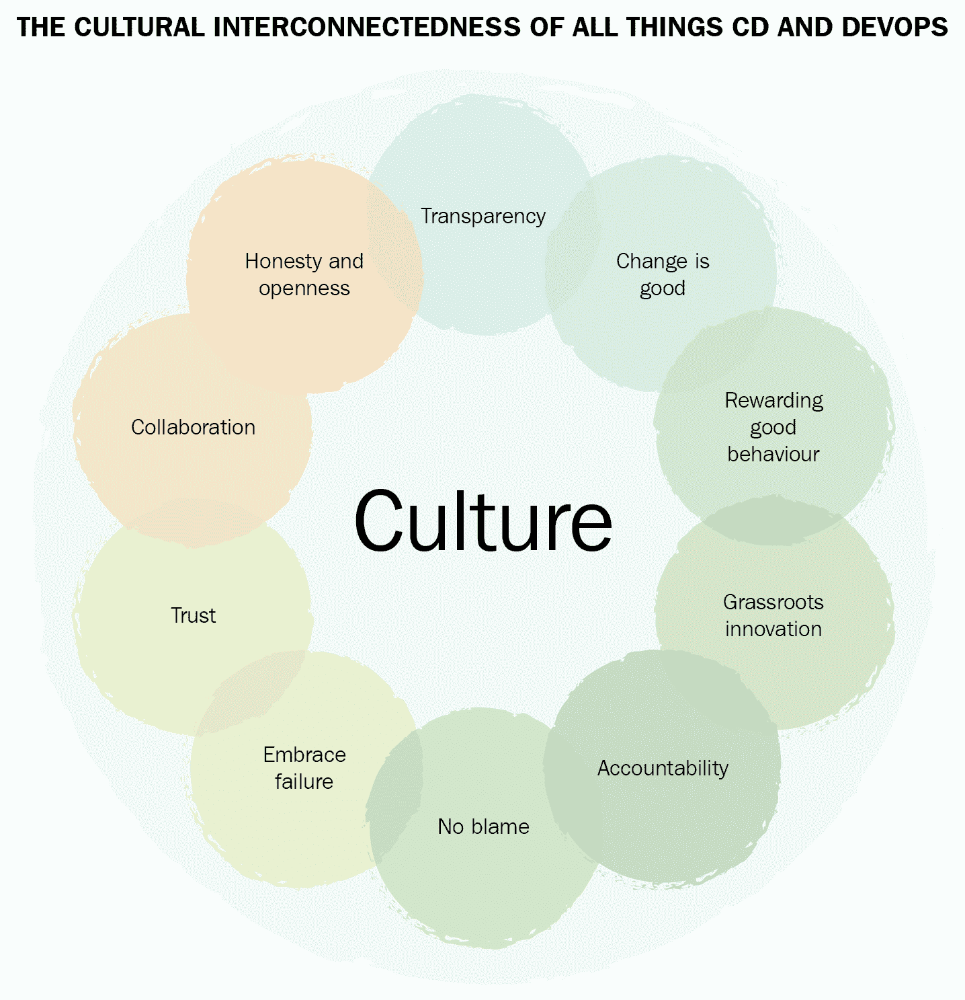
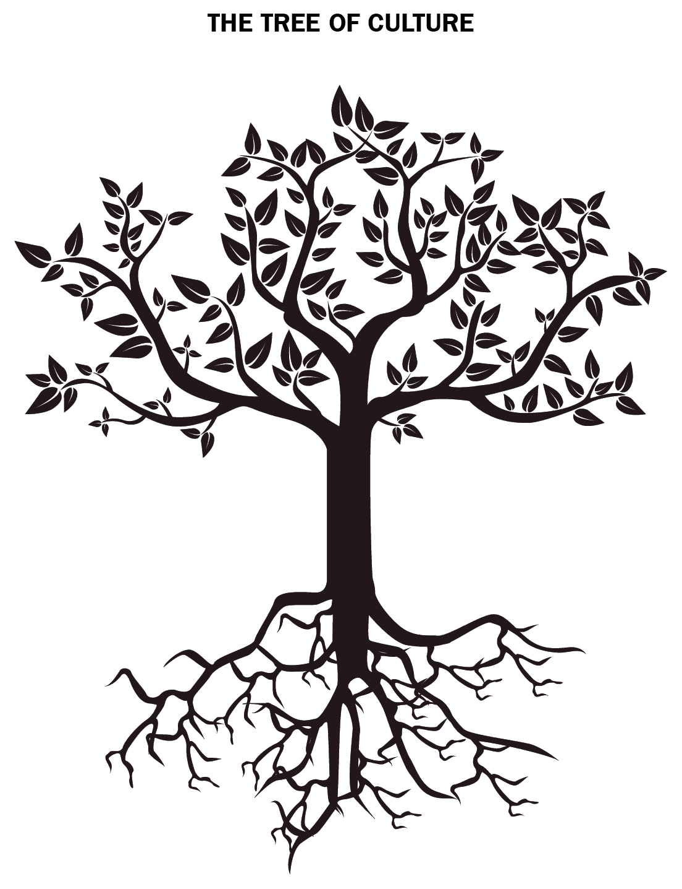
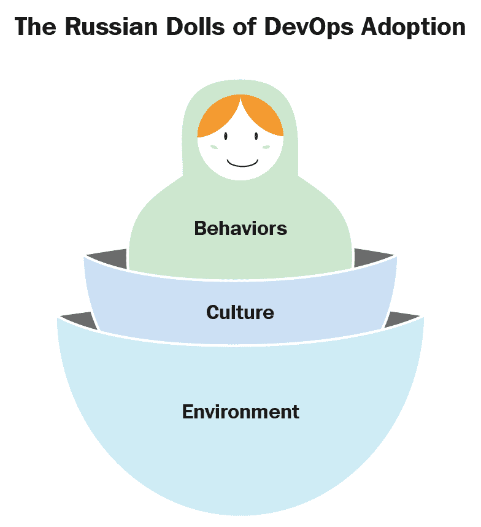
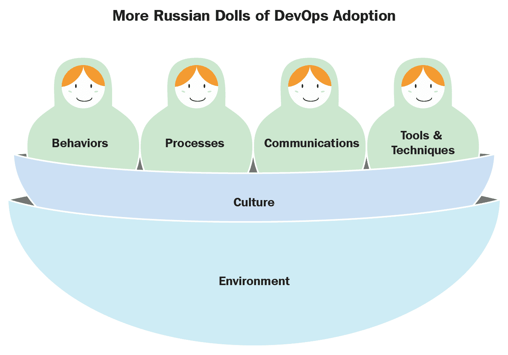
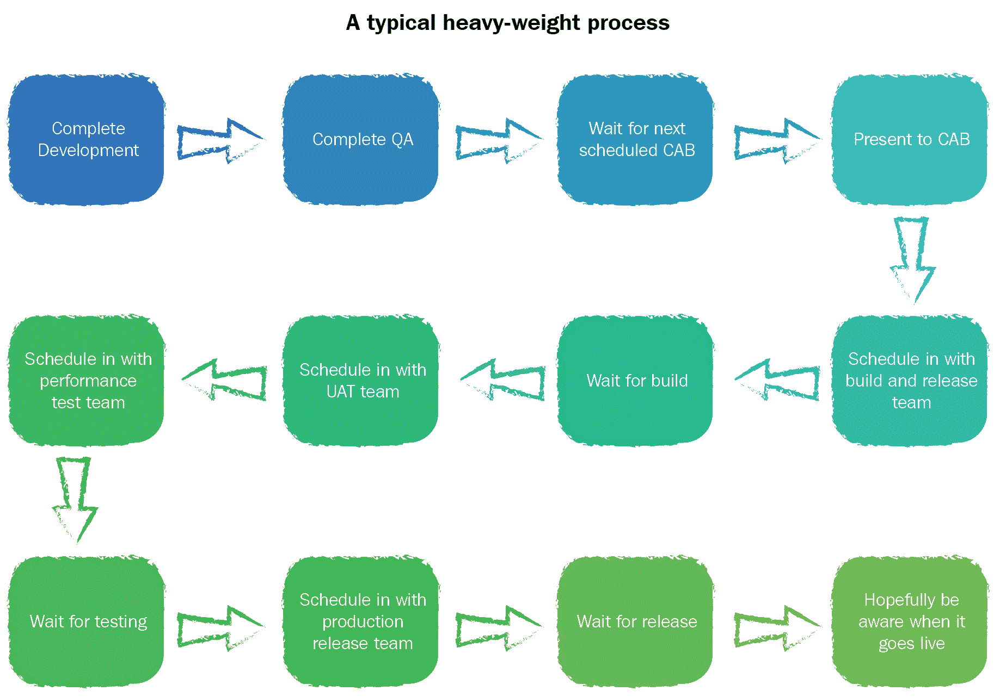
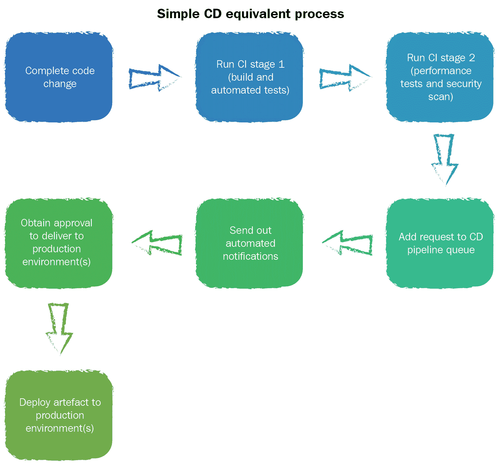
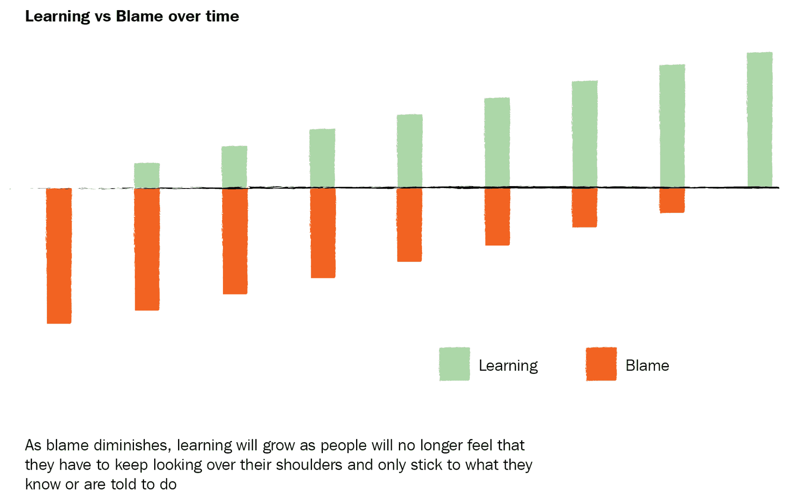
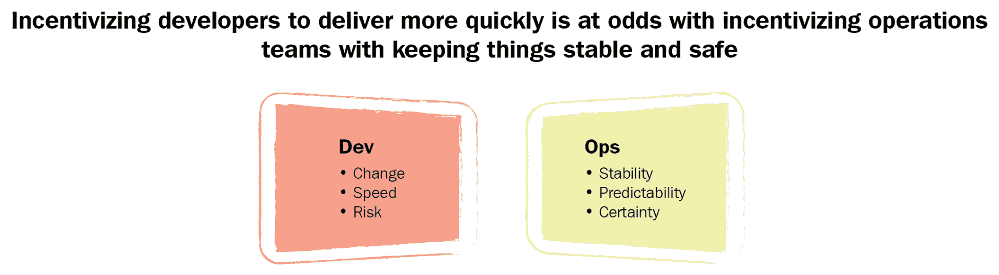

# 文化与行为是成功的基石

在第二章《理解当前的痛点》中，我们了解到，要求人们开放和诚实并不容易，除非你花时间创造一个能够支持这种行为的环境。环境必须能够让诚实披露的文化得以发生。此外，你还必须确保每个参与者都同意根据既定的灵活规则和流程行事。

我们现在将基于这段经验进行扩展，确保组织内部的环境、文化和行为设置得当，以支持—可能是—巨大的变革。我们将在本章中涵盖以下内容：

+   为什么文化如此重要

+   你的工作环境如何影响你的文化

+   文化和行为如何影响你的进步与成功

+   在草根层面鼓励创新

+   在整个组织中培养责任感

+   从工作环境中去除责怪

+   接受并从失败中学习

+   建立信任

+   以正确的方式奖励成功

+   培养“变革是好的”这一观念

+   好的公关如何帮助

在本章中，我们还将探讨这对之前介绍的三种角色意味着什么：

此外，我们还将加入一个从 IT 角度掌控全局的新角色：

+   副总裁维多利亚

需要注意的是，我绝不是人文学科的专家，也没有心理学博士学位。接下来的内容是我通过观察、经验以及与该领域专家的合作所获得的学习成果。

让我们从澄清为什么文化对成功采用持续交付（CD）和 DevOps 如此重要开始。

# 所有的道路通向文化

在科技行业中，有许多人—其中一些非常有影响力—认为，采用持续交付（CD）和/或 DevOps 不过是实施一些技术工具，然后对现有的繁重流程做些微调，从而可能使软件每几周/几个月发布一次。

更糟糕的是，一些人将此视为一个*正当理由*，以在现有组织中设立一个新的 DevOps 团队—考虑到所有因素—他们花费时间建立和实施工具和流程，这些工具和流程对成功交付高质量软件几乎没有或根本没有任何影响。

如果你认为这些观点是正确的，那么你顶多是错的，最坏的情况下可能是自欺欺人。再强调一遍，持续交付（CD）和 DevOps—简而言之—是敏捷的工作方式。DevOps 工具仅仅是工具而已。当我们说“工作方式”时，我们不仅仅是在谈论标准操作程序或人力资源政策，而是在谈论人们工作、思考和行为的默认方式。

就像任何其他高效、有效的工作方式一样，CD 和 DevOps 的效果也取决于人们所处的文化和环境，以及他们所表现出来的行为。这些都在任何变革的成功或失败中扮演着至关重要的角色：

众多道路的汇聚

当我们谈论文化时，主要指的是企业文化和组织文化，而非地理、地缘政治或社会群体文化。话虽如此，这些因素也可能对人们的行为产生一定影响，因此你应当对此保持意识。例如，如果你考虑到某种文化更加重视并尊重社会等级而非个人观点和意见，那么这些个体可能会将开放和诚实视为不自然或陌生的概念——或者至少，他们可能会对这种方式感到不舒服。这也可能导致个体仅仅因为上级要求（或指示）他们这样做而口头上接受变化——而不是因为他们个人相信这种变化。

尽管你应当关注人们的文化价值观和动机，但你不应让这些决定或定义你的方法——你应该只是顺应这些因素，在过程中加以适应。

不利于成功采用持续交付（CD）或 DevOps 的文化和环境因素包括以下几点：

+   团队之间的障碍或权力斗争

+   组织内部的孤岛现象

+   沟通不畅

+   僵化、老式的等级制度

+   深深扎根的信念，认为一贯做事的方式是最好的

+   功能失调的领导力

+   企业对变革的抗拒

+   避免从失败中学习

+   命令与控制

在这些问题普遍存在的环境中尝试实施 CD 或 DevOps，如果不解决支撑这些问题的根本文化问题，最终将导致失败。

你可能在阅读这些内容时会想到，你曾经在（或正在）一个已采用 CD 或 DevOps 的企业工作，并认为上述一些/所有点的确适用，但总体上事情似乎进展顺利。这里的关键短语是*seem to be*，如果你把它应用到其他日常场景中，你可能不会那么容易接受：

+   我检查了你车上的刹车，目前看起来没问题

+   我制定了一个修复方案，解决了 DDOS 缺陷，这个缺陷可能暴露 300 万活跃用户的个人信息，目前看起来效果不错。

+   我调查了报告中的薪资系统问题，目前看起来问题已得到解决

+   在过去三个季度中，我们不断失去 10%的客户群，但自从最近的组织变动和裁员以来，事情似乎有所好转

如你所见，感知可以是一种极具误导性的力量，并可能造成一种虚假的安全感。如果你将前面的例子中的*seem to be*替换成*are*，你会注意到你对这些陈述的感知方式会有很大不同。

如果你把这一规则应用到你对组织 CD 和 DevOps 采纳的思考中，你可能会发现很难像之前那样自由地应用*看似*（are）这个词，因为相关人员的文化和行为还没有到位。为了有效地将*看似*（seem to be）改为*是*（are），你需要一个积极和进步的文化作为工作环境。

# 定义文化

文化是一个非常模糊的概念，难以可视化、理解和定义。当它应用于积极和进步的文化时，这一点尤其困难；然而，下面的图表或许能帮助可视化这一概念在 CD 和 DevOps 采纳中的意义——我们将在本章的后续部分更详细地探讨这些内容：

CD 和 DevOps 所有事物的文化相互联系

在之前的图表中，你会看到文化是促进、鼓励、影响、强化和维持积极行为的核心。为了确保你的采纳成功，这些积极行为需要成为常态。有些人可能认为情况相反；然而，现实是，文化是如此核心，以至于所有为建立和维持积极行为所付出的努力、工作和良好意图，几乎可以在一夜之间被一个功能失调和有毒的文化所破坏。这并不是说你不能通过足够持续和一致的努力从外部开始工作；然而，从经验来看，我知道这可能是非常漫长、困难且脆弱的——只需要一个错误的决定或事件就能毁掉几个月的工作。最终，你需要关注文化。

换句话说，试着想象你的组织是一棵苹果树，它需要强壮健康的根来使芽和花开花——如果根（或文化）不健康，树*看似存活*，但永远不会结果（或产生积极行为）：

文化的树

这与 CD 和 DevOps 的采纳有什么关系呢？要真正从采纳 CD 和 DevOps 中获益，你需要让积极的行为广泛存在、得到鼓励并嵌入其中，使其成为常态。为了使这一切真正发生，你需要文化是积极的和进步的。你可能在揭示“房间里的大象”时目睹过一些积极行为的展现，因此这不应是一个陌生的概念。

那么，环境呢？再次回到园艺类比，要让健康的根（文化）生长并保持健康，你需要肥沃且富含养分的土壤（环境）。

下图展示了环境、文化和行为之间的关系——这些因素都需要对齐并保持健康，才能让 CD 和 DevOps 的采纳真正起作用：

DevOps 采纳的俄罗斯套娃

如果这听起来很熟悉，那是有原因的。在“大象暴露”过程中，你已经通过设定环境（尽管是在安全的温室条件下）播下了种子，以便让积极的行为浮现出来。即使这种文化持续的时间很短，它通常也是积极和进步的。正因如此，你成功地暴露了组织中的问题，从而证明了只要付出努力并采取一致的方法，你就能取得本来无法实现的成果。你需要做的就是培养这颗幼苗，并鼓励它成长，这可能比你想象的要困难。

就所有实际目的而言，持续交付（CD）和 DevOps 的真正成功采纳可能会带来相当大的变化，对于一些组织来说，这可能是一次革命性的变革。纵观历史，当谈到文化革命时，采纳和接受通常与普通大众或车间一线员工的共鸣更为强烈，而不是高层。在技术行业中，通常是工程师、测试人员和其他团队成员最先理解并接受 CD 和 DevOps 的理念和好处，并且最终在其采纳后受益最大。

这些都很好；然而，现实是，作出决定性改变的权力通常掌握在公司/社会阶层更高层次的那些人手中。因此，你的领导层必须清楚地理解并欣赏持续交付（CD）和 DevOps 所带来的好处，更重要的是，理解环境、文化和行为如何极大地帮助或阻碍成功的采纳。我们将在本章后面更详细地讨论这个问题。

如前所述，行为会受到环境和文化的影响，反之亦然。还有一些其他因素与此形成共生关系。关键因素是流程、沟通、工具和技术，如下图所示：

更多的 DevOps 采用“俄罗斯套娃”

让我们简要地看看每一个。

# 流程

正如你在“大象暴露”过程中注意到的，大多数企业遭遇的众多问题之一就是它们内部的流程——其中许多流程复杂、繁琐且根深蒂固。现在，假设在采用持续交付（CD）和 DevOps 的同时还要保留这些流程——正如你能想象的那样，这显然不是理想的做法。

为了使采用成功，你需要有精简、高效且有效的流程。它们还需要与积极的文化、环境和行为相辅相成并加以强化。例如，考虑一下一个典型的、繁重的流程，用于将单行代码的变更推送到生产环境：

一个典型的繁重流程

好吧，这可能有些夸张；然而，这并不罕见——尤其是在一些大型组织和/或严格遵循像 ITIL 这样的框架的公司中。如果你再考虑到这是代表了过程中的“理想路径”，那么可以想象，如果在各个步骤中发现了任何问题或缺陷，你将不得不经历的循环和障碍（通常意味着从头开始）。总的来说，这种过程不仅不利于 CD 和 DevOps 的采纳，也与积极的文化、环境和行为不太匹配。

现在让我们将其与典型的 CD 和 DevOps 流程进行比较，看看如何进行一次单行代码变更的交付：

简单的 CD 等效过程

再次说明，这只是一个过于简化的表示；然而，与之前的示例相比，你可以看到需要实施的过程变化。与前者相比，后者的过程不仅更加精简和优化，而且还帮助鼓励积极的行为，例如合作和责任感。

如你所想象的那样，进行这种激烈且具有影响力的变化，几乎是不可能的，除非你有一种文化和环境来支持它。

# 沟通

沟通是成功采纳 CD 和 DevOps 的另一个关键因素。我们将在本书后续部分更详细地讨论沟通；但是，让我们先看看它为何如此关键。

与任何变革一样，要让 CD 和 DevOps 被接受和采纳，需要大量的公关、对话、宣传、讨论以及信息和知识的分享。这将涉及大量的沟通（我所说的大量，是指非常非常多）。就像在大象暴露案例中一样，文化和环境需要确保所有参与者之间的沟通是畅通无阻的，并且应当鼓励公开交流，最重要的是要保持一致性。

就 CD 和 DevOps 采纳的传播而言，必须针对受众进行，以确保他们能理解。因此，你需要确保沟通方式能够确保所有相关人员清楚地了解 CD 和 DevOps 的含义，并以他们能够理解和关联的方式进行表达。

如前所述，可能会有一些人的社会和文化信仰并不完全符合成功采用 CD 和 DevOps 所需的开放和诚实文化及行为。因此，你需要花时间确保沟通方式能够适应这些人的需求。

# 工具和技术

当我们谈论工具和技术时，我们并不仅仅指技术工具，所指的其实是有助于持续交付（CD）和 DevOps 采纳的敏捷工具和技术——有时被称为工程最佳实践。如前所述，在过去十年里，许多专注于 CD 和 DevOps 的专业企业，专门提供针对 CD 和 DevOps 的技术工具（说实话，主要是 DevOps）；然而，除传统的（开发）运维领域外，外界对于这些工具的采纳并不广泛。这可能归因于掌握这些工具所需的专业知识——这是开发人员通常没有时间或兴趣去理解的。而对于开发团队偏好的工具和技术，但在运维同事中并不普遍的情况也是如此，比如采用 Scrum、严格的版本控制和先行测试开发。

一些开发工具供应商已经意识到这一点，并构建了技术工具，使得开发人员能够与所谓的 DevOps 工具无缝互动，而运维人员则能无缝使用传统上针对开发人员的工程最佳实践。必须提到的是，截止目前，这还远未成为常态。

回到环境和文化这一点，考虑这一点：即使开发人员确实有机会使用所谓的 DevOps 工具，除非环境和文化支持他们可以自由地使用这些工具（例如，他们能够通过 DevOps 管道自由地将代码变更自动推送到某个环境），否则即使拥有这些工具，他们也无法真正发挥其价值。

为了让持续交付（CD）和 DevOps 的推广取得成功，开发和运维的工作文化和环境应该支持无缝协作与互动。同时，交付软件变更所使用的工具和技术应由两方（开发和运维）共同选择并使用（例如，开发人员应知道如何使用像 Octopus Deploy 这样的工具，而运维人员应了解如何使用像 Visual Studio 这样的工具）。

在技术方面，持续交付和 DevOps 的一项巨大胜利是“配置即代码”（configuration-as-code）的方法。我们稍后会详细讨论这一点，但可以简单说，没有一个支持协作的环境和文化，这样一种具有变革性的技术很可能不会落地生根。

让我们看看我们的角色们能做些什么来帮助：

| **好的方法** | **不太好的方法** |
| --- | --- |
| Victoria（副总裁）及她的同事们可以通过榜样带头；即使是一些简单的行为，比如展现出对环境和文化的关注，以及展示积极的行为，也会有所帮助。如果需要改变，她们可以作为执行赞助人来确保每个人都重视这些变革。 | Victoria（副总裁）忽视她下属的情况（或不感兴趣），忽略寻求帮助的请求，继续展现命令与控制的文化。 |
| Stan（经理）应被视为展示积极行为并鼓励同行群体也这样做。他可以研究一些最佳实践方法，并指导团队采纳相关的实践，抽出时间来完善他们的工作方式。 | Stan（经理）既不帮助改善和强化积极行为，也没有表现出任何采纳或接受现代敏捷技术的倾向。 |
| Devina（开发者）和 Oscar（运维人员）能够共同合作，展示积极的行为，并鼓励同事们也这样做。他们还可以鼓励同事们与经理合作，突出环境和文化方面的改进之处。 | Devina（开发者）和 Oscar（运维人员）坚持分开工作，仅在需要时沟通，并尽量避免合作。 |

到目前为止，我们一直在看你需要的各种要素，以实现成功的 CD 和 DevOps 采纳。现在，让我们开始深入挖掘具体细节，从环境开始。

# 一个开放、诚实和安全的环境

除了听起来像是直接摘自管理培训手册的内容，开放、诚实和安全的环境实际上意味着什么？在 CD 和 DevOps 采纳过程中，这意味着任何参与你产品交付过程的人都愿意、被鼓励并能够公开评论和讨论想法、问题、关切和困难，而无需担心受到嘲笑或报复——尤其是来自领导层的压力。

正如你在“大象曝光”阶段所发现的，允许开放讨论和诚实评价组织内的做事方式和产品交付过程，会让那些本可能被忽视或隐藏的细节和事实浮出水面。你需要坚持营造一种文化和行为中没有秘密的环境，并保持这种环境的持续存在。

如果在“大象曝光”和采纳之间存在时间延迟，那么你将需要做更多工作来重新激发最初的热情，因为大多数人可能已经回到了他们的日常工作和工作方式。因此，你应该认真考虑将时间延迟保持到最小。

表面上看，这一切听起来像常识，但不幸的是，这种工作方式在某些工作环境中并不被鼓励，甚至在一些情况下是被积极阻止的——特别是在企业环境中。如果你发现自己处于这种情况，那么你需要克服一些额外的挑战，因为这些规定通常是通过人力资源和管理指南定义和执行的，而这些指南又定义了企业运作的政策。因此，你不能随意破坏或弯曲这些规则。我们将在本书的后续部分详细讨论这一点，但可以简单说，你需要非常小心，并确保以身作则，展示积极的行为。

让我们更详细地分析这些概念。

# 开放性和诚实

开放性和诚实是确保持续交付（CD）和 DevOps 实施成功的关键因素。如果没有这些行为，要打破障碍并在组织内实施亟需的变革将变得非常困难。在“象征性披露”阶段，你已经让大多数业务部门参与进来，收集了关于当前情况的真实反馈。现在，你需要确保继续与所有相关方保持对话。所有参与产品交付过程的人，从开发人员和测试人员，到变更和发布管理者，再到产品负责人和高级经理，都必须有一个可以分享他们的想法、建议、观察、担忧和新闻的论坛。

实现这一点的最有效方法，正如之前所述，是通过面对面的互动，无论是亲自面对面还是通过视频会议系统进行虚拟交流（记住，视频优于语音，因为视频可以提供更多的人际互动）。这种方法有一个潜在的缺点——让每个人在同一时间出现在同一个地方可能会很困难。稍后我们会看看一些克服物理环境挑战的方法；如果面对面交流大多数时候不可行，可以考虑使用丰富且成熟的协作工具市场，如 Slack、Flowdock、Yammer 或 MsTeams（仅列举其中几个），这些工具可以为你提供实时的人际互动。

在考虑这类协作工具时——因为大多数工具是基于公共互联网托管的**平台即服务**（**PaaS**）或**软件即服务**（**SaaS**）——需要注意的是它们的使用是否符合你公司内部的 IT 安全政策。你应该与安全运营团队（SecOps）合作，如果可能，争取他们参与实施，从而扩展持续交付（CD）和 DevOps 的方式及社区。

尽管长期以来有一种看法认为电子邮件是一个有效的协作工具，但它并不应该被视为如此。

无论你选择哪种方法，建议你设置某种形式的礼仪或指导方针，以便每个人都知道什么是可接受的，什么是不可接受的。通常情况下，常识会占主导地位；然而，开放性和诚实也伴随着责任和成熟——有些人可能会忘记这一点，因此温和的提醒总是有帮助的。相反，应该避免的是对内容进行过度的监管或审查，因为这会积极地阻碍开放性和诚实，最终使解决方案失去意义。你应该审查现有的政策，并与人力资源团队合作，看看他们是否能提供帮助。

回到开放性和诚实的主题，我们来看看这在之前提到的角色中意味着什么：

| **良好的方法** | **不太好的方法** |
| --- | --- |
| Victoria（副总裁）应该在合理范围内与她的部门开放分享计划和信息（最好是面对面或通过网络研讨会），并公开征求反馈。 | Victoria（副总裁）不愿与部门沟通，所有计划和信息都保持隐藏，直到最后一刻才通过匿名邮件发送。 |
| Stan（经理）应该定期并开放地与团队分享计划和信息（在合理范围内），并征求反馈。如果实施了协作工具，Stan 和他的同行应该积极使用这些工具，并鼓励他们的团队也这样做。 | Stan（经理）模仿 Victoria 的行为，保持计划和信息的保密，直到最后一刻才通过匿名邮件发送。 |
| Devina（开发者）和 Oscar（运维人员）尽可能主动进行面对面的沟通——无论是面对面还是通过视频会议——而不是仅仅在出现问题时沟通。使用协作工具而非电子邮件应该是常态，他们也应该鼓励他们的同行采取同样的做法。 | Devina（开发者）和 Oscar（运维人员）继续各自为政，仅在出现问题时进行沟通——通常通过电子邮件。信息的共享仅限于需要知道的人。 |

如你所见，容易陷入并不那么理想的方法；然而，保持在理想路径上所需要的额外努力将带来更多好处，因为这将鼓励开放和诚实的对话。

要求并鼓励他人保持开放和诚实是非常好的，但你也应该以身作则。在实施持续交付（CD）和 DevOps 的过程中，定期获得各方关于实施中有效的部分以及更重要的无效部分的开放、诚实和真实的反馈极为重要。同样，最简单且最有效的方式是面对面的交流；只需走到人群中询问。如果这完全不可行，你可以考虑一些轻量级的调查解决方案（例如 Survey Monkey 或类似工具）来收集反馈。这里的“*轻量级*”很重要，因为如果调查每几周就要求填写 10 页的问卷，没有人会定期提供反馈。

如果你采用或使用敏捷方法论并定期进行回顾会议，请要求主持这些会议的人转发与你的实施相关的任何反馈，或者更好的是，亲自参加会议并进行观察。

希望你已经对什么是开放和诚实的对话有了初步的了解，但还有另一件非常重要的事情需要你关注：勇敢的对话。接下来让我们回顾一下它是什么，为什么它很重要，以及它如何融入到整个过程当中。

# 勇敢的对话

有时候，处于较低职位的人会对上级如何帮助或阻碍产品交付过程有看法或观点。

您可能还会遇到那些观点与企业某些部分，甚至是某些团队或个人相冲突的人。要在这种情况下发声，需要勇气和胆量，尤其是在企业环境中。如果我们诚实地说，大多数人都会因为害怕某种形式的报复而回避这种做法。

为了让这些人敢于发声，他们需要确信自己所说的内容（当然在合理范围内）不会被视为个人记录上的污点，也不会以其他方式对他们产生负面影响。为此，您可以考虑建立一个对话非军事化区（简称 DDMZ），在这个区域内，他们可以自由地分享自己的想法、观点和意见——也就是说，能够指出“皇帝的新装”。

您应该与领导团队和人力资源部门合作，确保有一个平台供这种非常重要且有价值的对话存在。内容可能不会很有启发性，但如果有不少人都在说同样的话，那么很可能有一些问题需要解决。

如果建立 DDMZ 不可行，至少您应该考虑实施某种形式的宽恕政策，或者收集匿名反馈的途径——像是一个简单的意见箱或在线调查就足够了。需要注意的是，随着文化和环境的成熟，这类措施的需求应当逐渐减少。

在勇敢对话的过程中，另一个重要的考虑因素是那些安静的人。让我详细说明一下：一般来说，个性特征大致分为两种类型：内向型和外向型。

这只是一个非常笼统且过于简化的说法——实际上，有许多不同的个性特征——不过，为了简化，我们就按照这两种类型来讨论。

外向型的人不怕与人互动、交谈并公开讨论自己的观点和感受。对于外向型的人来说，开放、诚实且勇敢的对话通常不是他们会回避的事情。而内向型的人，在面对冲突（无论是潜在的还是实际的）时，往往会选择闭口不言，或者随波逐流。因此，您需要特别留意这一点，确保每个人都有机会参与并表达自己的观点。虽然这看起来是额外的工作，但从经验来看，内向型人的贡献通常都经过深思熟虑并且富有启发性，值得投入。

如果您难以区分这两种类型，以下是一个简单的小贴士：外向型的人通过交谈来激活大脑，而内向型的人则是通过大脑来激活嘴巴。

让我们非常坦诚、开放且勇敢地谈论将这些行为融入正常工作方式的难易程度：这并不容易。它将充满挑战、复杂、耗时，并且有时非常令人沮丧。然而，如果你坚持下去，并且事情开始奏效（它们会奏效的），你会发现这是一种非常有效的工作方式。一旦开放和诚实被嵌入到正常的工作方式中，事情就会真正开始步入正轨。

让我们总结一下到目前为止我们所讨论的内容：

| **做** | **不做** |
| --- | --- |

|

+   允许自由表达

+   鼓励任何人发表意见（在合理范围内）

+   对于安静的人要有耐心，因为他们可能需要更长时间才能敞开心扉

+   确保管理层和人力资源理解为什么开放和诚实至关重要

+   让管理层积极参与并以身作则

+   没有秘密

|

+   拥有封闭和保密的环境与文化

+   忽视或轻视他人的意见和看法

+   以负面或不正当的方式使用开放和诚实的反馈

+   不耐烦

+   忽视“做我说的，而不是我做的”态度

|

让我们看看我们的角色可以做些什么来帮助：

| **好方法** | **不太好的方法** |
| --- | --- |
| Victoria（副总裁）正式支持创建 DDMZ，并鼓励她的部门在对他们来说重要的领域内进行开放（在合理范围内）沟通。她还与人力资源同事合作，确保根据反馈采取行动。 | Victoria（副总裁）将开放和诚实的沟通视为发现并针对应从组织中移除的麻烦制造者的一种方式。 |
| Stan（经理）应该强化 Victoria 的讯息和行动，并以身作则。当他从团队中收到保密的反馈时，应该确保其保密性。 | Stan（经理）只是口头上回应任何反馈，并继续采取有利于自己职业发展的行为。 |
| Devina（开发者）和 Oscar（运维人员）抓住机会与彼此、同事以及经理进行开放和诚实的沟通。当调查问卷发出以便获取开放和诚实的反馈时，他们会花时间填写并提供真实的信息。 | Devina（开发者）和 Oscar（运维人员）害怕表达真实想法，担心会对职业发展产生负面影响。 |

可能不那么明显的是，物理环境是一个因素，它可能会在鼓励开放和诚实的对话及行为时引发更多问题。我们现在来看一看这个问题。

# 物理环境

你们中的一些人可能很幸运，能够在宽敞、通风的开放式办公室中工作，那里有很多机会可以四处走动、聊天，并且能直接看到与你合作的人的身影。现实情况是，大多数人并不那么幸运，团队被办公墙、楼梯、可怕的隔间，甚至时区所隔开。在这种情况下，我们假设办公室空间并非开放式，且存在一些物理障碍。

你可以考虑以下几种方法来消除这些障碍：

+   保持办公室的门敞开，或者如果可能的话，完全移除它们。

+   为集体聚会预留一个区域（通常靠近咖啡机），提供舒适的座椅，如沙发或豆袋椅，供大家放松聊天。

+   定期举行聚会（至少每周一次），让大家聚在一起（通常会在咖啡和免费的甜甜圈、蛋糕、饼干、糕点或任何能吸引大家离开工作桌的美食附近），聊聊天，放松一下。

+   配备一台桌上足球或乒乓球桌；你会惊讶于办公室里通过友好的竞争能够打破多少隔阂。

+   如果你使用的是敏捷（scrum）方法论，且各个团队被隔离在不同的办公室内，每个团队私下举行日常站立会议，那就举行一个“全体站立会议”（scrum of scrums），让每个团队派一人参加。更好的方法是，打破常规，安排各个 scrum 团队的成员参加其他团队的站立会议。

+   让团队在常规工作区域之外举行日常站立会议。

+   查看是否可以移除一些隔断墙。

+   如果你有隔间，那就把它们全部移除。我个人认为这些隔间是魔鬼的产物，它们比实体墙分隔团队更容易制造负面氛围。

+   查看是否可以调整办公室布局，让团队之间更紧密地合作，或者至少做一些调整，增加混合。

+   在可能的情况下，用笔记本电脑替换台式电脑——如果你可以携带工作站而不需要推车移动，那么你就能更容易地坐在与之合作的人旁边。

+   不要再依赖电子邮件进行沟通，鼓励大家面对面交流——进行讨论、达成共识，并在需要时通过电子邮件跟进。

这些当然仅仅是根据我在不同组织中的经验，以及对你们工作环境的广泛假设提出的建议。你们无疑会有更好的想法。最终目标是消除这些可能会抑制持续集成（CD）和开发运维（DevOps）成功采用的障碍，无论这些障碍是虚拟的还是物理的。

让我们看看我们的角色能做些什么来帮助：

| **好的方法** | **不太好的方法** |
| --- | --- |
| Victoria（副总裁）倾听下属的意见，并与她的同级高层领导合作，帮助推动对物理环境所需的任何变更——如有需要，确保预算到位。 | Victoria（副总裁）从她那间奢华的办公室望出去，建议大家停止抱怨，专心工作，同时为她所计划增加的开发人员订购新的隔间。 |
| Stan（经理）在同事群体中工作，努力说服上级改变物理环境。他单独尝试此事时，尤其是在需要花费资金的情况下，可能会面临挑战，因此，拥有多个管理者的声音支持同一观点会增加说服力。他还考虑花时间与他的团队一起在办公室空间中工作——每周几小时可能就足够了。 | Stan（经理）从他那间略逊一筹的办公室望出去，订购了一些百叶窗，这样他就不必再看着那些挤在办公室里的团队了。 |
| Devina（开发人员）和 Oscar（运维人员）一起合作进行小范围的变更并进行实验，例如，通过面对面讨论而不是通过电子邮件进行沟通，或是接管办公室的某个区域，大家一起坐在一起。 | Devina（开发人员）和 Oscar（运维人员）坚持继续在办公室的不同区域工作，通过电子邮件沟通，并且不向他们的领导团队提及工作环境的情况。 |

接下来，我们将从看似简单的开放性和诚实话题转向看似简单的协作领域。

# 鼓励并拥抱协作

当你开始采用 CD 和 DevOps 的旅程时，你无疑会假设所有参与者都希望合作并共同努力。

业务中有很大一部分积极参与了“大象暴露”练习，旨在捕捉并突出现有业务流程和工作方式的不足，并以一种非常协作的方式进行。肯定他们会希望继续沿着这条路前进吧？

起初，这可能是真的——前提是没有发生前述的延迟；然而，随着时间的推移，人们会开始回到他们自然的孤立位置。这一点在 CD 和 DevOps 采用活动停滞时尤其明显——你可能忙于构建/实施技术工具，或将注意力集中在现有流程中最痛苦的某些领域。无论如何，如果你不小心，旧习惯将悄悄回归。

因此，重要的是你要让协作工作方式始终处于人们的心中，并鼓励每个人将这些方式作为默认的工作模式。挑战在于让所有相关人员做出一个简单的决定。本质上，你需要让人们相信并感受到，协作工作比不协作工作更容易。当人们相信并感受到这一点时，它就会变得习惯化并成为常态。

幸运的是，有许多经过验证的方法可以促进协作，但无论你选择哪一种，你需要保持简单轻便，确保你鼓励的人不会觉得这种工作方式是强加给他们的；一些反向心理学的方法，让他们觉得这是他们自己的主意，会有帮助。以下是一些简单的例子：

+   鼓励每个人在无法面对面交流时，优先使用你的在线协作论坛/消息/聊天工具，而不是电子邮件——一开始甚至可以通过排行榜和奖励来激励大家的使用。

+   如果通常问题是在每周的部门会议上讨论，而不是在某人桌前进行五分钟的讨论，那么取消部门会议，鼓励大家站起来走动并交流（或者使用上述协作工具）。

+   如果办公室里的常态是大家戴着耳机低头工作（这会鼓励孤立并压制传统的人际沟通），寻找方法改变这一行为，使其不再成为常态。如果人们喜欢在工作时听音乐，可以考虑一些极端的做法，比如设置点唱机或者联网的扬声器。你也可以考虑设定耳机和低头工作的使用时间（例如，仅限于下午）。此外，如果人们需要安静的时间/空间，看看你是否可以改变物理环境以适应这一需求。

+   即使你没有采用 Scrum 方法论，也可以在团队中普遍使用每日站会的形式——你甚至可以在不同团队之间切换站会地点，鼓励大家参加并倾听。

+   在办公室空间内安装一些磁性白板，鼓励大家站起来、混合交流，展现创意，无论是解决问题、展示进展，还是仅仅为了乐趣或涂鸦。如果你已经设置了一个共享的休息区，也可以在那安装一个白板——这将鼓励更多的合作。

+   确保你与所有团队保持交流并开展开放式讨论——你永远不知道，你可能会听到别人也在讨论的内容，而你可以充当 CD 和 DevOps 之间的媒人。

一旦协作开始落实，你必须继续保持敏锐的观察力和倾听力，确保能提前发现事情回退的迹象。如果你已经建立了一个志同道合的网络，确保利用它来了解现场的情况，并在听到孤岛式工作重新抬头时，及时采取行动。

你还应该注意到，协作也可能会受到物理环境的影响——无论是正面还是负面。例如，如果团队分布在不同的建筑物或同一建筑的不同楼层，协作可能会受到严重阻碍。某些前面提到的技巧可能无法完全实现/可行——尤其是当需要紧密的物理接近时——然而，鼓励创意使用技术协作工具来填补这些空白是必要的。

让我们再次看看我们的角色可以做些什么来帮助：

+   协作并非工程师的专属领域。经理和高级领导也可以并且应该进行协作——更重要的是，应该让大家看到他们在协作。斯坦（经理）可以使用一些前面提到的技巧和技术协作工具。

+   说实话，大多数高级领导通常不会在日常工作中考虑使用上述的协作技巧和工具；然而，维多利亚（副总裁）至少应该理解它们，并在她的同龄人中积极推广。为技术工具的费用做预算也会有所帮助。

+   德维娜（开发人员）和奥斯卡（运维人员）应该身体力行，进行推广，并在协作时保持高度可见（理想情况下是在团队/办公室区域内，而不是躲在会议室里）。即使是一些简单的事情，比如鼓励开发人员和运维工程师在周五午餐时间一起去同一家酒吧，也能产生影响。

随着协作逐渐嵌入组织，你会看到许多变化开始发生。起初，这些变化可能很微妙，但如果你仔细观察，很快就会发现：人们在桌前的日常对话增多了，在线聊天室里出现更多类似“我正在尝试解决一个问题，但不确定最佳解决方案，有人愿意一起喝咖啡讨论一下吗？”的内容，背景噪音也增多了，大家分享当天的笑话。

一些微妙的（或有时不那么微妙的）公关手段可能会有所帮助，例如，办公室周围的海报、咖啡杯，甚至是奖励最具协作精神的团队；任何能够让协作始终保持在视野中的方式。

现在我们先不讨论协作，转而关注创新和问责制。

# 在基层层面促进创新和问责制

如果你幸运地在一个以现代技术为基础的企业工作（或曾经工作过），你应该已经习惯于将创新作为产品待办事项和整体路线图中的一个重要且被重视的输入。创新在实施持续交付（CD）和 DevOps 时非常强大，尤其当这种创新来自基层时。

许多世界上最成功和最常用的产品都源于创新，因此你应该帮助在整个业务中建立一种文化，使创新被视为一种积极且值得的事情，而不是推动产品的冒险方式。大多数工程师在创新中茁壮成长，或者至少享受创新，说实话，这很可能是他们选择成为工程师的主要驱动力之一——这和美酒、跑车以及国际化的快节奏生活方式（好吧，这可能有点夸张）有关。

这并不是说他们可以随心所欲地做任何事；仍然需要交付和支持产品。你需要做的是留出一些空间进行调查和实验——重新点燃研发中的“R”。创新不仅仅存在于软件领域；可能会出现不同的工作方式或产品交付方法，你可以并且应该考虑这些方法。

创新不仅仅局限于产品和工具；敏捷技术，如**测试驱动开发**（**TDD**）、Scrum、XP 和看板，最初都作为创新的想法出现，随后得到了更广泛的采用。

尽管通常的惯例是，创新不是解决方案和系统架构师的专有权；每个人都应该有机会进行创新并贡献新的想法和概念。鼓励这种活动的方法有很多（比如比赛、研讨会等），但你需要保持简单，以确保在业务范围内得到广泛的覆盖。一个简单的想法是定期举办创新论坛或聚会，允许每个人提出并在可能的情况下，原型化某个想法或概念。

创新可能增加风险，新的事物总是这样；因此，工程团队必须理解，他们在做决策和选择时所获得的自由，伴随着责任、所有权和对新事物的问责，无论是他们提出的、生产的还是实现的。他们不能仅仅实现一些闪亮的新玩具、工具、流程和软件，然后把这些交给其他人去支持。**别人的问题**（**SEP**）或“甩锅”式的方法将不再奏效。

一个好的例子是 ACME 系统计划允许开发者直接将代码部署到生产环境。从表面看，这正是持续交付（CD）和 DevOps 的核心内容，但一个简单的问题使得这个计划未能实现。这个问题是，谁来负责接听寻呼机？或者，用 21 世纪的语言来说，开发者在非工作时间出现问题时是否需要随时待命？最终，你需要确保所有参与交付和支持软件的人员都拥有相同的强烈责任感，这样就不必再提出这个问题。

那么，如何在你的组织中灌输这些价值观和行为呢？让我们看看我们的角色能做些什么来帮助：

| **好的方法** | **不太好的方法** |
| --- | --- |
| Victoria（副总裁）应该花时间调查和审查创新如何改变成功企业的运作方式，并增加收入和利润。 | Victoria（副总裁）忽视了创新在现代企业中的重要性，坚持按照旧的方式执行，仅仅满足于交付规范，别无他求。 |
| Stan（经理）应该积极为团队成员留出时间进行尝试或实验，不论是通过预留一些象征性的 10%时间，还是简单地鼓励他们提出自己的想法和建议，以推动产品或生产力的进步。 | Stan（经理）忽视了创新的重要性，强迫他的团队把产品功能的交付放在一切之上。 |
| Devina（开发人员）和 Oscar（运维人员）应该积极推动这一议程，作为与经理进行一对一或团队会议讨论的一部分。为了推动进展，利用一些空闲时间思考一个创意并呈现出来，可能是一个不错的做法，因为这表明了承诺并且证明你是认真的。合作工作也会增加其可信度。 | Devina（开发人员）和 Oscar（运维人员）应该低调行事，按要求去做，哪怕这与现代工程最佳实践背道而驰。 |

随着你们对持续交付（CD）和 DevOps 的采用逐渐成熟，你会发现创新和问责将成为常态，因为工程团队（包括软件和运维团队）将有更多的精力去专注于以新的方式做事，并改善他们为企业提供的解决方案。这不仅仅与新鲜和闪亮的东西有关；你会发现，团队会重新投入精力去解决旧的技术债务，以完善和推动整体平台的发展。

不管你信不信，有时候事情会出错。我们现在来看看那些不顺利的事情应该如何处理，以及为什么责备文化不是一种好的文化。

# 责备游戏

鼓励快速失败的工作方式是良好敏捷工程实践的关键元素；说起来容易，但这必须成为你们公司工作方式的一部分——正如他们所说，行动胜于言辞。例如，如果我们有一位经理认为在事情出错时指责和孤立个别人是一个好的激励技巧，那么要创造一个员工愿意主动尝试新事物的环境就会非常困难。责备文化很快就会破坏所有的努力，摧毁那些培养开放、诚实、合作、创新和问责文化的工作。

理想情况下，你应该拥有一个这样的工作环境：当错误发生时（我们毕竟是人，错误是难免的），与其让个人遭受来自上级的猛烈指责，不如鼓励他们从错误中学习，采取措施确保错误不再发生，并继续前进。不需要大张旗鼓的演出。更重要的是，他们应该积极被鼓励与他人分享自己的经验和发现，从而加强我们到目前为止提到的其他积极的工作方式。

# 缓慢责备，快速学习

在商业环境中，这可能听起来很奇怪，甚至被视为传达错误的信息（例如，可能看起来你在忽视或鼓励失败），但如果能够从错误中学习，而且问题能够迅速在公开场合得到解决，那么勤奋和质量的文化将会得到鼓励。指责那些迅速修正问题的个人并不利于良好的工作方式。虽然有人可能认为表扬他们发现并解决问题是错误的，但这确实加强了良好的行为。

以下插图展示了缓慢责备、快速学习文化的潜在影响：

随着责备的减少，学习将得到增长，因为人们不再觉得必须时刻回顾过去，而只能局限于他们知道的或被告知要做的事情。

如果管理者不再过于关注琐碎问题，他们可以专注于那些制造问题但不解决问题或不承担责任的个人。

正如你所理解的，这种文化变化对一些人来说并不容易，尤其是那些已经建立起“怒吼大王”形象的管理者。有时候他们会适应，其他时候他们可能只是站到进步的旁边——因为浪潮正在获得动力。他们别无选择，只能做出适应或放手的决定。

让我们再总结一下：

| **应做的** | **不应做的** |
| --- | --- |
| 接受意外会发生 | 指责他人 |
| 鼓励快速失败、快速学习的文化 | 批评个人的失败 |
| 鼓励责任感 | 在了解所有事实之前指责他人 |
| 鼓励公开诚实地分享所学的经验教训 | 阻碍进展 |
| 不把问题看得太严重 |  |
| 聚焦于没有表现出良好行为的个人 |  |

去除工程师工作生活中的威胁和责备文化意味着他们将更加投入，更愿意对错误保持开放和诚实的态度，也更可能迅速修复出现的问题。

让我们看看我们的角色如何帮助：

| **良好做法** | **不太好的做法** |
| --- | --- |
| Victoria（副总裁）积极推动无责备文化，将错误视为单纯的错误，只要人们能够主动从中学习。她的语言和沟通风格也反映了这一点。 | Victoria（副总裁）将错误视为一种纪律处分，给她的部门灌输一种恐惧感，认为每当出现问题时，责任人一定会被找出。 |
| Stan（经理）确保在发生因知识/技能差距导致的错误时，团队有时间进行学习和培训。他的语言和处理问题的方式开放，并避免使用*责备*这一词汇。 | Stan（经理）与 Victoria 的做法相一致并表示赞同。为了强调这一点，他会指出问题并确保责任人被识别并被点名。 |
| Devina（开发人员）和 Oscar（运营人员）不怕承认他们在共同的知识/技能上存在差距，并将这一点向他们的经理们指出。当发生错误时，他们会坦诚自己在其中的责任，并积极参与学习如何避免再次发生。 | Devina（开发人员）和 Oscar（运营人员）努力与发现的问题保持距离，按指示行事，而不是利用他们的技能和经验寻找创造性解决问题的方法——这可能会带来风险。 |

当然，要让这一切有效运作，所有方面都需要有大量的信任。

# 在组织边界之间建立基于信任的关系

现在，我必须坦诚地承认，这听起来确实像是直接取自人力资源或管理培训手册的内容；然而，信任是一种非常强大的东西。我们都明白它是什么以及它能为我们带来什么好处。我们也明白，当完全缺乏信任时，事情会变得多么困难。如果你与某人有个人关系，并且信任他们，那么这段关系往往会是开放、诚实的，并且是长久且富有成果的。建立信任是非常困难的；你不能仅仅因为被告知要信任某个同事就去信任他——生活不是这样的。信任是通过人们的行为逐渐积累的。在工作环境中建立信任也是一件非常难的事。造成这种困难的原因有很多（不安全感、野心、声誉、性格等），所以你需要小心行事。同时，你也需要有耐心，因为这不会一蹴而就。

在传统的开发和运营团队之间建立信任可能更加困难。这两个部门之间通常存在一定程度的、潜在的不信任：

+   开发人员不相信运营团队了解平台的实际运作方式，也不相信他们能够有效地调查出现的问题

+   运营团队不相信开发人员不会因为实施不合格的代码而导致整个平台崩溃

这种程度的不信任可能根深蒂固，并且在双方的业务中表现得非常明显。这些态度、行为及其所创造的文化都过于消极。要在不玩弄谁做什么、谁不做什么的愚蠢游戏的情况下，开发、交付并稳定软件已经够难了。如果你处于这样的环境中，业务需要成熟起来，按其应有的方式行事。没有什么灵丹妙药能够在两个或更多阵营之间建立良好的基于信任的关系；然而，以下技术已经证明是有效的：

+   如果你安排了某些外部的 CD 或 DevOps 培训，确保邀请到软件和运营工程师参加，并确保他们住在同一家酒店。你会惊讶地发现，有多少合作关系是从酒店酒吧开始的。

+   如果有你正在考虑参加的研讨会或会议（例如，DevOpsDays），确保有 Dev 和 Ops 的混合人员参加，并安排住在同一家酒店。

+   如果你是经理，要非常注意自己做出的承诺和/或保证，并确保要么履行承诺，要么非常公开、诚实地说明为什么没有做到/做不到。如果你是工程师，也要采取完全相同的做法。

+   如果你已经建立了一个创新论坛（如前所述），鼓励各方参与并贡献意见。

+   避免讨论“我们”和“他们”之间的分歧及其相关行为。

+   如果可行，尝试组织软件和运营工程团队之间的工作交换或借调（例如，安排一名软件工程师在运营部门工作一个月，反之亦然）。这也可以包括管理岗位。

让我们看看我们的角色可以做些什么来帮助：

| **好的方法** | **不太好的方法** |
| --- | --- |
| Victoria（副总裁）鼓励她的管理团队（Stan 和他在 Ops 团队中的对口人员）紧密合作，更重要的是，要让大家看到他们在紧密合作。她还批准了跨团队活动、培训和团队建设活动的预算。 | Victoria（副总裁）忽视了 Dev 团队和 Ops 团队（及其管理层）之间的裂痕，维持了 Dev 和 Ops 在工作方式和优先级上的严格分离。她还拒绝为联合活动、培训和团队建设活动提供资金，并鼓励公开冲突。 |
| Stan（经理）被认为与 Ops 团队的对口人员进行合作，并鼓励他的团队忽略组织边界来完成工作。他还鼓励团队在社交场合中与 Ops 团队混合。 | Stan（经理）主动忽视或避免与 Ops 团队的对口人员进行合作，并坚持要求他的团队留在组织边界内。与 Ops 团队的交往被视为不可接受，敌意成为常态。 |
| Devina（开发人员）和 Oscar（运维人员）忽视工作中的组织和层级界限，简单地合作解决问题，模仿他们领导层的行动。 | Devina（开发人员）和 Oscar（运维人员）模仿他们领导层的行动，并避免任何跨团队协作的机会。 |

接下来我们将从信任谈到奖励与激励。

# 奖励良好的行为和成功

我们中有多少人曾经参与过或在一家企业中工作过，企业会在发布后举办一场盛大的庆祝派对，庆祝你们战胜重重困难，成功地将产品发布出去？表面上看，这似乎是良好的商业实践和管理 101 课程的内容；毕竟，大多数项目经理都经过培训，会在项目计划中安排一个项目结束派对的任务和预算。如果一切按时交付并且质量最高，这并不是什么坏事。我们来尝试重新表述一下这个问题。

我们中有多少人曾经参与过或在一家企业中工作过，企业会在发布后举办一场盛大的庆祝派对，庆祝你们战胜重重困难，成功地交付了大部分需求，而且在他们试图解决测试中未发现的 bug 时，只将生产平台下线了三小时？

如果问题的答案是很多人，但这确实是一次艰难的努力，我们也确实为此付出了努力，那么你就是在愚弄自己。奖励这种行为是 100%错误的。那些快速交付客户所需的企业，才是成功的企业。

如果你想成为一家成功的企业，你需要停止传递错误的信息。我们确实说过，只要你能迅速从失败中学习，失败是可以接受的；然而，我们并没有提到应该奖励那些未能按时交付的失败。你应该奖励那些按时（或提前）交付所需工作的每一个人。这里的*每个人*非常重要，因为奖励不应该针对某一个个人，因为这可能带来更多麻烦。你希望培养一种协作精神和 DevOps 的工作方式，因此奖励应该是团队奖励，例如举办一个聚会或组织一次集体出游。

# 那些少数几个人

好吧，也许会有少数人在困难时刻投入更多努力，奖励这些个人并不是坏事；然而，这不应成为常态。如果工程团队（无论是软件团队还是运维团队）不断被要求加班加点、熬夜工作，甚至周末也不休息，那么工作优先级肯定存在问题。然而，如果他们决定付出额外努力，解决一些长期积压的技术债务，或者实施一些节省劳力的工具来加快进度，那么这完全不同，你应该针对这些具体的优秀行为进行特别奖励。

最终，你希望奖励那些做出超出职责范围、表现出色的个人或团队，而不是仅仅因为成功发布了软件。随着 CD 和 DevOps 工作方式的深入，你会发现你不再拥有以前所谓的“发布”（因为它们发生得太快，难以察觉每一次），因此，你需要寻找其他方式来给予奖励。例如，你可以在达成业务里程碑时举行庆祝派对（例如，当你迎来下一个百万客户时），当新产品成功上线时，或者仅仅因为外面阳光明媚，老板们想表达感谢之情。

CD 和 DevOps 将改变业务运作方式，所有领域都需要认识到这一事实。因此，你奖励员工的方式也需要发生变化，以培养之前提到的良好行为（开放和诚实、创新、责任等）。这对一些企业来说可能是一个巨大的转变，有些甚至可能需要实施新的奖励系统、解决方案或流程来适应这种变化。

一种标准的奖励员工的方式是通过某种奖金或激励机制。这也需要改变，但首先你需要认识到现有的系统可能助长了错误的行为，并可能抑制你实施 CD 和 DevOps 的进程。

# 认识到 Dev 和 Ops 团队的激励机制如何影响决策，可以产生深远的影响

有一个简单而显而易见的事实，某些人可能没有立即意识到，但它在整个 IT 行业中非常真实且普遍存在。这个事实是，开发团队的激励措施是为了交付变更，而运维团队的激励措施是为了确保稳定性和系统正常运行，从而阻碍了变更。以下图表强调了这一点：

没有简单的答案，但你可以参考一些示例来缓解这一痛点：

| **激励措施** | **优点** | **缺点** |
| --- | --- | --- |
| 在 Dev 和 Ops 之间设定相同的激励措施。 | 如果你在激励措施中支持持续变革，将增加 CD 和 DevOps 成为常态的可能性，因为所有相关人员都将关注同一个目标。 | 这可能带来更多的风险，因为人们可能认为快速改变比质量和系统正常运行更重要。 |
| 将 DevOps 合作伙伴双方的激励措施纳入彼此的考量中。 | 如果软件工程团队的部分奖金与实时平台的稳定性挂钩，他们会在冒险之前三思。如果运维工程团队的部分奖金与推动 CD 相关，他们会在无必要的情况下阻止变更。 | 如果这种交换比例较小，可能会被忽视，因为焦点仍然会放在获得大部分奖金上，这仍然会鼓励旧的行为模式。 |
| 用一种专注于良好行为并鼓励 DevOps 文化的新激励机制替代当前的激励方案。 | 这种方法有可能消除工程团队（开发与运维）之间的冲突，并鼓励他们关注真正重要的事情：交付客户所需的产品。 | 现实是，想要达成完全一致并迅速实施这一方案是相当困难的，特别是在公司环境中。这并不意味着这不是值得追求的目标。 |

无论你在激励和奖励员工方面做什么，你都需要在变革中培养一种积极的心态，同时确保风险得到降低。

# 拥抱变革并减少风险

与在基层层面上培养创新和问责制相似，你需要跨越更广泛的组织工作，确保他们接受变革是好事，而不是应当害怕的事情。

的确可以说，任何在生产平台上的更改——无论是引入一项新技术、修复一个 15 年历史的代码库、升级操作系统，还是更换存储阵列——都可能增加平台或其部分组件失败的风险。要真正消除这种风险，唯一的办法就是什么都不改，或者直接关闭一切并锁起来，但这既不现实也不切实际。所需要的是一种管理、减少并接受风险的方式。

实施持续交付（CD）和 DevOps 正是能够做到这一点。你将进行小范围的渐进性变更，保持透明度，变更的开发团队与支持团队密切合作，代码编写者（个人）拥有责任感和问责制，并且全力以赴地追求成功。

这里的主要挑战是让公司内的每个人都理解并接受这作为日常工作方式。最有效的方式就是通过实际证明这一点。

# 用成果改变人们的看法

与其他天生规避风险的公司部分相比，让基层人员理解这个概念应该相对简单。

我这里指的是 QA 团队、高级管理人员、项目经理和程序经理等。说服他们风险已经被控制有几种方式，但最好的方法是使用“成果验证”的方法：

1.  选择一个小的变更，并确保它在整个公司内得到广泛宣传

1.  吸引更广泛的业务团队，专注于风险规避，并确保他们了解相关信息；同时邀请他们参与观察和贡献（团队站立会议、计划会议等）

1.  确保参与变革的工程师也意识到变革需要被特别关注

1.  随着变革的推进，邀请工程团队参与并定期发布博客，详细说明他们正在做什么，包括统计数据和指标（代码覆盖率、测试通过率等）

1.  在发布过程经过各个环境到达生产环境时，尽可能多地捕获统计数据和度量指标，并将其发布。

1.  当所有工作完成后，将这些内容整合成一篇博客文章和发布后报告，然后进行呈现。

你可能会觉得这是一项庞大的工作，坦白说，如果你按照前述步骤逐一处理每一个改动，确实会很繁琐。但这项工作是有意义的：它向业务证明了变化是好的，风险是可以被控制和管理的。我建议你多执行几次这些步骤，以建立信任和信心——你始终可以在后续优化。你会发现另一个积极的效果是，它会在基层培养一种勤奋的文化；如果他们非常清楚业务在关注事情的进展，尤其是在事情出错时，他们就会在做出愚蠢决定之前三思而后行。

应该注意的是，尽管这些步骤会产生额外的工作量，但与一些组织目前的运作方式相比，这算不了什么；改动会被充分记录，风险会被评估，进度会议会召开，项目进展会公示，每个细节都会被记录和归档。难怪交付软件可能如此痛苦。

与生活中的任何事情一样，如果你做出一些小的改变，风险会大大降低。如果你多次重复这个过程，风险几乎会被消除，习惯也会形成。沿着这个思路，如果不频繁发布且每次改动较大，风险就会很大。将其变小并且频繁发布，风险就会消失。从这个角度看，事情其实很简单。

作为验证成果的例子，进行了大量的宣传和博客发布。这不应被视为负担，而是 CD 和 DevOps 采用的必要组成部分。保持高度可见性是打破障碍并确保每个人都意识到发生了什么的关键。

# 保持透明

正如我们之前所讨论的，对你所做的事情及其方式保密并不利于建立开放、诚实且基于信任的工作环境或文化。如果每个人都能看到正在发生的事情，那么就不会有意外发生。我们所追求的是一种文化，一种工作方式，在这种方式下，变化是好的且频繁的，个人在共同目标上协作，业务部门信任产品交付团队按时交付所需的内容，运维团队了解即将发生的事情。如果整个过程高度可见，任何人都能看到这一切，而且更重要的是，看到它有多么有效。

你可以考虑在办公室周围安装大屏幕，展示统计数据、事实和数字。你可能已经设置了类似的显示系统，但我猜这些屏幕显示的是非常技术性的系统统计信息、CPU 图表、警报等。我还猜大多数这样的屏幕位于技术团队的区域（开发、运维等）。这并不是坏事，只是非常专业化，非技术性人员可能会忽略它们，或者更可能根本不知道它们的存在。看看你能否将部分屏幕移动到办公室的公共区域，或者尝试找到预算购买新的屏幕。

你还应该用非常简单、易于阅读和理解的与 CD 和 DevOps 过程相关的数据来补充这些高度技术性的内容。你应该考虑展示以下几种信息：

+   本日、本周、本月和本年发布次数，与昨天、上周、上月和去年相比

+   当前发布队列和发布进度，以及谁发起了该过程

+   生产系统的可用性（当前和历史）

+   如果你使用在线 scrum/Kanban 看板（如 Jira、Rally 或 Trello），可以考虑展示这些数据，以展示你的积压任务、进行中的工作和已完成的工作，以及相关的统计数据，如速度和燃尽图

+   最新的商业信息，例如股价、活跃用户数和未解决的客户服务单数

最后一条非常重要。你应该发布、展示和宣传与业务相关的互补信息和数据，而不仅仅是关注技术性的事实和数字。这将有助于提高技术团队以外的员工的参与度和意识。随着你在实施 CD 和 DevOps 的过程中推进，公开这些信息也将证明事情正在改善。

# 总结

本章中我们讨论了实施 CD 和 DevOps 过程中与人相关的诸多内容。希望你已经意识到，运作的文化决定了 CD 和 DevOps 的成功。在协作方面，你会发现信任、诚实和开放是强有力的工具，它们使得个人能够为自己的行为负责。奖励良好行为并去除责备也将有助于推动采纳。

到这一点，你应该已经有了一个计划，并对在实施 CD 和 DevOps 时文化和行为的重要性有所了解。在第四章，*成功规划*中，我们将探讨一些有助于推动前进的实际事项。
