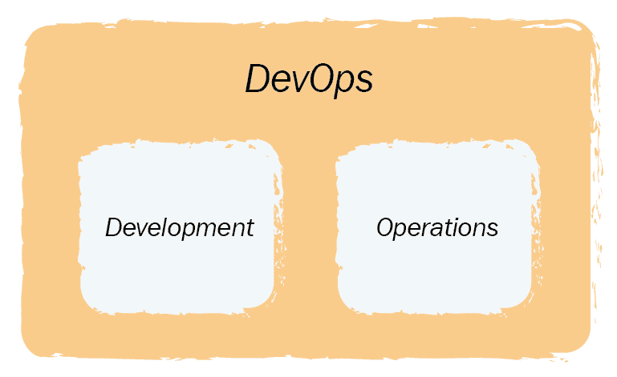
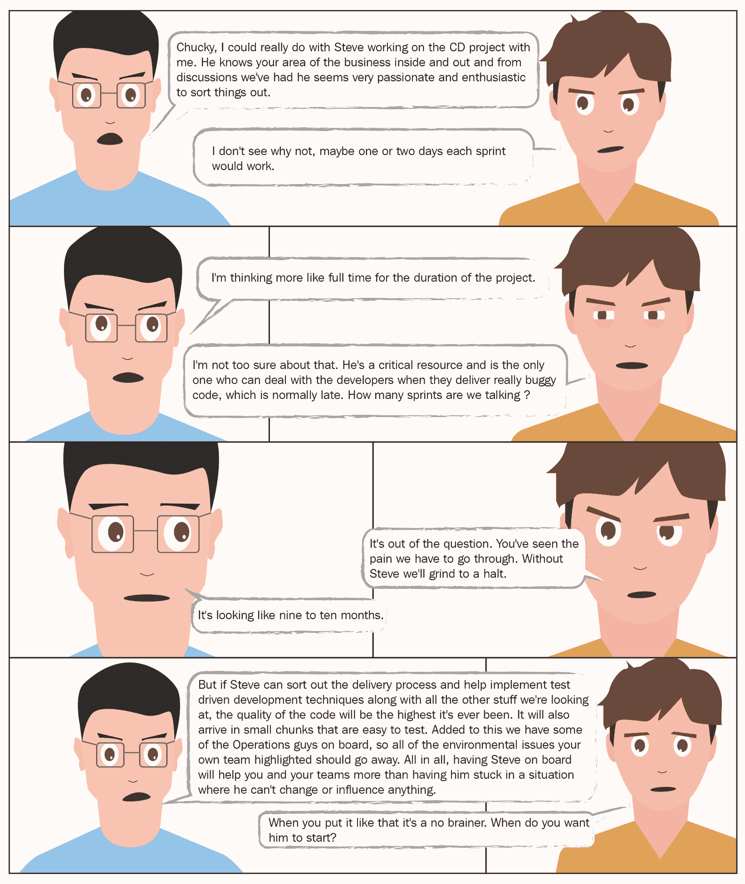
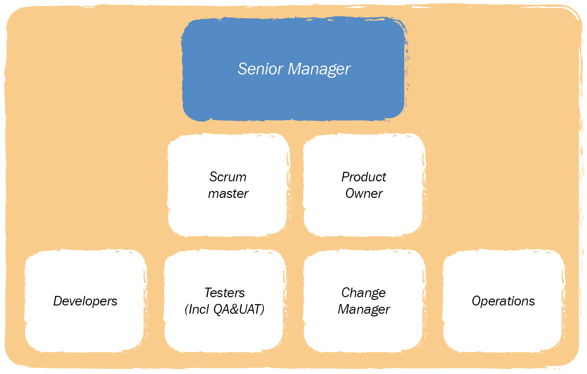

# 成功的规划

在第二章《*理解你当前的痛点*》中，你已经接触到了一些工具和技巧，帮助你识别可能在整体产品交付过程中存在的问题。我们将此称为“房间里的大象”，因为它是显而易见的，但却非常容易被忽视。

然后我们在第三章《*文化与行为是成功的基石*》中进一步探讨，强调（并在某些方面强化）一个事实：团队在进行和交付变更的文化和环境对行为有巨大影响，进而影响他们的工作方式和交付质量。

我们现在将运用这些学习，专注于各种方法、策略、技巧和工具，你可以利用这些来将其转化为一个可以实施的计划，帮助你克服挑战——可以说是一个实施 CD 和 DevOps 的进攻计划。

在本章节中，你将接触到以下内容：

+   为什么为你的 CD 和 DevOps 采纳定义目标和愿景非常重要

+   为什么确保每个人都理解其内容并且熟悉所使用的语言和术语非常重要

+   如何通过使用在线协作解决方案来提高参与度和沟通

+   确保业务方理解持续交付（CD）和 DevOps 实施的广度

+   为什么有效的公关、宣传、勇气和决心对项目的成功至关重要

+   在开始你的冒险之前，必须考虑的成本，有些是显而易见的，有些则不太明显

这个进攻计划不容小觑；就像“大象曝光阶段”一样，你需要进行相当多的基础工作，以确保实施范围得到理解、接受和传达。

在我们深入规划之前，让我们先看看你无疑会遇到的各种问题。

# 一些常见的问题

在“大象曝光”过程中，你将暴露出一些当前软件交付中的问题。你也将开始考虑文化、环境中的问题，以及表现出来的行为问题。

这里的假设是，所识别的问题是与全球大多数企业中的软件交付过程相关的常见问题。这些问题包括以下一些：

+   由于过程中的交接点和决策点过多而浪费

+   因步骤之间不必要的等待时间而浪费

+   许多软件变更被打包成大型、复杂的一次性发布

+   大规模且不频繁的发布容易导致缺陷和漏洞的流失，以及交付变更的人与支持变更的人之间的不信任

+   发布被视为一种令人畏惧的事情，而不是变革的积极机会

+   大部分团队成员处于脱离状态，或者士气低落（或者两者兼有）。

+   关键团队之间的沟通存在碎片化、停滞不前，有时甚至完全没有沟通。

+   软件变更在没有经过多次测试之前是无法被信任的。即便如此，正式上线也不意味着没有问题。

+   软件设计中存在过于复杂的依赖关系，这使得测试和发布变得非常具有挑战性。

+   整个过程中的任务和活动存在重复。

说仅仅制定一个计划就能解决所有问题和难题是荒谬的——毕竟，有些问题和难题实际上可能是由于计划不一致造成的——然而，没有计划的话，至少要有所进展将变得非常困难。成功实施持续交付（CD）和开发运维（DevOps）本身就已经足够艰难，因此拥有一个统一且被理解的方法将大大提高成功的机会。

和任何计划或项目一样，必须有一个最终目标，并且有一个清晰的路线图来实现它。

# 设定和传达目标与愿景。

对任何项目来说，设定目标和愿景非常重要，因为它能确保所有相关人员知道预期的结果，并且参与项目的人员清楚地知道项目以及他们自己的方向。这听起来可能很简单，但并不总是显而易见的。除了设定目标和愿景之外，沟通的内容和方式同样重要。如果两者有任何不当，你将面临失去业务支持、参与和认同的风险。正如在第三章中指出的，*文化与行为是成功的基石*，组织内的环境、文化以及默认行为会在 CD 和 DevOps 的实施过程中产生助力或阻碍作用，因此在制定目标、愿景和沟通方法时，必须保持警觉。

在与高级管理层沟通时，这些挑战可能会变得非常极端。例如，他们可能认为，只要解决在“象曝光”过程中揭示的一些问题，就足以克服企业所付出时间和精力展现的所有问题——一旦你开始听到像“低垂的果实”这样的术语，你就应该开始担心了。多年来帮助许多商业变革的一个简单经验法则是，你必须清楚自己要达成的目标，以及清楚自己要向谁传达这个目标。

在采用 CD 和 DevOps 时，这可能会是一个相当具有挑战性的任务，因为交付物和收益并不总是对外行人来说容易理解或显而易见。它也可能很难完全量化，因为你从采用中获得的一些好处并不是完全有形的——提高团队协作和幸福感的增加是很难衡量的。一些领导者可能会将他们的决策与**投资回报率**（**ROI**）模型对齐，并只考虑在回报非常明显且可量化的情况下才为这些事情分配预算。同样的，这很难将采用 CD 和 DevOps 所带来的优势直接转化为纯粹的货币价值。

最好的建议是遵循**保持简单，傻瓜**（**KISS**）的方法。你有一个问题列表，这是更广泛的业务为你提供的，他们想要的是一些（任何东西）能够让他们的生活更轻松，帮助他们做他们被雇佣和支付报酬做的工作。我还建议，大多数人也希望有机会为企业、客户以及自己的价值感增添价值。至于问题列表，说实话，你的列表上很可能有比你能有效交付的更多的事情。这应该被视为一件好事，因为在优先级排序时，你会有一定的灵活性。

你的挑战是汇集一个目标和愿景，这将引起所有利益相关者、员工和更广泛的业务的共鸣，并确保它能够增加业务价值。更重要的是，你需要确保这个目标和愿景能够实现。这将需要相当多的努力、思考和规划，但这是可以做到的。为了给你一些启发，我们可以回到 ACME 系统，看看他们是如何处理这个问题的。

当 ACME 系统计划采用 CD 和 DevOps 时，他们将自己的想法汇集在一起，并为项目设定了一个目标。这非常简单且不言自明；即每天能将工作代码发布到生产环境 10 次。他们进一步简化为每天交付 10 次价值，这形成了一个简单易懂的口号（几乎每个人都能理解，但稍后我们会详细说明），并为其愿景和沟通策略奠定了基础。

是的，这是一个雄心勃勃的目标，但公司知道，只要有一些艰苦的工作、勇气、决心和合适的人参与，这个目标是可以实现的。

设定目标可能同样简单。你对需要解决的业务问题有清晰的了解，知道哪些团队参与其中，也对哪些问题能引起利益相关者共鸣有清晰的概念。这听起来可能很简单，但可以说，凭借一块空白的白板和一支笔，你就能填满大部分空间，列出许多目标示例。征询你信任的人的意见；如果他们认为你提议的目标不靠谱，那可能就是真的不靠谱。如果你幸运地有公关或营销人员可供咨询，向他们征求意见；毕竟，这正是他们擅长的。制定一个高层次的沟通计划也可能有助于聚焦信息传递给目标受众。

让我们再回到 ACME 系统，看看他们是如何处理沟通的。他们有一个目标（每天交付 10 次价值），并需要设定愿景。这个愿景包括了多种交付物，他们相信这些交付物能够解决在“揭示大象”过程中强调的大多数问题。这些交付物既有技术性内容，也有非技术性内容，但最重要的是，它们易于理解、解释，并且可以清晰地传达。这些交付物被列出、细分并按优先级排序，以指明将以什么顺序解决哪些问题。熟悉敏捷工作方式的你们一定能认出这是一个优先级排序的功能待办事项列表。

为了进一步加强这一点，他们随后着手处理能够引起利益相关者和业务领导层共鸣的商业论证。他们通过回顾问题清单，找出那些直接与成本相关——或者更重要的是浪费相关的问题。他们重点关注的例子包括过度重复的手动测试、由（昂贵的）高级领导出席的重复会议，以及发布的停机成本。为此，他们还汇总了与缺陷逃逸和需要修复的热修复数量相关的事实和数据。

下一步是将目标和愿景记录并呈现给业务决策者以及有影响力的利益相关者，以获得一致意见，确认所提议的方案能够解决在“揭示大象”过程中捕捉到的问题和难题。这次演示面向尽可能广泛的受众——不仅仅是领导层——为此安排了多次会议，持续了许多天，以便尽可能多的人能参与其中。首选的结果是获得最初参与“揭示大象”过程的人员的同意，全面理解、支持并接受所提议的方法。

经过多次讨论、展示、劝说和一些时间后，组织内达成了共识，目标和愿景得到了确认。随着愿景的确定，接下来开始将愿景中的最高优先事项（即最高优先级的功能）分解为需求（即用户故事），这些可以付诸实践并更重要的是交付。

下一步是汇聚一群志同道合的人来协助项目的交付——无论是从技术工具的角度，还是从教育、辅导和咨询的角度，帮助更广泛的团队实现其目标。

为确保目标和愿景的透明度和易获取性，ACME 系统团队的成员需要确保所有数据、信息和计划都能供大家查看。为此，他们充分利用了所有可用的内部沟通和项目存储及报告工具：内部 Wiki、博客、网站、内网和论坛。

如果你没有类似的工具可用，使用开源解决方案设置一个工具并不会耗费太多精力。甚至有一些在线解决方案足够安全，能够保护公司机密。拥有这种透明度和开放性将帮助你在执行计划时向前推进。尤其是像*社交*解决方案这样的工具，比如博客和论坛，能够提供反馈，并开展虚拟讨论。

让我们看看我们的角色能做些什么来提供帮助：

| **好的方法** | **不太好的方法** |
| --- | --- |
| Victoria（副总裁）可以继续积极参与项目，帮助她的团队量化业务案例，在同行之间推广目标、愿景和业务利益。理想情况下，成为项目赞助人将为活动增添分量。 | Victoria（副总裁）逐渐与活动保持距离，因为她已经投入了足够的时间和精力。她还开始公开质疑目标、愿景和项目的有效性，因为没有明显的投资回报。 |
| Stan（经理）继续积极参与，确保目标和愿景是现实可行的，并且传达准确。他还可以呼叫市场营销部门的同事帮助定位信息。正如 Victoria 所做的那样，他可以帮助在同行之间推广目标和愿景。如果他有敏捷教练或 Scrum Master 可用，他应该让他们参与协助制定待办事项列表。 | Stan（经理）效仿他的上司（Victoria）的行为，公开质疑目标和/或愿景的必要性。他还鼓励他的团队忽略这些，直接执行。 |
| Devina（开发人员）和 Oscar（运营人员）可以并且应该继续积极参与项目，尽可能地收集背景数据。 | Devina（开发人员）和 Oscar（运营人员）低调行事，按指示执行。 |

当这些内容用几段文字表达出来时，听起来都相当简单，坦白说，如果有合适的环境和合适的人参与，确实是如此。这只是确保你和他们都能很好地理解业务和利益相关者的需求，并将其总结成一个人们能理解且能够支持的目标的问题。关键在于将愿景对齐，以推动事物朝着正确的方向发展。这里的关键是“易于理解”，这有时会是一个挑战，尤其是当你考虑到在许多业务领域之间（可能还涉及多个时区和文化）沟通时，每个领域可能对所使用的术语和词汇有不同的理解时。这样，我们就可以顺利过渡到如何沟通并确保所有相关人员都能理解正在发生的事情。

# 词汇和语言的标准化

一个小小的、完全可以避免的事情可能会毁掉任何一个项目，那就是对交付物的误解或混淆。听起来可能有些令人担忧，但项目失败往往仅仅因为一个人期望的是某个东西，而另一个人误解或误读了这个需求，交付了完全不同的东西。这通常并非因为无知，通常是因为双方对同一个事情的理解方式不同。

例如，让我们来看一个相对无害的词语：发布（release）。对项目经理或发布经理来说，这可能代表一系列软件更改，需要在计划或工作程序内进行测试并上线。这通常涉及详细的项目计划、与产品交付职能内外的各个部门的紧密协调，以及大量的会议、文书工作和加班。对一个以敏捷方式工作的开发人员来说，*发布* 可能只是一次简单的代码更改，可能在他们完成编码并运行自动化测试后不久就会上线。如你所见，同一个简单的词在产品交付团队的一个成员眼里可能代表着需要大量工作的内容，而在另一个人眼中却是每天都会发生的简单事情。这些不同的理解会导致许多无法预见的浪费问题。

当你开始审视我们在产品交付和 IT 整体过程中使用的各种不同的词汇、术语和 TLAs（三个字母的缩略语）时，可能也会遇到一些问题。因此，我们需要注意我们沟通的目标受众，并确保他们能轻松理解所传达的信息。同样，KISS（简化）方法在这里也非常有效。你不一定要将内容降到最低的共识水平；那可能非常困难（你可能最终会写一本书），并且可能会适得其反。尽量找到一个平衡。如果一些目标受众没有轻松理解的能力，那么让一个理解的人去和他们沟通并解释；这将有助于弥合差距，同时也能建立良好的工作关系。

另一个有助于弥合差距的建议是汇总一个术语表，供大家参考。以下是一个简单的示例：

| **术语** | **定义** | **非定义** |
| --- | --- | --- |
| 持续交付 | 一种将完全工作且经过测试的软件以小的增量方式交付到生产平台的方法，从而快速为客户提供价值 | 一种非常复杂的方法，每几周或几个月交付大量代码 |
| DevOps | 一种工作方式，鼓励开发和运维团队高度协作，共同朝着相同目标努力 | 让开发人员承担运维任务，反之亦然 |
| CD | 见持续交付 |  |
| 持续集成 | 在开发周期内尽早发现软件问题，并确保平台各部分正确对接 | 被忽视或绕过的任务，因为它需要努力 |
| CI | 见持续集成 |  |
| 定义完成 | 平台的变更（如软件、硬件、基础设施等）已上线并被客户使用 | 一项名义上已签署的、最终会在上线时生效的变更 |
| DOD | 见定义完成 |  |
| 发布 | 将代码一次性部署到指定环境（如测试、预发布、生产等） | 一大堆变更交给他人整理 |
| 部署 | 将发布版本推送到指定环境中的操作 | 运维团队执行的任务 |

如果你有内部沟通/协作工具，如维基、内联网、博客或论坛，那么这些地方就是分享这些内容的好地方，因为其他人可以随着更多流行词和缩略语的引入不断更新它。

这里的经验法则是，无论你标准化了什么词汇、语言或术语，都必须坚持使用并保持一致——随意变化应当避免。例如，如果你选择使用 CD 和 DevOps 这个术语，就应该在所有形式的交流中保持一致，包括书面和口头表达。这样它会变得深入人心，其他人也会在日常中使用，这意味着对话会更加一致，误解和混淆的风险会大大降低——未能做到这一点可能会导致错误决策的产生。

还需要考虑的一点是行业标准术语与企业惯用术语的区别。例如，如果你们公司每个人在提到*发布*这个词时都会感到一阵恐惧，那么就不要试图改变它的含义以符合行业标准，因为有些人仍然会联想到负面含义。相反，可以尝试使用替代术语——如交付——这种词汇没有历史负担。总的来说，谨慎选择你的词汇，因为它们将伴随你一段时间。

让我们看看我们的角色可以做些什么来提供帮助：

| **良好方法** | **不太好的方法** |
| --- | --- |
| Victoria（副总裁）积极参与组织内部使用的语言和词汇，并在所有沟通中（书面和口头）使用已达成一致的术语。她还会纠正同事和更广泛组织中的成员，当他们重新使用曾经用过的术语和语言时。 | Victoria（副总裁）忽视了组织内部语言和词汇的重要性，任由不正确的术语和语言不加挑战地流传。事实上，她自己也仍然使用不正确的术语、语言和词汇。 |
| Stan（经理）模仿老板（Victoria）的行为，有时会纠正她的失误。Stan 也应积极鼓励团队编制、完善并在所有沟通中使用标准的符号。 | Stan（经理）模仿老板（Victoria）的行为。 |
| Devina（开发人员）和 Oscar（运维人员）也会模仿他们老板的行为，并鼓励同事们也这样做。 | Devina（开发人员）和 Oscar（运维人员）只是忽略周围发生的事情，继续使用他们一直以来使用的术语、语言和词汇。 |

假设你现在已经有了目标、愿景、高层次的待办事项清单、标准的沟通方式，并准备好开始实施。几乎可以开始了。愿景的执行不是一项轻松的任务。无论你是一个小型软件公司还是一个大型企业，都应像对待任何其他项目一样，认真对待 CD 和 DevOps 的采用与实施，因为它们涉及并影响到业务的许多方面。例如，你不会像处理一个小型的“skunkworks”项目那样，将新的财务和薪资系统引入到公司。任何影响到整个业务的变动都需要协作、紧密协调和规划。CD 和 DevOps 的采纳并非琐事，因此应该被看作是一项同样重要的任务。

# 一项真正的业务变革项目

将 CD 和 DevOps 的实施和采纳归类为一项业务变革项目，可能听起来有些枯燥，但这正是它的本质；你是在改变业务的运作方式，使之变得更好。这绝不是一件轻松的事情。如果你曾参与过业务变革项目，你会明白它们可能带来的深远影响。

很可能更广泛的业务部门没有像你一样充分理解这一点。他们参与了调查并验证了发现，看到你打算采取的措施来解决提出的问题。但他们可能并没有完全理解实施和采纳 CD 与 DevOps 的深远影响——从业务角度来看，这可能是一次改变人生的事件。本书稍后会讨论在实施过程中你可能遇到的一些障碍，但如果你从一开始就有所准备，你会更容易越过这些障碍。

可以肯定地说，你应该确保让企业认识到这个项目将会影响到许多人，尽管是以积极的方式。当前业务运作的方式、现有的流程、工作方式以及所需的技能将需要改变。我们谈论的并不仅仅是产品开发；采用 CD 和 DevOps 将改变业务的思维方式、计划方式、决策方式以及运营速度。

例如，假设销售、营销、产品和项目管理团队目前正在进行一个三到六个月的周期，将特性推向市场。如果 CD 和 DevOps 的采用按计划进行，那么这个周期将大大缩短，特性可能会在几天或几周内就能交付：

一个典型的多月软件交付周期：

一个典型的敏捷软件交付周期

上述团队将需要以不同的节奏工作，并且必须加快和精简他们的流程、规划和沟通。他们还需要优化市场推广策略，以确保客户不会因特性过早交付而感到惊讶。

根据经验，CD 和 DevOps 的采用以及交付速度的一贯提高，也带来了一些意想不到且非常积极的好处——即业务中重新建立的信任感。当产品交付和运营团队承诺交付某个功能时，他们确实能按时交付——一遍又一遍。从表面上看，这是一件好事，但如果下游团队如销售和营销已经习惯了特性交付的持续延迟，他们可能会将延迟因素考虑到计划中，因此按时交付特性可能会让他们感到意外。

这也意味着整个端到端的过程可以得到简化，因为传统的计划 B、C 和 D——通常在事情出错时（当事情出错时）启动——已经不再需要了。交付特性的方式将发生巨大变化，其他业务部门需要接受这一变化，并为之做好准备。

当你开始考虑 CD 和 DevOps 采纳对更广泛业务可能带来的（积极）影响时，你会开始意识到需要多么小心谨慎地对待这一过程。如果你能够接触到专门从事业务变革的项目管理团队，那么你应当明智地邀请他们参与，以帮助提供整体计划。

需要注意的是，变化不会一蹴而就，但历史表明，真正采用 CD 和 DevOps 的企业通常在几个月内会发生转变（当然，这取决于组织的规模），所以最好有一个计划，以便在事物迅速发展时抢先一步。

回到秘密项目（skunkworks）示例，你应该注意到，CD 和 DevOps 的采用最初会被更广泛的业务视为一个类似的项目——一个开发和运维团队需要实施的项目，目的是克服他们的低效。企业需要认识到的是，CD 和 DevOps 的采用远远不止于此。越早意识到这一点越好。现在我们将集中讨论这个话题。

# Dev + Ops + Org

在采用的早期阶段，更广泛的业务很可能会认为 CD 和 DevOps 的影响——正如其名称所示——仅限于开发和运维团队。以下这个相对标准的图示展示了更广泛的业务将如何看待这一气泡的大小：

企业在初期阶段所看到的

起初，这可能离事实不远，你无疑会从小做起，以便能够掌握其中的细微差别，找到你的立足点。这样做是可以的；然而，一旦你获得了一些动力——这不会花太长时间——事情将开始迅速变化，如果人们没有准备好，或至少没有意识到，你可能会遇到一些障碍、困难和痛点，这可能会拖慢进度，甚至将采用过程停滞不前。

如前所述，CD 和 DevOps 的采用是一个业务变革项目——正如名称所暗示的那样——它将影响整个业务，而不仅仅是技术人员。因此，企业必须接受这一影响将是深远的，如这个更广泛且更现实的气泡所示：

企业应该看到的代表性领域，哪些会受到影响并参与其中

如果你回想一下在第二章中“*理解你当前的痛点*”时，提到过的“房间里的大象”，你会记得，在这个活动中，更多的业务职能部门参与了对端到端业务流程中问题的调查、理解和突出展示。因此，他们不应简单地放弃这项艰难的任务，而应保持参与，积极参与解决问题并改变工作方式，从而实现效益并消除暴露出来的问题。

我不想听起来像是唱片卡住了，但 CD 和 DevOps 的采用不仅仅与产品交付团队相关——其影响和变革将是广泛的，因此你需要确保更广泛的业务继续参与其中。

我想我已经充分说明了这一点，所以我们可以假设企业已经就实施的广泛性质达成一致，且（几乎）每个人都完全支持这个项目。接下来的挑战是决定组建一个专门的团队来推动目标和愿景的实施，以及最终的 CD 和 DevOps 采用。

# 专门团队的利弊

关于是否需要专门且全力投入的团队来监督 CD 和 DevOps 的采纳，存在几种不同的观点。一种观点认为这是必要且合乎逻辑的举措，因为只有那些对 CD 和 DevOps 感兴趣或具备相关经验/知识的人，才能真正理解这两者的价值，并且知道（或者至少有比较清晰的想法）应该如何进行采纳。这一点是非常正确的，但也存在缺点——我们稍后会讨论。另一种观点则认为这是一个不好的主意，因为这与其他业务变革项目并没有太大的区别，因此可以通过紧密合作和协调来管理，而不需要专业知识。事实上，这两种观点都是对的，同时也都是错的。

归根结底，问题是这样的：如果一个专门的团队能够快速、高效、有效地推动采纳进程，那就去做吧，只要他们不会把所有事情都自己做，孤立地工作，并因此被视为仅仅执行技术任务的 CD 和 DevOps 团队，而不需要与其他人合作。正如我之前所说，仅仅拥有一个 CD 和/或 DevOps 团队并不意味着你已经采纳了 CD 和 DevOps，情况比这要复杂得多。像任何成功的业务变革项目一样，专门的团队应该帮助引导、指导、辅导并支持那些志同道合的人（不仅仅是开发和运维），使他们能够合作和贡献，同时自己也要积极参与，专注于推动采纳的进程。这里常常被过度使用的商业术语是“赋能者”或“变革推动者”。

如果你更倾向于不组建专门的团队，而是将采纳过程作为一个业务变革项目来推进，在需要时引入技能和个人，那么至少应该有一些人深度参与，他们必须了解和/或具备 CD 和 DevOps 采纳的实际含义，并能够确保目标和愿景的实现——没有这一点，事情可能会有些偏离轨道。另一个需要考虑的问题是，偶尔合作的个人团队是否能像一个拥有共同目标和愿景的专门团队那样，保持相同的责任感和紧密的合作。

这确实是你的决定，不过我的建议是加入一个专门的 CD 和 DevOps 采纳团队学校。你需要确保团队的成员不仅仅是技术背景/经验的人员，他们还应该愿意、有能力并且能够跨业务部门工作，更重要的是，最终的目标是让他们自己变得不再必要。我并不是说他们会失去工作，而是指专门的团队应该是过渡性的，一旦 CD 和 DevOps 的采纳已经稳固，团队可以顺利解散，毫不费力地回到他们的日常工作中。

根据以往的经验，决定方法的最简单方式是回归基础，列出对你和你的业务适用的利弊。为了便于阅读和节省页面篇幅，我们假设到目前为止你已经决定组建一个专门的团队——接下来该做什么？

与任何高度协作的项目一样，团队成员的同地工作总是最优先的，然而并非总是可能的。如果你的团队分布在不同的地理位置，那么你需要确保在每个地点都有来自专门的 CD 和 DevOps 采纳团队的成员，因为他们需要与被指导、引导、辅导和指导的人员处于相同的时区并且近在咫尺。他们还需要在日常工作中紧密合作——我建议你参考第三章中的建议，*文化与行为是成功的基石*，这与团队合作和物理环境有关。

当我们说“专门团队”时，指的就是这个意思。团队成员的主要日常职责是专注于做任何必要的事情，以成功实现之前商定的目标。现在，招募或从外部购买一个专门团队并不罕见，但这并不总是明智之举，因为这些人通常没有业务领域知识，也没有与公司其他部门的联系。尽管如此，招募外部专家和/或有 CD 和 DevOps 采纳经验的人员是有帮助的，只要他们能够与核心专门团队互补。再次强调，这真的是你需要根据业务需求、资源限制和预算来考虑的事情。

无论你决定做什么，都需要注意，你将会把一些关键人物从业务中抽出来，让他们脱离日常工作，投入大量时间专注于 CD 和 DevOps 的实施与采纳。

一旦这一点被明确，我几乎可以保证，业务的某些领域在参与度方面会有大幅度退缩——特别是那些管理你希望派遣到专门团队的人员的领域。这是可以理解的，因为他们很可能是自己领域的专家，因此对于现有团队/职能区至关重要。

这就需要你去劝说、恳求、谈判、交换，来获得你所需要的人选。坦率来说，这不应该太难，因为你手头有相当多的“武器”可用——这些信息和数据是你辛苦汇总的，且公司本身也认同这些信息所揭示的问题。如果你使用了价值流映射练习，你应该也能够准确地找到痛点。我们以你和测试与质量保障负责人之间的典型对话为例——我们叫他 Chucky：

我承认，这可能不会完全按照这些步骤进行，但希望你能理解这个要点。你已经清楚地了解了企业面临的痛点，并被要求消除这些痛点。企业需要意识到，这一过程并非没有成本，他们需要提供你完成工作所需的资源。

关于专门的 CD 和 DevOps 采用团队的设置，这实际上取决于你的企业是如何构建的。一个典型的企业通常会有类似于开发、质量保证、运维和变更管理团队参与软件发布流程；因此，你应该从每个领域中挑选一个人。为了使事情尽可能敏捷，加入一名 Scrum Master 和一位产品负责人，并且加上一个高级经理（能够充当项目赞助人并代表团队参与高层事务的人），这样，你将得到如下图所示的团队配置：

一个典型的团队设置示例

现在，这一切看起来不错，但这不就是一个典型的 IT 项目团队吗？一句话，是的。然而，这主要是因为这一领域的技能和经验。持续交付（CD）和 DevOps 历来源于 IT 人员，因此，你不会看到很多销售高管或会计人员对 CD 和/或 DevOps 有工作理解（除非他们读过这本书，当然）。

如前所述，你应该积极与那些会受到影响的业务领域进行接触，然而，你需要决定谁应该积极参与，谁应该被归类为利益相关者。这里的经验法则应该是：如果某人每天都在积极参与和贡献，他们应该被纳入专门的团队。如果他们有兴趣或需要定期咨询，他们应该是利益相关者。

这里有一个非常有用的工具是 RACI，它可以帮助你定义谁是负责（Responsible）、谁是主管（Accountable）、谁是被咨询的（Consulted）、谁是被告知的（Informed）——关于 RACI 有很多信息，所以我建议你做一些功课。

再次强调，如果要在更广泛的业务中获得信誉，专门的团队必须不仅仅由开发和运维人员组成。

现在你已经掌握了说服和积极影响的技巧，你和你新组建的团队需要学习传道的艺术。

# 传道的重要性

在整个企业中随时进行传道将需要一些努力和决心。这还将需要一定的精力。事实上，这个说法不准确；它需要大量的精力。你的目标受众范围广泛，涵盖从高层管理到车间的人员，因此你和你的团队需要花费相当多的时间才能传达信息。在我们深入探讨应该对谁、何时以及如何说些什么之前，让我们先确定一些基本规则：

+   如果你想要在推广 CD 和 DevOps 采纳的过程中具有说服力，你和你新组建的团队必须真正相信这一点——如果你自己不信，那么怎么指望别人相信呢？

+   你、团队以及所有参与项目的人，必须践行自己所宣传的理念，为他人树立良好的榜样。例如，如果你在项目中构建/实施了一些工具，确保你使用的技术和工具与所宣传的完全一致。

+   很多人（大多数人）一开始可能不理解，所以你和团队需要非常非常耐心。你可能需要一次又一次地向同一个人解释相同的内容。把这些人当作一个标尺；如果他们开始理解什么是 CD 和 DevOps 的采纳，那么你的信息就很可能成功传达了。

+   记住你的目标受众，并根据其特点调整你的信息。开发人员想听的是技术性内容，新的、闪亮的东西；系统运维人员更关心的是*稳定性*和*可预测性*；管理层则想听关于效率、优化流程和风险降低的内容。不要对所有人使用相同的信息。

+   在推广和赞美 CD 和 DevOps 采用时，确保你在衡量信息的影响力——经验法则是，如果你看到他们的眼神变得呆滞，说明你的信息没有传达好，那么就需要做出改变。

+   有些人可能根本不想了解或倾听，也许你不值得花费精力去让他们接受（我们将在第三章中讨论一些这个问题，*文化和行为是成功的基石*）。如果你能让他们转变过来，那对你和团队来说是个好成绩，但不要因少数滞后者而灰心丧气。

+   保持相关性和一致性。你有标准化的语言、目标和愿景，所以要加以使用。

+   不要随便编造内容。只要专注于可以实现的目标和愿景，其他的可以先放一放。如果有新的想法和建议，把它们加入待办事项列表，等待优先级排序。

+   任何情况下都不要放弃。

归根结底，你和团队必须既要言行一致，又要身体力行。会有很多社交活动，所以要准备好进行大量讨论。随着你的网络不断扩大，推广的机会也会越来越多。不要回避这些机会，确保利用这些机会与业务中的各方建立良好的工作关系，因为你以后会需要这些关系。推广是有回报的，如果你真的相信 CD 和 DevOps 是自从面包切片以来最棒的事情，你会发现与他人讨论它的机会就像是度假一样轻松愉快。

宣传本质上是公关工作，因此如果你有公关人员可用（或者更好的是作为团队的一部分），你还应该考虑准备一些简单的物品，比如徽标或一些免费赠品（例如徽章、杯子、鼠标垫等）来分发。尽管这看起来有些多余，但就像任何公关活动一样，你希望确保将信息传达出去，并将其深深嵌入到环境和人们的心理中。

到此为止，我可能将事情描绘得有些过于美好。采用 CD 和 DevOps 绝不是轻松的事情。所有相关人员面临的挑战非常大。只要所有人都意识到这一点，并且拥有成功的勇气和决心，事情应该会顺利进行。

# 在整个组织过程中所需的勇气和决心

勇气和决心可能看起来是强烈的词汇，但它们是正确的词汇。过程中会有很多挑战，有些是你意识到的，有些是你没有意识到的，这些挑战会试图阻碍进展，因此需要决心确保一切朝着正确的方向推进。勇气也是必不可少的，因为这些挑战中的一些将要求你、团队和更广泛的业务部门做出艰难的决定，这可能会导致采取一些无法回头的行动。我会以 ACME 系统版本 2.0 为例，说明这一点。

在他们初次采用 CD 和 DevOps 时，他们从平台的一小部分开始，选择了使用新部署工具和工作方式进行发布的候选项。不幸的是，同时由于另一项发布（使用旧的*将所有内容打包并作为一个巨大的部署推送出去*的方法）进展不顺，业务部门产生了大量噪音。业务部门要求大家集中精力不惜一切代价将发布完成，甚至包括暂停 CD 试验。这让团队并不太满意。然而，在 ACME CD 和 DevOps 采用团队的高级经理与同僚进行了一次相当大胆的讨论后，大家达成一致，如果能确保这是最后一次大爆炸式发布，并且今后的所有发布都将使用新的 CD 流水线流程，资源便可以得到分配。协议最终达成，随之而来的是大爆炸式发布的时代终结，以及 CD 和 DevOps 新时代的曙光。最后一次大爆炸发布完成后，整个开发和运维团队决心尽快启动 CD。

他们已经经历了足够的痛苦，迫切需要另一种方法，或者说*一种更好的方法*。他们坚持了几个月，直到第一次使用新工具和工作方式的发布顺利进入生产环境，接着是下一个，依此类推。此时，已经无法回头，因为已经改变了太多。

正如你无疑能够理解的，这一决策需要业务各方面的勇气。没有备用计划，如果这个方案没有成功，他们将没有办法发布软件。了解这一点后，业务决心将新的 CD 和 DevOps 工作方式深入植入并确立下来。

这可以算作极端案例，但它仍然表明，有时勇气和决心是非常必要的；有志者事竟成。

在我们脱离规划阶段之前，还有几件事你应该注意，在准备开始新的冒险时：寻求帮助的渠道，以及确保你和更广泛的业务团队了解实施和采用 CD 与 DevOps 的成本。我们首先讨论成本。

# 理解成本

实施 CD 和 DevOps 最终将为企业节省大量资金；这是一个非常简单且明显的事实。发布软件所需的努力将大大减少，与大型*大爆炸*发布相比，所需资源将微乎其微，市场推出时间将大幅缩短，质量将大大提高，做生意的成本（即所需修复的错误数量、系统停机支持、未达到 SLA 的罚款等）将几乎可以忽略不计。也就是说，实施 CD 和 DevOps 并非没有成本。确实需要成本，企业需要意识到这一点。

让我们来逐一分析：

+   专门的团队被指派到 CD 和 DevOps 项目

+   业务流程文档和/或业务流程图的变更

+   标准操作程序的变更

+   主机托管的变更（假设会迁移到虚拟/云基础设施）

+   调整变更管理系统，以便进行更快速、更轻量级的操作

+   内部公关和营销材料

+   寻求外部专家的帮助

+   在新的工作方式成为常态时，起初可能会有所放慢

这些成本不应是过高的；然而，它们是需要考虑并计划的成本。像任何项目一样——尤其是像 CD 和 DevOps 推广这样影响深远的项目——总会有一些成本。如果从一开始，业务就已经意识到这一点，那么以后项目失败的可能性就可以最小化。

可能会有一些间接由项目引起的成本。你可能会有一些人无法接受这些变化，最终选择离开；这时需要承担替换他们的成本（或者可能不需要，视情况而定）。正如在“大爆炸”发布转型初期所说，你可能会为了更快的速度而放慢进度。如果在此期间有合同截止日期需要遵守，或许需要重新谈判这些截止日期。

那些积极参与 CD 和 DevOps 推广的人，比任何人都更了解你的业务——尤其是在经历了“大象曝光”之后——因此你可能会有更好的成本相关想法。只要确保不要忽视他们的意见。

现在让我们集中讨论一下，如果你需要帮助和建议，可以去哪里寻求。

# 寻求他人建议

在你决定彻底改变企业运作方式之前，做一些研究和/或联系符合以下描述的人可能是个不错的主意：

+   已经经历过几次这种转型，并拥有可以证明这一点的“战斗伤疤”

+   和你处于相同境地的人

+   专注于广泛的敏捷商业变革

+   在 CD 和 DevOps 领域被公认为专家

全球范围内有越来越多的人拥有实施（甚至定义）CD 和 DevOps 的经验。有人是该领域的专家，并专注于此作为他们的全职工作；也有人仅仅是日益壮大的社区成员，他们看到了光明，并无私地希望帮助他人实现他们亲身见证和体验的好处。

再次强调，实施 CD 和 DevOps 绝非易事，有时身处前沿的确是一个孤独的地方。不要觉得自己应该孤军奋战。实际上，有一些有价值的参考资料可供利用（我希望这本书是其中之一），更重要的是，还有许多社区—无论是在线的还是面对面的聚会—你可以加入其中以获得帮助。你永远也不知道，也许你的故事和意见会成为他人的启发，所以，秉持 CD 和 DevOps 的精神，打破障碍，享受开放和诚实的对话。我将在附录 A 中列出一些参考资料和联系方式，*一些有用的信息*。

# 总结

那么，我们在本章中讲了什么？我们了解到，如果没有定义目标和愿景，就很难澄清和沟通 CD 和 DevOps 的采用意味着什么，以及它们将带来什么商业价值。继续沟通的话题，我们了解到，如果没有在术语、语言和词汇方面达成共识，跨组织协作将变得非常困难。至于谁会受到 CD 和 DevOps 的影响，我们已经提到这是一项广泛的商业变革，而不仅限于传统的 IT 组织。就像任何商业变革一样，CD 和 DevOps 的采用不会是免费的；它将会有成本（有些是显而易见的，有些则不那么明显），你需要考虑到这一点。最后，你并不孤单；全球有大量的人、团队和企业已经经历了这一过程，并且从中获得了显著的进步。

假设此时你已经遵循了这些建议，现在你拥有了一个团队、一份计划、执行支持和赞助、明确的沟通方式、一些预算以及来自经验丰富专家的支持。你现在准备好进入下一个阶段——实现目标和愿景，这也是我们将在接下来的几章中讨论的内容。我们将从一些经过验证的方法、工具和技术开始，这些将帮助你向前推进。
