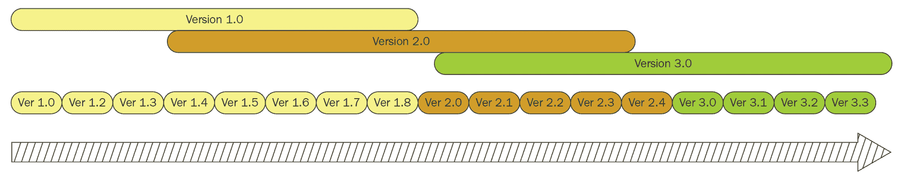
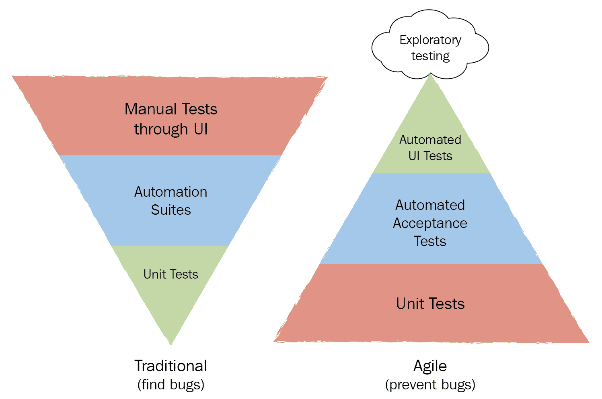
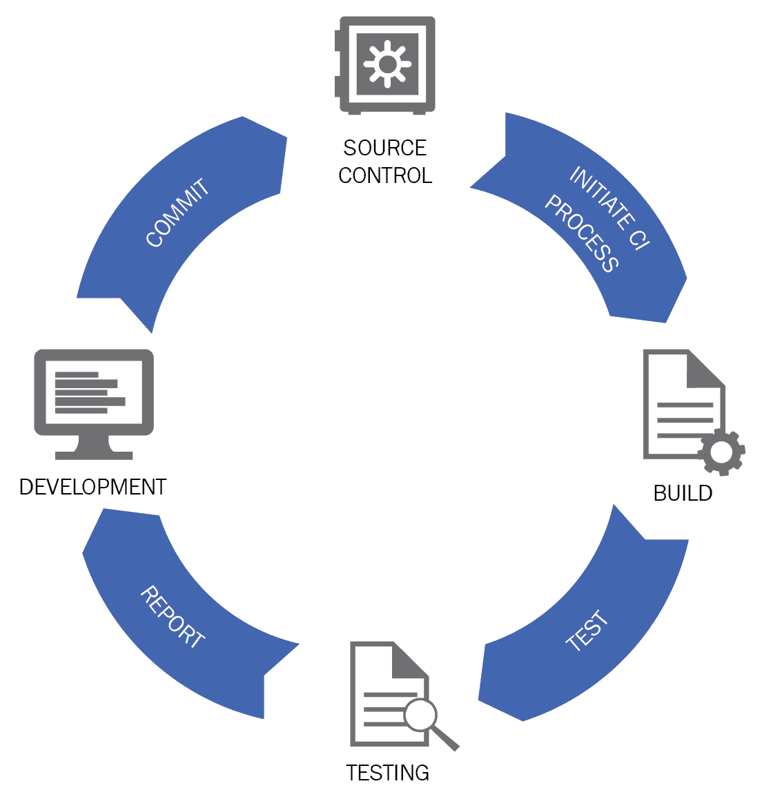
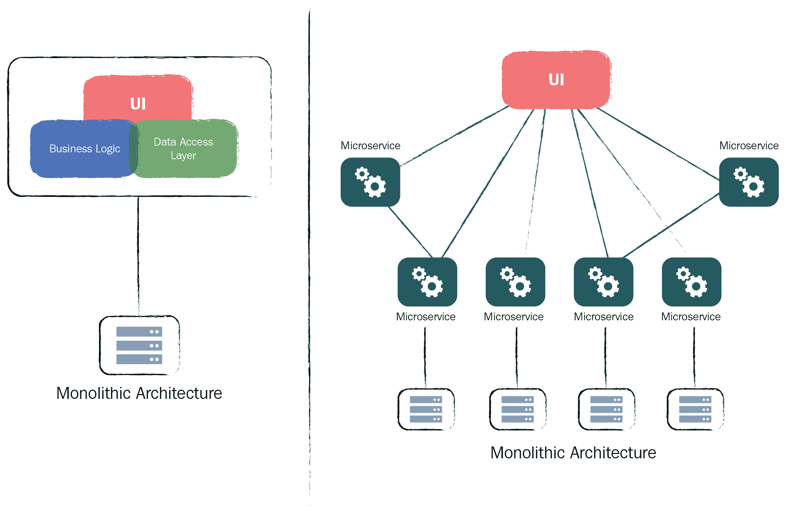
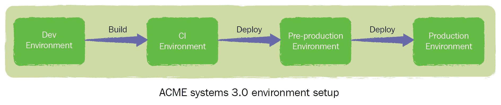
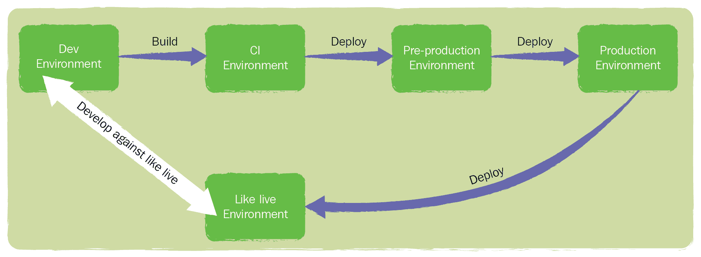
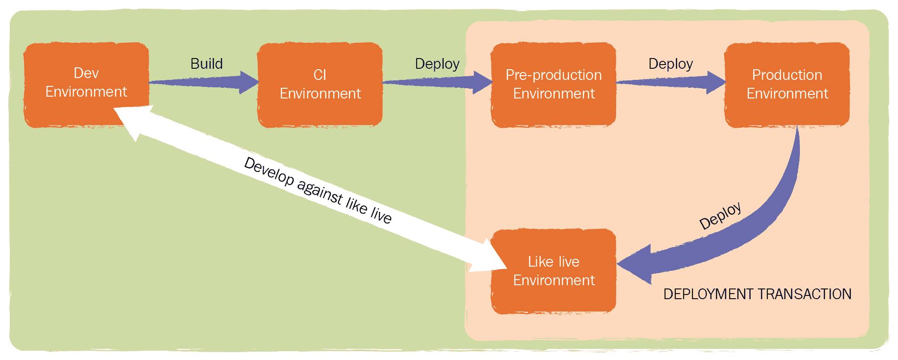

# 第五章：方法、工具和技术

上一章专注于为 CD 和 DevOps 的实施和推广组建目标、愿景和专门的团队（或根据实际情况不组建）。在接下来的几章中，我们将通过执行计划的步骤，最终实现你所定义的目标。

在第三章中，*文化和行为是成功的基石*，我们专注于 CD 和 DevOps 采用中需要落实的人文方面。第四章，*成功的规划*，则探讨了如何制定计划以及为确保采纳成功需要构建的一些基本要素。接下来，我们将重点关注执行中的技术层面——你和团队应该在计划中实施和/或完善的工具、技术、方法和流程。

本章将涵盖很多内容，其中一些是你需要的，一些你可能已经具备，另一些则可能是你以后想要考虑实施的。我建议你阅读全部内容，以防其中有些小的智慧或信息，你能够调整或采用，以更好地满足你的需求。

本章有相当一部分内容集中在软件工程（即 DevOps 合作中的 Dev 端），更偏向 CD 而非 DevOps，但请耐心阅读，因为其中的一些要点对系统运维和软件工程同样相关——毕竟，这正是 DevOps 的核心所在。

值得指出的是，所提到的工具和流程并不是相互排斥的——并非“全有或全无”；你只需选择适合你的方法。话虽如此，接下来一两章中所涉及的一些内容确实有一定的逻辑顺序和依赖关系，但最终决定什么是可行的，还是取决于你。

另一个非常重要的考虑因素是，除了我将要提到的内容外，还有大量的书籍、网站、博客等，它们提供了比我更为详细的信息。我会努力提供一个概览，帮助你理解推动 CD 和 DevOps 采用的关键内容。深入了解的部分就交给你和团队去探索吧。

在本章中，我将提到一些工具和/或软件解决方案，您应考虑使用它们来减轻负担并促进 CD 和 DevOps 的采用。像任何投资一样，我建议您不要仅仅选择出现在您最喜欢的搜索引擎中的第一个工具，或选择一个现有供应商强推的工具。CD 和 DevOps 工具市场竞争激烈；因此，您应该有多个选择。根据您的具体需求，了解您需要解决的问题，并在选择时进行充分的尽职调查。如果需要尝试几种不同的工具，您应该这样做。CD 和 DevOps 的采纳效果可能依赖于这些工具，因此请选择谨慎。

既然这些问题已经解决了，让我们开始一些工程最佳实践吧。

# 工程最佳实践

对于那些不是软件工程师，或者没有软件工程背景的人来说，您对软件如何开发的知识和/或兴趣可能非常有限。你可能会问，为什么我需要了解开发人员是如何工作的？难道开发人员比我更懂这些吗？反正我都不理解其中 10%！

在某种程度上，这是非常真实的；开发人员确实（并且应该）懂得自己的业务，把你放进来可能并不受欢迎。然而，如果你至少对软件是如何创建的有所了解或理解，会有帮助，因为这有助于识别潜在的问题所在。

换个方式说：我理解并且欣赏内燃机是如何组装的以及它是如何运作的，但我不是机械师——事实上，远非如此。然而，我知道足够的知识，能够质疑当我带车去修理时，为什么一个机械师会把我的整个排气系统和后轴都换了，尽管我只是带车来解决一个燃油喷射器的问题——事实上，我肯定会激烈地质疑为什么。

软件开发和它周围的过程也是如此。如果你一点技术背景都没有，且没有做过功课来理解软件应该如何编写，你就会让自己暴露在那些喜欢用技术术语来转移话题而不是开诚布公、愿意并能够与你合作的人做决定的风险中。在“象的曝光”过程中，你无疑会遇到过这样的人，我敢打赌，他们肯定避免参与到这个快速交付软件而不让一切乱套的空想之中——至少他们是这么认为的。你和团队将需要与他们在同一水平上合作，所以如果你对你所说的内容有一些了解，将有助于这些讨论。

让我们从基础开始：CD（持续交付）基于一个前提，即优质软件可以在短时间内多次开发、构建、测试和发布（这就是“持续”的部分）——理想情况下，我们说的是几小时或几天最多。当你把这个列表应用到传统的瀑布式开发项目时，你无疑会发现每个步骤都需要时间和精力，并且充满浪费。你也无疑会发现，最痛苦、最昂贵、最有风险的部分就是发布（或交付）。而当应用到现代敏捷开发项目时，你通常会发现列表中的前三项更为精炼、高效和有效（尽管仍然存在一些浪费和时间滞后——这取决于团队的成熟度），但发布部分仍然是痛苦的，且需要大量的时间和精力。稍后我们将重点讨论发布（更准确地说，是交付）部分。

从这一点开始，我假设你已经知道瀑布式开发和敏捷开发之间的区别（如果不知道，我建议你停下来做点功课），然后迅速进入下一部分。

让我们回归基础，讲解一些现代敏捷软件工程的基本概念：

+   所有代码、配置和相关元数据都存储在现代的源代码/版本控制解决方案中

+   小的且完整的代码更改应频繁提交到源代码管理仓库

+   单元测试默认包含并与源代码仓库一起存放

+   代码重构会定期进行

+   代码不应过于复杂，并且应该有文档化说明

+   分支生命周期短，合并频繁

+   自动化测试与代码一起存放在源代码仓库中，并且会非常频繁地运行

+   一直使用结对编程、代码审查或拉取请求

+   构建和自动化测试由**持续集成**（**CI**）解决方案进行协调和控制

+   测试失败并不意味着世界末日；让别人指出你代码中的缺陷也不是终结

可能有些人已经失去兴趣，但在跳过本章之前，请再稍微阅读下去，因为我很快会深入讲解其中的一些概念。

上述列表相当简单，正如之前所说，大多数从事现代敏捷软件开发项目的工程师会把这些视为常识和常规做法。

提到现代敏捷软件开发是有目的的，因为仍然有一些（在某些行业中，应该说是*很多*）老派的程序员认为，他们由于多年来在没有这些新潮的“hipster”技术的情况下成功交付代码，因此可以免除这一切。也许这是事实；然而，如果不改变软件的编写和交付方式，几乎不可能成功地采用 CD 和 DevOps。这些人无疑会在“参与度低”的贡献者组中。

更令人担忧的是，当这些人积极阻止那些希望遵循现代敏捷软件工程最佳实践的软件工程师时。无论情况如何，这些“老狗”都得学会新把戏。

最终，现代敏捷软件工程的基础是尽早发现软件问题。没有这种方法，这些软件问题**必定**会在后期被发现，它们**必定**会拖慢进度，并且**必定**会对最佳实践的采用和其成功的认知产生负面影响。

换句话说，如果你持续开发小的增量变化，并且这些变化正在构建、集成和测试，那么持续交付的便利性将大大提高。

让我们看看我们的角色可以做些什么来帮助：

| **良好方法** | **不太好的方法** |
| --- | --- |
| Victoria（副总裁）不应仅仅将此视为“开发人员的工作”，应确保她意识到在工程团队中成功实施最佳实践所需的努力，并愿意提供预算和高层支持。 | Victoria（副总裁）将其视为更多的开支，这可能会拖慢进程和/或成为偏离主要产品交付流程的低优先级秘密项目 |
| Stan（经理）应确保相对重要性在领导层、同伴群体和团队之间得到充分重视，并确保正确的资源在组织中分配和对齐。 | Stan（经理）忽视工程最佳实践带来的好处，认为其采用会增加额外的工作量，从而分散团队的注意力。 |
| Devina（开发人员）和 Oscar（运维人员）应该花时间理解并完全接受工程最佳实践，并在同伴中以身作则。 | Devina（开发人员）和 Oscar（运维人员）低调行事，把领导角色交给他人，继续在执行工程最佳实践时遇到困难。 |

对于那些眼神开始涣散的朋友，或者那些需要复习的朋友，让我们从源代码管理开始，进一步解释这些概念。

# 源代码管理

有很多不同版本、种类和解决方案可供选择用于源代码管理（有时称为 SCM 或版本控制系统），包括商业（收费）和开源（免费的）。这些工具大多可以自托管（如果需要的话），或者作为**PaaS**模式提供（虽然不是免费的，但仍然相对便宜）。考虑到这一点，不使用源代码管理没有任何借口。绝对没有！

如果**所有**代码都存储在源代码管理中，并且进行了版本控制（即，每一个变更都有历史记录，从最早的版本开始），它对任何拥有源代码管理访问权限的人都是可用的，是安全的，并且应该有备份，以防丢失任何代码。

一些更现代的解决方案实际上可以帮助你通过内置的工具、工作流程和触发器来控制软件交付的整个生命周期。这可以为你节省大量的时间、复杂度和成本。然而，你不应过分被此类功能所左右。你需要的是一个最适合你组织和工作方式（现在以及未来）的解决方案，帮助你持续交付高质量的软件。

你们中的一些人可能听说过一个城市传说，认为源代码管理解决方案仅对软件源代码有用。像所有的城市传说一样，这种说法在很久以前是有一定道理的，但现在已经不成立了。源代码管理不应该仅限于软件源代码。任何可以、能够并且将会被更改的东西都应该进行版本管理，并存储在源代码管理系统中。我已经提到了一些例子，下面我们来详细扩展一下：

+   单元测试

+   测试用例

+   自动化测试脚本

+   软件配置/元数据

+   SQL 脚本/SPROCS

+   文档

+   环境配置

+   服务器配置

+   任何可以被更改、编辑或保存的东西

一般来说，争议的焦点是环境/服务器配置以及其他一些工件集合，比如启动脚本和网络路由配置，有些人可能认为这些应该排除在源代码管理之外，因为它们属于运维领域，而不是开发领域。然而，随着你们逐步过渡到 DevOps，这种说法就不再有任何意义，且不再适用。经验法则应该是：如果它可以被更改，它就应该在源代码管理中进行版本控制。

DevOps 社区提到的一种方法是通过配置文件来表示给定的环境，并且这些配置文件可以（也应该）存储在源代码管理中，作为“配置即代码”。需要指出的是，这种方法源自开源社区，因此这种方法的一些方面最初可能并不完全适用——例如，管理 Windows 服务器更多是通过点击操作，而不是使用一组配置文件来管理 Linux 集群。然而，你也可以通过 PowerShell 脚本来管理 Windows 服务器，所以这也是一种选择。总的来说，你应该努力让给定环境/服务器/交换机/路由器/防火墙的每个元素都以配置文件的形式表示，并可以（并且应该）存储和版本控制在你的源代码管理系统中。这样，你就可以相对轻松地在某一时刻创建给定环境的精确克隆（稍后我们会讲到这个问题）。

一个可能成为阻碍的因素是安全性以及对源代码管理系统中文件内容的访问权限。例如，如果你将环境配置作为代码存储，理想情况下你不希望开发团队访问生产数据库连接字符串或 API 令牌。已经有了经过验证且文档化的方式来做到这一点（如掩码、加密、限制访问某些仓库等），所以如果你提前做好规划，这不应该成为障碍。

关于源代码管理的书籍和参考资料很多，它们在这个主题上有更深入的讨论，因此我在这里就不多赘述。只需说，如果你没有源代码管理解决方案，请立即实施一个。

如你所见，源代码管理解决方案对于持续交付（CD）和 DevOps 的采用是非常有价值的工具。除了拥有一个中央位置来安全存储源代码之外，将同样的方法应用于你的二进制对象和工件也是非常重要的。

# 二进制仓库

顾名思义，二进制仓库就是用来存储二进制对象和工件的地方。在软件工程术语中，二进制对象/工件是指源代码成功编译后生成的可执行软件。

二进制仓库的功能与源代码管理解决方案非常相似，但正如你所预期的那样，它们更适合存储二进制文件。一些解决方案还提供版本管理机制，甚至将二进制文件打包以便以后在目标环境中安装。

我们将在本章稍后讨论二进制仓库的重要性。现在，让我们继续讨论保持小而频繁变更的有价值实践。

# 小而频繁、简单的变更

保持小的变更意味着变更的影响——有时称为爆炸半径——也应该很小，风险减少，变更的机会增加。听起来过于简单，但这也是非常正确的。如果你考虑一个典型的软件工程团队每天做的变更次数，然后将其推广到你有的所有团队的变更次数，你很快就会发现这些变更会积累起来。如果你再将这个数字乘以版本发布之间的天数，你会发现变更量并不微不足道——这些变更的风险也同样不可忽视。

就风险而言，假设我们有一个由五个软件工程师组成的团队，每个工程师每天平均做 10 次代码变更——这就是 50 次变更。假设我们有 10 个团队都在做同样的事情——这就是每天 500 次代码变更。现在假设我们每 12 周发布一次版本（或 60 个工作日）；我们现在谈论的是 30,000 次需要上线的变更。即使我们有行业领先的测试覆盖率——假设是 99.9%的覆盖率——仍然有可能会漏掉一些问题。在这种情况下，就是 30 个未被覆盖的变更。简单来说，每 12 周可能会产生 30 个缺陷的风险。好吧，这是一种非常简化的方式，但希望它能说明一个问题——将大量代码变更聚集在一起远不是理想的做法。

一件可能不太显而易见的事情是，如果在发布后的第二天发现了一个可以通过单行代码修改来修复的简单缺陷会发生什么。如果我们按照前面的例子，那这个缺陷将在生产环境中再停留 11 周 6 天（假设我们无法进行紧急补丁发布）。发布周期的第一天所做的任何变更——包括客户功能请求——也会发生同样的情况。

如果我们将其拆解成更小且更频繁的发布——例如，每两周一次——并应用相同的数据，我们可能会看到类似以下的情况：

*500 次变更 * 10 天 = 5,000 次变更发布，可能存在五个缺陷未被发现。*

现在，假设如果在发布后的第二天发现并修复了一个缺陷，那么这个变更将在九天内上线。再次假设，如果在发布周期的第一天做了一个客户功能请求变更，它将在 10 天内上线。我想你会同意，这听起来比第一个例子要好一些。

以下图示可以某种程度上说明这可能会是什么样子：

大变更与小的增量变更

现在，我必须承认前面的例子非常简化，可能与现实不符，且由于外部因素，你可能目前没有频繁发布代码的奢侈（也许你的客户不希望——或者不能接受——频繁的发布，或者你现有的运维流程需要时间来支持这一点）；然而，这并不能成为你现在不采用这些理念的借口。如果你的软件工程团队习惯于以小且可发布的模块进行发布，他们就会养成持续交付的习惯。

另一种表达方式是，一旦你完全采用了持续交付（CD）和 DevOps，它们将必须在这种模式下工作，那么为什么不从现在开始适应它呢？

持续地进行小范围且频繁的变更也有助于其他方面；即减少复杂性、提高代码的可维护性并提升质量。如果工程师只需要更改少量代码，那么他们就有更大的机会重构周围的代码，减少复杂性并提高代码库的整体可维护性，包括增加额外的单元测试。另一个不太明显的好处是减少代码审查、拉取请求和合并的开销，这些过程可以更加频繁地发生，成为一种日常的事情，而不是繁琐的任务。

这种做法不仅限于软件工程，它同样适用于系统运维领域的变更。例如，对服务器配置进行小范围、孤立的调整（如虚拟服务器的内存分配）比一次性进行大范围变更要安全得多，且更容易控制和监控。如果你进行小规模的更改，你将有更大的机会看到这些变更是否对平台的整体运行产生了影响（无论是正面的还是负面的）。

进行小规模、渐进性的变更是一个非常有益的实践。然而，除非你有一些工具来帮助自动化构建软件，否则这将非常难以管理。

# 自动化构建

CD（持续交付）和 DevOps 采用的一个常见主题是如何使用自动化。如前所述，如果没有某种自动化工具或解决方案，将非常难以频繁地交付。你可能会读到这里并想，“嗯，这显然是显而易见的。”然而，即使在这个现代科技时代，仍然有一些软件工程团队在手动完成所有工作，使用手动步骤和/或手工编写的脚本——其中一些脚本的历史甚至比正在运行它们的工程师还要久远。幸运的是，这种情况如今已经非常少见，尽管我还是会介绍一些自动化的相关内容以及它为何对于 CD 和 DevOps 的采用至关重要，以防你正处于少数派。

每个进行更改的工程师——无论是软件工程师还是运维工程师——都需要反馈，以了解他们所做的更改是否有效（或者是否失败）。他们越早收到反馈，就能越早解决问题或继续进行下一个更改。从软件工程的角度来看，了解自己编写的代码是否能够顺利构建和/或编译，并且保持一致性，也是非常有帮助的，以便可以进行测试。

这种验证可以通过手动过程（或过程或脚本）来完成，但这可能会繁琐、不一致、容易出错、缓慢，且并不总是能够完全重复。缺乏一致性和可重复性，会增加额外的风险。

实施自动化将有助于加快进程，保持一致性、可靠性和可重复性，并且最重要的是提供信心。如果你反复执行相同的步骤并获得相同的结果，那么可以合理地推测该过程是有效的，且可以信任它。因此，如果你在软件、配置或环境中更改了某个部分，并且之前正常工作的过程失败了，那么很有可能是这个变更破坏了某些东西。

有很多工具可供用来构建/编译代码——这取决于你使用的开发语言——它们的功能基本相同：确保代码书写正确、语言语法符合预期、确保所有外部引用可用，并且——如果一切正常——创建可以运行的二进制文件。这是一个过于简单的描述，但希望能传达出要点。触发这个过程的方法有多种：可以通过命令行手动触发、通过脚本手动触发，或通过开发者的 IDE 来触发。无论使用哪种方式，你都应该认真考虑自动化该过程，以确保一致性和可重复性。

另一个需要考虑加入自动化脚本/流程的工具是代码检查（linting）。代码检查工具帮助扫描并检查源代码中的语法问题。这是一个非常有用的补充，因为如果在构建/编译代码之前使用它，能大大减少查找问题的时间——尤其是在代码库非常复杂时，这意味着构建时间可能是几分钟而不是几秒钟。同样，依据你使用的编程语言，有许多选项可供选择。

希望你现在已经对为什么自动化构建软件组件很重要有所了解。现在让我们集中讨论测试自动化。

# 测试自动化

传统的软件交付过程通常会包含一定的测试环节。然而，根据组织的不同以及软件的使用年限，测试用例的执行通常是一个手动过程。尽管如此，测试自动化已经存在了一段时间——与敏捷软件开发同时发展。然而，测试自动化并不像人们希望的那样普遍。我要指出的是，测试方法及其自动化是一个庞大的话题，我不会在这里涵盖所有内容。如果你需要更多的信息，我建议你做一些研究并阅读一些关于这个主题的好书。我们在这里讨论的内容相当基础，但应该足够让你理解测试自动化如何融入 CD 和 DevOps 的应用中。

测试主要有三种类型：

+   单元测试通常用软件的编程语言编写，用来测试代码库中的*代码*和*逻辑路径*。它们通常不会与任何特定的用例或功能区域对齐。

+   集成测试通常测试软件系统/平台中一个部分与另一个部分之间的交互方式（例如，确保登录页面正确调用身份验证服务）。

+   端到端测试通常集中于最终用户会启动的实际用例（例如，当成功登录后，欢迎页面会显示，且显示的文本语言正确）。

这是一种过于简化的视角，但希望能阐明不同类型的测试。

就工具和技术而言，用于创建、维护和运行自动化测试的选择有很多，不同的解决方案各有特点，选择最适合你需求的工具可能会很困难。从基本层面来看，这些工具基本上做的事情相同：它们协调测试脚本的运行并捕获结果。选择测试自动化工具是一个不应仓促做出的决定，我的建议是，像选择开发语言一样，给予这方面足够的思考。

你有时会听到“框架”这个词，特别是在研究如何加入单元测试时。它们基本上是预定义的（大多数是）行业标准方法。这意味着工具本身可能不同，但它们所遵循的标准是相似的。

在选择工具时，尽量考虑未来可持续性，特别是用于创建和维护测试的测试语言。像 Cucumber 这样的标准化工具是一个不错的起点，而且这是许多工具都采用的方式。如果你希望采用**TDD**和/或**BDD**方法进行集成和端到端测试，这会非常有帮助。

最终，你需要朝着广泛被称为“倒置测试三角形”的方向努力。本质上，传统的测试方法大多依赖于手动执行的测试，自动化和单元测试则较为少见。为了使 CD 和 DevOps 的采用成功，你需要改变这种比例，显著减少对手动测试的依赖，并增加自动化。关于这一点有很多文献支持，特别是在 CD 和 DevOps 方面，主要的优势是速度、可靠性、可重复性和一致性：

倒置的测试三角形

你可能会注意到，与**传统**三角形相比，**敏捷**三角形中**单元测试**层的相对大小。这是理想的情况，因为你拥有的单元测试越多，能够检查代码和代码中的逻辑流程，你对底层代码的信心就会越大。反过来，这也应当能增强你对更高级别测试的信心。一个不那么显而易见的优势是成本——编写单元测试比编写集成和/或完整的端到端测试便宜得多。

像 TDD 和**极限编程**（**XP**）这样的敏捷软件工程方法，遵循的前提是单元测试必须始终编写并通过，才能进入下一个测试阶段。

继续讨论自动化测试，有一件事确实会增加困惑，并且让人望而却步：采用测试自动化可能会让人感到非常令人畏惧——这还算轻描淡写。走这条路时有很多事情需要考虑：你需要覆盖多少代码库？如何在现实世界中模拟实际用户及其使用情况？你从哪里开始？

不幸的是，没有简单或通用的答案。当你开始查看关于这个话题的大量在线资料、书籍和信息时，这变得更加具有挑战性。更糟糕的是，其中的一些信息可能与其他的内容相互矛盾。我唯一能给出的建议是遵循简单至上的（KISS）方法。例如，你可以从绘制出一些主要且最常执行的用例开始（例如，登录/身份验证、用户从列表导航到购物车中的商品详情，或用户进行购买），并通过创建自动化测试来尝试一些工具以覆盖这些用例。只要你能够运行这些测试，并且结果是稳定、可靠和可重复的，那么你就应该走在正确的道路上。

使用 KISS 方法，即使只有一个自动化测试验证了代码库的一小部分，也总比什么都没有要好。

一旦你对整体的自动化测试过程建立了一定的信心和信任，就可以进入下一个用例——或者尝试另一种工具，直到你感到满意为止。

我还建议在覆盖率方面使用 KISS 方法——如果你可以覆盖 100% 的代码库和用例，那就选择这个数字。如果不能，那么找到一个可行的数字，并随着时间的推移增加它。我的意思是，当新增代码和功能时，不要让覆盖率百分比下降。设定一个里程碑日期和现实的百分比目标可能有助于保持紧迫感和专注力，避免在过程中丧失动力。

还有一组工具可以通过检查/分析你的代码库和源代码仓库（当然，这也包括你所有的自动化测试）来帮助你确定测试覆盖率，并提供有用的信息和仪表板供你查看。这些工具还可以为你提供历史视图，帮助你衡量覆盖率的增加（或减少）。

另一个可以应用 KISS 方法的地方是自动化测试中通常会让人头痛的测试数据问题。测试数据可能是一个巨大的问题，且可能带来更多问题而不是解决问题——并且还可能引发相当多的争论。一个好的经验法则是，将运行测试所需的测试数据作为自动化流程的一部分来创建——更重要的是——在最后一步将其移除。我见过太多没有遵循这一 KISS 方法的例子，这意味着你最终可能会得到过时的数据，这些数据很可能会很快变得不再适用。这些过时的数据可能导致以前运行正常的测试开始失败，或者更糟的是，其他人拿这些数据作为基础来编写他们的测试（这意味着即使你想清除它，也做不到）。它还会影响你确保测试一致性和可重复性的能力。

让我们看看我们的角色可以做些什么来提供帮助：

| **好方法** | **不太好的方法** |
| --- | --- |
| Victoria（副总裁）应该积极关注测试自动化如何大大降低整体成本并提高质量保证的效果，并愿意提供预算和高层支持。 | Victoria（副总裁）将此视为一种裁员/降低成本的解决方案，并削减预算以获得最优惠的交易，而非团队所需的最佳解决方案。 |
| Stan（经理）应该确保在领导层、同级团队及团队内部清楚地传达相对重要性。他还应该确保最相关的资源在组织内得到分配和协调。 | Stan（经理）不愿了解测试自动化带来的好处——他把这看作是开发后的质量保证工作，对此不感兴趣。 |
| Devina（开发人员）和 Oscar（运维人员）应该花时间理解、调查并接纳测试自动化，作为与软件开发并行的日常活动。 | Devina（开发人员）和 Oscar（运维人员）忽视测试自动化，因为已经有团队在软件构建完成后进行测试，那这样做有什么意义呢？ |

到目前为止，我们尚未讨论的是可以运行、管理和控制这些自动化的工具。这正是持续集成解决方案发挥作用的地方。

# 持续集成

持续集成，或更常见的 CI，是一种经过验证的方法，用来确保正在开发的软件资产能够正确构建并与代码库中的其他部分良好协作。这里的关键词是*持续*，顾名思义，它是尽可能频繁的（理想情况下是在每次提交和/或合并到源代码控制系统时）。最简单的理解 CI 解决方案的方法是将其视为一个工具，用于协调构建和测试自动化工具——我们刚刚讨论的这两项内容。

如你所猜测的那样，市面上有大量成熟的 CI 解决方案，既有商业版也有开源版，因此没有理由不选择一个并使用 CI。

如前所述，CI 解决方案是一个非常基础的、协调构建和测试自动化执行的软件解决方案。执行是由许多人所称的*CI 任务*控制的，当某些事件发生时，这些任务会被调用；例如，当代码提交并/或合并到源代码控制库时，或按定时计划执行，或当另一个自动化工具触发 CI 时，等等。这些任务包含一个活动列表（通常被称为*步骤*），需要快速连续地执行；例如，从源代码控制中获取最新的源代码，编译为可执行文件，将二进制文件部署到测试环境，获取源代码中的自动化测试，并运行它们。

如果一切顺利，CI 任务会完成并报告成功。如果失败，它会报告失败并提供详细的反馈，解释失败的原因。大多数工具还允许你深入查看失败的步骤，了解哪里出了问题。每次运行给定的 CI 任务时，都会为你写入完整的审计日志，你可以回顾并比较结果和/或随时间变化的趋势，如下所示：

一个典型的 CI 流程

CI 工具非常强大，你可以构建简单的逻辑来控制流程。例如，如果所有自动化测试都通过，你可以自动将可执行文件（可能已嵌入构建版本号）移至二进制仓库，或者如果某个环节失败，你可以将结果通过邮件发送给工程团队。你甚至可以构建仪表板或信息显示器，以便提供即时、易于理解的可视化表示，展示当前的情况和结果。

CI 解决方案是 CD 的必备工具。如果你频繁地构建和测试软件变更，你就能频繁发布。

CI 对传统系统操作变更的优势并不那么显而易见，但它们在尝试更改而不影响生产平台方面可以提供很大帮助。例如，假设你有一个 CI 解决方案，正在对一个隔离的测试环境运行多个自动化夜间测试。这些测试已经成功通过（通常称为绿色）好几天了，所以你有信心一切正常。然后，你对服务器配置进行了更改并重新运行 CI 套件，结果失败了。唯一的变化是服务器配置，因此它一定产生了不利影响。这是 DevOps 方法应用的一个很好的例子。

实施 CI 并非易事——尤其是当你没有任何自动化工具可用时。然而，CI 是一个非常强大的工具，能大大减少使用手动方法进行系统更改构建和测试的开销与风险。就实际情况而言，如果没有 CI，尝试实现 CD 将是一个非常艰难的过程，因此我的建议是咬紧牙关，实施 CI。

在本节中，我们一直在讨论如何自动化构建和测试，以确保软件可以被验证和交付。我们还提到了一些结果，整体来说应该是积极的——自动化构建必须完成，自动化测试需要通过，才能进入下一阶段。换句话说，如果测试失败，那就不好了。总体上，这是正确的。然而，失败也可以是好事，只要这些失败是在流程的早期发现的。

# 快速失败并频繁失败

快速且频繁地失败可能看起来反直觉，但这是一个非常好的工作理念。如果一个缺陷被引入，但直到它已经上线后才被发现，修复这个缺陷的成本是很高的（可能需要完全新的发布版本），更不用说它可能对您的客户、声誉和可能的收入产生的影响了。尽早发现缺陷是必须的。

敏捷工程方法如**TDD**或**BDD**基于在软件开发过程的早期阶段找到和解决软件中的故障的原则，其简单前提是在编码开始之前编写测试来覆盖软件需要满足的某些/所有用例——这个比例通常称为覆盖率。随着代码的编写，这些测试可以作为持续集成过程的一部分反复运行，以发现漏洞。如果在此时测试用例失败，这是件好事，因为唯一受到影响的是编写代码的软件工程师，而不是您的客户。

这听起来可能有些奇怪，特别是对于管理者来说，但如果早期发现缺陷，您不应大惊小怪，也不应责备人员。回想一下我们对责备与学习行为的理解。您想要的是找到问题，弄清原因，修复它，从中学习，然后继续前进。

有时会妨碍实施 TDD 等工程实践的事情之一是软件平台本身的规模和复杂性。为不围绕这些原则构建的软件系统回顾性地实施测试套件可能是一项非常艰巨的任务。如果是这种情况，从小处着手逐步构建可能是明智的选择。

我们现在将远离软件构建和测试自动化，转向在采用持续交付（CD）和 DevOps 时可能遇到的挑战，特别是与软件系统/平台的设计和架构相关的挑战。

# 架构方法

尽管科技界媒体和穿着牛仔裤 T 恤的会议演讲者让您相信大多数企业都在运行现代软件架构，但事实并非如此。实际情况是，世界上大量的软件平台和系统经过多年发展，其中一些（多数）相当复杂和笨重，难以维护或推进。即使是年轻和时尚的科技公司也在运行和维护被视为*遗留*解决方案和平台的少量大型可执行文件，这些文件都是在构建和测试后一起交付的。这并不意味着不能使用或采用 CD 和 DevOps 原则，只是意味着需要更多的工作。

立即反应可能是花费大量时间、精力和金钱将整个软件平台转型为一个新的参考架构模型，以实现 CD 和 DevOps 的无缝接入。如果你足够幸运，拥有深谙此道的高层领导并且他们有充足的资金，那么祝你好运。大多数人并不这么幸运，因此我们需要在方法上更加富有创造性。

如果你要研究最佳的参考架构种类，这可能会让人感到有些望而生畏，因为你会发现关于什么是最佳方法存在许多不同的看法（往往各不相同）。更不用说，采用和实施该架构的方式有很多且各异。如果你足够幸运，拥有一位高瞻远瞩的愿景者，他能凭直觉知道该怎么做，那么你就已经有了一个好的开端。实际上，最终你得到的将是一个目标架构，以及通过所谓的遗留系统“勒索”来实现这一目标的计划——这是一种系统性地用更现代的方法设计和构建的软件组件替换遗留平台部分的方式，重点是特定的功能（以及非功能）领域。

尽管遗留解决方案是个痛点，但在 CD 和 DevOps 的采用过程中，它们并不是世界末日。需要考虑的限制因素包括每次进行更改时，必须构建、测试和部署整个平台的需求，以及完成这一过程的整体时间，这可能需要几分钟（有时是几个小时），具体取决于平台本身的规模和复杂性。

这时创造力就派上用场了。假设你的*遗留*平台构建需要 30 分钟，而自动化测试套件的完成需要 90 分钟。每进行一次更改并希望测试，就需要等待两小时。将这一时间扩展到所有做更改的工程师身上，这简直无法承受。大多数人会通过只在特定时间触发 CI 作业来克服这个问题——例如在工作日结束时——这样时间就不会延续到工作日中。这确实在某些方面有所帮助，但也增加了一个风险，那就是整个构建可能由于一个简单的错误、缺陷或拼写错误而失败，从而阻碍其他所有更改和工程师继续下一个任务。

你可以通过对流程进行一些小的调整来克服这一问题，使其变得（稍微更）可行。例如：

+   将测试套件拆分成更小、更独立的测试包；例如，在构建完成时使用一部分测试（有时称为烟雾测试），并且在晚上进行完整的测试。

+   为你的构建和/或自动化测试服务器增加更多的计算能力。

+   实现一个集群化的 CI 解决方案。

+   将 CI 作业并行化（你需要更多的计算能力/集群化）。

+   改变软件构建方式，使得只有自上次构建以来有变化的部分才会重新构建（也就是说，每次只构建增量，而不是整个平台）

最终，你希望减少构建、测试和发布遗留软件所花费的时间。你在这方面取得的进展越多，就能为自己争取更多时间，去将遗留平台拆解成更小的、可以独立构建、测试和发布的软件组件。即使是最集成、最紧密耦合的软件平台，也由许多小组件组成，它们之间相互通信。

如果你退后一步，回顾一下你的遗留平台，你可能会发现实际上你可以将它（或至少大部分部分）拆分成小而易于管理的模块（共享库、不同技术层、打包解决方案等），这些模块可以独立并快速地构建和测试，更重要的是，它们可以频繁地发布。

# 基于组件的架构

如前所述，如果你有幸能够重新设计你的*遗留*平台——就像 ACME 系统那样——那么你应该花时间考虑最适合你需求的方法。理想情况下，你应该选择一种技术或架构方法，允许将平台拆解成小而独立的模块或组件，并且这些组件之间是松耦合的。我的意思是，每个组件都可以独立开发、构建、测试和发布，而不依赖其他组件。

这种方法多年来有许多名称——如 Web 服务架构、**面向服务架构**（**SOA**）或微服务架构——但从基本层面来看，它们几乎是相同的：一种架构方法，允许松耦合的、自包含的软件组件共同工作，提供通常会作为完整单体平台交付的功能，示例如下：

一个典型的架构比较

采用这种方法，你将拥有小而独立的软件组件，它们可以被开发、测试，且更重要的是，可以独立发布。这大大有助于实现持续交付（CD）的好处。

这种方法的另一个优势是节省成本，这与持续交付（CD）或 DevOps 并没有直接关系。基于组件的架构不仅允许频繁的小规模变更发布，还可以减少对大型昂贵 IT 基础设施的需求。例如，如果你现在有一两块庞大的代码，你就需要一两台巨大的服务器来运行它们。然后你还需要一两台庞大的数据库服务器——为了实现灾难恢复，你还得有另一套服务器在等待。想一下，要获得并维持这些服务器运行的成本有多高。使用许多小组件，你可以考虑更具成本效益的托管方式——我们稍后将讨论这个问题。

有大量的选项和信息可以帮助确定最适合您当前和未来需求的方法。可以这么说，如果您能够朝着基于组件的架构迈进，发布时的痛苦和开销将成为过去。

在这里需要注意的一点是，如果您采用基于组件的架构（顺便说一下，您应该这么做，万一不够清楚的话），如何发布这些组件。可能会有诱惑使用与遗留平台相同的*将所有内容合并为一个大版本*的方法，但这将只会导致一堆痛苦，并且根本不会给您带来任何优势。稍后我们会讨论持续交付工具，因此请继续阅读。

让我们看一下另一个可能的解决方案，它可以帮助解决遗留系统的限制问题，并使您更容易向基于组件的架构理想迈进。

# 抽象层

如果您的平台中有复杂的依赖关系，尝试通过使用某种形式的抽象来分离软件资产可能会有所帮助。这个技术应该有助于去除，或者至少减少平台内的硬依赖，并帮助您朝着基于组件的架构迈进，进而为您提供采用持续交付（CD）的机会。

举个例子，假设您有两个必须一起部署的软件组件，因为它们被硬性耦合在一起，无法单独部署，否则会导致平台停机。那么您将很难遵循*小幅增量变更*的方法，更不用说您将很难做到在不出现停机的情况下发布了。

有许多成熟且经过验证的设计模式可以为实现这一目标提供一些不错的方法，但至少，移除尽可能多的紧密依赖是一个好的实践，这样您就不会最终拥有一堆需要一起部署的资产。

一个常见的紧耦合领域是软件和数据库之间。这意味着对其中一个的更改可能意味着两者都需要进行测试和发布。在这里添加抽象可能和在两者之间添加数据访问层代理一样复杂，或者像使用 SQL 视图一样简单。另一个问题区域是 UI 和业务逻辑代码捆绑在一起，这同样可以通过遵循标准设计模式来分离。无论采用何种方法，目标都是一样的：能够独立构建、测试和发布软件组件。

作为额外的作业，您应该花些时间查看并分析现有平台中的区域，找出那些紧密耦合的组件，然后看看如何添加抽象层，使得每个组件都可以独立工作而不影响其他组件。您还可以查看快速变化和缓慢变化的区域（例如，哪些软件组件是定期更新的，哪些非常少更新），因为这可能帮助您找出哪些组件需要首先分离。

# 永远不要破坏您的消费者

你的软件平台可能会很复杂，并且有相当多的依赖关系——这并不丢人，实际上这是非常正常的。这些依赖关系可以被分类为消费者和提供者之间的关系。提供者可以是任何东西，从共享库或核心代码模块到数据库。消费者将根据某些预定义的接口规范（有时称为服务合同）以特定方式调用/执行/发送请求给提供者。

一个简单的例子是，网页利用共享库返回内容来渲染和显示用户的地址信息。在这种情况下，网页是消费者，共享库是提供者。如果共享库最初返回了四个数据项，但被更改为只提供三个，消费者可能不知道如何处理这种情况，可能会抛出错误，甚至更糟糕的是，直接崩溃。当然，你可以添加一些防御性代码，但实际上，这只是由于懒惰的变更管理而增加了更多复杂性。

大多数软件平台都有许多依赖关系，这意味着有时很难发现是哪个*提供者*发生了变化，导致众多消费者中的一个失败——特别是当你考虑到一个消费者也可能是另一个位于堆栈上游的消费者的提供者时（也就是说，一个共享库，它从数据库中获取数据，然后*提供*这些数据给网页，网页再消费这些数据，并将其提供给 JavaScript 客户端，等等）。

要了解这种情况有多普遍，你需要进行一些影响分析，帮助你将其映射出来。提前提醒，除非你能够将整个平台映射成一个易于理解且始终保持最新的格式，否则这将是一项艰巨的任务。幸运的是，有许多成熟且已建立的模式可以解决这些问题，还有一些工具可以帮助进行分析。

另外，有助于做的是建立一些规则，来规范如何处理未来的更改。简单来说，如果你正在更改软件、配置或数据库，而这些更改将被平台的其他部分消费，那么做出更改的人有责任验证该更改没有破坏任何上游或下游的内容。如果你已经建立了 CI 和自动化测试，那有助于尽早发现问题。然而，简单地在代码审查/拉取请求过程中增加一些谨慎态度既便宜又容易，而且有助于巩固良好的行为。

在系统操作领域，“永远不要破坏你的消费者”规则也应该适用。例如，软件平台可以被视为服务器操作系统（提供者）的消费者；因此，如果你更改或升级操作系统，必须确保没有任何破坏性更改会导致消费者失败。

有时候，破坏性更改是无法避免的（例如，组件之间的服务契约必须发生变化，以容纳新的功能）。然而，这应该是例外而非常规，并且你应该提前规划好应对这种情况的策略。一个示例策略是支持并行版本管理，这将允许你同时运行多个版本的软件资产——这一点我们稍后会讲到。

消费者/提供者关系可能会失败，原因是负责提供者的一方人员或团队没有意识到这种关系。对于系统运维领域中的提供者来说，这一点尤为真实。为了克服这个问题，或者至少尽量减少风险，使用开放和诚实的同行合作实践。

# 开放和诚实的同行合作实践

今天有许多不同的敏捷软件交付方法论，但它们都围绕着某种形式的高度协作的工作方式和自由流动的沟通展开。像**XP**、配对编程或简单的代码审查过程等敏捷方法，都依赖于工程师们紧密合作。

我不能过分强调与他人分享你工作的必要性。即使是地球上最优秀的软件工程师（或系统管理员）也是人，他们**会**犯错。如果你认为自己的代码是珍贵的，不想与其他人分享，那么你**会**制造缺陷，并且**会**花费更长的时间来解决小错误，这可能会导致几个小时的困惑，或者更糟糕的是，对你的客户产生不利影响。

如果你对自己的代码质量非常自信，并且能经得起推敲，那么就不要把它藏起来——说到做到，分享你的工作。如果你没有那么有信心，与同行分享将帮助你建立这种信心。有一点需要指出——就软件工程师而言——同行小组不应该仅仅由其他软件工程师组成；运维团队也可以（并且应该）参与到这个过程中来。看起来可能有些奇怪，因为他们可能无法真正阅读你的代码（虽然你可能会惊讶于有多少系统管理员能够读懂代码），但是他们了解在线平台是如何运行的，可能会提供一些有价值的意见和/或提出一些相关问题（例如，代码在网络中断时会做什么，长期运行的线程会如何，或者为什么不使用连接轮询）。这也有助于推动 DevOps 的思维模式和方法。对于运维团队所做的更改，同样的规则也应该适用。

综合考虑，世界上大多数高质量的软件都是通过高度协作的方式构建的，因此你没有理由不采取相同的方法。尽管一些极端主义者可能会嘲笑这种做法，但请考虑这一点：这些人很可能会称赞基于 Linux 的操作系统，而如果他们仔细想一想，实际上，像大多数开源软件一样，它们也是通过高度协作的方式开发的，从一开始，协作就已是开发过程的一部分。

在运营团队中，与开发团队一样，拥有一个开放、诚实、透明的同行评审过程同样重要。对平台的任何部分进行更改都伴随着风险，而让不止一双眼睛来进行审查有助于降低这种风险。就像软件代码一样，系统配置更改也没有理由不进行共享。

一种通常被忽视的好处是，如果你的代码（或配置更改）未能通过同行评审，对生产系统的影响就会被消除。关键在于快速失败，而不是等到发布到生产环境才发现它失败。

假设你已经意识到这一点，并决定转向一个松耦合的基于组件的架构，该架构是采用最佳实践编写的，现在你准备迈向软件工程演进的下一阶段。

现在大家都在一起合作愉快，我们将进入下一个挑战：如何重新调整更广泛业务方面的期望，特别是在发布和功能交付方面。

# 功能的增量交付

之前我们讨论了将工作分解成小的增量块，以便能够快速交付和发布。你还需要考虑如何处理功能。这里我指的是那些以商业驱动的交付物，它们最终转化为收入。通常，你会有一个为期一年的商业计划，这个计划由若干个关键举措组成，需要在这一年内完成，而这些举措又进一步细化为一些功能，这些功能最终将被营销并卖给客户。从业务流程的角度来看，这是非常正常的。

请注意，你们公司内部使用的术语可能会有所不同，可能会使用如史诗（epics）、主题（themes）、目标（goals）或最小可行产品（MVP）等术语。实质上，我们将重点讨论的是：将一个能够为企业带来收益的东西交付给客户的时机。为了简化起见，我将这个东西称作“功能”，而交付给客户的时机称作“发布”。

持续交付（CD）和 DevOps 的采用如何影响这一点，确实取决于当前的发布节奏，但我敢猜测，你会看到一个以月或季度为单位的节奏。一旦 CD 和 DevOps 嵌入到流程中，你将会看到每次发布之间的间隔从几周、几天甚至几小时。这无疑是好事，但我们还是花点时间考虑一下更广泛的影响：

+   更广泛的业务部门目前可能期望在每个发布周期内完整交付一个功能

+   销售、营销、法律和支持等业务职能将会有相应的流程来应对这一情况

+   你将大幅度缩短发布周期，并逐步交付变更

更广泛的业务部门该如何应对这一变化？功能什么时候可以准备好？他们应该何时开始行动？他们该如何告诉客户？

你需要与这些业务领域合作，并就如何在多个发布周期中逐步交付功能达成一致。你应该考虑并讨论以下几种方法：

+   分阶段交付端到端体验，并在多个发布周期中逐步丰富功能，直到功能完成

+   专注于某一功能领域直到完成，然后再转向下一个，依此类推，直到功能完成

+   在多个发布周期中逐步构建功能，但在完成之前保持其隐藏

值得考虑的是，像第一种和第二种方法可能会开启像 alpha/beta 版本发布这样的途径，这意味着你可以提前获得客户反馈；而像最后一种方法则意味着你无法提前获取反馈，但上线过程相对简单（因为你已经发布了代码，上线实际上就是“打开”）。无论你选择哪种方法——你必须选择一种——你都需要确保那些期望“发布等于功能交付”的人得到教育，并调整他们的期望。

现在我们将回到一个更技术性的领域：确保在所有环境中部署相同的软件

# 在所有环境中使用相同的二进制文件

在软件资产可以在给定环境中使用之前，它必须已经被构建/编译成可执行文件或二进制文件。这个二进制文件很重要，因为它是将在你的环境中运行时执行的软件版本。可以将其看作是一个时间快照。有些人会说源代码比二进制文件本身更重要，因为二进制文件只是副产品，可以一次次重建，尽管这并不完全准确。

你不会对源代码进行功能性、回归、性能或负载测试，而是对二进制文件进行测试。因此，重要的是要像对待源代码一样对待生成的二进制文件。如果你采用并行版本控制和/或在 CI 过程中嵌入版本信息，这一点就显得尤为重要。例如，如果你的 CI 解决方案生成了版本 1.2.0.1 的二进制文件，那么你应该使用并测试的是版本 1.2.0.1。

理想的、推荐的做法是，二进制文件仅在某个特定版本/部署时构建一次，并且**在所有**环境中使用完全相同、未经修改的二进制文件，包括生产环境。这听起来像是常识，但有时由于软件设计和/或工具的原因，这一点会被忽视，或者干脆做不到，或者更让人担心的是，它没有被视为重要。

工具/软件设计的一个限制例子可能出现在与环境相关的软件令牌或配置（有时称为机密）上。以数据库服务器的凭据为例。有些人会说，因为这些数据非常敏感——特别是在像生产环境这样的高权限环境中——它应该只对少数几个人可见。一种解决方法是在编译时将这些信息**嵌入**到二进制文件中，这样就可以确保它的安全。这种方式确实不错，但我们只想构建一次，因此你必须在所有环境中设置相同的凭据，包括完全开放的开发环境——你肯定会同意，这远不是安全的。这个方法的另一个缺点是，有人可能通过逆向工程获得二进制文件，并获取凭据，而你却毫不知情。而且，如果这些凭据泄露并需要更改，你该怎么做呢？

你始终可以为每个环境构建多个二进制副本（每个环境一个）；然而，这样你又得测试不同版本的软件。

解决这个问题的行业标准方法有很多，但简单的方法（似乎对大多数企业来说都很有效）是将这些数据保存在启动脚本或系统配置文件中（当然，这些文件是版本控制下的），并在运行时由软件加载它。如果你限制对这些配置文件/脚本的访问，就有很大的机会保持它们的*机密性*。无论你选择哪种方法，都应该确保它允许你使用相同的二进制文件。

如前所述，使用二进制仓库也能让你存储某个二进制文件的多个版本，这意味着回滚到先前版本会变得相对简单。

现在我们已经了解了如何将软件交付到每个环境，接下来看看你需要多少个环境。

# 多少个环境才算足够？

这个问题从软件开发诞生以来就存在。不幸的是，无法给出一个简单的答案，尽管有一些常识性的、经过实践检验并得到信任的方法多年来一直有效。当我谈论环境时，我不仅仅指服务器；我指的是服务器、基础设施、网络、防火墙、第一方和第三方集成等。实际上，就是你运行软件平台所需的一切。

回到我们讨论的问题，（相当平淡的）答案是：你**需要**的环境数量取决于你的工作方式、工程设置以及平台架构。当然，还有一个因素需要考虑：管理和维护多个环境的开销，以及保持它们运行和健康的成本。可以肯定地说，你不应该做得过头；尽量采用*少即是多*的方法。

也可能会有一种诱惑，想要为不同的场景设置不同的环境：开发、功能测试、回归测试、用户验收测试、性能测试和负载测试。如果你能确保所有环境都能够保持最新（包括至关重要的测试数据），并且能够轻松部署到这些环境中，更重要的是，**需要**所有这些环境，那么这种做法是可行的。现实情况是，环境过多实际上可能适得其反，造成太多的噪声和负担。

理想的环境数量是两个：

+   一个用于开发

+   一个用于生产

听起来这可能像是一个意外即将发生，但如果你仔细想想，很多小型企业和初创公司在这样的设置下都能顺利运作。你会发现，随着企业的成长，对风险规避的需求也随之增加，因此可能会需要多个环境。

当 ACME 系统刚开始时，两个环境就足够了。随着公司的发展，环境的需求也在增加，最终他们有了多个开发环境（每个工程团队一个），一个集成环境，一个性能测试环境，一个负载测试环境，一个预上线部署环境，当然还有生产环境。最终，他们还成立了一个专门的团队，负责维持这些环境的运行——实际上，他们成立了两个团队：一个负责工程和测试环境，另一个负责生产环境。远非理想或高效。

你可能会认为，现在虚拟化技术（包括基于云的虚拟化）已经高度成熟，并且被广泛应用，设置和运行数百台服务器不再像以前那样是一个巨大的负担。这个想法是有道理的，但真正的挑战在于如何保持一切井然有序——软件版本、操作系统补丁级别、网络配置、防火墙配置等等。因此，虚拟化在某些方面确实有帮助，但“需要多少个环境”这个问题仍然存在。

无论你做出什么决定，可能都会有一个麻烦：如果你的生产环境被锁定在一个高度安全的数据中心，你几乎无法访问，或者更糟糕的是，由第三方完全管理，这可能会对你的*少即是多*方法产生巨大影响。如果是这种情况，那么你真的需要让那些管理这些环境的人紧密配合你正在做的事情——如果不这样做，可能会破坏你的 DevOps 采纳。

让我们继续看一个现实世界的例子，看看 ACME 系统是如何处理这个问题的。当他们回顾为持续交付（CD）和 DevOps 所**需要**的环境时，他们认为以下环境足以满足他们的需求：

+   **开发环境**：平台的精简版本，只包含本地测试所需的少数平台组件

+   **CI 环境**：软件构建和所有自动化测试定期运行的地方

+   **预生产环境**：用于偶尔的抽查/用户验收测试（偶尔是关键字）

+   **生产环境**：这是所有操作发生的地方

下图展示了所使用的环境：

ACME 系统 3.0 环境设置

如你所见，这遵循了少即是多的方法，并允许足够的质量门控，以确保给定的更改是充分的。当与所有前述的工程最佳实践（高水平的测试覆盖率、构建自动化、CI 工具等）结合使用时，给定更改的交付速度可能只需几分钟。

好吧，这有点理想化，现在你可能离这个目标还有一段距离，但希望你能看到它有多简单，并且希望你能稍微接近回答*需要多少环境*的问题。

现在让我们看看另一种可能的环境相关解决方案，它可以帮助加速您的交付能力。

# 在类似生产环境中进行开发

有很多方法可以确保一个版本的软件二进制文件能够正常工作或与平台的其他部分进行集成，但迄今为止，最简单的方法是实际上在一个包含平台实时版本的环境中进行开发。

从理论上讲，这可能看起来像是一个奇怪的说法，但如果你仔细想想，你正在更改整体平台的一部分——就像持续交付（CD）的方法那样——你希望尽快验证并交付这个更改。这样做的好处是，您可以确保您期望在生产环境中可用的依赖项确实存在并按预期运行，同时还包括配置和基础设施。

当与基于组件的架构结合使用时，这种方法将产生最大价值，但一些方面也适用于传统平台。

最简单的方法是直接在生产环境中进行开发，但这种做法风险极高，你可能会无意中导致服务中断。还有安全/访问问题。因此，最好的做法是设置一个类似于生产环境的环境，包含在生产环境中运行的代码版本。

你可能会觉得在类似生产环境中进行开发有些过度，或许你会疑惑为什么不直接在 CI 环境中的软件版本上进行开发。答案很简单：你无法确定 CI 环境中哪些更改后的二进制文件会在你之前被推向生产环境。例如，如果你正在开发和测试身份验证组件的版本 1.2.0.3（随便挑选一个版本），而当你的二进制文件进入生产并开始与版本 1.2.0.1 进行交互时，你可能会遇到开发/测试阶段没有发现的问题。

如果有人正在测试一个重大变更，需要确保在将其发布到生产环境之前，已经涵盖了所有场景，这一点尤其重要，**在**发布到生产之前。

这个类似生产环境的设置仅需要在软件（和基础设施）版本上与生产环境相似。如果你能用实际数据填充它，那将更好，但实际上，你需要一个和生产环境一样大的存储空间，这会很昂贵。更不用说暴露机密数据并违反数据保护法规（如 GDPR）的风险——除非你有办法对机密数据进行脱敏处理（这又是一个完全不同的挑战）。

为了让你了解这一过程如何运作，以下图表概述了 ACME 系统如何实现这种设置：

ACME 系统 3.0 使用的类似生产环境

正如你所看到的，类似生产环境被添加到部署流水线的末端。它之所以放在末端，是因为你只想在成功部署到生产环境后才进行部署到这个环境。

需要注意的是，当我们谈论类似生产环境时，这不一定是一个物理服务器集群。你可以考虑虚拟化（云端或桌面虚拟化），通过这种方式，你几乎可以在开发者的工作站上创建一个生产环境的副本（前提是有足够的计算能力和存储空间）。

既然你已经开始搭建实现采用持续交付（CD）和 DevOps 目标的所有基础组件，我们还有一些额外的组件你需要了解，那就是如何将完全构建和测试通过的软件组件以一种受控、可靠且可重复的方式穿越各个环境。这正是 CD 工具发挥作用的地方。

# CD 和 DevOps 工具

还有另一组工具，可能不像上述工具（自动构建和测试、CI 等）那样随处可得。这些是您将用来控制和编排整个软件交付生命周期的工具，从构建二进制文件（通过 CI）、将这些二进制文件部署到各种测试环境，以及如果一切顺利，推送相同的二进制文件到生产环境。在非常简单的层面上，这些工具充当工作流引擎，其中每个步骤被定义为执行特定操作，然后流程继续移动到下一个任务。它们还内置了基本逻辑来捕获流程中的异常（例如，如果测试失败，则不要继续并发送通知）。这种工作流程类比通常称为 CD 管道、交付管道或仅管道。

在过去几年中，持续交付和 DevOps 工具市场从几乎无到成为一个价值数百万美元的全球行业。现在有大量工具和供应商想要向您销售工具，选择一个或两个符合您需求的工具已变得非常困难。就像您软件开发生命周期内使用的任何工具或技术一样，您需要可靠的持续交付和 DevOps 工具，它们能帮助而不是阻碍，并且随着您的采用成熟而成长。我还敢猜测，您可能已经有一些管理软件交付/部署的工具，因此您可能需要考虑一些能够与现有工具集成或完全替换它的东西。

选择的工具将被日复一日地使用，并且将被严重依赖，因此最好确保它符合您的需求，并且在需要时可靠。为了帮助您，您可以使用类似以下的内容，这将在选择工具/供应商以及尽职调查期间提供帮助。

以下是您应该询问 CD 和 DevOps 工具/供应商的一些示例问题：

+   它能够将相同的二进制部署到多个环境中吗？

+   它能够访问我们正在使用的二进制和源代码仓库吗？

    它能够远程调用和控制安装过程在其部署到的服务器上吗？

+   它有功能来允许它编排我的当前工具集吗？

+   它能够部署数据库变更吗？

+   它有功能允许排队发布吗？

+   它能够并行运行管道吗？

+   它包含已部署内容的审计，包括何时部署和由谁部署的吗？

+   它是否安全？

+   它是如何托管的（SaaS、PaaS、本地等等）？

+   它是否能与基础架构互动，以允许无停机部署？

+   它能够/可以编排自动化基础设施提供吗？

+   它能够与其他系统和解决方案进行交互，例如电子邮件、协作工具、变更管理、问题管理和项目管理解决方案吗？

+   它是否有简单易懂的仪表板，可以在办公室周围的大屏幕上显示？

+   它能与 CI 解决方案互动并/或协调工作吗（我们的当前解决方案和其他行业领导者）？

+   它会随着我们的需求增长而扩展吗？

+   我们需要什么技能/经验来运行它？

+   它是否足够简单，人人都能使用？

+   我们获得什么支持/SLA？

+   我们在价格中包括了哪些设置/实施支持？

+   那么高可用性/故障转移呢？

+   升级工具本身的过程是怎样的？

此时，如果我列出大部分市场领先工具并告诉你它们的优缺点，那将非常有帮助。然而，根据你阅读本文的时间，这些信息可能已经过时了。无论如何，这本该是你自己做的事——你比我更了解自己的需求、要解决的问题和预算。当然，这不言而喻，但我还是要提一提：工具的选择应该按照真正的 DevOps 风格进行，开发和运维都应该深度且平等地参与其中。

在选择 CD 和 DevOps 工具时，有几件事需要考虑：不要在预算上吝啬，因为工具将成为你交付流水线的核心；不要仅仅依赖市场上的大牌工具，因为它们从长远来看可能会过于局限；如果有可以通过定制解决方案填补的空白，你应该认真考虑，而不是创造出另一个需要维护的遗留问题。

你可能已经注意到，自动化配置是这里提到的一个考虑因素。现在，让我们深入了解一下这意味着什么。

# 自动化配置

过去几年中的常态是从传统的金属和电缆物理服务器以及基础设施转向虚拟化的等效解决方案，无论是在本地、数据中心托管，还是基于云的。我不会过多讨论某一类比另一类更具优势——再说一次，如果你有兴趣深入了解，这里有很多丰富的信息——但是我会重点关注一个在规划迁移到虚拟化环境解决方案时并不总是显而易见的因素：将自动化配置作为 CD 和 DevOps 流水线的一部分。

配置并不是什么新鲜事；只要云服务商存在，他们就一直在为客户提供可以按需配置的云基础虚拟化服务器。你还可以自由定义服务器的配置和设置，包括计算能力、存储、网络、操作系统以及位置/区域。除此之外，当这些服务器不再需要时，它们可以被删除（有时称为销毁）。

现在，考虑一下如果将自动化供应作为 CD 管道中的一个步骤会有多有用。你不仅能够控制和协调软件交付生命周期，还可以即时创建环境，安装软件，运行测试，然后销毁它们。这带来的巨大优势是可预测性和可重复性。如果你能保证**每次**启动 CD 管道时，都会从零开始创建完全相同的标准环境，那么你几乎可以消除某些人喜欢称之为环境问题的情况——这也是我们稍后会讨论的内容——这些问题不断地在测试步骤中产生噪声和虚假阴性（或阳性）。

正如你所预料的那样，围绕这种活动存在许多行业术语，它们往往使事情变得复杂——最常见的术语是**基础设施即服务**（**IaaS**）和 PaaS——但归根结底，这就是能够通过编程与供应系统接口，告诉它你想要的规格、配置等，最终让它输出相应的结果。当你完成时，再通过编程接口来删除环境。

传递给供应系统的需求清单，定义了服务器的规格、CPU、GPU、RAM、存储等，通常被称为配方——根据工具的不同，可能有一些变体，但它们基本上是相同的。

在自动化供应过程中需要考虑的一个问题是你可能在 CD 管道中遇到的时间延迟。例如，如果你将一个二进制文件部署到一个预建的服务器上，那么所花的时间就是部署的时间。将自动化供应加入其中，CD 管道必须等到新的虚拟服务器被供应出来，才能部署你的二进制文件。你需要权衡的是质量、可重复性和可预测性与速度和便利性之间的重要性。仅仅因为某件事更快并不意味着它更好。为了解决这个问题，你可以提前制作一些标准的虚拟服务器镜像，这些镜像可以通过自动化供应工具作为 CD 管道的一部分加入到环境中。这样，你就可以在更短的时间内获得一个全新的虚拟服务器。事实上，这正是许多领先的云服务提供商的操作方式。这种方法有一定的开销；需要有人保持这些标准虚拟服务器镜像的更新和新鲜，操作系统的补丁问题尤其麻烦。同样，你需要权衡利弊。

自动化配置的一个巨大优势是蓝绿部署。严格来说，这种方法在自动化配置成为主流之前就已经存在，但自动化配置使得实现这一方法变得更容易。我不会过多详细介绍——这留给你自己去学习。不过，简单来说，蓝绿部署允许你在环境中离线配置一台新服务器，安装最新版本的软件或配置更改或数据库更新，然后通过小的网络/路由调整来切换旧服务器与新服务器。实质上，你提前完成了所有的艰苦工作和准备，发布过程只是一个切换操作。这种方法非常有效且快速，并且在发现问题时（例如，切换回旧版本）可以几乎即时回滚。我强烈建议你将这项内容加入你的阅读清单。

你可能会认为自动化配置方法只适用于开发和测试环境，但这种方法实际上也可以（而且应该）应用于生产环境。毕竟，如果你已经建立了 CD 流水线，那为什么还要止步不前呢？我不建议你在第一天就尝试这样做；你需要建立对工具的信心，并在跳入实际操作前解决任何问题。根据经验，我可以保证，一旦你将自动化配置落实到位，你将不再回头。

自动化配置的另一个巨大的但鲜少被提及的好处是能够克服全球大多数 IT 部门和软件公司面临的头疼问题：必须将生产系统下线进行升级。

# 无停机部署

大规模发布软件（无论是遗留系统还是其他）时，一件不可饶恕的事情就是必须将生产平台下线进行升级。是的，我确实说了“不可饶恕”，因为这正是它的真实情况。而且完全可以避免。这就像是电梯上挂着“故障”标志的 IT 等价物：

将生产系统下线进行升级有两个简单的原因：有太多尚未发布的更改被捆绑在一起，或者你不信任交付的软件质量。这两种情况都可以通过采用 CD 和 DevOps 来克服。

假设你正在运营一个实时在线服务，并且你通知你的客户你需要将系统下线进行升级。你可以打赌，客户一定不会高兴，因为为了升级系统中的某些部分，你将让他们无法访问系统（更重要的是，无法访问他们的数据）几个小时。为了将影响降到最低，你无疑会安排在非工作时间进行升级，这意味着你需要有人员待命以支持升级——但是因为是在非工作时间，我怀疑你无法联系到所有参与过更改的工程师，所以你已经面临一定的风险。

关于非工作时间的一个重要事项是：除非你运营的是 B2B 解决方案并且客户都在同一时区，否则你可能会很难找到合适的非工作时间窗口。例如，如果你的解决方案和业务是 B2C 的，你几乎是在提供一个全天候的服务，因此除非你确切知道你的消费者何时睡觉，否则找到合适的时间窗口会非常困难。如果你的客户是全球性的，那么找到合适的窗口会更加困难。你无疑已经在你的服务条款和/或合同中包含了为了将在线平台下线而做出的相关规定，但这实际上是在向客户承认你的业务流程存在不足。

如果你还考虑到每当进行大规模停机 IT 升级时，关于重大问题的新闻报道通常会频繁出现，那么也有很大的可能性，客户会对这种“大爆炸”式的做法产生不信任感，因为他们很清楚一旦服务重新上线，就很可能会出问题。如果超出了预定的时间窗口，这种不信任感会加剧。根据经验，我可以自信地说，总会出问题，根据问题的严重性，你可能需要迅速进入限损模式来让客户满意，撇开服务条款和合同不谈。甚至可能会发展到客户开始寻找不需要计划停机的竞争对手。

好吧，这听起来有点悲观，但这就是残酷的现实。客户和消费者并不关心你的流程问题或软件开发生命周期（SDLC）中的复杂性；他们已经习惯了每天使用的 IT 服务在需要时都能随时使用。试着回想一下，什么时候某个主要搜索引擎或社交媒体平台曾经出现过离线问题。当发布问题发生时，现在很难控制坏消息的传播，尤其是在社交媒体、24 小时新闻等的普及下。你必须记住，坏消息的传播速度比其他任何事情都快，因此你最不需要的就是因为发布问题而产生的坏消息。

CD 和 DevOps 的最终目标是尽可能快速、一致和可靠地反复交付价值。完全消除停机部署的需求对你来说是一个巨大的好处。

需要指出的一点，可能并不显而易见，那就是不仅仅是生产环境应该最大限度地保证正常运行。任何你依赖的开发、测试和 CD 环境也应该同样对待。如果类似生产环境的环境发生故障，你怎么进行开发？如果你的 CI 环境出现故障，你怎么进行集成和测试？这些规则应该在所有环境中通用——没有例外。

在之前的讨论中，我们涵盖了工程最佳实践中的开放和诚实工作方式。开放和诚实在 CD 方面同样至关重要。提供这种透明度的一个好方法就是对一切进行监控，并让所有人都能访问这些数据。

# 监控，监控，再监控

确保 CD 和 DevOps 是否有效的最重要方式之一就是监控、监控，再监控。如果在 CD 过程中使用的所有环境都在持续被观察，那么任何变化的影响（无论大小）都容易看到——换句话说，应该没有意外的情况。这里有一个简单的经验法则：如果它在动，就监控它。

如果你的监控覆盖范围足够广泛，你就能在各个方面获得更多的透明度。没有理由将监控仅限于运维团队；业务中的每个人都应该能够查看并理解任何环境——特别是生产平台——的表现以及它在做什么。

市面上有很多成熟且符合行业标准的监控工具，但要获得一个一致且有意义的统一视图可能会非常困难。例如，一些工具专注于监控基础设施和服务器，而另一些则专注于收集应用程序的指标，还有一些则专门用于测量应用程序和/或数据库的性能。除非你能将这些数据整合成一个连贯的视图，否则它们看起来会支离破碎。理想情况下，你应该尝试将这些工具的数据汇总在一起——或者至少尽量将它们集成——并呈现一个统一的视图，展示任何特定环境以及其中运行的软件/服务的运行状态和表现。

你会惊讶于你能获得的非常有价值的数据，以及它如何引导你的工程工作，因为工程师可以实时看到他们的软件或基础设施在真实用户环境中的表现。

如果它在动，就监控它。如果它不动，还是监控一下以防万一

监控是 CD 和 DevOps 正常运行的必要条件，因为事物（软件、服务、基础设施等）会不断变化，而 Dev 和 Ops 的双方都需要查看正在发生的情况，并在问题出现时提供帮助。

监控能带来的另一个不太显眼的好处是证明 CD 对生产平台没有产生不利影响。如果你使用的是某种*图表随时间变化*的解决方案，你可以让你的 CD 工具在部署时向图表添加一个*尖峰*或标记。这样你就可以直观地看到变化的影响（或者没有影响）。

到目前为止，我们主要关注的是技术解决方案和工具，这些解决方案和工具有助于实现 CD 和 DevOps 的采用。这些解决方案和工具可能会为你提供许多你工具箱所需的内容。然而，简单的手动过程依然有它的空间。

# 当一个简单的手动过程也是一个有效的工具时

即使你拥有足够的工具，也无疑会遇到一些无法仅通过工具和自动化解决的小问题。说实话，工具和自动化在某些方面可能是过度的，甚至可能在你努力将组织的不同部分整合时制造障碍——这里指的是形成 DevOps 的开发与运维之间的合作关系。

如果工具和自动化完全消除了对人类互动和讨论的需求，你可能会发现最终又回到了最初的状态。你可能还会发现，几乎不可能通过自动化来解决一个简单的问题。

以依赖管理这个棘手问题为例。随着软件平台的发展，许多相互依赖关系会逐渐形成。如果你使用持续交付（CD）流程进行代码部署，这些众多的相互依赖关系就变成了不断变化的目标，其中各个组件的开发和部署速度各不相同。你可以尝试在持续集成（CI）流程中捕捉这些变化，但某些地方可能会被遗漏，最终可能会因为组件 B 在组件 A 之前部署而不经意地导致整个平台崩溃。

你可以尝试绘制出这个过程，并将其构建到工具规则中，以限制或至少最小化这些不断变化的目标，但这些规则可能会比最初的依赖关系更复杂。或者你可以简单地约定一个过程，即在任何给定的时间只能进行一次更改。为了支持这一点，你可以实现一个简单的队列机制，写在白板上，并由所有工程和运维团队定期审查。

这种方法对 ACME 系统非常有效。以下是他们所做的事情：

+   他们获得了每个人的统一同意，即在任何时候，只有一个变更可以进入生产环境。他们将此称为部署事务。

+   为了突出某人正在对生产环境进行更改（无论是部署还是操作更改），这个人持有生产环境令牌，令牌的形式是一个毛绒玩具动物，并被命名为“构建獾”。如果你持有构建獾，意味着你正在更改生产环境。

+   他们使用白板和笔实现了一个简单的优先级队列系统。每天早上，任何想要进行部署的人都会来到部署站会，并与在场的每个人商定当天部署（或更改）顺序。

+   屏幕被安装在整个办公室（不仅仅是开发和运维区域），显示实时仪表板，展示当前正在进行的工作。

这些都非常简单，但这给 ACME 系统带来了克服依赖地狱的方法（例如，如果他们一次只能更改一项内容，那么就隐含了一个逻辑顺序，表示某个更改应该在另一个更改之前进行），并且在所有参与的团队中建立了协作的意识。

以下图示应能帮助你理解部署事务在部署过程中的作用：

部署事务

最终，ACME 成功地解决了早期困扰他们的依赖问题，从而使得这个手动过程可以被停用，尽管这个过程曾帮助他们推进 CD 和 DevOps 的采纳。

其他你可以使用的非常简单的手动解决方案包括以下几种：

+   使用协作工具进行团队间的实时沟通，并将其集成到你的 CD 工具中，这样部署时可以宣布并供所有人跟踪。

+   如果你的管理层对于开发人员在不涉及运维团队的情况下直接部署到生产环境感到不安，确保有一个 DevOps 团队负责发布。

+   如果部署失败需要即时回滚，可以考虑一些简单的回滚方式，例如使用 CD 工具将先前版本的组件重新部署。

+   通过定期回顾持续检查和适应，以了解哪些有效，哪些无效。

正如你所看到的，这不仅仅是技术解决方案的问题。如果简单的手动流程或工作方式的调整足够，那为什么要费力去自动化它们呢？

这就是今天的课程——暂时结束了。让我们回顾一下我们所涵盖的内容。

# 总结

正如本章开头所说，内容非常丰富，需要消化的东西很多。其中一些内容对你现在有帮助，有些则是在未来才会相关。

到这个时候，你应该更清楚并且更能欣赏敏捷工程最佳实践（包括使用源代码控制、CI、增量交付、测试自动化、快速失败）以及现代架构方法、交付方式和深入的监控如何简化你的 CD 和 DevOps 采纳过程。最重要的是，你应该已经明白，问题不仅仅关乎技术工具和技巧，有时简单的流程也能解决问题。

接下来，我们将从如何推进 CD 和 DevOps 采纳的方式，转向你在此过程中可能遇到的难题，如何识别这些问题以及如何克服它们。
