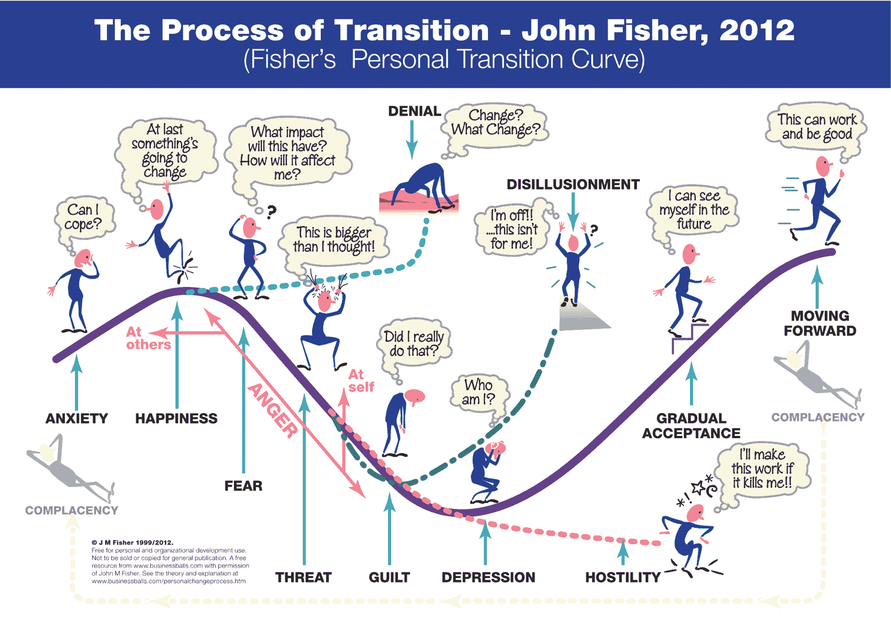

# 第六章：避免障碍

到目前为止，本书主要集中在你在工具箱中需要掌握的核心工具、技术和方法，以确保你对 CD 和 DevOps 的采用能够顺利启动并持续推进。我们也讨论了一些你可能会遇到的潜在障碍，你需要设法克服这些障碍。

我们现在将更加关注这些障碍，并探讨如何克服它们，或者至少尽量减少它们对推动目标和愿景的实现产生的影响。在本章中，我们将重点关注：

+   你可能会遇到的常见障碍

+   你应该把精力集中在哪些方面，以及谁应当得到最多关注。

+   变革令人害怕，员工如何反应和看待变革不容小觑。

+   地理问题

+   事情会出错，因此你应该为此做好准备。

请注意，以下内容绝非详尽无遗的清单，但你很可能会遇到相当多这些障碍。

与任何重大变革一样，你在旅程中会遇到一些风暴，因此你需要了解如何绕开这些风暴，或者如何处理它们，以确保它们不会让采纳过程搁浅、阻碍进展或完全让变革失败——不知为何，使用航海类比来描述。

# 你需要注意的潜在问题有哪些？

你需要关注的问题确实取决于你的文化、环境、工作方式和业务成熟度。我知道这听起来有点敷衍，但不幸的是，它确实是事实。我们已经讨论了一些相关内容，但需要指出的是，如果你的文化、环境或行为不健康，可能会遇到比你预想的更多障碍。这就是为什么处理这些领域至关重要的原因。

希望这种情况不会发生，你能够顺利采纳新的方法，但万一我过于乐观，让我们来看看一些更明显的潜在障碍。你可能会遇到的情况包括以下几种：

+   一些个人根本不理解为什么事情必须改变，或者根本不想改变现有的做法。

+   一些希望事情能够更快进行并且急于变革的个人。

+   人们在情感层面对变革的反应可能会帮助你，也可能会妨碍你的进展。

+   如果你对自己试图达成的目标缺乏理解或可见性，商业优先级的变化可能会给进程带来阻碍。

+   官僚主义和繁重的公司流程可能会让进程陷入停滞。

+   地理上分散的团队以及团队之间的隔阂/孤岛问题。

+   工具使用过程中出现的意外问题（技术性和非技术性问题）。

+   技能差距和资源限制。

+   由于领导层变动而导致的政治动荡。

这个列表可以（并且确实可以）更长，但本书篇幅有限，所以我们将重点关注一些更明显的潜在问题，正如前面所提到的，这些问题可能会导致 CD 和 DevOps 采用陷入浅滩，甚至更糟，触礁。我们将首先关注个体，了解他们如何对你的愿景和目标产生负面或积极的影响。

# 阵营中的异见者

虽然“异见者”这个词似乎有些强烈，但它相当能代表那些决定反对你所提议或正在做的事情，且这些事情与他们的世界观不符的情况。

正如任何新概念、想法或变化一样，都会有一些人感到不舒服。大多数人希望能够理性思考，试图理解并接受事物的变化。然而，也会有一些个体，毫无明显理性理由地决定反对你正在做的事情。其背后的原因可以被分析到极致，但你需要意识到的是，这种情况是会发生的。还要明白，如果相对少数的个体声音足够大且具有干扰性，他们可以制造大量不必要的噪音，分散你对愿景和目标的关注。这正是他们所希望的，因此，重要的是不要让他们得逞。

正如我所说，你可能会投入大量精力和时间，深入挖掘其心理学原因，但仅仅知道并预料到这种情况会发生，已经是一个不错的准备。事先有准备，才能从容应对。

我需要提到的是，这种现象并不新鲜，也不完全是 CD 和/或 DevOps 采用所特有的。如果回顾敏捷方法刚开始被采纳的初期阶段，你会发现很多类似的例子。参与组织内敏捷采用的个体大致可以分为三类：少数创新者，开辟道路；更多的跟随者，他们对这种新的工作方式感兴趣，或者看到了其益处，并决定跟随创新者的步伐；以及落后者，他们尚未做出决定，或没有确信这条路是正确的。下图展示了这三类人群：

敏捷采用初期识别出的三类个体

一般共识是，应该将精力和注意力集中在创新者和*追随者*身上，因为他们代表了大多数参与者，并且积极推动采纳进程。那些正在上升曲线的追随者可能需要一些帮助才能跨越高峰，因此应该给予更多的关注。过多关注*落后者*可能会让注意力过度分散，令大多数人受到影响，因此痛苦的事实是，他们要么有所改进，要么就得离开——即使他们是高级经理或领导。这听起来可能有点残酷，但这种方法已经行之有效多年，肯定是有其道理的。

让我们从 CD 和 DevOps 采用的角度来考虑我们的异见者或落后者：你应该怎么做？正如之前所指出的，如果他们足够喧嚣和具有破坏性，他们可以制造足够的噪音来破坏事情，但不会持续太久。如果大多数组织成员已经认同你正在做的事情——不要忘了你是根据他们的反馈和建议执行计划——他们不会轻易分心，因此你也不应该分心。如果你已经在整个业务中建立了良好的网络，利用这个网络来减少噪音，并尽可能将*落后者*转化为*追随者*。

如果这些*落后者*处于管理或领导职位，可能会使问题变得更为复杂——尤其是当他们擅长玩弄任何企业中都存在的政治游戏时。然而，正如前面所说，他们最终会输掉这场战斗，因为大多数人都会支持目标和愿景。如果你有一位执行赞助人或一位在领导层中有影响力的人，且他们站在创新者或追随者阵营，请让他们参与其中。你只需要忽视这些政治游戏，保持专注，坚守你需要做的事。

你需要做的一件事是保持警觉，随时了解周围的动态，这样你就能在麻烦发生之前察觉到它。当这种情况发生时，我建议你转移一些精力，及时扼杀问题的苗头，避免它成为大问题。及时扼杀可以通过简单、非对抗性的面对面讨论来进行，你可以和潜在的麻烦制造者坐下来喝咖啡谈谈——这样，*异见者*会觉得他们被倾听了，而你也能了解噪音的真正来源。作为最后的手段，和他们的上司进行面对面的讨论也许能奏效。不要通过电子邮件来往，这种方式不起作用！

总的来说，你应该尽可能像对待课堂上的顽皮孩子一样处理异见者；不要让他们破坏大家的事情，不要把所有注意力都给他们，并采取冷静、审慎的方式。过一段时间后，人们会停止听他们的意见，或者不再对他们说的内容感兴趣（尤其是当这些内容不太具有建设性时）。

# 没有消息就是没有消息

一些可能增加*异见者*破坏局面的风险因素，是在 CD 和 DevOps 采纳方面缺乏明显或可证明的进展，或者更简洁地说，是缺乏被认知的明显或可证明的进展。也许你正在忙于一些复杂的流程变更，或者在实施工具，或专注于虚拟化遗留解决方案，因此看起来有一段可见活动的低谷期。

如果你们组织中有一些非常有动力并且注重交付的个人，他们可能会将这种低谷视为采用过程停滞的迹象，或者甚至认为你们已经完成了。如前所述，即使进展不大，高度可见性仍然非常重要。如果人们能看到进展在不断取得，他们会继续跟随。如果有一段被认为是没有行动的时期，那么追随者可能不知道你们的方向，甚至开始注意到*异议*的声音。

任何形式的沟通和/或进展更新都能帮助避免这种情况发生——即使没有太多内容可以报告，沟通的行为也能表明你仍然在场，并且仍在朝着目标前进。“没有消息就是好消息”这种说法是错的；没有消息就是没有消息。

让我们看看我们的角色可以做些什么来帮助：

| **好方法** | **不太好的方法** |
| --- | --- |
| Victoria（副总裁）应当公开表现为创新者（或追随者），并公开鼓励她的部门在没有报复恐惧的情况下决定自己的立场 | Victoria（副总裁）毫无疑问地接受滞后者的声音，并/或宣布她是其中之一 |
| Stan（经理）应该支持 Victoria 的观点，并确保他了解在同级别和团队中谁是滞后者，并确保他们的声音不会变得太过响亮 | Stan（经理）忽略滞后者产生的噪音及其对创新者和追随者的影响 |
| Devina（开发者）和 Oscar（运维人员）也应该了解他们的立场，并注意滞后者的噪音，这些噪音可能会轻易影响同组的创新者和追随者 | Devina（开发者）和 Oscar（运维人员）简单地沉浸在自我陶醉的无知中，将问题留给领导去解决 |

我们简要提到过一些人会对变化感到不适，并可能会以意想不到的方式做出反应。接下来我们将探讨变化如何以不同的方式影响个人，以及你需要注意的事项。

# 变革曲线

让我们公开说清楚一点，这很重要：你需要认识到并接受，识别问题并随之解决问题可能是一次很大的变化。你们已经与业务方一起识别出问题，现在你们正在致力于解决它。这就是变化，纯粹而简单。

在本书前面，我们提到过，ACME 系统公司那些帮助企业采纳 DevOps 和 CD 工作方式的勇敢男女们，是变更的催化剂。这个表述是故意为之的，因为变更确实发生在 ACME 系统团队中——而且事实证明这是一次非常大的变革。采用 CD 和 DevOps 不容小觑，且对个人的影响也不容忽视；即使他们最初认为这就像是切片面包发明以来最好的事情。

那些曾经担任过或正在担任管理或领导职务的朋友们，可能会理解变更既可以被视为积极的，也可以被视为消极的，有时候，尤其是当变更直接影响到个人及其当前角色时，它可能会被视为一种非常个人化的事情。人们如何看待变更，通常是从情感层面而非逻辑、理性层面来感知的。

让我们来看看一些关于人类如何应对变更的基本要点。

任何变更，不论大小、是否与工作相关，都可能以不同的方式影响个人，并且，如前所述，影响的层次也各不相同。有些人欢迎并接受变更，有些人对此不以为意，将其视为生活中发生的事情；有些人对此感到担忧和焦虑，但也愿意看看会发生什么；而有些人则对变更抱有敌意，认为变更是针对个人的。更重要的是，有些人是上述所有反应的结合体——当然并不一定是同时发生。如果在实施变更之前能意识到这些事实，那么在实施过程中就能更清楚地了解需要克服哪些挑战，以确保变更的成功。

有很多关于人们如何应对变更的研究，许多学者在这些年里发表了相关论文。我并不是说我对这个话题了解所有内容，但在涉及变更时，或者有时称之为过渡时，确实需要一些常识，且有一些非常明显且可以理解的特点需要考虑。

我个人偏好的一种可视化和理解变更影响的方式叫做变更或过渡曲线。这种曲线描绘了个人在变更/过渡实施过程中所经历的各个阶段。

以下图示是一个非常好的变更/过渡曲线示例：

约翰·费舍尔（John Fisher）的个人过渡曲线图，感谢 John Fisher 提供

你可以清楚地看到，在变更被规划、讨论或实施时，个人会经历几个阶段。我们不会逐一详细讲解每个阶段（你可以在[`www.c2d.co.uk/techniques/process-of-transition/`](https://www.c2d.co.uk/techniques/process-of-transition/)上慢慢阅读）；不过，关于 CD 和 DevOps 的采纳，有一些非常重要的信息值得关注：

+   一个个体可能会多次经历这个曲线，甚至在变化的初期阶段

+   每个人都不同，他们经历变化曲线的速度也各有不同

+   你和那些身边少数开明的人也将经历这一曲线

+   那些不能/无法走出低谷的个体可能需要更多的帮助、指导和领导

+   即使某人沉默，不显得受影响，他们也不可避免地处于某个变化曲线的阶段，所以他们不应该被忽视——不仅仅是那些发声的人需要关注

总而言之，个体就是个体，他们会是落后者、跟随者或创新者，他们也会处于变化曲线的某个阶段。你组织中的领导者和经理需要特别关注这一点，确保员工得到照顾。你也需要意识到这一点，尤其是因为这同样适用于你自己。

你还应该考虑到，最初作为跟随者甚至创新者开始项目的个体，可能会多次经历变化曲线，因为最初的兴奋感会被现实所取代，意识到事情真的在发生变化。这也能解释为什么有些人在开始时表现出一种方式，但随着你们执行计划和愿景的过程中，他们的方式和态度发生了变化。

从个人和情感层面来看，变化既是好的也是坏的，既令人兴奋也是令人害怕的，既具有挑战性也是令人生畏的，既被欢迎也是被回避的。这一切取决于个体在任何时刻的感受。CD 和 DevOps 可能是一次非常大的变化；因此，情绪会在其中扮演重要角色。如果你能意识到这一点，并确保注意到这些迹象并做出相应反应，你会有一个更好的体验。忽视这一点，你将面临一场艰难的战斗。

让我们看看我们的角色能够做些什么来帮助：

| **良好的方法** | **不太好的方法** |
| --- | --- |
| Victoria（副总裁）应该非常清楚变化对她组织的影响，并确保公开承认这一点。她还应该考虑与人力资源团队合作，在需要时提供帮助 | Victoria（副总裁）仅仅把 CD 和 DevOps 的采纳看作是另一个项目，认为它不需要特别关注 |
| Stan（经理）应该支持 Victoria 的意见，并确保他有时间去帮助、支持和协助他的团队 | Stan（经理）反映 Victoria 的看法，忽视 CD 和 DevOps 对他团队的影响 |
| Devina（开发人员）和 Oscar（运维人员）应该接受事情将会发生变化，并意识到他们的同事可能会对此感到困难，并可能需要支持 | Devina（开发人员）和 Oscar（运维人员）则安坐在他们幸福的无知泡沫中，把事情交给领导去解决 |

说到这一点，我们将讨论如何应对那些在你组织内没有参与你们变化过程的人，或者甚至可能不知道它正在进行中的人。我们将他们称为外部人员。

# 外部人员

与持续交付（CD）和 DevOps 采纳相关的人员比例将很大程度上取决于你所在组织的整体规模。如果你是一个初创公司，那么几乎组织中的每个人都有可能参与其中。如果你是一个中小企业（SME），那么并不是组织中的每个人都会参与其中。如果你在一个企业环境中工作，那么积极参与的人员比例将远远小于不参与的人员比例。

以下图表展示了与核心团队的距离如何直接影响对实际情况的了解程度：

靠近核心团队的个人会对发生的事情有更深入的了解。

那些距离日常工作更远的人往往对发生的事情一无所知。这可能（并且会）导致这些外围人员由于缺乏知识，往往不自觉地在进展道路上设置障碍。需要指出的是，这并不是什么新鲜事，且并不仅仅适用于 CD 和 DevOps 的采纳；这对于任何大规模的业务变革项目来说都是现实。如果个人，特别是那些决策者，不了解正在发生的事情，那么 CD 和 DevOps 不会是他们首先考虑的事项之一。

举个例子，让我们看看 ACME 系统，看看这种情况如何影响了他们的实施。

在他们进化的 2.0 阶段，ACME 系统成为了一个大公司的组成部分。他们最终成为了一个卫星办公室，总部设在海外，并且在整体上被放任自流。他们努力工作了一段时间，开始审视和实施 CD 和 DevOps。在全球企业层面来看，他们是在孤立的情况下进行这些工作的。是的，他们确实对 ACME 系统组织进行了广泛而深刻的变革，但他们只是在一个非常大机器中的小齿轮而已。ACME 系统办公室之外的人几乎没有什么可见性或对发生的事情的深入了解。因此，当一个关于全球运营组织裁员的战略计划被宣布时，几乎没有人考虑到 ACME 系统的进展，实话说，做出决策的人根本不知道发生了什么。因此，CD 和 DevOps 的实施进展很快就停滞了。幸运的是，一旦尘埃落定，对 DevOps 的需求变得比最初更大，导致了采纳的焦点和速度加快。

在 ACME 系统的案例中，CD 和 DevOps 的采纳带来了积极的影响，实际上还提供了额外的推动力。如果在你的过程中发生了广泛的变化，而人们对你正在做的事情一无所知，那么你的故事可能不会有一个好的结局。记住这一点。

这个故事的寓意是：你不仅应该关注公司内部的情况，还应该关注整个组织的动态。我们已经探讨了沟通你正在做的事情并保持高度可见性的重要性。这种沟通和可见性不应该仅限于那些直接参与 CD 和 DevOps 采纳的人；你应该尽量让尽可能多的人了解。如果你在一个公司环境中工作，毫无疑问你会有一个内部通讯团队，他们定期发布新闻文章到公司内网或通讯刊物上。联系这些人，让他们报道你正在做的事情。适当的公关活动会帮助你的事业，扩大知识的传播范围。

这看起来可能是付出很多努力却收获不多，但你可能会惊讶于它能带来的好处。例如，假设你撰写并发布了文章，结果被 CEO 或一位高级副总裁看到，他们决定亲自访问，看看到底是什么让大家如此关注。这无疑是一次重大的士气提升，也是很好的公关。更重要的是，它可能有助于解决你与管理层之间的分歧——如果他们看到高层认可你所做的事情是积极的，他们可能会重新考虑自己的立场。

我们主要考虑的是外部人士，即那些不在你直接影响范围内、不了解你所做的事情和发展方向的人。你可能也有一些人非常清楚，但他们被公司繁文缛节或官僚主义所限制或掩盖。让我们花一些时间深入探讨这个潜在障碍，以及如何克服它。

# 公司指南、繁文缛节和标准

这一潜在障碍的大小和规模取决于你所在组织的大小以及你所在行业的市场环境。如果你在服务行业工作，并且有商业责任需要满足某些服务水平协议（SLA），或者你在金融机构工作并且需要遵守监管指南，那么你在实施和采纳 CD 和 DevOps 时会在某些方面受到制约。这正如人们所说，这是行业的常态。

你需要做的是与那些制定和/或监管规则的人合作，看看是否有调整的空间。你可能会发现，某些为公司制定的规则和指南实际上是过度的，它们之所以被实施，仅仅是因为坚持书面规定比根据业务需求进行调整更容易。

这种规则、指南和政策的需求主要涉及变更管理和可审计性。简单来说，它们提供了一个安全网，并能在发生问题时帮助确认最近的变化。你可能会发现，那些管理或监管这些规则、指南和政策的人认为 CD 和 DevOps 与他们的工作方式不兼容。虽然这可能是真的，但并不意味着它是正确的。

在调查阶段，他们的组织/部门可能已被指出是产品交付过程中浪费的一个环节（我敢打赌是这样），所以他们可能对变革持防御态度。甚至可能他们根本不知道在不违反规则或公司政策的情况下，能改变什么。与这些人合作，帮助他们理解 CD 和 DevOps 的含义，帮助他们研究他们的哪些流程可以改变以适应这一点。不要只是忽视他们并违反规则，因为这会在未来影响到你，甚至可能完全扰乱流程。开放、诚实和勇敢的对话是关键。

也就是说，开放和诚实的对话可能会受到地理位置的影响，我们来看看如何解决这个问题。

# 地理分布广泛的团队

我们之前提到过建立一个开放和诚实的物理环境，以帮助加强开放、诚实和协作的工作方式。如果团队是共址的，这一切都很顺利。然而，尝试在地理分布广泛的团队中重现这一点可能是一个棘手的问题。它完全取决于时区差异，以及在某种程度上，文化差异。

我在这里再次使用“文化”这个词是故意的。如前所述，文化对持续交付（CD）和 DevOps 的成功采用非常重要，我们曾关注过公司和组织文化。当涉及到可能会影响你的因素时，地理、政治或社会群体文化差异通常排在前列。当团队或团队成员的观点或价值观与您（或大多数组织成员）不完全一致时，他们可能会轻易变成反对者，或者至少成为创新者或追随者，他们确实认为自己在贡献，但可能会以他们自己的方式解读你的意图，甚至可能最终成为障碍。因此，你需要关注并确保他们感受到与物理在场的团队成员同等的对待。

这自然地引出了“物理在场”这一话题。没有物理在场总是一个障碍。关于远程团队与共址团队的对比，已经有许多研究，毫无疑问，还会有更多的研究，但似乎没有哪种方法能显示哪种方法能够产生最佳结果。这些研究有时忽略了外部因素对远程团队和共址团队的影响：组织的成熟度、文化协同作用、共享的经验和知识、共同语言等。如果这些因素对共址团队的协作有负面影响，那么当你加入远程团队时，这些负面影响很可能会被放大。

需要注意的是，大多数研究都集中在 DevOps 合作关系中的开发（Dev）方面。有时人们接受开发和运维（Ops）团队分离的现象，认为这是一种常态。然而，如果你考虑到 DevOps 在开发和运维紧密合作时最为有效，那么你就应该将这种地理分散的团队模式应用于两者。

根据经验，最有效率的团队通常是同地工作的团队，因为人类是社交性动物，因此通常倾向于喜欢与其他人一起工作、交谈、争论或分享笑话。除非你的预算允许每个人都在同一个物理位置工作，否则你需要考虑为那些不在同一地点的团队和团队成员复制这种体验。以下是一些你可以考虑的方案，以帮助消除这种障碍：

+   尝试将所有团队成员视为仅仅是——同一个团队中的成员，应该平等对待。

+   确保本地团队和远程团队都定期（最好是每天）进行电话会议（理想情况下是视频会议）。

+   如果你正在使用敏捷开发（scrum）或类似的方法论，并决定进行每日的 scrum 汇报，那么让远程团队也参与进来——即使你需要用手机给他们打电话并将其放在免提上。

+   在两个办公室之间安装一个 Skype（或类似软件）PC，作为虚拟墙/窗。这些设备应该在正常办公时间内保持开启，这样虚拟墙/窗两边的团队成员就可以随时走过去进行面对面的交流，就像他们在同一个房间里一样。

+   如果预算允许，尽量通过借调、外派等方式让团队成员在短时间内互相交换办公地点。

+   不要依赖电子邮件作为协作/沟通的工具，而是应该投资于协作工具（我们之前已经提到过）。

另一个需要注意的潜在障碍是时区问题。这可能会对团队会议和每日站会等事项造成混乱（根据经验，这些会议通常安排在早晨，这可能会成为问题，特别是当团队位于地球两端时）。通过一些创造性的思考，你可以克服这些小问题，例如选择一个位于团队时区中间的“早晨时段”作为会议时间。

再次回到文化问题，还有另一点需要考虑。在一些地区，文化可能不是那种快速而随意的西方文化，在那里每个人都有发言权并且不怕表达自己的看法。对一些人来说，培养开放性、诚实和透明可能会更困难，你应该对此保持敏感。我建议你与当地的人力资源或管理团队合作，向他们解释你正在尝试做什么，看看他们如何提供帮助。

现在我们来看看如果在执行目标和愿景时遇到失败应该怎么做。

# 在发展过程中遇到的失败

在你前进的过程中，事情偶尔会出错，这是不可避免的，也没有什么可怕或可耻的地方。可能会有你未曾预见到的情况，或者在现有流程中的某些步骤没有在“大象曝光”过程中被注意到。问题可能仅仅是选定工具集中的一个问题，它没有达到你预期的效果，或者只是存在一些漏洞。

你的自然反应可能是隐瞒这种失败，或者至少不公开失败的事实。这并不是明智之举。你和你的团队正在努力培养开放和诚实的意识，因此你能做的最糟糕的事情就是完全相反的行为。回想一下我们之前提到的关于快速失败以发现缺陷的内容；同样的方式在这里也适用。

承认失败、蜷缩成胎儿姿势，躺在角落里呜咽也不是一个选择。像任何变革一样，事情会出错，因此需要审视情况，评估你的选项，并向前推进。一旦你找到了绕过或解决问题的方法，就要进行沟通。确保你坦诚地表达问题所在，以及正在采取哪些措施来克服它。这将向他人展示如何应对和处理变革——一种通过示范来领导的方式。

你可能会担心，承认失败可能会给落后者提供更多的武器来破坏采用进程；然而，一旦创新者和追随者找到了解决方案，他们的胜利将是短暂的。坚持住，站稳脚跟，并保持信心。

如果你正在使用敏捷技术，例如 Scrum 或 Kanban，推动持续交付（CD）和 DevOps 的采用，你应该能够相对快速地改变方向，而不会阻碍进展。

好的，这一切都是非常**积极的心态**（**PMA**），可能会被一些比其他人更具怀疑精神的人视为管理上的空谈和陈词滥调，那么让我们看看另一个例子。

ACME 系统实施了一个部署事务模型（在前一章中已提到），用于管理依赖关系，确保在任何时刻只有一个更改被提交到生产系统。这一方案有效运行了一段时间，但随着时间的推移，事情开始变得缓慢。以前正常工作的自动集成测试开始间歇性失败，曾经被认为是万无一失的功能区域开始出现缺陷。这种减缓开始影响到更广泛的研发团队交付能力，尤其是来自一些慢节奏人员的抱怨声日益增多。相关方之间进行了公开且诚实的讨论，经过多次辩论，最终发现问题的主要根源是一个非常简单的依赖关系，且变更管理跟不上交付速度。从本质上讲，没有可靠的方法来确定哪个软件资产的更改会在另一个软件资产的更改之前完成，也没有简单的方法来尝试不同的集成场景。最终的核心问题是：如果资产 A 中的更改依赖于资产 B 中的更改，那么资产 B 必须首先上线，以便进行完整的集成测试。然而，如果资产 A 先准备好，就必须等待——有时可能等待数天或数周。部署事务开始妨碍持续交付（CD）。

这里是 ACME 系统所称的部署事务的简单流程的提醒：

你会记得，大家一致认为部署事务运作良好，并提供了一个有效的替代方案，解决了依赖地狱的问题。然而，当系统在实际使用中投入工作时，它暴露了一个缺陷，开始导致真正的痛苦问题。即使可以通过功能开关关闭某些特性，也无法在没有将所有内容部署到生产环境等真实环境中时，进行完整的集成测试。此前并没有出现这个问题，因为发布的速度非常慢，而且资产都是捆绑在一起的。现在，ACME 系统能够非常快速地部署到生产环境，但也遇到了一个新问题：应该按什么顺序进行部署？经过许多讨论和复杂选项的考虑，最终解决方案相当简单：移动部署事务的边界，并允许在资产进入生产环境之前进行完整的集成测试。接下来，便是各个研发团队手动确定应该按什么顺序进行部署。

以下图示展示了修订后的部署事务边界：

所以，ACME 曾面临一个可能成为“致命杀手”的问题，这本可以彻底破坏他们的 CD 和 DevOps 采纳。问题变得非常明显，许多人开始提出问题。追随者开始怀疑创新者，滞后的员工变得 vocal。通过一些老式的合作，开诚布公的讨论，这个问题很快而且相对轻松地被解决了。

再次强调，开放和诚实的沟通以及勇敢的对话是关键。如果你持续地审视并倾听他人的意见，你就有更大的机会提前发现潜在的障碍，避免它们完全阻碍你的进展。

让我们看看我们的角色能做些什么来帮助：

| **好的方法** | **不太好的方法** |
| --- | --- |
| Victoria（副总裁）公开承认在采纳过程中可能会出现问题，并且鼓励她的部门在没有报复恐惧的情况下，共同合作解决任何问题 | Victoria（副总裁）无法容忍任何形式的失败，并且公开批评出现的问题 |
| Stan（经理）应该支持 Victoria 的消息，并确保他腾出时间帮助、支持和协助他的团队（们）在需要时 | Stan（经理）将失败视为无能的表现，并在每个机会中加以打压。任何提出问题或困难的人都会被告知保持沉默 |
| Devina（开发人员）和 Oscar（运维人员）在尝试新事物或冒险时不应害怕失败。当问题出现时，他们应该共同合作解决，并确保领导层完全知晓 | Devina（开发人员）和 Oscar（运维人员）仅仅在他们的无知泡沫中待着，留下给领导层去处理 |

另一个可能破坏你实施并侵蚀信任的因素是不一致的结果。

# 不可重复的流程

技术性人员有一个倾向，就是自动化他们所接触的一切，例如自动构建工程师的工作站、自动构建软件、以及当办公室灯光打开时自动开启咖啡机。这并不新鲜，且这种方法没有错，只要过程是可重复的并且提供一致的结果。如果结果不一致，其他人会不愿意使用你花费数小时、数天或数周时间整理出的自动化工具。

在涉及 CD 和 DevOps 时，应采取相同的方法，尤其是当你在看工具时。你需要信任你一次又一次得到的结果。

有些人认为，内部工具和节省劳动力的解决方案或流程，既然不在敌对的客户环境中使用，就不需要达到生产质量，因为它们主要供公司内部的技术人员使用。这是百分之百错误的。

让我们看一个非常简单的例子：如果你是一个软件工程师，你会使用 IDE 编写代码，并且会使用编译器生成二进制文件来部署。如果你是一个**数据库管理员**（**DBA**），你会使用 SQL 管理程序来管理数据库并编写 SQL。你会期望这些工具始终如一地工作，并且能够产生一致和可重复的结果；你打开一个源文件，IDE 会打开它以供编辑，你执行一些 SQL，SQL 管理工具会在服务器上运行它。如果你的工具不断崩溃或产生意外的结果，你可能会感到有些沮丧（委婉地说），并无疑会避免再次使用这些工具。它可能让你抓狂。

疯狂：一遍又一遍做相同的事情，却期待不同的结果。

*-阿尔伯特·爱因斯坦*

同样的道理也适用于你为 CD 和 DevOps 采纳所构建和/或实施的工具（技术和非技术）。这些工具必须与（如果不是更好）你的团队正在创建的软件一样好。实施的工具/流程的用户需要确信，当他们一遍又一遍地执行相同的操作时，能够得到相同的结果。随着这种信心的增长，工具/流程的信任度也会随之增加。最终，工具/流程将被视为理所当然，人们会在没有第二次考虑的情况下使用它。

因此，人们也会信任，如果结果与上一次不同，那么某些坏东西已经被引入（例如，软件错误被创建），需要立即关注。

想象一下，如果工具/流程不断失败或提供不同的和/或意外的结果，会削弱多少信心和信任。因此，你需要非常确信这些工具/流程是适合目的的。

我们已经讨论了你在企业指南、繁琐的流程和标准方面可能遇到的潜在障碍。想想看，当你无法为可重复的任务提供一致的结果时，如何说服门卫们，CD 和 DevOps 并不危险，这将是多么有趣。好吧，也许“有趣”这个词不太合适，也许“痛苦”是更合适的词。

一致和可重复的结果的另一个优势，在查看指标时显现出来。如果你能够信任每次部署相同的资源到同一台服务器所花费的时间是一样的，那么你就可以开始发现问题（例如，如果部署时间变长了，可能是基础设施出现了问题，或者配置中的某些根本性变化）。

总的来说，这可能听起来很无聊，也不太具创新性，但凭借一致和可重复的结果，你可以不再为琐碎的事务担忧，将注意力转向需要解决的问题，比如非常现实的需求——为正在转型或已经转型的企业招募新员工。

# 弥合技能差距

这看起来可能不是一个大问题，但随着组织的产出增加，效率提高，组织开始被认可为能够快速交付高质量产品的公司（而且它会的），那么增长和扩展可能会成为一个高优先级问题——我想你会同意，这是一个好问题。现在，你需要找到那些能够以新的方式工作并表现出大家努力灌输并在整个组织中扎根的行为的人。这并不像你想的那么容易，找到那些不仅具备技能、经验和潜力，而且具备你所需心态的人将需要一些时间。仅仅在职位要求中加入*CD 和 DevOps 经验*是无法达到你想要的结果的；即使 CD 和 DevOps 已经存在一段时间，真正符合你所要求的经验的人并不多。

你将面临的另一个大问题是，在招聘和人才获取领域，对于 CD 和 DevOps 的真正理解水平。他们可能根据科技媒体和一些会议有一个粗略的了解，但他们并不会准确知道你在寻找什么。因此，与你招聘过程中相关的人员开展更多的知识共享非常重要，以确保他们理解你在寻找什么（或者至少理解你不在寻找什么）。你可能需要多做几次这种知识共享，直到他们理解为止。

在筛选候选人时，你可以做一些事情来区分那些理解 CD 和 DevOps 的人和那些不理解的人。例如，如果你有一个候选人的主要经验是在运营领域，可以向他们提出一些传统开发方向的问题；或者如果是开发人员，可以问一些传统上针对运营候选人的问题。将这些问题混合起来能帮助你更全面地了解他们的掌握情况。我的一个最喜欢的面试问题非常简单：

作为一名软件工程师，如果你的代码在提交到源代码控制后 10 分钟内就运行在生产环境中，并被数百万客户使用，你会有什么感受？

这个问题的表述是特别为了引发一个诚实的情感反应；这里的关键词是“feel”（感受）。你会对这个问题的回答感到惊讶；对于一些人来说，这个问题会让他们一下子停下来，有些人会对这种问题感到震惊，认为你提出这种问题是疯了，而有些人则会思考这个问题，并意识到虽然他们从未考虑过这个问题，但他们非常喜欢这个想法。如果，然而，答案是“10 分钟”？那就太慢了，你可能已经找到了一个赢家。

慢慢来，确保你选择了合适的人选。你需要创新者和追随者，而不是滞后者。

我们将以一个大多数人不会视为问题的事情结束这一部分，但它可能会让 CD 和 DevOps 的采用停滞不前，那就是领导层的变化。

# 领导层变动

我们每个人在某个时刻都曾在经历过领导层变动的地方工作过。通常，变动越高层，可能带来的影响就越大。例如，一个新的 CEO 在几个月内会通过招聘、解雇或通过组织调整（通过“搬动椅子”来解雇人）来改变领导层的报告结构。他们还会有一些新的愿景和商业驱动因素，以提高某些业务指标，这也是他们获得这份工作的原因。

大多数时候，位于较低层级的人不会看到任何影响，至少一开始不会，但影响终究会到来。你可以肯定这一点。

当你面临一些可能相当激进的事情时，比如采用 CD 和 DevOps，董事会的一次决策可能会完全搞砸一切，尤其是在采用的初期。正如之前所说，CD 和 DevOps 更侧重于工作方式、行为和文化，而不是单纯的填表和商业指标。话虽如此，采纳 CD 和 DevOps 是有原因的——提升快速且反复交付高质量软件解决方案的能力。这一点不会因为组织架构的更新而消失。

你最好的做法是继续保持现状，保持开放、诚实和透明。如果你仍然有一位在职的高管赞助人，鼓励他们重新展开魅力攻势。不要害怕重复旧话题，重申决策背后的原因和历史。此外，确保分享好消息，并确保新领导人被包括在你的定期沟通中。实质上，做任何必要的事情以保持工作进展，确保持续向前。

# 摘要

在这一章中，我们学到了哪些新东西？主要的信息是：变革并不可怕，它是会发生且已经发生的，而且在过程中会遇到障碍。只要你为此做好准备，意识到这一事实，并能够帮助和引导那些受到变革影响的人们度过难关，你就会处于相对有利的位置。当隐形的障碍显现出来时，无论是沟通问题、繁文缛节、官僚主义、招聘还是地理位置方面，你都会有一些应对的思路。你还学到的另一件事是，无论是处于核心圈子内还是外部的人，都是你成功的关键。

没有疑问，在这过程中会有其他的障碍、危险和潜在的阻碍因素，这些内容并未在本书中涵盖，但只要你做好准备，你就会成功。说到成功，我们现在来谈谈成功的衡量标准以及它为何如此重要——这些内容将在下一章中讨论。
