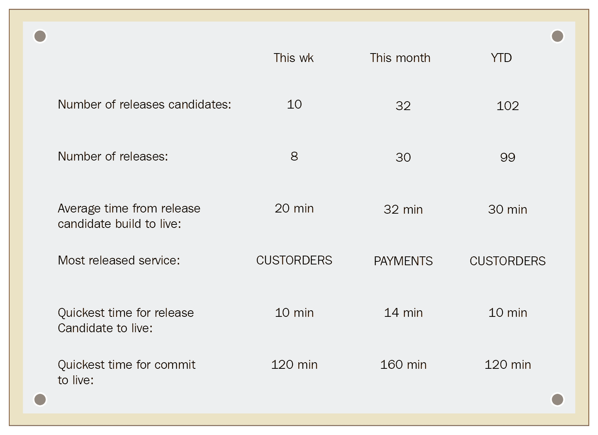

# 第七章：重要的衡量指标

在前几章中，我们探讨了你应该考虑哪些工具和技术，如何认识到变革会以不同的方式影响人们，为什么文化、行为和环境如此重要，哪些潜在障碍需要克服，以及这些内容如何帮助你成功地采纳 CD 和 DevOps。如果你已经考虑到这些，并为此制定了计划来应对和/或解决这些问题，那么你应该已经为迈出更大步伐做好了准备。

我们现在要关注的是一个重要但有时被忽视——或干脆被忽略——的领域：监控和衡量进展。我们之前曾涉及过这个话题，但当时我们只是看到了其中一小部分。现在我们要探讨的是与持续交付（CD）和开发运维（DevOps）对日常工作方式和整个业务的影响相关的指标的收集、汇总和共享。

从表面上看，这可能被认为只对管理层有用，对那些每天处理 CD 和 DevOps 采纳的人没有价值。从某种程度上来说，这是对的，但能够分析、理解和分享可证明的进展，肯定会为你和所有在 CD 和 DevOps 旅程中的人带来价值。我们这里说的不是简单的项目管理图表、图形和 PowerPoint 材料；我们要看的是真正衡量整个流程尽可能多的方面。这样，每个人都能清晰地看到并理解你们集体已经取得的进展，并且了解距离最终目标还有多远。

为了有效地进行这项工作，你需要确保在 CD 和 DevOps 采纳的初期就开始收集这些数据，因为如果没有代表*当时*的数据，你将很难进行现在与当时的对比。你需要保持警惕和一致性，确保持续收集这些衡量指标，这样你才能在不同时间点比较进展的状态。有些人可能认为这是过于苛刻，但整个 CD 和 DevOps 的旅程正是因为在象限曝光中捕捉到的数据指向了浪费的领域——或者至少是低效的流程——而开始的。

在本章中，你将学习以下内容：

+   如何衡量你的工程流程的有效性

+   如何衡量你使用和依赖的各种环境的稳定性

+   如何衡量你采纳 CD 和 DevOps 所带来的影响

我们从头开始，首先关注工程度量。

# 衡量有效的工程最佳实践

这是一个相当难以理解的概念：如何衡量有效的工程实践，甚至更进一步，如何衡量最佳实践？还有一个常被提问的问题是：这和 DevOps 或 CD 有什么关系？我们稍后会讨论前者，但现在我们先专注于后者。

我们来看两个场景：

+   你当前的软件工程过程非常瀑布式，并且你有大量的手动测试来验证代码，直到代码准备发布——这一过程通常在 3 到 6 个月之间——并且会预留时间来修复 BUG。

+   你当前的软件工程过程相当灵活，并且大体遵循行业最佳实践。然而，由于发布之间有相当长的时间间隔，你有时可能会忽视技术债务（包括自动化测试），因为你可以在下一次发布前有时间回头去修复——而下一次发布通常是在 3 到 6 个月后。

好的，虽然这个很简化，但请耐心听我说。随着持续交付（CD）和开发运维（DevOps）的推广，发布间隔时间将会缩短。因此，我们可以稍后做的窗口也会越来越小。这可能会导致工程师们为了赶时间而不得不开始“偷工减料”，因为他们已经没有时间去清理发布前的技术债务任务。CD 和 DevOps 的采用最终能够让你快速交付解决方案——并没有什么明确的规定表示工程师会有更多时间来编写和测试这些解决方案。

让我们来看看一个大型季度发布的时间线和工作量，如下所示：

现在，让我们与 CD 类型的发布进行比较，如下所示：

这些都是非常简化的例子，但它们突出了减少发布间隔时间对关键角色产生的影响。我们可以稍后做的窗口从几天/几周缩短到几小时。

在第五章*，* *方法、工具和技术*中，我们探讨了更广泛的业务如何看待功能和发布之间的关系。随着你的 CD 和 DevOps 采用的成熟，发布间隔时间将缩短，这意味着工程师将有更少的时间来完成功能。如果更广泛的业务已经习惯了在给定的发布中交付功能，他们会继续期待这一点，直到新方式稳定下来。

让我们回到“偷工减料”的话题。这些通常与非修改代码相关，但仍是耗时的活动——例如跳过某些单元测试、在集成测试中留下一些空白、不做文档、减少重构旧代码的倾向等等。简单来说，工程师们会面临交付压力，他们将不再有时间处理之前完成的所有任务。这因此变成了技术债务——这是每个软件工程团队都尽力避免的，因为它最终会在未来反噬他们。

回到衡量有效工程最佳实践的主题，这其实并不像你想象的那样陌生或罕见。全球有大量的软件公司定期使用工具来捕捉数据和测量一些内容，例如：

+   整体代码质量

+   遵循编码规则和标准

+   代码文档

+   代码复杂度

+   代码重复

+   冗余代码

+   单元测试覆盖率

+   技术债务

+   平均故障间隔时间

+   平均解决时间

+   缺陷逃逸距离

+   修复反弹率

单独衡量这些指标可能不会带来太多价值；然而，当它们汇总在一起时，你可以获得一个非常详细的整体情况。此外，如果你能够在一段时间内持续捕获这些详细信息，你就可以开始衡量和报告进展。这对持续交付（CD）和 DevOps 的采用至关重要，原因很简单：如果由于软件发布速度加快而导致质量下降，落后的人员将有机会借此反击。如果这些落后人员处于有影响力和/或决策岗位，整个采用过程可能会被拖延。

如前所述，如果你能在问题开始发生时就发现它，你就有机会去制止它。还有另一面：如果你当前的质量很差，而你能证明持续交付（CD）和 DevOps 的采用有助于提高质量，那么这就是一个巨大的好消息——我们可以更快发布，而质量大幅提高。给那些落后者看看！

听起来很简单，实际上，确实可以做到，但你需要注意，你需要投入一些时间、精力和严格性，确保能够获得最大的价值。过程中也会有一定的试错和调整，以确保能够以可靠和可重复的方式捕获数据——更多的检查和适应——因此你需要确保考虑到这一点。这些衡量标准不仅会帮助你的工程团队，也会有助于在更广泛的业务中建立信任。例如，你将能够提供开放、诚实、真实的软件质量指标，这反过来会增强他们对开发和维护平台的团队的信任。

在你开始衡量诸如软件代码指标等事物之前，有一点需要认真考虑：工程师自己对此的感受。Devina 的想法可能是典型反应之一：

对这种方法的典型反应

一些工程师可能会变得防备或防守，认为这在质疑他们在创建高质量代码方面的技能和工艺。你需要小心，避免在你与工程团队之间建立障碍，也要避免让他们回到*落后者*阵营。你应该将这些工具作为工程师的积极利益来*推销*。例如，他们可以明确证明自己的代码有多好；他们可以利用这些工具检查过于复杂的区域或可能包含漏洞的代码区域；他们可以突出冗余代码并从代码库中移除；他们还可以直观地看到硬依赖关系，这在进行组件化时有很大帮助。

如果你有一些发声的拖后腿者，让他们积极参与工具的设置和配置（例如，他们可以负责定义可接受的代码覆盖率的门槛，或者选择要实施的工具）。

如果没有别的，你需要确保工程社区中的创新者和追随者都能参与其中。为了更清晰地说明这一点，我们来看一下前面列表中的几个项目——顺便说一下，这个列表并不完整——并更详细地探讨它们为什么对你的持续交付（CD）和开发运维（DevOps）采用可能至关重要。我们从代码复杂度开始。

# 代码复杂度

拥有复杂代码有时是必要的，特别是在面对极其优化的代码时，尤其是在资源有限和/或需要实时 UI 的情况下——基本上是每毫秒都很重要的场景。当你拥有像在线商店、登录页面或财务模块这样的功能时，过于复杂的代码反而可能弊大于利。一些工程师认为他们很特别，因为他们能写复杂的代码；然而，单纯为了复杂而复杂其实就是在炫耀。

过于复杂的代码可能会导致许多普遍性的问题——特别是在调试时，或者在你试图扩展代码以满足更多使用案例时——这直接影响到你实施哪怕是最小改动的速度。持续交付的前提是交付小而渐进的高质量改动。如果你的代码过于复杂，以至于无法实现这一点，那么你将在未来遇到问题——通常这被称为代码的可维护性、可测试性和可读性。

我建议你在开始实施任何过程或工具之前，先花些时间更深入地研究这个复杂的（带有双关意味）主题。你真的需要理解其背后的基本原则和科学原理；否则，这将变得混乱不堪。某些科学原理在附录 A，*一些有用的信息*中做了详细解释。

一个建议是，选择一些现有的代码分析工具，进行试用，分析你的代码库，帮助你找出一些现有的痛点。通过这些，你可以开始制定一个计划。

你接下来可以考虑的一个方面是代码覆盖率。

# 单元测试覆盖率

在软件开发过程中引入单元测试被广泛认为是最佳实践——第六章，*避免障碍*。这个主题有大量的信息可供参考，因此我不会在这里花太多时间讨论，但我建议你投入一些时间和精力，研究一下这个主题以及如何在你的软件开发生命周期（SDLC）中采用这种方法。

为了不让你觉得我在敷衍你，我将提供一些关于这个主题的见解和背景，特别是与 CD 和 DevOps 相关的部分。

从简单的角度看，单元测试允许软件工程团队在开发过程中对代码路径和逻辑进行粒度化的验证，这反过来可以帮助尽早发现并消除软件缺陷。将这些测试纳入持续集成（见第六章，*避免障碍*，了解持续集成的相关信息）并让它们在构建过程中阻止错误，可以帮助防止缺陷进入持续交付管道的下游阶段。这也可以作为回归的早期警告；例如，如果一个先前正常的单元测试开始失败，很可能是引入了回归问题。

持续交付的前提是能够频繁发布变更。如果你的代码库中有良好的单元测试覆盖率，你将对频繁发布该代码并降低风险充满信心。

分析覆盖率是一个很好的指标，能够表明你在多大程度上可以依赖单元测试来发现问题。你还可以利用这些数据绘制出在快速发布代码时的风险领域（例如，如果你的登录页面经常被修改并且覆盖率较高，那么频繁发布该页面的风险会较低）。

有一件事是你需要考虑的，关于覆盖率的衡量——即旧代码与新代码的混合。你通常会发现，旧代码，尤其是基于旧技术的代码，可能几乎没有单元测试覆盖。如果这类代码占据了你代码库的大部分，覆盖率的衡量结果会非常低。如果更广泛的业务团队过于关注这一指标，他们可能会将低分数视为一个重大风险。虽然从技术角度讲这是正确的，但你不能指望从第一天开始就对旧代码进行全面覆盖。因此，你需要确保为数据设定一个上下文，并制定一个随着时间推移提高覆盖率的计划。一种方法是设定一个规则，要求所有新代码或重构代码应该有较高的覆盖率（理想情况下是 100%，前提是在不进入收益递减领域的情况下可以实现），并且随着旧代码重构的增加，总体覆盖率应当增长。

现在让我们来看一下提交频率的衡量效果。

# 提交和合并率

定期提交源代码到版本控制系统是应该广泛鼓励并深度嵌入工作方式的一部分。将源代码长时间存放在个人的工作站或笔记本电脑上是非常危险的，有时会导致重复劳动，甚至更糟的情况是，可能会阻碍其他工程师的进展。

可能有人担心，如果工程师提交代码太频繁，创建缺陷的机会会增加，特别是当你认为未完成的代码可能会被合并到主代码分支时。这种担心是个谬论。没有任何一位称职的工程师会认真考虑做这种事——为什么要这么做？如果你有像定期代码审查或拉取请求审批流程这样的检查和制衡，合并有缺陷的代码的风险将大大减少。再加上单元测试和代码分析，你几乎可以消除风险。

与此相反的是，提交和代码合并之间存在非常真实的延迟风险。需要合并的代码越多，风险就越大，引入代码冲突、缺陷和不完整功能的潜力也就越高。持续交付（CD）方法的核心是经常交付可工作的软件。这不仅限于软件二进制文件；经常交付小的增量源代码也是一种良好的实践。

大多数源代码控制系统会提供可以通过第三方工具分析的工具和日志。你需要分析的数据包括每天每位工程师的提交和合并次数、合并之间的时间间隔，以及代码库中哪些区域被更改的最频繁。

从这些数据中，你可以开始看到一些模式，例如谁在积极合作，谁没有，以及代码库中哪些区域承载着最大的风险。提醒一下：不要使用这些数据来奖励或惩罚工程师，因为这可能会促使错误的行为，甚至可能像忽视工程最佳实践一样具有破坏性。

接下来，我们将讨论代码违规和遵循规则的棘手问题。

# 遵循编码规则和标准

你可能已经在软件开发团队中制定了编码标准和/或试图遵循外部文档化和公认的最佳实践。能够分析你的代码库，查看哪些部分符合标准，哪些不符合，是非常有用的，因为它有助于突出潜在的风险区域。如果你随着时间的推移持续捕获这些数据，你将能开始发现趋势——尤其是当这些数字开始下降时。

有很多工具可以帮助你做到这一点，其中一些列在附录 A 中，*一些有用的信息*。

这种类型的分析需要一些设置，因为它通常基于一组预定义的规则和阈值（例如，信息、次要、主要、关键和阻塞），你需要与工程团队合作，商定并在工具中设置这些内容。

衡量遵循编码规则和标准有助于防止代码中的缺陷泄露，但软件就是软件，缺陷总会悄悄出现。因此，你需要做的是分析缺陷出现后的情况。

# 质量指标

质量是所有参与编写和交付软件的人应该希望维护并融入其解决方案的东西。前面的部分包含了一些质量度量的元素，但你还应该考虑一些专门针对时间的具体度量。

与 CD 和 DevOps 相关的关键指标是**平均故障间隔时间**（**MTBF**）、**平均修复时间**（**MTTR**）和缺陷逃逸距离，具体解释如下：

+   **MTBF**：这将帮助你衡量最终用户发现问题（或故障）的频率——故障之间的时间越长，整体平台的稳定性和质量越高。

+   **MTTR**：这将帮助你衡量从发现问题到修复问题所花费的时间

+   **缺陷逃逸距离**：这将帮助你衡量问题发现的时间和发现者——例如，工程团队发现的缺陷离缺陷源较近（例如，团队中的某个成员），而 UAT 发现的缺陷则离源头更远。

前两者为 CD 和 DevOps 的采用情况提供了一些良好的指示，尤其是它们与交付速度的关系。例如，预计如果 CD 和 DevOps 的采用运作良好，MTBF 会逐渐增加，而 MTTR 则会逐渐减少。如果没有发生这种变化，那就意味着存在某些问题需要调查。

三者中的第三个——缺陷逃逸距离——是工程最佳实践和持续集成（CD）管道是否能够及早发现问题的良好指示。如果工程团队在流程早期就能发现缺陷——例如，由于单元测试失败，CI 步骤失败——那么距离和影响就很小。如果缺陷逃逸到下游流程——例如，用户验收测试（UAT）团队——那么距离和影响就会更大。如果缺陷最终进入生产环境，那么……我想你应该明白了。

一种表示方法是根据缺陷所在的环境以及发现它所需的时间，为每个缺陷添加一个美元价值。例如，假设我们有四个环境，作为 CD 管道的一部分：开发、QA、UAT 和生产。然后根据每个环境距离源头的远近，应用一个滑动成本比例：

| **环境** | **成本** |
| --- | --- |
| 开发 | 1 |
| QA | 2 |
| UAT | 8 |
| 生产 | 16 |

现在，让我们考虑每个缺陷的成本，使用一个乘数，基于缺陷创建和发现之间的交付时间。你将得到如下结果：

| **缺陷#** | **环境** | **环境成本** | **交付时间（天）** | **缺陷成本** |
| --- | --- | --- | --- | --- |
| DE1 | 开发 | 1 | 2 | 2 |
| DE2 | 开发 | 1 | 5 | 5 |
| DE3 | QA | 2 | 10 | 20 |
| DE4 | 开发 | 1 | 0.5 | 0.5 |
| DE5 | 生产 | 16 | 20 | 320 |
| DE6 | 生产 | 16 | 50 | 800 |
| DE7 | UAT | 8 | 5 | 40 |
| DE8 | QA | 2 | 7 | 14 |
| DE9 | 开发 | 1 | 15 | 15 |
| DE10 | UAT | 8 | 12 | 96 |

这是一个时间快照，给你一个关于缺陷成本的指示。这并不意味着你应该完全消除缺陷——做到这一点的唯一方法是停止编写软件——但你应该专注于消除高成本的缺陷。毕竟，客户在实际环境中发现的缺陷成本远高于在 SDLC 阶段发现的缺陷成本。

现在我们来看看交付时间（和循环时间）的含义。

# 循环时间和交付时间

这些是更基于时间的指标，对于衡量你在 CD 和 DevOps 采纳过程中的变化进展和效果非常有用。这两个指标相对简单易懂：

+   **交付时间**：从需求被识别到交付给客户之间的时间测量

+   **循环时间**：从某人开始处理某个工作项/故事/缺陷到交付给客户之间的时间

以下图表应该能让你更清楚地了解这是什么意思：

你们中的敏锐观察者可能会注意到，对于缺陷来说，交付时间与 MTTR 几乎是相同的，这意味着一个简单的数据点可以用于两个度量标准。以一换二，物有所值。

定期拍摄交付时间和循环时间的快照，可以很好地指示事情是否在顺利进行（或者，情况可能并非如此）。需要注意的是，交付时间可能会受到业务优先级和时间承诺变化的影响——例如，当更紧急的任务进入待办事项列表时，某个功能可能会被降级优先级——因此，数值可能会随着时间的推移而波动。你应该争取的是交付时间的总体减少。另一方面，循环时间更多地受工程团队控制，因此减少循环时间掌握在他们手中。随着 CD 和 DevOps 采纳的推进，交付过程应该变得更加简单，因此平均循环时间应该减少。如果没有减少，你应该检查是什么原因导致了瓶颈。有些原因可能与质量问题相关。

# 质量门控

捕获数据不仅有助于随着时间的推移建立一个清晰的全貌并发现趋势，还可以帮助你防止质量问题的泄露。我的意思是，一旦你收集并分析了关于代码覆盖率、编码标准遵循情况、代码复杂度或代码文档化水平等方面的数据，你可以在 CD 流水线中设置一些阈值，如果超过这些阈值，流水线会立刻停止。你还可以根据自动化测试的结果实施质量门控——同样地，如果测试失败，CD 流水线也会停止。

例如，假设你已经决定，任何新的软件都必须拥有 100%的单元测试代码覆盖率，并且不能包含任何已记录的安全漏洞；那么，你可以在 CD 流水线中实现一个代码分析/代码检查工具，用于检查每次提交或合并。如果工具报告所检查的代码未通过检查，CD 流水线将停止并通知团队。

在提到 CD 流水线时，我会将 CI 解决方案作为整个流水线的一部分——以防你认为它们是分开的。

实施这些工具不仅能确保你的代码达标，还可以帮助减少诸如缺陷外泄等问题，确保代码通过 CD 流水线时的最小干扰。捕捉这些数据还会为你提供一些历史洞察，关于质量门是否通过/失败的时间点，这可能与其他事件相关——例如，在一个重大发布前的紧张时期，失败可能会增加。

你们中的一些人可能会认为这一切听起来像是额外的繁重工作——在所有其他繁重工作的基础上——那么，真的值得吗？是的，值得！

# 从哪里开始，为什么要费心？

如前所述，有许多事情你可以并且应该衡量、分析，并为此生成指标，同时也有许多工具可以帮助你做到这一点。你只需要弄清楚最重要的是什么，然后从那里开始。设置所需工具所需的工作和努力，应该被视为一个很好的机会，可以带入你想要嵌入的良好行为：协作、公开和诚实的对话、信任。

我建议在 CD 和 DevOps 的采用过程中尽早实施这些工具，这样你可以从一开始就开始跟踪进展。无需多说，刚开始时它不会是一个漂亮的景象，而且毫无疑问，当这些工作没有直接推动采用时，围绕其有效性的疑问会不断出现——事实上，尤其是在早期，情况可能会非常糟糕。

这可能不会直接影响采用情况，但它提供了一些值得的补充，下面将对此进行解释：

+   拥有额外的数据来证明软件质量，将反过来建立信任，使得代码能够快速、安全地交付。

+   很有可能，对整体代码库有一个非常简洁的视角将有助于对平台进行重新设计以实现组件化。

+   如果工程师对代码库有更多的信心，他们就可以专注于新功能的开发，而无需担心每次更改时都可能引发一系列问题。

现在我们将焦点从衡量软件创建的过程转向衡量软件构建后的重要性。

# 衡量现实世界

分析和衡量你的代码和工程技术是其中的一部分；然而，为了让 CD 和 DevOps 真正有效，你还需要密切关注整体环境、平台、运行中的软件以及 CD 和 DevOps 的效果进展。让我们从环境开始。

# 衡量环境的稳定性

在产品交付过程中，你可能会有多个不同的环境用于不同的目的：开发环境、CI、QA、UAT、性能/负载测试等。随着发布周期的加快，你对这些不同环境的依赖将会增加——如果你的发布周期是 2 到 3 个月，那么某个环境中出现半天左右的问题对你的发布影响不大；而如果你每天发布 10 次，那么半天的停机时间就会造成重大影响。

在 IT 行业中，似乎有一种普遍的词汇与此相关，“环境问题”这个术语一次又一次地出现，正如我们在这里看到的：

普遍的环境问题讨论

我们都听过这些话，有些人也可能自己说过这些话。总的来说，这些说法远非有帮助，反而可能在长远来看适得其反，尤其是在建立 Dev 和 Ops 之间良好工作关系的情况下，因为这些说法暗示基础设施（由运营方负责）有问题，尽管没有确凿的证据。

为了克服这种态度并培养一些良好的行为，我们需要做两件事中的一件：

+   毋庸置疑地证明软件平台按预期工作，因此，任何遇到的问题必须是由基础设施中的问题引起的

+   毋庸置疑地证明基础设施按预期工作，因此，任何遇到的问题必须是由软件中的问题引起的

当我说“相当简单”时，其实我意思并不完全是“非常简单”。让我们来看一下我们有哪些选择。

# 融入自动化测试

我们已经探讨了使用自动化测试来帮助证明每个软件组件在发布时的质量的优点，但如果你将这些测试集中起来，并在给定的环境中持续运行它们呢？通过这种方式，你将不断地对平台的大部分内容进行重复测试——实际上是持续进行的。

如果你捕捉到这些测试的结果，你可以快速而轻松地看到环境的健康状况，或者更准确地说，你可以看到软件是否按预期运行。如果测试开始失败，我们可以查看自上次成功运行以来发生了什么变化，并尝试确定根本原因。

当然，关于这一点有很多注意事项：

+   你需要有充分的测试覆盖，以建立高度的信心

+   你可能会有不同的测试，这些测试以不同的方式编写，使用不同的技术，而这些技术之间并不兼容。

+   一些测试可能会互相冲突，特别是当它们依赖于某些预定的测试数据集时。

+   测试本身可能并非万无一失，尤其是在包含模拟或桩的情况下，它们可能无法显示问题。

+   你的部分测试可能会出现波动，也就是说，它们不稳定，因某些原因偶尔会失败。

+   如果你是顺序执行这些测试的话，可能需要很多小时才能完成所有测试的端到端执行。

假设你愿意接受这些警告，或者你有足够的资源来加强测试，以便它们能够作为一个整体持续、一致地运行，你将得到一个能够提供更高信心的软件平台解决方案。

我建议你集中注意力于频繁波动的测试和/或执行后结果不一致的测试，因为这些会影响信任度。一个经验法则是，如果你无法信任某个测试，要么重构它，要么将其从测试套件中移除。

如果你拓展这种思维，你还可以使用相同的方法来增强对环境的信心。例如，如果你多次在相同环境中运行相同的测试套件，而在软件、配置或环境方面没有任何变化，那么每次都应该得到相同的结果。因此，你应该能够相对轻松地发现给定环境中的不稳定性问题——某种程度上。

# 结合自动化测试和系统监控

实际上，仅仅运行测试只会给你提供部分信息。为了获得更真实的情况，你可以将自动化测试结果与监控解决方案的输出结合起来（如第五章《方法、工具与技术》中所述，*方法、工具和技术*）。将二者结合起来可以让你更全面地了解整个环境的稳定性——或者说，环境是否稳定。更重要的是，如果发生问题，你将更容易定位根本原因。

好吧，虽然我把这个问题说得很简单，但说实话，整体目标是简单的；实现起来可能会有些困难。一如既往，有很多工具可以帮助你完成这些工作，但同样，需要时间和精力来正确地实现和设置它们。你应该将其视为另一个 DevOps 协作的机会。

然而，我们应该在前面提到的列表中添加另一个警告：你可能会在生产环境中遇到无法运行某些自动化测试的重大问题。

除非你的运维团队愿意接受在生产数据库中每小时/每天生成和销毁测试数据，并且他们也能接受因此带来的额外负载和可能的安全隐患，否则这种方法可能仅适用于非生产环境。

这可能足够让你开始，但如果你想要更全面的视图，你需要查看另一种互补的方法，以获取更深入的实时度量指标。

# 对软件本身的实时监控

将自动化测试和系统监控结合起来，可以提供有用的数据，但实际上只能证明两件事：平台正常运行，且测试通过。这并不能让你深入了解你的软件平台如何运行，或者更重要的是，它在被成百万的真实用户使用的生产环境中如何表现。要实现这一点，你需要迈向下一个层级。

想想看一辆一级方程式赛车是如何开发的。我们有一位试车手坐在驾驶舱内，输入指令让汽车执行某些动作；他们的脚踩在油门上，让汽车向前行驶，同时他们在转动方向盘，让汽车绕过弯道。你有一支技术员和工程师队伍，观察汽车的行驶速度，并能观察到汽车的运行情况（也就是说，当踩下油门时，汽车加速，转动方向盘时，汽车绕过弯道）。这些都很好，但对技术员和工程师而言，更有价值的是由汽车内部成千上万的传感器和电子设备生成的深入数据和度量指标。

这种方法同样可以应用于软件平台。你需要从平台内部深处获取数据和度量指标，才能完全理解发生了什么；单单通过测试和观察结果是无法获得这些的。这并不是一个新概念；它已经存在了很多年。只要看看任何一个操作系统，你就会发现有很多方法可以深入挖掘并提取有用且有意义的指标和数据。为什么不把这个概念直接应用到软件组件上呢？在某些方面，这已经是内建的；看看你的软件平台生成的各种日志文件（例如，HTTP 日志和错误日志），这就给你一个先机；如果你能够收集这些数据并加以利用，就更好了。

有很多工具可以帮助你浏览这些输出，并将其汇总成有用且有意义的报告和图表。不过这里有一个问题：在实时生成这些报告时非常困难，尤其是在产生大量数据的情况下，因为这些数据需要时间来获取和处理。

一种更简洁的方法是将某些功能直接构建进软件本身，使其能够以一种简洁、一致且对你有用的格式提供这种低级别数据——说实话，你的平均 HTTP 日志包含了大量对你毫无价值的数据。我将在附录 A 中讲解一些示例，*一些有用的信息*，但简单来说，这种方法可以分为两类：

+   在你的软件 API 中集成健康检查功能；这样，当中央数据收集解决方案周期性地调用时，它将提供低级别的度量数据

+   定期将低级别的度量数据推送到中央数据收集解决方案，以扩展你的软件平台

当然，你需要一些东西作为中央数据收集解决方案，但如果你在 DevOps 方法下选购并实施最适合你的工具，市场上是有这些工具的。

# 监控的理想状态

无论你采用何种方法（或方法组合），最终你都应该能够获得非常丰富且深入的信息。实质上，你将拥有与普通一级方程式技术人员一样的数据（那是大量大量的数据）。你只需要将所有数据整理成一个连贯且易于理解的形式。这一挑战也是鼓励 DevOps 行为的另一个因素，因为你想要捕获/展示的数据最好是双方工程师共同商讨并达成一致的。

如果你不确定是否应该测量平台或基础设施的特定部分，但感觉它可能有用，还是测量一下吧。你永远不知道这些数据是否会在以后派上用场。经验法则是：如果它在变化，监控它；如果它不变化，也要监控，以防万一。

最终，你想做的是确保整个环境（基础设施、配置和软件平台）是健康的。这样，如果有人说一定是环境问题，他们可能确实是对的。

如果我们把这一切整合起来，我们现在可以扩展之前的列表：

+   毋庸置疑地证明软件平台按预期工作，因此，遇到的任何问题必须是基础设施中的问题

+   毋庸置疑地证明基础设施按预期工作，因此，遇到的任何问题必须是软件中的问题

+   同意问题可能因任何原因发生，并且根本原因应该在协作的 DevOps 方式中被识别和解决

现在我们将从测量的技术方面转向业务导向的视角。

# CD 和 DevOps 的有效性

实施 CD 和 DevOps 并不便宜。它需要付出相当多的努力，这直接转化为成本。每个企业都希望看到投资回报，所以没有理由不提供这类信息和数据。在本章的大部分内容中，我们一直在关注衡量进展和成功的更深入技术方面。这对技术导向的人员非常有价值，但普通的中层经理可能不会理解这些细微差别，坦白说，你也不能怪他们。看到大量的数据和图表，包含像**每秒事务数**（**TPS**）计数、某个软件组件的响应时间，或提交了多少次代码，对普通的管理者来说并不会感到震撼。他们更喜欢的是顶层的总结信息和数据，这代表着进展和成功。

就 CD 和 DevOps 而言，主要的关键因素是提高效率和吞吐量，因为这些因素直接决定了产品能够多快地交付到市场，以及企业能多快开始实现价值。这就是最重要的目标。CD 和 DevOps 是实现这一目标的催化剂，那么为什么不展示这些呢？

如果幸运的话，你将拥有（或计划拥有）一些工具来促进和协调 CD 过程。你还应该在这些工具中内置度量标准；你应该捕捉的度量标准包括：

+   完成的部署次数统计

+   将发布候选版本投入生产所需的时间

+   从提交到工作软件投入生产所需的时间

+   已构建的发布候选版本数量统计

+   已发布的软件组件排行榜

+   正在通过 CD 管道的独特软件组件列表

然后你可以将这些数据汇总出来，供所有人查看——它必须简单，必须易于理解。你可以在办公室的屏幕上显示类似下面截图所示的信息：

总结 CD 过程有效性的示例页面

这种信息非常有效，如果它是可见且易于获取的，它还可以引发关于进展如何以及哪些领域仍然需要一些工作和优化的讨论。

对于管理层来说，尤其有价值的是财务数据和信息，比如每次发布所消耗的资源成本。如果你有这些数据，包含它们不仅对管理层有用，还能帮助工程团队集中精力，因为他们会开始了解这些事情的成本。

访问这些数据和信息不应受到限制，且应该高度可见，以便每个人都能看到进展，并且更重要的是，看到自己距离最初目标还有多远。

我们已经看过效果了；现在让我们来看看实际的影响。

# CD 和 DevOps 的影响

实施 CD 和 DevOps 将对你的工作方式和整个业务产生影响。这是事实。更好的做法是理解这种影响到底是什么。你可能已经在捕捉和报告一些像是业务**关键绩效指标**（**KPI**）（活跃用户数、收入、页面访问量等），那为什么不把这些也加入到更广泛的指标和衡量标准中呢？如果 CD 和 DevOps 对客户保持率有积极影响，大家看到这一点岂不是很好吗？

在基本层面上，你需要确保自己朝着正确的方向前进。

在我们离开衡量和监控之前，让我们看一个表面上看起来确实有些奇怪的事情：衡量你的 DevOps 文化。

# 衡量你的文化

我知道你在想什么：衡量软件、环境和流程已经够困难的了，那怎么衡量像文化这样无形的东西呢？说实话，没什么简单的答案，这真的取决于你认为什么最有价值。例如，你可能觉得开发人员有 20%的时间与系统运维人员一起工作，这表明 DevOps 在正常运行且健康，或者说是开发人员和运维团队一起解决现场问题，这也是一个很好的标志。

捕捉这些信息也可能很棘手，但它不需要过于复杂。你真正需要知道的是人们觉得事情是否在进展，以及他们是否认为事情是在正确的方向上进展。

捕捉这一点的最简单方法是尽可能多地询问人们。当然，你还需要捕捉一些有意义的数据点——仅仅拥有一个写着“进展顺利”的图表并不能给你太多信息。你可以考虑使用定期访谈或问卷调查来收集以下数据：

+   你是否觉得工程师（开发和运维）之间的协作有效？

+   工程师（开发和运维）愿意合作解决生产问题的程度如何？

+   当出现问题时，你是否觉得责任仍然是主要的因素？

+   你是否觉得运维工程师在功能开发的早期就参与其中？

+   是否有足够的机会让工程师（开发和运维）改善他们的工作方式？

+   你是否觉得自己拥有有效完成工作的工具、技能和环境？

+   你是否觉得 CD 和 DevOps 对我们的业务产生了积极影响？

你可能还能想出其他的示例问题；然而，不要过度，不要让人们感到轰炸——KISS（参见第三章，*文化和行为是成功的基石*）。如果你能使用允许用尺度形式回答的问题（例如，1 表示强烈同意，2 表示同意，3 表示不同意，4 表示强烈不同意），你将能获得更清晰的画面，然后可以随着时间进行比较。

再次强调，如果你将这些数据与技术数据结合起来，这可能会提供一些你未曾预料的洞察。例如，也许你实施了一项新流程，成功减少了 10%的逃逸缺陷，但每日发布的次数减少了 5%，而且大部分工程团队成员都不满意。在这种情况下，你可能在流程本身或在基层接受度方面存在问题。

# 总结

在本章中，你学到捕捉数据和衡量标准的重要性，因为这能清晰地指示出事情是否按照你计划和期望的方式进行和进展。不论你是对软件质量随时间的提升、缺陷的减少、软件平台的性能，还是过去一个季度的环境问题数量感兴趣，你都需要数据。大量的数据。将这些数据与以业务为重点和现实世界的数据相结合，只会增加价值，并为你提供更多关于事情进展的洞察。

你正在努力在整个组织中促进开放和诚实（参见第四章，*文化和行为*）；因此，在你的 CD 和 DevOps 实施过程中分享你收集的所有指标和数据，将提供高度的透明度。归根结底，任何业务的各个部分都会转化为数据、指标和图表（如财务数字、员工人数、产品的公众评价等等），那么，为什么产品交付过程应该有所不同呢？

越早开始收集这些数据，你就能越早进行检查和调整。你需要将你的口号从“监控、监控，再监控”，扩展为“持续且一致地监控和衡量”。

现在让我们从衡量所有可以和应该衡量的事物转向，看看一旦你的 CD 和 DevOps 采纳成熟后，情况会是怎样。在第八章，《你还没有完成》，我们将讨论一些在 CD 和 DevOps 成为常态时，你应该考虑的事项。
