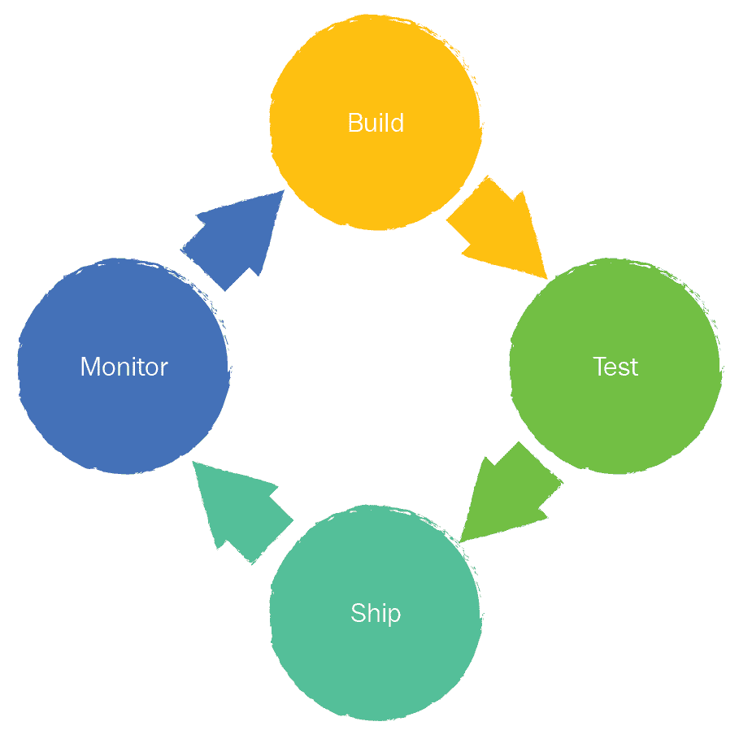
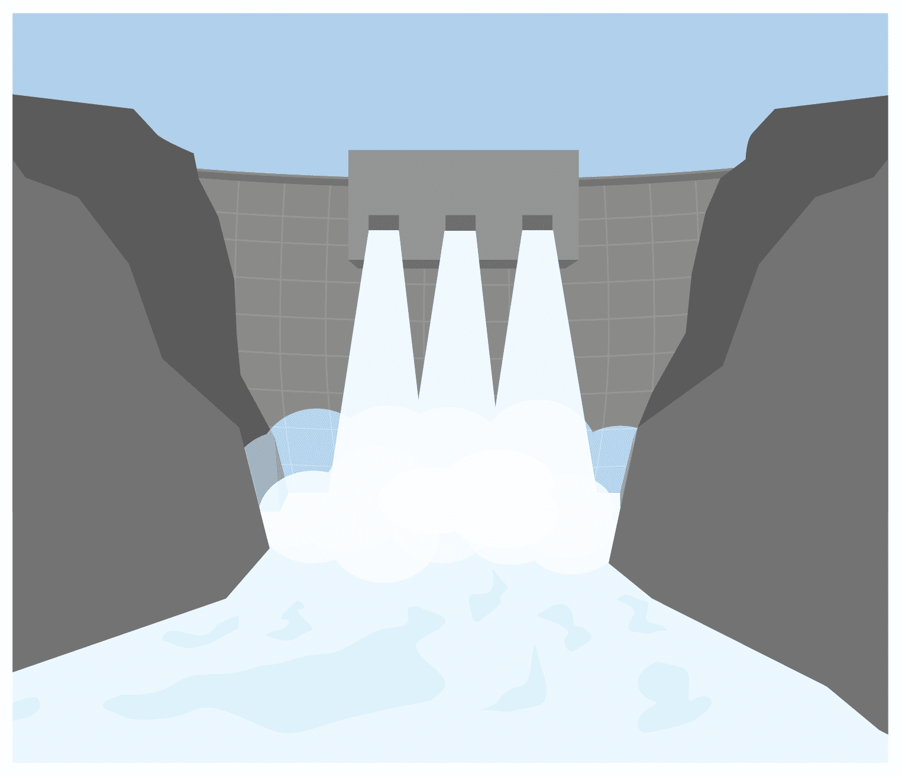
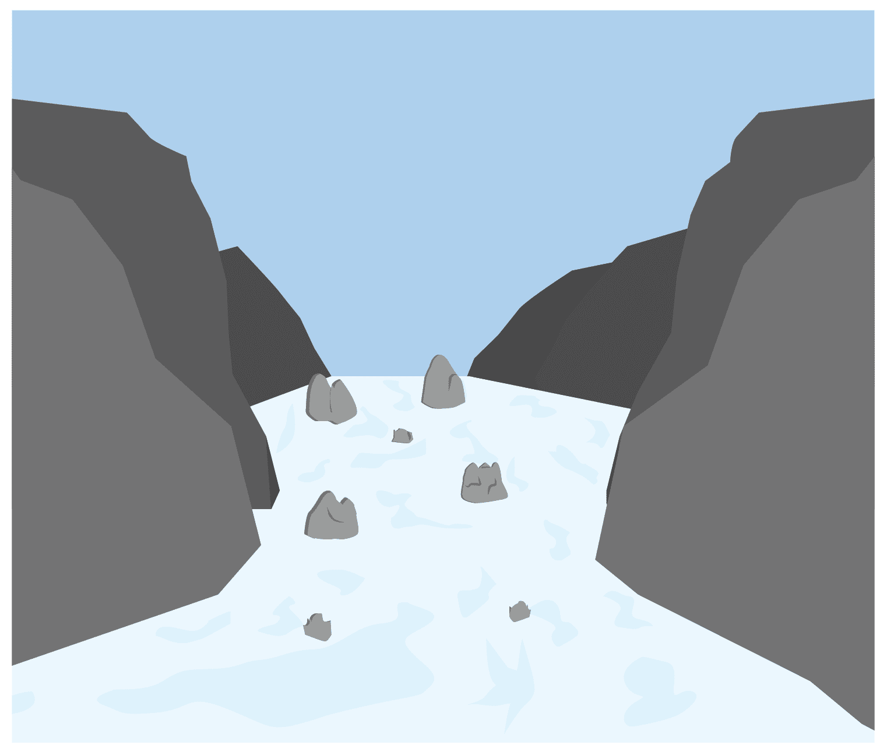
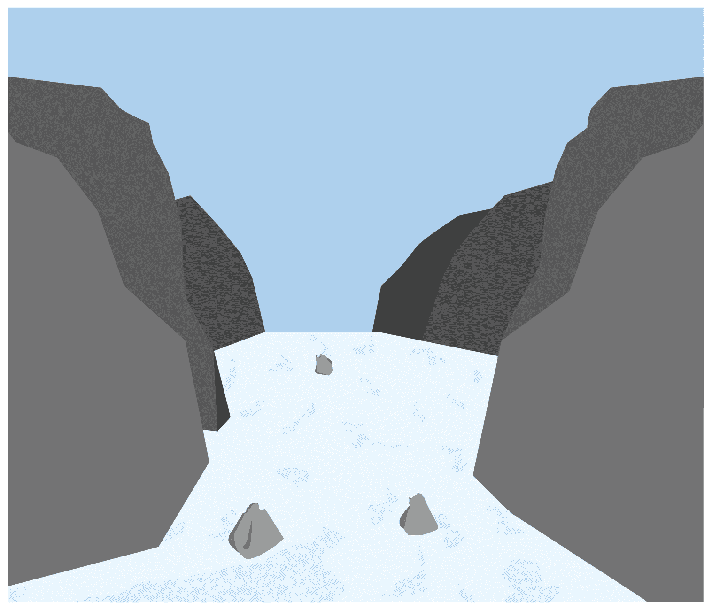
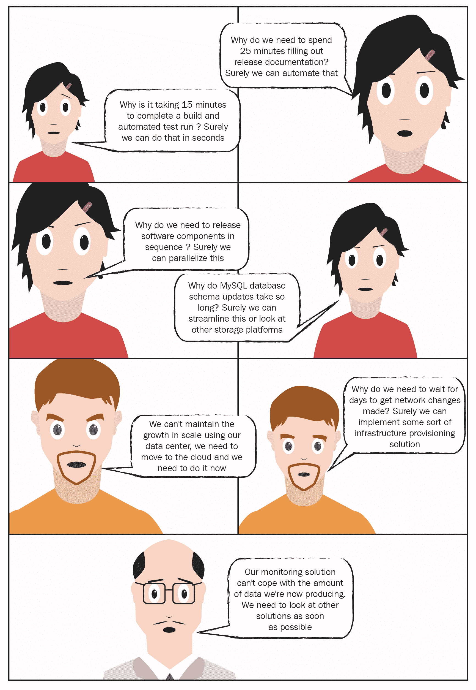

# 第八章：你还没有完全结束

直到这一点为止，我们一直在进行一段旅程，从揭示导致业务痛点的问题，到定义去除这些问题的目标和愿景，再到解决文化、环境和技术障碍，采用急需的工具和技术，克服障碍，再到衡量成功。

让我们把时间往前推，假设到这个时刻为止，前面章节和页面中的所有建议都已帮助你——加上更多的专业建议、补充出版物，甚至一些协助——并且你已经实施了必要的工具和流程变更。我们还假设 CD 和 DevOps 的采用在你们的组织中已经全面展开。

如果你在旅程的开始阅读这些内容，那么我建议你继续阅读，并运用你的想象力，设想在实施了 CD 和 DevOps 后，事情将会是怎样的。

如果一切按计划进行，业务部门已经开始看到收益，并且能够更快地向市场交付优质功能，远比之前快。从表面上看，你几乎完成了你的目标，实现了你的愿景，但——这非常重要——这并不是终点。

你们所经历的旅程是漫长的，就像那个坐在车后座、长时间开车去奶奶家的五岁孩子一样，你们组织中的人们现在会反复问一些问题，比如“我们到了吗？还要多久？什么时候可以停止花钱在这个 DevOps 事情上？”以及“我需要上厕所！”好吧，也许不是那么多关于上厕所的事，但我想你明白我的意思。现在是暂停片刻、盘点一下你们所处位置的好时机。

# 反思你们现在所处的位置

是的，你已经走了很长一段路；是的，事情进展顺利得多；是的，组织内部的协作更加紧密；是的，开发和运维之间的鸿沟变得不再是深渊，而更像是地面上的一道小裂缝；是的，你几乎完成了你最初的目标。你所做的是将软件交付的过程从复杂、痛苦和繁琐的状态，简化成了如下的简单过程：

你最初打算解决的问题围绕着软件交付过程中的浪费，包括冗长且无意义的流程、政治姿态，更具体地说，是来自大规模、少量发布的浪费。采用 CD 和 DevOps 帮助你克服了（大部分）这些问题。

因此，你现在会开始听到类似的评论，比如“我们可以快速部署，所以我们一定实施了 CD”或者“我们的开发人员和运维人员密切合作，所以我们一定实施了 DevOps”。

有人会建议，一旦你开始听到这些，那就意味着你确实完成了你最初设定的目标。从某些方面来说，这是对的；然而，实际上，情况远非如此。

这些评论所说明的事实是，旅程开始时突出的问题现在已经开始变得模糊和遥远。公司已经开始接受 CD 和 DevOps 作为我们在这里的工作方式，并且终于开始理解它们的意义，这是好事。然而，仍然有很多工作要做，问题也需要解决；尽管这些工作和问题已变得不同。就像你在旅程开始时做的那样，现在是时候检查并确认哪些问题现在重要，并适应解决它们。为了说明这一点，我们需要稍微偏离一下主题。

# 流动

让我们将你的软件发布过程比作一条流动的河流（我确实说过这有点偏题）：

+   在最开始时，许多小溪流汇入一个大河，这条河流向前流淌，但却被一系列的水坝和人工大坝所阻碍：

+   然后，河流开始倒流，形成了一个水库。

+   每隔几个月，闸门被打开，水流自由畅通，但这通常是短暂且匆忙的冲刺。

+   随着你识别并开始移除这些人工障碍，流量变得更加均匀，但仍然受到下游一些巨大巨石的阻碍：

+   于是你开始系统地一一移除这些巨石，这样又增加了流量；这反过来使得流量变得更加一致、可预测和可管理。

+   由于移除了障碍以增加流量，水位开始下降，小石子开始出现并形成涡流，这限制了流量，虽然不是完全停止，但还是稍微影响了流动：

+   流量继续增加，水位不断下降，很快就会明显看出，这些小石子其实是隐藏在河流深处的更多巨石的顶部。

那么，这和你采用 CD 和 DevOps 有什么关系呢？如果你停下来思考，答案其实很明显：

+   在你开始之前，你有许多工作流，最终汇集成一个复杂的发布——这些就是流入河流的溪流，最终堆积到水库中。

+   在旅程的开始，你对主要问题和挑战有相当清晰的了解。这些问题对所有人来说都很明显，并且是造成最大痛苦的原因——这些就像是锁和水坝。

+   你移除了这些障碍，流量开始变得更加一致，但它依然受到巨石的阻碍——这些障碍包括缺乏工程最佳实践、不良的文化和行为、缺乏开放和诚实的环境等等。

+   你系统性地解决并去除了每一块巨石，开始获得一个稳定、持续的流程，但新的不可预见的问题开始浮现，阻碍了你的进展——这些就是那些水面下实际上是巨石的小石子。

如果你回顾一下，你最初的目标和愿景集中在大象曝光检查阶段（人造水闸和大坝）中突出的问题——那些你*知道*在开始时就存在的问题。随着你系统地解决这些问题，你交付的软件流开始更加顺畅，你和更广泛的业务也开始看到一些积极和有趣的成果。随着时间的推移，那些不太显眼或重要的障碍（巨石）变得更加明显，成为了令人担忧的原因。于是，你改变了焦点，去除这些障碍，从而再次改善了整体流动性。

由于改进的本质，越是让一个流程变得高效和有效，越是会有那些小小的烦恼（小石子）变成障碍（巨石）。这并非 CD、DevOps 或 IT 特有的问题；这只是一个普遍现象。

这绝非全是悲观和沮丧，也不需要过于担心。你和业务已经面临过更大的挑战，现在你们具备了足够的组织成熟度，可以轻松应对这些新出现的障碍。这是成功的标志。

# 成为自己成功的牺牲品

人类是非常善变的生物。由于大多数业务由人类构成，它们也同样善变。短暂的成功很快过去，逐渐淡入集体记忆中，而几周或几个月前并不算问题的事情开始成为大家热议的话题——无论是在镇上的街头巷尾，还是在董事会、茶水间或洗手间。成功的另一个问题是，这会成为新的基准，意味着即便是最小的问题也可能迅速演变为重大问题。这些问题可能是一些相对简单的事情，例如：

随着采纳的成熟，相对较小的问题可能变成新的挑战

在几个月的时间里，最初在大规模发布周期约束下工作的团队成员——这些发布周期需要几周或几个月来整理、测试和推送到生产环境——几乎已经忘记了那些黑暗的旧日子，现在却开始找寻新的担忧和抱怨。这并不罕见；它发生在每一个项目中，不论是重大的业务变革项目，还是相对简单的软件交付项目。这并不奇怪，但如果你仔细思考，它其实是一个积极的问题。

直到最近，工程团队由于大规模发布过程中的官僚主义、复杂性和约束，受到严重限制，无法真正创新、实验或展示他们的工程能力。他们现在不再需要担心软件发布的过程，因为这已经成为一种日常的背景噪音，反复进行，不需要太多的努力——这主要得益于你们所做的出色工作。

现在提出的这些看似小问题，在黑暗的日子里，可能只是一些简单的麻烦，会被当作低优先级的问题被忽视或忽略。它们曾是水下的鹅卵石。现在，它们变得真实而庞大，像巨石一样，必须被解决；否则，可能会出现事情停滞不前的风险，日子也可能重新变得暗淡。

此时，你和更广泛的业务团队可能会开始问以下类型的问题（如果能帮到你，我也提供了我的回答）：

| **问题** | **答案** |
| --- | --- |
| 新问题的出现是否意味着你原本的目标没有实现，你已经失败了？ | 不是的！这只是意味着形势发生了变化。 |
| 这全都是浪费时间吗？我们似乎有和最初一样多的问题。 | 不是的。你之前遇到的那些问题——比如很久以前的“大象问题”——要大得多，影响范围也更广，而且从各方面看都被忽视了，或者至少是被接受了。而这些新出现的问题在直接比较下显得微不足道——尤其是对业务的成本来说——并且现在已经公之于众，所有人都能看到。 |
| 我们还需要花多少钱？ | 这取决于新问题的规模和相对优先级。然而，既然 CD 和 DevOps 现在已是标准 SDLC 的一部分，你应该像投资业务流程和工具中的任何其他部分一样进行投资。 |
| 我们错过了什么吗？ | 不，大多数*新*问题是在旅程开始时无法预见的，或者仅仅是些小麻烦。 |
| 这是否意味着你需要改变目标，制定新的计划，重新开始？ | 不一定。你现在需要的是一些 PDCA。 |

那么，究竟什么是 PDCA 呢？让我们来了解一下。

# [P]lan, [D]o, [C]heck, [A]djust

这个缩写有多种变体；然而，最广泛使用的是**计划**、**执行**、**检查**和**调整**。你也可能听到 PDCA 被称为戴明循环或谢瓦特循环。无论你偏向哪种定义，PDCA 方法背后的理念都非常简单；它是一个框架和方法，帮助你进行持续的迭代改进。以下这个简单的图表应该能帮助解释这一点：

PDCA 的迭代过程

简单来说，这种方法是对之前多次提到的检查和调整方法的扩展——虽然实话说，它存在已久。这个概念非常容易理解和遵循，并且几乎可以应用于你 CD 和 DevOps 采纳的每一个方面。让我们看一个例子：

+   **计划**：你意识到当前的软件交付流程有问题，并决定通过运行研讨会来找出原因，绘制整个流程地图

+   **执行**：你运行研讨会，并从整个业务中收集输入和数据

+   **检查**：你分析输出，确定所提供的数据是否能让你了解流程中的痛点在哪里

+   **调整**：你突出显示一些浪费的领域，并商定纠正措施

+   **计划**：你设定一个目标，并制定一项攻击计划来解决主要痛点

+   **执行**：你按照这个计划执行

+   **检查**：你审查进展与目标之间的关系

+   **调整**：当发现更多信息和未预见的障碍时，你对方法进行微调

+   **计划**：你重新调整计划，确保在获取新信息后仍然可以实现目标

+   **执行**：我觉得你可以自己填写剩下的部分

就像本书涵盖的大多数工具和技术一样，与其他方法相比，选择 PDCA 方法是你的决定；然而，这是一个经过充分验证和广泛认可的框架——特别是当你考虑实施像 CD 和 DevOps 这样广泛影响和改变业务的东西时——因此，我建议你不要简单地忽视它。

如果你注意到收集数据和度量的重要性，正如第七章《重要的测量指标》所述，你现在应该有足够的数据来在 PDCA 的检查阶段使用，这将使调整阶段更容易定义。你甚至可能会发现一些不那么明显的问题。例如，如果你发现周期时间经常波动（检查），而这也与 QA 环境的计划外停机时间相对应，而后者又是由于存储空间填满所致，那么有人应该调查为什么会发生这种情况并阻止它发生（调整）——这可能只是（计划）增加更多存储空间。

PDCA 的一个主要优势是它在业务各个层面都易于理解，同时也非常适应性强——例如，本书就是使用了同样的方法开发的：

+   我规划了整本书的结构和内容

+   我随后把这些记录为一个提案

+   我将这份材料交给出版商审核并提供反馈

+   我评估了反馈并对整体计划进行了调整

+   我开始规划第一章

+   我写了第一章

+   我的编辑审阅了它并提供了反馈

+   我调整了第一章

+   我规划了第二章——我想你已经颇费心思地理解了这一点

如果 PDCA 不是你首选的框架或方法，我建议你在采取任何行动之前做一些研究。我特别说“采取任何行动”而不是“你行动”，因为你现在应该退后一步，审视一下自己所处的现状，了解自己接下来需要做什么。

# 退出，舞台左侧

经过许多个长时间的工作时段、日子和几个月，业务已经习惯了你和你身边的人一起花费大量时间、日子和几个月实施的变化。这个善变的业务现在正在经历并报告他们认为重要的新问题。问题是，谁来解决这些新出现的挑战？答案很简单——不是*你*，也不是那些与你一起推动 CD 和 DevOps 采纳的人。

你已经帮助嵌入了新的协作工作方式，帮助弥合了开发与运维之间的差距，帮助实施了新的工具并优化了流程，喝了很多咖啡，睡得很少。你已经做了你的部分，现在是时候让你帮助过的人摘掉训练轮，挺身而出，接过缰绳（来混合一些比喻）。

不再需要训练轮

很久以前，在第二章《理解你当前的痛点》中，我们探讨了如何识别业务面临的问题和挑战。我们称之为“房间里的大象”。你帮助整个业务理解并学习如何运用回顾和其他工具回顾过去并规划未来，同时教会他们如何通过开放、诚实和勇敢的对话，找到正确的路径。正如几次所提到的，*新*的问题和挑战就是这样：*新*的。

这些新的问题和挑战确实需要解决，但如果你把业务在旅程开始时的状态与现在在组织成熟度方面的位置进行对比，你会发现一个重大且非常重要的区别：现在，业务已经具备了快速识别新的“大象”般的难题的工具和能力，而且现在他们有足够的工具、知识、信心、经验和专业知识，能够迅速且无痛苦地解决这些问题。如果你不相信我，可以重新做一遍第一章《软件交付的演变》中的 CD 和 DevOps 进化量表测验，看看现在业务的得分与几个月前相比如何。

如前所述，你几乎已经达到了最初的目标（或者说差不多达到了，真是的），所以你的告别演出就是帮助他人帮助自己。在这段旅程中很有趣，但所有美好的事物都必须结束，现在正是考虑退出策略的好时机。这并不是说你应该逃避、躲藏，完全不参与；而是意味着，为了充分鼓励新兴的工作方式，你需要扮演负责任的父母角色，让孩子们独立成长，自己学习。

你现在的重点应该从推动采纳（做）转变为辅导和引导其延续（领导）。那些曾是 CD 和 DevOps 采纳的创新者——包括你自己——现在应该开始鼓励那些从采纳中受益的创新者和追随者走到前台，承担起他们自己的责任。这不会一蹴而就，但你需要非常清楚你的意图，让人们理解你正在交接接力棒。像将定期的 CD 和 DevOps 会议的组织工作交给他人，或在下次重大工具升级的时间安排时预留时间休息这样的简单举动，就足够了。当你需要时，“眼不见心不烦”的格言可以派上用场。

就像一个好的父母一样，你为成长和自我发现设定了一个安全的环境，因此，你只需要轻微的引导，偶尔的建议，以及在正确的方向上适时地推动。

作为这种新发现的父母式领导角色的一个重要部分，你需要重新审视 CD 和 DevOps 中更广泛且不易捉摸的领域，以确保自满情绪不会滋生。

# 不要安于现状

因此，你已经做了很多并取得了更大的进展，企业和其中的员工也因此受益。这是一件好事——你和所有参与其中的人都应该为所取得的成就感到非常自豪。然而，这并不意味着企业可以安于现状；虽然可能很有诱惑力，但仍然有许多需要控制的事情。

之前，我提到过会有新的问题和挑战从水面以下浮现出来，继续让新一代的创新者和追随者忙碌。通过你和前一代人的辅导和引导，他们会没问题并解决这些新的挑战。与此并行的是，当新事物变得常态化时，自满情绪也会随之而来。你帮助了企业发展，但你必须非常注意这样一个事实：如果企业中出现真空，自满情绪渗透进去，它就会像进化一样迅速地退化。

恐惧真空（更常见的说法是“自然厌恶真空”）——亚里士多德

就像任何深远的项目或企业变革一样，如果急剧的变化速度开始放缓或看似停止，事情就会开始停滞，陈旧的固有习惯会重新浮现。在这种环境中，*落后者*可能会再次变得高调，而追随者们也可能开始听从他们的意见。你将积极而显著地从执行者转变为推动者和影响者；因此，你的角色将是确保事情顺利进行，保持警觉，留心新的威胁。你已经建立了一个良好的网络，因此应该开始利用这个网络来获取早期警报。

与你所取得的成就相比，这看起来可能简单，但有时却更加困难；你习惯了积极参与并推动他人，亲自做事情，而现在你必须保持距离，看着别人做你依然充满热情的事情。虽然有时更难，但同样充满回报。把它当作个人进化的下一步。因此，你现在处于一个良好的位置，可以超越最初的目标，看看是否有机会在更广泛的领域提供帮助。

# 总结

采用持续交付（CD）和 DevOps 是一个漫长而艰难的过程。如果你认为这不难，那你就是被误导了。随着你接近旅程的终点，你将遇到满是大象的河流和其他不可预见的挑战。在此过程中，需要父母般的指导来引领企业走向正确的方向，同时你也需要规划如何走出聚光灯，腾出空间给那些从你们共同取得的成就中受益的人。新的问题会出现并威胁到采纳的进度；然而，企业现在更加成熟，应该具备应对这些问题所需的工具、经验和智慧。保持警觉是值得赞赏的，但也有更重要、更值得关注的事。在第九章，*拓展你的机会视野*，我们将探讨一些来自成熟的 CD 和 DevOps 文化中更大、更好的机会示例。
