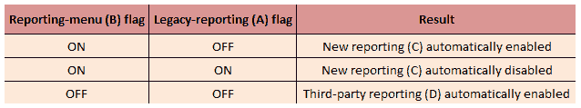
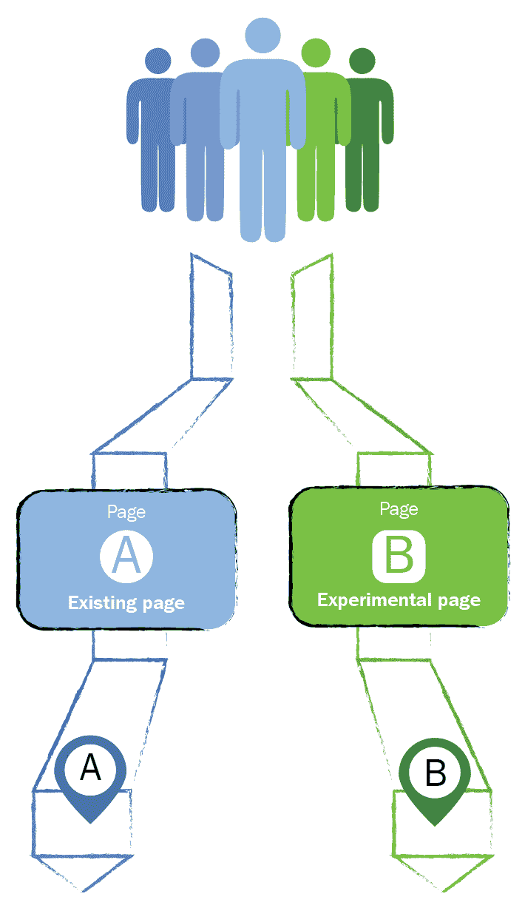
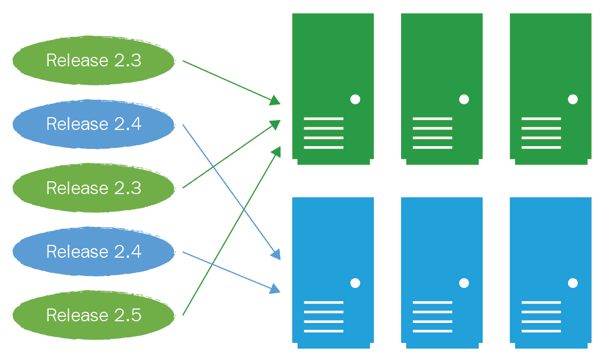

# 第九章：拓宽你的机会视野

如你所猜到的，我们的关注点主要集中在传统企业中的传统软件交付上，这些公司提供的是传统的 Web/服务器软件解决方案和产品，而非那些年轻、时髦且富有创新精神的初创科技公司。原因在于，初创企业通常具备内在的敏捷性和创新机会，能够灵活交付软件。大多数科技初创企业——尤其是近几年成立的——通常会将 CD 和 DevOps 融入到他们的日常工作方式中。

也许你目前就在这样一家时尚企业工作，但 CD 和 DevOps 并未从一开始就融入其工作方式中。这不应成为问题，因为本书应能为你提供一些解决这一差距的好点子和指导。

绝大多数日常交付软件的公司并没有那么幸运——尽管有意图，但可能缺乏行动的意愿。因此，关注点依然停留在传统模式上。很有可能你自己也在其中一家传统公司工作。

如果你已经遵循了本书中提供的建议，并成功采用了 CD 和 DevOps，那么你很可能已经赶上了那些年轻的天才，你的业务在交付软件的方式上能够同样具有敏捷性和创造力，甚至可能更具优势。

在第八章的尾声部分，*你还没有完成*，我们将焦点转向了*你*，以及*你*如何将新获得的知识、技能和经验继续推进，超越最初将 CD 和 DevOps 工作方式嵌入组织的目标。让我们来看一下这实际上意味着什么。

# 那我呢？

假设在这个故事的叙述中，你在 CD 和 DevOps 的成功采纳中发挥了重要作用，并达成了你最初设定的目标。事情进展顺利，甚至比你预想的还要好。业务已经成熟，能够独立解决问题，不再需要你牵着手走——嗯，差不多吧。

如第八章《你还没有完成》中所提到的，*你还没有结束*，你应该花一两分钟考虑一下，在这段旅程的开始时，大多数企业中的个人处于什么位置，现在他们又处于什么位置。考虑一下工作方式、沟通、协作和行为上的变化。想一想在发展初期创新者、跟随者和滞后者的比例，现在又是什么样子。考虑到所有这些，你很可能会发现，现实中，大多数人现在处于你开始时的同一个位置——他们只是刚刚意识到，事情有另一种做法，而且那是一种更好的做法。没错，依然有工作要做，目标是使一切尽可能有效和高效，还有一些小问题需要解决，但总的来说，事情是好的。

现在，看看你个人走了多远；就大多数你曾经合作、指导和教授 CD 与 DevOps 方法的人来说，你就像远处的一个身影：

他人对你的看法

无论你在旅程开始时的角色是什么，开发人员、系统管理员、经理，还是其他什么角色，现在你的角色已经发生了变化。无论你是否喜欢，你已经成为了知识、专业技能和经验的拥有者。你是 CD 和 DevOps 的主题专家。你了解你的专业。

你可能觉得你早期采用的创新者同伴们也都和你肩并肩站在一起，但为了简单起见，今天阅读这些内容的是你，因此你就是那个站在远处的人。

你已经走得很远，景象与你最初开始时大不相同，你还有新的高峰需要攀登——这些是现在企业已经准备好要看的新机会。也许这些曾经是企业无法克服的挑战；也许他们根本不知道这些机会的存在，但凭借新获得的知识，他们渴望尝试新的事物。也许你的**首席技术官**（**CTO**）和他年轻时尚的同行在高尔夫球场上聊得很投机。无论是什么原因，现在是时候将*你的东西*应用于这些新的挑战和机会了。接下来是一些示例，说明你如何在传统软件交付之外，运用你的技能、专业知识和经验。

接下来是一些在成功采用 CD 和 DevOps 后可以开启的机会示例。有些可能在没有 CD 和/或 DevOps 的情况下也能实现，但根据经验，没有这些工具，结果不会那么理想。这些是你——如果你愿意接受——可以投入精力、关注和时间去解决的新挑战和机会。

# 性能和负载测试

你们中更为细心的人可能已经注意到，本书中几乎没有提到性能或负载测试。这是故意为之，因为在我看来，如果没有持续交付（CD）和开发运维（DevOps）所带来的紧密协作、工具和技术，进行这些活动就是一项徒劳的任务。是的，确实有许多传统的方法，但这些方法通常会在你准备发布代码之前将某些东西强行塞进流程中——这可能会导致由于最后一分钟发现性能问题而导致代码无法发布。你可能已经通过实施一种周期性地获取软件版本并在受控且高度监控的环境中进行密集自动化测试的过程来解决这个问题。这有一定帮助，但除非你已经设置了完全**模拟**实际使用场景的自动化测试，否则你基本上是在给大家带来虚假的希望，认为代码上线后不会出现性能问题。

我还敢猜测，在暴露问题的检查阶段，性能/负载测试被视为一种负担，甚至是浪费资源的行为。实际上，这种看法既不必要，也不应该是如此。

一旦你采用了持续交付（CD）和开发运维（DevOps），性能/负载测试的过程可以变得相对简单直接。你只需要改变思考和处理问题的方式。

有一种非常简单且易于理解的方法来考虑负载和性能测试；迄今为止，最好的方法是在生产环境中检查软件在实际负载和使用下的表现。你可能正在阅读这段话并想，作者是不是疯了？这可能是真的，但我请求你耐心听我说下去，并自行做出判断。

假设你已经实施了对整体生产环境以及其中运行的软件进行广泛监控（正如在第七章中提到的，*关键指标*），通过这些监控，你可以详细观察硬件、基础设施和软件在背后发生的情况。通过这些数据，你能够清晰地了解正常日常操作时的表现应当是怎样的。

通过这些数据，你应该能够安全地进行受控实验，并观察平台整体性能的结果。例如，你可以进行一项实验，逐步施加额外的负载到正在使用的平台上，方法可以是将更多的用户活动路由到特定的节点或服务器，或者通过运行一些非侵入性的自动化测试，以受控的方式生成负载。当你增加负载并提高负载时，你将开始看到痛点——一种近乎实时的热图。由于开发和运维团队密切合作，共同观察平台，他们应该能够通过将正常的日常统计数据与负载下生成的统计数据进行对比，找出问题所在。

如果在某个时候问题被定位，它们可以通过使用 CD 工具实时应用补丁来轻松克服，而负载仍然存在——提供即时反馈。或者，他们可能会看到平台的整体慢下来，但监控解决方案没有突出显示任何具体问题。这可能意味着整体监控覆盖存在一个漏洞，这同样可以通过协作方式定位并解决。无论如何，简单地将负载调回正常日常负载即可恢复正常状态。

你们中的一些人可能正在阅读这篇文章，并认为生产环境是神圣不可侵犯的，不应当用于此类活动，因为这可能会影响到同时使用平台的客户。我的看法是，除非你故意限制可以访问生产环境的人数，否则这种负载增加将会在你不知情的情况下以不受控制的方式发生——特别是当你的 CD 和 DevOps 采用直接导致客户满意度和增长提升时。为什么不在增长发生之前，确保你的生产环境已为此做好准备呢？

总而言之，如果没有充分的监控和/或开发与运维团队之间高度的协作，尝试进行性能或负载测试将无法提供预期或所需的结果。在生产环境之外进行测试将得到混合结果。这并不是采用 CD 和 DevOps 的明显好处，但它是一个非常强大且令人信服的好处，就像减少复杂性一样。

# 减少功能标志的复杂性

有许多已建立的方法可以在实时中切换不同的使用案例或用户流程，但大多数方法都围绕着某种功能标志或平台中的配置设置展开。尽管这是一个可行的方法，但它确实会在代码库中增加一些内容，随着时间的推移，这可能会成为一个巨大的麻烦。这个“东西”就是复杂性。

这不仅增加了代码库的复杂性，还增加了相关活动的复杂性，如测试和整体平台的设置/支持，尤其是当你开始将特性标志链式连接时。例如，假设你有一个新的报告功能（我们称之为特性 C），如果报告菜单功能（我们称之为特性 B）被手动启用**并且**遗留报告功能（我们称之为特性 A）被手动禁用，那么特性 C 会自动启用。如果特性 A**和**B 被手动启用，那么特性 C 会自动禁用。然而，如果特性 A 和 B 都被手动禁用，那么第三方报告功能（特性 D）将自动启用。

以下可能会使这个例子更容易理解：

这一切看起来足够简单，基于简单的逻辑门，但想一想，当你拥有一个平台，其中有特性标志控制着数十个或数百个特性时，会发生什么——其中一些是相互独立的，而另一些则形成了一个奇怪、复杂的链式特性树。测试所有这些组合并尝试支持一个可以设置成数百种（有时是数千种）不同状态的生产系统将是一场噩梦，更不用说当问题出现时，试图调试特定问题是多么徒劳无功了。

我曾经参与过一个产品的开发，其中有超过 50,000 个特性标志——大多数特性标志的来源和控制的功能早已被时间的迷雾掩盖，因此，新的特性标志不断被添加，用来控制新添加的功能。复杂性完全失控！

成功采用了持续交付（CD）和 DevOps 后，你将能够定期且持续地轻松地发布代码，并且开发和运维团队将紧密协作。因此，使用 CD 方法来启用和禁用功能将变得更加简单。换句话说，要启用某个功能，你只需要发布包含该功能的代码——不需要使用标志、设置或复杂的链式操作。你当然会先进行测试，确保没有出现意外的负面影响，但有一个非常简单的回退方法：发布不包含新功能的先前版本（如果你遵循第五章中的“永远不破坏你的消费者”建议，*方法、工具与技巧*，回滚应该不会引起任何问题）。我相信你会同意，这种方式既简单易懂，又便于开发和支持。

好吧，这可能是一个过于简单化的观点，但通过 CD 和 DevOps，你可以开始以新的和创新的方式看待这些问题。其优势可能不会立即显现出来，但至少减少复杂性将为你节省时间、金钱和精力，同时减少过程中的浪费。

在软件中使用功能标记的原因之一是为了实现 A/B 测试。现在我们来看看 A/B 测试到底是什么，以及 CD 和 DevOps 如何帮助改善这种方法。

# A/B 测试

A/B 测试已经存在一段时间，它是一种非常有效的方式，用来尝试对用户旅程和/或软件解决方案中的逻辑流程进行更改。其简单的前提是，通过配置、功能标记或巧妙的流量路由，你可以将一定数量的用户（或通过使用软件本身产生的交易）引导到不同的路径。这有助于在通常是在生产环境中以受控条件下尝试新功能和/或功能，以验证或反驳某些假设。

我不会深入探讨这个话题——有很多书籍和在线资源专注于这个话题，我鼓励你去阅读。

举个例子，假设你的业务想要看看如果引入一个新的设计或微妙的网页布局变化会产生什么影响。如果你能够以某种方式将特定的用户或用户群体引导到路径 A，而将其余的用户引导到路径 B，那么你就可以通过分析和度量来监控并比较用户行为，看看哪种效果最好。

下图提供了这种方法的简化概览：

一个简单的 A/B 测试示例

另一种有用的方法是偷偷进行 A/B 实验。例如，如果你有一个新的推荐服务想要试用，你可以将一些用户流量和交易引导到这个新服务上，看看它与现有服务的表现如何。你甚至可以使用相同的机制，将数据路由到特定服务作为负载测试的一部分。可能性是无穷的。

你不一定需要 CD 或 DevOps 来实现 A/B 测试；然而，两者确实能为你带来一些重大好处：

+   能够极其快速地发布代码——例如，你希望在几分钟内在所有服务器上实施代码，将流量分配到 A 或 B，从而确保所有用户同时使用相同的代码。

+   你有开发和运维团队紧密合作，监控正在发生的一切。如果在用于分析结果的数据中发现有缺口，你能够相对容易地解决这一问题。

+   如果事情发生意外变化或你已完成实验，你有选择相对快速回滚所有内容的选项，并且几乎没有或完全没有影响。

如果没有 CD 和 DevOps，你需要提前非常紧密地规划此类活动，并且希望在实施时没有遗漏或错误。除非你有能力进行小规模的补丁发布，否则你无疑需要在完整的发布周期内包含任何变更——无论多小——以便启动正常的、规避风险的流程。完成后，回滚这些变更时也将适用同样的流程。

A/B 测试的另一种变体（或至少是一个紧密相关的形式）是 Alpha 测试和 Beta 测试（有时称为封闭测试或预发布测试）。这使我们能够在现有解决方案的基础上尝试广泛的 UI、UX 和功能性变更。通常，这种测试会限定在特定的用户群体中，或仅通过邀请进行。与 A/B 测试传统上针对小范围、具体的变化不同，这种测试通常更为广泛。基本前提仍然适用：以受控的方式尝试新功能和特性。同样，虽然可以在没有 CD 和 DevOps 的情况下实现这一点，但这样做将更加复杂、风险更高，并且容易失败，因为旧式的流程会妨碍进展，拖慢速度，并且——根据经验——最终会被归咎于测试失败的原因。试想一下，如果没有及时响应问题的机制，如何同时维护两个版本的整个 UI 并使其并行运行。

如前所述，A/B 测试基本上是为了验证或反驳某些假设，无论是由于市场条件变化，还是作为战略方向改变的一部分。无论背后的原因是什么，进行 A/B 测试通常是时间敏感的。如果没有 CD 和 DevOps 帮助你频繁交付高质量软件，成功运行 A/B 测试的能力将受到阻碍，因为在你努力计划和执行发布的同时，世界可能已经发生变化，而你最初想要测试的用例可能不再相关。正如人们所说，时间不等人，也不等女人和 A/B 测试。

接下来我们将从测试转向颜色——实际上是蓝色和绿色。

# 蓝绿部署

一些熟悉 CD 的人无疑听说过蓝绿部署，它是原始 CD 方法的基石之一。对于那些不了解的人，蓝绿部署允许你在现有版本/服务器运行的同时（如其名所示）部署软件的新版本（或具有更新操作系统的新服务器，或新的配置或数据库引擎等），然后无缝地将新版本切换为旧版本。这是对这种方法的一个非常简化的概述，但可以说这是一个相对容易理解的概念。

这种方法大大提高了你不仅减少/消除停机时间的能力（见 第五章，*方法、工具与技术*），还可以尝试并行版本控制（例如，在同一环境中运行两个不同版本的相同内容）——这同样能帮助 A/B 测试：

尽管这种方法与持续交付（CD）紧密相关，但采用 DevOps 也会使得管理、规划和协调变得更加容易。如果开发和运维团队之间没有密切的合作与信任，就有可能导致问题严重—尤其是在处理生产环境时。例如，如果一名开发者不小心将破坏性变更部署到 API 中，并且这个 API 与现有的 API 一起存在，但消费者服务（见第五章，*方法、工具和技术*）开始同时与两者进行交互，这将导致非常不一致的结果，甚至让人摸不着头脑。有了 DevOps，找到根本原因相对容易，并且可以通过协作来修复潜在的数据问题。

我不打算深入细节，但我强烈建议你进行一些 CD 的研究和阅读—在附录 A，*一些有用的信息*中有相关参考资料—不过，可以简单地说，蓝绿部署是一种非常强大的工具。

我强烈推荐的另一件事是利用 CD 和 DevOps 来减轻安全补丁的负担。

# 安全补丁与“拯救培根”

看起来每天新闻中都充斥着关于最新遭到黑客攻击的企业，或是遭受**分布式拒绝服务**（**DDOS**）攻击的报道。当然，这些只是我们知道的—研究表明，很多企业并未公开承认大规模的 IT 安全问题（又为什么要承认呢？）。近年来，这使得企业，尤其是高层管理人员，对变革变得异常谨慎，并非常关注确保他们的 IT 系统在安全补丁方面保持完全（或至少大部分）最新。大多数时候，这通常是以软件交付为代价的。

当企业采用了 CD 和 DevOps 时，安全补丁的实施和验证就变成了另一个需要交付的变更。如果补丁是在操作系统（O/S）级别，那么第五章，*方法、工具和技术*中讨论的配置即代码方法将会适用。对于网络、基础设施和运行时框架（例如 JAVA、.NET 等）也是如此。如果补丁是在软件层面（例如，某些使用的开源软件中发现的补丁），那么通过 CD 管道交付软件变更的方式已经经过了充分的验证。

为了简化叙述，假设某个企业遭到黑客攻击，客户数据由于网络中的安全漏洞和未打补丁的操作系统而被盗。

现在让我们将这个场景应用于一个**没有**采用 CD 或 DevOps 的传统上市公司。考虑以下问题并思考可能的答案：

1.  你认为他们会多快修补漏洞以解决问题？

1.  你认为他们的运营团队在 CEO、公关副总裁和运营高级副总裁都在盯着他们想知道 IT 系统何时修补时，心情会有多冷静？

1.  你认为运维团队对匆忙应用本应几个月前就该应用的操作系统和网络补丁**不会**影响软件平台有多自信？

1.  当工程高级副总裁告诉开发团队他们在解决由于匆忙应用操作系统补丁引发的问题之前不能回家时，你认为他们会有多高兴？

1.  当新闻曝光他们被黑客攻击，客户数据被窃取时，你认为一家上市公司会失去多少市值？

1.  会有多少人被辞退？

猜测这些问题的答案并不需要博士学位。像这样的情况并不像以前那样孤立或罕见，近年来的后果已经非常广泛，代价高昂，并且让那些卷入其中的人们的职业生涯受到了限制。

现在，想象一下一个已经采用 CD 和 DevOps 的公司的相同情况。对前面问题的回答大致会是这样的：

1.  他们能像平时一样迅速发布——最多几分钟或几小时。

1.  完全冷静，坦白说，高层管理人员直到通过常规监控发现问题并被告知正在处理时才会知道。

1.  非常自信，因为他们可以与开发团队合作，确保不会产生影响和/或并行工作以制定应对影响的计划。

1.  他们不会有这种问题。

1.  如果传达的信息是：“我们发现了一个问题并已经应用了修复。影响非常小，我们可以向客户保证他们的数据是完全安全的，”那么这条新闻不太具有新闻价值，市场甚至可能不在乎。事实上，他们可能会将此视为好消息，并希望加大对该业务的投资。（好吧，我无法量化这个，但它是有可能的。）

1.  没有人。

如果你的 CD 和 DevOps 采用已经成熟，因安全补丁过时而导致黑客攻击的概率会非常小，因为定期安全补丁的监控和实施将被纳入日常工作流程中，无论是通过配置即代码（configuration-as-code）还是作为软件交付流水线的一部分。然而，始终会有不可预见的安全漏洞，所以了解当这些情况发生时有一种快速的解决方式是很重要的。

如你所见，采用持续交付（CD）和 DevOps 可以带来一些非常重要的拯救局面的好处。这并不是说没有 CD 和 DevOps 你不能取得相同的结果，但能够快速交付，并且开发和运维团队之间有非常紧密的合作关系，将使得在问题发生之前更容易发现并修复实时问题——而不是让你的公司成为晚间新闻的头条。

如前所述，总会有无法预见的事件影响生产系统的正常运行，保持领先应对这些事件可能是困难的。然而，确实有一种方法可以帮助在这些问题显现之前发现它们。这就是主动去尝试破坏实时平台。故意的。

# 混沌猴子中的秩序

无论你多么细心地照顾和关注你的平台，总会有不可预见的事情发生，尤其是在你最不期望的时候。例如，服务器可能会崩溃，进程可能会开始循环，网络交换机会决定不再作为网络交换机工作，SAN 会决定自己喜欢在单用户模式下运行，最新的安全补丁可能会导致软件平台出现问题，或者有人会因为你是一个大目标而决定黑你。正如那句老话所说的，你应该时刻准备好应对意外。

大多数企业都会有某种业务应急计划来应对突发情况，但很有可能他们并不会刻意去强迫问题的发生，至少不会让它发展到实际发生坏事的程度——他们只是希望坏事永远不会发生，如果发生了，他们希望并祈祷能够做好准备，计划能够发挥作用。

如果你有一套工具，能够在受控的方式下安全地启动故障，以观察发生了什么， 更重要的是，观察平台中的薄弱环节在哪里，这样的工具是否有用呢？这正是几年前某个聪明人所做的事情，而这也被广泛采用为**混沌猴子方法**。虽然有一些变种，但其核心内容就是：一套工具，能在你高度监控的环境中运行，其*存在的理由*就是尽力去破坏它。

如果你对这个话题进行一些研究，你会发现目前大多数工具都集中在基于云的安装环境中。这并不意味着这些工具不能在本地环境中使用，但它们的效果可能较低，且风险较高，所以你需要考虑到这一点。

如果在没有强大嵌入式持续交付（CD）和开发运维（DevOps）文化的情况下尝试这种方法，结果会是一团糟——说实话，我怀疑你是否能在一开始就被允许尝试，因为你需要让组织中非常高层的人理解为什么必须这样做，并愿意承担风险。通过紧密合作、深入监控和依赖信任的关系，依赖 CD 和 DevOps 的做法使得尝试去破坏平台并观察发生的事情相对（但不是完全）没有风险。

这种方法有一个前提：你需要确信你的平台在设计和构建时已经考虑到优雅地处理失败的机制。你应该避免在公开场合犯平台自杀（platformicide），让核心转储和 HTTP 500 错误信息暴露在所有人面前。同样，这可以通过 DevOps 的方式来解决，确保环境和运行其中的软件能优雅地失败。

混乱猴子方法的另一个优势是，它也是一个很好的方式，能让 Dev 和 Ops 团队共享平台如何运作的知识。如任何具有创造性和技术思维的人所说，理解某个事物如何运作的最佳方式就是将其推到极限，看看它的运作机制。回到我们在第七章中提到的 F1 赛车类比——*关键测量*，工程师和驾驶员会在测试和练习圈中定期将赛车和组件推向极限，确保赛车在需要时按设计工作。通过这种活动获得的信息，可能意味着能否站上领奖台与被超越之间的差距。

现在我们将暂时不讨论持续交付（CD）和 DevOps 的潜在破坏性力量，而是考虑 CD 和 DevOps 如何使你的客户和组织内其他团队的工作变得更加轻松。

# 终端用户自助服务

在本书的过程中，我们一直关注将软件推送到指定环境（包括生产环境）的单向流程。其本质上是一个软件工程团队对自己的变更充满信心，因此触发将其发布的过程，或是一个 Ops 团队有信心将配置作为代码的变更发布。

如果你把这个情况颠倒过来，允许你软件平台的用户随时主动“拉取”你的软件呢？这听起来可能有些奇怪，但在某些合法的场景下，这种做法可能是必要的。

我们来看几个场景：

+   你有一个实施团队，负责新客户的引导，他们希望测试不同的场景和用例，以确保他们的手动测试脚本、常见问题解答和培训文档是最新的。

+   SecOps 团队需要在他们封闭的测试实验室中，针对平台的副本运行一系列深度安全扫描和一些 DDoS 场景。

+   公关和市场营销团队需要为新闻稿拍摄当前 beta 平台的屏幕截图。

+   销售团队即将向一个重要的新客户展示，并希望在他们的 Mac 上的虚拟机中运行软件平台的本地副本，因为会议中心内没有可靠的 Wi-Fi。

+   一名内部审计员正在调查六个月前的数据泄露事件，并希望获取当时平台的精确副本。

使用传统的技术和方法，前述每种场景都会涉及大量琐碎的工作（我这是在轻描淡写）来设置一个专用环境，并让所有需要的软件安装并正常工作——更不用说基础设施的设置了。这些琐碎的工作必须根据各个团队已有的工作负载来进行优先级排序，因此可能需要很长时间——很可能远远超出环境**需要**的时间。我敢肯定，你自己一定也经历过这种沮丧——我知道我经历过很多次。

现在考虑一下，如果这些团队/用户能够按下一个按钮，自动为他们设置一个完整的环境，这将会减少多少琐碎的额外工作？如果他们还可以通过自助服务门户指定他们想要的精确版本（例如，生产版本、测试版本、当前进行中的工作、时间快照等等），那该多好？

随着 CD 和 DevOps 融入你的工作方式，没有明显的理由不能做到这一点。虽然这需要一些设置工作，但你已经拥有可靠的工具来配置环境、部署软件资产，并提供深入的监控。如果自动化出现了偏差，或者没有涵盖某些场景，你有一个习惯于协作的 DevOps 团队，他们也乐于帮助解决问题。

将用户自助服务的范围扩展到你的组织边界之外，也是 CD 和 DevOps 可以帮助你实现的目标。

# 作为服务的物品

随着软件解决方案的成熟，投资于这些解决方案的企业不断寻求新的、有趣的方式来利用已作出的投资。通俗来说，他们希望从已支付的软件中赚取更多的利润。

有很多成熟的方法可以实现这一点，但**PaaS（平台即服务）**或**SaaS（软件即服务）**是最受欢迎的，并且在通过现有软件平台赚取更多收入的全新且有趣的方式中非常流行。你可能还记得我们在第三章，*文化与行为——成功的基石*中简要提到过这些内容，涉及第三方工具。其基本前提非常简单；你通过**应用程序编程接口**（**API**）将某些功能暴露给第一方或第三方，他们使用这些 API 扩展他们的软件平台，以包括你所提供的功能。例如，如果你的软件平台专注于汽车租赁预订，你可以将 API 暴露给一个价格比较网站，让他们的用户能够通过你的软件平台无缝地预订汽车。

这种方法已经存在多年，有时被称为 B2B 或类似的东西，但它一直被视为一种实施、维护、安全、变现和支持起来都非常痛苦的东西——尤其是对以传统方式交付软件的公司来说。在涉及对可能影响 API 的任何更改时，也存在复杂性，这可能导致技术债务的积累和/或使使用这些 API 的客户/客户端不满（参见 第五章中的“永远不要破坏你的消费者”，“方法、工具与技术”）。与此相对的是，任何所需的 API 更改交付速度较慢——当第一方或第三方已经采用了 CD 和 DevOps 并能比你更快地行动时，这成为了一个问题。这有时会导致他们开始寻找下一个合作伙伴。

我不会说 CD 和 DevOps 的采用可以在没有任何努力和投资的情况下实现这种方法，但它确实能大大简化使其启动和运行的过程，并保持其持续运行。这反过来应该消除“SaaS/PaaS 实施起来过于痛苦”的看法，并应被视为一种利用软件平台的新颖且有趣的方法。此外，你还会发现，已经采用 CD 和 DevOps 的组织更有可能与那些以类似方式运作的供应商合作，因为他们知道新的需求可以快速且可靠地实现，且合作是自然而然发生的事情。

# 总结

在本章中，我们专注于你在推动 CD 和 DevOps 采用之后的演变，以及你如何帮助业务发展超越仅仅是频繁交付高质量软件的阶段。我们回顾了一些例子，说明 CD 和 DevOps 如何进一步改善所有参与产品交付的人的工作方式，以及它们如何为业务打开新的机会。

你或许能想到一些与自己情况、组织或业务更相关的场景和有趣问题，但重点是，一旦 CD 和 DevOps 融入你的工作方式，你就能够减轻 Ops 和 Dev 团队的负担，帮助他们解决新问题，并提高你内部和外部客户的满意度。

到目前为止，我们一直在讲述 CD 和 DevOps 运动的创始人力求优化、简化并减少痛苦的网络/服务器软件交付方式。在我们的最后一章中，我们将探讨 CD 和 DevOps 如何在它们的舒适区外使用，以及你如何为你的组织和业务带来更多的价值。
