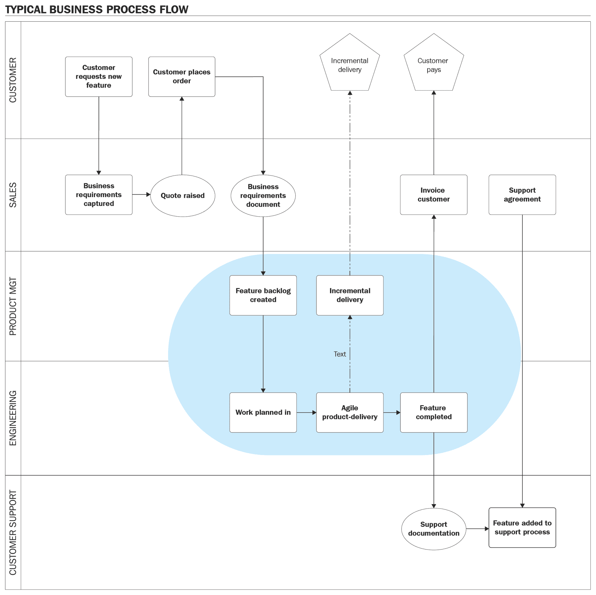

# 超越传统软件交付的 CD 和 DevOps

CD 和 DevOps 通常与交付基于 Web 服务器的解决方案相关——这并不意味着它仅限于此，然而，这是常态。正如你所学到的，CD 和 DevOps 并不特别与工具或技术相关。CD 和 DevOps 的真正采纳是基于文化、行为和工作方式的提升，以顺畅变更流程，从而实现持续交付价值。这意味着它们不必局限于传统的软件交付方式。一旦你的业务采用了 CD 和 DevOps 作为我们这里的工作方式，你就可以、应该，并且能够将相同的方法应用到解决其他业务问题上。

最显而易见的做法是将 CD 和 DevOps 方法应用到大多数交付软件解决方案的企业通常认为困难的事情上：移动应用。

# CD、DevOps 与移动世界

CD 和 DevOps 基于文化、行为和工作方式，因此，将这些方法应用于交付移动应用程序——这是一个庞大且不断增长的行业——是可行的。这并不是说它是一个千篇一律的采纳；在交付移动应用软件与 Web 基于服务器的软件交付方式之间，确实存在一些不同之处，当前的主要差异如下：

1.  每天无缝地将软件交付到 Web 平台 10 次而不影响最终用户是可以实现的——你完全控制着基础设施和发布机制。而同样的操作如果应用到移动应用程序上，会对最终用户产生重大影响——你能想象如果每天向最终用户的智能手机发送移动应用 10 次会发生什么吗？

1.  终端用户的智能手机/平板电脑、音响、冰箱、灯具、门锁、宠物监控摄像头等设备中没有 Ops 团队，因此，DevOps 合作中的 Ops 部分并不严格存在。

1.  你无法保证你将要部署的设备的规格、尺寸、网络能力等。

1.  严格来说，你并不完全控制软件的最终分发。

那么，你如何解决这个难题呢？让我们依次来看看。

关于第一个要点，实际上你不会希望比每几周一次的频率更频繁地发布——即便你具备这样的能力——因为这样只会骚扰终端用户。因此，你应该采用发布列车的方法。实质上，这意味着逐步积累变更（这些变更都是独立构建、测试和通过你的 CD 管道发布的），直到你觉得足够的时间已经过去，可以进行发布。有一个例外：你可以（并且应该）频繁地向内部 Beta 测试/自用用户发布，以便他们随时体验最新版本。

关于第二点，除非你能将运维团队缩小并克隆成数百万倍，否则你能做的也不多。不过，如果你按照第五章《方法、工具和技术》和第七章《关键指标》的建议，你会在软件中嵌入分析和度量，并且已经实施了深入的监控，因此，你将能够像在服务器上运行软件一样，发现应用程序在运行中可能出现的问题。如果发现了问题，开发和运维团队可以协作，找出问题所在并加以修复。

关于第三点，你可以尝试在测试中考虑这一点，但说实话，这是一项非常没有回报的工作。我建议集中精力关注畅销应用，并根据捕获的分析数据和指标，确定用户更喜欢哪些尺寸、规格和设备类型——如果你看到某个设备类型的使用趋势上升，那么你应该考虑将其加入到支持的设备列表中，并将其包含在自动化测试套件中。否则，你可以考虑使用专门从事移动设备测试的外部解决方案/提供商——许多这样的解决方案可以通过 API 驱动，这意味着你的测试解决方案可以协调并控制测试的执行。

关于最后一点，你能做的并不多。目前，领先的应用商店已经非常成熟且可靠，且在全球范围内具有良好的覆盖。持续交付（CD）给你带来的优势是，应用商店实际上是一个二进制仓库，而这正是你的 CD 流水线已经习惯发布到的地方，因此发布可发布的应用程序的机制与服务器端软件的发布机制非常相似。此外，大多数应用商店都支持自动更新，这意味着当你发布新版本的应用程序时，最终用户应该很快就能收到更新。然而，也没有绝对的保证，因此你需要考虑到，仍然会有一些版本在外面运行，需要支持。

这实际上只是表面上的探讨，但它在某种程度上突出了传统基于服务器的应用程序和移动应用程序在软件开发生命周期（SDLC）过程中的相似性。

现在，你可能在阅读这段文字时会想，许多科技公司正在构建并发布移动应用程序，而并没有正式遵循我们在本书中讨论的持续交付（CD）和 DevOps 方法，那么为什么你还需要去在意呢？因为你可以，而且它会带来价值。将协作、信任和诚实融入到组织中的工作，可以轻松地应用到你的移动应用程序上。你已经实现了工具和技术来自动化构建、测试、发布和监控服务器平台的过程，因此将这些扩展到你的移动应用程序上应该是（相对）简单的。

另外，现在可以使用与服务器端网站相同的技术编写移动应用，并将其构建为本地移动应用程序。这意味着同一代码库可能被部署到服务器和移动端，因此使用相同的技术、工具和方法将使流程无缝，并节省大量时间、精力和金钱。

另一个非传统领域可以应用 CD 和 DevOps 工作方式的领域完全超出了软件交付的世界范围。

# 拓展至软件交付之外

迄今为止，本书一直倡导采用持续交付（CD）和 DevOps 来显著改进软件无缝、快速和持续交付的能力。CD 和 DevOps 并不仅限于软件/产品交付。

这种工作方式带来的工具、流程和最佳实践可以扩展到业务的其他领域。当然，某些工具和技术可能需要进行一些调整和更改，但总体而言，重要的是行为、文化和环境因素。

让我们来看看一些超出软件交付范围的领域，可以从 CD 和 DevOps 工作方式中受益，首先是 UX 和设计。

# UX 和设计

大多数交付软件的企业——尤其是包含用户界面的软件（网站、桌面应用等）——通常都会有 UX 和/或设计团队参与 UI 和用户体验资产（线框图等）的工作。即使是最敏捷的组织，在处理 UX 和设计时也通常会采用瀑布式的方式。例如，大多数 UX 和设计团队通常独立于软件工程之外。通常的做法是在开发开始之前预先创建资产，这些资产会输入产品积压列表。敏捷软件开发方法在某种程度上解决了这个问题，但大多数方法并未关注密切的协作需求以及文化、行为方式和持续交付的重要性。

您可以（也应该）利用您新获得的经验和技能，改善设计和 UX 资产的构建和交付方式。如果与 UX/设计团队合作，并让他们考虑如何将这些资产拆分为更小的逻辑块（就像您的软件平台一样），并逐步交付，您可能会发现流程变得更加顺畅、高效，减少浪费。在工具方面，有许多成熟的设计/UX 软件解决方案提供协作功能和敏捷交付。

# 业务流程改进

假设你已经按照本书中的建议，识别并移除了产品交付过程中浪费的部分，现在通过采用 CD 和 DevOps，流程已变得最优和高效，但在实际的产品交付过程之前和/或之后的业务职能和流程开始拖慢了进度。

例如，你可能有一个团队在管理销售线索和业务组合/需求收集，这些信息最终流入产品交付或交付后的实施/支持团队，这两个团队中的一个或两个正在努力跟上快速变化的步伐。

没有理由不能使用本书前面提到的相同技术来解决更广泛的商业问题。作为一个组织，你现在拥有了足够的经验、信心和尊重，能够将那些笨重和复杂的事务简化并高效运作，那么为什么不将这一经验应用到更广泛的领域呢？

回到之前的例子，你应该能够隔离出在产品交付流程之前和之后的业务流程，并进行类似的检查（找出问题所在），解决行为、文化和环境问题，并定义和实施工具、技术和方法，以简化流程并衡量结果。

这样做可以带来更大的商业价值，并使更多业务部门意识到 CD 和 DevOps 工作方式的巨大好处。你的整体业务流程越无缝，整体影响力就越大。如果你能以一种高效的方式捕捉客户需求，你就能够交付他们想要的，并提供他们期望的服务水平。

# 业务增长

之前，我们讨论了 PaaS 和 SaaS 作为向客户交付软件解决方案的模式，但那我们应该如何看待新的商业机会呢？如果你已经成功实现了自动化配置，或许你应该考虑扩展业务，为客户提供 IaaS——毕竟，你们已经具备了为自己提供这一服务的专业能力，为什么不为客户提供呢？

业务增长的其他领域可能来自于利用目前已在组织内部嵌入的技能和经验。回想一下当初你需要 CD 和 DevOps 领域专家的帮助时。如果你曾经得到过一些帮助，我敢打赌那并不便宜。那么，如果你的客户自己交付软件，但需要帮助开始采用 CD 和 DevOps 呢？你或许能提供这种帮助作为附加价值——也许你应该建议他们购买几本这本书？别怪我试图这么做。

# 优化的反馈循环

这个短语在敏捷软件交付方法中已经讨论了一段时间。对于那些不熟悉的人，这与减少从用户那里获得反馈的时间有关，反馈的内容是你提供的软件如何运作、如何执行。反馈可以有多种形式——如 NPS（净推荐值）功能、反馈表单、评分——但最重要的是尽早获取这些反馈。如果你已经采用了 CD 和 DevOps，并能够快速交付变化，那么你确实需要及时获取反馈，以确保交付的内容符合预期（和质量标准）。如果等到特性构建完成两三个月后才得到反馈，那就没多大意义了，因为此时世界可能已经发生变化，反馈也就失去了价值。

最简单的优化反馈循环方式是利用组织内已经植入的文化、行为和协作方式，向内部团队成员（或组织中的任何其他人）获取公开、诚实的看法，随着功能和特性的逐步交付。你可以利用在第九章中提到的自助功能，*拓展你的机会视野*。然而，更大的价值来自于及时从目标终端用户那里获取反馈。

随着 CD 和 DevOps 的采用，使你能够快速、可重复和可靠地交付软件，你应该能够整合工具来收集终端用户的反馈（如之前提到的），如果结合你所嵌入的度量和分析（见第七章，*关键指标*），将为你提供非常丰富的反馈和相关数据。传统上，这些反馈会由软件工程以外的团队收集和/或整理，而采用 CD 和 DevOps 工作方式后，软件工程团队将习惯于处理这些数据，从而能够更快速地作出反应。

正如我所说，CD 和 DevOps 不仅仅是交付软件；完成工作的方式、协作、公开诚实的环境、基于信任的关系，甚至是使用的语言，都可以并且将有助于振兴和增强任何业务流程。

# 那我呢？

上述内容只是一些示例，但如果没有人为业务提供帮助并引导其走向正确方向，它们都无法成为现实。无论你喜不喜欢，你将会拥有经验、技能和声誉，成为与 CD 和 DevOps 相关事务的首选人。

现在，你有机会开始一段新的旅程，通过推动只有在成熟且强大的 CD 和 DevOps 文化下才能实现的变化，帮助业务自我发展。

如果这不符合你的兴趣，或许跟上不断变化和扩展的 CD 与 DevOps 领域才是你感兴趣的事情。仅仅追赶新的做事方式、新的工具、新的想法和新的见解就可能占据你大部分的时间和注意力。越来越多的企业意识到，拥有倡导者对他们至关重要——尤其是在软件和产品交付方面。

你可能已经将自己融入了全球 CD 和 DevOps 社区，这将为你提供与他人分享或展示自己经验的机会，更重要的是，将他人的经验和知识带回到你的业务中。也许你甚至可以将这些经验记录下来，发布到公共博客和论坛，甚至出版成书。奇怪的事情时有发生。

无论你选择做什么，你都不会感到无聊，也无法回到以前的状态。你已经学到了一课：有更好的方法，而 CD 和 DevOps 正是其中之一。

# 你学到了什么？

我一直在提到你的经验、知识和专业技能，但直到你真正经历过采用和实施 CD 与 DevOps 的过程，这些都只是你读到的内容。让我们最后再总结一下我们所讨论的内容：

+   CD 和 DevOps 不仅仅是关于技术选择和工具的，它们的成功很大程度上取决于行为、文化和环境。

+   实施和采用 CD 与 DevOps 是一个过程，刚开始可能看起来漫长而令人生畏，但一旦你迈出了第一步，接着一步步前进，你几乎不会注意到时光的流逝。

+   那些成功采纳了 CD 和 DevOps 的团队很少后悔，或者想要回到以前那个发布版本意味着加班和熬夜的时代——熬夜和周末加班应该和创新以及创造一款杀手级应用或下一个改变世界的技术突破紧密相连。

+   你不必同时采用 CD 和 DevOps，但它们是相互补充的。你不一定要同时做，但你应该认真考虑一下。

+   在需要做出技术选择时，确保你所实施的内容能够增强并补充你当前的工作方式——永远不要为了工具而改变你的工作方式。

+   这可能很庞大且令人害怕，但如果你睁大眼睛开始，你应该能够走下去。CD 和 DevOps 现在已经非常成熟，并且有一个全球社区可以提供帮助和建议，所以不要害怕去寻求支持。

+   不要仅仅因为 CD 或 DevOps 是下一个大家都在做的大趋势，就开始实施它们。你需要有充分的理由来采用这些方法，否则你将无法收获它们的好处，也不会真正相信你所做的事情。

+   虽然我们已经讨论了大量内容，但你不必实施你所阅读的所有内容；选择最适合你和你当前情况的部分，从那里开始——就像你会对待任何一种良好的敏捷方法一样。

+   仅仅因为你能交付软件，并不意味着你就完成了。CD 和 DevOps 是一种工作方式，其中的方法可以应用到其他业务领域和问题上。

+   分享失败和成功，这样你可以从中学习，别人也有机会从你身上学习。

# 总结

这本书，和所有美好的事物一样，已经结束了。如同多次指出的，我们在这些页面中讨论了相当多的内容。 本书绝不是采用 CD 和 DevOps 的权威著作；它只是基于真实世界的经验和战斗故事，按逻辑顺序整理出的一系列建议。我建议你花些时间通过其他阅读材料和书籍来扩展自己的知识，甚至参加一两场会议。

即使你只是看看需要什么来实施和采纳 CD 与 DevOps 的工作方式，现在你应该对自己和组织将要面临的情况有了更清晰的了解。正如人们所说，“有准备就是有优势”。这不是一段轻松的旅程，但它值得。

所以，去拿一杯热饮，一本笔记本和一支笔；跳回到第二章，*理解你当前的痛点*，开始绘制出为什么你需要采用 CD 和 DevOps，以及你打算如何去做。

那就去吧。别再读了，赶紧去做！

祝你好运！
