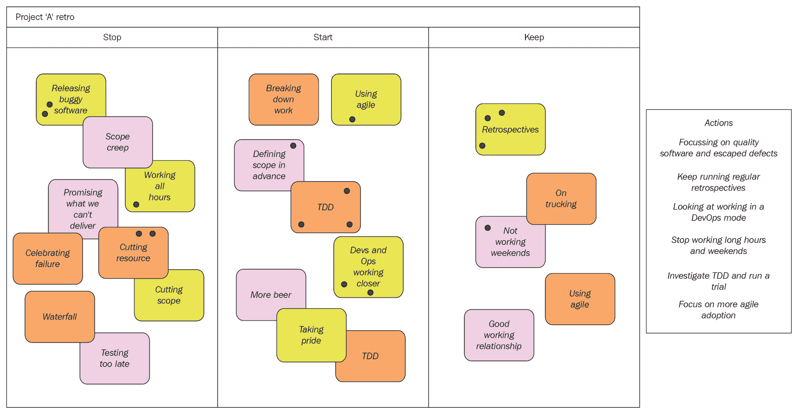
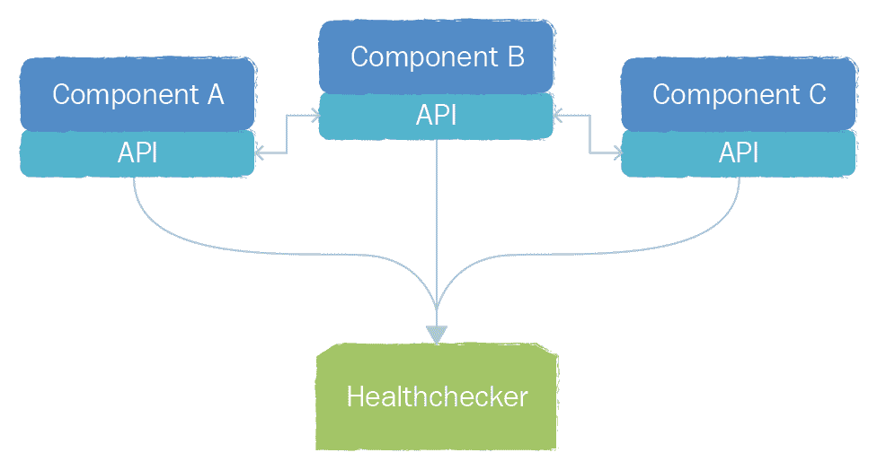

# 第十一章：一些有用的信息

尽管本书提供了一些（希望）有用的信息，但毕竟篇幅有限。因此，我编制了一个额外信息来源的列表，以补充本书内容。我还列出了许多领域专家，他们可能能在你前行的过程中提供进一步的帮助和指导。额外的资源可以在我的网站上找到：[`www.swartout.co.uk`](http://www.swartout.co.uk/)。

接下来列出的并非详尽无遗，但它是一个不错的开始。

# 工具

以下一些工具在本书中提到过，一些被认为是 CD 和 DevOps 领域的最佳工具：

| **工具** | **描述** | **更多信息在哪里可以找到** |
| --- | --- | --- |
| Jenkins |  | [`jenkins.io/`](https://jenkins.io/) |
| GIT | 一个免费的开源分布式版本控制系统 | [`git-scm.com/`](https://git-scm.com/) |
| GitHub | 一个基于 GIT 的在线托管社区解决方案 | [`github.com/`](https://github.com/) |
| Graphite | 一个高度可扩展的实时图表系统，允许你从应用程序内部发布度量数据 | [`graphiteapp.org/`](http://graphiteapp.org/) |
| Tasseo | 一个易于使用的 Graphite 仪表盘 | [`github.com/obfuscurity/tasseo`](https://github.com/obfuscurity/tasseo) |
| SonarQube | 一个开源平台，用于管理代码质量 | [`www.sonarqube.org/`](https://www.sonarqube.org/) |
| Ganglia | 一个可扩展的分布式监控系统，用于高性能计算系统 | [`ganglia.sourceforge.net/`](http://ganglia.sourceforge.net/) |
| Nagios | 一个强大的监控系统，使组织能够在 IT 基础设施问题影响关键业务流程之前识别并解决这些问题 | [`www.nagios.org/`](https://www.nagios.org/) |
| Puppet Labs | 一个自动化创建和维护 IT 基础设施的工具 | [`puppet.com/`](https://puppet.com/) |
| Chef | 另一个自动化创建和维护 IT 基础设施的工具 | [`www.chef.io/chef/`](https://www.chef.io/chef/) |
| Vagrant | 一个使用自动化构建完整开发环境的工具 | [`www.vagrantup.com/`](https://www.vagrantup.com/) |
| Docker | 一个开源平台，用于分布式应用程序 | [`www.docker.com/`](https://www.docker.com/) |
| Kubernetes ([`kubernetes.io/docs/concepts/overview/what-is-kubernetes/`](https://kubernetes.io/docs/concepts/overview/what-is-kubernetes/)) | 一个开源系统，用于自动化部署、扩展和管理容器化应用程序 | [`kubernetes.io/`](https://kubernetes.io/) |
| Octopus deploy | 一个非常好的工具，可以用作 CD 管道 | [`octopus.com/`](https://octopus.com/) |
| Yammer | 一种企业私人社交网络（可以把它看作是公司的 Facebook） | [`www.yammer.com`](https://www.yammer.com) |
| Slack | 一款成熟且广泛使用的协作工具和平台 | [`slack.com/`](https://slack.com/) |
| IRC | 协作和聊天工具的“祖父” | [`www.irc.org/`](http://www.irc.org/) |
| Hubot | 一种可以在大多数聊天室系统中设置的自动化机器人 | [`hubot.github.com/`](https://hubot.github.com/) |
| Trello | 一种在线 Scrum/Kanban 看板解决方案 | [`trello.com/`](https://trello.com/) |

# 人物

以下是一些积极参与敏捷、持续交付和 DevOps 社区的人员：

+   帕特里克·德布瓦（Patrick Debois）被许多 DevOps 社区成员视为 DevOps 的奠基人和 DevOpsDays 运动的创始人（[`devopsdays.org/`](http://devopsdays.org/)）。这个由志同道合的人组成的小型聚会在 2009 年开始，已经发展成为全球性的聚会。

+   约翰·博查卡卢佩·威利斯（John Botchagalupe Willis）是 DevOps 社区的常驻和著名贡献者，他通过自己真诚的分享智慧方式，激励了许多人。

+   杰兹·汉布尔（Jez Humble）是《持续交付》一书的合著者，许多人在调查或实施持续交付时，将其作为权威参考资料。他还积极为 [`continuousdelivery.com/`](http://continuousdelivery.com/) 上的持续交付博客贡献内容。

+   约翰·奥尔斯帕（John Allspaw）是 [`www.etsy.com/`](https://www.etsy.com/) 的运营高级副总裁，他似乎非常理解 DevOps 的价值——尽管他是高级管理层中的一员。

+   加雷斯·拉什格罗夫（Gareth Rushgrove）是自称的网页极客，他似乎总能找到时间制作《DevOps 每周通讯》（[http://](http://devopsweekly.com/) [devopsweekly.com/](http://devopsweekly.com/)），其中充满了有用且富有洞察力的信息。

+   吉恩·金（Gene Kim）是《凤凰计划》的合著者，Tripwire 的创始人及前 CTO。他对 IT 运维、安全性和合规性充满热情，并关注 IT 组织如何从优秀转变为卓越。

+   米切尔·哈希莫托（Mitchell Hashimoto）是自称的 DevOps 工具狂热分子，也是 Vagrant、Packer、Serf、Consul 和 Terraform 的创始人。

+   雷切尔·戴维斯（Rachel Davies）是国际公认的专家，专注于指导团队有效使用敏捷方法，并且在回顾技术和游戏方面拥有丰富的知识。

+   肯·施瓦布尔（Ken Schwaber）和迈克·科恩（Mike Cohn）是 Scrum 和敏捷的“教父”。

+   约翰·克拉普哈姆（John Clapham）是一个全能的好人，也是敏捷/DevOps 的传道者。

+   卡尔·斯科特兰（Karl Scotland）是著名的敏捷教练，专注于精益和敏捷技术。

+   基思·沃森（Keith Watson）在英国的 DevOps 社区中非常有名，我有幸与他紧密合作。

# 推荐阅读

以下书籍值得一读，即使你出于某种奇怪的原因不打算采用持续交付和/或 DevOps：

| **资源** | **描述** | **链接** |
| --- | --- | --- |
| *敏捷教练* | 如何成为优秀敏捷教练的简介 | [`pragprog.com/book/sdcoach/agile-coaching`](https://pragprog.com/book/sdcoach/agile-coaching) |
| *敏捷回顾：让优秀团队更上一层楼* | 一本优秀的书籍，涵盖了运行有效回顾所需的大部分知识 | [`pragprog.com/book/dlret/agile-retrospectives`](https://pragprog.com/book/dlret/agile-retrospectives) |
| *持续交付：通过构建、测试和部署自动化实现可靠软件发布* | CD 圣经 | [`www.amazon.com/dp/0321601912?tag=contindelive-20`](http://www.amazon.com/dp/0321601912?tag=contindelive-20) |
| *凤凰项目* | 以虚构形式独特呈现的 DevOps 采纳方法，值得一读 | [`itrevolution.com/books/phoenix-project-devops-book/`](http://itrevolution.com/books/phoenix-project-devops-book/) |
| *使用 Scrum 进行敏捷产品管理* | 从产品经理的角度看 Scrum 和敏捷 | [`www.amazon.com/exec/obidos/ASIN/0321605780/mountaingoats-20`](http://www.amazon.com/exec/obidos/ASIN/0321605780/mountaingoats-20) |
| *企业与 Scrum* | 本书提供了关于采用敏捷方法和工作方式面临的挑战以及解决方法的额外见解 | [`www.amazon.com/exec/obidos/ASIN/0735623376/mountaingoats-20`](http://www.amazon.com/exec/obidos/ASIN/0735623376/mountaingoats-20) |
| *精益创业* | 实际经验和见解，如何转变您的业务、文化和工作方式 | [`amzn.com/0307887898`](http://amzn.com/0307887898) |
| *从敏捷回顾中获取价值* | 提供了回顾的良好简介，并列出了一系列游戏/练习 | [`leanpub.com/gettingvalueoutofagileretrospectives`](https://leanpub.com/gettingvalueoutofagileretrospectives) |

# 回顾游戏

回顾通常是敏捷检视和适应的一部分。如果你了解或正在使用 Scrum 或其他敏捷方法，那么进行回顾不应该是什么新鲜事。如果你以前从未进行过回顾，那么你将有一些有趣的事情要学习。

回顾的目的是回顾一个特定的时间段、项目、发布或者简单的业务变更，并突出表现良好的地方、表现不佳的地方以及需要改进的地方。这个过程传统上可能有些枯燥，因此回顾往往基于游戏（有些人称之为练习，但我更喜欢称其为“游戏”），这鼓励协作、参与，并增添一些乐趣。

就像任何游戏一样，总会有一些需要遵守的规则。这里有一些示例规则：

+   每个会议都应该严格按时限进行

+   每个人都应该有发言的机会和能力积极贡献

+   每个人都应该能够表达自己的观点，但不应该损害他人的权益

+   会议的主持人负责并控制会议的进行

+   本次会议应当产生一些可以作为改进措施推进的具体和实际行动。

就像在第二章中提到的价值流图技术，*理解你当前的痛点*，你真正需要的工具只有笔、纸、白板（或只是墙面）、一些空间和便签。

我已经向你介绍了时间轴和价值流图。现在让我介绍一下我最喜欢的游戏之一——StoStaKee。

# StoStaKee

这个缩写代表停止（stop）、开始（start）和保持（keep）。同样，这是一项以过去事件为重点的互动时间盒练习。这一次，你要求每个人填写便签，记录他们希望停止、开始或继续做的事情，并将其添加到三个栏目（停止、开始和保持）中的一个。然后，你让每个人投票——再次使用便签上的小圆点，标记他们最强烈的看法。同样，你应该鼓励大家进行大量开放且建设性的讨论，确保每个人都理解每个便签的意义。最终目标是确定一系列可以推进的行动。以下图示展示了一个典型的 StoStaKee 板：



一个典型的 StoStaKee 板

之前的示例仅仅是可用资源的一部分，但它们已经一再证明，在调查和，更重要的是，理解一个失败的流程中的问题时，最为有效。

# 扩展的关键度量

[第七章](https://cdp.packtpub.com/continuous_delivery_and_devops__a_quickstart_guide__third_edition/wp-admin/post.php?post=6&action=edit#post_308)，*关键度量*，向你介绍了测量你流程中某些方面的多种方法。现在我们将扩展一些这些方法，并更详细地探讨你可以/应该测量的内容。我们将从重新审视代码复杂性及其背后的科学开始。

# 代码复杂性——一些科学原理

如[第七章](https://cdp.packtpub.com/continuous_delivery_and_devops__a_quickstart_guide__third_edition/wp-admin/post.php?post=6&action=edit#post_308)中提到的，*关键度量*，在某些情况下，复杂的代码是可以接受的，甚至是必要的；然而，过于复杂的代码可能会给你带来很多问题，特别是在调试时或在你尝试扩展代码以适应更多使用案例时。因此，能够分析一段代码的复杂性应该是有帮助的。

有几种已被记录并认可的源代码复杂性度量方法，但最常被提及的是由 Thomas McCabe 在 1970 年代提出的圈复杂度度量（有时被称为 MCC 或 McCabe 圈复杂度）。这个度量背后有一些现实世界的科学原理，使用正确的工具时，可以基于你的源代码提供量化的度量值。MCC 公式的计算方法如下：

*M = E - N + X*

在前面的公式中，*M*是 MCC 度量，*E*是边数（决策执行后的代码），*N*是节点数或决策点数（条件语句），*X*是方法图中的退出数（返回语句）。

# 代码与注释

在源代码中包含注释会使其更加易读，尤其是在未来，当原作者以外的人需要重构或修复代码时。一些工具可以帮助你衡量和分析代码与注释的比例。

话虽如此，一些软件工程师认为注释没有价值，并认为如果另一个工程师无法读懂代码，那么这个工程师就不称职。这是一种观点；然而，作为一种良好的工程实践和礼貌，应该鼓励在代码中加入注释。

如果你实现了代码与注释的分析功能，那么需要注意的是，一些人可能通过简单地添加以下代码片段等方式规避规则：

```
/**
* This is a comment because I've been told to include comments in my
* code
* Some sort of code analysis has been implemented and I need to
* include comments to ensure that my code is not highlighted as poor
* quality.
*
* I'm not too sure what the percentage of comments vs code is
* required but if I include lots of this kind of thing the tool will
* ignore my code and I can get on with my day job
*
* In fact this is pretty much a waste of time as whoever is reading
* this should be looking at the code rather than reading comments.
* If you don't understand the code then maybe you shouldn't be trying
* to change it?!?
*/
```

这可能有些极端，但我相信如果你仔细查看你的代码库，你可能会发现类似的东西隐藏其中。

根据我的经验，另一个添加注释的好理由是，当你需要处理一些非常老旧的代码时（按今天的标准，可能只是几年前的代码），例如调查可能的 bug 或仅仅想了解代码的功能。如果代码是基于过时的设计模式，甚至是基于旧的语言标准（例如旧版本的 Java 或 C#），那么在没有注释的情况下，理解代码的功能可能会非常耗时。

# 将监控嵌入到软件中

如第七章《关键度量》中所述，*重要度量*，有几种方法可以在软件本身中嵌入和生成度量。

假设你的软件组件包含用于组件间通信的 API。如果你能扩展这些 API，加入某种健康检查功能，你就可以构建一个工具，简单地调用每个组件并询问它的状态。然后，组件可以返回各种数据，表明其健康状况。虽然这看起来有些复杂，但实际上并不难。

下图概述了这种实现的可能方式：



一个健康检查解决方案，用于从软件组件收集健康状态数据

在这个示例中，我们有一个健康检查工具，它通过 API 调用每个组件并获取数据，这些数据随后可以存储、报告或显示在仪表板上。返回的数据可以根据需要简单或复杂。你所要做的，就是判断每个组件是否正常运行。假设，例如，返回的数据中有一个元素指示软件组件是否能连接到数据库。如果这个值返回为 false，并且你注意到查看数据库服务器上剩余磁盘空间的系统监控显示几乎为零，你就能非常快速地确定问题所在并加以解决。

这种监控方法很好，但依赖于你事先设置一些工具来逐个调用每个组件，收集数据，并以某种可读/可用的形式展示给你。它也受限于 API 的返回结果，或者更准确地说，受限于它们的设计和实现。例如，如果你想扩展数据收集内容，加入像数据库连接数这样的指标，你需要修改 API，重新部署所有组件，然后更新工具来接受这一新的数据元素。这并不是什么大问题，但毕竟是一个问题。然而，真正可能成为大问题的是单点故障——就是工具本身。如果它因为某些原因停止工作，你就会再次陷入盲区，因为你没有数据可查看，更重要的是，你也无法收集数据。

有一种替代方法可以克服这些问题。在这种方法中，组件本身生成你需要的指标，并将数据推送到你的工具中。像 Graphite 这样的工具就能很好地做到这一点。与其扩展 API，你只需实现少量代码；这使得你可以在软件组件内部填充指标数据的“桶”，并将这些桶推送到 Graphite 平台。一旦数据进入 Graphite，你就可以查询数据并生成一些非常有趣的实时图表。Graphite 的另一个优点是，现在有大量工具可以基于 Graphite 数据生成和创建非常有效的图表、图形和仪表板。
