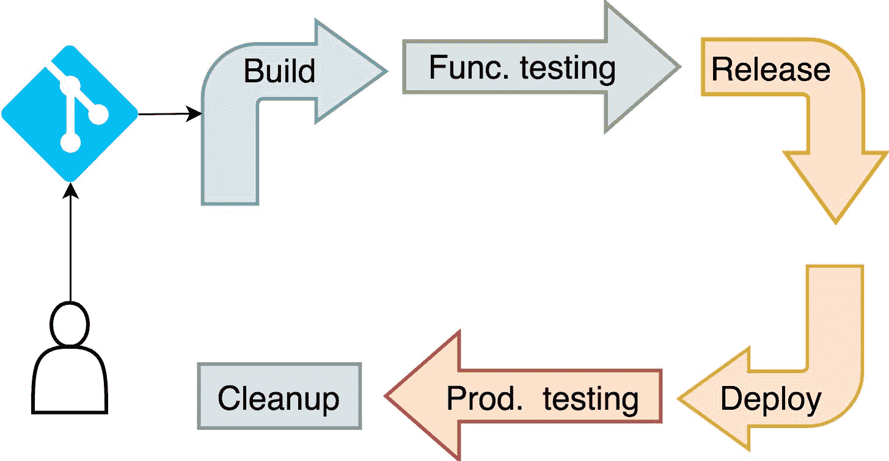
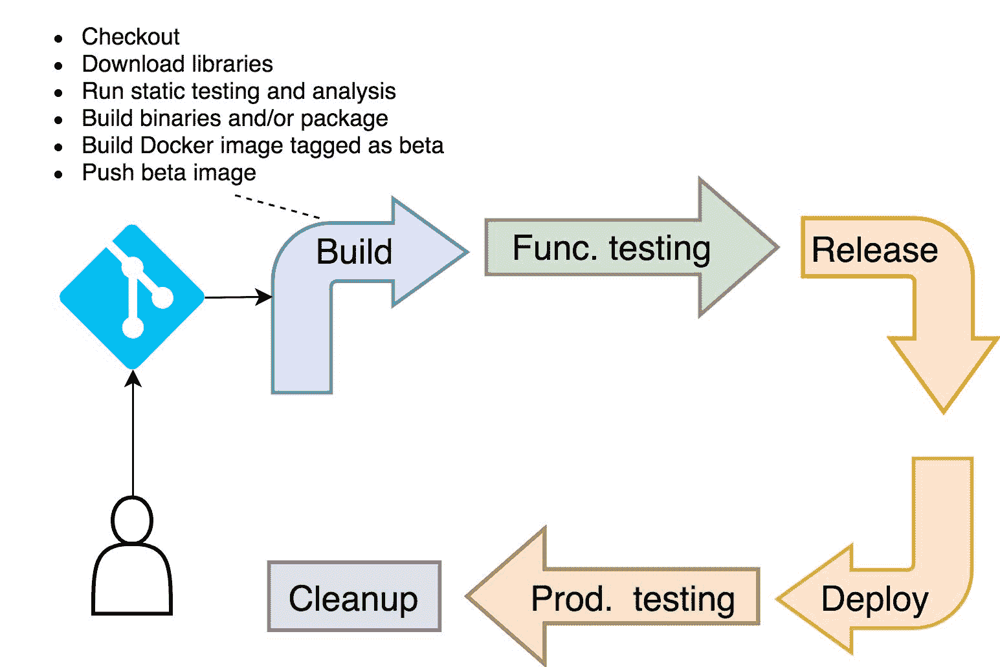
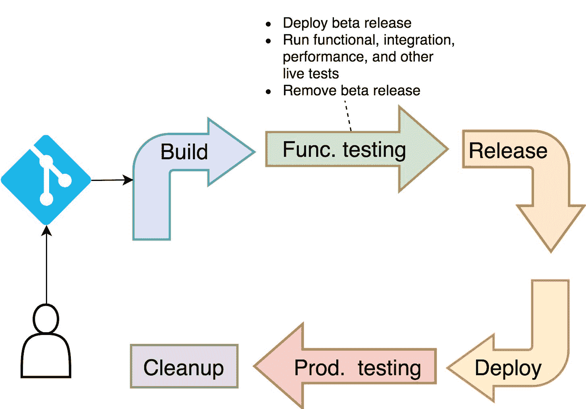
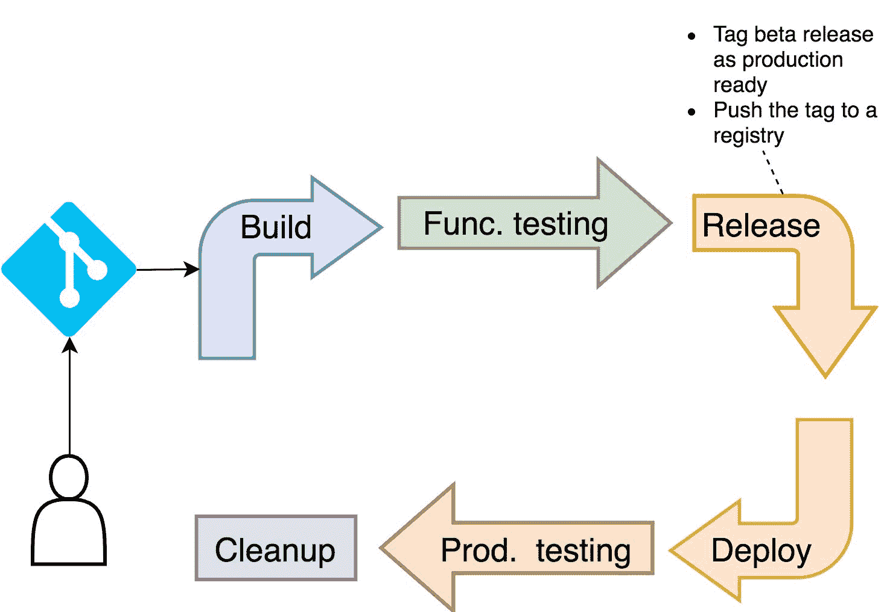
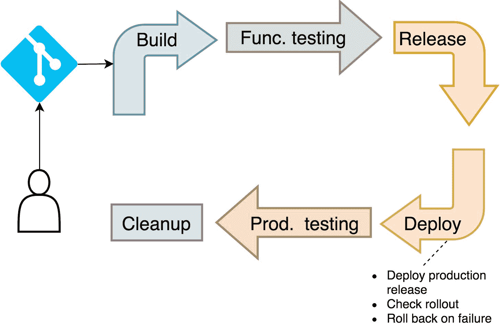
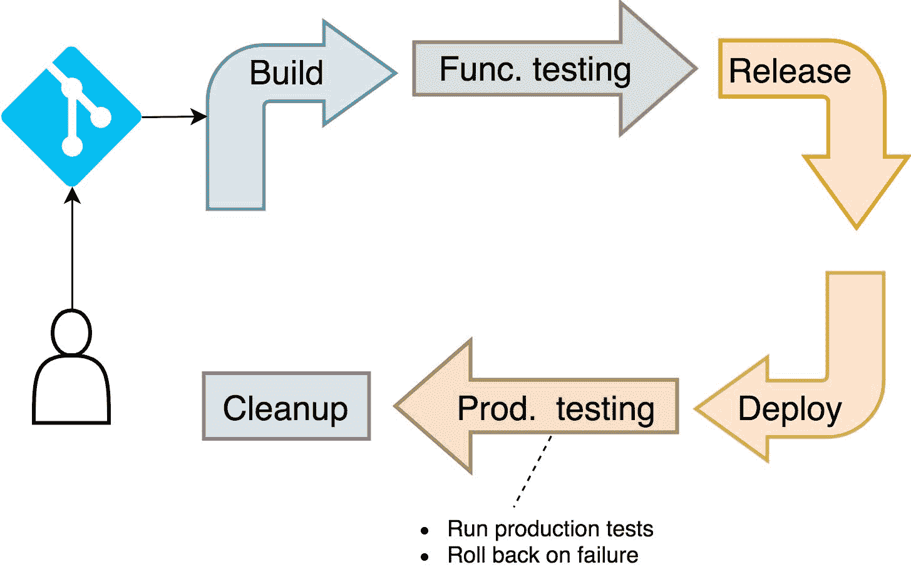

## 定义持续部署

我们应该能够从任何地方执行大部分 CDP 步骤。开发人员应该能够在本地的 Shell 中运行它们。其他人可能希望将它们集成到他们最喜欢的 IDE 中。所有或部分 CDP 步骤的执行方式可能非常多样。将它们作为每次提交的一部分运行只是其中的一种排列方式。我们执行 CDP 步骤的方式应该与定义它们的方式无关。如果我们增加了对非常高（如果不是完全）自动化的需求，很明显这些步骤必须是简单的命令或 Shell 脚本。向其中添加其他内容可能会导致紧耦合，从而限制我们在使用工具运行这些步骤时的独立性。

本章的目标是定义持续部署过程中可能需要的最少步骤。从那里开始，具体的步骤扩展将由你来完成，以满足你在项目中可能遇到的特定用例。

一旦我们知道应该做什么，我们将继续定义实现目标所需的命令。我们会尽力以一种方式来创建 CDP 步骤，使其能够轻松地移植到其他工具中。我们会尽量避免与工具绑定。总会有一些步骤是非常特定于我们使用的工具的，但我希望这些步骤仅限于搭建框架，而不是 CDP 的逻辑。

我们是否能完全实现我们的目标，还需要观察。现在，我们暂时忽略 Jenkins 以及所有可能用于编排持续部署过程的其他工具。相反，我们将专注于 Shell 和我们需要执行的命令。虽然我们可能会写一两个脚本。

### 是持续交付还是持续部署？

每个人都想实现持续交付或持续部署。毕竟，这些好处太显著，无法忽视。提高交付速度，提高质量，降低成本，解放人们的时间，让他们专注于创造价值的工作，等等。这些改进对任何决策者来说就像音乐，尤其是当那个人有商业背景时。如果一个技术极客能清晰地表达持续交付带来的好处，当他向业务代表请求预算时，回应几乎总是“是的！做吧。”

到现在为止，你可能已经对持续集成、持续交付和持续部署之间的区别感到困惑，所以我会尽力带你了解每个过程背后的主要目标。

如果你有一组自动化的流程，每次提交代码到代码库时都会执行这些流程，那么你就是在做持续集成（CI）。我们通过 CI 要实现的目标是，每次提交后，能够很快验证提交内容的有效性。我们不仅要知道我们所做的是否有效，还要知道它是否与我们同事的工作集成得很好。这就是为什么每个人都需要将代码合并到主分支，或者至少合并到其他公共分支上。我们如何命名分支不那么重要，重要的是我们分叉代码后的时间间隔不能太长，可能是几小时，甚至几天。如果我们延迟集成超过这个时间，我们就有可能花费太多时间在一些会破坏其他人工作的内容上。

持续集成的问题在于自动化的水平还不够高。我们对过程的信任度不够。我们觉得它带来了好处，但我们仍然需要第二次确认。我们需要人工确认机器执行过程的结果。

持续交付（CD）是持续集成的超集。它具有在每次提交时执行的完全自动化过程。如果过程中的任何一步没有失败，我们就会宣布该提交已准备好进入生产环境。

最后，持续部署（CDP）几乎与持续交付相同。过程中的所有步骤在这两种情况下都是完全自动化的。唯一的区别是“部署到生产”按钮不再存在。

尽管从过程的角度看，CD 和 CDP 几乎是相同的，但后者可能要求我们在开发应用程序的方式上进行一些改变。例如，我们可能需要开始使用功能切换，以允许我们禁用部分完成的功能。CDP 所需的大部分变更是本来就应该采纳的。然而，在 CDP 中，这种需求被提升到了更高的水平。

我们不会深入探讨在试图达到 CDP 理想状态之前，所需要实施的所有文化和开发方面的变更。那将是另一本书的内容，并且需要比我们目前的篇幅更多的空间。我甚至不会尝试说服你接受持续部署。确实有许多有效的案例表明 CDP 并不是一个好选择，更有许多情况下，CDP 在没有大规模的文化和技术变更（这些变更超出了 Kubernetes 的范畴）时，根本无法实现。从统计学角度讲，你很可能还没有准备好接受持续部署。

到这个时候，你可能会在想，继续阅读是否有意义。也许你确实还没有准备好进行持续部署，也许你认为这只是在浪费时间。如果是这样，我想告诉你的是，这没有关系。事实上，你已经拥有了一些 Kubernetes 的经验，这让我知道你并不是一个落后者。你选择了接受一种新的工作方式。你看到了分布式系统的好处，你也接受了那些在你刚开始时看起来肯定像是疯狂的东西。

如果你已经读到这里，说明你已经准备好学习和实践接下来的流程。你可能还没准备好进行持续部署。没关系，你可以先退回到持续交付。如果这对你来说也太复杂，你可以从持续集成开始。我之所以说这没关系，是因为大多数步骤在这些情况下都是相同的。无论你打算做 CI、CD 还是 CDP，你都必须构建一些东西，必须运行一些测试，并且必须将应用程序部署到某个地方。

从技术角度来看，无论我们是部署到本地集群、专门用于测试的集群，还是生产环境，都是一样的。部署到 Kubernetes 集群（无论其目的是什么）基本上是相同的。你可能选择拥有一个集群来处理所有的事情。那也是可以的。这就是为什么我们有命名空间。你可能不完全信任你的测试。但从一开始，这也不是问题，因为我们执行测试的方式在信任程度上并没有区别。我可以继续说下去，类似的观点还很多。真正重要的是，整个过程基本相同，不管你信任它的程度如何。信任是随着时间积累的。

本书的目标是教你如何将持续部署应用到 Kubernetes 集群中。什么时候你的专业技能、文化和代码准备好进行持续部署，这由你决定。我们将构建的流水线无论是用于 CI、CD，还是 CDP，应该都是一样的。只有一些参数可能会发生变化。

总的来说，第一个目标是定义我们的持续部署流程的基本步骤。执行这些步骤的工作，我们稍后再担心。

### 定义持续部署目标

持续部署流程相对容易解释，尽管实施可能会有些棘手。我们将把需求分成两组。我们将从讨论整个过程中应应用的总体目标开始。更精确地说，我们将讨论我认为是不可妥协的要求。

管道需要安全。通常，这不会是问题。在 Kubernetes 诞生之前，我们会在不同的服务器上运行管道步骤。一个专门用于构建，另一个用于测试。可能有一个用于集成，另一个用于性能测试。一旦我们采用容器调度器并迁移到集群中，我们就失去了对服务器的控制。尽管可以在特定服务器上运行某些东西，但在 Kubernetes 中强烈不建议这样做。我们应该让 Kubernetes 尽可能少地限制调度 Pods。这意味着我们的构建和测试可能会在生产集群中运行，这可能并不安全。如果不小心，恶意用户可能会利用共享空间。更有可能的是，我们的测试可能包含一个不希望出现的副作用，这可能会使生产应用面临风险。

我们可以创建独立的集群。一个可以专门用于生产，另一个用于其他所有用途。虽然这是我们应该探索的一个选项，但 Kubernetes 已经提供了我们需要的工具来确保集群安全。我们拥有 RBAC、ServiceAccounts、Namespaces、PodSecurityPolicies、NetworkPolicies 和其他一些资源。因此，我们可以共享同一个集群，并在确保合理安全的同时进行操作。

安全性不是唯一的要求。即使一切都已得到保障，我们仍然需要确保我们的管道不会对集群中运行的其他应用产生负面影响。如果不小心，测试可能会请求或使用过多的资源，结果可能导致集群中的其他应用和进程内存不足。幸运的是，Kubernetes 也为这些问题提供了解决方案。我们可以将命名空间（Namespaces）与限制范围（LimitRanges）和资源配额（ResourceQuotas）结合使用。虽然它们不能完全保证不会出问题（没有什么是绝对的），但它们确实提供了一套工具，当正确使用时，可以合理保证命名空间中的进程不会“失控”。

我们的管道应该快速。如果执行时间过长，我们可能会被迫在管道执行完成之前开始处理新功能。如果管道执行失败，我们将不得不决定是停止处理新功能并承受上下文切换的代价，还是忽略这个问题直到有时间处理它。虽然这两种情况都不好，但后者最糟糕，应该尽量避免。失败的管道必须拥有最高优先级。否则，如果处理问题只是一个最终任务，那么自动化和持续过程的意义何在呢？

问题在于，我们通常无法独立完成这些目标。我们可能会被迫做出取舍。安全性通常与速度发生冲突，我们可能需要在两者之间找到平衡。

最后，最重要的目标，那是所有目标之上的目标，就是我们的持续部署管道必须在每次提交到主分支时执行。这将提供关于系统准备情况的持续反馈，并且在某种程度上，它将迫使人们经常将代码合并到主分支。当我们创建一个分支时，除非它回到主分支，或者无论哪个是生产就绪分支的名称，否则它是不存在的。合并的时间越长，我们的代码与同事工作的集成问题就越大。

既然我们已经理清了高层次的目标，现在应该将重点转向管道应该包含的具体步骤。

### 定义持续部署步骤

我们将尝试定义任何持续部署管道应该执行的最小步骤集。不要把它们当作字面意思来理解。每个公司不同，每个项目都有其特殊之处。你可能需要扩展这些步骤以适应你们特定的需求。然而，这不应该是问题。一旦我们掌握了那些强制执行的步骤，扩展过程应该相对简单，除非你需要与没有明确 API 或良好 CLI 的工具交互。如果是这种情况，我的建议是放弃这些工具，它们不值得我们忍受它们常常带来的折磨。

我们可以将管道分成几个阶段。我们需要*构建*工件（在运行静态测试和分析之后）。我们必须运行*功能测试*，因为单元测试是不够的。我们需要创建一个*发布*并将其*部署*到某个地方（希望是生产环境）。无论我们多么信任早期的阶段，我们确实需要运行测试以验证部署（到生产环境）是否成功。最后，我们需要在流程结束时进行清理，移除所有为管道创建的进程。将它们闲置运行是没有意义的。

总的来说，阶段如下。

+   构建阶段

+   功能测试阶段

+   发布阶段

+   部署阶段

+   生产测试阶段

+   清理阶段

计划是这样的。在构建阶段，我们将构建一个 Docker 镜像并推送到注册表（在我们的案例中是 Docker Hub）。然而，由于应该停止构建未经测试的工件，我们将在实际构建之前运行静态测试。一旦我们的 Docker 镜像被推送，我们将部署应用程序并对其进行测试。如果一切按预期工作，我们将发布一个新版本并将其部署到生产环境。为了安全起见，我们将再进行一轮测试，以验证部署是否在生产环境中确实成功。最后，我们将通过移除除生产版本之外的所有内容来清理系统。



图 3-1：持续部署管道的各个阶段

我们稍后将讨论每个阶段的步骤。现在，我们需要一个集群，用于实际操作练习，帮助我们更好地理解我们稍后要构建的管道。如果我们手动执行的步骤成功，那么编写管道脚本应该相对简单。

### 创建集群

我们将通过回到本地的`vfarcic/k8s-specs`仓库并拉取最新版本来开始实际操作部分。

```
`1` `cd` k8s-specs
`2` 
`3` git pull 
```

`````````````````````````````````````````````````````` Just as in the previous chapters, we’ll need a cluster if we are to do the hands-on exercises. The rules are still the same. You can continue using the same cluster as before, or you can switch to a different Kubernetes flavor. You can continue using one of the Kubernetes distributions listed below, or be adventurous and try something different. If you go with the latter, please let me know how it went, and I’ll test it myself and incorporate it into the list.    The Gists with the commands I used to create different variations of Kubernetes clusters are as follows.    *   [docker4mac-3cpu.sh](https://gist.github.com/bf08bce43a26c7299b6bd365037eb074): **Docker for Mac** with 3 CPUs, 3 GB RAM, and with **nginx Ingress**. *   [minikube-3cpu.sh](https://gist.github.com/871b5d7742ea6c10469812018c308798): **minikube** with 3 CPUs, 3 GB RAM, and with `ingress`, `storage-provisioner`, and `default-storageclass` addons enabled. *   [kops.sh](https://gist.github.com/2a3e4ee9cb86d4a5a65cd3e4397f48fd): **kops in AWS** with 3 t2.small masters and 2 t2.medium nodes spread in three availability zones, and with **nginx Ingress** (assumes that the prerequisites are set through Appendix B). *   [minishift-3cpu.sh](https://gist.github.com/2074633688a85ef3f887769b726066df): **minishift** with 3 CPUs, 3 GB RAM, and version 1.16+. *   [gke-2cpu.sh](https://gist.github.com/e3a2be59b0294438707b6b48adeb1a68): **Google Kubernetes Engine (GKE)** with 3 n1-highcpu-2 (2 CPUs, 1.8 GB RAM) nodes (one in each zone), and with **nginx Ingress** controller running on top of the “standard” one that comes with GKE. We’ll use nginx Ingress for compatibility with other platforms. Feel free to modify the YAML files if you prefer NOT to install nginx Ingress. *   [eks.sh](https://gist.github.com/5496f79a3886be794cc317c6f8dd7083): **Elastic Kubernetes Service (EKS)** with 2 t2.medium nodes, with **nginx Ingress** controller, and with a **default StorageClass**.    Now that we have a cluster, we can move into a more exciting part of this chapter. We’ll start defining and executing stages and steps of a continuous deployment pipeline.    ### Creating Namespaces Dedicated To Continuous Deployment Processes    If we are to accomplish a reasonable level of security of our pipelines, we need to run them in dedicated Namespaces. Our cluster already has RBAC enabled, so we’ll need a ServiceAccount as well. Since security alone is not enough, we also need to make sure that our pipeline does not affect other applications. We’ll accomplish that by creating a LimitRange and a ResourceQuota.    I believe that in most cases we should store everything an application needs in the same repository. That makes maintenance much simpler and enables the team in charge of that application to be in full control, even though that team might not have all the permissions to create the resources in a cluster.    We’ll continue using `go-demo-3` repository but, since we’ll have to change a few things, it is better if you apply the changes to your fork and, maybe, push them back to GitHub.    ``` `1` open `"https://github.com/vfarcic/go-demo-3"`  ```   ````````````````````````````````````````````````````` If you’re not familiar with GitHub, all you have to do is to log in and click the *Fork* button located in the top-right corner of the screen.    Next, we’ll remove the `go-demo-3` repository (if you happen to have it) and clone the fork.    Make sure that you replace `[...]` with your GitHub username.    ``` `1` `cd` .. `2`  `3` rm -rf go-demo-3 `4`  `5` `export` `GH_USER``=[`...`]` `6`  `7` git clone https://github.com/`$GH_USER`/go-demo-3.git `8`  `9` `cd` go-demo-3  ```   ```````````````````````````````````````````````````` The only thing left is to edit a few files. Please open *k8s/build.yml* and *k8s/prod.yml* files in your favorite editor and change all occurrences of `vfarcic` with your Docker Hub user.    The namespace dedicated for all building and testing activities of the `go-demo-3` project is defined in the `k8s/build-ns.yml` file stored in the project repository.    ``` `1` git pull `2`  `3` cat k8s/build-ns.yml  ```   ``````````````````````````````````````````````````` The output is as follows.    ```  `1` `apiVersion``:` `v1`  `2` `kind``:` `Namespace`  `3` `metadata``:`  `4`  `name``:` `go-demo-3-build`  `5`   `6` `---`  `7`   `8` `apiVersion``:` `v1`  `9` `kind``:` `ServiceAccount` `10` `metadata``:` `11 `  `name``:` `build` `12 `  `namespace``:` `go-demo-3-build` `13`  `14` `---` `15`  `16` `apiVersion``:` `rbac.authorization.k8s.io/v1beta1` `17` `kind``:` `RoleBinding` `18` `metadata``:` `19 `  `name``:` `build` `20 `  `namespace``:` `go-demo-3-build` `21` `roleRef``:` `22 `  `apiGroup``:` `rbac.authorization.k8s.io` `23 `  `kind``:` `ClusterRole` `24 `  `name``:` `admin` `25` `subjects``:` `26` `-` `kind``:` `ServiceAccount` `27 `  `name``:` `build` `28`  `29` `---` `30`  `31` `apiVersion``:` `v1` `32` `kind``:` `LimitRange` `33` `metadata``:` `34 `  `name``:` `build` `35 `  `namespace``:` `go-demo-3-build` `36` `spec``:` `37 `  `limits``:` `38 `  `-` `default``:` `39 `      `memory``:` `200Mi` `40 `      `cpu``:` `0.2` `41 `    `defaultRequest``:` `42 `      `memory``:` `100Mi` `43 `      `cpu``:` `0.1` `44 `    `max``:` `45 `      `memory``:` `500Mi` `46 `      `cpu``:` `0.5` `47 `    `min``:` `48 `      `memory``:` `10Mi` `49 `      `cpu``:` `0.05` `50 `    `type``:` `Container` `51`  `52` `---` `53`  `54` `apiVersion``:` `v1` `55` `kind``:` `ResourceQuota` `56` `metadata``:` `57 `  `name``:` `build` `58 `  `namespace``:` `go-demo-3-build` `59` `spec``:` `60 `  `hard``:` `61 `    `requests.cpu``:` `2` `62 `    `requests.memory``:` `3Gi` `63 `    `limits.cpu``:` `3` `64 `    `limits.memory``:` `4Gi` `65 `    `pods``:` `15`  ```   `````````````````````````````````````````````````` If you are familiar with Namespaces, ServiceAccounts, LimitRanges, and ResourceQuotas, the definition should be fairly easy to understand.    We defined the `go-demo-3-build` Namespace which we’ll use for all our CDP tasks. It’ll contain the ServiceAccount `build` bound to the ClusterRole `admin`. As a result, containers running inside that Namespace will be able to do anything they want. It’ll be their playground.    We also defined the LimitRange named `build`. It’ll make sure to give sensible defaults to the Pods that running in the Namespace. That way we can create Pods from which we’ll build and test without worrying whether we forgot to specify resources they need. After all, most of us do not know how much memory and CPU a build needs. The same LimitRange also contains some minimum and maximum limits that should prevent users from specifying too small or too big resource reservations and limits.    Finally, since the capacity of our cluster is probably not unlimited, we defined a ResourceQuota that specifies the total amount of memory and CPU for requests and limits in that Namespace. We also defined that the maximum number of Pods running in that Namespace cannot be higher than fifteen.    If we do have more Pods than what we can place in that Namespace, some will be pending until others finish their work and resources are liberated.    It is very likely that the team behind the project will not have sufficient permissions to create new Namespaces. If that’s the case, the team would need to let cluster administrator know about the existence of that YAML. In turn, he (or she) would review the definition and create the resources, once he (or she) deduces that they are safe. For the sake of simplicity, you are that person, so please execute the command that follows.    ``` `1` kubectl apply `\` `2 `    -f k8s/build-ns.yml `\` `3 `    --record  ```   ````````````````````````````````````````````````` As you can see from the output, the `go-demo-3-build` Namespace was created together with a few other resources.    Now that we have a Namespace dedicated to the lifecycle of our application, we’ll create another one that to our production release.    ``` `1` cat k8s/prod-ns.yml  ```   ```````````````````````````````````````````````` The `go-demo-3` Namespace is very similar to `go-demo-3-build`. The major difference is in the RoleBinding. Since we can assume that processes running in the `go-demo-3-build` Namespace will, at some moment, want to deploy a release to production, we created the RoleBinding `build` which binds to the ServiceAccount `build` in the Namespace `go-demo-3-build`.    We’ll `apply` this definition while still keeping our cluster administrator’s hat.    ``` `1` kubectl apply `\` `2 `    -f k8s/prod-ns.yml `\` `3 `    --record  ```   ``````````````````````````````````````````````` Now we have two Namespaces dedicated to the `go-demo-3` application. We are yet to figure out which tools we’ll need for our continuous deployment pipeline.    ### Defining A Pod With The Tools    Every application is different, and the tools we need for a continuous deployment pipeline vary from one case to another. For now, we’ll focus on those we’ll need for our *go-demo-3* application.    Since the application is written in Go, we’ll need `golang` image to download the dependencies and run the tests. We’ll have to build Docker images, so we should probably add a `docker` container as well. Finally, we’ll have to execute quite a few `kubectl` commands. For those of you using OpenShift, we’ll need `oc` as well. All in all, we need a Pod with `golang`, `docker`, `kubectl`, and (for some of you) `oc`.    The *go-demo-3* repository already contains a definition of a Pod with all those containers, so let’s take a closer look at it.    ``` `1` cat k8s/cd.yml  ```   `````````````````````````````````````````````` The output is as follows.    ```  `1` `apiVersion``:` `v1`  `2` `kind``:` `Pod`  `3` `metadata``:`  `4`  `name``:` `cd`  `5`  `namespace``:` `go-demo-3-build`  `6` `spec``:`  `7`  `containers``:`  `8`  `-` `name``:` `docker`  `9`    `image``:` `docker:18.03-git` `10 `    `command``:` `[``"sleep"``]` `11 `    `args``:` `[``"100000"``]` `12 `    `volumeMounts``:` `13 `    `-` `name``:` `workspace` `14 `      `mountPath``:` `/workspace` `15 `    `-` `name``:` `docker-socket` `16 `      `mountPath``:` `/var/run/docker.sock` `17 `    `workingDir``:` `/workspace` `18 `  `-` `name``:` `kubectl` `19 `    `image``:` `vfarcic/kubectl` `20 `    `command``:` `[``"sleep"``]` `21 `    `args``:` `[``"100000"``]` `22 `    `volumeMounts``:` `23 `    `-` `name``:` `workspace` `24 `      `mountPath``:` `/workspace` `25 `    `workingDir``:` `/workspace` `26 `  `-` `name``:` `oc` `27 `    `image``:` `vfarcic/openshift-client` `28 `    `command``:` `[``"sleep"``]` `29 `    `args``:` `[``"100000"``]` `30 `    `volumeMounts``:` `31 `    `-` `name``:` `workspace` `32 `      `mountPath``:` `/workspace` `33 `    `workingDir``:` `/workspace` `34 `  `-` `name``:` `golang` `35 `    `image``:` `golang:1.9` `36 `    `command``:` `[``"sleep"``]` `37 `    `args``:` `[``"100000"``]` `38 `    `volumeMounts``:` `39 `    `-` `name``:` `workspace` `40 `      `mountPath``:` `/workspace` `41 `    `workingDir``:` `/workspace` `42 `  `serviceAccount``:` `build` `43 `  `volumes``:` `44 `  `-` `name``:` `docker-socket` `45 `    `hostPath``:` `46 `      `path``:` `/var/run/docker.sock` `47 `      `type``:` `Socket` `48 `  `-` `name``:` `workspace` `49 `    `emptyDir``:` `{}`  ```   ````````````````````````````````````````````` Most of the YAML defines the containers based on images that contain the tools we need. What makes it special is that all the containers have the same mount called `workspace`. It maps to `/workspace` directory inside containers, and it uses `emptyDir` volume type.    We’ll accomplish two things with those volumes. On the one hand, all the containers will have a shared space so the artifacts generated through the actions we will perform in one will be available in the other. On the other hand, since `emptyDir` volume type exists only just as long as the Pod is running, it’ll be deleted when we remove the Pod. As a result, we won’t be leaving unnecessary garbage on our nodes or external drives.    To simplify the things and save us from typing `cd /workspace`, we set `workingDir` to all the containers.    Unlike most of the other Pods we usually run in our clusters, those dedicated to CDP processes are short lived. They are not supposed to exist for a long time nor should they leave any trace of their existence once they finish executing the steps we are about to define.    The ability to run multiple containers on the same node and with a shared file system and networking will be invaluable in our quest to define continuous deployment processes. If you were ever wondering what the purpose of having Pods as entities that envelop multiple containers is, the steps we are about to explore will hopefully provide a perfect use-case.    Let’s create the Pod.    ``` `1` kubectl apply -f k8s/cd.yml --record  ```   ```````````````````````````````````````````` Pleases confirm that all the containers of the Pod are up and running by executing `kubectl -n go-demo-3-build get pods`. You should see that `4/4` are `ready`.    Now we can start working on our continuous deployment pipeline steps.    ### Executing Continuous Integration Inside Containers    The first stage in our continuous deployment pipeline will contain quite a few steps. We’ll need to check out the code, to run unit tests and any other static analysis, to build a Docker image, and to push it to the registry. If we define continuous integration (CI) as a set of automated steps followed with manual operations and validations, we can say that the steps we are about to execute can be qualified as CI.    The only thing we truly need to make all those steps work is Docker client with the access to Docker server. One of the containers of the `cd` Pod already contains it. If you take another look at the definition, you’ll see that we are mounting Docker socket so that the Docker client inside the container can issue commands to Docker server running on the host. Otherwise, we would be running Docker-in-Docker, and that is not a very good idea.    Now we can enter the `docker` container and check whether Docker client can indeed communicate with the server.    ``` `1` kubectl -n go-demo-3-build `\` `2 `    `exec` -it `cd` -c docker -- sh `3`  `4` docker container ls  ```   ``````````````````````````````````````````` Once inside the `docker` container, we executed `docker container ls` only as a proof that we are using a client inside the container which, in turn, uses Docker server running on the node. The output is the list of the containers running on top of one of our servers.    Let’s get moving and execute the first step.    We cannot do much without the code of our application, so the first step is to clone the repository.    Make sure that you replace `[...]` with your GitHub username in the command that follows.    ``` `1` `export` `GH_USER``=[`...`]` `2`  `3` git clone `\` `4 `    https://github.com/`$GH_USER`/go-demo-3.git `\` `5 `    .  ```   `````````````````````````````````````````` We cloned the repository into the `workspace` directory. That is the same folder we mounted as an `emptyDir` volume and is, therefore, available in all the containers of the `cd` Pod. Since that folder is set as `workingDir` of the container, we did not need to `cd` into it.    Please note that we cloned the whole repository and, as a result, we are having a local copy of the HEAD commit of the master branch. If this were a “real” pipeline, such a strategy would be unacceptable. Instead, we should have checked out a specific branch and a commit that initiated the process. However, we’ll ignore those details for now, and assume that we’ll solve them when we move the pipeline steps into Jenkins and other tools.    Next, we’ll build an image and push it to Docker Hub. To do that, we’ll need to login first.    Make sure that you replace `[...]` with your Docker Hub username in the command that follows.    ``` `1` `export` `DH_USER``=[`...`]` `2`  `3` docker login -u `$DH_USER`  ```   ````````````````````````````````````````` Once you enter your password, you should see the `Login Succeeded` message.    We are about to execute the most critical step of this stage. We’ll build an image.    At this moment you might be freaking out. You might be thinking that I went insane. A Pastafarian and a firm believer that nothing should be built without running tests first just told you to build an image as the first step after cloning the code. Sacrilege!    However, this Dockerfile is special, so let’s take a look at it.    ``` `1` cat Dockerfile  ```   ```````````````````````````````````````` The output is as follows.    ```  `1` FROM golang:1.9 AS build  `2` ADD . /src  `3` WORKDIR /src  `4` RUN go get -d -v -t  `5` RUN go test --cover -v ./... --run UnitTest  `6` RUN go build -v -o go-demo  `7`   `8`   `9` FROM alpine:3.4 `10` MAINTAINER 	Viktor Farcic <viktor@farcic.com> `11` RUN mkdir /lib64 && ln -s /lib/libc.musl-x86_64.so.1 /lib64/ld-linux-x86-64.so.2 `12` EXPOSE 8080 `13` ENV DB db `14` CMD ["go-demo"] `15` COPY --from=build /src/go-demo /usr/local/bin/go-demo `16` RUN chmod +x /usr/local/bin/go-demo  ```   ``````````````````````````````````````` Normally, we’d run a container, in this case, based on the `golang` image, execute a few processes, store the binary into a directory that was mounted as a volume, exit the container, and build a new image using the binary created earlier. While that would work fairly well, multi-stage builds allow us to streamline the processes into a single `docker image build` command.    If you’re not following Docker releases closely, you might be wondering what a multi-stage build is. It is a feature introduced in Docker 17.05 that allows us to specify multiple `FROM` statements in a Dockerfile. Each `FROM` instruction can use a different base, and each starts a new stage of the build process. Only the image created with the last `FROM` segment is kept. As a result, we can specify all the steps we need to execute before building the image without increasing its size.    In our example, we need to execute a few Go commands that will download all the dependencies, run unit tests, and compile a binary. Therefore, we specified `golang` as the base image followed with the `RUN` instruction that does all the heavy lifting. Please note that the first `FROM` statement is named `build`. We’ll see why that matters soon.    Further down, we start over with a new `FROM` section that uses `alpine`. It is a very minimalist linux distribution (a few MB in size) that guarantees that our final image is minimal and is not cluttered with unnecessary tools that are typically used in “traditional” Linux distros like `ubuntu`, `debian`, and `centos`. Further down we are creating everything our application needs, like the `DB` environment variable used by the code to know where the database is, the command that should be executed when a container starts, and so on. The critical part is the `COPY` statement. It copies the binary we created in the `build` stage into the final image.    Let’s build the image.    ``` `1` docker image build `\` `2 `    -t `$DH_USER`/go-demo-3:1.0-beta `\` `3 `    .  ```   `````````````````````````````````````` We can see from the output that the steps of our multi-stage build were executed. We downloaded the dependencies, run unit tests, and built the `go-demo` binary. All those things were temporary, and we do not need them in the final image. There’s no need to have a Go compiler, nor to keep the code. Therefore, once the first stage was finished, we can see the message *Removing intermediate container*. Everything was discarded. We started over, and we built the production-ready image with the binary generated in the previous stage.    We have the whole continuous integration process reduced to a single command. Developers can run it on their laptops, and CI/CD tools can use it as part of their extended processes. Isn’t that neat?    Let’s take a quick look at the images on the node.    ``` `1` docker image ls  ```   ````````````````````````````````````` The output, limited to the relevant parts, is as follows.    ``` `1` REPOSITORY        TAG      IMAGE ID CREATED            SIZE `2` vfarcic/go-demo-3 1.0-beta ...      54 seconds ago     25.8MB `3` <none>            <none>   ...      About a minute ago 779MB `4` ...  ```   ```````````````````````````````````` The first two images are the result of our build. The final image (`vfarcic/go-demo-3`) is only 25 MB. It’s that small because Docker discarded all but the last stage. If you’d like to know how big your image would be if everything was built in a single stage, please combine the size of the `vfarcic/go-demo-3` image with the size of the temporary image used in the first stage (it’s just below `vfarcic/go-demo-3 1.0-beta`).    The only thing missing is to push the image to the registry (e.g., Docker Hub).    ``` `1` docker image push `\` `2 `    `$DH_USER`/go-demo-3:1.0-beta  ```   ``````````````````````````````````` The image is in the registry and ready for further deployments and testing. Mission accomplished. We’re doing continuous integration manually. If we’d place those few commands into a CI/CD tool, we would have the first part of the process up and running.    Figure 3-2: The build stage of a continuous deployment pipeline    We are still facing a few problems. Docker running in a Kubernetes cluster might be too old. It might not support all the features we need. As an example, most of the Kubernetes distributions before 1.10 supported Docker versions older than 17.05\. If that’s not enough, consider the possibility that you might not even use Docker in a Kubernetes cluster. It is very likely that ContainerD will be the preferable container engine in the future, and that is only one of many choices we can select. The point is that container engine in a Kubernetes cluster should be in charge of running container, and not much more. There should be no need for the nodes in a Kubernetes cluster to be able to build images.    Another issue is security. If we allow containers to mount Docker socket, we are effectively allowing them to control all the containers running on that node. That by itself makes security departments freak out, and for a very good reason. Also, don’t forget that we logged into the registry. Anyone on that node could push images to the same registry without the need for credentials. Even if we do log out, there was still a period when everyone could exploit the fact that Docker server is authenticated and authorized to push images.    Truth be told, **we are not preventing anyone from mounting a Docker socket**. At the moment, our policy is based on trust. That should change with PodSecurityPolicy. However, security is not the focus of this book, so I’ll assume that you’ll set up the policies yourself, if you deem them worthy of your time.    If that’s not enough, there’s also the issue of preventing Kubernetes to do its job. The moment we adopt container schedulers, we accept that they are in charge of scheduling all the processes running inside the cluster. If we start doing things behind their backs, we might end up messing with their scheduling capabilities. Everything we do without going through Kube API is unknown to Kubernetes.    We could use Docker inside Docker. That would allow us to build images inside containers without reaching out to Docker socket on the nodes. However, that requires privileged access which poses as much of a security risk as mounting a Docker socket. Actually, it is even riskier. So, we need to discard that option as well.    Another solution might be to use [kaniko](https://github.com/GoogleContainerTools/kaniko). It allows us to build Docker images from inside Pods. The process is done without Docker so there is no dependency on Docker socket nor there is a need to run containers in privileged mode. However, at the time of this writing (May 2018) *kaniko* is still not ready. It is complicated to use, and it does not support everything Docker does (e.g., multi-stage builds), it’s not easy to decipher its logs (especially errors), and so on. The project will likely have a bright future, but it is still not ready for prime time.    Taking all this into consideration, the only viable option we have, for now, is to build our Docker images outside our cluster. The steps we should execute are the same as those we already run. The only thing missing is to figure out how to create a build server and hook it up to our CI/CD tool. We’ll revisit this subject later on.    For now, we’ll exit the container.    ``` `1` `exit`  ```   `````````````````````````````````` Let’s move onto the next stage of our pipeline.    ### Running Functional Tests    Which steps do we need to execute in the functional testing phase? We need to deploy the new release of the application. Without it, there would be nothing to test. All the static tests were already executed when we built the image, so everything we do from now on will need a live application.    Deploying the application is not enough, we’ll have to validate that at least it rolled out successfully. Otherwise, we’ll have to abort the process.    We’ll have to be cautious how we deploy the new release. Since we’ll run it in the same cluster as production, we need to be careful that one does not affect the other. We already have a Namespace that provides some level of isolation. However, we’ll have to be attentive not to use the same path or domain in Ingress as the one used for production. The two need to be accessible separately from each other until we are confident that the new release meets all the quality standards.    Finally, once the new release is running, we’ll execute a set of tests that will validate it. Please note that we will run functional tests only. You should translate that into “in this stage, I run all kinds of tests that require a live application.” You might want to add performance and integration tests as well. From the process point of view, it does not matter which tests you run. What matters is that in this stage you run all those that could not be executed statically when we built the image.    If any step in this stage fails, we need to be prepared to destroy everything we did and leave the cluster in the same state as before we started this stage. We’ll postpone exploration of rollback steps until one of the next chapters. I’m sure you know how to do it anyway. If you don’t, I’ll leave you feeling ashamed until the next chapter.    As you probably guessed, we’ll need to go into the `kubectl` container for at least some of the steps in this stage. It is already running as part of the `cd` Pod.    Remember, we are performing a manual simulation of a CDP pipeline. We must assume that everything will be executed from inside the cluster, not from your laptop.    ``` `1` kubectl -n go-demo-3-build `\` `2 `    `exec` -it `cd` -c kubectl -- sh  ```   ````````````````````````````````` The project contains separate definitions for deploying test and production releases. For now, we are interested only in prior which is defined in `k8s/build.yml`.    ``` `1` cat k8s/build.yml  ```   ```````````````````````````````` We won’t comment on all the resources defined in that YAML since they are very similar to those we used before. Instead, we’ll take a quick look at the differences between a test and a production release.    ``` `1` diff k8s/build.yml k8s/prod.yml  ```   ``````````````````````````````` The two are almost the same. One is using `go-demo-3-build` Namespace while the other works with `go-demo-3`. The `path` of the Ingress resource also differs. Non-production releases will be accessible through `/beta/demo` and thus provide separation from the production release accessible through `/demo`. Everything else is the same.    It’s a pity that we had to create two separate YAML files only because of a few differences (Namespace and Ingress). We’ll discuss the challenges behind rapid deployments using standard YAML files later. For now, we’ll roll with what we have.    Even though we separated production and non-production releases, we still need to modify the tag of the image on the fly. The alternative would be to change release numbers with each commit, but that would represent a burden to developers and a likely source of errors. So, we’ll go back to exercising “magic” with `sed`.    ``` `1` cat k8s/build.yml `|` sed -e `\` `2 `    `"s@:latest@:1.0-beta@g"` `|` `\` `3 `    tee /tmp/build.yml  ```   `````````````````````````````` We output the contents of the `/k8s/build.yml` file, we modified it with `sed` so that the `1.0-beta` tag is used instead of the `latest`, and we stored the output in `/tmp/build.yml`.    Now we can deploy the new release.    ``` `1` kubectl apply `\` `2 `    -f /tmp/build.yml --record `3`  `4` kubectl rollout status deployment api  ```   ````````````````````````````` We applied the new definition and waited until it rolled out.    Even though we know that the rollout was successful by reading the output, we cannot rely on such methods when we switch to full automation of the pipeline. Fortunately, the `rollout status` command will exit with `0` if everything is OK, and with a different code if it’s not.    Let’s check the exit code of the last command.    ``` `1` `echo` `$?`  ```   ```````````````````````````` The output is `0` thus confirming that the rollout was successful. If it was anything else, we’d need to roll back or, even better, quickly fix the problem and roll forward.    The only thing missing in this stage is to run the tests. However, before we do that, we need to find out the address through which the application can be accessed.    ``` `1` `ADDR``=``$(`kubectl -n go-demo-3-build `\` `2 `    get ing api `\` `3 `    -o `jsonpath``=``"{.status.loadBalancer.ingress[0].hostname}"``)`/beta `4`  `5` `echo` `$ADDR` `|` tee /workspace/addr `6`  `7` `exit`  ```   ``````````````````````````` We retrieved the `hostname` from Ingress with the appended path (`/beta`) dedicated to beta releases. Further on, we stored the result in the `/workspace/addr` file. That way we’ll be able to retrieve it from other containers running in the same Pod. Finally, we exited the container since the next steps will require a different one.    Let’s go inside the `golang` container. We’ll need it to execute functional tests.    ``` `1` kubectl -n go-demo-3-build `\` `2 `    `exec` -it `cd` -c golang -- sh  ```   `````````````````````````` Before we run the functional tests, we’ll send a request to the application manually. That will give us confidence that everything we did so far works as expected.    ``` `1` curl `"http://``$(`cat addr`)``/demo/hello"`  ```   ````````````````````````` We constructed the address using the information we stored in the `addr` file and sent a `curl` request. The output is `hello, world!`, thus confirming that the test release of application seems to be deployed correctly.    The tests require a few dependencies, so we’ll download them using the `go get` command. Don’t worry if you’re new to Go. This exercise is not aimed at teaching you how to work with it, but only to show you the principles that apply to almost any language. In your head, you can replace the command that follows with `maven` this, `gradle` that, `npm` whatever.    ``` `1` go get -d -v -t  ```   ```````````````````````` The tests expect the environment variable `ADDRESS` to tell them where to find the application under test, so our next step is to declare it.    ``` `1` `export` `ADDRESS``=`api:8080  ```   ``````````````````````` In this case, we chose to allow the tests to communicate with the application through the service called `api`.    Now we’re ready to execute the tests.    ``` `1` go `test` ./... -v --run FunctionalTest  ```   `````````````````````` The output is as follows.    ```  `1` === RUN   TestFunctionalTestSuite  `2` === RUN   TestFunctionalTestSuite/Test_Hello_ReturnsStatus200  `3` 2018/05/14 14:41:25 Sending a request to http://api:8080/demo/hello  `4` === RUN   TestFunctionalTestSuite/Test_Person_ReturnsStatus200  `5` 2018/05/14 14:41:25 Sending a request to http://api:8080/demo/person  `6` --- PASS: TestFunctionalTestSuite (0.03s)  `7`    --- PASS: TestFunctionalTestSuite/Test_Hello_ReturnsStatus200 (0.01s)  `8`    --- PASS: TestFunctionalTestSuite/Test_Person_ReturnsStatus200 (0.01s)  `9` PASS `10` ok      _/go/go-demo-3  0.129s  ```   ````````````````````` We can see that the tests passed and we can conclude that the application is a step closer towards production. In a real-world situation, you’d run other types of tests or maybe bundle them all together. The logic is still the same. We deployed the application under test while leaving production intact, and we validated that it behaves as expected. We are ready to move on.    Testing an application through the service associated with it is a good idea,if for some reason we are not allowed to expose it to the outside world through Ingress. If there is no such restriction, executing the tests through a DNS which points to an external load balancer, which forwards to the Ingress service on one of the worker nodes, and from there load balances to one of the replicas, is much closer to how our users access the application. Using the “real” externally accessible address is a better option when that is possible, so we’ll change our `ADDRESS` variable and execute the tests one more time.    ``` `1` `export` `ADDRESS``=``$(`cat addr`)` `2`  `3` go `test` ./... -v --run FunctionalTest  ```   ```````````````````` We’re almost finished with this stage. The only thing left is to exit the `golang` container, go back to `kubectl`, and remove the application under test.    ``` `1` `exit` `2`  `3` kubectl -n go-demo-3-build `\` `4 `    `exec` -it `cd` -c kubectl -- sh `5`  `6` kubectl delete `\` `7 `    -f /workspace/k8s/build.yml  ```   ``````````````````` We exited the `golang` container and entered into `kubectl` to delete the test release.    Figure 3-3: The functional testing stage of a continuous deployment pipeline    Let’s take a look at what’s left in the Namespace.    ``` `1` kubectl -n go-demo-3-build get all  ```   `````````````````` The output is as follows.    ``` `1` NAME  READY STATUS  RESTARTS AGE `2` po/cd 4/4   Running 0        11m  ```   ````````````````` Our `cd` Pod is still running. We will remove it later when we’re confident that we don’t need any of the tools it contains.    There’s no need for us to stay inside the `kubectl` container anymore, so we’ll exit.    ``` `1` `exit`  ```   ```````````````` ### Creating Production Releases    We are ready to create our first production release. We trust our tests, and they proved that it is relatively safe to deploy to production. Since we cannot deploy to air, we need to create a production release first.    Please make sure to replace `[...]` with your Docker Hub user in one of the commands that follow.    ```  `1` kubectl -n go-demo-3-build `\`  `2`    `exec` -it `cd` -c docker -- sh  `3`   `4` `export` `DH_USER``=[`...`]`  `5`   `6` docker image tag `\`  `7`    `$DH_USER`/go-demo-3:1.0-beta `\`  `8`    `$DH_USER`/go-demo-3:1.0  `9`  `10` docker image push `\` `11 `    `$DH_USER`/go-demo-3:1.0  ```   ``````````````` We went back to the `docker` container, we tagged the `1.0-beta` release as `1.0`, and we pushed it to the registry (in this case Docker Hub). Both commands should take no time to execute since we already have all the layers cashed in the registry.    We’ll repeat the same process, but this time with the `latest` tag.    ``` `1` docker image tag `\` `2 `    `$DH_USER`/go-demo-3:1.0-beta `\` `3 `    `$DH_USER`/go-demo-3:latest `4`  `5` docker image push `\` `6 `    `$DH_USER`/go-demo-3:latest `7`  `8` `exit`  ```   `````````````` Now we have the same image tagged and pushed to the registry as `1.0-beta`, `1.0`, and `latest`.    You might be wondering why we have three tags. They are all pointing to the same image, but they serve different purposes.    The `1.0-beta` is a clear indication that the image might not have been tested and might not be ready for prime. That’s why we intentionally postponed tagging until this point. It would be simpler if we tagged and pushed everything at once when we built the image. However, that would send a wrong message to those using our images. If one of the steps failed during the pipeline, it would be an indication that the commit is not ready for production. As a result, if we pushed all tags at once, others might have decided to use `1.0` or `latest` without knowing that it is faulty.    We should always be explicit with versions we are deploying to production, so the `1.0` tag is what we’ll use. That will help us control what we have and debug problems if they occur. However, others might not want to use explicit versions. A developer might want to deploy the last stable version of an application created by a different team. In those cases, developers might not care which version is in production. In such a case, deploying `latest` is probably a good idea, assuming that we take good care that it (almost) always works.    Figure 3-4: The release stage of a continuous deployment pipeline    We’re making significant progress. Now that we have a new release, we can proceed and execute rolling updates against production.    ### Deploying To Production    We already saw that `prod.yml` is almost the same as `build.yml` we deployed earlier, so there’s probably no need to go through it in details. The only substantial difference is that we’ll create the resources in the `go-demo-3` Namespace, and that we’ll leave Ingress to its original path `/demo`.    ``` `1` kubectl -n go-demo-3-build `\` `2 `    `exec` -it `cd` -c kubectl -- sh `3`  `4` cat k8s/prod.yml `\` `5 `    `|` sed -e `"s@:latest@:1.0@g"` `\` `6 `    `|` tee /tmp/prod.yml `7`  `8` kubectl apply -f /tmp/prod.yml --record  ```   ````````````` We used `sed` to convert `latest` to the tag we built a short while ago, and we applied the definition. This was the first release, so all the resources were created. Subsequent releases will follow the rolling update process. Since that is something Kubernetes does out-of-the-box, the command will always be the same.    Next, we’ll wait until the release rolls out before we check the exit code.    ``` `1` kubectl -n go-demo-3 `\` `2 `    rollout status deployment api `3`  `4` `echo` `$?`  ```   ```````````` The exit code is `0`, so we can assume that the rollout was successful. There’s no need even to look at the Pods. They are almost certainly running.    Now that the production release is up-and-running, we should find the address through which we can access it. Excluding the difference in the Namespace, the command for retrieving the hostname is the same.    ``` `1` `ADDR``=``$(`kubectl -n go-demo-3 `\` `2 `    get ing api `\` `3 `    -o `jsonpath``=``"{.status.loadBalancer.ingress[0].hostname}"``)` `4`  `5` `echo` `$ADDR` `|` tee /workspace/prod-addr  ```  ```````````   Figure 3-5: The deploy stage of a continuous deployment pipeline    To be on the safe side, we’ll run another round of validation, which we’ll call *production tests*. We don’t need to be in the `kubectl` container for that, so let’s exit.    ``` `1` `exit`  ```   `````````` ### Running Production Tests    The process for running production tests is the same as functional testing we executed earlier. The difference is in the tests we execute, not how we do it.    The goal of production tests is not to validate all the units of our application. Unit tests did that. It is not going to validate anything on the functional level. Functional tests did that. Instead, they are very light tests with a simple goal of validating whether the newly deployed application is correctly integrated with the rest of the system. Can we connect to the database? Can we access the application from outside the cluster (as our users will)? Those are a few of the questions we’re concerned with when running this last round of tests.    The tests are written in Go, and we still have the `golang` container running. All we have to do it to go through the similar steps as before.    ``` `1` kubectl -n go-demo-3-build `\` `2 `    `exec` -it `cd` -c golang -- sh `3`  `4` `export` `ADDRESS``=``$(`cat prod-addr`)`  ```   ````````` Now that we have the address required for the tests, we can go ahead and execute them.    ``` `1` go `test` ./... -v --run ProductionTest  ```   ```````` The output of the command is as follows.    ``` `1` === RUN   TestProductionTestSuite `2` === RUN   TestProductionTestSuite/Test_Hello_ReturnsStatus200 `3` --- PASS: TestProductionTestSuite (0.10s) `4 `    --- PASS: TestProductionTestSuite/Test_Hello_ReturnsStatus200 (0.01s) `5` PASS `6` ok      _/go/go-demo-3  0.107s  ```  ```````   Figure 3-6: The production testing stage of a continuous deployment pipeline    Production tests were successful, and we can conclude that the deployment was successful as well.    All that’s left is to exit the container before we clean up.    ``` `1` `exit`  ```   `````` ### Cleaning Up Pipeline Leftovers    The last step in our manually-executed pipeline is to remove all the resources we created, except the production release. Since they are all Pods in the same Namespace, that should be reasonably easy. We can remove them all from `go-demo-3-build`.    ``` `1` kubectl -n go-demo-3-build `\` `2 `    delete pods --all  ```   ````` The output is as follows.    ``` `1` pod "cd" deleted  ```  ````   Figure 3-7: The cleanup stage of a continuous deployment pipeline    That’s it. Our continuous pipeline is finished. Or, to be more precise, we defined all the steps of the pipeline. We are yet to automate everything.    ### Did We Do It?    We only partially succeeded in defining our continuous deployment stages. We did manage to execute all the necessary steps. We cloned the code, we run unit tests, and we built the binary and the Docker image. We deployed the application under test without affecting the production release, and we run functional tests. Once we confirmed that the application works as expected, we updated production with the new release. The new release was deployed through rolling updates but, since it was the first release, we did not see the effect of it. Finally, we run another round of tests to confirm that rolling updates were successful and that the new release is integrated with the rest of the system.    You might be wondering why I said that “we only partially succeeded.” We executed the full pipeline. Didn’t we?    One of the problems we’re facing is that our process can run only a single pipeline for an application. If another commit is pushed while our pipeline is in progress, it would need to wait in a queue. We cannot have a separate Namespace for each build since we’d need to have cluster-wide permissions to create Namespaces and that would defy the purpose of having RBAC. So, the Namespaces need to be created in advance. We might create a few Namespaces for building and testing, but that would still be sub-optimal. We’ll stick with a single Namespace with the pending task to figure out how to deploy multiple revisions of an application in the same Namespace given to us by the cluster administrator.    Another problem is the horrifying usage of `sed` commands to modify the content of a YAML file. There must be a better way to parametrize definition of an application. We’ll try to solve that problem in the next chapter.    Once we start running multiple builds of the same application, we’ll need to figure out how to remove the tools we create as part of our pipeline. Commands like `kubectl delete pods --all` will obviously not work if we plan to run multiple pipelines in parallel. We’ll need to restrict the removal only to the Pods spin up by the build we finished, not all those in a Namespace. CI/CD tools we’ll use later might be able to help with this problem.    We are missing quite a few steps in our pipeline. Those are the issues we will not try to fix in this book. Those that we explored so far are common to almost all pipelines. We always run different types of tests, some of which are static (e.g., unit tests), while others need a live application (e.g., functional tests). We always need to build a binary or package our application. We need to build an image and deploy it to one or more locations. The rest of the steps differs from one case to another. You might want to send test results to SonarQube, or you might choose to make a GitHub release. If your images can be deployed to different operating systems (e.g., Linux, Windows, ARM), you might want to create a manifest file. You’ll probably run some security scanning as well. The list of the things you might do is almost unlimited, so I chose to stick with the steps that are very common and, in many cases, mandatory. Once you grasp the principles behind a well defined, fully automated, and container-based pipeline executed on top of a scheduler, I’m sure you won’t have a problem extending our examples to fit your particular needs.    How about building Docker images? That is also one of the items on our TODO list. We shouldn’t build them inside Kubernetes cluster because mounting Docker socket is a huge security risk and because we should not run anything without going through Kube API. Our best bet, for now, is to build them outside the cluster. We are yet to discover how to do that effectively. I suspect that will be a very easy challenge.    One message I tried to convey is that everything related to an application should be in the same repository. That applies not only to the source code and tests, but also to build scripts, Dockerfile, and Kubernetes definitions. Outside of that application-related repository should be only the code and configurations that transcends a single application (e.g., cluster setup). We’ll continue using the same separation throughout the rest of the book. Everything required by `go-demo-3` will be in the [vfarcic/go-demo-3](https://github.com/vfarcic/go-demo-3) repository. Cluster-wide code and configuration will continue living in [vfarcic/k8s-specs](https://github.com/vfarcic/k8s-specs).    The logic behind everything-an-application-needs-is-in-a-single-repository mantra is vital if we want to empower the teams to be in charge of their applications. It’s up to those teams to choose how to do something, and it’s everyone else’s job to teach them the skills they need. With some other tools, such approach would pose a big security risk and could put other teams in danger. However, Kubernetes provides quite a lot of tools that can help us to avoid those risks without sacrificing autonomy of the teams in charge of application development. We have RBAC and Namespaces. We have ResourceQuotas, LimitRanges, PodSecurityPolicies, NetworkPolicies, and quite a few other tools at our disposal.    ### What Now?    We’re done, for now. Please destroy the cluster if you’re not planning to jump to the next chapter right away and if it is dedicated to the exercises in this book. Otherwise, execute the command that follows to remove everything we did.    ``` `1` kubectl delete ns `\` `2 `    go-demo-3 go-demo-3-build  ``` ```` ````` `````` ``````` ```````` ````````` `````````` ``````````` ```````````` ````````````` `````````````` ``````````````` ```````````````` ````````````````` `````````````````` ``````````````````` ```````````````````` ````````````````````` `````````````````````` ``````````````````````` ```````````````````````` ````````````````````````` `````````````````````````` ``````````````````````````` ```````````````````````````` ````````````````````````````` `````````````````````````````` ``````````````````````````````` ```````````````````````````````` ````````````````````````````````` `````````````````````````````````` ``````````````````````````````````` ```````````````````````````````````` ````````````````````````````````````` `````````````````````````````````````` ``````````````````````````````````````` ```````````````````````````````````````` ````````````````````````````````````````` `````````````````````````````````````````` ``````````````````````````````````````````` ```````````````````````````````````````````` ````````````````````````````````````````````` `````````````````````````````````````````````` ``````````````````````````````````````````````` ```````````````````````````````````````````````` ````````````````````````````````````````````````` `````````````````````````````````````````````````` ``````````````````````````````````````````````````` ```````````````````````````````````````````````````` ````````````````````````````````````````````````````` ``````````````````````````````````````````````````````
