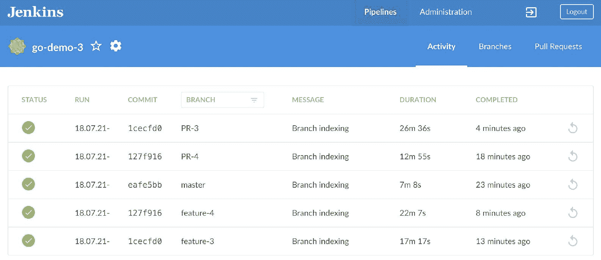

## 第十三章：使用 Jenkins 创建持续部署流水线

就是现在，时机已经成熟，我们可以将所学的知识付诸实践。我们即将定义一个“真实”的持续部署流水线（continuous deployment pipeline）在 Jenkins 中。我们的目标是将每一次提交通过一系列步骤，直到应用程序在生产环境中被安装（或升级）并经过测试。我们无疑会面临一些新的挑战，但我相信我们能够克服它们。我们已经拥有所有基础要素，剩下的主要任务就是将它们组装成一个持续部署流水线。

在进入实际操作部分之前，我们可能需要花一点时间讨论我们的目标。

### 探索持续部署过程

解释持续部署（CDP）很简单，实施起来却非常困难，挑战常常是隐形的且出乎意料。根据你流程、架构和代码的成熟度，你可能会发现，真正的问题并不在于持续部署流水线的代码，而是在其他地方。事实上，开发流水线是最简单的部分。话虽如此，你可能会想知道，是否在阅读这本书上投入时间是个错误，因为我们主要关注的是在 Kubernetes 集群中执行的流水线。

我们没有讨论你其他流程中的变化。我们没有探讨如何设计支持 CDP 流水线的良好架构。我们也没有深入讨论如何编写适合流水线的应用程序代码。我假设你已经了解这些。我希望你能理解敏捷（Agile）和 DevOps 运动背后的基本概念，并且你已经开始打破公司内部的孤岛。我还假设你知道什么是云原生架构，并且你已实施了[12 个因素](https://12factor.net/)中的一些，甚至全部。我猜测你已经在实践测试驱动开发（TDD）、行为驱动开发（BDD）、验收驱动开发（Acceptance-Driven Development）或任何其他有助于设计应用程序的技术。

我可能错了。更准确地说，我确信自己错了。大多数人还没有做到这一点。如果你是其中之一，请加强学习。读更多的书，参加一些课程，并说服你的管理者给你时间、空间和资源，帮助你更新现代化的应用程序。这是必须要做的。所有这些事情以及许多其他因素，正是区分顶尖企业（例如 Google、Amazon、Netflix）与我们其他公司之间的差异。尽管如此，这些公司也各自不同。每个高效的公司都是独一无二的，但它们都有一些共同点。它们都需要快速交付功能，都需要高水平的质量，并且它们都意识到，高可用性、容错性和分布式系统需要采取与我们大多数人习惯的方式截然不同的方法。

如果你因为认为自己还没有准备好而感到沮丧，甚至有放弃的念头，我的建议是继续前进。即使你可能需要进行大量更改才能实践持续部署，了解最终结果应该是什么样子，也会让你走上正确的道路。我们现在要设计一个完全可操作的持续部署流水线。一旦完成，你会知道还需要进行哪些其他更改。你会理解终点在哪里，并且能够回到现状，从正确的方向开始前进。

我们已经讨论过持续部署流水线的样子。如果你忘记了（我知道我有时也会忘记），这里有一些规则的简短版本，代表了最关键的内容。

**规则一**：每次提交到主分支后，如果通过了全自动化流水线的所有步骤，则会部署到生产环境。如果提交后还需要人工介入，那么这就不是持续部署，也不是持续交付。最多，你是在做持续集成。

**规则二**：你直接提交到主分支，或者使用短生命周期的特性分支。主分支是唯一重要的分支，生产版本是从它发布的。如果你使用分支，它们是从主分支派生的，因为主分支才是唯一真正重要的。当你创建一个特性分支时，很快就会合并回主分支。你不会等待几个星期再合并。如果你在等待，那就意味着你没有“持续”验证你的代码是否与他人的代码兼容。如果是这种情况，你甚至没有在做持续集成。除非你有一个复杂的分支策略，在这种情况下，你只是让每个人的工作变得比应该更复杂。

**规则三**：你需要信任你的自动化工具。当测试失败时，就表示有漏洞，必须先修复它。我希望你不是那些拥有不稳定测试的大公司之一，那些测试有时能通过，有时由于随机原因失败。如果你是这种公司，请先修复不稳定的测试，或者删除那些不可靠的测试。运行不可信的测试是没有意义的。同样的道理适用于构建、部署以及流程中的其他任何步骤。如果你发现自己属于那些不信任自己代码的群体，那么你必须先解决这个问题。测试是代码，就像构建、部署和其他所有环节一样。当代码产生不一致的结果时，我们应该修复它，而不是重启它。不幸的是，我确实看到很多公司更愿意重新运行因为不稳定的测试而失败的构建，而不是修复那些不稳定测试的根本原因。有很多公司通过重新启动应用来解决一半的生产问题，这个现象值得警惕。总之，如果你不信任你的自动化工具，就不能自动部署到生产环境，甚至不能说你的代码是生产就绪的。

既然我们已经建立了一套简单明了的基本规则，就可以继续描述我们应该开发的管道了。我们将构建一些东西。由于在没有运行单元测试和其他类型的静态测试的情况下进行构建应该被正式宣告为非法，并且会因公共耻辱而受到惩罚，所以我们将在 **构建阶段** 包含这些测试。然后，我们将执行 **功能测试阶段** 的步骤，运行所有需要实际应用程序的测试。因此，在这个阶段我们需要部署一个测试发布版本。一旦我们确信应用程序按预期运行，我们将进行 **生产发布**，随后是 **部署阶段**，该阶段不仅会升级生产发布版本，还会再进行一轮测试，以验证一切是否按预期工作。


图 7-1: 持续部署管道的各个阶段

你可能不同意这些阶段的名称。没关系。事情的命名和步骤的分组并不重要。重要的是管道中包含了我们需要的一切，确保我们能够自信地将发布安全地部署到生产环境。步骤很重要，阶段只是标签。

我们暂时不讨论具体步骤。相反，我们将把阶段拆分开来，一次构建一个。在这个过程中，我们将讨论哪些步骤是必需的。

你几乎可以确定，可能需要添加一些我没有使用的步骤。没关系，这也是可以的。关键是原则和知识。稍微的修改不应该是问题。

让我们创建一个集群。

### 创建一个集群

我们将通过进入 *vfarcic/k8s-specs* 仓库，并确保我们拥有最新的版本，来开始本章的实践部分。

```
`1` `cd` k8s-specs
`2` 
`3` git pull 
```

````````````````````````````````````````````````````````````````` Next, we’ll merge your *go-demo-3* fork with the upstream. If you forgot the commands, they are available in the [go-demo-3-merge.sh gist](https://gist.github.com/171172b69bb75903016f0676a8fe9388).    Now comes boring, but necessary part. We need to create a cluster unless you kept the one from the previous chapter running.    The additional requirements, when compared with the Gists from the previous chapter, are **ChartMuseum** and the environment variable `CM_ADDR` that contains the address through which we can access it.    If you’re using a local cluster created through **Docker For Mac or Windows**, **minikube**, or **minishift**, we’ll have to increase its size to **4GB RAM** and **4CPU**.    **Docker For Mac or Windows** users will also need to get the “real” IP of the cluster, instead of `localhost` we used so far. You should be able to get it by executing `ifconfig` and picking the address dedicated to Docker.    For your convenience, the Gists and the specs are available below.    *   [docker4mac-4gb.sh](https://gist.github.com/4b5487e707043c971989269883d20d28): **Docker for Mac** with 3 CPUs, 4 GB RAM, with **nginx Ingress**, with **tiller**, with `LB_IP` variable set to the IP of the cluster, and with **ChartMuseum** and its address set as `CM_ADDR` variable. *   [minikube-4gb.sh](https://gist.github.com/0a29803842b62c5c033e4c75cd37f3d4): **minikube** with 3 CPUs, 4 GB RAM, with `ingress`, `storage-provisioner`, and `default-storageclass` addons enabled, with **tiller**, with `LB_IP` variable set to the VM created by minikube, and with **ChartMuseum** and its address set as `CM_ADDR` variable. *   [kops-cm.sh](https://gist.github.com/603e2dca21b4475985a078b0f78db88c): **kops in AWS** with 3 t2.small masters and 2 t2.medium nodes spread in three availability zones, with **nginx Ingress**, with **tiller**, and with `LB_IP` variable set to the IP retrieved by pinging ELB’s hostname, and with **ChartMuseum** and its address set as `CM_ADDR` variable. The Gist assumes that the prerequisites are set through Appendix B. *   [minishift-4gb.sh](https://gist.github.com/b3d9c8da6e6dfd3b49d3d707595f6f99): **minishift** with 4 CPUs, 4 GB RAM, with version 1.16+, with **tiller**, and with `LB_IP` variable set to the VM created by minishift, and with **ChartMuseum** and its address set as `CM_ADDR` variable. *   [gke-cm.sh](https://gist.github.com/52b52500c469548e9d98c3f03529c609): **Google Kubernetes Engine (GKE)** with 3 n1-highcpu-2 (2 CPUs, 1.8 GB RAM) nodes (one in each zone), with **nginx Ingress** controller running on top of the “standard” one that comes with GKE, with **tiller**, with `LB_IP` variable set to the IP of the external load balancer created when installing nginx Ingress, and with **ChartMuseum** and its address set as `CM_ADDR` variable. We’ll use nginx Ingress for compatibility with other platforms. Feel free to modify the YAML files and Helm Charts if you prefer NOT to install nginx Ingress. *   [eks-cm.sh](https://gist.github.com/fd9c0cdb3a104e7c745e1c91f7f75a2e): **Elastic Kubernetes Service (EKS)** with 2 t2.medium nodes, with **nginx Ingress** controller, with a **default StorageClass**, with **tiller**, with `LB_IP` variable set tot he IP retrieved by pinging ELB’s hostname, and with **ChartMuseum** and its address set as `CM_ADDR` variable.    Now we are ready to install Jenkins.    ### Installing Jenkins    We already automated Jenkins installation so that it provides all the features we need out-of-the-box. Therefore, the exercises that follow should be very straightforward.    If you are a **Docker For Mac or Windows**, **minikube**, or **minishift** user, we’ll need to bring back up the VM we suspended in the previous chapter. Feel free to skip the commands that follow if you are hosting your cluster in AWS or GCP.    ``` `1` `cd` cd/docker-build `2`  `3` vagrant up `4`  `5` `cd` ../../ `6`  `7` `export` `DOCKER_VM``=``true`  ```   ```````````````````````````````````````````````````````````````` If you prefer running your cluster in **AWS with kops or EKS**, we’ll need to retrieve the AMI ID we stored in `docker-ami.log` in the previous chapter.    ``` `1` `AMI_ID``=``$(`grep `'artifact,0,id'` `\` `2 `    cluster/docker-ami.log `\` `3 `    `|` cut -d: -f2`)` `4`  `5` `echo` `$AMI_ID`  ```   ``````````````````````````````````````````````````````````````` If **GKE** is your cluster of choice, we’ll need to define variables `G_PROJECT` and `G_AUTH_FILE` which we’ll pass to Helm Chart. We’ll retrieve the project using `gcloud` CLI, and the authentication file is a reference to the one we stored in `/cluster/jenkins/secrets` directory in the previous chapter.    ```  `1` `export` `G_PROJECT``=``$(`gcloud info `\`  `2`    --format`=``'value(config.project)'``)`  `3`   `4` `echo` `$G_PROJECT`  `5`   `6` `G_AUTH_FILE``=``$(``\`  `7`    ls cluster/jenkins/secrets/key*json `\`  `8`    `|` xargs -n `1` basename `\`  `9`    `|` tail -n `1``)` `10`  `11` `echo` `$G_AUTH_FILE`  ```   `````````````````````````````````````````````````````````````` Next, we’ll need to create the Namespaces we’ll need. Let’s take a look at the definition we’ll use.    ``` `1` cat ../go-demo-3/k8s/ns.yml  ```   ````````````````````````````````````````````````````````````` You’ll notice that the definition is a combination of a few we used in the previous chapters. It contains three Namespaces.    The `go-demo-3-build` Namespace is where we’ll run Pods from which we’ll execute most of the steps of our pipeline. Those Pods will contain the tools like `kubectl`, `helm`, and Go compiler. We’ll use the same Namespace to deploy our releases under test. All in all, the `go-demo-3-build` Namespace is for short-lived Pods. The tools will be removed when a build is finished, just as installations of releases under test will be deleted when tests are finished executing. This Namespace will be like a trash can that needs to be emptied whenever it gets filled or start smelling.    The second Namespace is `go-demo-3`. That is the Namespace dedicated to the applications developed by the `go-demo-3` team. We’ll work only on their primary product, named after the team, but we can imagine that they might be in charge of other application. Therefore, do not think of this Namespace as dedicated to a single application, but assigned to a team. They have full permissions to operate inside that Namespace, just as the others defined in `ns.yml`. They own them, and `go-demo-3` is dedicated for production releases.    While we already used the two Namespaces, the third one is a bit new. The `go-demo-3-jenkins` is dedicated to Jenkins, and you might wonder why we do not use the `jenkins` Namespace as we did so far. The answer lies in my belief that it is a good idea to give each team their own Jenkins. That way, we do not need to create an elaborate system with user permissions, we do not need to think whether a plugin desired by one team will break a job owned by another, and we do not need to worry about performance issues when Jenkins is stressed by hundreds or thousands of parallel builds. So, we’ll apply “**every team gets Jenkins**” type of logic. “*It’s your Jenkins, do whatever you want to do with it,*” is the message we want to transmit to the teams in our company. Now, if your organization has only twenty developers, there’s probably no need for splitting Jenkins into multiple instances. Fifty should be OK as well. But, when that number rises to hundreds, or even thousands, having various Jenkins masters has clear benefits. Traditionally, that would not be practical due to increased operational costs. But now that we are deep into Kubernetes, and that we already saw that a fully functional and configured Jenkins is only a few commands away, we can agree that monster instances do not make much sense. If you are small and that logic does not apply, the processes we’ll explore are still the same, no matter whether you have one or a hundred Jenkins masters. Only the Namespace will be different (e.g., `jenkins`).    The rest of the definition is the same as what we used before. We have ServiceAccounts and RoleBindings that allow containers to interact with KubeAPI. We have LimitRanges and ResourceQuotas that protect the cluster from rogue Pods.    The LimitRange defined for the `go-demo-3-build` Namespace is especially important. We can assume that many of the Pods created through CDP pipeline will not have memory and CPU requests and limits. It’s only human to forget to define those things in pipelines. Still, that can be disastrous since it might produce undesired effects in the cluster. If nothing else, that would limit Kubernetes’ capacity to schedule Pods. So, defining LimitRange `default` and `defaultRequest` entries is a crucial step.    Please go through the whole `ns.yml` definition to refresh your memory of the things we explored in the previous chapters. We’ll `apply` it once you’re back.    ``` `1` kubectl apply `\` `2 `    -f ../go-demo-3/k8s/ns.yml `\` `3 `    --record  ```   ```````````````````````````````````````````````````````````` Now that we have the Namespaces, the ServiceAccounts, the RoleBindings, the LimitRanges, and the ResourceQuotas, we can proceed and create the secrets and the credentials required by Jenkins.    ``` `1` kubectl -n go-demo-3-jenkins `\` `2 `    create secret generic `\` `3 `    jenkins-credentials `\` `4 `    --from-file cluster/jenkins/credentials.xml `5`  `6` kubectl -n go-demo-3-jenkins `\` `7 `    create secret generic `\` `8 `    jenkins-secrets `\` `9 `    --from-file cluster/jenkins/secrets  ```   ``````````````````````````````````````````````````````````` Only one more thing is missing before we install Jenkins. We need to install Tiller in the `go-demo-3-build` Namespace.    ``` `1` helm init --service-account build `\` `2 `    --tiller-namespace go-demo-3-build  ```   `````````````````````````````````````````````````````````` Now we are ready to install Jenkins.    ```  `1` `JENKINS_ADDR``=``"go-demo-3-jenkins.``$LB_IP``.nip.io"`  `2`   `3` helm install helm/jenkins `\`  `4`    --name go-demo-3-jenkins `\`  `5`    --namespace go-demo-3-jenkins `\`  `6`    --set jenkins.Master.HostName`=``$JENKINS_ADDR` `\`  `7`    --set jenkins.Master.DockerVM`=``$DOCKER_VM` `\`  `8`    --set jenkins.Master.DockerAMI`=``$AMI_ID` `\`  `9`    --set jenkins.Master.GProject`=``$G_PROJECT` `\` `10 `    --set jenkins.Master.GAuthFile`=``$G_AUTH_FILE`  ```   ````````````````````````````````````````````````````````` We generated a `nip.io` address and installed Jenkins in the `go-demo-3-jenkins` Namespace. Remember, this Jenkins is dedicated to the *go-demo-3* team, and we might have many other instances serving the needs of other teams.    So far, everything we did is almost the same as what we’ve done in the previous chapters. The only difference is that we changed the Namespace where we deployed Jenkins. Now, the only thing left before we jump into pipelines is to wait until Jenkins is rolled out and confirm a few things.    ``` `1` kubectl -n go-demo-3-jenkins `\` `2 `    rollout status deployment `\` `3 `    go-demo-3-jenkins  ```   ```````````````````````````````````````````````````````` The only thing we’ll validate, right now, is whether the node that we’ll use to build and push Docker images is indeed connected to Jenkins.    ``` `1` open `"http://``$JENKINS_ADDR``/computer"`  ```   ``````````````````````````````````````````````````````` Just as before, we’ll need the auto-generated password.    ``` `1` `JENKINS_PASS``=``$(`kubectl -n go-demo-3-jenkins `\` `2 `    get secret go-demo-3-jenkins `\` `3 `    -o `jsonpath``=``"{.data.jenkins-admin-password}"` `\` `4 `    `|` base64 --decode`;` `echo``)` `5`  `6` `echo` `$JENKINS_PASS`  ```   `````````````````````````````````````````````````````` Please copy the output of the `echo` command, go back to the browser, and use it to log in as the `admin` user.    Once inside the nodes screen, you’ll see different results depending on how you set up the node for building and pushing Docker images.    If you are a **Docker For Mac or Windows**, a **minikube** user, or a **minishift** user, you’ll see a node called `docker-build`. That confirms that we successfully connected Jenkins with the VM we created with Vagrant.    If you created a cluster in **AWS** using **kops**, you should see a drop-down list called **docker-agents**.    **GKE** users should see a drop-down list called **docker**.    Now that we confirmed that a node (static or dynamic) is available for building and pushing Docker images, we can start designing our first stage of the continuous deployment pipeline.    ### Defining The Build Stage    The primary function of the **build stage** of the continuous deployment pipeline is to build artifacts and a container image and push it to a registry from which it can be deployed and tested. Of course, we cannot build anything without code, so we’ll have to check out the repository as well.    Since building things without running static analysis, unit tests, and other types of validation against static code should be illegal and punishable by public shame, we’ll include those steps as well.    We won’t deal with building artifacts, nor we are going to run static testing and analysis from inside the pipeline. Instead, we’ll continue relying on Docker’s multistage builds for all those things, just as we did in the previous chapters.    Finally, we couldn’t push to a registry without authentication, so we’ll have to log in to Docker Hub just before we push a new image.    There are a few things that we are NOT going to do, even though you probably should when applying the lessons learned your “real” projects. We do NOT have static analysis. We are NOT generating code coverage, we are NOT creating reports, and we are not sending the result to analysis tools like [SonarQube](https://www.sonarqube.org/). More importantly, we are NOT running any security scanning. There are many other things we could do in this chapter, but we are not. The reason is simple. There is an almost infinite number of tools we could uses and steps we could execute. They depend on programming languages, internal processes, and what so not. Our goal is to understand the logic and, later on, to adapt the examples to your own needs. With that in mind, we’ll stick only to the bare minimum, not only in this stage but also in those that follow. It is up to you to extend them to fit your specific needs.    Figure 7-2: The essential steps of the build stage    Let’s define the steps of the build stage as a Jenkins job.    ``` `1` open `"http://``$JENKINS_ADDR``"`  ```   ````````````````````````````````````````````````````` From the Jenkins home screen, please click the *New Item* link from the left-hand menu. The script for creating new jobs will appear.    Type *go-demo-3* as the *item name*, select *Pipeline* as the job type and click the *OK* button.    Once inside job’s configuration screen, click the *Pipeline* tab in the top of the screen and type the script that follows inside the *Script* field.    ```  `1` `import` `java.text.SimpleDateFormat`  `2`   `3` `currentBuild``.``displayName` `=` `new` `SimpleDateFormat``(``"yy.MM.dd"``).``format``(``new` `Date``())` `+` `"-"``\`  `4` `+` `env``.``BUILD_NUMBER`  `5` `env``.``REPO` `=` `"https://github.com/vfarcic/go-demo-3.git"`  `6` `env``.``IMAGE` `=` `"vfarcic/go-demo-3"`  `7` `env``.``TAG_BETA` `=` `"${currentBuild.displayName}-${env.BRANCH_NAME}"`  `8`   `9` `node``(``"docker"``)` `{` `10 `  `stage``(``"build"``)` `{` `11 `    `git` `"${env.REPO}"` `12 `    `sh` `"""sudo docker image build \` `13 ``      -t ${env.IMAGE}:${env.TAG_BETA} ."""` `14 `    `withCredentials``([``usernamePassword``(` `15 `      `credentialsId:` `"docker"``,` `16 `      `usernameVariable:` `"USER"``,` `17 `      `passwordVariable:` `"PASS"` `18 `    `)])` `{` `19 `      `sh` `"""sudo docker login \` `20 ``        -u $USER -p $PASS"""` `21 `    `}` `22 `    `sh` `"""sudo docker image push \` `23 ``      ${env.IMAGE}:${env.TAG_BETA}"""` `24 `  `}` `25` `}`  ```   ```````````````````````````````````````````````````` Since we already went through all those steps manually, the steps inside the Jenkins job should be self-explanatory. Still, we’ll briefly explain what’s going on since this might be your first contact with Jenkins pipeline.    First of all, the job is written using the **scripted pipeline** syntax. The alternative would be to use **declarative pipeline** which forces a specific structure and naming convention. Personally, I prefer the latter. A declarative pipeline is easier to write and read, and it provides the structure that makes implementation of some patterns much easier. However, it also comes with a few limitations. In our case, those limitations are enough to make the declarative pipeline a lousy choice. Namely, it does not allow us to mix different types of agents, and it does not support all the options available in `podTemplate` (e.g., `namespace`). Since scripted pipeline does not have such limitations, we opted for that flavor, even though it makes the code often harder to maintain.    What did we do so far?    We imported `SimpleDateFormat` library that allows us to retrieve dates. The reason for the `import` becomes evident in the next line where we are changing the name of the build. By default, each build is named sequentially. The first build is named `1`, the second `2`, and so on. We changed the naming pattern so that it contains the date in `yy.MM.dd` format, followed with the sequential build number.    Next, we’re defining a few environment variables that contain the information we’ll need in the pipeline steps. `REPO` holds the GitHub repository we’re using, `IMAGE` is the name of the Docker image we’ll build, and `TAG_BETA` has the tag the image we’ll use for testing. The latter is a combination of the build and the branch name.    Before we proceed, please change the `REPO` and the `IMAGE` variables to match the address of the repository you forked and the name of the image. In most cases, changing `vfarcic` to your GitHub and Docker Hub user should be enough.    The `node` block is where the “real” action is happening.    By setting the `node` to `docker`, we’re telling Jenkins to use the agent with the matching name or label for all the steps within that block. The mechanism will differ from one case to another. It could match the VM we created with Vagrant, or it could be a dynamically created node in AWS or GCP.    Inside the `node` is the `stage` block. It is used to group steps and has no practical purpose. It is purely cosmetic, and it’s used to visualize the pipeline.    Inside the `stage` are the steps. The full list of available steps depends on the available plugins. The most commonly used ones are documented in the [Pipeline Steps Reference](https://jenkins.io/doc/pipeline/steps/). As you’ll see, most of the pipeline we’ll define will be based on the [sh: Shell Script](https://jenkins.io/doc/pipeline/steps/workflow-durable-task-step/#sh-shell-script) step. Since we already determined almost everything we need through commands executed in a terminal, using `sh` allows us to copy and paste those same commands. That way, we’ll have little dependency on Jenkins-specific way of working, and we’ll have parity between command line used by developers on their laptops and Jenkins pipelines.    Inside the `build` stage, we’re using `git` to retrieve the repository. Further on, we’re using `sh` to execute Docker commands to `build` an image, to `login` to Docker Hub, and to `push` the image.    The only “special” part of the pipeline is the `withCredentials` block. Since it would be very insecure to hard-code into our jobs Docker Hub’s username and password, we’re retrieving the information from Jenkins. The credentials with the ID `docker` will be converted into variables `USER` and `PASS` which are used with the `docker login` command. Besides the apparent do-not-hard-code-secrets reason, the primary motivation for using the `withCredentials` block lies in Jenkins’ ability to obfuscate confidential information. As you’ll see later on, the credentials will be removed from logs making them hidden to anyone poking around our builds.    Now that we had a brief exploration of our first draft of the pipeline, the time has come to try it out.    Please click the *Save* button to persist the job.    We’ll use the new UI to run the builds and visualize them.    Click the *Open Blue Ocean* link from the left-hand menu, followed with the *Run* button.    Once the build starts, a new row will appear. Click it to enter into the details of the build and to observe the progress until it’s finished and everything is green.    Figure 7-3: Jenkins build with a single stage    Let’s check whether Jenkins executed the steps correctly. If it did, we should have a new image pushed to our Docker Hub account.    ``` `1` `export` `DH_USER``=[`...`]` `2`  `3` open `"https://hub.docker.com/r/``$DH_USER``/go-demo-3/tags/"`  ```   ``````````````````````````````````````````````````` Please replace `[...]` with your Docker Hub username.    You should see a new image tagged as a combination of the date, build number (`1`), and the branch. The only problem so far is that the branch is set to `null`. That is the expected behavior since we did not tell Jenkins which branch to retrieve. As a result, the environment variable `BRANCH_NAME` is set to `null` and, with it, our image tag as well. We’ll fix that problem later on. For now, we’ll have to live with `null`.    Now that we finished defining and verifying the `build` stage, we can proceed to the *functional testing*.    ### Defining The Functional Testing Stage    For the *functional testing* stage, the first step is to install the application under test. To avoid the potential problems of installing the same release twice, we’ll use `helm upgrade` instead of `install`.    As you already know, Helm only acknowledges that the resources are created, not that all the Pods are running. To mitigate that, we’ll wait for `rollout status` before proceeding with tests.    Once the application is rolled out, we’ll run the functional tests. Please note that, in this case, we will run only one set of tests. In the “real” world scenario, there would probably be others like, for example, performance tests or front-end tests for different browsers.    Finally, we’ll have to `delete` the Chart we installed. After all, it’s pointless to waste resources by running an application longer than we need it. In our scenario, as soon as the execution of the tests is finished, we’ll remove the application under test. However, there is a twist. Jenkins, like most other CI/CD tools, will stop the execution of the first error. Since there is no guarantee that none of the steps in this stage will fail, we’ll have to envelop all the inside a big `try`/`catch`/`finally` statement.    Figure 7-4: The essential steps of the functional stage    Before we move on and write a new version of the pipeline, we’ll need an address that we’ll use as Ingress host of our application under tests.    ``` `1` `export` `ADDR``=``$LB_IP`.nip.io `2`  `3` `echo` `$ADDR`  ```   `````````````````````````````````````````````````` Please copy the output of the `echo`. We’ll need it soon.    Next, we’ll open the job’s configuration screen.    ``` `1` open `"http://``$JENKINS_ADDR``/job/go-demo-3/configure"`  ```   ````````````````````````````````````````````````` If you are **NOT using minishift**, please replace the existing code with the content of the [cdp-jenkins-func.groovy Gist](https://gist.github.com/4edc53d5dd11814651485c9ff3672fb7).    If you are **using minishift**, replace the existing code with the content of the [cdp-jenkins-func-oc.groovy Gist](https://gist.github.com/1661c2527eda2bfe1e35c77f448f7c34).    We’ll explore only the differences between the two revisions of the pipeline. They are as follows.    ```  `1` `...`  `2` `env``.``ADDRESS` `=` `"go-demo-3-${env.BUILD_NUMBER}-${env.BRANCH_NAME}.acme.com"`  `3` `env``.``CHART_NAME` `=` `"go-demo-3-${env.BUILD_NUMBER}-${env.BRANCH_NAME}"`  `4` `def` `label` `=` `"jenkins-slave-${UUID.randomUUID().toString()}"`  `5`   `6` `podTemplate``(`  `7`  `label:` `label``,`  `8`  `namespace:` `"go-demo-3-build"``,`  `9`  `serviceAccount:` `"build"``,` `10 `  `yaml:` `"""` `11` `apiVersion: v1` `12` `kind: Pod` `13` `spec:` `14 ``  containers:` `15 ``  - name: helm` `16 ``    image: vfarcic/helm:2.9.1` `17 ``    command: ["cat"]` `18 ``    tty: true` `19 ``  - name: kubectl` `20 ``    image: vfarcic/kubectl` `21 ``    command: ["cat"]` `22 ``    tty: true` `23 ``  - name: golang` `24 ``    image: golang:1.9` `25 ``    command: ["cat"]` `26 ``    tty: true` `27` `"""` `28` `)` `{` `29 `  `node``(``label``)` `{` `30 `    `node``(``"docker"``)` `{` `31 `      `stage``(``"build"``)` `{` `32 `        `...` `33 `      `}` `34 `    `}` `35 `    `stage``(``"func-test"``)` `{` `36 `      `try` `{` `37 `        `container``(``"helm"``)` `{` `38 `          `git` `"${env.REPO}"` `39 `          `sh` `"""helm upgrade \` `40 ``            ${env.CHART_NAME} \` `41 ``            helm/go-demo-3 -i \` `42 ``            --tiller-namespace go-demo-3-build \` `43 ``            --set image.tag=${env.TAG_BETA} \` `44 ``            --set ingress.host=${env.ADDRESS} \` `45 ``            --set replicaCount=2 \` `46 ``            --set dbReplicaCount=1"""` `47 `        `}` `48 `        `container``(``"kubectl"``)` `{` `49 `          `sh` `"""kubectl -n go-demo-3-build \` `50 ``            rollout status deployment \` `51 ``            ${env.CHART_NAME}"""` `52 `        `}` `53 `        `container``(``"golang"``)` `{` `// Uses env ADDRESS` `54 `          `sh` `"go get -d -v -t"` `55 `          `sh` `"""go test ./... -v \` `56 ``            --run FunctionalTest"""` `57 `        `}` `58 `      `}` `catch``(``e``)` `{` `59 `          `error` `"Failed functional tests"` `60 `      `}` `finally` `{` `61 `        `container``(``"helm"``)` `{` `62 `          `sh` `"""helm delete \` `63 ``            ${env.CHART_NAME} \` `64 ``            --tiller-namespace go-demo-3-build \` `65 ``            --purge"""` `66 `        `}` `67 `      `}` `68 `    `}` `69 `  `}` `70` `}`  ```   ```````````````````````````````````````````````` We added a few new environment variables that will simplify the steps that follow. The `ADDRESS` will be used to provide a unique host for the Ingress of the application under test. The uniqueness is accomplished by combining the name of the project (`go-demo-3`), the build number, and the name of the branch. We used a similar pattern to generate the name of the Chart that will be installed. All in all, both the address and the Chart are unique for each release of each application, no matter the branch.    We also defined `label` variable with a unique value by adding a suffix based on random UUID. Further down, when we define `podTemplate`, we’ll use the `label` to ensure that each build uses its own Pod.    The `podTemplate` itself is very similar to those we used in quite a few occasions. It’ll be created in the `go-demo-3-build` Namespace dedicated to building and testing applications owned by the `go-demo-3` team. The `yaml` contains the definitions of the Pod that includes containers with `helm`, `kubectl`, and `golang`. Those are the tools we’ll need to execute the steps of the *functional testing* stage.    The curious part is the way nodes (agents) are organized in this iteration of the pipeline. Everything is inside one big block of `node(label)`. As a result, all the steps will be executed in one of the containers of the `podTemplate`. However, since we do not want the build steps to run inside the cluster, inside the node based on the `podTemplate` is the same `node("docker")` block we are using for building and pushing Docker images.    The reason for using nested `node` blocks lies in Jenkins’ ability to delete unused Pods. The moment `podTemplate` node is closed, Jenkins will remove the associated Pod. To preserve the state we’ll generate inside that Pod, we’re making sure that it is alive through the whole build by enveloping all the steps (even those running somewhere else) inside one colossal `node(label)` block.    Inside the `func-test` stage is a `try` block that contains all the steps (except cleanup). Each of the steps is executed inside a different container. We enter `helm` to clone the code and execute `helm upgrade` that installs the release under test. Next, we jump into the `kubectl` container to wait for the `rollout status` that confirms that the application is rolled out completely. Finally, we switch into the `golang` container to run our tests.    Please note that we are installing only two replicas of the application under test and one replica of the DB. That’s more than enough to validate whether it works as expected from the functional point of view. There’s no need to have the same number of replicas as what we’ll run in the production Namespace.    You might be wondering why we checked out the code for the second time. The reason is simple. In the first stage, we cloned the code inside the VM dedicated to (or dynamically created for) building Docker images. The Pod created through `podTemplate` does not have that code, so we had to clone it again. We did that inside the `helm` container since that’s the first one we’re using.    Why didn’t we clone the code to all the containers of the Pod? After all, almost everything we do needs the code of the application. While that might not be true for the `kubectl` container (it only waits for the installation to roll out), it is undoubtedly true for `golang`. The answer lies in Jenkins `podTemplate` “hidden” features. Among other things, it creates a volume and mounts it to all the containers of the Pod as the directory `/workspace`. That directory happens to be the default directory in which it operates when inside those containers. So, the state created inside one of the containers, exists in all the others, as long as we do not switch to a different folder.    The `try` block is followed with `catch` that is executed only if one of the steps throws an error. The only purpose for having the `catch` block is to re-throw the error if there is any.    The sole purpose for using `try`/`catch` is in the `finally` block. In it, we are deleting the application we deployed. Since it executes no matter whether there was an error, we have a reasonable guarantee that we’ll have a clean system no matter the outcome of the pipeline.    To summarize, `try` block ensures that errors are caught. Without it, the pipeline would stop executing on the first sign of failure, and the release under test would never be removed. The `catch` block re-throws the error, and the `finally` block deletes the release no matter what happens.    Before we test the new iteration of the pipeline, please replace the values of the environment variables to fit your situation. As a minimum, you’ll need to change `vfarcic` to your GitHub and Docker Hub users, and you’ll have to replace `acme.com` with the value stored in the environment variable `ADDR` in your terminal session.    Once finished with the changes, please click the *Save* button. Use the *Open Blue Ocean* link from the left-hand menu to switch to the new UI and click the *Run* button followed with a click on the row of the new build.    Please wait until the build reaches the `func-test` stage and finishes executing the second step that executes `helm upgrade`. Once the release under test is installed, switch to the terminal session to confirm that the new release is indeed installed.    ``` `1` helm ls `\` `2 `    --tiller-namespace go-demo-3-build  ```   ``````````````````````````````````````````````` The output is as follows.    ``` `1` NAME             REVISION UPDATED        STATUS   CHART           NAMESPACE `2` go-demo-3-2-null 1        Tue Jul 17 ... DEPLOYED go-demo-3-0.0.1 go-demo-3-build  ```   `````````````````````````````````````````````` As we can see, Jenkins did initiate the process that resulted in the new Helm Chart being installed in the `go-demo-3-build` Namespace.    To be on the safe side, we’ll confirm that the Pods are running as well.    ``` `1` kubectl -n go-demo-3-build `\` `2 `    get pods  ```   ````````````````````````````````````````````` The output is as follows    ``` `1` NAME                  READY STATUS  RESTARTS AGE `2` go-demo-3-2-null-...  1/1   Running 4        2m `3` go-demo-3-2-null-...  1/1   Running 4        2m `4` go-demo-3-2-null-db-0 2/2   Running 0        2m `5` jenkins-slave-...     4/4   Running 0        6m `6` tiller-deploy-...     1/1   Running 0        14m  ```   ```````````````````````````````````````````` As expected, the two Pods of the API and one of the DB are running together with `jenkins-slave` Pod created by Jenkins.    Please return to Jenkins UI and wait until the build is finished.    Figure 7-5: Jenkins build with the build and the functional testing stage    If everything works as we designed, the release under test was removed once the testing was finished. Let’s confirm that.    ``` `1` helm ls `\` `2 `    --tiller-namespace go-demo-3-build  ```   ``````````````````````````````````````````` This time the output is empty, clearly indicating that the Chart was removed.    Let’s check the Pods one more time.    ``` `1` kubectl -n go-demo-3-build `\` `2 `    get pods  ```   `````````````````````````````````````````` The output is as follows    ``` `1` NAME              READY STATUS  RESTARTS AGE `2` tiller-deploy-... 1/1   Running 0        31m  ```   ````````````````````````````````````````` Both the Pods of the release under tests as well as Jenkins agent are gone, leaving us only with Tiller. We defined the steps that remove the former, and the latter is done by Jenkins automatically.    Let’s move onto the *release stage*.    ### Defining The Release Stage    In the *release stage*, we’ll push Docker images to the registry as well as the project’s Helm Chart. The images will be tags of the image under test, but this time they will be named using a convention that clearly indicates that they are production- ready.    In the *build stage*, we’re tagging images by including the branch name. That way, we made it clear that an image is not yet thoroughly tested. Now that we executed all sorts of tests that validated that the release is indeed working as expected, we can re-tag the images so that they do not include branch names. That way, everyone in our organization can easily distinguish yet-to-be-tested from production-ready releases.    Since we cannot know (easily) whether the Chart included in the project’s repository changed or not, during this stage, we’ll push it to ChartMuseum. If the Chart’s release number is unchanged, the push will merely overwrite the existing Chart. Otherwise, we’ll have a new Chart release as well.    The significant difference between Docker images and Charts is in the way how we’re generating releases. Each commit to the repository probably results in changes to the code, so building new images on each build makes perfect sense. Helm Charts, on the other hand, do not change that often.    One thing worth noting is that we will not use ChartMuseum for deploying applications through Jenkins’ pipelines. We already have the Chart inside the repository that we’re cloning. We’ll store Charts in ChartMuseum only for those that want to deploy them manually without Jenkins. A typical user of those Charts are developers that want to spin up applications inside local clusters that are outside Jenkins’ control.    Just as with the previous stages, we are focused only on the essential steps which you should extend to suit your specific needs. Examples that might serve as inspiration for the missing steps are those that would create a release in GitHub, GitLab, or Bitbucket. Also, it might be useful to build Docker images with manifest files in case you’re planning on deploying them to different operating system families (e.g., ARM, Windows, etc.). Another thing that would be interesting to add is an automated way to create and publish release notes. Don’t get your hopes too high because we’ll skip those and quite a few other use-cases in an attempt to keep the pipeline simple, and yet fully functional.    Figure 7-6: The essential steps of the release stage    Before we move on, we’ll need to create a new set of credentials in Jenkins to store ChartMuseum’s username and password.    ``` `1` open `"http://``$JENKINS_ADDR``/credentials/store/system/domain/_/newCredentials"`  ```   ```````````````````````````````````````` Please type *admin* as both the *Username* and the *Password*. The *ID* and the *Description* should be set to *chartmuseum*. Once finished, please click the *OK* button to persist the credentials.    Figure 7-7: ChartMuseum Jenkins credentials    Next, we’ll retrieve the updated `credentials.xml` file and store it in the `cluster/jenkins` directory. That way, if we want to create a new Jenkins instance, the new credentials will be available just as those that we created in the previous chapter.    ```  `1` `JENKINS_POD``=``$(`kubectl `\`  `2`    -n go-demo-3-jenkins `\`  `3`    get pods `\`  `4`    -l `component``=`go-demo-3-jenkins-jenkins-master `\`  `5`    -o `jsonpath``=``'{.items[0].metadata.name}'``)`  `6`   `7` `echo` `$JENKINS_POD`  `8`   `9` kubectl -n go-demo-3-jenkins cp `\` `10 `    `$JENKINS_POD`:var/jenkins_home/credentials.xml `\` `11 `    cluster/jenkins  ```   ``````````````````````````````````````` We retrieved the name of the Pod hosting Jenkins, and we used it to copy the `credentials.xml` file.    Now we can update the job.    ``` `1` open `"http://``$JENKINS_ADDR``/job/go-demo-3/configure"`  ```   `````````````````````````````````````` If you are **NOT using minishift**, please replace the existing code with the content of the [cdp-jenkins-release.groovy Gist](https://gist.github.com/2e89eec6ca991ab676d740733c409d35).    If you are a **minishift user**, replace the existing code with the content of the [cdp-jenkins-release-oc.groovy Gist](https://gist.github.com/33650e28417ceb1f2f349ec71b8a934d).    Just as before, we’ll explore only the differences between the two pipeline iterations.    ```  `1` `...`  `2` `env``.``CM_ADDR` `=` `"cm.acme.com"`  `3` `env``.``TAG` `=` `"${currentBuild.displayName}"`  `4` `env``.``TAG_BETA` `=` `"${env.TAG}-${env.BRANCH_NAME}"`  `5` `env``.``CHART_VER` `=` `"0.0.1"`  `6` `...`  `7`    `stage``(``"release"``)` `{`  `8`      `node``(``"docker"``)` `{`  `9`        `sh` `"""sudo docker pull \` `10 ``          ${env.IMAGE}:${env.TAG_BETA}"""` `11 `        `sh` `"""sudo docker image tag \` `12 ``          ${env.IMAGE}:${env.TAG_BETA} \` `13 ``          ${env.IMAGE}:${env.TAG}"""` `14 `        `sh` `"""sudo docker image tag \` `15 ``          ${env.IMAGE}:${env.TAG_BETA} \` `16 ``          ${env.IMAGE}:latest"""` `17 `        `withCredentials``([``usernamePassword``(` `18 `          `credentialsId:` `"docker"``,` `19 `          `usernameVariable:` `"USER"``,` `20 `          `passwordVariable:` `"PASS"` `21 `        `)])` `{` `22 `          `sh` `"""sudo docker login \` `23 ``            -u $USER -p $PASS"""` `24 `        `}` `25 `        `sh` `"""sudo docker image push \` `26 ``          ${env.IMAGE}:${env.TAG}"""` `27 `        `sh` `"""sudo docker image push \` `28 ``          ${env.IMAGE}:latest"""` `29 `      `}` `30 `      `container``(``"helm"``)` `{` `31 `        `sh` `"helm package helm/go-demo-3"` `32 `        `withCredentials``([``usernamePassword``(` `33 `          `credentialsId:` `"chartmuseum"``,` `34 `          `usernameVariable:` `"USER"``,` `35 `          `passwordVariable:` `"PASS"` `36 `        `)])` `{` `37 `          `sh` `"""curl -u $USER:$PASS \` `38 ``            --data-binary "@go-demo-3-${CHART_VER}.tgz" \` `39 ``            http://${env.CM_ADDR}/api/charts"""` `40 `        `}` `41 `      `}` `42 `    `}` `43 `  `}` `44` `}`  ```   ````````````````````````````````````` Jut as before, we declared a few new environment variables. They should be self-explanatory.    We start the steps of the *release stage* inside the `docker` node. Since the nodes in AWS and GCP are dynamic, there is no guarantee that it’ll be the same agent as the one used in the *build stage* since we set retention to ten minutes. Typically, that is more than enough time between the two requests for the node. However, some other build might have requested the node in between and, in that case, a new one would be created. Therefore, we cannot be sure that it’s the same physical VM. To mitigate that, the first step is pulling the image we build previously. That way, we’re ensuring that the cache is used in subsequent steps.    Next, we’re creating two tags. One is based on the release (build display name), and the other on the `latest`. We’ll use the more specific tag, while leaving the option to others to use the `latest` that that points to the last production-ready release.    Further on, we’re logging to Docker Hub and pushing the new tags.    Finally, we are switching to the `helm` container of the `podTemplate`. Once inside, we are packaging the Chart and pushing it to ChartMuseum with `curl`. The essential element is the environment variable `CHART_VER`. It contains the version of the Chart that **must** correspond to the version in `Chart.yaml` file. We’re using it to know which file to push. Truth be told, we could have parsed the output of the `helm package` command. However, since Charts do not change that often, it might be less work to update the version in two places than to add parsing to the code. It is true that having the same thing in two places increases the chances of an error by omission. I invite you to a challenge the current design by making a PR that will improve it.    Before we move on, you’ll need to make the necessary changes to the values of the environment variables. Most likely, all you need to do is change `vfarcic` to your Docker Hub and GitHub users as well as `acme.com` to the value of the environment variable `ADDR` available in your terminal session.    Don’t forget to click the *Save* button to persist the change. After that, follow the same process as before to run a new build by clicking the *Open Blue Ocean* link from the left-hand menu, followed with the *Run* button. Click on the row of the new build and wait until it’s finished.    Figure 7-8: Jenkins build with the build, the functional testing, and the release stages    If everything went as expected, we should have a couple of new images pushed to Docker Hub. Let’s confirm that.    ``` `1` open `"https://hub.docker.com/r/``$DH_USER``/go-demo-3/tags/"`  ```   ```````````````````````````````````` This time, besides the tags based on branches (for now with `null`), we got two new ones that represent the production-ready release.    Figure 7-9: Images pushed to Docker Hub    Similarly, we should also have the Chart stored in ChartMuseum.    ``` `1` curl -u admin:admin `\` `2 `    `"http://``$CM_ADDR``/index.yaml"`  ```   ``````````````````````````````````` The output is as follows.    ```  `1` `apiVersion``:` `v1`  `2` `entries``:`  `3`  `go-demo-3``:`  `4`  `-` `apiVersion``:` `v1`  `5`    `created``:` `"2018-07-17T21:53:30.760065856Z"`  `6`    `description``:` `A silly demo based on API written in Go and MongoDB`  `7`    `digest``:` `d73134fc9ff594e9923265476bac801b1bd38d40548799afd66328158f0617d8`  `8`    `home``:` `http://www.devopstoolkitseries.com/`  `9`    `keywords``:` `10 `    `-` `api` `11 `    `-` `backend` `12 `    `-` `go` `13 `    `-` `database` `14 `    `-` `mongodb` `15 `    `maintainers``:` `16 `    `-` `email``:` `viktor@farcic.com` `17 `      `name``:` `Viktor Farcic` `18 `    `name``:` `go-demo-3` `19 `    `sources``:` `20 `    `-` `https://github.com/vfarcic/go-demo-3` `21 `    `urls``:` `22 `    `-` `charts/go-demo-3-0.0.1.tgz` `23 `    `version``:` `0.0.1` `24` `generated``:` `"2018-07-17T21:56:28Z"`  ```   `````````````````````````````````` Now that we confirmed that both the images and the Chart are being pushed to their registries, we can move onto the last stage of the pipeline.    ### Defining The Deploy Stage    We’re almost finished with the pipeline, at least in its current form.    The purpose of the *deploy stage* is to install the new release to production and to do the last round of tests that only verify whether the new release integrates with the rest of the system. Those tests are often elementary since they do not validate the release on the functional level. We already know that the features work as expected and immutability of the containers guarantee that what was deployed as a test release is the same as what will be upgraded to production. What we’re not yet sure is whether there is a problem related to the configuration of the production environment or, in our case, production Namespace.    If something goes wrong, we need to be able to act swiftly and roll back the release. I’ll skip the discussion about the inability to roll back when changing database schemas and a few other cases. Instead, for the sake of simplicity, I’ll assume that we’ll roll back always if any of the steps in this stage fail.    Figure 7-10: The essential steps of the deploy stage    Let’s go back to *go-demo-3* configuration screen and update the pipeline.    ``` `1` open `"http://``$JENKINS_ADDR``/job/go-demo-3/configure"`  ```   ````````````````````````````````` If you are **NOT using minishift**, please replace the existing code with the content of the [cdp-jenkins-deploy.groovy Gist](https://gist.github.com/3657e7262b65749f29ddd618cf511d72).    If you are **using minishift**, please replace the existing code with the content of the [cdp-jenkins-deploy-oc.groovy Gist](https://gist.github.com/1a490bff0c90b021e3390a66dd75284e).    The additions to the pipeline are as follows.    ```  `1` `...`  `2` `env``.``PROD_ADDRESS` `=` `"go-demo-3.acme.com"`  `3` `...`  `4`    `stage``(``"deploy"``)` `{`  `5`      `try` `{`  `6`        `container``(``"helm"``)` `{`  `7`          `sh` `"""helm upgrade \`  `8``            go-demo-3 \`  `9``            helm/go-demo-3 -i \` `10 ``            --tiller-namespace go-demo-3-build \` `11 ``            --namespace go-demo-3 \` `12 ``            --set image.tag=${env.TAG} \` `13 ``            --set ingress.host=${env.PROD_ADDRESS}` `14 ``            --reuse-values"""` `15 `        `}` `16 `        `container``(``"kubectl"``)` `{` `17 `          `sh` `"""kubectl -n go-demo-3 \` `18 ``            rollout status deployment \` `19 ``            go-demo-3"""` `20 `        `}` `21 `        `container``(``"golang"``)` `{` `22 `          `sh` `"go get -d -v -t"` `23 `          `sh` `"""DURATION=1 ADDRESS=${env.PROD_ADDRESS} \` `24 ``            go test ./... -v \` `25 ``            --run ProductionTest"""` `26 `        `}` `27 `      `}` `catch``(``e``)` `{` `28 `        `container``(``"helm"``)` `{` `29 `          `sh` `"""helm rollback \` `30 ``            go-demo-3 0 \` `31 ``            --tiller-namespace go-demo-3-build"""` `32 `          `error` `"Failed production tests"` `33 `        `}` `34 `      `}` `35 `    `}` `36 `  `}` `37` `}`  ```   ```````````````````````````````` We added yet another environment variable (`PROD_ADDRESS`) that holds the address through which our production releases are accessible. We’ll use it both for defining Ingress host as well as for the final round of testing.    Inside the stage, we’re upgrading the production release with the `helm upgrade` command. The critical value is `image.tag` that specifies the image tag that should be used.    Before we proceed with testing, we’re waiting until the update rolls out. If there is something obviously wrong with the upgrade (e.g., the tag does not exist, or there are no available resources), the `rollout status` command will fail.    Finally, we’re executing the last round of tests. In our case, the tests will run in a loop for one minute.    All the steps in this stage are inside a big `try` block, so a failure of any of the steps will be handled with the `catch` block. Inside it is a simple `helm rollback` command set to revision `0` which will result in a rollback to the previous release.    Just as in the other stages, we’re jumping from one container to another depending on the tool we need at any given moment.    Before we move on, please make the necessary changes to the values of the environment variables. Just as before, you likely need to change `vfarcic` to your Docker Hub and GitHub users as well as `acme.com` to the value of the environment variable `ADDR` available in your terminal session.    Please click the *Save* button once you’re finished with the changes that aim at making the pipeline work in your environment. The rest of the steps are the same as those we performed countless times before. Click the *Open Blue Ocean* link from the left-hand menu, press the *Run* button, and click on the row of the new build. Wait until the build is finished.    Figure 7-11: Jenkins build with all the continuous deployment stages    Since this is the first time we’re running the *deploy stage*, we’ll double-check that the production release was indeed deployed correctly.    ``` `1` helm ls `\` `2 `    --tiller-namespace go-demo-3-build  ```   ``````````````````````````````` The output is as follows.    ``` `1` NAME      REVISION UPDATED        STATUS   CHART           NAMESPACE `2` go-demo-3 1        Wed Jul 18 ... DEPLOYED go-demo-3-0.0.1 go-demo-3  ```   `````````````````````````````` This is the first time we upgraded `go-demo-3` production release, so the revision is `1`.    How about Pods? Are they running as expected inside the `go-demo-3` Namespace dedicated to production releases of that team?    ``` `1` kubectl -n go-demo-3 get pods  ```   ````````````````````````````` The output is as follows.    ``` `1` NAME           READY STATUS  RESTARTS AGE `2` go-demo-3-...  1/1   Running 2        6m `3` go-demo-3-...  1/1   Running 2        6m `4` go-demo-3-...  1/1   Running 2        6m `5` go-demo-3-db-0 2/2   Running 0        6m `6` go-demo-3-db-1 2/2   Running 0        6m `7` go-demo-3-db-2 2/2   Running 0        5m  ```   ```````````````````````````` All the Pods are indeed running. We have three replicas of the API and three replicas of the database.    Finally, we’ll send a request to the newly deployed release and confirm that we are getting the correct response.    ``` `1` curl `"http://go-demo-3.``$ADDR``/demo/hello"`  ```   ``````````````````````````` The output should be the familiar `hello, world!` message.    ### What Are We Missing In Our Pipeline?    We already discussed some the steps that we might be missing. We might want to store test results in SonarQube. We might want to generate release notes and store them in GitHub. We might need to run performance tests. There are many things we could have done, but we didn’t. Those additional steps will differ significantly from one organization to another. Even within a company, one team might have different steps than the other. Guessing which ones you might need would be an exercise in futility. I would have almost certainly guessed wrong.    One step that almost everyone needs is notification of failure. We need to be notified when something goes wrong and fix the issue. However, there are too many destinations where those notifications might need to be sent. Some prefer email, while others opt for chats. In the latter case, it could be Slack, HipChat, Skype, and many others. We might even choose to create a JIRA issue when one of the steps in the pipeline fails. Since even a simple notification can be performed in so many different ways, I’ll skip adding them to the pipeline. I’m sure that you won’t have a problem looking for a plugin you need (e.g., [Slack Notification](https://plugins.jenkins.io/slack)) and injecting notifications into the stages. We already have a few `try` statements, and notifications can be inserted into `catch` blocks. You might need to add a few additional `try`/`catch` blocks or a big one that envelops the whole pipeline. I believe in you by being confident that you’ll know how to do that. So, we’ll move to the next subject.    ### Reusing Pipeline Snippets Through Global Pipeline Libraries    The pipeline we designed works as we expect. However, we’ll have a problem on our hands if other teams start copying and pasting the same script for their pipelines. We’d end up with a lot of duplicated code that will be hard to maintain.    Most likely it will get worse than the simple practice of duplicating code since not all pipelines will be the same. There’s a big chance each is going to be different, so copy and paste practice will only be the first action. People will find the pipeline that is closest to what they’re trying to accomplish, replicate it, and then change it to suit their needs. Some steps are likely going to be the same for many (if not all) projects, while others will be specific to only one, or just a few pipelines.    The more pipelines we design, the more patterns will emerge. Everyone might want to build Docker images with the same command, but with different arguments. Others might use Helm to install their applications, but will not (yet) have any tests to run (be nice, do not judge them). Someone might choose to use [Rust](https://www.rust-lang.org/) for the new project, and the commands will be unique only to a single pipeline.    What we need to do is look for patterns. When we notice that a step, or a set of steps, are the same across multiple pipelines, we should be able to convert that snippet into a library, just as what we’re likely doing when repetition happens in code of our applications. Those libraries need to be accessible to all those who need it, and they need to be flexible so that their behavior can be adjusted to slightly different needs. We should be able to provide arguments to those libraries.    What we truly need is the ability to create new pipeline steps that are tailored to our needs. Just as there is a general step `git`, we might want something like `k8sUpgrade` that will perform Helm’s `upgrade` command. We can accomplish that, and quite a few other things through Jenkins` *Global Pipeline Libraries*.    We’ll explore libraries through practical examples, so the firsts step is to configure them.    ``` `1` open `"http://``$JENKINS_ADDR``/configure"`  ```   `````````````````````````` Please search for *Global Pipeline Libraries* section of the configuration, and click the *Add* button.    Type *my-library* as the *Name* (it can be anything else) and *master* as the *Default version*. In our context, the latter defines the branch from which we’ll load the libraries.    Next, we’ll click the *Load implicitly* checkbox. As a result, the libraries will be available automatically to all the pipeline jobs. Otherwise, our jobs would need to have `@Library('my-library')` instruction.    Select *Modern SCM* from the *Retrieval method* section and select *Git* from *Source Code Management*.    We’re almost done. The only thing left is to specify the repository from which Jenkins will load the libraries. I already created a repo with all the libraries we’ll use (and a few others we won’t need). However, GitHub API has a limit to the number of requests that can be made per hour so if you (and everyone else) uses my repo, you might see some undesirable effects. My recommendation is to go to [vfarcic/jenkins-shared-libraries.git](https://github.com/vfarcic/jenkins-shared-libraries.git) and fork it. Once the fork is created, copy the address from the *Clone and download* drop-down list, return to Jenkins UI, and paste it into the *Project Repository* field.    We’re finished with the configuration. Don’t forget to click the *Save* button to persist the changes.    Figure 7-12: Jenkins Global Pipeline Libraries configuration screen    Let’s take a closer look at the repository we’ll use as the *global pipeline library*.    ``` `1` `export` `GH_USER``=[`...`]` `2`  `3` open `"https://github.com/``$GH_USER``/jenkins-shared-libraries.git"`  ```   ````````````````````````` Please replace `[...]` with your GitHub user before opening the forked repository in a browser.    You’ll see that the repository has only `.gitignore` file and the `vars` dir in the root. Jenkins’ *Global Pipeline Libraries* use a naming convention to discover the functions we’d like to use. They can be either in `src` or `vars` folder. The former is rarely used these days, so we’re having only the latter.    If you enter into the `vars` directory, you’ll see that there are quite a few `*.groovy` files mixed with a few `*.txt` files. We’ll postpone exploration of the latter group of files and concentrate on the Groovy files instead. We’ll use those with names that start with `k8s` and `oc` (in case you’re using OpenShift).    Please find the *k8sBuildImageBeta.groovy* file and open it. You’ll notice that the code inside it is almost the same as the one we used in the *build stage*. There are a few differences though, so let’s go through the structure of the shared functions. It’ll be a concise explanation.    The name of the file (e.g., *k8sBuildImageBeta.groovy*) becomes a pipeline step (e.g., `k8sBuildImageBeta`). If we use a step converted from a file, Jenkins will invoke the function `call`. So, every Groovy file needs to have such a function, even though additional internal functions can be defined as well. The `call` function can have any number of arguments. If we continue using the same example, you’ll see that `call` inside *k8sBuildImageBeta.groovy* has a single argument `image`. It could have been defined with the explicit type like `String image`, but in most cases, there’s no need for it. Groovy will figure out the type.    Inside the `call` function are almost the same steps as those we used inside the *build stage*. I copied and pasted them. The only modification to the steps was to replace Docker image references with the `image` argument. Since we already know that Groovy extrapolates arguments in a string when they are prefixed with the dollar sign (`$`) and optional curly braces (`{` and `}`), our `image` argument became `${image}`.    Using arguments in the functions is essential. They make them reusable across different pipelines. If *k8sBuildImageBeta.groovy* would have `go-demo-3` image hard-coded, that would not be useful to anyone except those trying to build the *go-demo* application. The alternative would be to use environment variables and ditch arguments altogether. I’ve seen that pattern in many organizations, and I think it’s horrible. It does not make it clear what is needed to use the function. There are a few exceptions though. My usage of environment variables is limited to those available to all builds. For example, `${env.BRANCH_NAME}` is always available. One does not need to create it when writing a pipeline script. For everything else, please use arguments. That will be a clear indication to the users of those functions what is required.    I won’t go through all the Groovy files that start with `k8s` (and `oc`) since they follow the same logic as *k8sBuildImageBeta.groovy*. They are copies of what we used in our pipeline, with the addition of a few arguments. So, instead of me going over all the functions, please take some time to explore them yourself. Return here once you’re done, and we’ll put those functions to good use and clarify a few other important aspects of Jenkins’ shared libraries.    Before we continue, you might want to persist the changes we did to Jenkins configuration. All the information about the shared libraries is available in *org.jenkinsci.plugins.workflow.libs.GlobalLibraries.xml* file. We just need to copy it.    ``` `1` kubectl -n go-demo-3-jenkins cp `\` `2 `    `$JENKINS_POD`:var/jenkins_home/org.jenkinsci.plugins.workflow.libs.GlobalLibrarie`\` `3` s.xml `\` `4 `    cluster/jenkins/secrets  ```   ```````````````````````` I already modified the template of the Jenkins Helm Chart to include the file we just copied. All you have to do the next time you install Jenkins with Helm is to add `jenkins.Master.GlobalLibraries` value. The full argument should be as follows.    ``` `1` --set jenkins.Master.GlobalLibraries=true  ```   ``````````````````````` Now we can refactor our pipeline to use shared libraries and see whether that simplifies things.    ``` `1` open `"http://``$JENKINS_ADDR``/job/go-demo-3/configure"`  ```   `````````````````````` If you are **NOT using minishift**, please replace the existing code with the content of the [cdp-jenkins-lib.groovy Gist](https://gist.github.com/e9821d0430ca909d68eecc7ccbb1825d).    If you are **using minishift**, please replace the existing code with the content of the [cdp-jenkins-lib-oc.groovy Gist](https://gist.github.com/ff6e0b04f165d2b26d326c116a7cc14f).    We’ll explore only the differences from the previous iteration of the pipeline. They are as follows.    ```  `1` `...`  `2` `env``.``PROJECT` `=` `"go-demo-3"`  `3` `env``.``REPO` `=` `"https://github.com/vfarcic/go-demo-3.git"`  `4` `env``.``IMAGE` `=` `"vfarcic/go-demo-3"`  `5` `env``.``DOMAIN` `=` `"acme.com"`  `6` `env``.``ADDRESS` `=` `"go-demo-3.acme.com"`  `7` `env``.``CM_ADDR` `=` `"cm.acme.com"`  `8` `env``.``CHART_VER` `=` `"0.0.1"`  `9` `...` `10 `  `node``(``"kubernetes"``)` `{` `11 `    `node``(``"docker"``)` `{` `12 `      `stage``(``"build"``)` `{` `13 `        `git` `"${env.REPO}"` `14 `        `k8sBuildImageBeta``(``env``.``IMAGE``)` `15 `      `}` `16 `    `}` `17 `    `stage``(``"func-test"``)` `{` `18 `      `try` `{` `19 `        `container``(``"helm"``)` `{` `20 `          `git` `"${env.REPO}"` `21 `          `k8sUpgradeBeta``(``env``.``PROJECT``,` `env``.``DOMAIN``,` `"--set replicaCount=2 --set dbRepl\` `22` `icaCount=1"``)` `23 `        `}` `24 `        `container``(``"kubectl"``)` `{` `25 `          `k8sRolloutBeta``(``env``.``PROJECT``)` `26 `        `}` `27 `        `container``(``"golang"``)` `{` `28 `          `k8sFuncTestGolang``(``env``.``PROJECT``,` `env``.``DOMAIN``)` `29 `        `}` `30 `      `}` `catch``(``e``)` `{` `31 `          `error` `"Failed functional tests"` `32 `      `}` `finally` `{` `33 `        `container``(``"helm"``)` `{` `34 `          `k8sDeleteBeta``(``env``.``PROJECT``)` `35 `        `}` `36 `      `}` `37 `    `}` `38 `    `stage``(``"release"``)` `{` `39 `      `node``(``"docker"``)` `{` `40 `        `k8sPushImage``(``env``.``IMAGE``)` `41 `      `}` `42 `      `container``(``"helm"``)` `{` `43 `        `k8sPushHelm``(``env``.``PROJECT``,` `env``.``CHART_VER``,` `env``.``CM_ADDR``)` `44 `      `}` `45 `    `}` `46 `    `stage``(``"deploy"``)` `{` `47 `      `try` `{` `48 `        `container``(``"helm"``)` `{` `49 `          `k8sUpgrade``(``env``.``PROJECT``,` `env``.``ADDRESS``)` `50 `        `}` `51 `        `container``(``"kubectl"``)` `{` `52 `          `k8sRollout``(``env``.``PROJECT``)` `53 `        `}` `54 `        `container``(``"golang"``)` `{` `55 `          `k8sProdTestGolang``(``env``.``ADDRESS``)` `56 `        `}` `57 `      `}` `catch``(``e``)` `{` `58 `        `container``(``"helm"``)` `{` `59 `          `k8sRollback``(``env``.``PROJECT``)` `60 `        `}` `61 `      `}` `62 `    `}` `63 `  `}` `64` `}`  ```   ````````````````````` We have fewer environment variables since part of the logic for constructing the values is moved into the functions. The `podTemplate` is still the same, and the real differences are noticeable inside stages.    All the stages now contain fewer steps. Everything is much simpler since the logic, steps, and the commands are moved to functions. All we’re doing is treat those functions as simplified steps.    You might say that even though the pipeline is now much more straightforward, it is still not trivial. You’d be right. We could have replaced them with bigger and fewer functions. We could have had only four like `build`, `test`, `release`, and `deploy`. However, that would reduce flexibility. Every team in our organization would need to build, test, release, and deploy in the same way, or skip using the library and do the coding inside the pipeline. If the functions are too big, people must choose to adopt the whole process or not use them at all. By having a very focused function that does only one, or just a few things, we gain more flexibility when combining them.    Good examples are the functions used in the `deploy` stage. If there were only one (e.g., `k8sDeploy`), everyone would need to use Go to test. As it is now, a different team could choose to use `k8sUpgrade` and `k8sRollout` functions, but skip `k8sProdTestGolang`. Maybe their application is coded in [Rust](https://www.rust-lang.org/), and they will need a separate function. Or, there might be only one project that uses Rust, and there’s no need for a function since there is no repetition. The point is that teams should be able to choose to re-use libraries that fit their process, and write themselves whatever they’re missing.    Another thing worth mentioning is that `node` and `container` blocks are not inside libraries. There are two reasons for that. First, I think it is easier to understand the flow of the pipeline (without going into libraries) when those blocks are there. The second and the much more important reason is that they are not allowed in a declarative pipeline. We are using scripted flavor only because a few things are missing in declarative. However, the declarative pipeline is the future, and you should be prepared to switch once those issues are resolved. I will refactor the code into declarative once that becomes an option.    Before we move forward, please replace the values of the environment variables to fit your situation. As a reminder, you most likely need to change `vfarcic` with your GitHub and Docker Hub users, and `acme.com` with the value of the environment variable `ADDR` available in your terminal session.    Once you’re finished adjusting the values, please click the *Save* button to persist the changes. Click the *Open Blue Ocean* link from the left-hand menu, followed with the *Run* button. Go to the new build and wait until it is finished.    We refactored the pipeline by making it more readable and easier to maintain. We did not introduce new functionalities, so the result of this build should be functionally the same as the previous that was done with the prior iteration of the code. Let’s confirm that.    Did we push a new image to Docker Hub?    ``` `1` open `"https://hub.docker.com/r/``$DH_USER``/go-demo-3/tags/"`  ```   ```````````````````` The new image (with a few tags) was pushed.    How about Helm upgrades?    ``` `1` helm ls `\` `2 `    --tiller-namespace go-demo-3-build  ```   ``````````````````` The output is as follows.    ``` `1` NAME      REVISION UPDATED        STATUS   CHART           NAMESPACE `2` go-demo-3 2        Wed Jul 18 ... DEPLOYED go-demo-3-0.0.1 go-demo-3  ```   `````````````````` We are now on the second revision, so that part seems to be working as expected. To be on the safe side, we’ll check the history.    ``` `1` helm `history` go-demo-3 `\` `2 `    --tiller-namespace go-demo-3-build  ```   ````````````````` The output is as follows.    ``` `1` REVISION UPDATED        STATUS     CHART           DESCRIPTION `2` 1        Wed Jul 18 ... SUPERSEDED go-demo-3-0.0.1 Install complete `3` 2        Wed Jul 18 ... DEPLOYED   go-demo-3-0.0.1 Upgrade complete  ```   ```````````````` The first revision was superseded by the second.    Our mission has been accomplished, but our pipeline is still not as it’s supposed to be.    ### Consulting Global Pipeline Libraries Documentation    We already saw that we can open a repository with global pipeline libraries and consult the functions to find out what they do. While the developer in me prefers that option, many might find it too complicated and might prefer something more “non-developer friendly”. Fortunately, there is an alternative way to document and consult libraries.    Let’s go back to the forked repository with the libraries.    ``` `1` open `"https://github.com/``$GH_USER``/jenkins-shared-libraries/tree/master/vars"`  ```   ``````````````` If you pay closer attention, you’ll notice that all Groovy files with names that start with `k8s` have an accompanying `txt` file. Let’s take a closer look at one of them.    ``` `1` curl `"https://raw.githubusercontent.com/``$GH_USER``/jenkins-shared-libraries/master/var\` `2` `s/k8sBuildImageBeta.txt"`  ```   `````````````` The output is as follows.    ```  `1` ## Builds a Docker image with a beta release  `2`   `3` The image is tagged with the **build display name** suffixed with the **branch name**  `4`   `5` **Arguments:**  `6`   `7` * **image**: the name of the Docker image (e.g. `vfarcic/go-demo-3`).  `8`   `9` **Requirements:** `10`  `11` * A node with Docker `12` * Docker Hub credentials with the ID **docker**  ```   ````````````` Do not get confused with `txt` extension. Documentation can be written not only in plain text but also as HTML or Markdown. As you can see, I chose the latter. It is entirely up to you how you’ll write corresponding documentation of a function. There is no prescribed formula. The only thing that matters is that the name of the `txt` file is the same as the name of the `groovy` function. The only difference is in the extension.    But, how do we visualize those helper files, besides visiting the repository where they reside? Before I answer that question, we’ll make a slight change to Jenkins’ security configuration.    ``` `1` open `"http://``$JENKINS_ADDR``/configureSecurity/"`  ```   ```````````` Please scroll down to the *Markup Formatter* section and change the value to *PegDown*. Click the *Apply* button to persist the change. From now on, Jenkins will format everything using the Markdown parser. Since our helper files are also written in Markdown, we should be able to visualize them correctly.    Let’s find the documentation of the libraries.    ``` `1` open `"http://``$JENKINS_ADDR``/job/go-demo-3/"`  ```   ``````````` We are in the old view of the job we created short while ago. If you look at the left-hand menu, you’ll see the link *Pipeline Syntax*. Click it.    The screen we’re looking at contains quite a few useful links. There’s *Snippet Generator* that we can use to generate code for each of the available steps. *Declarative Directive Generator* generates the code specific to Declarative Pipeline syntax that we’re not (yet) using. I’ll let you explore those and the other links at your own leisure. The one we’re interested right now is the *Global Variables Reference* link. Please click it.    Inside the *Global Variable Reference* screen are all the variables and functions we can use. We’re interested in those with names starting with *k8s*. Please scroll down until you find them. You’ll see that *.txt* files are nicely formatted and available to anyone interested how to use our functions.    Figure 7-13: Global Pipeline Libraries documentation    ### Using Jenkinsfile & Multistage Builds    The pipeline we designed has at least two significant shortcomings. It is not aware of branches, and it is not in source control.    Every time we instructed Jenkins to use the `git` step, it pulled the latest commit from the `master` branch. While that might be OK for demos, it is unacceptable in real-world situations. Our pipeline must pull the commit that initiated a build from the correct branch. In other words, no matter where we push a commit, that same commit must be used by the pipeline.    If we start processing all commits, no matter from which branch they’re coming, we will soon realize that it does not make sense always to execute the same stages. As an example, the *release* and *deploy* stages should be executed only if a commit is made to the master branch. Otherwise, we’d create a new production release always, even if the branch is called *i-am-bored-so-i-decided-to-experiment*. As you can imagine, that is not what we’d like to happen.    Moving onto the second issue with the current pipeline…    I have a mantra that I already repeated quite a few times in this book. Everything we do, no matter whether its code, a configuration, or a properties file, **must** be in version control. I even go as far as to say that if someone finds something on some server that is not stored in version control, that person has full rights to remove that something. **If it’s not in Git, it does not exist.** It’s as simple as that. Everything else can be considered “hocus-pocus, ad-hoc, nobody knows what was done” type of things. CD pipeline is code and, as such, it must be stored in version control. There can be no exceptions.    Fortunately, we can solve those problems through a combination of Jenkinsfiles, Multistage Builds, and a bit of refactoring.    Let’s take a look at *Jenkinsfile* located in the root of *go-demo-3* repository.    ``` `1` cat ../go-demo-3/Jenkinsfile  ```   `````````` The output is as follows.    ```  `1` `import` `java.text.SimpleDateFormat`  `2`   `3` `def` `props`  `4` `def` `label` `=` `"jenkins-slave-${UUID.randomUUID().toString()}"`  `5` `currentBuild``.``displayName` `=` `new` `SimpleDateFormat``(``"yy.MM.dd"``).``format``(``new` `Date``())` `+` `"-"``\`  `6` `+` `env``.``BUILD_NUMBER`  `7`   `8` `podTemplate``(`  `9`  `label:` `label``,` `10 `  `namespace:` `"go-demo-3-build"``,` `11 `  `serviceAccount:` `"build"``,` `12 `  `yaml:` `"""` `13` `apiVersion: v1` `14` `kind: Pod` `15` `spec:` `16 ``  containers:` `17 ``  - name: helm` `18 ``    image: vfarcic/helm:2.9.1` `19 ``    command: ["cat"]` `20 ``    tty: true` `21 ``    volumeMounts:` `22 ``    - name: build-config` `23 ``      mountPath: /etc/config` `24 ``  - name: kubectl` `25 ``    image: vfarcic/kubectl` `26 ``    command: ["cat"]` `27 ``    tty: true` `28 ``  - name: golang` `29 ``    image: golang:1.9` `30 ``    command: ["cat"]` `31 ``    tty: true` `32 ``  volumes:` `33 ``  - name: build-config` `34 ``    configMap:` `35 ``      name: build-config` `36` `"""` `37` `)` `{` `38 `  `node``(``label``)` `{` `39 `    `stage``(``"build"``)` `{` `40 `      `container``(``"helm"``)` `{` `41 `        `sh` `"cp /etc/config/build-config.properties ."` `42 `        `props` `=` `readProperties` `interpolate:` `true``,` `file:` `"build-config.properties"` `43 `      `}` `44 `      `node``(``"docker"``)` `{` `45 `        `checkout` `scm` `46 `        `k8sBuildImageBeta``(``props``.``image``)` `47 `      `}` `48 `    `}` `49 `    `stage``(``"func-test"``)` `{` `50 `      `try` `{` `51 `        `container``(``"helm"``)` `{` `52 `          `checkout` `scm` `53 `          `k8sUpgradeBeta``(``props``.``project``,` `props``.``domain``,` `"--set replicaCount=2 --set db\` `54` `ReplicaCount=1"``)` `55 `        `}` `56 `        `container``(``"kubectl"``)` `{` `57 `          `k8sRolloutBeta``(``props``.``project``)` `58 `        `}` `59 `        `container``(``"golang"``)` `{` `60 `          `k8sFuncTestGolang``(``props``.``project``,` `props``.``domain``)` `61 `        `}` `62 `      `}` `catch``(``e``)` `{` `63 `          `error` `"Failed functional tests"` `64 `      `}` `finally` `{` `65 `        `container``(``"helm"``)` `{` `66 `          `k8sDeleteBeta``(``props``.``project``)` `67 `        `}` `68 `      `}` `69 `    `}` `70 `    `if` `(``"${BRANCH_NAME}"` `==` `"master"``)` `{` `71 `      `stage``(``"release"``)` `{` `72 `        `node``(``"docker"``)` `{` `73 `          `k8sPushImage``(``props``.``image``)` `74 `        `}` `75 `        `container``(``"helm"``)` `{` `76 `          `k8sPushHelm``(``props``.``project``,` `props``.``chartVer``,` `props``.``cmAddr``)` `77 `        `}` `78 `      `}` `79 `      `stage``(``"deploy"``)` `{` `80 `        `try` `{` `81 `          `container``(``"helm"``)` `{` `82 `            `k8sUpgrade``(``props``.``project``,` `props``.``addr``)` `83 `          `}` `84 `          `container``(``"kubectl"``)` `{` `85 `            `k8sRollout``(``props``.``project``)` `86 `          `}` `87 `          `container``(``"golang"``)` `{` `88 `            `k8sProdTestGolang``(``props``.``addr``)` `89 `          `}` `90 `        `}` `catch``(``e``)` `{` `91 `          `container``(``"helm"``)` `{` `92 `            `k8sRollback``(``props``.``project``)` `93 `          `}` `94 `        `}` `95 `      `}` `96 `    `}` `97 `  `}` `98` `}`  ```   ````````` As you can see, the content of Jenkinsfile is a pipeline similar to the one we previously created in Jenkins. Soon we’ll discover how to tell Jenkins to use that file instead. For now, we’ll explore the differences between the pipeline we defined in Jenkins and the one available in Jenkinsfile.    On the first inspection, you might say that both pipelines are the same. Take a closer look, and you’ll notice that there are quite a few differences. They might be subtle, but they are important nevertheless.    The first difference is that there are no environment variables. Instead, there is a single variable `props`. We’ll have to fast forward to the `build` stage to see its usage.    We added a set of new steps to the `build` stage. We are using `readProperties` to read the `build-config.properties` file and store interpolated values to the `props` variable. There is a bug in Jenkins that prevents us from using absolute paths so before we `readProperies`, we copy the file from `/etc/config/` to the current directory.    If you go back to the `podTemplate` definition, you’ll notice that the `helm` container has a mount to the directory `/etc/config`. Further down, the same volume is defined as `configMap`. In other words, we’re injecting the `build-config.properties` file as Kubernetes ConfigMap and using its content to interpolate all the variables we need.    You don’t have to use ConfigMap. It could be a Secret, or it could be a file located in the code repository. It does not matter how the file gets there, but that it contains the values we’ll need for our pipeline. Those are the same ones we defined previously as environment variables. In my opinion, that’s a much more elegant and easier way to define them. If you do not like the idea of a properties file, feel free to continue using environment variables as we did in previous iterations of the pipeline.    The next significant difference is that we changed `git` steps with `checkout scm`. Later on, we’ll establish a connection between pipeline jobs and repositories and branches, and Jenkins will know which repository, which branch, and which commit to pull. Until now, we were always pulling HEAD of the master branch, and that is, obviously, apparently. We’ll see how `checkout scm` works later on. For now, just remember that Jenkins will know what to pull with that instruction.    The step directly below `checkout scm` features the usage of `readProperties` step we declared earlier. Since we specified `interpolate: true`, Jenkins converted each property into a different variable or, to be more precise, a separate map entry. We’re leveraging that with steps like `k8sBuildImageBeta(props.image)` where `props.image` is one of the interpolated property keys.    The rest of the pipeline is the same as what we had before, except that environment variables are replaced with `props.SOMETHING` variables.    There is one more important difference though. Two of the stages (`release` and `deploy`) are now enveloped in an `if ("${BRANCH_NAME}" == "master")` block. That allows us to control which parts of the pipeline are always executed, and which will run only if the branch is *master*. You might choose different conditions. For our use case, the logic is straightforward. If a commit (or a merge) is done to master, we want to execute the whole pipeline that, ultimately, upgrades the production release. All the other branches (typically feature branches), should only validate whether the commit works as expected. They should not make a (production) release, nor they should deploy to production.    Now that we know that our pipeline needs a ConfigMap named `go-demo-3-build`, our next step will be to create it. We already have a YAML file in the application’s repository.    ``` `1` cat ../go-demo-3/k8s/build-config.yml  ```   ```````` The output is as follows.    ```  `1` `kind``:` `ConfigMap`  `2` `apiVersion``:` `v1`  `3` `metadata``:`  `4`  `creationTimestamp``:` `2016-02-18...`  `5`  `name``:` `build-config`  `6`  `namespace``:` `go-demo-3-build`  `7` `data``:`  `8`  `build-config.properties``:` `|`  `9`    `project=go-demo-3` `10 `    `image=vfarcic/go-demo-3` `11 `    `domain=acme.com` `12 `    `addr=go-demo-3.acme.com` `13 `    `cmAddr=cm.acme.com` `14 `    `chartVer=0.0.1`  ```   ``````` If you focus on the `build-config.properties` data entry, you’ll notice that it contains similar values as those we used before as environment variables. Obviously, we won’t be able to create the ConfigMap as-is since we need to replace `acme.com` with the address and `vfarcic` with your Docker Hub user. We’ll use a bit of `sed` magic to modify the YAML before passing it to `kubectl`.    ``` `1` cat ../go-demo-3/k8s/build-config.yml `\` `2 `    `|` sed -e `"s@acme.com@``$ADDR``@g"` `\` `3 `    `|` sed -e `"s@vfarcic@``$DH_USER``@g"` `\` `4 `    `|` kubectl apply -f - --record  ```   `````` We’ll replace the Jenkins job we used so far with a different kind, so our next step is to delete it.    ``` `1` open `"http://``$JENKINS_ADDR``/job/go-demo-3/"`  ```   ````` Please click the *Delete Pipeline* link and confirm the action.    Now we are ready to create a job in the way we should have done it all along if we didn’t need a playground that allows us to modify a pipeline easily.    ``` `1` open `"http://``$JENKINS_ADDR``/blue/create-pipeline"`  ```   ```` Please select *GitHub*, and you’ll be asked for *Your GitHub access token*. If you do NOT have a token at hand, please click the *Create an access token here* link, and you will be redirected to the page in GitHub that is already pre-configured with all the permissions the token needs. All you have to do is type *Token description*. Anything should do. Feel free to type *jenkins* if today is not your creative day. Click the *Generate token* button at the bottom.    You’ll see the newly generated token. Make sure to copy it and, optionally, save it somewhere. This is the first, and the last time you will see the value of the token.    Go back to Jenkins UI, paste the token into the *Your GitHub access token* field, and click the *Connect* button.    Next, we need to select the organization. You might have multiple entries if you are an active GitHub user. Choose the one where you forked *go-demo-3* repository.    Once you selected the organization, you’ll see the list of all the repositories you own. Select *go-demo-3*. If there are too many, you can use the *Search…* field to filter the results.    The only thing left is to click the *Create Pipeline* button, and Jenkins will start creating new jobs. There will be one for each branch. You should, as a minimum, see three; *master*, *feature-3*, and *feature-4*. If we add a WebHook to our GitHub repository, Jenkins would be notified every time we create a new branch, and it would create a corresponding job. Similarly, when we delete a branch, the job would be removed as well.    Unfortunately, we might not be able to create a WebHook for our examples. At least, not for all of you. Those that are running a local cluster using Docker For Mac or Windows, minikube, or minishift, do not have an IP that is reachable from GitHub. Since I don’t want to discriminate against those that run a cluster locally from those running it in one of the Cloud providers, I’ll skip providing detailed instructions. Instead, when you translate lessons learned from this book into your production cluster, please follow the instructions from [GitHub Webhook: Pipeline Multibranch](https://support.cloudbees.com/hc/en-us/articles/115003019232-GitHub-Webhook-Pipeline-Multibranch) (jump to the *Validate GitHub WebHook section*). Google is your friend if you prefer using GitLab, BitBucket, or some other Git solution.    Going back to Jenkins…    The first build of each job that corresponds to a different branch or a pull request is running. You can click on the *Branches* tab if you are interested only in jobs based on branches. Similarly, you can click on the *Pull Requests* tab to see the PRs. I did create a few pull requests in the *vfarcic/go-demo-3* repository, but they were not transferred to your fork. For now, you’ll need to trust me when I say that new jobs will be created for each PR, as long as there is a GitHub WebHook that will notify Jenkins when you create them.    The communication between GitHub and Jenkins goes both ways. On the one hand, GitHub is notifying Jenkins whenever we created a new branch, commit something, or if we perform any other action configured through WebHooks. On the other hand, Jenkins will notify GitHub with a status of a build. A good example is a pull request. If we’d have one, would see that the state of the corresponding build would be available in PRs screen. We’d see both the activity while the build is running, as well as the outcome once it’s finished.    Figure 7-14: Jenkins integration with GitHub pull requests    Please note that each of the jobs based on different branches are now using `checkout scm` in their pipelines. Since now Jenkins keeps tracks of repositories, branches, and commits, there is no need for us to be explicit through steps like `git`. When a job is triggered by a commit, and Jenkins is notified via a webhook, it’ll make sure it is that specific commit that is checked out. This by itself is a significant advantage of using Jenkins’ multistage builds. Please note that when triggered manually, checkout scm will checkout the latest commit of the branch and the repository the job is pointing at.    The *Activity* tab shows all the builds, independently whether they come from a branch or a pull request.    We have a problem though. The `go-demo-3-build` Namespace does not have enough capacity to run more than one build at a time. I did my best to keep ResourceQuotas and overall cluster capacity to a minimum so that the cost for those running in Cloud is as small as possible. For those running a local cluster, we have limits of your laptops which we are probably already stretching to the limit.    Small capacity of our cluster and quotas is not really a big deal if we have enough patience. One of the builds is running while others are waiting in a queue. Once the first build is finished, the second one will start, and then the third, all the way until all the builds are completed. So, we’ll have to be patient.    Please wait until a build of a feature branch is finished (e.g., *feature-3* or *feature-4*). Click on the row that represents that build and observe the stages. You’ll notice that there are only two (`build` and `func-test`). The second half of the pipeline (`release` and `deploy`) was not executed since the `if` condition did not evaluate to `true`.    Similarly, once the build of the *master* branch is finished, enter inside it and observe that all the stages were executed thus upgrading our production release. Feel free to go to your cluster and confirm that a new Helm revision was created and that new Pods are running. Similarly, a new image should be available in Docker Hub.    Figure 7-15: The jobs from the go-demo-3 Multi-Branch Pipeline    ### What Now?    We are, finally, finished designing the first iteration of a fully functioning continuous deployment pipeline. All the subjects we explored in previous chapters and all the problems we solved led us to this point. Everything we learned before were prerequisites for the pipeline we just created.    We succeeded! We are victorious! And we deserve a break.    Before you run away, there are two things I’d like to comment.    Our builds were very slow. Realistically, they should be at least twice as fast. However, we are operating in a tiny cluster and, more importantly, `go-demo-3-build` Namespace has limited resources and very low defaults. Kubernetes throttled CPU usage of the containers involved in builds to maintain the default values we set on that Namespace. That was intentional. I wanted to keep the cluster and the Namespaces small so that the costs are at a minimum. If you’re running a cluster in AWS or GCE, the total price should be very low. It should probably be less than a cup of coffee you had while reading the chapter. On the other hand, if you are running it locally, the chances are that you don’t have a laptop in which you can spare much more CPU for the cluster (memory should be less of an issue). In either case, the critical thing to note is that you should be more generous when creating “real” production pipelines.    The second and the last note concerns the VM we’re using to build and push Docker images. If you’re using AWS or GCE, it was created dynamically with each build. If you recall the settings, the VMs are removed only after ten minutes of inactivity. Please make sure that period passed before you destroy your cluster. That way, we’ll let Jenkins destroy the VM for us. If, on the other hand, you created a local VM with Vagrant, please execute the commands that follow to suspend it.    ``` `1` `cd` cd/docker-build `2`  `3` vagrant `suspend` `4`  `5` `cd` ../../  ```   `That’s it. We reached the end of the chapter. Feel free to destroy the cluster if you’re not planning to continue straight away.` ```` ````` `````` ``````` ```````` ````````` `````````` ``````````` ```````````` ````````````` `````````````` ``````````````` ```````````````` ````````````````` `````````````````` ``````````````````` ```````````````````` ````````````````````` `````````````````````` ``````````````````````` ```````````````````````` ````````````````````````` `````````````````````````` ``````````````````````````` ```````````````````````````` ````````````````````````````` `````````````````````````````` ``````````````````````````````` ```````````````````````````````` ````````````````````````````````` `````````````````````````````````` ``````````````````````````````````` ```````````````````````````````````` ````````````````````````````````````` `````````````````````````````````````` ``````````````````````````````````````` ```````````````````````````````````````` ````````````````````````````````````````` `````````````````````````````````````````` ``````````````````````````````````````````` ```````````````````````````````````````````` ````````````````````````````````````````````` `````````````````````````````````````````````` ``````````````````````````````````````````````` ```````````````````````````````````````````````` ````````````````````````````````````````````````` `````````````````````````````````````````````````` ``````````````````````````````````````````````````` ```````````````````````````````````````````````````` ````````````````````````````````````````````````````` `````````````````````````````````````````````````````` ``````````````````````````````````````````````````````` ```````````````````````````````````````````````````````` ````````````````````````````````````````````````````````` `````````````````````````````````````````````````````````` ``````````````````````````````````````````````````````````` ```````````````````````````````````````````````````````````` ````````````````````````````````````````````````````````````` `````````````````````````````````````````````````````````````` ``````````````````````````````````````````````````````````````` ```````````````````````````````````````````````````````````````` `````````````````````````````````````````````````````````````````
