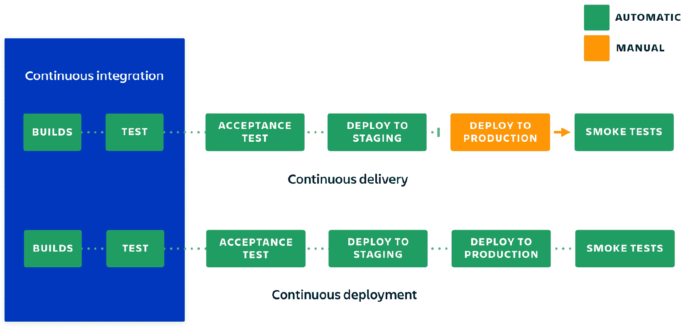

# 第一章：介绍 DevOps 和敏捷

在本章中，我们将介绍 DevOps 和敏捷。我们将探讨一些问题，包括 *DevOps 想要实现什么？*，以及 *敏捷在 DevOps 中扮演什么角色？*。我们还将探讨成功的 DevOps 转型的价值，以及 DevOps 为组织解决的挑战。我们还将学习如何构建 DevOps 成熟度的四个阶段。

在本章中，我们将讨论以下主要内容：

+   探索 DevOps 的目标

+   与 DevOps 相关的价值

+   DevOps 解决的挑战

+   DevOps 成熟度的阶段

+   敏捷在 DevOps 中扮演什么角色？

# 探索 DevOps 的目标

DevOps 是一个通常会引发许多不同意见的话题，关于它意味着什么，以及如何在你的组织中实施 DevOps。DevOps 的目标和它在组织中帮助实现的目标也是根据不同人的经验、他们所在的行业以及组织在采纳 DevOps 方面的成功与否，会得到不同答案的内容。

对于许多组织来说，你可以定义以下共同的 DevOps 目标。这些是适用于大多数组织的目标：

+   部署频率

+   更快的市场交付时间

+   更低的失败率

+   更短的交付周期

+   更好的恢复时间

当然，你的组织可能有不同的驱动因素，甚至对于相似的组织，我也预计他们的目标会略有不同。毕竟，虽然大多数组织面临相同的挑战，但这些挑战如何解决，以及哪些挑战会带来最大的价值增益，也会根据组织的不同而有所不同。

## 部署频率

提高你在组织中发布或部署软件的频率通常是推动 DevOps 采用的关键因素。我们必须开始改变我们在组织内部的协作和沟通方式，以便为最终用户提供价值。

当开发和运维团队开始专注于相同的共同目标时，他们开始更有效地合作并提供更好的价值。

## 更快的市场交付时间

大多数组织将与其他组织竞争其提供的服务。拥有更快的市场交付时间可以为你提供比竞争对手更大的竞争优势。通过 DevOps，你可以通过减少从构想到产品发布所需的时间来增加价值。

作为一个企业，你的价值会随着发布产品功能的时间延长而下降，而你的竞争对手能够更快地领先于你。因此，实现更快的市场交付时间不仅是 DevOps 的关键目标，也是业务的关键目标。

## 更低的失败率

每个组织都会遇到失败，但通过 DevOps，随着时间的推移，你可以预期通过团队之间的协作和更好的沟通来实现较低的失败率。

提示

DevOps 中的跨职能指的是来自不同领域的人们在一个团队中共同工作。

DevOps 使团队能够更紧密地合作并进行更有效的沟通。在成熟的组织中，它允许跨职能团队的协作。这些团队之间及其中个体之间共享的知识，以及对彼此角色的更大理解，有助于降低失败率。

## 更短的交付周期

交付时间是指从开始到完成特定任务所花费的时间。在 DevOps 中，这指的是从用户故事开始工作到该故事发布所需的时间。

与更快的市场响应时间和更短的交付周期紧密相连，缩短交付时间不仅仅是关于产品，还涉及整个生命周期中的各个方面。这可能包括从规划阶段有效捕获需求，到比以前更快地建设基础设施。

通过流畅的流程、有效的沟通与协作，以及高水平的自动化，整个生命周期的交付时间将会更短，从而带来团队的高效表现。

## 改进的恢复时间

当然，我们都知道大多数组织都有**服务级别协议**（**SLAs**）来衡量关键服务指标的表现，如可用性。然而，有多少组织能告诉你，平均需要多长时间才能恢复一个服务呢？并不多。

拥有能够讨论失败原因、理解原因并采取措施防止失败再次发生的协作水平，是成熟组织的标志。一个能够衡量这些指标并采取措施减少这些指标的组织，才是一个更加成熟的组织。

停机时间是组织收入的损失和声誉的损害，因此减少停机时间非常重要。

在本节中，我们探讨了 DevOps 的关键目标以及采用 DevOps 背后的商业价值。接下来，我们将更深入地讨论使 DevOps 成功的价值观。

# 与 DevOps 相关的价值观

当谈到转型时，DevOps 可以分为不同的支柱。也就是说，如果你想从一个高层次的角度而非更深层次的角度来了解 DevOps，你可以将 DevOps 视为四个具体的领域。

这些领域如下：

+   文化

+   人员

+   流程

+   技术

我坚信这些顺序是很重要的。虽然初衷可能是先处理工具问题，但遵循这里列出的顺序将确保你的组织能够从 DevOps 转型中获得更多的价值。

重要提示

文化是成功的 DevOps 转型中最重要的方面之一，甚至比技术的使用更为重要。

DevOps 中文化的重要性不可过分强调；在组织中建立正确的文化可以帮助你朝着正确的方向前进，并在转型后期获得更多价值。你也不应低估改变组织文化的挑战——这需要强大的推动力和高层领导的支持才能成功。

接下来是人员，任何企业和产品的命脉。你必须确保拥有合适的人才，建立起正确的文化，以实现组织设定的目标，而这些人必须具备实现这一目标所需的技能。就像高层管理支持对 DevOps 的重要性一样，拥有合适的人才来执行它同样至关重要。

现在，我们谈到流程。拥有正确思维的人将是那些能够正确引导和推动流程的人，他们会应用适当的技术确保你的流程在 DevOps 的环境中适用。为了实现协同工作，你需要采用一些持续协作的流程，比如计划、开发、发布和监控。最后，你需要具备按需重复这些流程的能力，以提供最大价值。

最后是技术。到这个阶段，你在 DevOps 转型过程中所做的工作应该已经为你的组织带来了极大的价值，但通过引入技术，你可以再增加更多的价值。通过自动化工具，你的流程现在可以按需运行，更频繁地执行，且更重要的是，具有幂等性。这意味着使用相同输入参数的结果随着时间的推移不应发生变化。这就是自动化相比人工执行带来的价值。

在本节中，我们探讨了让 DevOps 成功的价值观。现在我们理解了实施 DevOps 的含义，接下来我们将理解 DevOps 在我们组织中所能解决的挑战。

# DevOps 解决的挑战

DevOps 确实解决了组织中的许多挑战。你需要注意的是，许多挑战已经存在了相当长的时间，并深深根植于人们的工作方式中，要解决这些问题将需要一些时间。

在采用 DevOps 之前，组织通常按职能团队进行划分，并向直线经理汇报，彼此之间以及与更广泛的业务常常是孤立的。如果所有部署条件都满足，代码会被移交给运营团队进行应用部署。这些团队与其他团队一样，各自独立工作，孤立操作，导致了时间消耗大的活动被重复执行，结果也不尽如人意。

DevOps 的挑战通常可以通过以下三句话来解释：

+   开发人员对质量保障和运营中的障碍不清楚。

+   质量保障和运营团队通常不了解产品的商业目的和价值。

+   当团队各自独立工作时，每个团队都有自己的目标，这些目标往往与其他团队的目标相冲突。这导致了低效率。

在前面列表中的最后一点，可以通过开发团队和运维团队的合作来举例。开发人员的优先任务是快速发布新特性，而运维团队的优先任务是保持应用程序的可用性和高性能。这两个目标是冲突的，导致了这两个团队之间的低效。

## 解决这些挑战

这些挑战通过在 DevOps 中将团队转变为跨职能团队来解决，团队成员之间相互协作并沟通彼此的工作及最终结果。总体而言，这种方法提高了反馈的质量，并解决了现有自动化中的问题。

在 DevOps 中，大多数过程是持续的。通过反馈周期来改进已有的内容，这使你能够不断地成熟和演变你的过程，从而从以往的情况中学习，成为一个更加成熟的团队。

重要提示

解决 DevOps 挑战是一个耗时的任务；你不应指望通过几天或几周的努力就能看到即时效果。要实现你设定的目标，可能需要几个月的时间。

现在我们已经了解了与 DevOps 相关的挑战，是时候看看 DevOps 中的成熟度阶段，并了解一个组织如何根据这些阶段进行进展。

# DevOps 成熟度阶段

组织应该随着处理和采纳不同的 DevOps 最佳实践而逐步成熟。这被称为成熟度，四个阶段用于描述 DevOps 中的成熟度阶段。

这些阶段如下：

+   瀑布式

+   持续集成

+   持续交付

+   持续部署

在 DevOps 转型的过程中，组织应从瀑布式方法逐步向持续部署过渡，并在此过程中访问每个阶段。然而，值得注意的是，瀑布式方法并不总是起始点；一些组织在后期才开始进入这些阶段。

在转型过程中，你会发现不同的团队成熟的速度不同。造成这种差异的因素有很多，包括团队所做的工作类型、他们必须遵循的流程，以及一定程度上他们已有的自动化和工具的水平。

## 瀑布式

如果你以前在项目中工作过，“瀑布式”这个术语你一定会很熟悉。瀑布式是一种项目交付机制，任务按顺序完成，以实现特定目标。它也可以用来解释一种软件开发的方法。

开发团队在长时间内编写代码后，这些团队会将代码合并，以发布最新版本。在这种情况下，代码库已经进行了许多更改，集成新版本可能需要几个月的时间。这是因为代码与之前的版本差异太大。

瀑布模型已经在项目管理领域存在很长时间了，即使敏捷方法越来越流行，许多项目仍然使用瀑布方法成功执行。

使用瀑布交付方法的优势如下：

+   模型简单易用，易于理解。

+   由于其僵化性，管理起来较为简单；每个阶段都有明确的交付物。

+   在较小的项目中，由于需求已经非常明确，它能够很好地运作。

+   交付阶段被明确定义。

+   里程碑已被充分理解。

+   任务与资源的安排简单易行。

+   过程及其结果有详细的文档记录。

话虽如此，瀑布模型确实存在一些缺点，正如所有过程模型一样。以下是其中一些缺点：

+   没有时间进行修订或反思。

+   风险和不确定性很高。

+   对于复杂且面向对象的项目而言，这不是一个好的模型。

+   对于长期项目而言，模型效果不佳。

+   直到项目后期才会产生可工作的软件。

+   在各个阶段衡量成功是困难的。

+   集成在最后以大爆炸方式进行，使得识别瓶颈变得困难。

敏捷方法解决了这些挑战，并且与 DevOps 结合使用，可以解决许多在这里描述的挑战。

## 持续集成

**持续集成**（**CI**）是将新开发的代码快速与其余应用程序代码集成的实践，直到最终发布。这样可以在应用程序准备发布时节省时间。这个过程通常是自动化的，并在过程结束时生成构建工件。

持续集成（CI）过程包含多个步骤，这些步骤对于实现有意义且高效的持续集成至关重要。自动化测试是实现持续集成的第一步。持续集成中有四种主要类型的测试可以自动化。这些测试如下：

+   **单元测试**：测试的范围较窄，通常聚焦于特定的代码部分，例如函数的方法，用于测试给定参数集的行为。

+   **集成测试**：确保不同组件能够协同工作。这可能涉及到应用程序的多个部分，以及其他服务。

+   **验收测试**：在许多方面，这与集成测试相似。最大区别在于，验收测试聚焦于业务案例。

+   **用户界面测试**：专注于从用户的角度测试应用程序的性能。

    重要提示

    持续集成的一个至关重要的要素是，进行早期集成并频繁集成。

当你进行频繁且早期的集成时，你能够减少变更范围，从而更容易在发生冲突时识别和理解冲突。这个方法的另一个大优点是，随着变更变得更易于消化，知识共享变得更加容易，而不像大规模的代码变更那样难以处理。

另一个要注意的事项是，如果主分支由于代码提交而出现问题，那么优先级最高的是修复它。在构建失败时，越多的更改会使得理解问题的根源变得越难。

每一个新实现的工作都应该有一套独立的测试。养成编写细粒度测试并追求一定代码覆盖率的习惯非常重要，因为这样可以让你有足够的信心，确保你正在充分测试应用程序的功能。

持续集成的价值在于团队频繁地进行更改时得以体现。确保团队每天都进行这些更改集成非常重要。正如你所记得的那样，频繁集成是确保我们能够轻松识别问题所在的关键。

## 持续交付

**持续交付**（**CD**）是一种方法，团队通过自动化工具频繁且高质量地发布产品，并从源代码库到生产环境都具有可预测性。这是在持续集成（CI）工作的基础上，利用构建工件将构建成果交付到生产环境。

持续交付实际上是与敏捷方法相关的一系列最佳实践。它将你的组织聚焦于开发一个高度精简和自动化的软件发布流程。这个流程的核心是一个互动的反馈环。

这个反馈环路，有时称为持续反馈，着重于尽快将软件交付给最终用户，通过经验学习，然后将这些反馈纳入到下一次发布中。

持续交付是一个独立于持续集成的过程，但它们是相互关联的，在成熟的组织中，二者是一起使用的。这意味着，在你为实现自动化测试所做的持续集成工作之上，你现在可以在构建阶段之后，自动部署所有这些更改。

通过持续交付，你可以决定最适合组织的发布计划，无论是每日、每周还是每月——根据你的需求来定。如果你想获得持续交付的真正好处，那就应该尽快部署到生产环境，确保发布的小批量可以在出现问题时轻松解决。

## 持续部署

持续部署是持续交付的进一步发展。每一个通过生产流水线所有阶段的更改都会直接发布给客户。没有人工干预——在此阶段，测试失败会阻止新的版本发布到生产环境。

持续部署是加速反馈循环并减轻压力的好方法，因为没有发布日。开发人员可以专注于构建高质量的软件，同时在完成工作后的几分钟内看到自己的工作上线。持续集成是持续交付和持续部署的一部分。持续部署与持续交付非常相似；它们的区别在于，发布是自动进行的：

图 1.1 – 显示持续集成、持续交付和持续部署之间的差异

在本节中，我们已了解了 DevOps 成熟度的主要阶段。掌握了这些信息后，我们可以进一步探讨敏捷在 DevOps 中的作用。

# 敏捷在 DevOps 中扮演了什么角色？

常常会混淆“敏捷”（Agile）和“DevOps”这两个术语。它们经常一起使用，甚至可以互换使用，但它们是互斥的术语。DevOps 是将开发团队和运维团队结合起来的实践，而敏捷则是一种强调协作、反馈和小规模快速发布的迭代方法。

虽然两者是互斥的，但从前面的简短对比中，你会发现 DevOps 的目标和价值观也是敏捷的目标和价值观。敏捷是 DevOps 的关键部分。尽管敏捷专注于持续变化，并使开发人员和开发周期更加高效，DevOps 则引入了运维团队来实现持续集成和持续交付。

作为一个项目交付框架，敏捷帮助解决了瀑布模型的一些缺点。由于持续集成、持续部署和持续交付的实践，使用瀑布模型实现 DevOps 是非常困难的，甚至是不可能的。这也是为什么在那些成功实践 DevOps 的组织中，团队会选择使用敏捷作为交付方法的一个主要原因。

## 敏捷宣言

2001 年，17 位成员在犹他州雪鸟的 Wasatch 山脉中会面。 他们的目标是讨论软件开发的未来。接下来达成的是关于当前软件开发现状的沮丧，即使小组无法就如何解决这一问题达成一致。

小组一致认为，组织过于专注于规划和记录软件开发周期，这导致组织失去了关注的重点——客户满意度。

大多数组织讨论企业价值观，如卓越和诚信，但这些价值观并没有促使人们走向更好的工作方式，尤其是软件开发人员。这是一个需要改变的地方。被称为“雪鸟 17”的几位成员已经有了如何改革软件开发并开启新纪元的想法。这次前往雪鸟山的旅程是该小组定义新纪元的机会。

这次旅行的成果就是敏捷宣言。仅 68 个字，这份简洁的文件永远改变了软件开发。宣言中定义的 12 条原则的发布可以说是软件开发历史上最大的变革。在随后的二十年里，这 12 条原则被世界各地的个人、团队和组织广泛采用。

### 文化定义

敏捷领域充斥着许多看似将敏捷转化为实际场景的想法。然而，这并不新鲜；事实上，宣言的诞生源于寻找 Scrum、Crystal Clear、极限编程和其他框架之间的共同点。

Snowbird 17 的最大目标之一是看看这些框架的代表是否能达成一致——他们做到了。最终达成的协议形成了一套定义文化的价值观。

敏捷宣言定义了以下价值观：

+   个人和互动优于流程和工具

+   可工作的软件优于全面的软件

+   客户协作优于合同谈判

+   响应变化优于遵循计划

你可以访问在山上会议中产生的完整宣言，地址为 [`Agilemanifesto.org/`](http://Agilemanifesto.org/)。

另一个来自峰会的产物是 12 条原则（[`agilemanifesto.org/principles.html`](https://agilemanifesto.org/principles.html)），它们遵循这些价值观。它们扩展了构成这些价值观的四个句子。

这 12 条原则如下：

+   我们的最高优先级是通过早期和持续交付有价值的软件来满足客户需求。

+   欢迎变更需求，即使在开发后期。敏捷流程利用变化为客户提供竞争优势。

+   经常交付可工作的软件，从几周到几个月不等，优先选择较短的时间周期。

+   商务人员和开发人员必须在项目期间每天合作。

+   围绕积极的个体构建项目。为他们提供所需的环境和支持，并信任他们完成工作。

+   向开发团队及其内部传递信息的最有效方法是面对面的交流。

+   可工作的软件是进展的主要衡量标准。

+   敏捷流程促进可持续发展。赞助商、开发人员和用户应能够保持稳定的工作节奏，持续不断地推进。

+   持续关注技术卓越和良好设计能够增强敏捷性。

+   简洁——最大化减少不必要工作的艺术至关重要。

+   最好的架构、需求和设计源自自组织团队。

+   定期反思团队如何变得更有效，然后根据情况调整和优化他们的行为。

即使你在阅读本书之前对敏捷和 DevOps 的了解很少，我希望你能在那 12 条原则中看到我们迄今为止探索的内容与敏捷宣言原则之间的联系。

## 敏捷和 DevOps 能否协同工作？

敏捷和 DevOps 听起来像是两个截然不同的概念。事实上，在转型初期，我与许多接触的人对这两个概念感到非常困惑。这种困惑也因为两者各自有自己的术语和口号而加剧。人们通常对 DevOps 众多的定义感到沮丧。

大多数人认为，当你提到“敏捷”时，你指的是 Scrum，而当你提到“DevOps”时，你实际上指的是持续交付。这种简化的理解导致了敏捷与 DevOps 之间的紧张关系，甚至让人误以为敏捷和 DevOps 是敌人。

早在 2008 年，在敏捷大会上，Patrick Debois 和 Andrew Clay Schafer 主持了一场关于敏捷基础设施的讲座，DevOps 与敏捷的关系由此诞生。Patrick 随后创造了“DevOps”这个术语，敏捷大会至今仍然设有 DevOps 主题。

但这不仅仅是历史的原因。现在，让我们深入了解敏捷和 DevOps 之间的实际联系，超越 Scrum 和持续交付的范畴。

## 敏捷不仅仅是 Scrum

当业务或工作本身的局限性要求做出改变时，一个灵活的团队会运用 Scrum 的基本原则，审视自己的实践，并对其进行调整以提高效率。尤其在 Scrum 应用于软件开发之外的领域时，这一点尤为重要。

## 处理未计划的工作

在 DevOps 社群中，那些有敏捷经验的人认识到，Scrum 对于跟踪计划中的工作是非常有帮助的。一些工作可以预先安排：比如交付一个重要的框架变更，迁移到不同的服务器，或进行系统升级。然而，很多任务的执行是自发的：如执行冲刺、系统故障、以及安全漏洞等。这些事件要求快速响应。此时，已没有时间等待任务的过度排队或等到下一个规划会议。因此，许多已经接受 DevOps 思想的团队，会把目光从 Scrum 转向 Kanban。这使他们能够同时跟踪两种工作，并理解它们之间的互动。另一方面，他们采用一种混合方法，通常被称为 Scrumban 或 Kanplan（Kanban 加积累）。

从多个角度来看，Scrum 广泛应用的关键可能在于它不提倡任何技术实践。Scrum 轻量级的管理实践通常对团队产生很大影响。在之前，团队中可能有来自不同专业的需求冲突，而现在，所有的需求都集中在额外任务中。而且，曾经开发中的工作量过大，现在的工作量则由时间实际能完成的任务所限制。通过这种方式，这些变化可以帮助团队提高效率。然而，由于缺乏技术实践，如代码审查、自动化验收测试和持续集成，团队可能会感到受限。

其他敏捷周期，例如极限编程，明确表达了技术实践如何支持团队保持高效流动并为管理者和相关方提供透明度和可见性。一些 Scrum 团队会把技术任务放入这些额外任务中。虽然这对于 Scrum 的指导是合理的，但它很快会面临产品负责人对功能的偏好这一实际问题。除非产品负责人具有非常强的技术背景，否则他们可能没有足够的技能来评估技术实践的成本/效益。当技术任务涉及到支持可靠性、性能和安全性的项目时，产品负责人面临的难度更大。

## 什么是 Scrum？

Scrum 是一个帮助团队合作的系统。Scrum 鼓励团队通过经验学习，在处理问题时自我协调，并回顾他们的成功与失败，以不断改进。

虽然我所讨论的 Scrum 最常被程序开发团队使用，但它的原则和实践可以应用于各种合作。这也是 Scrum 如此流行的原因之一。Scrum 通常被视为一种协作项目管理方法，描述了一组活动、工具和角色，它们共同协作以帮助团队构建和管理他们的工作。

在你的组织中应用 Scrum 不是一项简单的任务，你会遇到一整套全新的术语。这里有一个简短的清单，尽管它并不全面：

+   Sprint

+   Sprint 计划

+   仪式

+   待办事项

+   回顾

+   站会

虽然 Scrum 可能是敏捷中最常用的框架，但也有许多其他框架。比如看板和 Kanplan，正如我们接下来要讨论的，它们对新接触敏捷的组织非常有用。

## 看板

看板是一种常见的框架，用于执行敏捷和 DevOps 软件开发。它需要持续沟通工作限制，并提供一个清晰的视图，显示计划中的工作、进行中的工作和已完成的工作。

Kanban 通过将工作放置在物理或数字看板上来工作。这种可视化使你能够限制在制品的数量，并最大化你的工作效率，有时被称为团队的流动（flow）。

许多人在日常工作中使用某种形式的 Kanban 看板。事实上，我认识很多人，他们在家里做日常任务时也会用看板。这个看板被分成不同的列，每一列定义了任务的不同状态。

你的 Kanban 看板还将定义在制品（work in progress）、交付点和承诺点方面的限制。

## Kanplan

你可能没听说过“Kanplan”这个词。它是一种方法论的混合，但也许正适合你的团队。

重要提示

当为团队选择敏捷框架时，并没有“灵丹妙药”。框架中不同的方法论根据许多不同的参数有其优缺点。每个团队都需要确定哪个框架最适合他们在规划、跟踪和发布软件时的需求。

Kanplan 结合了 Scrum 和 Kanban 的特点。它非常适合那些希望整理待办项但没有能力进行冲刺（sprint）的团队。它提供了一个很好的折中，因为团队并不总能完全应用 Scrum 的所有内容（包括冲刺），但可以很容易地使用 Kanplan 开始更好地管理他们的工作、在制品、待办项以及这些待办项的优先级。

## 在组织内混合方法论

不同的团队采用敏捷框架中的不同方法论，互相混合并使之适合自己，并没有什么不对。我从未与任何一个组织合作过，他们能够简单地从敏捷教科书中挑选某种方法并在他们的组织中实施。

想想那些无法使用传统 Scrum 的运营团队，主要是因为他们的工作中包含了许多不可预见的工作，如事故处理。对于他们来说，Kanban 非常适用，因为它不强调规划。再想想在你们组织中，负责产品的完整 DevOps 团队。在这种情况下，传统的 Scrum 方法对他们是有效的，因为一切都在他们的控制之内，并且他们不依赖于外部团队。

最后，想想那些希望更具敏捷性的工程团队，但又需要与其他不实践任何敏捷方法的团队合作。这是一个棘手的情况，因为虽然他们希望更具敏捷性以交付更高质量的工作，但组织内其他团队没有采纳敏捷方法论的意愿。在这种情况下，Kanplan 对他们来说是个不错的选择，它能让他们根据优先级整理工作待办项，并在 Kanban 风格的看板上进行工作，从而使他们能够直观地看到工作、在制品限制以及已完成的工作。

这种方法是适合这种描述的团队的一个很好的起点，它将使他们朝着更高质量的工作目标迈进，能够在不需要整个组织跟进的情况下，融入一些 DevOps 的技术方法。

## 扩展敏捷团队

通过我们到目前为止学到的内容，我们可以看到在组织中实施敏捷可以带来许多好处。然而，组织的规模远大于单个团队，你可能会有多个团队共同开发一个产品。此时我们需要理解如何将敏捷扩展到一个组织中的多个团队。与在单个团队层面实施敏捷相比，后者相对容易，企业级的实施才是真正的挑战。

在企业级别扩展敏捷要求我们采用敏捷概念，以及在职能层面采用精益敏捷。这包括财务、采购、人力资源和销售等领域。在企业级别，敏捷是跨多个团队和大量工程师以投资组合方式进行实施的实践。

重要说明

在企业中扩展敏捷要求你从职能角度思考。到目前为止，我们所探讨的内容仅限于团队层面。要扩展敏捷，你必须把它看作是一项全组织的工作。

Netflix 创造了“*高度一致，松散耦合*”这一短语，你仍然可以在他们的主要招聘页面看到这句话。它描述了一个高度成熟的组织，整个企业都使用敏捷开发。

当谈到在企业级别扩展敏捷时，两个非常受欢迎的模型是**规模化敏捷框架**（**SAFe**）([`www.scaledagile.com/enterprise-solutions/what-is-safe/`](https://www.scaledagile.com/enterprise-solutions/what-is-safe/))和 Spotify 模型([`www.atlassian.com/agile/agile-at-scale/spotify`](https://www.atlassian.com/agile/agile-at-scale/spotify))。这两者都非常受欢迎，所以我们来更详细地了解它们。

### 规模化敏捷框架

直接引用自 SAFe 官网，这是 SAFe 的定义：

''规模化敏捷框架（SAFe）使复杂的组织能够在大规模上实现精益敏捷软件和系统开发的好处。''

该框架定义了四个核心价值：

+   一致性

+   内建质量

+   透明性

+   程序执行

SAFe 实际上涵盖了四个主要领域：敏捷开发、精益产品开发、系统思维和 DevOps。然而，它的核心更注重前述列表中描述的四个价值观。

一致性是确保你跟上快速变化、破坏性竞争力量和地域分散团队的步伐所必需的。在这些场景中，一致性至关重要，因为敏捷团队非常出色，但战略和一致性不能仅仅依赖所有敏捷团队的意见。一致性来自于企业级的商业目标。

系统越大，质量越高。关于质量的重要性，尤其是在大型系统中，是无可争议的。内建质量确保了整体解决方案中的每个元素都能够反映出在整个开发生命周期中所需的质量。你可以通过敏捷测试、**行为驱动开发**（**BDD**）和**测试驱动开发**（**TDD**）来理解这一点。

透明性源于开发解决方案的难度。随着问题的发生或计划未能如预期进行，如果没有高度的透明性，事实就会变得模糊，任何决策过程将无法基于实际数据做出最佳决策。建立信任需要时间，然而，透明性是信任的来源，它通过 SAFe 在多个层次提供。最重要的是，如果团队无法持续执行或交付价值，那么这一切都无关紧要。SAFe 强调工作系统和业务成果。我们知道，虽然许多组织开始时通过单个团队进行转型，但随着这些团队在可靠且高效地交付更多价值时遇到困难，他们会感到沮丧。

### Spotify 模型用于扩展敏捷

对于全球分布的众多工程师而言，Spotify 成功的一个关键部分是公司确保工作的组织方式能够增强敏捷性的做法。在 Spotify 工程团队的历程中，这一做法已经被记录并与世界其他地方分享。

这个模型，现在被称为 Spotify 模型，是一种以人为中心的方法，专注于敏捷扩展中的自主性，且强烈关注网络和文化。多年来，这帮助了 Spotify 以及许多其他组织通过专注于自主性、沟通、协作、问责和质量来提升创新和生产力，但最重要的是交付。

重要提示

虽然通常被称为 Spotify 模型，但它并不是一个框架。这只是 Spotify 从文化和技术角度看待如何扩展敏捷的一种方式。它是如何在产品环境中组织多个团队的一个示例。

该模型首次在 2012 年引入（[`blog.crisp.se/wp-content/uploads/2012/11/SpotifyScaling.pdf`](https://blog.crisp.se/wp-content/uploads/2012/11/SpotifyScaling.pdf)），并且受到了领域专家的广泛审视。经过检查，它展现了 Spotify 在敏捷性方面的极简方法。从那时起，它引起了大量的关注并变得流行。

这个总体主题是提倡团队自主权，它通过几种方式描述了组织的结构。它通过以下术语来实现这一点：

+   小队

+   部落

+   章节

+   行会

小队是组成部落的团队，章节帮助主题专家相互保持联系，行会则帮助团队在整个组织内保持一致，而章节则使你能够在一个部落内保持团结。

重要说明

像其他敏捷模型一样，确保在组织内部实施时，有足够的反馈机制和透明度，以建立和维持信任与自主的文化，是非常重要的。

现在我们已经理解了敏捷在 DevOps 中的角色，我们知道它在许多方面是 DevOps 的核心，并且如果我们想要成功，它至关重要。

# 摘要

这就是第一章的内容。到目前为止，我们已经介绍了一些将在本书其余部分中使用的术语，并确保你对 DevOps 的主要概念有了良好的基础理解，包括它给组织带来的价值、它能够帮助你解决的挑战，以及敏捷方法在 DevOps 中的作用。

在下一章中，我们将探讨 DevOps 如何给业务带来好处，以及根据你的结构，如何使用不同的团队拓扑来取得伟大成就，并强调一些 DevOps 的陷阱以及如何避免它们。
