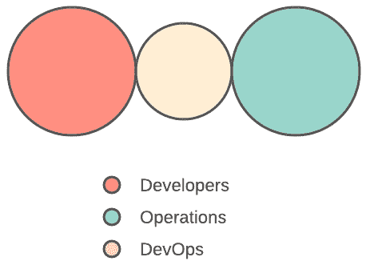

# *第二章*：DevOps 的业务收益、团队拓扑和陷阱

展示 DevOps 如何能为您的业务带来好处的能力，在推动成功所需的变革时非常重要。本章将探讨 DevOps 转型的业务利益，以及在 DevOps 转型过程中可以采用的团队拓扑结构。最后，本章还会讨论可能导致 DevOps 转型项目失败的陷阱和错误。

本章将涵盖以下主要主题：

+   DevOps 的关键业务利益

+   转型拓扑

+   转型反模式

+   避免转型失败的项目

# DevOps 的关键业务利益

在 DevOps 转型过程中，获得组织内高层领导和高级管理层的支持至关重要。如果没有这种支持，您的转型将面临严重的挑战，甚至可能在真正开始之前就失败。

确保获得必要支持的一种方法是确保高层领导和高级管理层了解 DevOps 的业务利益。您不能仅仅向单个团队或领导解释技术或局部的好处。他们想要了解的是，这种新工作方式为什么值得他们投入资金，如何帮助业务加速发展。

简而言之，如何确保 DevOps 能够解决您组织的**关键绩效指标**（**KPIs**）和业务目标？

重要提示

在开始 DevOps 转型时，尽早争取高层支持是非常关键的；这样，您可以根据与高层和高级领导的讨论，适时调整您的方法。

为了最好地准备与高级领导的会议，讨论 DevOps 转型，您首先需要了解业务目标。这不是在高层次上的目标，而是在绩效衡量层次上——业务具体希望通过哪些指标来推动其绩效仪表盘的变化？这些是您可以着眼于 DevOps 如何帮助推动这些关键绩效指标（KPIs）的领域，例如：

+   **客户体验**（**CX**）

+   业务增长

+   成本节省

+   提高生产力

+   提高员工保持率

+   更高质量的产品

+   提高客户满意度

+   提高操作和流程效率

现在，让我们更详细地了解这些元素，以便更好地理解它们。

## 客户体验

在任何业务中，客户推动着成功，而更好的客户体验（CX）最终推动着产品的续订和业务的增长。客户体验对任何企业的成功至关重要。提高整体客户体验可以促进客户忠诚度、保持率和利润，并且能缩短销售周期。

在 DevOps 中，改进的生产支持是关键，也是 DevOps 存在的基础支柱之一。开发团队和运维团队之间更好的协作，通常最终能提升产品质量。正是这些因素对客户体验（CX）产生直接影响。

单凭这一点，CX（客户体验）就能得到极大的提升，因为业务团队和技术团队都专注于最优的输出，或者说——相同的目标。

## 业务增长

随着销售和客户服务的增长，前景也在增长。特别是，随着公司增长的提升，可用于企业的资本也会增加。这些资金可以再投入到业务中，进一步发展流程和系统。此外，提高的生产力和绩效确保员工有更多的时间，并能被解放出来专注于更高效、更具收入潜力的项目。

## 降本增效

值得注意的是，这里列出的所有变化和改进都有助于减少整体成本。生产和绩效的提升带来更高的销售、降低的运营成本以及更高的客户满意度，这些都会进一步改善收入。DevOps 明确鼓励持续的变革和发展循环。

## 生产力提升

更多参与且忠诚的员工意味着更高的生产力，尤其是当他们相信自己所做的事情时。但不仅仅是这一因素能导致生产力的提升。

在**信息技术**（**IT**）领域，团队通常被要求用更少的资金做更多的事情，这时自动化工具就发挥了作用。它们能够自动化和优化那些重复且频繁轮换的内部流程。DevOps 认可这种做法，尽管它已扩展到市场的其他领域。自动化常见任务为员工释放了时间，使他们能够集中精力处理更有意义的工作，并花更多时间做自己擅长的事。

## 提高员工留存率

毫无疑问，员工参与度是组织成功的最关键因素之一。如果员工在工作中不满意、效率低下或不合规，无论是表现还是整体结果都会受到影响。

高性能和功能完善的 DevOps 工作环境已被证明能大大提升员工体验。这一趋势不仅鼓励更高的员工参与度和生产力，还增强了品牌忠诚度。当当前的员工感到满意时，这对于员工留存率是个好兆头，也能吸引新人才加入。

尽管现在稍显过时，Puppet 的 2016 年 *DevOps 状态报告* ([`puppet.com/resources/whitepaper/2016-state-of-devops-report`](https://puppet.com/resources/whitepaper/2016-state-of-devops-report)) 显示，在 DevOps 组织中运营的推广者，比低绩效 DevOps 公司的人推荐他们的公司给朋友的可能性要高出 2.2 倍。

## 更高质量的产品

DevOps 提倡一种持续一致和优化的开发文化，这不可避免地导致应用程序和产品的改进。具体来说，在软件开发中，目标是减少产品中发生的错误或 bug 的数量。

## 更高的客户满意度

客户服务与满意度之间有着强烈的关联。体验越好、越乐观，满意度评分就越高。这意味着，当然，如果 DevOps 提升了客户体验（CX），它也会提升客户满意度，前提是部署得当。

## 提高运营和流程效率

由于 DevOps 呼吁重新评估和演化当前的流程和开发操作，出现了向更高性能提升的趋势。随着公司致力于提升整体运营，他们正在朝着能够提供更高性能的流程、方法和实践迈进。常识告诉我们，整体而言，整个公司将因而看到生产力的提升。

但也有数据支持这一举措。CA Technologies 的一项研究，*通过敏捷和 DevOps 加速速度和客户价值*（[`docs.broadcom.com/doc/accelerating-velocity-and-customer-value-with-agile-and-devops-research-paper`](https://docs.broadcom.com/doc/accelerating-velocity-and-customer-value-with-agile-and-devops-research-paper)），显示了实施 DevOps 的组织在他们监控的组织或流程绩效的 KPI 中看到 40% 的增长。

# 转型拓扑结构

每个组织都是不同的；即使是同一行业的组织也存在差异，原因有很多。为了使转型尽可能有效，有许多不同的拓扑结构可用于与组织中的其他团队合作，具体如下：

+   开发与运营协作

+   共享操作

+   DevOps 作为服务

+   DevOps 倡导

+   **站点可靠性工程**（**SRE**）

+   容器驱动

你可能会认识到其中一些，可能来自你自己的组织。不过，实际上还有更多，这些拓扑结构都有详细记录，海报形式可以在 *DevOps Topologies*（[`web.devopstopologies.com/`](https://web.devopstopologies.com/)）购买。

重要提示

对于你来说，开始转型之旅时，按照前述的拓扑结构之一进行调整是常见的做法，等到你足够成熟时再切换到另一种模型。这种方法没有问题，在大多数情况下，这会带来更高的成功率，而不是一开始就瞄准顶峰。

## 开发与运营协作

第一个模型可能是最受欢迎的，并且通常被视为 DevOps 的黄金模型或理想模型。这个模型使得组织内的开发团队和运营团队能够顺畅协作，如下图所示：

图 2.1 – 显示开发人员与运营团队协作的示意图

各团队会在必要时共享知识，但每个团队都会专注于特定的产品或产品的一部分。这通常会涉及多个不同的开发团队。

这种模型非常有效，特别适用于那些拥有强大技术领导力的组织。不过需要注意的是，要实现这种模型，你将需要经历一场重大的组织变革。

为了成功实现，你需要管理团队中更高层次的能力支持。同样重要的是，开发和运营团队必须有非常明确且可衡量的共同目标，无论是提高可靠性、增加部署频率，还是其他目标。

你的运营团队必须与开发团队紧密合作，并且熟悉他们的一些流程和工具；这包括**测试驱动开发**（**TDD**）和用于源代码控制的 Git。此外，开发人员还必须非常重视运营功能，并在功能实现方面寻求运营团队的意见。

总的来说，这需要在文化上进行高度变革，改变这些团队过去的合作方式，因此虽然这种模式非常有效，但实现起来非常困难。你可能会发现自己一开始实施的是另一种模式，并随着组织的成熟逐步朝这个目标努力。

## 共享运营

如果你在一个以产品团队为单位运作的环境中工作，而不是以单独的职能团队为单位，那么我们就能看到共享运营拓扑图。在这种拓扑图中，开发和运营团队之间几乎没有什么分隔，大家都专注于共同的责任。下图展示了这一点：

图 2.2 – 显示开发人员与运营团队之间分隔极少的示意图

与前述模型一样，这种模型也有很高的效果，非常适合任何拥有单一产品或服务的组织。从实际情况来看，它是我们之前讨论的模型的一种形式，但具有一些特殊的特征。

拥有单一产品的组织——例如 Netflix、Spotify、Facebook 和 Twitter——可以实现这种拓扑结构。然而，我认为，除了专注于单一产品的情况下，这种拓扑结构并不太适用。

在拥有多个产品线的组织中，预算约束和产品线之间的焦点切换通常会导致开发和运营团队进一步分离，很可能回到前述的模型。

另一种描述这种拓扑结构的方式是**NoOps**。在这种模型中，运营团队没有明显的独立性。

## DevOps 作为一种服务

到目前为止，我们已经看过有利于初创企业的拓扑结构，因为它们可以从零开始以正确的方式构建，或者有利于大型企业组织，它们寻求改变自己的运营模式。对于那些可能没有足够预算、经验或员工来主导其产品运营方面的小型组织，开发团队可能会依赖外部服务提供商，示例如下图所示：

图 2.3 – 显示 DevOps 作为服务拓扑结构的图示

服务提供商的角色是帮助他们构建环境，自动化基础设施，并提供平台的监控。提供商还可以就开发周期中所需的运营功能提供建议。

重要提示

尽管我们称这种拓扑结构为**DevOps 作为服务**，但重要的是要强调，首先，这种模式不可扩展，客户必须与服务提供商以相同的方式工作才能使其顺利运作，但这并非总是可能的。

这种拓扑结构对于较小的组织来说，有助于学习与运营相关的方面，例如自动化、配置管理和监控。对于服务提供商来说，实施这种拓扑结构作为商业模式的问题在于，这些较小的组织在技能积累后，可能会转向第一个或第二个拓扑结构，因为他们会招聘更多的运营人员。

总体而言，这种模型对于那些经验有限的小型组织可能会有所成效，但如果尝试在大型组织中实施，可能会停滞不前。

## DevOps 倡导

当组织倾向于在开发与运营之间存在较大差距时，我们可以引入倡导拓扑结构作为促进团队。这个拓扑结构可以帮助保持开发和运营之间的沟通与合作，具体示例如下图所示：

图 2.4 – 显示 DevOps 倡导拓扑结构的图示

这种拓扑结构适用于所有类型的组织，尤其是在存在漂移趋势的地方。采用这种拓扑结构的结果可能是多种多样的，但它可能会带来非常有效的结果。

重要提示

在使用 DevOps 倡导模型时，要注意 DevOps 团队孤岛反模式。

为了高效运作，倡导团队必须有特定的任务，即促进开发和运营团队之间的沟通与合作。团队成员通常被称为**DevOps 倡导者**，因为他们的目的是帮助传播 DevOps 实践，并促进团队之间的协作。

对这种拓扑结构的警告是，它可能会迅速出错。你必须确保将你的倡导团队与开发和运维团队的日常交付分开。他们不能被日常工作所吸引，否则他们会失去对目标的专注。

## SRE

这种拓扑结构常被称为**谷歌模型**，与我们之前探讨的其他拓扑结构不同。DevOps 通常会说开发团队应加入值班轮换，但这并不是一个要求。包括谷歌在内的组织采用了一个稍微不同的模型，即开发团队将工作交接给负责运行软件的团队。这时，SRE 团队便发挥作用，如下图所示：

图 2.5 – 显示 SRE 拓扑结构的图示

然而，这种拓扑结构至关重要的一点是，SRE 团队在代码部署到生产环境时拥有最终决定权。团队可以拒绝不符合运营标准的发布，并要求开发人员解决问题。

开发人员需要通过日志、指标和测试结果向 SRE 团队证明发布版本达到了足够高的标准，以便 SRE 团队能够支持。

重要提示

使用 SRE 拓扑结构时，必须小心开发与运维之间的壁垒。单纯地将你的团队重命名为*站点可靠性工程师*并希望它能奏效是解决不了问题的。

这种拓扑结构很独特，虽然它听起来像是今天大多数组织中使用的常见模型，但它只在具备高水平工程能力和成熟度的地方才真正适用。否则，你将解决不了任何问题，且没有那种成熟度，SRE 团队也没有权力拒绝。

因此，这种拓扑结构可能要么非常低效，要么极其高效——最终结果完全取决于你的文化。

## 容器驱动

最后，我们来谈谈容器驱动的协作拓扑结构。容器可以消除开发与运维之间的一些协作需求。这是通过将应用的开发及任何运行时需求封装在容器中来实现的。容器充当开发与运维职责之间的边界，如下图所示：

图 2.6 – 显示容器驱动拓扑结构的图示

在良好的工程文化下，这种拓扑结构运行得很好，但如果开发人员开始忽视或没有妥善考虑运营方面的问题，那么这种拓扑结构可能会退化为典型的*我们和他们*的局面，就像 SRE 拓扑结构一样。

就像 SRE 拓扑结构一样，要注意开发与运维的反模式，即运维只是被期望去执行开发人员交给他们的任何任务。

# 转型反模式

在 *转型拓扑* 中，我们探讨了有助于 DevOps 转型的模型，并了解了它们旨在实现的目标。然而，在这里，我们关注的是反模式：这些是可能适得其反、阻碍 DevOps 转型进展的工作方式。

每个反模式都是具体的，我相信你们中的大多数人在职业生涯中至少遇到过以下一种：

+   开发与运维孤岛。

+   DevOps 团队孤岛。

+   开发不需要运维。

+   DevOps 作为工具团队。

+   过誉的系统管理员。

+   运维嵌入开发。

让我们在接下来的章节中详细分析每一种情况。

## 开发与运维孤岛

这是我知道每个人都经历过的反模式。这是典型的 *把它扔过墙*（或插入你可能用的任何其他说法）。在许多方面，这个反模式（如下面的图示所示）引发了很多问题：

图 2.7 – 展示开发与运维孤岛反模式的图示

从开发者的角度来看，功能可以标记为完成，当他们的工作完成时，他们可以为其申报故事点，但该功能可能还没有投入生产，甚至可能在生产环境中无法正常工作。

可操作性也会受到影响，因为开发人员无法获得足够的背景信息来理解运维中的功能，而运维团队则没有足够的时间或意愿与开发人员合作，在上线前修复问题。

大多数人都知道这不是我们希望的工作方式，尽管我们知道这种反模式很糟糕，知道问题出在哪里，但我认为有些拓扑更糟。

## DevOps 团队孤岛

我能想到的唯一一个可以接受的情况是，当一个独立的 DevOps 团队在孤岛中运作时，那就是这个团队的存在是暂时性的。这可能与我们在上一节中讨论的倡导型拓扑相契合，即该团队有明确的任务，通过其努力将各团队紧密联系在一起，改善团队之间的协作和沟通，如下图所示：

图 2.8 – 展示 DevOps 团队孤岛反模式的图示

这个反模式出现在管理层或高层决定 *他们需要做 DevOps* 并启动一个 *DevOps 团队* 时。这个团队很可能由 *DevOps 工程师* 组成；问题在于，这个团队很快就会变成一个独立的孤岛。它会阻碍开发与运维的紧密合作，工具和技能将成为内部争斗的主题，每个人都会捍卫自己的立场。

## 开发不需要运维。

当你把开发人员及其管理者表现出的傲慢与天真混合在一起，尤其是在启动新项目时，通常会做出假设，认为运营已经是过去的事情，尤其是在使用云原生技术时。关于良好的操作技能的重要性和复杂性，常常会被大大低估，正如下面的图表所示：

图 2.9 – 显示“无需操作”反模式的图表

他们相信自己可以在没有运营的情况下进行操作，或者利用空闲时间来覆盖他们所执行的活动。如果团队意识到运营作为一种专长，和软件开发一样重要且有价值，那么他们就能避免许多痛苦和基本的操作错误。

## DevOps 作为工具团队

尽管该团队的成果可能有益，但其影响是非常有限的。你可以从改进的工具链中受益，但根本问题在于缺乏早期的操作参与和整个开发生命周期中的协作，正如下图所示：

图 2.10 – 显示 DevOps 作为工具团队反模式的图表

一个 DevOps 团队被设立来处理部署所需的工具，如流水线、配置管理、机密管理等。这种情况发生在你设置一个团队，目的是为了不影响当前开发团队的工作速度（故事交付）。

运营团队继续孤立工作，继续像第一个反模式那样将发布*抛给对方*。

## 美化过的系统管理员

DevOps 工程的问题已经被讨论了很久。许多人认为它根本不是一个概念；但我认为它是的，而且已经被许多组织广泛采用。不过，理解基础设施工程师和 DevOps 工程师之间的区别是非常重要的。我曾就这个话题写过一篇博客文章：[`blog.m12d.com/hiring-the-ideal-devops-candidate`](https://blog.m12d.com/hiring-the-ideal-devops-candidate)。这种反模式在下图中得到了说明：

图 2.11 – 显示美化过的系统管理员反模式的图表

这种反模式在工程成熟度较低的组织中非常典型。虽然组织强烈渴望改进实践并减少开销，但他们往往忽视了 IT 是推动业务发展的核心因素。

在 DevOps 的行业成功并不明显；遗憾的是，这意味着一些组织仅仅因为他们的竞争对手在做*DevOps*，他们也想要*做 DevOps*。这些组织没有反思当前团队结构和团队间关系中的空白，而是决定为他们的运营团队招聘*DevOps 工程师*。

所有这些所能达到的，仅仅是对以前的基础设施工程师角色或系统管理员角色的重新命名。除了职位名称通常要求更高的薪资外，并没有发生任何文化或组织变革。

重要提示

是人际沟通和软技能使 DevOps 蓬勃发展，而非技术技能。

随着人们纷纷追随潮流，寻找具备工具、自动化和云技能的候选人，这种反模式越来越普遍。

## 嵌入开发中的操作

当一个组织——无论出于何种原因——不想维持独立的运维团队时，开发团队就承担了基础设施的责任。当这种情况发生在产品驱动型环境中时，运营责任项目往往受到资源限制，并且常常被降级优先级，导致次优的处理方式，如下图所示：

图 2.12 – 展示开发中嵌入操作反模式的图示

与我们讨论过的许多反模式一样，这个也显示了对有效操作技能重要性的缺乏认知。操作的价值大大降低，因为它被视为开发人员的一个烦恼。

# 避免失败的转型项目

现实是，项目会失败。DevOps 转型也不例外，和所有项目一样，你应该为此做好准备，并在可能的情况下从他人的错误中学习，采取控制措施，以便不仅从这些错误中学习，还能防止它们再次发生。

以下是 DevOps 转型项目未按计划进行并且常常被放弃的五大原因：

+   将 DevOps 举措植根于客户价值中

+   组织变革管理不善

+   未能进行协作

+   未能采用迭代方法

+   在 DevOps 举措中对期望管理不善

让我们更好地理解这些原因。

## 将 DevOps 举措植根于客户价值中

各行各业的许多公司都受到业务方面的建议，认为他们需要加速寻找新机会和应对威胁。你确实有这种迫切的需求，但是我们必须确保加速的需求是基于消费者的价值。仅仅需要变得更快是不够的，我们需要更快速地交付价值，或者也许根本不是速度的问题，而是需要创新。

在尝试解决业务问题时，如果出现混乱，DevOps 将帮助企业更快地进行实验，找到正确的答案。

仅仅因为 DevOps 的名义而决定推行 DevOps 的领导者面临失败的风险，因为员工与*DevOps*这个词并没有建立关联。相反，你需要将这些努力所带来的益处与员工和公司联系起来。这意味着要了解谁是消费者，他们认为重要的是什么，以及如何满足这些需求。  

## 组织变革管理  

我看到的一个主要问题，不幸的是，这个问题不断重复出现，那就是忽视组织中的变革。  

当你试图一次性融入重大变革而没有足够的学习时间时，这会导致低成功率的改进。领导者应通过认识到并表达消费者的重要性来发起组织变革。DevOps 及其所需的改进不是可选的，员工必须理解这一点，并且明白为什么需要变革。  

我们还需要专注于消费者满意度，因为客户与价值相关，而不是与*DevOps*这个词相关。我们需要进行迭代，确保我们有能力学习和发展。  

## 未能协作  

有效的 DevOps 项目需要与所有利益相关者合作，以解决出现的挑战。然而，许多 DevOps 项目仅限于单一领域，这限制了它们的有效性。  

重要提醒  

协作是 DevOps 的基石；如果不能促进团队之间的强大协作，将导致工作方式几乎没有变化，甚至可能使部门之间的孤岛问题更加严重。  

组织也常常犯一个错误，那就是根据员工的技术能力而非他们的合作意愿来招聘。当我们组建一个 DevOps 团队时，我们希望团队成员能够相互协作——他们喜欢团队合作。他们聪明、有动力、技术熟练，能够保持自己和他人的责任感，并且享受学习，因为 DevOps 绝不是一成不变的。

我们仍然可以在技术技能上培训优秀人才，但要让态度差、动力不足的人改善是非常困难的。  

## 未能采用迭代方法  

在一个阶段内推出 DevOps，周五进行培训，周一开始执行这一过程，会导致更高的失败率，特别是对于大型组织来说。渐进的迭代方法使公司能够专注于质量改进，并通过给你学习的机会、纠正方向、改进每次尝试并向前迈进，去避免更快方法的风险。  

我们需要创建一个学习居于前列和中间的环境，迭代将帮助我们做到这一点。  

先行者战略是较好的方法之一。*先行者*是指通过反复操作和学习，企业能够在竞争中获得优势的单一价值流。先行者应该是政治上友好的，以便利益相关者愿意给予 DevOps 一个公平的尝试，理解错误是不可避免的，并且能够从中学习，通过创造适当的价值来建立信誉并增加支持，同时向公司呈现一个可接受的风险水平。

我们的目标不是将整个工具链和从开发到输出的端到端、全方位、一体化解决方案结合起来。我们的目标是改善工作流程，并随着时间的推移不断改进。

## DevOps 项目的期望管理

利益相关者对 DevOps 的关注，往往会预期错误的结果，这其实是很正常的。例如，许多人期望工作流程能最小化成本，而它其实应该是一个价值导向的过程。另一个错误的期望是，DevOps 只是关于那些可以轻松应用的资源，而实际上它是一项涉及组织变革的艰巨任务。

重要提示

你能做的最重要的事情之一，就是设定合适的期望。成功转型为 DevOps 通常比你想象的要花费更多时间。

到头来，所有的一切都归结于确保你所交付的符合标准。这也是我为什么要提醒大家，对于自己承诺的事情要保持警觉的原因。无论他们是使用咨询机构的数字，还是市场调查中的数字等等，你无法准确知道这些数字会带给你什么样的具体结果。但请意识到你的期望。

## 解码失败的 DevOps 转型

在我们解开 DevOps 失败背后的原因之前，关键的部分是要理解 DevOps 的定义。这是我们在 *第一章*《引入 DevOps 和敏捷》中讨论过的内容，但让我们再总结一次，内容如下：

+   DevOps 不仅仅是团队协作。

+   DevOps 不仅仅是一个工具链。

+   DevOps 不仅仅是一个软件开发模型。

+   DevOps 不仅仅是敏捷性和质量。

+   DevOps 不仅仅是开发和运维之间的一座桥梁。

可以说，关于 DevOps 的内容如此繁杂，导致了混乱，这也在实施过程中给组织带来了问题。一些拥有最好工具的大型组织在实施 DevOps 时也遇到困难，因为他们没有掌握基础。

### 文化对成功有着巨大的影响。

如果你回想一下*第一章*，*介绍 DevOps 和敏捷方法*，我曾经强调过，在做任何事情之前，首先要注重培养文化。文化是加强组织结构的传统、价值观和信念。DevOps 不仅仅是工具的集合；你需要在组织中建立一种 DevOps 文化，才能取得成效。

### 仅仅依靠工具无法奏效，那么如何建立正确的文化呢？

这实际上是对前面一点的延续。组织往往追求工具以实现目标，而不是文化的变革。仅仅这一点就是 DevOps 失败的最大原因之一。

事实是，文化是复杂且困难的。我们将在后续章节中对这一点进行更详细的讨论。

### 为你的组织定义 DevOps

在这个数字化时代，任何组织都是一个以技术为驱动的组织，无论其领域如何。从*数字化转型*到*持续数字化之旅*的过程，需要灵活性、敏捷性和一致性，这三者是最重要的方面。

DevOps 已经成为那些关注软件分发的公司，或者那些为了一致性和卓越性向客户发布升级或新功能的公司必不可少的一部分。

毫无疑问，DevOps 会使软件开发变得更加容易，但每个公司都有不同的需求。

### 自动化和速度可能不是你想的那样

Knight Capital，一家实时股票交易公司，使用自动化让交易对客户更快速、更简便。在为其应用程序编写新代码时，新的代码错误地与一个旧的、未删除但已停用的功能同名。

结果，Knight 的应用程序在几分钟内就进行了数十亿美元的购买，公司因此被罚款**640 百万美元**（**USD**），并因此破产。

经常，组织会误解自动化。DevOps 通过**持续集成/持续交付**（**CI/CD**）原则，自动化软件开发过程。市面上有大量的工具可用于源代码管理、测试、维护和存储。

重要提示

自动化是一个极其强大的组成部分，但你绝不应忘记机器与人类结合的力量来提高准确性。

### DevOps 意味着赋能团队中的每个人

人员是 DevOps 失败的一个关键原因。不能只关注增长和运营团队。

DevOps 需要团队中所有认为团队合作是关键职能的成员的参与。为了使 DevOps 有效，你需要找到合适的人，给他们正确的技能，并给予他们时间去体验 DevOps 文化。

一位来自流行网站的软件工程师正在将数据库列重新组织到与数据库相关的工具中，以加深自己对数据库的理解。与此同时，他们没有意识到自己也在修改实际数据库中的列顺序，这导致许多用户无法访问服务器。

# 总结

这标志着第二章的结束。在这一章中，我们探讨了 DevOps 带给组织的关键业务收益，并讨论了可以帮助团队取得最大成功的拓扑结构。反过来，我们也了解了反模式，即在 DevOps 转型过程中需要避免的团队模式。最后，我们讨论了如何避免 DevOps 转型项目失败，并举了一个 DevOps 失败的例子。

在下一章中，我们将讨论如何在组织内衡量成功，以及设定适当目标的重要性。

# 问题

现在让我们回顾一下本章内容，并验证我们所学到的知识。看看你是否能回答以下问题：

1.  以下哪项不是 DevOps 的关键业务收益？

    a) CX

    b) 生产力提升

    c) 以更少的资源做更多的事

    d) 更高的客户满意度

1.  哪种转型拓扑被视为黄金标准？

    a) 共享运维

    b) DevOps 作为服务

    c) 容器驱动

    d) 开发与运维协作

1.  以下哪项是导致 DevOps 转型失败的原因？

    a) 未能协作

    b) 采用迭代方法

    c) 成本节约

    d) 更好的员工留存
