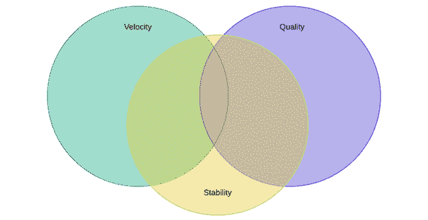

# *第三章*：测量 DevOps 成功的方法

您必须能够指出显示组织内 DevOps 成功的指标和测量方法。选择正确的指标对展示您的进展至关重要，确保团队与愿景保持一致并赋予人们权力。本章将探讨在 DevOps 中使用的各种指标以及如何衡量成功。

在本章中，我们将讨论以下主要主题：

+   用于衡量成功的常见指标

+   为您的团队设计指标

+   在组织层面创建汇总数据

# 用于衡量成功的常见指标

首先，了解为何要衡量您的绩效很重要。我与许多各类企业的领导人交流，一个令人担忧的趋势是，他们都认为衡量成功是一种可以用来帮助绩效管理的工具。

现实情况是，绩效追踪是改进的工具。**持续改进**（**CI**）是 DevOps 的关键支柱，因此，如果您不知道自己的表现如何，如何进行改进呢？改进应该是用于 DevOps 的指标的主要目标，这些指标可以推动实际结果，并突显增长领域。

在查看可以使用的度量标准之前，我喜欢将它们分为三个类别。随后您将在本章后面看到，根据您管理的团队类型，您可以从每个类别中选择适当的度量标准来评估您的表现，并生成有用的反馈方法。您从每个类别选择的度量标准数量取决于您的目标和团队的风格。请参考以下图表：

图 3.1 – 显示速度、质量和稳定性关系的维恩图

上述图表背后的理念是展示，在理想情况下，您可以从三个类别中平衡地选择度量标准，但可能出现某一类别占比更多的情况。在所有情况下，您会注意到稳定性始终存在。

在此模型中存在以下可能性：

+   **速度** + **稳定性**

+   **质量** + **稳定性**

+   **速度** + **质量** + **稳定性**

稳定性至关重要，因为无论我们在组织内做什么变更，稳定性都应该是我们所做一切的核心，并且在任何情况下都不应该影响这一点。

首先，让我们看看您可能与速度相关的指标。在 DevOps 中，当我们谈论速度时，我们指的是同时具备速度和方向性。

## 常见的速度指标

在 DevOps 中，速度非常重要，因为我们正在尝试打破组织内的隔离，并改善协作和沟通。具有考虑速度的指标在突显改进领域时非常有用。有了这个想法，让我们看看一些常见的速度指标，如下所示：

+   部署持续时间

+   部署频率

+   变更量

+   测试自动化覆盖率

+   交付时间

+   周期时间

+   部署失败率

+   环境准备时间

从高层次来看这些指标后，我们现在将更加详细地了解它们，以理解每个指标的含义。

### 部署持续时间

部署持续时间是执行**持续部署**（**CD**）流水线所需的时间。如果你在生成构建并同时运行部署，而不仅仅是使用最新的构建产物，那么需要记录 CI 和 CD 流水线的时间，但要确保你能够了解每条流水线执行所需的时间。大多数工具都可以让你查看每条流水线的开始和结束时间，以及执行的步骤。

### 部署频率

测量部署频率可以帮助你了解你部署了多少次。在成熟的组织中，目标是一天进行多次部署。是否达成这一目标取决于多个因素。

重要说明

随着部署次数的增加，绘制进度图可以展示你在 DevOps 转型中的实际进展。

### 变更量

在 DevOps 中，通常会存在一个误解，即你不遵循正常的变更管理程序。实际上，情况正好相反——透明性非常重要，而没有比变更管理更适合服务管理中的透明性工具。你可以测量每个迭代周期中的变更次数，甚至是每月的变更次数，以了解你发布了多少次版本。

### 测试自动化覆盖率

测试自动化也是 DevOps 中自动化的一项关键部分。谈到测量测试自动化的覆盖率时，我们指的是应用程序或代码库中被自动化测试覆盖的部分。

### 交付时间

在 DevOps 中，如果你希望快速交付功能，那么交付时间是一个重要的度量指标。交付时间是指从将某个任务加入待办事项到该任务交付发布之间的时间。通过这个指标，你可以测量从待办事项到生产环境平均需要多长时间。

### 周期时间

和交付时间非常相似的是周期时间。这个指标的细微差别在于，周期时间不是从某项任务加入待办事项到该任务交付，而是从开始处理该项任务到完成或交付这项任务的时间。

### 部署失败率

识别部署失败率有助于团队确定代码和测试的质量，从其他阶段迁移到生产阶段。这是代码和流水线成熟度的领先指标。部署失败显然是你需要了解的事项，监控有助于发现这个问题，但记录你的部署失败率百分比也是很重要的。这可以让你了解你的部署失败的频率。成熟的组织会寻找一个低于 5%的部署失败率，尤其是在大量部署的情况下。

### 环境准备时间

当使用**基础设施即代码**（**IaC**）来部署环境时，就像在衡量部署持续时间时一样，环境配置时间让你了解部署环境所需的时间。在拥有大量微服务的环境中，这是一个很好的指标，因为随着你部署更多的微服务，你将能够看到配置时间如何希望减少。

重要提示

随着你的组织在成熟度上不断进步，回顾你从何处出发非常有用。从一开始就追踪这个指标，以便你能够看到你的进展。

现在，让我们来看看与质量相关的一些指标。

## 常见质量指标

正如我们之前讨论的，衡量稳定性很重要；其次是质量。你可以拥有很高的开发速度，意味着你在快速工作，但由于此速度，质量可能会受到影响。这并不是你想要的情况，因为低质量会逐渐侵蚀对你所做工作的信任，以及你如何进行工作的信任。以下是你可以在组织中使用的一些常见质量指标：

+   缺陷密度

+   缺陷老化

+   代码质量

+   单元测试覆盖率

+   代码漏洞

+   标准违规

+   缺陷重新引入率

现在我们了解了可以使用的质量指标，让我们更详细地再看一遍，了解它们的含义。

### 缺陷密度

你可以通过多种方式来衡量缺陷密度。最常见的方式是计算每 1,000 行代码的缺陷数。使用这个指标有助于冲刺规划。随着时间的推移，你可以使用这个指标来估算每个冲刺中可能出现的缺陷数量。

随着**集成开发环境**（**IDEs**）和自动化工具的采用，识别代码行可能变得困难，但它仍然是一个重要的指标，而且大多数开发工具能够克服这一限制。

重要提示

缺陷密度的计算公式是缺陷数/**代码行数**（**LOC**）发布版本。请注意，这只是特定版本的情况，而非整个代码库。

### 缺陷老化

这是一个有价值的指标，简单来说，它是衡量缺陷从报告到积压列表到当前日期之间的时间，前提是该缺陷仍然未解决。在技术债务方面，追踪此指标非常重要。它让你了解平均而言，缺陷在解决前被保持开放的时间。

### 代码质量

当我们谈论代码质量时，很容易认为我们是在谈论标准违规的数量。我们将把这个指标作为另一种质量指标来讨论。在这个上下文中，当我们谈论代码质量时，我们指的是整个应用程序的质量。这可以通过整个应用程序的百分比来表示。这个指标的下降部分是违反代码质量的数量，这些标准由您编写代码的语言的许多规则集定义。

### 单元测试覆盖率

单元测试覆盖率以百分比表示。它覆盖了开发人员编写的单元测试所覆盖的应用程序部分。在**测试驱动部署**（**TDD**）环境中，测试在功能代码之前编写，组织通常将 80%的覆盖率视为最低要求。

### 代码漏洞

扫描您的代码以发现已知漏洞是良好安全实践的基本组成部分。因此，了解每个版本中的漏洞数量是一个关键指标。当您编写新功能或修复其他问题时，可能会在应用程序的其他区域引入漏洞。跟踪这个指标对于确保您遵循良好的安全实践至关重要。

### 标准违规

静态分析工具可以详细查看您的源代码，并突出显示不符合标准的代码区域。这些标准通常是社区驱动的或专业设定的标准。然而，某些工具允许组织设置自己的标准规则。这个指标为您提供有关开发人员如何遵循标准基准开发的相关信息和洞察。

### 缺陷重新引入率

尽管您可能会这样认为，但这个指标实际上跟踪的是开发人员本地测试的有效性。通过这个指标，我们衡量的是被报告为破坏其他功能并导致其他缺陷被提出的缺陷数量。您有时会看到这个指标被称为*缺陷泄漏*。

最后，让我们看看常见的稳定性指标。如果您有服务管理背景，您会认识到其中的一些指标。

## 常见的稳定性指标

稳定性至关重要——就像糟糕的质量可能会破坏内部和客户的信任，糟糕的稳定性也会如此。没有人愿意使用不稳定的产品或平台。监控工具旨在帮助您了解发生了什么以及它如何影响稳定性。以下指标帮助您衡量稳定性：

+   **平均修复时间**（**MTTR**）

+   部署停机时间

+   更改失败率

+   每次部署的事件数量

+   未批准的更改

+   热修复数量

+   平台可用性

现在让我们更详细地看一下这些常见的稳定性指标。

### 平均修复时间（MTTR）

我发现这个指标非常强大，比衡量可用性更有用，尤其是在云环境中，平台的可用性比传统数据中心环境更不容易控制。衡量 MTTR（平均修复时间）是指从系统或产品失败到重新可用的时间。随着时间的推移，这个平均值应当逐步减少。

### 部署停机时间

这个有趣的指标通过时间查看你的应用或产品在部署过程中不可用的平均时间。你可以将其衡量为一个月或冲刺中的整体可用性的百分比，或衡量特定的时间段。

### 变更失败率

正如我们之前讨论的那样，利用变更管理、对失败负责，并将变更失败率作为已实施变更的百分比来衡量非常重要。这可能是变更管理团队已经在衡量的内容，但建议为你的 DevOps 团队单独进行具体的衡量。

### 每次部署的事件数

没有什么比通过跟踪每次部署产生的事件数量更能理解发布对你的用户群体产生的影响了。像 ServiceNow 这样的系统能够将发布与事件关联，因此你可以轻松查看是哪次发布引发了该事件。这些事件可以回溯为 bug。

### 未经批准的变更

任何优秀的变更管理职能都会追踪平台上未经授权或未经批准的变更。其中一些可能是紧急发布，正在等待文档跟进，但有些可能是真正的变更，代表了学习的机会。

### 热修复的数量

衡量你部署的次数以及它们发生的速度固然重要，但你发布的 bug 修复或热修复的数量呢？采取措施减少这些数字也是判断一个 DevOps 组织是否成熟的重要标准之一。

### 平台可用性

这是一个典型的指标，衡量平台的可用时间，表示为百分比。最基本的形式是，百分比越高，平台的可用性就越好。一些组织有信用制度来补偿那些没有达到合同约定的可用性阈值的客户。

这就结束了我们对衡量 DevOps 成功的常见指标的探讨。那么，如何在实际场景中应用这些指标，应该设定哪些基准目标呢？

# 为你的团队设计指标

现在我们已经理解了 DevOps 中涉及的关键指标，接下来重要的是了解这些指标可以在什么场景中使用。你在组织中可以追踪过多的指标，这样反而会适得其反。

知道使用哪些指标取决于许多不同的参数。然而，我们现在将查看一些示例场景，描述它们的 DevOps 转型目标，并了解哪些指标可以帮助他们识别成功。

## 场景 1：拥有专门 DevOps 团队的小型组织

对于小型组织而言，它们之间的共同点之一是能够变得更加灵活，打破团队之间的壁垒。较小的团队可以更快速地获得反馈并缩短周期时间。事实上，大多数小型组织整体上壁垒更少，有些甚至没有壁垒。

在这个场景中，假设我们在组织内有一个专门的 DevOps 团队，由六个人组成。该组织只运营一个产品，该产品以**软件即服务**（**SaaS**）模式向客户销售。

在这个例子中，互动非常简单。由于组织规模适中，团队之间协作良好，角色和职责也得到了很好的定义。像大多数这种规模的组织一样，随着他们的成长，也出现了一些初期的问题，例如由于执行压力导致的质量下降。

对他们来说，专注于稳定性和质量同样重要，以确保高质量能带来更好的稳定性。接下来我们将查看他们可以使用的四个指标及其原因，如下所示：

+   **MTTR**（平均恢复时间）——了解恢复应用平台所需的时间至关重要。组织需要考虑平台未来的发展方向。这一点尤为重要，因为随着平台的增长和扩展，这些发现可以促成架构上的改进，从而缩短平均恢复时间。

+   **平台可用性**（> 99%）——提供合同激励措施以保持平台的可用性可能有助于提高稳定性，但需要警惕：这也可能给团队带来不必要的压力，甚至使问题更加严重。进行简单的测量并讨论停机的原因及如何从长远解决这个问题，要比施加压力更具生产力。

+   **单元测试覆盖率**（> 80%）——确保良好的测试覆盖率非常重要。由于该组织存在较高的缺陷率，确保良好的单元测试覆盖率将确保进行更好的测试，并确保代码按预期运行。

+   **缺陷密度**（< 1/1,000 行）——该组织的发布曾经出现过问题。了解缺陷的密度将帮助他们做出更好的规划，并了解在开发过程中哪些问题会转化为缺陷。

现在我们来看一个不同的场景，适用于一个拥有宣传团队的中型组织。

## 场景 2：拥有宣传团队的中型组织

对于这种情况，我们的组织有独立的运营和开发团队，他们在倡导团队的帮助下，尝试更好地协作。其目标是通过使用不同的技术促进他们之间适当水平的协作和沟通，同时继续进行日常工作。

如前一章所述，倡导团队在冲刺团队中并不负责具体的交付任务，而是推动 DevOps 最佳实践，帮助团队实现设定的目标。

对于一个中等规模的团队来说，稳定性和质量在其成长过程中非常重要，但了解工作速度（velocity）同样重要。团队需要对其长期的表现有一个广泛的视角，以便随着团队的成熟，做出相应的调整。我们来看一下该团队可以用来跟踪表现的指标，如下所示：

+   **提前期**——跟踪提前期能够帮助团队了解时间的使用情况，从积压项的分配到交付完成。这有助于团队在未来做出更好的规划，提供合适的估算，并帮助识别可以简化流程的领域。

+   **周期时间**——同样，了解从开始工作到交付的平均时间，也为团队提供了帮助他们改进估算和计划会议的指标，随着时间的推移提升客户满意度。

+   **单元测试覆盖率**——作为一个新成立的 DevOps 团队，拥有高质量的代码非常重要，但了解当前的情况更为关键。这有助于突出因缺乏优质单元测试覆盖率而继承的技术债务。

+   **代码质量**——与单元测试覆盖率类似，这一指标将帮助团队了解开发人员的技能差距，并通过针对问题领域来改进。

+   **MTTR**——记住：稳定性非常重要，了解恢复服务所需的时间也是如此。这些信息会反馈到团队的改进周期中，帮助他们再次改进。

+   **部署停机时间**——最后，任何新成立的 DevOps 团队都需要了解他们在发布期间工作的影响。衡量发布停机时间可以帮助你在未来改进自动化过程，甚至将手动部署转为自动化部署。

现在我们来看一个大型组织的场景，组织中有多个 DevOps 团队。

## 场景 3：拥有多个 DevOps 团队的大型组织

当你拥有一个包含多个不同规模的 DevOps 团队的大型组织时，确保每个团队专注于自己的优先事项非常重要，尤其是他们的目标是什么。然而，业务的整体目标必须始终牢记在心，指标可以帮助确保这一目标得到跟踪。

对于这个场景，我们的大型组织正在寻求提高整体开发和发布的速度。当然，正如我们在本章之前讨论的那样，这不能以牺牲稳定性为代价。

从 DevOps 角度来看，他们的挑战是改变已持续多年的传统工作方式，而且存在一些繁文缛节，使得流程变更变得困难且缓慢。

现在让我们看看他们可以使用的指标，以确保在保持稳定性的同时，实现提高速度的更广泛目标，具体如下：

+   **交付时间**——了解从积压工作中处理事务的速度非常重要，特别是在团队需要快速调整并改善结果的环境中。这可以帮助你了解在确保流程精简方面需要做什么。

+   **部署频率**——如果目标是提高发布节奏，那么这个指标是必不可少的。你可以了解你部署的频率，并与其他指标结合使用。确保这不仅仅是一个数字，而是多个高质量的发布。

+   **变更失败率**——错误在快速变化的环境中难以避免。我们可以通过这个指标帮助所有团队了解他们的发布是否高质量，不仅仅是功能层面，而是通过遵循现有的变更管理政策来确保他们在改变部署方式时的质量。

+   **热修复次数**——发布热修复是可以的；它们是开发生命周期的重要组成部分。追踪热修复的次数可以帮助团队理解稳定性，同时也可以平行评估质量。这是一个在快速变化环境中寻找快速变更时非常有用的指标，但正如之前所讨论的，错误是难以避免的。

    重要提示

    在这些类型的组织中，团队可能会各自为战。要将它们紧密结合在整体目标上是困难的，但找到共同的指标可以帮助解释这一点。团队可能有相同的指标，但基于产品或能力的不同，领先和滞后指标可能会有所不同。

现在让我们看一下另一个小型组织场景，这次是与外包的 DevOps 团队合作的场景。

## 场景 4：与外包 DevOps 团队合作的小型组织

对于一些希望获得 DevOps 带来的好处的小型组织，外包可以用来让一个专业的第三方团队与组织合作，达成多个目标。

这可能包括交付的帮助、敏捷方法的执行，或是环境的支持和将自动化作为整体解决方案的一部分。第三方可以以多种方式使用，具体取决于组织的规模和需求，这将改变第三方参与的范围。

对于我们的小型组织来说，重点是提供更高水平的自动化，特别是在测试方面。这将帮助他们推进 DevOps 的进展。

现在我们来看一下我们可以为这个团队使用的指标，具体如下：

+   **测试自动化覆盖率**——由于团队的规模，他们将测试自动化外包了。使用这个指标来查看提供的自动化覆盖率，并随着时间的推移逐步增加这个数值。

+   **部署失败率**——部署失败率有很多关注点，但这个团队决定关注测试关卡的失败。使用这个指标将帮助团队了解失败的原因、频率，并通过探索找出为何发生失败。

+   **部署停机时间**——与前面的指标类似，跟踪部署中的停机时间可以帮助你与第三方进行互动。这能帮助你们共同改进组织内的 CI 和 CD 流水线，在你们不断发展时也能提升效率。

+   **平台可用性**——了解第三方如何在你的环境中运行至关重要。理解平台的可用性是必需的，当他们犯错导致故障时，你需要考虑如何追究责任。这个问题需要妥善处理，避免强硬语气，应该有合作改善而不是惩罚的态度。

在所有四个场景中，你都可以使用不同的指标来衡量自己；然而，这并不意味着某些指标比其他指标差。关键在于你想要衡量的是什么，你衡量的是你希望整体改善的内容。

现在我们已经看过了你可以在不同场景中使用的各种指标，那么当你有多个团队在实践时，比如在*场景 3*中，情况会怎样呢？你如何确保报告的层次适当？让我们在接下来的章节中看看答案。

# 在组织层面创建汇总

无论你的组织是否在实践 DevOps，清晰的沟通都是成功的关键之一。在沟通你的**关键绩效指标**（**KPIs**）时，这一点同样重要。

你必须确保向组织内的领导展示的数据清晰、简洁，并能准确反映组织的表现。

在 DevOps 中，特别是当你需要传达全组织的进展时，你首先需要解释这些指标对更广泛业务的意义。指标的含义和展示内容并不总是显而易见的。

重要说明

尽量使用清晰的措辞向高层领导展示，即使这意味着需要改变对指标的解释。将其与他们理解的内容关联会更容易，而不是在高层会议中面对关于如何衡量、为何衡量等问题。

DevOps 中的另一个关键因素，特别是在衡量速度时，是要理解并非所有团队都是平等的。即使从内部来看，当团队交付的内容看似非常相似时，团队的工作方式和运作方式意味着这两个团队的速度不太可能成为可比的度量标准。

因此，我*永远*不建议通过使用诸如**故事点**等简单的度量标准来比较团队。团队可以内部使用这个指标来查看他们在规划分配给他们的工作方面的有效性，并且在冲刺期间，利用前一个冲刺的输出，看看他们的表现如何以及在哪些方面能在规划上做得更好。

提示

如果你使用故事点来衡量已完成用户故事的速度，请务必不要将此指标公开显示在高层管理的仪表板上。

## 多个团队协作时的报告

如果你的组织有多个团队在一个产品上工作，并且每个团队负责产品的不同部分，那么创建汇总报告就非常简单。就像任何项目一样，你会报告整体进展与任何计划的对比。在这种情况下也是如此。

每个团队可能在不同的业务分析师的指导下，处理各自的功能和需求，但他们都将为同一个共同的目标而工作，并朝着这个目标协调一致。因此，你需要理解最终目标的样子，然后你可以创建衡量该目标的指标。

这种风格可能被称为高层管理得分卡，或者有时被称为业务得分卡。它列出了显示你是否在成功之路上的关键绩效指标，或者是否有障碍阻挡你的前进。

## 多个团队协作多个产品时的报告

当你有多个团队在多个产品上工作时，你可以采用类似之前提到的策略。将每个产品团队视为一个团队，并创建反映该团队在该产品上完成的工作的报告。

记住之前的讨论：没有两个团队是完全相同的，无论他们是同一产品组还是不同产品组。即使他们在不同的产品上工作，也要小心不要跨不同的产品比较团队，即使他们在不同的产品中工作着相同的交付物。

根据你的组织情况，多个产品之间可能完全不相关，这种情况下，创建将业绩汇总到更高层次的报告没有任何意义。

例如，如果你的组织拥有多个相关的产品，并且它们通过某个更高层的营销组合在一起（也许你的组织有一个实际由多个产品组成的总产品），那么尽可能地将你的报告对齐到这个最高层级。

它是跨业务领域都能理解的顶层指标，因此，当报告我们在本章前面讨论的速度、质量或稳定性指标时，确保它们与能够实际理解的最高层级相关联。

## 制定 S.M.A.R.T 目标

为你的产品制定目标，或从高层领导那里获取目标，并将其分解成更具操作性的任务，可能是一项困难的工作。

在你的部门中，你可能需要将一个更高层次的目标分解为不同团队之间更易管理的目标。这时与 DevOps 的协作和沟通就显得尤为重要。当一个更大的目标被拆分为多个小团队的目标时，相互协作和交流对确保完成根本任务至关重要。

在商业领域，一个常见的设定可衡量和可实现目标的工具是使用**S.M.A.R.T**方法。如果你之前没听说过，这就是它的含义：

+   **具体**

+   **可衡量**

+   **可实现**

+   **现实可行**

+   **及时**

S.M.A.R.T.目标有不同的版本，但这些是我偏好的定义。它真正意味着，要设定一个合适的目标，必须回答以下五个问题：

+   你到底想做什么？

+   你怎么知道自己已经达成了目标？

+   这个目标在你的能力范围内吗？

+   你认为自己能实现这个目标吗？

+   你什么时候希望完成这个目标？

我之前多次使用过这个方法，你可以在*Mind Tools*（[`www.mindtools.com/pages/article/smart-goals.htm`](https://www.mindtools.com/pages/article/smart-goals.htm)）找到更多关于这个方法的详细信息。

一个简单的例子是，你想学习如何使用某个特定工具——例如：*我想了解如何在 Azure DevOps 中创建管道*。那么我们如何将这个目标变成 S.M.A.R.T.呢？下面是做法：

+   **具体**—我想学习如何在 Azure DevOps 中使用**YAML Ain't Markup Language**（**YAML**）创建管道。

+   **可衡量**—能够在没有我们**主题专家**（**SMEs**）帮助的情况下，创建用于部署*应用程序 X*的有效管道。

+   **可实现**—我需要学习如何构建基本的管道，然后理解我们的流程，以便我可以学习如何将合适的项目添加到管道中，完成构建。

+   **现实可行**—通过观看在线视频、与我们的专家合作以及参加在线课程，我能够实现这个目标。

+   **及时**—我将在 6 个月内实现这个目标。

使用这里展示的模型，你可以清楚地知道自己要实现什么目标，如何实现这些目标，需要什么资源，最后——你将在何时实现这些目标。

你可能在表格中有多行描述不同的目标，并且可以使用步骤来描述实现目标的方法。关键是将其写下来。

# 总结

在本章中，我们查看了衡量 DevOps 成功的最常见指标，并探讨了确保定义成功标准的重要性。我们通过不同团队的场景，突出了一些可以用来跟踪其成功的指标。最后，我们探讨了如何确保从组织层面进行跟踪，而不是过于关注单个团队。

DevOps 中最大的挑战之一是衡量成功。运用你在本章中学到的技能，你可以为你的组织实施有意义的目标和指标来衡量成功。

在下一章中，我们将探讨如何在 DevOps 中建立文化，以及如何打破组织中的隔阂以实现最大效率。
