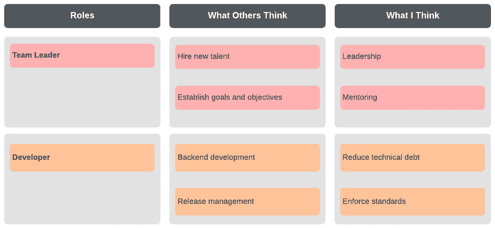

# *第四章*：构建 DevOps 文化并打破部门墙

在本章中，我们将探讨 DevOps 中文化的含义，如何在组织内构建成功的 DevOps 文化，以及为什么文化是 DevOps 中一个重要的方面。我们还将看看 DevOps 文化的特征，如何在组织内维持强大的文化，以及如何打破现有的部门墙。

在本章中，我们将涵盖以下主题：

+   什么是 DevOps 文化？

+   为什么文化很重要？

+   维持强大的文化

+   打破组织中的部门墙

# 什么是 DevOps 文化？

在之前的章节中，我们稍微谈到了文化。现在是时候深入讨论了。文化有许多含义，但在 DevOps 中，我们谈论的文化实际上是开发与运维团队之间的共享理解，以及他们对所构建应用程序的共同责任。这大致可以转化为以下几点：

+   提高透明度

+   更好的沟通

+   跨团队合作

尽管有些人认为 DevOps 只是技术的演变，但实际上 DevOps 远不止于技术。DevOps 并不是对工具或平台的技术性演变，它并不会改变你在组织中使用的工具或平台。

DevOps 中的文化也不仅仅是让团队决定他们自己的命运；它是关于团队间的合作。实施这些措施可能让人感到害怕，但我希望带您走过四个可以帮助实践这一点并在组织中建立正确文化的步骤。

我们接下来要讨论的所有内容将帮助我们更好地理解之前提到的关键要点，并开始在您的组织中培养正确的文化。

## 角色和职责研讨会

为团队定义非常清晰的角色和职责有助于打造强大的文化。这样可以避免人们不清楚自己该做什么，并确保每个人都知道自己在做什么，同时意识到每个人的角色对整体团队的重要性。

将您的团队纳入本次会议；这是一个非常有意义的经验，并且通过大家共同参与角色和职责的制定，形成了团队之间的相互契约。

看看下面的图表。这是一个角色和职责研讨会输出的示例：

图 4.1 – 角色和职责矩阵示例

您可以利用前面的示例，借助团队的帮助，定义组织内的角色，然后完成其他团队成员认为该角色应承担的职责。

重要提示

如果您在远程工作，可以将此内容转化为 Word 文档并共享，以便团队协作编辑。

完成这一步后，与团队一起讨论你们的成果，并达成一致，明确责任分配。你可能会发现自己将某些成员调到其他角色，这没问题，只要确保团队达成一致。

一旦会议结束，确保首先与团队分享成果，确保不再需要任何反馈。所有人完成后，通知其他领导们这就是你团队将要采用的工作方式。

这种高度协作的方式在团队内部建立了牢固的关系，这种关系很难打破，并将为你的成功奠定基础。

## 协作规则

听起来可能像是军事术语，但这是一个严肃的练习，未来可能证明它非常有价值。将这次练习的产出视为与你团队的社会契约，应该每季度更新一次。

定义你的协作规则就是定义*你们如何共同工作*。如果你在一个跨职能团队中，那么在早期定义这些规则可以防止团队内部的紧张情绪积累。你也可以称之为你团队的工作协议。

从向团队提问一些简单的问题开始：

+   作为一个团队，对我们来说，什么是重要的？

+   我们如何避免过去的错误？

+   表现良好的团队都做了什么，我们可以借鉴？

首先，请团队成员私下写下他们的答案。这一反思时刻将帮助为会议定下基调。接下来，要求团队写下一个让团队合作成功的声明。

当你完成后，将所有答案汇总在一起，并将相似的声明合并。如果你有一个小团队（少于五人），可以让他们写下两条声明。

然后，你们作为团队对这些想法进行投票。投票的目的是为了协作，投票结果是书面协议中的承诺。如果一个想法被投反对票，只需询问将其转为支持票需要什么条件，并看看团队是否同意。

重要提示

定期与团队跟进你的协议；将它放在团队经常访问的地方，以便他们时刻提醒自己你们共同达成的协议。

关键是要促进与团队的开放讨论，使他们思考如何成功地合作。保持开放、诚实，最重要的是，保持尊重。

## 回顾会议

进行回顾会议是敏捷实践中的一部分，你可能已经习惯了这种方式。这种技术侧重于在每个迭代结束后召集团队，详细讨论上一个迭代的内容。与**Scrum Master**一起，团队将回顾上一个迭代的成果以及那些未能按计划完成的事情，看看哪些可以改进。

回顾会议的氛围应当促进持续的改进与学习。它被视为一个安全的空间，可以讨论什么是有效的，什么可能无效，以及什么可以改变。通常，每次冲刺后都会举行回顾会议。

对于大型组织，你可以由每个团队的领导每月主持一次回顾会议，讨论 DevOps 的采用情况。就像冲刺回顾一样，与领导讨论哪些有效，哪些无效，及他们希望如何改变你们的 DevOps 转型。

进行回顾的技巧很简单。通过快速搜索，你可以找到许多不同的回顾方式。你应当时不时地改变回顾的方式，以保持团队的参与感。我发现作为领导者进行回顾非常有价值，而且准备工作几乎不需要时间。你应该预留大约 1 小时来进行回顾会议。你甚至可以很轻松地在线上进行回顾。

如果你在办公室完成回顾会议，请确保你的会议空间准备好白板和一些马克笔，另外还要准备便签和一个能清晰显示的计时器。

如果你在进行远程回顾会议，你可以使用软件让大家将虚拟便签放到相应的标题下。对于面对面的会议，你可以设置四个不同的区域，供大家放置便签。

现在，要进行一次非常简单的回顾，你只需根据适当的时间安排做以下几点：

+   **准备（15 分钟）**：无论是数字化方式还是纸质方式，设置四个标题：*做得好的地方*，*做得不好的地方*，*我们可以做得更好的地方？*，最后还有一个是*行动项*。

+   **基本规则（5 分钟）**：花几分钟时间解释并设定基本规则。每次回顾最关键的是记住评论不是针对个人的；每个评论都是有效的，因此要以开放的心态倾听。设定你将讨论的时间段（上一个冲刺、上个月、上个季度等），并专注于改进，而不是指责。

+   **什么做得好（15 分钟）**：将你对上一时间段内做得好的内容写下来并放到相应的标题下，或者创建一张数字卡片，记录你个人的想法。

+   **什么做得不好（15 分钟）**：将你对上一时间段内做得不好的内容写下来并放到相应的标题下，或者创建一张数字卡片，记录你个人的想法。

+   **我们能做得更好什么？（15 分钟）**：将你对上一时间段内可以做得更好的内容写下来并放到相应的标题下，或者创建一张数字卡片，记录你个人的想法。

+   **行动（10 分钟）**：最后，记录下回顾中提出的任何行动项。如果你是远程工作，确保拍摄成果照片或截屏。讨论提出的想法并分配跟进责任。

    重要提示

    如果你面临大量的行动项，可以使用投票系统来帮助团队优先处理紧急事项。常见的投票系统示例包括 Lean Coffee 和 Scrum poker。

现在我们理解了 DevOps 文化是什么，接下来有必要了解这种文化为何如此重要。

# 为什么文化很重要？

我总是喜欢把文化描述为 DevOps 的支柱。可以把 DevOps 想象成一棵树，其中有人员、流程和技术作为树枝，但它们都由文化相互连接。

在我多年的 DevOps 工作经验中，服务于不同的组织，所有的工作都让我明白，即使拥有世界上最好的流程、最优秀的工程师以及最好的技术支持，但如果没有最好的文化，并且不去改进这种文化，那么一切努力都将是徒劳的。

在本章早些时候，我们列出了 DevOps 中文化的三个重要方面；我们来回顾一下这些内容：

+   增加透明度

+   更好的沟通

+   团队间的协作

为了理解文化为何重要，我们来更详细地看看这三个方面。通过这种方式，我们可以逐步构建出文化为何如此重要的全貌。

## 增加透明度

透明度在许多商业领域是基础，但随着层级的降低，透明度可能会稀释，这并非有意为之，而是因为团队的工作方式和历史积淀所致。这通常不是某个具体个人的过错，而是组织整体文化的漂移。

开发团队通常面临巨大的压力，要在组织内发布软件，这可能导致这些团队绕过运维团队所设定的控制措施。正是这一点根本上导致了团队之间的紧张关系，因为开发人员现在拥有非标准的基础设施，而且这种基础设施的使用方式无法被运维控制。这一切最终导致了我们所说的**影子 IT**。

你会发现，许多人将公共云服务视为缺乏透明度的原因；然而，这个问题早在公共云讨论之前就已经存在。事实上，正是自助服务时代使得这一问题更加严重，但即便在那之前，这一问题早已存在，无论是自助服务还是公共云的出现。

如果你把开发人员请求虚拟机的过程看作是通过自助门户进行的，运维团队将只部署操作系统的基础设施。此时，他们对该基础设施不再有任何洞察。

关于公共云，你也可以做同样的解释，当开发人员表达对运维工作拖慢其进度的不满时，他们会转向公共云服务提供商，并自己使用这些服务。

然而，这种方法的三个主要缺点是什么？

+   合规性标准的验证

+   Infrastructure utilization and efficiency

+   Cost control

Almost every organization I have spoken to at the start of their cloud journey has cited cost control as a problem. But what does this mean? Let's now look at some ways to improve transparency.

### Verification of compliance with standards

With the delivery of a baseline operating system, or for cloud-native resources the baseline configuration of that resource, applications that are deployed and any database instances deployed on the virtual machines are all items that have standards in most organizations for compliance.

As an operations team, when you are blind to what is deployed on your servers and have limited control, you lose ground in your security posture and end up not knowing whether the applications and development tools are security patched.

The exact same scenario can be said when consumed directly from a cloud provider without the knowledge of the operations team.

### Infrastructure utilization and efficiency

If your developers build 10 machines, with limited control, operations have no idea whether those resources are fully utilized, when they are utilized, whether they can be turned off outside of working hours, or whether they apply for a special licensing benefit.

These decisions, or lack of decisions, can have implications for capacity planning and the future ability to scale the platform and build critical services.

### Cost control

Finally, developers are unlikely to realize the benefits of a cloud provider if they take that route on their own, the benefits of a scalable platform, and the benefits of overall spending a cloud platform can bring.

Spending outside of the main budget has an overall detrimental effect on the business and its ability to operate without distractions.

## Better communication

Some of the things we have just discussed fall quite naturally into better communication as well. Imagine if developers and operations were able to communicate better with each other. From an infrastructure perspective, they could collaborate with operations to work on templates that match their requirements and operations could explain the controls in place for the security of the business.

That mutual understanding then becomes working practice and the developers get the infrastructure builds in a timely manner and operations keep control.

This isn't the only place where better communication helps you build culture though. Communication can be made more efficient in a number of different ways:

+   Operations participation in sprint planning

+   Developers performing releases

+   Operations working in development sprints

+   Developers working in operations

These examples may seem trivial, but they can have a real impact on the overall experience of those involved and can make them think about their interactions. Over time, this helps improve communication.

### Operations participating in sprint planning

你经常会听到运维团队的经典反馈之一是，开发人员很少考虑到环境因素，且运维方面的挑战、问题和需求没有被充分考虑。

我们在《*转型拓扑*》一节中讨论的一个模型，在*第二章*《*商业效益、团队拓扑与 DevOps 的陷阱*》中提到，强调了将运维与开发更加紧密地结合。在*第一章*《*引入 DevOps 与敏捷方法*》中，我们也探讨了敏捷在 DevOps 中的作用。当你开始朝着敏捷工作模式转变，接近我们所探索的转型拓扑时，你会发现运维团队与开发人员的协作会更加密切。

重要提示

当运维团队在规划阶段参与，并在迭代开始前开展工作时，他们将有机会提出开发人员可能未考虑到的、属于其专业领域的问题和顾虑。

及早开始这一过程会带来实际好处。刚开始时，可能会很棘手，对于那些没有以这种方式工作过的人来说，也许会感到不自然，但只要坚持下去，结果会非常显著。

完全改变工作方式会给人带来挑战，而且你会面临一些阻力。

### 执行发布的开发人员

对于许多组织来说，通常是开发人员将编译好的应用程序发布到生产环境中。尝试让你的开发人员和运维团队合作，专门负责发布工作。

重要提示

我们希望运维和开发之间的对话能够真实和透明。如果两个团队都提前被通知到这一过程的变化，可能会导致事先准备好的声明和假设。将运维团队引入正常的站会，并允许他们实时反馈。

这样做的好处是，开发人员应该会开始理解并欣赏每次发布应用程序时需要完成的工作。

### 运维在开发迭代中的参与

类似于之前提到的，把这个过程反过来，让你的运维团队在迭代中与开发人员共同工作。不仅如此，他们将更加理解并欣赏开发过程，你还会发现他们在迭代中能为运维相关事项做出贡献。

重要提示

这样做意味着运维问题可以在开发迭代期间和发布前得到解决，而不是在发布后出现问题，导致团队之间的矛盾加剧。

大多数时候，你会发现运维团队无法编写软件，所以将一些通常由你来执行的运维任务纳入迭代中，不仅能提高沟通效果，还能促进协作。

### 从事运维工作的开发人员

正如之前提到的，颠覆这个想法，并让开发人员与运营人员一起工作。这将使开发人员了解理解运营元素的重要性。

这种工作模式可以增加协作和沟通，并达成共识。现在开发人员了解了故障期间发生的情况，监控如何工作，以及应用程序中的仪器化如何影响操作流程，这将对应用程序的开发产生积极影响。

## 跨团队协作

当我们说协作时，我们到底是什么意思？在 DevOps 的背景下，它是一起工作和创造。协作对任何企业都是至关重要的，但当您的团队既多样又全球化时，这一点尤为重要。

从技术角度来看，您会发现许多工具可以帮助团队更好地协作。但当我们谈论协作时，我们如何定义它，以及如何改进它？

重要提示

协作工具可以帮助，但它们并非整体解决方案。选择最适合您需求的协作工具。

DevOps 中协作的主要目标是减少存在的操作延迟，以及与地理分布的团队之间的沟通障碍。这是 DevOps 中需要文化性转变的部分，许多人都在谈论这一点。

您的团队需要共享的目标定义以及一种团队一体化的工作方法。确定一组共同的目标，为未来的工作关系奠定基础。经理和领导还应在团队中营造鼓舞人心、诚实、信任和尊重的文化。这使每个人都感觉像是团队的一部分，并创造出更强的联系和您试图实现的信息传递。

一个清晰的路线图同样至关重要，它定义了您成功的路径，并帮助实现您设定的目标。路线图应当清晰明了，避免任何歧义。随着进展，定期的跟进和与团队的讨论也有助于提供清晰度。

最后一点是关于多样性的问题，这是关键。一个紧密结合的团队要求您了解每个人以及他们的工作方式，甚至理解他们的文化和个人情况。在远程团队中，当人们在不同的时区工作，并拥有不同的文化和宗教信仰时，这一点尤为重要。

现在我们详细了解了为何 DevOps 中的文化对我们的组织至关重要。让我们看看如何保持和发展这种文化。

# 维护强大的文化

现在，你已经花时间在组织中建立了文化，你最不希望看到的就是所有的努力付诸东流。保持已经建立的文化非常重要，这样它才能继续促进你已经实施的良好实践。事实上，DZone 的调查（[`dzone.com/articles/top-10-barriers-to-devops`](https://dzone.com/articles/top-10-barriers-to-devops)）发现，14%的人表示文化是 DevOps 采用的障碍。

然而，像大多数事情一样，团队和企业的日常运营可能会带来一些威胁，影响你维持文化的强度。有些事情甚至可能产生负面效果。以下是其中的一些因素：

+   新人和离职者

+   为成功过度施压

+   缺乏创新

+   文化差异

+   缺乏认同感

我们如何避免这些文化障碍呢？让我们逐一看一下这些问题。

## 新人和离职者

在任何组织中，人们会离开，也会有新人加入。这是任何企业中最常见的现象之一。希望你所创建的文化意味着，当人们离开时，他们是为了更好的机会，而不是因为恶劣的原因离开。

如何处理高效敏捷团队中的新人和离职者，是敏捷领导者必须时刻处理的问题。确保以你希望的方式开始任何新成员的工作非常重要。

这始于确保你招募到合适的人，这说起来容易做起来难。既然你已经与团队保持开放的文化，寻求团队成员对新员工应该带给团队的想法。要做好以合作的方式倾听的准备，但也要准备好自己的想法，以便在必要时进行反驳。

重要提醒

在面试过程中，邀请团队成员参与，验证你对候选人特质的看法，以及他们能够为企业带来的价值。

对于离职者，遵循你已经制定的实践可以确保当团队成员离开时，他们不会对你的工作方式造成重大影响。当然，人们通常会和同事成为好朋友，某人离开可能会对团队产生情感上的影响，超过任何其他因素。

但要小心，这种情感影响可能开始影响生产力和质量。团队合作的时间越长，他们之间的节奏越好，而这种节奏一旦被打破，可能会对团队产生影响。

尽可能尽早替换团队成员，以减少任何影响。新成员往往能够为团队带来新的想法，并为团队注入新的活力。

当你面临重大变动时，可以先进行章节开头的角色和责任演练。在员工离开之前，进行一次回顾总结。如果仔细思考的话，那个人的离开是一个关键时刻，并且可以设定时间限制。可以从更广泛的角度总结什么有效、什么无效以及什么可以改进。

## 过度追求成功

当你在建立文化方面付出了很多努力并看到积极的结果时，你可能会进入一种心态，过度追求更多的成功。这种情况可能发生在团队中，也可能发生在个人身上。这两者都会对你迄今为止所做的工作产生不利影响，因此需要密切关注。

要警惕这一点的简单原因是，当你开始追求成功时，你可能会回到过去的老路上，采取捷径以获得更多的成功。然而，坚持自己的立场，不要过度承诺你无法完成的工作，继续保持你已经习惯的强劲成果。

重要提示

遵循持续反馈和持续改进的流程，随着进展会带来更多的成功。让这一切自然而然地发生，不要强求。

如果你这样做，你会发现成功会自然而然地降临到你身上，你无需过度逼迫自己或团队去追求更多的成功。

## 缺乏创新

高绩效团队的一个特征是他们的创新能力。习惯了拥有创新能力的团队将会持续渴望创新。实验和创新的能力对任何企业的成功至关重要。

注意创新步伐的减慢，或者更糟的是，其他团队设置障碍，阻止你的团队进行创新。这应被视为一个警示信号，促使你作为一个团队专注于解决阻碍创新的问题。

尝试不要被此事分心，作为领导者处理这种情况，让你的团队照常运作。但不要与团队互动并告诉他们他们不再能够进行创新。

许多 DevOps 专业人士因为能够快速创新并提出新想法而与他人不同。告诉他们不能做自己擅长的事情，将对整个团队和你所建立的文化造成损害。

## 文化差异

我们之前多次讨论过远程团队，特别是那些地理上分散的团队。我们之前也谈到了多样性及其所起的重要作用。

文化差异也包括你所合作的团队之间的差异。每个人都有自己对组织内工作方式的理解。正如我们讨论过的，查看反模式时，问题在于它们可能与你作为团队希望做的事情不一致。这正是 DevOps 诞生的原因。

你可以通过对齐目标来应对团队目标中的文化差异。这里的关键是一次又一次地执行这一点，确保团队紧密对齐。当团队目标开始分歧时，他们就会重新以旧方式运作。

## 缺乏支持

除了缺乏创新，保持文化的最大障碍之一仍然是缺乏支持。你可能会认为，到了这个阶段，你已经做了艰苦的工作，管理层已经支持你了。当然，你是对的，但就像在你自己的团队中一样，管理层会变动，业务优先级会变化，商业环境也可能发生变化。

这是一个常见的情况，你需要确保领导者仍然支持你正在做的事情，为什么要这么做，以及到目前为止你们取得的成果。

重要提示

在获得支持方面，千万不要自满。领导者会变，随着变化，可能会出现新的想法，关于事情应该如何进行。

为了应对这一点，记录下你们作为团队取得的成功，并确保你能够回顾你们在 DevOps 旅程中的过程，以展示这些成功是如何实现的。

如你所见，不仅要建立文化，还要保持它，需要付出努力。请确保参考本节中分享的一些技巧和练习，保持你们团队文化的强大。现在，让我们来看看如何打破组织中的孤岛。

# 打破组织中的孤岛

在 DevOps 中，文化的形成源自于打破组织内某些团队之间的孤岛。孤岛心态是行为驱动的，可以通过多种技术来解决。孤岛存在于团队独立运作，并且活动交叉或缺乏对他人工作的考虑时。

在商业世界中，孤岛的危险在于信任被摧毁，沟通被切断，且日常工作开始陷入自满。孤岛化的团队无法快速响应变化，或抓住出现的机会。

最糟糕的情况是缺乏透明度，当数据无法在团队之间自由共享时，这会影响你做出基于数据的决策，无论是关于团队还是关于业务。一些我们即将讨论的内容之前已经提到过：

+   为团队协作创造一个共同愿景

+   通过协作工具朝着共同目标努力

+   一起学习，一起工作，一起培训

+   经常沟通

+   评估团队的薪酬

让我们更详细地看一下每一个方面。

## 为团队协作创造一个共同愿景

我们之前讨论过为你的团队创建共同目标的重要性，以及它们应该共享一个愿景。如果一个团队的愿景与另一个团队完全不同，且他们没有朝着更大的成果前进，那么这样的愿景是适得其反的。

所有团队应当共享、认同并采纳这个共同愿景。当设置与其他团队相冲突的目标时，便会出现孤岛心态，这意味着管理层往往会创造出孤岛。

领导团队必须在将统一的愿景传递给各个团队之前，理解组织的长期目标、部门目标和关键举措。通过这种方式，统一的领导团队能够鼓励信任，创造赋能感，并将管理者从*我的部门*心态中解放出来，转变为*我们的组织*心态。

## 使用协作工具朝着共同目标努力

孤岛心态的最大缺点是人们只从自己的角度看问题。当然，这不总是坏事，但当这种情况发生时，人们会做出有利于自己团队的选择，而不是从公司整体的角度出发。

保持每个人朝着共同目标前进的最简单方法之一是使用仪表板来突出显示向共同目标迈进的进展。这是一种合作的形式。

当组织为员工提供高质量的协作工具时，人们自然会分享更多信息，因此彼此之间的沟通也会更顺畅。

最后，当整个组织努力理解每个部门（有时是每个团队）及其日常面临的具体问题时，部门目标就可以成为整个公司的共同目标。

## 一起学习、一起工作、一起培训

根据经验，打破孤岛思维的最简单方法之一是进行跨组织的练习和活动。这类培训可以真正帮助打破孤岛，因为员工能够与组织内的其他人建立联系。

一起工作也能产生很大的影响。考虑一下如果可行，将人们安排得更近一些的想法。当人们坐得更近时，他们会建立起融洽的关系；当工作中出现问题时，他们会寻求身边人的帮助。这能产生很大的影响。

特定的培训也是确保能够转变组织孤岛心态的关键方法。这些培训支持合作、团队合作和沟通的理念。

## 经常沟通

我坚信沟通永远不可能过多。不论何种情况，沟通的频率非常重要。经常沟通会引入一种信任和透明度的氛围。

当团队感受到这种信任和透明度时，数据会在团队之间流动，从而促进孤岛的打破，而不是仅通过一次沟通的行动来打破它们。

组织结构本身就是一种孤岛，一些组织试图通过去除这种结构来消除孤岛。然而，这并不总是有效。在这种情况下，更有效的方法是正确地进行沟通，而不是去除这一组织结构，因为组织结构对于职责的分配至关重要。

## 评估团队薪酬

团队之间的竞争可以是非常健康的，但不同团队之间的薪酬计划可能会产生孤岛效应，形成一种不健康的关系，使得竞争成为目标，而不是合作。

如果你的公司有奖金或薪酬计划，确保这些计划反映了你作为组织设定的目标，而不是让团队相互对立，妨碍他们的共同目标。

当薪酬计划与公司目标一致时，员工会被激励去合作、沟通，并共同达成目标。

# 总结

在本章中，我们了解了 DevOps 文化，并明白了文化在 DevOps 中的重要性。我们讨论了增加透明度和改善沟通的必要性，以及保持强大文化的需求。最后，我们讨论了打破组织内部孤岛的必要性及其在 DevOps 中的重要性。

在下一章中，我们将探讨 DevOps 中的反模式，并讨论如何避免它们。

## 问题

现在让我们回顾一下本章中学到的一些内容：

1.  文化的关键支柱是什么？

    a) 角色与责任、参与规则以及回顾会议。

    b) 团队合作与协作。

    c) 与同事们拥有良好的社交生活和回顾会议。

    d) 尽可能快速完成工作，并对其他团队施加压力。

1.  如何在组织中促进更好的沟通？

    a) 让开发人员休假。

    b) 带领大家参加团队建设课程。

    c) 让开发人员执行发布。

    d) 让你的运营团队阻止所有发布。
