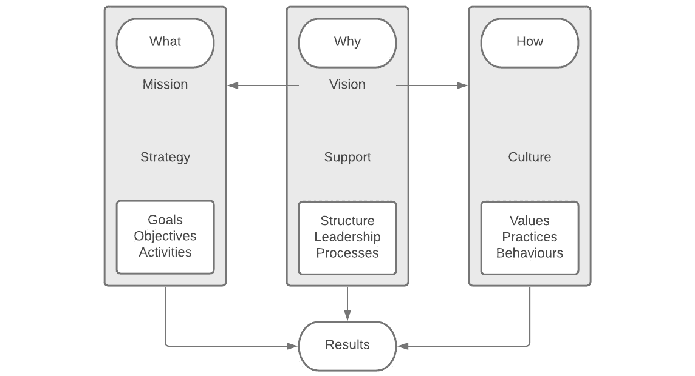

# 第五章：避免 DevOps 中的文化反模式

在学习了打破团队间壁垒的具体挑战，并理解了文化在 DevOps 中的重要性后，在本章中，我们将探讨在 DevOps 中建立文化的挑战——特别是那些可能成为文化阻碍的反模式。这不是一项容易的任务，需要仔细的规划和思考。

本章中，我们将讨论以下主要主题：

+   组织对齐

+   对变革的抵制

+   扩展困难

+   过度关注工具

+   遗留基础设施和系统

# 组织对齐

整个组织的对齐至关重要。在本章后面，我们将讨论对变革的抵制，以及我们应该在没有明确愿景或目标的情况下仅为了变革而推动变革。这将导致组织中出现高度的抵制。对齐有助于减少这种抵制。

重要说明

增强的竞争优势、增加的收入、提高的利润和降低的成本只是实现更好组织对齐后的一些预期成果。

在组织对齐中获得成功始于回答*什么*、*为什么*和*如何*。在每个步骤中采取适当的措施是帮助实现更好对齐的关键：

图 5.1 – 组织对齐以产生结果

实现对齐的基础是**什么**、**为什么**和**如何**这三大支柱。*什么*阶段围绕确保使命声明的明确性展开。战略也是应该在这里定义的内容。通过定义目标、任务和活动来完成此任务。公司的使命声明是定义**什么**的一个例子。

接下来是*为什么*。定义你的愿景和帮助组织实现愿景的支持结构。在这里，组织结构很重要，领导力的角色以及帮助我们实现*为什么*的流程同样至关重要。一个例子可能是“*我们的愿景是为更多人创造更好的日常生活*。”这可以是一个医疗组织的愿景声明。

在*如何*方面，这就是组织的文化。文化由定义的价值观、业务中的实践以及我们在业务中期望的行为组成。

将这些元素结合起来就能产生结果。愿景同样推动*什么*和*如何*。这个概念由西蒙·西内克（Simon Sinek）在他的演讲《从为什么开始》中讲解得非常清楚（[`www.ted.com/talks/simon_sinek_how_great_leaders_inspire_action`](https://www.ted.com/talks/simon_sinek_how_great_leaders_inspire_action)）。

这就是我们对失去对齐的影响及其如何影响 DevOps 转型的分析。现在，让我们看看对变革的抵制对组织意味着什么。

# 对变革的抵制

变革总会发生——这是任何业务中常见的现象。有时，这些变革是被迫进行的，而其他时候，变革是出于业务发展的需要。无论哪种情况，在大多数组织中，我们很可能会遇到对变革的抵制。如果这种抵制没有得到妥善处理，我们的 DevOps 转型可能会在开始之前就陷入困境。

因此，进行 DevOps 转型时，理解如何应对组织变革，理解各方角色以及实现成功所需的步骤是至关重要的。

## 理解组织变革的角色

在进行 DevOps 转型时，对员工来说，这是对组织的重大变革。当我们对组织的运作方式进行任何重大变革时，理解成功推动这些变革所需的两大关键角色是至关重要的。这些角色就是管理层和**人力资源**（**HR**）。

### 管理

在这种情况下，领导力至关重要。为了避免员工因对变革处理方式感到不满而离职，领导层和执行团队需要对提议的变革给予一致的支持。

管理者与团队之间的对话，从一对一的交流开始，将帮助团队统一方向，推动这些变革。这些对话至关重要。它应该是一个开放的环境，我们可以讨论这些变革如何影响他们，以及他们对这些提议的变革有什么看法。

作为管理者，我们应该提出**为什么**、**什么**和**如何**的问题。然而，不幸的是，许多管理者对组织变革管理并不熟悉。缺乏这些技能可能会使得实施所需的变革变得困难。

为了提升这方面的技能，人力资源应为管理者提供适当的培训，这不仅对这种情况有帮助，还能为管理者在职业生涯中进一步提升管理层提供有价值的知识。

### 人力资源

在任何组织中，人力资源在实施任何规模的变革中都扮演着关键角色。人力资源可以提供沟通、实施和跟踪等支持。人力资源的真正价值在于他们能够公正地与关注这些变革的员工对话，说明为什么业务需要进行这些变革，以及员工在这些变革中为何如此重要。

重要提示

无论我们做什么，我们都必须确保从一开始就让人力资源参与对话。当人力资源了解提案内容、我们为何提出变革以及这将如何为业务带来益处时，他们才能提供帮助。

人力资源可以通过支持变革并为各个受影响的团队提供所需的支持，帮助提高员工对组织变革的认同感。SHRM 在这个主题上有两个非常值得参考的资源。

第一个问题是*HR 在变革管理中的角色是什么？*（[`www.shrm.org/hr-today/trends-and-forecasting/special-reports-and-expert-views/pages/deb-cohen.aspx`](https://www.shrm.org/hr-today/trends-and-forecasting/special-reports-and-expert-views/pages/deb-cohen.aspx)），接下来是*HR 如何提升员工对组织变革的认同？*（[`www.shrm.org/ResourcesAndTools/hr-topics/organizational-and-employee-development/Pages/ImproveBuyIn.aspx`](https://www.shrm.org/ResourcesAndTools/hr-topics/organizational-and-employee-development/Pages/ImproveBuyIn.aspx)）。

## 组织变革过程步骤

在经历组织变革时，为了成功，我们应该遵循一个有条理的过程。确保我们与组织中的所有利益相关者从上到下合作是非常重要的，以确保成功。

让我们看看实现组织变革成功的六个关键步骤。

### 清晰地定义变化并与业务目标对齐

这看起来可能很明显，但许多组织在这方面做得不好。阐明我们要进行的变革是一回事，但将其与组织目标和绩效目标进行比较则是另一回事。这一步很重要，因为与业务目标对齐的正确变革将把企业朝着正确的方向推进。毕竟，这就是我们首先要进行变革的原因。

这个步骤的另一个好处是，它使我们能够评估我们所提议的变革与其所带来的价值之间的关系。如果没有足够的价值，为什么要进行变革呢？

在这个阶段，我们应该提出以下关键问题，以确保我们能获得最大的价值：

+   为什么需要变革？

+   我们需要改变什么？

让我们学习如何确定变化对整个组织的影响。

### 确定组织变革的影响

当我们确定了想要进行的变化，并且知道它具有实际价值时，我们应该评估我们的组织并确定它将产生的影响。

需要理解的是，变革不仅仅影响组织内的一个业务单元——变化会在整个业务中产生连锁反应，并且对每个人都有影响。这里收集到的信息对于确定哪些地方需要培训，哪些地方员工需要支持，将是非常宝贵的。

在这个阶段，你应该回答的一些关键问题如下：

+   员工如何接受变化？

+   变化的影响是什么？

+   变革最会影响谁？

现在，让我们学习如何制定强有力的沟通策略，以传达我们的变革信息。

### 制定强有力的沟通策略

让每个人都参与到转型过程中是至关重要的。前两步已经告诉我们那些直接受到影响的员工，显然必须包括在任何沟通中。然而，透明度是关键，因此与整个业务的沟通应该是你沟通策略的重点。

你的沟通策略应包括活动的时间表、我们希望使用的沟通渠道、我们希望用于展示信息的媒介，以及如何逐步传达这些信息。

在我们转型的这一阶段，我们应该提出两个关键问题：

+   我们将如何管理反馈？

+   变革将如何进行沟通？

培训是变革过程中常常被忽视的一部分。现在，让我们来看一下如何提供有效的培训。

### 提供有效的培训

现在我们的转型信息已经公开，我们也了解了组织中的差距，员工需要知道培训将如何进行，以及我们将提供哪些培训。

这一点非常重要，因为员工会想知道他们需要什么技能才能在拟议的变革下履行新角色。培训可以通过在线学习模块、课堂培训、与主题专家的影子培训或导师制来进行。

为了提供有效的培训，请问以下问题：

+   哪些培训方法将是最有效的？

+   成功所需的技能和行为是什么？

在变革中支持员工至关重要。让我们来看一下如何为员工提供支持结构。

### 实施有效的支持结构

在任何组织变革中，为员工开发支持结构是非常重要的。变革可能会让员工感到不安，因此拥有一个有效的支持结构可以帮助克服这一点。

在组织变革中的有效支持结构将帮助员工在情感上和实践上适应角色变化所需的技能和行为。导师制度以及领导层的开放政策是员工在出现问题时提问所需的关键思维。

在实施有效的支持结构时，你应该问的一些关键问题如下：

+   哪些类型的支持将是最有效的？

+   最需要什么样的支持？

最后，让我们来看看如何衡量我们组织变革的进展。

### 衡量进展

最后，让我们来看一下衡量。整个组织变革过程中，应该建立一个结构来衡量我们在整个业务中所做变革的影响。这个衡量步骤可以在过程中提供持续的反馈和改进。

这也是一个评估你变革计划的机会，确定它在我们设定的目标中有多有效，并记录我们正在学习的任何经验教训。如果需要，我们也可以借此机会对计划进行调整和改进。没有什么比继续执行一个注定不会成功的缺陷计划更糟糕了。如果调整能带来成功，不要害怕在过程中做出改变。

在这个阶段，我们应该提出的关键问题如下：

+   这一过程是否成功？

+   变革是否有助于实现我们的业务目标？

+   我们应该做些什么不同？

现在我们理解了组织变革的步骤，让我们看看如何克服对变革的抵抗。

## 克服抵抗

我们已经讨论了在变革过程中应该采取的一些步骤。这些措施将帮助我们克服一些面临的抵抗。

尽管如此，这些对每个人都不会有所帮助，正如我们之前提到的，沟通对于做到这一点至关重要。通过持续的沟通来帮助我们对齐我们的目标，将有助于使人们感到放心。当人们感到对可能发生的变化感到威胁或担忧时，就会产生抵抗。

组织内抵抗变革的一些主要原因可能如下：

+   害怕失业

+   沟通不畅

+   缺乏信任

+   对未知的恐惧

+   时机不对

现在，让我们更详细地看看这些原因。

### 害怕失业

在每个企业中，为了保持竞争力和与客户保持相关性，都需要进行变革。有时，公司需要增加新角色，裁减人员，甚至改变角色以实现这些目标。对大多数人来说，这就是他们害怕失业的地方。

### 沟通不畅

我几乎记不住我们说沟通很重要的次数了，但实际上它确实重要，因为它将决定变革的成败。沟通可以解决变革中的所有问题，而缺乏沟通则会制造很多问题。

员工需要清楚地理解为什么需要变革以及它将帮助企业实现什么目标。如果员工被灌输的观念是“*他们一直做的一切都错了，而且将完全改变*”，那么预计会有很大的反弹。

### 缺乏信任

成功的企业建立在信任的基础上。如果领导和基层员工之间的信任水平很高，那么你们的抵抗力就会很低。然而，在领导和员工之间存在相互不信任的组织中，业务就不会朝着正确的方向发展，因此成功实施变革将非常困难。

### 对未知的恐惧

在商业中有一句话：“*有未知的未知*。”当人们不知道发生了什么时，这会产生恐惧，从而导致抵抗。通过良好的沟通可以轻松解决这个问题。我们沟通得越多，我们的沟通越开放，这会打破对未知的恐惧并建立信任。这两件事单独做到会减少组织中的抵抗。

### 时机不对

根据经验，传达变革信息的方式和时机是主要问题之一。通常并非变革行为本身会引起员工的抵抗，而是变革的传达方式和时机。

## 沟通中断

沟通是关键，没有任何商业活动可以过度沟通。当沟通中断时，它会对业务造成严重影响。这会在金钱和时间方面引发挫败感。

沟通崩溃发生在沟通者没有有效地传达他们要表达的内容时。这可能通过口头表达、这些话语的理解，甚至是书面文字。沟通崩溃不仅仅是一种方式，可能是沟通者说错了话，或者接收者未能正确解读沟通者的意思。

商业可以从航空业中学到很多东西，尤其是那里沟通至关重要。飞行员和空中交通管制员之间未能清晰沟通可能会导致巨大的生命损失。在航空史上，行业从错误中吸取了教训，确保了天空更加安全。我们也应该如此。

避免商业中沟通崩溃的关键在于五个要素。让我们来看一下这些要素：

+   承认错误

+   放慢节奏

+   人们的聚集

+   赢得人心

+   耐心

让我们详细看看每一个要素。

### 承认错误

人类通常害怕犯错，这种恐惧可能源自害怕失望、曾经犯过的错误或其他原因。承认自己的错误很重要，因为将责任推给无辜的一方只会让事情变得更糟。

如果我们误解了别人，我们应该直接告诉他们。这有助于在问题真正发生之前纠正问题。沟通者之后会明白哪里出错，下次可以改进他们的沟通策略。

### 放慢节奏

速度很重要，所以不要急于行动。我们匆忙做出决策只会加剧沟通崩溃的情况。调整节奏，慢下来；如果我们匆忙做事，人们可能认为这不重要，或者我们只是想赶紧结束。当我们放慢节奏时，这种情况会改变，因为我们会花时间去思考，所以解决问题变得至关重要。

### 人们的聚集

最重要的是，确保你的战略是围绕着将人们聚集在一起，而不是把他们推开。沟通崩溃会导致人们分裂并破坏信任。让每个人在同一页上——如果可能的话，在同一个房间里——并且集中于同一个目标，开始把人们聚集在一起。

### 赢得人心

通常，当沟通崩溃时，一些关键人物需要为此负责。显然，应该聚焦于解决问题，而不是进行责怪游戏。正如我们之前讨论的，责怪只会破坏信任。

### 耐心

“沮丧”是我们可能用来形容沟通崩溃的词语，解决这些问题也相当困难。然而，我们需要耐心：缺乏耐心只会让事情变得更糟。

缺乏耐心通常是沟通崩溃的一个原因，而解决这一问题的唯一办法是文化上承认并强化这一点。遗憾的是，抗拒改变是非常普遍的，但我们能够克服它！现在，让我们继续，看看扩展我们 DevOps 转型的难点。

# 扩展难度

DevOps 中的另一个反模式出现在我们能否扩展所做的事情上。当企业刚开始时，大多数企业会遇到扩展上的问题。随着增长，特别是快速增长，企业在扩展时会面临各种挑战。

扩展你的业务是困难的。需要进行许多变化，这些变化可能会使即便是最成功的企业也会脱轨。扩展过程中我们可能遇到的挑战如下：

+   必须在市场适配之前进行扩展

+   与不合适的人合作

+   过于关注销售和营销

+   价格竞争

+   随着发展进行管理结构调整

+   忽视问题

+   忘记精益化本身也是扩展的一部分

所列举的这些挑战大多来自业务角度，但专门针对 DevOps 的扩展呢？当我们谈到扩展时，我们需要坚持特定的步骤，专注于发展 DevOps 实践中的某些方面：

+   从小团队开始

+   鼓励技能发展

+   优先考虑文化

+   持续反馈

+   自动化

让我们详细看一下这五个方面，以便了解我们需要做什么。

## 从小团队开始

你是否听说过“*创新者的窘境*”？它讲述了在我们处于现实周期或日常运营中时，创新带来的挑战。如果我们希望扩展，消除这一障碍对于我们的成功至关重要。

我们必须决定我们想要交付的内容，组建一个敏捷团队进行推广，帮助扩展我们的运维并解决阻碍问题。我们必须在这个团队中获取所需技能，并朝着合乎逻辑的解决方案努力，然后再将团队转移到其他团队。

## 鼓励技能发展

这就是我们引入成长型思维或学习者思维的地方。我们必须愿意尝试新事物，并与不同的团队合作。这些团队成员的思维方式在起步阶段至关重要。

为了从开发和运维团队中获得最佳效果，鼓励他们不仅提升技术技能，还要发展软技能，因为软技能在 DevOps 中同样重要。

## 优先考虑文化

DevOps 的成功来自于开发和运维团队之间的积极文化。虽然很容易认为 DevOps 仅仅是关于产品开发，但发展正确的关系同样重要。文化与 DevOps 的其他方面同样重要。

最难的部分是让每个人都参与进来。因此，小团队是开始这一过程的基础。将这些事项做对了，将使你的团队在发展过程中能够承担更多的责任。跟随早期采用者的团队也能从他们那里学习。

## 持续反馈

持续反馈是根据实际情况和团队表现来调整 DevOps 文化的一个非常重要的步骤。获取反馈的过程使我们能够了解产品的现状以及需要改进的地方，从而让产品变得更好。

如果可能，我们应该尽量将发布和部署分开。我们可以朝着迭代部署的方向努力，从而获得来自用户群的反馈，并将这些变化融入未来的发布中。

## 自动化

使您的自动化能力成熟，将帮助您实现规模化。谈到自动化，找到流程中痛点并着手自动化这些痛点。然而，别过度关注这一点，否则我们会经历在*过度关注工具*部分中讨论的一些问题。

如果我们想实现持续交付，那么我们真的需要考虑自动化我们的测试。没有自动化测试的支持，我们将很难进行持续交付。

到目前为止，我们已经探讨了组织层面的 DevOps 反模式。现在，让我们来看看过度关注工具的影响。

# 过度关注工具

到目前为止，我已经谈到在关注工具之前，DevOps 中其他方面的重要性。从在线的诸多研究中可以看出，过度关注工具的危害是显而易见的。

然而，现实情况是，我们在文化、人员和流程方面相比过于关注工具的情况是存在的。即使在这一点之后，您仍然可能会过度关注工具。这会破坏您的转型努力。

DevOps 中最常见的技术领域之一是自动化。这可能是自动化您的 CI/CD 流水线或其他技术或业务流程。然而根据我的经验，许多组织把 DevOps 中的自动化信息推向了极端——这种做法往往是适得其反的，有时甚至对业务有害。这就引出了一个问题，多少自动化才算过多？让我们来看看。

## 多少自动化算过多？

了解组织如何达到这一点非常重要。假设大多数组织正从传统的瀑布式方法向敏捷方法转型，而这对于他们来说是全新的。常见的情况是，组织过度应用敏捷方法，从而导致敏捷和 DevOps 的过度使用。

重要提示

关键问题应该是，自动化是否服务于*什么*和*为什么*？

*451 Research*的研究（[`www.scriptrock.com/automation-enterprise-devops-doing-it-wrong`](https://www.scriptrock.com/automation-enterprise-devops-doing-it-wrong)）显示了一个支持这一点的趋势：

“我认为有一种倾向，认为大型企业组织，凭借它们的各个部门、团队和孤岛，能够像 Facebook 或 Netflix 那样使用前沿的配置管理工具。但实际上，所有的遗留技术和流程也必须加以考虑。”

– *Jay Lyman*，*451 Research*

工具链中充满了各种组织承诺将您的组织打造成下一个 Spotify 或 Netflix 的例子。虽然这是一种值得钦佩的目标，但从根本上讲，您的组织既不是 Spotify，也不是 Netflix，永远也不会是。

当我们尝试从任何角度，特别是从技术的角度，复制这些组织的成功时，我们很快就会发现自己走在一条下坡路上。此时我们所做的任何投资都将变得毫无价值，因为我们试图自动化太多，推动了太多的工具。

### 找到平衡

了解和理解何时该自动化或实施工具以实现特定目标是很重要的。事实上，我过去与一些组织合作时，根本没有在 DevOps 中进行自动化；有些做 CI/CD 自动化，而另一些则自动化了业务流程。

自动化是将手动流程并围绕其中的部分或整个流程应用技术，以便通过自动化进行复制。问题在于，并非所有的流程都能或应该被自动化。请注意，流程的不同部分可以被自动化；并不总是要么自动化整个流程，要么一部分都不自动化。

当我们决定是否应当自动化某些任务时，我们应该退后一步，遵循一个简单的过程。让我们把这个放在软件开发流程的背景下：

1.  思考在开发过程中，与团队其余成员共同进行的流程，审查它们并加以锁定。

1.  决定自动化的工具。

1.  一步一步地看自动化的价值。

    重要提示

    如果你的流程一开始就有缺陷，那么给它们加入自动化只会让不良流程发生得更快，而且没有监督。

你的组织也是独特的，供应商有一个习惯，用华丽的营销手法把我们吸引过去，告诉我们他们与不同软件供应商做了些什么。然而，我们的组织已经经营图书销售 100 年了。我们不是一个独角兽初创公司，混合旧系统和新系统将是一项挑战。

### 拆解流程

当涉及到我们的软件开发流程时，我们可以进一步将其拆解。我们可以对任何流程做这个，虽然我这里只是以软件开发作为工作示例。

在这个过程中，我们将组件拆解为子流程。这些就是我们自动化的候选项。当我们拥有子流程时，我们就能在细节上对其进行审视。此时，我们可以决定是否要保留、修复或创建新流程。

花时间去做是很重要的。创建流程看起来可能微不足道，但想一想公司未来的运作方式和现在的运作方式。流程必须具备随着组织变化而成长的能力。

与 DevOps 相关的启用任务，如 CI、CD 或持续测试，也应该在这一点上与任何固定流程结合起来。

最后，你必须选择合适的工具。这是大多数组织失败的地方，也是事情出错的地方。当我们定义了我们的流程并弄清楚哪些 DevOps 组件将被集成到这些流程中时，我们需要为这项工作选择合适的工具。

过度自动化的组织通常会将注意力集中在具体工具上，而不是流程本身。在这种情况下，技术通常基于情绪，比如其他组织使用类似工具，或者他们的同事在某次会议上使用这些工具。

这种情况最终会导致所有相关人员的混乱。结果是使用了太多工具和流程，这些工具必须调整以适应现有工具，而实际上，工具应该根据流程来进行调整。

### 当自动化引发问题时

我想谈谈我遇到的一个例子。我曾与一个组织合作，该组织希望从零开始，完全自动化整个生命周期。这样，开发人员可以在任何时间进行端到端的工作。宏伟的愿景是实现“随时随地构建”的场景。

然而，现实是开发人员每天会向平台发布新代码两次，有时更多。由于这种行为，最终的结果是终端用户对不断变化的代码感到沮丧。

对我来说，这个实验的“致命一击”是自动化测试不够全面。那些本可以通过人力进行的性能和回归测试中的质量问题，最终未能被发现。

最终，组织从工具链中去除了部分工具，限制了开发人员可以做出的更改类型，并加强了审查流程、部署过程，最重要的是测试。

这个故事的寓意是，不要让宏伟的计划和愿景，以及对自动化的无止境追求，压倒我们在自动化时应用理性思考的部分。

### 不做伤害

我希望在阅读了前面的部分后，你不会对敏捷或 DevOps 感到反感。那绝对不是我的本意。事实是，DevOps 所带来的价值远远超过了其缺点，但我们必须在实施时保持聪明和有条理。

总的来说，技术是一个促进者，当正确使用时，它能为你的组织带来巨大的价值，并且能使我们的工作更加轻松且可重复。

被称为 DevOps 的“黄金涅槃”是一个逐步实现的过程，源于我们如何在组织中执行敏捷和核心 DevOps 原则，而不是模仿他人的做法。许多组织最终可能会使用工具来满足他人的愿景，而非自身的需求。

在这一部分，我们已经探讨了过度关注工具的影响。现在，让我们继续讨论遗留基础设施和系统对 DevOps 的影响。

# 遗留基础设施和系统

当然，DevOps 不仅仅适用于云环境；它也适用于混合环境，当然，也适用于本地部署。可以说，在云环境中实施 DevOps 会更容易，但遗留的基础设施、系统和思维方式可能会成为 DevOps 的真正障碍。

遗留基础设施在 DevOps 采用过程中会带来许多问题，因为这些系统并非为 DevOps 所需的持续流程而设计。使用遗留基础设施进行迭代发布也非常困难，在某些情况下甚至是不可能的。这破坏了整个 DevOps 的精神，并开始引入我们需要克服的挑战。

## 遗留现代化

我们应对遗留基础设施的技术债务的一种方式是进行现代化改造。这是从传统基础设施到更现代化服务的一个过程，大部分是向公共云服务提供商迁移。

现代化对寻求扩展的企业有很多好处，它有助于降低成本、改善客户体验、加快市场发布速度，并促进企业的敏捷性等。

现代化的最常见途径之一是将现有的单体应用程序迁移到基于**微服务**的架构和设计模式。这种模式代表了一种基于领域的架构，服务之间解耦，可以多次用于不同的目的。

遗留应用和基础设施给我们带来了一些挑战：

+   安全性

+   单点故障

+   缺乏灵活性

向更现代的应用原则和实践的转变有助于解决和应对这些领域的关注点。涉及到流程和人员时，DevOps 在这里可以提供帮助。当然，这些是非技术性领域。在解决遗留基础设施问题时，这些领域和技术领域同样重要。

# 总结

在本章中，我们探讨了与 DevOps 文化相关的反模式，分析了这些挑战如何影响我们的 DevOps 转型，以及如何解决其中的一些问题，以防它们过度拖累我们的努力。最后，我们还探讨了过度使用工具对我们环境的影响以及这种做法给我们带来的风险。

在下一章中，我们将介绍价值流图，并学习如何利用它们推动流程变革。我们还将探讨价值流图与流程图的区别。

# 问题

现在，让我们回顾一下本章所学的内容：

1.  以下哪项不是抗拒变革的原因？

    a. 错误的时机

    b. 沟通不畅

    c. 关于加薪的担忧

    d. 错误的责任归属

1.  以下哪些措施可以改善沟通中的问题？

    a. 认领错误

    b. 让团队成员参加团队建设课程

    c. 持续反馈

    d. 团结团队
