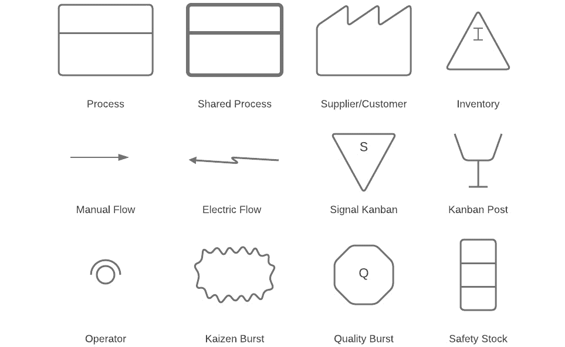

# 第七章：通过价值流图推动流程变革

要完全理解流程，我们必须了解谁在执行这个流程，何时执行，以及为什么执行。这些信息可以帮助分解流程并消除冗余，以便可以自动化有用的流程。

本章将帮助你通过减少不必要的流程，使用**价值流映射**来改善组织内的流程流动。

在本章中，我们将涵盖以下主要主题：

+   理解价值流映射

+   价值流映射如何提供帮助？

+   流程图与价值流图的区别

+   解释一个示例价值流图

# 理解价值流映射

价值流映射的过程来源于价值流管理。而价值流管理本身是精益业务实践，旨在理解软件开发、交付和资源的价值。

这个过程还可以帮助组织内的价值流动，同时为软件交付提供生命周期管理。通过价值流映射，团队不再仅仅专注于功能，而是可以帮助你的团队关注有效的部分，并开始摆脱那些无效的部分。

到目前为止，我们已经重点讨论了 DevOps 的文化方面以及它对组织在向 DevOps 最佳实践转型过程中意味着什么。本章将开始关注组织内的流程。精益的流程是那些运作良好、浪费极少且高效的流程。一旦你达到了这种效率水平，你就可以开始自动化。

重要提示

自动化不良流程意味着你让不良流程发生得更快。首先对其应用精益实践，如价值流映射，以使其尽可能高效。

进行价值流映射练习可以从客户体验的角度提供一个简单明了的流程视图。这样做的结果是更好地与业务目标对齐，并能够扩展敏捷和 DevOps 转型。

这个过程的第一步是改变你的思维方式，使你把软件开发看作是与业务目标直接相关的环节。我们已经多次讨论过所需的变化。在我们试图让我们的流程更精简时，也可以说是同样的道理。

你在软件开发中执行的活动和业务目标往往是彼此分离的，软件团队的不同优先级使得他们始终专注于那些优先事项。在这种没有对齐的情况下，你必须退后一步，看看自己是否与业务目标保持一致。

所以，第一步是停下来稍作反思。评估一下业务中正在发生的事情，然后看看你在软件开发中所做的工作如何帮助并支持业务实现其目标。

在这个过程中，评估你与所涉及的人员、流程、工具以及任何存在的依赖关系的当前状态，以便领导层能完全了解事情的进展。

## 超越 DevOps 进行流程改进

的确，DevOps 在软件行业内推动了巨大的组织变革和转型。这一过程随着时间的推移不断发展，从最初对团队合作和共情的关注，到如何为组织创造真正的价值。

正如我们已经讨论的，要获得最佳的投资回报，你必须关注你正在生成的商业价值以及由此带来的客户满意度。这是我们在*第二章*中讨论的内容，*DevOps 的商业收益、团队拓扑和陷阱*。

对于许多组织来说，他们会同意 DevOps 带来了大量的转型。然而，你仍然会发现一些企业未能理解并解释从所需投资中获得的价值。

随着你的实践不断成熟，你需要更多地关注理解和创建度量标准和 KPI，以衡量成功。这些度量标准应进一步提高你交付的任何软件的质量，并加速交付，以满足客户体验，同时展示你所交付的商业价值。

这里的关键消息是，成功实施 DevOps 将大大有助于推进，但你必须在流程成熟度上走得更远。

## 查看价值流映射图示

以下图示来自 Plutora 的一篇关于价值流映射的文章（[`www.plutora.com/blog/value-stream-mapping`](https://www.plutora.com/blog/value-stream-mapping)）：

图 6.1 – 价值流映射练习中的示例图示

我们将在本章稍后的部分更详细地分析前面的图示。之前的例子是价值流映射练习中的一些输出。

价值流图是一个被分为三个主要领域的图示。这些领域是信息流、产品流和时间阶梯。

### 信息流

这个图示展示了与流程相关的任何信息是如何进行传递的，以及数据如何被传输。图示中显示了发布经理接收所有客户请求。只有经过批准的请求才会提交给开发队列，开发队列被视为一个供应商。

根据价值流映射练习的目标，SharePoint 和 Excel 中显示的收集和分配过程可以包括许多细节层次，以及许多其他集成系统。

### 产品流

本节旨在映射软件开发生命周期的各个步骤，从最初的概念到交付。根据你的需求，你可以专注于流程中的特定部分，以在特定环节提高效率。它可以是详细的，也可以是高层次的，视需要而定。

正在执行的任务显示在框中，执行任务的个人或团队也显示在框中。关键的过程数据接着显示在下方。前面示例中的两个项目分别为 C/T 和 S/T，C/T 指的是周期时间，S/T 指的是准备时间。

你可以在此处包括任何数量的细节，突出你希望展示的任何重要信息。三角形显示了在每个阶段等待的特性队列，随后是从一个阶段到另一个阶段的虚线箭头。这些被称为**推送箭头**。它们表明产品正从一个阶段移至另一个阶段，而不是被拉动。

### 时间梯子

时间梯子的目的是提供价值流中涉及的时间线的高级或简化视图。梯子的顶部部分代表你的特性在每个阶段的队列、门或等待的平均时间。

梯子的底部显示了参与主动工作的平均时间。更具体地说，它展示了在特定阶段，特性在此阶段已被添加的时间。

### 其他术语

让我们看看在价值流图中你可能遇到的其他术语：

+   **周期时间**：指的是特性生产的频率，或者是两个完成的特性之间的平均时间。

+   **准备时间**：指的是为任何给定步骤准备所需的时间。在软件工程中，这可能是理解需求所需的时间。

+   **正常运行时间**：以百分比衡量，提供了任何过程或系统处于活动状态的总时间。

+   **交付时间**：衡量从概念到交付，单个请求在整个周期中所需的平均时间。我们在*第三章*中讨论过这个概念，*衡量 DevOps 的成功*。

+   **节拍时间**：这是你需要的生产速率，以满足客户需求。这是一个计算公式，将工作日的小时数乘以一个月的工作天数，再除以可用的工作小时数，最终转换为每月分钟数。基于每月 9,000 分钟和 150 个客户需求的特性，计算结果表明你每个特性需要在 60 分钟或更少的时间内完成，以保持生产的速度。

现在让我们来看一下在价值流图中使用的符号。

### 价值流符号

你会注意到在*图 6.1*中有一些特定的符号。就像流程图一样，这些符号代表了特定的事物。让我们来看一下你可以在价值流图中使用的符号：

图 6.2 – 价值流图中的符号

当然，实际中存在更多符号，但图中包含的符号是常见的，且你在自己的价值流图中一定会用到它们。你还可以将它们分成不同的类别。最上面一行包括所有的物料流符号，第二行包括信息流符号，底部一行包括一般符号。

现在，让我们详细讨论涉及物料流、信息流和过程流图中的关键术语。

#### 物料流

以下术语通常用于物料流图中：

+   **过程**：表示一个个人或团队执行特定任务。

+   **共享过程**：与常规过程相同，但该过程是多个方共同参与的。

+   **供应商/客户**：通常，当这个符号位于价值流图的左上角时，它表示流程的起点，并指示供应商。当它位于右上角时，表示客户。

+   **库存**：如果你想在两个过程之间添加库存计数，请使用此符号。如我们的示例所示，我们在那个时间点记录了未完成的特性数量。

#### 信息流

以下术语通常用于信息流图中：

+   **手动流**：表示传递对话或笔记的位置，以及流动的信息类型。

+   **电子流**：与手动流相同，但它表示电子信息资产。

+   **信号看板**：当库存降到最小值时使用，用来提示生产多个零件。可以类比为超市的库存水平。

+   **看板柱**：通常表示一个收集信号的位置。它也可以用于看板中提取和生产的交换。

#### 通用

你可能还需要在图中使用以下内容：

+   **操作员**：表示在特定步骤中需要多少操作员来处理价值流图。

+   **改善冲刺**：有时也叫做**改善闪电战**，这是一次集中的团队活动，专注于解决特定的挑战。其目的是解决问题并使团队集中在一个问题上。

+   **质量冲刺**：表示质量问题，可以在价值流映射链中的任何节点使用。

+   **安全库存**：表示一种临时的安全库存，用以防止在发生故障或其他问题时出现问题。

现在我们已经理解了价值流图的一些基础知识，让我们来看看价值流图如何帮助你的组织。到目前为止，我们使用的一些术语比较通用，所以让我们举些更具体的软件工程方面的例子。

# 价值流图如何提供帮助？

值流图极为重要。它不仅帮助你理解你的流程，还帮助你将这种理解转化为改进流程的方法。它对业务的可持续性至关重要。

这其中有三个原因：

+   消除浪费可以改善组织的底线。你还可以通过这个过程发现浪费的根本原因和来源。

+   团队将抛弃个人假设，并根据客户的视角进行优先排序。

+   通过值流图创建的可视化可以轻松识别浪费的交接。团队可以识别并采取措施改善他们的协作、沟通和文化。

虽然创建值流图的过程对你的组织来说极其有用，但它也可能带来一些挑战。我们来更详细地看看这些挑战。

## 值流图的挑战

如果不小心执行，值流图可能变成一种浪费的活动。你需要意识到其中的一些常见陷阱，包括创建值流图并确保你所产生的内容对你的业务本身有价值。

投资回报率在值流图中至关重要。你需要监控投入到值流图绘制过程中的努力，并将其与可能获得的价值进行平衡。从一开始就关注投资回报率。

确定浪费的过程可能是密集的。当员工知道正在进行值流图绘制时，通常会产生恐惧和不确定感。他们错误地认为该过程是为了从员工角度识别浪费。

许多过程涉及跨职能团队和其他复杂性。在进行值流图绘制时，确保有来自各方经验的人员参与。

虽然逐步改进是开始通过改善每个环节来节省成本的绝佳起点，但这些改进可能不会影响整体的盈利，直到完成从上到下的变革。

重要提示

记住，值流图的目标是减少浪费，而不是制造更多浪费。

本章早些时候我们讨论了可以在值流图练习中使用的符号。我建议不要急于寻找专业的解决方案来创建它们。先从纸张或白板开始，结果是一样的，你可以勾画出你的想法。之后可以使用软件来正式化值流图。

## 值流图的应用场景

基于本章早些时候提到的一些符号描述，你应该已经猜到，像许多来自制造业的精益流程一样，值流图的根源并不在软件工程，也不在技术领域，而是在制造业。

价值流图可以为多个行业带来价值。精益原则同样适用于每个行业，你可以根据需要像在任何框架中一样进行调整。根本上，你所在的行业或领域决定了价值流图中的项目流。

例如，在供应链中，价值流图对于发现并消除导致成本延误的因素至关重要，从而最终导致完成产品。在服务行业中，流程将促进为客户提供及时且有效的服务。

在医疗保健行业，价值流图将确保患者获得高质量的护理，同时减少可能威胁生命的延误。最后，在制造业中，价值流图通过分析物料和信息流的每个步骤，帮助识别浪费。通过价值流图流动的过程项目被称为物料。

## 识别和减少浪费

正如我们在上一节中提到的，价值流图起源于制造业，就像精益原则本身一样。精益的起源可以追溯到日本的汽车工业。这使得日本汽车工业通过精益原则和自动化蓬勃发展，而世界其他地方则还在追赶。

将这种精益思想应用到你的日常流程中，比你想象的要困难。在制造业中，以下八种是浪费：

+   缺陷

+   过度生产

+   等待

+   未充分利用的人才

+   运输

+   库存

+   动作

+   额外处理

在应用精益思想时，尝试思考前面列表中的八个方面，看看你在哪些地方可以改进你的流程。我们来看看一些软件开发中的例子，帮助你识别浪费。

### 运输

在制造业中，我们将运输视为一种物理行为：从一个地方移动到另一个地方。在软件开发中，运输可能是最难发现的浪费类型之一。毕竟，产品不是你可以移动的物理物体——它是虚拟的。

不要从物理角度思考，想想你的任务是如何从一个开发者传递到下一个开发者的。这可以是从架构师到开发者，或者从设计师到开发者。

这个的一个实际例子可以是开发者到测试员的流程。假设你的测试员已经准备好进行任务工作，并且他们刚刚完成了另一个任务，这样任务可以立即开始。首先，测试员会查看任务，了解他们需要做什么。接下来，你必须启动应用程序，并到达你希望他们测试的步骤。测试员可能需要一些时间才能到达那个步骤。这就是所谓的准备时间，在这个例子中，准备时间是由任务交接产生的。

### 等待

等待方面的浪费可以在**在制品**（**WIP**）中找到，以及等待流程中的下一步。如果你在等待，那么这项工作没有得到高效处理。等待某人或某事的任务会产生非增值时间。这会延迟交付，不仅是这项任务，所有任务都会受到影响。

在软件工程领域的一个好例子就是质量控制步骤，如测试，以及技术债务和漏洞修复。

### 过度生产

在软件开发中，这表现为两种明显的形式。第一种对你来说非常熟悉，那就是范围蔓延。具体来说，范围蔓延是指当你开始时有一组初步的需求，但在开始工作后，这些需求发生了变化。

第二种过度生产类型与**帕累托原则**一起发挥作用。该原则的应用是，你的目标受众中 80%的人只会使用约 20%的功能。因此，这个原则意味着你将花费大量时间开发那些几乎不会被使用的功能。

现在我们已经理解了为什么价值流图如此重要，并且理解了如何识别浪费，让我们来看看流程图和价值流图之间的差异。

# 分析流程图与价值流图之间的差异

价值流图显示了大量信息，并采用了更线性的格式。它与只显示流程步骤的流程图截然不同。同样的差异也适用于流程图，如下图所示：

图 6.3 – 显示流程图一些元素的高级示意图

如你所见，流程图或过程图非常有效地展示了流程的各个部分，包括整个过程中做出决策的节点。然而，它并没有像价值流图那样进一步深入。

价值流图尝试识别流程中的浪费以及流程步骤之间的浪费。另一方面，流程图则呈现了更详细的业务流程。

请看下面这个来自*Creately*的示意图（[`creately.com/blog/diagrams/process-mapping-guide/`](https://creately.com/blog/diagrams/process-mapping-guide/)）。下面的流程图清楚地展示了流程的不同部分：

图 6.4 – 带泳道的流程图示例

上面的示意图显示了所谓的泳道。这些是你可以看到的垂直列。在前面的示例中，它们将流程的不同部分划分给了与流程互动的不同人员。你可以看到客户、前台和技术员出现在上面的示意图中。

这对于突出显示在您正在记录的过程中处理各部分的人非常有用；它可以在不同的泳道之间移动，您图表中的泳道数量完全取决于流程。

以下图表，来自 *Creately*，是一个更简单的流程图示例。它是从左到右读取的，沿着箭头进行：

图 6.5 – 流程图的简单示例

普通的矩形框表示流程中的步骤，其中会发生某些事情，而圆角的药丸形状表示启动和终止节点——换句话说，就是流程的开始和结束。

何时使用流程图或价值流图显然是您需要理解的关键内容。如果您不小心，可能会花费大量时间创建流程图和价值流图，最终得到错误的结果。

## 我应该使用哪一个？

您可以充分利用流程图和价值流图，显然是由于它们产生的细节层级的差异，因此您需要确保为正确的原因创建正确的内容。每种类型的图表用于识别过程中的不同变量，但将价值流的组件与流程图的详细元素结合使用是有价值的。

如果您仔细思考，详细的流程图确实包含了价值流图的所有元素——它也可以进一步细分为更详细的内容。

重要提示

当您的价值流图识别出浪费时，可以考虑使用流程图来包括更详细的内容。

在下一部分，我们将理解流程映射和价值流映射之间的区别。让我们通过查看一个价值流图示例来结束本章，并看看我们可以做些什么来改进我们的流程。

# 解释一个示例价值流图

到目前为止，在本章中，我们已经了解了价值流图是什么，它们如何帮助您的业务，以及价值流图中涉及的各个组件。现在，我们将开始探讨如何构建价值流图，同时也会审视 DevOps 流程的前后状态。

创建一个有意义的价值流图的过程可能是漫长的，这取决于流程的大小。正如我们之前讨论的那样，请确保通过监控价值流图活动的投资回报率，从过程中获得一些成果。

## 创建价值流图

当您开始创建价值流图时，应该遵循以下步骤，以确保成功。首次创建价值流图可能是一项艰巨的任务。按照这些步骤和提示操作，您将能够制作出具有实际价值的价值流图。

### 确定待解决的问题

首先，你需要确定你要解决的问题。不要仅仅因为想要绘制一个图表就去绘制价值流图——请从一个存在问题的地方开始创建你的价值流图。

为了让你更清楚这一点，可以从客户的角度思考问题解决方案。他们是否觉得你交付新功能的时间太长？每个人都需要达成共识，所以确保你发布了问题陈述。

最后，设定一些目标。说你想将某个指标减少一定百分比并不现实；这是一个值得称赞的目标，但要确保它是现实可行的。

### 确保团队有足够的授权

在进行价值流图绘制时，你需要一个经验丰富且成熟的团队。这将帮助他们顺利完成当前的任务，最重要的是按时完成。领导层也应预留必要的预算，以确保执行符合预期。

### 限定过程

一旦完成并发布了问题陈述，重要的是要限制你的价值流图绘制的范围。你可能不需要绘制整个过程的端到端流程；你可能只需要专注于过程中的某一部分。

将复杂的过程分解成更小的部分，然后继续将其分解，直到复杂性变得易于理解，并呈现为离散的组成部分，这一过程被称为过程分解。

总体来说，我推荐这种方法；通过专注于问题的一部分，而不是从上到下全部处理，你会从经验中获得更好的结果。分阶段地处理整个过程，而不是一开始就试图从头到尾解决。

一旦你将工作范围限定在过程的一部分，确保通过进行审查来绘制它。经验不能被偏见、不完整或不准确的文档或他人的叙述所替代。

定义过程的步骤；这一过程需要多次完成。有时候，事情会在第二次甚至第三次尝试时显现出来。确保至少进行两次，以确保你获得完整的图景。

### 收集过程数据并创建时间线

在进行价值流图绘制时，记下任何你希望收集的适用的过程数据。这些数据可能包括但不限于以下信息：

+   涉及的人数

+   平均工作时长

+   循环时间

+   等待时间

+   正常运行时间

同时，确保在底部包含你的过程时间和交付时间。还记得我之前解释过时间阶梯的用途吗？这时它派上用场了。

### 评估当前的价值流图

当你开始评估当前的价值流图时，在此阶段的过程中需要寻找一些特定的内容。请提出以下问题：

+   团队是否有多个依赖关系？

+   你的等待时间或交付时间是否过长？

+   这可能是因为你的测试没有并行运行吗？

+   你的环境是否稳定？

所有这些问题都可以用来评估你的价值流图。甚至可能你的过程中的某些步骤是有价值的，但它们并没有转化为对客户有意义的成果。你还应该寻找过程中的任何阻力或信息流中的停滞。记下这是否是推动式（push）还是拉动式（pull）。

### 设计你的未来状态

在这个阶段，你的价值流图可能尚未完成或还不是最终版本，但这没关系。这里重要的是确保你未来状态的价值流图与组织对未来的愿景保持一致。

确保没有任何东西是固定不变的。在 DevOps 的精神下，确保你可以将持续反馈融入这个过程中，并做出任何合理的调整。

### 实施你的未来状态

你必须验证你的未来状态是否会带来你预期的变化。监控你的**目标和关键结果**（**OKRs**）以及**关键绩效指标**（**KPIs**），从你看到的趋势中学习。我们在*第三章*《衡量 DevOps 的成功》中讨论了可以用来制定 KPIs 的度量标准。

重要提示

成功的价值流映射练习的目标是确保每个人现在都在指向并朝着同一个方向工作：即客户的方向。

当然，所有这些应该已经解决了你在最初定义的问题陈述中设定的问题。如果你不能说它解决了问题，那就回去看看还可以做些什么来改善情况。

## 当前状态的价值流图

现在，让我们看一个真实的例子，看看 DevOps 世界中的价值流图是什么样子的。请看下面的图表，这是来自*Lucidchart*的模板（[`www.lucidchart.com/pages/examples/value-stream-mapping-software`](https://www.lucidchart.com/pages/examples/value-stream-mapping-software)），它完美地展示了你能从中获得的价值：

图 6.6 – 我们 DevOps 流程的当前价值流图

我想花点时间解释一下这个图表中发生了什么。首先，让我们简要讨论一下这个过程。你可以看到我们的客户部分是主要的入口点。

它从客户通过电子邮件发送功能请求开始。这个请求由两位服务工程师中的一位接收。此时，他们将该请求记录到 Confluence 中。团队中的唯一一位产品经理然后在 Jira 中批准并优先处理该功能请求。

然后，我们的两人软件工程团队将使用*Jira*中的需求详细信息来处理该项任务的 Java 代码。该代码随后由一名部署工程师通过*Jenkins*和*Circle CI*部署到预生产环境中。接着，QA 专家和客户使用*Selenium*进行质量保证测试。最后，一名部署工程师负责将所有开发工作整合起来并发布到生产环境。

这个过程的总交付周期为 243 小时，而总的增值时间（用于完成任务的时间）为 26.08 小时。**%C&A**指的是已完成且准确的输出，而**Rolled %C&A**（24%）则指的是不需要返工的时间。最后，**活动比率**为 11%，即实际工作时间。

总体来说，虽然这个流程定义清晰且已很好地进行了映射，但你仍然可以看到几个改进的领域。让我们来看看这些领域。

## 未来状态价值流图

未来状态并不总是意味着要从你的流程中删除步骤。记住，未来状态是为了提高流程效率的节省。请看下面的未来状态价值流图：

图 6.7 – 我们的 DevOps 流程的未来状态价值流图

在我详细说明我们的未来状态发生了什么变化之前，请看流程框上方右侧的点，这些点表示该流程是新的。正如我刚才提到的，这并不是为了减少流程步骤，而是如果添加新步骤能够增加价值的话，就应该添加。

接下来，在每个流程下，所显示的时间数据包括指向右的箭头，表示没有变化。如果引入新的流程，你将添加这些箭头。指向下的箭头表示相较于之前的价值流图或当前流程，时间有所减少，而指向上的箭头表示时间有所增加。

那么，让我们来看看发生了什么变化。首先，让我们看看新的流程。在这里，你可以看到，客户不再通过发送电子邮件来传达他们的新需求，而是直接在**Confluence**中进行更新。产品经理将会审查并批准/优先处理这个需求，从而节省了时间。

这也导致开发人员完成开发工作的交付周期缩短，现在的交付周期为 96 小时，完成实际任务所需时间为 11 分钟。

事实上，你可以看到在整个过程中的多个任务都节省了时间，同时还引入了新的测试流程，并且对代码进行了监控。这一切意味着总交付周期现在缩短为 188 小时，相比之前的 243 小时有所减少。

增值时间现在为 19.54 小时，相较于之前的 26.08 小时有所减少。我们减少了员工在增值工作上的时间，这并不是坏事。这意味着他们可以在有限的时间内交付更多的工作。引入测试和监控使交付过程更加成熟，但最重要的是，它增加了客户与我们之间的互动。

# 总结

在本章中，我们探讨了价值流图绘制的过程，了解了它是什么、如何帮助我们以及如何构建价值流图。我们还看到了价值流图和流程图之间的区别，讨论了可以在流程中识别的不同类型的浪费，最后通过一个例子展示了如何创建价值流图。

在下一章中，我们将探讨如何将本章中学到的内容应用到组织中的流程变革中。我们将通过了解变革的八个步骤、流程变革的影响以及流程变革中的常见挑战来实现这一目标。

# 问题

现在，让我们回顾一下我们在本章中学到的一些内容：

1.  以下哪项在价值流图中不会出现？

    a. 信息流

    b. 产品流

    c. 游泳道

    d. 时间阶梯

1.  以下哪项不是一种浪费类型？

    a. 运输

    b. 生产不足

    c. 运动

    d. 过度生产
