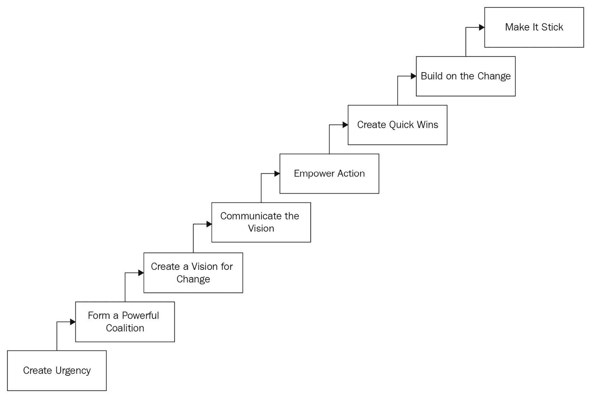

# *第七章*：在您的组织中实施流程变革

现在您已经理解了您的流程以及需要变革的地方，本章将探讨如何在整个组织中管理流程变革。请记住，有时流程会影响多个团队和部门。这可能是一个挑战，需要精心管理，以确保成功。

到本章结束时，您将能够理解有效流程变革的八个步骤、不同的商业变革模型以及流程变革中的常见挑战。

本章我们将覆盖以下主要内容：

+   有效变革的八个步骤

+   商业变革模型

+   流程变革对人员的影响

+   流程变革的常见挑战

# 有效变革的八个步骤

在商业中，变革的需求几乎是持续不断的。能够有效适应变革的企业，通常会在长期竞争中脱颖而出并战胜对手。当您已经绘制出流程并完成了价值流图后，接下来要做的就是有效地在组织中推动这一变革。

这从一个八步变革计划开始，具体步骤可以描述如下：

1.  确定可以改进的内容

1.  向利益相关者展示商业案例

1.  变革规划

1.  确定评估所需的资源和数据

1.  沟通

1.  评估阻力、依赖关系和风险

1.  庆祝成功

1.  持续改进

其中一些步骤您可能已经熟悉，因为我们之前讨论过其中的一些内容，但现在让我们详细了解一下所有步骤。

## 确定需要改进的内容

我将此步骤包括在此，纯粹是为了完整性。为了明确，我们在前一章中讨论了价值流图，并详细探讨了如何识别需要改进的地方以及什么时候应该进行改进。

了解需要改变的内容将为成功实施流程变革打下坚实的基础。

## 向利益相关者展示商业案例

向您的利益相关者展示商业案例是下一步。然而，根据您迄今为止收集流程变革支持的方式，这一步可能不需要。

如果您已经与利益相关者互动，并带他们了解问题陈述以及如何解决，那么您实际上已经向他们展示了您的商业案例。

根据变革的类型和对整个业务的影响，如果您发现需要向更广泛的利益相关者展示您的想法以获得更广泛的支持，也不必感到惊讶。

## 变革规划

很多人认为，当您完成了价值流图后，就可以开始行动了。实际上，在做任何事之前，您需要先规划如何实施变革。如果您先进行规划，那么成功的机会会更大。

可能你所做的变革很小，但仍应为成功的实现设定明确的目标。显然，如果你的变革很大并涉及到组织的多个部分，那么规划至关重要。

## 确定用于评估的资源和数据

这个步骤是你规划的一部分。确保你有足够的资源来高效执行。在考虑资源时，不仅仅是考虑人员。这也可能包括额外的软件、培训、工具或文档的变更，等等。

数据的关键在于你如何评估进展和成功。拥有适当的数据意味着你可以提供基于数据的进展更新和希望的成功，而不是依赖感觉或直觉。

## 沟通

沟通是成功的真正关键。它是大多数变革管理框架所共同具备的金钥匙。它贯穿于变革管理的整个实践中，重要性不言而喻。

清晰和开放的沟通渠道是你成功交付流程变革的基础。沟通方法使你有渠道来倾诉挫折，庆祝有效的部分，并审视哪些做得不好。最后，沟通是透明度的重要推动力，它能确保大家始终保持一致。

## 评估抵抗、依赖关系和风险

对于变革成功的最大风险之一就是抵抗。抵抗是正常的，并且在每个组织中都会发生。大多数抵抗源自对未知的恐惧。更广泛地说，每一次变革都伴随着一定的风险。也许它不会产生预期的效果。

你可以通过为你的团队和领导层提供工具和知识，帮助他们顺利过渡，从而应对抵抗。

## 庆祝成功

识别过程中小的渐进变化以及最终的成功。你在正确方向上迈出的每一步都是积极的，每一步都应该得到庆祝。你的团队将会为成功付出艰辛的努力，庆祝他们的成功并认可他们的付出将激励大家，特别是当变革需要很长时间时。

## 持续改进

变革管理可能非常困难，因为它是一个持续的过程，需要在适当的时候进行调整，以帮助确保成功。**持续改进**应贯穿整个过程，就像沟通一样。这可以帮助你识别并解决过程中遇到的障碍。

现在我们已经更详细地探讨了这八个步骤，让我们来看一下你可以在组织中使用的一些变革管理模型。

# 商业变革的模型

有许多框架可供在你的企业中执行变革，像所有框架一样，有些框架会比其他的更适合你的企业。有些框架是针对特定场景的。你不应该试图让你的企业去适应框架；而是应将框架适应你的企业。

在这一部分，我们将仔细研究四个商业变革模型，它们如何使用以及我们能从中学到什么。你甚至可以将多个框架的元素结合在一起，融入自己的模型中。这些框架如下：

+   **科特的变革管理模型**

+   **罗杰斯的技术采纳曲线**

+   **认知、欲望、知识、能力、强化** (**ADKAR**) 模型

+   **展望、激活、支持、实施、确保、认可** (**EASIER**)

让我们更详细地看一下这些模型。

## 科特的变革管理模型

第一个模型是科特的变革管理模型。这是*约翰·科特博士*（[`www.kotterinc.com/team/john-kotter`](https://www.kotterinc.com/team/john-kotter)）的创意，约翰·科特是一位作者和管理顾问；他是商业、领导力和变革方面的思想领袖，也是科特国际（Kotter International）的创始人，该公司应用科特的领导力研究帮助组织执行大规模的变革。和本章前面讨论的模型一样，科特的模型也是一个八步模型，分为三个阶段。具体阶段如下：

+   为变革创造气候

+   吸引和赋能组织

+   实施并维持变革

第一步到第三步是第一阶段，第四步到第六步是第二阶段，最后，第七步和第八步是最终阶段。科特模型的步骤如下：

1.  创造紧迫感。

1.  形成一个强大的联盟。

1.  为变革创造愿景。

1.  沟通愿景。

1.  授权行动。

1.  创造快速胜利。

1.  基于变化进行构建。

1.  让它成为常态。

科特（Kotter）于 1995 年提出了这个八步模型。科特指出，即使前面的某一步骤失败，整个变革计划也会失败。下图是该模型的视觉展示：

图 7.1 – 科特模型的视觉展示

科特模型的一个主要优点是，其步骤是可操作的，呈现为一个检查清单。这是一个逐步的模型，清晰易懂，并提供了详细的步骤描述。

然而，它有一个局限性，即缺乏任何测量步骤，并且实施过程耗时。学者们也指出，随着时间的推移，它是一个流动的过程，并不遵循线性路径。

## 罗杰斯的技术采纳曲线

对变革管理模型的一个略有不同的解读是技术采纳曲线。该模型用于定义采纳时间框架，并在流行文化中有所应用。

西蒙·西内克（Simon Sinek）在他那场著名的 TED 演讲《从“为什么”开始》([`www.ted.com/talks/simon_sinek_how_great_leaders_inspire_action`](https://www.ted.com/talks/simon_sinek_how_great_leaders_inspire_action))中谈到了技术采纳曲线。西内克称之为*创新扩散法则*。

由乔治·比尔（George Beal）、埃弗雷特·罗杰斯（Everett Rogers）和乔·博伦（Joe Bohlen）于 1957 年开发，最初应用于农业，但后来扩展到技术领域。技术采用曲线旨在通过五个不同的阶段突出社会对新思想的接受度：

1.  创新者

1.  早期采纳者

1.  早期大多数

1.  晚期大多数

1.  落后者

该曲线解释了你的想法在采纳方面的成功可能性。如果你试图说服晚期大多数人接受你的想法，它不会成功。*创新的扩散*讨论了早期采纳者与早期大多数人之间的差距，弥合这一差距是实现成功的关键。

提示

在采用 DevOps 时，针对组织中的创新者和早期采纳者获取支持，并将他们带入变革过程中。然后，与早期大多数人合作，取得更多支持。

在应用 DevOps 方法时，使用这个相同的变革原则。当你试图推动 DevOps 变革战略的采纳时，确保先关注组织中的创新者和早期采纳者，再关注早期大多数人。

我非常喜欢这个模型，并且在多个不同的场景中成功地使用过它。也就是说，如果你在寻找一个传统的框架，这个模型可能并不是你的最佳选择。

## ADKAR 模型

ADKAR 模型（[`www.prosci.com/adkar/adkar-model`](https://www.prosci.com/adkar/adkar-model)）是一个以目标为导向的模型。该模型由*Prosci*创始人 Jeff Hiatt 创建。该公司专注于客户成功，全球范围内都有其代表。

ADKAR 是一个首字母缩略词，代表了在组织内实现持久变化需要达成的五个具体成果。这五个成果如下：

+   意识

+   渴望

+   知识

+   能力

+   强化

该模型在自己的方式中紧密地遵循了科特尔模型的步骤。同样，ADKAR 模型也分为三个阶段：**当前**、**过渡**和**未来**。

该模型奖励组织变革框架中的个体变革。然而，模型的缺点是，在较大的组织中，它可能显得繁琐。

## EASIER 模型

EASIER 模型遵循六个广泛的步骤。它是由 David Hussey 提出的。你可以在他所描述的步骤中看到与其他框架的相似之处。

EASIER 模型的六个步骤如下：

1.  展望

1.  激活

1.  支持

1.  实施

1.  确保

1.  认识

该框架的一个限制是高度依赖领导力的有效性和反应。不过，其一个显著的优点是变革管理的清单式方法，这使得它在许多人中非常受欢迎，类似于科特尔模型。

现在，我们已经看过了业务变革模型以及如何在组织中使用它们。接下来，我们来看一下流程变革的影响。

# 流程变革对人的影响

人员是你组织的核心。确保人员参与其中。与那些人心涣散的组织变革相比，你的变革更有可能成功。

当你经历任何组织变革，特别是那些可能改变涉及人员角色和职责的变革时，考虑这一变革对你组织内人员的影响是很重要的，不仅仅是那些直接受影响的人，还包括那些间接受影响的人。

## 直接影响

当我们谈论直接影响时，我们指的是那些直接受你提出的变革影响的员工。这包括那些因为你的提议而发生角色和/或职责变化的人。

当然，最大的影响无疑是直接来自于抗拒。我们在*第五章*，《避免 DevOps 中的文化反模式》中讨论了抗拒的原因，具体如下：

+   担心失去工作

+   沟通不畅

+   缺乏信任

+   对未知的恐惧

+   时机不当

这些理由很好，当然在我的经验中非常常见，但还有其他直接影响的后果吗？考虑以下这些影响：

+   让人们走出舒适区

+   社交安排的干扰

+   降低身份地位

现在让我们更详细地分析这三个原因。

### 让人们走出舒适区

在你的职业生涯中，你开始对自己所做的事情感到舒适。有些人很喜欢走出舒适区的想法，但其他人完全不喜欢。不要以为你组织中的每个人都迫不及待地想走出舒适区，实际上大多数人并不愿意。

因此，直接影响变革的后果之一是人们感觉他们被推到了舒适区外。对于那些不喜欢这种安排的人来说，这将会让他们感到不安。你需要在这种情况导致员工离开组织之前加以解决。

我们已经讨论了沟通和透明度的重要性。两者在这里至关重要——你可能无法解决这一领域中的每一个冲突，但良好的沟通和透明度将使解决变得更加容易。

### 社交安排的干扰

历史以及大多数管理文章告诉我们，工作与生活的平衡对员工的心理健康至关重要。这个平衡的一部分是员工与办公室内外社交圈子的社交安排。

任何看起来会打破这一点的行为都会让人感到不安，并质疑变革的有效性。是的，这也是一种抗拒，和我们正在探讨的另外两个原因一样，但你会惊讶地发现这有时会被忽视。

如果你在一个跨多个地区的大型组织中工作，别忘了文化因素。你的变革可能会对某些文化日历中的重要日期产生负面影响，而对你自己的文化却没有什么影响。

### 降低职位

大多数人会告诉你，职位头衔和在公司中的地位并不重要。然而，正如在*Glassdoor*上的这篇文章所指出的（[`www.glassdoor.com/blog/the-importance-of-title-in-the-job-search-process`](https://www.glassdoor.com/blog/the-importance-of-title-in-the-job-search-process)），职位头衔随着时间的推移帮助展示职业发展，反映薪资，并可能决定未来的角色。因此，任何能够通过反映地位降低来抑制这一发展的变化，都是潜在雇主会质疑的地方。

因此，当你在处理影响角色和职责的变更时要小心。你可能会让某人看起来像是降职了，单凭职位的变化就可能让人产生这种印象；希望这不是你的意图。

现在我们了解了直接影响，让我们看看间接影响及其对人们的影响。

## 间接影响

与直接影响相对，间接影响可以被看作是这样一种情况：某个直接受到变更影响的团队为另一个团队做了一些关键工作；另一个团队现在受到了你所做变更的间接影响。

重要提示

组织通常会考虑直接影响并妥善处理，但忽视间接影响。这个间接影响可能导致你的变更失败，因此要仔细考虑后果。

处理间接影响可能会很棘手，因为你可能在问题变得严重之前并不知道它的存在，而你需要在问题发生后再去修复它。尽早识别此类影响对整体成功至关重要。

间接影响的一些例子可能如下：

+   员工健康

+   影子 IT

+   过程依赖

让我们更详细地看一下这三个原因，以便更好地理解它们。

### 员工健康

我们简要讨论了心理健康与工作生活平衡之间的关系，但这远不止于此。这关乎员工的整体健康。工作条件、环境等因素的突变可能对员工健康产生不利影响。

仔细考虑你所做变更对员工健康的影响。可能并不会产生影响，但考虑这一点仍然很重要。员工也会感激你考虑过并讨论过这一点。

### 影子 IT

我们都知道并经历过**影子 IT**。就是不同的团队在没有中央 IT 团队控制的情况下，自己提供服务并运行自己的工具。对此要格外小心。

企业关键服务由影子 IT 负责并不罕见，且变更可能导致该服务的稳定性问题，因为团队的职责被打乱。

管理 Shadow IT 而不干扰组织中的创新是一项微妙的平衡。关于如何管理这一点，可以参考这篇来自*TechRepublic*的文章 ([`www.techrepublic.com/article/5-tips-for-managing-shadow-it-without-destroying-innovation`](https://www.techrepublic.com/article/5-tips-for-managing-shadow-it-without-destroying-innovation))，该文章介绍了如何管理 Shadow IT。

Shadow IT 对你组织中的人员有着巨大的影响。Shadow IT 通常指的是未被追踪和记录的工作，因此这些工作往往是与人们日常职责并行进行的。

### 流程依赖关系

即使你走上了创建价值流图或在组织内运行流程图的道路，你也可能会忽略流程之间的依赖关系。如果这些依赖关系是人工交接的，你就会错过它们。

因此，在创建价值流或流程图时，重要的是与合适的人交谈。进行多次检查，以确保你捕捉到所有的人工交接，从而减少遗漏流程依赖关系的风险。

这里的风险是，如果你错过了某个依赖关系，当你改变主流程时，可能会破坏下游的其他环节。这样会对下游的人员产生不利影响：可能会增加他们的工作负担，或者会给他们施加不必要的压力，让他们去解决一个可能无法修复的问题，因为你已经改变了某些内容。

现在让我们看看组织内流程变革的一些常见挑战。

# 流程变革中的常见挑战

实施变更管理框架，例如我们之前在*商业变革模型*中讨论过的框架，伴随而来的是一系列挑战，有时这些挑战可能相当复杂。

这里列出了一些常见的、阻碍流程变革的挑战：

+   组织抗拒

+   缺乏明确的目标

+   战略对齐差

+   从工具开始

+   低估变革框架的必要性

+   多米诺效应

让我们更详细地看看这些内容，以便了解它们的影响。我们不会讨论组织抗拒，因为我们之前已经讨论过这个话题。

### 缺乏明确的目标

目标至关重要。你必须有明确的目标，这样你才能知道如何衡量成功，并知道自己所朝的方向。当你没有设定目标时，很难知道自己正在朝哪个方向走，可能会很快迷失方向。

当你建立了明确且定义清晰的目标时，每个人都会知道自己该朝哪个方向前进；每个人都知道成功的标准是什么。

### 战略对齐差

战略对齐，或者缺乏战略对齐，往往会导致变革管理的失败。你必须与所有相关方获得明确的战略对齐。如果没有清晰的战略对齐，转型项目将会失败。

实现强大战略对齐的一种方法是遵循以下步骤：

1.  从高层开始——目标设定必须从高管团队开始。

1.  创建目标层级。

1.  推动一致性和问责制。

1.  鼓励持续沟通。

这意味着什么？战略对齐确保流程变更与业务目标一致。当两者不匹配时，后续会出现问题。当你们达成一致时，变革过程会更加顺利。

### 从工具开始

我坚信，当你从与 DevOps 相关的任何工具开始时，你注定会失败。你必须首先考虑文化、人员和流程。

在你还没有理解问题时就实施工具，注定会带来灾难。涉及工具和流程，特别是自动化时，你是在加速运行糟糕的流程。首先要解决流程问题，再去实施工具。

企业架构的良好对齐和战略也很重要。随着工具的种类繁多，很容易迷失方向，部署那些看似能解决问题的工具。不久后，你的环境中可能会充满各种工具。企业架构旨在实施标准和流程，并为新软件对齐标准化的需求集。

这些要求在实施新工具时对你的组织至关重要。

### 低估变革框架的必要性

一般来说，当组织忽视变革举措对员工的影响时，障碍就会出现，期望的结果也无法实现。在流程管理方面，许多组织的员工参与度有限。那些不了解、关心，甚至不同意这些流程的员工，其承诺度也是有限的。员工的参与度可以建立员工的支持，并克服公司内部的抵抗。

### 多米诺效应

报告称其流程管理工作没有预先设定目标的组织，可能会面临进一步的挑战，例如缺乏战略对齐、沟通不足和缺乏 IT 工具。这些挑战会导致管理变革过程中出现一系列问题，包括组织抵抗和变革管理的需求。

# 总结

在本章中，我们探讨了如何在组织内有效实施变革。作为其中的一部分，我们研究了八个简单步骤，帮助实现这一目标，以及四个在组织中用于有效推动变革的变革模型。我们还分析了流程变更对组织内部人员的直接和间接影响。最后，我们讨论了在组织中实施变革时可能遇到的常见挑战。

接下来，我们将讨论如何持续改进流程——当你已经经历过改进过程后，如何进一步提升你的流程？我们将探讨一些持续改进的技巧，如何迭代流程的变更，以及如何跟上变革的步伐。

# 问题

现在让我们回顾一下在本章中学到的一些内容：

1.  哪种模型有助于定义时间线而非实施框架？

    a. 罗杰斯的技术采纳曲线

    b. ADKAR 模型

    c. 科特尔变革管理模型

    d. EASIER 模型

1.  有效变革中通常最重要的步骤是什么？

    a. 确定需要改进的内容

    b. 改进

    c. 沟通

    d. 庆祝成功
