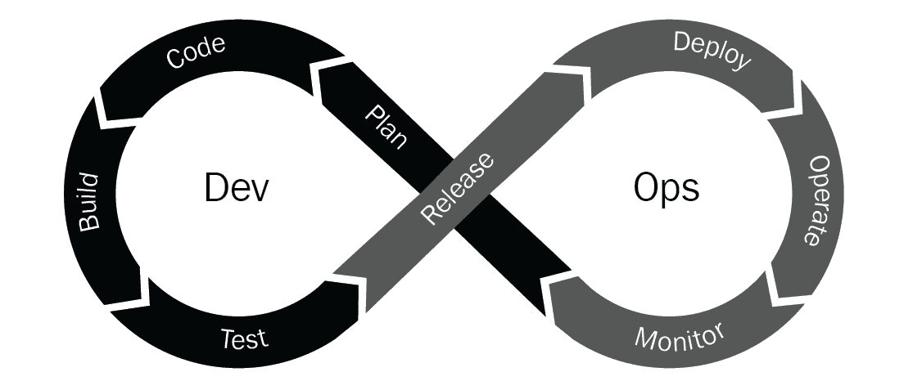
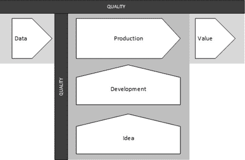
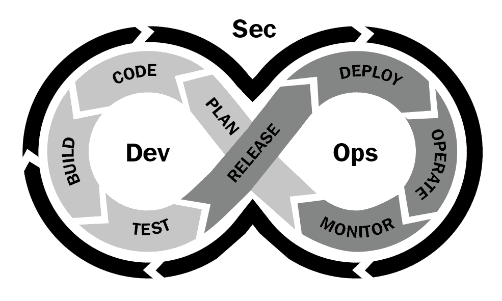

# 第十一章：跟上关键 DevOps 趋势

现在存在多种不同的学科，旨在建立在 DevOps 的核心原则和实践之上，针对业务的不同领域，甚至特定部门。像 DataOps、GitOps 和 DevSecOps 这样的术语现在已经成为行业中的常用术语，并且每个领域都有相应的工具。在本章中，我们将更详细地了解这些趋势，理解它们是什么，目标是什么，以及可以使用哪些工具。

到本章结束时，你将理解与 DevOps 专业相关的一些关键趋势，了解它们是什么，如何在组织中应用，以及如何在其中使用工具。

在本章中，我们将讨论以下主题：

+   什么是 XOps？

+   理解 DataOps 生态系统

+   理解 DevSecOps 生态系统

+   理解 GitOps 生态系统

# 什么是 XOps？

**XOps**是一个通用术语，描述了在技术内外采用其他形式的运营。在这个背景下，DevOps 实际上只是冰山一角。

DevOps 只是一个开始。你还可以包括 BizOps、FinOps、AIOps 和 MarketingOps 作为起点，但*XOps*的概念不仅仅包括这些。它们都是跨职能的努力，像 DevOps 一样，但组织是否真的需要所有这些，甚至其中的一部分，还是这一运动仅仅是炒作？

我们都能达成的共识是，所有组织都处于各自不同的成熟阶段。影响这一点的因素包括它们的规模、年龄、行业、技术采用、预算，当然，还有文化。

组织越来越需要这些不同类型的运营模型所提供的好处。有些组织会尽可能多地实施这些模型，而有些组织则会根据需要实施，并且调整过程和采用的程度，以最适合他们的组织。

这并不意味着结果会因为之前提到的因素而有所不同。与 DevOps 一样，这些模型共同的关键要素是关注价值，而这正是每个组织的独特之处。

## XOps 是从哪里开始的？

有些人认为 XOps 只是炒作，一种会消失的炒作，认为许多提议的内容不过是对现有事物的重新标签化。你也可以对 DevOps 说同样的话，但正是将 DevOps 中的实践整合在一起，而不是将其割裂开来，才给组织带来了真正的价值。

像 DevOps 一样，大多数运营模型类型将关注过程加速和交付质量的改进。例如，在 DataOps 中，这将是数据，以及对 AIOps 运营性能的分析洞察。

那些认为 XOps 被过度炒作的人认为，风险在于不同的参与群体可能会导致碎片化。这种碎片化进一步稀释了更快创造的价值，并且产生了额外的官僚主义。

重要提示

敏捷性自千禧年初以来一直是 XOps 的核心。自那时以来，商业领袖已经意识到，他们的组织需要更加敏捷，以便在行业中保持竞争力。

作为 XOps 一部分的敏捷实践已经存在了一段时间，并且在商业领域中的地位逐渐上升。不幸的是，一些领导者认为敏捷就等于用更少的资源做更多的事。

事实上，从根本上说，背靠扎实流程的敏捷性为您的组织提供了在需要时进行扩展的能力，能够为终端用户提供更多价值，改进您的流程，并提高效率。

XOps 和 DevOps 之间的联系不仅仅体现在名称的相似性、实现黄金标准的方法或相关流程上。文化是 DevOps 的重要组成部分，特别是在改善组织内沟通与协作的能力方面。

XOps 从 DevOps 借鉴的其他重要方面包括关注持续改进以及任务自动化。技术人员常常忽略，流程自动化不仅仅局限于技术层面的流程。毕竟，业务流程自动化早在 DevOps 诞生之前就已经存在了。

## 了解 XOps 格局

为了进一步了解 XOps 格局，让我们来看一下 XOps 中的两个常见倡议：FinOps 和 CloudOps。我们将在本章稍后详细了解 DataOps、DevSecOps 和 GitOps。

### FinOps

FinOps 也被称为云财务管理，它是组织内部财务和运营团队的融合。具体而言，FinOps 专注于管理财务运营的过程，同时将相关人员、流程以及技术相结合。

FinOps 的需求来源于传统的 IT 财务模型，该模型与其他团队分开运作，缺乏基于数据的决策制定和技术现代化来管理可扩展的、云支持的应用程序。

关于商业需求缺乏灵活性的问题只会使成本膨胀，这使得系统运作缓慢且更加昂贵。因此，组织需要提出一种方法，为其高度可扩展的云环境提供成本控制，了解这些成本是什么，如何发生，并跟踪云支出。

随着云计算的发展，对于组织内部其他部门能够对云环境中的服务进行费用分摊的需求也在增加。云计算涉及的细化成本在许多方面使得费用分摊的概念变得更加简便，但实际上，实施起来依然困难。

如何为共享服务（如网络和存储）计费的复杂性，使得很难意识到这些费用如何可以分摊到不同部门。这些基础设施级别的服务，或核心服务，通常由技术部门使用，而应用服务则按成本中心进行计费。

为了实现稳健的 FinOps 实践，重要的是遵循三个阶段的采用过程。这三个阶段是通知、优化和操作。第一阶段，*通知*，对资产、预算分配进行详细评估，并提供行业标准的理解，以便发现改进的领域。

第二阶段，*优化*，帮助设置警报和指标，以识别需要花费和重新分配资源的领域。这些操作能够生成决策能力，并在需要时提供架构变更的建议。

最后阶段，*操作*，帮助在资源级别追踪成本和成本控制机制。FinOps 在操作中提供了一定的灵活性，但仍保持对与云平台相关的可变成本的财务责任。

### CloudOps

CloudOps 是定义和识别适用于优化云环境服务的操作程序的过程。CloudOps 是 DevOps 与传统操作的结合，能够为云平台、应用程序和数据提供进一步的技术增强，同时维持服务。

为了进一步加速敏捷性，组织必须密切关注预算限制，比如浪费和超支。这也是组织决定将工作负载迁移到云平台的原因之一。

CloudOps 提供可预测性和主动性，有助于增强可见性和治理。在维持本地部署的过程中，相关的电力、网络、存储和高可用性始终是一个挑战。尽管挑战依然存在，但在云中这更容易实现，虽然这些挑战与本地部署有所不同。

由于 CloudOps 是 DevOps 的扩展，它旨在建立负责云平台上迁移后应用程序的云操作团队。优化成本、增强安全性、提供容量规划的治理工具在 CloudOps 中至关重要。它还推动了持续监控的理念，并且通过较少的资源管理云应用程序。

自动化提供了提高云应用程序敏捷性、速度和性能的技术。CloudOps 中的自动化还促进了服务、事件和问题的顺畅处理。将 DevOps 中的元素（如持续集成和持续部署）与基础设施服务相结合，并引入基础设施即代码，提供了高水平的自动化，提升了 CloudOps 的价值，并为操作团队提供了以前未曾见过的可扩展性。

## XOps 的方法

让我们看一下 XOps 的一种方法。目标是将当前的单体应用程序转化为微服务架构。此外，迁移过程应该是自动化的，并为生产、UAT（用户验收测试）和测试创建独立的环境。

主要身份应由 DevOps 团队进行管理。这使得您能够管理用户、群组以及第三方服务和应用程序。这种方法提倡协作文化。

此外，为了使资源模块化，团队为多个资源生成基于容器的模块，然后将堆栈拆分，使其可扩展，并确保部署更加容易。

这种方法使得开发团队的维护和调试变得更加简便，自动化流程有助于提升代码质量。基于角色的访问控制确保了安全的身份验证和授权。

集中化日志记录和监控系统的部署，可以在集中式仪表板上查看性能、可用性和安全性。这有助于提高成本效益并改善应用程序的性能。

在这里，我们已经讨论了多个学科，如 DevOps、CloudOps 和 FinOps，以使这一切得以实现。

现在我们已经了解了*XOps*这个术语。我们明白了 XOps 的来源和 XOps 的整体格局。接下来，让我们更详细地了解一下 DataOps 生态系统。

# 了解 DataOps 生态系统

关于 DataOps 的一个常见误解是，它在幕后仅仅是将 DevOps 应用于数据分析。尽管名称与 DevOps 和 DataOps 有相似之处，但它们并不相同。

看看下面的图表，它展示了 DevOps 循环：

图 11.1 – 显示 DevOps 各阶段的无限循环图形

DevOps 通常被描述为一个无限循环。正如你在前面的图表中看到的，DataOps 则有所不同。在展示 DataOps 时，它被呈现为价值和创新管道的交集，如下图所示：

图 11.2 – DataOps 展示，顶部为价值管道，底至顶为创新

DataOps 表示数据分析能够实现软件开发中的 DevOps 所取得的成就。也就是说，当数据团队使用新工具和方法论时，DataOps 可以带来质量和周期时间的数量级提升。DataOps 实现这些提升的具体方法反映了数据团队所特有的人员、流程和工具。

敏捷方法在需求快速发展和经常变化的环境中特别有用。数据专业人士对此会有深刻的理解。就像在 DevOps 中一样，DataOps 中的敏捷方法使组织能够快速响应需求，加速价值实现的时间。

DataOps 不仅仅是关于工具的管理，还涉及人员的管理。利益相关者的需求和偏好是 DataOps 与 DevOps 之间一个微妙的区别。

在 DevOps 中，我们的用户是熟悉编码的开发工程师和运维工程师，他们能处理一个环境中多种语言的复杂性，以及硬件和软件的相关问题。然而，在 DataOps 中，我们的用户是数据科学家、工程师和分析师，他们分析数据并构建复杂的数据模型。

DevOps 的开发是为了满足软件开发人员的需求。开发工程师喜欢编码，并且具备较强的技术能力。学习新语言或部署新工具对他们来说是机会，而非负担。他们对代码创建、集成和部署的各个方面都非常感兴趣。DevOps 欢迎复杂性。

DataOps 用户通常与此截然相反。他们是专门从事模型和可视化开发与部署的数据科学家或分析师。工程师通常比科学家和分析师更具技术敏锐度。他们专注于领域专业知识，致力于使模型更加具有预测性，或找出最适合的方式来直观展示数据。

用于创建这些模型和可视化的技术仅仅是工具。数据专业人士最喜欢的状态是只使用一两个工具，任何更多的工具都会增加不必要的复杂性。在最极端的情况下，复杂性超过了他们的管理能力。

DataOps 认识到数据专业人士生活在一个多工具、异构的世界中，并致力于让他们能够更好地管理这一局面。

## 了解 DataOps 相关过程

通过检查数据分析开发和生命周期过程，我们可以开始理解数据专业人士面临的独特复杂性。我们发现，数据分析专业人士面临的挑战既有与软件开发人员相似的，也有与其不同的。

在 DevOps 中，生命周期从规划阶段开始，并且会反馈到最初的代码阶段。因此，过程是无限迭代的。

DataOps 生命周期具有这些迭代特征，但有一个显著的区别：DataOps 由两个活跃且交叉的管道组成。之前提到的数据工厂是单一管道。另一个管道管理数据工厂的更新方式，包括创建和部署新分析到数据管道中。

将新分析思想引入价值管道的过程被称为创新管道。尽管创新管道在概念上类似于 DevOps 开发过程，但有几个因素使得 DataOps 开发过程比 DevOps 更加复杂。

## 了解 DataOps 中涉及的工具

为了交付一个可靠的数据管道，直接和间接支持 DataOps 需求的工具可以分为五个步骤，利用现有的分析工具以及旨在解决源代码管理、过程管理和小组之间高效沟通的工具链组件：

+   源代码管理

+   过程和工作流的自动化

+   添加数据和逻辑测试

+   在一致的部署中无畏地工作

+   实施沟通和过程管理

现在，让我们更详细地介绍这五个步骤。

### 源代码管理

数据管道不过是负责将原始数据转换为可用信息的源代码。我们可以自动化整个数据管道，从开始到结束，生成可复现的源代码。版本控制工具（如 GitHub）有助于存储和管理代码和配置的所有更改，从而减少不一致的部署。

### 过程和工作流的自动化

自动化对于 DataOps 方法的成功至关重要，这需要设计具有运行时灵活性的数据管道。自动化数据策划服务、元数据管理、数据治理、主数据管理和自助互动是实现这一目标的关键需求。

### 添加数据和逻辑测试

为确保数据管道正常工作，必须对输入、输出和业务逻辑进行测试。为了确保数据质量的一致性，数据管道在每个阶段都要进行准确性或潜在偏差的测试，以及错误或警告的检查。

### 在一致的部署中无畏地工作

数据分析专业人员害怕引入会破坏当前数据管道的更改。这个问题可以通过两个关键工作流来解决，这两个工作流将在生产中后期集成。首先，价值管道为组织生成持续的价值。其次，创新管道由处于开发阶段的新分析组成，后来这些分析会被添加到生产管道中。

### 实施沟通和过程管理

在 DataOps 实践中，高效且自动化的通知至关重要。当源代码发生更改，或数据管道被触发、失败、完成或部署时，相关利益相关者可以立即收到通知。工具链还包括促进跨利益相关者沟通的工具（如 Slack 或 Trello）。

我们现在已经了解了什么是 DataOps，实施正确时它所期望达成的目标，以及涉及的 DataOps 生命周期中的流程和工具。现在，让我们来看看 DevSecOps 生态系统。

# 理解 DevSecOps 生态系统

**DevSecOps** 是一种软件行业的文化变革，旨在将安全性融入现代应用开发和部署中典型的快速发布周期，这也被称为 DevOps 运动。拥抱这种“向左推进”的思维方式要求组织弥合开发团队和安全团队之间通常存在的差距，以至于许多安全流程可以自动化并由工程团队处理。

以下图表帮助说明安全性如何融入现有的 DevOps 循环：

图 11.3 – 显示 DevOps 与 DevSecOps 交互的图示

历史上，主要的软件开发商通常每几个月甚至几年发布一次其应用的新版本。这给代码足够的时间进行质量保证和安全测试，这些测试由独立的专业团队（无论是内部团队还是外包团队）处理。

然而，在过去的 10 年里，公共云、容器以及微服务模型的兴起，已经将单体应用程序拆分成可以独立运行的更小部分。这一分解也直接影响了软件开发方式，导致了滚动发布和敏捷开发实践，在这种模式下，新特性和代码以快速的速度不断推送到生产环境中。

DevSecOps 将 DevOps 和 SecOps 结合，形成一个软件开发、技术运营和网络安全的循环实践。

DevSecOps 的目标是推动安全代码库的快速发展。DevSecOps 方法论并不单纯强调开发速度或安全性，而是帮助开发人员和安全专家在两者之间找到一个健康的平衡点。使用敏捷框架使得开发和安全团队能够持续合作。

DevOps 和 DevSecOps 方法论在许多方面是相似的，包括利用自动化和持续流程来建立协作开发周期。虽然 DevOps 强调交付速度，DevSecOps 更加注重安全性。

DevSecOps 的实践可能会在初期增加开发时间，但它们将确保代码库从一开始就具备安全性。经过一些实践之后，一旦安全完全融入到开发过程中，团队将受益于更快的编写和交付安全代码库的速度。

## 理解 DevSecOps 中涉及的流程

DevSecOps 中的许多过程并不新颖。你的组织可能已经在实践它们了。主要的区别在于，目前的流程可能不适合在 DevSecOps 环境中使用。

要了解需要改变的流程，一个很好的起点是查看*DevSecOps 宣言*（[`www.devsecops.org`](https://www.devsecops.org)）。与敏捷宣言类似，DevSecOps 宣言列出了九个要点，以帮助你成熟信息安全实践。它们如下：

+   积极参与，优于总是说“不”

+   数据与安全科学，优于恐惧、不确定性和怀疑

+   开放的贡献与协作，优于仅限安全的要求

+   可消费的安全服务与 API，优于强制性的安全控制

+   以业务驱动的安全评分，优于象征性的安全审核

+   红队与蓝队的漏洞测试，优于依赖扫描和理论漏洞

+   24 小时全天候的主动监控，优于事后反应

+   共享威胁情报，优于信息保密

+   合规操作通过剪贴板和检查表进行

你可以看到，大多数宣言中列出的内容涉及到你现有的信息安全投资的成熟度，并且在一定程度上有助于收回一些多年来与信息安全相关的负面观念。

DevSecOps 很难，但做得好的话，你可以显著提升你的安全态势，同时加深对组织内部安全的理解。要转变为 DevSecOps 的思维方式，应该遵循以下五个步骤：

1.  DevSecOps 是一种文化变革。

1.  将实践与开发工作流程对齐。

1.  可证明的证据表明，安全性与速度同步发展。

1.  从预防转向检测。

1.  使用安全预算来支持开发工作流程。

让我们进一步了解接下来的五个步骤，以便理解实施过程。

### DevSecOps 是一种文化变革

采用 DevSecOps 方法对于大多数企业来说将是一次巨大的任务，因此要意识到它是一次重要的文化转变。开始对话，要勇敢，并成为迈向改变的第一步。如果你以一种清晰简洁的方式进行交流，突出每个组织在业务、效率和安全方面的好处，找到共同点并达成协议会更容易。

### 将实践与开发工作流程对齐

与开发团队进行讨论时，至关重要的一点是不要将当前的安全实践带到桌面上，并期待他们改变开发代码的方式。

显然，你不应忽视监控、风险评估等方面的安全需求，但你必须愿意改变你的安全实践，以与开发工作流对接。如果你试图基于传统的安全方式来构建你的 DevSecOps 方法，那么生产发布的速度和节奏就会停滞。

### 显示安全与速度保持同步的可证明证据

你的开发、运维或 DevOps 团队很可能会对欢迎安全团队或专业人员加入他们的*工作方式*感到犹豫。你可以通过提供可见性和监控服务，以及与团队合作，绘制流程并识别支持敏捷性的机会，来克服这种犹豫。

在初期，你应该更少关注强制执行、阻止活动和减缓流水线速度，而应该更多关注展示安全性如何跟得上你的开发团队如此高效地构建大量产品，以确保流水线能够顺利运行。

### 从预防转向检测

一旦安全已经在开发工作流中建立了自己的位置，你可以考虑从监控和可见性角色转变为主动识别代码中的漏洞。在这种情况下，安全团队可以成为开发团队最好的朋友。

### 使用你的安全预算来支持开发工作流

最后，考虑一下你自己的安全预算。是否有某些领域，你可以将一些安全预算重新分配到工作流流水线中，以便在改变你的实践以与开发工作流对接时使用？这展示了你通过将更多资源投入到持续集成和持续部署流水线中，致力于每次发布的安全可持续性。

## 了解 DevSecOps 中涉及的工具

由于从流程角度来看，DevSecOps 与 DevOps 生命周期紧密对接，因此，DevSecOps 中使用的工具也紧密契合 DevOps 生命周期的流程。因此，DevSecOps 的工具与 DevOps 的八个不同阶段对接。以下是每个阶段及其常见的安全工具和流程：

+   **计划**：威胁建模

+   **代码**：静态分析和代码审查

+   **构建**：渗透测试

+   **测试**：合规性验证

+   **发布**：日志记录

+   **部署**：审计

+   **操作**：威胁情报

+   **监控**：检测、响应、恢复

接下来，让我们更详细地看一下这些内容，了解使用的工具的具体情况。

### 威胁建模

不幸的是，威胁建模长期以来一直被认为是一项耗时且劳动密集的活动。因此，随着组织采用 DevSecOps 方法，威胁建模常常被排除在安全实践之外。然而，威胁建模在开发中的重要性不容小觑。

根据*2020 DevSecOps Insights Report* ([`snyk.io/wp-content/uploads/dso_2020.pdf`](https://snyk.io/wp-content/uploads/dso_2020.pdf))，威胁建模对团队整体的代码安全信心具有显著的正面影响。

从本质上讲，威胁建模旨在检查计划中的软件，识别如果攻击者针对该软件可能发生的安全问题。这项分析的目的是让开发团队了解在其实现过程中应该考虑哪些安全控制。传统上，威胁建模通常涉及整个应用程序环境的广泛范围。在此过程中，常常使用数据流图、详细的威胁分析框架以及规定的威胁优先级方法。

### 静态分析

静态分析工具，或 **静态应用程序安全测试** (**SAST**)，与几乎任何软件自动化工具链、任何开发方法论和流程都能很好地配合使用。这主要是因为它们可以由开发人员在本地桌面上使用，以便即时反馈并分析完整的构建，无论是每小时完成还是根据其他任何节奏进行构建。

此外，由于它们不需要与测试人员或开发人员互动，SAST 工具是完全自主的。每当需要检查代码中的漏洞和安全漏洞时，它们都非常有用。

虽然单独使用这些工具并非万能，但它们应与其他自动化工具一起使用。随着软件团队开始将安全性集成到他们的 DevOps 流程中，像*SonarQube* ([`www.sonarqube.org`](https://www.sonarqube.org)) 这样的工具既易于实现，又能轻松集成到自动化流水线中。通过尽早发现漏洞并防止其进入开发周期的后期，这条流水线在减少后期安全修复方面大有裨益。

### 渗透测试

虽然流水线中的自动化工具可以大大帮助检测许多不同的漏洞，但你可能仍然需要渗透测试工具。从传统角度来看，渗透测试在许多方面既是一门艺术，也是一门科学。如果你认为渗透测试与 DevOps 中对速度、频率和可重复性的关注意味着 DevOps 和渗透测试是对立的，这也是可以理解的。

*BreachLock* ([`www.breachlock.com`](https://www.breachlock.com))，例如，可以通过对您的产品进行端到端安全测试，完全集成到 DevOps 环境中，从而确保开发过程的速度、可靠性和一致性。

### 威胁情报

随着更多环境组件在代码中被定义和记录，威胁情报的可视性也在不断增长。许多组织在识别其 IT 资产时面临困难，无法有效地将威胁情报与环境中的资产关联。通过确保有适当的流程将 DevSecOps 管道中的元数据传递给威胁情报能力，组织可以确保收集到正确的情报并将其应用，同时以风险优先的方式进行响应。

我们现在已经了解了什么是 DevSecOps，了解了当正确实施时它试图实现的目标，以及涉及 DevSecOps 生命周期的流程和工具。现在，让我们来看看 GitOps 生态系统。

# 理解 GitOps 生态系统

GitOps 是一种在云原生应用程序中实施持续部署的技术。它通过利用开发人员已经熟悉的工具（如 Git 和持续部署工具）来专注于为开发人员提供操作基础设施的体验。

GitOps 的核心概念是拥有一个 Git 仓库，始终包含当前生产环境中所需基础设施的声明式描述，以及一个自动化过程来匹配仓库中描述的状态。如果你想部署一个新的应用程序或更新现有应用程序，你只需更新仓库；自动化过程将处理剩下的部分。这就像为管理你的生产应用程序提供了巡航控制。

提示

虽然我们专门谈论的是 Git，但你可以使用任何源代码控制仓库来实现相同的结果。

GitOps 提供了一个完整的历史记录，展示了你的环境随时间变化的情况。这使得错误恢复变得简单，只需运行 `git revert` 并观看你的环境自行恢复。

GitOps 使你能够完全在你的环境中管理部署。你的环境只需要访问你的仓库和镜像注册表即可完成这项任务。就是这么简单，你不需要授予开发人员直接访问环境的权限。

当你使用 Git 存储已部署基础设施的完整描述时，团队中的每个人都可以看到其随着时间的演变。通过优秀的提交信息，任何人都可以轻松地再现改变基础设施的思路，并找到如何设置新系统的示例。

GitOps 中的部署过程围绕着代码仓库作为核心元素进行组织。至少有两个仓库，一个用于应用程序，另一个用于环境配置。应用程序仓库包含应用程序的源代码以及用于部署应用程序的部署清单。

环境配置仓库包含了部署环境当前所需基础设施的所有部署清单。它指定了哪些应用程序和基础设施服务应该在部署环境中运行，并且指明了配置和版本。

GitOps 是一种高效的工作流模式，用于管理现代云基础设施。尽管它主要关注 Kubernetes 集群管理，DevOps 社区正在将 GitOps 解决方案应用并发布到非 Kubernetes 系统。GitOps 可以从多个方面惠及工程团队，包括改善沟通、可见性、稳定性和系统可靠性。

## 理解 GitOps 中涉及的流程

GitOps 的一个优点是，你不需要做任何不同的事情。如果你已经在以代码形式编写基础设施并将代码存储在仓库中，那么你几乎已经完成了。

最难的部分是从命令式部署方法转变为声明式部署方法。基础设施即代码提倡一种声明式的系统管理方法，这促进了像 Ansible、Terraform 和 Kubernetes 这样的工具的发展，这些工具都使用静态文件声明配置。

考虑以下命令式语句，它们是部署应用程序的步骤：

1.  安装操作系统。

1.  安装这些依赖项。

1.  从这个 URL 下载应用程序。

1.  将应用程序移动到这个目录。

1.  在另外三台服务器上重复此操作三次。

这种声明式版本的做法可能只是像 *四台机器从这个 URL 安装应用程序，安装在这个目录中* 这样的描述。与一系列命令不同，声明式软件遵循期望状态的声明。

完成完整 GitOps 安装需要一个管道平台。一些流行的管道工具，如 Jenkins、Azure DevOps 管道和 CircleCI，能够补充 GitOps。管道自动化并将 Git 拉取请求连接到编排系统。管道钩子建立并通过拉取请求触发后，命令被发送到编排系统。

因此，GitOps 中涉及的过程与软件开发生命周期中相同阶段的过程并没有太大区别。这些过程定义了代码应该如何存储、使用什么语言、谁应该进行审查、管道应该如何构建以及这些管道在哪里执行。

为了实现 GitOps，你可以扩展在 DevOps 中已做的工作，将其应用到基础设施领域。

## 理解 GitOps 中涉及的工具

正如我们在上一节提到的，开始使用 GitOps 需要两个工具。这些工具分别是 Git 形式的版本控制，以及构建和执行管道的工具。

Git 是 GitOps 管道模型中的设计中心。它作为系统中一切的权威来源，从代码到配置，再到整个堆栈。构建可部署的工件需要使用持续集成、构建和测试服务。然而，在 GitOps 管道中，整体交付编排由部署和发布自动化系统协调，这一过程由仓库更新触发。总结来说，持续部署而非持续集成掌控交付编排。这是软件开发生命周期中管道工作方式的一个微妙转变。任何持续集成提供商都应该能够采用这一模型。

# 总结

在本章中，我们详细了解了 XOps 及其各种可用的运营模型。我们进一步探讨了 DevSecOps、DataOps 和 GitOps，深入理解了它们的起源、优势、流程和工具，并比较了它们与 DevOps 的不同之处。

在下一章中，我们将汇总迄今为止学到的所有内容，回顾一些关键的学习点，并通过一个示例组织来讲解 DevOps 的实施，列出它们面临的挑战、如何解决这些挑战，最后如何实施这些变更。

# 问题

现在让我们回顾一下本章中学到的一些内容：

1.  FinOps 的目标是什么？

    a) 管理云平台中的财务运营。

    b) 设置适当的预算。

    c) 确保消费的问责制。

    d) 增强敏捷性。

1.  DevOps 和 DataOps 有什么区别？

    a) DataOps 专注于数据而非软件。

    b) DataOps 专注于数据库管理。

    c) DataOps 不像 DevOps 那样是一个迭代过程。

    d) 没有区别；两者相同。
