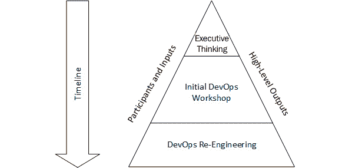
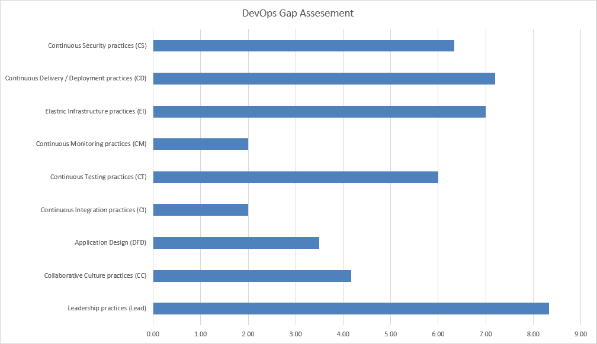
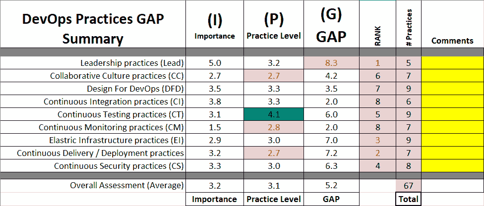
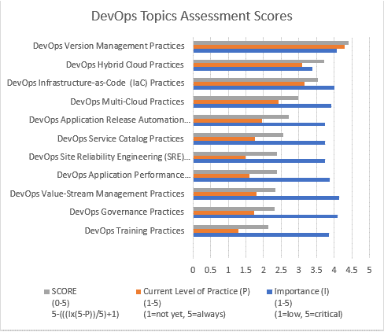
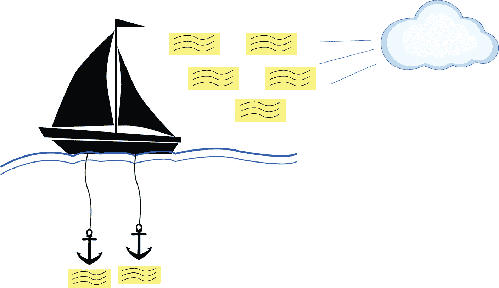
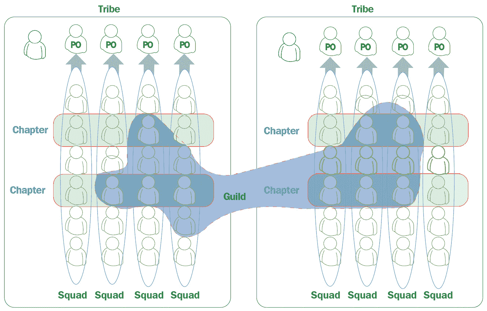

# 第十二章：在现实世界组织中实施 DevOps

运用我们迄今为止学到的所有知识，在本章中我们将实践并看看如何在现实世界中的组织中实施 DevOps。通过一个虚构的组织，我们将提出问题陈述，定义他们的目标，并讨论如何帮助该公司适应和变革，开始走上 DevOps 转型的道路。

到本章结束时，您将学会如何结合我们在书中所涵盖的所有元素，并将其运用到实践中，进行一次真实的 DevOps 转型。

本章将涵盖以下主题：

+   理解为什么组织转向 DevOps

+   定义我们的虚构组织

+   DevOps 转型示范

# 理解为什么组织转向 DevOps

在 *第一章*，*介绍 DevOps 和敏捷* 中，我们讨论了 DevOps 的目标，以及 DevOps 的一些价值观和 DevOps 可以帮助我们解决的挑战。那么，为什么组织会转向 DevOps 呢？这是我们现在要更详细探讨的问题。

根据 *2019 DORA DevOps 状态报告*（https://cloud.google.com/devops/state-of-devops），DevOps 的顶尖表现者能够更快速地交付代码，减少缺陷，并更快地解决事件。该报告的一些亮点包括以下统计数据，支持了前述观点：

+   代码部署频率提高了 208 倍

+   从提交到部署的领先时间提高了 106 倍

+   从事故中恢复的时间提高了 2,604 倍

+   更低的变更失败率，减少了 7 倍

采用 DevOps 实践的组织能够做得更多。通过利用一个由跨职能成员组成、协同工作的团队，DevOps 组织能够以最大的速度、功能性和创新交付成果。

在 *第二章*，*DevOps 的商业利益、团队结构和陷阱* 中，我们重点讨论了 DevOps 的关键商业利益。然而，您可以将与 DevOps 相关的利益分为三个明确的类别：

+   商业利益

+   技术利益

+   文化利益

当我们谈到商业利益时，我们讨论了推动企业发展的因素；例如生产力的提升、更高质量的产品以及改善员工留存率就是其中的三个原因。此外，还有一些因素直接影响企业的成功，如增长的改善、客户满意度和客户体验。

现在，让我们来看一下实施 DevOps 后，您的组织可以期待获得的一些技术和文化上的收益。

## 技术利益

你可以列举出与 DevOps 相关的众多技术收益。然而，在推动 DevOps 转型时，重要的是不要过分关注细节，保持关注更广泛的收益。这是因为通常这些较小的收益，尽管对你或你的团队有利，但对于其他团队、部门或整个组织可能并不是更广泛的好处。

保持这种组织视角将确保你获得最大的支持。组织内的各个团队将感受到对其团队特有的好处，这是很好的，但你必须关注更大的利益。

有三个关键收益对我来说是至关重要的，它们与前述的思考大局的情景一致。它们是持续的软件交付、更快的问题解决和更少的复杂性。这也为更积极主动和反应式的技术债务管理提供了机会。

持续集成和持续部署与交付是 DevOps 的基石，是明确的技术收益。正确实施时，它们不仅为你提供了在构建和部署应用程序时的明显好处，还为你提供了在开发过程中捕捉不良实践的手段，以及在过程中发现安全问题和威胁。

通过 DevOps 中采用的实践，你正在使你的环境变得更简单。这种复杂性减少对组织和各个团队都具有吸引力。最重要的是，复杂性的减少可以体现在多个领域，例如你的工作流程，这意味着你已经自动化了手动任务；它也可能体现在文档的生成上，例如。它还意味着去除流程中不必要的步骤。这通常以价值流映射练习的形式出现，用以识别并去除操作中的无效步骤。

最后，随着 DevOps 提升了你对应用程序和基础设施的监控，也引入了站点可靠性工程，这涉及快速从故障中恢复的能力。**站点可靠性工程** (**SRE**) 是一种将软件工程的部分方法应用于基础设施和运营问题的学科。

提供的遥测数据水平和团队之间在应用程序和基础设施方面的共享理解支持了应用程序以及团队设定的目标。

## 文化收益

在各章节中，我们已经深入讨论了文化在 DevOps 中的影响。DevOps 中的文化是将我们的团队联系在一起的纽带。更快乐、更高效的团队；更大的职业发展机会；以及更高的员工参与度，是你通过成功实施 DevOps 可以实现的三大文化收益。

我刚才提到过 DevOps 带来的团队共享责任。这是文化利益的重要推动因素。当团队共同承担责任、追求共同目标并推动愿景时，这将创造一个文化上健康的工作环境，从而带来更快乐、更高效的团队。

这一点的进一步好处是，DevOps 培养的良好文化能够提高员工的参与感。在 DevOps 中，我们被教导“快速失败”和“成长心态”这两个理念。这意味着员工更可能表达自己的想法，并相互开放沟通，因为焦点不在于归咎，而在于改进和分享想法，以实现共同目标。

最后，当你将所有这些因素结合起来时，你会自然而然地拓宽团队成员的技能。你为团队提供了扩展知识和进一步发展职业生涯的工具和能力。具有真正职业成长机会的组织是新员工寻找的最大亮点之一。DevOps 可以帮助你的组织在新员工中具备吸引力。

## 平衡稳定性与新功能的推出

在非 DevOps 环境中，通常会在发布新功能与保持系统稳定性之间产生冲突。开发团队的评估标准是向用户交付的更新数量，而运维团队的评估标准则是系统的整体健康状况。

在 DevOps 环境中，团队中的每个人都负责交付新功能以及确保稳定性。由于代码不会在开发结束后被*扔给*运维，基于共享代码库、持续集成、测试驱动技术以及自动化部署等方式的结合，使得应用程序代码、基础设施或配置中的问题能够在流程早期就暴露出来。

由于变更集较小，问题通常较为简单。DevOps 工程师可以使用实时系统性能数据，快速了解应用程序变更的影响。解决时间也得到缩短，因为团队成员无需等待其他团队进行故障排除和问题解决。

## 提高工作效率

在典型的 IT 环境中，人们常常浪费大量时间等待其他人或其他机器，或者反复解决相同的问题。员工更愿意提高工作效率，而浪费在无意义工作上的时间会导致沮丧和不满。当人们能够减少在无聊任务上的时间，更多地把时间花在为组织创造价值的事情上时，每个人都能受益。

DevOps 模型中的关键 IT 运维方面包括自动化部署和标准化的生产环境，这使得部署可预测，并使员工从日常重复任务中解放出来，去做更具价值的工作。例如，一家拥有超过 4000 名 IT 员工的大型金融服务公司，通过实施 DevOps 节省了超过 800 万美元，减少了 MTTR，并消除了遗留工具的维护。

现在我们已经更广泛地了解了组织为何转向 DevOps。接下来，让我们定义一下我们的虚构组织，以便更好地了解 DevOps 转型的实施。

# 定义我们的虚构组织

在我们开始讨论转型之旅之前，首先让我们定义一下我们合作的组织。我想向大家介绍*Travelics*。通过与 Travelics 的早期讨论，我们得知了一些他们的常见情况：

+   总部位于欧洲和北美的全球性组织。

+   拥有大约 4000 名员工。

+   为航空行业生产两款产品，一款专注于行李追踪，另一款则聚焦于运营洞察。

+   两个产品的团队规模大约有 15 名开发人员。

+   运维是一个共享实体，隶属于中央 IT 部门。

现在我们已经建立了一些关于 Travelics 的基础知识，接下来让我们深入了解一些更具体的信息以及他们试图实现的目标。

## 当前的运营模型

Travelics 目前的运营模型是由客户推动功能需求的提交到软件工程团队。这一过程通过与客户经理的互动以及工程师团队的行业经验来进行。所有需求都集中管理，并分配给负责该功能的团队。工作开始进行，并排队等待发布。

运维团队是一个共享实体，隶属于中央 IT 团队。他们依赖开发团队的文档来排查应用程序的问题。该应用程序目前正在进行转型，从一个部署在公共云环境中的单体应用程序，转变为一个更加云原生的架构，依赖微服务和多租户软件即服务模型。

目前，每个新客户都会部署虚拟机，如果客户购买了两个软件包，它们将分别部署在不同的实例中。

## 目前模型中存在的挑战

目前的工作方式为 Travelics 带来了许多挑战，其中最大的问题是它们在交付应用程序时的敏捷性不足。发布周期仅为每年两次；这通常导致部署失败并回滚应用程序，直到问题解决为止。此停机时间通常会持续约四小时。

另一个问题是代码质量：虽然开发人员技术精湛，但缺乏对彼此工作进行审核和监督的常规做法。这导致了 bug 的产生，并且工程团队背负着大量需要解决的技术债务。

缺乏可扩展性和云原生方法也是一个限制因素。这带来了严重的运营挑战，并且导致不同客户有不同的配置方式；应用程序的版本在所有客户中并不一致，一些客户甚至部署了不受支持的版本，因为他们不愿意允许公司进行升级，担心会发生停机故障。

DevOps 的理解在工程组织中各不相同，且在工程部门之外，很多员工可能对 DevOps 并不了解。虽然有一些人明白 DevOps 的概念，但普遍存在对转向这种新模式的犹豫。

## 未来目标

变革的驱动力是引入了一家提供类似服务的新组织。这个颠覆者规模较小，但能迅速交付新功能，并提供完全的“软件即服务”解决方案。Travelics 已经失去了三位大客户给这位竞争者。他们相信，通过变革，可以解决这些问题，并重新获得竞争力。

Travelics 的 DevOps 转型目标如下：

+   对产品发展的清晰愿景。

+   使团队能够独立工作，但共享实践的敏捷性

+   专注于更快的发布和提升质量

+   提高客户满意度

+   更快地实现新功能

+   降低故障发生率

+   转向一个更现代的、具有扩展能力的平台

总结而言，针对 Travelics 的 DevOps 转型需要从组织层面进行全面审视。这包括团队的结构以及运营方式。这些变革将是 Travelics 运作的根本，如果成功，将大大改变他们的工作方式。

现在，让我们开始 Travelics 的 DevOps 转型之旅。

# DevOps 转型流程讲解

现在我们已经了解了 Travelics 组织的概况，以及他们的当前状况、未来的愿景和目标。我们可以开始与他们合作，帮助他们实现这些目标。

成功转型需要经过多个步骤；这是一个漫长的过程。转型大型企业的复杂性要求在最高层获得支持，以确保变革成功并实施所需的变革步骤。你在转型过程中应采取的步骤如下：

1.  举办初步规划研讨会。

1.  建立 DevOps 卓越中心。

1.  设置转型治理结构。

1.  建立一个信息采集流程。

1.  确定并启动试点项目。

1.  评估当前能力。

1.  执行转型练习。

1.  扩展 DevOps 转型。

现在，让我们更详细地了解这些步骤，并讨论与 Travelics 合作实现其目标的具体措施。

## 举办初步规划研讨会。

参与者必须包括所有涉及解决方案交付的团队。除了运营、安全和开发，还需要有业务参与。我总是建议这一阶段的研讨会由经验丰富的外部顾问或教练主导。关键在于获得高层的支持，并建立共同的目标和对 DevOps 计划的理解：

图 12.1 – 显示初步规划输入和输出的图示

对于 Travelics 来说，初步规划非常重要。记住我们之前提到过，除了少数几个人，许多人并不了解 DevOps，这也导致了他们对转向新工作方式的犹豫。

通常，多个小型的 DevOps 项目存在于孤岛中，并缺乏扩展到企业级的成熟度。设计思维是一种很好的方法，因为它利用了所有利益相关者的专业知识，使他们能够达成共识，并建立必要的支持。

现在我们将查看建立 DevOps 卓越中心所需的元素，这是 DevOps 采纳中的一个关键步骤。

## 建立 DevOps 卓越中心

创建**卓越中心**（**CoE**）是不充分的，如果它没有在适当的组织层级和企业权威下进行。必须由一位业务领导者来主导，且此领导者必须获得所有领域的支持和认同。所有交付领域的代表，以及供应商组织的代表，都是 CoE 的积极参与者。参与者必须慎重选择。

在*图 12.1*的基础上，我们现在可以添加一些其他元素，进一步定义所需的利益相关者，并更紧密地定义输出。

你应该注意图表中的时间线是自上而下的，这意味着从顶部开始进行对话。对于 Travelics 面临的转型挑战，我的建议是让首席执行官（CEO）或首席运营官（COO）从赞助角度负责这次转型。

提示

虽然时间线是自上而下的，但也没有问题从底向上获得支持。这只是建立正式卓越中心（CoE）的正式方式。

从转型的第一天开始，软件工程团队的高管、运营、开发部门的高级领导以及 CTO 或 CIO 等高层管理人员应该参与这些早期的讨论。

此阶段的输出是建立一个共同的心态，以推动 DevOps 转型。这将包括为需要完成的工作建立共同的目标、宗旨和优先事项。

进入流程的第三到第五天，我们的讨论需要发展到更高的细节层面，并包括项目的负责人，该负责人也是该项目的赞助人。这需要包括以下领域的代表：

+   应用程序负责人

+   企业架构

+   解决方案架构师

+   开发负责人

+   运营负责人

在接下来的两周内，将与 Travelics 公司进行工作坊，执行软件开发生命周期的价值流图绘制。其目标是更详细地了解组织的当前状态、开发状态、详细的交付流程以及目前与绩效相关的关键绩效指标。

在这个阶段，这些工作坊还着眼于从影响的角度扩展出需要优先考虑的领域。鉴于 Travelics 的需求，你认为哪个领域是他们的优先事项？

提示

Travelics 正面临客户流失和质量问题。这意味着，客户满意度和发布质量是需要立即改进的领域。

最后，在初步规划过程大约进行到 20 天时，之前的同一群人将重新聚集在一起，深入探讨工程在整个过程结束时将会呈现的样子。

考虑到我们对 Travelics 以及其高层目标和雄心的了解，这应当推动这些研讨会的进行，并帮助提供所需的细节，从而形成一个计划和前进的方向。

从这些最终规划研讨会中期望的输出将包括未来状态映射和 DevOps 的参考架构。此时，我们应该至少拥有一份实施路线图的草案，并且引入了高层目标。

在这一阶段，显而易见的是，当前的团队结构不适合目标，也与 Travelics 的目标不一致。因此，输出还包括提出的未来团队结构，以及明确任何角色和职责。

本节的最后部分包括制定推动转型的商业案例以及执行摘要，内容包括提案所涉及的内容。

我强烈建议最初阶段的 CoE 由外部经验丰富的合作伙伴领导，并逐步过渡给内部团队。初期阶段有助于巩固 CoE 的愿景和战略，以及建立支持这些战略的最佳实践。通常，从业务合作伙伴到内部利益相关者的过渡需要 12 到 24 个月的时间。

## 设置转型治理

这是改变组织文化最重要的一步。由于敏捷和 DevOps 的实施，实践者的角色和职责将发生变化。为了成功，他们需要意识、赋能和授权。至关重要的是，他们必须理解历史上有敌对关系的组织之间的协作，以打破这些组织之间的壁垒。KPI 必须从个人指标转向整体客户商业成果。

建立治理并不像外界所说的那样困难。您的项目治理由三大部分组成：沟通计划、赋能计划和已建立的 KPI。

您的沟通计划涉及定期公开您的项目目标、里程碑和成功。从赋能的角度来看，这需要帮助您的商业领导者理解敏捷的基本要素。赋能还包括开始为这些团队提供平台和工具链教育，以及深入培训 DevOps 方法，如持续集成、持续部署、持续测试、持续反馈和持续改进。

最后，您的 KPI 必须来自扎实的关键指标、衡量的良好策略以及频繁且详细的报告节奏以及转型的里程碑。

## 建立接入过程

第一个加入项目的迭代阶段为后续迭代设置了基调。这与工具和流程并不完全相关，更多的是关于工具和流程的适当规模化。加速器、工具链和开发方法的选择必须符合目的。一旦确定，接入过程必须在整个组织内进行沟通。收集反馈并在持续基础上进行演进和成熟。

可重用资产对于具有有效接入过程至关重要。架构模式、自动化脚本、操作手册以及基础设施资产都是可以定义和一次性在多种不同场景中重复使用的关键资产。

迭代的成功归结为最佳实践。这些最佳实践有助于强化一致性，并在不仅限于试点团队而且在转型扩展时提供可重复的结果。确保您已定义了基于主干的开发模式、源代码控制的分支和合并策略，以及围绕测试驱动开发的测试自动化模式和流程，这是此阶段成功的关键。

## 识别和启动试点

当应用于特定的应用程序组合或领域解决方案时，此步骤具有最佳成功机会。在此研讨会之前，我强烈建议开设一些工作会议，以确定一个开发工作领域，代表一个可以扩展到企业的投资组合。

此步骤的目标是与来自所有领域塔的参与者一起进行特定应用程序的价值流映射练习。这必须详细进行，以识别当前的端到端流程、工具、手动和自动化流程，以及涉及的技能和人员。

来自 CoE 的主题专家（SMEs）与项目团队的协作是项目接入过程的下一步。其目标是就“未来”过程提供建议，包括必要的工具、可重用资产、自动化以及来自运营、安全和其他相关领域的 SMEs。应用 Scrum 团队将由这些 SMEs 组成。程序的已确定 KPI 将在应用程序通过其开发/测试周期时进行捕获。这对与现有 KPI 进行比较绝对必要。

## 评估当前能力

理解您组织中存在的 DevOps 领域非常重要。您可能会发现某些领域比您意识到的成熟得多，您可以利用已经存在的一些良好实践，并在转型的其他部分中使用它们。

这些评估可以通过多种方式进行，但必须是可重复的，因为在整个转型过程中，你需要重复使用这些评估，以检查你的进展并在需要时进行调整。评估需要广泛且详细。

随着时间的推移，目标应是与团队一起进行评估，让他们使用一套卡片为每个问题打分，并在团队内讨论分数，以达成改进措施。

我发现的最佳评估之一来自 Marc Hornbeek，他是 *Engineering DevOps*（https://img1.wsimg.com/blobby/go/1c453e6b-8ce5-4e3d-a110-bba77def37c3/downloads/DevOps%20Practices%20Maturity%20Assessment%20v2.xlsx?ver=1619731527627） 的创始人。这个评估非常全面并且免费使用。它详细覆盖了 DevOps 实践的九个支柱，包括以下内容：

+   协作文化实践

+   持续安全实践

+   持续监控实践

+   为 DevOps 设计的实践

+   持续交付实践

+   弹性基础设施实践

+   持续测试实践

+   持续集成实践

+   协作式领导力实践

这些综合性问题提供了一个全面的性能视图。使用相同的评估可以清晰地看到性能的改进，并且你可以回顾跟踪这些改进：

图 12.2 – 成熟度评估的示例输出

正如你从前面的图示中看到的，输出为我们提供了一个全面的快照。每个问题都可以设定该问题对你组织的重要性，并评估当前得分。小组中的顶部条形图表示该领域的成熟度得分：

图 12.3 – 成熟度评估的示例详细输出

输出还提供了每个支柱的成熟度视图。这能让你通过计算每个领域的重要性与当前得分的差异，了解优先改进的区域，即得分最低的领域就是改进的重点。

定期我们也应该进行更详细的评估。这个变化要求提出不同的问题，并在其他某些重点领域进行挑战。更详细的评估关注以下领域：

+   DevOps 培训实践

+   DevOps 治理实践

+   DevOps 价值流管理实践

+   DevOps 应用性能监控实践

+   DevOps SRE 实践

+   DevOps 服务目录实践

+   DevOps 应用发布自动化实践

+   DevOps 多云实践

+   DevOps 基础设施即代码实践

+   DevOps 混合云实践

+   DevOps 版本管理实践

这个高度详细的评估需要一些时间来完成。以往在与团队一起进行此评估时，我会安排一个早晨来完成讨论，并留出时间休息，以保持大家的精力。

与九大支柱输出类似，详细评估的输出在提供成熟度样本图表和表格概览方面是相同的，并突出优先关注的领域：

图 12.4 – 详细成熟度评估的示例输出

其他针对特定角色的评估也可以在 *Engineering DevOps*（[`engineeringdevops.com/documents#bf990569-1a3f-4eb4-bb3b-73073abf8a31`](https://engineeringdevops.com/documents#bf990569-1a3f-4eb4-bb3b-73073abf8a31)）网站上找到。这些是非常有用的资源，可以帮助你的转型和改进之旅。

## 执行转型练习

执行推动转型前进所需的行动任务显然取决于计划研讨会的输出。回顾我们在 Travelics 的例子，现在让我们看看我们可以做哪些任务来帮助他们的 DevOps 转型。

+   巧克力、LEGO 和 Scrum 游戏

+   敏捷简介

+   向敏捷工作方式转型

+   重组团队结构

+   看看流程改进

+   实施 DevOps 实践

+   进入反馈循环

现在让我们特别看看这些领域，看看如何帮助 Travelics 实现他们的目标。

### 巧克力、LEGO 和 Scrum 游戏

初始的研讨会为与更广泛的受众共同设定 DevOps 的基础提供了机会，并且能够获得与你合作的人的信任。考虑使用模拟研讨会，而不是简单地通过幻灯片来推广 DevOps 的好处。

为了做到这一点，我会考虑 Dana Pylayeva（https://www.slideshare.net/danapylayeva/introduction-to-devops-with-lego-and-choco）提出的 *巧克力、LEGO 和 Scrum* 游戏。这个模拟游戏为参与者提供了听取他们在现实世界中面临的相同困境的机会，然后通过模拟情景来移除这些障碍，帮助他们看到移除这些障碍后的结果。

这是一个强大的练习，根据我的经验，它比简单的幻灯片演示更具说服力。游戏的目的是让人们分组坐下，然后通过一套角色卡片来确定具体活动，参与者可以在时间限制的练习中运行我们称之为冲刺的环节。

目标是将 LEGO 动物销售到市场上，并尽可能多地生产符合要求的 LEGO 动物。每当开始一个新的冲刺时，角色会发生变化，障碍会被移除，从而提高交付更多成果的机会。

### 敏捷简介

在本次会议中，面向 Travelics 的运营团队，我们直接面向那些通常对敏捷较为反感的人群。根据我的经验，开发团队更有可能接受敏捷工作方式。虽然敏捷原则来源于软件工程，但这并不意味着你不能与运营团队合作。

一个常见的误解是运营团队不能以敏捷的方式运作。在我个人的观点和经验中，这根本不正确。我将很快解释为什么以及如何解决一些运营团队在采用敏捷方法时常见的顾虑。我们从提出三个简单的问题开始（每个参与者都发放了一叠便签纸）：

+   为什么这样做是值得的？

+   有什么困难？

+   什么是敏捷？

每个参与者接着会有大约五分钟时间写下答案，并将其放在适当的标题下。然后我们会和团队进行讨论，谈论他们写下的笔记，并尝试开始一个开放的对话。在合适的时候，任何主持工作坊的人都可以运用自己在该领域的经验，提供示例来支持或反驳讨论内容。

如果可能的话，邀请一位来自已经进行敏捷转型的团队成员，或者是已经在实践我们试图强调的某些特质的团队成员。尽量邀请这个团队信任的人；在这个阶段，他们会比信任你的意见更有价值。幸运的是，我们在 Travelics 有一位符合这个条件的人。这个团队在开发后存在关闭工作的问题，而且他们的工作是基于票证的。正因如此，我们的 CoE 请求另一团队的成员来参与讨论。

这种方法有效的原因有几个，主要是因为我们举办工作坊的团队中有一位来自另一个正在进行敏捷转型的团队的成员，他能够证明我们所说的内容。大多数情况下，这位成员能够证明这个过程有效，并且值得付出实际的努力，而不仅仅是口头上的承诺。

### 转型为敏捷工作方式

团队转型的计划分为三个步骤。单独来看，每个步骤都很小，但合起来它们构成了整个旅程：

1.  引入每日站会。

1.  引入工作管理工具，如故事和 Scrumban。

1.  引入规划、冲刺和回顾。

在与 Travelics 进行的初始工作坊中，我们举办了团队的首次站会。每日站会的概念旨在回答三个问题：

+   我昨天做了什么工作？

+   我今天在做什么工作？

+   哪些问题阻碍了我？

在运动中，战术会议具有战略意义，确保每个人在比赛中保持信息畅通并紧密联系。对于技术团队来说，站会就是一个战术会议；它旨在强化*我们*和*一个团队*的文化与心态。

向团队突出问题通常会导致团队中的其他成员帮助解决问题。你的站会不应超过 15 分钟。不要进入你一天工作的细节。保持高层次，确保内容相关。突出问题，但不要详细讨论。

第二天，CoE 团队的某位成员参加了该团队举行的第二次日常站会。这个团队是前一天才开始的，会议大约持续了五分钟。大家都保持简洁，重点讨论了他们正在做的工作以及下一步的工作。阻碍因素在高层次上进行了讨论，并决定将对话移到线下。所以，在前一周的一次会议中，在不到 30 分钟的会议时间内，团队成员已经开始比之前更好地同步。

到现在为止，我们已经有了一些工作进展，敏捷的一个重要方面是引入回顾会议。事实上，大多数团队，无论其是否采用敏捷工作方式，都已经在进行某种形式的回顾，通常是团队会议。回顾会议或简称 retro 就是将注意力集中在上一个冲刺上。我们会根据 Scrum Master 进行的回顾类型，提出不同的问题。你可以运行多种类型的回顾，例如 4 Ls、速赛车、星星回顾等。

4 Ls 回顾法要求参与者在四个类别下添加卡片：喜欢、学到、缺乏、渴望。这要求团队讨论并突出正面和负面的方面。

速赛车回顾法，与以下示例相似，旨在突出加快团队进展的因素和减缓进展的因素。

星星回顾法，像 4 Ls 方法一样，要求团队聚焦于应该做得更多或更少的事情，或是开始、停止或继续做的事情。其原则是鼓励团队思考从不同实践中获得的价值。星星回顾法在进行持续反馈循环时非常重要。

在第一次回顾时，CoE 团队决定运行最基础的回顾方法之一；那就是帆船回顾法。在此方法中，我们画一艘帆船，添加一个锚，要求团队将能帮助团队加速的因素放在帆旁边，而将拖慢团队进度的因素放在锚旁边，以下图所示：

图 12.5 – 示例图，展示了帆船回顾的概念

这个练习非常简单，团队的反馈是他们喜欢日常站会；他们也喜欢了解团队中其他成员的工作内容，以及看板工作方式，能够直观地展示工作进展。

团队不喜欢的是额外的会议时间，此外，有时感觉站会时间过长，且其价值可能没有预期的高。

重要说明

虽然我们在敏捷中使用了大量统计数据，但即便没有过多关注统计数据，你仍然可以在教学所需技能和工作方式的过程中取得良好的进展，并看到改进。指标的改进会随着时间的推移逐步实现。

听起来有些粗暴，但当你从根本上改变组织的工作方式时，宣传是非常重要的。考虑在办公室环境中张贴海报，并通过通信渠道发布它们。你可以使用来自*Dandy People*（[`dandypeople.com/posters`](https://dandypeople.com/posters)）的免费海报，作为传播信息的工具。

### 重组团队结构

通过与 Travelics 的讨论以及我们对他们目标的理解，很明显他们当前的团队结构无法适应。根本性的变化之一是从项目视角转向以产品为导向的视角。

产品视角使我们能够引入产品管理角色，帮助管理和优先处理反馈，同时也帮助我们利用市场情报来驱动团队在优先事项上的决策：

图 12.6 – Spotify 模型用于扩展敏捷的图示

接下来是希望通过协作将人们聚集在一起，并具备扩展这些团队的能力。对于 Travelics 来说，一种适合解决这一挑战的方法可能是使用*Spotify 模型*（[`www.atlassian.com/agile/agile-at-scale/spotify`](https://www.atlassian.com/agile/agile-at-scale/spotify)）。这引入了**小队**、**部落**、**章节**和**行会**等术语的使用。

#### 小队

通俗来说，小队就是一群开发人员。在许多方面，小队类似于 Scrum 团队，它的设立目的是让团队感觉像一个小型创业公司。这些团队通常会坐在一起，具备设计、开发、测试和发布生产所需的所有技能和工具。小队将决定他们的工作方式，这意味着有些会使用 Scrum 冲刺，有些会使用看板，还有些会使用称为 Scrumban 的组合方式。

每个小队都有一个特定的目标，比如开发应用程序的某个特定功能、管理公共网站、编写移动应用程序或其他任务。不同的小队甚至可能负责用户体验的不同方面。

小队还被鼓励使用诸如**最小可行产品**（**MVP**）等原则，这意味着要早发布、频繁发布。我记得在我第一次阅读相关主题的文章时，*Arthur von Kriegenbergh*（[`medium.com/agile-series/agile-series-how-we-work-think-it-build-it-ship-it-tweak-it-afrogleap-1afb080dedab`](https://medium.com/agile-series/agile-series-how-we-work-think-it-build-it-ship-it-tweak-it-afrogleap-1afb080dedab)）曾引用过一个口号：*Think it, build it, ship it, tweak it*。由于每个小队都专注于一个使命和一个产品组件，并且持续时间较长，因此他们发展成了关键领域的专家。

#### 部落

部落是由多个小队组成的集合，而这些部落都是致力于产品相关部分的小队。例如，在 Spotify 的案例中，我们所有的小队可能会属于一个桌面应用程序、桌面 UI 或其他相关的部落；你能理解我的意思。每个部落也有一个部落领导者，负责确保部落拥有小队所需的一切资源。理想情况下，部落中的所有小队应该尽可能坐在同一个物理位置，公共区域也应鼓励小队之间的协作。

你听说过*邓巴数字*吗？理想情况下，部落的规模应该根据这一理论来设定。根据这一理论，大多数人无法维持与超过 100 人的社交关系。当团体规模超过这个数字时，限制性的规则、政治和额外的管理层会增加官僚主义和其他低效的领域。因此，部落的设计应确保成员少于 100 人。

规模化和高度自治所带来的其中一个挑战是经济损失。例如，一个小组中的开发人员可能正在处理一个问题，而这个问题上周已被另一个小组的开发人员解决。这正是章节和公会设计的目的所在。

#### 章节

章节就像公会一样，是将公司凝聚在一起的“粘合剂”。毕竟，如果小队和部落之间没有任何沟通，你的公司或许就会被分割成多个小公司。章节和公会让你在不放弃太多自治权的情况下，享受到规模经济的好处。

因此，一个章节是由一群具有相似技能的人组成，他们在相同领域或同一个部落内工作。这意味着开发人员、测试人员、安全专家以及任何其他角色都能从与自己技能相似的其他人在同一部落中的协作中受益；这种“粘合剂”意味着在一个章节内，你能够在自己的领域中拥有深厚的专业知识，并能够分享技能并借助其他理解你所从事领域的人的力量。

#### 公会

公会更类似于社区组织。公会是一个想要分享知识、工具、代码和实践的人的集合。公会遍布整个组织，而章节则是本地化于部落的。你可以在组织中拥有任意数量的公会；例如，考虑以下示例：

+   测试公会

+   云技术公会

+   Scrum 公会

+   敏捷教练公会

这一切听起来不觉得像一个矩阵式组织吗？确实是，但并不是你熟悉的那种方式。具有相似技能的人通常被组织成职能团队，然后分配到不同的项目中，向团队经理报告，而团队经理再向该领域的高级领导汇报。我们所创建并在其中工作的矩阵是面向交付的。

从两个维度来考虑：水平维度用于共享知识、工具和代码，垂直维度用于共享代码。垂直维度最为重要，它是人们合作和组织的地方，用以创造出色的产品。这描述了人们如何被物理地安排，以及他们大部分时间都在哪里度过。可以把垂直维度看作是*做什么*，水平维度看作是*怎么做*。矩阵结构确保每个小组成员都能获得有关*下一步做什么*和*如何做好*的指导。

### 实施 DevOps 实践

现在，获得正确的实践并通过正确的指标支持已成为 Travelics 的焦点。运用我们在本章学到的知识，我们可以建立起相应的指标。

在我们讨论的*第三章*《衡量 DevOps 成功》中的许多指标，在这里得到了更加明确的体现。记住我们对 Travelics 目标的理解。简单来说，他们希望提高质量、增加开发速度，降低故障率或提高稳定性。

我们讨论的所有指标都可以归纳为这三大类。以下是我们可以提出的一些指标，帮助 Travelics 在开始实施 DevOps 实践时衡量其表现：

+   前置时间——Travelics 希望提高市场推出的速度。这个指标帮助他们理解从概念到完成在待办事项列表上的时间。我们为该指标设定的目标是 60 天；随着成熟度的提高，未来这一时间应该会减少。

+   部署失败率——还记得客户对过时软件和新发布版本导致停机的抱怨吗？这个指标将帮助直接跟踪这个问题，并随着时间的推移，通过专注于管道、代码质量以及更多增量发布来改进。我们为该指标设定的目标是 1%。

+   单元测试覆盖率——改进测试是提高质量的一种好方法，在发布过程中引入测试覆盖率和测试通过率的质量门槛是提升质量的关键。我们为该指标设定的目标是 95%。

+   缺陷老化——Travelics 也面临着大量技术债务的问题。设定一个关于缺陷年龄的指标对于减少这个数字至关重要，同时引入技术性冲刺来解决技术债务。我们为该指标设定的目标是 7 天。

+   **平均恢复时间**（**MTTR**）——为了解决停机问题，衡量 MTTR 将重点关注恢复时间并加以改进。它还有助于推动团队内自动化恢复的水平，并帮助关注导致更多停机的缺失要素。

+   每次部署的事件数 – 最后一个有助于 Travelics 的指标是查看每次部署所产生的支持事件数。这有助于跟踪客户的满意度，并与发布策略保持一致，同时也有助于确定可以进一步改进的地方。

这也是你引入工具来帮助确定流程自动化方向的阶段。当你有了指标的基准，引入工具有助于你进一步识别可以改进的领域。

### 进入反馈循环

最后，在这个阶段，你已经建立的持续改进和反馈循环应该更加严格地启动，并努力发展转型团队所创建的内容，将组织推向更广泛的成功。

在转型过程中，你会学到大量关于组织、其所使用的流程以及其中人员的知识。所有这些学习对于反馈 DevOps 的持续投资以及 Travelics 的持续成功至关重要。

## 扩展 DevOps 转型

倒数第二步是从试点指标中获取反馈，并通过运行多个发布列车来自不同的应用程序组合来扩展这些反馈。仅仅执行每日构建和自动化部署是不够的。持续的反馈和优化是 DevOps 拼图的最后一块。

注意，我提到这是倒数第二步。实际上，你永远不应该觉得完成了；仅仅因为你已经完成了转型的谈判，并不意味着一切就结束了。这是一个机会，可以将你从试点小组中学到的内容反馈给赞助商、产品负责人和利益相关者。

# 总结

在本章中，我们提供了本书的关键学习内容总结，并针对一家虚构的旅行公司提供了具体的实施指导。这些建议帮助 Travelics 朝着正确的方向前进，在经过 18 个月的努力后，他们现在已经能够稳定达成指标目标，并且计划进一步提升 CoE 在组织内开发的内容。

随着本章以及整本书的结束，我想感谢你与我一起踏上 DevOps 转型之旅。希望你觉得这本书的信息丰富，并能够将我们共同学到的内容带回到你的组织中，推动变革。
