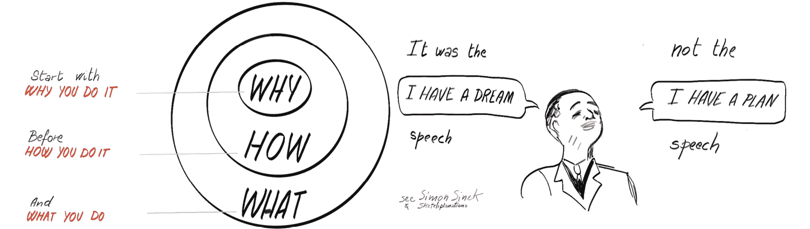
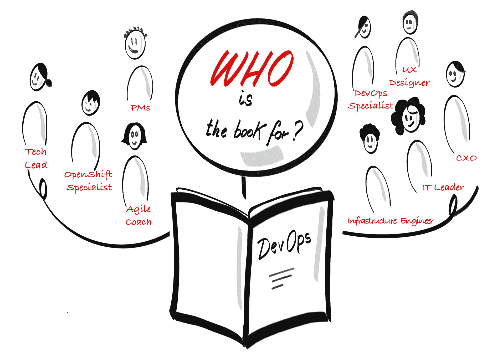
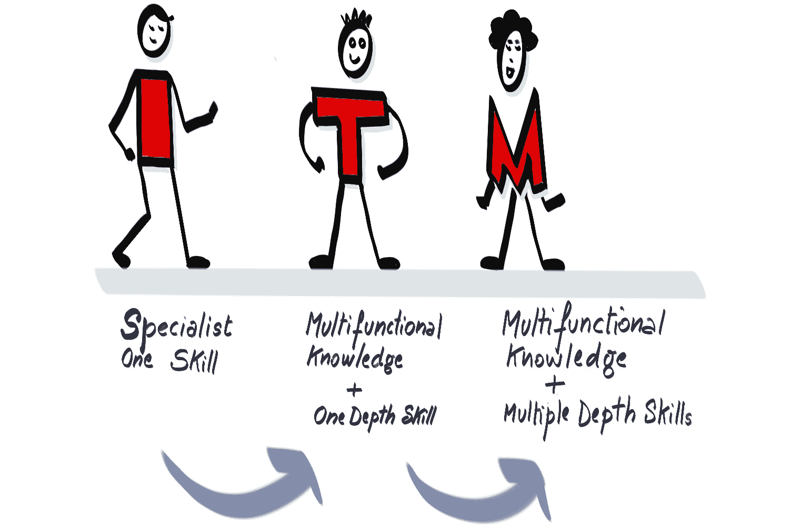

# 1. 引言 — 从“为什么”开始

你已经拿起这本书并开始阅读，真是太感谢了！

也许你阅读了封底，它给了你足够的信息，激起了你进一步翻开书本的好奇心。也许是朋友或同事推荐给你的。也许你因为其他原因偶然发现了它。不管是什么原因，我们非常高兴你抽出时间开始阅读这本书，并希望你能从中获得价值，并且想要继续阅读下去。

在深入讨论本书内容及其涵盖范围之前，我们希望先从“为什么”开始。这是我们用来创建共同愿景的一个实践。我们为什么要写这本书？它要解决什么问题，目标读者是谁？

图 1.1：创建共同的目标愿景

## 为什么 — 出于什么原因或目的？

尽管这本书可能被定位为一本关于技术的书，但它最多只有三分之一是关于技术的。DevOps 实际上是关于协作的。我们写这本书是因为我们希望提高你对 DevOps、协作以及在像 OpenShift 这样的容器平台上应用文化和工程实践的理解。我们希望使迁移到 DevOps 变得更加容易，并为你提供一条更加清晰的路径，让你能在 OpenShift 上应用 DevOps。我们希望你在阅读时感到兴奋，并获得一些灵感，了解如何应用 DevOps 的原则和实践。我们希望装备你去尝试这些新的技术和实践。

随着你逐渐阅读本书，我们希望你不断衡量使用这些新技术的有效性（影响/价值）。事实上，每次尝试某种方法时，我们希望你思考并衡量它带来的影响。

这种影响可能是在个人层面：*尝试这个方法对我、客户或用户有何影响？* *例如，它是否减少了我完成一组交付活动的周期时间？* 另一方面，它也可能是对你所在团队或部门的影响：*团队满意度是否提高了？* *作为一个团队，我们达成了什么？* 这种影响甚至可能在组织层面或社会层面体现：*它是否减少了影响客户的操作事故数量？* 我们相信你会迅速看到这些方面的积极效果。结果，也许你会给我们写下好评，并告诉所有朋友这本书。如果没有，也许你可以改变用途，将这本书当作门挡或显示器支架，当然，这也会给你带来另一种价值！

如果你不知道从哪里开始衡量价值，继续往下读 — 我们承诺会涵盖这个内容。

我们刚才做的，就是开始使用我们写这本书时采用的一种实践和技巧。我们使用了**从“为什么”开始**的实践，这也是我们在与每个团队或组织合作时总是力求做到的。

那么，什么是实践？实践是一种帮助团队实现特定目标的活动。它不仅仅是一个想法，它是你反复做的事情，以磨练或提升技能。实践具有以下特点：

+   **授权**：本书中的实践将帮助团队发现并迭代交付。

+   **简洁**：它们可以在几分钟内读完。

+   **无关框架**：实践不要求团队遵循特定的框架。

+   **经过验证**：实践在真实世界中得到了检验。

+   **可重复**：实践可以多次使用。

希望在本书中，你会通过我们分享的真实交付经验中的经历、故事和技巧，看到我们**实践所宣扬的内容**，这些内容包括如下故事：

+   我们与一家保险公司合作，使用 DevOps 和 OpenShift 重建他们的一个应用程序，但在我们意识到我们在重新开发一个用户不需要且未使用的应用时，出现了**停顿全局**的时刻（这个实践我们将在下一节讨论）。

+   我们与一家欧洲汽车公司合作，帮助其团队启动现代应用开发和敏捷实践，结果产品负责人质疑他们如何向管理层证明这是一种更好的工作方式，而管理层**只使用电子表格和数字**。

+   有一家电信公司在节假日期间遭遇了巨大的故障和功能问题，并急于学习新的文化和工程实践，以推动其基础设施和应用程序实现自动扩展和自愈。

## 为什么我要听这些人的话？

在你继续阅读这本书中的四位作者的内容之前，也许值得稍微停下来，分享一下我们的所有轶事、理论、故事和技巧的背景来源。

我们都在 Red Hat 工作，特别是我们都是 Red Hat 服务组织的一部分，这意味着我们定期与 Red Hat 客户互动并提供专业服务。这包括从帮助安装和支持 Red Hat 技术的早期采用，到推动基于 Red Hat 技术和 Red Hat 文化的大规模转型计划。

Red Hat 的文化相对独特，因为它完全基于开源文化和开放组织（Red Hat 就是其中最大的例子之一）。这意味着 Red Hat 组织的运作方式具有与开源文化和哲学紧密相关的特点。它们包括协作、社区、包容性、适应性和透明度。我们强烈推荐通过阅读*Jim Whitehurst 的《开放组织》*1 来深入了解 Red Hat 的开放组织哲学。

本书所涵盖的大部分经验以及我们将分享的故事和建议，源于由 Red Hat Open Innovation Labs（简称 Labs）主导的项目。Labs 提供了一种沉浸式和开放的方法，旨在创造新的工作方式，帮助我们的客户及其团队利用开放技术和开放文化开发数字解决方案，并加速业务价值的实现。Labs 提供的主要服务被称为驻场，这是一个为期四到十二周的时间限制项目，在此期间，客户的工程师将与 Red Hat 的技术和文化专家一对一配对。

四位作者中，我们已经参与了全球超过 50 次 Open Innovation Labs 的驻场项目，此外还参与了许多其他专业服务项目。由于 Labs 驻场项目时间相对较短，我们能够迅速学习不同的技术、方法和实践。我们能看到哪些方法有效，哪些方法效果不佳。我们积累了大量的故事和建议。本书的核心内容就是分享这些故事和建议。

## 这本书从哪里来？

这本书的标题是作者们所开发的一个培训启蒙项目的演变，名为*DevOps 文化与实践启蒙*。这是一个由 Red Hat 主办的沉浸式培训课程，旨在为 Red Hat 的客户、合作伙伴和员工提供能力提升。

我们最初创建这门课程是因为我们所在的 Red Hat 服务领域正在增长，我们需要一种方法来持续提高全球范围内的客户、员工和我们自己组织中的实践和文化背后的热情与共同理解。我们希望通过探索所有我们认为在与客户共同将许多产品推向市场时取得成功的核心实践来实现这一目标。这包括帮助理解原因并推动产品发现的实践，以及帮助我们以迭代和增量的方式安全、保密和自信地交付的实践。然后是第三个结果，那就是享受乐趣。如果在这一过程中不能有一些乐趣、玩笑和享受，我们实在看不出这一切的意义——这是那个神秘词“文化”的关键组成部分。

1 https://www.redhat.com/en/explore/the-open-organization-book

其中一个成功的关键因素是将大量的经验和真实的故事融入到我们的交付过程中，并且在课程的实施中广泛地应用了我们自身的实践。每次我们运行课程时，我们都会使用完成定义 2 实践，向参与者解释我们将在课程中教授的每项实践都会以一致的方式呈现，遵循以下流程：

1.  通过理论介绍实践，并概述它是什么、为什么要使用它以及如何使用它

1.  一个实践性的操作练习，让每个参与者都能在课程结束时**亲自尝试**使用这些实践，并从中获得一些学习和经验。

1.  一个实际的案例，展示了这些实践如何在真实客户交付项目或产品开发计划中得以应用。

本课程中教授的核心实践包括从发现实践（如影响映射和事件风暴）到交付实践（如冲刺计划和回顾）的各个方面。它们包括一套我们认为在建立高效、持久的产品团队中非常有力的实践，如社交契约、团队情感实践以及集体编程和配对编程。它们还包括许多参加课程的人最强烈联想到“*DevOps*”一词的工程实践，如持续集成、持续交付、测试驱动开发和基础设施即代码。

这门课程的独特之处之一在于它能吸引广泛的受众。它不仅仅面向技术人员或设计师。事实上，我们接受了一个跨职能团队的概念，团队成员从工程师到项目经理，从基础设施专家到用户体验设计师都有。我们认为这门课程为打破部门壁垒提供了机会。我们故意不为不同类型的人设置不同的课程轨道。目标是让参与者对所有可以应用的实践有共同的理解，从而真正欣赏和赋能 DevOps 文化。

在全球范围内举办了超过一百次这门课程后，我们从中学到了大量经验，并在不断改进它。

面对有机会撰写一本关于 DevOps 和 OpenShift 的新书，并应用来自 Stefano Picozzi、Mike Hepburn 和 Noel O'Connor 现有书籍《*DevOps with OpenShift – Cloud Deployments Made Easy*》中的新学习和更先进的技术，我们考虑了让 DevOps 和 OpenShift 在任何选择采用该技术的组织中取得成功的关键因素。

2 https://openpracticelibrary.com/practice/definition-of-done/

成功的因素都基于人员、流程和技术，通过我们在全球客户中应用的多种实践，特别是我们使用 DevOps 文化和实践赋能的实践。

本书的目的是帮助你理解并准备应用多种不同的实践——其中有些与人员相关，有些与流程相关，有些与技术相关——这些实践将使 DevOps 文化和与 OpenShift 的实践在你的组织中取得成功。

## 这本书到底是为谁准备的？

本书面向广泛的受众——任何对 DevOps 实践和/或 OpenShift 或其他 Kubernetes 平台感兴趣的人。我们要开展的第一个活动之一是集合起来，列出我们打算为其编写的不同角色和读者类型。这些包括以下几类：

图 1.2：预期受众

+   **Caoimhe**，一位技术负责人，管理一支软件开发团队。她希望了解更多关于 DevOps 的内容，以便帮助团队采纳优秀的 DevOps 实践。

+   **Fionn**，一位项目经理，负责一组遗留软件应用程序，并希望更新自己团队的工作方式，以便利用他听到许多人讨论的 **DevOps**。

+   **Padraig**，一位敏捷教练，经验丰富，擅长应用 **Scrum** 等敏捷交付框架，并希望在 DevOps 方面进一步提升自己的技能和经验。他认为这将真正为他所辅导的团队增加价值。

+   **Tadhg**，一位用户体验设计师，想更好地了解公司开发团队其他成员如何利用他的设计，以及他如何与他们合作以交付产品。

+   **Séamus**，一位 IT 领导者，负责执行公司采纳容器和云原生技术的技术战略，覆盖公司整个 IT 体系。他选择了 **OpenShift 容器平台** (**OCP**) 作为支持这一战略的产品。他希望确保 OCP 能够快速产生投资回报，并确保公司所有 IT 团队都能广泛采用。

+   **Aroha**，公司首席信息官 (CIO)。她希望确保公司员工与公司战略保持一致，并能够充分利用正在推动战略的技术和组织决策。她希望业务能变得更加敏捷，并能够在市场条件变化时迅速适应。她希望了解其他行业中规模相似的组织（包括她所在行业的组织）成功做了什么，以及他们认为的关键成功因素是什么。

+   **Siobhán**，一位基础设施工程师，已经使用 Kubernetes 多年，现在是一个团队的一员，该团队正在向她的组织引入 OCP。她希望确保平台配置能够支持她团队的目标，并希望了解如何与开发团队协作，以便最大化地发挥技术的价值。

+   **艾玛**，一位项目经理，拥有二十年通过前期规划、跟踪交付物与计划的对比，以及管理风险、问题和依赖关系，具备强大项目报告和利益相关者管理技能的 IT 项目交付经验。她对软件交付所需的时间感到沮丧，无法快速解决用户需求和修复问题。她意识到，与其继续以项目为中心的方式，不如转向以产品为中心的方式。她希望通过转型成为产品经理，来重新提升自己的技能。在这一过程中，她希望能快速测试和调整，快速交付成果，适应市场变化，同时提高性能、正常运行时间、恢复时间等。

+   **芬恩**，一位系统测试员，他非常自豪于在软件交付给客户之前进行质量保证。他的业务分析背景帮助他制定全面的测试方法和脚本，近年来，他还领导了性能测试、安全测试和可操作性测试。他渴望了解如何在工作中引入更多的自动化，并扩展到其他测试形式。

### 从 I 到 T 到 M

通过这本书，我们希望人们能够摆脱**I 型**，不再只是专注于一个技能或一个领域的专家。我们希望他们能成为更具**T 型**特征的人才，他们在某一特定领域（如基础设施或用户体验设计）仍然有深厚的技能和经验，但也能理解并跨越所有其他技能领域，进而构建跨职能团队。这可能是一个前端工程师的例子，他也与 API 工程师紧密合作。

一个优秀的跨职能团队是指整个团队具备所有必要的技能和经验，能够从用户或业务方的需求出发，直到最终的生产交付。一个团队可能由许多**I 型**人才组成，但这种团队很快会依赖于某些特定个体，而当这些个体不可用时，团队可能会陷入困境。例如，如果需要进行数据库变更来暴露一个新的 API，而只有一个团队成员掌握这项知识，团队就可能陷入停滞。如果团队中有更多的**T 型**成员，那么团队之间的协作、共享和合作的机会就更大，对个体的依赖也会减少：

图 1.3：技能转型

我们希望这本书能帮助**I 型**人才转变为**T 型**人才，甚至成为**M 型**人才。**M 型**人才受到启发，深化他们的学习，将其带入其他领域，掌握多项技能，从而建设更强的跨职能团队。

## 结论

本章简要介绍了我们为什么写这本书以及它的目标读者是谁。

我们介绍了自己，以及如何利用我们的应用知识、经验和所学写这本充满故事和实例的书。

我们分析了本书中所针对的不同人物形象，并探讨了如何帮助这些专注的 I 型人才转变为 T 型或 M 型人才，以建立更强大的跨职能团队。

在下一章，我们将介绍 DevOps 以及我们在本书中将使用的一些工具，用于组织和解释 DevOps 实践。
