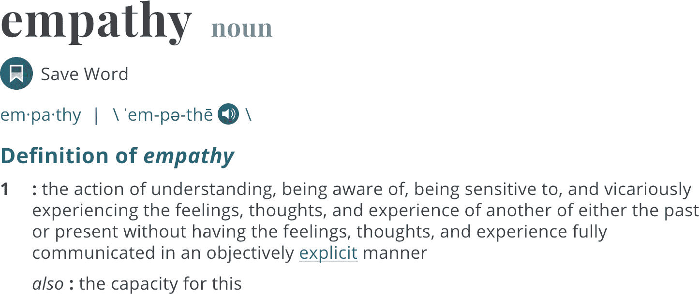
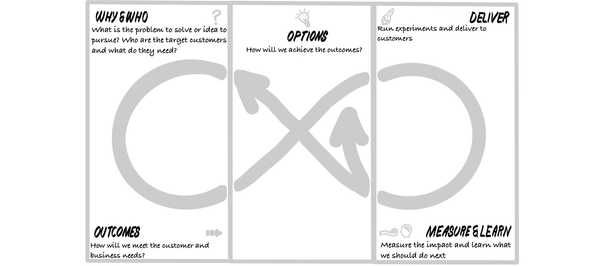

# 第二章：2\. 介绍 DevOps 及一些工具

在容器化的世界中，成为 DevOps 的意义是什么？人们对于 DevOps 有不同的看法，关于它的定义和运作方式也存在不同的理解。

在本章中，我们将解释我们对于 DevOps 的看法，以及 DevOps 关注的瓶颈和挑战。我们将介绍软件产品交付中的价值链概念，并展示如何利用精益、敏捷和 DevOps 社区中的不同技术来优化并加速这一价值链。

我们还将介绍一些工具，例如 Mobius 循环和 Open Practice Library，帮助我们在本书的其余部分中导航并理解许多实践。

**DevOps** 目前是一个流行的术语！似乎每个技术十年都会有一个新的流行术语与之相关。

在 2010 年代，敏捷（Agile）是流行的术语——*这个将是一个敏捷项目*，*我们将使用敏捷交付这个项目*，或是*我们将使用敏捷方法论*，这些都是我们经常听到的常用语。它通常（而且至今仍然）被错误地理解为是加快软件交付的方式。事实上，敏捷更加关注的是更早、更频繁地交付商业价值，并推动持续学习的文化。敏捷现在已经正式“成年”——它在 2019 年 2 月迎来了 18 岁生日。即便经过这么长时间，我们依然热衷于使用 2001 年发布的《敏捷宣言》中的价值观和原则 1。

容器现在是另一个流行的术语。我们看到很多人使用这个词，但他们未必完全理解容器的含义，以及为什么个人、团队和组织会通过使用容器受益。

因为本书是关于 DevOps 和 OpenShift（一种容器管理平台）的，我们将去除这些术语的噪音，讨论一些非常实际的、来自真实世界的经验和案例，讲解 DevOps 和 OpenShift 容器背后的真正价值。

让我们回顾一下过去，看看我们认为这些现象是从哪里来的。

我们都在 IT 行业工作了几十年（有些人工作年限更长！）。在一次喝啤酒时回顾我们交付 IT 项目的经历时，我们发现所有 IT 项目都有一些共同的特点，而这些特点始终存在。我们还识别出了一些 IT 项目交付中的价值链空白，这些空白在我们看来是导致进度缓慢的原因。

## 价值链

我们参与的每一个项目都有某种形式的最终客户或用户。有时他们是外部用户，比如一位在线购物者希望使用手机应用购买最新款的贾斯汀·比伯床单！有时，他们是组织内部的团队，比如运营团队或公司某个特定部门。我们都能达成一个共识，那就是：我们工作的目标始终是拥有笑脸、快乐的客户：

图 2.1：满意的客户——组织的终极目标

1 [www.agilemanifesto.org](http://agilemanifesto.org/)

在我们之间，我们帮助了许多组织，从公共部门、金融行业到零售和慈善组织。我们见识过一切！在回忆时，我们讨论了我们一些项目的最终结果；我们思考了我们的目标——几乎总是与某种货币价值相关联，这也是我们存在的原因。当然，也有其他动机，比如提高客户满意度、减少风险、改善安全性和性能，但关键是，我们任何商业客户的业务核心部分都是赚钱和降低成本。

所以，最终，价值往往与某种形式的金钱联系在一起。我们三位作者是爱尔兰人，第四位来自新西兰，因此我们觉得用金锅来体现这一点非常合适！

图 2.2：利润——每个商业组织的共同目标

1990 年，*James Womack, Daniel Jones, 和 Daniel Roos* 合著的《改变世界的机器》一书首次提出了“**价值流**”一词。这个概念在同一作者所著的《精益思维》一书中得到了进一步推广。根据他们的观点，价值流是一个组织为了满足客户需求而进行的一系列活动。更广泛地说，价值流是设计、生产和交付产品或服务给客户所需的一系列活动，它包括信息流和物资流。大多数价值流都是高度跨职能的：客户需求的转化到产品或服务会经过组织内许多职能部门或工作团队：

图 2.3：客户梦想中的金锅

让我们把这个想象成我们的客户梦想中的金锅。他们不断思考如何从他们的产品或想法中获得最大的回报，以便创造更多的财富。那么，他们是如何做到这一点的呢？

## 差距

我们将探讨客户与组织中的商业人员之间、商业人员与开发人员之间、开发人员与运营人员之间的价值链差距。

### 待办事项的大列表

我们在软件开发过程中始终看到的第一个差距是从最终客户收集信息并形成客户需求清单的过程：

图 2.4：理解和收集客户需求

我们早期的项目通常涉及业务分析师长时间记录他们能想到的每一个可能的需求，形成大量的业务需求文档。目标是预先考虑每个可能的客户旅程或场景，通过构建包含所有可能情况的规范来覆盖所有基础。听起来很死板，对吧？如果我们做出了错误的假设呢？

### 展示价值与构建正确的东西

第二个空白围绕着向客户展示价值展开。通常，所进行的**项目**是为了包括所有所需的功能和想法，以便能够将它们一起发布。一旦项目进入生产阶段，它通常只有一个较小的运营预算，用于支持小范围的增强和问题解决。听起来可能需要很长时间才能将应用交付给最终用户，对吧？

我们之所以称这些为*空白*，有两个原因。首先，过程漫长——从开始一个项目到确认需求之间，可能要经过数月，甚至几年。其次，在交付任何东西之前，试图收集所有可能的需求会意味着用户在多年内无法获得实际的好处，且往往会构建出错误的功能并交付给不满意的客户：

图 2.5: 使用以人为本的实践来理解客户需求

近年来，*没有构建正确的东西*这一空白已经通过以人为本的设计和设计思维的出现得到了填补。这些是一套将最终用户置于捕捉产品需求和要求核心的实践方法。

我们通过直接与用户交谈，形成更强的*同理心*2 来收集信息：

图 2.6: Merriam-Webster 对“同理心”的定义

本书将探讨如何通过影响映射、事件风暴和以人为本的设计等技巧来帮助软件开发过程。我们还将探讨其他实践，帮助我们定义解决方案和功能，最重要的是确保解决方案与业务价值相连接。我们将展示如何将用户界面原型和技术难题等研究活动与实验相结合，以便形成根据交付的业务价值优先排序的产品待办事项列表。我们将展示如何通过使用足够的信息来使产品更容易理解。

### 我们如何完成清单上的事项？

让我们考虑第二个关于向用户交付价值的空白。这个空白专注于如何将待办事项清单中的项目转化为可用的软件。

传统方法是签署并确认经过长期商业分析和捕捉过程的有限需求集。项目的范围已经锁定，制定了严格的变更控制过程和治理机制，以应对与文档化需求的任何偏差。

2 [`www.merriam-webster.com/dictionary/empath`](https://www.merriam-webster.com/dictionary/empath)

然后，一支软件设计师和架构师的团队开始工作，制定一个**高层设计**（**HLD**），以根据指定的业务需求提供解决方案或一系列解决方案。这些需求还会经过关键项目利益相关者的正式审查流程，一旦签署确认，便成为解决方案范围的参考来源。

通常，不同的设计文档会在下一阶段编写——详细设计文档、程序规范、数据设计、逻辑架构蓝图、物理架构解决方案等。这些文档的编写是为了支持一个已定义、已定日期并且已签署的高层设计（HLD），而高层设计本身是基于一组已定义的业务需求规格进行签署的：

图 2.7：传统应用开发生命周期

任何对早期文档的修改都会直接影响重新评估和更新后续设计文档的时间和成本。软件开发团队可能参与了部分文档的编写或审查。然而，通常会鼓励他们在这些设计未确定之前，不开始任何编码或开发活动。一些组织通过在此阶段才将开发团队引入来降低项目成本。开发通常按功能划分孤立进行，且对大局缺乏了解，自动化测试也有限。

在项目计划中预定的某个时点，所有开发人员都应该将自己的编码组件交付到测试环境中。也许每个开发人员会手动构建并部署自己的代码到测试环境中。一些较大的项目通过设立构建基础设施团队来寻求规模经济，由该团队为所有开发人员完成这项工作。一旦所有组件交付完毕，一个单独的测试团队开始执行他们在前几周和几个月里编写的数百个测试脚本，以根据业务需求和高层设计文档来测试解决方案。这是一些组件第一次被集成并一起测试。当然，问题和缺陷会驱动开发团队和设计师进行返工，修复这些问题。

正如设计文档有不同的层次，测试也通常经历不同的层次，每个测试阶段都会在前一个阶段完成后开始。测试经理会签署一组测试结果，标志着下一级别的测试可以开始。测试范围从组件集成测试到更广泛的系统集成测试、安全性和渗透测试、性能测试、故障恢复和可操作性测试，最后是用户验收测试！

在解决方案大规模上线之前的最后阶段，通常会进行用户验收测试，涉及一组焦点用户和测试系统。在许多情况下，这些用户第一次见到实施的系统可能会是几个月甚至几年之后。一旦解决方案的用户验收获得批准，就会授予部署到生产环境的绿灯。最终，软件交到真正的最终用户手中，希望可以从这一切工作中获得业务收入。

你可能觉得这个过程听起来漫长而冗长 — 实际上确实如此！许多项目在不同阶段都遇到了延迟，一个最初作为多月项目计划开始的计划最终变成了多年项目。对于好奇的人来说，维基百科上甚至有一些史诗级失败案例的列表：[`en.wikipedia.org/wiki/List_of_failed_and_overbudget_custom_software_projects`](https://en.wikipedia.org/wiki/List_of_failed_and_overbudget_custom_software_projects)。

在开发过程中，业务条件经常会发生变化。会产生新的功能请求。在测试过程中，可能会出现分析和需求捕捉阶段未考虑到的需求差距。市场在开发过程中并未停滞不前，竞争对手公司可能已经开始更快地进行创新。竞争甚至会提出更多的功能请求，这种过程类似于功能比较战。

当然，总是有某种变更控制程序来处理这样的新范围。在复杂的工作程序中，将特性添加到工作计划的前导时间可能会从几个月到几年不等。为了将某些内容投入生产，项目执行人员可能只会对任何更改说“不”，并专注于完成项目计划的最后阶段。

这意味着最终交付到生产环境的解决方案在几年后对用户来说有些令人失望。时间和行业在不断进步。这些程序的最大挫折在于经常延迟交付、超出预算，并且通常交付的解决方案缺乏用户满意度或质量。

稍微退后一步，我们面对将特性列表转化为软件交付的巨大鸿沟。由于各个阶段的工作依次进行，这一过程被称为**瀑布模型**，因其工作阶段的独立性质而闻名，与非常长的时间相关联：

图 2.8：传统交付成果及其缺点未能达到客户满意度

让我们考虑如何用更现代的软件开发流程填补第二个缺口。与以往的工作方式相比，现代开发者如何更快地将用户需求转化为工作软件解决方案？

2001 年，由 17 位 IT 人士编写的《敏捷宣言》标志着敏捷运动的诞生，这也引发了交付软件的替代方法和思维方式的改变。许多参与编写《敏捷宣言》的个人曾经解决过瀑布开发所描述的许多问题。Jeff Sutherland 和 Ken Shwaber 创建了 Scrum 框架，用于软件开发，其中包括更频繁地交付小规模增量的价值——他们使用了“**冲刺**”这一术语，这是一个固定时间段，通常为一到四周（通常为两周），在这个时间段内，一组事件和角色会协同工作，使得大型解决方案能够以迭代和增量的方式交付。Kent Beck 和 Ron Jefferies 主导了许多 **极限编程**（**XP**）运动的工作，专注于更快地交付价值，并致力于那些有助于提高回顾、测试和发布效率的关键实践，利用更好的协作和增加的自动化：

图 2.9：DevOps 实践的实施导致更快的交付和更好的产品

在本书中，我们将展示不同的软件交付实践，以及我们如何通过使用来自 Scrum、看板、XP、精益和一些扩展框架的混合实践，帮助更快地交付价值。所有这些底层实践只是帮助缩小从创意或需求捕捉到交付之间差距的工具。这一直是我们不断改进的领域，目标是将差距最小化，并进入持续交付的模式。

### 开发到运维

在我们优化软件交付流程的努力中，还有一个缺口需要填补。第三个缺口是开发团队和运维团队之间的缺口。

在我们的瀑布流程中，我们已经达到了签署的解决方案完成用户验收测试并经过大爆炸上线的阶段。那么，接下来发生了什么呢？

通常，负责维护和支持的全新团队会接手这个解决方案。这个新团队的成员并未参与任何设计、开发或测试工作，因此，项目计划中会额外增加时间用于知识传递。交付团队会编写冗长的文档，希望这些文档能成为未来运维团队的有用资源。

在这一阶段，软件包可以比喻为被从开发团队“扔”到运维工程师的“墙”那边。运维团队常常需要通过调查生产事故、解决之前未发现的 bug 以及处理需求规划阶段未考虑到的新场景，来“硬性”学习软件。

图 2.10：致力于打破开发与运维团队之间的墙

为了弥补这一缺口，我们必须将开发和运维团队聚集在一起。拆除那堵墙，消除那些壁垒！拆除墙壁后，形成了专注于开发和运维活动的新团队。这些团队共同负责整个解决方案，并可以根据彼此的需求来设计解决方案。

DevOps 这个术语的诞生源于我们不再拥有孤立的开发和运维团队。近年来，我们看到从这个理念中衍生出了其他各种术语，如 DevSecOps、BizDevOps、DesOps，甚至是 BizDesDevSecOps！

#### 注

**BizDesDevSecOps**有点拗口，因此在本书中我们将使用**产品团队**这个术语来描述它。它解决了填补软件开发过程中的所有空白并拆除所有壁垒的最终目标。

图 2.11：填补软件交付过程中的空白

请注意，我们不会使用**DevOps 团队**这个术语——拥有一个专注于 DevOps 的团队或个人的想法与 DevOps 的哲学背道而驰——即协作、跨职能和消除壁垒。你有多少次在 LinkedIn 或其他网站上看到招聘 DevOps 工程师的广告？DevOps 工程师或 DevOps 团队的出现，可以被视为又一个壁垒的形成。

## 人员、流程和技术

DevOps 的核心其实就是协作。它关乎于通过拆除壁垒和打破隔阂、去除瓶颈和障碍，来为你正在构建的解决方案负责，并为其感到骄傲。这加速了连接客户感知需求与产品交付之间的价值流。

技术单独无法解决你所有的业务问题。不管你正在评估或被销售的是什么平台或软件产品，除非你的组织学会了采纳正确的人员、流程和技术的平衡，否则目标将无法实现。

本书的内容旨在寻找人员、流程和技术变革的正确组合，以在持续的基础上最大化业务成果。这需要心态的转变和行为的改变。本书将探讨我们与数百个组织合作时，所见到的最有效的行为改变。我们观察到，这种心态和行为的改变在所有角色中都是必要的，而且我们需要打破组织内部的壁垒，正如我们之前所看到的，这正是驱动软件开发中的差距和低效的原因。

图 2.12：人员、流程和技术之间的健康平衡

组织中的每个人都应该关注人员、流程工程和技术，以推动期望的结果。我们希望打破这三大支柱之间的壁垒，使它们更加紧密。对于那些可能更专注于其中一个领域的读者来说，了解其他两个领域同样能获得同等（如果不是更多的话）价值。

这意味着，一位硬核软件工程师或架构师可以获得一些深刻的见解和指导，了解为什么人员、文化和协作对他们的角色同样重要。

曾经是项目管理方法论专家，并且现在正在学习更具敏捷性的交付实践（如 Scrum）的人员，也可以利用本书了解现代技术方法，如 GitOps、CI/CD 和无服务器架构。他们可以学习这些方法为何重要，并理解它们带给组织的商业价值，从而能够清晰地表达这些方法的意义。

一位关注员工留存的领导者可以了解到，掌握这些现代技术实践，如迭代和增量交付策略，可以通过交付被满意客户使用的高价值产品，最大化组织成功的机会。

## 莫比乌斯环与开放实践库

在本书中，我们将探索许多不同的实践。我们将解释它们是什么，以及为什么要使用它们。我们将为你提供一些如何使用它们的指导。我们将分享一些我们如何使用它们的真实案例，并且在可能的情况下，我们甚至会展示它们的实际应用。通过我们的宠物对战案例研究（稍后详细介绍），我们将以一种有趣的方式使它们栩栩如生，并分享我们在实践中获得的最佳经验。

我们在几年前与客户的新团队合作时遇到的一个问题是，如何解释你可能在什么情况下以及以什么顺序使用不同的实践。我们应该从哪种实践开始？哪种实践与之前实践产生的输出相得益彰，依此类推？

为了帮助这一点，我们利用了一个名为 Mobius 的开源导航工具。这个工具由 Gabrielle Benefield 和 Ryan Shriver 创建。包括许多开源画布和文献在内的大量优秀材料可以在[www.mobiusloop.com](http://www.mobiusloop.com)找到。Red Hat 开放创新实验室在其所有驻地以及 DevOps 文化和实践启用课程中都使用了这些开源材料。3 我们将在本书中使用它来构建内容和章节。

图 2.13：莫比乌斯环 4

3 [`github.com/rht-labs/enablement-docs`](https://github.com/rht-labs/enablement-docs)

4 本书中引用的 Mobius 循环资源（[`mobiusloop.com/`](https://mobiusloop.com/)）由 Gabrielle Benefield 和 Ryan Shriver 提供，并采用 [CC BY 3.0](https://creativecommons.org/licenses/by/3.0/) 许可。书中的后续图像包含基础层的额外修改。更多信息请参见 [`creativecommons.org/licenses/by/3.0/`](https://creativecommons.org/licenses/by/3.0/)

Mobius 是一个连接发现与交付的框架，可以用来将战略与产品、运营连接起来。共同点是可衡量的成果。Mobius 用于理解、对齐和分享可衡量的目标成果，以便进行测试和验证。

有许多原则支撑着 Mobius 导航器：

+   **成果重于输出**：我们专注于为人们交付可触及的影响或成果，而不是交付可能无法推动成果的众多功能。

+   **多选项策略**（**选项转变**）：我们旨在构建一个选项列表，一个研究计划、实验和实施特性的列表，用于测试假设，验证这些研究计划、实验和实施特性是否确实能推动预期的成果。

+   **快速交付**：我们旨在通过短周期的交付和定期反馈与衡量，朝着持续交付的理念迈进。

+   **持续学习和改进**：贯穿整个周期，以便我们的下一个选项集能对成果产生更好的影响。

Mobius 方法包含 **七个核心元素**，它们贯穿于一个连续且永无止境的流动中。这些元素可以在一个单一的画布上进行可视化，该画布是开源的，并通过创作共享许可提供，网址为 [www.mobiusloop.com](http://www.mobiusloop.com)：

+   **为什么**描述了目标。我们为什么要这样做？我们要解决什么问题？我们要追求的目标是什么？

+   **谁**关注最终用户。我们要为谁解决问题？

+   **成果**是我们希望通过这些人达到的目标，是他们行为上的变化，这些变化影响着大结果，我们将如何衡量客户和业务的影响。

+   **选项**是可能交付这些成果的潜在解决方案。它们帮助定义我们可以测试的假设，并帮助我们找到用最少的努力或输出实现预期成果的最简方式。

+   **交付**是我们进行实验以向用户交付解决方案或一系列解决方案的周期，这样我们就可以衡量其影响。

+   **衡量**是我们评估交付解决方案或一系列解决方案后发生了什么。我们检查解决方案的影响是否达到了预期成果，并评估我们取得了多大的影响。

+   **学习**是反馈循环，它将我们带回到选项枢纽。我们从交付中学习，并评估下一步该做什么。我们交付的内容是否足够做出评估？我们是否要重新进入交付循环？我们是否达到了目标结果或通过学习验证了假设的无效性？我们是否回到发现循环？

像 Tadhg（我们的用户体验设计师）这样的角色通常会在发现循环中花费大量时间。像 Caoimhe（我们的技术负责人）这样的角色则传统上会专注于交付循环。像 Fionn（我们的项目经理）这样的角色通常会在这里花费大量时间，确立结果并收集选项。但随着我们推动跨职能团队的 T 型或 M 型人才模式，所有人在 Mobius 循环的每个阶段的参与都会带来极大的好处。Mobius 为基于可衡量的目标结果创建了一个共同的语言。

你可以将同样的结果驱动思维原则应用于战略、产品和服务交付，以支持业务和技术操作——我们将在本书后面回到这个想法。

Mobius 之所以强大，是因为它与框架无关。它能够与许多你可能已经熟悉的现有框架和方法进行集成——如 Scrum、Kanban、设计思维、精益用户体验、商业模式生成、精益创业以及过去几十年出现的许多其他优秀框架。你不必重新发明轮子，也不需要替换掉你已经喜欢并且有效的所有方法。

你可以在发现地图、选项地图和交付地图上捕捉关键信息——这些都是开源文档，依据**创意共享协议**在[www.mobiusloop.com](http://www.mobiusloop.com)上提供：

图 2.14：使用 Mobius 循环的发现、选项和交付画布

当红帽开放创新实验室开始使用 Mobius 时，我们将所有的实践活动围绕 Mobius 循环展开。一些实践与发现循环清晰对接，尤其是发现循环中的**为什么和谁**部分。像影响力映射、从结果开始和同理心映射等实践非常适合揭示该部分提出的问题。我们将在本书的后续章节中详细介绍这些实践。

诸如事件风暴和用户故事映射等实践在确立并可视化发现循环另一端的结果时非常有帮助。同样，我们将详细探讨这些实践，并分享它们效果的一些精彩示例。

像设计冲刺、如何做（how-might-we）和产品待办事项梳理等实践，有助于确定和组织可供选择的系列选项，以推动实现结果。

像冲刺规划等实践有助于规划并执行产品的增量交付，以推动实现结果。我们将探讨这些迭代交付实践，以及如何将不同的敏捷框架与 Mobius 结合使用。

像展示会和回顾会这样的实践有助于捕捉来自增量交付的度量与学习数据。

我们仍然有大量的实践方法，感觉它们并不自然地适合某个环节或选项的转换。当我们将所有与多个客户合作中非常有效的剩余实践列出时，发现它们可以归入两个领域。其中一组实践专注于创建文化和协作，另一组实践则是支持持续交付概念的技术工程实践。

在向他人解释这些实践时，我们提到这些是非常重要的实践，但不一定是你会安排在时间表上的实践。例如，你会了解到，像发现环节中的影响映射这样的实践是重要的计划性工作坊，你会执行并偶尔在未来回顾。而像交付环节中的冲刺计划、展示会和回顾会等实践，则是在迭代交付框架中严格安排的。但是，与文化和协作相关的实践或与技术工程相关的实践，更像是你随时、持续使用的实践。

像社会契约和完成定义这样的实践，不是一次性的实践，你不会在某个时间表上安排它们。这些是活生生的工作成果，团队会在日常工作中持续使用它们。同样，持续集成、测试自动化和基础设施即代码 —— 这些都不是你每周安排一次或两次的实践。这些是你时刻都在做的实践，它们构成了我们工作方式和环境的基础。为了有效实践莫比乌斯环中所呈现的持续交付和持续发现，我们需要有一个强大的文化、协作和技术工程实践的基础。

为了可视化这一过程，我们将基础添加到了莫比乌斯环中：

图 2.15：为莫比乌斯环添加基础

这个图形已成为一个简单的可视化工具，帮助我们导航不断增长的实践和技术列表，以实现数字产品的持续发现和持续交付：

图 2.16：通过莫比乌斯环实践持续发现和交付

开放创新实验室驻留涉及多次环绕莫比乌斯环旅行，通常从发现开始，然后进入交付阶段，再根据需要多次调整，可能会回到发现阶段，或者继续向交付推进。我们发现，为了使这个过程具有可持续性，必须建立文化和协作的基础，并且需要建立强大的技术工程实践基础。

开放创新实验室启动了一个名为开放实践库的开源社区驱动项目。开放实践库是一个由社区驱动的实践和工具的存储库。这些工具是由当前日常使用它们的人们共享的，旨在为寻求新创意和经验的人员提供灵感。

本书中你读到的所有实践都已被贡献到开放实践库中，在整个书中，我们将使用 Mobius 循环以及文化、协作和技术实践的基础作为参考点，确定我们所有开放实践在何时何地以及如何结合起来，以便与 OpenShift 一起交付优秀的 DevOps 文化和实践。

Mobius 和开放实践库的一个重要特点是它并不是强制性的，它不是一种方法论。它不会告诉你具体在何时何地使用哪些实践。可以把开放实践库看作是一个工具箱——一个非常有组织的工具箱，里面有很多隔间和架子。这些实践已经被组织成多个隔间，以帮助发现，尤其是*为什么*和*谁*，然后推导出结果。工具箱中有一个抽屉，里面放着所有有助于形成、组织和优先排序选项的工具，以及如何在后期调整循环的工具。工具箱中有一部分包含所有与交付相关的工具——无论是与敏捷实践相关的迭代式和增量式交付，还是与瀑布式交付相关的单次交付。还有一些工具有助于捕捉和理解交付过程中的测量和学习。最后，还有一个巨大的抽屉，里面放着用于建立文化、协作和技术工程卓越的工具。这些通常是我们开始工作时首先拿到的工具。

## 结论

在本章中，我们介绍了软件产品交付中的价值链，并探讨了传统工作方式如何带来了低效、瓶颈和用户、业务利益相关者、开发团队以及运营团队之间的空白。

我们探讨了用于填补这些空白的一些技术，以及所有参与者需要平衡关注人员、流程和技术的方式。

最后，我们介绍了一个名为 Mobius 的开源导航工具，它在无限循环中连接发现与交付，并且可以将战略与产品和运营连接起来，所有这些都有一个共同的可衡量结果的分母。开放实践库使用 Mobius，在文化和技术的基础上，导航不断发展的开放实践——其中许多将在后续章节中进行解释。

在下一章，我们将概述我们将如何通过介绍我们的案例研究和剩余部分的结构来处理本书的其余部分。
