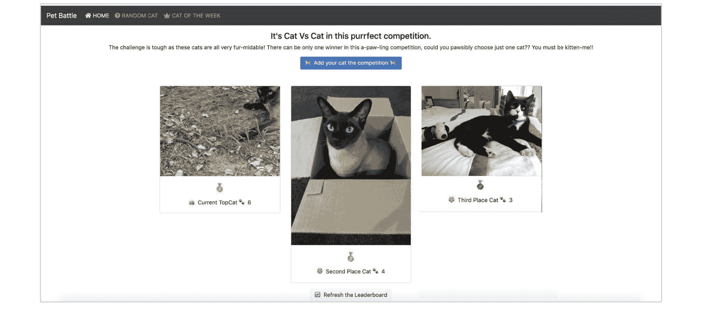

# 3\. 接下来的旅程

当我们结束本书的第一部分时，本章将阐明我们打算如何引导你通过剩余部分的旅程。

这将包括我们如何不仅仅是讲述实践和技术，还将它们付诸实践并展示。我们将引入一个有趣的案例研究和真实世界的故事来实现这一目标。

编写一本面向不同技能和背景群体的书籍的挑战之一是如何以一种让所有人都能理解、接受和欣赏的方式来写它。从技术主管、基础设施工程师、OpenShift 专家，到敏捷教练、用户体验设计师、项目经理，再到 IT 领导和高层管理人员，我们希望你能理解所有实践背后的共同理念，以及支撑这些实践的原则。

本书将涵盖从如何使用以人为本设计实践捕捉同理心地图中的行为，到在应用程序中使用性能指标考虑可观测性等话题。它将探讨帮助产品负责人在优先考虑价值与风险的同时，如何处理应用程序的仪表化、镜像标签和元数据等问题！

类似于我们在 DevOps 文化和实践启蒙课程中使用的“完成定义”实践，本书将采用几种不同的方法来帮助你开启这一旅程：

1.  解释文化和实践

1.  展示文化和实践

1.  应用文化和实践

为了解释文化和实践，我们将介绍实践是什么，为什么以及在哪里选择使用它，并给出一些如何使用它的指导。在某些方面，这是相对简单的部分。

我们有一句话，喜欢**通过展示，而不是讲述**。研究和写一堆文字很容易，真正令人信服的是通过视觉展示一个实践的实施以及它所带来的效果。为了展示文化和实践，我们有几种技术：

1.  尽可能地，我们将尽量利用可视化技术，如速记笔记、图表和其他图形。你可能已经在这一部分看到过由 Ilaria Doria 精心绘制的几幅图，希望它们能让文字更加生动。

1.  在我们能够通过照片或复制的实物来展示实践时，我们将这么做。在可能的情况下，我们已将图表和其他视觉资料开源，并可以在[`github.com/PacktPublishing/DevOps-Culture-and-Practice-with-OpenShift/`](https://github.com/PacktPublishing/DevOps-Culture-and-Practice-with-OpenShift/)上获取。

1.  我们发现，故事和真实世界的例子是解释实践及其带来价值的最佳方式。所以，时不时地，我们会插入一个故事，讲述作者之一或多位作者与这些实践相关的亲身经历。我们将通过在故事周围加框的方式，单独展示这些故事。让我们现在开始讲一个：

## 讲述实践的故事

2005 年 12 月，我在英国的一项大型电信计费系统替换项目中工作，负责计费工作流。当时我已经在这个项目中工作了 18 个月。这是一个为期 10 年的项目，旨在用更现代的 COTS 软件替换所有遗留的计费系统，并引入一些新的业务能力，支持灵活且可变的产品管理。

我负责计费接口工作流，并负责交付计费系统与第三方（如银行、BACS 和财政部门）之间的接口。

我们的工作团队在办公室附近的一家酒吧举办了圣诞晚宴。我们选择这家酒吧，是因为大多数人 12 个月前也曾在那里举行过去年的圣诞晚宴。看到 12 个月后我们如此多的人再次聚集在同一个地方，真是有些好笑。

当时，我反思了过去 12 个月，以及我们的昂贵顾问团队在这段时间里所取得的成果。我突然意识到，12 个月前，我们正处于程序一个重大版本的设计阶段。我们在几周内举办了一系列研讨会，以绘制出发布所需的不同工作产品和交付物。

12 个月过去了，我们仍然处于设计阶段。一个超过 60 人的工作团队花费了一年时间编写、重写、优化和再次编写设计文档、更多的设计文档、设计文档的变种、与设计文档相关的技术澄清说明，甚至是针对设计文档的变更请求。到此时为止，尚未编写任何代码，未运行任何测试，也没有发布任何软件。我们 12 个月的成果仅仅是大量的设计文档和无数的会议。

我记得在过去的一年中，我们的成果让我感到有些失望。我当时对自己说，*一定有更好的软件交付方式*。

最后，我们希望真正地应用一些文化和实践。为了帮助我们做到这一点，我们将使用一个简单有趣的案例研究，讲述一个小型初创公司如何应对创建 DevOps 文化和建立 DevOps 实践过程中遇到的挑战和难题。这个故事将代表我们在与客户合作时，见到的一些真实场景的匿名化叙述。

我们会定期回顾这个应用 DevOps 文化和实践的故事，并通过 OpenShift 以阴影框的形式呈现。让我们从背景故事开始吧——希望你准备好了！

## PetBattle — 背景故事

家猫的照片是互联网上观看最多的内容之一 1。这是真的吗？谁知道！也许是真的。我们所知道的是，它们是我们在本书中用于帮助解释多个 DevOps 实践的示例应用程序的一个绝佳背景故事：

图 3.1：PetBattle — 背景故事

PetBattle 是一个爱好者应用程序，最初为了娱乐而创建，作者通过它互相进行简单的在线对战。一个**我的猫比你的猫更厉害**的*那种类型*的事情。最初的架构几乎没有什么花哨的东西——有一个简单的基于网页的用户界面和一个 API 层，配合一个 NoSQL 数据库。

PetBattle 开始时部署在一台虚拟机上。它已经上线，但并未吸引大量访问者。它主要被作者的朋友和家人使用。

在一个异国情调的度假天堂，作者之一偶然遇到了一位在线影响者。他们开始约会，发生了一段假日恋情，PetBattle 突然变得在 Instagram 上爆红！几乎一夜之间，玩家人数急剧增加，PetBattle 服务器崩溃，恶意图片开始出现在本应适合儿童的应用程序上——这些图片**不是**猫。

假期结束后，作者们突然发现自己需要从 PetBattle 中谋生，并决定开发一个商业版和可生产的版本，使得这个爱好者应用现在变成了一个可行的项目。

1 [`zh.wikipedia.org/wiki/%E7%8C%AB%E4%B8%8E%E4%BA%92%E8%81%94%E7%BD%91`](https://zh.wikipedia.org/wiki/%E7%8C%AB%E4%B8%8E%E4%BA%92%E8%81%94%E7%BD%91)

PetBattle 创始人们踏上了一段激动人心的旅程，拥抱 DevOps 文化和实践，并与 OpenShift 一起合作。

## 那么，遗留系统呢？

人们常常将敏捷开发和 DevOps 与绿地开发、新创公司联系在一起，认为这仅适用于那些有机会从零开始的公司。*那遗留系统怎么办？*是我们经常被问到的问题。

本书将贯穿始终地展示 Mobius 循环和基础可以适用于任何类型的项目和技术；无论是全新开发还是已有开发，都是适用的——小型的 Web 应用或大型主机，内部基础设施交付或混合云技术。

我们往往从 Mobius 循环中的*发现*部分开始（在建立文化、协作和技术实践的基础基础后）。但你不必从那里开始。事实上，你可以从循环中的任何地方开始。最重要的提示是确保定期走遍循环的所有部分。不要陷入交付循环，永远不要回到发现阶段重新审视之前做出的假设和假设。不要陷入发现阶段，导致进展过慢，陷入**分析性瘫痪**，从而错过市场机会，永远无法交付价值。最重要的是，永远不要忘记在文化、协作和技术实践的基础上不断构建。

## 借用智慧

在我们开始深入细节之前，我们需要花一点时间指出，本书中提到的任何实践并不是我们自己编写或构思的。书中的实践以及开放实践库中的内容，是一些杰出思想者不断贡献的成长清单。我们借用了这些智慧，并将其归功于这些创造者。我们希望能够正确归属每一位贡献者，任何遗漏都纯属偶然。

我们在这本书中所尝试的，是展示这些实践如何通过相互连接，带给组织一些具有深远影响的成果，并展示实现这些成果所需的一些基本原则。

## 本书接下来的内容你可以期待什么？

所以，你几乎已经完成了第一部分的阅读。感谢你一路坚持！我们希望你现在能感到充满热情和动力，继续阅读下去，并且对我们所写的内容充满信任。

如果你需要更多关于本书内容的预期，以下是一个简短的概述。

### 第二部分 —— 建立基础

在本部分中，我们将更加深入地探讨建立文化和技术基础的重要性。我们将再次回顾我们开篇时提到的**从为什么开始**的目的动机，并强调这应该是任何产品或团队的出发点。我们将介绍一些我们最喜欢的、最强大的实践，帮助创建协作的基础和文化——社会契约、停止世界的安灯线、实时回顾、创建团队身份、养成可视化一切并进行检查与适应的习惯。在建立基础时，持续关注创造心理安全的环境是一个关键成功因素。我们将解释什么是心理安全，以及我们如何帮助实现这一目标。

我们将探讨高层赞助如何推动或阻碍成功的基础建设，并更深入地探讨在技术和文化方面的开放性意味着什么。我们还将研究敏捷决策是如何运作的，并介绍一些有助于此的有用工具和实践。最后，我们将讨论采用方法以及如何说服怀疑者和持怀疑态度的人！

从技术基础的角度出发，我们将分享一些我们最成功的做法，包括通过大局观来可视化技术、**从一开始就注重绿色**的哲学，以及如何将**一切视为代码**。我们还将介绍一些我们用来衡量 DevOps 文化和实践成功与影响的基准指标。我们甚至会为一些技术实践的权衡和方法设定场景，以便你在构建基础时考虑——GitFlow——与基于 Trunk 的开发、设置开发工作流、考虑不同类型的测试、以及为配对编程和集体编程设置环境。

为了“展示而非阐述”，建立基础是将左侧的图像转化为右侧的图像：

图 3.2：组织内部的协作

### 第三章 — 发现它

在这里，我们将深入探讨 Mobius 的发现循环，并查看一些最佳的使用方法。我们将分享一些我们最喜欢和最具影响力的实践，来自《开放实践库》，它们帮助我们在发现循环中取得成功，包括影响映射、人本设计和事件风暴。

我们将看看这与技术以及新兴架构和实现真正的持续交付的理念之间的关系。

从商业角度来看，我们将探讨成果与产出的区别，以及我们如何努力从“更多功能即更好”这一想法转变为通过更少的功能创造强大的成果。我们将探讨如何持续衡量成果，并通过开放源代码画布将整个发现循环中的信息传播开来。

为了“展示而非阐述”，我们将看看如何将发现过程从左侧所见的样子转变为右侧所见的样子：

图 3.3：通过影响映射、人本设计和事件风暴实践发现

### 第四章 — 优先排序它

在这里，我们将深入探讨 Mobius 的选项 pivot，并了解为什么“活的、呼吸的、始终变化的选项”如此重要。我们将探索一些实践，如用户故事映射和价值切片，帮助我们理解这一点，并分享一些我们遇到的误解和误用的案例。我们将讨论如何通过发现过程构建初步的产品待办事项，并采用选项 pivot 的实践。我们还将研究最终进入产品待办事项的不同类型的项目，从研究工作到实验工作，再到实施工作。我们将看一些经济优先排序模型，以及如何以持续实验和持续学习的思维方式评估价值和风险之间的权衡。我们有很多故事要分享——其中一些聚焦特定领域，有些则是跨多个领域的学习故事。

为了“展示而非阐述”，我们将看看优先级排序如何从左侧的样子变成右侧的样子：

图 3.4：使用选项 pivot 优先排序待办事项

### 第五章 — 交付它

在本节中，我们将探讨敏捷交付，以及它在不同复杂性和简易性水平下的适用性。我们还将探讨瀑布模型及其相对优点以及何时适用。我们将探索现有的不同敏捷框架，并讨论它们如何与开放实践库（Open Practice Library）和莫比乌斯循环（Mobius loop）相关。我们将探讨可视化的重要性，以及如何捕捉度量和学习成果。在技术方面，我们将探讨如今可用的先进部署技术如何支持一些实验和学习方法的实施。

为了展示而非仅仅描述，我们将探讨如何将交付从左侧的样子转变为右侧的样子：

图 3.5：通过可视化和度量进行交付实践

### 第六部分 — 构建、运行、拥有

本节真正关注的是技术作为推动因素的重要性，以及为何拥有一个应用平台至关重要。

我们将回到“一切皆代码”的理念，并将 Git 和 Helm 作为实现这一理念的工具。我们将深入探讨容器和云原生（云、平台和容器）生态系统。我们将探索 OpenShift 和 Cloud IDE，以及实现持续集成的管道，包括 Jenkins 和 Tekton。我们将探索新兴的部署和配置方法，如通过 ArgoCD 实现的 GitOps，并提供关于如何以及在哪里存储配置的指导。我们将探索高级部署技术，如 A/B 测试、功能开关、金丝雀部署和蓝绿部署，以及这些技术如何与业务结果实验结合使用。我们还将关注 DevOps 实践中的非功能性方面，包括**开放策略代理**（**OPA**）、镜像扫描、DevSecOps、基础镜像（BaseImage）和链式构建。我们将探讨一些功能性和非功能性的测试。我们将探索操作方面，如应用程序底盘、镜像标记、元数据和标签化工具、Knative 和无服务器架构，以及从业务与应用性能指标角度看可观察性。我们将提到服务网格（Service Mesh），并专注于运维和第二天操作的运维工具。

为了展示而非仅仅描述，我们将探索将构建和运行从左侧的样子转变为右侧的样子：

图 3.6：为 DevOps 创建合适的环境

### 第七部分 — 改进、持续

当我们退出交付循环时，我们会问，**我们学到了足够多的东西吗？**我们是否应该调整方向，还是再进入交付循环一遍？我们将看到如何进入持续学习的循环——而非一次性的事件。假设在交付循环中被验证或推翻。我们将探索技术债务的世界，并了解如何从平台、功能和应用开发工作流程中获得定性和定量的度量标准，以帮助揭示这一点。我们将寻求将交付中的测量和学习反馈到发现的文献中，如事件风暴、基于度量的过程图和用户研究。

我们将学习如何将发现循环、选项转变、交付循环和基础内容融合在一起，以帮助保持这种工作方式。这就是实现双环学习（double-loop learning）进行持续发现和持续交付的关键。

长期存在的跨职能产品团队学会了如何构建、运行和拥有它。在这一部分，我们将探讨一些有助于他们维持这些实践的做法。

在这一切中，领导力扮演什么角色？我们将展示如何可视化领导战略、产品开发和平台运营之间的联系，这一切都由意图驱动，并通过信息和度量标准进行指导。

我们将探索扩展书中所述所有内容的方法，以及如何让遵循原则的文化比纯粹的宗教性使用实践更为重要。

### 那么，分布式团队呢？

当你看到上一部分中的照片时，可能会注意到我们正在朝着一个让人们共同协作的世界前进。我们身处同一个空间，围绕着大白板，四周贴满了五颜六色的便签纸。

我们常常收到来自领导、执行官和客户的问题，那就是当人员不在同一地点时，像事件风暴（Event Storming）或社会契约（Social Contracting）这样的实践是否容易应用。

在过去的几十年里，离岸和近岸开发模式稳步增长。一些组织经历了重组，导致组织的不同部分被分布到世界的不同地区。在某些情况下，这导致了一个更加“孤岛式”的组织，各部分之间由于地理位置、时区差异和缺乏面对面的合作，墙壁变得更高。

我们对本书中将要探讨的人、流程和技术实践能否适用于分布式团队的回答是**肯定的，它们可以**。

然而，分布式团队发现、交付和学习的速度很可能永远不会和同一个团队在同一地点共事时一样快。快速学习的能力是这种工作方式的基础。因此，我们始终寻找能够最快速学习的方法，并消除可能拖慢团队学习进度的瓶颈。我们观察到，在几乎所有的分布式工作情境中，瓶颈的存在都是显而易见的。

直到 2020 年，关于这些实践是否可以应用于分布式团队的问题，一直是由离岸团队、技能的可获得性以及最终的成本推动的。大型系统集成商在 2000 年代花费了数十亿美元投资近岸和离岸开发中心，因此可以理解他们为什么要尽一切可能帮助这些中心的团队能够使用敏捷、精益和 DevOps 实践。对于敏捷工作者来说，这可能令人沮丧，因为敏捷的核心焦点是将话题转向价值而非成本，并不断学习和改进以优化价值。

2020 年，分布式团队迎来了一个全新的、显著增强的动力——COVID-19 全球大流行。当疫情被宣布为全球大流行，并且各国政府开始讨论封锁和其他严厉的限制措施时，我们正处于写这本书的初期阶段。从 2020 年 3 月起，阅读本书的大多数人会记得他们的工作和个人生活发生了显著变化。绝大多数 IT 开发和运维工作突然转移到了员工的家中。任何形式的面对面协作的机会都受到公司、政府的严厉限制，并且由于健康风险，个人也不愿意参与。

和大多数人一样，我们在疫情期间不得不调整自己的工作方式，并修改与客户合作的方式。无论对分布式工作的偏好或之前的思考如何，我们现在都必须探索并投资分布式工作实践。对我们来说，这意味着启动了开放创新实验室虚拟驻地计划以及其他远程和分布式提供的服务。

当我们将本书的第一部分作为早期预览发布以征求反馈时，我们受到了读者的强烈建议，要求我们比最初计划的更多地探索实践的分布式应用。因此，我们会这么做。在本书的每一部分中，我们都会加入一个环节，分享我们在分布式团队中应用实践的经验。这将包括我们在 2020 年进行此操作时的现场故事和经验，以及我们从中获得的许多教训。相关的地方，我们还会包括细节和链接，指向支持我们的数字模板。

一点警告。仅仅投资购买像 Mural 或 Miro 这样的工具，并且能访问一堆模板，并不足以让你像在房间里一样继续正常使用所有的实践和技术。我们已经概述了平衡人员、过程和技术变革的重要性，以实现成功的 DevOps 文化和实践。在切换到分布式模式时，团队需要更多的持续关注人员、过程和技术。

### 关于“开放”世界的一些话

"开放"一词在本书中已经使用了多次，并且还会继续使用很多次。我们为一个开放的组织工作，这是一个基于开源原则和特征的公司。我们借用开放创新实验室的经验来讲述我们的许多故事，所有我们使用的实践都被记录在案，并将在开放实践库中不断发展。

图 3.7：默认使用开放

我们坚信，使用开放技术的开放文化和开放实践，是成功转型的最佳组合。

## 结论

在本章中，我们介绍了 PetBattle 以及这款业余开发者应用的背景故事，它将作为我们整个书籍中的有趣案例研究。

我们还介绍了如何定期通过实际案例和我们与客户合作的故事来展开讨论。

最后，我们列出了本书剩余的章节，并介绍了我们将在每一章中探讨的内容。

我们的介绍部分已经完成。让我们开始围绕莫比乌斯环展开，并探索我们最常用的实践。在进入环的内容之前，我们先来看看支撑这个环的基础。在下一章中，我们将从构建文化这一非常重要的基础开始。
