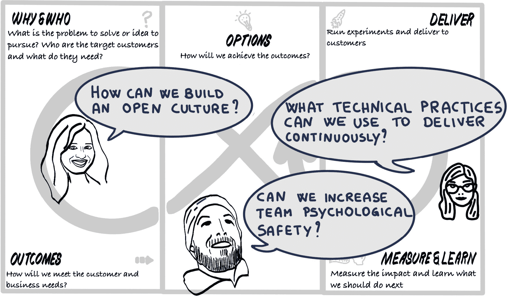
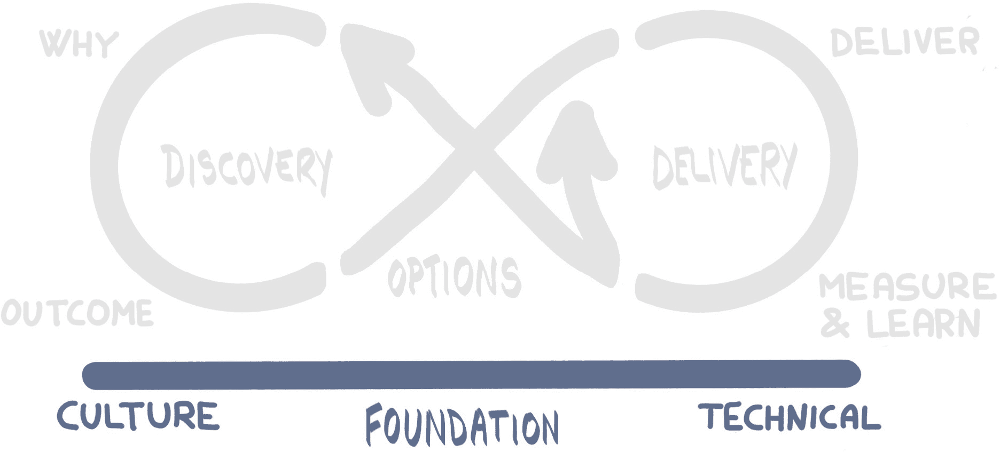

# 第二部分：建立基础

在*第一部分，实践造就完美*中，我们介绍了 DevOps 以及我们将在 Mobius 循环中使用的实践和工具，这个循环我们也进行了介绍。在进入循环之前，我们需要为循环搭建一个基础。这个基础专注于构建文化和技术：

图 4.0.1：基础——设定场景

当你听到**基础**这个词时，你会想到什么？许多人会想到你现在所处的建筑的基础。正如你所知道的，你不能仅仅到一个地方就开始在上面建房子。理论上，你当然可以。但如果你想要建造一个能经得起时间考验的房子，且最重要的是符合建筑规范，那可不行！首先，你需要建立一个坚实的基础。这意味着你需要深入到你要建设的地方的表面以下。建筑越高，基础就需要越深且越强。

想一想，这种情况适用于生活中的任何事情。当你奠定了坚实的基础，逐步在其上建设时，成功的几率会大大提高。想想你的教育、健康、健身、职业和生活。你所享有的成功正是因为那些基础以及你在它们之上能够构建的东西。

当你在一个脆弱的基础上构建时会发生什么？通常来说，这并不是一个好消息：

图 4.0.2：在脆弱的基础上构建

在与组织合作，构建运行于**OpenShift 容器平台**（**OCP**）的应用时，当这些组织投入时间和专业知识来构建基础并为其开发和运营建立稳固的方式时，我们会看到更大的成功和更高的商业价值回报。

在*第一部分*中，我们介绍了 DevOps 和本书中将使用的一些工具——即 Mobius 循环和开放实践库。Mobius 循环作为一个导航工具，帮助团队在持续发现和持续交付的旅程中应用 DevOps。我们刚才讨论的需要在构建任何东西之前先建立坚实基础的原则，也适用于软件设计领域。因此，我们在开放实践库中添加了一个基础。在我们考虑将任何团队、人员或产品放入 Mobius 循环之前，我们需要先建立一个基础。并且不仅仅是一个脆弱的、最低限度的基础——我们需要建立一个坚不可摧的基础。这个基础将支持快速的推进和越来越多的人加入到它上面的循环中。那么我们所说的“基础”是什么意思？我们指的是文化和技术实践的基础：

图 4.0.3：专注于支撑 Mobius 循环的基础

在红帽开放创新实验室，我们严格推进基于结果的交付方法。莫比乌斯循环充当我们的导航工具。它是一个可视化工具，帮助我们在 DevOps 旅程的不同阶段导航、识别并阐明我们使用的实践。

当我们处于**发现循环**时，我们识别并使用有助于回答“为什么”的实践——为什么我们要开始这段旅程？我们试图解决什么问题？我们想为谁解决这些问题，我们了解他们什么？我们的伟大创意是什么？我们还使用发现循环中的实践来帮助我们识别并设定商业和客户的可衡量成果目标。

当我们处于**选项转换**时，我们使用实践来识别如何实现可衡量的成果。我们有哪些可以实施的创意，帮助我们实现目标？从发现中得出的假设是什么，我们可以对这些假设进行测试、实验和研究？我们如何优先排序这些选项，以便更快速地交付价值？

当我们处于**交付循环**时，我们使用实践来完成选项转换中识别的工作——实施特性、进行实验、开展研究。关键是，我们还使用实践来进行度量，并捕捉关于交付影响的学习。当我们回到选项转换时，我们根据这些度量和学习评估接下来该做什么。

莫比乌斯循环是一个无限、持续的旅程，包含不断的发现、选项转换和持续交付重要的、可衡量的商业成果。我们在莫比乌斯循环中使用的实践通常有明确的开始和结束点。这些实践旨在帮助团队围绕循环前进——例如，在发现过程中，帮助他们走向选项和决策点。

在创建开放实践库（一个用于存储所有这些实践的工具箱）时，我们发现其中许多实践不一定适合放在发现或交付循环中。它们的性质是持续的，或是不断进行的。例如，我们使用了许多实践和技巧，帮助建立并推动协作文化。我们使用的工具可以帮助提升产品团队的能量、自主性和赋权感。我们还使用了一些实践，帮助营造一个基于信息传播、透明性和持续学习的环境。**基础**概念被添加到莫比乌斯循环下方，以解释这些类型的实践。这些实践旨在使团队能够默认地轻松做出正确的选择。它们是我们用来建立文化基础的实践。我们也有许多技术性实践，是我们持续使用的。最初的直觉可能是将这些实践与交付挂钩，认为它们应属于交付循环。然而，实际上存在一个微妙的区别，因为交付循环上的实践往往是有时间限制的、定期进行的活动，旨在推动交付。像冲刺规划、展示会、用户验收测试等实践（我们将在*第五部分：交付它*中详细探讨）通常是在每周或每次迭代的特定时间安排的。而有些实践，你不会像安排冲刺规划会议那样进行时间安排。例如，持续集成和持续交付、基础设施即代码（或实际上是“一切皆代码”）以及自动化相关的实践，如测试自动化，你不会每周三早上做几个小时的持续集成！你也不会在每周末安排一段时间进行基础设施即代码的工作。这些事情是你随时都在做的，正是因为你一直在做它们，才使得它们如此强大。莫比乌斯循环下的**基础**也用于解释这些类型的实践——这些实践帮助建立技术工程卓越的基础。

类似地，发现类型的实践往往是集中进行的事件，在特定时间进行，有时团队会多次进行迭代来执行发现循环。在*第三部分：发现它*中，我们将详细探讨的实践，都是由一群人聚集在一起，专注于某一活动一段时间来执行的。更多关注生成文化的实践，如制定团队章程和社交契约，以定义工作方式（将在下一个章节*第四章：开放文化*中介绍），并不属于发现循环。这是因为团队从这些实践中获得最大的价值，是在他们始终如一地使用它们时。团队不会在每周一早上拿出社交契约讨论半小时，然后直到下周一早上才再次考虑它！这就是为什么我们将它们构建在**基础**之上的原因。

现在，基础和整个开放实践库的一个重要方面是，它并没有规定或强制某一实践比其他实践更为重要。这不是另一种方法论或框架，它不会规定或强制某个人或某个团队必须使用哪些工具和实践才能达到某种结果。我们使用 Mobius 循环和基础来可视化我们选择使用的不同实践。在构建文化和协作基础时，没有固定的答案说明你应该使用多少实践。

我们发现，如果你完全不专注于或优先考虑这些实践，团队将难以取得成果，陷入旧的工作方式，或在尝试变革时回到现状。许多组织会让员工参加为期两天的 Scrum 培训课程，并尝试按书本内容实施，但却难以看到朝着业务敏捷性迈进的影响。Scrum 主要聚焦于交付循环和选项调整，而组织往往忽视了维持和促进 Scrum 实践带来的好处所需的文化变革和技术实践。

在本书的这一部分，我们将向你展示如何构建文化、协作和所需技术实践的初步基础，让你的“房子”能够长时间稳固屹立！

你可能在*第一章，实践成就完美*中已经瞥见了开放实践库。如果你应用了筛选器查看开放实践库中的所有基础实践，你会发现有很多！你可能会想，*我是否需要使用所有这些实践？*

答案是否定的。开放实践库的基础是一个不断增长的工具和实践选择，它们将帮助建立开放文化。你不需要使用其中所有工具，但至少应该从一些开始。你甚至可能已经有了一些自己的工具！问问自己，是否正在实现开放文化，使用的工具是否对你有效。
