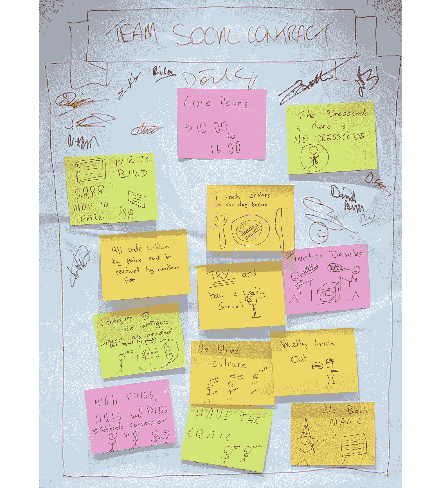
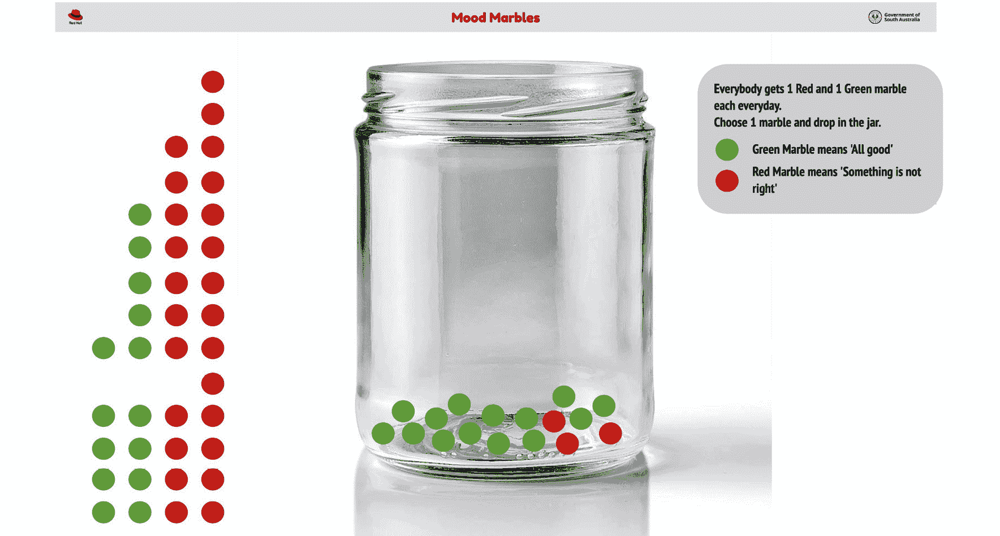
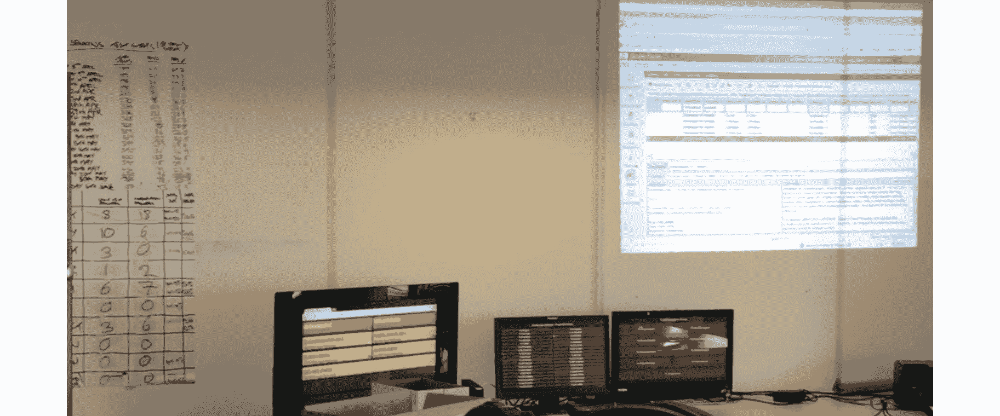

# 4\. 开放文化

许多开发团队、运维团队，甚至跨职能产品团队往往直接跳入项目的技术层面。*让我们搭建流水线，自动化我们的基础设施，写点代码！* 这种冲动很自然，大家会不假思索地开始，而不是先投入一些时间去建立文化基础。这也可能导致低效和不必要的复杂性。

别担心，我们将在*第六章，开放技术实践——开始，正确起步*中讨论技术。但在此之前，我们想谈谈开放文化和开放领导力。在本章中，我们将探讨什么是开放文化，以及为什么它被证明是开发和运维的一个关键推动因素。

开放文化源于一种以绩效为导向的协作工作方式。它为充满动力的团队提供了一个环境，使他们能够不断受到激励，携手合作，并感受到自主、精通和目标感。我们将探讨这三种元素的含义，并提供一些好的和不好的例子。

我们将深入探讨我们的开放实践库，探索我们用来建立文化基础的一些最喜欢的实践，例如社会契约、停世界电缆和实时回顾。这些实践有助于建立团队身份、理解团队情绪，并以非常透明的方式可视化我们所有的工作。

我们有许多关于使用这些和其他实践的故事要分享，我们将回到我们的宠物战斗组织，看看他们如何从兼职爱好者转变为建立一个高绩效团队，并准备好接管宠物战斗世界！

## 为什么它很重要？

文化指的是一群人中共享的习俗或行为。开放文化指的是默认遵循透明度、协作、社区、包容性和适应性的开放原则。研究表明，高绩效团队需要心理安全，而开放文化强化了能够促进这一点的行为模式。

我们所说的心理安全是什么意思？威廉·卡恩（William Kahn）在 1990 年提出了这个概念，1 他说过，*心理安全是指能够在不担心对自我形象、地位或职业产生负面后果的情况下，展示和使用自己的感觉*。*艾米·埃德蒙森博士*在她 1999 年的论文中进一步解释了这一点，2 她表示，*心理安全是一种信念，即一个人不会因提出想法、问题、关切或错误而受到惩罚或羞辱*。这一概念出自她 1999 年的论文，后来在 2013 年被谷歌的阿里士多德项目所引用。那项谷歌研究发现，心理安全（有些令人惊讶的是）是构建高绩效团队的最重要因素。

*Tom Geraghty，Red Hat Open Innovation Labs 的转型负责人*，最近在他自己的研究和转型服务工作中重新定义了这一点。他解释道，*在一个小组的背景下，心理安全表现为一种信念，即其他成员重视你的贡献和关切，并且不会因为表达它们而主动或被动地伤害你。这为小组成员提供了空间，去冒险、承认脆弱并承认错误，而无需担心负面后果。*

开放文化和心理安全是任何组织的必备成分。它们为一个环境提供了支持，在这个环境中，人们和团队感受到信任的共鸣，能够自由探索新想法，进行实验，通过实践学习，并与同事、同行、领导者、客户、用户……实际上是与每个人自由分享！

1 [Kahn, W.A., (1990). 工作中的个人投入与退出的心理条件。管理学会期刊，33(4)，第 692-724 页。](https://journals.aom.org/doi/10.5465/256287)

2 [Edmondson, A., (1999). 工作团队中的心理安全与学习行为，艾米·爱德蒙森。行政科学季刊，44(2)，第 350-383 页。](https://journals.sagepub.com/doi/abs/10.2307/2666999)

相反，封闭文化到处充满了阻碍和障碍，阻止了这些行为的发生。团队会回到保护性和保密模式。当害怕分享坏消息，或者请求反馈的想法让某人感到恐惧时，我们最终会处于一个保护自己所做事情免受外界干扰的环境中。我们不想与别人分享我们的代码，生怕他们否定我们或者嘲笑我们做得不对。我们不敢向经理展示自己落后于计划的情况，因为害怕被精神上“打击”并被告知必须加班加点才能赶上进度。我们不敢向业务人员或最终用户展示功能，因为他们可能会告诉我们我们做的不对，这将引发更多的返工（以及更多愤怒的经理）。

通过创造这些类型的环境，我们实际上是在推迟不可避免的事情。想一想有多少 IT 项目在开发进度的最后阶段才暴露出问题。团队突然需要付出更多努力才能赶上最后期限。缺少的正是一个开放、诚实和透明的工作进展视角，随着项目的推进逐渐呈现出来。

你听说过 IT 项目的西瓜效应吗？外面看起来又绿又健康，但一旦开始剥开皮，里面到处都是红色！我们曾见过一个例子，团队领导和项目经理会根据自己的 RAG（红色、琥珀色、绿色）状态写报告，这些报告会传递给更高级的项目经理，后者会用自己的总结 RAG 状态汇总每个人的报告。然后这些报告会传递给更高级的执行治理人员，最终呈现给高级客户利益相关者的是一个更高级（或更稀释）的 RAG 状态信息。

图 4.1：西瓜效应

## 信息辐射器

鼓励开放文化的最佳方式是让所有团队成员和其他相关利益相关者都能公开获取信息。

**信息辐射器**这个术语由*阿利斯泰尔·科克本*提出，指的是团队放置在显眼位置的手写、绘制、打印或电子显示器，团队成员以及路过的人都可以一目了然地看到最新信息。在科克本 2001 年出版的书籍《敏捷软件开发》中，信息辐射器是一个扩展的隐喻，代表信息的传播像热量和气体的扩散。我们将探讨与客户和团队一起使用的各种信息辐射器——自动化测试的计数、速度、事故报告、持续集成状态等。

我们有时也使用**信息冰箱**这个术语——信息变得冷漠，甚至过时。信息冰箱是一个你需要去寻找信息的地方，而不是信息随时可用且容易获取。冰箱甚至可能是锁着的！存储在共享驱动器上的文件、JIRA 仓库和其他数字工具中的信息都可能变成冰箱里的信息，因此我们有责任保持它们的“温暖”和辐射。

## 能否让那些红灯变成绿灯？

在与一家英国零售组织合作时，我的团队提出了透明信息辐射的概念。

项目已经向业务利益相关者报告了几个月的绿灯状态。但实际上，存在一些关键依赖关系和障碍，阻碍了交付团队的进展。我们的团队设置了电视显示器，突出显示我们的服务无法访问预生产或生产服务器。一些简单的自动化测试显示网络基础设施没有流量通过，因此所有测试都失败了。这些测试结果显示在团队房间的大屏幕上。这个屏幕非常显眼，很多人都能看到，屏幕上只显示了大块的红色。

由于利益相关者迄今为止一直报告着一个健康、成功且没有大问题的项目，显示许多红色的巨大屏幕反而传达了相反且令人担忧的信息。我被问到是否可以因为首席信息官要来，暂时更换这些*交通信号灯*信息显示器。如果不行，能不能把显示器关掉？

这是一个典型的西瓜效应。

不要——不要篡改团队设置的实时信息显示器。

不要隐藏信息。相反，要解决信息显示器所凸显的基础设施问题。下一次自动化测试运行时，这样做会自动将仪表板变为绿色。

为了继续赋能我们的团队，我们选择忽视了这个请求。

当我们拥有开放文化时，我们有机会定期检查一切的健康状况——产品、团队、投资、利益相关者、用户和技术的健康状况。开放文化意味着，当我们进行健康检查时，如果得不到积极的反馈，我们会以参与和对话的方式欢迎坏消息。我们不会因为得到坏消息而责怪他人。相反，我们会讨论我们学到了什么，以及需要做什么才能改善现状。我们需要改变什么？我们应该适应什么？检查和适应是开放文化的健康指标。文化越开放，我们就越有自由去检查和适应。

在我们深入探讨一些帮助建立开放文化基础的具体实践之前，先分享一下我们对“文化”这个词的理解，以及团队中的动力如何真正推动文化向上发展。

## 文化

文化是一种神秘的能量。你看不见它，但你肯定能感受到它。你能感受到它在一个团队或物理空间内特别强烈的时候。如果你曾经体验过伟大的开放文化，你也会迅速意识到当你感受不到它时的情况。

我们常将开放文化比作《星际大战》中的力量。力量在《星际大战 IV：新希望》中年轻的卢克·天行者身上尤为强大：他没有穿写着这句话的 T 恤，但别人靠近他时能感受到那股力量。开放文化就像这样。你拥有它时会知道，且你也能知道它何时变得更强。你的任务是定期评估、感知并检查开放文化的强度，如果你觉得它可以更强，探索更多文化基础实践来强化它。我们将在*第十三章，衡量与学习*中探讨不同的技术和实践，帮助衡量和学习这些变化的影响。

在本章的剩余部分，我们将分享一些在开放创新实验室驻地期间，我们在建立文化基础方面最成功的实践。

## 动力

根据《纽约时报》畅销书《驱动力：关于我们动机的惊人真相》*的作者丹·平克*，人们的动机并不像我们预期的那样。他认为，*历史上，组织通过提供奖励（钱）并通过恐惧和惩罚的文化来激励员工，这种做法是错误的。当工作需要任何认知技能或知识时，这些方法并不起作用。*

通过他的研究，他表明有三件事能激励人们超越基本任务完成：

+   **自主性**：渴望自我引导和拥有自由支配的权利

+   **精通**：渴望在某方面变得更好

+   **目标**：渴望做一些有意义或对你重要的事情

图 4.2：自主性、精通和目标

在你的组织中创建一种开放文化应当体现这些原则。开源软件开发建立在自主性、精通和目标这三大支柱上。例子包括使用开源代码库、在公共讨论论坛上进行协作以及拥有透明的决策记录；这些做法使得人们更容易找到目标，获得专业知识，并对自己的工作负责。它消除了对个人以及稀缺或隐藏信息的依赖。全球各地的人们都在积极地为像*OKD*（Kubernetes 的社区发行版，支撑着 OpenShift）这样的开源项目做贡献，从而改善所有人的产品。有时候，他们贡献是因为这是他们的工作的一部分，但更多时候，他们贡献是因为他们愿意。他们参与这些项目是因为通过帮助社区建立更好的东西、为大家带来益处、被自我引导或倾听，以及为未来创造某些东西而获得的深刻个人满足感；他们也希望通过在公共待办事项中实施和测试一些东西，成为更好的程序员。

为了在组织中建立这种精神，领导层需要创造一个环境，使员工能够实现这些目标。他们应该赋予团队决策的权力，并鼓励自我组织和自我修正，从而提供自主性。他们应该拥抱并鼓励持续改进，使团队成员能够不断学习和提高自己及团队，提供精通性。领导层应该消除阻碍团队成员与业务目标对接的障碍和壁垒。领导层应该使团队能够定期直接接触到业务利益相关者、客户和领导层，从而增强员工对工作的目标感。让员工专注于自主性、精通性和目标感将产生双重效果。团队将拥有创造出色产品的自由和*动力*。由于对产品负有更大的责任，员工将开始更加努力工作，因为他们真正相信自己被倾听，并与团队目标紧密相连，他们也会想要努力让产品更好。

让我们回到 PetBattle 的案例研究，看看一些员工是如何感受到自主性、精通性和目标感的。具体来说，看看在 PetBattle 成立初期发生的一些事件，这些事件帮助实现了这种开放的文化。

## PetBattle — 创造自主性、精通性和目标感

将工程师与最终用户连接起来是创造目标感的一个好方法。PetBattle 的工程师不希望功能或任务无缘无故地丢给他们，而且没有看到这些功能如何与产品愿景相连接。为了解决这个问题，他们定期与最终用户进行演示并收集反馈。这种互动让他们能够建立同理心，看到应用在实际生活中的使用方式。

玛丽（一个自认的猫咪爱好者，经常玩 PetBattle）在 Ciarán（PetBattle 工程团队的一员）的观察下使用应用。玛丽正在努力理解为什么她上传的猫咪没有立即出现在比赛中。Ciarán 知道她必须先为另一只猫投票，自己的猫才会出现在投票列表中，这对他来说似乎是显而易见的。几天后，Ciarán 在他的待办事项中看到一个任务——让上传的猫咪立即出现在投票列表中。Ciarán 立刻理解了这个任务的目的，并开始思考这个功能对玛丽（一个经常玩游戏的玩家）产生的影响。

Ciarán 和其他参与 PetBattle 项目的工程师——Aidan、Emma 和 Jen——意识到，能够获得 Mary 的反馈是非常有价值的，尤其是在他们有机会向 Mary 交付新功能时。Jen 在最近的一次回顾会议中说：“*这比我之前的项目好多了，在那些项目中，我被要求按照规范编写代码，却并不真正理解自己所帮助构建的是什么*。”Aidan 建议，如果他们能时不时地见到像 Mary 这样的用户，甚至与她们一起做些测试，听听她们对未来发展的其他想法，那就更好了。

在同一场回顾会议上，Aidan 分享了自己最近几周在 PetBattle 工程团队中的个人亮点。他说，他喜欢可以在自己准备好时直接发布新功能和修复 bug。他不必等待发布窗口，也不需要变更审查委员会的会议。他可以直接按下按钮，尤其是 Ciarán 和 Emma 着重建立的那些优秀的技术基础实践，让他能够充满信心地发布。他正在学习如何为自己的新代码创建功能开关，这更好，因为它使得业务产品负责人可以决定何时启动这个功能。Aidan 认为，团队应该进一步探索像这样的更先进的部署能力。

与此同时，Emma 的亮点是有机会与更广泛的社区分享她所掌握的一些技术基础技巧。她已经写了几篇博客文章，并受邀在新的一年参加一个 DevOps 大会的演讲。她表示，在之前的项目中，她并不被允许如此公开地分享她所做的工作。她觉得自己有一些很棒的技巧可以回馈给更广泛的技术社区。这个社区中的许多人曾经帮助并激励了她自身的发展，因此她非常高兴能够分享回去。大家一致认为，他们应该寻求机会做这些事情——谁知道，或许这甚至能帮助宣传和推广 PetBattle 作为一款产品，随着团队的成长，也会成为一个非常酷的工作场所！

*Drive: The Surprising Truth About What Motivates Us*的作者 Dan Pink 在 2010 年在**皇家艺术学会**（**RSA**）做了一个精彩的演讲，讲述了真正激励我们的是些什么。RSA 制作了一个来自这次演讲的短视频 3，非常棒——我们已经向许多团队和领导展示过。它在 YouTube 上公开可用，我们强烈推荐至少观看一次，以进一步探索自主性、精通性和目标感这一领域。

在 Red Hat，自治、精通和目标感是支撑我们开放文化的核心价值观。我们将探索一些战术性实践，帮助创造这一文化。当我们进入产品发现和产品交付阶段时，你会发现这里的所有实践也都在帮助实现这一文化。

## 社会契约

我们四位作者非常幸运，能够帮助新产品团队启动。我们使用一系列实践来帮助这些团队并确保它们从一开始就能有最好的开端。我们逐渐意识到，特别重要的一项实践是——社会契约。

3 [`youtu.be/u6XAPnuFjJc`](https://youtu.be/u6XAPnuFjJc)

*社会契约实践是一种简单但极其有效的方式，能够让团队实现自主性和自我责任感。社会契约由团队创建并服务于团队，它旨在明确团队的行为规范和期望。它还为团队提供了一种机制，能够将其期望的行为与管理层和其他利益相关者进行可视化和分享。*

社会契约并不是某个昂贵的咨询项目，而是团队提出的一套简单的准则和行为规范，用来说明他们希望如何相互互动。它促进了团队的自主性和自我管理。

我们从之前的经验中学到的一个教训是，如果在与新团队合作时，我们没有花时间使用像社会契约这样的工具，最终会面临各种文化、团队协作和沟通问题。*图 4.3* 显示了一个社会契约的示例。

图 4.3：社会契约的示例

### 我需要一个社会契约吗？如果需要，如何建立一个？

在现代软件开发中，我们的目标是打破一切壁垒。开发和运维团队之间的壁垒仅仅是开始！开放型组织希望他们的团队能更加自主，因此围绕产品为团队提供共同的目标。团队对此的回应通常是尽力践行*你构建它，你拥有它，你运营它*的格言。但我们如何推动这种行为变化的起步呢？尤其是当我们启动一个全新的团队，而团队成员彼此完全不了解时，如何加速团队的高效运作？这时，我们友好的社会契约就派上了用场。

当我们与一个新团队合作时，我们会让他们为团队起个名字。团队身份对于建立高效能团队文化中的所有权部分至关重要。我们将在本章稍后进一步探讨团队身份。

下一步很简单：让团队花几分钟回想一下他们曾经合作过的最好的团队，或者他们参与过的最佳产品开发。想到这些之后，他们应该列出所有他们记得的、令人印象深刻的特质和行为，并将它们记录在便签纸上。

相反，想一想那些糟糕的项目，以及是什么因素在为团队创造一个有毒的工作环境。通过一些想要遵循的行为准则，团队可以进一步讨论，从而达成共识并聚焦于使用的具体语言。

一个好的社交契约应该包含具体可执行的条款，而不是空泛的声明。为了真正挖掘这些内容，领导者可以通过举例说明某个人如何践行他们提出的声明来引导团队，并尽量捕捉到这些行动的具体表现。例如，*保持开放*可以作为社交契约中的一项条款，但可能缺乏具体性。我们可以通过举例说明我们在哪些地方遵守，或者没有遵守这一条款，来进一步探讨。团队可能会提出类似的条款，如*每个人的意见和贡献都很重要*、*给较为安静的人更多空间*，以及*像我希望别人听到我一样，积极倾听他人*。

对于合同中的某些条款，团队成员签署合同并将其张贴在显眼的位置。现在，遵守合同是团队的责任，并且需要在别人没有遵守时提出警告。

图 4.4：另一个社交契约的例子

前面的例子来自我们与一家网络安全公司合作的四周时间。这支团队包括开发人员、设计师和站点可靠性工程师。以下是他们所包含的一些内容：

+   **核心工作时间（10:00 至 16:00）**：这是团队商定的协作时间。这不是他们工作的时间，而是他们进行同步、开会、配对编程和其他协作的时间。在这次合作中，团队中的一位成员希望避开早高峰交通，因此如果她稍晚到达，通勤时间将大大减少。此外，团队中的另一位成员有照顾孩子的责任，所以在合理时间离开会让他的生活更轻松。

+   **团队学习 / 配对构建**：这是一个简单的口号，描述了团队在编写代码、测试甚至文档时如何互动。如果需要解决新的问题，比如使用新的语言或框架开发那个令人生畏的微服务，那么就应该全员一起处理。从一开始就让每个人保持一致，确保团队中没有单打独斗的“英雄”，确保技能在团队中普及。通过配对开发功能，提升全员的技能。

+   **每周社交**：庆祝成功对许多团队来说非常重要。作为一个团队，花时间远离桌面，一起社交、一起用餐，有助于建立积极的关系。这些活动可以提高团队士气，并在从事产品工作的人群中创造积极的文化。

现在我们已经考虑了社交契约的关键原则，接下来让我们看看如何将它们与其他职场实践结合。

为了支持对想法和行为达成共识，可以使用分组技巧，如**亲和图法**、**五指法**和**点投票法**。这些是简单但非常强大的实践方法，也是开放式引导技巧，能够帮助推动一致性、共识并确保所有相关人员的参与。我们将在下一章关于开放领导力的内容中深入探讨这些方法。

图 4.5：回顾性学习推动社会契约更新

当社会契约首次创建时，它代表的是一个时间点的快照。它是对团队如何互动的最佳猜测，通常是在我们彼此还不熟悉或没有形成习惯时编写的。它是一个有助于加速团队建立在信任和心理安全基础上的舒适位置的有用工具。然而，它并不是一成不变或静态的。契约中的条目可能已经失效或有所遗漏。一位优秀的 Scrum Master 或敏捷教练可以做的一件事就是在团队的回顾会议中带上社会契约（这是*第五章 - 交付它*中将进一步探讨的实践）。这为团队提供了一个很好的机会来检查和调整社会契约，可能会更新其中的新想法或改进措施。

## 犯错是可以的

在与网络安全公司合作时，我们发现了一个很好的机会来更新我们的社会契约。那个团队里有两位开发者性格比较冲动，而且两人总是希望自己是对的。通常，他们无法就任何给定解决方案的实施方法达成一致，这种情况在团队内产生了有毒的氛围，降低了士气。通过一次回顾，团队发现了这个问题。经过讨论并将问题公开后，我们用一句简单的话更新了我们的社会契约：*犯错是可以的*。

这对团队今后的发展产生了深远的影响。团队内部的竞争开始消失，因为我们不再过多关注*谁是对的*，而更多地关注*这个解决方案是否适用于我们的最终用户*。我们寻找机会让两位开发者都有机会发声，尝试多种实现方式来解决一个特性。构建并评估两种方案后，两位开发者开始互相配对，协同开发对方的解决方案，从而加深了彼此的联系。这也带来了一个明显的好处，即通过经常结合两人想法，写出了更好的解决方案。

社会契约是一项强大且易于实施的实践——它促进了团队自治、自我管理和心理安全。如果你的团队还没有社会契约，建立一个也不算晚。最重要的是，要让它对团队可见，并在需要时不断回顾更新。

### 分布式团队的社会契约

我们在*第一章，实践成就完美*的最后提到过，我们会考虑在一个更加分布式的环境中，实践如何运作，尤其是当人们并不在同一地点时。使用社会契约实践与一个新的虚拟团队合作可能会有些棘手，因为我们通常在关系、信任和默契尚未建立时就使用社会契约。

我们遇到的挑战包括并非每个人都参与或贡献于社会契约。当团队中只有相同的声音时，那些不太参与的人往往会被忽视。以下是一些建议，帮助如何在分布式团队成员之间建立社会契约。

使用 Miro 或 Mural 等虚拟白板工具，确保每个人都连接并查看相同的内容，将为你提供最佳的成功机会。如*图 4.6*所示，我们已经创建了一些模板，这些模板是公开可用的，并可以作为你的社交契约的起点。你可以从本书的 GitHub 仓库中下载。

图 4.6：适用于分布式团队的数字社交契约模板

考虑拥有一个适用于远程会议的*预设*社交契约，然后根据大家的想法允许人们进行添加或更改：

+   每个人都应该用便签或虚拟笔*签*上自己的名字。

+   将远程工作元素添加到社交契约中（例如，加入通话时静音、开启摄像头等）。

+   建立全球沟通规范和各个团队的例外：响应时间、写作风格、语气等。

在我们的虚拟合作中，我们看到的一些良好的沟通规范包括：

+   一次只进行一个对话。

+   假设正面意图。

+   不要删除或移动他人的贡献。

+   保持专注于我们的目标，逐步推进。

+   尊重休息时间。

+   避免其他干扰，如电子邮件和聊天。

+   根据需求可以更新契约。

*图 4.7*展示了一个由分布式团队创建的示例社交契约，包含了他们的建议和签名：

图 4.7：分布式团队使用的社交契约示例

你可以通过访问[openpracticelibrary.com/practice/social-contract](http://openpracticelibrary.com/practice/social-contract)了解更多关于社交契约的实践。

在视频通话中与每个人一起创建社交契约，需要额外的促进技能。*Ilaria Doria*和*Marcus Maestri*在[`openpracticelibrary.com/blog/facilitation-tips-for-remote-sessions/`](https://openpracticelibrary.com/blog/facilitation-tips-for-remote-sessions/)提供了一些非常棒的远程协作技巧，帮助你更好地进行远程会议和其他实践。

## 停止世界

**停止世界**事件或**安灯绳**是我们在合作中经常使用的另一个我们喜爱的实践，它是 DevOps 的一项超级能力。

*约翰·威利斯*在他的*ITRevolution 博客文章*4 中解释了**安灯**一词的起源——在日语中，这个词源于传统的照明设备，使用的是由纸和竹子做的火灯。这个想法后来被翻译并用于日本的制造业中。**安灯**成为了一个信号，用来突出显示异常情况（即，闪烁的灯光）。这个信号用于放大可能出现的质量缺陷。

4 [`itrevolution.com/kata/`](https://itrevolution.com/kata/)

## 安灯绳与心理安全

我第一次听到*Andon Cord*是阅读*《凤凰项目》*时——这本书由*Gene Kim*、*Kevin Behr*和*George Spafford*合著——如果生产线上的员工怀疑出现了问题，他们会拉动绳索，整个生产线会立即停下来。通过避免将失败传递到下游，丰田认为这种颠覆性行为是*我们每天能生产 2,000 辆车的唯一方法——那就是每 55 秒完成一辆车*。

大约八年后，我听到 Gene Kim 谈论 Andon Cord 与团队心理安全之间的关系。当你在丰田工厂拉动 Andon Cord 时，生产线经理会跑过来并感谢你停止生产，以便解决任何出现的问题。如果他们认为拉动这根绳索会受到惩罚，就不会有人去拉它。

是的……好的 DevOps 你借用，伟大的 DevOps 你偷！

当怀疑系统有缺陷时停止系统的过程可以追溯到最初的丰田系统公司以及所谓的 Jidoka。Jidoka 背后的理念是，通过停止系统，你能立即获得改进的机会，或者找到根本原因，而不是让缺陷继续传递下去而没有得到解决。Jidoka 的概念是由丰田的创始人丰田佐吉（Sakichi Toyoda）开创的，他被称为日本工业革命之父，也是丰田系统公司（在制造汽车之前）的创始人。

我们在与客户的互动中使用*停止全世界*事件。当团队中的某个人发现项目偏离了预定方向时，整个团队会一起合作找到一个可行且各方都能接受的解决方案，然后进度可以继续恢复。

在团队中使用停止全世界事件有很多隐性好处。在丰田工厂，生产线经理会亲自去看看拉动绳索的站点，并询问：*我能帮你做些什么？*问题立即成为优先事项，且通过直接去问题首次出现的区域，过程变得证据明确且基于事实。通过感谢拉动绳索的团队成员，这鼓励了一种*安全文化*：工厂管理层在说，*你挽救了一个客户免受缺陷产品的困扰。*每当你的应用测试在管道中失败时，想想这个！在丰田看来，失败创造了学习的机会，失败本身是一件好事。

## 我们只是在重建相同的体验。停止全世界！

我们在 2018 年为一位位于北欧的客户提供了为期 6 周的双轨开放创新实验室驻场服务。（双轨驻场有一条轨道/团队专注于构建全新的生产 OpenShift 平台，而另一条团队则构建并维护在平台上运行的第一个业务应用。这两个团队紧密合作，并在同一个物理空间中工作。）

对于这个客户，正在开发的应用是现有移动应用的现代化版本，客户通过该应用购买新的旅游保险产品。此次双轨驻场的目标是学习 DevOps 新技能、开发微服务，探索 OpenShift 产品，并提升客户的整体用户体验。

驻场的第四天，团队正在使用一种叫做事件风暴的方法（我们将在*第三部分，发现它*中详细探讨），来绘制端到端的业务流程并发现新兴的架构。这项工作已经进行了一两天。

Riley，我们的用户体验设计师，在查看进行中的事件风暴时突然有所领悟。所有的对话和可视化都集中在捕捉**现有**应用流程上。他们走上了一条只是在用一些新技术和方法重新构建相同体验的道路。

Riley 拉响了 Andon 铃，在这个领域，这是一口大钟。他停止了整个进程。这声音又大又有冲击力，旨在打断所有人的工作并立刻吸引他们的注意。大家停止了手中的工作，围成一圈。Riley 解释了他的担忧，大家一致认为，如果他们只是重新设计完全相同的应用，单纯采用新的技术和方法，这种做法对提升客户整体用户体验的目标帮助不大。

因此，作为一个团队，他们决定使用事件风暴来捕捉需要验证的假设、创新实验的想法以及需要与最终用户探索的未知问题。

世界重新启动后，接下来的六周采取了以假设和实验为基础的方法。

这个故事展示了以用户为中心的动机背后为什么要停止整个进程。另一个故事解释了一个更技术性团队成员如何停止世界运转的原因。

## 偏离原本的目标

团队在这里进行了一系列实验、技术挑战和研究工作，旨在最大限度地提升在为期 6 周的开放创新实验室驻场期间的学习成果，为使用 OpenShift 推出新云平台做准备。

团队已经就驻场期间的多个架构原则达成了一致。

在第三次冲刺期间，团队成员 Tom 注意到，白板上出现了越来越多与当前冲刺无关的旁谈和绘图。这些内容与团队当前开发用户故事的业务流程部分无关。

团队的燃尽图明显偏离了轨道，看起来越来越不可能实现当前迭代的目标。当汤姆进一步调查这些闲聊内容时，他发现讨论的话题涵盖了完全不同的场景，并且有些人开始考虑 2-3 年后的架构问题。

稍感沮丧，**汤姆暂停了世界**。实验室空间里有一个*暂停世界*的铃声，他把它响了起来。

图 4.8：一名团队成员暂停了世界

团队成员都熟悉这个实践，但听到铃声真正响起时，还是稍感震惊。他们聚集在一起，团队展开了开放、坦诚的对话。汤姆分享了他的担忧和沮丧。团队重新审视了他们当前的承诺，并提醒自己之前在优先级滑块和目标结果实践中做出的一些决定。他们同意将一些事项放入产品待办事项列表，以便暂时搁置这些讨论。

图 4.9：世界暂停后，团队聚集在一起解决问题

仅仅 15 分钟后，团队重新调整了方向，重新聚焦了优先事项，并充满了新的活力和承诺。

人们不禁想，如果汤姆没有表达他的担忧和沮丧，而是让它们在脑海里积压，事情会持续多久？会有什么连锁反应？整体影响会如何？

你可以通过访问[`openpracticelibrary.com/practice/stop-the-world-event/`](https://openpracticelibrary.com/practice/stop-the-world-event/)来了解更多并协作探讨停止世界的实践。

## 实时回顾

在寻求建立开放文化并在我们工作空间中推动自主、精通和目标意识的过程中，我们需要建立反馈循环，以便我们能够感知自己是否朝着正确的方向前进。

到目前为止，我们只介绍了几个非常简单的实践，帮助建立基础文化。但它们会有效吗？你怎么知道呢？如果新团队在背后低声抱怨社会契约过于空洞，并且认为那个*暂停世界*的做法*在这样的地方永远行不通*，该怎么办？希望这种情况没有发生，但如果发生了，那你很可能正朝着与开放文化背道而驰的方向发展，创造了更多的侧面孤岛和封闭行为与思维。

我们需要为大家创建一个渠道，反馈他们自己对实践的使用情况，甚至是初步印象。他们喜欢这些做法吗？他们认为这些做法有助于建立所需的基础吗？他们是否已经预见到一些障碍和阻碍因素？

我们已经提到了回顾实践几次，接下来本书会多次提到它，因为这些实践背后的理念带来了持续学习和持续改进的最重要哲学。

但这里介绍的做法有些不同。与其在回顾会议中安排时间开始收集我们早期基础活动的反馈，不如采用一种更加持续、*始终在线*的自助式反馈收集方式？

Emily Webber 分享的实时回顾技术为任何人提供了一个简单、直观的工具，让大家可以随时为任何事项添加回顾反馈。与其等待正式的反馈事件或某种调查（说实话，并不是每个人都喜欢这种方式），实时回顾使得所有参与者能够更快、更准确、更直接地提供反馈。

为了使用这种技术，找到一面足够长的墙或表面，以容纳你预期的反馈量。画一条长线来代表时间。

在时间轴上方画一个笑脸，在下方画一个悲伤的脸，在时间轴上画一个惊讶的脸（这代表你希望收到的反馈类型——积极的、负面的和惊讶的）。

向参与者解释使用这一做法的目标，以及如何使用你准备的区域。以下是需要分享的关键事项：

+   告诉他们可以在哪里找到贡献材料。

+   时间轴从左开始，直到你指定的结束时间。

+   欢迎任何形式的反馈。

+   每一条反馈项用一张便签纸。

不断循环并监控，回顾你的反馈并基于这些反馈做出适当的改进。

我们发现，基于实时回顾的反馈，早期进行一些简单调整，实际上可以为自主性、精通度和目标感播下种子。即使是对温控做出反应、改进餐饮服务或调整工作空间中人们的位置，也能产生很大的积极影响，因为反馈来自团队成员，他们看到自己的想法得到了快速回应。这就是我们所说的赋能团队。

一如既往，我们喜欢通过展示而非单纯说明，因此让我们来看一个实际的例子，看看我们是如何使用实时回顾的。

图 4.10：在五天 DevOps 文化与实践启用工作坊中使用的实时回顾

这一方法用于为期五天的沉浸式启用工作坊——DevOps 文化与实践启用。考虑到时间的紧凑性，实时回顾尤为有用，因为如果有某个简单的改进或解决方案可以更早应用，你可不希望等到一周结束（甚至某一天结束时）才收到反馈。

你会发现，在这个例子中，许多便签都位于中线下方，代表了*悲伤*的反馈。这是否意味着这次交付非常糟糕？不，不一定。当我们主持实时回顾时，我们实际上会告诉大家不用担心给我们提供大量的*负面*反馈。虽然阅读*愉快*或*积极*的反馈很不错（而且有助于确认我们应该做得更多的事情），但我们真正想要捕捉的是改进的建议。我们如何才能变得更好？又该如何快速做到这一点？

你可能无法阅读到低层次的细节，但一些在第二天已经解决的早期反馈的优秀例子，在实时回顾中已被记录下来，包括以下内容：

+   更频繁地休息，减少冗长的讲座时间

+   订购更多的素食食品

+   采用一种小组政策，在讨论开始进入*死胡同*时*继续前进*（另外，团队提出了视觉信号，以便在这些情况发生时能及时提醒）

+   购买更多显示器，以帮助技术练习的协作性

+   每天至少出去几次呼吸新鲜空气

这些都是与会者给出的很好的反馈点，并且非常容易处理。持续的反馈和持续改进之旅就从这里开始！

使实时回顾实践如此强大的其中一件事是，它始终展示在参与者面前，始终在他们眼前。我们通常使用大型的 8 英尺×4 英尺的便携泡沫板来展示实时回顾，这样我们可以将其移到房间的各个位置，并故意放置在团队成员必须经常经过的地方。这鼓励他们贡献、重新组织，或仅仅是看到其他人提供的反馈。

如果你和一个分布式团队一起工作，使用数字白板和视频会议，我们可以轻松开始实时回顾。我们有一个不错的模板，你可以像*图 4.11*中展示的那样使用，并且可以从本书的 GitHub 仓库下载。

图 4.11：分布式团队的数字化实时回顾画布

这里的挑战是如何让采用和使用继续下去。像这样的数字化工件有可能变成**信息冰箱**，信息死在其中，只有有人打开它时才会被发现，结果变得冷冰冰且过时！也许信息应该有*使用期限*或*最佳食用日期*！为了避免这种情况，我们需要强有力的引导。我们应该鼓励团队成员始终将这些数字工件保持可见。作为一个团队，我们应该定期进行虚拟的“走墙”环节，参与者和引导者应该在合适的时机鼓励大家为实时回顾提供反馈。

您可以通过访问[`openpracticelibrary.com/practice/realtime-retrospective/`](https://openpracticelibrary.com/practice/realtime-retrospective/)了解更多关于实时回顾实践的信息和合作。

社会契约、停止世界的安东线和实时回顾是三种非常好的实践，可以开始构建文化基础。如果得到良好的引导，单从这些实践中产生的对话应该开始推动团队自主性和团队身份感。我们将进一步探讨团队身份，因为它是构建优秀团队文化的重要组成部分。

## 团队身份

回想一下你过去与之合作过的团队。有多少是非常棒的经历，每天早上都期待着工作？有多少是糟糕的，你迫不及待地希望一切结束？你曾经与一个团队合作过，觉得，“那太棒了 - 我希望它能永远持续下去！” 如果是这样，那么使你觉得与那支团队合作如此令人惊叹的因素是什么？

团队认同感、士气和凝聚力都是紧密相连的，对于构建高绩效团队至关重要。它们都是一种心态，这意味着创建出色团队的公式有些抽象，形式上则少得多。你不能仅仅通过将人们拼凑在一起，加上一部分外向的个体和两部分勤奋的个体，就能迫使团队拥有高凝聚力！它必须比这更有机地形成。

个体团队身份可以具有传染性的热情，并传播到组织中的其他团队。当有一定能量、团队文化和共享身份时，其他团队希望成为那支团队。新团队应该形成，以成为那支团队。为了避免团队身份变成他们自己的孤立组织，我们可以通过兴趣社区和实践社区的方式连接团队。我们将在*第七部分 - 改进它，维持它*中进一步探讨这一点。

### 社交

有许多小文化要点和实践，我们用来尝试加速团队形成，使我们更快地达到执行状态。如果团队成员之间自然相处或有共同的兴趣，这可以感染整个团队，并在每个人之间创建联系。

图 4.12：团队远离办公室的社交

在个人层面了解人们并分享兴趣很容易延伸到日常工作中。人类天生是社交动物。这就是为什么我们总是试图与团队一起社交的原因。抽出时间远离办公室放松一下。有时候可以是下班后的酒吧，甚至是在白天分享午餐时。事实上，在以前的住所里，我们甚至有过像每周咖喱自助餐这样的事情，团队利用这段时间一起社交。有一次，我们在 Curry Day 上，因为团队中的一位成员病假了，我们甚至在一周内去了两次！

如果下班后去酒吧不适合，那么就完全颠倒一下！我们经常让团队在早上第一件事就是一起去吃一顿丰盛的早餐！这是以全新视角和新鲜鸡蛋开始新一轮冲刺的绝佳方式！社交有很多种形式，但重要的是停下来庆祝已经完成的工作。一起去玩游戏，或者去保龄球馆玩一个小时，有助于团队建立友谊并相互了解。

这听起来可能很空泛，但参与此类活动的团队总是能在日常工作中互相帮助，即使他们不熟悉所处理的任务。当团队成员建立了这种关系时，他们会为彼此付出额外的努力。

图 4.13：办公室中的团队社交

社交音乐播放列表为团队提供了一种简单的方式来互相了解。创建一个共享的播放列表，所有人都可以添加自己喜欢的歌曲，或者对其他人的歌曲进行点赞和点踩，可以在团队中营造出非常积极的氛围。了解别人对音乐的品味，或者在某些情况下，缺乏品味，可以与那些可能比较害羞或不太愿意参与社交活动的人建立新的联系。我们曾经在培训活动中使用过 Outloud.dj 来创建社交播放列表！

### 网络映射

网络映射是一个方便的实践，帮助个人彼此了解。这个做法很简单——将小组中的所有人排成一行，每个人都有一个自己从未见过的伙伴。

每个人在便签纸上写下自己的名字。设置一个三分钟的计时器，让配对的两个人在新的便签纸上写下他们的共同点。这样做之后，重新调整小组，并与新伙伴进行下一轮，捕捉他们的共同点。

每个人通常需要两张便签纸来开始这个活动，但如果小组较小，你也可以再进行一轮。选择一个人先开始，让他们介绍他们遇到的人。将他们的名字便签纸和共同点贴在画布上，并画上一条线将它们连接起来。然后交给下一个人，让他们介绍自己遇到的另一个人，继续连接这些人和他们的兴趣。所有人完成后，让团队为他们和其他人之间的关系画上额外的线条，形成一个巨大的意大利面图！这是一项简单的实践，我们知道，但它有助于加速新团队的相互了解。

图 4.14：网络图示例

你可以进一步通过一个隐喻展示，当打散一个已经高效的团队时会发生什么。让小组成员围成一圈，用线或毛线将每个有共同点的人连接起来。这应该形成一个巨大的网络；然后将社会契约放在这个网络上方。为了展示更换团队成员或移除团队成员对团队内部联系的负面影响，可以切断连接这些成员的所有线。你会看到，社会契约不再得到支持，最终掉落到地板上，这象征着频繁更换团队成员对集体的影响。

你可以通过访问[openpracticelibrary.com/practice/network-mapping](http://openpracticelibrary.com/practice/network-mapping)页面，了解更多有关网络映射实践的内容并进行讨论。

### 团队标志和首要指令

另一个看起来可能有些空泛的做法——但我们坚信——是创建团队名称和标志。这有助于增强团队对其身份和文化的认同感。随着团队成员相互了解并开始建立内部笑话，不妨花时间创建一个团队口号或设计一个可以印在 T 恤上的标志！

图 4.15：团队身份，配有定制的 T 恤和团队名称

让我们看一个现实中的例子，看看一个团队名称和标志如何为团队身份开个好头：

## 团队名称 + 建立团队标志 = 团队身份的起点

我们合作过的一些最佳团队曾共同创造了他们的团队标志，并自豪地穿着它们。在为一家航天与防务客户工作时，我们举办了一场团队标志设计比赛。我们拿到了一枚徽章，把它分成几个部分，每个团队成员都在其中画上了适合团队的元素。我们对所有喜欢的部分进行点票，然后合作挑选出最受欢迎的四个部分，最终构建了徽章。

团队“太空力量”就这样诞生了！

图 4.16：团队“太空力量”标志

拥有强烈身份感的团队会觉得自己有目标。所有这些小的做法和更多的做法都可以帮助团队经历塔克曼的团队发展阶段 5，即形成、风暴、规范和表现。让团队有足够的空间和带宽去互相了解是很重要的。给予空间后，团队会乐于自我组织、分享问题，并渴望作为一个整体取得成功。

领导者的责任就是为团队让路并帮助促进团队运作。如果每周花费一点披萨钱和几瓶啤酒就能让产品更好，或者团队更开心，那么从长远来看，这算不上什么成本。支持团队建立这种联系有助于培养积极的文化。创造这样的环境对于团队采纳一种口号至关重要——*你建造它，你运营它，你拥有它*。

### 为分布式团队创建团队身份

不得不承认，在 COVID-19 大流行期间，这一直是我们面临的最大挑战之一。我们知道团队身份有多么特殊和魔力，它在为我们创造一个出色且心理安全的工作环境中所起到的作用。与一群我们从未见过面的人，且在短期内不太可能见面，去创造这种身份，感觉几乎是不可能的！

各种在线破冰活动有助于启动分布式文化，且在每次会议开始时都会广泛鼓励。做一些有趣的活动，让每个人都参与进来，前期为大家带来几次微笑！一个例子是让每个人介绍自己，分享自己拥有的超能力和希望拥有的超能力。毕竟，所有团队成员都是超级英雄！

定期的分组讨论和非正式聊天的机会不容小觑。想想看，你在饮水机或咖啡机旁、午餐时或下班后与同事聊的那些话题。这些对话在团队分布式工作时依然需要进行。

构建集体身份可能看起来只是锦上添花，但它实际上驱动了团队内部的社会纽带。之前提到的团队名称、团队标志、T 恤等小技巧，再加上为生日等事件举办虚拟庆祝活动，对于建立一个强大、高效的虚拟团队，甚至比传统方式更加重要。即便是进行这些活动，也可以以合作和包容的方式进行。

5 [塔克曼的团队发展阶段](https://content.apa.org/record/1965-12187-001)

最后，不要低估在一起吃午餐或早餐时社交的价值和重要性。这是我们在开放创新实验室（Open Innovation Labs）驻地体验中建立的一个环节，因为我们看到它在关系中所带来的力量。因此，即使有些许尴尬，我们依然在虚拟团队中保持这个习惯。我们让团队成员带我们参观他们的房子，介绍他们的孩子和宠物，还会制作有趣的自拍视频。我们会举办虚拟社交活动——点个披萨，一边喝酒一边聊天，在线看电影，甚至参加虚拟逃脱室活动。

一个强大的团队身份和高效的团队通常源于在一个充满活力、色彩和信息的优秀团队空间中工作，这个空间是团队参与其中的。我们在本节早些时候介绍了信息辐射器（information radiator）概念（以及信息冰箱）。让我们进一步探讨信息辐射的这个概念。

## 散发一切

你有没有走进一个高效团队的房间，感觉到这里与其他地方不同？很难用文字描述为什么有这种感觉，但你确实能感受到一种凝聚力和开放性并存的氛围。你可能会看到墙上的便签，显示着正在进行的工作，或者追踪工具，如可供所有进入者查看的燃尽图，显示团队目前的进度。也许你会看到一些显示构建监控仪表盘的屏幕，展示代码的构建和部署过程，或者执行中的测试，甚至是应用程序和平台当前使用情况的实时统计数据！

所有这些都是信息辐射器，它们可能是我们工具包中最重要的东西之一。

信息辐射器的唯一目的是——向路过的人展示最新的信息。从测试分数到回顾总结、架构图，甚至是可能影响团队的事情，都可以辐射出来！要为这些信息感到骄傲，并将它们作为开放环境中的讨论话题。在一个真正敏捷的环境中，我们强调开放和诚实的沟通。隐藏在工具后面或埋藏问题不符合透明度原则。信息冰箱正是如此——它是信息被埋没的深冻库。你有多少次需要请求访问权限或登录才能找到你需要的信息？这些信息有多少次已经过时或没有更新？

除了我们喜欢展示的仪表盘和便签，基础工具包里还应该有一些其他的信息辐射器：

1.  **业务流程设计的可视化：** 下图展示了一个利用了事件风暴（event storming）方法的示例。我们将在*发现它*部分详细讨论这个方法，但作为一个预告，你可以看到辐射出的信息量——所有这些信息都是通过协作和对话生成的。

    图 4.17：事件风暴

1.  **可视化团队当前正在进行的工作、之前完成的工作以及未来可能进行的工作：** 下图展示了大量的便签板，提供了这些信息给团队。

    图 4.18：每面墙和每个窗户上的信息辐射器

1.  **我们的工具**（我们将在*第六章，开放技术实践——开始，正确起步*中介绍）可以辐射大量关于我们所构建的软件产品状态和健康状况的实时信息。构建状态、测试分数，甚至展示源代码提交演变的动画都能为团队成员提供有用的信息。下图展示了我们用来辐射这些信息的一些大屏幕！

图 4.19：聚焦于技术的实时信息辐射器

在接下来的部分中，我们将看到团队如何在分布式环境下实践这一点。

### 分布式环境下的全面辐射

再次强调，当团队的每个人都在不同地点时，模拟这种充满信息辐射器和工件的环境可能是具有挑战性的。它确实具有挑战性，但并非不可能。只要投入一些时间和资源来精心布置工作空间，并配备合适的工具和设施，将会带来巨大的收益和回报。

图 4.20：在家设置信息辐射器

拥有第二个（甚至第三个）显示器可以帮助信息辐射器随时向你传递温暖的信息。你可以设置窗口，使不同的应用程序为你提供实时信息，同时也能运行你的数字白板和视频会议工具。使用数字白板的好处是你永远不会用完墙面空间！

在前面的示例中，您还会看到一个便携式扬声器（如果您有一个团队社交播放列表，那就太棒了！），一台小型平板电脑，用来展示实时构建监控，墙面空间和便签——仍然对构思和规划自己的工作非常有用。甚至还有一盆植物，帮助提供氧气，促进创造力和清晰思维！

访问 [`openpracticelibrary.com/blog/guidelines-for-setting-up-a-home-working-space/`](https://openpracticelibrary.com/blog/guidelines-for-setting-up-a-home-working-space/) ，查看更多小贴士（并添加您自己的小贴士）。

我们用来可视化团队健康和情绪的另一组信息辐射器，得到了团队情绪实践的支持，并且是高效能团队的关键推动力。

## 团队情绪

团队情绪实践跟踪团队的情绪，并为团队成员提供一个机制，以便在他们的情绪发生变化时，迅速进行反馈，可以是公开的，也可以是匿名的。团队情绪实践使得问题能够被早期识别、辐射并解决。它们使得团队能够快速讨论一位或多位成员是否突然因为工作方向感到困扰，同时还可以提供一个信息辐射器，用来评估整个团队的健康状况和情绪。

引入团队情绪信息辐射器的一个流行方法是情绪玻璃珠。使用这种方法时，你需要几个容器，容器里要放足够的玻璃珠，确保每个参与的团队成员都有一个。当我们说容器时，它可以是一个简单的透明盒子（在 Red Hat，我们喜欢容器，OpenShift 就是围绕容器展开的，因此我们甚至找到了一种方式让容器来追踪我们的情绪！），也可以仅仅是大张翻转图纸上的容器图示。你还需要两种不同颜色的玻璃珠（也可以是便签）作为开始。之后可以加入其他颜色。

情绪玻璃珠容器被放置在一个战略位置，所有团队成员都会定期看到并经过这些容器（例如，靠近门口或通往卫生间的路上）。

鼓励团队成员思考他们当前的情绪。从积极（通常是绿色）和消极（通常是红色）开始，每个团队成员都将一颗小球放入容器中，反映出他们的情绪。

图 4.21：情绪小球容器传递团队情绪信息

定期提醒团队成员，他们可以随时改变自己的情绪小球，只需取下之前的小球并换上另一种颜色。通过所有团队成员情绪小球的容器，传递出的信息就是团队的整体情绪。

### 将团队情绪与其他实践相结合

如果没有使用其他实践来识别和应对情绪变化，容器中的小球从绿色迅速变为红色，可能会带来更多的伤害而非好处。这个变化可以通过实时回顾中的信息来解释，也许这足够严重，值得进行“停止世界”。

无论如何，回顾会议是一个极好的平台，用于呈现、讨论并解决可能出现在团队情绪框中的问题。查看趋势并观察团队情绪随时间变化也很有趣。团队情绪可能还会受到工作环境或技术变动的影响。

随着时间的推移，汇总团队情绪数据可以是一个有趣且非常有力量的做法。我们可以利用这些数据来识别趋势和模式，并得出结论，例如，调整技术实践、其他文化实践或领导行为如何影响团队的情绪和表现。*图 4.22*展示了情绪分布随时间变化的情况。

图 4.22：团队情绪分析

让我们来看一个我们作者的另一个真实故事，他在其中了解到，有时这些实践可能会带来不同的结果，但仍然是非常有帮助的！

## 团队情绪实现不同的目的——开玩笑！

我发现，在实践中衡量团队情绪可能是一个非常困难的事情，特别是当你面对一个性别单一的团队时——例如，全是男性。我是个男性，我可以自信地说，特别是男性通常不愿意分享他们的*情感*，尤其是在团队情绪方面。

在一次特别的项目中，我们有一位出色的女性项目负责人，她描述了情绪小球的实践，并且完全预期几乎全是男性的团队会全心参与。然而，在接下来的几天里，情绪小球板上没有任何活动，左边贴纸上显示了这样的内容。

经过一番解释，大家才明白，情绪小球的颜色并不代表一位沮丧队员深藏的情感，它只是单纯的玩笑而已！在随后的几天里，情绪小球容器里出现了许多不同的颜色和有趣的画作。所以，实践（算是）有效了！

许多人可能不得不尝试与那些从未见过面或不在同一地点的团队成员进行团队建设。这在 COVID-19 大流行期间尤其如此。让我们来看一个例子，看看我们是如何通过数字方式使用相同的实践。

### 分布式团队的团队情感

使用数字工具可以执行相同的操作，这再次强调了保持这种信息发布器温暖并定期检查的重要性。

图 4.23：一个用于捕捉分布式团队情感的数字情绪珠子容器

你可以通过访问 [`openpracticelibrary.com/practice/team-sentiment/`](https://openpracticelibrary.com/practice/team-sentiment/) 了解更多并参与关于团队情感实践的合作。

### 传递失败信息

拥有信息发布器、仪表盘和情绪珠子容器显示绿色可以令人满意，并且是积极的验证。但当它们变成红色时，它们的力量更为强大。当它们传递出某些问题或故障的信号时，它为周围的人提供了一个反馈循环，让大家能够反应并作出响应。

## 传递失败信息——与传递成功信息一样有用（甚至更有用）

并非所有信息发布器都需要始终闪烁绿色或显示正面信息。有时候，负面信息是启动对话的一个很好的方式。

许多年前，在为零售商工作时，有多个供应商共同参与解决方案的开发。每个供应商都负责架构的不同层次，而我的团队负责某些中间件，用于以适合移动设备的方式从代理中提供数据。

我们被零售商一再挑战，因为我们迟迟没有部署生产服务器——然而，其他团队也都没有准备好！当我们部署我们的技术堆栈时，代理层也没有连接，因此我们的服务器在和一个不存在的东西对话！

为了将讨论带回到那些现在造成阻塞的团队，我们创建了一个简单的 TrafficLight 工作面板。这是一个简单的自动化工具，主要是对每个服务进行冒烟测试，检查其连接性。我们将这个面板命名为“生产监控”，并将其投影到我们的项目会议室中——这样每当有人进入时，他们会看到一个显示大量红色的面板。

我从中得到的教训很简单——推动事情进展的一个方法是有一个标注为“生产监控”的面板，面板上充满了红色！这个面板帮助我们将讨论引向这样一个事实：我们这部分架构单独存在是没有用的——而作为零售商的多个供应商，我们需要合作才能让端到端的解决方案正常运作，而不仅仅是完成我们自己的小部分。

图 4.24：开始使技术环境信息可视化

如果你在寻找可以以创意方式可视化的精彩点子，我们强烈推荐这本书——*96 种可视化示例*，由 Jimmy Janlén 编写！6 它提供了一些展示对团队至关重要的可视化信息的绝妙点子。而且它还有一个超级附赠部分，教你如何正确剥开便利贴！

你可以通过访问[`openpracticelibrary.com/practice/visualisation-of-work/`](https://openpracticelibrary.com/practice/visualisation-of-work/)的开放实践库页面，了解更多关于工作实践可视化的内容并进行协作。

6 [`visualizationexamples.com/`](https://visualizationexamples.com/)

## 检查和适应

到目前为止，我们已经介绍了很多帮助团队协作和彼此了解的实践和技巧。但一次性的做了这些后走开，若没有从中学习，那就毫无意义。

如果没有对数据作出回应，就无法从中获得任何有价值的信息。这是很容易滑入的模式。我们以前见过很多次——团队进行回顾，提出了很棒的讨论，但没有记录任何改进行动。更糟的是，他们记录了行动项，但却没有执行，或者根本没有时间去解决。

接下来会发生什么？相同的问题会出现在下一个回顾会议中，团队士气会慢慢下滑，因为问题没有得到解决。是时候打破这个循环了！对信息作出回应，成为一个执行者。

你已经有了这些工具，但如果忽视它们，它们将完全没有用。它们可能看起来很漂亮，但如果不采取行动，它们就是无用的。我们需要在工具或实践告诉我们该怎么做时作出回应，如果信息告诉我们要改变方向，我们也需要准备好调整并转变方向。

要能够检查某些事物（技术），你必须将监控和持续收集指标作为每个服务和每个工具内建的基本原则。

指标已内置于 OpenShift 和其他产品中。深刻的仪表盘允许你在客户发现之前就找到问题。它们还让你能够以一种不容忽视的方式展示关于产品、技术和团队的真实信息。数据不会撒谎，而公开透明地展示这些数据可以帮助解锁并保持团队的自主性和掌控力。当团队遇到阻碍并通过传达信息来解释原因时，定期与能够做出决策的利益相关者和管理层进行*走访墙面*会议，来解锁并改变信息，能真正推动广泛的检查和适应。如果有问题、有障碍或遇到瓶颈，确保信息被清晰传递出去，并让能够解决问题的人定期看到这些信息。如果信息没有被看到，就放大它，更多地分享，加入一些声音——这是确保这些事情被看到和听到的机会。

## PetBattle — 建立文化基础

Aidan、Ciarán、Emma 和 Jen 这四位工程师承诺负责 PetBattle 下一阶段的发展，他们与 Dave（一位 UX 设计师）、Susan（一位质量保证顾问）以及 Eoin 见面，Eoin 将负责推动 PetBattle 提升到下一个层级。Eoin 带来了咖啡和甜甜圈，并将会议安排为一个*成功启动*的环节。团队中的一些人之前曾一起工作过，而 Jen、Dave 和 Susan 是全新的成员。

Eoin 租了一个很酷的市中心办公室空间，接下来几个月，PetBattle 的总部就设在这里。房间里有很多可移动的桌子、便携白板和旋转椅，还有豆袋椅和舒适的泡沫座椅。房间的一端堆放着一些巨大的泡沫板（大约几英寸厚，8 英尺×4 英尺大小）。所有家具都被推到房间的另一边，Eoin 指出团队可以根据自己的需求自由布置空间，一切都是轮子的，可移动的，甚至植物也是放在轮子上的！

还有几个崭新的大显示器和其他 IT 配件，以及一堆未拆封的来自亚马逊的盒子，Eoin 说这些盒子里装满了各种颜色和尺寸的便利贴。他还买了 Sharpie 笔、计时器、彩色卡片、油漆胶带——你能想到的东西，他都买了。Eoin 一直都很忙！

在一面墙上，Eoin 准备了一个*启动待办事项列表*，上面有许多便利贴，表示他接下来几天想要涵盖的项目。团队成员查看了待办事项，并添加了一些自己希望讨论的内容。

喝完咖啡并聊了一会儿后，他们开始了一个简短的破冰活动，每个人都要介绍自己并说出三件事——其中两件是真的，一件是假的。在接下来的一周里，团队成员们将不得不猜出每个人的谎言是什么。

下一个议题是制定社会契约。Eoin 解释了它是如何运作的，并要求每个人写下至少一条他们希望加入的便利贴。社会契约从讨论核心工作时间开始，大家一致认为工作时间是上午 10 点到下午 4 点——所有的协作活动都将在这个时间框架内安排。Emma 提出了一个*准时到达*的社会契约条款，大家都同意了。Dave 提出了一个*宽松的着装规定*，大家也都非常高兴。接下来的 30 分钟里，团队进行了有趣的讨论，最终社会契约还包括了以下内容：

+   玩得开心！

+   确保每个人的声音都被听到

+   展现同理心

+   错误没关系

+   集体学习，配对构建

+   保持开放心态

+   每周举行一次社交晚会

+   每周三次作为团队一起享用早餐和午餐

+   赋予权力

最终，团队一致认为这是一个良好的开始，但他们都会继续反思并思考如何改进社会契约。他们都签了字，Eoin 将它挂在了靠近团队的墙上。

Jen 建议团队尝试使用实时回顾——这是她在最近的一次会议上看到的，并且很想尝试。每个人之前都做过回顾，但他们并不熟悉实时回顾的方式。这个主意看起来不错，大家同意试一试。

待办事项中的下一个项目是*房间介绍*。Eoin 在门口设置了一个情绪玻璃球容器，并解释了这个活动如何进行。团队成员看起来有些怀疑（Aidan 评论说这些并不是他今天以为会使用的容器），但出于开放和实验的精神，他们决定尝试一下。

房间的另一端有一根大绳子，顶端挂着一个旧铃铛。旁边有一块大牌子，上面写着*停止*。Susan 提出了可以解释这个装置如何工作以及如何用它来*停止世界*。团队似乎对这个非常满意——它非常有道理。事实上，他们中的大多数人都在想，他们在之前的工作中曾遇到过很多场景，如果那时有这个装置，将会非常有用！

团队介绍了房间的其他部分。墙上的不同区域有很多占位符标牌，其中一块已经被填写上了社会契约。墙上还标有影响力图、事件风暴、价值切片、产品待办事项和第一个 Sprint 等标题。Eoin 解释说，虽然房间现在看起来空旷，但仅仅几天后，它将充满信息。

待办事项中的下一个项目是配置空间。这是一个很棒的团队活动，真的体现了赋能的精神。团队推来了桌子，并讨论他们希望如何设置带有集体工作区和配对站的空间。他们设置了 Eoin 购买的每一台显示器，还为每台显示器连接了一些 Raspberry Pi 迷你计算机。Aidan 为每一台显示器增加了一个 PetBattle 数字标牌！音乐响起，空间被配置好，看起来很棒。午餐时，团队的声音开始增大，笑声和打趣声不断。

团队开始形成。文化基础已经到位，并且将从这里开始不断加强。

## 结论

在这一章中，我们从文化和协作的角度介绍了基础内容，并强调了在进行任何技术工作或尝试发现和交付产品开发之前，建立这一基础的重要性。为了在使用 DevOps 和 OpenShift 时取得强大的业务成果，我们需要有高效的团队来开发和运营软件产品。

创建高效团队的起点是营造一个开放的文化，让团队成员感到心理安全，并能在他们所做的一切中实现自主性、掌握感和目标感。

为了帮助我们实现这一目标并建立基础，我们探讨了几种我们最喜欢的实践，它们在启动新团队时最为成功——社会契约、*停止世界*系统、获得团队认同、尽可能多地传播信息，包括团队情感，并开始一个定期检查和调整的循环。

我们讲了很多故事，并分享了一些应用这些实践的回忆。然后我们回到了正在新组建的宠物战斗团队，看看他们是如何在一起的第一天开始建立他们的文化基础的。

本章中的一些实践可能适合你和你的团队，另一些则可能不适用，届时你可以将这些工具放回箱子里，选择其他的。你可以在[`openpracticelibrary.com/tags/foundation`](https://openpracticelibrary.com/tags/foundation)探索更多的实践，或者你也可以贡献你自己的实践。记住，重要的不是你使用的具体实践和工具，而是你投入时间去建立文化基础这一点。

图 4.25：添加开放文化实践的基础

当然，基础是可以改进和加强的。在下一章中，我们将探讨领导力如何从一开始就帮助这一过程，以及开放的物理环境和空间如何强化这一基础。在*第七节，改进并维持*中，我们将进一步探讨如何加强基础，以支持采纳开放工作方式的产品团队的可扩展性和可持续性。
