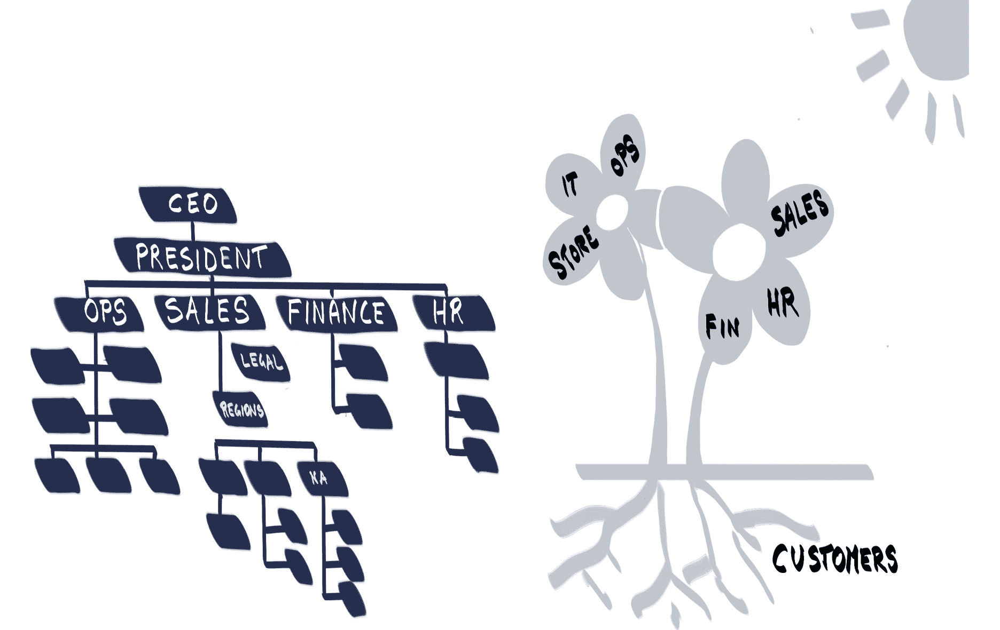
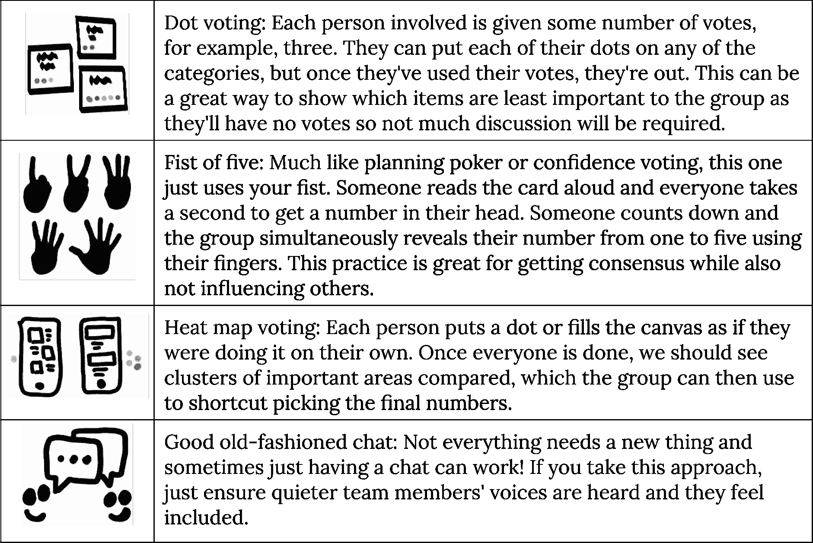
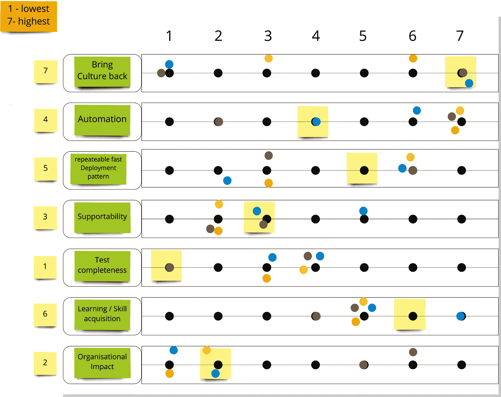

# 5\. 开放环境与开放领导力

在前一章中，我们探讨了开放文化的含义，以及如何使团队从基础开始构建这种工作方式。

当我们谈论赋予授权、自我组织和自主指导的团队时，许多热心者会说，管理应该只是走开并消失！有些人会说，如果团队真正获得授权，那么他们显然不需要被管理，也不需要经理。

在这里，区分领导力和管理至关重要。我们希望团队能够自下而上地管理组织，领导者则制定方向和意图，促使整个组织表现出这种行为。这就是像红帽这样的开放组织的领导方式。

*吉姆·怀特赫斯特*，前红帽公司 CEO，将开放组织定义为*一个能够积极参与社区内外的组织*——更快地响应机遇，获得组织外部的资源和人才，并激励、激励和赋予各个层次的人们行动责任感。

他的下面的图解明确了传统组织从上而下管理和开放组织从下而上领导和组织的区别。

图 5.1：传统组织与开放组织的差异

那么，在所有这些中，领导的主要角色是什么？领导可以通过什么方式在学习型组织中实现持久变革？我们将通过首先看看柯达的案例研究来探讨这些问题，柯达公司是发明个人摄影但最终错过了数字革命的公司。我们能从中学到什么教训？在*改变组织*部分，我们将发现领导可以通过将决策权下放到信息源头来实现更好的执行。然后我们将学习如何使用优先级滑块和强制排名来帮助我们确定我们可以集中精力的地方。在最后的*空间*部分，我们将探讨为我们的团队创造适宜的物理环境。

## 柯达问题

你并不需要成为 CEO 或商业管理顾问，才能理解每个人都能通过分享不同组织的故事以及它们在快速变化的世界中成功或失败的教训。公共公司的寿命在过去 50 多年中显著缩短了。1 这是为什么？历史上有很多组织未能适应不断变化的客户需求的例子。让我们更详细地看一看可能是其中最著名的这些故事，了解究竟出了什么问题。

东曼柯达公司发明了个人摄影。直到 20 世纪初，拍照是需要进入摄影棚由人来拍摄的。柯达将这种极好的用户体验以*盒子*的形式售出，价格仅为 1 美元——说实话，真的不算多。真正的利润来自于处理胶片并制作照片，这通常需要一到两周的时间。到 20 世纪末，柯达已经作为一家公司和品牌取得了巨大的成功。

然而，他们错失了一个机会——到 21 世纪初，数码摄影开始崭露头角。柯达在数码领域有所涉足，但他们认为摄影是一项*化学过程*——赚钱的方式一直是通过化学处理胶片。当他们意识到市场已经发生变化时，已经为时过晚。日本和亚洲崛起的科技巨头在数码技术上远远超过了他们。柯达于 2012 年 1 月申请了第十一章破产保护。

你知道吗，有一个名叫 Steve Sasson 的人发明了电荷耦合器件（Charged Couple Device），这为他的另一项发明——数码相机奠定了基础。猜猜看——他曾在柯达工作！

没错。1975 年，他发明了数码相机，但当时他的上司却将其埋没——他们说没人会想在电视上看自己的照片。Steve 还在 1989 年发明了第一款数码单镜头相机，但当时柯达的营销部门认为推出该产品会干扰他们的胶片处理业务——因此这项发明也被埋没了。

图 5.2：1976 年数码相机专利图

现在，柯达凭借其数码专利赚取了数十亿美元；然而，这些专利在 2007 年到期。公司根本无法足够迅速地转型，改变其竞争对手通过数码技术所提供的客户体验，最终在 2012 年申请了破产保护。

1 [`www.amazon.com/Creative-Destruction-Underperform-Market-Successfully/dp/038550134X`](https://www.amazon.com/Creative-Destruction-Underperform-Market-Successfully/dp/038550134X)

这为我们提供了一个很好的例子，说明了持续学习、持续措施和持续转变的渴望的重要性。

## 向历史学习

我们可以从柯达的故事中汲取许多教训：

+   组织必须适应客户需求的变化。

    这说起来容易，做起来难。人类的理解和认知深受我们的文化信仰和成长背景的影响。我们看到的与别人看到的往往不同。在某些方面，这就是柯达的遭遇。他们的背景和公司历史源于化学工程角度；实际上，东曼化学（从柯达分拆出来的公司）今天仍然是一家非常成功的公司。当时，柯达的管理层无法看到数码摄影所代表的用户体验的变革性变化。

+   柯达的故事告诉我们，创新性变革可以来自组织内部的任何地方。

要让内部视角成功地作为商业战略推进，领导层通常需要从不同的角度来看待问题。旧有的命令与控制结构本身也需要改变，以便更好地鼓励和拥抱创新性变革。

## 开放领导力

*Shabnoor Shah，开放领导力全球负责人及开放创新实验室教练*，向我们解释了开放领导力如何在数字化转型的世界中成为一种崭新且富有变革性的领导方式。领导力的基础源于开源的思维、工作和行为方式。

开放领导力的一个独特方面是，因为它实质上是一种心态和存在方式，它并不局限于等级结构中的高级管理层。任何人、任何级别的员工都可以实践开放领导力。然而，当领导者以开放的方式领导时，其影响是显著且可感知的，能够塑造一个开放、积极和进步的组织文化。其结果体现在员工的幸福感、福祉和参与度、客户满意度以及公司整体的盈利能力和成功上。

开放领导力和开放组织的指导原则包括透明性、包容性、合作、社区和参与、适应性、优胜劣汰以及早期和频繁的发布。开放领导力心态（在红帽公司）的核心信念是：*默认开放，因为开放是一种更好的方式*。这一理念由四个支持性信念支撑：每个人都有所贡献，每个人都有未被发掘的潜力，每个人都有责任领导，且当我们（所有人）把组织放在首位时，大家都会受益。

## 改变组织

组织架构图通常是自上而下的等级结构，它们无法告诉你公司本质或其互动方式。让我们重新绘制我们的组织架构图，看看能否更好地呈现可能发生的互动。我们的客户被描绘为我们的根基，是支撑整个组织生存的基础。接下来，我们将不同的业务单元画作花瓣，利用业务流程互动以实现各自的目标。公司总裁被描绘为一朵雨云，俯视着公司，保护着组织免受外部董事会和利益相关者的影响，而外向的公司面孔则由 CEO 代表。

图 5.3：重新思考的组织架构图

人类是生物有机体。组织也应被视为有机体，而不是仅仅由组织架构图构成的产物。这是有道理的——组织是由其员工构成的。因此，当我们观察组织如何变化时，我们应该问一个问题：*人类如何经历变化*？如果大多数人会觉得变化令人不安，那是什么促使一个人经历变化，而不是接受现状？

当人们感到不安、不满或不满意当前的情况时，他们才会做出改变。同样，处于压力中的公司也会被迫实施变革以求生存。值得注意的是，当将本书中描述的实践付诸实践时，会感到*不舒服*。团队成员经常会形容这些变化为*困难*和*难以实现*。这其实是件好事！变革是困难的。公司（就像人类一样）需要拥抱创造力才能创新——从而为他们的付费客户提供出色的体验。一次成功的转型不是仅在某段集中的时间内发生，之后没有任何变化。将创新变革作为一种持续运营的方式来拥抱，才是挑战所在。

## 领导可持续的变革

组织内部的变革如果没有资金和高层支持，是无法持续的。柯达未能培养和实施内部涌现的伟大想法。在一个组织内，正是组织领导者制定了大家必须遵循的游戏规则。重要的是，领导者设定了团队必须在其中运作的环境和背景。这就像*农耕类比*。要成为一名成功的农民，你必须为作物的生长创造一个合适的环境。组织领导者必须创造正确的条件，让创新转型蓬勃发展，成为常态。在最近的一次演讲中，我们听到*西蒙·塞内克*，这位英美籍作家和励志演讲者说道：“有一个事实是无可争议的——你的客户、利益相关者和员工都是人。你不能领导一家公司，你能领导的是人。”

通常并不清楚，领导者必须冒险改变当前的工作方式。往往这种风险也是领导者的职业风险。他们将自己的职位置于风险之中，去接受变革。因此，首次或初步的改进决策必须谨慎做出。变革不能过大，以免带来组织失败的风险，同时也必须具有意义，才能让客户和利益相关者感受到真正的商业影响——你的产品交付时会让人发出*哇*和*啊*的赞叹。

这些听起来在你曾工作过的组织中熟悉吗？

+   我们在组织内部有许多不愉快的孤岛。

+   我们是一个团队，但有许多部落。

+   存在过多的交接。

+   责任过少。

+   我们有不对齐的激励机制。

+   我们因为失败而受到惩罚。

+   我们有一些自尊心强、不愿分享的人。

+   存在变革障碍——这就是我们一直以来的做事方式。

如果你认同这些，它们都是需要高层支持才能改变的特征和特点。领导层的职责是：

+   创建一个共同的目标和愿景。

+   允许*改变规则*。

+   消除不必要的看门人和障碍。

+   鼓励那些*完成工作的行动*。

+   下放决策权。

+   展示透明的沟通。

+   打破部门之间的壁垒。

+   从整体上衡量系统。

+   让*变革*成为每个人的工作。

+   根据组织成果的交付而非流程遵循来评估价值。

+   帮助建立一个在业务与技术之间存在信任的工程圣地。

+   通过指标和数据展示结果。

+   鼓励团队拥有完整的工程堆栈。

+   将透明度融入整个开发过程。

+   冒险开始第一次变革。

这是一个长长的清单。在接下来的部分中，我们将通过借鉴潜艇舰长的一些建议，探讨如何带来这些特质！

## 实现卓越

在大卫·马尔凯特（David Marquet）舰长的书《*转变舰船*》中，2 他将领导力定义为*将卓越的能力嵌入到组织中的人和实践中，并将其与个性分离*。

### 赋予意图

在书中，他谈到自己作为核潜艇舰长的经历，以及他们如何学会不跟随领导进入灾难性的局面。他发誓再也不会发出直接命令，而是设定意图。与其给出指令，不如给出意图。军官们不再一直请求许可，这意味着心理上的归属感转向了他们。马尔凯特谈到了支持这一控制权赋予理念的两个支柱——技术能力和组织清晰度。

### 将决策移交到信息所在的地方。

将决策的权力移交到信息所在的地方，这意味着在软件领域，软件工程师可以决定何时发布软件，并在准备好时发布。做决定的最佳时机是必须做出决策的最后一刻。通过延迟决策，我们可以获得更多的机会来收集尽可能多的信息。通过这样做，你能比由中央领导做决定时，获得更快、更高质量的执行结果。

### 设置环境

对许多人来说，这可能是一个巨大的思维转变，但是在阅读马尔凯特的书籍并观看 YouTube 上的十分钟*卓越*视频 3 时（这是我们喜欢向客户展示，尤其是他们的领导层的另一个视频），这一切都变得非常有道理。这种心态为至少一个团队提供了独立工作并富有目的感的领导基础。我们将在书中稍后探讨这一心态的可扩展性。

3 [`youtu.be/OqmdLcyES_Q`](https://youtu.be/OqmdLcyES_Q)

2 [`davidmarquet.com/turn-the-ship-around-book/`](https://davidmarquet.com/turn-the-ship-around-book/)

*图 5.4*代表了在十分钟视频期间制作的草图，并包含了几个重要的讯息。

图 5.4：Inno-Versity 呈现：《*卓越*》由大卫·马尔凯特

如果你还没有观看上面制作图表的视频，请抽时间现在去观看。它充满启发性，提供了深刻的思考，并为本书接下来的内容奠定了领导力的背景。

### 我们（作为领导者）如何说服怀疑者？

*每家公司都是 IT 公司，无论他们认为自己在哪个行业 – 克里斯托弗·利特尔，软件高管，《DevOps 纪实》作者*

如果你不在 IT 领域，可以说，IT 常常被认为是*妨碍*组织商业目标实现的因素。正如《凤凰项目》一书中的 CEO 史蒂夫所说 – *IT 很重要。IT 不仅仅是一个我可以外包的部门。IT 处于我们所有重大公司努力的核心，它对日常运营的几乎每一个方面都至关重要。* 通常，组织中非 IT 的部分最难接受一种新的工作方式，而这种方式将他们与 IT 部门紧密合作，帮助推动提升客户成功的成果。

4 [《凤凰项目：IT 与帮助企业成功的小说》 – 吉恩·金, 凯文·贝尔, 乔治·斯帕福德](https://itrevolution.com/the-phoenix-project/)

## 公司里没有电脑！是 1990 年代，还是 1890 年代？

在 90 年代，我曾在一家软件公司工作，为伦敦的银行编写交易系统。我的合作伙伴则在一家传统的伦敦律师事务所的会计团队工作。她给我讲了一个我简直不敢相信的故事：公司里居然没有电脑。所有的业务都通过纸质文件处理，B2B 交易仍然通过传真机完成。我简直不敢相信居然可以在没有 IT 的情况下做生意！

你今天能想到类似的例子吗？不，我也想不出。

商业产品负责人和业务 SMEs 是支持我们跨职能团队的关键人物。他们的主要任务之一是代表并与所有产品利益相关者和客户进行沟通，并将这些对话和结果分享给团队。通过帮助团队决定应该交付的内容，尤其是应该避免交付的内容，产品负责人大大提高了客户满意度，因为最具客户价值的软件可以优先开发和交付。

通过成为跨职能团队的一部分，产品负责人能够共享有关编写和运营向客户交付业务服务的应用程序的技术挑战的理解。

最终，正是通过技术团队成员与非技术团队成员之间的协作和共享理解，我们才能让商业领袖与 IT 团队达成共识。通过成功交付客户和组织的成果，产品负责人可以向管理层展示成功，从而与技术伙伴共同承担 IT 挑战。

现在领导层正在支持并推动我们产品团队的工作，我们接下来将切换话题，来看看使用优先级滑块这一练习，它可以帮助我们团队优先排序最重要的产品领域或团队建设话题。

## 优先级滑块

优先级滑块是你工具包中一个非常棒且简单的工具！就像我们正在探索的其他许多练习一样，它们实际上只是一个帮助我们促进对话并推动共同理解的工具。我们使用它们来推动团队就某一时间段内应该采取的方向达成共识。

进行这个练习非常简单。只需要拿出白板的一小块区域，围绕你们的参与重点进行一些头脑风暴。它们可能包括以下内容：

+   **功能完整性**：在某个应用功能上做到 100% 完整有多重要？还是我们在各个功能区域之间寻找某种薄弱的联系？

+   **安全性**：我们知道安全性很重要，但我们现在应该投入多少时间来加固我们的软件呢？

+   **技能获取**：开心、积极的团队成员是伟大的团队。确保团队具备构建、运营和拥有其软件的所有专业技能可能非常重要。

+   **用户体验**：我们是在构建我们想要的东西，还是我们认为客户想要的东西？

+   **测试完整性**：总会有一些测试。我们现在自动化这些测试有多重要？还是应该从一开始就专注于测试自动化？

需要强调的是，这些话题不是产品功能。它们是产品领域或团队建设的主题，缺少它们我们就无法做出优秀的产品。例如，也许你希望通过你的应用推动更多的销售，因此你决定实施某种形式的推送通知，将客户直接引导到你的应用。推送通知并不是你会添加到优先级滑块中的内容，但也许市场渗透率可以。这一话题可能包括一些额外的功能或你可以执行的实验。最好事先准备好这些例子，并确保团队在开始之前清楚每个滑块项的含义。

有了这些清单之后，拿出便签和记号笔，将它们写成一列。例如，假设我们使用上面的五个标题。现在，我们需要为每个标题列出一个从 1 到 5 的数字比例。你团队正在优先排序的项目越多，比例就会越高。

图 5.5：优先级滑块

有了比例尺后，团队需要决定相对于其他项目，哪个项目是最重要的。优先级滑块的关键是没有两个项目可以占据相同的优先级——所以如果 5 是你的最高优先级，那么用户体验和安全性不能处于同一水平。每个项目必须与另一个项目进行权衡，因此有些团队将这个练习称为使用 *权衡滑块*。

图 5.6：优先级滑块——协作实践

在上面的图片中，我们可以看到一个团队正在讨论一个正在进行的优先级滑块环节。作为团队，尝试决定如何强制排序选项，往往能引发很多有意义的讨论。下面我们可以看到两组完整的滑块。每个人都必须就“1”或“10”哪个是最高优先级达成一致，这一点非常重要！

图 5.7：优先级滑块示例

一个团队达成共识的方式有很多种——他们可以就每一项进行传统的讨论，并逐一达成一致。对于某些团队，这种方式可能很有效，但对于其他团队，采用更正式的方法可以确保所有人都能参与进来。以下是一些建议：

表 5.1：鼓励利益相关者参与的方法

完成的画布可以帮助我们了解即将到来的优先事项。这些优先级可以设定为几周或更长时间，但像所有的实践一样，这不是一次性任务！它应当在任何一个领域的工作完成后回顾，检查是否足够，或者我们的优先级是否发生了变化。

优秀的产品负责人和敏捷教练可以将优先级滑块带到迭代计划会议中。当决定哪些内容应该进入迭代，哪些内容应该省略时，能够通过参考画布来加快决策，可以节省时间。像所有这些实践一样，始终保持其可视化非常重要，当然，当大家都在同一个房间时，这会更容易实现。当然，仍然有很好的方法可以与分布式团队一起进行优先级滑块环节，我们接下来将讨论这些方法。

### 与分布式人员一起使用优先级滑块

如果你有一个好的数字白板工具，并且所有需要参与优先级滑块的利益相关者都通过视频会议工具连接，那么进行这项练习相对简单。我们提供了一个有用的模板，你可以从本书的 GitHub 仓库下载并在你喜欢的工具中使用，比如 Miro、Mural、PowerPoint、Google Slides 等。

图 5.8：分布式人员使用的数字优先级滑块画布

当墙上有滑块，大家都站着并且需要添加自己的点时，环境非常适合对话和合作，大家都会不由自主地参与进来！而在视频通话中，有些人可能会消失，不参与进来。所以，强有力的引导非常重要。采用像**1-2-4-all**这样的解放性结构，将有助于从一开始就获得参与。**1-2-4-all**是一种简单的引导技术，首先要求个人独立并私下提供自己的意见或看法。然后，他们与另一个人配对，讨论并合并他们的想法。接下来，两个小组聚集在一起，汇总彼此的想法，最后全体成员聚集在一起，整合所有输入。

你可以通过访问 [openpracticelibrary.com/practice/priority-sliders](http://openpracticelibrary.com/practice/priority-sliders) 页面，了解更多并合作实践优先级滑块。

图 5.9：用于分布式人员的数字优先级滑块示例

无论我们是在实体空间还是虚拟工作空间中，本书迄今为止介绍的所有实践（包括优先级滑块）都需要一个良好的空间来组织，以便团队进行有效合作。

## 空间

帮助领导为团队建立坚实基础的一个重要方面是为团队成员找到一个合适的工作空间。

在上一章中，我们探讨了动机、自治、掌握和目标的重要性。物理工作空间是一个重要的支持因素。优秀的团队在优秀的空间中工作。

当我们举办开放创新实验室驻留项目时，我们会在我们自己的实验室中进行，这些实验室是专门为这种工作方式设计的。通常，这是我们客户驻留者最关注的问题之一——他们表示自己的建筑并没有为这种工作方式做准备，并且会遇到许多来自设施、安全、健康与安全等部门的障碍。我们旨在利用在实验室中的时间*向*领导者和利益相关者展示，这种工作方式能够带来多少参与度、活力和价值，以及物理空间在其中所起的作用。

我们根据一系列最佳实践和从全球、常设开放创新实验室设施建设中获得的经验，以及构建临时*快闪*团队空间的经验，提出了一些空间建议。*Val Yonchev，开放创新实验室 EMEA 负责人* 和 *Mike Walker，全球高级总监，开放创新实验室* 在他们为开放实践库提供的贡献中，提供了大量的思路领导，您可以在 [openpracticelibrary.com/practice/team-spaces/](http://openpracticelibrary.com/practice/team-spaces/) 阅读。

让我们来看几个例子。首先，下面这张图片中的实验室空间非常开放。没有任何隔断或墙壁分隔。它非常灵活，所有的桌子、椅子、显示器，甚至是可移动的植物都可以自由配置！

图 5.10：开放式工作区示例

开放式工作空间光线充足，理想情况下有一些自然光，桌椅在房间内合理分布。墙面空间也非常宽裕，适合放置各种信息展示板。

图 5.11：有大量墙面空间的开放式工作区

信息展示板应易于访问，并在团队成员的视线范围内。如果团队成员不能定期看到这些信息，那么这些信息的存在就毫无价值。

图 5.12：工作可视化的示例

最重要的是，空间应该尽可能促进对话和合作。

图 5.13：为配对和集体协作设置的可配置工作空间

我们需要在空间上投入多少资金，最重要的是什么？

### 最小可行空间

我们经常被问到的是，是否需要在空间上投资数万美元，按照例如《开放实践库》文章中概述的内容，先把所有东西准备好，才能开始让团队在这些空间中工作？答案是否定的。尽管我们希望所有团队都能拥有完美的空间，但现实是，要实现这一目标有很多障碍和挑战。采用敏捷方法，逐步建设团队空间并应用持续改进，同样有效，而且可以让团队参与到这个建设过程中。

团队的最小可行空间是一些没有隔断的开放空间和一些墙面空间。为了绕过墙面空间的问题，我们的一些客户通过购买 25 块泡沫板（每块 4 英尺×8 英尺，厚度 5 毫米）来解决这些问题。这些板非常便于搬运，可以靠在家具、墙壁、窗户上，或者用磁铁悬挂在天花板上等。我们喜欢称它们为“便携墙”！

我们的客户对于引入巨大的泡沫板的想法有何反应？我们来看一个近期的例子。

## “我们理解你们想做什么，明白原因，我们会帮助你们实现目标”仅用 4 周时间

我在客户的临时空间内领导了一次实验室驻地活动，客户是一家国际石油和天然气公司。可以理解的是，安全和健康问题至关重要，我们意识到定制家具和可移动板的审批不会很快通过。

所以，我们采取了只使用便携设备的方法。我们带来了上述提到的泡沫板、几卷静电魔术白板、几盒便签纸（这些便签纸仅能贴在我们的板子或魔术白板上），还有一台投影仪。

这意味着我们把空间从以下样子转变为：

图 5.14：传统办公室空间

如此：

图 5.15：现有空间迅速转变

在不触动任何设施、家具、不移动任何家具，或不在墙壁或窗户上固定任何物品的情况下。

它为我们提供了足够合适的团队工作环境，帮助一些快乐且充满活力的团队实现目标：

图 5.16：通过临时空间促进协作

在四周的合作结束后，我收到了现任 CIO 的反馈。他说，安全团队全程关注了这一过程，并且从最初的*不行，你们什么都不能做*的心态，转变为*我们理解你们想做什么，明白原因，我们会帮助你们实现目标*。

你可能在看上面的图片和示例时会觉得，大家在同一时间待在同一个空间里是不可能的。我们常常继续探讨这样的说法，因为我们非常看重共驻办公和充满可视化以及信息辐射的工作空间的价值。当然，随着我们最近经历了 COVID-19 大流行，这种物理空间上的限制对大多数人来说确实变得不可能，而我们都已经转向使用虚拟空间。

### 虚拟空间

在本章和前一章中，我们探讨了个人实践，并给出了一些关于如何在分布式团队中运行这些实践的想法和指导。对于虚拟协作和分布式团队，通常没有需要考虑的物理空间。我们面临的挑战是，没有创造出足够的自主性和心理安全空间，无法促进良好的协作，这本身就是一个风险。

我们仍然需要考虑和投入的两个空间是：

+   首先是每个人的空间。在前一章中，我们解释了如何*辐射一切*，即使在虚拟环境下，个体也需要良好的空间，多个显示器、可以作为构建显示器使用的平板电脑、他们自己的墙面空间等等。前期投入时间和资金，为每个团队成员配备合适的工具，将为整个团队的成功奠定基础。

+   其次是数字空间。这通常意味着在强有力的工具上进行投资，现在有越来越多的供应商提供支持。我们的建议是，思考所有在物理空间中效果良好的实践和工作方式，并找到一款或一套工具，能够模拟这些实践。所以，如果你使用燃尽图的实践，找到一种方式在数字环境中实现（比如 JIRA5）。如果你有一个大家一起工作的产品待办清单，可以使用一种工具来管理（例如 Trello）。如果你们经常合作时，会移动便签纸并进行标注，找到一款支持这种操作的工具（例如 Miro6 或 Mural7）。不要只停留在一个工具上，也不要一开始就决定使用哪个工具。采用敏捷的方式，鼓励人们进行实验并赋能实际使用工具的人。

    5 [`www.atlassian.com/software/jira`](https://www.atlassian.com/software/jira)

    6 [`miro.com/`](https://miro.com/)

    7 [`www.mural.co/`](https://www.mural.co/)

突然间，空间变成了这样：

图 5.17：数字化墙面

你可以看到物理空间和数字空间之间的区别，如果你在这两种环境中都工作过，你会知道它们在感觉和能量上的不同。它们非常不同，我们已经了解到这两者各自的好处。虽然虚拟工作空间无法提供你在 360 度周围所能拥有的相同文化、能量和多维可视化，但它确实为你提供了无限的空间。你不会用尽墙面空间。不使用成千上万的便利贴也有环境上的好处。从世界另一端邀请主题专家来审查和评论你团队的协作活动变得更加容易且便宜。你的安全和审计人员也可能会因使用这些数字工具而感到更加放心。未来几年，虚拟和物理空间是否能够共存，是否有一方会成为常态，或者它们是否会融合成某种混合体，将会是非常有趣的议题。

## 结论

在本章中，我们进一步探讨了“开放”意味着什么，特别是重点介绍了开放领导力和开放空间的引入。《第四章 开放文化》中介绍的开放文化实践帮助团队变得自主并能自我管理。领导力在创建促进和支持这种工作方式的环境中起着重要作用。

我们强调了领导力在为团队建立一个稳固的基础时设定意图的重要性，这个基础将支持团队的产品发现和持续交付。这对于 DevOps 文化的成功至关重要。当我们进一步深入本书，探讨技术实践以及像 OpenShift 这样的平台如何交付持续的商业价值时，我们需要我们的团队拥有一个强大的文化基础，这个基础由开放领导文化支持，并推动自上而下的开放组织行为。

我们观察了一些强有力的开放领导力的例子——及时决策、协作优先级滑块，以及它们在帮助找到适合团队的工作空间（无论是物理空间还是虚拟空间）中的作用。

我们探索了设计团队空间时需要考虑的一些主要推荐因素，以及开始团队工作时，在开放、协作空间中与信息辐射互动的最基本需求。

图 5.18：在基础上增加更多开放文化实践

通过本章和上一章所采用的心态和实践，我们建立了一个强大的文化基础。在下一章中，我们将探讨基础的另一个方面——技术实践和技术环境，以及我们为在开始产品开发之前建立强大的技术基础所做的工作。
