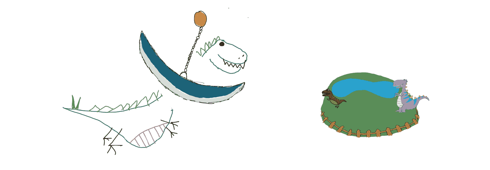

# 6. 开放技术实践——开始，正确起步

到目前为止，我们已经讨论了支持我们发现、选项和交付莫比乌斯环的基础文化和协作实践。接下来的两章将建立团队应实施的技术实践，以使基础更加牢固。

把莫比乌斯环想象成一个从发现到选项生成再到交付的引擎。这个循环通过更多的交付不断进行，直到我们需要重新审视我们所设定的结果。交付是我们将概念变为现实的过程。在交付的过程中，我们会学到很多，并从利益相关者和团队中获得反馈。某个时刻，我们将需要重新审视循环中的发现环节，调整我们所知道的内容或重新对齐我们接下来要交付的内容。


图 6.1：莫比乌斯环

假设我们已经完成了一次迭代并为我们的产品构建了一些新功能，比如我们为 PetBattle 应用程序增加了一个排行榜——很可能我们会觉得可以展示并发布这个功能，而不需要投入时间和精力来建立一个扎实的技术基础。但是随着迭代的继续，应用的复杂性增加，我们可能会发现自己开始淹没在手动测试或技术债务中。当我们进行到第五或第六次迭代时，以前有效的做法很可能会开始崩溃，我们预测能做多少事的能力也会开始瓦解。这可能会让团队失去动力，并让人们对我们的产品或执行能力失去信心。在这个阶段失去信任是很难恢复的。

要成功地逐步构建软件，我们需要确保能够顺利且可持续地运作。不断的重写和修复将阻碍这一过程。

出于这些原因，我们必须通过一套基础技术实践来支持我们的交付能力，就像我们在协作和文化方面所做的那样。**配置即代码**、**基础设施即代码**，甚至**一切皆代码**等实践可以帮助确保团队的工作具有可重复性。确定团队如何进行测试并自动化测试，可以提高输出质量并简化缺陷管理。选择合适的开发工作流和工具将加快团队交付软件的能力，而不是把所有时间都花在管理工具上。

向基础中添加实践并不是一次性的活动。随着应用程序数量和复杂性的增加，重要的是通过新方法和更全面的实践来加强基础。

在接下来的两章中，我们将分享在基础层面实施的技术实践，这些实践帮助我们取得了最佳的成功。它们构成了基础的一部分，因为它们不是时间限制的实践；相反，它们是我们日常工作的一部分，不断进行。书中的后续部分，我们将探讨如何通过充分利用平台来加强这些实践，从而实现持续交付的可持续性和可扩展性。

在本章中，我们希望通过涵盖以下内容来正确开始：

+   **Green from Go!**

+   配对编程与集体编程

+   容器原生方法

+   管道：CI-CD²

+   一切皆代码

+   开发者工作流

## **Green from Go!**

**Green from Go!** 实际上意味着在开始新的工作时，以正确的方式为自己铺路。对我们来说，这意味着在编写任何应用程序软件之前，先确保所有基础软件组件都已启动并运行。这是我们另一个座右铭。就像**展示，而非讲述**一样，这个理念的核心是通过轻松的方式使事物达到可用状态并开始运作。

例如，选择我们想要用来自动化构建代码的工具，如 Jenkins 或 Tekton，或者选择如何管理机密或访问私密信息。**Green from Go!** 的目标应该很明确——清除障碍，赋能开发人员，让他们专注于做他们最擅长的事情——编写出令人惊叹的高质量软件，给最终用户带来愉悦的体验。

当我们开始任何新的软件交付任务时，我们总是确保完成工作的工具已经到位。我们会选择一些工具，帮助我们自动化代码的提取、编译，并将其交付到可以进行测试的环境中。这意味着所有工具都需要能够通过脚本或其他机制重新创建，这样我们可以轻松启动每次工作，并保持一致性，同时将每次运行的学习成果带入下一个任务。

**Green from Go!** 还将包括使用这些工具的任何参考应用程序或管道。这可能是一个简单的 AngularJS 应用程序框架，配有完整的构建过程，确保我们能够将代码交付给用户。这个过程的复杂性应足够低，以便团队根据特定需求进行演化。例如，一个团队可能希望在其管道中进行更多的非功能性测试，或者另一个团队可能想尝试一个新的酷炫测试框架。这里的优先级是，确保有足够的基础，以便在启动新工作时不会拖慢团队执行这些可重复任务的速度，而是让他们专注于编写新功能。

重要的是不要让工具包过于复杂——我们的经验是，当引入新团队使用加速器时，它可能带来的技术负担会导致一些团队成员不愿参与其中。为了让团队真正拥有并维护一个加速他们交付的工具，他们通常需要感觉到自己参与了构建过程。如果某样东西过于复杂，无法投入使用，它就变成了“布莱恩非常了解的东西，所以我不需要了解”。这种行为在团队中是危险的，因为它可能导致孤岛效应，破坏团队的集体所有权和责任。当构建系统出现故障或破裂时，那个了解这一切的人就会成为单点故障，恢复过程中的瓶颈。

在接下来的章节中，我们将探讨两种有助于建立集体所有权和理解的实践。

## 配对编程与集体编程

配对编程和集体编程帮助我们应对人们所称的**独角兽开发者**现象。这个现象在不同地区和公司有不同的名字，例如**英雄开发者**或**明星开发者**。但当我们看到他们时，我们都能认出他们。

对于那些不太了解的人来说；独角兽开发者是那种掌握所有知识却将其保留给自己的人。他们是写出最华丽代码的人，而这些代码通常是最难理解的。他们的脑袋里充满了所有的钥匙和秘密，包括所有的想法和知识。他们往往是产出大量新工作的那个人，以至于没有时间进行文档记录，这意味着当他们不在时，其他人无法继续工作。此时，你可能已经能够识别出你的团队是否有一个独角兽开发者；甚至这可能是你自己！


图 6.2：独角兽

那么，为什么我们会有独角兽的问题呢？

独角兽开发者是瓶颈，是失败项目的象征。他们是系统中的单点故障。当独角兽休假时，项目就会停滞不前。当出现问题时，独角兽必须介入解决问题，这意味着在他们忙于解决问题时，新的工作无法完成。

组织希望围绕其产品创建高效能的团队——他们希望拥有一整支**明星团队**。实现这一目标的一个重要理念是“集体学习，配对构建”：

+   配对编程是指两名工程师共同使用一台计算机来解决一个问题。

+   集体编程 1 是指整个团队共同使用一台机器来解决一个问题。

成对编程和集体编程能够促进更多的知识传递，并且帮助大家共同理解问题和解决方案的过程。

### 集体学习，配对构建

为了理解配对编程的不同，我们可以用一个类比。假设你是一个木匠，你看到了一把精美的摇椅。你从看到这件完成的作品中学到了什么？可能不多；你也许会看到一两个部件如何连接，但不会了解所有的连接方式。现在想象你和木匠一起组装和制作这些部件。你会体验到隐藏的部分、使用的榫接技术、是如何制作的以及它们如何连接的。你会发现拼接部件时遇到的问题，并理解它们为什么按照特定的顺序组装。当你在建造的过程中能退一步审视这件家具时，你能更好地理解整个创作过程。同样的道理适用于软件的编写和工程设计。配对编程能培养更好的程序员。

我可以听到那些怀疑论者在心里想，嗯，这听起来像是两个开发者做一个人的工作。对我来说，这并不具有成本效益……嗯，配对编程和集体编程有很多有趣的优势：

+   **团队成员的指导**：当新成员与其他人一起工作，解决与熟悉代码的人共同面对的问题时，可以很快跟上进度。分享技巧、窍门或快捷方式可以增加配对成员的技能深度。这种分享也能帮助初级开发者迅速提升。

+   **代码量减半**：当你要求一个组织让两个开发者共同解决一个问题时，通常的思维方式是“那是不是意味着只有一半的代码能写出来？”实际上，理想情况下，写出的代码甚至会更少！两个大脑共同解决同一个问题能写出更高效的代码，因此避免了过度复杂的代码。

+   **没有拉取请求**：配对编程意味着你必须与配对者分享你的思考过程。这种同步意味着代码在编写时就会被审查。通常，审查拉取请求的人太忙于编写自己的代码，他们只能给出非常表面的审查。当你进行配对编程时，你会在过程中进行审查，因此写出的代码更简洁、理解更深刻。配对编程时，你不会偷工减料，因为有人在看着你。

+   **团队凝聚力**：人类是社会性动物，我们总是进行交流和互动。配对编程和集体编程促进了这种互动。与其一个人戴着耳机坐在房间里忽视周围的世界，配对编程的开发者看起来更开心。进行配对和集体编程的房间会更热闹。快乐的程序员能写出更好的代码。

+   **知识留在团队中**：通过多个人共同解决同一个问题，理解和逻辑将会留在团队中。当配对成员自然地从任务到任务转换时，知识的深度将留在团队，而不是某个个体身上。这意味着，当假期或流感季节来临时，团队仍然可以保持工作进度，因为团队不会因为某个“独角兽”离开而失去关键信息。

1 由 Woody Zuill 倡导的一种相对较新的实践 – [`woodyzuill.com/`](https://woodyzuill.com/)


图 6.3：集体编程实践

在解决新问题时（无论是新的框架、新的语言，还是特别难的问题），我们都会聚集在一起。大家围坐在一台大屏幕电脑前，探索我们要解决的问题。我们围绕问题进行集体协作，直到跨职能团队确认他们已经掌握了足够的知识或拥有了解决问题的大致框架。然后，团队会拆分成小组，每组两人，从待办事项中提取任务并开始实施。


图 6.4：配对编程实践

集体编程和配对编程使团队能够跨领域学习。经验和专业知识的共享能促进更好的团队合作。像这样高效运作的团队可以持续并迅速地推动产品建设，专注于成果而非单纯的输出。

你可以通过访问 Open Practice Library 网站上的[`openpracticelibrary.com/practice/pair-programming/`](https://openpracticelibrary.com/practice/pair-programming/) 和[`openpracticelibrary.com/practice/mob-programming/`](https://openpracticelibrary.com/practice/mob-programming/)来了解更多并合作交流这些实践。

## 容器与容器原生

在我们能准确地定义什么是容器（提示：它们是 Linux 进程！）以及什么是容器原生之前，我们需要回顾一下历史，看看是什么推动了容器的出现。

### 容器的历史

如果你已经超过了某个年龄（超过 30 岁！），很可能你写的第一段程序涉及编译源代码，并将其与操作系统中的库静态链接。之后，计算机科学家发明了动态链接技术——这很好：你只需修补一个库，所有你写的程序在重新启动后都会自动采用该变更。当然，这也带来了新的问题——如何管理所有依赖。像 RPM 和 YUM 这样的打包技术被创建出来，以帮助解决在分发和管理 Linux 操作系统时的依赖问题。操作系统的发行版是一个协作共享和管理大量不同软件包的机制，最终围绕这些软件包形成的软件社区解决了实际问题。

当然，运行一个应用程序在一台物理机上没问题，但当你需要在多台机器上运行大量应用程序时，随着规模的扩大，这就成为了标准需求。虚拟化技术解决了如何在一台机器上以隔离方式运行多个操作系统的问题。实际上，云计算的主流形式就是在他人的硬件上运行虚拟机。

虚拟化基础设施解决了大规模运行应用程序的许多问题。然而，管理一大批**虚拟机**（**VMs**）所需配置的所有组件，导致了与配置管理相关的工具和技术的爆炸性增长。还有“虚拟机泛滥”的问题——大量虚拟机到处都是，占用了太多资源，且很难整体修补和管理。每个应用程序都是独立管理的，可能由不同的团队负责。为了减少每个应用程序之间的相互依赖，每个应用程序也被部署在自己的虚拟机中。为了控制虚拟机的扩展，这些虚拟机由基础设施和运维团队集中管理。团队之间的隔阂也因此形成！许多工具被创建出来帮助配置虚拟机。每个虚拟机都有运行系统进程和守护进程的开销，因此，许多精力被投入到构建工具上，帮助避免过度分配机器资源，从而节省成本。

对于开发人员来说，部署在组织内部的虚拟机（VM）用户界面并不特别具备自助服务功能。请求提供虚拟机的过程需要时间。工作流、票务和供应系统已自动化，以帮助加速此服务请求过程。然而，通过公共云服务，API 驱动的基础设施使得虚拟机的提供只需要几分钟，而且开发人员可以真正实现自助服务。不过，控制和虚拟机泛滥的问题仍然存在。

开发人员使用的应用堆栈仍然依赖于包含在虚拟机中的操作系统和库，这些虚拟机是与内核一起提供的（例如 libc、libssl）。并且开发人员通常不允许更改虚拟机配置，可能是出于安全性或稳定性考虑。这通常是基础设施或运维团队的责任。通常，虚拟机更新、修补和管理起来并不容易。基础设施或运维团队不清楚更新和重启一台机器会对他们支持的应用程序产生什么影响。

### 容器工作原理

人们常说，容器的发展历程是**进程隔离**的历程。容器的概念可能始于 1979 年的 chroot，随后在 2000 年代初期发展成了 BSD Linux 监狱，2004 年 Solaris 容器也采用了这一技术。2 Solaris 区域是一种技术形式，结合了系统资源控制和边界隔离。从外部来看，它们像虚拟机，但实际上并不是虚拟机。

2 [`www.section.io/engineering-education/history-of-container-technology/`](https://www.section.io/engineering-education/history-of-container-technology/)

运行大量工作负载的科技公司总是寻找节省资源和最终提高效率的方法。回到 2006 年，核心 Linux 内核中进行了多项与 Linux 进程隔离相关的技术增强。谷歌最初引入了一项名为“进程容器”的技术，后来更名为 cgroups。它旨在限制、计量和隔离一组进程的资源使用（CPU、内存、磁盘 I/O 和网络）。

2013 年，Docker 提出了一个解决容器依赖问题的新方案。将应用程序及其依赖项打包成容器镜像，导致容器的普及爆炸式增长。容器镜像被免费提供并通过容器注册中心在线分发，如[dockerhub.io](http://dockerhub.io)和[quay.io](http://quay.io)。

运行中的容器实际上只是具有额外保护和数据结构支持的 Linux 进程，这些数据结构支持内核中的进程。在单台机器上运行容器很容易；在计算农场中跨越成千上万个容器则是一个更加棘手的问题。于是，容器编排引擎登场，其中 Kubernetes 项目无疑是目前使用最广泛的。OpenShift 容器平台是一个结合了 Linux、Kubernetes 和容器技术的产品，允许企业在规模化环境中安全、可靠地运行容器。

当然，要获得真正的商业价值，仅仅将应用程序打包为容器并部署一个像 OpenShift 这样的 Kubernetes 平台是不够的。仅仅因为你构建了它，并不意味着所有用户会立即涌向该平台！使用受信任供应链的现代应用交付迫使你的团队采用新的工具和工作方式。新的行为方式是必须的。

使用容器后，开发者的用户体验发生了彻底变化。开发者现在可以自助服务他们的应用程序，而无需经过虚拟机的配置。当然，仍然有人需要配置平台！容器的配置和启动只需几秒钟到几分钟，而今天，借助专注于无服务器技术栈的支持，甚至可以在毫秒级别完成。

开发者可以轻松控制应用程序的打包、运行和升级，使用容器镜像即可实现。应用程序不再依赖于内核中打包的库版本。你可以将一个应用程序的所有代码和依赖项提取到一个容器镜像中。你可以同时运行同一个应用程序的多个版本，而不必依赖于内核中相同版本的库。

容器镜像的不变性还提高了应用程序的整体服务质量。团队可以确保在不同的环境中运行完全相同的容器镜像，比如开发环境和生产环境。为了能够在不同环境中运行这种不变的容器镜像，开发人员开始学习通过外部化应用程序配置，他们可以轻松地在任何地方运行相同的容器。应用程序配置管理现在作为容器部署过程和平台的一部分构建在其中。这使得**开发人员**控制的部分（他们的应用程序和配置）与**ITOps** 控制的部分（平台本身）之间的边界更加明确。


图 6.5：容器化提供清晰的边界

在多租户环境中，不同的用户组可以通过项目进行隔离，从而提高底层基础设施的利用率。在 OpenShift 中，内置了控制网络流入和流出、基于角色的访问控制和安全性等机制，以及开箱即用的指标、监控和警报功能。该平台支持将持久数据存储挂载到容器中。平台支持这些有状态的应用程序，以便当容器停止/重启或迁移到另一个计算节点时，持久卷也会随之移动。

在容器生态系统中，团队角色的划分与虚拟化基础设施不同。**InfraOps** 团队可以管理 OpenShift 平台及其支持的基础设施，而开发团队则可以自助服务来部署和运行平台上的应用服务。这是一种“设置好后就不干涉”的心态。当然，在达到这一目标之前，仍然存在需要讨论和达成一致的复杂问题。何时运行集群级别的服务和操作员，如何在管理业务应用服务级别变化的同时执行滚动平台升级，安全性、存储、高可用性以及负载均衡/网络问题通常需要每个人的参与。正是这些团队的汇聚和他们之间的 DevOps 对话，构成了当今现代 DevOps 实践的骨架。

你可以通过访问 [openpracticelibrary.com/practice/containers](http://openpracticelibrary.com/practice/containers) 页面来了解更多并与他人合作容器实践。

## 流水线 — CI、CD 还是 CD²？

*“流水线的工作是证明你的代码不可发布。”* – Jez Humble

好的——让我们设置场景，并先解决一些基本问题。我们如何将代码从笔记本上的单行文本转化为在生产环境中运行的容器中的应用程序？嗯，有很多方式，名字也各不相同！团队将软件的旅程称为流水线，但实现方式有很多种。

让我们暂停片刻，借助我们的朋友 Derek，DevOps 恐龙，来思考一下什么才是软件管道！

## DevOps 恐龙 Derek


在加入 Red Hat Open Innovation Labs 团队之前，我是一名在大型系统集成商工作的开发人员。那时，有人问我解释什么是管道——指的是我创建的某个构建自动化工具。问我的那位是位执行合伙人，他的技术知识非常有限。他想了解什么是管道，用简单的语言解释，让他能理解并在与客户沟通时使用。他的问题很基础，比如管道长什么样，应该做些什么？

在考虑如何以简化、易于理解的方式描述管道时，我一直在想，是否能用三岁孩子能理解的方式来解释——我应该可以解释给他听。因此，DevOps 恐龙 Derek 就这样诞生了。

### 先暂时忘记软件吧…

想象一下，暂时我们不是在构建软件。我们不是在配置 Jenkins、处理 Shell、Ansible 或任何其他自动化工具。让我们想象一下，我们在构建恐龙！大而可怕、坚韧、怪异、凶猛的恐龙，拥有很多锋利的牙齿！闭上眼睛，想象一下那个可怕的恐龙。也许你正在想象某种混合型侏罗纪公园恐龙。想想你想要构建的恐龙的部件——它有多少颗牙齿？多少只手臂和腿？当我想到我的可怕恐龙时，我会想到 Derek。️


图 6.6：介绍 Derek

那么，我们怎么知道 Derek 够大、够可怕呢？让我们从他的部件开始。首先，我们可能需要分析恐龙的每一个部件，快速检查一下，确保它们符合我们设定的标准。例如，我的恐龙有两只手臂和两只腿吗？它有足够的牙齿吗？如果一切看起来没问题，我们就可以把这些部件放进 Dino-Constructor 5000™ 里。

在完成 Dino-Constructor 5000™ 后，我们应该能够制造出我们的恐龙，Derek。


图 6.7：介绍 Dino-Constructor 5000™

### 我怎么知道我的恐龙够凶猛？

所以，我们有了一只恐龙。但记住，我们的目标是打造强壮、可怕的恐龙，既坚韧又健康。我们怎么知道 Derek 够强壮呢？嗯，我们可以让他通过一系列的障碍。让我们为 Derek 建造一个障碍课程吧。


图 6.8：恐龙障碍课程

我们将让他从一个攀岩墙开始，类似于你在军队电影中看到的新兵们所用的那种。如果他足够幸运地跨过了这个障碍，他将进入下一个障碍，在那里他必须像印第安纳·琼斯一样跳过一些尖刺！接下来，我们检查一下我们的恐龙有多健康；如果它能够在跑步机上快速奔跑，他就可以进入下一步。在这一阶段，它必须尽力游过去，躲避那些试图咬它的鱼。一旦通过这一关，也许它还得跳过一圈火焰。如果德里克足够能干，并顺利通过这些障碍，他就可以跑向他的围栏——然而，如果德里克不小心，他可能会被一直悬在他上方、威胁重重的摆动刀片挡住，就像马里奥关卡中的场景一样。任何时候，刀片都可能掉下来，直接把德里克挡住。假设德里克小心翼翼，最终进入了围栏，那里有其他的恐龙。


图 6.9：恐龙围栏

德里克现在可以和其他恐龙一起在恐龙宠物园里度过余生，和丹尼、黛比一起生活。然而，不幸的是，黛比这只恐龙对德里克相当刻薄。她总是抢走德里克喜欢吃的宝贵草和水（在这个比喻中，德里克是素食者！）。因此，为了给德里克提供必要的隔离和足够的资源，使他保持强壮和健康，饲养员过来，把他移到了一个新围栏里。

事实证明，德里克是动物园里相当受欢迎的恐龙，所以饲养员决定为他克隆出几个，并把它们都放进和德里克同一个围栏里。他在这里过得很开心，拥有生存所需的一切。


图 6.10：饲养员把德里克移到一个新围栏

### 但等等——我们在构建软件，而不是恐龙！

对不起打破这个幻想，但实际上，我们（遗憾的是）并不从事恐龙制造业。我们在这里是为了构建软件应用程序。我们刚刚对我们的恐龙所做的，就是我们在每次提交代码时对代码库所做的事情。我们构建代码，将其通过一系列的障碍，然后部署给我们的用户使用。这就是一个流水线，其实非常简单！

让我们更详细地看一下我们的恐龙流水线。在第一步，我们评估组成恐龙的各个部件——它的手臂、腿、牙齿等。我们会问一些问题，比如部件是否足够？每只手是否有三根手指？我常把这一步看作是流水线中的静态代码分析部分。在 JavaScript 世界里，这可能就像是对代码库进行简单的 lint 检查，甚至可能运行一些更复杂的工具，比如 SonarQube 来检查代码质量。Dino-Constructor 5000™代表了任何编程语言中的编译步骤。

我们为 Derek 构建的障碍赛道代表了我们应当采取的步骤，以进一步评估我们的代码质量。Derek 必须跨越的初始障碍可能代表一些单元测试。重要的是，这些障碍应该具有足够的挑战性，同时又不能太简单，否则就没有价值。例如，如果 Derek 能轻松越过攀岩墙，那么这可能并没有全面测试他的各个方面。假设我们决定给 Derek 添加一只额外的手臂。现在我们有了一个可怕的三臂恐龙！如果我们让他再爬一次墙，他会发现比以前简单得多。在这个方面，增加难度是很重要的，可能需要加大缝隙的宽度或让墙更陡峭，这样才能提出更多的挑战。回想代码，逻辑也是一样的。当我们向应用程序中引入新功能时，我们需要提升测试覆盖率，以包括这些新功能。编写测试并非一次性工作，它必须随着应用程序的开发不断演变。

其他障碍代表了额外的测试类型。Derek 必须游过的小食人鱼池可能代表一些早期的集成测试。他必须跑的跑步机可能是一种性能测试。Derek 必须通过的最后一个障碍是悬挂在他头上的巨大刀片。这个障碍一直悬而不决，在我看来，往往是最容易被忽视的测试类型。Derek 可能会以为自己已经自由，朝着围栏跑去，结果刀片突然落下，意味着他无法继续前进——这就是安全测试的一个例子。通常在最后一刻才被想到，但在许多情况下，它可能成为最终部署的“拦路虎”。



图 6.11：移动到新围栏时未能通过测试

一旦 Derek 到达恐龙围栏，他必须与其他恐龙共享空间。也许此时，代码已经部署到公共云或虚拟机中，并且资源在竞争中共享。希望到此时，运维团队已经注意到应用程序内存不足或计算资源不足。为了解决这个问题，团队可能会自动化应用程序的容器化。一旦代码进入容器，它就变得可以发布。我们可以在云服务提供商之间甚至仅在环境之间移动容器。在这一阶段，代码已经与其运行所需的所有依赖项一起打包。这种无需重新构建和测试即可移动代码的能力，通过构建不可变容器镜像可以安全地实现。将应用程序配置与已构建的软件版本分开，使我们能够轻松水平扩展软件，基于用户需求运行更多的实例。

### 关于构建恐龙的最终思考

所有这些测试类型都可以并且应该作为软件管道的一部分进行自动化。在每个应执行构建、测试和部署的自动化过程中，代码应该检查每个后续步骤是否成功。通过这个过程，团队可以更快地交付新功能。团队可以在不担心回归问题的情况下引入新代码。像 Red Hat OpenShift 和 Kubernetes 这样的容器平台可以确保应用始终处于期望的状态。这些平台还可以用来运行我们的软件管道，使用构建工具如 Jenkins 来运行各个阶段。通过动态提供测试工具，如 Zalenium 执行浏览器测试，以及使用 Jenkins 构建，使得创建管道变得可重复和可重用。

通过自动化管道中的所有步骤，我们最终能够更快地将开发和运维团队的出色成果交到用户手中。

多亏了 Derek，我们现在知道管道是我们用来构建、打包、测试和部署软件的一系列步骤。现在，让我们来看一些描述软件交付管道时人们使用的术语。

### 持续集成

**持续集成**（**CI**）是一种软件开发实践，最初由极限编程的作者推广。虽然关于它已经有无数的书籍问世，但最简短的定义有时恰恰是最简单的！CI 的三词定义就是“持续集成代码”。也就是说，开发人员和团队应该定期将他们的代码提交并推送到仓库，并有一些自动化过程来编译、打包和测试这些代码。这个过程应该频繁发生——为了达到最大效果，每天进行多次。


图 6.12：持续集成

更多团队在这个 CI 难关上失败的情况比你想象的要多。通常，团队认为他们正在实践 CI，但实际上并没有。

## 持续集成


几年前，我在一个安全公司做了一个 Labs 驻场。这个团队相当年轻，几个团队成员刚刚毕业。团队决定在编写代码时创建功能分支，以免破坏其他人的工作流程。不幸的是，这导致我们创建了这些在冲刺期间存在的分支。我们有很多自动化流程，当代码合并时会被触发，但我们合并的频率不够。

在两个冲刺周期中，我们每次都在冲刺结束前，紧急地将所有功能合并，以便进行每周演示——可以说是非常混乱！这导致了每两周一次的“迷你集成”。我们已经设立了大量的自动化来验证我们的代码，但我们并没有足够频繁地使用它。可以想象，这个过程根本不算是持续的——我们并没有进行持续集成！

为了解决这个问题，我们在回顾会上进行了讨论。如果你使用的工具（在我们的案例中是 Jenkins）能够提供构建频率或使用统计数据，那么这些数据可以是很有价值的信息，可以打印出来或带到回顾会议上。我曾与一位非常出色的 Scrum Master 合作，他总是这么做，这帮助团队在回顾会上专注于我们可以采取的实际行动，从而加快进度。在我们这个周期里，我们实行了每周一次的迭代。这意味着实际的开发时间只有四天！通过回顾会，我们根据提供给团队的数据识别出了一些可行的改进措施：

1.  **持续集成** – 这是我们的一次重大变化，尽可能频繁地将特性合并，并获得我们所需的验证，以避免在演示过程中遇到的合并地狱。

1.  **更小的特性** – 团队意识到工作被拆解成了过大的任务块，每个任务块需要花费大部分迭代周期才能完成。将每个特性的任务拆分得更小意味着我们可以更快地验证每个小任务是否可行。

你可以通过访问[openpracticelibrary.com/practice/continuous-integration](http://openpracticelibrary.com/practice/continuous-integration)页面来了解更多并参与持续集成的实践。

### 持续交付

**持续交付**（**CD**）是一种开发流程，在每次代码更改时，团队会构建、测试并打包代码，使其能够一直部署到生产环境。它以自动化的方式将代码交付到生产环境的门口，但并未真正部署到生产环境。许多团队能够达到这种状态，这本身是一个很好的目标，但通常由于组织发布节奏或需要额外批准，导致它们无法完全发布到生产环境。这里需要注意的是，如果有需要，它们是可以发布到生产环境的。


图 6.13：持续交付

## 建立对软件交付管道质量的信心


在我职业生涯的早期，当自动化测试和持续交付的概念对我来说还很陌生，而在一些行业里仍然处于前沿时，我曾为一家英国的大型零售商工作。他们采取了非常传统的软件部署方法，每季度最多发布一次版本。

部署对他们来说是一件令人害怕的事情——这通常需要一组专家团队在周日凌晨的黑暗时刻进场，开始他们的手动任务。他们会先停掉网站，放上一个临时页面，然后开始执行他们被要求运行的脚本。大多数情况下，这个过程是成功的，但有时在事情出错时，他们可能会遇到几天的停机时间！

这个项目的目标是为零售商建立一个移动渠道，以便他们与客户互动。我的角色是编写移动应用与电商平台之间的一些集成服务，并编写一套自动化集成测试。我们合作的零售商非常传统，因此他们的项目计划中包含了一个为期三周的时间块，在此期间将进行所有测试。零售商认为我们浪费时间编写自动化测试，并将分数展示在墙上供大家查看——他们确信三周的时间足够了！

我们的团队不愿等到最后才发现所有问题；他们希望在整个过程中得到反馈。我们在 Jenkins 中创建了一系列自动化任务，用于构建应用程序和 API，并将其部署到用户验收测试环境。这意味着，在测试团队参与之前的几个月，我们已经开始交付应用程序的修订版供他们测试。我们的自动化测试模拟了来自移动应用的用户行为，测试了正常路径以及所有已知的错误路径或悲观路径，通过不同输入参数调用 API。我们还获取了用户验收测试团队的回归测试脚本，这些脚本将被手动执行，并将其编码为一组测试，以执行相同的 API 调用。这让业务方感到兴奋，因为他们开始看到应用程序的不断演变。功能被逐步添加，问题也在内部展示时被修复。这对他们来说是一次全新的体验，因为他们习惯于只在最后才看到完整的结果。

项目结束时，业务方已经开始意识到我们编写的测试的价值。每次更改时，我们都自动化了移动应用的构建、部署到应用商店，并运行了一大套集成测试。他们继续在最后进行手动测试阶段，确实发现了一些错误（然后我们为其编写了自动化测试并修复了）。然而，当他们将此阶段发现的问题数量与其他类似项目进行对比时，发现问题明显更少。

在上线当天，团队已经准备好将应用程序推送到应用商店并完成 API 的最终部署。零售商将营销活动和其他事件与上线日期对接，所以压力非常大！团队一直在做小范围的应用修复，直到这一时刻。每次更改都需要业务部门批准发布，这意味着必须涉及到手动测试团队。由于发布窗口的压力，业务部门决定仅对应用程序进行快速的冒烟测试，以确认特定发布候选版本上的问题是否已解决。冒烟测试通过了，因此他们准备好进行发布——然而，我们的自动化测试在一个服务中发现了两个失败，该服务负责应用程序中的产品评论。这是由于在架构中更下层的记录系统中对数据格式进行了轻微更改，导致一些数据转换功能无法正常工作。手动测试团队没有捕捉到这一问题，因为他们并未测试此功能。我们标记出我们的测试发现了回归问题，发布因此暂停，直到解决该问题。

这看起来可能是一个微不足道的例子，但对零售商来说，这标志着一个重大转折点。他们亲眼见证了我们自动化测试套件的速度、可靠性和有效性，以及我们构建、验证并交付生产就绪应用程序的速度。编写和运行自动化测试的过程在更广泛的组织内建立了巨大的信任，促使他们彻底改变做法，转向更多的自动化和更多的测试自动化。

你可以通过访问[openpracticelibrary.com/practice/continuous-delivery](http://openpracticelibrary.com/practice/continuous-delivery)了解更多关于持续交付（CD）实践的内容并进行协作。

### 持续部署（CD²）

**持续部署**（**CD²**）是在持续交付（CD）过程中更进一步的做法，它将应用程序交付到生产环境，并最终交到最终用户手中。我将持续部署（CD）比作一列大火车——这列火车按照非常可靠的时间表运行。它将所有更改打包起来，将我们的代码库中的所有内容进行编译、打包、测试，并通过各个环境进行推广，确保在每个阶段都经过验证。


图 6.14: CI、CD 和 CD²

通过持续交付到生产环境，你可以加速将功能和修复交付给最终用户，相比于等待大型发布的“爆炸性发布”方式。更快速的交付促成了业务敏捷性——即响应客户和市场需求变化的能力，并更早从功能中获取反馈。开发者不再需要等待数周或数月，才能让最终用户尝试他们编写的代码。快速的反馈循环至关重要，应该投入时间和金钱考虑最好的工具，以支持这种快速交付。

## 完成工作后，就发布吧！


想到快速交付的能力，每个变更都能部署到生产环境中，我们必须设置好技术架构，让变更能够自由流动并充满信心。这需要团队周围的人，特别是领导层和产品负责人的强力支持，因为他们往往会阻止这种努力，认为过多的变更会对质量或最终用户体验造成伤害。这些观念通常来自于过去在交付失败时的糟糕经历。所以，这是一条双向街道——信任建立在团队能够出色执行的基础上。

我们合作过的最优秀的产品负责人之一是在一家欧洲汽车制造商那里。他们正在替换一款供经销商和维修工使用的知识库应用，用来诊断问题并订购零件。历史上，这款应用的更改工作外包给供应商，每个供应商都在自己的基础上进行修改。他们会聘请系统集成商添加新功能，但这样做往往会引入新的 BUG 或问题。这种外包开发意味着架构设计决策是由客户的产品团队之外的人做出的，最终导致技术债务，并且从长远来看是不可持续的。团队决定重新开始，重新构建应用，并将开发工作带回公司内部。我们受邀帮助这个团队以正确的方式启动，采用驻场方式，并帮助他们建立一个与最终用户紧密联系的产品团队。

在参与项目的多个冲刺后，尽管开发工作还处于初期阶段，团队正在为用户创建身份验证流程。我和一名工程师进行配对编程，我们编写了注销功能。我们编写了测试，并在我们的测试环境中向产品负责人展示了这个功能。团队一致同意的完成定义是：我们必须向产品团队的某个成员展示这个功能，以便他们接受。因此，就工程工作的进展来说，我们已经完成了。产品负责人进行了快速测试，测试环境中一切正常，于是，在冲刺结束时，我们将所有更改推送到生产环境，我们的功能也发布了。

当用户体验团队在对应用的最新增量版本进行可用性测试时，他们注意到注销功能在某个页面上出现了故障。这一问题被报告给了我和最初处理此事的工程师，我们立即发现了问题所在。这个问题很小，所以我们编写了另一个测试并进行了修改。

我们向产品负责人展示了这个过程——先编写一个失败的测试，再编写能让测试通过的代码，进行迭代，然后将修复后的注销代码交付到生产环境。能够在最终用户准备好接收时，将小的增量改进交付给他们，为持续交付铺平了道路。

这里的教训是，Scrum 可能会妨碍团队不断向生产环境交付小规模增量更改的能力，因为 Scrum 是在冲刺结束时交付的。“当工作完成时，直接将其发布到生产环境。”

我们已经了解了软件管道的作用，它将构建、打包、测试和部署我们的应用程序代码到不同环境（但不一定包括生产环境）所需的步骤进行了编码——即 CD 的实践。然后我们又看到了一个将小规模增量更改持续部署到生产环境的做法。

你可以通过访问[openpracticelibrary.com/practice/continuous-deployment](http://openpracticelibrary.com/practice/continuous-deployment)页面，了解更多关于 CD²的信息。

## 一切皆代码

你可能之前听说过这个： [插入软件术语]-即代码。

示例包括基础设施即代码、配置即代码、测试即代码，现在还有一切皆代码。这种做法已经存在很长时间了，但一些组织还没有迅速采纳。

问题来了——历史上，组织必须聘请昂贵的专家来部署复杂的环境。他们会花几个小时逐行阅读操作手册，最终才能让部署成功。几个星期过去了，组织想要创建另一个环境，完全像这个一样进行进一步的测试。现在该怎么办？打电话给专家，请他们回来，但这代价不小！如果你喜欢经常雇佣昂贵的专家，那倒没问题。

那么，解决方案是什么？一切皆代码的做法很简单：你将系统的每个部分都像对待其他代码行一样对待。你将其写下并存储在版本控制系统中，比如 Git。我们真的是要自动化系统的每个部分吗？是的。

我们从自动化基础设施层开始，这是最低层次的，从裸金属服务器到操作系统、网络、应用程序配置，直到应用程序部署。

这项自动化工作听起来像是非常繁重的工作，而且在人的时间成本上可能非常昂贵——为什么要投入其中呢？原因如下：

+   **可追溯性**：将环境描述和结构存储在版本控制系统中，使我们能够审核对系统所做的更改，并追踪到具体的执行人。

+   **可重复性**：从一个云提供商迁移到另一个云提供商应该是一个简单的任务。选择部署目标应该像是每周为最优惠的价格进行购物一样。通过将所有内容存储为代码，系统可以在不同的提供商中迅速重新创建。

+   **GitOps**：单一的事实来源意味着不再需要部落知识或专家来设置电缆或连接硬盘。

+   **凤凰服务器**：不再担心配置漂移。如果服务器需要打补丁或突然宕机，也没关系。只需使用存储的配置从头开始重新创建它。

+   **跨职能团队**：将一切写成代码有助于改善组织内各个部门之间的协作。开发团队能够为环境创建做出贡献，或者在沙盒中重建相同的环境。

+   **降低风险**：可以将更改应用到环境或应用程序部署中，并迅速恢复到先前的状态，从而降低任何类型的大规模升级风险。

有许多方法可以实现万物即代码：

+   **网络与基础设施**：Ansible 可以用来声明式地定义你正在实施的系统，Istio 则能帮助管理应用程序和服务之间的网络流量。

+   **应用环境**：容器化提供了一种经过验证的、可重复的方法，将应用程序及其依赖项打包，既满足开发人员的需求，也符合运维人员的喜好。

+   **开发者工作流/构建自动化**：使用 Jenkins 的 Pipeline as Code 或 Tekton 来描述你的应用程序是如何从源代码编译、测试并转化为可运行的程序的。

+   **配置漂移**：ArgoCD 是一个实现 GitOps 模式的工具，适用于你的应用程序及其支持工具。

+   **作为代码的测试**：以行为驱动开发形式编写的 Selenium 测试作为验收标准，可以让业务分析师和开发人员更紧密地合作。

+   **安全与合规**：Open Policy Agent 和 Advanced Cluster Manager 是在整个堆栈上强制执行策略的工具。

视整个系统为代码的团队更强大、更高效，也更优秀。我们不应该再仅仅考虑基础设施即代码，而是要自动化整个系统——从应用程序属性到网络和安全策略的所有内容。然后，我们将其编码化！

## 你能为我再建一个那样的服务器吗？


花时间自动化创建测试环境？“听起来成本高，浪费时间”——我能听到一些人心里在这么想。

在为英国的一位客户工作时，我在构建移动应用程序以及一堆 JavaScript 服务，用以提供优化过的、便于移动设备消费的数据。适配器的服务层部署在 IBM 的 MobileFirst（当时是 Worklight）上，这是一个庞大的 Java 应用，需要专家来配置和安装。我们有多个环境，从开发环境到系统集成测试环境，再到用户验收测试环境和生产环境。你能想象的所有常见环境，都在这个非常传统的生态系统中。

专家花了两周时间来配置和安装用户验收测试服务器。其中两个服务器被设置好，允许我们在任何给定时间同时进行多个测试。你想要第三个服务器吗？嗯，那就意味着要请回那位昂贵的专家来建立第三台服务器，并且再花上一周的时间。生产环境中我们有八台服务器，每一台都需要手动配置和部署！

当我回顾这次合作，思考我们面临的压力，要求在配置和部署服务器时所花费的时间，每个服务器所花费的时间，看起来真是疯狂。顾问会出现，花整天在终端上胡乱修改，并手动测试结果。当时的配置文件都没有存储在 Git 中，甚至没有转化为可以执行的脚本来加快下一个服务器的创建。所有信息都是口口相传的，保存在她的脑海中。如果我们想要第三台服务器？我们得雇她回来再做一遍！

几年后，在为一个公共部门客户服务时，我看到了类似的行为。我原以为这种创建服务器的方式只是一个局部现象，但在政府合同中，有些团队为开发人员创建了服务器，而这些团队没有使用任何脚本或自动化工具。如果你想要一台服务器，你需要提交工单并等待一周。如果你想要与那台服务器完全相同的服务器，你需要再提交一张工单，有时得到的复制品是完全相同的。在这种情况下，团队在每台虚拟机内手动执行 Shell 命令，并且常常忘记执行一两个命令！

这些例子现在可能感觉有些陈旧了——但现实是，我仍然看到一些组织采用传统的基础设施、自动化和可重复性的方法。无法在代表性硬件上测试变更，对那些想要快速发展的团队来说是一个挑战。团队需要能够按需启动和关闭应用堆栈。我们打包应用程序的现代方法，如容器，确实有助于打破这一壁垒。开发人员不再需要通过数据库调用来模拟测试案例，因为他们可以在容器中启动一个真实的数据库并进行测试。

你可以通过访问[openpracticelibrary.com/practice/everything-as-code](http://openpracticelibrary.com/practice/everything-as-code)页面，了解更多并与大家合作，关于“万物皆代码”实践。

那么，PetBattle 团队在实践“万物皆代码”时采取了什么样的方法？

## 为 PetBattle 建立技术基础

本节将介绍 PetBattle 的起步阶段，开发团队在尝试使用我们将在后续章节中讨论的工具来建立技术基础。像这样放在框中的部分将更侧重于技术方面。

PetBattle 最初是一些工程师的业余爱好——如果你愿意的话，它是一个宠物项目。这个项目为团队提供了一个真实的应用场景，让他们可以尝试新的框架和技术。为了将一些现代软件实践应用到 PetBattle 中，他们增强了应用的构建和测试自动化。随着 PetBattle 需求的增加，我们将考虑自动扩展以及如何借鉴开放实践库的做法，来确定我们应该如何构建这些东西。

对于 PetBattle，我们拥抱现代软件开发范式——我们监控并响应配置漂移，以便团队可以实施 GitOps 来监控这种漂移。我们的环境应该像凤凰一样，能够从灰烬中重生！换句话说，我们可以自信地摧毁它们，因为我们可以通过代码重新创建它们。

让我们来看看 PetBattle 想要部署的第一款软件——Jenkins。本节将探讨如何使用 Jenkins 在 OpenShift 上部署和管理 Jenkins。

PetBattle 团队正在使用 OpenShift 来部署他们的应用程序。他们选择使用 Jenkins 来自动化一些构建和部署软件的任务。Jenkins 是一个开源自动化服务器，可以运行许多任务，并且支持在 OpenShift 上运行。Jenkins 还有一个强大的社区支持，并且拥有一个庞大的插件生态系统，使得自动化几乎所有你能想到的任务都变得轻而易举！

现在我们已经建立了 PetBattle 的技术基础，接下来让我们更深入地探讨 Jenkins 及其在强化基础中的作用。

## Jenkins——我们最好的朋友！


我们喜欢把 Jenkins 当作我们的朋友。我们还记得曾经的日子，当时团队里会有人在本地机器上构建应用程序，然后通过电子邮件发送给运维团队。为了进行部署，通常会有一个专门的团队，在晚上进入并完成部署，以减少对日常工作的干扰。

部署曾被视为一项风险大、让人害怕的事情。有一次，我们合作的一个团队在一次大型部署前夕出去庆祝。当他们在清晨迷迷糊糊地来到公司时，他们的思维状态并不是最清晰的。正如你能想象的那样，在进行升级时，他们跳过了一步，导致了故障。我们之所以认为 Jenkins 是我们的朋友，是因为它不会做这种事。它不会在前一天晚上出去玩，第二天疲惫不堪地到达公司（当然，除非你忘记给它提供足够的内存和 CPU）。Jenkins 也不会忘记在脚本中执行某一行代码；它在这一点上做得很好。但它在其他方面也相当笨拙；Jenkins 只有你给它的指令有多聪明。Jenkins 的原始版本相对基础，因此我们为它赋予了额外的超级能力，能够使用代理来运行特定技术的构建，并通过插件以机器可读的方式报告测试结果。但一旦它完成了某个任务，它会一次又一次地重复执行，几乎不会失败——尤其是当你将它配置为代码时。

### Helm 概述

接下来的部分将更详细地介绍技术方面的内容。准备好一些代码片段和相关内容吧！如果这不是你的兴趣，随时跳过这部分，直接进入下一节，关于 Git 和开发者工作流的内容。我们会用这个方便的标志标记任何涉及代码片段和较低层次内容的部分！


Jenkins 已经与 OpenShift 一起提供，团队有多种方法来安装和配置它。跨职能团队的任何成员都可以去 OpenShift 控制台，从目录中安装它。只需在 UI 中点击几个按钮并选择是否添加持久硬盘即可。这是一个帮助团队快速启动的好方法，但也不符合我们一切皆代码的技术基础实践！

PetBattle 现在有两种选择，可以在遵循一切皆代码的实践下创建 Jenkins 实例。它们可以使用包含所有 Kubernetes 和 OpenShift 对象的 OpenShift 或 Helm 模板，这些对象是部署一个工作 Jenkins 所必需的。在本书中，我们将专注于使用 Helm 作为我们的 Kubernetes 包管理器。

Helm 是一个 Kubernetes 应用程序包管理器，使开发人员和运维人员可以轻松地将构成应用程序的资源和配置打包成发布版本。Helm 用于应用程序生命周期管理，包括安装、升级和回滚应用程序部署，从而简化了在 OpenShift 集群上安装应用程序的过程。在 Helm 中，应用程序被打包并作为 Helm 图表分发。一个 Helm 图表由多个 YAML 文件和模板组成。这些 Helm 模板在处理后应输出 Kubernetes YAML。让我们来看一个 Helm 图表的示例。

根据我们与客户在 OpenShift 上使用 Jenkins 的经验，我们编写了一个图表来部署 Red Hat 版本的 Jenkins，并赋予它一些超级功能。稍后我们将介绍这些功能。首先，让我们探索图表的结构：

```
jenkins
```

```
├── Chart.yaml
```

```
├── README.md
```

```
├── templates
```

```
│   ├── PersistentVolumeClaim.yaml
```

```
│   ├── buildconfigs.yaml
```

```
│   ├── deploymentconfig.yaml
```

```
│   ├── imagestreams.yaml
```

```
│   ├── rolebinding.yaml
```

```
│   ├── route.yaml
```

```
│   ├── secret.yaml
```

```
│   ├── serviceaccount.yaml
```

```
│   └── services.yaml
```

```
└── values.yaml
```

Jenkins 图表与所有 Helm 图表一样，由多个 YAML 文件组成：

+   `Chart.yaml`：这是我们的 Jenkins 图表的清单。它包含元数据，如名称、描述和维护者信息。清单还包括应用程序版本和图表版本。如果图表依赖于其他图表或图表，它们也会在这里列出。

+   `README.md`：图表的说明，包括如何安装它以及如何自定义它。

+   `templates/*`：此文件夹包含所有需要部署的资源，以安装和配置一个正在运行的 Jenkins 实例，如部署、服务、路由和 PVC。

+   `values.yaml`：这些是图表可以使用的合理（默认）值，用户可以直接安装图表并快速启动。可以通过命令行提供自定义值，或在安装图表时提供自己的 values.yaml 文件。

红帽**实践社区**（**CoP**）是一个基于与客户合作的经验和教训创建可重用软件的组织。然后，这些软件被开源并共享。我们可以添加 CoP Helm Charts 仓库，其中包含一个 Jenkins Helm 图表供我们使用。

首先，我们需要 helm 命令行工具。从你的笔记本电脑上，按照 `helm.sh`（[`helm.sh/docs/intro/install/`](https://helm.sh/docs/intro/install/)）网站上的说明来安装 helm 工具。然后按如下方式添加 Red Hat CoP helm 仓库：

```
helm repo add redhat-cop \
```

```
     https://redhat-cop.github.io/helm-charts
```

我们可以在这个 helm 仓库中搜索可以使用的 Jenkins chart 版本：


图 6.15：在 helm 仓库中搜索 Jenkins chart

### 使用 Helm 安装 Jenkins

获取你自己 OpenShift 集群的最快方式是安装 CodeReady Containers 到你的笔记本电脑上。支持 Linux、Windows 和 macOS。你需要登录并按照此处的说明操作：[`developers.redhat.com/products/codeready-containers/overview`](https://developers.redhat.com/products/codeready-containers/overview)，你应该能看到类似 *图 6.16* 的两步安装过程：


图 6.16：安装 CodeReady Containers

你可以访问的其他 OpenShift 集群也可以使用，只要你有足够的资源和权限。CodeReady Containers 安装为你提供集群管理员权限（最高权限），并且受限于你的笔记本电脑的 RAM、CPU 和磁盘空间。我们推荐至少 8GB RAM、4 个 vCPU 和 31 GB 的磁盘空间，这样的配置适用于在 Linux 上启动 CRC：

```
crc start -c 4 -m 12288
```

附录中有更详细的 OpenShift 配置说明。

为了安装 Jenkins chart，我们将登录到 OpenShift，创建一个新项目，并安装 Helm chart。如果你缺少运行这些命令所需的工具，不用担心，它们可以从 OpenShift 控制台直接下载并安装，以匹配你的 OpenShift 集群版本。点击 ? 图标，然后选择命令行工具，找到最新的安装说明。


图 6.17：从 OpenShift 下载命令行工具

安装后字符串 my-jenkins 是 Helm 模板引擎使用的发布名称：

```
oc login <cluster_api> -u <name> -p <password>
```

```
oc new-project example
```

```
helm install my-jenkins redhat-cop/jenkins  
```

它允许我们在一个命名空间中创建多个发布，这对测试非常有用：


图 6.18：在一个命名空间中创建多个发布

Helm charts 可以通过多种方式安装。你还可以针对 chart 的本地副本运行 helm template。如果你有兴趣这样做，可以获取 chart 并运行以下命令：

```
helm fetch redhat-cop/jenkins --version 0.0.23
```

```
helm template test jenkins-0.0.23.tgz
```

如果你想在将其应用到 OpenShift 集群之前查看输出，或者在调试或测试 chart 配置时验证内容，这会非常有用。你还可以在 helm install 命令中添加`--dry-run`参数来验证 chart，而不进行实际安装。

让我暂停一下，说明这本书并不是关于 Helm 的！市面上有很多专门介绍 Helm 的好书，比如 *Andy Block* 和 *Austin Dewey* 所著的《Learn Helm》([`www.packtpub.com/product/learn-helm/9781839214295`](https://www.packtpub.com/product/learn-helm/9781839214295))。我们的目的是仅仅触及表面，展示如何以可重用和可重复的方式轻松开始使用 Helm 和 OpenShift。

如前所示，使用 `helm install` 非常好，因为它将创建一个由 Helm CLI 管理的生命周期，能够在需要时进行升级和回滚。这些版本已集成到 OpenShift 中，可以通过 UI 或命令行查看。每次将新版本部署到集群时，都会创建一个新的 secret，使回滚变得非常简单：

```
oc get secrets -n example | grep helm
```

要查看 Jenkins chart 启动的所有 Pods，可以运行以下命令：

```
oc get pods --watch -o wide -n example
```

你应该会看到大量的 Pods 被创建——这是因为这个 Helm chart 包含了许多用于 Jenkins 的附加配置代码。一次编写，多次部署：


图 6.19：正在创建的 Pods

你可能会注意到输出中有一堆代理构建 pod。Jenkins 本身有些无用。Jenkins 的一项超级能力是它可以通过所谓的插件进行扩展——这些插件是提供新功能和特性的代码小块。为了安装这些插件，我们本可以等到 Jenkins 部署完成后，通过 UI 手动配置插件——但这是一个“一切皆代码”的世界，所以我们不想那样做！

Jenkins Helm chart 配置了预安装一堆有用的 Jenkins 代理插件。这些代理知道如何使用各种特定语言栈来构建容器镜像。代理插件的配置定义在 Helm chart 的 `values.yaml` 文件中，你可以通过以下命令查看：

```
helm show values redhat-cop/jenkins
```

```
buildconfigs:
```

```
# Jenkins agents for running builds etc
```

```
  - name: "jenkins-agent-ansible"
```

```
    source_context_dir: "jenkins-agents/jenkins-agent-ansible"
```

```
    source_repo: *jarepo
```

```
    source_repo_ref: "master"
```

```
...
```

Helm chart 定义了一系列构建配置，用于构建每个代理镜像。Jenkins 代理镜像使用一个叫做 **Source-to-Image**（**S2I**）的 OpenShift 项目来完成针对特定语言的应用构建。S2I 是一个工具包和工作流，用于从源代码构建可重现的容器镜像；你可以在这里了解更多：[`github.com/openshift/source-to-image`](https://github.com/openshift/source-to-image)。你基本上是通过 Git 仓库 URL 将源代码输入给 S2I，之后它会处理剩下的事情。

使用特定语言的代理使得 Jenkins 更容易扩展。我们不需要将工具安装到基础 Jenkins 镜像中，而是定义一个代理并将其添加到 Helm 图表代理插件值列表中。OpenShift 让为 Jenkins 创建代理变得非常容易。我们可以使用任何我们想要在流水线中使用的二进制文件扩展基础镜像，并将标签 `role=jenkins-slave` 应用于使其在 Jenkins 中可被发现。这使得 Jenkins 能够在需要时动态提供代理，例如，一个 Pod 被启动并且 Jenkins 将连接到它，执行其任务，并在完成后销毁它。这意味着没有代理处于空闲状态等待执行，每次运行构建时都是一个干净的状态。

在 CoP 中有大量的 Jenkins 代理可用；您可以使用它们或者自己创建：[`github.com/redhat-cop/containers-quickstarts/tree/master/jenkins-agents`](https://github.com/redhat-cop/containers-quickstarts/tree/master/jenkins-agents)。

除了代理插件外，Jenkins 镜像还可以通过多种不同的方式从基础镜像进行扩展。您可以在构建 Jenkins 镜像时指定要安装的插件列表。我们使用 S2I 构建我们的 Jenkins 镜像，并从此 Git 仓库添加我们的 `plugins.txt` 列表：[`github.com/rht-labs/s2i-config-jenkins`](https://github.com/rht-labs/s2i-config-jenkins)。

一旦 Jenkins 构建完成，Jenkins 部署和运行的容器实例将可用。


图 6.20：可用的 Jenkins 部署和运行的容器实例

所有的 S2I 插件和代理都已配置好。您可以使用其路由登录到 Jenkins，在 OpenShift Web 控制台中可用，或者通过运行以下命令：

```
oc get route jenkins 
```

通过运行这个单一的 `helm install` 命令，我们可以得到一个合理的起点，可以在我们的构建服务器 Jenkins 中执行很多操作。通过将 Jenkins 配置进行编码化，我们可以在许多环境中重复部署 Jenkins，而无需触摸 Jenkins UI。

现在我们已经有了我们的构建服务器，在开始开发之前，我们应该熟悉开发者使用的代码工作流类型。如果您是一位经验丰富的开发者，您可能已经对下一节的内容非常熟悉。

## 开发者工作流

Git 是由 Linus Torvalds（Linux 内核的作者）创建的**版本控制系统**（**VCS**），用于跟踪源代码的变化，并轻松地在多个文件类型和开发人员之间管理这些变化。Git 与其他版本控制系统的不同之处在于它是去中心化的。这意味着，与例如 **Subversion**（**svn**）不同，每个开发者在检出代码时都会保留一份源代码的完整副本。在本地，每个开发者都有所有历史的副本，并可以根据需要回滚或快进到不同的版本。工程师会进行更改，并将这些更改作为增量应用到他人的工作上，这就是所谓的提交。Git 可以被概念化为一棵树，树干是这些更改或提交依次叠加在一起。分支可以从树干中分出，作为独立的功能，或者尚未准备好的工作可以被合并回树干。一旦某个东西被提交到 Git，它将永远存在于历史记录中，随时可以找到——因此，请小心不要错误地添加一些机密信息，如密码！

Git 是一些大型公司背后的基础技术，如 GitHub 和 GitLab。它们在 Git 产品的基础上添加了一些社交功能和问题追踪能力，帮助管理代码库。

开发团队在编写代码时可以使用许多 Git 工作流，选择正确的工作流可能看起来是一项艰巨的任务。有些工作流旨在为团队提供安全感，特别是在大型复杂项目中，而有些则促进团队内部的速度和信任。最流行的 Git 源代码管理工作流包括 Trunk、GitFlow 和 GitHub Flow。让我们详细探索每个工作流，并看看我们如何使用它们来促进 CD。

### GitFlow

GitFlow 最早由 Vincent Driessen 在大约 10 年前发布。这个工作流是基于他使用 Git 的经验构建的，而 Git 当时是一个相对较新的工具。当团队从非分支式的代码仓库迁移到 Git 时，一些新的概念和核心实践需要被定义。GitFlow 尝试通过为分支名称和约定增加一个深思熟虑的结构来解决这个问题。

明确的分支策略是 GitFlow 的核心。根据变更的类型，代码会被提交到不同命名的分支。新功能在被称为 `feature-*` 的分支上开发。`hotfixes-*` 分支用于修复生产环境中的漏洞和发布分支。GitFlow 描述了两个预留的、长期存在的分支：

+   **Master**：这是包含我们发布版本或生产就绪代码的分支。有时这个分支也被称为主分支。

+   **Develop**：这个分支是我们的集成分支。它通常是最混乱的，很可能包含 bugs 或其他问题，因为它是团队首次将代码汇集到一起的地方。

GitFlow 中定义的命名和使用规范使得新开发人员能够轻松发现每个分支的作用。开发人员可以在需要时通过合并新更改，将其他团队成员的更改带入他们的功能分支。以这种方式分支可以避免破坏其他工程师的工作，因为它确保功能实现完整，才会请求将代码从功能分支合并到开发分支中。当一组功能准备好推送到主线主分支时，开发人员会通过发布分支将代码合并到主分支。

你可能在读到这里时会觉得，这听起来很复杂！在某些方面，确实如此。但是在一个拥有单一代码库的大型项目中，这可能正是确保开发人员能够自由编写代码而不必管理代码所需的方式。

### GitHub Flow

GitHub Flow 与 GitFlow 类似，因为它们的名字中有些相同的词。分支是 Git 的核心支柱，GitHub Flow 利用这一点，保持一个长久存在的主分支（main 或 master）。然后，开发人员在主分支上创建自己的分支，在这些分支中可以提交更改并进行实验，而不会影响主分支。

这些分支可以像 GitFlow 中的功能分支一样，但没有必须遵循的命名规范。重要的是要使用描述性名称为分支命名，例如 sign-up-form 或 refactor-auth-service。请不要命名为 another-new-feature-branch 之类的分支！

在任何时刻，开发人员都可以提出拉取请求，其他工程师可以讨论代码及其方法，并通过提供反馈来对仍在进行中的更改进行设计。原作者可以将这些讨论整合到软件中。当团队满意并且代码已被审查后，可以批准更改并合并到主分支。

GitHub Flow 非常有助于促进工作成果的同行评审，并提高决策过程的透明度。Git 本身就是可搜索的，而合并请求中的讨论提供了有关如何做出架构和编码决策的宝贵见解和可追溯性。

### 基于主干的开发

GitHub Flow 和 GitFlow 都使用分支策略和合并模式来将独立的开发活动结合在一起。Git 中的分支操作非常简单。然而，在合并所有分支时，仍然可能发生冲突，需要人工干预。

根据分支的使用频率，一些团队最终会陷入合并地狱，在这种情况下，所有人都会试图同时将他们的更改合并，这就导致了一个复杂且通常令人沮丧的事件——试图解开所有更改，并在保持可工作的代码库的同时解决冲突！

基于主干的开发（[`trunkbaseddevelopment.com/`](https://trunkbaseddevelopment.com/)）通过拒绝使用分支，采用了与众不同的方式来解决这个问题！


图 6.21：合并地狱

在主干开发中，开发者们在一个单一的主分支上协作，这个分支被称为主干。开发者在其中进行更改，并直接将更改应用到主干中。在理想的情况下，提交内容是小规模且频繁的。在这一过程中，黄金法则是绝不破坏构建，并始终保持可发布状态。在这方面，开发者必须始终确保这一点。开发可以通过一些持续集成（CI）流程自动化，但关键是团队内部必须建立信任。

在大型企业中，这种不断合并到主分支的方式听起来可能会带来麻烦。例如，如何进行代码同行评审？对于有许多工程师和团队的大型应用开发，建议使用非常短生命周期的功能分支，这能够在评审过程中提供决策日志，但关键是分支的生命周期要短。短生命周期的功能分支应该最多只存在一两天（绝对不超过一个迭代周期），并在代码合并后删除，以防它们变成功能发布分支。

### 选择过多——告诉我该做什么

每种 Git 工作流都经过多年的团队实践和验证。一些团队选择其中一个作为标准，而其他团队则根据自身的上下文采用一种或多种工作流。

GitFlow 的原始作者最近修订了他的观点，建议 GitFlow 并不适用于“持续交付的应用程序”，例如 Web 应用。分支可能会在生产代码和正在进行的工作之间产生距离，而 GitFlow 要求代码在发布之前需要在多个分支间流动。如果我们想象开发者在工作他们的功能，他们将其合并到开发分支中，然后继续创建新的功能分支。

新功能会等待（可能还包括一些其他已完成的功能），直到开发周期结束。此时，它们会通过发布分支打包并移到主分支，可能是在工作完成后两周。这些额外的步骤意味着开发者在开发完成后很长一段时间内无法从用户那里获得所需的反馈。在反馈循环方面，如果需要对项目进行返工或出现 bug，可能需要几周才能解决。再加上开发者的上下文切换，他们需要重新回顾之前所做的工作，这可能会影响团队的开发速度。

在持续集成（CI）中，功能分支会拖慢我们速度吗？开发者很容易在他们的分支上独立工作，直到开发完成。我们过去与一些声称在做持续集成的团队合作过，但他们的构建系统在审查日之前一直处于空闲状态。到那时，所有开发者会赶在最后一刻进行集成，常常会暴露出设计上的误解或软件故障。长期存在的功能分支很难与持续集成兼容。

短期存在的功能分支是解决这些问题的好方法。开发者可以在独立的环境中处理小块功能，并且仍然频繁地进行合并。短反馈周期是改善软件交付度量的关键。如果分支增加了这个周期的时间，我们怎么能进一步缩短它呢？同行评审有时会成为团队的负担，因为它依赖某个个体，或打断其他工程师的专注力来完成功能。通过配对工程师，你能实现隐性的同行评审。作为一对配对工程师，直接将更改推送到主干是提高速度的好方法。在容器生态系统中，你只希望构建一次并验证应用程序是否工作，然后再将其部署到多个地方。基于主干的开发通过鼓励频繁的小变更直接推送到主干，支持了这一点，此时持续集成（CI）和持续交付（CD）可以接管流程。

根据我们在启动具有不同技能组合的产品团队的经验，选择合适的团队应该视为一种路径，是从不成熟到成熟团队的一个滑动尺度。对于初次接触 Git 的团队，使用功能分支可能是一个令人放心的方式，可以避免踩到其他开发者的脚。书籍*《加速》*3 衡量了多个团队的软件交付表现，得出的结论是高效能团队使用基于主干的开发。

无论你选择哪种管理代码的方法，关键在于交付的频率。你需要多长时间才能将软件交付给最终用户？使用功能分支会拖慢速度吗？还是这些分支为你的团队提供了一个安全的起步点？随着团队的成熟以及彼此和工具的熟悉，软件输出可以增加。

这里的关键行动是让团队选择最适合他们的方式，并围绕工作流和工具构建自动化。这使得开发者能够专注于难题——编写代码，而不是管理代码。最初，这只是一种猜测。团队应该通过回顾来评估是否有效，并根据需要调整。重要的是不要为所有团队的所有开发活动制定统一的教条，因为每个团队都不同。一种鞋码并不适合每个人！

3 [`itrevolution.com/book/accelerate/`](https://itrevolution.com/book/accelerate/)

## 结论

在本章中，我们学到通过从一开始就采取绿色开发的方式，我们能够有一个良好的开端！通过自动化我们的应用构建和打包工具的部署，Jenkins 和 Helm 可以建立一个技术基础，使我们的团队能够持续集成（CI）并持续部署（CD）我们的代码到生产环境中。

我们学到，团队间可以对齐开发者的代码工作流，并开始迭代我们的 CI/CD 流水线，帮助我们更快地交付应用程序。我们可以通过让开发者结对编程，帮助缩短代码评审反馈周期，从而提升代码质量和理解度。

作为一个团队，我们通过尝试集体编程（mob programming）一起学习了所有这些新的技能和技术，并在此过程中告别了我们对独角兽开发者的热爱。


图 6.22：将技术实践添加到基础中

在 *开放技术实践* 的后半部分，我们将学习更广泛的视角，了解 GitOps 的本质，通过测试大幅提升我们的代码质量，并最终通过一些关于新兴架构的课程做总结。
