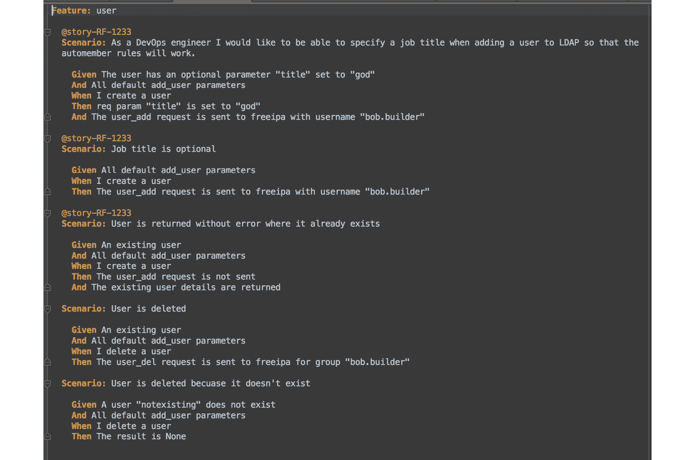
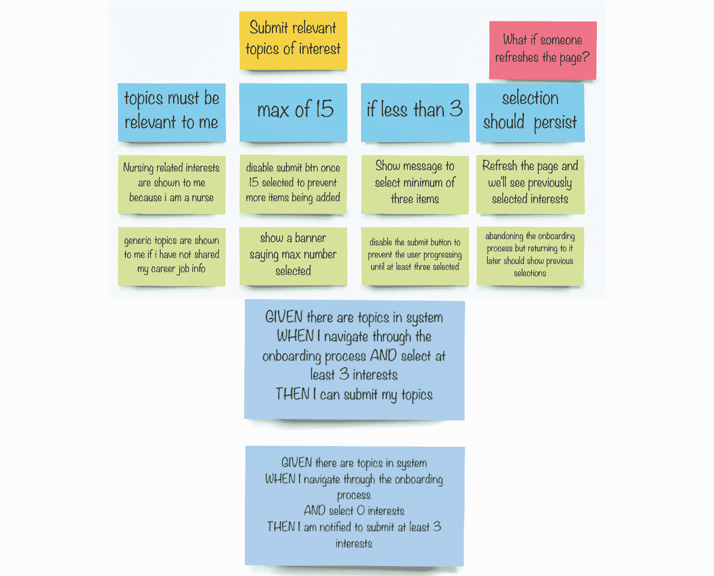
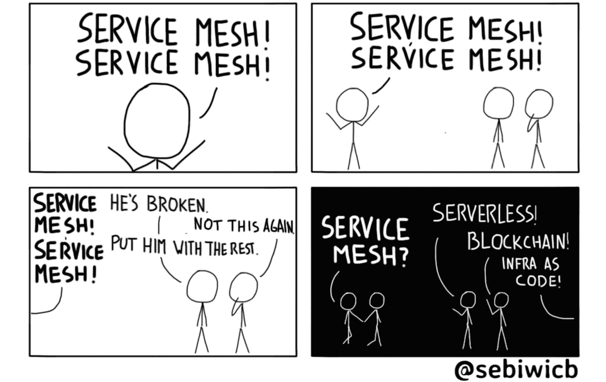

# 7. 开放技术实践——中期

在本章中，我们将继续上一章中开始的基础技术实践。我们将通过大局观实践，获得对我们软件交付管道的共享理解。即便是技术不太熟悉的团队成员，也能跟得上我们的软件在编写和交付过程中的变化。

接下来，我们将解释一种技术，允许 DevOps 团队使用 Git 作为驱动工具来交付软件变更。GitOps 的实践有助于提升我们系统中变更的可见性，使团队能够更快地调试和解决问题。我们将探讨如何通过自动化测试提高代码质量，并通过提问*我们的架构是否优秀？*来总结本章内容。

本章将涵盖以下主题：

+   大局观

+   GitOps

+   测试

+   新兴架构

## 大局观

一种成本低廉、但能很好地创建系统共享理解的开放技术实践是大局观工作坊。这是一个简单的实践，用来可视化软件管道中所有步骤，从源代码（例如 Git）开始，到编译和测试，再到最后交付给我们的用户。团队协作地构建大局观是一个极好的活动，能够弥合技术人员与业务人员之间的差距。它非常适合阐明持续交付的重要性以及其中的复杂性。


图 7.1：大局观

大局观可以通过简单的便签和一个清晰的板子或空间轻松创建。当然，如果你更具艺术天赋，也可以用涂鸦方式画出来！


图 7.2：一个大局观示例

你可能在读到这里时会想，*这听起来很空泛——我为什么要费心做一个大局观？* 下面是原因：

+   **共享理解**：当整个团队围绕大局观进行协作时，他们会对管道如何将代码与用户连接产生共享的理解。

+   **快速原型**：在实现任何一行代码之前，先写下来或画出来更便宜！快速原型设计，用标记笔和便签纸，移动笔和纸管道的各个阶段。

+   **简化复杂性**：大局观通过展示管理软件生命周期所需的组件，帮助非技术人员更好地理解整个过程。一步步构建，展示复杂性，同时保持简单直观的视觉流。

+   **信息辐射器**：和所有这些实践一样，大局观是一个不断发展的成果。随着软件交付管道的复杂性增长，大局观应当及时更新以反映这一变化。它是一个可以公开展示的图形，不应被隐藏。


图 7.3：协作以达成大局观的共享理解

大局观也可以使用在线协作工具绘制。我们使用了 Miro 来绘制以下数字化的大局观。


图 7.4：数字“大图”

创建“大图”所需的材料相当简单：一些便签、马克笔、油漆胶带以及一面大空白墙或画布，这些都是我们常见的工具！创建“大图”有一些简单的步骤，但让我们通过 PetBattle 示例来展示团队如何在实际中使用它。

## PetBattle – 构建“大图”

PetBattle 技术团队决定构建一个“大图”来展示他们关于软件如何通过一些自动化构建、测试和部署的提案。

首先，他们邀请团队中的其他成员帮助解释一些自动化技术和复杂性。

他们用油漆胶带形成一个大框，代表云环境，框内再画一个小框，代表他们将使用的 OpenShift 集群（部署在云中）。在这种情况下，比喻是：OpenShift 就是一个大框，我们可以将一些在云中运行的东西放进去。这个框非常大，可以填满我们可能需要的所有东西，从沙箱、工具到生产应用。


图 7.5：启动 PetBattle“大图”

他们在左侧画一个框，表示他们的本地开发环境。目前这是他们的笔记本电脑，但它也可以是一个云托管的 IDE，开发团队可以在其中编写代码，并且该 IDE 被部署在集群内。CodeReadyWorkspaces 就是一个这样的产品，它是一个云托管的 IDE，运行在 OpenShift 集群内，对团队可能非常有用。使用这样的 IDE 可以通过提供作为代码工件的开发环境来进一步推动我们的“万物皆代码”实践。

接下来，他们将 OpenShift 集群划分成更小的部分。每个部分代表一个 OpenShift 项目（或 Kubernetes 命名空间）。我们可以将这些项目视为将一个应用集合与另一个应用集合分开的房间。为了简化问题，团队决定最初使用四个命名空间：


图 7.6：PetBattle“大图”项目

+   **开发**：开发团队用来验证他们的应用或快速获取反馈的沙箱项目。

+   **测试**：一个用于部署所有应用并进行系统测试的项目。

+   **生产**：PetBattle 客户在通过我们的测试后用来访问应用的项目。

+   **CI-CD**：包含所有支持 **持续集成**（**CI**）和 **持续交付**（**CD**）工具的项目。

在将 OpenShift 集群逻辑划分为团队将使用的项目后，团队在每个项目中绘制出他们将使用的工具。


图 7.7：PetBattle“大图”初步框架

从他们的*本地*开发环境开始——换句话说，就是他们的笔记本电脑或云托管的工作空间——现有的 PetBattle 是使用 Angular（一个用于构建 Web 应用的 JavaScript 框架）来构建前端的。API 层使用 Quarkus（超声速 Java），持久化层使用 MongoDB，因此他们将这些工具添加到工作空间，并写下一行定义，说明该团队是如何使用这些工具或框架的。

对于 PetBattle，我们将使用 Helm 将所有用于管理应用拓扑的 Kubernetes 资源（部署、配置映射等）打包。我们还将使用 ArgoCD，这是一种 GitOps 工具，用于管理我们的配置即代码。


图 7.8：PetBattle 大图源代码和注册表

PetBattle 将使用 GitHub 存储其源代码。在构建镜像时，团队很可能需要使用内部注册表将构建好的镜像存储在 OpenShift 集群内。团队还希望将镜像对外提供，因此决定同时使用[Quay.io](http://Quay.io)，一个托管在公共云中的外部注册表。


图 7.9：PetBattle 大图管道工具

然后，团队开始在其 CI/CD 命名空间中添加他们将用于创建管道的工具。他们使用更多便利贴来绘制这些工具，并为每个工具写一个简短的定义，说明它是什么或者他们将如何使用它。

例如，团队将使用 Jenkins 进行构建和测试自动化。为了存储和缓存应用程序构建依赖项和工件，团队选择使用开源的工件库——Nexus。对于 Nexus，他们添加了一个简单的一行定义，强调它用于存放他们的软件工件以及 Helm 库。共享理解是关键，因此团队需要确保每个人都清楚每个项目的目的——这包括产品负责人、设计师和所有其他相关方。他们不需要成为专家，但了解工具的用途有助于他们与开发团队建立更好的共鸣，亲身了解需要做些什么才能迅速将代码交付给用户。

在大图上放置了一些工具后，PetBattle 团队现在可以开始实施他们已经设定的设计。

这个大图可以通过在一个充满五颜六色便利贴的实际房间里创建，或者使用 Mural、Miro、PowerPoint 或 Google Slides 等工具进行远程协作。我们提供了一个有用的模板，其中包含我们使用的所有图标，应该能帮助你开始。你可以从本书的 GitHub 仓库下载这个模板。


图 7.10：大图模板

你可以从本书的 GitHub 仓库下载此文件。

大局观使我们能够在高层次上对使用技术工具达成共识并进行团队对齐。就像我们在本书中介绍的所有实践一样，大局观不是一次性的。大局观是一个我们将不断回顾和完善的工具，随着我们向架构中添加更多复杂性并开始实施流水线，我们将不断完善它。我们将在*第六部分：构建、运行、拥有*中继续探讨大局观。

你可以通过访问[`openpracticelibrary.com/practice/the-big-picture/`](https://openpracticelibrary.com/practice/the-big-picture/)页面，了解更多关于大局观的实践并进行合作。

## GitOps

到目前为止，我们已经讨论了 Git 以及为团队提供的开发工作流。我们谈到了全代码化，从基础设施到工具，再到整个堆栈中的应用程序。现在，让我们通过 GitOps 将这一切结合起来。

GitOps 听起来有点像流行词，就像 DevOps 在最初被提出时一样。事实上，我们曾听到有人这样描述它：GitOps 是 2020 年的 DevOps。GitOps 是通过 Git 管理所有系统、环境和应用程序的简单过程。Git 代表了所有应用程序、工具甚至集群的唯一真实来源。对这些任何内容的更改都可以通过拉取请求来提交并进行讨论，之后自动化过程会应用这些更改。

**基础设施即代码**（**IaC**）和 GitOps 的区别在于管理配置的方式。IaC 与配置存储的位置无关；它可以存储在你抽屉里的 U 盘上，也可以存储在云中的共享驱动器上。而 GitOps，顾名思义，是指将完整的系统规范存储在 Git 中。

IaC 和 GitOps 的原则是相同的——理想情况下，每个操作应该是幂等的。每个操作或行为可以应用多次，产生完全相同的结果。这在许多情况下非常有用，因为它意味着可以根据需要重复或重试操作，而不会产生意外效果。配置应该声明性地创建。也就是说，你写下配置来描述应用程序或一组应用程序的期望状态。

GitOps 可以看作是一个面向开发人员的运维方法。它教会开发人员在代码离开他们的机器后如何接管代码，并指导他们如何部署和监控运行中的代码。

作为开发人员，我们讨厌重复自己，甚至为此创造了一个缩写——DRY = Don't Repeat Yourself（不要重复自己）！当遇到需要做多次的事情时，我们的第一反应应该是尽量将其自动化。一旦某件事被自动化或变得可重复，下一步就是简单的操作。将其提交到 Git 中，这样它就可以被审计、共享和管理。

例如，每当我们想要将一个新的应用部署到 OpenShift 时，我们可以运行一些手动命令来启动应用、创建服务和路由，甚至绑定一个 ConfigMap。但花时间为此创建一个 Helm 图表是可重用且可重复的。我们可以在代码中设计应用的最终状态，然后将其检查到 Git 中。这是一种更符合云原生方式的应用代码编写和管理方法。

要将 GitOps 方法应用于我们的 Helm 图表示例，我们只需将一个工具连接到 Git 仓库，该工具可以被提醒或监视变化。当变化到来时，该工具可以评估当前状态与所需状态之间的差异，并自动为我们应用这些变化。进入 ArgoCD。

### ArgoCD

根据 ArgoCD 网站的描述，这是一个被定义为：

*自动化在指定目标环境中部署所需的应用状态。应用部署可以跟踪分支、标签的更新，或固定到某个特定的 Git 提交版本的清单*。1

当某个状态在 Git 中与所需状态不匹配时，应用会变得不同步。根据你实施 GitOps 的方式，ArgoCD 可以重新同步更改，立即应用 Git 中的内容，或者触发警告以启动其他工作流。在 ArgoCD 实现的持续交付世界中，Git 是唯一的真实来源，因此我们应该始终按 Git 中的内容应用更改。

ArgoCD 可以应用哪些类型的内容？ArgoCD 识别传统的 Kubernetes YAML、Kustomize，2 Helm 以及其他各种内容。与 heavily 使用模板的 Helm 不同，Kustomize 允许你使用 YAML 文件，并以无需模板的声明方式输出文本。你可以修补 Kubernetes 资源，并使用基于文件夹的结构应用所谓的覆盖或 YAML 覆盖，这会输出文本，保持原始 YAML 不变。就我们而言，我们将主要使用 Helm 和适当的 Kustomize。

ArgoCD 是一个工具（还有像 Flux 这样的其他工具）在我们实现 CI 和 CD 时所需要的一长串工具中的一员。与我们也可以用来管理应用部署的 Jenkins 不同，ArgoCD 专注并且非常擅长仅管理和维护我们的部署。

1 [`argo-cd.readthedocs.io/en/stable/`](https://argo-cd.readthedocs.io/en/stable/)

2 [`github.com/kubernetes-sigs/kustomize`](https://github.com/kubernetes-sigs/kustomize)

Jenkins 可以一次性应用我们的 Helm charts，类似于“完成后就结束”的方式。它没有能力持续监控我们的 Kubernetes 资源，以确保 Git 中的期望状态在集群中保持不变。如果有人决定改变集群中的某些内容，比如向正在运行的应用程序添加一个新环境变量，ArgoCD 会检测到这一变化并覆盖它。这意味着一旦部署后，就不会再有独一无二的部署或手动调整。

ArgoCD 使团队能够强制执行这一黄金法则——如果它不在 Git 中，那就不是真的。这对于审计任务非常完美——你所需要做的就是检查 Git 日志，看看是谁提交并推送了代码。

## 如果不在 Git 中，那就不是真的！


我们与世界卫生组织合作进行虚拟驻地，帮助管理 COVID-19 危机。我们正在建设一个新的平台，以帮助现场人员进行教育，并加速信息传播。我们决定使用 GitOps 进行持续交付，特别是使用 ArgoCD 来管理我们的 Helm charts。

要真正做到云原生，命名空间和环境应该是短暂的。我们应该能够从代码中的描述重新创建所有对我们有用的内容。这包括命名空间、配额和角色绑定，以及应用程序和数据库。为了在一个冲刺周期内证明这一点，我们创建了一个清理任务，用来删除 OpenShift 中的开发和测试项目。我们的配置库链接到 ArgoCD，ArgoCD 监控集群，并在任何变化发生时，重新应用 Git 中描述的资源。这个任务的执行时间定在周三下午午餐时间，约在冲刺评审前一个小时。可能出现什么问题呢？

团队像往常一样准备进行演示，但在演示开始前约 20 分钟，其中一名团队成员喊道构建失败，他的演示坏了，而且他找不出原因。团队迅速行动，大家都加入了电话会议，共同解决问题。在回顾过去一小时可能发生的变化时，唯一执行的任务就是我们写的清理工作。我们立刻认为是我们在工作中写错了什么，于是去调试它，但一切正常。接下来的步骤是更加仔细地查看构建和错误信息。

到这时，我们发现团队中的某个人手动将数据库部署到了开发环境。他们正在连接到它进行演示，并将其作为我们 Jenkins 流水线中的测试数据库。实际上，团队中的某人创建了一个“宠物”——一个由某个人精心照料和培养的服务器，其他人对此一无所知。在短命环境的世界中，我们真正需要的是“牛”。“牛”是大规模生产的，通过自动化创建，并在不再需要时被销毁。因此，当我们的工作运行并清理项目时，所有资源都被销毁了。

团队从这次经验中学到了一个宝贵的教训，并且他们将这一点非常显著地展示了出来：


图 7.11：如果它不在 Git 中，它就不真实

这产生了一句口号，我们将其加入到我们的社会契约中，来自 *第四章，开放文化*。

### 实现 GitOps


让我们用一些真正可工作的代码来构建大局！在这一节中，我们将进行一个技术绕行！准备好一些代码片段。如果这不是你的兴趣，随时可以跳过，直接进入下一个全是关于测试的章节！我们会用这个方便的标志标记任何包含代码片段的部分。

让我们探索 ArgoCD，并从代码中创建我们大局的组件。为此，我们将首先探索一个可以作为开发起点的示例项目。

在 Red Hat 开放创新实验室，我们已经实现了 Labs Residency CI-CD 工具的自动化引导，以加速设置和入职。代码库名为 Ubiquitous Journey，因此从这里开始是合适的。我们将探索这个代码库，并使用它建立我们的技术基础。在本书的后续章节中，我们将使用新技术和工具扩展它。这个代码库可以在 PetBattle GitHub 组织中找到 – [`github.com/petbattle/ubiquitous-journey`](https://github.com/petbattle/ubiquitous-journey)。

当我们在 OpenShift 集群上部署 Jenkins 时，我们通常执行的第一个任务是使用命令行创建一个新项目。我们可以再次按照这种手动方式进行，添加角色绑定和配额，并为我们大局中的每一部分重复这些步骤。但我们决定以一种符合我们一切皆代码实践的方式来做。

从你的笔记本电脑上，fork 这个示例项目，并在你喜欢的代码编辑器中打开它。

我们将对项目进行更改，因此保持你自己的副本是 GitOps 所必需的。从现在开始，当我们遇到一个新的代码库时，你可能会发现通过 fork 它来进行更改会更容易。为了本书的后续内容，我们将继续使用 PetBattle 组织，所以你可以将它等同于你自己的组织或用户。

```
git clone https://github.com/petbattle/ubiquitous-journey.git
```

Ubiquitous Journey 项目被分为两个主要组件（为简化起见，下面的分解中移除了一些文件），分别是 Bootstrap 和 Ubiquitous Journey。如果你在想我们为什么给这个项目命名为 Ubiquitous Journey……嗯，实际上我们并没有命名！我们按下了 GitHub 上的 **生成随机名称** 按钮，它为我们选择了这个名字。就像大多数软件中的事情一样，命名真的很难！我们本来打算在某个阶段重命名这个代码库，但现在这个名字已经有点粘住了，我们也挺喜欢它的！

```
$ tree ubiquitous-journey
```

```
ubiquitous-journey
```

```
├── argo-app-of-apps.yaml
```

```
├── bootstrap
```

```
│   ├── charts
```

```
│   ├── Chart.yaml
```

```
│   └── values-bootstrap.yaml
```

```
├── docs
```

```
├── ...
```

```
├── README.md
```

```
└── ubiquitous-journey
```

```
    ├── Chart.yaml
```

```
    ├── templates
```

```
    │   ├── argoapplicationdeploy.yaml
```

```
    │   └── _helpers.tpl
```

```
    ├── values-day2ops.yaml
```

```
    ├── values-extratooling.yaml
```

```
    └── values-tooling.yaml
```

启动文件夹包含一个 Helm 图表定义，带有一个 values-bootstrap.yaml 文件和 Chart.yaml 清单。这个图表没有模板，因为它实际上只是其他 Helm 图表的包装器。如果我们查看 Chart.yaml 清单，可以看到它依赖于 ArgoCD 图表，另一个称为 bootstrap 的图表和一个名为 sealed-secrets 的辅助图表。启动文件夹 Helm 图表充当包装图表，允许我们控制传递给这些依赖项的变量。在这种情况下，我们的变量存储在 `values-bootstrap.yaml` 文件中：

```
bootstrap-project:
```

```
  enabled: true
```

```
  ci_cd_namespace: &ci_cd "labs-ci-cd"
```

```
  pm_namespace: &pm "labs-pm"
```

```
  ops_namespace: &ops "labs-cluster-ops"
```

```
  dev_namespace: &dev "labs-dev"
```

```
  test_namespace: &test "labs-test"
```

```
  staging_namespace: &stage "labs-staging"
```

```
  bindings: &binds 
```

```
  # this labs-devs is the GROUP NAME in IDM
```

```
    – name: labs-devs
```

```
      kind: Group
```

```
      role: edit
```

```
  # this labs-admins is the GROUP NAME in IDM
```

```
    – name: labs-admins
```

```
      kind: Group
```

```
      role: admin
```

```
    – name: jenkins
```

```
      kind: ServiceAccount
```

```
      role: admin
```

```
      namespace: *ci_cd
```

```
  namespaces:
```

```
    – name: *ci_cd
```

```
      bindings: *binds
```

```
    - name: *pm
```

```
      bindings: *binds
```

```
    - name: *ops
```

```
      bindings: *binds
```

```
    - name: *dev
```

```
      bindings: *binds
```

```
    - name: *test
```

```
      bindings: *binds
```

```
    - name: *stage
```

```
      bindings: *binds
```

启动图表负责在我们的 OpenShift 集群中创建列出的项目。在示例中，这些项目包括 labs-ci-cd、labs-dev、labs-test、labs-staging、labs-pm 和 labs-cluster-ops。Dev、Test、Staging 和 CI/CD 可能会很容易理解；如果不明白，请查看前一章，我们在那里深入讨论了 CI/CD。labs-pm 命名空间用于部署其他项目管理工具（例如协作工具如 etherpad）。labs-cluster-ops 命名空间用于操作性工作和任务。

OpenShift 中的资源应用了 **基于角色的访问控制** (**RBAC**)。3 RBAC 决定用户是否被允许在项目内执行给定的操作。我们将列出的用户组绑定到这些项目内的服务帐户上。如果您的集群目前尚未设置 labs-dev 和 labs-admin 组，不要担心。只要您以具有集群管理员特权的用户登录到您的集群中即可。

```
argocd-operator:
```

```
  enabled: true
```

```
  name: argocd
```

```
  namespace: *ci_cd
```

```
 argocd_cr:
```

```
    applicationInstanceLabelKey: petbattle.app/uj
```

```
  # operator manages upgrades etc
```

```
  version: v1.8.6
```

```
  operator:
```

```
    version: argocd-operator.v0.0.14
```

```
    channel: alpha
```

```
    name: argocd-operator
```

3 [`docs.openshift.com/container-platform/4.6/authentication/using-rbac.html`](https://docs.openshift.com/container-platform/4.6/authentication/using-rbac.html)

该文件的第二部分覆盖了 ArgoCD 图表中的一些变量。这个 Helm 图表安装了 ArgoCD 操作员，并使用合理的默认值进行配置。关于可以传递给此图表的所有可能变量的列表，您可以查看 ArgoCD 操作员文档 - [`argocd-operator.readthedocs.io/en/latest/`](https://argocd-operator.readthedocs.io/en/latest/)。在这本书中没有重新创建这些文档的意义，但如果您想进行一些探索，保存它们是很有用的。

需要特别注意 `applicationInstanceLabelKey` 变量。这个变量在你的集群中必须是唯一的。如果你在一个集群上部署了多个 ArgoCD 实例，并且它们的实例标签相同，那么这两个 ArgoCD 实例将尝试管理相同的资源，然后它们会争夺到底是谁真正拥有这些资源，并且会给你带来很多麻烦，所以确保 `applicationInstanceLabelKey` 是唯一的！

让我们部署这个设置，看看它给我们带来了什么。如果您希望更改创建的项目名称，请编辑值文件，但现在我们将使用默认值。在您的笔记本电脑终端上，尝试以下命令：

```
$ helm template bootstrap --dependency-update -f \
```

```
bootstrap/values-bootstrap.yaml bootstrap
```

运行像这样的 Helm 模板应该会下载我们的图表依赖项并处理我们的模板。这是验证 YAML 文件是否符合预期的便捷方式。让我们将引导 Helm 图表安装到它自己的命名空间中。

```
$ helm upgrade --install bootstrap-journey \
```

```
  -f bootstrap/values-bootstrap.yaml \
```

```
  bootstrap --create-namespace --namespace labs-bootstrap
```

此命令的输出应为成功安装引导 Helm 图表：


图 7.12：使用 Helm 引导 ArgoCD

你可以通过以下命令检查正在启动的 Pod：

```
oc get pods -n labs-ci-cd  
```

你应该会在一两分钟后看到 ArgoCD 服务器开始启动：


图 7.13：Labs-ci-cd 命名空间中的 Pod 启动

或者，如果你查看 UI，你应该能看到包含所有 ArgoCD 组件的拓扑图：


图 7.14：OpenShift 开发者拓扑视图，展示 labs-ci-cd 项目

让我们通过点击 UI 中的链接来查看 ArgoCD，或者你也可以使用以下命令从命令行获取 URL：

```
oc get routes argocd-server -n labs-ci-cd
```

使用 OpenShift 凭证登录。我们应该会看到一个空的 ArgoCD 实例：


图 7.15：通过 Web 界面查看空的 ArgoCD 实例

在这一点上，我们应该问自己一个问题：*当有人更改我们集群的引导配置值时会发生什么？* 比如，添加更多项目或更改角色或组？我们能以自动化和可追踪的方式完成吗？换句话说，使用 GitOps 可以吗？别担心，ArgoCD 来拯救我们！我们现在可以将 ArgoCD 指向我们一直在使用的 Git 仓库。

我们可以通过在 ArgoCD Web 界面选择 +New App -> Edit as YAML 来创建一个 ArgoCD 应用程序，并复制粘贴以下定义：

```
apiVersion: argoproj.io/v1alpha1
```

```
kind: Application
```

```
metadata:
```

```
  name: bootstrap-journey
```

```
  namespace: labs-ci-cd
```

```
spec:
```

```
  destination:
```

```
    namespace: labs-bootstrap
```

```
    server: https://kubernetes.default.svc
```

```
  project: default
```

```
  source:
```

```
    helm:
```

```
      parameters:
```

```
      - name: argocd-operator.ignoreHelmHooks
```

```
        value: "true"
```

```
      valueFiles:
```

```
      - values-bootstrap.yaml
```

```
    path: bootstrap
```

```
    repoURL: https://github.com/[YOUR FORK]/ubiquitous-journey.git
```

```
    targetRevision: main
```

```
  syncPolicy:
```

```
    automated: {}
```

点击保存，然后点击创建。你应该能看到`bootstrap-journey`应用程序已同步：


图 7.16：通过 Web 界面查看引导 ArgoCD 应用程序

我们也可以在终端中创建相同的应用程序。你可以使用单点登录通过终端登录到 OpenShift，使用以下一行命令。此命令需要一个非无头的终端，换句话说，它可以连接到你的屏幕和浏览器：

```
$ argocd login $(oc get route argocd-server --template='{{ .spec.host }}' \
```

```
-n labs-ci-cd):443 \
```

```
--sso --insecure
```

创建新应用并同步更改。完成这些操作后，argocd 将会主动跟踪我们 Git 仓库中的更改并为我们部署它们！很简单！

```
argocd app create bootstrap-journey \
```

```
  --dest-namespace labs-bootstrap \
```

```
  --dest-server https://kubernetes.default.svc \
```

```
  --repo https://github.com/[YOUR FORK]/ubiquitous-journey.git \
```

```
  --revision main \
```

```
  --sync-policy automated \
```

```
  --path "bootstrap" \
```

```
  --helm-set argocd-operator.ignoreHelmHooks=true \
```

```
  --values "values-bootstrap.yaml" 
```

你可以在 Web 界面中选择应用程序，进入其详细信息：


图 7.17：通过 Web 界面查看引导应用程序的详细信息

很棒——我们正在完成将“大图景”转化为代码，并奠定我们的技术基础！我们已经创建了项目，并将第一个工具 ArgoCD 添加到工具包中。现在，让我们更进一步，填充我们的集群，加入一些我们认为最初有助于构建 CI/CD 管道的应用程序。在任何项目的开始阶段，这通常是一个最好的猜测。随着我们开始构建产品，我们必须不断发展我们使用的工具集。这不是一次性过程；它是一组工具，在需要时需要扩展，或者如果不再有用就丢弃。这里重要的是确保事物能够以可重复的方式进行部署。

让我们添加一些工具。打开你在 ubiquitous-journey 项目中的编辑器。在 ubiquitous-journey/values-tooling.yaml 中，我们有一些有用的变量，引用了 Helm 图表，供我们选择使用，包括我们之前手动部署的 Jenkins！

```
##############
```

```
# 🛎 Argo App of Apps declaration
```

```
#############
```

```
# enabled true on an app is to tell helm to create an argo app cr for this item
```

```
# Custom values override the default values in Helm Charts
```

```
applications:
```

```
  # Nexus
```

```
  – name: nexus
```

```
    enabled: true
```

```
    source: https://redhat-cop.github.io/helm-charts
```

```
    chart_name: sonatype-nexus
```

```
    source_path: ""
```

```
    source_ref: "0.0.11"
```

```
    sync_policy: *sync_policy_true
```

```
    destination: *ci_cd_ns
```

```
    ignore_differences:
```

```
      – group: route.openshift.io
```

```
        kind: Route
```

```
        jsonPointers:
```

```
          – /status/ingress
```

```
  # Jenkins
```

```
  – name: jenkins
```

```
...
```

```
  # Sonarqube
```

```
  – name: sonarqube
```

```
...
```

这个文件的布局很简单。对于应用程序数组中的每一项，它期望找到一个 Helm 图表或一个指向 Git 仓库的引用，该仓库包含某个特定版本的 Kubernetes yaml（或 Kustomize）文件。

使用 Helm 时，任何对图表提供的默认值的覆盖都可以在此处添加，但对于显示的 Nexus 图表，我们使用的是默认值，因此不需要对 Nexus 进行值覆盖。每个应用还有其他字段，这些字段大多与 ArgoCD 的操作有关。例如，您可以配置应用同步策略（sync-policy），当设置为自动时，它会告诉 ArgoCD 始终保持应用的同步。可以指定目标命名空间。对于一些 Kubernetes 和 OpenShift API 对象，ArgoCD 需要被要求忽略它发现的差异；尤其是在控制器和操作员将状态及其他字段写回对象本身时，这一点尤其如此。我们随着时间的推移发现，随着每个 ArgoCD 版本的发布，指定这些 *忽略* 的需求逐渐减少，因为生成的差异会自动处理。

每个应用条目的另一个重要字段是 `enabled: true | false` —— 只需沿着列表跑一遍，启用我们立刻需要的工具就很容易。目前，我们将从四个工具开始：Jenkins、Nexus、Tekton 和 Code Ready Workspaces。这些是我们应用程序和管道框架的基础。此时，值得提到另外两个 `values` 文件，`extratooling` 和 `day2ops`：

```
└── ubiquitous-journey
```

```
    ├── Chart.yaml
```

```
    ├── ...
```

```
    ├── values-day2ops.yaml
```

```
    ├── values-extratooling.yaml
```

```
    └── values-tooling.yaml
```

就像我们在 `values-tooling.yaml` 中的 CI/CD 应用列表一样，它们包含了用于在我们的集群中部署的有用 Helm 图表和 YAML 文件的引用。额外的工具包含了项目管理和协作工具，而 `day2ops` 包含了用于保持集群整洁的有用修剪任务。现在，我们将禁用所有额外的工具和 day2ops 应用。这为我们提供了一个最小的设置来开始使用。

如果你正在运行 CRC，请在部署工具之前查看附录中的任何细节。让我们通过命令行使用 Helm 和`oc`来部署这些工具：

```
$ helm template -f argo-app-of-apps.yaml ubiquitous-journey/ \
```

```
| oc -n labs-ci-cd apply -f-
```

如果你查看 ArgoCD 网页，你应该现在能看到这些应用开始部署并同步到你的集群中。它们会花一些时间来完全同步。例如，Jenkins 会构建我们在运行管道作业时可能需要的所有默认代理镜像。


图 7.18：安装了所有工具后的完整图景

我们现在已经成功引导了我们的 CI/CD 工具！我们将在发现需要添加和更新开发、测试和交付 PetBattle 所需工具时重新访问这些配置。通过实践*一切皆代码*，我们可以轻松地将这些工具重新部署到任何 Kubernetes 集群中，跟踪我们可能做出的更改，并管理工具的生命周期（随着版本和功能的变化，升级它们）。

## 测试，测试，测试！

到目前为止，我们已经讨论了可以用来将应用代码从构思到编译再到部署的一些工具。但我们怎么知道我们构建的东西真的按预期工作呢？如果我们创建一个仅仅编译代码并将其推送到生产环境的管道——这样就完成了吗？不，还需要在我们的软件管道中加入测试质量步骤和关卡！

### 测试自动化金字塔

我们怎么知道我们的功能是否按预期工作？我们应该进行测试并查看结果！测试我们的功能的方式并不总是很明确，什么时候测试得足够多或过多也不清楚。我们是否应该创建测试指令并手动测试这个功能？我们是否应该将功能单独测试？我们是应该测试所有的组成部分，还是只测试整个功能？那么，单元测试的定义究竟是什么？

说实话，测试是复杂的。我们将主张创建的不仅仅是任何测试，而是自动化测试！*测试自动化金字塔*，由*迈克尔·科恩*（Michael Cohn）撰写，是我们进入自动化测试世界的一个良好起点。让我们简化地看看原作者所提出的*传统的*测试自动化金字塔：


图 7.19：测试金字塔

在标准的三层测试三角形中，底部的内容（上文列为**单元测试**）是我们应该做得更多的事情。单元测试是我们在应用程序中可以测试的最小代码单元。这些单元应该尽可能少依赖其他项，因此，当我们运行它们时，它们会给我们即时且精确的反馈。单元测试应该直接指出代码中问题的具体位置。此外，单元测试的思路是它们编写成本低、易于维护、执行速度快。因此，我们希望更多的进行单元测试。这也是为什么它们位于测试金字塔的底部。

服务测试有时被视为集成测试，是测试三角形中的下一个层级。这些是 API 测试，用于验证你应用中的服务是否按预期运行。这可能包括单一服务调用，以及服务调用链，当一个服务调用另一个服务时。测试层级的宽度与代码库中应该有多少类型的特定测试相关。根据金字塔的理念，服务测试应该比单元测试少，因为它们的执行成本较高。

测试三角形的最顶层是专门用于**用户界面**（**UI**）测试，或端到端系统测试。这些测试负责验证系统作为其各个组件和部分的总和，是否按预期运行。通常，UI 测试在面对变化时容易变得脆弱，出现故障的频率较高，并且需要维护以保持其有效性。因此，测试金字塔的理由是，我们应该减少这类测试的数量，因为它们难以执行，且提供的反馈较少。

### 实践中的测试

测试自动化金字塔是思考自己测试的一个很好的起点。和所有模型和模式一样，人们有时过于简化了其原始含义。事实上，如果你进行测试金字塔的图片搜索，你会发现大多数结果缺少一个最重要的关键词——自动化！通常，组织会忽视这一点，认为为这些层级进行手动测试就足够了。

测试很重要；事实上，它对于能够快速交付至关重要！如果你想象一下没有投入时间编写自动化测试，可能会在完成一个 sprint 时不会出问题。也许我们能够完成两个 sprint 而不出现问题。然而，一旦进入第三或第四个 sprint，软件系统就开始出现异常。第一 sprint 编写的应用程序现在会出现错误，因为它们的功能行为不再按预期工作。曾经被认为正常的函数和 API，实际上完全崩溃了！能够快速发布软件是一回事，但能够快速发布高质量的软件才是区分的关键。

在考虑测试时，重要的是要应用上下文。你不必盲目遵循像测试金字塔这样的模型。实际上，这是一种很好的起点，但它并不是在所有环境中都适用的万能法则。例如，你可能正在构建一个包含静态内容或第三方服务的 Web 应用，因此 UI 测试可能是最重要的事情。

重要的是要理智地看待你打算执行的测试类型以及它们所提供的价值。你可能会发现，对于你的产品而言，覆盖服务层可能是更好的选择。如果你无法访问代码，那么编写评估服务的黑盒测试，通过明确定义的输入和输出进行测试，更适合你的质量控制。同样，像金字塔建议的那样，衡量测试数量并不能告诉我们测试的质量。高质量的测试会在用户发现之前捕捉到错误。当生产环境出现故障或用户报告了一个 bug 时，很可能你需要编写更多的自动化测试。


图 7.20：测试衡量

另一种看待此问题的方式是计算不对某项功能进行测试的风险。也许你写的应用程序是一次性的，或者只是一个不需要严格测试的简单技术验证。然而，如果你产品中的某个功能被频繁使用，并且根本没有编写自动化测试，那么这个功能可能是你自动化测试工作应该重点关注的地方。

在你的产品开发团队内创建一种测试是持续实践的文化。测试不应该是开发过程的事后思考。我们经常看到，测试是在开发团队将包丢给测试团队后才开始的。对我们来说，每个冲刺中的每个项目都会有一定程度的测试。这不是由某个第三方团队完成的，而是由工程师自己完成的。开发人员通常更偏向单元测试和集成测试，但**质量保证**（**QA**）团队则常常偏向自动化 UI 测试，从用户的角度验证应用程序。有时，如果文化不对，团队在被压迫加速推出新功能时，测试质量可能下降，导致几乎是反向的测试金字塔：底部有少量单元测试，接着是更多的服务测试，然后是大量脆弱的 UI 测试堆积在上面！这会影响软件交付管道的质量。从开发到 QA 的反馈循环可能非常长，单元测试几乎没有价值，而昂贵的 UI 测试反馈又过慢，无法及时提供反馈。

在交付过程中通过反转测试金字塔来降低质量可能会对团队造成很大伤害。如果缺陷数量显著增加，团队的信任将动摇。如果团队失去信任，那么自主性可能是下一个被破坏的方面，这将导致重度的命令与控制驱动文化。以这种方式运作的团队将很快失败，顶尖人才也将离开。

## 测试与完成定义


最近与世界卫生组织合作时，我们在一开始就有着很大的雄心，计划为每个冲刺项目编写测试。我们通过在每个冲刺项目的“完成定义”中加入测试，开始得相当顺利。我们一致认为，每个进入冲刺的项目必须包含一些自动化测试。

第一个冲刺在一周的迭代中迅速过去。由于我们是一个新团队，每个人都充满动力，渴望尝试新事物。到了第三个冲刺，我们已经接手了超出团队能力范围的故事。

我们所做的工作变得越来越复杂，错过了一些自动化测试。我们宣称某些功能已经完成。在当周的演示中，我们向产品负责人承认，这项工作在功能上已完成，但根据我们自己的标准还没有完成。

我们尽力对自己诚实，但发现我们在接下来的一个星期又犯了错。此时，我们清楚地意识到，在做冲刺规划时，我们没有正确地考虑编写测试所需的容量。虽然已经有了“完成定义”，但我们仍然没有做到诚实。我们是一个渴望不断向前推进、在前一个任务未完成时就急于开始新任务的团队。

在一次回顾会议上，我们决定一个好的前进方向是，在编写任务时记录测试工作量。当从待办事项中提取项目时，我们会为所有自动化测试添加子任务。通过这种方式，与测试自动化相关的所有工作变得对团队可见，因为这些子任务出现在冲刺看板上。为你的功能编写测试的任务使得在任务还在进行中的时候，很难继续处理下一个任务！

你可以通过访问 [`openpracticelibrary.com/practice/test-automation/`](https://openpracticelibrary.com/practice/test-automation/) 来了解更多内容并协作进行持续集成实践。

### TDD 或 BDD 或 DDT

关于测试以及如何编写有意义且能提供价值的好测试，已经有许多书籍。我们的目标不是重写这些书籍，而是给你一些提示，帮助你进一步研究这个话题，如果它真的引起了你的兴趣。团队在三角形的不同层级上发现有用的一些测试方法，包括 **行为驱动开发** (**BDD**)、**测试驱动开发** (**TDD**)，以及 **开发者驱动测试** (**DDT**)。


图 7.21：测试驱动开发

TDD 是一个简单的过程，但一些团队可能误解了它。过程相当简单。首先为你正在构建的功能编写一些测试。此时，测试应该是失败的（**RED**）。如果测试没有失败，那么说明你的测试写得不好，或者功能已经存在！然后开发者将编写代码使测试通过（**GREEN**）。当测试通过后，可以进行重构，或者正如极限编程的创造者、美国软件工程师 Kent Beck 所说，*重构以去除重复*。删除重复代码或使代码更加简洁并整理它，同时保持测试通过的状态。这个过程很简单：**红色 > 绿色 > 重构**。先编写测试是一项艰难的实践，需要时间和毅力来掌握技巧，但它可以减少混乱的代码。因为测试是首先编写的，它们引导了代码的设计和实现。


图 7.22：执行测试驱动开发

一个适合团队尝试 TDD 而不涉及代码的练习是通过 Gargoyle Software 网站上的乐高 TDD 模拟：[`gargoylesoftware.com/articles/lego_tdd`](http://gargoylesoftware.com/articles/lego_tdd)。

你可以通过访问[openpracticelibrary.com/practice/test-driven-development](http://openpracticelibrary.com/practice/test-driven-development)页面来了解更多关于 TDD 并进行协作。

DDT 很容易实现，可能是如果你没有编写任何测试时，开始的地方。这里的重点是确实有一些测试被编写了！DDT 侧重于开发者编写代码并同时编写测试。简单来说，开发者先编写代码，写一些自动化测试，然后再回到编码和测试。这听起来有点像 TDD，但关键的区别在于顺序。先编码再测试，导致代码影响测试，而不是测试引导软件设计。DDT 的目标是让开发者对自己的代码负责，且每个人都应对测试负责。


图 7.23：开发者驱动的测试

BDD 是你工具箱中一个很好的工具，因为它让人们在共同理解一个正在开发的故事或特性的范围时凝聚在一起。它不太像工程工具，更像是一种方法，侧重于业务和开发者在编写功能时的对话。BDD 是通过使用共享语言编写应用程序行为的具体示例。

测试的实现方式由开发人员决定。但更重要的是，开发人员和产品负责人之间可以使用一种通用语言来划定故事的范围，而不需要引导软件设计。BDD 可以作为一种有用的方式，共同编写故事的验收标准。BDD 测试的编写有一种常用的语法或方法，基于 *Dan North*（敏捷教练和 BDD 创始人）的工作 4：

```
Scenario  1: Title
```

```
Given [context]
```

```
And [some more context]...
```

```
When  [event]
```

```
Then  [outcome]
```

```
And [another outcome]...
```

4 [`dannorth.net/introducing-bdd/`](https://dannorth.net/introducing-bdd/)

例如：

```
Scenario  1: Buying an Ice Cream to cool off on a hot day
```

```
Given I have ten pounds in my pocket
```

```
When  I purchase a Choc Ice for two pounds
```

```
Then  I have only eight pounds left
```

```
And have a Choc Ice
```

对于正在开发的任何功能，可能会有多个场景需要测试。这些场景使用常见的语法——Given, When, Then 来定义。使用通用语法编写验收标准可以简化测试的编写，并帮助大家达成对活动范围的共同理解。Dan North 多年前提出了这种以故事为驱动的方法，并且从那时起，许多测试框架（如 Cucumber）都采用了这种语法。

## 我们的运维工具 Python 库的 BDD


几年前，我参与了一个公共部门的项目。我是团队的一员，帮助他们自动化一些操作能力。以前，他们有团队成员手动配置虚拟机（VM），而且这种方式无法重复使用。我的工作之一是为团队构建一个命令行界面，帮助自动化创建和添加团队成员（用户）及其角色到 Free IPA 服务器（Red Hat 身份管理）。下图显示了添加现有用户和删除用户的一个 BDD 场景模板：



图 7.24：一个 BDD 场景

团队中的架构师是 BDD 写作方法的坚定支持者。我们所有的验收标准都是按照这种方式编写的，这让我们更好地理解自己所做工作的范围。当我与另一位工程师配对时，我们会将按照 BDD 语法编写的验收标准作为起点。我们直接从 Jira 导入语法，通过 Python Behave 来搭建测试用例。对于我们这些工程师来说，这使得功能编码变得轻松。我们已经得到了规范，所以可以轻松地实现我们的代码以通过测试。

BDD 可以帮助工程师更好地理解功能的背景。它还帮助弥合与业务专家和产品负责人的对齐差距：

## 产品负责人看到他们的想法以代码形式呈现！

当我们指导团队时，我们鼓励他们利用冲刺评审或展示活动，作为展示他们所有工作成果的机会。包括设置和改进测试自动化。

我从我曾合作的几个团队中注意到一个特别的现象，当产品负责人或业务领域专家第一次看到 BDD 自动化运行时，他们会回想起一两周前的冲刺规划会议，当时团队正在确认将要进入冲刺的故事的验收标准。通常，这些标准会使用 BDD 语法书写，输入的内容则来自产品负责人或业务专家。

当他们在冲刺评审或展示会上看到测试自动化套件运行时，他们会看到控制台显示已自动化的测试，相同的思路、相同的指令，以及相同的业务逻辑都已被编码。

BDD 打破了技术人员与业务人员之间的壁垒。

### Example Mapping

由 Cucumber 首席执行官 Matt Wynne 提出的 Example Mapping，5 是另一个非常有用的工具，值得添加到工具箱中。再一次，很多这些实践实际上是非常有用的方式来阐明并推动对话。在这种情况下，Example Mapping 主要用于在编写故事和创建验收标准时推动共同理解。我们认为它对于帮助团队编写行为驱动的测试非常有帮助。这个过程简单，且只涉及四种颜色的便签：

+   **黄色**：用于故事本身（作为示例图的标题）

+   **蓝色**：用于与故事相关的具体规则

+   **绿色**：用于规则示例

+   **红色**：用于讨论中出现的问题或未知项

5 [`cucumber.io/blog/bdd/example-mapping-introduction/`](https://cucumber.io/blog/bdd/example-mapping-introduction/)


图 7.25：Example Mapping

首先选择一个故事并将其写在黄色便签上，将其放在示例图的顶部作为标题。在其下方的横向行中，开始写下蓝色便签上的业务规则。蓝色业务规则下方，创建一列绿色便签，列出这些业务规则的具体示例。这些示例可以是相对不太结构化的朋友标记*The one where...* 示例，也可以是完整的 Given, When, Then 标准。

当在讨论中出现对单个示例或整个业务规则的误解时，添加红色便签并写上问题。

当有足够的示例，大家都能理解时，它们可以被重写为自动化测试和验收标准。

## 实际应用中的 Example Mapping


在世界卫生组织的驻地项目中，我发现这种做法非常简单易用，但它是一个很好的工具，用来阐明故事的范围，并就我们将编写的验收测试达成一致。

我们使用 Event Storming（稍后会详细介绍）来建模新用户加入应用程序的过程。我们有一个命令，写着*提交相关的兴趣话题*，并将其添加到我们的待办事项列表中。我们选择这个命令是为了更好地了解用户感兴趣的事物，从而更好地为他们提供推荐。

我们使用示例映射来分解这个故事，首先编写一些规则。此时我们并没有严格遵循统一语言，因为我们知道团队会在之后将这些规则转换为 BDD 风格的语法。



图 7.26：示例映射示例

团队内部的转换引发了一些关于活动范围的误解。开发人员更关心边缘情况，比如，*如果页面被刷新或返回会发生什么？* 我们能够将这些问题作为示例映射的一部分捕捉下来，并添加了新的规则和一些示例。随后，团队能够将这些示例转换为 BDD 语法。

与所有这些实践一样，与正确的人进行这样的对话并捕捉示例意味着我们获得了良好的团队对齐，并能够将其转化为验收测试，并作为我们开发工作流的一部分实施。

你可以通过访问[openpracticelibrary.com/practice/example-mapping](http://openpracticelibrary.com/practice/example-mapping)页面，了解更多关于示例映射实践的内容，并进行协作。

### 非功能测试

虽然测试的重要性不容小觑，但关注其他可能进一步揭示我们代码质量的指标同样至关重要。例如，你怎么知道你的测试覆盖了所有代码？如果我的测试都通过了，但应用的响应时间很差呢？传统的单元测试和集成测试可能捕捉不到这些问题。我们可以使用一些工具来识别代码库中的原因和问题，更重要的是，尽早修复这些问题，而不是等到更晚。

代码覆盖率报告器易于实现，通常与许多现代测试框架一起捆绑。其思想很简单：在运行我们的测试用例时，代码库会被监视。一旦测试执行完成，就会生成一份报告，显示哪些代码行已经被执行，哪些地方存在空白。这些报告对帮助团队识别改进空间非常有用，但不应被视为绝对真理。像所有这些工具一样，覆盖率报告是有可能被欺骗的，但优秀的开发者和同行评审流程应该能发现这些问题。通常，如果团队的测试覆盖率还不高，他们会努力提升覆盖率。将这些报告带到回顾会上，对团队来说是一个很好的分析工具，并可以设定更高的目标。一些进取心强的团队甚至会将覆盖率低于某一阈值的情况视为管道不稳定，导致失败！

静态代码分析是另一个可以提供单元测试未能检测到的代码库洞察的工具，它创建了代码应如何编写和执行的规则。如何编写代码的一致性对非编译语言（如 JavaScript）尤为重要。JavaScript 在不同浏览器中的行为也有所不同，因此编写一套规则，比如所有字符串都使用单引号而非双引号，有助于避免任何意外的行为。如果我们将这些规则编码化，那么我们不妨确保每个人都遵守这些规则，因此将它们添加到我们的流水线中！编码标准在多团队合作的环境中也非常重要。如果代码库符合标准结构和设计，也会使其维护和更新变得非常简单。

## 性能测试 Sam 的代码


大约在 2014 年，我们为一家零售公司工作，构建了移动后台服务及一些相关的自动化工具。这一服务层负责聚合来自不同后台系统的数据，例如产品列表、类别和评论。这些服务还进行了一些非常基础的数据处理，以使数据负载更加适合移动端使用。适配器响应的及时性至关重要，因为与现代移动网络相比，移动端的延迟较高，而快速的 API 响应时间能够带来显著的差异。

我们的团队始终意识到，我们应该跟踪适配器响应所需的时间。我们知道组织会在程序结束时进行传统的负载测试，但我们不想等到那时才发现问题。我们认为，一定有一种方法可以持续验证我们对适配器层所做的更改，以便及早发现任何性能下降的问题。

我们在 Jenkins（我们的自动化工具）中创建了一个夜间任务，每晚检查适配器的性能。这是一个相当简单的任务，模拟了成千上万的并行请求到 API。通过此任务，我们绘制了每天服务的响应时间，并通过 Jenkins 报告了这些数据。这使我们能够为正常响应的基准值创建一个标准，并在值超出预期范围时让任务执行失败！


图 7.27：自动发现性能瓶颈

有一天，我们来到办公室，发现我们的夜间任务变成了红色！我们心想，太好了，让我们停止所有正在进行的工作，检查一下自昨晚以来系统发生了什么变化。快速检查系统中所做的更改后，我们发现团队成员 Sam 尝试提交了某个数据转换函数的新逻辑。Sam 在一个循环内嵌套了另一个循环，导致了代码执行时间的剧增。这是我们的传统单元测试没能捕捉到的问题，因为逻辑本身是正常的，只是计算所需时间变长了。

我们迅速响应并立即修复了问题。如果我们没有发现这个性能瓶颈，可能需要几个星期甚至更长时间才能意识到发生了什么。我们本可以在这段问题代码上继续构建更多功能，这会使得以后更难以拆解。

能够像这样快速响应反馈至关重要。我们并不是说产品上的大负载测试不必要，但这个简单的自动化任务通过捕捉这个问题，给我们带来了大量价值。它编写和维护成本低，而且可能比我们其他方式更早发现了这个错误。几周后，Sam 再次尝试编写代码，我们遇到了类似的失败。


图 7.28：更多轻量级自动化性能测试

不过，别担心——Sam 是我们的一位好朋友，现在已经不再从事写代码的工作，他转行做了技术销售角色。我们工作中没有“归咎文化”，我敢肯定，如果 Sam 在讲这个故事，他会说是我们其中一个人提交了那段愚蠢的代码。我让你自己决定是谁。

还有许多其他类型的测试，我不会一一列出；如果要列完这些内容，我们得再写一本书来装下它们。我们将在下一部分中详细探讨我们软件的非功能性特征，*发现它*。

### 关于测试的一些最终思考

我们无法低估测试在快速交付功能中的重要性，特别是自动化测试。无论你是遵循测试金字塔还是其他某种范式，这取决于你——只要记住，一切都关乎交流。如果 TDD（测试驱动开发）不适合你，确保仍然进行业务与技术团队之间的对话，利用示例来识别合适的测试。我们常用的方法是使用 BDD（行为驱动开发），因为它能将业务与技术的世界结合起来。

最后，我们并不是说世界上没有独立 QA 团队的空间。绝对不是，关键是自动化所有事情并尽早获得反馈。如果 QA 是你公司中的一个独立职能，而且只在上线前几周才参与，那么这是一个问题。将 QA 的技能带入团队，并将这个能力“左移”到团队中，这样他们可以更频繁地获得早期反馈。

## 新兴架构

*希望不是一种设计方法*。6

我们如何知道我们的架构是好的？什么是好的架构？好的架构能否衡量？你是否曾经操作、支持或修复过一个架构不良的系统？

识别什么是*糟糕架构*可能会更容易：

+   一个不稳定且不可靠的系统，经常以未知和意外的方式失败。

+   从用户的角度来看，系统很慢。

+   它无法随着用户或负载的增加而良好扩展。

+   它很难升级，因为一个小的变动就需要重新部署整个系统，这既慢又昂贵。

+   它依赖于客户端或其他系统，且不能轻易修改或改变，除非同时改变其他系统。

+   它有很多复杂的业务功能，这些功能被埋藏在数据库中，可能涉及触发器，且由于复杂的数据库架构，在修改时可能会产生未知的副作用，难以轻易改变。

+   这个系统难以管理和运维。

6 [Michael T. Nygard, 《Release It!：设计和部署生产就绪的软件》](https://pragprog.com/titles/mnee2/release-it-second-edition/)

列表还在继续。

在一线软件支持和运维中，没有什么比在凌晨 3 点被持续呼叫去扑灭一个反复发生的复杂系统崩溃问题更糟糕的了，恢复服务后，根本原因分析却指向了一个复杂的失败架构——除了重新设计或重写软件外，没有其他简便的修复方法。

许多深层次的软件问题源于不明智的架构决策。很多时候，这些决策在产品开发的初期就已做出，当时大的架构已经设计好并固定不变，可能是石头、混凝土，甚至泥巴做成的。通常，系统架构师会向开发团队展示他们的架构杰作，并从此致力于确保问题适配架构，而不是架构适配问题。

开发过程继续使用这座“世界第八大奇迹”的架构，最初一切进展顺利，甚至可能在生产环境中运行。但有一天，业务部门要求一个与架构方法不太契合的功能，然后为了完成这个变更，付出了巨大的代价。

在开发过程中，技术决策往往必须基于最好的意图做出，但此时的信息往往不完整或过于稀疏。团队中经验更丰富的成员在设计讨论中的智慧往往是非常宝贵的。那些在之前项目中经历过糟糕架构的人，绝对值得倾听和学习。然而，正如我们在《锤子》章节中看到的那样，这也可能存在一个弊端。

作为产品团队，我们必须愿意且能够在需求发生重大变化或系统故障告诉我们现有架构的极限时，适应并改变架构。

#### 注意

一般来说，最好在合理的范围内尽可能晚些做出架构和技术决策，以便为做出决策的人提供更多的信息。

新兴架构是指拥有*足够的架构*，以便产品开发能够持续推进，同时又足够灵活，能够在获得更多信息时做出架构调整。

多年来，已经有大量优秀的书籍和文章讨论了什么是*良好的架构和模式*。我们个人的推荐是*Martin Fowler*（[`martinfowler.com/books/`](https://martinfowler.com/books/)）、*Chris Richardson*（[`microservices.io/`](https://microservices.io/)）和*Sam Newman*（[`samnewman.io/books/`](https://samnewman.io/books/)）的作品，但还有很多其他优秀的作者。

## 现场观察

在本节中，我们的目的是概述一些我们遇到的反复出现的模式/方法，包括好的和不好的。虽然这些并不新鲜，但我们认为在这里提出来是有益的。

### 每平方米的模式

*应用的软体模式数量*从来不是一个好的质量指标。软件模式是解决特定问题的著名且可重用的模板。不要犯这样的错误：假设一个包含大量软件模式的系统比那些包含较少模式的系统更优越。

### 预期故障并应对

灾难性的系统故障显然是不可取的。在面对子系统故障时，一个从未完全停止工作的系统通常是更可取的。它可以在子系统故障时优雅地恢复，并且即使某些组件不可用，仍然可以支持部分功能。我们可以明智地应用架构模式，例如，使用水密舱来减少单个故障造成的损害。与容量、延迟或“看起来有点慢”的问题相比，绝对故障通常更容易应对。

在审查架构时，特别是分布式架构时，我曾从一位经验丰富的架构师那里收到一条非常宝贵的建议，那就是——总是要问这个问题：*如果这个组件发生故障或变慢，会发生什么？*如果这个问题没有一个好的答案，那么可能需要更多的设计工作来防止故障场景的发生。

### 锤子

我们多年来看到的一个常见模式或行为是黄金锤子模式，换句话说，如果你手里只有一把锤子，那么所有东西看起来都是钉子。这个现象更正式的名称是“工具法则”。

所有开发人员都有他们最喜欢的工具和架构方法。例如，作者们是反应式流式架构（Mike）、异步事件驱动消息传递（Noel）和任何与 Node.js 或表情符号相关的技术（Donal）的粉丝。这里的风险是，你自己的偏好可能会引导你走上一条最终是错误的架构道路。

如果你发现自己在讨论一个业务问题的前 10 到 20 秒时，忍不住插话说，“哦，产品、架构或工具 X 可以帮助解决这个问题”，那么面对现实吧，你可能正准备拿出你的金锤子。

### 简历驱动开发

很多时候，我们参与了关于某种技术在客户解决方案中使用的讨论，而这项技术要么不合适，要么根本无法解决他们要解决的问题。我们经常发现，有人引入了这项技术，因为他们急于学习它，结果它从一个技术实验或试探变成了核心技术组件。技术实验本身没有任何问题，应该鼓励这种做法，但我们应谨慎，确保所选的技术不会导致死胡同或变成一个找不到问题的技术解决方案。我们看到的一些技术包括服务网格等，如*图 7.29*所示：



图 7.29：采用街区上最酷的技术

### 戴上不同的帽子

软件架构必须从多个角度良好运行，而不仅仅是从设计和构建的角度。不同的团队/角色会有不同的视角，例如部署、测试和运维管理。一种*好的*软件架构将尽量解决尽可能多的这些问题。

### 社交媒体驱动开发 —— 跟上潮流

像 Google、Amazon 和 Microsoft 这样的公司生产并利用一些令人惊叹的技术和方法。这些技术通常集中于这些超大规模公司所面临的问题规模。我们大多数人从未与如此复杂或用户需求如此庞大的系统打交道，因此应该谨慎判断技术，依据的是你的特定业务需求，而不是那些*流行*的孩子们正在使用的技术。我们经常在*单体与微服务*的讨论中观察到这一点。两者都是非常相关且有效的软件架构方法。它们各有优缺点，但正确的做法是问自己，什么对业务和客户最有价值。

### 良好的服务设计

良好的服务设计很难实现。最终，我们应该始终降低应用程序的操作负担。我们可以通过设计应用程序来实现这一点，从而最小化任何给定应用程序的变更成本。现代应用程序通常被拆分为不同的组件或服务，暴露方法或功能。良好的系统架构的核心是服务设计。这通常基于**领域驱动设计**（**DDD**）等实践，DDD 的核心是理解业务问题，并在团队中以明确无误的方式传达这种理解。属于同一业务领域的服务会被归为一组，例如我们在《PetBattle V2》中的比赛服务，或我们在爱好者应用中的猫服务。我们可以通过遵循以下两条原则来实现良好的服务设计：

+   **松耦合性**：当对一个服务的更改不需要对另一个服务进行更改时。通过设计松耦合的服务 API，我们可以轻松地部署服务更改。服务的内部设计可以完全改变，而不会影响 API 的使用者。

+   **高内聚性**：我们希望相关的系统行为聚集在一起，而无关的行为则分开。我们的订单管理系统与我们的运输和交付系统是独立的。这减少了开发人员的认知负担，因为相关的系统功能聚集在一起。这里通常存在设计上的张力，例如在定义相关的业务系统领域（比如使用 DDD）和可重用的技术功能（如库或 API，可能跨多个系统）之间的平衡。

### 技术设计集体思维

我们已经讨论了一些设计系统时的反模式。另一条建议是，技术领导者应设定方向，而不仅仅是描述应该做什么或已经做了什么。实现这一点的一种方法是进行平行思维练习，让每个人同时并协作地贡献他们的想法，而不是仅仅跟随团队中最高级别成员的思维方式。重点是*未来可以做到什么*，而不是*当前是什么*，以帮助设计前进的道路。这不是关于谁对谁错。

### 人力资源和时间是你最宝贵的资产

在知识型工作中，人类通常是最昂贵的资源。因此，努力减少琐碎或无差异的手工劳动是有意义的。这是一个永无止境的趋势，即自动化一切，从而为我们的产品带来更好的质量和反馈。

### 信息泄露 – 数据中心性至关重要

在技术领域，我们被大量数据淹没。但我们是否充分利用了在我们的应用程序和系统中可用的所有数据？在进行架构设计时，我们必须仔细考虑应用程序和基础设施中可用的数据的数量和质量。通常，工程决策和取舍必须做出，将数据处理靠近边缘设备，仅仅因为将所有数据发送回中央处理核心在物理上是不可能的，原因可能是带宽或延迟限制，或者移动这些数据的成本过高（想象一下云计算！）。因此，在设计系统时，考虑以下情况：

+   数据在捕获过程中丧失了完整性

+   数据根本没有被流式传输或存储

+   数据无法供其他用途访问

+   数据根本没有被分析

+   数据没有被传输，且保持隐藏状态

+   数据未被用于决策

我们常常忘记思考丢失的数据量——丢失的数据可能是我们业务中巨大机会的损失源。无论是在云计算、物联网、工业应用，还是在我们的手机上处理数据的移动网页用例中，这种情况都会发生。

### 一些关于架构的最后思考

架构在构建软件系统时是一个至关重要的考虑因素。做对架构是一个持续的平衡过程，需要审视当前和潜在的未来需求，并评估架构如何适应这些需求。

在任何情况下，都会需要一定程度的前期架构和设计工作，并且应该伴随着灵活性和诚实，以确保初步架构能够随着不确定问题的答案被发现，以及随着更多信息被纳入对当前问题的集体理解，而发生变化。能够在整个产品生命周期中不断改进架构，是另一个重要目标。

当我们谈论重大的前期决策时，脑海中浮现出以下普鲁士陆军元帅的著名名言：*没有任何计划能经受住与敌人接触的考验。 – 赫尔穆特·冯·莫尔特克*。或者，换个现代的说法：*每个人都有计划，直到他们被打了嘴巴。– 麦克·泰森*。

灵活性、适应性和改变的意愿是成功应对动态环境的关键特征。总而言之，团队在应用程序扩展并适应变化时需要考虑许多架构因素。通过在业务需求变化时进行实验和调整架构，他们将更好地提供承诺的服务 SLA，并最终使用户体验达到最佳状态。

## 结论

在本章中，我们继续探索了技术实践，为我们能够以快速和统一的团队交付打下坚实的基础。通过使用“大局观”技术，帮助我们对交付流程有共同的理解，我们进一步识别了测试方法，并探讨了如何以更加开发者友好和业务友好的方式将业务与验收测试连接起来。


图 7.30：在基础上添加更多的技术实践

在我们探索带领我们走向新兴架构方法的课程时，我们也意识到，很多的“魔力”来自于首先进行对话。将整个 IT 组织当作一个卫星来对待是行不通的；我们必须创造一个能让我们整体成功的环境。关键是要将拥有知识的人和拥有权威与权力的人聚集在一起。

在后面的章节中，我们将更深入地探讨 PetBattle 的技术实现。

为了结束这一部分，我们已经建立了文化、领导力和技术卓越的坚实基础。我们已经建立了包括以下内容的原则和实践：

+   自主性、精通度和目标感

+   心理安全

+   社会契约、停机事件、实时回顾、团队认同和信息辐射

+   领导意图与团队授权

+   优先级滑动条

+   团队空间

+   一切皆代码

+   容器

+   持续集成、持续交付和持续部署

+   测试自动化

+   新兴架构


图 7.31：文化和技术实践的基础

我们的基础很强大。随着我们在其上构建产品，它将需要持续的培养和加强。然而，我们已经准备好启动我们的第一个产品团队。在下一章中，我们将探索一些可以用于持续产品发现的实践。
