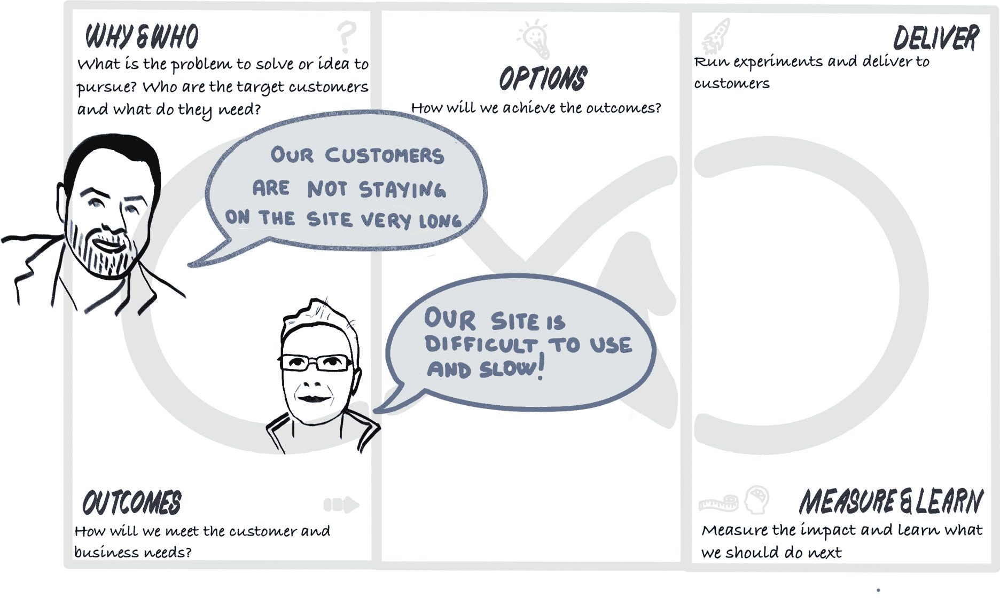
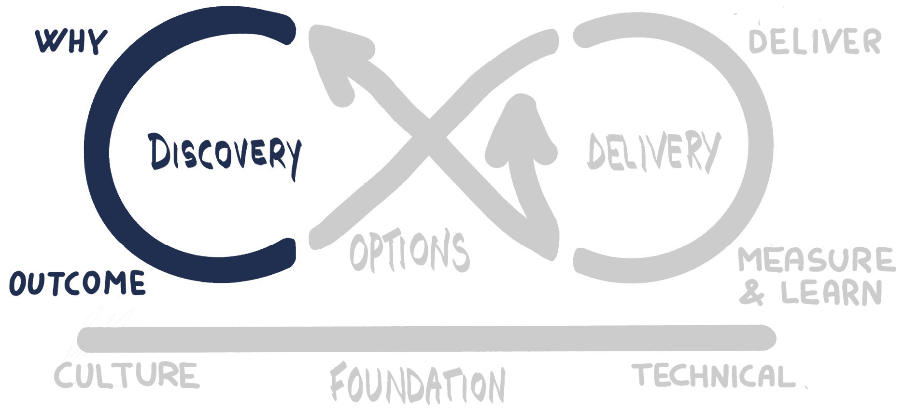

# 第三节：发现它

在*第二节，建立基础*中，我们为我们的第一个团队建立了初步的基础。这包括一种能够促进心理安全、支持团队成员自主性、掌握能力和目标感的文化。它还包括我们为使团队能够自信地开始应用程序开发而引导的技术基础，给予他们保持持续交付的最佳机会，并避免陷入早期技术债务。

现在我们将围绕 Mobius 循环展开工作，从发现开始：

图 8.0.1：发现循环 — 场景设置

在*第八章，发现“为什么”和“谁”*中，我们将探讨团队和利益相关者如何合作发现结果，并理解支撑应用程序开发的共同目标。为了帮助导航这个过程，我们将使用 Mobius 的发现循环：

图 8.0.2：发现循环

当我们处于**发现循环**时，我们识别并使用那些帮助我们回答“为什么”问题的实践——我们为什么要开始这段旅程？我们试图解决什么问题？我们为谁解决这些问题，又知道他们什么？我们的伟大想法是什么？我们还使用发现循环中的实践来帮助我们识别和设定可衡量的商业和客户目标结果。*第八章，发现“为什么”和“谁”*，专注于循环的上半部分，帮助回答**为什么和谁**的问题。

在*第九章，发现“如何”*中，我们将把重点转向一些可以帮助我们开始构建解决方案的实践。我们解决问题的方法是渐进式的，并以实验为驱动。特别是，我们专注于一组通过可视化和建模技术实现共同理解的实践。本章中不会浪费任何一个便签！

*第十章，设定结果*，将重点讨论这些结果，它们是什么，我们如何推导它们，以及我们如何使用它们。在本章结束时，您将能够清晰地表述和定义团队的目标和交付的结果。
