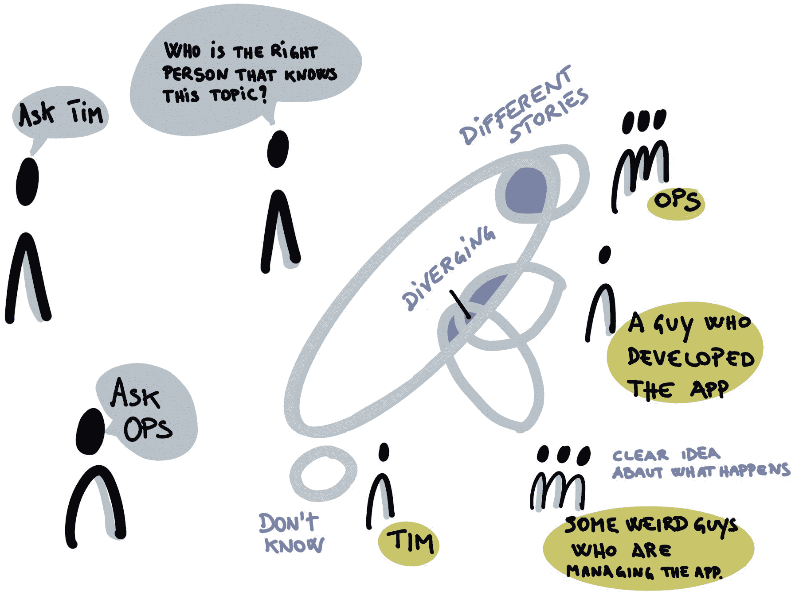

# 第八章：8. 发现“为什么”和“谁”

软件交付团队往往直接投入到交付功能中，专注于输出和交付物。他们没有花足够的时间去理解他们试图解决的业务问题以及他们想要为谁解决这些问题。

知识往往在业务流程和领域知识方面存在分裂，通常这些知识都集中在一个人的头脑中。团队内部以及不同利益相关者群体之间的知识错位，导致了错误的决策、误解和不正确的假设，最终团队交付了错误的解决方案，解决了错误的问题。

图 8.1：知识分布

这就是为什么我们从使用一系列探索实践开始，以便使所有团队成员和利益相关者达成关于*我们为什么要做这个？为什么要投入时间？我们为什么选择这个，而不是做别的事情？*的共同理解。

此外，我们需要探讨我们正在解决的问题以及我们为谁解决这些问题。在开始为他们定义目标成果之前，理解这些人、他们的痛点以及改进的机会是至关重要的。

我们将在本章探讨的探索实践非常依赖于全员参与的方法，并且需要包括所有相关利益相关者。收集广泛的观点，并鼓励来自公司各个职能领域的不同人员群体之间的参与和协作，有助于实现对齐，并形成一个致力于共同解决我们要解决问题的团队。

我们有意愿包括技术和非技术人员。促进技术侧人员与非技术或更偏向业务人员之间的对话和对齐的实践，特别具有强大的力量。

探索实践的使用并不打算做到面面俱到——我们使用这些实践来获取足够的信息，以使团队成员达成共识，获得共同的理解，并建立足够的信心，以便开始进行早期实验或其他活动，这些活动反过来推动更多的学习。这不会是唯一一次进行探索并使用这些实践的机会——实际上，我们的目标是定期回顾并基于交付过程中的学习来进一步推进探索。

在本章中，我们将涵盖以下主题：

+   **北极星**：一种帮助达成“为什么”以及整体目的对齐的实践。

+   **影响图谱**：一种帮助达成“谁”以及我们希望对其产生可衡量影响的实践。

+   **以人为本的设计**：一组有助于与用户和其他重要利益相关者建立共情的实践。

让我们看看我们的第一个探索实践，它有助于使每个人朝着一个方向前进——北极星。

## 北极星

通过设定北极星，可以为产品创建共同的目标。北极星框架是一种通过识别一个称为北极星指标的单一关键指标来管理产品的模型。1 根据提出这一术语的 Sean Ellis 的说法，它是*最能捕捉产品为[其]客户提供的核心价值的单一指标*。

Amplitude2 是一家数字分析公司，免费发布了关于北极星框架的优秀手册——它是什么，为什么你可能会使用它，以及如何使用它。手册列出了关于北极星指标的以下七个检查点：

1.  它表达了价值。我们可以理解它为什么对客户很重要。

1.  它代表了愿景和战略。我们公司的产品和商业战略都体现在其中。

1.  它是成功的领先指标。它预测未来的结果，而不是反映过去的结果。

1.  它具有可操作性。我们可以采取行动来影响它。

1.  它易于理解。它以简单的语言表述，非技术性合作者也能理解。

1.  它是可衡量的。我们可以为产品配备工具来跟踪它。

1.  它不是虚荣指标。当它发生变化时，我们可以确信这个变化是有意义且有价值的，而不是仅仅让团队感觉良好的东西，尽管它无法预测长期的成功。

1 [`growthhackers.com/articles/north-star-metric`](https://growthhackers.com/articles/north-star-metric)

2 [`amplitude.com/`](https://amplitude.com/)

北极星框架与 Mobius 非常契合。在发现循环（本节）中，我们专注于定义北极星，并使所有利益相关者和团队成员达成一致，理解为什么选择了这个北极星指标。在下一节中，我们将探讨“选项枢转”，这完全是关于我们可以采取的可操作性研究、实验和实施，以影响北极星指标。在*第五节，交付它*中，我们将探讨交付循环，包括衡量和学习的实践——我们用于追踪产品成功与北极星的工具：

图 8.2：北极星

在发现循环中使用北极星实践，可以帮助团队朝着正确的方向前进，并实现团队成员与利益相关者之间的对齐。它还可以帮助团队在没有北极星的情况下进行课程调整或重新对齐。将北极星的信息张贴在墙上，确保团队成员和相关利益方都能清楚看到，可以帮助保持专注，并引导团队朝着北极星前进。

我们在前一部分中解释的许多做法，旨在建立文化和协作的基础，这些做法将有助于定义和使用北极星指标的过程。例如，制定社交契约和回顾性实践，帮助团队在贡献战略性重要信息时获得自主性和心理安全感，将有助于促进更广泛的团队对这一指标的共同拥有。促进工作可视化的做法将有助于分享、检查和集中精力实现北极星目标。

所以，北极星是第一个发现实践，突显了建立文化基础的必要性。如果存在开放的文化，人们感觉心理上安全，可以互相贡献和协作，那么其效果会更好。我们将看到这一模式持续下去。

为了帮助找到北极星，我们使用一个简单的画布，类似于 Amplitude 指南中提供的画布：

图 8.3：来自 Amplitude 的北极星指南

使用北极星框架的团队识别出一个单一、重要的指标和一些关键的输入。产品团队致力于影响这些输入，这些输入反过来推动该指标。北极星是可持续增长的领先指标，并充当产品与更广泛业务之间的联系纽带。

让我们来看一个北极星指标的例子，以及它是如何从输入中推导出来的。OpenTable 是一个流行的餐厅预订平台。发现不同领先输入的推荐方法是考虑广度、深度和频率；例如：

+   **广度**：有多少用户在参与？一个衡量这一点的输入指标可以是**月活跃用户**（**MAUs**）数量——即至少在网站上进行过一次搜索的用户。

+   **深度**：用户的参与程度如何？一个衡量这一点的输入指标可以是每次搜索中的预订转化率。

+   **频率**：用户参与的频率如何？一个衡量这一点的输入指标可以是用户搜索之间的平均时间间隔。

这些都是我们希望在产品设计决策中推动改进的输入，但我们需要一个指标，这个指标是代表产品价值的关键指标。OpenTable 的北极星指标是每月就座客户的数量——换句话说，每月支付客户使用餐桌的次数。如果这一指标很高，我们的产品就成功了，推动着良好的业务发展。这是唯一一个不会撒谎的指标，也是我们应该不懈关注的成功标志：

图 8.4：OpenTable 的北极星画布

这个画布还捕捉到北极星指标对业务的中长期影响；在这种情况下，每次预订座位时收取的固定费用为 OpenTable 创造了收入。

让我们回到 PetBattle 团队，看看他们是如何找到他们的北极星指标的。

## PetBattle 作为一项业务

PetBattle 最初是作为一个有趣的创意，用来实验新技术。然而，由于猫是互联网用户最喜爱的消遣，网站很快就变得病毒式传播。由于它是实验性质的，因此并没有以最健全或专业的方式构建。这导致由于访客数量过多，网站崩溃——这是一场“完美”的灾难！恶意用户在互联网上上传不当内容，必须手动删除，因为该站点旨在适合家庭使用。

因此，创始人决定尝试在保持最初简洁方法的同时实现网站的货币化。

PetBattle 的创始人决定在建立跨职能产品团队时体现丹·平克（Dan Pink）书籍《驱动力》（Drive）的精神，因此首先建立了一个文化基础。每个新团队成员都会为 PetBattle 的文化增添他们独特的视角、个性和动机。为了留住人才并增强这种优秀的文化，PetBattle 必须让他们感觉到能够实现自主、精通和目标。

PetBattle 的员工需要感受到与产品愿景的连接。他们举行了一个北极星工作坊，将所有员工与产品的愿景连接起来，并确定他们的北极星，以便他们可以定期检查和衡量其进展。

该工作坊持续了两个小时，包括以下内容：

+   关于北极星原因的开场讨论

+   确定 PetBattle 用户正在玩的游戏

+   关于什么是好的（以及不好的）北极星的讨论

+   关于北极星的结构及其输入的讨论

+   查看其他产品的北极星指标

+   起草 PetBattle 的北极星

Amplitude 将数字产品分为三类游戏：关注度游戏、交易游戏和生产力游戏。关注度游戏侧重于顾客愿意花多少时间在产品上。交易游戏侧重于顾客在产品中的交易次数。生产力游戏侧重于团队成员完成工作的效率和效果。在经过一些讨论后，关于 PetBattle 是更偏向关注度游戏还是交易游戏，团队最终决定它是关注度游戏。最终，顾客希望花更多时间享受 PetBattle 产品，目标是保持他们的参与度。

在收集 PetBattle 北极星候选项时，员工首先采用了静默头脑风暴技术，然后与其他人配对讨论他们的想法。两对人员形成四人小组，将他们的集体想法合并。最后，整个小组将所有想法汇聚在一面墙上。这种引导方法叫做 1-2-4-全员（1-2-4-all），是一个出色的解放结构（liberating structure）示例。

北极星的候选指标包括以下内容：

+   网站访客数量

+   已参与的站点访客数量（例如，至少为一只宠物投过票）

+   在网站上停留的时间

+   增强对（最终）广告商的跟进

+   PetBattle 比赛的数量

+   上传到网站的宠物数量

+   网站的跳出率

+   网站的粘性率（每月回访三次及以上的用户百分比）

+   使用移动应用的百分比

在所有员工的想法汇聚过程中，关于什么才是真正的成功，开始出现一些精彩的对话，特别是关于 PetBattle 的未来。是的，他们希望更多的人访问网站，也希望最终能有广告收入，但似乎大家的共识是，推动 PetBattle 向下一阶段发展的关键指标是宠物上传数量。大多数其他指标都是可以帮助提升上传数量的输入因素。如果用户增加，最终会有更多用户参与。随着更多的参与，最终会有更多用户希望进一步参与和互动。参与的中长期影响将推动广告收益的提升。

如我们在 Red Hat 开放创新实验室中所展示的那样，我们可以在产品和服务型组织中使用北极星指标。

## 我们在开放创新实验室的北极星

开放创新实验室是一家专业服务机构。我们经常被问到，是否可以将产品思维应用到服务型组织中。

答案是肯定的！我们在本书中讨论的所有实践都应用到自己身上，以培养我们业务的产品思维。

这也包括北极星指标。我记得我们在制定实验室概念时的团队会议，讨论了我们的北极星指标可能是什么。我们的客户来自商业和公共部门。我们的整体愿景是通过利用开放技术、开放流程和开放文化，解锁客户的最大潜力。我们的业务价值链涉及与大量客户的售前合作，了解痛点和优化机会，识别适合参与我们驻场计划的合适使用案例。我们组织会议来确认、发现、规划、互动和交付这些服务。所有这些都有各自的指标。

使用类似于上面 PetBattle 故事的协作方式，我们得出了*实验室的多个合格使用案例*作为我们的北极星。像北极星一样，这个关键指标变得越来越明确，我们可以用它来评估我们业务的健康状况。当我们确定了一个使用案例时，我们对我们的客户非常有信心，认为实验室的驻场计划非常适合他们的业务问题。我们已做了充分的调研，因此我们集体认同它将带来的价值。我们对销售和交付的参与有很高的信心。

知道、理解并对你的北极星目标达成共识，为进入下一个发现实践提供了极好的基础，该实践探讨了战略目标与人员、可衡量影响和交付物之间的联系。这一实践被称为影响力映射。

## 影响力映射

影响力映射是一种帮助组织战略领导者与产品交付团队之间建立共享理解和协调的方法。*戈伊科·阿兹奇*首次在 2011 年的小册子中记录了这一技术，3 它为那些希望主持工作坊的人提供了一个极好的指南。

阿兹奇将影响力映射定义为*一种轻量级、协作的规划技术，适用于那些希望通过软件产品产生重大影响的团队。它基于用户互动设计、结果驱动的规划和思维导图。影响力映射帮助交付团队和利益相关者可视化路线图，解释交付物如何与用户需求相连接，并沟通用户结果如何与更高层次的组织目标相关联*。

在影响力映射练习结束时，你应该有：

+   对目标或问题陈述的共享理解。

+   用户和利益相关者必须发生（或不发生）的人类行为变化的清单，以确保你的项目能够成功。这些就是该技术名称中所提到的*影响*。

+   可选地，列出为了实现上述影响而可能交付的项目交付物。

+   一种优先排序范围的方式——一个或多个交付物——和/或影响。

+   呈现前述信息的图形。

3 [`www.impactmapping.org/`](https://www.impactmapping.org/)

使用这种方法可以让我们转向实验性和假设驱动的功能开发模型——一种能够快速验证或推翻假设的方式。也就是说，我们假设构建一个交付物将对某个特定参与者产生可衡量的影响，从而帮助实现战略目标。运行这些实验以验证或推翻假设所获得的学习是推动我们持续改进，以交付重要成果的动力。

影响力映射使我们能够聚焦于业务目标，并引导产品团队朝着交付业务价值而不仅仅是交付更多功能的方向前进。这是一种流行的做法，也是我们在大多数合作初期都会采用的，因为它提供了一个非常简单、以人为本的发现过程。你不需要复杂的工具或软件来执行它——一些便签、笔、一片空地，以及最重要的，人们，都是你所需要的。最终的产物是所有对话的图形化思维导图。

如何做到这一点呢？首先，阅读阿兹奇的小册子。它非常容易理解，并会引导你开始。接下来是我们在多个合作项目中使用影响力映射的经验。我们将把它分解为组成影响力映射的四个部分：

1.  目标

1.  参与者

1.  影响

1.  交付物

对于这些组成部分，我们将进行简要概述，然后通过我们的 PetBattle 案例研究来查看他们的影响力图是如何发展的。

构建影响力图可以通过与一群共同工作的人，在大墙面上进行。也可以通过使用协作工具，如 Miro、Mural、Google Slides 或 PowerPoint，进行虚拟操作。我们提供了一份 PDF 模板，可能对你起步时有所帮助。

图 8.5 影响力图数字模板

接下来，我们将汇总影响力图，展示如何使用它来形成假设声明，并驱动实验。

### 从 WHY 开始——目标

在本书的开头，我们说过，我们总是要从“为什么”开始。我们为什么要做这个？我们为什么在这里？通过合作、对齐并达成一致，确立目标就是在做这件事——从为什么开始。

影响力图的第一部分通常是最难的。利益相关者和团队成员应该从公司可衡量的成功角度来框定目标，而不是从技术解决方案出发。作为技术人员，我们往往专注于“做什么”，却忽略了“为什么”。

通过专注于功能 A 为何重要，我们可以将工程实践和优先事项与公司成功联系起来。目标应该是可衡量的，这样我们才能量化我们是否成功。设定目标时，团队的关键输出是达成对为何要启动某项倡议的共同理解和一致性。

目标可以使用**SMART**首字母法则来构建：

图 8.6：SMART 目标

+   **具体**：模糊或易被误解的目标成功完成的机会较低。

+   **可衡量**：我们如何知道自己已经达成了目标？目标应该是可衡量的。

+   **可实现**：我们是否能现实地完成我们的目标？我们是否具备所需的技能和资源？

+   **现实**：在时间和资金的限制下，我们能完成我们的目标吗？

+   **基于时间**：完成目标需要多久？

设定目标往往是一件难以达成共识的事情。通常，我们对于作为一个组织，在产品或业务领域的方向会有不同的看法。然而，明确的目标能逐渐渗透到公司各个层级，进而为每个人创造共同的目标。

让我们来看看 PetBattle 团队设定的目标。

## PetBattle——目标

在我们的 PetBattle 应用案例中，我们正在从一个业余爱好者应用转变为一个可以（希望）创造收入的应用。团队分成了两组，并在白板上分享了所有的想法，反复讨论他们提议的目标陈述。两组提出了以下目标：

1.  在今年年底前，创造 100,000 美元的广告收入。

1.  在第三季度末，将我们的活跃用户基数增加 100 倍。

在全组讨论后，大家达成一致决定使用第一个目标，并在讨论过程中对其进行了补充和调整。因此，在我们的 PetBattle 示例中，我们将目标定为：*通过现有和新用户群体，到年底实现 $100K 的收入*。我们可以将目标与当前收入进行对比，目前收入为零，甚至可能是负数（如果考虑到当前的托管费用）。我们正处于亏损状态！

在一个小组内设定目标可能相对简单。那么，对于更大的团队呢？让我们来看一些反模式和获得共识与包容性的建议。

#### 注意

在进行任何小组活动时，通常声音最大的人是最容易被听到的。 有时，房间里最资深的人会在讨论中获得最多的发言时间——这就是所谓的**最高薪水者的观点**（**HIPPO**）效应。 这导致片面的观点被视为常态，而安静或害羞的人常常觉得自己的声音没有被听见。如果你刚开始制定目标，一个能让每个人都发声的好方法是使用解放结构的 1-2-4-全体实践（[`www.liberatingstructures.com/1-1-2-4-all/`](http://www.liberatingstructures.com/1-1-2-4-all/)）。这是一个简单但极其有效的做法。首先设定一到两分钟的计时器，让小组中的每个人写下他们认为的业务目标。接着，进行配对，让两人小组用两分钟时间商定共享目标。然后，在四人小组中重复这个过程，最后，全体成员聚在一起，集中讨论一个共同的目标：

图 8.7：1-2-4-全体解放结构

当团队中的所有成员在目标上达成一致时，将目标写在大白板或挂图纸上会非常有帮助。拥有每个人都能点头同意的东西，并且大家都能认同*这就是我们在这里的原因，这就是我们的 Why，这就是我们的共同目标*，能够有效地传递信息。让我们在一张大便签上回顾一下 PetBattle 的目标：

图 8.8：来自影响图的目标

影响映射过程的下一部分是考虑谁可以帮助我们实现目标。

### 谁能帮助我们实现预期效果？参与者

作为一个小组，我们识别出所有可以帮助我们实现目标的人员或团队。这包括将直接或间接与我们的新应用互动的人。

这是一个很好的机会，采用发散/收敛方法来识别新角色。我们可以先提出多个可能的想法（发散性思维），然后再通过精炼和缩小范围，选出最好的想法（收敛性思维）。我们可以聚焦于那些能帮助或阻碍我们实现目标的人（发散性思维），然后集中精力在一些高价值或关键的角色上（收敛性思维）。决定哪些角色是高价值的可能需要一定的推测，但没关系；我们正在对谁能帮助我们实现预期效果进行下注。

角色不仅仅是用户组。它们也可以是特定行为类型的组合，例如外向型或深夜购物者。

让我们来看一下 PetBattle 中的角色。

## PetBattle – 角色

经过一些头脑风暴和发散性思维，团队提出了以下角色列表：

+   **上传者**：这些是我们 PetBattle 游戏的玩家，他们贡献新的猫咪图片，并与其他玩家以及从互联网上下载的随机猫咪进行对战。

+   **动物爱好者**：这一群人喜爱猫咪、可爱的游戏，并有时间在我们的网站上消磨时光。他们通过投票来玩游戏，但不会提交自己的猫咪照片参加对战。

+   **普通观众**：这些是偶然访问我们网站的人群，我们希望将他们转化为回访用户。

+   **广告商**：宠物食品、玩具和配件公司，他们可以从我们活跃的用户群体中受益。

+   **家庭**：由父母和孩子组成的群体，他们在网站上玩耍，并可能会创建内容。

影响图通过将这些角色与目标连接并进行可视化，开始成形。这些人群是利益相关者和感兴趣的各方，他们将帮助我们实现目标：

图 8.9：目标与角色

我们现在已经将目标与所有能够实现或阻碍目标的角色之间的联系可视化了。

#### 注意

PetBattle 的创始人在定义初始角色时遇到了困难，错误地将用户分为认证和非认证用户组，而没有将其与目标和问题陈述联系起来。这是一个典型的例子，试图在没有明确这些分类存在的原因之前就过早地设计解决方案。识别组之间的边界非常有用。有时，你可以有粗略的分组。通过拆分这些组，你可能会发现一些只适用于这些子组的额外影响。

我们认为，影响映射练习的最大好处之一是它带来的所有对话和共享理解。在命名行为者群体时，我们发现不同的人可能有不同的理解或者使用不同的术语。在前面的例子中，我们可能会进行简短的对话来区分**普通观众**和**上传者**。有些人可能只是把这些人称为普通用户。从一开始就使用统一的语言，实际上可以大大帮助软件开发过程。这对于专注于产品技术和业务方面的团队尤其重要。我们已经看到了在软件设计中区分不同用户群体的需求。

下一阶段可以说是最重要的，也是影响映射实践的关键——定义我们计划对每个行为者群体产生的可衡量影响。

### 我们的行为者的行为应该如何改变？这些影响是什么？

我们的行为者需要展现哪些可衡量的行为变化，以推动我们的业务成果？我们希望我们的行为者开始或停止做什么，从而帮助我们实现目标？

什么可能会阻碍我们实现目标？

让我们来看一下为 PetBattle 考虑的影响。

## PetBattle——影响

对于 PetBattle，团队花了 30 分钟头脑风暴所有可能的影响。理想情况下，它们是可衡量的。团队为每个识别出的行为者提出了几个影响：

+   **上传者：** 增加网站的互动性，并促进与社交网络分享成果。

+   **动物爱好者：** 我们希望增强网站的易访问性。

+   **广告商：** 提高广告商对网站的兴趣，并增加赞助比赛的数量。

+   **家庭用户：** 减少网站的误用（不当内容）。

转到图形化影响图，我们可以可视化我们希望对每个行为者产生的影响，以帮助实现目标：

图 8.10：目标、行为者和影响

有时，你可能会发现一个影响适用于多个行为者群体。例如，在 PetBattle 中，动物爱好者、上传者和普通观众的共同影响是增加对我们广告商网站的访问量。

一个跨越多个行为者的影响可能是一个很好的下注点，因为你可以在各个群体中产生更大的影响，且可能需要更少的努力。需要注意的是，这个影响的交付物对于每个行为者可能会有所不同。

我们现在已经将目标、所有能够实现或阻碍目标的行为者以及我们希望对这些行为者产生的可衡量影响可视化了。

#### 注意

始终以**增加**或**减少**（或**减少**）开始影响声明。这样做，我们可以避免在专注于行为变化时，不小心进入捕捉特性或输出的领域。这也意味着影响应该是可衡量的。通过思考我们想要增加或减少的内容，我们正在量化它。我们可以现在就对影响应用某种度量（甚至是任意度量），然后未来再回来看看这种影响是上升还是下降。

目标和影响定义好之后，我们就接近了我们通常最为熟悉的方面——可交付成果。可交付成果可以是特性或特性组，其中特性是应用程序功能的一部分。我们能做些什么具体的事情来创造这种影响？我们有时会迫不及待地跳到功能，但通过将影响描述为人类行为的可衡量变化，我们被迫问自己**功能 X**为何重要，并将其与我们的业务目标联系起来。

现在让我们来看看宠物战斗的可交付成果。

### 我们应该构建什么？可交付成果

我们认为我们可以构建哪些东西，能够为特定演员群体/演员集体带来期望的影响？这是我们可以将所有希望实施的事项添加到思维导图中，并且更关键的是，将其与推动该功能的商业价值相联系的地方。

这一部分的影响映射并非本次实践的重点，我们也看到过一些团队没有完成这一部分。影响映射的核心是通过对话和合作捕捉对演员群体的影响，以便开始衡量重要的事项。我们后面会探讨的其他实践更适合定义输出和可交付成果。话虽如此，几乎不可能不去思考为实现这些影响我们可能构建的内容，因此在对话中记录下来是有益的。

## 宠物战斗 – 可交付成果

从一开始，宠物战斗团队就充满了可以用来构建宠物战斗应用程序和组织宠物战斗业务的创意。它们被写在便签纸上，并放置在*功能创意*板上。包括：

+   社交媒体分享链接

+   忠诚度计划

+   玩家记分板

+   不同动物的过滤器

+   每日锦标赛

+   赞助商折扣

+   从网站打印明信片

+   搜索引擎优化

+   点击计数与跟踪

+   跨平台

+   新的猫咪战斗通知

+   激励措施，慈善捐赠

+   脱离基于猫的战斗

+   社交登录

+   个性化

+   定向广告

…还有更多！

很多很棒的功能创意。但是我们能否将这些创意与能够产生可衡量的影响、推动整体目标的联系起来？这正是影响映射过程的这一部分所要帮助我们实现的目标。

当我们能识别出一个我们认为能够引发明确影响的点时，我们会将交付物和影响放在影响图的相邻位置。例如，团队认为每日锦标赛可能会增加站点参与度：

图 8.11：第一个完整的影响声明

我们可以将其转化为一个假设声明：

*我们假设，如果我们举办每日锦标赛，它将提高上传者的站点参与度。反过来，这将帮助我们实现扩大用户基础和筹集 100K 美元收入的目标*。

第二个假设声明源自为竞赛赞助商提供更多广告位的想法：

图 8.12：第二个完整的影响声明

*如果我们提供优质的广告位，我们可以增加赞助商赛事的数量，并将广告商转变为赞助商，从而帮助我们产生 100K 美元的收入*。

有些功能无法与影响声明相关联，团队也想不出合适的声明。因此，他们决定将该想法列为低优先级，因为没有可追踪的收益。

结果产生的影响图很大，充满了交付物的创意，这些创意与预期的可衡量影响紧密相连：

图 8.13：PetBattle 影响图

我们的影响图已经完成。它将**交付物**（**什么**）与**影响**（**如何**）以及**参与者**（**谁**）连接起来，从而帮助实现总体的**目标**（**为什么**）：

图 8.14：影响图总结

在这一点上，我们可以开始思考一些优先级排序——至少是针对参与练习的利益相关者。通过影响映射练习，我们已经提出了一些假设声明。我们不知道这些声明是否会是真的，它们目前只是智能的猜测。为了验证假设的正确性，我们需要进行实验。每个假设声明都可以转化为一个实验。但是我们首先进行哪个实验，且实验的顺序如何安排呢？

现在是时候下注了！一个有趣的方式是问利益相关者他们希望在哪些地方下注。为了模拟这一过程，我们可以给每个利益相关者一些虚拟货币：$10,000 比蒂币或 $10,000 唐纳尔元或 $10,000 迈克币。（第四位作者诺埃尔决定他不想进入货币市场！）这是一个简单的练习，模拟每个房间里的成员都是公司的所有者，且使用的是他们自己的钱。

现在，会议的参与者用他们的虚拟货币下注。他们下注选择他们希望首先在实验中投资的影响声明。他们可能选择只投资一个影响，或将他们的赌注分散到多个影响上。这使每个人都能选择他们的首要交付物，显示出团队应该优先构建的内容的汇总视图。

让我们通过一个例子来更好地理解这一点：

## PetBattle – 下注

投资于 PetBattle 的四位利益相关者每人被分配了五个 Donal Dollar，并被要求查看影响图：

图 8.15：Donal Dollar

他们被问及希望投资哪些影响陈述，并被鼓励要么将资金分散在不同的影响项上，要么如果某个影响项对他们来说非常有价值，则将多个 Donal Dollar 投放在一个影响项上。

一些利益相关者选择将所有的 Donal Dollar 投资在一个影响项上，而其他人则将其分散投资。带有 Donal Dollar 的影响图显示了一个明确的赢家：

图 8.16：Donal Dollar – 影响图

很明显，投资的利益相关者希望投资于增加站点互动。影响图中已经有七个交付项与此相关，因此团队已经准备好进行一些实验来验证或反驳相关的假设陈述。

利益相关者期待回到这个影响图，看看他们的投资是否带来了回报（也许还会再投入一些 Donal Dollar！）

在本书的下一节*第四部分，优先排序*中，我们将讨论如何优先处理从我们在发现循环中使用的实践中获得的所有学习和成果。一个视角将是基于影响图上的投资赌注的结果。

在我们分享几个关于影响映射的现实世界案例之前，最后提到一点：影响图永远不会完成。它不是静态的，也不是一次性完成的。它会一直演变。团队在交付一些功能、进行一些实验并从用户那里获取反馈后，应该定期回顾他们的影响图。他们应该讨论实验结果，并得出结论，现有的假设陈述是被验证了，还是被证伪了。

我们在前一节介绍了心理安全。测试当前心理文化的一个有效方法是检查当影响图中的假设陈述被证明是错误时会发生什么。一个失败的假设可能会影响团队士气，导致缺乏心理安全感。如果假设成功并为进一步的学习和即兴发挥创造了空间，它可能会提高士气，并在团队中建立开放文化。

## 假设示例

让我们看看我们如何在开放创新实验室的驻留期间使用影响映射，帮助一家全球银行改进其人力资源系统。

业务目标是使人力资源部门在人力资源系统之间实现集成工作流，提供更好的同事体验。在目标层面上确定了一些指标，包括同事满意度和更换服务负责人所需的时间。

团队在头脑风暴时确定了“同事”这一词汇，大家一致同意将其作为包括所有员工、经理、二线经理、合作伙伴、人力资源运营以及管理层和技术利益相关者在内的普遍术语。

对每个参与方群体，明确了可衡量的影响陈述和可能的交付物，进而提出了一些强有力的假设陈述，包括以下内容：

我们假设，提供单一登录解决方案将加快服务速度，从而帮助同事和管理者实现上述目标。

我们假设，集成数据中心将提高人力资源操作员获取同事数据的质量，从而有助于实现上述目标。

我们假设，开发定制的仪表盘功能将增加对管理信息组的洞察力。

我们假设，设计一个新的治理模型将帮助人力资源专家加快重塑过程。

这是一个很好的示例，展示了影响映射如何帮助推动更大的企业系统（远远超出独立应用程序的范围），并且还能够识别软件以外的输出（例如，治理模型是一种组织特征）。

这是部分影响图：

图 8.17：影响图示例

现在让我们看看另一个影响映射的实例。

## 将工程师与业务成果连接起来

我最喜欢的影响映射时刻之一发生在最初的影响图产生几周之后。

我们与一家欧洲汽车公司合作，帮助重新构想并启动他们的技术支持知识管理系统的开发，我们使用了影响映射来开始发现。

在三次开发迭代之后，我们的冲刺回顾让团队采取了一些措施，为下一次冲刺做好准备。团队决定，在经历了三次开发迭代后，重新探索影响图是值得的，因为我们已经有一个正在与最终用户进行测试的应用。

我们把大块的便携白板搬到我们在举办驻地活动的场地阳台上。那天风很大，我从中学到的一课是：风大时不要把粘性便签板带到户外！

这张照片展示了我感到骄傲的一刻，一位工程师正主导关于他开发的功能的讨论。他正在评估预期的影响是否已经实现，以及他们共同学到了什么：

图 8.18：重新审视影响图

我思考了我曾合作过的多个开发团队。看到技术人员如此紧密地与“为什么”联系在一起，令人耳目一新。他们积极投入，确保他们的输出能够带来可衡量的结果。

欲了解更多信息和示例，并与社区成员就影响映射实践进行进一步对话，请访问[openpracticelibrary.com/practice/impact-mapping](http://openpracticelibrary.com/practice/impact-mapping)页面

影响映射无疑是启动发现对话的最佳实践之一。我们还能做些什么来增强这一点呢？接下来，我们将聚焦于参与者的视角，也就是使用以人为中心的设计，探讨产品能为他们做些什么。

## 以人为中心的设计

影响映射识别了所有能够帮助我们实现目标的不同参与者和群体。它还识别了我们希望对他们产生的可衡量影响。如果我们能与其中一些人见面并互动，那不是很棒吗？我们可以与他们一起验证我们的影响映射。我们可以检查我们所设想的交付物是否会得到他们的支持。在写下一行代码之前，我们就能向他们学习！我们可以与他们建立起一种信任关系，定期与他们互动，进行测试、衡量并从他们身上学习，同时开始构建应用程序。

以人为中心的设计是一种系统开发方法，旨在通过关注用户、他们的需求和要求，使系统既可用又有用。

有几个与**用户体验**（**UX**）相关的主要主题。每个主题都足够大，足以成为一本书，并包括：

+   设计思维

+   以人为中心的设计

+   双钻石流程模型

+   精益 UX

在软件开发领域，我们可以从人开始，最终开发出量身定制、适应用户需求的创新应用程序。通过理解我们的用户并从他们的视角来看问题，我们最终可以开发出他们喜爱使用和参与的产品。

人们对他们所看到的东西做出反应——视觉设计。然而，UX 设计师必须考虑视觉下的许多层面，才能使应用程序既吸引人又有用：

图 8.19：UX 设计冰山模型

让我们来探索一些在产品开发中应考虑的 UX 设计不同组成部分：

+   **产品发现的促进**涉及领导寻找合适的产品或服务的过程，重点关注产品的可欲性、商业模式的可行性以及技术可能性的可行性。

+   **定性用户研究**包括与用户进行访谈，进行情境询问和其他观察研究，在这些过程中，设计师通过观察用户完成当前任务的方式来学习。

+   **概念设计**在产品或服务的初期阶段促进并贡献于创意工作。

+   **原型设计**从纸质原型到低保真原型，再到高保真模型，这些都可以用来与用户和其他利益相关者测试创意。

+   **交互设计**开始通过使用视觉故事板和线框图来展现新体验可能的样子。

+   **以人为中心的服务设计**采用更广泛、宏观的方式来进行客户旅程映射、服务蓝图绘制，并提高服务交付中的所有接触点的质量。

+   **定量数据分析**处理来自 Google Analytics 和 A/B 测试等工具的反馈。

+   **视觉设计**是设计用户将看到的视觉元素，涵盖了许多上述实践的学习。

+   **IT 服务的可访问性**考虑了 Web 内容可访问性指南和其他非功能性方面。

上述所有实践的共同点是通过更好的信息和对用户利益相关者的理解来学习。这将验证并改进在例如寻找北极星和影响力映射过程中做出的预测。

我们在 UX 设计的许多不同阶段使用的一个流行实践是同理心图。同理心图是一种视觉画布，捕捉了利益相关者在特定情境下的所见、所想、所做和所感。同理心图可以用来揭示痛点和改进的机会。这些机会随后成为我们在产品开发中可以考虑的价值主张。

我们在产品发现的促进、用户研究（例如在用户访谈期间捕捉笔记）、获取概念设计、原型和视觉设计的早期反馈时使用同理心图。它还可以用于捕捉关于开发的应用特性进行用户测试时的反馈：

图 8.20：同理心图

其中一种简单的人本设计实践是采用快速原型制作的“思考、制作、检查”方法。这包括创建一个快速原型并对其进行用户访谈。我们通过迭代步骤来达到一个设计目标。在用户访谈过程中，团队可以倾听并帮助完成同理心图：

图 8.21：思考、制作、检查

在*第二部分：建立基础*中，我们介绍了 Mary，并探讨了 PetBattle 组织如何创造自主性、精通感和目标感。Mary 是一个自认喜欢猫的人，在 PetBattle 还是一个简单的业余爱好应用时，她就经常玩。她与 Ciarán（PetBattle 工程团队的成员）建立了联系，后者观察了她使用该应用的情况。现在，让我们看看 Ciarán 是如何使用同理心图来捕捉他的所有学习的。

## UX 设计与同理心图：PetBattle 用户

Ciarán 在 Mary 在 Twitter 上分享她有多喜欢 PetBattle 之后遇见了她。他们交换了几条直接消息，在这些消息中，Mary 提到她并没有完全理解一些用户界面上奇怪的地方。她还觉得 PetBattle 有很大的潜力，可以在在线时间消费方面迈上一个新台阶！

Ciarán 认为 Mary 可以帮助塑造 PetBattle 下一次迭代的思维，并验证团队的一些早期假设。所以，Mary 答应参加用户访谈，作为交换，她获得了一张价值 20 美元的星巴克礼品卡。PetBattle 工程团队的其余成员和产品负责人也参与了这次访谈。

Ciarán 通过问了一些简单的问题开始了访谈：

1.  你叫什么名字？

1.  你是做什么工作的？

1.  你住在哪里？

1.  你有宠物吗？

1.  你是如何了解到宠物对战的？

1.  你通常在哪里以及如何玩宠物对战？

1.  你想在宠物对战中使用什么宠物？

1.  在线时，你做什么来表示你*喜欢*某样东西？（当玛丽难以回答时，Ciarán 举了“*点赞*”或“*喜欢*”按钮的例子。）

1.  你想如何与他人的宠物对战？

1.  什么会让你更频繁地使用宠物对战？

1.  主题使用对你来说重要吗？

然后，Ciarán 让玛丽玩老版本的宠物对战，这样团队可以看到她与应用程序的互动。

她上传了一张手机上猫咪的照片。然后，她很困惑为什么她的猫没有在上传后立即出现在比赛中。Ciarán 和团队知道，她需要为另一只猫投票，自己的猫才会出现在列表上，这对他来说似乎显而易见。

团队观察到玛丽与应用程序互动时的一些其他令人惊讶的事情（以及她没有注意到的一些问题！）。

Ciarán 和团队感谢玛丽的时间，并询问她是否有兴趣在一周左右后回来帮助进行一些原型设计。玛丽很高兴能提供帮助。

与此同时，团队一直在制作玛丽的同理心地图，并且会不断完善，之后再回放给她确认他们的理解和学习成果。

图 8.22：宠物对战用户的同理心地图

一周后，玛丽回到了宠物对战。团队一直很忙，制作了很多纸质原型，涵盖了一些从影响力映射会议中得出的想法。这些包括讨论论坛、定向广告、今日特惠、排行榜功能以及忠诚度计划。

原型从带有草图的便利贴到更高保真度的线框图不等。排行榜功能实际上是通过 Sketch 视觉设计应用程序制作的。

团队的不同成员解释了每个想法和原型。玛丽参与了讨论，充分的时间也给她提供了评论、反馈、提问、挑战以及添加自己想法的机会。没有分享原型的团队成员则通过一块大移动白板跟进讨论，这上面有玛丽的同理心地图。

再次，玛丽提供了巨大的帮助。Ciarán 认为她分享的细节非常宝贵，他们如果没有她的反馈，可能永远不会考虑到她所提出的一些方面。

玛丽同意从今以后每两周回访一次，这样她可以率先看到并测试开发的新功能。这将与每个交付迭代的结束时间相吻合，团队决定继续制作玛丽的同理心地图，以确定她喜欢新功能的哪些方面，以及哪些功能不太适用，应该改进。

这是另一个非常有效实践的案例研究：

## 用户做出奇怪且出乎意料的行为

作为一名软件开发人员，你可能会看着像同理心地图这样的实践，觉得它有点空泛，那么我为什么要关注它呢？我第一次听说这个实践时也很怀疑，无法理解为什么作为开发人员，我应该关心它。但当我意识到自己错过了关于用户行为的丰富背景信息时，我完全信服了。

我与一位顶级设计师 Bríd 合作，为一家银行客户开发一个 HR 工作流引擎替代方案，该系统即将停止支持。我们对现有应用程序进行了这项实践，Vijay 是 HR 运维团队的一员，负责响应提交的工单并将其分配给团队成员。

当 Bríd 采访 Vijay 时，其他团队成员则记录下笔记，并将其放到同理心地图上。我们记录了 Vijay 使用该工具时所做的活动以及他对这些活动的感受。对我们来说，关键是识别当前工具中的空白点和他可能采取的快捷方式。通过这项研究，我们发现了他们直到目前为止使用的解决方案中存在的一个巨大空白。

Vijay 在日常使用当前应用程序时，会从应用中剪切数据，然后打开一个 Excel 电子表格。在那里，他会粘贴一个大数据集，进行批量排序和处理，然后再把它复制回工具中！我们大家都非常惊讶，看到这一点让我们意识到，我们对当前工具所服务的活动类型存在巨大的理解差距。如果我们没有和 Vijay 一起进行这项练习，我想我们永远也不会发现这一点。Vijay 和他的团队会跳出应用程序，因为他们需要某些关键功能才能有效工作。

当我看到这一点时，确实是一个转折点。我亲眼看到，深入了解用户的想法对于设计师和我团队中的技术人员同样重要。

后来，在我们为应用程序构建批量更新功能时，我脑海中一直在想着 Vijay。如果我们没有使用这种以用户为中心的实践，去揭示真实的用户行为，我坚信我们不会发现我们需要设计和构建的新功能。

在为一家芬兰电信公司工作时，我们的团队使用这项实践来弥合开发与运维团队之间的差距：

## 为组织绘制同理心地图——开发与运维的对比

同理心地图是一个非常有效的工具，用于识别现有或新建应用程序的痛点与收获，尤其是那些具有用户界面或某些人机交互元素的应用程序。它确实可以帮助深入了解某些用户的想法，以及他们如何响应新的功能。我还发现了一个可以使用此方法的领域——在你的组织内进行同理心地图绘制。

Dev 和 Ops 传统上是许多组织中的两个孤岛。开发人员常被认为将他们的工作“扔”过围墙，由 Ops 团队负责接手并继续进行。有时，这会在两方之间产生摩擦，通常会形成一种相互指责的文化，当事情出错时，双方互相指责。在为一家芬兰电信公司工作时，我结合 Ops 和 Dev 团队展示的如何构建、部署和监控他们的应用程序的示范，尝试了这种做法。结果非常好，也让我对每个团队如何被另一方评判有了些许了解。

这里的图像是来自 Kalle——我们的开发人员的共情图。从我们的会议中，我们发现他感到自己工作过度，并且由于另一方的缓慢反应，他无法迅速推进工作。

图 8.23：为一家芬兰电信公司创建共情图

他会提出请求，而 Ops 团队回应缓慢，影响了他以任何敏捷方式推进工作的能力。

当然，在分歧的另一方是 Timo，Ops 团队的成员，他的观点与 Kalle（我们的开发人员）不同。Timo 的共情图揭示了他觉得必须不断重复自己的话给开发人员，且他接收到的请求从未准确无误，因此他不得不反复推翻或者做大量的返工。

我们将两个共情图反馈给每个团队，开始构思如何共同合作来解决这种分歧。

这是一种简单易用的做法，尽管它揭示的信息可能看似可预测，但从中我开始看到公司结构中痛点的所在。很明显，团队没有共同承担交付新功能或修复的责任，而是在事情出错时互相指责。

共情图在深入理解最终用户方面起着至关重要的作用。通过以下案例研究，我们讨论了我们对这一实践的看法。

## 工程师在用户访谈中构建共情图

认为 UX 设计是 UX 设计师独立完成的，这是一个误解。认为 UX 设计应该作为项目的独立阶段进行，也是一个误解。

我见过的一些最强大的 UX 设计，都是工程师社区、开发人员和运维人员完全参与的过程。

一个例子发生在我们位于伦敦的 Red Hat 开放创新实验室。在这次驻场活动中，我们的 UX 设计师在 Red Hat 大楼内一个设施完备的访谈室里主持访谈。经过访谈对象的同意，整个访谈过程通过屏幕实时传输到实验室空间，开发团队的所有成员都在观看并在共情图上记录关键信息。

在接下来的这张照片中，你会看到团队分成了两组，每组观看两场不同的现场用户访谈并各自构建他们的共情图：

图 8.24：工程师创建同理心图

在开放实践库中，有几个与人本设计相关的实践页面，包括：

+   [openpracticelibrary.com/practice/aeiou-observation-framework/](http://openpracticelibrary.com/practice/aeiou-observation-framework/)

+   [openpracticelibrary.com/practice/proto-persona](http://openpracticelibrary.com/practice/proto-persona)

+   [openpracticelibrary.com/practice/stakeholders-interview](http://openpracticelibrary.com/practice/stakeholders-interview)

+   [openpracticelibrary.com/practice/empathy-mapping](http://openpracticelibrary.com/practice/empathy-mapping)

+   [openpracticelibrary.com/practice/lean-ux-workshop](http://openpracticelibrary.com/practice/lean-ux-workshop)

+   [openpracticelibrary.com/practice/ui-design-workshop](http://openpracticelibrary.com/practice/ui-design-workshop)

这些页面为探索这些实践提供了一个很好的概述和起点。

在下一章，我们将介绍一种发现实践，帮助我们的团队以每个人都能理解的方式可视化端到端的业务流程——事件风暴（Event Storm）。

## 结论

在本章中，我们一直处于发现循环中，重点是发现产品的“为什么”和“谁”——我们为什么要构建这个产品，我们为谁构建这个产品？我们从找到我们的北极星指标开始——一个能够衡量产品成功的关键指标。

我们介绍了影响映射（Impact Mapping）实践，它帮助我们聚焦于整体目标，并了解所有可能帮助或阻碍我们实现目标的不同角色（Actors）。我们还学习了如何定义和绘制可衡量的影响力和交付物，并与我们的角色小组一起形成假设陈述，作为实验的基础。

我们探索了可以与角色小组一起使用的人本设计实践，以促进同理心并支持用户体验设计。

图 8.25：将实践加入交付循环，以发现为什么和谁

在*第九章，发现如何做*中，我们将继续进行我们的发现循环，但将更多地聚焦于发现我们如何构建解决方案。具体来说，它侧重于如何开始架构设计，架构会随着时间的推移而逐渐成型。我们将探索领域驱动设计（domain driven design）和事件风暴（event storming）作为帮助我们实现这一目标的实践。我们还将关注一些帮助解决架构非功能性方面的实践——非功能性映射和基于度量的过程映射。
