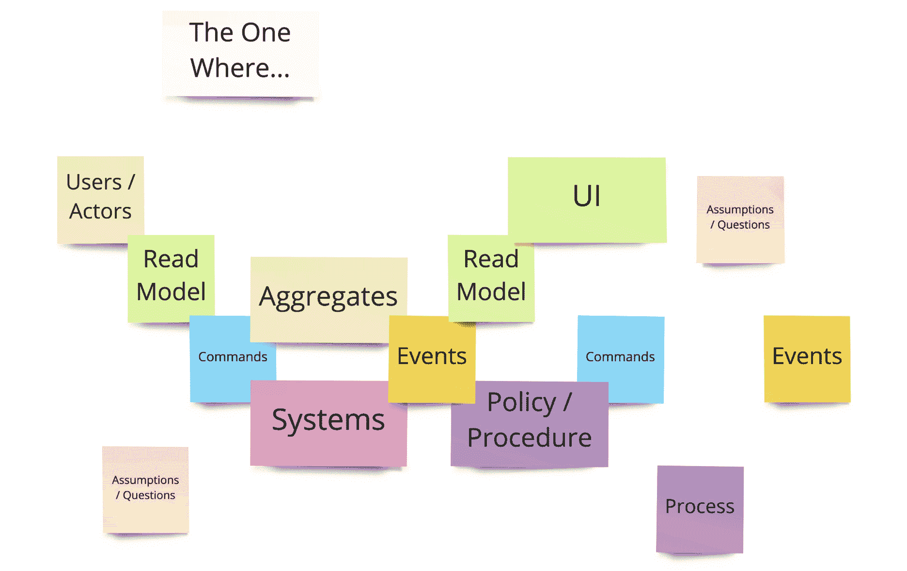
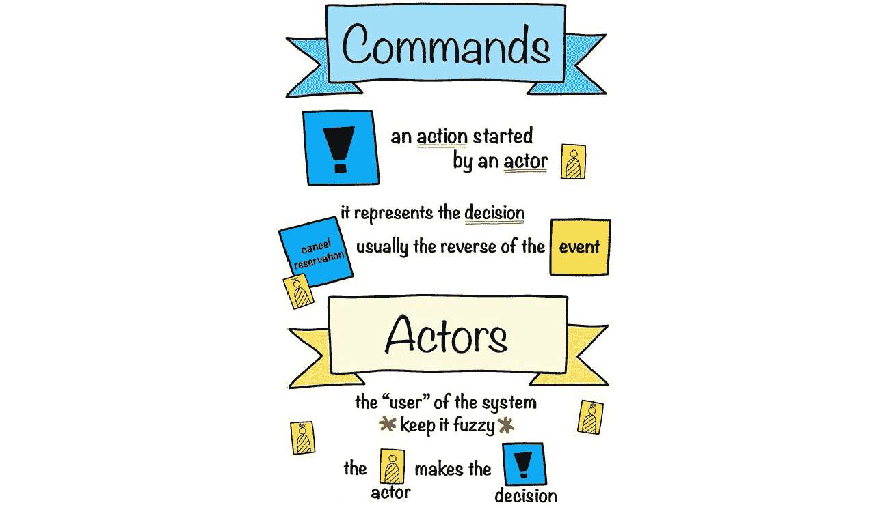
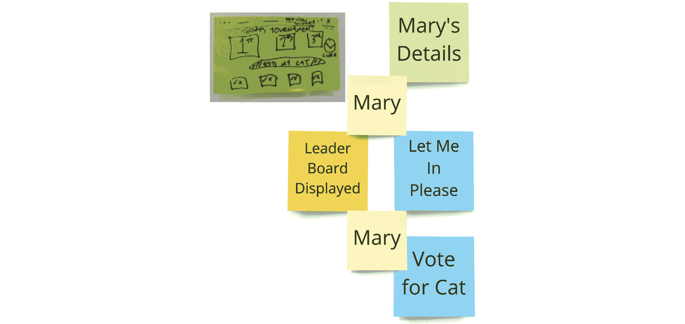
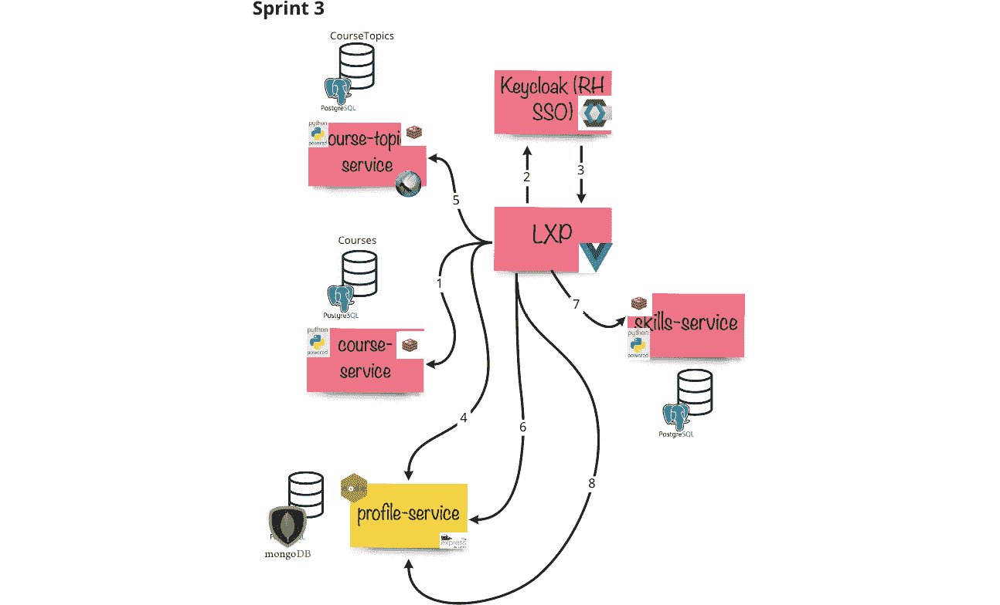

# 第九章：9. 探索“如何做”

在上一章中，我们开始了发现循环的第一次迭代。我们专注于那些帮助我们发现我们为何以及为谁解决问题或实现机会的实践。

在本章中，我们将把重点转向共同学习如何开始构建一个解决方案，以解决这些人面临的问题或为他们带来新的机会。我们将探索的帮助实现这一目标的实践包括：

+   **事件风暴**：一种富有色彩的实践，它将业务过程可视化为事件驱动的领域，并展现新兴架构。

+   **新兴架构**：我们遵循的一项原则，即通过从事件风暴和其他文档中获取足够的信息来启动我们的架构，并随着我们增加更多复杂性，架构逐步展开。

+   **非功能性地图**：一种实践，促进讨论，探索解决方案的不同非功能性方面。

+   **基于指标的过程图**：一种实践，它允许我们捕捉遗留系统的一些基准测量，并识别系统中的瓶颈，同时为转向更连续交付模式提供有力依据。

总的来说，我们最喜欢的实践之一就是事件风暴，因为它非常具有协作性和包容性。它为团队中的每个角色提供了价值。客户常常告诉我们，使用事件风暴在几天内实现的成果，在业务分析项目中可能需要数个月才能完成。

## 事件风暴

事件风暴是一种敏捷和精益的方法，旨在让团队在技术领域项目中进行合作、集思广益，并学习如何在共享理解的基础上工作。

图 9.1：事件风暴色块拼图

事件风暴是一个建模工作坊，用于可视化业务或系统内的过程。它能够提供来自组织不同层级的视角。在业务操作层面，大局观事件风暴可以识别组织结构之间的差距和困扰，突出交易中的权衡，并指明需要改进的领域。我们可以通过业务过程建模或应用功能建模放大到更低层次的细节。这些实践使得开发人员、设计师、最终用户和业务利益相关者能够使用共享语言进行交流，无需依赖复杂的技术术语。

虽然一开始过程可能显得复杂，但它已经成为我们在开放创新实验室与客户合作时最喜欢的实践之一。通过这种技术迅速打破知识孤岛并可视化业务流程的短时间，是我们最为印象深刻的地方。事件风暴是我们用来获得对业务流程运作的共同理解，同时可视化潜在问题和解决方案的技术。经过多次引导事件风暴后，本章这一部分是我们实施事件风暴的指南，并分享我们如何最佳应用它的经验。

首先，你需要一个大的建模表面，理想情况下是一面很长的墙，比你想象中的空间要多。你还需要足够的空间让人们围绕建模表面站立并观看。

图 9.2：一群人在建模表面周围进行风暴讨论

### 什么是事件风暴？

事件风暴由*阿尔贝托·布兰多里尼*创建 1，并在许多博客网站、维基百科和 YouTube 上有所记录。我们将尽量总结我们在使用和引导这一实践过程中所学到的知识。

1 [`medium.com/@ziobrando`](https://medium.com/@ziobrando)

图 9.3：完整的事件风暴，详细描述了两个客户旅程

从本质上讲，事件风暴是一个群体进行对话，讨论业务目标，并将这些内容记录在便签上的过程。如果邀请了合适的人，讨论和视觉化映射将有助于突出之前可能隐藏的依赖关系。突出这些依赖关系可以帮助团队避免在技术和业务层面做出错误的产品决策。

事件风暴是一种探索和发现的模式。它源自于**领域驱动设计**（**DDD**）。DDD 是一种面向复杂领域的软件设计方法，侧重于语言和领域。我们喜欢把事件风暴看作是一种简化版的 DDD——DDD-Lite——它更加专注于业务，减少了术语和复杂性。通过将业务领域专家与开发人员聚集在一起，我们可以通过应用一种共同的、通用的语言，协作构建过程模型，帮助开发人员对事件驱动系统建模并发现微服务。

图 9.4：事件风暴方法与人员

事件风暴工作坊汇聚了来自组织各个部门的人。它不专注于任何特定的技术，因此与会者可以暂时不关注这些技能。与会者的唯一要求是他们的精力、注意力和愿意尝试的态度。在事件风暴工作坊中，每个人都会拿到橙色便签——即**事件**——以及他们所带来的关于自己公司部分的知识。

软件创作是一项探索性任务，在探索过程中，会发生更多的学习。捕捉这些学习至关重要。事件风暴的目的是将所有这些知识可视化成一个基于事件的思维导图，并识别其中的空白、未知和痛点。通过合适的受众参与事件风暴，你可以在那些传统上从不接触的群体之间建立起和谐，更重要的是，在之前可能存在误解的地方达成共识。

在一场事件风暴工作坊中，可能会有了解业务需求和要求的业务分析师，与开发人员一起识别**命令**和**事件**，这些命令和事件将作为特性来实现。再加上 UX 设计师（与最终用户合作）进行 UI 设计和数据模型验证来支持这一过程，突然间，你就从头到尾达成了一致。你还可以在写下一行代码之前，提前验证什么是可行的，什么是不可行的。

如果你想了解更全面的事件风暴背景，可以查阅《开放实践库》，在这里你可以找到更多的链接、文章以及我们在实际工作中与客户一起使用事件风暴的例子。我们将重点关注过程和功能层面的事件风暴。

让我们来看看进行一场成功的事件风暴所需的材料。

### 材料

事件风暴的材料是进行一场成功事件风暴所需的一切。

首先，你需要便利贴，并且需要大量的便利贴。想象一下一个非常大的数量，然后再翻倍。事件风暴使用一个非常特定的颜色编码规则。坚持使用作者指定的颜色非常重要，因为这能在你从事件风暴 1 到事件风暴 2 的过程中保持一致性。

接下来，你需要充沛的精力。事件风暴是一项高度集中的工作坊，需要参与者全程保持注意力。澄清误解需要合适的人，并且这些人能够大胆发言。带上大量的好咖啡、充足的水和水果！

你需要一个宽敞的开放空间。给自己提供一个无限制的建模表面。可以铺开一些绘图纸，或者如果墙面空间有限，使用可以移动和添加的大号泡沫板。你不希望因为墙面空间不足而限制收集到的信息量。

人是最重要的材料。邀请合适的人。邀请最终用户、业务分析师、架构师、业务负责人、产品负责人和开发人员。尽可能多的人参与，事件风暴会更加完整。一个优秀的事件风暴教练和主持人会努力邀请所有了解产品的人以及所有参与产品建设的人。如果人数太多，他们会寻找来自各部门或团队的代表，这些部门或团队组成了跨职能小组。

我们为想要体验购物清单式事件风暴的朋友们准备了一个亚马逊购物清单 2。一旦你有了所有材料，接下来就可以参考配方，烹制一场精彩的事件风暴了。

2 [`amzn.eu/dViputa`](http://amzn.eu/dViputa)

### 配方

事件风暴的配方就是做事的清单以及按照顺序完成它们！

首先，你需要预热烤箱。我们的意思是“黑客”空间。把房间里的椅子都移走，并在一个大空白墙面上标出一个区域，准备铺设建模表面。椅子会让人坐下来，进而导致人们不参与，最终可能会让人打瞌睡！给自己留足够的空间，铺开你的绘图纸/泡沫板。如果可能的话，不要从角落开始，尽量从房间的中央开始。若从角落开始，只有 50%的人能够围绕它，这样会导致一半的知识无法传达给大家。

图 9.5：铺设建模表面

拿出**事件风暴流程图**，它是事件风暴的关键或图例。我们通常会在工作坊前一晚制作海报（用大号的翻页纸粘纸），因为这会占用不少时间。将它挂起来，确保所有与会者都能看到。对于初次接触事件风暴的人来说，他们一开始会频繁查看它作为指导。

图 9.6：事件风暴流程

如果你打算与分布式团队成员一起进行事件风暴，更多数字化的版本可以添加到数字工具中（如 Miro 或 Mural）。

我们通常会在此阶段和与会者一起走一遍事件风暴的流程。这个过程可能会让人感到非常压倒，因为要介绍的内容很多。我们会基于一个虚构但与大家相关的例子来创建并演示，帮助强调关键点。通常，我们会选择一个待办事项应用程序，或者更具体一些，如在线亚马逊购买。每个人都能与这些内容产生共鸣。

所有食材准备好，烤箱预热完毕，现在是时候开始制作混合物了！我们从事件开始。

图 9.7：事件图例

我们首先要做的是设定事件风暴工作坊的目标。这可能是流程的入口点、出口点，或两者都是。介绍之前图片中显示的事件海报。在最简单的形式下，事件就是过去发生的某些事情，是某人关心的内容。设定好起始点后，要求与会者分成两到三人一组，找出他们能想到的系统中的所有事件。给这个活动设定时间限制。我们通常一开始设定为 15 到 20 分钟，并在过程中时刻关注，确保大家专注并进行讨论，必要时澄清一些事情。如果小组中有领域专家（SMEs），我们确保他们被平均分配，而不是集中在一个小组中。领域专家通常是最适合引导这个初始事件脊柱构建的，因为他们对相关领域了解较多。

确定了团队的事件后，要求自愿的小组将他们的事件呈现给大家，将事件添加到建模面板上并开始讲述故事。严格遵循事件的时间线，从左到右进行。第一个自愿展示事件脊柱的小组成员将获得金奖以表彰他们打破僵局。我们通常会在便签上画一个奖章并颁发给这个人，让他们带着骄傲佩戴！一个小技巧是，不要从建模空间的最左侧完全开始。当随着更多知识的揭示，事情开始被移动时，这个空间可以用于进一步扩展。

图 9.8：代表她小组挂上事件

让其他小组将他们的事件添加到时间线上。鼓励与会者将自己的事件沿表面重新排列，为更多事件腾出空间。如果各组用不同的词汇来描述相同的事件，尽量达成语言上的共识。明确那些尚未完全发展的事件。例如，如果一个小组有一个非常高层次的事件，如*物品已订购*，将其细化为更低层次的细节，比如*物品已加入购物车*或*结账已开启*。如果有任何问题或假设需要被确认，若无法立即回答，请标记出来。

很重要的一点是，要将那些无法自信回答的问题暂时搁置并继续前进，否则你很快就会陷入细节之中。确保给足讨论时间，以防可以解答这些问题，但如果无法解决，请用粉色便签标记为问题。最初，**问题**标签会使用得非常频繁，这是可以接受的；因为在这个阶段，我们对系统的集体知识最少。当标记一个区域为问题时，意味着这段对话不会被忘记，必要时可以再回到这个问题上。一个好的做法是，直到讨论充分后再揭示这个问题卡片，以便能够顺利推进。如果需要的话，确保用多个便签记录下讨论的各个方面。

在创建了事件的主干之后，让团队从前到后，再从后到前地进行故事演绎。通过过程中出现的对话，添加任何遗漏的事件。在这一阶段，我们通常会用胶带从单个事件垂直标记**关键事件**。这些在框定关键部分的边界时非常有用，并且能帮助快速识别时间线中的重要部分。

下一部分介绍了事件风暴谜题中的大部分关键要素。现在是时候介绍**参与者**、**命令**、**读取模型**和**系统**了。为每个部分添加图表，以便它们在视线范围内。与小组一起逐步讲解，并澄清是否有任何误解。

命令代表用户根据从读取模型中获取的信息做出的决策。参与者是发出命令的人，而系统是接收命令的对象。系统有责任对命令做出响应，并因此触发一个事件。

这一部分介绍的内容比较多，因此，重要的是确保大家不会被接下来的谜题内容压倒。如果听众需要更多相关的例子，可以考虑通过一个简单的例子来帮助理解。我们倾向于将这些要素添加到主干中，这样例子就可以在更广泛小组创建的流程上下文中展开。

我们的下一个关键部分提供了一种机制，用于捕捉问题、假设以及外部系统。

图 9.9：问题和外部系统键

接下来是命令和参与者。

图 9.10：命令键

现在（暂时）需要添加到关键部分的还有读取模型。

图 9.11：读取模型键

事件风暴海报应详细说明关键部分并附上示例。现在，团队应准备再次添加流程中的新部分！分成小组，但成员要轮换。如果某些领域有专家，再次确保他们分布在组内。

要求小组提出命令被发出给哪个参与者、命令是什么、以及哪个系统接收了命令。再次将此任务时间限定为 15 分钟。若事件数量较多且小组成员较多，团队可以选择先集中在两个关键点之间的事件，并详细展开。这可以加速进程，之后所有内容将一起回放，从而达成共享的理解。

我们尽量避免让小组陷入系统是内部/外部还是应该如何命名的问题。最好保持模糊，直到最后我们真正需要了解低级别的细节。对我们来说，系统在这一阶段的主要任务只是确认有一个东西，命令被发出到这个东西，从而触发相应的事件。根据我们的经验，这种模糊性有助于防止人们陷入困境，并保持讨论的高层次，使每个人都感到参与其中。

让小组将他们对事件风暴的补充部分呈现给其他小组。通过这样做，会激发更多讨论，并且会发现更多空白。捕捉假设并在这次重现过程中添加缺失的部分。

图 9.12：三组围绕关键事件进行头脑风暴

如果团队围绕关键事件进行了划分，并且小组希望有更多时间来完善流程，我们通常会将小组轮换到不同的关键事件之间的新部分，设定新的时间框，并重新开始。这有助于验证其他小组的工作，并且通过新鲜的视角进一步完善流程，揭示更多知识。

在下一个小组重现完整事件风暴时，我们引入了下一个关键部分。政策和程序与子流程一同被引入。

图 9.13：政策和程序关键

政策和程序是填补命令与事件之间一些空白的好方法。当小组在重现故事时，提出类似*这个总是会发生吗？*这样的问题，或说出*每当发出命令时*、*我们总是做这个事件*等话语。这样做可以揭示事件之间一些尚未想到的小细节。我们认为这就是为什么 Brandolini 称这个卡片为**谎言探测器**的原因。

子流程是停放那些在工作坊范围内不会被深入讨论的内容的好方法，但它们会在以后被回到，通常是在单独的事件风暴会议中。

我们曾与一个客户合作，他们有一个第三方履约流程，这个流程超出了他们试图揭示的流程范围。紫色子流程的便签被用来标记这一未探索的区域，并在后来的研讨会中回到这个部分。一段简单的胶带被用来连接两个流程，当它们被嵌套在一起时，以确保两个流程之间的视觉连接不会丢失。一个重要的提示是不要使用标记笔或圆珠笔，因为这个流程可能会在以后被（重新）移动！

图 9.14：围绕一些停放的子流程进行头脑风暴

流程中不可避免地会出现分支。我们使用视觉方式标记这些分支，用快乐或悲伤的贴纸表示流程的正向和负向。我们通常先建模快乐路径。通常，每个快乐流程都会对应一个悲伤流程。在我看来，子流程是一个很好的方法，可以在不被流程中不相关分支困扰的情况下捕捉这些内容，尤其是在工作坊的范围内我们并不打算探讨这些分支，或者希望稍后再详细回顾。

如果一个事件导致有大量命令可用，我们将它们垂直堆叠，以便逐一展开流程。如果时间紧迫，最好只选择一两个流程进行展开，其他的可以稍后再处理。在分支发生时，重要的是要集中精力关注事件风暴的目标，而不是被低质量的信息所困扰。

随着大部分拼图块就位，事件风暴此时应该开始讲述一个更详细的故事。继续前后反复播放这个故事，从中间开始，并向各个方向展开。挑战所有已出现的条目，不要害怕加入或推翻错误的观念。随着知识的增加，你会开始注意到问题便签的数量逐渐减少。

如果你正在建模的系统有 UI 组件，一个很好的补充是将一些高层次的 UI 加入到阅读模型中。用便签上的简单草图可以快速验证 UI 可能需要哪些组件，并验证所需的数据是否能被提取。如果你邀请了应用程序的终端用户参加事件风暴，和他们一起回顾事件风暴并结合 UI 设计进行验证，将非常有助于进一步验证流程假设。

图 9.15：团队在绿色便签上为事件风暴添加 UI

最后，是时候确定并命名聚合根了。聚合根是系统的状态机。

图 9.16：聚合根

它是接收命令并决定是否执行该命令的部分。我们仅在流程的早期引入系统，因为聚合根可能是导致最大混乱的部分，也是最大的时间消耗者——尤其是在尝试命名它时！

到最后再处理，可以清除掉大部分未知的部分。当流程更加清晰时，我们让团队重新回顾事件风暴，找出系统是已经存在还是需要构建的。如果需要构建，我们添加一个黄色的聚合根卡片，并给它起一个无意义的名字，比如“组合器”。这样做有助于让大家不被困在该聚合根应该定义的边界上。

继续回放流程，团队会自然而然地开始识别出一些命令是发送给组合器的，其他的则是发送给其他组件的。把这些标记为“其他”。当事件风暴完成一轮之后，再返回去为其命名。理解的深度应该足够高，以至于聚合体的名称和边界应该自然而然地显现出来。

## 与怀疑者进行事件风暴

这不是秘密——事件风暴是我最喜欢的实践。我认为它是一种极其多用途的实践，可以在不同的细节层次上使用，和公司各个部门的人用一致的语言沟通。你可以将其反馈给最终用户来验证用户旅程，同时也可以通过识别所需的系统设计来让技术人员参与其中。

当我为一家瑞典汽车制造商工作时，我们使用事件风暴来为我们的应用程序设计解决方案。我们合作的一位 Java 工程师最初对这个过程持极大怀疑态度。他曾告诉我，他看到我们进来时心里想，*哦，来了些便签小队*。但一旦我们开始了，他很快就被说服了，他看到随着设计师、业务分析师、开发人员和用户的共同参与，解决方案逐渐在我们面前展开。

几天之后（是的，真的几天！），他走到我面前，告诉我他有多么震惊，在这么短的时间里，我们竟然揭示了如此多的领域知识，并且已经揭示了足够的解决方案，让我们可以开始尝试技术并进行构建。他信服了！

事件风暴是如此多功能——在同一次合作中，我们围绕用户如何在他们的应用程序中创作新内容来构建我们的事件风暴。它是一个基于知识的应用程序，因此内容操作是一个关键组件——可以将其看作是一个汽车版的维基百科。在建模时，我们遇到了流程的一个部分，其中用户在旅程中编辑一些文本并保存他们的进度。产品负责人一直说用户将保存他们的文章然后发布，这让我产生了一些警觉。一个用户需要点击的保存按钮以便继续进度，似乎有点奇怪。在我看来，应用程序应该是透明地保存用户的编辑内容，而不是像微软 Word 97 那样设计，而是像 2020 年代的现代 Web 应用程序。

所以，我挑战了产品负责人，并说：“我们是不是应该让应用自动保存？”他不同意，认为用户可能希望手动保存他们的进度。我想，既然如此，让我们使用事件风暴来做个实验吧！我们列出了支持和反对手动保存的两方观点，并将它们写在粉色便签纸上，以表示我们正在做出的假设。我倾向于在需要进一步探索或实验的便签纸上贴上圆点贴纸，这样在查看完整模型时会更容易识别。我们在模型上放置了一个占位符事件，表示*进度已保存*，直到我们做了更多研究。

图 9.17: 使用事件风暴讨论自动保存功能

然后，这一假设被写入了我们的待办事项列表，设计师们能够通过一个可点击的原型进行实验，看看用户需要什么或想要什么。在这个可点击的原型中，没有保存按钮，在测试后询问参与者他们是否觉得缺少保存按钮时，所有受访者都表示，他们认为在更新内容时，进度已经被保存了。

回到事件风暴，现在我们验证了我们做出的假设。这意味着我们可以继续建模，深入理解用户流程。它还意味着我们可以根据这个理解，扩展从技术角度看需要构建的内容。

我总觉得，事件风暴是在特定时间点上，以我们房间里人的知识为基础，做出的最佳猜测。通过设置一个社会契约来确保心理安全，意味着我们可以自由地探索我们的系统。我们能够做出猜测，并且可以返回这些猜测，或者在地图上放置占位符，直到我们做了进一步的研究。这也是为什么事件风暴，特别是与其他实践相结合时，是发现和设计系统的绝佳工具。

让我们回到 PetBattle 的故事，看看他们的团队是如何构建他们的事件风暴的。

## PetBattle 事件风暴

PetBattle 团队决定使用事件风暴来设计他们的系统的一部分。像所有优秀的团队一样，他们从定义他们将要映射的示例开始。这一点很重要，因为它框定了端到端的旅程，避免他们将应用程序的模型做得太大。

!TOP-TIP => 团队正在使用《老友记符号》作为他们的示例。这是基于美国情景喜剧《老友记》3，每一集的标题都以“The One Where”开头。他们从影响图中提取了一些交付成果，深入到系统设计中，并提出了*《玛丽参加每日锦标赛并赢得奖品》*。

3 [`en.wikipedia.org/wiki/Friends`](https://en.wikipedia.org/wiki/Friends)

他们将这一点添加到他们的事件风暴中，放在左上角，然后加入时间，接着构建出事件的主干。

图 9.18: 《玛丽参加每日锦标赛并赢得奖品》

每个团队成员根据示例定义的边界提出了所有事件。从地图的中心开始，一位团队成员将他们的事件放到地图上，并向团队描述故事。

其他团队成员填补了空白，加入了他们的事件，从而形成了故事的整体主线。这些是宠物对战事件风暴的第一个便签。可能还有其他事件位于这些事件之间，但团队目前对他们所挖掘的深度感到满意。

图 9.19：添加到板上的第一个事件

当两名团队成员书写了不同的事件但内容相似时，最初将两者都放到板上，并进一步讨论，最终就事件的措辞达成一致。

在这个例子中，*猫咪照片已审阅*与*猫咪照片已验证*是讨论的重点。理顺事件的语言对于确保团队使用一致的术语非常重要。

图 9.20：捕捉第一个未知/问题

如果他们无法达成一致，或者需要对流程做出假设，我们使用粉色便签来突出讨论，并将其记录在建模表面上。例如，团队决定此阶段不需要详细描述图像验证的工作方式，但可能会在以后返回讨论这个问题。

团队继续探索事件主线。他们通过从左到右再到从右到左地阅读故事来填充事件主线，并根据需要添加新事件。一旦他们对事件主线感到满意，就开始处理命令和数据。

图 9.21：宠物对战事件主线

团队现在在画布上添加了三个新元素：

+   **演员** – 系统中的“谁”

+   **命令** – 由演员执行的操作或决策

+   **读取模型** – 执行某个操作所需的数据

我们可以开始讲述用户旅程的叙事。在这个例子中，我们的角色玛丽，*打开了宠物对战*。每当发生这种情况时，我们会展示当前的领导者，包括每只猫的投票数、猫的图片以及主人的名字等信息。

图 9.22：通过事件风暴叙述玛丽的宠物对战之旅

在查看排行榜时，玛丽有许多选项可供选择。在事件风暴中，事情是按照时间顺序发生的。有些命令可能会并行执行，或者在流程中的任何时刻进行。一个好的惯例是，尽快将命令添加到地图上，以便演员能够执行。

当玛丽进入排行榜页面时，她可以选择许多不同的操作。她可以登录并开始游戏，投票支持正在进行中的猫咪比赛，或者直接离开该网站。我们的惯例是将这些命令进行堆叠，因为每个命令可能代表需要映射的另一个流程。团队需要避免过于偏离正在映射的示例，因此这些命令被捕捉并添加到看板上，但不会进一步探索。

图 9.23：堆叠命令

读取模型可能不仅仅是数据，它还可以包括一个低保真的 UI 原型。小规模的 UI 实验为收集用户反馈提供了极好的机会。这使我们能够在不写一行代码的情况下获得产品方向。

例如，当*排行榜已显示*事件发生时，我们可以勾画出其样子。这为我们的参与者提供了一个概览，展示了他们可以使用哪些选项以及如何与系统互动。

图 9.24：勾画 UI 想法

PetBattle 团队的事件风暴正在通过添加命令、读取模型和参与者逐渐成型。

图 9.25：完整的事件风暴正在成形

PetBattle 团队现在添加了他们集成的任何外部系统以及政策/流程和聚合。

紫色的政策便签是将规则或习惯添加到事件风暴中的好方法，它将命令与未由参与者发起的事件相连接。

图 9.26：添加第一个政策

在我们的示例中，每当我们打开应用程序时，我们都会立即显示排行榜。参与者并没有请求显示它们，因此我们可以通过*显示排行榜*程序将*网站已打开*事件与*显示领导者*命令相连接。

命令必须始终发给一个系统或一组系统。该系统必须决定是否接受或拒绝命令，并传播相应的事件。这会导致两种情况：顺利路径事件（所有过程顺利）或异常路径事件（发生错误）。一般来说，顺利路径事件的价值更大，因此我们通常会对顺利路径进行事件风暴。然而，捕捉和质疑异常路径事件也有价值，例如，*猫照片无效*事件——*我们现在需要关注这个问题吗？*

在我们的示例中，*显示领导者*命令被发给了*比赛服务*。比赛服务是一个新的实体（一个聚合），负责保存当前（以及可能是之前）比赛的赢家状态。

图 9.27：添加到事件风暴中的流程、政策和服务

PetBattle 团队继续沿着流程进行，并进行事件风暴，探索 Mary 如何参加比赛。现在，事件风暴可以像故事一样阅读，捕捉团队现在或稍后可以探索的关键内容。从左到右阅读，Mary 使用她的图像和 ID 将她的猫咪加入比赛，然后该命令被发出到一个猫咪服务，负责保存猫咪的属性，如图像和所有者信息。

每当照片被上传时，我们会执行验证图片策略。团队知道他们正在进行一个关于图片上传的顺利路径（happy path）风暴，因此他们假设这张图片是一只猫咪。为了不去思考图片验证如何工作，他们用一个紫色的菱形便签做标记，稍后再处理。**不适合家庭观看**（**NSFF**）过程是确保互联网上使用的图片对儿童是安全的过程。这个需求可以追溯到我们影响地图中的交付物。团队本质上在此处用紫色便签标记，知道在其他验证完成后可以返回处理。完整实现 NSFF 过程可能需要大量信息，可能还需要进一步的发现步骤。现在，我们已经收集了足够的信息，继续进行我们的事件风暴。

假设猫咪照片是有效的，我们立即通过*锦标赛报名策略*将 Mary 的猫咪加入比赛。*锦标赛*服务将来自多个来源的信息聚合成一个新的有意义的对象。它使用刚刚上传的*cat.id*、Mary 的 ID 和 Mary 的猫咪获得的投票数。*锦标赛*服务处理 Mary 的猫咪在排行榜上的位置，并与其他参赛猫咪进行比较。当*动物爱好者*们现在开始游戏时，他们将会修改当前比赛中每只猫的总票数。

在 PetBattle 的早期版本中，当没有足够的玩家上传自己的猫咪时，系统会从互联网随机抓取猫咪。在事件风暴（Event Storm）中，这个外部系统被捕获在一个粉色便签上。下面的示例展示了我们如何建模这种交互。我们从*锦标赛*服务中获取比赛猫咪，这时未找到猫咪，触发了*空竞赛*策略。每当发生这种情况时，我们总是从互联网随机抓取猫咪并将其添加到游戏中。在事件风暴中捕获第三方系统可以突出我们应用程序中存在的依赖关系。

图 9.28：使用粉色便签捕获外部元素

在 PetBattle 的事件风暴中，跨职能团队包括了他们的 UX 团队的代表。*用户界面*卡片为我们提供了创建高保真原型的能力。如果小组无法就某个问题达成一致，或者必须做出假设，则可能需要与一些最终用户进行验证。

在宠物对战的情况下，我们围绕排行榜的设计展开了一些激烈的讨论。我们无法就展示多少只猫达成一致，即是展示前 10 名还是仅展示前三名。我们也无法决定是否应该始终展示玛丽上传的猫，即使它没有吸引足够的投票进入前列。

我们决定把这个讨论记录在一张粉色便签上。这张便签代表着需要进一步探索的工作，并且可能需要一些用户研究，以了解游戏玩家希望在这里看到哪些功能。像所有工作一样，这可以被记录下来并加入我们的待办事项列表。团队也可以构建多个版本的应用程序，展示前三名猫和前十名猫。使用 OpenShift，我们可以部署这两个版本的应用，并收集一些关于用户参与度指标的反馈，帮助确定玩家更偏好的版本。在本书的下一部分，我们将探讨一些关于部署策略的选项，如 A/B 测试，这将帮助我们基于行为和影响来学习最佳解决方案。

图 9.29：使用粉色便签表示尚未最终确定的功能

在事件风暴练习结束时，流程代表了团队在仅知道现有信息的基础上做出的最佳猜测。它不是一个静态文档，而是一个在团队构建图上识别的一些功能时会被重新审视的文档。我们现在有足够的信息来设计系统组件之间如何交互。

我们将会看到所有这些信息是如何被其他实践在《Mobius Loop》中的选项透视部分*第四部分，优先考虑它*中使用的。

### 事件风暴的最终思考

事件风暴是一种出色的技术。它提取的领域知识以及完成的时间非常有力。它可以在商业层面上用来识别痛点和改进领域，就像价值流图一样。较低层次的事件风暴是一个很棒的、沉浸式的、协作性强的软件设计过程。我们强烈建议你尝试，它虽然很难做到完美，但多加练习就能成功。

在下一部分，我们将讨论我们发现技术架构的方法。现在我们已经完成了第一次事件风暴的运行，我们应该准备进行一些实验并编写一些代码！

## 新兴架构

此时，传统的架构方法通常是编写一个高层次或详细的设计文档。这通常需要几个月的时间，并且是由企业或解决方案架构师来执行的活动。它通常涉及大量的 UML（统一建模语言）图示和很多技术讨论与验证的页面。让我们看看一种更符合我们目前发现实践的方法。

渐进式架构的理念是，我们只需掌握*足够的*业务领域知识和*足够的*逻辑架构理解，以便交付高商业价值的功能。在这个阶段，可以决定主要的架构方法，比如解耦服务、事件驱动架构、API 和流媒体应用——接下来，这些方法将在随后的迭代中得到完善。

在我们的事件风暴中，我们深入研究了一个或两个 TOW（The One Wheres）。我们希望确认这些聚合体、命令和读取模型能提供正是该业务领域部分所描述的能力——不多也不少。

通过采取渐进式架构方法，我们不会在尚未带来商业价值的全面架构上浪费时间。也许未来产品的方向或特性优先级的调整意味着这个架构实际上永远不会被使用，从而避免了时间的浪费。

随着团队逐步交付解决方案，他们将获得更高水平的共享理解和对整体解决方案的信心。这意味着，任何未来的解决方案讨论都能从这种额外的背景和理解中受益。

在我们进行第一次事件风暴后，架构的初步草图如下所示。

图 9.30：宠物战斗事件风暴的第一次迭代

我们尚未完善 AUTH（身份验证）、NSFF 和通知流程的细节。这些通常会在后续的事件风暴实践中进行扩展。然而，考虑到书籍的线性结构，我们决定在这里添加这些内容，以便给你一个未来架构可能呈现的样子。

## 将事件风暴转变为渐进式架构

事件风暴应该很好地支持一个渐进式架构。事件风暴识别了需要构建的系统和聚合体。这可以给你一个很好的思路，告诉你软件设计应该朝哪个方向发展，但并不意味着所有内容都需要提前构建。你可能会通过用户实验了解到某些功能是不必要的，或者你对事件风暴的初步想法还不够完善。这可能听起来像是不良设计，但实际上这只是通过实验演化出来的更优质的设计。

我们与**世界卫生组织**（**WHO**）4 进行了一次合作，旨在验证他们的架构并围绕其新的学习体验平台建立一个强大的跨职能团队。这是全球卫生专业人员将用来从世界卫生组织获取学习内容的平台。

与团队一起进行的初始事件风暴提出了一些有趣的需求服务。课程服务，这是一种目录类型的服务，以及一个高度可用且可扩展的身份验证提供者，被确定为关键组件。作为读者，您可能无法看到下面图中的所有细节，但这并不重要——它只是用来展示已经收集到的信息量。

图 9.31：我们 WHO 项目的事件风暴

我们的事件风暴并不复杂，但在经过多周和信息修订后，它看起来像这样。每个项目的细节并不是特别重要；可以说，长的粉色和黄色便签代表了我们需要从技术角度构建的独特 API。最终，通过我们的事件风暴，我们发现了大量的组件，但并非所有组件都与最终用户验证过：

图 9.32：在 WHO 事件风暴中发现的组件

我们知道我们有很多工作要做，但也知道我们不需要一次性完成。从我们的事件风暴中，我们迭代地构建功能和特性，根据需要将其添加到架构中。这意味着我们可以保持专注和精简，始终关注大局，同时避免使目标过于复杂。

图 9.33：第一次冲刺中出现的架构

我们在每次冲刺中都不断发展解决方案设计。我们将设计与事件风暴进行重新验证，只有在需要时才会添加新组件。我们的第一次冲刺引入了基本元素：一个简单的前端应用程序与 Red Hat 单点登录服务器的实例进行通信（上游项目称为 Keycloak）。

第二次冲刺中，我们添加了第一个微服务，这些服务在事件风暴中作为系统或聚合被发现。在随后的冲刺中，我们增加了更多的功能，推出了新组件，并对以前的组件进行了加固。我们为之前构建的服务增加了缓存，以提高查找性能。我们能够逐步构建，然后在打好基础后加入像缓存这样的复杂功能。

图 9.34：第二次和第三次冲刺中出现的架构

图 9.35：第五次冲刺中出现的架构

我们通过不断回顾事件风暴并建模更多的“某人之旅”，不断演化我们的系统架构。每次这样做时，都会发现新的服务。

在一个例子中，WHO 想要创建一个丰富的推荐引擎，帮助卫生保健工作者更快地找到相关的健康信息课程。我们需要收集偏好数据，以便能够提供推荐。因此，我们创建了一个入职流程来帮助收集这些信息。

在我们添加新功能时，我们不断与最终用户进行连接，提供了一个反馈循环，帮助我们验证最初的设计假设。到了最后一个迭代周期，我们系统的复杂性增加了，但我们架构中的每个项目都可以追溯到其在事件风暴中为用户服务的目的。

4 [`www.redhat.com/en/success-stories/world-health-organization`](https://www.redhat.com/en/success-stories/world-health-organization)

在前面的实际案例中，我们利用缓存加速了 API 调用。接下来，我们将查看一种实践，这种实践有助于揭示解决方案中的非功能性方面。

## 非功能性地图

非功能性属性有助于定义整个解决方案的可用性和有效性。非功能性地图是一个工具，用于捕捉并阐明团队努力交付的系统的非功能性需求。到目前为止，大多数实践集中在与业务特性或最终用户能够直接关联的功能性方面。

非功能性需求被划分为在画布上每个区域表示的部分，这些部分会被逐个检查并由小组成员逐步填充。

图 9.36：非功能性轮盘

我们可以使用这个映射工具，以可视化结构化的方式来获得对系统非功能性方面的共享理解。完成后，你应该能够清楚地看到解决方案的关键非功能性考虑因素。将这些内容可视化有助于突出显示需要工作的地方，以实现它们。

这是一个非常简单的实践，执行起来非常容易，且只需在合适的人员参与下一个小时就能完成：

1.  确保所有参与者都对标题及其含义感到舒适。

1.  对于每个标题，捕捉系统或解决方案的重要考虑因素或需求，并为每个项目添加便签。根据参与者的数量，你可以使用诸如 1-2-4-all 或分成小组等引导技巧来捕捉项目。

1.  对于每个标题，将便签作为一个小组进行回顾。

1.  在回顾时，思考每个便签是否应该是：

1.  被添加到待办事项并优先排序的项目，因为它需要工作才能实现。

1.  应该包含在其他待办事项完成定义中的一个项目。

1.  其他待办事项的接受标准的一部分。

## 从非功能性地图到待办事项

诸如事件风暴或用户故事映射等发现实践是促进对话并为待办事项生成工作的出色工具。然而，当试图揭示解决方案的非功能性需求时，它们并不理想，因为它们通常更侧重于业务流程，推动功能特性和最终用户方面的解决方案。我们在最近的一个项目中与一个大团队一起使用了这一实践。我们分成了三个小组，每个小组都有自己独特的便签颜色。

图 9.37：非功能性需求图

这项活动为技术人员提供了一个很好的机会，讨论我们应用程序的非功能性方面。这个工具证明是一个有用的平台，可以邀请其他利益相关者参与其中，这些人并不直接参与构建解决方案，但他们在设计中有利益关系，比如安全团队的成员。团队对他们认为最重要的项目进行了投票，以便进一步讨论。

图 9.38：聚焦非功能性需求图中的部分项目

聚焦于轮图中的某些部分，如可靠性，团队提出了一些想法，如健康检查和就绪检查。从安全角度出发，高可用性和漏洞扫描成为需要探索的话题。我们讨论了我们认为最重要的项目，然后将其转录到我们的待办事项列表中。我们图上的几乎所有项目都是团队可以完成的工作。

一些项目被放入了我们的待办事项列表，作为技术难题（或未知因素）以便进一步探索，其他则很容易写成用户故事，供团队实现，例如 Kubernetes 的就绪探针和存活探针。

图 9.39：非功能性需求图导致的 Sprint 待办事项

非功能性轮是一种很好的实践，可以启动关于解决方案所有不同非功能性方面的对话。它可能不会在交付速度和将代码交付到生产环境的前置时间方面促进对话。这是 DevOps 的一个重点，因此我们希望在我们的发现循环中关注这一点。为了将焦点转向持续交付，捕捉一些交付过程的基准度量是非常有帮助的。

## 探索持续交付的案例

在本章中，我们探索了一些我们最喜欢的实践，帮助我们进行产品发现：通过影响力映射发现“为什么”，通过以人为本的设计实践发现“谁”，通过事件风暴和新兴架构发现“什么”。我们开始探索如何做的部分，使用非功能性图。我们想要介绍的最后一组实践，旨在促进我们如何开发软件，并且是基于度量的。

我们从客户那里得到的最常见问题之一是，他们如何能更快、更频繁地将软件发布给用户。通常，他们已经采用了敏捷交付技术（例如，他们可能正在使用 Scrum 框架），但似乎每年只能进行一到两次生产发布。这是为什么呢？

第一个线索可能是过度关注交付框架。正如我们在*第一部分，《实践成就完美》*中介绍的，当我们介绍 Mobius 循环时，成功的 DevOps 文化和实践要求在持续发现和持续交付之间保持平衡，同时需要强大的文化和技术实践基础。

要真正理解为什么将软件发布到生产环境需要这么长时间，我们需要了解瓶颈在哪里。我们需要可视化从业务利益相关者提出新功能请求的那一刻起，到该功能在生产环境中运行并被使用的那一刻为止的所有环节。

在*第一部分，《实践成就完美》*中，我们介绍了价值链的概念。价值链专注于从生成初步业务需求列表开始，直到软件的大规模发布在生产环境中运行为止的所有环节。DevOps 的目标是加速这个价值链。一个有助于可视化所有这些步骤并捕捉关于它们所需时间的指标的实践被称为**基于指标的过程映射**（**MBPM**）。

我们在*第一部分*《实践成就完美》中介绍了**价值流图**（**vsm**），所以你知道它是一个宏观级别的图，展示了某项服务或产品从开始到交付给客户的端到端流程。另一方面，MBPM 是一个更为详细或微观级别的视图，展示了 vsm 中某些阶段或单个流程如何交付价值。这些详细视图展示了流程和指标，帮助提供瓶颈的洞察。

### 基于指标的过程图

让我们从一个简单的软件开发流程例子开始。在现实中，这张图会更为细致，展示更多的步骤和角色，但为了清晰起见，我们先来看这个简化的例子：

图 9.40：MBPM

地图的布局应该从左到右阅读：

+   每个演员或角色都有一个水平泳道。角色位于最左侧的列（示例中的黄色便签，如 BA、开发、QA 等）。

+   在开始练习之前，需要定义一个明确的起点和终点。在这个例子中，起点定义为收集需求，终点为将新代码部署到生产环境。

+   每个非角色的便签都有一个与事件对应的标题。

+   执行该事件的演员角色与演员便签水平对齐。

+   事件从左到右流动，较早的事件位于左侧，较晚的事件位于右侧。

+   并行发生的事件垂直排列。如果角色之间有共享的工作，那些也应当是分开的便签并垂直排列。

+   每张卡片包含三个指标：

    +   **提前时间**（**LT**）：在正常工作时间内，从开始到完成完成任务所需的总时间。这包括任何空闲时间或等待其他角色完成工作的时间。

    +   **处理时间**（**PT**）：某人积极参与任务处理的总时间。这是交付时间的一个子集。

    +   **完成度和准确度百分比**（**PCA**）：任务首次尝试完成并且准确的时间百分比。这是一个随着先前依赖步骤的完成而累积的百分比。

    +   关于过程执行的任何有用信息，例如是否是批量处理或有调度（如果有，何时调度），以及有多少人参与执行任务。

图 9.41：交付时间与处理时间

在这个例子中，我们有一个软件交付流程，看起来像是传统的瀑布模型——收集需求、开发、测试和部署代码。通常，MBPM 会更为细化；例如，不是说开发者 *实现代码*，而是可以将其细化为：

+   编写单元测试

+   编写实现代码

+   构建代码

+   部署代码

+   开发者的集成测试

+   同行评审

+   修复同行评审中识别出的问题

+   文档编写

### 寻找和进行改进

一旦完成流程图，你就有了一个供团队和利益相关者吸收的沟通工具。流程图还能帮助管理层看到痛点。这些成本具有时间价值，而时间价值伴随着成本，因为这些问题会不断发生。如果你的管理层具有前瞻性思维，他们可能还会考虑到失去的机会成本。你可能会面临竞争对手更快、更便宜地交付价值，这正在侵蚀你的市场份额。

要进行改进，请寻找以下方面：

+   **交付时间远高于处理时间**：这可能意味着某些任务被滞留在队列中或在等待其他人完成，这通常发生在交接时。有没有办法减少这种等待时间？

+   **完成度和准确度低**：为什么这么低？如果答案不明显，这是与团队进行无责追溯的好时机。我敢打赌有人能够提供为什么会发生这种情况的见解。

+   **不必要的步骤**：你能在没有某些步骤或者简化某些步骤的情况下交付价值吗？

+   **可以自动化的事务**：减少人工步骤可以提高速度和准确性。

+   改变操作顺序是否有帮助？也许提前完成某个步骤或者并行进行可能会提高准确性。

你可能会看到许多问题，可能会诱使你尝试一次性解决所有明显的问题。更好的策略是先从最大和最容易解决的问题入手，并从中优先列出一系列想法。记住，要在改进过程中保持灵活：专注于小范围的工作，以确保更快的工作交付。获得快速反馈循环，并根据反馈重新调整优先级。

一旦做出更改，你需要相应地调整你的流程图。你应该密切关注指标：在当前工作量下，指标是否有所改善？

图 9.42：MBPM

### 通过迭代进行改进

像这样的工具不应该是一次性的改进，它需要作为一个迭代性的努力来使用，不断进行改进。你的流程图应该是墙上的艺术品（如果你有一个物理上共处的团队），随着你的改进，它是活的、变化的。它在那里提醒并激励未来的改进。它对于新团队成员的入职也非常有帮助，因为你可以通过视觉化的方式向他们展示流程是如何运作的。

在我们的例子中，也许可以在测试方面增加一些改进，因此，下一步可能是某种形式的自动化测试。

当你解决了显而易见的问题并实施了更现代的行业实践时，你可能会发现自己进入了一个改进不再那么显而易见甚至有些值得质疑的阶段。这时候，度量标准可以帮助你判断改进是否让你变得更快。然而，为了弄清楚这一点，你需要进行实验。从技术角度来看，当你在早期处理显而易见的变化时，你实际上是在进行实验，但由于这些变化成功的可能性非常高，所以它可能并没有被看作是实验。随着你进入那些不那么显而易见的改动时，你可能会做错，并根据度量标准实施一个较慢的变化。这是可以接受的；你在学习（顶尖的表现者总是在学习）——只需要停下来反思。这是一个适合复盘的好时机，也许你可以改变想法，或者你可能需要回滚那个变化并尝试一些全新的东西。

我喜欢通过分层的方式来思考自动化改进。如果你在一家非技术公司的 IT 部门工作，该部门可能最初是为了自动化你所服务行业的业务流程而成立的。然而，随着时间的推移，IT 部门本身也需要被自动化，以更快地交付业务流程自动化。这是第二层次的改进。在这一第二层次中，你可以引入像 MBPM 这样的工具，帮助识别 IT 部门内可以改进的领域。例如，你可能最终会采用一些常见的行业解决方案，如自动化测试或 CI/CD 管道。你甚至可以将自动化推进得更远；你可能很快会意识到你需要围绕度量标准收集进行自动化。手动收集 MBPM 度量标准可能会耗时且重复，并且容易出错。为了加速反馈循环并释放人员处理其他工作，你可能希望自动化度量标准的收集。

当然，所有这些自动化工作是有成本的，但也可以从中受益，这就是为什么度量标准如此重要，能够帮助你判断收益是否值得付出成本。而且，你不应该等到度量标准收集自动化后才开始使用 MBPM。首先从简单的做起，了解流程以及你想收集的信息，然后在进入正轨后再进行自动化。

## 使用 MBPM 定义整个参与过程

在开放创新实验室，我们与客户进行时间限制的驻场合作。它们持续时间在 4 到 12 周之间。

在与芬兰电信公司合作时，他们的重点是改善特性开发的提前期，采用 OpenShift 的一些自愈和自动扩展功能，并深入了解 Kubernetes 和站点可靠性工程。

与我主导的其他大多数项目不同，我们在这个驻场项目中不会进行任何应用程序开发。没有新特性，没有新的业务功能，没有新的功能发布。这个项目纯粹是非功能性的，专注于提高团队负责的服务的运行效率。

这感觉是一个完美的场景来展示 MBPM 实践。这不是我之前在新的绿地产品开发项目中使用过的实践。但是，考虑到这是一个遗留的棕地应用程序，且专注于改进和优化，这种发现实践会非常有帮助。

团队由应用开发团队的代表、应用运维团队的代表以及基础设施专家组成。在几天的时间里，这三个人将他们在开发和运维过程中的所有知识结合在一起，创建了一个 MBPM。

图 9.43：跨职能团队构建他们的 MBPM

从中得出的几个关键学习点包括：

+   由于预定虚拟机时间的服务级别协议（SLA），任何开发的开始都有较长的提前期。

+   由于依赖第三方团队来触发这些操作，等待构建和部署完成时浪费了大量时间。

+   由于进行大量的手动测试，一些质量保证工作存在较低的完整性和准确性。

下图中的黄色便签纸显示了所有映射到 MBPM 的流程。粉色便签纸代表了我们如何优化指标或甚至使流程完全过时的想法。

图 9.44：为芬兰电信公司创建的 MBPM

三周后我们回到 MBPM（在三次一周交付迭代之后），我们在蓝色便签纸上记录了由于引入了持续交付基础设施而带来的基于指标的改进。

图 9.45：为芬兰电信公司更新的 MBPM

这可视化并量化了引入容器、持续集成、持续交付、基础设施即代码和自动化所带来的好处。

让我们看看 PetBattle 如何执行 MBPM 练习，以捕获一些基准指标。

## PetBattle – MBPM

当前的《PetBattle》应用部署过程非常痛苦，需要花费很多小时手动复制和部署工件到一个树莓派集群，该集群还是一个媒体服务器集合，安装在其中一位开发人员桌子下。

这让新的工程团队感到担忧，他们建议将现有的软件交付过程中的所有环节可视化。这样可以形成共享的理解，帮助他们更好地了解《PetBattle》这款爱好者应用是如何运作的，并思考如何在应用开始扩展时进行优化和改进。

由 Tim 领导的团队在墙上创建了一个 MBPM（管理业务流程图）。关于谁参与了发布《PetBattle》、相关人员以及某些事件发生的时间，进行了大量讨论。团队最终确定了以下流程，代表了发布周期中的实际情况。

图 9.46：《PetBattle》MBPM 的开始阶段

其中一位《PetBattle》的开发人员（Mike）会通过检出所有代码来开始发布周期。接下来的步骤是检查所有需要合并的功能分支是否都已正确合并。在找到所有正确的代码分支时，会有一些延迟。打包代码时失败的概率为 25%，因为更新配置值总是手动完成，且容易出错。部署到树莓派集群可以开始，通常需要 1 小时，因为这是一个 CPU 密集型任务。因为只有一个集群，所以部署过程中会暂停《PetBattle》服务。

通常，另一位对树莓派硬件最了解的《PetBattle》工程师（Noel）会花时间修补并更新集群操作系统和工具。在做这项工作时，通常会发现一些硬件问题，需要订购新零件。等待零件到货最多需要三天，且常常导致整个集群不可用，从而导致测试发布的等待时间过长。

接下来，团队中最优秀的测试人员（Donal）会执行手动测试计划。由于发布已经部署，用户通常在不知情的情况下使用新版本，常常出现大量故障。Donal 的测试通常会有一半的失败，通常是因为测试计划需要更新，或者有很多 BUG！Donal 认真地将发现的 BUG 录入电子表格，并与其他开发人员分享。通常，他会搞混细节，导致 20%的报告缺陷信息记录错误。

图 9.47：《PetBattle》MBPM 的结束阶段

开发人员会花费几天时间修复 Donal 电子表格中报告的所有缺陷。代码再次被合并、打包和部署，通常与首次部署时相似的故障率。

现在，最终用户可以使用经过完善的代码。通常，最终用户和 Donal 同时测试功能，他们会将缺陷和故障报告到 PetBattle 的邮件列表中。

通过这项实践，团队确定了几个他们一致认为应该实施的措施：

+   使用云基础设施中的容器

+   基础设施自动化

+   持续集成

+   持续交付

+   测试自动化

+   安全自动化

MBPM 是一种提供基准指标、识别流程瓶颈并推动改进案例的卓越实践。它确实需要一个心理安全的环境，因为这些指标可能并不特别令人愉快。团队成员不应害怕传播这些信息，也应该在共享信息时感到安全和诚实。

我们将在*第五部分 – 交付它*中回到 MBPM，届时我们将衡量并了解在交付循环中所做的改进。

## 结论

在本章中，我们继续了 Discovery 循环的旅程，重点讨论了我们将如何交付解决方案——或者至少，我们将如何开始。

我们研究了 DDD，特别是事件风暴实践，这有助于可视化业务流程。我们的事件驱动架构开始从事件风暴中逐渐显现。我们开始通过进行假设来进一步推动用户研究，以便形成我们的功能开发待办事项。

我们还研究了一些有助于形成我们需要考虑的非功能性工作的实践——非功能性地图和 MBPM。后者使我们能够获取与遗留软件交付过程相关的关键度量，并识别一些我们可以采用的持续交付实践，以帮助改进和优化这些过程。

本章和上一章为开发/配置工作提供了许多想法和候选项。它们都在实践中产生的工件中得到了可视化。

图 9.48：Mobius 循环的发现阶段

在下一章中，*第十章，设定结果*，我们将探讨如何将所有这些信息提炼成可衡量的结果。然后，我们将研究如何以一种能够开始逐步交付价值并且定期进行的方式来组织和优先考虑所有这些想法。
