# 第十章：10\. 设定成果

在上一章中，我们使用实践来帮助提取大量细节，以确认我们将解决哪些问题、为谁解决这些问题以及我们采用何种实验性和渐进式的方法来解决这些问题。

通过使用影响映射（Impact Mapping）和以人为本的设计等实践，我们现在应该对客户和业务痛点有了较好的理解。在开始开发软件解决方案之前，我们需要将这些问题转化为潜在的业务和客户成果。我们还需要利用从这些工件中获取的所有信息，以及从这些实践中获取的信息，确保我们交付的成果是真正有意义的。

在本章中，我们将探索到目前为止在 Mobius 循环的*发现*部分所进行的所有学习，以明确界定并清晰地表达团队致力于为满意的利益相关者和最终用户交付的目标和成果。这包括：

+   解释输出与成果之间的区别

+   为什么我们应该设定目标成果

+   如何捕捉目标成果

+   一些目标成果的示例

+   如何可视化目标成果

+   如何将目标成果与其他实践进行优化和链式连接

设定目标成果可以包括以最终用户（客户）为基础的成果，也可以包括以业务和能力为基础的成果。在使用 Mobius 时，成果应该是可衡量的。我们应该始终能够为当前状态和目标状态分配一个数值。通过定期检查这些度量标准，我们可以确定我们是否朝着成果前进，是否已经达成目标，或者如果没有达成目标，是否需要调整并改变方法。

## 什么是成果？

如*第一部分，实践成就完美*中所述，Mobius 循环鼓励通过使用持续发现和持续交付的创新流，采用迭代的实验方法来实现成果。成果是通过做某事而产生的结果。在我们的案例中，成果是人类行为的变化，这推动了文化的改变，进而影响了长期的业务结果。

目标成果实践帮助团队发现、编写、对齐和共享他们希望通过应用产品实现的行为变化。共享目标成果有助于团队交付可衡量的结果，并与利益相关者和团队成员对齐。参考目标成果有助于优先排序和筛选工作，使我们始终专注于交付可衡量的影响。

目标成果实践涉及创建一个画布，总结团队和利益相关者所捕捉到的预期和希望的可衡量变化。这个文档作为一个信息展示板，强化了在其他实践、活动和讨论中使用的目标成果，这些内容来自 Mobius Loop 的其他部分。交付循环中的“衡量与学习”环节关注于评估成果。我们将在*第五部分，交付它*中深入探讨这一点。本章将讨论在发现循环（Discovery Loop）中设定成果。

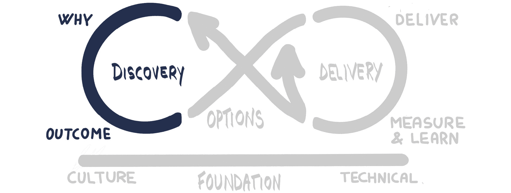

图 10.1：发现循环

在前一章中，我们介绍了影响映射（Impact Mapping），并描述了影响（Impact）与交付（Delivery）之间的区别，影响是我们希望在行动者身上实现的可衡量变化，而交付则是可实施的工作任务。让我们更深入地探讨成果与输出之间的区别，因为理解这一点非常重要。

### 成果与输出

输出是团队完成的具有明确范围的工作成果。例如，实现一个功能、执行一个实验或进行一些研究、一个 UI 原型或技术探索。组织有时会推动增加输出，因为他们认为更多的功能意味着更高的价值。但事实并非总是如此。实际上，更多时候，少即是多，并不是所有的输出都能直接转化为价值。例如，如果顾客从未使用某个功能，或者根本没有请求过这个功能，那么实现这个功能并不会增加价值。想想你曾使用过的那些功能过载、但从未使用的系统，然而其中一两个关键功能却是一直在使用的。当团队将重点放在成果而非输出时，团队可以迭代出那些真正能带来价值的功能。

团队有时会发现很难识别共享的成果，因为成果与输出之间的区别不清晰，或者他们无法看到自己提出的输出与组织希望他们实现的成果之间的联系。

*Joshua Seiden*在他的书《成果高于输出》1 中描述了**成果是驱动商业结果的人类行为变化**。我们可以通过下图展示输出、成果与影响之间微妙但非常重要的区别。

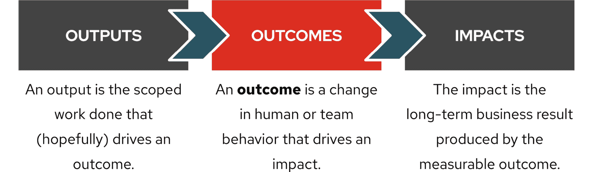

图 10.2：输出、成果与影响

1 [`www.senseandrespondpress.com/managing-outcomes`](https://www.senseandrespondpress.com/managing-outcomes)

通过将对话焦点转向成果，我们是在思考我们希望对用户和其他利益相关者产生的影响，正如通过影响映射（Impact Map）所展示的那样，影响与行动者之间的联系。从我们的影响映射中，我们已经识别出可以积极参与的不同行动者群体，通过实验、交付和反馈来测试我们的假设并学习。

### 为什么要设定目标成果？

目标成果实践能够与团队、利益相关者和客户建立共享的对齐和目标。

通过不断在显眼的信息展示板上展示目标成果，团队可以被提醒项目的成功标准。这些提醒引导团队在日常活动中朝着项目成功的方向努力，例如：

+   对工作项的评估与优先排序

+   其他 Mobius Loop 实践中的讨论

在开放实践库中，强调结果而非产出是一个基本概念。在新项目的早期就确定目标成果，以确保从一开始就对齐。现有项目可以运行目标成果实践，以评估团队的对齐情况，并验证项目是否具有共享的成果。

以下任何一种情况可能表明团队将从确立目标成果中受益：

+   团队因成功在给定的时间框架和预算内交付了新产品或功能而受到赞扬。然而，交付后，团队惊讶地发现客户并未使用新产品。因为项目已经完成，团队无法迅速根据反馈调整产品或功能。

+   日常的团队互动聚焦于完成功能，而不是完成一个能实现预期结果的功能版本。

+   功能或解决方案的过度工程化，使其精雕细琢，远超实际所需。

+   团队在客户与产品互动或提供反馈之前，庆祝了成功交付。

+   最终的产品交付在市场上失败，尽管投入了大量的人力并遵循了敏捷交付方法。在交付过程中使用迭代并未成功交付一个成功的产品。

+   团队交付的范围发生了意外变化。

让我们来看一下如何开展一个简短的工作坊来捕捉目标成果。

### 如何捕捉目标成果

我们通常在进行完 Discovery 阶段——例如创建北极星（North Star）和/或影响地图（Impact Map）等“为什么”和“谁”实践后，立即开展目标成果实践。我们常常在这些会议的最后，通过所有参与者的信心投票，来建立一个共享的视角，看看我们作为一个团队，觉得自己有多大程度的对齐。

这应该导致团队之间对上下文的共享理解。如果这没有起作用，可以考虑开放实践库中其他一些实践，例如“从终点开始（Start at the End）”2、“新闻头条（News Headlines）”3 或“从为什么开始（Start with Why）”4，来建立共享的团队目标或上下文。记住，开放实践库是一个工具箱，因此，如果你尝试过的工具没有完全奏效，不妨尝试其他工具！

基于小组从这些活动中获得的学习，使用静默协作技巧或其他头脑风暴技巧，创建一个潜在目标成果的集合。

使用亲和图 5 来识别潜在结果的模式和分组。通过小组讨论或其他技术（如点投票）达成共识，选出一小部分潜在结果。

审查潜在结果并将其结构化，确保它们是可衡量的结果。确定如何量化和衡量这些结果。识别一个共同的结构来表达这些结果。审查可衡量结果的列表。与所有利益相关者讨论结果，确保这些结果范围不会过于狭窄，并且满足每个人的需求。确保会议中的每个人都同意这些可衡量的结果。

为了帮助阐明有效的结果并评估提议的结果，*Gabrielle Benefield*和*Ryan Shriver*在 Mobius 快速入门指南 6 中建议集中关注以下五个属性：

1.  **名称**提供了一个简单的描述性语句，例如**减少结账时间**。动词通常是改进的方向（增加或减少），而名词是改进的主体。

1.  **衡量内容（规模）**提供了一个一致的衡量单位。示例可以是完成结账所需的秒数。

1.  **如何衡量（方法）**指明了如何以及何时进行衡量，例如使用每日的网络分析报告，其中包括谁负责收集和发布数据，以及这一过程的频率。

1.  **基准度量**提供了当前水平和比较未来测量值的起点。示例可能是结账所需时间为 200 秒。

1.  **目标度量**是期望的成功水平，既可以是绝对值，也可以是相对值。示例可以是结账时间为 60 秒或在第四季度结账速度提高 75%。目标度量可以包括一个日期，明确期望在何时实现目标。

2 [`openpracticelibrary.com/practice/start-at-the-end/`](https://openpracticelibrary.com/practice/start-at-the-end/)

3 [`openpracticelibrary.com/practice/news-headlines-aka-cover-story/`](https://openpracticelibrary.com/practice/news-headlines-aka-cover-story/)

4 [`openpracticelibrary.com/practice/start-with-why/`](https://openpracticelibrary.com/practice/start-with-why/)

5 [`openpracticelibrary.com/practice/affinity-mapping/`](https://openpracticelibrary.com/practice/affinity-mapping/)

6 [`mobiusloop.com/kit/`](https://mobiusloop.com/kit/)

将这五个属性表示为类似于*图 10.3*的箭头图可以帮助可视化结果。

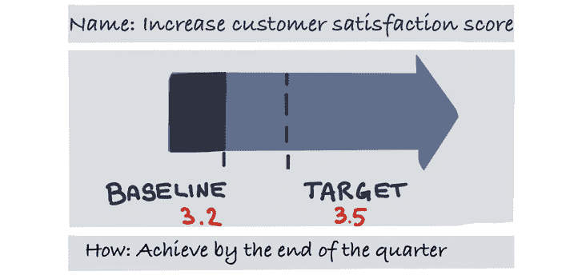

图 10.3：结果的箭头表示

存在其他格式，可以帮助定义结果。尝试不同的格式，看看团队是否能够更有效地使用它们来创建结果。例如，SMART 标准（在前面的图片中介绍过，下面再次总结）定义了目标或结果的五个特征：具体的、可衡量的、可实现的、现实的和基于时间的。

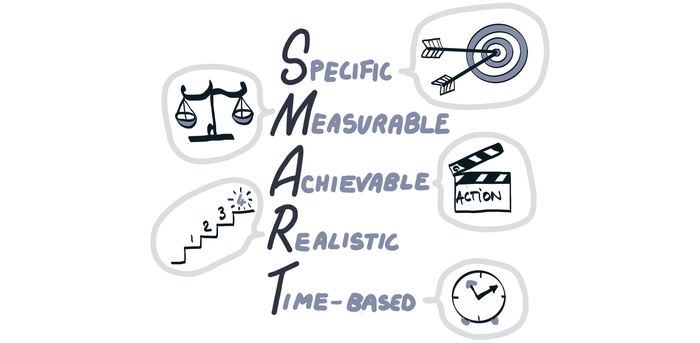

图 10.4：SMART 结果

更强的结果陈述是可以衡量的，或者可以分解为多个衡量标准。我们的交付方法以转向迭代式方法为中心，定期发布增量价值。我们希望先衡量目前的结果，然后在开始进行功能实验时，再继续衡量结果。

在开始交付时，我们应该能够定期暂停并衡量实验或倡议的影响，以确保我们从中学到东西，并且我们所做的工作要么朝着目标可衡量结果前进，要么触发调整或重新思考。

让我们来看一些例子。

### 目标结果示例

为了为本节中的目标结果示例提供背景，考虑问题解决时间的情境。

在早期的 Discovery Loop 活动中，软件产品团队使用亲和图分析客户反馈数据。分析显示，许多客户对解决软件问题所需的时间感到不满。团队认为，响应时间的不满正在影响客户留存率。

团队使用**基于指标的流程映射**（**MBPM**）实践，正如上一章所介绍的，来识别对响应时间产生负面影响的重要瓶颈。通过这一练习，团队识别出几个效率低下的流程环节。

其他 Discovery Loop 活动揭示，运营相关方对更频繁的产品部署感到紧张。频繁的部署不能导致运营人员的额外计划内或计划外工作。

团队使用目标结果实践来：

+   讨论 MBPM 实践结果和其他发现的 Discovery 实践。

+   列出团队项目的潜在目标。

作为目标结果实践的结果，团队创建了信息辐射器，展示了三个目标结果。

在这个例子中，服务提供商此前有一项服务水平协议，承诺始终在 30 天内解决复杂的配置问题（如果需要，还包括现场访问）。随着即将进行的产品开发，目标是将解决时间缩短到 20 天。通过这一举措，组织希望将客户满意度调查分数（满分 5 分）从 3.2 提升至 3.5。希望在不增加操作人员额外手动工作的情况下实现这一目标。

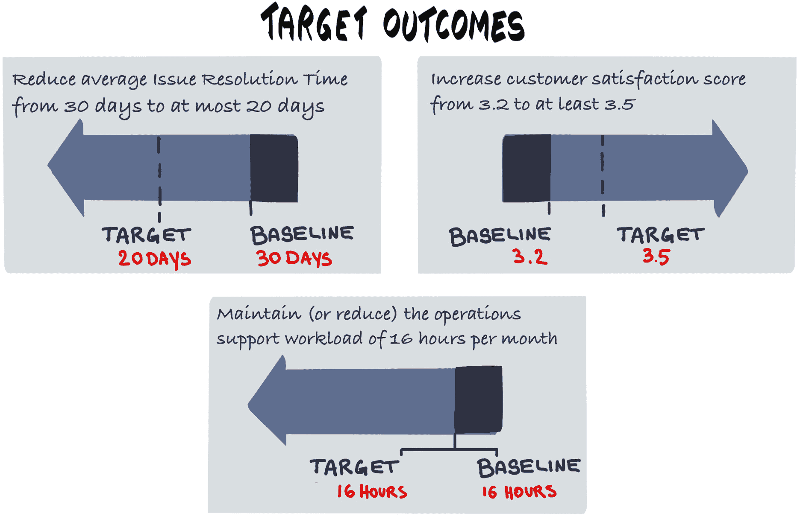

图 10.5：目标结果示例

目标结果文档提醒团队：

+   聚焦于寻找和设计能够减少客户问题解决时间的方案。成功的解决方案能够将平均解决时间减少至少 10 天，并且不会增加运营人员的工作负担。

+   团队认为，成功的解决方案还将至少使客户满意度得分提高 0.3。

+   如果团队能够交付一个实现部分（但不是全部）目标成果的解决方案，那么团队将利用选项调整的实践来决定是否需要调整方向。他们可能决定进行更多的交付（另一个交付循环），尝试将度量进一步推进到目标。或者在反馈之后，他们可能会认为新的度量已经足够，可以转向下一个目标成果。或者可能会进行一些重新排序。这些选项将在下一章中详细探讨。

+   团队可能决定：

    +   重新审视发现实践，并根据团队从上一季度活动中学到的内容，更新下一季度的目标成果。

    +   追求不同的解决方案来实现相同的三个目标成果。

最好用可视化来表达和理解产品在实现目标成果方面所处的位置。

### 可视化目标成果

一个展示成果关键特征的单一视觉图帮助每个人清晰理解当前状态和期望的未来状态。在 Mobius 中，这些被称为成果跟踪器。随着想法的规划和实施，这些视觉图会更新，展示随时间推移的进展。公共空间中的可视化，如团队房间或社区区域，有助于在规划和设计活动中让成果随时可见。这种方式轻柔地提醒每个人成功的样貌，使其更加易于接触和理解。展示迄今为止取得的进展能给团队带来一种正向前进的满足感。展示缺乏进展或朝错误方向发展的情况，能促使团队做出更快的反应，甚至可能与实时回顾更新或停止工作事件结合使用——这些都是我们在*第二章，建立基础*中介绍的实践，旨在构建我们的开放文化基础。

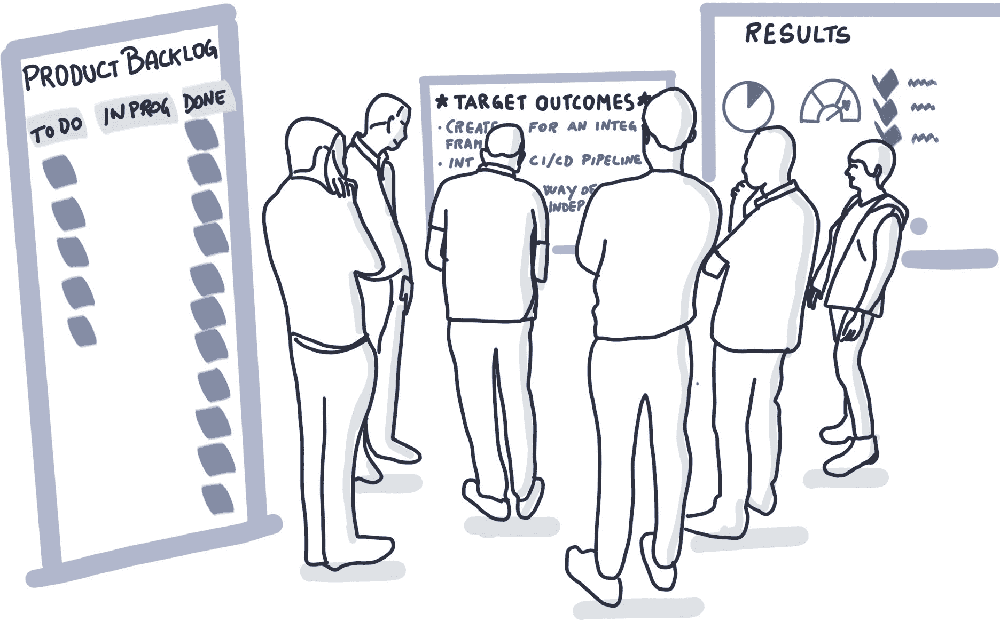

图 10.6：可视化目标成果

可视化目标成果有助于达成一致、共享理解，并展开关于如何改进和优化的讨论。

### 优化目标成果

就像我们在本书中的所有实践成果一样，我们**永远不会完成**，随着我们从后续交付和更多发现活动中学到更多内容，我们总能改进。目标成果实践旨在为实践的实施提供方向。在我们衡量并从交付周期的输出中学习时，我们可能会发现一些我们在发现循环中做出的假设已经无效，并且我们可以利用这些新的学习重新进行发现实践，从而产生改进版的目标成果。

团队可以在整个循环中参考已达成的目标结果来指导决策。使用目标结果来优先处理工作，并拒绝不贡献于目标的计划外工作。

目标结果必须有一个时间框架。定期衡量每个目标结果的进展情况，包括在指定的时间段结束时。当每个目标结果的时间期结束时，团队将评估情况，并在需要时决定添加新的目标结果，并为其设定相应的时间周期。

随着我们从客户那里获得更多反馈，随着不断变化的产品增量，它可能会导致方向调整，甚至可能需要新的或修订过的目标结果。我们将在后面的章节中详细探讨这一点，特别是在探索（Discovery）阶段的选项转变（Options Pivot）和交付（Delivery）阶段的选项转变（将在《第五章，交付它》中讨论）。

目标结果不是一种可以单独进行的实践。它需要由多个其他实践来支持，并且其结果会推动新的实践输入。

### 将目标结果与其他实践串联起来

目标结果实践可以单独进行，但我们强烈建议在一些其他探索性实践之后进行。通常，利益相关者会在一开始就明确表示他们知道产品或项目的目标结果应该是什么。然而，在明确了产品或组织的北极星愿景，进行影响映射会议，使用以人为本的设计实践如设计思维，考虑通过事件风暴或 MBPM 设计未来状态架构之后，他们的看法可能会发生重大变化。由更深入的背景探索和对用户与利益相关者增加的共情支持的目标结果，可以更清晰地展示究竟要实现什么以及为什么要实现这些目标。

因此，我们开始看到将这些实践串联起来的影响。将所有实践的产物清晰展示给从业者意味着，他们可以随时关注他们从实践中获得的所有精彩学习，以便在他们将所有学习提炼为一组可以衡量的目标结果时，保持一种清晰的视角。

另一个不应被忽视的优秀实践例子是优先级滑块。在这个过程中，我们获得了许多利益相关者的对齐与共识，达成了一致的产品或项目优先级。因此，当我们阐述目标结果时，我们应该时刻提醒大家我们在此处达成的共识。

这是卓越引导真正发生的地方。一个优秀的引导者不会成为讨论背景和细节的中心，而是会针对在先前实践中产生的信息提出开放性问题。他们还会牢记团队应该聚焦的目标以及他们要努力实现的内容。他们希望达成可以衡量的目标结果。

准备一个有大量便签和笔的工作空间，有助于促进一个很棒的目标结果会议。这也可以通过使用如下模板，在虚拟环境中实现，模板可以从本书的 GitHub 仓库下载。

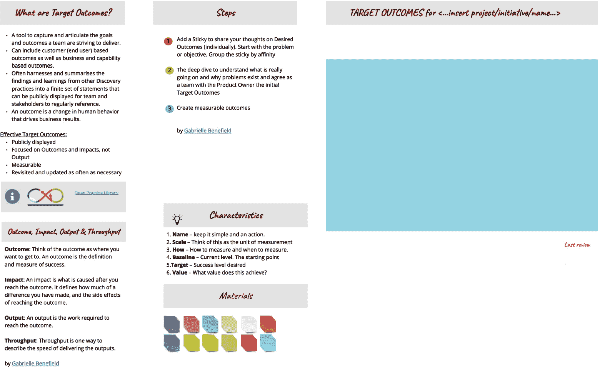

图 10.7：目标结果画布

让我们回到《PetBattle》团队，探索他们在“发现循环”之旅中产生的目标结果。

## 《PetBattle》目标结果

《PetBattle》团队对以下目标结果达成了一致：

1.  《PetBattle》通过增加活跃用户基础产生了收入。

1.  《PetBattle》始终在线。

1.  一个充满热情的团队，激动地构建和运营《PetBattle》。

这里展示了三个不同的类别。#1 – 产生收入 – 显然是一个与用户活跃度增加直接相关的商业目标（这是我们可以验证的假设）。目标结果 #2 指的是产品《PetBattle》的稳定性和可用性 – 当该产品突然火爆，导致系统崩溃时，用户体验非常差，并且由于《PetBattle》无法上线供用户访问，根本没有机会产生收入！目标结果 #3 是基于团队文化的结果 – 拥有一支真正拥有产品所有权感的参与团队，他们会在工作中更加快乐，并且会更加积极响应、充满动力地在未来持续成长和改进产品（这是我们可以验证的另一个假设！）。

让我们来看第一个目标结果：即《PetBattle》通过增加活跃用户基础产生了收入。这显然是一个可衡量的结果。我们可以在任何时间量化系统中注册的用户数量、网站访问量、参与用户数量、用户进行的互动活动量，当然，还有通过广告商获得的收入。

我们可以很好的可视化我们目前拥有的基准指标，以及希望通过产品的短期增量达到的目标指标。

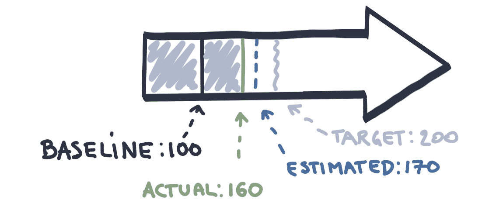

图 10.8：目标结果 – 活跃用户基础增长（以千为单位）

让我们来看第二个目标结果：即《PetBattle》始终在线。从应用程序的早期版本开始，就因其巨大的人气而出现了稳定性问题。我们现在可以收集一个指标，代表现有网站的正常运行时间，并可视化如何将其改善，达到始终在线的目标可衡量结果。

图 10.9：目标结果 – 始终在线

我们的第三个目标结果是：我们有一个充满热情的团队，激动地构建和运营《PetBattle》，并专注于员工的参与度和满意度。这也可以通过量化员工的幸福感和参与度来衡量和可视化。

图 10.10：目标结果 – 员工参与度和满意度提升

大量的对话和合作有助于达成关于目标成果的共识。当我们最终与所有利益相关方达成共识，确认这些是我们要努力达成的成果时，我们喜欢将它们保持高度可见且易于访问。它们应该成为我们从这一点开始做的所有事情的参考点。当我们开始交付功能和产品增量时，它们应该引领我们朝着已达成一致的目标成果迈进。通过从我们的产品中捕捉度量数据，实时获取我们的迭代交付数据，能够让我们审视、评估、调整和优化之前做出的决策。

在上面的示例中，我们看到三种非常不同的成果焦点。它们不仅仅涉及应用或业务，而是跨越了应用、平台的功能，以及团队的表现和动力。这是我们与许多客户合作时观察到的模式。

## 三者平衡：人/流程/技术

在我们的开放创新实验室驻场项目中，我们在 4-12 周的时间框架内，将客户的产品团队沉浸到 DevOps 文化和实践中，并使用 OpenShift。

我们开始这些合作时，会使用影响力映射（Impact Mapping）和以人为本的设计实践，旨在为合作设定一组目标成果。

我们发现，当成果不仅仅专注于技术或应用或文化，而是三者的结合时，最终合作的影响力会更强大。

我们早期的一次合作确立了以下三个成果：

+   已经设立了与 DevOps 合作的新标准，包括团队的技能组合。

+   一个新的应用程序正在生产环境中运行。

+   团队在使用这个产品时感到非常棒、兴奋，并且充满力量。

其中一个成果与技术和平台（DevOps）相关。另一个与我们在驻场期间要构建的一个创收应用程序相关。最后一个是关于文化和团队的。

这是组织中第一个团队朝着 DevOps 发展时，目标成果的一个良好平衡。

上述成果确实缺乏衡量标准，也许没有达到 SMART 原则的要求。

最近与阿联酋客户的成果如下：

+   [客户]可以每天多次无缝部署工作负载，以证明自助服务能力。

+   [应用程序]作为示例无缝部署，证明了一个可复制的模式，用于部署其他 N 个应用程序，并减少变更的上市时间。

+   开发是第一等公民。多职能团队通过使用站点可靠性工程（Site Reliability Engineering）最佳实践，作为一个产品团队获得赋能。

这些结果开始引入可衡量的概念。第二个结果中的魔法词是“减少”。这里有一个可衡量的结果，涉及减少市场变化的时间。这是一个可以在合作前、合作中以及合作后进行衡量的结果。

最后的例子来自一个专注于医疗保健的非政府组织：

+   提高授权和技能水平，使得[应用程序]可以自信地拥有和管理。

+   为[应用程序]创建一个更加开放的数据模型，使得[用户]能够越来越多地被我们的系统吸引。

+   在一个可扩展、安全、稳定的平台上，明确的开发生命周期通过增强的安全性、自动化和监控（可审计性）来衡量。

再次，我们看到在这三个结果中，团队、应用程序和平台的平衡。所有三个结果也都可以进行衡量。

现在让我们来看一个简单的例子，说明我们是如何衡量一个结果的。

## 电信产品的目标结果——准备好秒表！

我最喜欢的一个以用户为中心的目标结果来自我们与爱尔兰一家电信公司合作的经验。

我们正在为企业客户建立一个新的企业门户，供他们浏览和购买公司手机。

团队使用设计思维实践与前三大企业客户的员工建立同理心。通过对这些用户进行同理心映射，并使用情景映射实践可视化他们的现有流程，突出了几个痛点和在新解决方案中提高用户体验的机会。

目标结果以一种涵盖“谁、什么和惊艳”的格式编写——谁将从这些结果中受益，结果是什么，什么是惊艳因素，或者说是衡量标准。

我们从发现实践中提炼出的三个结果是：

+   员工可以在 30 秒内搜索、查看并选择他们想要的手机。

+   员工可以下单升级他们的设备，并在不到 48 小时内收到新手机，且能继续使用现有号码。

+   员工可以使用他们的公司凭证登录门户，因此他们不需要设置或记住另一个用户名和密码。

这些结果非常微观，专注于特定产品。前两个结果非常可衡量，你可以想象我们的团队在用户测试时已经拿出秒表来测试第一个！

我喜欢这些结果，因为当它们写在一个大而显眼的图表上时，它总结了我们团队空间旁边每个经过的人可以看到的目标。我们需要一个应用程序，让时间有限的用户可以快速完成他们需要做的事情，他们会迅速收到订单，它会顺利运行，并且他们不会觉得需要与另一个公司打交道——他们的体验将始终与他们所在公司的一致。

我们现在已经看到了几个在与不同客户合作过程中设定的目标结果示例。你可能注意到的一件事是，目标结果可以从非常关注最终用户到更关注用于开发应用程序的技术、平台和团队。这引导我们去探索主要结果（更多关注最终用户）和支持性结果（由平台和团队提供）之间的区别。

## 区分主要结果和支持性结果

在前两章中，我们使用了几种不同的实践来发现目标结果。它们中的一些更加关注功能性、应用产品和业务（为什么和谁），而一些则更关注非功能性（如何）。

当我们发现这些不同类型的结果时，我们可以探索它们之间的关系，看看是否存在层级结构。

*Gabrielle* *Benefield* 和 *Ryan Shriver* 解释道 7，*支持性结果，例如减少新开发人员的入职时间、提高测试自动化和减少构建及部署代码的时间，将有助于改善主要结果，比如提高客户体验。*

这可能只是一个假设，需要通过实验和交付来验证。

7 [`mobiusloop.com/kit/`](https://mobiusloop.com/kit/)

让我们来看一些常见的结果示例，它们是主要结果和支持性结果的混合体。

+   **提高客户的速度和质量**：

    +   **提高客户满意度**：使用诸如**净推荐值（Net Promoter Score, NPS）**等工具来衡量客户的幸福感。

    +   **减少交付时间**：从客户首次请求或联系到触发客户满意度的交付时间。

+   **提高质量**：

    +   **减少停机时间**：导致客户无法获得服务的运营事故数量。

    +   **减少缺陷**：影响客户的产品缺陷数量。

+   **可持续性**：

    +   **提高团队满意度**：衡量产品团队幸福感的指标。

    +   **提高员工留任率**：员工流失率。

+   **工作**：

    +   **增加产出**：每单位时间完成的工作项总数。

    +   **提高可预测性**：团队完成承诺的时间比例。

    +   **提高敏捷性**：调整到新优先级的时间。

+   **效率**：

    +   **减少周期时间**：完成交付活动的时间，诸如构建、测试和部署新特性等。

    +   **减少在制品（WIP）**：团队在任何时刻正在处理的项目数量。

    +   **减少技术债务**：你在重构代码库上花费的时间和资源。

组织的具体背景将决定它们是否更关注这些结果中的一两个，并将其作为主要目标结果。如果动机更多地偏向于业务，主要结果可能会围绕产品的表现以及客户的满意度展开。

上述几乎所有的例子也都可以作为促进性结果，我们可以假设，改进这些方面将推动更多业务导向结果的改善。这些例子也引导我们关注探索软件交付技术（如 DevOps）和平台（如 OpenShift）。

### 软件交付度量

2018 年，由*Jez Humble*、*Gene Kim*和*Nicole Forsgren*所著的《加速：精益软件与 DevOps 的科学：构建和扩展高性能技术组织》首次出版。我们强烈推荐这本书，帮助解释如何有效地衡量软件交付团队的表现以及其广泛研究背后的科学和统计数据。

本书介绍了四个可以用来评估任何 DevOps 组织健康状况的指标。其中两个更偏重开发，衡量市场敏捷性；另外两个则更侧重运营，衡量可靠性。

1.  **变更交付时间**：这是指从代码提交到源代码仓库到代码部署到生产环境的时间。较短的变更交付时间更好，因为它能加快反馈周期，使组织更能适应市场变化。

1.  **部署频率**：这是指应用程序部署到生产环境的频率，是批量大小的一个指标。较小的批量大小意味着可以更频繁地进行部署，这也有助于提高市场敏捷性。

1.  **恢复时间平均值**：这是指系统从生产环境故障中恢复所需的时间。我们希望将其减少，因为这很重要，因为我们需要确保加快交付的同时，不会牺牲因故障导致的差劲客户体验。

1.  **变更失败率**：这是指需要回滚和/或修复生产环境中的问题的部署百分比，显然，我们希望将这一比率降低，因为它是稳定性的一个次要指标。

当我们将这四个因素视为软件产品的促进结果时，可以看到一个强有力的假设，即优化这些因素将对产品在市场上的表现和整体客户满意度产生积极影响。能够在保持低平均恢复时间和低变更失败率的同时，实现快速的变更交付和高频率的部署，将意味着一个整体高效的产品。这最终将转化为更高的 NPS、更高的转化率，甚至是市场份额的增加，因为客户通常更喜欢使用快速更新但又可靠的软件。

正如本书已经开始展示的那样，成功采用所介绍实践的团队将在这些软件交付指标中看到积极的效果。文化实践，结合基于指标的过程映射等其他实践，帮助识别瓶颈和交接环节，去除这些瓶颈可以加快变更的前置时间。当我们构建流水线时，使用的持续集成和持续交付实践使我们能够增加部署次数。而且，随着自动化程度的提高，以及通过回顾等实践进行的持续学习，我们可以将**修复平均时间**（**MTTR**）和变更失败率保持在最低水平。

像 OpenShift 这样的平台提供了更高层次的支持。如果没有这些平台，我们将无法为在平台上部署的软件产品实现市场的敏捷性和可靠性。

那么，如果平台是最低级别的支持，是否存在可以基准化并定期检查的指标，以确保这种支持能够传递到软件团队，并最终传递到业务层面？让我们看一下几个平台采用指标。

### 平台采用指标

你可能想要捕捉的一些平台指标包括：

1.  **增长与采用率：** 平台上提供的产品发生了多大变化？有多少服务在运行？

1.  **引导时间：** 引导一名新开发者或运营人员加入平台并确保他们拥有完成工作所需的一切需要多长时间？

1.  **项目配置的前置时间：** 在平台上配置一个新项目并使其在生产环境中运行并可用需要多长时间？

1.  **平台团队效率：** 支持的应用程序数量与所需全职员工数量的比率是多少？考虑到平台采用应该带来规模经济，我们预计随着平台采用的增加，这一比率将大幅提高。

1.  **站点可靠性工程指标：** 由于平台为站点可靠性工程思维方式提供了支持，一些指标和相关的实践可以被传播：

    +   服务可用性/服务级别目标

    +   剩余错误预算

    +   开发时间与问题/支持时间

我们再次看到这些度量标准对软件交付和平台上运行的应用程序操作的影响，这反过来又可以通过四个软件交付指标来衡量。这些指标可能会对软件质量、组织的产品以及客户和员工的幸福感产生滞后效应。因此，捕捉、衡量、可视化和分享这些指标的价值不容小觑。

让我们看看我们如何培养这种以指标为中心的思维方式。

### 持续的指标检查

我们从小处着手，专注于一个应用程序、一个团队、一个产品。我们不希望通过收集成百上千的 IT 指标来让事情变得复杂。相反，我们希望拥有一个由这些指标激励、支持并充满热情的团队。

首先，我们需要通过举办一个“目标结果”工作坊来基准化我们能做到的。这应包括捕捉关键的主要结果——理想情况下是两个或三个团队专注于实现的目标。

接下来，我们查看其他我们已知的或能找到的关于现有软件交付和平台的指标。如果我们能获得这些信息，就让它们变得可见。如果不能，我们就承诺开始收集这些数据。

我们使这些关于产品、软件交付和平台的结果和已知指标变得非常透明和可见。你越能透明地展示当前的表现，就越容易展示改进。使用“大可见信息辐射器”，改进是没有尽头的。信息的持续辐射将使基于数据的决策变得可能。这是一个持续进行的过程。一旦组织投入收集指标的工作，就该开始不断改进它们了。关键在于一种实验模型，这可能涉及流程变化和工作方式、新的架构，以及团队构成或组织结构的变更。我们将在下一章中探索这一点，并考虑我们的选择。

在此之前，我们将创建一个最终的信息辐射器，用于本轮发现循环（Discovery Loop）中的这一迭代，以提供我们在本轮发现循环中学到的所有内容的单页总结。

## 创建发现图

本节中描述的发现实践都围绕着促进组织内不同角色和职能之间的卓越对话展开。如果你曾使用我们在*第八章，发现为什么和谁*，以及*第九章，发现如何*中描述的发现实践，你将已经拥有大量的信息辐射器——一个北极星、一个影响图、人本设计文物，如同理心图、事件风暴、非功能性图、MBPM、目标结果画布以及基准指标。当然，还有许多其他在开放实践库中的发现实践你可能已经尝试过，每个实践通常都会产生至少一个信息辐射器画布。

每个这些文档中都包含着非常强大且有价值的信息，这就是为什么我们希望将它们全部保持可见，并让任何感兴趣的人（无论是团队成员还是利益相关者）都能访问它们。毫无疑问，会有错误的信息和不完整的文档——这正是这个过程的意义所在。我们只进行足够的发现，以便推进到选项转换阶段并开始交付的迭代。通过这一点，我们的意思是，利益相关者之间达成了共识，产品方向上有了共享的理解，并且交付团队对自己拥有开始交付所需的一切充满信心。随着我们不断学习，获得反馈，增加衡量指标，我们可以进一步改进和完善发现文档（或者甚至尝试一些新的做法）。

我们确实发现，将所有发现实践中的信息提炼并汇总成一个单一的摘要，并将其公开展示，作为信息辐射器供那些可能没有时间或兴趣深入了解细节的人使用，非常有帮助。拥有一张描述产品发现和目标成果的单页，提供了一个极好的机会来对齐和达成产品方向的一致。

目前有许多公开可用的画布，包括商业模型画布和精益画布。Mobius Loop 也开源了一个发现地图，这是一个简单的图形，用于总结：

+   我们刚刚在做什么发现循环？

+   为什么我们要这样做？

+   当前情况如何？

+   我们为谁做这些？

+   什么是目标成果，我们如何衡量它们？

+   障碍和最大挑战是什么？

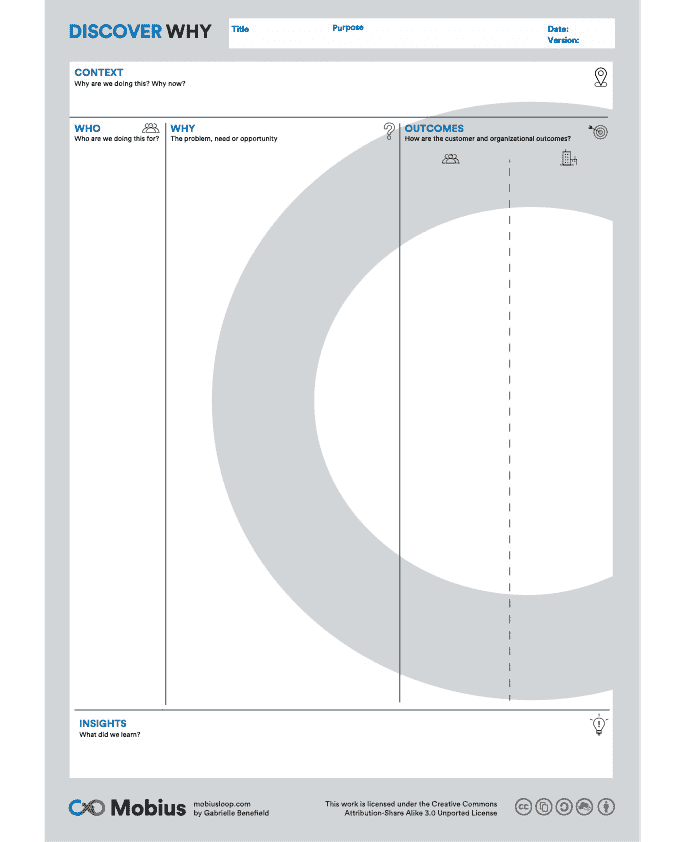

图 10.11：Mobius 的发现地图

我们使用这张地图总结了 PetBattle 所有的学习成果。

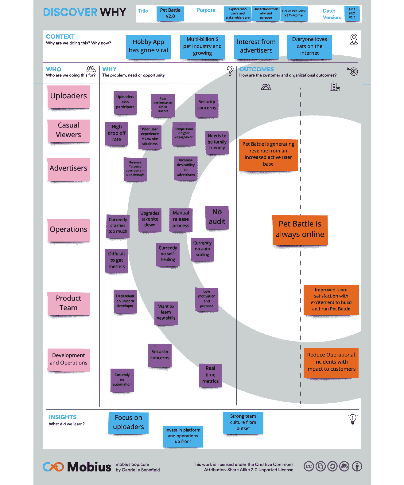

图 10.12：PetBattle 发现地图

## 结论

在这一章中，我们重点关注了为之前章节中发现的业务问题和机会设定目标成果。

我们解释了什么是成果，以及它与输出的区别，如何捕捉它们、记录它们、衡量它们并将其可视化。

我们深入探讨了可衡量的成果和指标，并探索了主要成果与促进性成果之间的区别。在 DevOps 世界中，促进性成果主要集中在软件交付指标和平台指标上。

你可以在 [openpracticelibrary.com/practice/target-outcomes/](http://openpracticelibrary.com/practice/target-outcomes/) 阅读更多内容并讨论设定目标成果的实践。

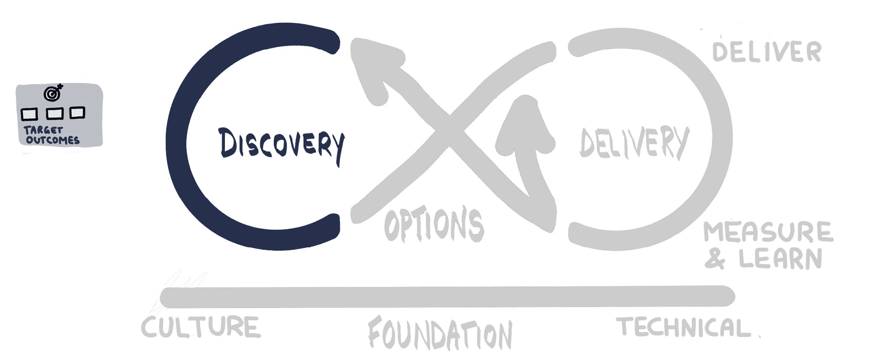

图 10.13：为交付循环添加进一步的实践，以设定目标成果

我们通过总结所有在 Mobius 发现地图上的学习，结束了这一发现部分。

现在，我们已经建立了开放文化和开放技术实践的基础，并在产品、软件交付和平台的一些基准指标下进行了产品发现；接下来，我们需要决定首先交付什么。

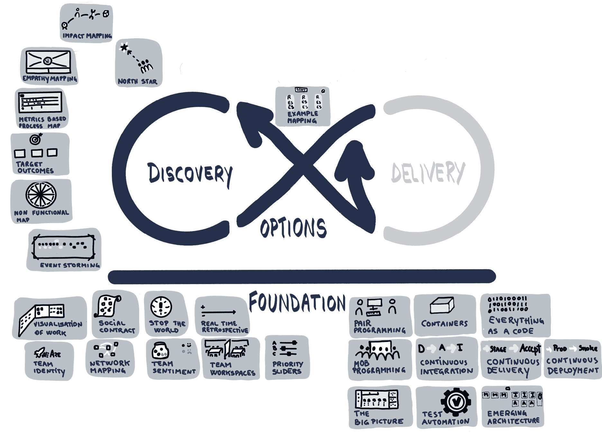

图 10.14：在开放文化和技术基础上完成发现循环的实践

在下一章，我们将进入选项转折点，探讨优先级实践，并规划我们可以增量交付的内容。我们将审视特性交付与非功能性工作的权衡，以改善软件交付和平台。我们还将探索 OpenShift 及其他平台提供的一些先进部署能力，帮助我们进一步决定如何为客户交付最佳价值和产品。
