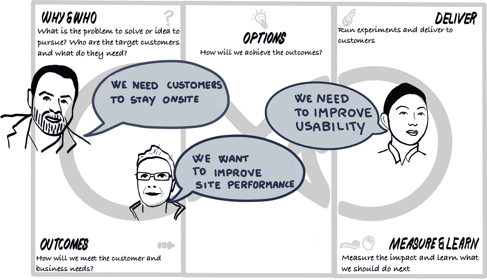
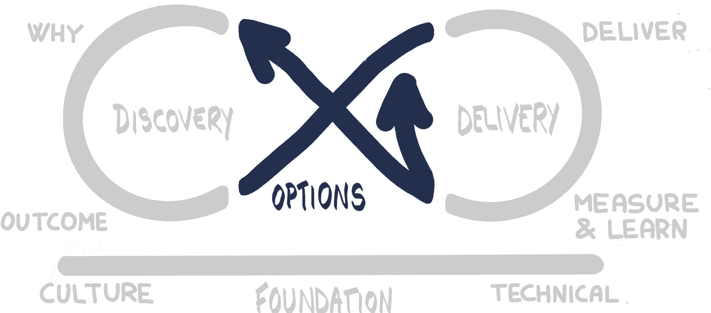

# 第四部分：优先排序

在*第三部分，发现它*中，我们围绕发现循环展开工作。我们从为什么开始——为什么要开展这个计划？我们的伟大想法是什么？我们使用了北极星方法来帮助我们框定这一点。我们通过使用影响力映射实践来定义问题，并进一步了解背景，从而对齐我们的战略目标。影响力映射帮助我们汇聚了所有不同的参与者，这些参与者可以帮助我们实现目标或阻碍目标的实现。影响力映射捕捉了我们想要产生的可衡量影响以及我们希望为这些参与者创造的行为变化。从中，我们形成了关于不同交付物的假设陈述，探讨它们如何帮助实现这些影响。

我们通过使用以人为本的设计技巧和设计思维实践，如同理心映射和情境调查，进一步完善了对这一理解的认识，以便观察并与我们的参与者建立联系。我们使用事件风暴实践，生成对事件驱动流程的共同理解，探索了业务流程和领域模型。通过使用事件风暴符号，基于微服务的架构开始逐渐浮现。我们还通过使用非功能性映射和进行基于度量的流程映射，发现了设计中的非功能性方面。

发现循环提出了许多我们可以在交付周期中执行的想法——我们可以实现的特性；随着我们通过反复的事件风暴演练精炼和开发解决方案而出现的架构；通过用户界面原型或技术尖刺进行的研究，进一步验证我们的想法；与用户进行的实验，以帮助更好地理解他们的动机、痛点以及他们对价值的理解；以及我们可以建立的流程，以收集数据并优化指标。

图 11.0.1：选项转折——设置场景

仅仅通过第一次迭代的发现循环，我们就很容易从所有这些实践所带来的对话和互动中想出数百个不同的任务。从这些想法中构建任务可能像踩雷一样复杂，甚至可能需要数周，甚至数月的时间，仅仅为了从一次简短的发现循环迭代中为一个小团队生成任务！因此，我们需要小心，确保我们保持专注于交付价值、关注真正重要的结果，而不是在一个充满忙碌的世界中陷入分析瘫痪！

在离开发现循环之前，我们花时间将所有这些学习转化为可衡量的目标结果。这一过程始于与业务产品相关的主要目标结果，但我们也花时间识别一些次要目标和支持性结果，它们有助于支持开发，尤其是那些可以通过软件交付流程和基础平台（如 OpenShift）实现的目标。

通过大尺寸的可视化信息辐射器展示这些结果，并基准化和辐射支持性度量指标后，我们可以开始考虑那些源自探索环节的任务和想法。但我们只能通过始终关注这些结果，并确保我们所做的一切都直接或间接地推动我们朝着实现这些结果的方向前进来做到这一点。这才是最有趣的部分，因为我们将要探索**如何**实现这些可衡量的结果。

Mobius 使用**选项**一词，而不是**解决方案**或令人头痛的**需求**一词。在我们验证我们的想法之前，它们只是纯粹的猜测，所以称它们为解决方案或说它们是必需的并不合逻辑，也没有证据支持它们。相反，我们称它们为潜在的解决方案、选项，并且我们将在交付循环中测试它们，以验证或推翻我们围绕这些选项形成的假设。这推动我们采取一种更加数据驱动的方法，而不仅仅是猜测。

图 11.0.2：选项枢纽

当我们处于**选项枢纽**时，我们决定接下来要针对哪些结果进行定位。我们选择需要构建、测试、验证和学习的思想或假设，同时探索我们如何交付**选项**。我们还需要确定优先级。我们从来没有无限的时间和资源，因此优先级始终是实现商业价值和快速学习的关键。快速学习在这里是一个重要方面。我们希望生成能够验证或否定我们从探索环节（Discovery Loop）中得到的想法的选项，以便最终重新审视并改进这些想法。快速反馈是将探索成果与验证原型连接的关键。

*第十一章，选项枢纽*将重点介绍我们在开始交付循环（Delivery Loop）之前所采用的实践方法。在*第七部分，改进与持续*中，我们将在交付循环之后再次回到选项枢纽，在那里我们将根据最新交付循环迭代的学习和测量结果，决定基于这些发现接下来应该做什么。
