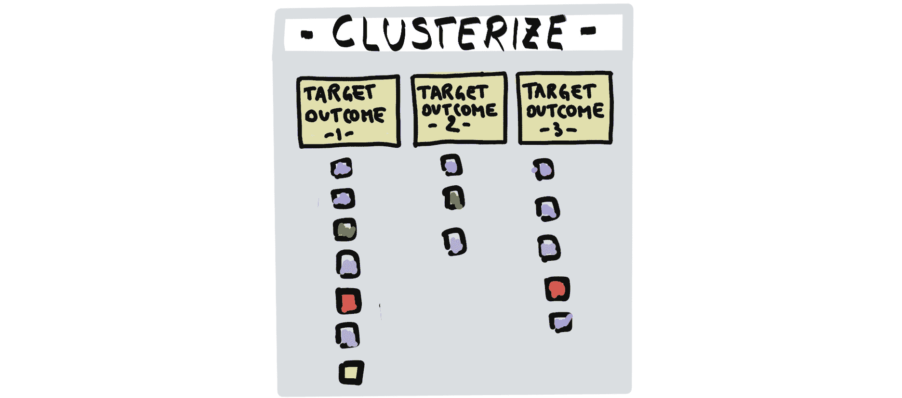
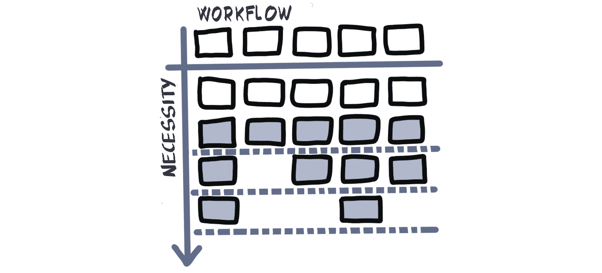
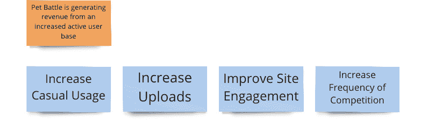
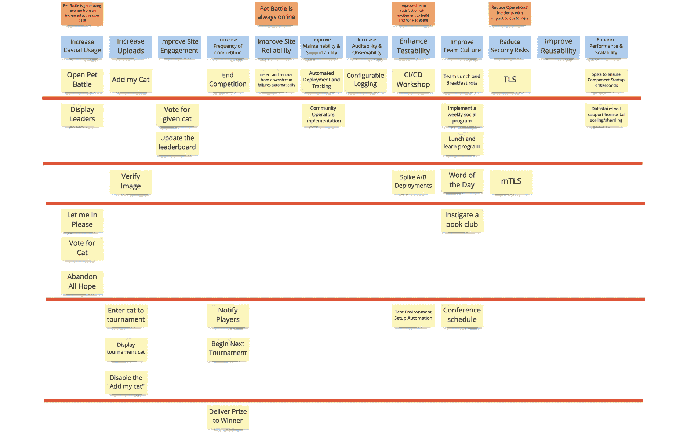
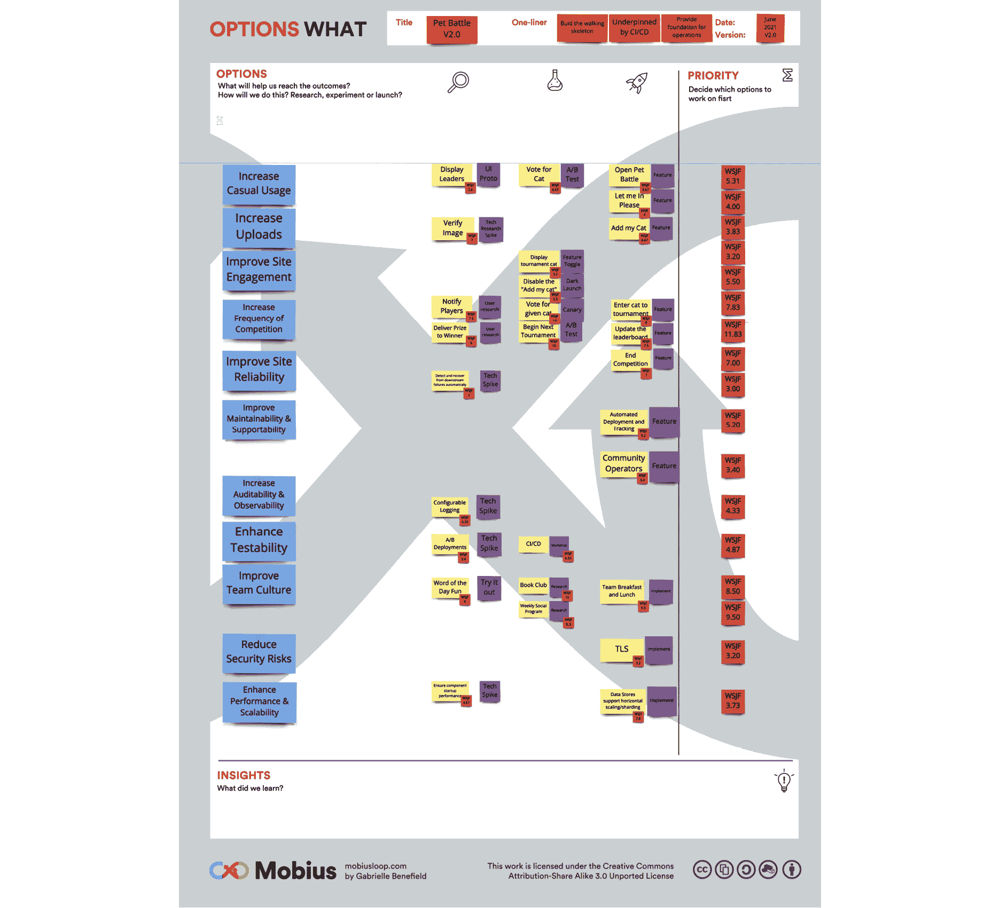

# 第十一章：11. 选项转折点

在发现循环过程中，我们开始提出许多实施的想法。影响力图为我们提供了交付物，形成了假设陈述。以人为中心的设计和同理心映射方法直接为我们提供了来自用户的想法。事件风暴为我们提供了可以通过独立微服务实现的独立功能（由命令触发）（即编纂聚合）。基于度量的过程图和非功能性图给了我们如何加速开发周期、提升安全性、可维护性、可操作性、可扩展性、可审计性、可追溯性、可重用性等方面的想法，几乎涉及任何以“ability”结尾的内容！

发现循环后的下一步是选项转折，在这一阶段，我们使用的所有实践中的信息将汇聚成一个行动选项列表，用于决定接下来要交付的内容。

选项转折是 Mobius 循环的核心。在它的左侧是我们吸收所有学习和目标结果的地方，这些内容是我们在发现循环中对齐的。我们生成更多的想法，细化要交付的内容，然后选择要执行的选项。在本书的*第十七章，改进它*中，我们将探讨选项转折的右侧。在这里，我们根据交付循环已完成的迭代中的测量结果和学习进行调整。我们决定是进行更多的发现、更多的交付，还是完全转折。我们会细化下一步要发现或交付的内容。

请记住，我们在完全自治的跨职能团队中工作。我们没有单独的性能或可用性测试团队，因此不能假设与这些职能相关的工作项目会在墙的另一边处理！这让我们的工作变得更加困难，因为我们必须权衡不同选项的相对价值。我们需要在新功能开发、紧急 bug 修复、加速开发的平台改进、可用性改进、安全性增强等多方面做出决定，以提高我们的产品质量。

在本章中，我们将做以下工作：

1.  使用**用户故事映射**方法可视化我们可能执行的所有工作。

1.  使用**价值切片**方法将我们的工作组织成小而薄的价值切片，以便我们能够持续交付价值。

1.  开始**实验设计**实践，以测试在发现循环过程中出现的假设。

1.  通过探索帮助我们进行选项转折的不同实践进行优先排序，包括**影响与努力优先级**、**如何/现在/惊叹优先级**和**设计冲刺**。

1.  根据所有前述方法的可追溯性，形成初步的**产品待办事项**。

1.  设置**产品待办事项精炼**，使其持续进行。

1.  将**经济优先级**应用于产品待办事项。

1.  解释**产品负责人**角色在实现上述目标中的重要性。

1.  探讨如何通过 OpenShift 平台启用的一些**先进部署能力**来支持实验，并且我们如何计划利用这些能力，确保我们最大化从交付循环中获得的学习。

让我们从我们最喜欢的可视化实践之一开始，通过切片价值来辐射并规划大量小的增量发布。

## 价值切片

我们正接近 Mobius 心智模型的部分，在这一阶段我们将开始交付我们解决方案的增量。它们可能包括运行短期原型和技术实验或“尖峰”测试，进行明确的用户研究，或者实现通过事件风暴和其他发现实践得出的功能。

交付循环的迭代没有规定具体的时长。如果你正在使用如 Scrum 这样的流行迭代敏捷交付框架，那么交付循环的迭代可以很好地转换为一个 sprint（一个固定的时间框，通常为一到四周）。如果你使用的是如 Kanban 这样的更为持续的交付方式来支持价值的持续流动，那么每个交付循环可能仅代表处理一个产品待办事项并将其交付到产品中。你甚至可能使用非敏捷的交付方法，如瀑布模型，在这种情况下，交付循环可能更加单一且移动缓慢。Mobius 循环对交付方法是中立的。但无论交付方法如何，一致的理念是：我们追求尽早交付高价值工作，更快地建立重要的学习，并以小批量交付的方式工作，这样我们可以衡量并学习影响，从而为下一轮决策提供参考。

为了帮助我们将所有工作项拆解并确保它们被分组到可以形成小增量价值的程度，我们使用流行的可视化和规划实践。

简单的路径映射技术通过从目标结果反向映射到实现该结果所需的最少步骤来拆解工作。还有许多其他的实践，如旅程映射、故事映射、未来状态映射、服务蓝图等。Mobius 更关注的是结果，而不在乎具体怎么做，只要你专注于找到交付结果的最简方式。我们发现非常有效的技术之一叫做价值切片。

让我们看看如何进行价值切片。

首先，我们记录下所有通过发现实践生成的独立工作想法。我们现在关注的是输出（而非结果），因为我们希望将所有交付物进行分组，并形成一个增量发布策略以实现这些结果。一个起点是从现有文档中复制以下内容：

+   在影响地图上捕捉的交付物

+   在事件风暴中捕捉的命令

+   在同理心地图上捕捉的想法和反馈

+   支持在非功能性地图上做出的决策所需的非功能性工作

+   在讨论**基于指标的流程地图**（**MBPM**）时捕捉到的想法和非功能性特性

+   在任何其他发现循环实践中产生的所有其他特性和想法，以及发生的许多讨论。

以下是我们从经验中总结出的一些技巧。首先，不要仅仅把便签从一个工件移动到这个新空间。你应该保持影响图、事件风暴、同理心图、MBPM 和其他工件作为独立的工件，完整地保留原始形式。我们在进行交付循环时会再次使用它们，它们会非常有用。

其次，逐字逐句地复制你从这些实践中提取的内容。正如我们在接下来的章节中将看到的，当我们能够追溯工作项通过发现循环、选项转折和交付循环时，我们将从中获益良多，因此保持语言一致性对这一点很有帮助。有些团队甚至从一开始就投入于一个关键或编码系统，以展示这种可追溯性。

图 11.1：从发现循环实践中收集信息和想法

首先，将所有物品放在一个大工作面上。站在远处看到我们所知的所有可能工作内容会让人感到非常满足。看到那些少数的实践竟然产生了这么多想法，真是令人惊叹。当然，这也可能会有些混乱和令人畏惧。因此，我们需要开始整理这些工作内容。

如果你与分布在不同地点的人们进行虚拟合作，拥有如下的画布（并且可以从本书的 GitHub 仓库下载）可能会有所帮助：

图 11.2：用户故事和价值切片图模板

接下来，删除任何重复项。例如，你可能已经在影响图中识别了一个可交付成果，而同样的特性可能也出现在你的事件风暴中。你的用户访谈可能还发现了同样的特性，这些特性已被记录在同理心图上。对于那些重复的特性，删去重复项。如果某个想法可以拆分为更小的独立想法，就重构并重新编写便签，包含这些多个想法。越多越好，这在这个实践中非常重要！

下一步是将每个项目分类为某种共同的主题，并为该主题命名。我们要寻找的是能够将所有项目集中在一起的东西。如果你将每个项目放入一个桶中，这个桶的标签会是什么？一个顶级技巧是，从发现循环中得出的目标结果开始，并将它们设置为分类每个项目的标题。我们这样做的原因是，我们想要采用以结果为驱动的思维方式。我们已经确定了一些目标结果，因此实际上我们正在考虑的每个工作项应该都在帮助我们实现一个或多个这些结果。如果我们选择任何一项工作，并且无法轻松地看到它将有助于实现什么结果，那么我们应该质疑做这件事的价值。（有些情况下，这些无法映射到结果的项目仍然很重要，所以如果发生这种情况，就给它们单独留一堆。）

我们应该最终将所有项整齐地排列成一列，直接位于它们所归类的目标成果下方。

如果我们有一组良好且经过深思熟虑的主要成果和支持成果，那么将所有特性、实验、研究想法等映射到成果上应该是一个非常积极的练习。这个练习应该是协作性的，涉及跨职能团队的所有成员。开发人员、运维人员、设计师、产品负责人、业务专家等等，都会参与并为之前的发现循环实践提供输入。他们应该继续参与选项调整，以确保他们的想法和倡议被理解并包含在图中。

最终的工作可视化应该包括功能特性和非功能性举措。所有可以在平台上进行的工作，以促进更快速、更安全的开发，以及更快速的产品特性发布，都应该显示出来。如果我们在练习结束时回顾，我们应该开始看到我们的交付循环开始浮现。

图 11.3：根据目标成果对任务进行集群

下一步是优先排序板上的所有任务和项目。这从来都不是一件容易的事，但几乎总是需要的。如果你曾经参与过一个项目，时间不是问题，且很明显团队将有足够的时间来自信地交付所有要求的内容，那么你就处于一个独特的位置！这种情况从未发生过，我们总是需要优先排序工作并决定不做哪些事情！这可以从产品负责人决定他们对优先级的看法开始。然而，随着我们深入本章，我们将探讨一些可以在协作环境中帮助优先排序并推动达成共识的实践和工具。执行这些实践可以反映在我们正在创建的价值图上。

我们喜欢尝试对每一列进行优先级排序。因此，拿出每一个目标成果，并将所有我们认为能够实现它们的特性和其他项进行排序。最重要和最有说服力的项应该排在最上面。这些项是如果你想实现目标，必须优先于其他一切的项。那些理解较少或者“可有可无”的项应该排在下方。

最后的阶段是从价值图中提取价值。我们使用一些胶带（理想情况下是有色的，比如画家胶带），请负责整体工作优先级排序并阐明价值的人（通常是使用 Scrum 的团队中的**产品负责人**）来横向切分他们认为是整个产品价值的一部分。这意味着查看每个主题中最重要的项，并将它们与其他主题中的一些高度重要项结合起来。

图 11.4：在集群中优先排序工作

在这一点上，我们的产品负责人拥有巨大的权力。他们可以在给定的结果中进行优先排序。他们可以对整个结果进行优先排序，并将所有事项向上或向下调整。他们可以将来自不同结果的项结合起来，形成提议的发布版本。他们可以切出一、二、三或五十个价值切片——每个切片包含一项、两项或更多项。最重要的是，他们可以与所有利益相关者和团队成员进行对话，以达成共识，完成这个二维价值切片图。

图 11.5：二维价值切片图

在多年的实践中，我们积累了一些促进活动的小窍门，帮助正确地解释这些方法。第一个窍门是如何将两项有价值的活动进行可视化和规划。

## 啤酒与咖喱

2017 年，我带领了一项与全球石油公司的合作。第一周结束时，团队已经很疲惫。这一周很忙碌且紧张。我们组建了团队并建立了文化基础。我们已经进行过几轮探索环节，包括用户同理心地图和事件风暴，这些活动涉及了很多站立、思考和讨论。

星期四下午，我正在主持基于事件风暴和同理心地图上所有捕获项的用户故事映射和价值切片。这项实践对团队来说是新的。在我们将所有工作展示在墙上，并根据结果对其进行整理后，我谈到了切片和优先级排序的必要性。

我开始时说，*显然，我们希望完成所有这些工作，*之后，一位高级利益相关者打断了我，说，*是的！我们需要做所有这些工作。*我能感觉到利益相关者之间有些不安，仿佛我在做典型的咨询工作，试图确定范围，而利益相关者希望将所有东西都做出来。也许我选择的措辞可以更好一些。

图 11.6：解释价值切片

但我并不是在决定哪些属于范围，哪些不属于范围。我的整个敏捷思维模式基于灵活的范围，能够随着我们学习的深入调整和改变范围，并始终确保我们在交付下一个最有价值、最重要的工作。

为了说明我的思维过程，我的思绪迅速转到我们当天计划的团队社交活动。那一周非常漫长，我们计划去喝几杯，吃点咖喱——通过这种方式进一步增强我们的文化基础，让团队放松，彼此更好地了解。

我很期待在喝完那杯啤酒后再吃一份咖喱。事实上，我真的非常期待那杯啤酒。我觉得那一周我们真的赚到了那杯酒，举杯庆祝和我的新团队一起说声“干杯”一定会很棒！但这并不意味着咖喱不重要，也不意味着咖喱不会发生。我们会先喝啤酒，然后吃咖喱。这就是我们当晚的优先顺序。我们没有剔除任何工作，也没有计划去做。啤酒在我最重要的价值切片中，咖喱则在我第二个价值切片中。

团队在了解到我们并没有去剔除任何工作，而只是按价值进行组织后，感到更加轻松。团队成员也非常放松，并享受了一杯啤酒和一份咖喱！

我们还学到了一些简单的技巧，可以帮助有效地设定价值切片的实践。

## 从一到少到多的价值切片——持续交付

多年来，在主持这个活动的过程中，我学到了各种技巧。

在我第一次进行这个活动时，我们将所有工作按照目标成果组织成了几列，并进入了切片环节。我把一条胶带放在墙上，要求产品负责人和利益相关者将他们认为最有价值的便利贴放在胶带线以上，将较不重要的便利贴放在胶带线以下。

当我观察团队在这个过程中工作的时，我意识到那一条胶带线产生了一个误导性的实践观点。大家不愿意将任何东西放在那条线以下，因为有一种误解认为这意味着**超出范围**。我解释说情况并非如此，我试图做的是划分出**最小可行产品**（**MVP**）。MVP 定义了可以构成产品的最小特性集，这个产品可以发布给用户，从中学习并进行迭代。实际上，许多利益相关者将定义 MVP 视为一种负面事情，因为这是他们失去所有创新性特性的时候，这些特性他们可能希望拥有，但并没有被认为是重要的。我实际上尽量避免使用 MVP 这个术语，因为它通常会引发一些负面情绪。

我从这次引导中学到，切片永远不应该只使用一条，因为我们并不是在定义哪些内容是“在范围内”或“超出范围”，也不是仅仅定义 MVP。

在与芬兰的另一位客户合作时，我将这些经验教训应用到我的引导方式中。对于所有从发现循环中捕获的项，我在地图上制作了三条胶带切片。希望现在产品负责人和相关方不会再掉入范围内/范围外的陷阱。然而，现在出现了一个新的误解！对于这次特定的合作，这是一场为期四周的沉浸式开放创新实验室驻场，专注于改进运营，我们计划了三次为期一周的冲刺。巧合的是，我制作了三条胶带进行价值切片。因此，相关方和产品负责人认为，我们在第一条切片中放入的内容将形成冲刺 1 的范围，第二条切片是冲刺 2，第三条切片是冲刺 3。

图 11.7：从发现循环中捕获的项的价值切片

我解释了情况并非如此。我们目前还不知道团队需要多长时间才能交付每个切片中的每一项。我们将使用交付循环中的其他实践来帮助我们了解这一点。最终，我们可能会在一个冲刺中交付多个切片，或者，交付一个切片可能需要多个冲刺。我们现在还不确定。

从那时起，我进一步调整了我的引导方式。当制作切片时，我现在会产生大量的切片——至少 10 个，有时会超过 20 个。我还会让胶带卷易于获取，并告诉产品负责人使用他们想要的任意数量的切片——事实上，越多越好！我发现现在的价值切片图通常会有更多的切片。

一位来自英国国防公司的产品负责人曾经对我说，每个价值切片板上的项目都可以看作是它自己的价值切片。听到这个我笑得非常开心。是的！当我们达到这种思维方式和方法时，我们真正实现了持续交付的目标。

图 11.8：多个切片的价值切片

可视化并切片增量价值的做法源自 Jeff Patton 在其 2008 年出版的《*用户故事映射*》一书中的惊人思考和工作。1 用户故事映射是一种有效的实践，用于创建轻量级的发布计划，可以推动迭代和增量交付实践。我们强烈推荐阅读 Patton 的书并尝试他在第五章中描述的练习，关于如何可视化并切片出一些非常简单的价值，比如你早上起床、准备并去上班的所有过程。我们在我们的赋能研讨会中使用这个练习，发现它确实能让这个实践生动起来。

让我们看看 PetBattle 团队是如何进行价值切片的。

1 [`www.jpattonassociates.com/user-story-mapping/`](https://www.jpattonassociates.com/user-story-mapping/)

## PetBattle —— 朝着持续交付方向的价值切片

PetBattle 团队回顾了他们在第一次发现环中产生的所有工件。

影响地图（Impact Map）确认了“提高上传者的站点参与度”是他们希望投资于实验和构建初始功能的地方。玛丽（Mary）的用户共情图进一步支持了构建比赛服务和实时排行榜的想法。团队通过事件风暴（Event Storming）探索了玛丽参与每日比赛并赢得奖品的流程，分解了事件流程，识别了命令、读取模型、一些 UI 设计和聚合点。基于指标的流程图（Metrics-Based Process Map）识别出了现有 PetBattle 部署步骤中的一些瓶颈，主要是由于缺乏自动化。最后，团队集思广益，探讨了所有非功能性考虑因素。

他们将所有从这些结果中得出的功能复制到新的便签上，并将其分散在墙上。

然后是考虑价值切片图（Value Slicing Map）的标题的时刻。团队回忆起他们将所有发现环（Discovery Loop）的信息和学习提炼为三个主要目标结果：

+   PetBattle 通过增加的活跃用户群体正在产生收入。

+   PetBattle 始终在线。

+   提高团队满意度，激发建设和运营 PetBattle 的热情。

他们还确定了一个额外的支持性结果：

+   减少对客户有影响的操作事故。

这四个结果形成了 PetBattle 价值切片图的骨架。

图 11.9：目标结果骨架

当团队进一步探索这四个结果时，他们认为将其进一步拆解可能有助于与利益相关者共享理解。影响地图（Impact Map）聚焦于四个结果：

+   提高休闲观众的参与率

+   上传量增加

+   增加上传者的站点参与度

+   增加赞助竞赛的数量

总体而言，这些都将有助于第一个主要结果，即 PetBattle 将通过增加的活跃用户群体产生收入。因此，这些被添加到价值切片图（Value Slice Map）中：

图 11.10：第一个目标结果的细分

第二个主要结果是 PetBattle 将在线。

团队反思了他们的非功能性图（Non-Functional Map）部分，并认识到三个结果将有助于实现这一目标：

+   改善站点可靠性

+   提高可维护性和可支持性

+   增强可审计性和可观察性

图 11.11：第二个目标结果的细分

当团队讨论第三个主要成果——提升团队满意度并激发建设和运营宠物战斗的热情时，他们的对话都集中在实现出色的可测试性上。拥有一套技术实践基础，能够让他们自动化不同层次的测试，并进行用户测试，利用先进的部署技术，这将使他们非常高兴。他们还回顾了在团队形成和文化基础建设过程中提出的一些想法——社交活动、一起吃早餐和午餐、以及成立读书俱乐部，这些都是有助于改善团队文化的想法。因此，他们添加了以下重要的标题：

图 11.12：第三个目标成果的拆解

最后，他们得出了“启用成果”，即通过减少对客户产生影响的操作事件，帮助推动其他所有成果。这也可以分为三个领域：

+   降低安全风险

+   提高可重用性

+   增强性能和可扩展性

图 11.13：第四个目标成果的拆解

因此，他们在一面墙上展示了大量的输出，并在另一面墙上有组织地列出了成果标题：

图 11.14：所有目标成果的两级拆解

现在是时候通过在每个成果下方形成列，将输出与成果连接起来了。

他们从第一个主要成果开始。这里的输出主要来源于事件风暴中的命令，得到了对影响图中的聚焦影响和同理心图中捕获的高度动机的支持。

图 11.15：交付第一个目标成果的输出

移动到第二和第四个成果下的输出来自 MBPM 和非功能性地图。第三个成果也如此，其中还包括了在建立文化基础时通过早期社会契约和实时回顾所捕捉的一些想法。

团队最终得到了一个用户故事地图，展示了初步的宠物战斗旅程，以及团队将要进行的交付和支持之旅：

图 11.16：宠物战斗用户故事地图

这是第一个信息展示板，展示了一个应用程序的功能特性、构建、运营和改进平台的工作，并激发了一个充满热情的高效团队。

最后的步骤是开始切分整个工作中有价值的增量。与产品负责人合作，团队急切希望确保所有成果在某种最小的形式下早早被解决，并且随着更多增量的交付，他们将持续改进每个成果。

图 11.17：宠物战斗用户地图的价值切片

观察价值的顶部切片带来了一种激动的感觉。团队可以看到他们将要做的第一项工作，以使宠物战斗的愿景成为现实！

在[openpracticelibrary.com/practice/user-story-mapping](http://openpracticelibrary.com/practice/user-story-mapping)的开放实践库中，有越来越多关于这些实践的有趣链接、对话和更多信息。请查看一下，如果你有故事或经验可以分享，你也可以帮助进一步改善这项实践。

现在我们已经了解了强大的用户故事映射和价值切分技术，接下来我们将探讨一些其他实践，帮助使这一过程更加成功和协作。我们常常发现，人们在使用用户故事映射时面临两个挑战。首先，他们不知道如何将所有内容放到用户故事地图上。其次，优先排序和切分价值的方法对一些人来说可能很困难，也可能缺乏协作。

让我们首先看看第一个挑战。

当我们介绍用户故事映射实践时，我们说过我们从复制所有输出、交付物、功能以及在探索循环中使用的实践所浮现的想法开始。这听起来非常简单和直接。事实上，这实际上只需要一个人的复制粘贴功能，将在影响地图中捕获的所有交付物、在事件风暴中捕获的所有命令，以及在讨论 MBPM 时捕获的所有想法和非功能性工作复制过来。

但这就足够了吗？仅仅依赖几天前的灵感，是不是关掉了增加创新的潜力呢？一种稍微不同的方法是，不仅仅将用户故事映射和价值切分看作是交付功能。我们可以尝试转向更具实验性的思维方式，在选项转向（Options Pivot）期间，我们真正想设计一些可以在交付循环中执行的实验。

## 实验设计

所有关于新产品、服务、功能的想法，甚至任何可以引入的改变，以使事物变得更好（更多增长、增加收入、增强体验等等），都从假设或前提开始。在传统的规划方法中，团队可能会根据某种形式的投资回报分析来下注选择执行哪个实验，同时在过程中做出更多的假设。

**实验设计**是这种方法的另一种替代方式，我们尝试尽早验证我们正在做的许多重要想法/假设/前提。一些实验的对象可能我们希望保持**开放**，直到我们获得一些现实世界的证据，这可以通过一些高级部署功能（如 A/B 测试）来完成，我们将在本章稍后讨论这些内容。

实验设计是一种实践，我们用它将想法、假设或前提转化为具体且明确定义的实验集合，这些实验可以进行，以便实现验证或否定——也就是说，为我们提供宝贵的学习。

实验设计是一种万无一失的推进解决方案并快速学习的方法。它可以提供一种快速演化产品的方式，推动现有和新产品的创新，并通过小赌注帮助自主团队实现领导意图。

你可能需要为每个项目（想法、假设、假设）进行多次实验。一个实验通常只改变产品或服务的一小部分，以了解这种变化如何影响我们的目标结果。实验的数量实际上是根据你想学到什么，以及你将引入多少种不同变化来定义的。

## 定性反馈与定量反馈

在 2018 年与一家道路和旅行保险提供商进行实验室驻留期间，我们有机会设计关于早期原型的实验，旨在重新构建移动应用程序，提升用户体验并增加对话量。

我们希望衡量当前应用与与业务利益相关者共同集思广益的改善体验的一些想法，因此我们为测试用户设计了一个实验。我们建议他们表现得像在真实生活中一样，按他们通常的习惯停下，按他们通常的方式阅读，等等，在使用应用程序时。

该应用程序的作用是引导用户完成汽车保险预订过程。为了完成此过程，他们需要提供车牌号码、社会安全号码和居住邮政编码。

每个用户被引导访问一个网址（理想情况下是在移动设备上），以部署运行在 OpenShift 上的应用程序。他们被指示选择一辆车，并尝试比较并购买看似最适合用户的保险。实验在用户购买保险时结束。（备注——每个用户都被告知这是一个测试，提供的支付详情是测试信用卡信息，不会有任何资金转移。）

A/B 测试意味着可以对不同的用户使用不同的页面展示方式，从而在用户访谈中测试不同的原型。

来自实验的定量数据展示了应用程序使用过程中的时长、流失率和完成率。

来自相关用户的定性数据突出了用户体验中的痛点，指出了一些仍然存在的困惑，并验证了一些积极的体验。

结合定性和定量反馈提供了对最合适方法的确认。这意味着产品团队可以基于数据的验证，自信地编码“最佳”方法。

这个过程从开始到结束，耗时一周。

实验文档的格式与内容同样重要。正是内容告诉你实验设计得有多好；例如，实验设计是否允许过多的机会，使得结果可能模糊不清？

好的实验需要以下最低细节才能成功：

+   **假设**：通常以一句话形式表述，常常表达一种假设。

+   **当前条件**：现在的情况如何（尽可能可度量）？

+   **目标条件**：我们试图实现什么（尽可能可度量）？

+   **障碍**：什么可能会阻止我们达到目标条件？什么可能引起干扰或噪音？

+   **通过**：我们如何定义一个积极的通过？如果目标条件可能无法始终达到，那么我们认为足够显著的变化是什么，以得出实验正在确认假设的结论，即通过并获得积极结果？

+   **衡量标准**：我们如何衡量进展？

+   **学习**：始终记录结果和学习内容，这些内容理应引导出更高阶的实验。

一旦描述完毕，实验就可以实施、跟踪并测量，以分析结果。在理想的世界里，实验将有二元的成功/失败标准，但大多数情况下，我们需要使用统计方法分析数据，找出实验引入的变化与目标结果的变化之间是否有显著的相关性。

#### 注意

成功的实验不是那些证明我们的假设是正确的实验。成功的实验是那些提供有效和可靠数据，显示统计上显著结论的实验。

实验设计如果没有发现或交付，那就毫无意义，这也是将此实践与其他实践结合的主要原因。实验来源于在发现循环中的实践中收集的信息。假设在影响映射中形成。假定在事件风暴、同理心映射和其他以人为本的设计实践中记下。创意在所有发现实践中被捕捉。

实验需要优先排序，因为我们在有限的时间内能做的事情有限。将此实践与各种优先排序矩阵结合使用，如**影响-努力优先排序**或**现在-如何-惊艳优先排序**，甚至是像**加权最短作业优先**这样的经济优先排序方法，帮助很大。我们将在本章的下一部分探讨每一个。

实验通常首先通过快速原型实现，这需要用户研究和用户测试，我们在交付循环中进行这些工作。这样的组合即使在编写任何代码之前，也能提供快速学习。

实验也可以在生产环境中进行。事实上，生产环境中的测试是验证想法/假设/假定的最终形式，因为验证是由真实数据和真实客户行为支持的。A/B 测试实践提供了非常有价值的组合。

通常，你可能会有一组实验经历快速原型制作/用户研究原型制作的过程，然后，一些成功的实验会继续进行生产并通过 A/B 测试。有其他部署控制机制可以帮助衡量并从实际客户行为中学习——我们将在本章稍后介绍所有这些内容。

你可以在[openpracticelibrary.com/practice/design-of-experiments](http://openpracticelibrary.com/practice/design-of-experiments)上进一步阅读和讨论这个实践。

设计好的实验应该出现在用户故事地图和价值切片图中，以便与其他所有工作进行优先级比较。

让我们看看一些其他可以帮助优先级讨论的工具，从影响力和努力优先级矩阵开始。

## 影响力和努力优先级矩阵

影响力和努力优先级矩阵是一个决策/优先级确定实践，用于选择想法（如功能性特性想法、性能想法、其他非功能性想法、平台增长想法等）。

这个实践让整个团队（真正理解努力的人）参与到产品开发中，并将他们与利益相关者（真正理解影响力的人）连接起来。开发新产品与产生想法、假设及其测试/验证密切相关。不幸的是，几乎不可能测试和评估我们能想出的所有想法和假设。这要求我们过滤并优先考虑要处理的想法。

这个矩阵简单、易懂且非常直观，可以让整个团队参与到透明选择要首先处理的想法和假设的过程中。它还帮助产品负责人和产品经理构建产品路线图和产品待办事项，并向利益相关者解释优先级。

这个实践在帮助从可视化中识别方向和转型想法方面非常强大。

图 11.18：对比影响力与努力的二维矩阵

通过这个实践，出现了四组不同的想法：

+   **最值得关注的好想法**：高影响力/低努力 – 这些应考虑放在价值切片图的较高部分。

+   **需要研究**：高影响力/高努力 – 这些应考虑放在价值切片图的较高部分，但在后续的产品待办事项细化实践中，可能会被视为优先级较低，因为它们需要更长时间才能实现价值。

+   **跟进**：低影响力/低努力 – 这些应位于价值切片图的较低部分，时间允许时可以跟进，否则完全删除。

+   **绝不采用 – 不好的想法**：低影响力/高努力 – 这些应位于价值切片图的较低部分，或完全删除。

创意和假设的来源都是发现实践，如事件风暴（Event Storming）、影响图（Impact Mapping）和同理心图（Empathy Mapping）。在我们执行这些前述实践时，通常会产生可能的改进想法或形成新的假设。

在将它们作为项目添加到产品待办事项列表之前，这些创意和假设通常需要一些研究、分析和进一步阐述。

一旦优先级确定，这些创意和假设可能会导致：

+   新特性通过用户故事地图和价值切片板进行添加

+   将完整的新特性拆解为较小的特性或用户故事，并在价值切片板上进行重构

+   用户研究

+   实验设计

+   技术难题与 UI 原型

影响与努力优先级矩阵在[openpracticelibrary.com/practice/impact-effort-prioritization-matrix/](http://openpracticelibrary.com/practice/impact-effort-prioritization-matrix/)有自己的开放实践库页面——这是一个继续学习和讨论这一优先级实践的好地方。

采用如何—现在—哇优先级实践可以实现一个稍微不同的优先级视角。与之前的实践用于筛选和优先排序高影响特性不同，这个实践用于识别和优先排序产品所需的快速获胜和基础特性。

## 如何—现在—哇优先级

如何—现在—哇（How-Now-Wow）是一个创意选择工具，通常与头脑风暴（Brainstorming）、**如何做到**2 (**HMW**)和实验设计（Design of Experiments）结合使用。它通过比较创意实施的难度与其创新性/原创性，来对创意进行对比并绘制到一个 2x2 矩阵中。

类似于影响与努力优先级矩阵，如何—现在—哇优先级简单、易于理解且非常直观，并且可以让整个团队参与到创意/假设的透明选择过程中，确定首先要进行的工作。

图 11.19：如何—现在—哇 优先级地图

再次强调，创意和假设的来源都是发现实践，如事件风暴（Event Storming）、影响图（Impact Mapping）、如何做到（HMW）和同理心图（Empathy Mapping）。在我们执行这些前述实践时，通常会产生可能的改进想法或形成新的假设。

我们可以通过评估每个项目并考虑其实施的难易程度（通过团队成员合作并就此达成共识）以及特性的新颖性和创新性，将这些项目绘制到如何—现在—哇矩阵中。

2 [`openpracticelibrary.com/practice/hmw/`](https://openpracticelibrary.com/practice/hmw/)

从这项实践中出现了三组不同的创意。我们特别感兴趣的是其中的三组：

1.  **现在的创意**：易于实施并被认为是产品中的常规创意。这些创意应该考虑到价值切片图中的较高部分，并且是我们期望交付的创意。

1.  **哇想法**：易于实现，并且被认为是产品中高度创新或全新的。如果创新和市场差异化被认为是高优先级的关注点，这些想法应该被考虑为价值切片图中更高层次的潜在想法。如果已经使用了优先级滑块实践，它可能会为此提供一些方向。

1.  **如何实现的想法**：这些想法实施起来困难，并且被认为是产品中高度创新或全新的。它们需要进一步的研究，以便深入了解实施难度和潜在影响。实验设计、原型制作以及更多的用户研究将有助于验证这些创新是否能获得良好的接受度。技术难点和研究将帮助建立信心，并可能找到更容易实施的解决方案。

1.  **其他想法**：实施起来困难，并且对于产品而言并不是特别创新或全新。我们对这些想法完全不感兴趣。

一旦将这些想法和假设放入如何-现在-哇矩阵中，它们可能会导致：

+   通过用户故事图和价值切片板新增功能

+   完整的新功能被拆解成更小的功能或用户故事，并在价值切片板上进行重构

+   用户研究

+   实验设计

+   技术难点和 UI 原型

欲了解更多关于如何-现在-哇优先级排序实践的信息，并开始讨论如何最好地使用它，请查看[openpracticelibrary.com/practice/how-now-wow-prioritization-matrix](http://openpracticelibrary.com/practice/how-now-wow-prioritization-matrix)。

我们使用影响与努力优先级排序以及如何-现在-哇优先级排序等实践的主要动机是促进对话。能够让业务人员相互交流并对某种方法达成共识的实践是非常好的。能够让技术人员协作并达成对实施方法和复杂性的共同理解的实践也是非常好的。能够让业务人员和技术人员共同合作，达成共识并对业务背景和实施方法有共同认识的实践则是非常棒的。这两种实践就是这样的例子。

图 11.20：不同利益相关者合作，以更好地理解产品

两种实践都突出了需要进行更多研究的功能。位于如何象限的实践将受益于更多的研究。位于影响和努力优先级矩阵中高努力/高影响象限的实践将受益于更多的研究。

本书第八章《发现为什么和谁》中概述的许多人本设计实践将有助于这项研究。这包括同理心映射、定性用户研究、概念设计、原型设计和交互设计。如果某个功能领域非常重要，可能值得投资于一种专门的实践来进一步加深对该功能的理解——即设计冲刺。

## 设计冲刺

设计冲刺已经成为支持产品研究的一种流行实践。它是一个为期五天、以客户为中心的过程，用于快速解决关键挑战、创造新产品或改进现有产品。设计冲刺使你能够：

+   明确当前的问题，并识别潜在用户的需求。

+   通过头脑风暴和草图练习来探索解决方案。

+   将你的想法提炼成一个或两个可以测试的解决方案。

+   原型化你的解决方案并让其实现。

+   与潜在用户一起测试原型。

该过程阶段包括理解、定义、草图、决策、原型和验证。

目标是快速前进，预见未来的成品和客户反应，在做出任何昂贵的承诺之前。这是一种简单且廉价的方式，用于验证主要假设和关键问题，并指引出不同的选项，以便在交付过程中进一步探索。这些实践可以减少在将新产品、服务或功能推向市场时的风险。设计冲刺是最快了解一个产品或项目是否值得进行、一个功能是否值得投入、或你的价值主张是否真实有效的方式。对于后者，你还应该考虑进行研究冲刺。3 它将工作压缩到一周内，最重要的是快速测试设计理念并提供真实的用户反馈。

到现在为止，设计冲刺的格式已经有了许多不同的变种。你可能会遇到谷歌风险投资的变种——设计冲刺 2.0——其议程如下所示。最好的做法是尝试不同的变种，并判断哪个适用于具体的情境。

3 [`library.gv.com/the-gv-research-sprint-a-4-day-process-for-answering-important-startup-questions-97279b532b25`](https://library.gv.com/the-gv-research-sprint-a-4-day-process-for-answering-important-startup-questions-97279b532b25)

表 11.1：为期五天的设计冲刺

实际上，我们使用的仍然是本书中介绍的相同的莫比乌斯环思维模型，不过这次是聚焦于某个具体选项，以便优化理解并进行进一步的研究，探索其价值。对相对价值的这种改进理解，随后会反馈到整个莫比乌斯环中，从而将其归类为值得进行设计冲刺的选项。

图 11.21：设计冲刺——莫比乌斯环的快速巡回

设计冲刺将有助于完善对一个功能或一组功能在产品中可能提供的价值的共同理解。它们可以是功能性用户特性，也可以是非功能性特性，更侧重于提升平台和开发体验。与上面相同的议程也可以适用，其中“用户”是开发人员或运营人员，设计冲刺专注于研究一些潜在的工作，这些工作将改善他们的开发或运营体验。

这个实践将有助于阐明和完善通过用户故事地图和价值切片地图传递的信息。我们将其视为“选项枢轴”上的一种实践，因为它将帮助决定是否继续交付相关功能。

阅读更多关于此实践的内容，分享你的经验或提出你可能有的任何问题，请访问[openpracticelibrary.com/practice/design-sprint/](http://openpracticelibrary.com/practice/design-sprint/)。

用户故事映射实践帮助我们将工作可视化成一个有清晰主干的故事。价值切片帮助我们形成可以分阶段交付的增量发布计划。影响和努力优先级排序以及如何-现在-哇优先级排序实践提供了不同的视角，以帮助进行价值切片。设计冲刺使我们能够深入研究特定功能领域，进一步探索，以便能够以更高的信心进行优先级排序。

所有这些实践（以及你在开放实践库中找到的其他许多实践）都在帮助我们能够创建一个初步的**产品待办事项列表**——一个我们将要投入交付循环的单一、一维列表。

现在，让我们看看如何将来自价值切片的信息转化为产品待办事项列表，以及我们如何继续对其进行优先级排序。

## 形成初步产品待办事项列表

有个好消息要告诉你。形成产品待办事项列表其实非常简单。如果你已经进行了一些发现循环实践，然后进行用户故事映射和价值切片，所有的深思熟虑、协作和对齐工作都已经完成了。

图 11.22：通过价值切片驱动初步的产品待办事项列表

这是一种很好的实践融合，如果在整个过程中有强烈的协作和对齐感（这得益于开放文化的坚实基础），那么价值切片地图应该能够代表一个共同的、共享的工作视图，并展示如何进行增量发布。

要创建产品待办事项列表，我们只需要将每个粘性便签从左到右复制到顶部切片，并将其放入单列中。

图 11.23：初步的产品待办事项列表

顶部切片左侧的便签将被复制并放置为产品待办事项的第一个项目。右侧的便签将成为产品待办事项的第二个项目。一旦我们复制完顶部切片中的所有项目，就转到第二个价值切片，并再次将每个项目从左到右复制到产品待办事项中。

图 11.24：价值切片实践总结

图 11.25：从价值切片画布创建产品待办事项

我们最终得到一个单列的产品待办事项，这些事项通过一系列有效的实践进行了来源和优先级排序。这种可追溯性很重要，因为我们可以追溯到生成该想法及其预期交付价值的发现环实践。

让我们通过 PetBattle 组织来看看这种可追溯性的实际应用。

## PetBattle — 通过发现和交付实践追踪价值

我们在本章前面看到，如何从用户故事地图中创建价值切片。我们也看到，用户故事地图完全是通过发现环实践中捕获的学习内容构建的。

将其转化为产品待办事项非常简单。

图 11.26：将价值切片转化为产品待办事项

这是 PetBattle 产品待办事项生命周期的开始。只要 PetBattle 产品在运营，它将始终保持活跃、持续更新。

实际上，团队立刻发现了一些需要优先处理的事项，并建议将 CI/CD 工作坊和团队午餐/早餐项目移到顶部。他们一致同意，在 CI/CD 设置好之前，团队没有必要编写任何代码或构建任何功能，必须先保证团队的基本需求！

产品待办事项是一个活生生的工件，它永远不应静止不变，也永远不应完成。它是一个工具，始终可以供团队和利益相关者参考，并且与产品负责人合作，是一个可以添加新想法、详细说明现有想法，并继续对工作项进行相对优先级排序的地方。

从这一刻起，我们将开始并持续进行产品待办事项细化实践。

### 产品待办事项细化

产品待办事项细化实践位于莫比乌斯环的核心。我们在发现环后使用它，在交付环后使用它，我们一直都在使用它。

它可能是莫比乌斯环中唯一一个没有建议或指示的时间限制来执行的实践。也没有建议或指示执行的次数或执行的时机。产品待办事项细化应该根据需要进行，不论频繁与否，以便达成利益相关者和团队成员都有信心的待办事项列表。你甚至可以使用信心投票实践（如《第四章 开放文化》所介绍）来衡量这一点。

产品待办事项清理会议没有明确的议程，参与者可以是不同角色的人，如开发和运营团队成员、业务相关方和领导层。产品待办事项清理的活动包括：

+   讨论并精炼对待办事项项的集体共识，明确它对用户的价值，以及需要满足的实施需求

+   重新编写并精炼产品待办事项的标题，以更好地反映集体的理解

+   为产品待办事项中的特定项编写验收标准

+   对从待办事项中交付特性所需的努力进行相对估算，以满足验收标准

+   将待办事项中的一项拆分为两项（或更多）较小的事项

+   将多个事项组合成一个更独立的事项，以提供更强的价值单元

+   捕获关于产品待办事项的新想法和反馈

+   对产品待办事项中的事项进行优先级排序和重新排序

我们在发现循环（Discovery Loop）和选项转换（Options Pivot）中生成的所有工件，在进行产品待办事项清理时都非常有用，可以用来查看、协作并进一步完善。它们也是动态的、不断变化的工件，且通常在产品待办事项清理时的对话会促使这些工件进行更新。例如，我们可能会在影响图（Impact Map）中添加一个新的交付项，并将其与某个影响和参与者联系起来进行测试。我们也可能会在事件风暴（Event Storm）中进一步阐述一些细节，以便开始考虑与某个待办事项相关的实施细节。当从产品待办事项清理中捕获新项时，影响和努力优先级矩阵（Impact and Effort Prioritization Matrix）、如何-现在-哇（How-Now-Wow）优先级矩阵和价值切片板（Value Slice board）等工件都可以用来相对地将新项与现有项进行对比。在*第十七章，改进它*中，我们将回到选项转换，在交付循环迭代之后，查看如何通过交付过程中的测量和学习推动进一步的产品待办事项清理。

可以说，产品待办事项清理最重要的方面之一就是优先级排序，特别是对待办事项列表顶部的内容进行排序。这是团队在规划下一个交付循环迭代时**提取**的内容。因此，确保待办事项列表顶部的内容真正反映出最具价值的事项，并帮助产生重要的成果是非常重要的。

想了解更多关于产品待办事项清理的详细信息并与社区进行交流，请查看[openpracticelibrary.com/practice/backlog-refinement](http://openpracticelibrary.com/practice/backlog-refinement)页面。

我们已经看过一些帮助初步生成产品待办事项并确定首批优先级的工具。接下来我们来看看一些帮助持续进行产品待办事项优先级排序的工具。

## 优先级排序

在本章中，我们使用了**功能**和**产品待办事项**这两个术语来解释我们通过探索阶段捕捉的不同工作单元，并在选项转换阶段优先排序并决定首先处理哪些工作。需要澄清的是，这不仅仅意味着功能特性。我们不仅仅在决定终端用户下一个要得到哪个炫目的新功能。我们需要平衡客户价值与风险缓解；我们需要平衡功能性与非功能性工作。我们通过平衡研究、实验和实施来实现这一点。

### 价值与风险

当我们为产品待办事项排序时，我们是在相对评估所有可用的选项。这包括我们要实施的新特性。它还包括需要修复的生产中的缺陷和问题。它还包括对架构的非功能性改进，以使未来的开发和运营更加简便和强大。它包括我们可能想要执行的实验，或以用户界面原型或技术性探索的形式进一步研究的内容。实际上，它包括任何会占用跨职能产品团队成员时间的事项。

当我们进行优先级排序时，我们需要考虑交付某项工作的相对价值，并与通过获取更多学习和信心可能缓解的风险进行对比。风险有多种类型，包括：

+   **业务风险：**我们是否在构建正确的东西？

+   **技术风险：**这个东西在平台上能工作吗？它能扩展吗？

+   **成本和进度风险：**我们能在合适的时间范围内交付，以满足市场需求吗？我们能满足任何成本限制吗？

运行技术性探索和提前验证平台的一些非功能性方面可以提供知识和信心价值，这可能与通过交付功能性特性所获得的客户价值一样，甚至更为重要。事实上，这些非功能性工作帮助我们实现了*第十章，设定结果*中概述的“支持性结果”，而功能实现则更侧重于实现主要结果。

让我们看看一个经济优先级模型，它可以帮助我们量化风险、知识价值和客户价值。产品负责人可以与更广泛的团队成员和利益相关者合作使用该模型，并将其呈现给更广泛的组织。

### 延迟成本与 WSJF

**加权最短作业优先**（**WSJF**）是一种经济优先级模型。这是**Scaled Agile Framework**（**SAFe**）中非常流行的做法，但作为独立的实践，它在任何规模的产品或组织中都能很好地发挥作用。

许多组织在使用任何科学方法来优先考虑风险缓解措施、学习计划或交付价值时都遇到困难。相反，优先级的确定通常是在一个房间里开会时，**最响亮的声音主导**（**LVD**）和/或由**最高收入者的意见**（**HIPPO**）来做决策。

图 11.27：决策基于 HIPPO（最高收入者的意见）

那么，什么是 WSJF 呢？它基于 Don Reinertsen 关于延迟成本的研究以及他所著的书《产品开发流的原则——第二代精益产品开发》中的主题。Reinertsen 曾著名地说过，*如果你量化一件事，就量化延迟的成本*。Josh Arnold 解释了如何通过评估在需要时没有某个东西所带来的影响来计算*延迟成本。举一个典型的例子，可能就是等待交付一项提高效率的解决方案所产生的成本。它是现在拥有同样东西和稍后获得它之间的机会成本*。4

4 [来源：Mark Richards, SAFe 城市模拟版 2.0](http://coactivation.com/safecity/)

延迟成本背后的核心思维是随着时间推移失去的价值。每一天我们没有将某个项目投放市场，这对组织的成本是什么？如果该项目的价值是一个节省成本的措施，组织因为没有实施该功能而失去了多少资金？如果该项目的价值与收入相关，那么因为没有实施它，错失了多少额外收入？

延迟成本对时间非常敏感。存在季节性因素——例如，零售行业的运输在假期季节可能非常紧迫。法律和合规的变化可能是必要的。如果某个项目未能在某个日期前交付，而新的法规生效，成本可能非常高。在这个日期之前，延迟成本可能为零，而在这个日期之后，成本将非常高。

延迟成本的三个主要组成部分是：

+   **直接商业价值**无论是对客户和/或组织的影响。这反映了用户可能有的偏好，从而提高了他们的客户满意度。它还将反映预期的财务奖励或成本节约。

+   **时间紧迫性**，即现在或以后实施解决方案的紧迫性。这包括可能影响时间紧迫性的任何季节性或法规因素，以及客户是否愿意等待解决方案，或者是否有迫切需求。

+   **风险降低与机会促进**是它可能给组织带来的间接商业价值。它考虑到未来可能带来的隐性收益，以及降低的风险水平。

在敏捷积压工作中使用延迟成本来优先处理工作项，将使得工作项根据价值和时间敏感性进行优先排序。它还使我们能够关注直接的商业价值（如新功能开发）和间接的商业价值（如对 OpenShift 平台的非功能性改进）。

*延迟成本 = 商业价值 + 时间价值 + 风险降低/机会启用价值*

WSJF 通过考虑实施成本，增加了这一维度。Reinertsen 说过 *记住，我们在处理工作时会阻塞资源这一点至关重要。立即为任何工作提供服务的好处是节省了延迟成本，而成本则是我们阻塞资源的时间（持续时间）。成本和收益都必须在经济上正确的顺序中考虑。*5

*加权最短工作优先（WSJF） = 延迟成本（COD） / 持续时间*

5 [《产品开发流的原则 – 第二代精益产品开发》作者：Donald G Reinertsen](http://lpd2.com/)

在延迟成本和持续时间中的三个组成部分，我们使用什么单位？这是任意的。实际数字本身没有意义。我们支持 COD 和 WSJF 的敏捷实践是相对估算，6 我们通过相对评估产品积压工作中每个项目的商业价值、时间价值以及风险降低/机会启用的大小，从而相对比较各个项目。这使我们能够根据 WSJF 对产品积压工作进行优先排序。

我们现在已经在首次进入选项枢纽时引入了几种实践，帮助我们从发现中生成更多的想法，精炼它们，优先排序，并最终决定将哪些选项带入交付循环。那么，谁来做这个决定呢？本章中多次使用了 **我们** 这个词，强调了协作的重要性。但当我们无法达成共识时，怎么办？谁有最终发言权？这就是伟大的生产所有权重要性的体现。

## PetBattle – 使用 WSJF 进行优先排序

PetBattle 团队聚集在一起，进行了一次关于他们在价值切分板上收集的所有功能和工作的 WSJF 会议。

他们选择将这种做法与影响与努力优先排序和价值切分结合使用，因为他们认为需要一种方法来量化即将进行的工作中的风险降低和及时性。由于他们有几个更多依赖非功能性目标的支持性结果，团队认为延迟成本和 WSJF 可以帮助他们正确表达这些工作相对于功能性特性的价值。

对于每个项目，团队会花一分钟时间讨论他们对特性的理解。然后，每个团队成员会写下四个值——商业价值、时间紧迫性、风险与机会启用、持续时间。前三个值会给出 1 到 10 的评分。持续时间则使用修改过的斐波那契数列 7，可选值为 1、2、3、5、8 或 13。

团队成员会互相透露各自的评分，并随之进行对话，以达成共识并对每个评分进行团队评估对齐。

这会为每个项目生成延迟成本值和 WSJF 值。

表 11.2：计算 PetBattle 工作的 WSJF

在对话中得出的一些结论包括：

+   大多数功能性特性在商业价值上较高，并且在推出该应用的最简版本时，时间紧迫性也较高。

+   由“启用成果”驱动的非功能性工作被认为对风险减少具有高价值，且具有较低（但仍有）商业价值。

+   一些非功能性工作显然比其他工作更具时间紧迫性，比如自动化部署。

+   大多数工作在规模上相对相似，唯一例外是验证图像功能，它的解决方案存在一些不确定性。

团队一致认为这次产品待办事项梳理是一次有益的练习，有助于整体的优先级排序。

6 [`openpracticelibrary.com/practice/relative-estimation/`](https://openpracticelibrary.com/practice/relative-estimation/)

7 [`www.mountaingoatsoftware.com/blog/why-the-fibonacci-sequence-works-well-for-estimating`](https://www.mountaingoatsoftware.com/blog/why-the-fibonacci-sequence-works-well-for-estimating)

关于形成产品待办事项、梳理待办事项及优先级排序的前几节内容，都是产品所有权的关键职责，我们将进一步探讨这些内容。

## 产品所有权

本章的所有内容都与产品所有权相关。前几章关于发现的所有内容都是产品所有权的一部分。优先考虑早期的工作，建立开放文化、开放领导力和开放技术实践的基础，要求从一开始就具备强大的产品所有权。

有整本书和培训课程专门讲解产品所有权、产品负责人和产品经理的相关内容。我们的许多思考都受到了 Henrik Kniberg 出色工作的启发。如果你还没看过他在 YouTube 上的 15 分钟视频《*产品所有权概述*》8，请现在放下这本书，去泡一杯茶，观看视频。也许还可以看两到三遍。我们这本书的四位作者认为，我们四个人加起来已经看过这段视频超过 500 次了！

8 [`www.youtube.com/watch?v=502ILHjX9EE`](https://www.youtube.com/watch?v=502ILHjX9EE)

有人说这是互联网上最棒的 15 分钟视频，这可是一个相当高的评价！它在这么短的时间里，涵盖了许多关于产品所有权的重要哲学观点。我们通常在我们的 DevOps 文化和实践赋能会议中展示这个视频，特别是在我们与新团队开始新的合作时，或者仅仅是为了和利益相关者启动一次关于敏捷的真正含义的对话。

结果的图表非常值得打印出来并装裱挂在墙上！

图 11.28：敏捷产品所有权概述，感谢 Henrik Kniberg

在我们处理数百个不同合作项目的过程中，我们见过一些令人惊叹的产品所有权实例，也见过一些非常糟糕的例子。

让我们看看一些我们观察到的模式，从产品负责人开始。

## 尝试不同的产品负责人

在 2010 年代中期，我们与一家英国零售公司合作，使用 Scrum 框架交付了一个四层的 IBM WebSphere Commerce 和 MobileFirst 平台。

这是该组织第一次尝试敏捷交付，由于涉及多个 Scrum 团队、一个瀑布团队、多个供应商、多个时区、多个技术供应商（包括一些不成熟的技术）、多个业务单元等，因此变得非常复杂。

最初分配给该合作项目的产品负责人是一名承包商，之前与该组织没有任何历史或合作。我们很快发现，他并没有权力做决策，因为每当 Scrum 团队需要澄清或要求进行产品待办事项改进时，他总是不得不召集利益相关者开会。产品负责人需要拥有决策权。

该组织确实进行了调整，重新安排了产品负责人角色，聘任了一位非常资深、以业务为主的人员，他是 CIO 的直接下属。这种安排更好，因为他显然有权做出快速决策和优先级选择。这次的挑战是如何定期与他取得联系。他承诺每周为我们提供一小时时间。但产品待办事项列表需要大量的改进和向开发团队澄清，这一点时间远远不够。产品负责人需要对他们的团队(s)可用。

后来进行了进一步的调整，产品负责人角色被分配给了一位长期且备受尊敬的技术架构师，他全身心投入到这个项目中。这个安排效果非常好，因为他与技术和业务相关者都有很好的关系，深刻了解组织的战略和优先事项，并且拥有非常受欢迎的个性，大家都非常愿意与他合作。产品负责人需要了解业务。

随着时间的推移，对产品负责人直接访问的需求减少了。这是我在与几个组织合作时发现的一个模式，特别是在产品负责人非常强大的情况下。伟大的产品负责人会使产品所有权民主化，并为团队和利益相关者之间提供直接连接。产品负责人应该将自己当前的角色视为一种自我消失的角色，长远来看不再需要。

接下来，我们来看看伟大的产品负责人如何处理他们的第一次迭代，以及他们在第一次迭代目标中优先考虑的事项。

## 早期冲刺模式和行走骨架

在下一章中，我们将切换到交付循环，讨论我们用于规划、交付、展示和从交付循环的迭代中学习的实践。

专门考虑团队第一次为新产品进行交付迭代时，我注意到伟大的团队在第一次交付目标上有一个一致的模式。我在多个项目中工作过，目标几乎完全相同。也许是我的辅导影响了这一点，但总有一种共识和信心，认为这是最好的方式，能够降低风险、学习，并为后续迭代的更快交付奠定基础。

一个来自欧洲汽车公司的第一次迭代目标示例如下：

*建立我们的工作空间，提供一个连接前端、API 和数据库的行走骨架，并通过 CI/CD 来支撑。*

其他几个项目的目标几乎完全相同，而且这个模式非常强，因为：

+   团队想要建立他们的工作空间。这可能是他们的实体工作空间，配备了大量信息散播器和协作空间，也可能是一个虚拟工作空间，包含数字工具。它还可能是一个开发环境，使用适合编码的工作空间，并熟悉所有将要使用的工具。

+   建立行走骨架的计划。这是整个架构的一个薄片，在一次迭代中交付。不会有任何复杂的前端或后端处理。他们将证明全栈开发，并且代表整个逻辑架构各部分的跨职能团队能够共同交付工作软件。这是一个行走骨架，因为它是一个完全可工作的产品，只是目前做的事情还不多！

+   他们的工作将由持续集成和持续交付支撑。这种从一开始就采取的绿色实践意味着，他们在自动化构建、测试和部署方面已经为成功做好了准备。如果他们在一个薄片上证明并学习到这一点，当我们开始将所有的细节和功能融入行走骨架时，它将变得越来越有价值！

本章的最后部分将焦点从我们决定接下来交付什么转移到我们如何衡量和从我们的实验以及交付的功能中学习。OpenShift 平台使我们的团队能够考虑多种先进的部署能力。

## 高级部署考虑因素

本章前面我们解释了**实验设计**的实践，以及我们如何将实验思维应用于开发过程中，特别是在我们的发现循环实践中已形成假设和假设的地方。

OpenShift 平台提供了多种不同的部署策略，支持实验的实施。当我们处于“选项转换”阶段时，我们应该考虑这些策略，以及在交付相关产品待办事项时（如果有的话）应该选择哪些策略。我们可以考虑的高级部署策略包括：

+   A/B 测试

+   蓝绿部署

+   金丝雀发布

+   黑暗发布

+   特性开关

在这里引入这些概念，是因为从选项规划的角度来看，这是我们需要关注它们的地方。我们将在*第六部分，构建它，运行它，拥有它*中回到具体的实施细节，并将在*第七部分，改进它，维持它*中探讨我们如何使用这些结果指标。

### A/B 测试

这是一种随机化实验，在该实验中，我们将比较和评估不同版本的产品在两者之间的表现。两个产品版本都可在生产环境（实时）中使用，并随机提供给不同的用户。我们会收集有关流量、互动、花费时间和其他相关指标的数据，这些数据将用于根据用户行为的变化来评判两个不同版本的有效性。该测试将决定哪一版本在您所设定的目标成果方面表现更好。

A/B 测试容易应用、执行快速，通常可以通过比较两个版本之间的转化率/活动数据来得出结论。它也有限制，因为两个版本之间的差异不应过大，产品中更显著的变化可能需要执行大量的 A/B 测试。这是其中一种允许你*调优引擎*的实践，正如*《精益创业》*9 中*埃里克·里斯*所描述的那样。

9 [`theleanstartup.com/`](http://theleanstartup.com/)

图 11.29：A/B 测试

有关此实践的更多信息，并与社区成员讨论或贡献您自己的改进，请访问 [openpracticelibrary.com/practice/split-testing-a-b-testing/](http://openpracticelibrary.com/practice/split-testing-a-b-testing/)。

### 蓝绿部署

蓝绿部署是一种软件开发技术，依赖于为团队提供两个可用的生产环境。其中一个环境，我们称之为**绿色**环境，是正常运行的，并从反向代理（负载均衡器/路由器）中接收流量。另一个环境，我们称之为**蓝色**环境，是已升级到新版本的副本。在升级完成之前，它会与负载均衡断开连接。

图 11.30：蓝绿部署

团队可以在**蓝色**环境中执行产品版本升级所需的所有任务，而无需担心停机的压力。一旦**蓝色**环境准备就绪并通过了所有测试和检查，团队只需将反向代理（负载均衡器/路由器）从**绿色**环境切换到**蓝色**环境。

如果**蓝色**环境一切正常，过时的**绿色**环境可以准备好回收，作为下一次发布的**蓝色**环境。如果出现问题，团队可以通过反向代理/负载均衡器/路由器立即切换回稳定的环境。

这是一种反馈循环实践，允许团队从他们的更改在实际使用中的效果中获得及时反馈。它支持持续交付，并为执行复杂的发布提供安全保障。它消除了时间压力，并将停机时间减少到几乎为零。这对技术团队和最终用户都有益，前提是新版本的表现与预期一致，用户不会察觉到任何故障或服务/产品的不可用性。如果出现不良效果，它允许团队立即回滚并将负面影响限制在最小范围。

若要进一步探索这一实践，请访问[Open Practice Library 页面](http://openpracticelibrary.com/practice/blue-green-deployments/)。

### 金丝雀发布

在软件开发中，这是一种持续交付形式，其中只有少数实际用户会接触到新版本的产品。团队监控回归、性能问题以及其他不良影响，并且如果发现问题，能够轻松地将用户恢复到正常运行的旧版本。

该术语源自于在煤矿中使用笼中的鸟来提前发现危险气体的积聚。这些气体会杀死鸟类，远在它们对矿工造成生命威胁之前。就像矿井中的金丝雀一样，这种发布实践为避免更大问题提供了早期预警机制。

金丝雀发布为持续交付团队提供了安全保障，使他们能够执行逐步发布，逐渐增加使用新版本产品的用户数量。在发布新版本的同时，团队将密切监控平台的性能，尝试了解新版本的影响，并评估回归、性能问题甚至停机等不良影响的风险。这种方法允许团队在观察到此类不良影响时立即**回滚**发布，而不会影响大多数客户，即使是短时间内。

Canary Release（金丝雀发布）类似于 A/B 测试，因为它只是将新特性暴露给一部分用户群体，但与 A/B 测试不同，金丝雀发布的新特性通常是一个完全新的特性，而不仅仅是现有特性的一个小修改。目的也不同。A/B 测试旨在改善产品性能，达到商业成果，而金丝雀发布则完全专注于技术性能。

图 11.31：金丝雀部署

你可以在[openpracticelibrary.com/practice/canary-release](http://openpracticelibrary.com/practice/canary-release)阅读更多关于这一实践的信息，贡献改进，或与更广泛的社区讨论。

### 黑暗发布

Dark Launches（黑暗发布）是另一种持续交付实践，它将新特性发布给部分终端用户，并收集他们的行为和反馈。它们使团队能够理解这些新特性在现实生活中的影响，这种影响可能对用户来说是意外的，因为没有用户提出过这些需求。这是验证新特性是否符合产品/市场契合度的最后步骤之一。与其一次性将特性发布给整个用户群体，这种方法可以让你测试水域，确保应用程序在正式上线之前按照计划运行。

Dark Launches（黑暗发布）通过将新特性的影响限制到一部分用户来提供安全保障。它们使团队能够更好地理解新特性带来的影响以及用户与之交互的方式。通常，交互方式会出现一些新颖的方式，这些方式最初可能并非团队所预见。这既可能是积极的，也可能是消极的，而有限的可用性让团队能够从真实使用中得出结论，并决定是否将特性广泛发布、进一步开发或停止使用。

图 11.32：黑暗发布

Dark Launches（黑暗发布）实践有自己独立的 Open Practice Library 页面，地址是[openpracticelibrary.com/practice/dark-launches/](http://openpracticelibrary.com/practice/dark-launches/)，可以前往获取更多信息，开始对话或改进实践。

### 特性标志

Feature Flags（特性标志，也称为特性位/切换/切换控制）是一种工程实践，可以用来在不改变和重新部署代码的情况下更改软件功能。它们允许应用程序的特定功能在测试和维护时进行开关控制。

在软件中，flag（标志）是*用来存储二进制值的一个或多个位*。所以，它是一个布尔值，可以为真或假。可以通过 if 语句来检查 flag。软件中的特性是提供某种价值的功能。最简单形式下，Feature Flag（特性标志，也叫切换标志）只是一个`if`语句，它将某个功能包裹在其中。

功能切换是一个基础的工程实践，它提供了一种管理产品行为的好方法，以便在发布新功能时进行实验或保障性能。

图 11.33：功能标志

这个实践在[开放实践库](http://openpracticelibrary.com/practice/feature-toggles)中有一个页面，所以可以查看那里以获取更多信息或与社区互动。

在引入了这些高级部署考虑和它们如何支持实验设计后，我们来看一下我们的宠物战斗团队如何使用这些方法。

## 宠物战斗 – 技术突破、原型、实验和功能实现

团队聚集在新的产品待办事项旁边，那个待办事项从地板到天花板，堆满了大量便签！实际上，它们并没有完全适应一个列，因此底部的部分向外扩展，形成了一个像大漏斗一样的形状。顶部很整洁有序，但底部需要进行一些整理。不过没关系，因为团队认为待办事项中的工作量足够，在接下来的几周内可以忙碌，所以他们可以在继续工作时对产品待办事项进行进一步的优化。

在参加了一个关于高级部署考虑的研讨会后，他们决定对产品待办事项中的功能特性进行一些优化。他们在白板上画了三列，标题分别是：研究、实验和实施。他们将讨论时间限制为 45 分钟。共有 15 个特性需要讨论，因此平均每个特性讨论时间为 3 分钟。他们的目标是将每个特性放入其中一列，并简短地说明他们的实施方法。

+   **打开宠物战斗:** 这个很简单。任何使用该应用程序的人都需要打开它。 实施。

+   **显示领导者:** 关于显示什么内容以及如何显示的问题很多。要显示多少个领导者？我们应该添加分页还是滚动？他们决定需要进行一些研究——也许是一个 UI 原型，并进行用户测试。

+   **请让我进去:** 团队不得不回到事件风暴中，提醒自己这到底是什么！同样，这是一个简单的功能，允许用户进入查看上传的宠物。实施。

+   **为猫投票:** 这引发了一些讨论。他们是投赞成票还是反对票？还是只是投个票（或者什么都不投）？团队意见分歧，并且从用户访谈中听到了不同的看法。他们决定进行 A/B 测试进行实验。

+   **添加我的猫:** 不需要太多的研究或实验。只需要一个标准的上传工具。直接实施。

+   **验证图像:** 这听起来有点复杂。可以使用合并的 AI/ML 模式。这需要一些技术研究，并可能需要技术突破。

+   **将猫加入比赛:** 这里没有太多模糊性。实施。

+   **显示比赛猫**：目前不清楚这是否会受到欢迎。团队认为可以通过实验特性开关进行尝试，然后如果需要，可以轻松关闭。

+   **禁用“添加我的猫”**：有些用户有不止一只猫，他们可能会想添加多个。我们来进行一个小范围用户的暗启动实验，看看效果如何。

+   **为指定的猫投票**：一旦团队从 A/B 测试中得到结果，他们可以进一步进行实验，并以金丝雀测试的方式上线。

+   **更新排行榜**：实施

+   **结束比赛**：实施

+   **通知玩家**：尚不清楚如何通知玩家——短信？电子邮件？其他方式？团队决定进行一些用户研究。

+   **向获胜者发放奖品**：奖品策略仍在考虑中，因此需要更多的研究。

+   **开始下一个比赛**：这可以立即进行，或者第二天开始。也许可以进行另一个 A/B 实验，看看等待后，团队的流失率会如何变化。

团队在 40 分钟内完成了任务。这是一次很棒的讨论，他们感觉自己已经准备好进行第一次迭代规划，并做出这些决策。

让我们看看另一个现实世界的案例，看看这种简单而有效的实验思维是如何运作的。

## 重新定义问题 – 我能借多少钱，或者我能买多大房子？

重新创造你已经拥有的东西，只是换上一个闪亮的新前端，可能看起来非常简单，但最终这可能并没有解决一些更为根本的问题。在为银行工作时，我们一个小团队的任务是找出为什么人们使用完在线抵押贷款计算器后，抵押贷款申请量会急剧下降。银行网站上的计算器非常简单：你输入薪水，它会告诉你能从他们那里借多少钱。它无法添加首付，也无法指定期限长度来查看如何影响还款率或贷款标准。计算器的运行速度也非常慢且笨重，不适合移动端，也不具备响应式设计。银行的快速解决方案是简单地重做界面，进行这些表面上的修复，但这并没有真正解答为什么有成百上千的人使用了计算器，但只有很小一部分人继续申请贷款。

团队非常小，只有一名设计师，两名工程师，一名业务分析师和一名产品负责人。作为一个小型的、位于银行核心位置的团队，我们能够快速行动！我们采访了最近在银行申请过抵押贷款的人，了解他们使用该工具的动机。我们进行了大量的研究，通过走进银行分行，向正在使用现有工具的人提出开放性问题。我们收集了这些信息，以及他们如何访问计算器，若要完成申请，他们会使用什么设备——是手机还是笔记本电脑。

通过这项研究，我们发现了一个有趣的事实——人们并不关心*我能借多少*，而是*我能负担多少房子*。这个简单的差异看似无关紧要，但它极大地影响了我们如何重新构建银行的在线按揭计算器。它意味着人们希望能够根据自己的需求量身定制计算方式，看看他们的利率和贷款条件是否会受到，比如说，收入增加的影响。或者，如果他们再存一年，存更多的首付，是否能获得更好的利率？这种思维的转变意味着人们使用这个工具来查看他们能负担多少房子，而不是是否能负担某个特定的房子，以及在什么时间点能负担。

对我们来说，仅仅重新创建一个在移动设备上运行的银行现有计算器，换个皮肤看起来非常简单——但这并没有解决核心问题。通过重新定义问题，我们现在可以创建一个简单的计算器，专为银行的首次购房者的需求量身定制。

所有这些先进的部署考量为我们提供了强大的工具，用于选项规划，帮助我们如何进行研究、实验和实施。

## 研究、实验、实施

本章强调了，在考虑我们的选项时，问题不仅仅是优先处理功能并实施它们。我们需要平衡功能实施与持续的研究和实验。

总结和可视化这一切的一个好方法是使用**Mobius Loop 的选项地图**。

## 创建选项地图

我们在*第三部分，发现它*的结尾，使用了一个发现地图——这是一个信息展示板，总结了发现循环的迭代过程。

我们将在*第四部分，优先处理它*的最后，使用一个选项地图——这是 Mobius 工具包中另一个开源文档，遵循创意共享协议，你可以用它来总结在选项转折过程中所有的学习和决策。

这个地图应该紧密地与您的发现地图相对接，用来总结：

+   我们刚刚在选项转折中关注了哪些内容？

+   我们的目标是哪些结果？

+   我们需要验证哪些想法或假设？

+   我们将如何交付这些选项？

+   我们希望优先处理哪些选项？

当我们在交付循环的一个迭代之后返回到选项转折时，我们将完成这个地图的最后部分：

+   我们学到了什么？

图 11.34：选项地图

现在让我们来看看宠物对战的选项地图。

## 宠物对战——选项地图

这个地图包含了很多细节，所以请随时访问书籍的 GitHub 仓库中的在线版本进行探索。

图 11.35：宠物对战选项地图

选项地图提供了清晰的方向，帮助确定产品的优先级以实现预定结果。它帮助我们形成交付策略。

## 结论

在本章中，我们重点讨论了如何交付上一节中设定的成果。

图 11.36：添加实践以帮助我们通过选项

我们探讨了用户故事映射和价值切分的实践，以及如何将发现实践中收集到的所有信息推送通过这些工具。我们还展示了如何通过不同的视角来看待相同的信息——影响与努力优先级排序、以及如何/现在/惊讶优先级排序——可以帮助改进价值切分。在建议的功能领域需要更深入了解其价值时，我们推荐设计冲刺作为一个选项。

我们展示了这些实践如何推动初步的产品待办事项清单，按价值优先排序，并且这一清单将成为一个生动、持续演变的文档，随着我们在交付过程中收集更多的学习、反馈和度量数据，它将不断接受产品待办事项的精炼。基于延迟成本的经济优先级模型 WSJF 提供了一种可重复、可量化的工具来推动这一过程。这是许多优先级排序工具之一，能够帮助产品所有权功能高效顺利地运作。

最后，我们探讨了设计实验时应考虑的高级部署因素，以及像 OpenShift 这样的平台如何使得能够在生产环境中与用户一起进行基于证据的强大测试。A/B 测试、蓝绿部署、金丝雀发布、暗启动和功能标记等概念从商业角度进行了介绍。我们将在*第六章，构建它、运行它、拥有它*中回到这些内容的实现细节，并在*第七章，改进它、持续它*中探讨我们如何解读这些措施的结果。

图 11.37：在文化和技术基础上完成发现循环和选项转换的实践

在下一章，我们将转向交付循环。我们将探讨敏捷交付以及它在不同复杂度和简单度下的适用性。我们还将讨论瀑布模型及其相对优势以及可能的适用场景。我们将探讨不同的敏捷框架以及它们如何与开放实践库和莫比乌斯循环相关联。我们还将探讨在交付循环的迭代过程中可视化的重要性，以及捕捉测量和学习的意义。
